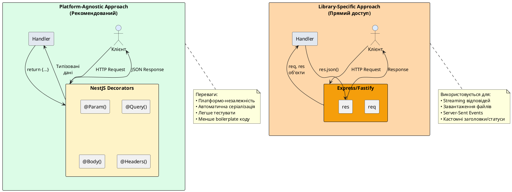

# Об'єкти Request та Response

::card-group

::card{title="🎯 Мета лекції" icon="i-lucide-target"}

- Зрозуміти різницю між library-specific підходом та абстракціями NestJS
- Опанувати використання декораторів @Req та @Res для прямого доступу до Express/Fastify
- Вивчити структуру об'єкта Request та його властивості (url, method, headers, body)
- Навчитися використовувати методи об'єкта Response (status, send, json, redirect)
- Засвоїти випадки, коли прямий доступ до Request/Response є необхідним
- Зрозуміти проблеми використання @Res без параметра passthrough
- Практикувати гібридний підхід для балансу між контролем та зручністю
- Навчитися віддавати перевагу специфічним декораторам NestJS

::

::card{title="🔑 Ключові терміни" icon="i-lucide-key"}

- **Request Object** (*об'єкт запиту*): об'єкт Express/Fastify, що містить усю інформацію про HTTP-запит
- **Response Object** (*об'єкт відповіді*): об'єкт Express/Fastify для ручного керування HTTP-відповіддю
- **Library-Specific Approach** (*платформо-залежний підхід*): використання API конкретної бібліотеки (Express/Fastify)
- **Platform-Agnostic** (*платформо-незалежний*): код, що не залежить від конкретної HTTP-бібліотеки
- **Passthrough Mode** (*режим прозорості*): параметр @Res, що дозволяє NestJS керувати відповіддю
- **Serialization** (*серіалізація*): автоматичне перетворення об'єктів JavaScript у JSON

::

::


## Library-Specific vs Platform-Agnostic підходи

NestJS побудований на принципі **абстракції** — він надає уніфікований API поверх різних HTTP-платформ (Express, Fastify) через систему декораторів. Це дозволяє писати код, який не залежить від конкретної реалізації HTTP-сервера, що полегшує міграцію та тестування.

Проте іноді розробникам потрібен **прямий доступ** до низькорівневих об'єктів Request та Response базової платформи для виконання специфічних операцій, недоступних через стандартні декоратори NestJS. Це створює дилему між зручністю абстракції та гнучкістю прямого доступу.

### Два підходи до роботи з HTTP

::plant-uml{alt="Два підходи до обробки HTTP у NestJS"}



::

**Platform-Agnostic підхід (декоратори NestJS):**
```typescript
@Get(':id')
getUser(@Param('id') id: string, @Headers('authorization') auth: string) {
  // ✅ Типізовані параметри
  // ✅ Працює з Express та Fastify
  // ✅ Автоматична JSON-серіалізація
  return this.usersService.findById(id);
}
```

**Library-Specific підхід (прямий доступ):**
```typescript
@Get(':id')
getUser(@Req() req: Request, @Res() res: Response) {
  // ⚠️ Прив'язка до Express
  // ⚠️ Ручна серіалізація
  const id = req.params.id;
  const user = this.usersService.findById(id);
  res.json(user);
}
```

::note
NestJS за замовчуванням використовує **Express** як HTTP-платформу, проте підтримує **Fastify** як альтернативу з кращою продуктивністю. Використання декораторів NestJS дозволяє писати код, який працює з обома платформами без змін.
::

### Архітектурна філософія NestJS

NestJS слідує принципу **інкапсуляції** деталей реалізації. Замість того, щоб працювати безпосередньо з `req.params.id`, `req.body`, `req.headers`, фреймворк надає **спеціалізовані декоратори** для кожного аспекту HTTP-запиту:

```typescript
// ❌ Низькорівневий підхід (неявні залежності)
@Post()
create(@Req() req: Request) {
  const data = req.body;
  const auth = req.headers.authorization;
  const userId = req.user?.id;  // Звідки це поле?
  // ...
}

// ✅ Високорівневий підхід (явні залежності)
@Post()
create(
  @Body() createDto: CreateDto,
  @Headers('authorization') auth: string,
  @CurrentUser() user: User,  // Кастомний декоратор
) {
  // Всі залежності явні та типізовані
}
```

Переваги високорівневого підходу:
- **Явність:** Залежності метода видно з сигнатури
- **Типізація:** TypeScript перевіряє типи на етапі компіляції
- **Тестування:** Легко створити mock-об'єкти для параметрів
- **Платформо-незалежність:** Код працює з Express та Fastify

Проте іноді прямий доступ до Request/Response є **необхідним** для операцій, недоступних через декоратори.

## Декоратор @Req: доступ до об'єкта Request

Декоратор `@Req()` надає прямий доступ до об'єкта запиту базової платформи (Express `Request` або Fastify `FastifyRequest`).

### Базове використання

```typescript
import { Controller, Get, Req } from '@nestjs/common';
import { Request } from 'express';  // Або FastifyRequest з 'fastify'

@Controller('debug')
export class DebugController {
  @Get('request-info')
  inspectRequest(@Req() req: Request) {
    return {
      url: req.url,
      method: req.method,
      baseUrl: req.baseUrl,
      originalUrl: req.originalUrl,
      hostname: req.hostname,
      ip: req.ip,
      protocol: req.protocol,
      path: req.path,
      query: req.query,
      params: req.params,
      body: req.body,
      cookies: req.cookies,
      signedCookies: req.signedCookies,
    };
  }
}
```

### Властивості об'єкта Request

Об'єкт `Request` містить вичерпну інформацію про HTTP-запит:

**Інформація про маршрут:**
```typescript
@Get('example/:id')
handler(@Req() req: Request) {
  console.log(req.url);          // /example/123?page=1
  console.log(req.baseUrl);      // /api (якщо контролер на /api)
  console.log(req.originalUrl);  // /api/example/123?page=1
  console.log(req.path);         // /example/123
  console.log(req.route.path);   // /example/:id
}
```

**Параметри та дані:**
```typescript
handler(@Req() req: Request) {
  console.log(req.params);   // { id: '123' }
  console.log(req.query);    // { page: '1', limit: '10' }
  console.log(req.body);     // { name: 'Alice', email: '...' }
}
```

**Заголовки:**
```typescript
handler(@Req() req: Request) {
  console.log(req.headers);  // Всі заголовки
  console.log(req.get('Content-Type'));  // application/json
  console.log(req.get('Authorization')); // Bearer token...
}
```

**Інформація про клієнта:**
```typescript
handler(@Req() req: Request) {
  console.log(req.ip);        // IP-адреса клієнта (127.0.0.1)
  console.log(req.ips);       // Масив IP при проксі [client, proxy1, proxy2]
  console.log(req.hostname);  // localhost або api.example.com
  console.log(req.protocol);  // http або https
  console.log(req.secure);    // true якщо HTTPS
  console.log(req.xhr);       // true якщо AJAX-запит
}
```

**Cookies:**
```typescript
handler(@Req() req: Request) {
  console.log(req.cookies);        // { sessionId: 'abc123' }
  console.log(req.signedCookies);  // Підписані cookies
}
```

### Коли використовувати @Req

Прямий доступ до `Request` виправданий у рідкісних випадках:

**1. Отримання IP-адреси клієнта:**
```typescript
@Post('track')
trackEvent(@Req() req: Request, @Body() event: any) {
  await this.analyticsService.log({
    ...event,
    clientIp: req.ip,
    userAgent: req.get('User-Agent'),
  });
  return { success: true };
}
```

**2. Робота з cookies (коли @Cookies() недостатньо):**
```typescript
@Get('session')
checkSession(@Req() req: Request) {
  const sessionId = req.cookies['sessionId'];
  const isSecure = req.signedCookies['secure'];
  
  return {
    hasSession: !!sessionId,
    secure: isSecure,
  };
}
```

**3. Інспекція повної структури запиту для дебагу:**
```typescript
@Get('debug')
debugRequest(@Req() req: Request) {
  return {
    method: req.method,
    url: req.originalUrl,
    headers: req.headers,
    query: req.query,
    params: req.params,
    body: req.body,
  };
}
```

::warning
**Уникайте @Req для витягування даних, доступних через спеціалізовані декоратори:**

```typescript
// ❌ Погано: використання @Req для параметрів
@Get(':id')
handler(@Req() req: Request) {
  const id = req.params.id;      // Є @Param('id')
  const query = req.query.page;  // Є @Query('page')
  const body = req.body;         // Є @Body()
}

// ✅ Добре: спеціалізовані декоратори
@Get(':id')
handler(
  @Param('id') id: string,
  @Query('page') page: string,
  @Body() body: any,
) {
  // Типізовано, явно, тестується легше
}
```
::

### Розширення об'єкта Request

Express дозволяє додавати кастомні властивості до `Request` через middleware. NestJS підтримує це через типізацію:

```typescript
// types/express.d.ts — розширення типів Express
import { User } from '../entities/user.entity';

declare global {
  namespace Express {
    interface Request {
      user?: User;  // Додано authentication middleware
      requestId?: string;  // Додано request-id middleware
    }
  }
}
```

Використання:

```typescript
@Get('profile')
getProfile(@Req() req: Request) {
  // TypeScript знає про req.user
  if (!req.user) {
    throw new UnauthorizedException();
  }
  
  return {
    userId: req.user.id,
    requestId: req.requestId,
  };
}
```

::tip
Замість прямого доступу до `req.user`, створіть **кастомний декоратор**:

```typescript
// decorators/current-user.decorator.ts
import { createParamDecorator, ExecutionContext } from '@nestjs/common';

export const CurrentUser = createParamDecorator(
  (data: unknown, ctx: ExecutionContext) => {
    const request = ctx.switchToHttp().getRequest();
    return request.user;
  },
);
```

Використання:
```typescript
@Get('profile')
getProfile(@CurrentUser() user: User) {
  // ✅ Чисто, типізовано, перевикористовується
  return user;
}
```
::


## Декоратор @Res: доступ до об'єкта Response

Декоратор `@Res()` надає прямий доступ до об'єкта відповіді базової платформи (Express `Response` або Fastify `FastifyReply`). Проте його використання має **критичні наслідки** для поведінки NestJS.

### Проблема: втрата автоматичної серіалізації

Коли ви використовуєте `@Res()` **без додаткових параметрів**, NestJS передає **повний контроль** над відповіддю Express/Fastify, відключаючи свою автоматичну обробку. Це означає:

- ❌ Значення, повернуте з методу, **ігнорується**
- ❌ Автоматична JSON-серіалізація **не працює**
- ❌ Interceptors та Guards **можуть не спрацювати коректно**
- ⚠️ Ви **зобов'язані** вручну викликати `res.send()`, `res.json()` або `res.end()`

::code-group

```typescript [❌ Некоректне використання @Res]
@Get('user')
getUser(@Res() res: Response) {
  const user = { id: 1, name: 'Alice' };
  
  // ❌ ПОМИЛКА: return ігнорується, клієнт нічого не отримає!
  return user;
}
// Клієнт отримає порожню відповідь або timeout
```

```typescript [✅ Правильне використання @Res]
@Get('user')
getUser(@Res() res: Response) {
  const user = { id: 1, name: 'Alice' };
  
  // ✅ ОБОВ'ЯЗКОВО: явна відправка відповіді
  return res.json(user);
}
```

::

### Режим Passthrough: гібридний підхід

NestJS надає параметр `passthrough: true`, що дозволяє **модифікувати** відповідь (заголовки, статус), але зберігає автоматичну серіалізацію:

```typescript
import { Controller, Get, Res } from '@nestjs/common';
import { Response } from 'express';

@Controller('users')
export class UsersController {
  @Get(':id')
  getUser(
    @Param('id') id: string,
    @Res({ passthrough: true }) res: Response,
  ) {
    const user = this.usersService.findById(id);
    
    // Модифікуємо відповідь
    res.header('X-Custom-Header', 'CustomValue');
    res.status(200);
    
    // ✅ NestJS автоматично серіалізує user у JSON
    return user;
  }
}
```

**Порівняння режимів:**

| Аспект | Без @Res | @Res() | @Res({ passthrough: true }) |
|--------|----------|--------|----------------------------|
| **Автоматична серіалізація** | ✅ Так | ❌ Ні | ✅ Так |
| **return працює** | ✅ Так | ❌ Ні | ✅ Так |
| **Модифікація заголовків** | ❌ Ні | ✅ Так | ✅ Так |
| **Модифікація статусу** | ❌ Обмежено | ✅ Так | ✅ Так |
| **Ручний виклик res.send()** | ❌ Не потрібен | ✅ Обов'язковий | ❌ Не потрібен |
| **Interceptors працюють** | ✅ Так | ⚠️ Обмежено | ✅ Так |

::tip
**Рекомендація:** Завжди використовуйте `@Res({ passthrough: true })`, якщо вам потрібен доступ до об'єкта Response, але ви хочете зберегти автоматичну обробку NestJS. Використовуйте `@Res()` без passthrough лише для специфічних випадків (streaming, SSE).
::

### Методи об'єкта Response

Об'єкт `Response` надає API для ручного керування HTTP-відповіддю:

**Встановлення статусу:**
```typescript
@Get('example')
handler(@Res() res: Response) {
  res.status(200);           // OK
  res.status(201);           // Created
  res.status(404);           // Not Found
  res.sendStatus(204);       // No Content (відправляє порожню відповідь)
}
```

**Відправка відповіді:**
```typescript
@Get('example')
handler(@Res() res: Response) {
  // JSON-відповідь
  res.json({ message: 'Success', data: [] });
  
  // Текстова відповідь
  res.send('Plain text response');
  
  // HTML-відповідь
  res.send('<h1>Hello, World!</h1>');
  
  // Завершення відповіді без тіла
  res.end();
}
```

**Робота з заголовками:**
```typescript
@Get('example')
handler(@Res() res: Response) {
  // Встановлення одного заголовка
  res.header('X-Custom-Header', 'Value');
  res.set('X-Another-Header', 'AnotherValue');
  
  // Встановлення кількох заголовків
  res.set({
    'X-Header-1': 'Value1',
    'X-Header-2': 'Value2',
  });
  
  // Видалення заголовка
  res.removeHeader('X-Unwanted-Header');
  
  // Перевірка наявності заголовка
  if (res.hasHeader('Content-Type')) {
    // ...
  }
}
```

**Перенаправлення:**
```typescript
@Get('old-path')
redirect(@Res() res: Response) {
  // 302 Found (тимчасове перенаправлення)
  res.redirect('/new-path');
  
  // 301 Moved Permanently (постійне перенаправлення)
  res.redirect(301, '/new-path');
  
  // Повний URL
  res.redirect('https://example.com/page');
}
```

**Cookies:**
```typescript
@Post('login')
login(@Res() res: Response) {
  // Встановлення cookie
  res.cookie('sessionId', 'abc123', {
    httpOnly: true,    // Недоступне через JavaScript
    secure: true,      // Лише HTTPS
    maxAge: 86400000,  // 1 день у мілісекундах
    sameSite: 'strict',
  });
  
  // Видалення cookie
  res.clearCookie('sessionId');
  
  return res.json({ message: 'Logged in' });
}
```

**Завантаження файлів:**
```typescript
@Get('download')
downloadFile(@Res() res: Response) {
  const filePath = path.join(__dirname, '..', 'files', 'report.pdf');
  
  // Відправка файлу з автоматичним визначенням Content-Type
  res.sendFile(filePath);
  
  // Або з явним іменем файлу для завантаження
  res.download(filePath, 'monthly-report.pdf');
}
```

## Коли використовувати @Res: legitim use cases

Прямий доступ до `Response` виправданий у наступних випадках:

### 1. Streaming великих файлів або даних

Для відправки великих файлів без завантаження їх повністю у пам'ять:

```typescript
import { Controller, Get, Res, Param, StreamableFile } from '@nestjs/common';
import { createReadStream } from 'fs';
import { Response } from 'express';
import { join } from 'path';

@Controller('files')
export class FilesController {
  @Get('stream/:filename')
  streamFile(@Param('filename') filename: string, @Res() res: Response) {
    const filePath = join(__dirname, '..', 'uploads', filename);
    const fileStream = createReadStream(filePath);

    // Встановлення заголовків для streaming
    res.set({
      'Content-Type': 'application/octet-stream',
      'Content-Disposition': `attachment; filename="${filename}"`,
    });

    // Pipe stream безпосередньо у відповідь
    fileStream.pipe(res);
  }
}
```

::note
NestJS 8+ надає клас `StreamableFile` для спрощення streaming без прямого доступу до `@Res()`:

```typescript
@Get('stream/:filename')
streamFile(@Param('filename') filename: string): StreamableFile {
  const filePath = join(__dirname, '..', 'uploads', filename);
  const file = createReadStream(filePath);
  
  return new StreamableFile(file, {
    type: 'application/octet-stream',
    disposition: `attachment; filename="${filename}"`,
  });
}
```
::

### 2. Server-Sent Events (SSE)

Для real-time оновлень через Server-Sent Events:

```typescript
import { Controller, Sse, Res } from '@nestjs/common';
import { Response } from 'express';
import { interval } from 'rxjs';
import { map } from 'rxjs/operators';

@Controller('events')
export class EventsController {
  @Get('sse')
  serverSentEvents(@Res() res: Response) {
    res.set({
      'Content-Type': 'text/event-stream',
      'Cache-Control': 'no-cache',
      'Connection': 'keep-alive',
    });

    // Відправка події кожну секунду
    const intervalId = setInterval(() => {
      const data = JSON.stringify({ time: new Date(), message: 'Update' });
      res.write(`data: ${data}\n\n`);
    }, 1000);

    // Очищення при закритті з'єднання
    res.on('close', () => {
      clearInterval(intervalId);
      res.end();
    });
  }
}
```

::tip
NestJS надає декоратор `@Sse()` для спрощення роботи з Server-Sent Events без прямого доступу до `@Res()`:

```typescript
@Sse('sse')
serverSentEvents(): Observable<MessageEvent> {
  return interval(1000).pipe(
    map((_) => ({
      data: { time: new Date(), message: 'Update' },
    })),
  );
}
```
::

### 3. Кастомні формати відповіді (XML, CSV, Plain Text)

Для відправки даних у нестандартних форматах:

```typescript
@Get('export.csv')
exportCsv(@Res() res: Response) {
  const users = this.usersService.findAll();
  
  // Формування CSV
  const csv = [
    'ID,Name,Email',
    ...users.map(u => `${u.id},${u.name},${u.email}`),
  ].join('\n');

  res.set({
    'Content-Type': 'text/csv',
    'Content-Disposition': 'attachment; filename="users.csv"',
  });

  res.send(csv);
}
```

```typescript
@Get('sitemap.xml')
getSitemap(@Res() res: Response) {
  const xml = `<?xml version="1.0" encoding="UTF-8"?>
<urlset xmlns="http://www.sitemaps.org/schemas/sitemap/0.9">
  <url>
    <loc>https://example.com/page1</loc>
    <lastmod>2026-09-01</lastmod>
  </url>
</urlset>`;

  res.set('Content-Type', 'application/xml');
  res.send(xml);
}
```

### 4. Прогресивне завантаження (Progressive Response)

Для відправки частин відповіді по мірі їх готовності:

```typescript
@Get('progressive')
async progressiveResponse(@Res() res: Response) {
  res.set({
    'Content-Type': 'text/plain',
    'Transfer-Encoding': 'chunked',
  });

  // Відправка частин відповіді
  res.write('Chunk 1: Processing...\n');
  await this.sleep(1000);

  res.write('Chunk 2: Loading data...\n');
  await this.sleep(1000);

  res.write('Chunk 3: Done!\n');
  res.end();
}

private sleep(ms: number): Promise<void> {
  return new Promise(resolve => setTimeout(resolve, ms));
}
```

### 5. Дуже специфічний контроль над відповіддю

Рідкісні випадки, коли потрібен абсолютний контроль над кожним байтом відповіді:

```typescript
@Get('raw-binary')
rawBinaryResponse(@Res() res: Response) {
  // Відправка сирих бінарних даних
  const buffer = Buffer.from([0x48, 0x65, 0x6c, 0x6c, 0x6f]); // "Hello"
  
  res.set({
    'Content-Type': 'application/octet-stream',
    'Content-Length': buffer.length.toString(),
  });
  
  res.send(buffer);
}
```

::warning
**Уникайте @Res для звичайних JSON-відповідей!** Це антипатерн, що ускладнює код без переваг:

```typescript
// ❌ Погано: надмірне ускладнення
@Get('users')
getUsers(@Res() res: Response) {
  const users = this.usersService.findAll();
  return res.status(200).json(users);
}

// ✅ Добре: простий, чистий код
@Get('users')
getUsers() {
  return this.usersService.findAll();
}
```
::

## Гібридний підхід: passthrough mode у практиці

Режим `passthrough: true` дозволяє отримати найкраще з обох світів — контроль над заголовками/статусом та автоматичну серіалізацію.

### Приклад 1: Додавання кастомних заголовків

```typescript
@Get('articles/:id')
async getArticle(
  @Param('id') id: string,
  @Res({ passthrough: true }) res: Response,
) {
  const article = await this.articlesService.findById(id);

  if (!article) {
    throw new NotFoundException(`Article ${id} not found`);
  }

  // Додавання метаданих у заголовки
  res.set({
    'X-Article-Author': article.authorId,
    'X-Article-Views': article.viewCount.toString(),
    'X-Last-Modified': article.updatedAt.toISOString(),
    'Cache-Control': article.published ? 'public, max-age=3600' : 'private, no-cache',
  });

  // ✅ NestJS автоматично серіалізує article у JSON
  return article;
}
```

### Приклад 2: Динамічний статус код на основі бізнес-логіки

```typescript
@Post('orders')
async createOrder(
  @Body() createOrderDto: CreateOrderDto,
  @Res({ passthrough: true }) res: Response,
) {
  const result = await this.ordersService.create(createOrderDto);

  // Встановлення статусу на основі результату
  if (result.requiresApproval) {
    res.status(202); // 202 Accepted — обробляється асинхронно
  } else {
    res.status(201); // 201 Created — створено негайно
  }

  // Додавання Location заголовка
  res.header('Location', `/orders/${result.id}`);

  return result;
}
```

### Приклад 3: Rate Limiting headers

```typescript
@Get('data')
async getData(
  @Headers('x-api-key') apiKey: string,
  @Res({ passthrough: true }) res: Response,
) {
  const rateLimitInfo = await this.rateLimitService.checkLimit(apiKey);

  // Інформування клієнта про ліміти
  res.set({
    'X-RateLimit-Limit': rateLimitInfo.limit.toString(),
    'X-RateLimit-Remaining': rateLimitInfo.remaining.toString(),
    'X-RateLimit-Reset': rateLimitInfo.resetTime.toString(),
  });

  if (rateLimitInfo.remaining <= 0) {
    res.status(429); // Too Many Requests
    return {
      error: 'Rate limit exceeded',
      retryAfter: Math.ceil((rateLimitInfo.resetTime - Date.now()) / 1000),
    };
  }

  return this.dataService.getData();
}
```

### Приклад 4: ETag для умовного кешування

```typescript
@Get('resources/:id')
async getResource(
  @Param('id') id: string,
  @Headers('if-none-match') ifNoneMatch: string,
  @Res({ passthrough: true }) res: Response,
) {
  const resource = await this.resourcesService.findById(id);

  if (!resource) {
    throw new NotFoundException();
  }

  // Генерація ETag на основі версії ресурсу
  const etag = `"${resource.version}"`;

  // Клієнт має актуальну версію?
  if (ifNoneMatch === etag) {
    res.status(304); // Not Modified
    res.header('ETag', etag);
    return; // Порожнє тіло
  }

  // Встановлення ETag для кешування
  res.header('ETag', etag);
  res.header('Cache-Control', 'private, must-revalidate');

  return resource;
}
```


## Best Practices: коли НЕ використовувати @Req та @Res

Прямий доступ до Request/Response є **виключенням**, а не правилом. NestJS надає багатий набір декораторів, що покривають 95% типових сценаріїв.

### Антипатерни та їх рішення

::code-group

```typescript [❌ Антипатерн: витягування параметрів]
@Get(':id')
getUser(@Req() req: Request) {
  const id = req.params.id;
  const page = req.query.page;
  const auth = req.headers.authorization;
  
  return this.usersService.findById(id);
}
```

```typescript [✅ Правильно: спеціалізовані декоратори]
@Get(':id')
getUser(
  @Param('id') id: string,
  @Query('page') page: string,
  @Headers('authorization') auth: string,
) {
  return this.usersService.findById(id);
}
```

::

::code-group

```typescript [❌ Антипатерн: ручна JSON-серіалізація]
@Get('users')
getUsers(@Res() res: Response) {
  const users = this.usersService.findAll();
  return res.status(200).json(users);
}
```

```typescript [✅ Правильно: автоматична серіалізація]
@Get('users')
getUsers() {
  // NestJS автоматично серіалізує у JSON
  // та встановлює статус 200
  return this.usersService.findAll();
}
```

::

::code-group

```typescript [❌ Антипатерн: встановлення статусу через @Res]
@Post('users')
createUser(@Body() dto: CreateUserDto, @Res() res: Response) {
  const user = this.usersService.create(dto);
  return res.status(201).json(user);
}
```

```typescript [✅ Правильно: декоратор @HttpCode]
@Post('users')
@HttpCode(201)  // Або залиште за замовчуванням (POST → 201)
createUser(@Body() dto: CreateUserDto) {
  return this.usersService.create(dto);
}
```

::

::code-group

```typescript [❌ Антипатерн: перенаправлення через @Res]
@Get('old-path')
redirect(@Res() res: Response) {
  return res.redirect(301, '/new-path');
}
```

```typescript [✅ Правильно: декоратор @Redirect]
@Get('old-path')
@Redirect('/new-path', 301)
oldPath() {
  // NestJS автоматично виконує перенаправлення
}
```

::

### Переваги декораторів NestJS над прямим доступом

**1. Тестування:**
```typescript
// ❌ Складно тестувати з @Res
describe('UsersController', () => {
  it('should return users', () => {
    const mockRes = {
      status: jest.fn().mockReturnThis(),
      json: jest.fn(),
    };
    controller.getUsers(mockRes as any);
    expect(mockRes.status).toHaveBeenCalledWith(200);
    expect(mockRes.json).toHaveBeenCalled();
  });
});

// ✅ Легко тестувати без @Res
describe('UsersController', () => {
  it('should return users', async () => {
    const result = await controller.getUsers();
    expect(result).toEqual(expectedUsers);
  });
});
```

**2. Платформо-незалежність:**
```typescript
// ❌ Прив'язка до Express
@Get('users')
getUsers(@Res() res: ExpressResponse) {
  // Код працює лише з Express, не працює з Fastify
  res.json(users);
}

// ✅ Працює з Express та Fastify
@Get('users')
getUsers() {
  return users;
}
```

**3. Interceptors та Guards:**
```typescript
// ❌ Interceptors можуть не спрацювати коректно з @Res
@UseInterceptors(LoggingInterceptor)
@Get('users')
getUsers(@Res() res: Response) {
  return res.json(users); // Interceptor може не побачити відповідь
}

// ✅ Interceptors працюють коректно
@UseInterceptors(LoggingInterceptor)
@Get('users')
getUsers() {
  return users; // Interceptor бачить та може модифікувати відповідь
}
```

**4. Swagger/OpenAPI документація:**
```typescript
// ❌ Swagger не розуміє структуру відповіді
@Get('users')
getUsers(@Res() res: Response) {
  return res.json(users); // Swagger не знає тип відповіді
}

// ✅ Swagger автоматично документує
@Get('users')
@ApiResponse({ status: 200, type: [UserDto] })
getUsers(): UserDto[] {
  return users; // Swagger знає структуру відповіді
}
```

## Таблиця вибору підходу

Використовуйте цю таблицю для прийняття рішення про необхідність `@Req` або `@Res`:

| Сценарій | Підхід | Приклад |
|----------|--------|---------|
| **Витягування параметрів URL** | `@Param()` | `@Param('id') id: string` |
| **Витягування query-параметрів** | `@Query()` | `@Query('page') page: string` |
| **Витягування тіла запиту** | `@Body()` | `@Body() dto: CreateDto` |
| **Витягування заголовків** | `@Headers()` | `@Headers('authorization') auth: string` |
| **Встановлення статусу** | `@HttpCode()` | `@HttpCode(201)` |
| **Встановлення заголовків** | `@Header()` або `@Res({ passthrough })` | `@Header('X-Version', '2.0')` |
| **Перенаправлення** | `@Redirect()` | `@Redirect('/new', 301)` |
| **JSON-відповідь** | `return object` | `return { data: [] }` |
| **Streaming файлів** | `StreamableFile` або `@Res()` | `return new StreamableFile(stream)` |
| **Server-Sent Events** | `@Sse()` або `@Res()` | `@Sse() sse(): Observable` |
| **Кастомні формати (XML, CSV)** | `@Res()` | `res.send(csvData)` |
| **Прогресивні відповіді** | `@Res()` | `res.write('chunk')` |
| **IP-адреса клієнта** | `@Req()` або `@Ip()` | `@Ip() ip: string` |
| **Cookies (читання)** | `@Cookies()` | `@Cookies('session') session: string` |
| **Cookies (встановлення)** | `@Res({ passthrough })` | `res.cookie('id', 'abc')` |
| **ETag / умовне кешування** | `@Res({ passthrough })` | `res.header('ETag', etag)` |
| **Rate Limiting headers** | `@Res({ passthrough })` | `res.set({ 'X-RateLimit-*': ... })` |

::tip
**Правило 95/5:** У 95% випадків використовуйте декоратори NestJS. У 5% випадків (streaming, SSE, нестандартні формати) використовуйте `@Res()` або `@Res({ passthrough: true })`.
::

## Створення кастомних декораторів

Замість використання `@Req()` у кількох місцях, створіть **кастомний декоратор** для перевикористання логіки витягування даних:

### Приклад 1: Витягування користувача з req.user

```typescript
// decorators/current-user.decorator.ts
import { createParamDecorator, ExecutionContext } from '@nestjs/common';

export const CurrentUser = createParamDecorator(
  (data: unknown, ctx: ExecutionContext) => {
    const request = ctx.switchToHttp().getRequest();
    return request.user;
  },
);
```

Використання:

```typescript
@Get('profile')
getProfile(@CurrentUser() user: User) {
  return user;
}

@Post('articles')
createArticle(
  @CurrentUser() user: User,
  @Body() dto: CreateArticleDto,
) {
  return this.articlesService.create(dto, user.id);
}
```

### Приклад 2: Витягування IP-адреси

```typescript
// decorators/client-ip.decorator.ts
import { createParamDecorator, ExecutionContext } from '@nestjs/common';

export const ClientIp = createParamDecorator(
  (data: unknown, ctx: ExecutionContext) => {
    const request = ctx.switchToHttp().getRequest();
    return request.ip || request.connection.remoteAddress;
  },
);
```

Використання:

```typescript
@Post('track')
trackEvent(
  @ClientIp() ip: string,
  @Body() event: any,
) {
  return this.analyticsService.log({ ...event, ip });
}
```

### Приклад 3: Витягування кількох значень

```typescript
// decorators/request-info.decorator.ts
import { createParamDecorator, ExecutionContext } from '@nestjs/common';

export interface RequestInfo {
  ip: string;
  userAgent: string;
  method: string;
  url: string;
}

export const ReqInfo = createParamDecorator(
  (data: unknown, ctx: ExecutionContext): RequestInfo => {
    const request = ctx.switchToHttp().getRequest();
    return {
      ip: request.ip,
      userAgent: request.get('user-agent') || 'unknown',
      method: request.method,
      url: request.originalUrl,
    };
  },
);
```

Використання:

```typescript
@Post('log')
logRequest(
  @ReqInfo() info: RequestInfo,
  @Body() data: any,
) {
  console.log('Request from:', info.ip, info.userAgent);
  console.log('Method:', info.method, 'URL:', info.url);
  return { success: true };
}
```

::tip
Кастомні декоратори дозволяють:
- **Інкапсулювати** логіку витягування даних
- **Перевикористовувати** код у різних контролерах
- **Типізувати** дані, що витягуються
- **Тестувати** логіку ізольовано
- **Уникати** дублювання коду з `@Req()`
::

## Перевірка знань

::accordion

::accordion-item{label="❓ Чому використання @Res() без passthrough відключає автоматичну серіалізацію?" icon="i-lucide-help-circle"}

Коли NestJS бачить декоратор `@Res()` без параметра `passthrough: true`, фреймворк інтерпретує це як сигнал: **"розробник хоче повний контроль над відповіддю"**. У цьому режимі NestJS:

1. **Не викликає автоматично `res.json()`** — ви зобов'язані це зробити вручну
2. **Ігнорує значення, повернуте з методу** — `return user` не матиме ефекту
3. **Очікує, що ви викличете `res.send()`, `res.json()` або `res.end()`**

**Технічне пояснення:** NestJS перевіряє наявність `@Res()` у метаданих методу. Якщо цей декоратор присутній без `passthrough`, фреймворк **пропускає** свій стандартний обробник відповіді (ResponseController), який зазвичай серіалізує повернуте значення у JSON.

**Приклад проблеми:**
```typescript
@Get('users')
getUsers(@Res() res: Response) {
  const users = [{ id: 1, name: 'Alice' }];
  return users; // ❌ Ігнорується! Клієнт отримає порожню відповідь
}

// Правильно:
@Get('users')
getUsers(@Res() res: Response) {
  const users = [{ id: 1, name: 'Alice' }];
  return res.json(users); // ✅ Явна відправка
}
```

**Рішення:** Використовуйте `@Res({ passthrough: true })`, щоб модифікувати заголовки/статус, але зберегти автоматичну серіалізацію.

::

::accordion-item{label="❓ У яких випадках НЕ можна уникнути @Res()?" icon="i-lucide-help-circle"}

Існує кілька legitim use cases, де прямий доступ до `Response` є **необхідним**:

**1. Streaming великих файлів або даних:**
```typescript
@Get('video/:id')
streamVideo(@Param('id') id: string, @Res() res: Response) {
  const videoPath = this.getVideoPath(id);
  const stream = createReadStream(videoPath);
  
  res.set({
    'Content-Type': 'video/mp4',
    'Accept-Ranges': 'bytes',
  });
  
  stream.pipe(res); // ✅ Необхідний прямий доступ до res
}
```

**2. Server-Sent Events (SSE) без @Sse():**
```typescript
@Get('live-updates')
liveUpdates(@Res() res: Response) {
  res.set({
    'Content-Type': 'text/event-stream',
    'Cache-Control': 'no-cache',
  });
  
  setInterval(() => {
    res.write(`data: ${JSON.stringify({ time: Date.now() })}\n\n`);
  }, 1000);
}
```

**3. Прогресивне завантаження (chunked transfer):**
```typescript
@Get('process')
async processWithProgress(@Res() res: Response) {
  res.set('Transfer-Encoding', 'chunked');
  
  res.write('Step 1: Starting...\n');
  await this.step1();
  
  res.write('Step 2: Processing...\n');
  await this.step2();
  
  res.end('Step 3: Done!\n');
}
```

**4. Кастомні формати відповіді (XML, binary, plaintext):**
```typescript
@Get('export.xml')
exportXml(@Res() res: Response) {
  const xml = this.generateXml();
  res.set('Content-Type', 'application/xml');
  res.send(xml);
}
```

**Важливо:** У більшості цих випадків NestJS надає альтернативи (`StreamableFile`, `@Sse()`), які слід віддавати перевагу, якщо вони підходять для вашого use case.

::

::accordion-item{label="❓ Як правильно тестувати контролери з @Res({ passthrough: true })?" icon="i-lucide-help-circle"}

При тестуванні контролерів з `@Res({ passthrough: true })` потрібно створити mock-об'єкт Response, який підтримує методи `header()`, `set()`, `status()`:

```typescript
import { Test } from '@nestjs/testing';
import { UsersController } from './users.controller';
import { UsersService } from './users.service';

describe('UsersController', () => {
  let controller: UsersController;
  let service: UsersService;

  beforeEach(async () => {
    const module = await Test.createTestingModule({
      controllers: [UsersController],
      providers: [
        {
          provide: UsersService,
          useValue: {
            findById: jest.fn().mockResolvedValue({ id: '1', name: 'Alice' }),
          },
        },
      ],
    }).compile();

    controller = module.get(UsersController);
    service = module.get(UsersService);
  });

  describe('getUser', () => {
    it('should set custom headers and return user', async () => {
      // Створення mock Response
      const mockResponse = {
        header: jest.fn().mockReturnThis(),
        set: jest.fn().mockReturnThis(),
        status: jest.fn().mockReturnThis(),
      };

      const result = await controller.getUser('1', mockResponse as any);

      // Перевірка виклику методів Response
      expect(mockResponse.set).toHaveBeenCalledWith({
        'X-User-Id': '1',
        'X-Custom': 'Value',
      });

      // Перевірка повернутих даних
      expect(result).toEqual({ id: '1', name: 'Alice' });
      expect(service.findById).toHaveBeenCalledWith('1');
    });
  });
});
```

**Альтернативний підхід — E2E тести:**

Для більш реалістичних тестів використовуйте E2E підхід з `supertest`:

```typescript
import { Test } from '@nestjs/testing';
import { INestApplication } from '@nestjs/common';
import * as request from 'supertest';
import { AppModule } from '../src/app.module';

describe('UsersController (e2e)', () => {
  let app: INestApplication;

  beforeAll(async () => {
    const module = await Test.createTestingModule({
      imports: [AppModule],
    }).compile();

    app = module.createNestApplication();
    await app.init();
  });

  it('/users/1 (GET) should return user with custom headers', () => {
    return request(app.getHttpServer())
      .get('/users/1')
      .expect(200)
      .expect('X-User-Id', '1')
      .expect('X-Custom', 'Value')
      .then(response => {
        expect(response.body).toEqual({
          id: '1',
          name: 'Alice',
        });
      });
  });
});
```

::

::accordion-item{label="❓ Чому NestJS рекомендує уникати @Req та @Res?" icon="i-lucide-help-circle"}

NestJS пропагує **абстракцію** та **композиційний підхід** через декоратори з кількох причин:

**1. Платформо-незалежність:**
```typescript
// ❌ Прив'язка до Express
@Get('users')
getUsers(@Req() req: ExpressRequest) {
  // Код не працюватиме з Fastify
}

// ✅ Працює з будь-якою платформою
@Get('users')
getUsers(@Query('page') page: string) {
  // Працює з Express, Fastify і будь-якою майбутньою платформою
}
```

**2. Тестування:**
Методи з специфічними декораторами легше тестувати:
```typescript
// Легко створити mock для page: string
const result = controller.getUsers('1');

// Складніше створити повний mock для Request
const mockReq = { query: { page: '1' }, ... };
const result = controller.getUsers(mockReq as Request);
```

**3. Явні залежності:**
Сигнатура методу показує, які дані він потребує:
```typescript
@Post('articles')
create(
  @Body() dto: CreateArticleDto,
  @CurrentUser() user: User,
  @ClientIp() ip: string,
) {
  // Одразу зрозуміло, що метод потребує DTO, користувача та IP
}

// vs

@Post('articles')
create(@Req() req: Request) {
  // Невідомо, які властивості req використовуються
}
```

**4. Інкапсуляція:**
Декоратори інкапсулюють логіку витягування даних. Якщо структура `Request` зміниться (наприклад, при міграції на Fastify), потрібно змінити лише декоратор, а не всі методи контролерів.

**5. Swagger документація:**
Декоратори автоматично генерують документацію, `@Req()` — ні.

::

::accordion-item{label="❓ Як створити кастомний декоратор для витягування даних з Request?" icon="i-lucide-help-circle"}

Для створення кастомного декоратора використовуйте функцію `createParamDecorator`:

**Базовий приклад — витягування IP:**

```typescript
// decorators/client-ip.decorator.ts
import { createParamDecorator, ExecutionContext } from '@nestjs/common';

export const ClientIp = createParamDecorator(
  (data: unknown, ctx: ExecutionContext) => {
    const request = ctx.switchToHttp().getRequest();
    return request.ip || request.connection.remoteAddress;
  },
);
```

**Використання:**
```typescript
@Post('track')
trackEvent(@ClientIp() ip: string) {
  console.log('Request from IP:', ip);
}
```

**Декоратор з параметрами — витягування поля з user:**

```typescript
// decorators/user-field.decorator.ts
import { createParamDecorator, ExecutionContext } from '@nestjs/common';

export const UserField = createParamDecorator(
  (field: string, ctx: ExecutionContext) => {
    const request = ctx.switchToHttp().getRequest();
    const user = request.user;
    
    return field ? user?.[field] : user;
  },
);
```

**Використання:**
```typescript
@Get('profile')
getProfile(@UserField('id') userId: string) {
  // Витягує лише user.id
}

@Get('settings')
getSettings(@UserField() user: User) {
  // Витягує весь об'єкт user
}
```

**Декоратор з валідацією:**

```typescript
// decorators/validated-user.decorator.ts
import { createParamDecorator, ExecutionContext, UnauthorizedException } from '@nestjs/common';

export const ValidatedUser = createParamDecorator(
  (data: unknown, ctx: ExecutionContext) => {
    const request = ctx.switchToHttp().getRequest();
    const user = request.user;
    
    if (!user) {
      throw new UnauthorizedException('User not authenticated');
    }
    
    return user;
  },
);
```

**Композиція декораторів:**

```typescript
// decorators/roles.decorator.ts
export const Roles = (...roles: string[]) => SetMetadata('roles', roles);

// guards/roles.guard.ts
@Injectable()
export class RolesGuard implements CanActivate {
  constructor(private reflector: Reflector) {}

  canActivate(context: ExecutionContext): boolean {
    const roles = this.reflector.get<string[]>('roles', context.getHandler());
    const request = context.switchToHttp().getRequest();
    const user = request.user;
    
    return roles.some(role => user.roles?.includes(role));
  }
}

// Використання разом:
@Get('admin')
@Roles('admin')
@UseGuards(RolesGuard)
adminPanel(@ValidatedUser() user: User) {
  return { admin: user.name };
}
```

::

::

## Підсумок

У цій лекції ми розглянули прямий доступ до об'єктів Request та Response — низькорівневий інструмент для специфічних сценаріїв, що виходять за межі стандартних можливостей NestJS.

**Ключові висновки:**

**Два підходи:**
- **Platform-Agnostic** (декоратори NestJS) — рекомендований для 95% випадків
- **Library-Specific** (@Req/@Res) — для специфічних операцій

**Декоратор @Req():**
- Надає доступ до об'єкта Request (Express/Fastify)
- Містить url, method, headers, body, query, params, cookies
- Використовуйте для IP-адреси, cookies, дебагу
- Уникайте для витягування параметрів (є @Param, @Query, @Body)

**Декоратор @Res():**
- Надає доступ до об'єкта Response
- **Без passthrough:** відключає автоматичну серіалізацію, потрібен ручний res.json()
- **З passthrough:** зберігає автоматичну серіалізацію, дозволяє модифікувати заголовки
- Використовуйте для streaming, SSE, кастомних форматів

**Legitim use cases для @Res():**
- Streaming великих файлів
- Server-Sent Events
- Прогресивне завантаження
- Кастомні формати (XML, CSV, binary)
- Динамічні заголовки (ETag, Rate Limiting)

**Best Practices:**
- Віддавайте перевагу декораторам NestJS (@Param, @Query, @Body, @Headers)
- Використовуйте @Res({ passthrough: true }) для модифікації заголовків
- Створюйте кастомні декоратори замість повторного @Req()
- Уникайте @Res() для звичайних JSON-відповідей
- Використовуйте StreamableFile замість прямого streaming

У наступній лекції ми вивчимо **HTTP-статус коди** та декоратор `@HttpCode` для явного контролю над кодами відповідей у RESTful API.
