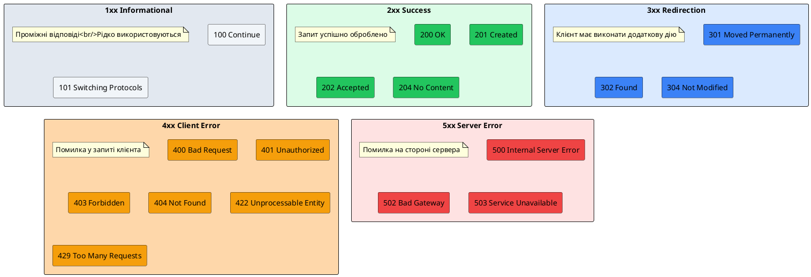
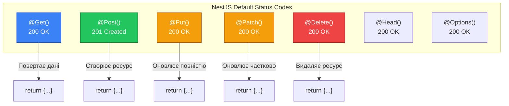

# HTTP-статус коди та декоратор @HttpCode

::card-group

::card{title="🎯 Мета лекції" icon="i-lucide-target"}

- Зрозуміти семантику HTTP-статус кодів та їх класифікацію за діапазонами
- Опанувати стандартні коди за замовчуванням, які NestJS встановлює для різних HTTP-методів
- Навчитися явно керувати статус кодами через декоратор @HttpCode
- Вивчити використання enum-констант HttpStatus для читабельності коду
- Засвоїти динамічне встановлення статусу через об'єкт Response у режимі passthrough
- Практикувати правильний вибір статус кодів для різних сценаріїв REST API
- Зрозуміти відмінність між 200 OK, 201 Created, 204 No Content та їх призначення
- Навчитися обробляти асинхронні операції через 202 Accepted

::

::card{title="🔑 Ключові терміни" icon="i-lucide-key"}

- **HTTP Status Code** (*HTTP-статус код*): тризначне число, що вказує результат обробки запиту
- **2xx Success** (*успішні коди*): запит оброблено успішно (200, 201, 204)
- **3xx Redirection** (*перенаправлення*): клієнт має виконати додаткову дію (301, 302, 304)
- **4xx Client Error** (*помилки клієнта*): запит містить синтаксичні або логічні помилки (400, 401, 404)
- **5xx Server Error** (*помилки сервера*): сервер не зміг обробити коректний запит (500, 502, 503)
- **Idempotency** (*ідемпотентність*): властивість операції давати однаковий результат при повторах
- **Status Line** (*рядок статусу*): перший рядок HTTP-відповіді з кодом та текстовим описом

::

::


## HTTP-статус коди: мова протоколу HTTP

HTTP-статус коди є фундаментальним механізмом комунікації між клієнтом та сервером, що дозволяє серверу точно передати результат обробки запиту без необхідності парсингу тіла відповіді. Кожен HTTP-статус код є тризначним числом, де перша цифра визначає клас відповіді, а наступні дві — конкретний випадок всередині цього класу.

Статус код супроводжується текстовим описом (*reason phrase*), який надає людино-читабельне пояснення коду. Разом вони формують **рядок статусу** (*status line*) — перший рядок HTTP-відповіді:

```
HTTP/1.1 200 OK
HTTP/1.1 201 Created
HTTP/1.1 404 Not Found
HTTP/1.1 500 Internal Server Error
```

Розуміння семантики статус кодів є критично важливим для проєктування професійних RESTful API. Правильний вибір коду дозволяє клієнтським застосункам (браузерам, мобільним додаткам, інтеграціям) **автоматично** реагувати на різні ситуації без аналізу тіла відповіді. Наприклад, код 401 Unauthorized сигналізує про необхідність повторної автентифікації, 429 Too Many Requests — про перевищення ліміту запитів, а 503 Service Unavailable — про тимчасову недоступність сервісу.

### Класифікація статус кодів за діапазонами

HTTP-статус коди поділяються на п'ять класів залежно від першої цифри:

::plant-uml{alt="П'ять класів HTTP-статус кодів"}



::

**1xx Informational (Інформаційні):**  
Проміжні відповіді, що сигналізують про прийняття запиту та продовження обробки. Використовуються рідко у типових REST API.

- **100 Continue** — сервер готовий прийняти тіло запиту (клієнт надіслав заголовки)
- **101 Switching Protocols** — сервер перемикається на інший протокол (наприклад, WebSocket)

**2xx Success (Успішні):**  
Запит успішно отриманий, зрозумілий та оброблений сервером.

- **200 OK** — стандартна успішна відповідь (GET, PUT, PATCH)
- **201 Created** — ресурс успішно створено (POST)
- **202 Accepted** — запит прийнято до обробки, але обробка ще не завершена (асинхронні операції)
- **204 No Content** — успіх, але немає тіла відповіді (DELETE, PATCH без повернення даних)

**3xx Redirection (Перенаправлення):**  
Клієнт має виконати додаткову дію для завершення запиту.

- **301 Moved Permanently** — ресурс остаточно переміщено на новий URL
- **302 Found** — тимчасове перенаправлення
- **304 Not Modified** — ресурс не змінювався з моменту останнього запиту (кешування)

**4xx Client Error (Помилки клієнта):**  
Запит містить синтаксичні помилки або не може бути виконаний через некоректні дані.

- **400 Bad Request** — синтаксична помилка або некоректні дані
- **401 Unauthorized** — необхідна автентифікація
- **403 Forbidden** — доступ заборонено (навіть з автентифікацією)
- **404 Not Found** — ресурс не знайдено
- **409 Conflict** — конфлікт з поточним станом сервера (дублікати, версіонування)
- **422 Unprocessable Entity** — синтаксично коректні, але семантично невалідні дані
- **429 Too Many Requests** — перевищено ліміт запитів (rate limiting)

**5xx Server Error (Помилки сервера):**  
Сервер зустрів помилку під час обробки коректного запиту.

- **500 Internal Server Error** — загальна помилка сервера
- **502 Bad Gateway** — помилка проксі-сервера або балансувальника
- **503 Service Unavailable** — сервіс тимчасово недоступний (технічні роботи, перевантаження)

::note
Статус коди 4xx вказують на помилки, які клієнт **може виправити** (змінити дані, додати автентифікацію, змінити URL). Статус коди 5xx вказують на помилки, які клієнт **не може виправити** — потрібне втручання адміністратора сервера. Ця відмінність критична для автоматичної обробки помилок у клієнтських застосунках.
::

### Семантика найпоширеніших кодів у REST API

Розглянемо детальніше коди, що використовуються у 95% RESTful API:

**200 OK — Універсальний успіх:**  
Найпоширеніший код, що означає успішну обробку запиту. Використовується для GET (отримання), PUT (повне оновлення), PATCH (часткове оновлення).

```
GET /users/123 → 200 OK + тіло з даними користувача
PUT /users/123 → 200 OK + оновлені дані
PATCH /users/123 → 200 OK + оновлені дані
```

**201 Created — Ресурс створено:**  
Використовується виключно для POST-запитів, що створюють новий ресурс. Часто супроводжується заголовком `Location` з URL новоствореного ресурсу.

```
POST /users → 201 Created
Location: /users/456
Body: { "id": 456, "name": "Alice", ... }
```

**204 No Content — Успіх без тіла:**  
Операція виконана успішно, але немає даних для повернення. Типово використовується для DELETE або PATCH, коли клієнту не потрібна відповідь.

```
DELETE /users/123 → 204 No Content
(порожнє тіло відповіді)
```

**400 Bad Request — Некоректний запит:**  
Клієнт надіслав синтаксично або семантично невалідні дані. Має супроводжуватися описом помилок у тілі відповіді.

```
POST /users
Body: { "email": "invalid-email" }
→ 400 Bad Request
Body: { "errors": ["email must be a valid email address"] }
```

**401 Unauthorized — Необхідна автентифікація:**  
Запит вимагає автентифікації, але токен відсутній або невалідний. Має супроводжуватися заголовком `WWW-Authenticate`.

```
GET /profile (без заголовка Authorization)
→ 401 Unauthorized
WWW-Authenticate: Bearer realm="API"
```

**404 Not Found — Ресурс не знайдено:**  
Запитаний ресурс не існує. Не слід плутати з 403 Forbidden (ресурс існує, але доступ заборонено).

```
GET /users/999 (користувача з ID 999 не існує)
→ 404 Not Found
```

**409 Conflict — Конфлікт стану:**  
Запит не може бути виконаний через конфлікт з поточним станом сервера. Найчастіше використовується при спробі створити ресурс з унікальним полем, що вже існує (email, username, slug), або при оптимістичній блокуванні (версіонування даних).

```
POST /users
Body: { "email": "john@example.com" } (email вже існує у БД)
→ 409 Conflict
Body: { "error": "Email already exists", "field": "email" }

PUT /articles/123
Body: { "version": 5, ... } (поточна версія у БД = 6)
→ 409 Conflict
Body: { "error": "Version conflict. Resource was modified by another user." }
```

::note
**Відмінність 409 від 422:** Обидва коди вказують на семантичну помилку, але з різним акцентом:

- **409 Conflict** — дані коректні, але **конфліктують з існуючим станом** (дублікат унікального поля, конфлікт версій, race condition)
- **422 Unprocessable Entity** — дані не відповідають **бізнес-правилам домену** (від'ємна ціна, недостатньо коштів, невалідна дата)

Якщо сумніваєтесь, використовуйте **422** як універсальний код для семантичних помилок. Код **409** резервуйте для очевидних конфліктів стану.
::

**422 Unprocessable Entity — Семантична помилка:**  
Синтаксично коректний запит, але дані не можуть бути оброблені через порушення бізнес-правил. Відрізняється від 409 тим, що помилка не пов'язана з дублікатами або конфліктами стану, а з невідповідністю правилам домену.

```
POST /orders
Body: { "quantity": -5 } (від'ємна кількість неможлива)
→ 422 Unprocessable Entity
Body: { "error": "Quantity must be a positive number" }

POST /accounts/transfer
Body: { "amount": 10000 } (недостатньо коштів)
→ 422 Unprocessable Entity
Body: { "error": "Insufficient funds" }
```

**500 Internal Server Error — Помилка сервера:**  
Неперехоплене виключення або непередбачена помилка на сервері. Має логуватися для аналізу розробниками.

```
GET /users/123 (виникла помилка БД)
→ 500 Internal Server Error
Body: { "error": "Internal Server Error" }
(деталі помилки НЕ повертаються клієнту з міркувань безпеки)
```


## Стандартні статус коди за замовчуванням у NestJS

NestJS автоматично встановлює статус коди для HTTP-відповідей на основі HTTP-методу обробника. Ця поведінка відповідає найкращим практикам REST API та дозволяє розробникам не думати про статус коди у типових сценаріях.

### Коди за замовчуванням для різних HTTP-методів

::mermaid



::

**Таблиця кодів за замовчуванням:**

| HTTP-метод | Декоратор | Код за замовчуванням | Пояснення |
|------------|-----------|---------------------|-----------|
| **GET** | `@Get()` | `200 OK` | Отримання ресурсу або колекції |
| **POST** | `@Post()` | `201 Created` | Створення нового ресурсу |
| **PUT** | `@Put()` | `200 OK` | Повна заміна існуючого ресурсу |
| **PATCH** | `@Patch()` | `200 OK` | Часткове оновлення існуючого ресурсу |
| **DELETE** | `@Delete()` | `200 OK` | Видалення ресурсу |
| **HEAD** | `@Head()` | `200 OK` | Отримання заголовків без тіла |
| **OPTIONS** | `@Options()` | `200 OK` | Інформація про підтримувані методи |

### Приклади поведінки за замовчуванням

**GET-запит — 200 OK:**
```typescript
import { Controller, Get } from '@nestjs/common';

@Controller('users')
export class UsersController {
  @Get()
  findAll() {
    // NestJS автоматично встановлює статус 200 OK
    return [
      { id: 1, name: 'Alice' },
      { id: 2, name: 'Bob' },
    ];
  }

  @Get(':id')
  findOne(@Param('id') id: string) {
    // Також 200 OK
    return { id, name: 'Alice', email: 'alice@example.com' };
  }
}
```

Відповідь сервера:
```
HTTP/1.1 200 OK
Content-Type: application/json
Content-Length: 65

[{"id":1,"name":"Alice"},{"id":2,"name":"Bob"}]
```

**POST-запит — 201 Created:**
```typescript
@Controller('users')
export class UsersController {
  @Post()
  create(@Body() createUserDto: CreateUserDto) {
    const newUser = this.usersService.create(createUserDto);
    
    // NestJS автоматично встановлює статус 201 Created
    return newUser;
  }
}
```

Відповідь сервера:
```
HTTP/1.1 201 Created
Content-Type: application/json
Location: /users/456

{"id":456,"name":"Alice","email":"alice@example.com"}
```

::tip
NestJS встановлює статус **201 Created** для POST-запитів автоматично, відповідаючи семантиці REST. Це єдиний HTTP-метод, для якого код за замовчуванням відрізняється від 200 OK, що підкреслює особливу роль POST як операції створення ресурсу.
::

**PUT/PATCH-запити — 200 OK:**
```typescript
@Controller('users')
export class UsersController {
  @Put(':id')
  update(@Param('id') id: string, @Body() updateUserDto: UpdateUserDto) {
    const updatedUser = this.usersService.update(id, updateUserDto);
    
    // Статус 200 OK за замовчуванням
    return updatedUser;
  }

  @Patch(':id')
  partialUpdate(@Param('id') id: string, @Body() patchDto: Partial<UpdateUserDto>) {
    const updatedUser = this.usersService.partialUpdate(id, patchDto);
    
    // Також 200 OK за замовчуванням
    return updatedUser;
  }
}
```

**DELETE-запит — 200 OK:**
```typescript
@Controller('users')
export class UsersController {
  @Delete(':id')
  remove(@Param('id') id: string) {
    this.usersService.remove(id);
    
    // Статус 200 OK за замовчуванням
    return { message: 'User deleted successfully' };
  }
}
```

::note
Хоча NestJS встановлює **200 OK** для DELETE за замовчуванням, у багатьох REST API практикується використання **204 No Content** для DELETE, що сигналізує про успішне видалення без повернення тіла відповіді. Для цього потрібно явно встановити статус через декоратор `@HttpCode(204)`.
::

### Переваги поведінки за замовчуванням

Автоматичне встановлення статус кодів NestJS має кілька переваг:

**Менше boilerplate коду:**
```typescript
// ❌ Без NestJS: Express (явне встановлення статусу)
app.post('/users', (req, res) => {
  const user = createUser(req.body);
  res.status(201).json(user); // Ручне встановлення 201
});

// ✅ З NestJS: автоматичний 201 для POST
@Post()
create(@Body() dto: CreateUserDto) {
  return this.usersService.create(dto);
  // Статус 201 встановлюється автоматично
}
```

**Відповідність REST-конвенціям:**  
NestJS слідує стандартам REST API, встановлюючи правильні статус коди для кожного HTTP-методу без додаткових зусиль розробника.

**Консистентність кодової бази:**  
Всі обробники у проєкті автоматично повертають правильні статус коди, що зменшує ймовірність помилок та підвищує передбачуваність API.

**Фокус на бізнес-логіці:**  
Розробники можуть зосередитися на бізнес-логіці, не турбуючись про низькорівневі деталі протоколу HTTP.

::warning
Поведінка за замовчуванням покриває **типові** сценарії REST API. У специфічних випадках (асинхронна обробка, кастомні операції, помилки) потрібне явне встановлення статус коду через декоратор `@HttpCode()` або об'єкт `Response`.
::


## Декоратор @HttpCode: явне керування статус кодом

Коли поведінка за замовчуванням не відповідає вашим потребам, NestJS надає декоратор `@HttpCode()` для явного встановлення статус коду відповіді. Цей декоратор застосовується на рівні методу контролера та перевизначає код за замовчуванням.

### Базовий синтаксис

```typescript
import { Controller, Delete, HttpCode } from '@nestjs/common';

@Controller('users')
export class UsersController {
  @Delete(':id')
  @HttpCode(204)  // Явно встановлюємо 204 No Content
  remove(@Param('id') id: string) {
    this.usersService.remove(id);
    // Тіло відповіді можна не повертати (204 означає "немає тіла")
  }
}
```

Відповідь сервера:
```
HTTP/1.1 204 No Content
Content-Length: 0

(порожнє тіло)
```

### Використання з enum HttpStatus

Для покращення читабельності та уникнення магічних чисел NestJS експортує enum `HttpStatus` з усіма стандартними кодами:

```typescript
import { Controller, Post, HttpCode, HttpStatus } from '@nestjs/common';

@Controller('orders')
export class OrdersController {
  @Post()
  @HttpCode(HttpStatus.ACCEPTED) // 202 Accepted
  createOrder(@Body() createOrderDto: CreateOrderDto) {
    // Асинхронна обробка замовлення
    this.ordersService.queueOrder(createOrderDto);
    
    return {
      message: 'Order accepted for processing',
      estimatedTime: '5 minutes',
    };
  }
}
```

**Найпоширеніші константи HttpStatus:**

```typescript
HttpStatus.OK                    // 200
HttpStatus.CREATED               // 201
HttpStatus.ACCEPTED              // 202
HttpStatus.NO_CONTENT            // 204

HttpStatus.MOVED_PERMANENTLY     // 301
HttpStatus.FOUND                 // 302
HttpStatus.NOT_MODIFIED          // 304

HttpStatus.BAD_REQUEST           // 400
HttpStatus.UNAUTHORIZED          // 401
HttpStatus.FORBIDDEN             // 403
HttpStatus.NOT_FOUND             // 404
HttpStatus.UNPROCESSABLE_ENTITY  // 422
HttpStatus.TOO_MANY_REQUESTS     // 429

HttpStatus.INTERNAL_SERVER_ERROR // 500
HttpStatus.BAD_GATEWAY           // 502
HttpStatus.SERVICE_UNAVAILABLE   // 503
```

::tip
Завжди використовуйте `HttpStatus` замість магічних чисел. Це підвищує читабельність коду та зменшує ймовірність помилок:

```typescript
// ❌ Погано: магічне число
@HttpCode(204)

// ✅ Добре: іменована константа
@HttpCode(HttpStatus.NO_CONTENT)
```
::

### Приклад: 204 No Content для DELETE

У REST API операція видалення зазвичай не повертає тіло відповіді, використовуючи статус **204 No Content**:

```typescript
import { Controller, Delete, Param, HttpCode, HttpStatus } from '@nestjs/common';

@Controller('articles')
export class ArticlesController {
  constructor(private readonly articlesService: ArticlesService) {}

  @Delete(':id')
  @HttpCode(HttpStatus.NO_CONTENT)
  async remove(@Param('id') id: string): Promise<void> {
    await this.articlesService.remove(id);
    
    // Немає return — 204 означає порожнє тіло
  }
}
```

::terminal-preview{title="DELETE запит з 204 No Content" :cursor="false"}

<div class="line"><span class="opacity-40">$</span> <strong class="font-bold">curl -X DELETE http://localhost:3000/articles/123 -v</strong></div>
<div class="line"><span class="text-blue-400 font-bold">DELETE /articles/123 HTTP/1.1</span></div>
<div class="line"><span class="opacity-40">Host: localhost:3000</span></div>
<div class="line"></div>
<div class="line"><span class="text-green-400 font-bold">HTTP/1.1 204 No Content</span></div>
<div class="line"><span class="opacity-40">Date: Fri, 04 Sep 2026 14:30:00 GMT</span></div>
<div class="line"><span class="opacity-40">Connection: keep-alive</span></div>
<div class="line"></div>
<div class="line"><span class="opacity-40">(порожнє тіло відповіді)</span></div>

::

::note
Якщо метод повертає `void` або `undefined`, NestJS не надсилає тіло відповіді, що ідеально підходить для статусу 204. Якщо ви випадково повернете дані, вони **не потраплять** у відповідь при статусі 204.
::

### Приклад: 202 Accepted для асинхронної обробки

Коли операція приймається до обробки, але виконується асинхронно (через черги, фонові задачі), використовується статус **202 Accepted**:

```typescript
import { Controller, Post, Body, HttpCode, HttpStatus } from '@nestjs/common';

@Controller('reports')
export class ReportsController {
  constructor(
    private readonly reportsService: ReportsService,
    private readonly queueService: QueueService,
  ) {}

  @Post('generate')
  @HttpCode(HttpStatus.ACCEPTED)
  async generateReport(@Body() reportDto: GenerateReportDto) {
    // Додаємо завдання у чергу для асинхронної обробки
    const jobId = await this.queueService.addJob('generate-report', reportDto);
    
    return {
      message: 'Report generation accepted',
      jobId,
      status: 'pending',
      estimatedCompletion: '10 minutes',
      checkStatusUrl: `/reports/status/${jobId}`,
    };
  }

  @Get('status/:jobId')
  async checkStatus(@Param('jobId') jobId: string) {
    const status = await this.queueService.getJobStatus(jobId);
    
    return {
      jobId,
      status: status.state, // pending, processing, completed, failed
      progress: status.progress,
      result: status.result,
    };
  }
}
```

::terminal-preview{title="Асинхронна обробка з 202 Accepted" :cursor="false"}

<div class="line"><span class="opacity-40">$</span> <strong class="font-bold">curl -X POST http://localhost:3000/reports/generate -H "Content-Type: application/json" \</strong></div>
<div class="line">  -d '{"type":"monthly","year":2026,"month":8}'</div>
<div class="line"></div>
<div class="line"><span class="text-blue-400 font-bold">HTTP/1.1 202 Accepted</span></div>
<div class="line">{</div>
<div class="line">  <span class="text-green-400">"message"</span>: <span class="text-blue-400">"Report generation accepted"</span>,</div>
<div class="line">  <span class="text-green-400">"jobId"</span>: <span class="text-blue-400">"job-abc-123"</span>,</div>
<div class="line">  <span class="text-green-400">"status"</span>: <span class="text-blue-400">"pending"</span>,</div>
<div class="line">  <span class="text-green-400">"estimatedCompletion"</span>: <span class="text-blue-400">"10 minutes"</span>,</div>
<div class="line">  <span class="text-green-400">"checkStatusUrl"</span>: <span class="text-blue-400">"/reports/status/job-abc-123"</span></div>
<div class="line">}</div>
<div class="line"></div>
<div class="line"><span class="opacity-40"># Перевірка статусу через 5 хвилин</span></div>
<div class="line"><span class="opacity-40">$</span> <strong class="font-bold">curl http://localhost:3000/reports/status/job-abc-123</strong></div>
<div class="line"></div>
<div class="line"><span class="text-green-400 font-bold">HTTP/1.1 200 OK</span></div>
<div class="line">{</div>
<div class="line">  <span class="text-green-400">"jobId"</span>: <span class="text-blue-400">"job-abc-123"</span>,</div>
<div class="line">  <span class="text-green-400">"status"</span>: <span class="text-blue-400">"completed"</span>,</div>
<div class="line">  <span class="text-green-400">"progress"</span>: <span class="text-yellow-400">100</span>,</div>
<div class="line">  <span class="text-green-400">"result"</span>: {</div>
<div class="line">    <span class="text-green-400">"fileUrl"</span>: <span class="text-blue-400">"/downloads/reports/monthly-2026-08.pdf"</span></div>
<div class="line">  }</div>
<div class="line">}</div>

::

### Приклад: 200 OK замість 201 для ідемпотентних POST

Іноді POST-запити є **ідемпотентними** (*idempotent*) — повторний запит з тими самими даними не створює новий ресурс, а повертає існуючий. У таких випадках логічніше повертати 200 OK:

```typescript
import { Controller, Post, Body, HttpCode, HttpStatus } from '@nestjs/common';

@Controller('subscriptions')
export class SubscriptionsController {
  constructor(private readonly subscriptionsService: SubscriptionsService) {}

  @Post('subscribe')
  @HttpCode(HttpStatus.OK) // Замість 201 Created
  async subscribe(@Body() subscribeDto: SubscribeDto) {
    // Якщо підписка вже існує, не створюємо нову
    const subscription = await this.subscriptionsService.findOrCreate(subscribeDto);
    
    return {
      message: subscription.isNew ? 'Subscribed successfully' : 'Already subscribed',
      subscription,
      isNew: subscription.isNew,
    };
  }
}
```


## Динамічна зміна статусу через @Res

Декоратор `@HttpCode()` встановлює **статичний** статус код, який застосовується до всіх запитів до даного обробника. Проте іноді потрібно **динамічно** визначити статус на основі результату бізнес-логіки. Для цього використовується об'єкт `Response` у режимі **passthrough**.

### Режим passthrough: гібридний підхід

Як ми вивчали у попередній лекції про об'єкти Request та Response, режим `passthrough: true` дозволяє модифікувати відповідь, зберігаючи автоматичну серіалізацію NestJS:

```typescript
import { Controller, Get, Param, Res, HttpStatus } from '@nestjs/common';
import { Response } from 'express';

@Controller('cache')
export class CacheController {
  constructor(private readonly cacheService: CacheService) {}

  @Get('resource/:id')
  async getResource(
    @Param('id') id: string,
    @Res({ passthrough: true }) res: Response,
  ) {
    const resource = await this.cacheService.findById(id);
    
    if (!resource) {
      // Динамічно встановлюємо 404
      res.status(HttpStatus.NOT_FOUND);
      return { error: 'Resource not found' };
    }
    
    if (!resource.isModified) {
      // Динамічно встановлюємо 304 Not Modified
      res.status(HttpStatus.NOT_MODIFIED);
      return; // Порожнє тіло для 304
    }
    
    // За замовчуванням 200 OK
    return resource;
  }
}
```

### Приклад: Умовне повернення 304 Not Modified

Статус **304 Not Modified** використовується для кешування — якщо ресурс не змінювався з моменту останнього запиту, сервер повертає 304 без тіла, заощаджуючи трафік:

```typescript
import { Controller, Get, Param, Headers, Res, HttpStatus } from '@nestjs/common';
import { Response } from 'express';

@Controller('articles')
export class ArticlesController {
  constructor(private readonly articlesService: ArticlesService) {}

  @Get(':id')
  async findOne(
    @Param('id') id: string,
    @Headers('if-none-match') ifNoneMatch: string,
    @Res({ passthrough: true }) res: Response,
  ) {
    const article = await this.articlesService.findById(id);
    
    if (!article) {
      res.status(HttpStatus.NOT_FOUND);
      return { error: 'Article not found' };
    }

    // Генеруємо ETag на основі версії ресурсу
    const etag = `"${article.version}"`;
    res.header('ETag', etag);

    // Клієнт має актуальну версію?
    if (ifNoneMatch === etag) {
      res.status(HttpStatus.NOT_MODIFIED);
      return; // Порожнє тіло — клієнт використає кешовану версію
    }

    // Ресурс змінився — повертаємо повні дані
    res.header('Cache-Control', 'private, must-revalidate');
    return article;
  }
}
```

::terminal-preview{title="Умовне кешування через ETag" :cursor="false"}

<div class="line"><span class="opacity-40"># Перший запит — отримуємо повні дані</span></div>
<div class="line"><span class="opacity-40">$</span> <strong class="font-bold">curl -v http://localhost:3000/articles/123</strong></div>
<div class="line"></div>
<div class="line"><span class="text-green-400 font-bold">HTTP/1.1 200 OK</span></div>
<div class="line"><span class="text-blue-400">ETag: "v42"</span></div>
<div class="line"><span class="opacity-40">Cache-Control: private, must-revalidate</span></div>
<div class="line">{</div>
<div class="line">  <span class="text-green-400">"id"</span>: <span class="text-yellow-400">123</span>,</div>
<div class="line">  <span class="text-green-400">"title"</span>: <span class="text-blue-400">"Understanding HTTP Caching"</span>,</div>
<div class="line">  <span class="text-green-400">"version"</span>: <span class="text-yellow-400">42</span></div>
<div class="line">}</div>
<div class="line"></div>
<div class="line"><span class="opacity-40"># Повторний запит з ETag — отримуємо 304</span></div>
<div class="line"><span class="opacity-40">$</span> <strong class="font-bold">curl -v http://localhost:3000/articles/123 -H "If-None-Match: \"v42\""</strong></div>
<div class="line"></div>
<div class="line"><span class="text-blue-400 font-bold">HTTP/1.1 304 Not Modified</span></div>
<div class="line"><span class="text-blue-400">ETag: "v42"</span></div>
<div class="line"></div>
<div class="line"><span class="opacity-40">(порожнє тіло — клієнт використовує кешовану версію)</span></div>

::

### Приклад: Асинхронні операції з різними статусами

У складних сценаріях одна й та сама операція може повертати різні статус коди залежно від стану системи:

```typescript
import { Controller, Post, Body, Res, HttpStatus } from '@nestjs/common';
import { Response } from 'express';

@Controller('payments')
export class PaymentsController {
  constructor(
    private readonly paymentsService: PaymentsService,
    private readonly queueService: QueueService,
  ) {}

  @Post('process')
  async processPayment(
    @Body() paymentDto: ProcessPaymentDto,
    @Res({ passthrough: true }) res: Response,
  ) {
    const systemLoad = await this.queueService.getCurrentLoad();

    if (systemLoad > 0.8) {
      // Система перевантажена — приймаємо до асинхронної обробки
      const jobId = await this.queueService.addJob('payment', paymentDto);
      
      res.status(HttpStatus.ACCEPTED); // 202 Accepted
      return {
        message: 'Payment accepted for processing',
        jobId,
        checkStatusUrl: `/payments/status/${jobId}`,
      };
    }

    // Система має ресурси — обробляємо синхронно
    const result = await this.paymentsService.process(paymentDto);

    if (result.requiresConfirmation) {
      // Потрібне підтвердження 3D-Secure
      res.status(HttpStatus.OK); // 200 OK
      return {
        message: 'Confirmation required',
        confirmationUrl: result.confirmationUrl,
      };
    }

    // Платіж успішно виконано
    res.status(HttpStatus.CREATED); // 201 Created
    return {
      message: 'Payment processed successfully',
      transactionId: result.transactionId,
      amount: result.amount,
    };
  }
}
```

::warning
**Уникайте надмірного використання динамічних статусів!** У 90% випадків статичного коду через `@HttpCode()` достатньо. Динамічні статуси виправдані лише у:

- Умовному кешуванні (304 Not Modified)
- Асинхронних операціях з різною швидкістю обробки
- Складних бізнес-процесах з кількома варіантами результату

Для стандартних помилок (404, 400, 401) використовуйте **виключення** (Exceptions), які ми розглянемо у наступних лекціях.
::


## Best Practices: правильний вибір статус кодів

Вибір правильного HTTP-статус коду є мистецтвом балансу між дотриманням стандартів, зручністю для клієнтів та семантичною точністю. Розглянемо найкращі практики для різних сценаріїв REST API.

### Правила вибору статус коду

::steps

### Крок 1. Визначте категорію результату

Спершу визначте, чи операція **успішна** (2xx), чи відбулася **помилка** (4xx/5xx):

- Запит оброблено успішно → 2xx
- Помилка у запиті клієнта → 4xx
- Помилка на сервері → 5xx
- Потрібне перенаправлення → 3xx

### Крок 2. Уточніть тип успіху (для 2xx)

Якщо операція успішна, визначте конкретний код:

- Отримання даних → **200 OK**
- Створення ресурсу → **201 Created**
- Асинхронна обробка → **202 Accepted**
- Успіх без даних → **204 No Content**

### Крок 3. Уточніть тип помилки (для 4xx)

Якщо помилка від клієнта, визначте причину:

- Синтаксична помилка → **400 Bad Request**
- Немає автентифікації → **401 Unauthorized**
- Доступ заборонено → **403 Forbidden**
- Ресурс не знайдено → **404 Not Found**
- Конфлікт даних → **409 Conflict**
- Семантична помилка → **422 Unprocessable Entity**
- Перевищено ліміт → **429 Too Many Requests**

### Крок 4. Додайте деталі у тіло відповіді

Завжди супроводжуйте помилки 4xx/5xx детальним описом у тілі відповіді:

```json
{
  "statusCode": 400,
  "message": "Validation failed",
  "errors": [
    "email must be a valid email address",
    "password must be at least 8 characters long"
  ]
}
```

::

### Матриця вибору статус коду для CRUD-операцій

| Операція | Метод | Успіх | Ресурс не знайдено | Валідація | Конфлікт |
|----------|-------|-------|-------------------|-----------|----------|
| **Список** | GET | 200 OK | 200 OK (порожній масив) | — | — |
| **Деталі** | GET | 200 OK | 404 Not Found | — | — |
| **Створення** | POST | 201 Created | — | 400/422 | 409 Conflict |
| **Повне оновлення** | PUT | 200 OK | 404 Not Found | 400/422 | 409 Conflict |
| **Часткове оновлення** | PATCH | 200 OK | 404 Not Found | 400/422 | — |
| **Видалення** | DELETE | 204 No Content | 404 Not Found* | — | — |

\* Деякі API повертають **204 No Content** навіть якщо ресурс не існує (ідемпотентність DELETE).

### Приклади правильного використання

::code-group

```typescript [GET — Отримання списку]
@Controller('users')
export class UsersController {
  @Get()
  async findAll(@Query() filterDto: FilterUsersDto) {
    const users = await this.usersService.findAll(filterDto);
    
    // ✅ Завжди 200 OK, навіть якщо масив порожній
    return {
      data: users,
      total: users.length,
      page: filterDto.page || 1,
    };
  }
}
```

```typescript [GET — Отримання деталей]
@Controller('users')
export class UsersController {
  @Get(':id')
  async findOne(@Param('id') id: string) {
    const user = await this.usersService.findById(id);
    
    if (!user) {
      // ✅ 404 якщо ресурс не існує
      throw new NotFoundException(`User with ID ${id} not found`);
    }
    
    // ✅ 200 OK для успішного отримання
    return user;
  }
}
```

```typescript [POST — Створення]
@Controller('users')
export class UsersController {
  @Post()
  @HttpCode(HttpStatus.CREATED) // ✅ Явний 201 (або автоматичний)
  async create(@Body() createUserDto: CreateUserDto) {
    try {
      const user = await this.usersService.create(createUserDto);
      
      return user;
    } catch (error) {
      if (error.code === 'DUPLICATE_EMAIL') {
        // ✅ 409 Conflict для дублікату
        throw new ConflictException('Email already exists');
      }
      throw error;
    }
  }
}
```

```typescript [PATCH — Часткове оновлення]
@Controller('users')
export class UsersController {
  @Patch(':id')
  async update(
    @Param('id') id: string,
    @Body() updateUserDto: UpdateUserDto,
  ) {
    const user = await this.usersService.findById(id);
    
    if (!user) {
      // ✅ 404 для неіснуючого ресурсу
      throw new NotFoundException(`User with ID ${id} not found`);
    }
    
    const updated = await this.usersService.update(id, updateUserDto);
    
    // ✅ 200 OK для успішного оновлення
    return updated;
  }
}
```

```typescript [DELETE — Видалення]
@Controller('users')
export class UsersController {
  @Delete(':id')
  @HttpCode(HttpStatus.NO_CONTENT) // ✅ 204 No Content
  async remove(@Param('id') id: string): Promise<void> {
    const user = await this.usersService.findById(id);
    
    if (!user) {
      // ⚠️ Варіант 1: 404 якщо ресурс не існує
      throw new NotFoundException(`User with ID ${id} not found`);
      
      // ⚠️ Варіант 2: 204 навіть якщо не існує (ідемпотентність)
      // return;
    }
    
    await this.usersService.remove(id);
    // Немає return — порожнє тіло для 204
  }
}
```

::

### Типові помилки при виборі статус кодів

::accordion

::accordion-item{label="❌ Використання 200 OK для всіх відповідей" icon="i-lucide-alert-triangle"}

**Проблема:**  
Деякі розробники повертають 200 OK навіть для помилок, передаючи код помилки у тілі відповіді:

```typescript
// ❌ ПОГАНО: помилка з кодом 200
@Get(':id')
async findOne(@Param('id') id: string) {
  const user = await this.usersService.findById(id);
  
  if (!user) {
    return {
      success: false,
      error: 'User not found',
      code: 404,
    };
    // → HTTP 200 OK з помилкою у тілі
  }
  
  return { success: true, data: user };
}
```

**Чому це погано:**  
Клієнти (браузери, бібліотеки) покладаються на HTTP-статус коди для автоматичної обробки помилок. Код 200 OK сигналізує про успіх, тому помилки залишаться непоміченими.

**Правильно:**  
```typescript
// ✅ ДОБРЕ: помилка через виключення з правильним кодом
@Get(':id')
async findOne(@Param('id') id: string) {
  const user = await this.usersService.findById(id);
  
  if (!user) {
    throw new NotFoundException(`User with ID ${id} not found`);
    // → HTTP 404 Not Found
  }
  
  return user;
}
```

::

::accordion-item{label="❌ Плутанина між 401 та 403" icon="i-lucide-alert-triangle"}

**Проблема:**  
Розробники часто плутають коди 401 Unauthorized та 403 Forbidden.

**401 Unauthorized** — клієнт **не автентифікований** (не надав токен або токен невалідний):
```typescript
@Get('profile')
getProfile(@Headers('authorization') auth?: string) {
  if (!auth) {
    // ✅ 401: немає автентифікації
    throw new UnauthorizedException('Authentication required');
  }
  
  const token = auth.replace('Bearer ', '');
  const user = this.authService.validateToken(token);
  
  if (!user) {
    // ✅ 401: невалідний токен
    throw new UnauthorizedException('Invalid token');
  }
  
  return user;
}
```

**403 Forbidden** — клієнт **автентифікований**, але **не має прав** доступу:
```typescript
@Delete('users/:id')
deleteUser(
  @Param('id') id: string,
  @CurrentUser() currentUser: User,
) {
  if (currentUser.role !== 'admin') {
    // ✅ 403: автентифікований, але недостатньо прав
    throw new ForbiddenException('Only admins can delete users');
  }
  
  return this.usersService.remove(id);
}
```

::

::accordion-item{label="❌ Ігнорування 409 Conflict для дублікатів" icon="i-lucide-alert-triangle"}

**Проблема:**  
При спробі створити ресурс з унікальним полем, що вже існує, часто повертають 400 Bad Request замість 409 Conflict.

**Неправильно:**  
```typescript
// ❌ ПОГАНО: 400 для дублікату
@Post()
async create(@Body() dto: CreateUserDto) {
  const existing = await this.usersService.findByEmail(dto.email);
  
  if (existing) {
    throw new BadRequestException('Email already exists');
    // → 400 Bad Request
  }
  
  return this.usersService.create(dto);
}
```

**Правильно:**  
```typescript
// ✅ ДОБРЕ: 409 Conflict для дублікату
@Post()
async create(@Body() dto: CreateUserDto) {
  const existing = await this.usersService.findByEmail(dto.email);
  
  if (existing) {
    throw new ConflictException('Email already exists');
    // → 409 Conflict
  }
  
  return this.usersService.create(dto);
}
```

**Семантика:**  
- **400 Bad Request** — дані синтаксично або семантично некоректні
- **409 Conflict** — дані коректні, але конфліктують з існуючим станом сервера

::

::accordion-item{label="❌ Використання 500 замість 4xx для валідації" icon="i-lucide-alert-triangle"}

**Проблема:**  
Помилки валідації іноді повертаються з кодом 500 Internal Server Error.

**Неправильно:**  
```typescript
// ❌ ПОГАНО: 500 для помилки валідації
@Post()
async create(@Body() dto: CreateUserDto) {
  if (!dto.email || !dto.password) {
    throw new InternalServerErrorException('Missing required fields');
    // → 500 Internal Server Error
  }
  
  return this.usersService.create(dto);
}
```

**Правильно:**  
```typescript
// ✅ ДОБРЕ: 400 для помилки валідації
@Post()
async create(@Body() dto: CreateUserDto) {
  if (!dto.email || !dto.password) {
    throw new BadRequestException('Missing required fields: email, password');
    // → 400 Bad Request
  }
  
  return this.usersService.create(dto);
}
```

**Правило:**  
- **4xx** — клієнт **може виправити** помилку (змінити дані, додати токен)
- **5xx** — клієнт **не може виправити** помилку (потрібне втручання адміністратора)

::

::

### Таблиця статус кодів для типових сценаріїв

| Сценарій | Статус код | Коли використовувати |
|----------|-----------|---------------------|
| Успішне отримання даних | 200 OK | GET запити, що повертають дані |
| Успішне створення | 201 Created | POST запити, що створюють ресурс |
| Асинхронна обробка | 202 Accepted | Операції, що виконуються у фоні |
| Успіх без даних | 204 No Content | DELETE, PATCH без повернення даних |
| Ресурс не змінювався | 304 Not Modified | Умовне кешування через ETag |
| Синтаксична помилка | 400 Bad Request | Некоректний JSON, відсутні поля |
| Немає автентифікації | 401 Unauthorized | Відсутній або невалідний токен |
| Доступ заборонено | 403 Forbidden | Недостатньо прав доступу |
| Ресурс не знайдено | 404 Not Found | GET/PUT/PATCH/DELETE неіснуючого ресурсу |
| Конфлікт даних | 409 Conflict | Дублікат унікального поля |
| Семантична помилка | 422 Unprocessable Entity | Порушення бізнес-правил |
| Перевищено ліміт | 429 Too Many Requests | Rate limiting |
| Помилка сервера | 500 Internal Server Error | Непередбачені помилки |
| Сервіс недоступний | 503 Service Unavailable | Технічні роботи, БД недоступна |

::tip
**Золоте правило:** Якщо сумніваєтесь у виборі коду, використовуйте найпростіший:
- Успіх → **200 OK**
- Помилка клієнта → **400 Bad Request**
- Помилка сервера → **500 Internal Server Error**

Уточнення кодів (201, 204, 401, 404, 422) додавайте по мірі дозрівання API та потреб клієнтів.
::


## Практичний приклад: RESTful CRUD з правильними кодами

Розглянемо повний приклад контролера, що демонструє правильне використання HTTP-статус кодів для всіх CRUD-операцій:

```typescript
import {
  Controller,
  Get,
  Post,
  Put,
  Patch,
  Delete,
  Param,
  Body,
  Query,
  HttpCode,
  HttpStatus,
  NotFoundException,
  ConflictException,
} from '@nestjs/common';
import { ArticlesService } from './articles.service';
import { CreateArticleDto } from './dto/create-article.dto';
import { UpdateArticleDto } from './dto/update-article.dto';
import { FilterArticlesDto } from './dto/filter-articles.dto';

@Controller('articles')
export class ArticlesController {
  constructor(private readonly articlesService: ArticlesService) {}

  // GET /articles — Отримання списку статей
  @Get()
  async findAll(@Query() filterDto: FilterArticlesDto) {
    const articles = await this.articlesService.findAll(filterDto);
    
    // ✅ 200 OK (за замовчуванням)
    // Навіть якщо масив порожній — це не помилка!
    return {
      data: articles,
      total: articles.length,
      page: filterDto.page || 1,
      limit: filterDto.limit || 10,
    };
  }

  // GET /articles/:id — Отримання однієї статті
  @Get(':id')
  async findOne(@Param('id') id: string) {
    const article = await this.articlesService.findById(id);
    
    if (!article) {
      // ✅ 404 Not Found якщо ресурс не існує
      throw new NotFoundException(`Article with ID ${id} not found`);
    }
    
    // ✅ 200 OK (за замовчуванням)
    return article;
  }

  // POST /articles — Створення нової статті
  @Post()
  // ✅ 201 Created встановлюється автоматично для POST
  // Але можна явно вказати для наочності:
  @HttpCode(HttpStatus.CREATED)
  async create(@Body() createArticleDto: CreateArticleDto) {
    // Перевірка унікальності slug
    const existing = await this.articlesService.findBySlug(createArticleDto.slug);
    
    if (existing) {
      // ✅ 409 Conflict для дублікату унікального поля
      throw new ConflictException(`Article with slug "${createArticleDto.slug}" already exists`);
    }
    
    const article = await this.articlesService.create(createArticleDto);
    
    // ✅ Повертаємо створений ресурс з ID
    return article;
  }

  // PUT /articles/:id — Повна заміна статті
  @Put(':id')
  async replace(
    @Param('id') id: string,
    @Body() updateArticleDto: UpdateArticleDto,
  ) {
    const article = await this.articlesService.findById(id);
    
    if (!article) {
      // ✅ 404 Not Found для неіснуючого ресурсу
      throw new NotFoundException(`Article with ID ${id} not found`);
    }
    
    const updated = await this.articlesService.replace(id, updateArticleDto);
    
    // ✅ 200 OK (за замовчуванням) з оновленими даними
    return updated;
  }

  // PATCH /articles/:id — Часткове оновлення статті
  @Patch(':id')
  async update(
    @Param('id') id: string,
    @Body() patchDto: Partial<UpdateArticleDto>,
  ) {
    const article = await this.articlesService.findById(id);
    
    if (!article) {
      // ✅ 404 Not Found для неіснуючого ресурсу
      throw new NotFoundException(`Article with ID ${id} not found`);
    }
    
    const updated = await this.articlesService.update(id, patchDto);
    
    // ✅ 200 OK (за замовчуванням) з оновленими даними
    return updated;
  }

  // DELETE /articles/:id — Видалення статті
  @Delete(':id')
  @HttpCode(HttpStatus.NO_CONTENT) // ✅ 204 No Content
  async remove(@Param('id') id: string): Promise<void> {
    const article = await this.articlesService.findById(id);
    
    if (!article) {
      // ✅ 404 Not Found для неіснуючого ресурсу
      throw new NotFoundException(`Article with ID ${id} not found`);
    }
    
    await this.articlesService.remove(id);
    
    // ✅ Немає return — порожнє тіло для 204
  }

  // POST /articles/:id/publish — Спеціальна операція (публікація)
  @Post(':id/publish')
  @HttpCode(HttpStatus.OK) // ✅ 200 OK замість 201 (не створюємо ресурс)
  async publish(@Param('id') id: string) {
    const article = await this.articlesService.findById(id);
    
    if (!article) {
      throw new NotFoundException(`Article with ID ${id} not found`);
    }
    
    if (article.published) {
      // ✅ 409 Conflict якщо вже опубліковано
      throw new ConflictException('Article is already published');
    }
    
    const published = await this.articlesService.publish(id);
    
    return {
      message: 'Article published successfully',
      article: published,
    };
  }
}
```

::terminal-preview{title="Взаємодія з RESTful API" :cursor="false"}

<div class="line"><span class="opacity-40"># Отримання списку статей</span></div>
<div class="line"><span class="opacity-40">$</span> <strong class="font-bold">curl http://localhost:3000/articles</strong></div>
<div class="line"><span class="text-green-400 font-bold">HTTP/1.1 200 OK</span></div>
<div class="line">{ <span class="text-green-400">"data"</span>: [...], <span class="text-green-400">"total"</span>: 5 }</div>
<div class="line"></div>
<div class="line"><span class="opacity-40"># Отримання однієї статті</span></div>
<div class="line"><span class="opacity-40">$</span> <strong class="font-bold">curl http://localhost:3000/articles/123</strong></div>
<div class="line"><span class="text-green-400 font-bold">HTTP/1.1 200 OK</span></div>
<div class="line">{ <span class="text-green-400">"id"</span>: <span class="text-yellow-400">123</span>, <span class="text-green-400">"title"</span>: <span class="text-blue-400">"..."</span> }</div>
<div class="line"></div>
<div class="line"><span class="opacity-40"># Створення нової статті</span></div>
<div class="line"><span class="opacity-40">$</span> <strong class="font-bold">curl -X POST http://localhost:3000/articles -d '{"title":"..."}'</strong></div>
<div class="line"><span class="text-green-400 font-bold">HTTP/1.1 201 Created</span></div>
<div class="line">{ <span class="text-green-400">"id"</span>: <span class="text-yellow-400">456</span>, <span class="text-green-400">"title"</span>: <span class="text-blue-400">"..."</span> }</div>
<div class="line"></div>
<div class="line"><span class="opacity-40"># Спроба створити дублікат</span></div>
<div class="line"><span class="opacity-40">$</span> <strong class="font-bold">curl -X POST http://localhost:3000/articles -d '{"slug":"existing-slug"}'</strong></div>
<div class="line"><span class="text-rose-400 font-bold">HTTP/1.1 409 Conflict</span></div>
<div class="line">{ <span class="text-green-400">"message"</span>: <span class="text-blue-400">"Article with slug \"existing-slug\" already exists"</span> }</div>
<div class="line"></div>
<div class="line"><span class="opacity-40"># Часткове оновлення статті</span></div>
<div class="line"><span class="opacity-40">$</span> <strong class="font-bold">curl -X PATCH http://localhost:3000/articles/123 -d '{"title":"Updated"}'</strong></div>
<div class="line"><span class="text-green-400 font-bold">HTTP/1.1 200 OK</span></div>
<div class="line">{ <span class="text-green-400">"id"</span>: <span class="text-yellow-400">123</span>, <span class="text-green-400">"title"</span>: <span class="text-blue-400">"Updated"</span> }</div>
<div class="line"></div>
<div class="line"><span class="opacity-40"># Видалення статті</span></div>
<div class="line"><span class="opacity-40">$</span> <strong class="font-bold">curl -X DELETE http://localhost:3000/articles/123</strong></div>
<div class="line"><span class="text-blue-400 font-bold">HTTP/1.1 204 No Content</span></div>
<div class="line"><span class="opacity-40">(порожнє тіло)</span></div>
<div class="line"></div>
<div class="line"><span class="opacity-40"># Спроба отримати видалену статтю</span></div>
<div class="line"><span class="opacity-40">$</span> <strong class="font-bold">curl http://localhost:3000/articles/123</strong></div>
<div class="line"><span class="text-rose-400 font-bold">HTTP/1.1 404 Not Found</span></div>
<div class="line">{ <span class="text-green-400">"message"</span>: <span class="text-blue-400">"Article with ID 123 not found"</span> }</div>

::


## Порівняння підходів: @HttpCode vs @Res vs Exceptions

NestJS надає три механізми для керування HTTP-статус кодами. Розглянемо їх порівняння та сценарії використання:

::plant-uml{alt="Три способи встановлення HTTP-статусу"}

```plantuml
@startuml
skinparam style plain
skinparam backgroundColor #FFFFFF

rectangle "Механізм 1: @HttpCode" as M1 #DCFCE7 {
    rectangle "Статичний код для успішних операцій" as M1_1 #F1F5F9
    note bottom
      @HttpCode(HttpStatus.NO_CONTENT)
      @Delete(':id')
      async remove(...) { }
    end note
}

rectangle "Механізм 2: @Res({ passthrough })" as M2 #DBEAFE {
    rectangle "Динамічний код на основі логіки" as M2_1 #F1F5F9
    note bottom
      @Get(':id')
      async find(..., @Res({ passthrough }) res) {
        if (condition) res.status(304);
        return data;
      }
    end note
}

rectangle "Механізм 3: Exceptions" as M3 #FED7AA {
    rectangle "Автоматичний код для помилок" as M3_1 #F1F5F9
    note bottom
      @Get(':id')
      async find(...) {
        if (!found) {
          throw new NotFoundException();
        }
      }
    end note
}

M1 --> |"Успіх"| SUCCESS["2xx коди"]
M2 --> |"Успіх (умовний)"| SUCCESS
M3 --> |"Помилки"| ERROR["4xx/5xx коди"]

style M1 fill:#22c55e,stroke:#15803d,color:#ffffff
style M2 fill:#3b82f6,stroke:#1d4ed8,color:#ffffff
style M3 fill:#f59e0b,stroke:#b45309,color:#ffffff

@enduml
```

::

### Порівняльна таблиця

| Аспект | @HttpCode | @Res({ passthrough }) | Exceptions |
|--------|-----------|----------------------|------------|
| **Коли використовувати** | Статичний код для успіху | Динамічний код на основі логіки | Помилки 4xx/5xx |
| **Складність** | Найпростіший | Середня | Найпростіший |
| **Гнучкість** | Низька (статичний) | Висока (динамічний) | Середня |
| **Читабельність** | Відмінна | Добра | Відмінна |
| **Тестування** | Легко | Складніше | Легко |
| **Приклади** | 201 Created, 204 No Content | 304 Not Modified, 202 Accepted | 404 Not Found, 400 Bad Request |

### Рекомендації щодо вибору підходу

::steps

### Крок 1. Статичні успішні коди — @HttpCode

Використовуйте `@HttpCode()` для **передбачуваних успішних операцій** з фіксованим статус кодом:

```typescript
// ✅ ДОБРЕ: статичний код для DELETE
@Delete(':id')
@HttpCode(HttpStatus.NO_CONTENT)
async remove(@Param('id') id: string): Promise<void> {
  await this.service.remove(id);
}

// ✅ ДОБРЕ: статичний код для асинхронної операції
@Post('export')
@HttpCode(HttpStatus.ACCEPTED)
async export(@Body() dto: ExportDto) {
  const jobId = await this.queueService.addJob('export', dto);
  return { jobId, status: 'pending' };
}
```

### Крок 2. Динамічні успішні коди — @Res

Використовуйте `@Res({ passthrough: true })` для **умовних кодів** на основі бізнес-логіки:

```typescript
// ✅ ДОБРЕ: динамічний код для кешування
@Get(':id')
async find(
  @Param('id') id: string,
  @Headers('if-none-match') etag: string,
  @Res({ passthrough: true }) res: Response,
) {
  const resource = await this.service.findById(id);
  
  if (etag === resource.etag) {
    res.status(HttpStatus.NOT_MODIFIED);
    return;
  }
  
  res.header('ETag', resource.etag);
  return resource;
}
```

### Крок 3. Помилки — Exceptions

Використовуйте **виключення** для **всіх помилок** 4xx/5xx:

```typescript
// ✅ ДОБРЕ: виключення для помилок
@Get(':id')
async findOne(@Param('id') id: string) {
  const resource = await this.service.findById(id);
  
  if (!resource) {
    throw new NotFoundException(`Resource ${id} not found`);
    // → 404 Not Found
  }
  
  return resource;
}

@Post()
async create(@Body() dto: CreateDto) {
  const existing = await this.service.findByEmail(dto.email);
  
  if (existing) {
    throw new ConflictException('Email already exists');
    // → 409 Conflict
  }
  
  return this.service.create(dto);
}
```

::

::warning
**Уникайте змішування підходів!** Не встановлюйте статус через `@Res` для помилок — використовуйте виключення. Не використовуйте виключення для успішних нестандартних кодів (202, 204) — використовуйте `@HttpCode()`.
::


## Підсумки та ключові висновки

::card-group

::card{title="✅ Ключові моменти" icon="i-lucide-check-circle"}

- HTTP-статус коди — це **стандартизована мова** протоколу HTTP для передачі результату обробки запиту
- NestJS автоматично встановлює правильні коди: **200 OK** для GET/PUT/PATCH/DELETE, **201 Created** для POST
- Декоратор **@HttpCode()** дозволяє явно встановити статичний код для методу
- Enum **HttpStatus** покращує читабельність коду та запобігає магічним числам
- Для **динамічних кодів** використовуйте `@Res({ passthrough: true })`
- Для **помилок** 4xx/5xx використовуйте виключення (Exceptions)
- **204 No Content** рекомендується для DELETE без повернення даних
- **202 Accepted** використовується для асинхронних операцій
- **409 Conflict** сигналізує про конфлікт унікальних полів (не 400!)
- **401 Unauthorized** — немає автентифікації, **403 Forbidden** — недостатньо прав

::

::card{title="🎓 Практичні рекомендації" icon="i-lucide-graduation-cap"}

- У **95% випадків** покладайтеся на автоматичні коди NestJS
- Додавайте `@HttpCode()` лише для **специфічних операцій** (DELETE → 204, асинхронність → 202)
- Завжди використовуйте **HttpStatus** замість чисел: `HttpStatus.NO_CONTENT` замість `204`
- Супроводжуйте помилки **детальним описом** у тілі відповіді
- Дотримуйтеся семантики REST: **2xx — успіх, 4xx — клієнт, 5xx — сервер**
- Тестуйте API з різними статус кодами для перевірки поведінки клієнтів
- Документуйте очікувані статус коди у Swagger через `@ApiResponse()`

::

::

### Подальше вивчення

У наступних лекціях ми розглянемо:
- **Перенаправлення та декоратор @Redirect** — робота з 3xx кодами
- **Асинхронні обробники та Promise** — async/await у контролерах
- **Обробка помилок та Exceptions** — детальна робота з 4xx/5xx
- **Guards та автентифікація** — автоматичне встановлення 401/403
- **Interceptors** — глобальна трансформація відповідей та кодів

::tip
Практикуйте правильний вибір статус кодів на реальних проєктах. Спробуйте переглянути відомі публічні API (GitHub, Stripe, Twitter) через інструменти розробника браузера та проаналізуйте, які коди вони повертають для різних сценаріїв. Це найкращий спосіб засвоїти REST-конвенції.
::
