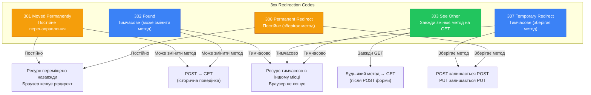

# Перенаправлення (Redirects) та декоратор @Redirect

::card-group

::card{title="🎯 Мета лекції" icon="i-lucide-target"}

- Зрозуміти механізм HTTP-перенаправлень та їх роль у веб-застосунках
- Опанувати використання декоратора @Redirect для статичних перенаправлень
- Вивчити семантику кодів 3xx: 301, 302, 303, 307, 308 та їх відмінності
- Навчитися реалізовувати динамічні перенаправлення через повернення об'єкта
- Засвоїти різницю між постійним (301) та тимчасовим (302/307) редиректом
- Практикувати створення скорочувачів URL та систем переадресації
- Зрозуміти вплив перенаправлень на SEO та поведінку браузерів
- Навчитися вибирати правильний код перенаправлення для різних сценаріїв

::

::card{title="🔑 Ключові терміни" icon="i-lucide-key"}

- **HTTP Redirect** (*HTTP-перенаправлення*): відповідь сервера, що вказує клієнту перейти на інший URL
- **Location Header** (*заголовок Location*): HTTP-заголовок, що містить цільовий URL перенаправлення
- **3xx Status Codes** (*коди 3xx*): клас HTTP-статус кодів для перенаправлень
- **Permanent Redirect** (*постійне перенаправлення*): ресурс остаточно переміщено (301, 308)
- **Temporary Redirect** (*тимчасове перенаправлення*): ресурс тимчасово доступний за іншим URL (302, 307)
- **Method Preservation** (*збереження методу*): поведінка редиректу щодо HTTP-методу запиту
- **URL Shortener** (*скорочувач URL*): сервіс перетворення довгих URL на короткі посилання

::

::


## HTTP-перенаправлення: механізм переадресації

HTTP-перенаправлення (*redirect*) є фундаментальним механізмом протоколу HTTP, що дозволяє серверу інструктувати клієнта (браузер, HTTP-клієнт) автоматично перейти на інший URL замість відображення вмісту поточного запиту. Перенаправлення використовується у безлічі сценаріїв: міграція контенту на нову адресу, скорочувачі URL, переадресація після успішної форми, канонізація URL для SEO, автентифікація та багато іншого.

Технічно перенаправлення реалізується через **статус коди класу 3xx** та HTTP-заголовок **Location**, що містить цільовий URL. Коли браузер отримує відповідь з кодом 3xx, він автоматично виконує новий запит до URL з заголовка Location, не вимагаючи втручання користувача. Цей процес може відбутися кілька разів послідовно (ланцюжок редиректів), але браузери зазвичай обмежують глибину такого ланцюжка для захисту від нескінченних циклів.

### Анатомія HTTP-перенаправлення

::plant-uml{alt="Процес HTTP-перенаправлення між клієнтом та сервером"}

```plantuml
@startuml
skinparam style plain
skinparam backgroundColor #FFFFFF

actor "Браузер" as Browser #DBEAFE
participant "Сервер (old-url)" as OldServer #F59E0B
participant "Сервер (new-url)" as NewServer #22c55e

Browser -> OldServer : GET /old-path HTTP/1.1
note right
  Користувач переходить
  на старий URL
end note

OldServer --> Browser : HTTP/1.1 301 Moved Permanently\nLocation: /new-path
note left #FEF3C7
  Сервер повертає 301
  з новою адресою
end note

Browser -> NewServer : GET /new-path HTTP/1.1
note right
  Браузер автоматично
  виконує запит на новий URL
end note

NewServer --> Browser : HTTP/1.1 200 OK\nContent: ...
note left #DCFCE7
  Сервер повертає
  вміст сторінки
end note

note bottom of Browser
  Користувач бачить вміст /new-path.
  Адресна стрічка показує /new-path.
  Історія браузера містить обидва URL.
end note

@enduml
```

::

**Етапи процесу перенаправлення:**

1. **Клієнт надсилає запит** на оригінальний URL (наприклад, `GET /old-path`)
2. **Сервер повертає відповідь 3xx** з заголовком `Location: /new-path`
3. **Клієнт автоматично виконує новий запит** до URL з Location
4. **Сервер за новим URL повертає 200 OK** з вмістом сторінки
5. **Браузер відображає вміст** та оновлює адресну стрічку

::note
Важливо розуміти, що перенаправлення — це **два окремі HTTP-запити**. Перший запит повертає лише заголовки без значущого тіла (хоча технічно тіло може бути присутнім для старих браузерів), а другий запит отримує фактичний вміст. Це має наслідки для продуктивності, логування та безпеки.
::

### Структура HTTP-відповіді з перенаправленням

Типова відповідь з перенаправленням виглядає наступним чином:

```
HTTP/1.1 301 Moved Permanently
Location: https://example.com/new-path
Content-Type: text/html
Content-Length: 185

<html>
<head><title>301 Moved Permanently</title></head>
<body>
<h1>Moved Permanently</h1>
<p>The document has moved <a href="https://example.com/new-path">here</a>.</p>
</body>
</html>
```

**Ключові елементи:**

- **Статус код 301** — вказує тип перенаправлення (постійне)
- **Location заголовок** — містить цільовий URL (може бути відносним або абсолютним)
- **HTML-тіло** — опціональне, призначене для старих браузерів або ботів, що не виконують автоматичне перенаправлення

::tip
Сучасні HTTP-клієнти (браузери, бібліотеки) автоматично слідують перенаправленням, ігноруючи HTML-тіло відповіді. Проте надання HTML-тіла з посиланням вважається хорошою практикою для сумісності зі старими клієнтами та пошуковими ботами.
::

### Типи URL у заголовку Location

Заголовок Location може містити три типи URL:

**Абсолютний URL (рекомендовано):**
```
Location: https://example.com/new-path
```
Містить повну адресу з протоколом, доменом та шляхом. Найнадійніший варіант, працює у всіх сценаріях.

**Абсолютний шлях (відносно домену):**
```
Location: /new-path
```
Клієнт додає поточний протокол та домен. Працює для перенаправлень всередині одного сайту.

**Відносний шлях:**
```
Location: ../new-path
Location: subdir/page
```
Розраховується відносно поточного URL. Рідко використовується через складність обчислення та потенційні проблеми.

::warning
**RFC 7231** рекомендує використовувати **абсолютні URL** у заголовку Location для уникнення неоднозначностей та забезпечення сумісності. Хоча більшість браузерів коректно обробляють відносні шляхи, деякі проксі-сервери та застарілі клієнти можуть зазнати проблем.
::


## Класифікація кодів перенаправлення 3xx

HTTP-специфікація визначає п'ять основних кодів перенаправлення, кожен з яких має специфічну семантику щодо постійності редиректу та збереження HTTP-методу запиту:

::mermaid



::

### 301 Moved Permanently — Постійне перенаправлення

**Семантика:** Ресурс **остаточно** переміщено на новий URL. Усі майбутні запити до старого URL повинні автоматично перенаправлятися на новий.

**Поведінка браузера:**
- Автоматично виконує запит на новий URL
- **Кешує перенаправлення** — наступні запити можуть йти відразу на новий URL без звернення до старого
- Може змінити метод запиту з POST на GET (історична особливість, не рекомендовано)

**Використання:**
- Міграція сайту на новий домен (`example.com` → `newdomain.com`)
- Реструктуризація URL (`/blog/post-name` → `/articles/post-name`)
- Канонізація URL для SEO (`www.example.com` → `example.com`)
- Переміщення сторінки в нову локацію назавжди

**Приклад:**
```
GET /old-blog/article HTTP/1.1
Host: example.com

HTTP/1.1 301 Moved Permanently
Location: https://example.com/articles/article
Cache-Control: max-age=31536000
```

::warning
**SEO-наслідки:** Пошукові системи передають **всі SEO-сигнали** (PageRank, авторитет) зі старого URL на новий при 301 редиректі. Проте якщо редирект не є постійним, використання 301 може призвести до втрати індексації старого URL. Використовуйте 301 лише коли ви **дійсно** не повернете контент за старою адресою.
::

### 302 Found — Тимчасове перенаправлення (застаріле)

**Семантика:** Ресурс **тимчасово** доступний за іншим URL. Клієнт повинен продовжувати використовувати оригінальний URL для майбутніх запитів.

**Історична проблема:** Оригінальна специфікація HTTP/1.0 визначала 302 як "Moved Temporarily", але не вказувала, чи слід зберігати метод запиту. Це призвело до того, що більшість браузерів змінювали POST на GET при 302 редиректі, що є семантично некоректним.

**Сучасна рекомендація:** Використовуйте **303** (для зміни методу на GET) або **307** (для збереження методу) замість 302 для однозначної поведінки.

**Приклад (застарілий):**
```
POST /submit-form HTTP/1.1

HTTP/1.1 302 Found
Location: /thank-you
```

::note
Код 302 підтримується всіма браузерами та широко використовується у legacy-системах, проте для нових проєктів рекомендується використовувати більш точні коди 303 та 307.
::

### 303 See Other — Перенаправлення з зміною методу на GET

**Семантика:** Відповідь на запит можна знайти за іншим URL, який слід запитати методом **GET**, незалежно від оригінального методу.

**Типовий сценарій:** Перенаправлення після успішної POST-форми (Pattern **POST-Redirect-GET**).

**Поведінка браузера:**
- Завжди змінює метод на GET при перенаправленні
- Не кешує редирект (тимчасовий)

**Використання:**
- Після успішного POST/PUT/DELETE перенаправити на сторінку перегляду
- Уникнення повторної відправки форми при оновленні сторінки (F5)

**Приклад:**
```
POST /users HTTP/1.1
Content-Type: application/json
{ "name": "Alice" }

HTTP/1.1 303 See Other
Location: /users/456
```

Браузер виконає: `GET /users/456` (не POST!)

::tip
**POST-Redirect-GET Pattern:** Після успішної POST-операції завжди повертайте 303 See Other з перенаправленням на GET-ендпоінт. Це запобігає випадковому повторному відправленню форми при оновленні сторінки користувачем.
::

### 307 Temporary Redirect — Тимчасове перенаправлення зі збереженням методу

**Семантика:** Ресурс тимчасово доступний за іншим URL. Клієнт **повинен** виконати запит на новий URL з **тим самим методом** та тілом.

**Поведінка браузера:**
- Зберігає HTTP-метод (POST залишається POST, PUT залишається PUT)
- Не кешує редирект (тимчасовий)
- Може запитати дозвіл користувача перед повторним відправленням POST/PUT

**Використання:**
- Тимчасова технічна недоступність ресурсу (maintenance)
- Балансування навантаження (перенаправлення на інший сервер)
- A/B тестування (тимчасове перенаправлення на альтернативний варіант)

**Приклад:**
```
POST /api/process HTTP/1.1
Content-Type: application/json
{ "data": "..." }

HTTP/1.1 307 Temporary Redirect
Location: https://backup-server.example.com/api/process
```

Браузер повторить: `POST https://backup-server.example.com/api/process` з тим самим тілом.

### 308 Permanent Redirect — Постійне перенаправлення зі збереженням методу

**Семантика:** Ресурс остаточно переміщено на новий URL. Усі майбутні запити повинні використовувати новий URL з **збереженням методу**.

**Відмінність від 301:** 308 **гарантує** збереження методу, тоді як 301 може змінити POST на GET у старих браузерах.

**Поведінка браузера:**
- Зберігає HTTP-метод
- Кешує перенаправлення
- Передає SEO-сигнали на новий URL

**Використання:**
- Остаточна міграція API-ендпоінтів (`/api/v1/users` → `/api/v2/users`)
- Перенесення форм POST на новий URL зі збереженням методу

**Приклад:**
```
POST /api/v1/users HTTP/1.1

HTTP/1.1 308 Permanent Redirect
Location: /api/v2/users
```

::warning
Код 308 є відносно новим (RFC 7538, 2015) та може не підтримуватися дуже старими браузерами. Для максимальної сумісності з legacy-клієнтами використовуйте 301, але майте на увазі можливу зміну методу.
::


### Порівняльна таблиця кодів перенаправлення

| Код | Назва | Постійність | Метод | Кешування | Використання |
|-----|-------|-------------|-------|-----------|--------------|
| **301** | Moved Permanently | Постійне | Може змінитися | ✅ Так | Міграція сайтів, SEO |
| **302** | Found | Тимчасове | Може змінитися | ❌ Ні | Застарілий, уникати |
| **303** | See Other | Тимчасове | Завжди GET | ❌ Ні | POST-Redirect-GET |
| **307** | Temporary Redirect | Тимчасове | Зберігається | ❌ Ні | Тимчасова переадресація |
| **308** | Permanent Redirect | Постійне | Зберігається | ✅ Так | Міграція API |

::accordion

::accordion-item{label="❓ Чому 302 вважається застарілим?" icon="i-lucide-help-circle"}

Історично браузери по-різному інтерпретували код 302: одні зберігали метод запиту, інші змінювали POST на GET. Це призводило до непередбачуваної поведінки. HTTP/1.1 вирішив цю проблему, додавши два чіткі коди:

- **303 See Other** — явно вказує на зміну методу на GET
- **307 Temporary Redirect** — явно вказує на збереження методу

Код 302 залишився для зворотної сумісності, але для нових проєктів рекомендується використовувати 303 або 307 залежно від бажаної поведінки.

::

::accordion-item{label="❓ Коли використовувати 301 замість 308?" icon="i-lucide-help-circle"}

**Використовуйте 301** коли:
- Перенаправляєте GET-запити (сторінки, статичні ресурси)
- Потрібна максимальна сумісність зі старими браузерами
- Виконуєте SEO-міграцію веб-сайту

**Використовуйте 308** коли:
- Перенаправляєте POST/PUT/DELETE запити API
- Критично важливо зберегти метод запиту
- Працюєте з сучасними клієнтами (після 2015 року)

У більшості випадків 301 достатньо, оскільки перенаправлення зазвичай застосовується до GET-запитів.

::

::accordion-item{label="❓ Чи можуть перенаправлення утворити нескінченний цикл?" icon="i-lucide-help-circle"}

Так, якщо URL A перенаправляє на URL B, а URL B перенаправляє назад на URL A, утворюється **нескінченний цикл редиректів**.

Браузери захищаються від цього, обмежуючи кількість послідовних перенаправлень (зазвичай 20-30). При перевищенні ліміту браузер відображає помилку "Too many redirects" або "ERR_TOO_MANY_REDIRECTS".

**Як уникнути:**
- Ретельно перевіряйте логіку перенаправлень
- Логуйте ланцюжки редиректів під час розробки
- Використовуйте інструменти перевірки (curl з `-L`, browser DevTools Network tab)

::

::


## Декоратор @Redirect: статичне перенаправлення

NestJS надає декоратор `@Redirect()` для оголошення статичних перенаправлень безпосередньо у метаданих обробника. Це найпростіший спосіб реалізувати перенаправлення, коли URL та статус код відомі на етапі компіляції.

### Базовий синтаксис

```typescript
import { Controller, Get, Redirect } from '@nestjs/common';

@Controller()
export class AppController {
  @Get('old-path')
  @Redirect('https://example.com/new-path', 301)
  oldPath() {
    // Метод може бути порожнім або повертати дані,
    // які будуть проігноровані через редирект
  }
}
```

**Параметри декоратора:**
- **url** (перший аргумент): цільовий URL перенаправлення (абсолютний або відносний)
- **statusCode** (другий аргумент, опціональний): HTTP-статус код (за замовчуванням **302**)

::warning
Зверніть увагу, що за замовчуванням `@Redirect()` використовує код **302 Found**, а не 301 Moved Permanently. Для постійних редиректів явно вказуйте код 301:

```typescript
@Redirect('/new-path', 301) // Постійне перенаправлення
```
::

### Приклад: Міграція старого URL на новий

```typescript
import { Controller, Get, Redirect, HttpStatus } from '@nestjs/common';

@Controller('blog')
export class BlogController {
  // Стара структура URL: /blog/post-123
  @Get('post-:id')
  @Redirect('/articles/post-:id', HttpStatus.MOVED_PERMANENTLY)
  legacyPost() {
    // Користувачі, що мають закладки на старі URL,
    // автоматично перенаправляться на нові
  }
}
```

::terminal-preview{title="Перенаправлення старого URL" :cursor="false"}

<div class="line"><span class="opacity-40">$</span> <strong class="font-bold">curl -v http://localhost:3000/blog/post-123</strong></div>
<div class="line"><span class="text-blue-400 font-bold">GET /blog/post-123 HTTP/1.1</span></div>
<div class="line"><span class="opacity-40">Host: localhost:3000</span></div>
<div class="line"></div>
<div class="line"><span class="text-yellow-400 font-bold">HTTP/1.1 301 Moved Permanently</span></div>
<div class="line"><span class="text-green-400">Location: /articles/post-123</span></div>
<div class="line"><span class="opacity-40">Content-Length: 0</span></div>
<div class="line"></div>
<div class="line"><span class="opacity-40"># Браузер автоматично виконує:</span></div>
<div class="line"><span class="opacity-40">$</span> <strong class="font-bold">curl http://localhost:3000/articles/post-123</strong></div>
<div class="line"><span class="text-green-400 font-bold">HTTP/1.1 200 OK</span></div>
<div class="line">{ <span class="text-green-400">"title"</span>: <span class="text-blue-400">"Article Title"</span>, ... }</div>

::

### Приклад: Канонізація URL (з www на без www)

```typescript
import { Controller, Get, Req, Redirect } from '@nestjs/common';
import { Request } from 'express';

@Controller()
export class RedirectController {
  @Get('*')
  @Redirect()
  canonicalRedirect(@Req() req: Request) {
    const host = req.get('host');
    
    // Якщо запит прийшов на www.example.com, перенаправляємо на example.com
    if (host && host.startsWith('www.')) {
      const canonicalHost = host.replace('www.', '');
      const canonicalUrl = `${req.protocol}://${canonicalHost}${req.originalUrl}`;
      
      return {
        url: canonicalUrl,
        statusCode: HttpStatus.MOVED_PERMANENTLY,
      };
    }
    
    // Якщо домен коректний, продовжуємо нормальну обробку
    // (тут слід делегувати іншим обробникам)
  }
}
```

::note
У реальних проєктах канонізація домену зазвичай виконується на рівні **веб-сервера** (Nginx, Apache) або **CDN** (Cloudflare), а не у коді застосунку. Проте розуміння механізму важливе для складних сценаріїв.
::

### Приклад: Перенаправлення на зовнішній сервіс

```typescript
@Controller('auth')
export class AuthController {
  @Get('google')
  @Redirect('https://accounts.google.com/o/oauth2/v2/auth?client_id=...', 302)
  googleAuth() {
    // Перенаправлення на сторінку автентифікації Google OAuth
    // Після успішної автентифікації Google перенаправить назад на наш callback URL
  }

  @Get('github')
  @Redirect('https://github.com/login/oauth/authorize?client_id=...', 302)
  githubAuth() {
    // Перенаправлення на сторінку автентифікації GitHub OAuth
  }
}
```

### Відносні та абсолютні URL

Декоратор `@Redirect()` підтримує як відносні, так і абсолютні URL:

```typescript
// Абсолютний URL з протоколом та доменом
@Redirect('https://example.com/new-path', 301)

// Абсолютний шлях (відносно кореня домену)
@Redirect('/new-path', 301)

// Відносний шлях (відносно поточного маршруту)
@Redirect('../new-path', 302)

// Якір на поточній сторінці
@Redirect('#section', 302)
```

::tip
**Рекомендація:** Для перенаправлень на інший домен завжди використовуйте **повні абсолютні URL** з протоколом (`https://...`). Для перенаправлень всередині того самого застосунку використовуйте **абсолютні шляхи** (`/path`), що забезпечує незалежність від поточного маршруту.
::


## Динамічне перенаправлення: повернення об'єкта

Декоратор `@Redirect()` зручний для статичних перенаправлень, але часто URL або статус код потрібно визначити **динамічно** на основі параметрів запиту, даних з бази або бізнес-логіки. NestJS дозволяє перевизначити параметри редиректу, повернувши об'єкт з властивостями `url` та `statusCode` з обробника.

### Синтаксис динамічного перенаправлення

```typescript
import { Controller, Get, Param, Redirect } from '@nestjs/common';

@Controller('links')
export class LinksController {
  @Get(':code')
  @Redirect() // Декоратор без аргументів
  async resolveShortLink(@Param('code') code: string) {
    // Бізнес-логіка для визначення цільового URL
    const targetUrl = await this.linksService.findUrlByCode(code);
    
    if (!targetUrl) {
      throw new NotFoundException('Short link not found');
    }
    
    // Повертаємо об'єкт з url та statusCode
    return {
      url: targetUrl,
      statusCode: HttpStatus.MOVED_PERMANENTLY,
    };
  }
}
```

**Об'єкт, що повертається:**
```typescript
{
  url: string;         // Цільовий URL перенаправлення
  statusCode?: number; // HTTP-статус код (опціонально, за замовчуванням 302)
}
```

::note
Якщо метод повертає об'єкт з властивістю `url`, NestJS автоматично інтерпретує це як перенаправлення, **навіть якщо декоратор @Redirect не застосовано**. Проте явне використання декоратора покращує читабельність коду.
::

### Приклад: Скорочувач URL (URL Shortener)

Розглянемо реалізацію повнофункціонального сервісу скорочувачів URL:

```typescript
import {
  Controller,
  Get,
  Post,
  Param,
  Body,
  Redirect,
  HttpStatus,
  NotFoundException,
} from '@nestjs/common';
import { LinksService } from './links.service';
import { CreateShortLinkDto } from './dto/create-short-link.dto';

@Controller()
export class LinksController {
  constructor(private readonly linksService: LinksService) {}

  // POST /shorten — Створення короткого посилання
  @Post('shorten')
  async createShortLink(@Body() dto: CreateShortLinkDto) {
    const shortCode = await this.linksService.createShortLink(dto.url);
    
    return {
      originalUrl: dto.url,
      shortUrl: `https://short.link/${shortCode}`,
      shortCode,
      createdAt: new Date(),
    };
  }

  // GET /:code — Перенаправлення на оригінальний URL
  @Get(':code')
  @Redirect()
  async redirect(@Param('code') code: string) {
    const link = await this.linksService.findByCode(code);
    
    if (!link) {
      throw new NotFoundException(`Short link "${code}" not found`);
    }

    // Інкрементуємо лічильник переходів (асинхронно, без очікування)
    this.linksService.incrementClicks(code).catch(err => {
      console.error('Failed to increment clicks:', err);
    });

    // Повертаємо динамічне перенаправлення
    return {
      url: link.originalUrl,
      statusCode: link.isPermanent 
        ? HttpStatus.MOVED_PERMANENTLY  // 301 для постійних скорочень
        : HttpStatus.FOUND,              // 302 для тимчасових
    };
  }

  // GET /stats/:code — Статистика переходів
  @Get('stats/:code')
  async getStats(@Param('code') code: string) {
    const stats = await this.linksService.getStats(code);
    
    if (!stats) {
      throw new NotFoundException(`Short link "${code}" not found`);
    }
    
    return stats;
  }
}
```

**Сервіс для роботи з посиланнями:**

```typescript
import { Injectable } from '@nestjs/common';
import { InjectRepository } from '@nestjs/typeorm';
import { Repository } from 'typeorm';
import { ShortLink } from './entities/short-link.entity';
import { nanoid } from 'nanoid';

@Injectable()
export class LinksService {
  constructor(
    @InjectRepository(ShortLink)
    private readonly linksRepository: Repository<ShortLink>,
  ) {}

  async createShortLink(originalUrl: string, isPermanent = false): Promise<string> {
    // Генеруємо унікальний код (7 символів, URL-safe)
    const code = nanoid(7);
    
    const link = this.linksRepository.create({
      code,
      originalUrl,
      isPermanent,
      clicks: 0,
    });
    
    await this.linksRepository.save(link);
    
    return code;
  }

  async findByCode(code: string): Promise<ShortLink | null> {
    return this.linksRepository.findOne({ where: { code } });
  }

  async incrementClicks(code: string): Promise<void> {
    await this.linksRepository.increment({ code }, 'clicks', 1);
  }

  async getStats(code: string) {
    const link = await this.findByCode(code);
    
    if (!link) {
      return null;
    }
    
    return {
      code: link.code,
      originalUrl: link.originalUrl,
      clicks: link.clicks,
      createdAt: link.createdAt,
      isPermanent: link.isPermanent,
    };
  }
}
```

::terminal-preview{title="Використання скорочувача URL" :cursor="false"}

<div class="line"><span class="opacity-40"># Створення короткого посилання</span></div>
<div class="line"><span class="opacity-40">$</span> <strong class="font-bold">curl -X POST http://localhost:3000/shorten \</strong></div>
<div class="line">  -H "Content-Type: application/json" \</div>
<div class="line">  -d '{"url":"https://example.com/very/long/url/with/many/segments"}'</div>
<div class="line"></div>
<div class="line"><span class="text-green-400 font-bold">HTTP/1.1 201 Created</span></div>
<div class="line">{</div>
<div class="line">  <span class="text-green-400">"originalUrl"</span>: <span class="text-blue-400">"https://example.com/very/long/url/with/many/segments"</span>,</div>
<div class="line">  <span class="text-green-400">"shortUrl"</span>: <span class="text-blue-400">"https://short.link/aB3dEf7"</span>,</div>
<div class="line">  <span class="text-green-400">"shortCode"</span>: <span class="text-blue-400">"aB3dEf7"</span></div>
<div class="line">}</div>
<div class="line"></div>
<div class="line"><span class="opacity-40"># Використання короткого посилання</span></div>
<div class="line"><span class="opacity-40">$</span> <strong class="font-bold">curl -v http://localhost:3000/aB3dEf7</strong></div>
<div class="line"></div>
<div class="line"><span class="text-yellow-400 font-bold">HTTP/1.1 302 Found</span></div>
<div class="line"><span class="text-green-400">Location: https://example.com/very/long/url/with/many/segments</span></div>
<div class="line"></div>
<div class="line"><span class="opacity-40"># Перегляд статистики</span></div>
<div class="line"><span class="opacity-40">$</span> <strong class="font-bold">curl http://localhost:3000/stats/aB3dEf7</strong></div>
<div class="line"></div>
<div class="line"><span class="text-green-400 font-bold">HTTP/1.1 200 OK</span></div>
<div class="line">{</div>
<div class="line">  <span class="text-green-400">"code"</span>: <span class="text-blue-400">"aB3dEf7"</span>,</div>
<div class="line">  <span class="text-green-400">"originalUrl"</span>: <span class="text-blue-400">"https://example.com/..."</span>,</div>
<div class="line">  <span class="text-green-400">"clicks"</span>: <span class="text-yellow-400">42</span>,</div>
<div class="line">  <span class="text-green-400">"isPermanent"</span>: <span class="text-yellow-400">false</span></div>
<div class="line">}</div>

::

### Приклад: POST-Redirect-GET Pattern

Класичний патерн для уникнення повторної відправки форми при оновленні сторінки:

```typescript
import { Controller, Post, Get, Body, Param, Redirect, HttpStatus } from '@nestjs/common';

@Controller('articles')
export class ArticlesController {
  constructor(private readonly articlesService: ArticlesService) {}

  // POST /articles — Створення статті
  @Post()
  @Redirect() // Без аргументів — динамічний редирект
  async create(@Body() createArticleDto: CreateArticleDto) {
    const article = await this.articlesService.create(createArticleDto);
    
    // Після успішного створення перенаправляємо на сторінку перегляду
    return {
      url: `/articles/${article.id}`,
      statusCode: HttpStatus.SEE_OTHER, // 303 — завжди змінює метод на GET
    };
  }

  // GET /articles/:id — Перегляд статті
  @Get(':id')
  async findOne(@Param('id') id: string) {
    return this.articlesService.findById(id);
  }
}
```

**Переваги POST-Redirect-GET:**
1. **Уникнення дублювання:** Користувач не може випадково створити кілька статей, натиснувши F5
2. **Чиста адресна стрічка:** URL відображає GET-ендпоінт, а не POST
3. **Підтримка закладок:** Користувач може зберегти закладку на результуючу сторінку
4. **Історія браузера:** Кнопка "Назад" працює коректно

::tip
Завжди використовуйте **303 See Other** для POST-Redirect-GET, а не 302 чи 307. Код 303 явно сигналізує браузеру змінити метод на GET, що запобігає випадковому повторному відправленню POST-запиту.
::


### Умовне перенаправлення на основі параметрів

```typescript
import { Controller, Get, Query, Redirect, HttpStatus } from '@nestjs/common';

@Controller('download')
export class DownloadController {
  @Get()
  @Redirect()
  downloadFile(
    @Query('platform') platform: string,
    @Query('version') version: string,
  ) {
    // Перенаправлення на різні CDN залежно від платформи
    const baseUrl = 'https://cdn.example.com/downloads';
    
    switch (platform) {
      case 'windows':
        return {
          url: `${baseUrl}/app-${version}-win.exe`,
          statusCode: HttpStatus.FOUND, // 302 для динамічних посилань
        };
      
      case 'macos':
        return {
          url: `${baseUrl}/app-${version}-mac.dmg`,
          statusCode: HttpStatus.FOUND,
        };
      
      case 'linux':
        return {
          url: `${baseUrl}/app-${version}-linux.tar.gz`,
          statusCode: HttpStatus.FOUND,
        };
      
      default:
        // За замовчуванням перенаправляємо на сторінку вибору платформи
        return {
          url: '/downloads',
          statusCode: HttpStatus.SEE_OTHER, // 303
        };
    }
  }
}
```


## Перенаправлення через @Res: альтернативний підхід

Як ми вивчали у попередніх лекціях, NestJS надає прямий доступ до об'єкта `Response` через декоратор `@Res()`. Цей підхід можна використовувати для перенаправлень, проте він **не рекомендується** для більшості сценаріїв.

### Перенаправлення через res.redirect()

```typescript
import { Controller, Get, Res } from '@nestjs/common';
import { Response } from 'express';

@Controller('old')
export class OldController {
  @Get('path')
  redirect(@Res() res: Response) {
    // Метод 1: Лише URL (статус 302 за замовчуванням)
    res.redirect('/new/path');
    
    // Метод 2: URL + статус
    res.redirect(301, '/new/path');
    
    // Метод 3: Відносне перенаправлення
    res.redirect('back'); // Повернутися на попередню сторінку
    
    // ВАЖЛИВО: Не повертайте значення з методу!
    // res.redirect() автоматично завершує відповідь
  }
}
```

::warning
**Проблеми підходу через @Res:**

1. **Прив'язка до Express/Fastify:** Код не буде працювати при зміні платформи
2. **Втрата автоматичної обробки:** Interceptors можуть не спрацювати
3. **Менша читабельність:** Метадані перенаправлення не видно в декораторах
4. **Складніше тестувати:** Потрібні mock об'єкти Response
5. **Можливість помилок:** Легко забути про відсутність return після redirect()

**Рекомендація:** Використовуйте `@Redirect()` або динамічне повернення `{ url, statusCode }` замість прямого доступу до `res.redirect()`.
::

### Коли використовувати @Res для перенаправлень

Єдиний виправданий сценарій — коли потрібен **максимальний контроль** над заголовками перенаправлення:

```typescript
import { Controller, Get, Res } from '@nestjs/common';
import { Response } from 'express';

@Controller('tracking')
export class TrackingController {
  @Get('click/:id')
  async trackClick(
    @Param('id') id: string,
    @Res() res: Response,
  ) {
    // Логування кліку
    await this.analyticsService.logClick(id);
    
    const targetUrl = await this.linksService.getTargetUrl(id);
    
    // Додавання кастомних заголовків до редиректу
    res.set({
      'X-Redirect-Reason': 'tracking',
      'X-Click-ID': id,
      'Cache-Control': 'no-cache, no-store, must-revalidate',
    });
    
    res.redirect(302, targetUrl);
  }
}
```


## Best Practices: вибір правильного коду перенаправлення

Правильний вибір статус коду перенаправлення впливає на поведінку браузерів, SEO та користувацький досвід. Розглянемо практичні рекомендації для різних сценаріїв.

### Правила вибору коду перенаправлення

::steps

### Крок 1. Визначте постійність

**Питання:** Чи повернеться контент на старий URL?

- **Так** (контент повернеться) → Тимчасове перенаправлення (302, 303, 307)
- **Ні** (контент ніколи не повернеться) → Постійне перенаправлення (301, 308)

### Крок 2. Визначте тип запиту

**Питання:** Який HTTP-метод використовується?

- **GET** — код методу не критичний, використовуйте 301 (постійне) або 302 (тимчасове)
- **POST/PUT/DELETE** — критично важливо зберегти метод

### Крок 3. Визначте поведінку методу (для POST/PUT/DELETE)

**Питання:** Чи потрібно зберегти метод запиту?

- **Так** (зберегти POST як POST) → 307 (тимчасове) або 308 (постійне)
- **Ні** (змінити на GET) → 303 See Other

::

### Матриця вибору коду перенаправлення

| Сценарій | Постійність | Метод | Код | Приклад |
|----------|-------------|-------|-----|---------|
| Міграція сторінки | Постійне | GET | **301** | `/old-page` → `/new-page` |
| Канонізація URL | Постійне | GET | **301** | `www.site.com` → `site.com` |
| Тимчасова недоступність | Тимчасове | GET | **302** або **307** | Maintenance mode |
| POST-Redirect-GET | Тимчасове | POST→GET | **303** | Після форми на сторінку успіху |
| Міграція API ендпоінту | Постійне | POST/PUT | **308** | `/api/v1/users` → `/api/v2/users` |
| Балансування навантаження | Тимчасове | Будь-який | **307** | Переадресація на інший сервер |
| OAuth автентифікація | Тимчасове | GET | **302** | На сторінку провайдера |

### SEO-наслідки перенаправлень

**301 Moved Permanently:**
- ✅ Передає 90-99% PageRank на новий URL
- ✅ Пошукові системи видаляють старий URL з індексу
- ✅ Оновлюють внутрішні посилання на новий URL
- ⚠️ Процес може зайняти від кількох днів до кількох тижнів

**302/307 Temporary Redirect:**
- ⚠️ Зберігає старий URL в індексі
- ⚠️ НЕ передає повний PageRank на новий URL
- ⚠️ Пошукові системи індексують обидва URL
- ✅ Використовуйте для A/B тестування без втрати SEO

**303 See Other:**
- Подібний до 302, використовується для POST-Redirect-GET
- Не має прямого впливу на SEO (не застосовується до контенту)

::warning
**SEO-помилка:** Використання 302 замість 301 для постійної міграції може призвести до втрати позицій у пошуку, оскільки Google продовжуватиме індексувати старий URL та не передасть повний авторитет на новий.
::

### Практичні приклади для типових сценаріїв

::code-group

```typescript [Міграція сайту]
@Controller()
export class MigrationController {
  @Get('*')
  @Redirect('https://new-domain.com', 301)
  migrateToNewDomain() {
    // Постійна міграція всього сайту
    // SEO-сигнали передадуться на новий домен
  }
}
```

```typescript [POST-Redirect-GET]
@Controller('orders')
export class OrdersController {
  @Post()
  @Redirect()
  async createOrder(@Body() dto: CreateOrderDto) {
    const order = await this.ordersService.create(dto);
    
    return {
      url: `/orders/${order.id}`,
      statusCode: HttpStatus.SEE_OTHER, // 303
    };
  }
}
```

```typescript [Скорочувач URL]
@Controller()
export class ShortLinksController {
  @Get(':code')
  @Redirect()
  async resolve(@Param('code') code: string) {
    const link = await this.linksService.findByCode(code);
    
    return {
      url: link.targetUrl,
      statusCode: HttpStatus.FOUND, // 302 для динамічних посилань
    };
  }
}
```

```typescript [A/B Testing]
@Controller('landing')
export class LandingController {
  @Get()
  @Redirect()
  async abTest(@Headers('x-user-id') userId: string) {
    // Розподіляємо користувачів між варіантами
    const variant = this.abTestService.getVariant(userId);
    
    return {
      url: variant === 'A' ? '/landing-a' : '/landing-b',
      statusCode: HttpStatus.TEMPORARY_REDIRECT, // 307
    };
  }
}
```

::

### Кешування перенаправлень

**301 та 308** перенаправлення **кешуються браузерами** за замовчуванням, що може створити проблеми:

```typescript
// ❌ ПОГАНО: 301 для динамічних посилань
@Get('promo')
@Redirect()
async promoRedirect() {
  const activePromo = await this.promosService.getActive();
  
  return {
    url: `/promos/${activePromo.id}`,
    statusCode: 301, // Браузер закешує і не побачить зміни промо!
  };
}

// ✅ ДОБРЕ: 302 для динамічних посилань
@Get('promo')
@Redirect()
async promoRedirect() {
  const activePromo = await this.promosService.getActive();
  
  return {
    url: `/promos/${activePromo.id}`,
    statusCode: 302, // Браузер перевірятиме сервер при кожному запиті
  };
}
```

Для явного контролю кешування додайте заголовок `Cache-Control`:

```typescript
@Get('promo')
async promoRedirect(@Res({ passthrough: true }) res: Response) {
  const activePromo = await this.promosService.getActive();
  
  // Заборона кешування навіть для 301
  res.set('Cache-Control', 'no-cache, no-store, must-revalidate');
  
  return {
    url: `/promos/${activePromo.id}`,
    statusCode: 301,
  };
}
```


## Порівняння підходів: @Redirect vs Динамічне vs @Res

::plant-uml{alt="Три способи реалізації перенаправлень у NestJS"}

```plantuml
@startuml
skinparam style plain
skinparam backgroundColor #FFFFFF

rectangle "Механізм 1: @Redirect статичний" as M1 #DCFCE7 {
    rectangle "Статичний URL і код" as M1_1 #F1F5F9
    note bottom
      @Get('old')
      @Redirect('/new', 301)
      handler() { }
    end note
}

rectangle "Механізм 2: Динамічне повернення" as M2 #DBEAFE {
    rectangle "URL і код з логіки" as M2_1 #F1F5F9
    note bottom
      @Get(':code')
      @Redirect()
      handler() {
        return { url, statusCode };
      }
    end note
}

rectangle "Механізм 3: @Res().redirect()" as M3 #FED7AA {
    rectangle "Прямий виклик Express" as M3_1 #F1F5F9
    note bottom
      @Get('old')
      handler(@Res() res) {
        res.redirect(301, '/new');
      }
    end note
}

M1 --> |"Найпростіший"| SIMPLE["Читабельність +++<br/>Гнучкість -"]
M2 --> |"Рекомендований"| BALANCED["Читабельність ++<br/>Гнучкість +++"]
M3 --> |"Складний"| COMPLEX["Читабельність +<br/>Гнучкість ++"]

style M1 fill:#22c55e,stroke:#15803d,color:#ffffff
style M2 fill:#3b82f6,stroke:#1d4ed8,color:#ffffff
style M3 fill:#f59e0b,stroke:#b45309,color:#ffffff

@enduml
```

::

| Аспект | @Redirect (статичний) | Динамічне повернення | @Res().redirect() |
|--------|----------------------|---------------------|-------------------|
| **Складність** | Найпростіший | Середня | Висока |
| **Гнучкість** | Низька | Висока | Висока |
| **Читабельність** | Відмінна | Відмінна | Задовільна |
| **Платформо-незалежність** | ✅ Так | ✅ Так | ❌ Ні (Express/Fastify) |
| **Тестування** | Легко | Легко | Складно |
| **Interceptors** | ✅ Працюють | ✅ Працюють | ⚠️ Обмежено |
| **Типові сценарії** | Міграція URL | Скорочувачі, POST-Redirect-GET | Рідкісні edge cases |

::tip
**Рекомендація використання:**

1. **@Redirect(url, code)** — для простих статичних перенаправлень (міграція, канонізація)
2. **return { url, statusCode }** — для всіх динамічних сценаріїв (скорочувачі, умовні редиректи)
3. **res.redirect()** — лише коли потрібен абсолютний контроль над заголовками (рідкісні випадки)

У 95% випадків перші два підходи покривають всі потреби.
::


## Підсумки та ключові висновки

::card-group

::card{title="✅ Ключові моменти" icon="i-lucide-check-circle"}

- HTTP-перенаправлення реалізується через **статус коди 3xx** та заголовок **Location**
- **301 Moved Permanently** — для остаточної міграції (передає SEO-сигнали)
- **302 Found** — застарілий, використовуйте 303 або 307 замість нього
- **303 See Other** — для POST-Redirect-GET (завжди змінює метод на GET)
- **307 Temporary Redirect** — тимчасове перенаправлення зі збереженням методу
- **308 Permanent Redirect** — постійне перенаправлення зі збереженням методу
- Декоратор **@Redirect(url, code)** для статичних перенаправлень
- Динамічне повернення **{ url, statusCode }** для бізнес-логіки
- Уникайте прямого використання **@Res().redirect()** без необхідності

::

::card{title="🎓 Практичні рекомендації" icon="i-lucide-graduation-cap"}

- Використовуйте **301** для постійної міграції сторінок та сайтів
- Використовуйте **303** для POST-Redirect-GET після форм
- Використовуйте **302** для динамічних посилань (скорочувачі, tracking)
- Завжди вказуйте **абсолютні URL** у Location для міжсайтових редиректів
- Додавайте **Cache-Control** для керування кешуванням 301/308 редиректів
- Логуйте перенаправлення для моніторингу та аналітики
- Тестуйте ланцюжки редиректів (уникайте циклів!)
- Документуйте причини використання конкретних кодів перенаправлення
- Перевіряйте SEO-наслідки постійних перенаправлень через Google Search Console

::

::

### Подальше вивчення

У наступних лекціях ми розглянемо:
- **Асинхронні обробники та Promise** — async/await у контролерах
- **Sub-domain routing** — маршрутизація на основі субдоменів
- **Controller scopes** — життєвий цикл та ін'єкція залежностей
- **Guards та автентифікація** — захист маршрутів від несанкціонованого доступу
- **Interceptors** — трансформація запитів та відповідей

::tip
Практикуйте реалізацію перенаправлень на реальних проєктах. Спробуйте створити власний скорочувач URL з аналітикою кліків, систему відстеження маркетингових кампаній або механізм канонізації URL для SEO. Це найкращий спосіб засвоїти нюанси різних кодів перенаправлення.
::
