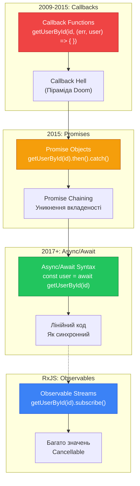
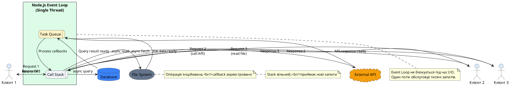
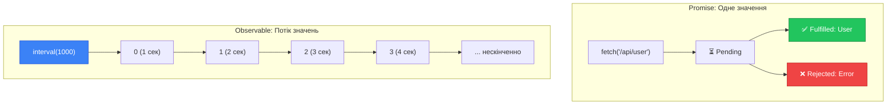

# Асинхронні обробники та Observables

::card-group

::card{title="🎯 Мета лекції" icon="i-lucide-target"}

- Зрозуміти концепцію асинхронного програмування у контексті NestJS контролерів
- Опанувати використання async/await для роботи з Promise у методах контролерів
- Вивчити автоматичну обробку Promise та Observable фреймворком NestJS
- Навчитися правильно обробляти помилки у асинхронних обробниках через try/catch
- Засвоїти техніки паралельного виконання запитів через Promise.all() та Promise.race()
- Практикувати інтеграцію з базами даних та зовнішніми API через асинхронні операції
- Зрозуміти роль RxJS Observable у NestJS та відмінність від Promise
- Навчитися перетворювати Observable на Promise для сумісності з async/await

::

::card{title="🔑 Ключові терміни" icon="i-lucide-key"}

- **Asynchronous Operation** (*асинхронна операція*): операція, що виконується у фоні без блокування головного потоку
- **Promise**: об'єкт JavaScript, що представляє результат асинхронної операції (fulfilled або rejected)
- **Async/Await**: синтаксичний цукор над Promise для лінійного написання асинхронного коду
- **Observable**: потік даних RxJS, що може емітувати кілька значень у часі
- **Event Loop**: механізм JavaScript для обробки асинхронних операцій
- **Non-blocking I/O**: парадигма, де операції введення/виведення не блокують виконання програми
- **Concurrent Execution** (*паралельне виконання*): одночасне виконання кількох асинхронних операцій

::

::


## Асинхронне програмування у веб-застосунках

Веб-застосунки за своєю природою виконують безліч операцій, які **не можуть завершитися миттєво**: запити до бази даних, виклики зовнішніх API, читання файлів з диску, відправка email, обробка зображень. Якщо виконувати такі операції **синхронно** (послідовно, очікуючи завершення кожної), сервер зможе обробляти лише один запит одночасно, що катастрофічно позначиться на продуктивності.

**Асинхронне програмування** вирішує цю проблему, дозволяючи серверу **не блокувати** поточний потік виконання під час очікування завершення довготривалих операцій. Замість цього сервер ініціює операцію, реєструє callback-функцію для обробки результату та продовжує обслуговувати інші запити. Коли операція завершується, Node.js через **Event Loop** викликає зареєстрований callback з результатом.

### Еволюція асинхронності у JavaScript

JavaScript пройшов довгий шлях еволюції механізмів асинхронності:

::mermaid



::

**Callback Functions (застарілий підхід):**
```typescript
// ❌ Callback Hell — складно читати та підтримувати
getUserById(userId, (err, user) => {
  if (err) return handleError(err);
  
  getOrders(user.id, (err, orders) => {
    if (err) return handleError(err);
    
    getOrderDetails(orders[0].id, (err, details) => {
      if (err) return handleError(err);
      
      // Піраміда вкладеності продовжується...
    });
  });
});
```

**Promise (ES6, 2015):**
```typescript
// ✅ Promise Chaining — краще, але все ще громіздко
getUserById(userId)
  .then(user => getOrders(user.id))
  .then(orders => getOrderDetails(orders[0].id))
  .then(details => console.log(details))
  .catch(err => handleError(err));
```

**Async/Await (ES2017):**
```typescript
// ✅✅ Найчистіший синтаксис — як синхронний код
async function loadOrderDetails(userId: string) {
  try {
    const user = await getUserById(userId);
    const orders = await getOrders(user.id);
    const details = await getOrderDetails(orders[0].id);
    console.log(details);
  } catch (err) {
    handleError(err);
  }
}
```

::note
NestJS побудований на сучасних стандартах JavaScript і **повністю підтримує** як Promise (через async/await), так і RxJS Observable. Розробники можуть вільно вибирати підхід залежно від сценарію: Promise для одноразових операцій, Observable для потоків даних.
::

### Event Loop та non-blocking I/O

Node.js використовує **однопотокову** (*single-threaded*) модель виконання з **подійним циклом** (*Event Loop*), що дозволяє ефективно обробляти тисячі одночасних запитів без створення окремого потоку для кожного:

::plant-uml{alt="Event Loop у Node.js"}



::

**Ключові принципи:**

1. **Один потік виконання** — весь JavaScript-код виконується послідовно у одному потоці
2. **Non-blocking I/O** — операції вводу/виведення делегуються операційній системі
3. **Callback Queue** — завершені операції реєструються у черзі для обробки
4. **Event Loop** — постійно перевіряє чергу та виконує callbacks, коли Call Stack порожній

Це дозволяє Node.js досягати продуктивності, порівнянної з багатопотоковими серверами (Java, C#), при значно меншому споживанні пам'яті.


## Async/Await у контролерах NestJS

NestJS має вбудовану підтримку асинхронних обробників через декларування методів як `async` функцій. Коли метод контролера позначено як `async` та повертає Promise, NestJS **автоматично очікує** (*awaits*) завершення Promise перед відправкою відповіді клієнту.

### Базовий синтаксис async/await

```typescript
import { Controller, Get, Param } from '@nestjs/common';
import { UsersService } from './users.service';

@Controller('users')
export class UsersController {
  constructor(private readonly usersService: UsersService) {}

  // ✅ Асинхронний обробник
  @Get()
  async findAll() {
    // await призупиняє виконання до завершення Promise
    const users = await this.usersService.findAll();
    
    // NestJS автоматично серіалізує результат у JSON
    return users;
  }

  @Get(':id')
  async findOne(@Param('id') id: string) {
    const user = await this.usersService.findById(id);
    
    if (!user) {
      throw new NotFoundException(`User ${id} not found`);
    }
    
    return user;
  }
}
```

**Що відбувається під капотом:**

1. NestJS викликає метод `findAll()`
2. Метод виконується до першого `await`, потім **призупиняється**
3. Поточний потік стає вільним для обробки інших запитів
4. Коли `usersService.findAll()` завершується, виконання **відновлюється**
5. Результат повертається, NestJS автоматично серіалізує його у JSON
6. HTTP-відповідь відправляється клієнту

::tip
У TypeScript немає необхідності явно вказувати тип `Promise<T>` для async функцій — компілятор автоматично виведе його:

```typescript
// Обидва варіанти еквівалентні:
async findAll(): Promise<User[]> { }
async findAll() { }  // TypeScript виведе Promise<User[]>
```
::

### Обробка помилок через try/catch

Асинхронні операції можуть завершуватися з помилкою (rejected Promise). Для обробки помилок у async функціях використовується стандартний блок `try/catch`:

```typescript
import { Controller, Post, Body, InternalServerErrorException } from '@nestjs/common';

@Controller('orders')
export class OrdersController {
  constructor(
    private readonly ordersService: OrdersService,
    private readonly paymentsService: PaymentsService,
  ) {}

  @Post()
  async createOrder(@Body() createOrderDto: CreateOrderDto) {
    try {
      // Створення замовлення у БД
      const order = await this.ordersService.create(createOrderDto);
      
      // Обробка платежу через зовнішній API
      const payment = await this.paymentsService.processPayment({
        orderId: order.id,
        amount: order.total,
      });
      
      // Оновлення статусу замовлення
      await this.ordersService.updatePaymentStatus(order.id, payment.status);
      
      return {
        order,
        payment,
        message: 'Order created and payment processed successfully',
      };
      
    } catch (error) {
      // Логування помилки для діагностики
      console.error('Order creation failed:', error);
      
      // Повернення клієнту загальної помилки
      throw new InternalServerErrorException(
        'Failed to process order. Please try again later.',
      );
    }
  }
}
```

::warning
**Важливо:** Якщо помилка у async функції **не обробляється** через try/catch, NestJS автоматично перехоплює її та повертає клієнту **500 Internal Server Error**. Проте краще обробляти помилки явно для контролю над повідомленнями та статус кодами.
::

### Множинні послідовні await

Кілька операцій `await` у функції виконуються **послідовно** — кожна наступна чекає завершення попередньої:

```typescript
@Get(':userId/dashboard')
async getUserDashboard(@Param('userId') userId: string) {
  // ⏱️ Послідовне виконання — ~300ms загально
  const user = await this.usersService.findById(userId);        // ~100ms
  const orders = await this.ordersService.findByUserId(userId); // ~100ms
  const stats = await this.statsService.calculate(userId);      // ~100ms
  
  return {
    user,
    orders,
    stats,
  };
}
```

У цьому прикладі кожна операція блокує наступну, що призводить до накопичення затримки. Якщо операції **незалежні** одна від одної, краще виконувати їх **паралельно**.


## Паралельне виконання через Promise.all()

Коли кілька асинхронних операцій **не залежать** одна від одної, їх можна виконати **паралельно** для значного прискорення обробки запиту. JavaScript надає кілька методів для роботи з множинними Promise:

### Promise.all() — очікування всіх операцій

`Promise.all()` приймає масив Promise і повертає новий Promise, який завершується, коли **всі** вхідні Promise завершаться успішно:

```typescript
import { Controller, Get, Param } from '@nestjs/common';

@Controller('users')
export class UsersController {
  constructor(
    private readonly usersService: UsersService,
    private readonly ordersService: OrdersService,
    private readonly statsService: StatsService,
  ) {}

  @Get(':userId/dashboard')
  async getUserDashboard(@Param('userId') userId: string) {
    // ✅ Паралельне виконання — ~100ms загально (найдовша операція)
    const [user, orders, stats] = await Promise.all([
      this.usersService.findById(userId),        // ~100ms
      this.ordersService.findByUserId(userId),   // ~80ms  (паралельно)
      this.statsService.calculate(userId),       // ~60ms  (паралельно)
    ]);
    
    return {
      user,
      orders,
      stats,
    };
  }
}
```

**Переваги:**
- **Прискорення у 3 рази** порівняно з послідовним виконанням
- Загальний час = час **найдовшої** операції, а не сума всіх

**Важливо:** Якщо **хоча б одна** операція завершується з помилкою, `Promise.all()` негайно reject-ається з цією помилкою, навіть якщо інші операції ще виконуються.

```typescript
@Get(':userId/profile')
async getProfile(@Param('userId') userId: string) {
  try {
    const [user, settings, notifications] = await Promise.all([
      this.usersService.findById(userId),
      this.settingsService.findByUserId(userId),
      this.notificationsService.findUnread(userId), // ❌ Помилка тут
    ]);
    
    return { user, settings, notifications };
    
  } catch (error) {
    // Якщо будь-яка операція провалилася, потрапляємо сюди
    console.error('Failed to load profile:', error);
    throw new InternalServerErrorException('Failed to load profile data');
  }
}
```

### Promise.allSettled() — очікування всіх із обробкою помилок

`Promise.allSettled()` завершується, коли **всі** Promise завершаться (успішно або з помилкою), повертаючи масив результатів:

```typescript
@Get(':userId/summary')
async getSummary(@Param('userId') userId: string) {
  // Виконуємо всі запити паралельно
  const results = await Promise.allSettled([
    this.usersService.findById(userId),
    this.ordersService.findByUserId(userId),
    this.statsService.calculate(userId),
    this.recommendationsService.getForUser(userId),
  ]);
  
  // Обробляємо результати, ігноруючи помилки
  const [userResult, ordersResult, statsResult, recsResult] = results;
  
  return {
    user: userResult.status === 'fulfilled' ? userResult.value : null,
    orders: ordersResult.status === 'fulfilled' ? ordersResult.value : [],
    stats: statsResult.status === 'fulfilled' ? statsResult.value : null,
    recommendations: recsResult.status === 'fulfilled' ? recsResult.value : [],
    errors: results
      .filter(r => r.status === 'rejected')
      .map(r => (r as PromiseRejectedResult).reason.message),
  };
}
```

**Переваги:**
- **Відмовостійкість** — помилка в одній операції не блокує інші
- Часткові дані — клієнт отримує все, що вдалося завантажити

### Promise.race() — перший результат

`Promise.race()` завершується, коли **перша** операція завершується (успішно або з помилкою):

```typescript
@Get('health-check')
async healthCheck() {
  try {
    // Очікуємо відповіді від першого доступного сервісу
    const result = await Promise.race([
      this.primaryDbService.ping(),
      this.replicaDbService.ping(),
      this.cacheService.ping(),
    ]);
    
    return { status: 'healthy', respondedBy: result.source };
    
  } catch (error) {
    throw new ServiceUnavailableException('All services are down');
  }
}
```

**Використання:** Таймаути, fallback-логіка, health checks.

### Promise.any() — перший успішний результат

`Promise.any()` завершується, коли **перша** операція завершується **успішно**. Якщо всі провалилися, reject-ається з `AggregateError`:

```typescript
@Get('data')
async getData() {
  try {
    // Намагаємося завантажити з різних джерел, використовуємо перше успішне
    const data = await Promise.any([
      this.cacheService.get('data'),      // Найшвидше
      this.primaryDbService.get('data'),  // Резерв 1
      this.backupDbService.get('data'),   // Резерв 2
    ]);
    
    return data;
    
  } catch (error) {
    // Всі джерела недоступні
    throw new ServiceUnavailableException('No data source available');
  }
}
```

### Порівняльна таблиця Promise-методів

| Метод | Завершується коли | Результат | Використання |
|-------|------------------|-----------|--------------|
| **Promise.all()** | Всі fulfilled АБО перша rejected | Масив значень або помилка | Паралельні незалежні операції |
| **Promise.allSettled()** | Всі fulfilled або rejected | Масив `{ status, value/reason }` | Часткові дані при помилках |
| **Promise.race()** | Перша fulfilled або rejected | Значення або помилка | Таймаути, конкуренція |
| **Promise.any()** | Перша fulfilled АБО всі rejected | Значення або AggregateError | Fallback джерела даних |

::tip
**Практична рекомендація:**

- **95% випадків** — використовуйте `Promise.all()` для паралельних операцій
- **Критичні системи** — використовуйте `Promise.allSettled()` для часткових даних
- **Таймаути** — комбінуйте `Promise.race()` з штучним Promise таймауту
- **Резервні джерела** — використовуйте `Promise.any()` для fallback-логіки
::


## Інтеграція з базами даних

Найпоширеніший сценарій асинхронних операцій у веб-застосунках — робота з базами даних. Усі ORM/ODM бібліотеки для Node.js надають асинхронний API через Promise.

### Приклад: TypeORM з PostgreSQL

```typescript
import { Controller, Get, Post, Patch, Delete, Param, Body, NotFoundException } from '@nestjs/common';
import { InjectRepository } from '@nestjs/typeorm';
import { Repository } from 'typeorm';
import { User } from './entities/user.entity';
import { CreateUserDto } from './dto/create-user.dto';
import { UpdateUserDto } from './dto/update-user.dto';

@Controller('users')
export class UsersController {
  constructor(
    @InjectRepository(User)
    private readonly usersRepository: Repository<User>,
  ) {}

  // GET /users — Список користувачів
  @Get()
  async findAll(): Promise<User[]> {
    // TypeORM повертає Promise<User[]>
    return this.usersRepository.find({
      order: { createdAt: 'DESC' },
      take: 100,
    });
  }

  // GET /users/:id — Один користувач
  @Get(':id')
  async findOne(@Param('id') id: string): Promise<User> {
    const user = await this.usersRepository.findOne({
      where: { id },
      relations: ['profile', 'orders'],
    });
    
    if (!user) {
      throw new NotFoundException(`User with ID ${id} not found`);
    }
    
    return user;
  }

  // POST /users — Створення користувача
  @Post()
  async create(@Body() createUserDto: CreateUserDto): Promise<User> {
    const user = this.usersRepository.create(createUserDto);
    
    // save() повертає Promise<User>
    return this.usersRepository.save(user);
  }

  // PATCH /users/:id — Оновлення користувача
  @Patch(':id')
  async update(
    @Param('id') id: string,
    @Body() updateUserDto: UpdateUserDto,
  ): Promise<User> {
    // Перевірка існування
    const user = await this.usersRepository.findOne({ where: { id } });
    
    if (!user) {
      throw new NotFoundException(`User with ID ${id} not found`);
    }
    
    // Оновлення полів
    Object.assign(user, updateUserDto);
    
    // Збереження змін
    return this.usersRepository.save(user);
  }

  // DELETE /users/:id — Видалення користувача
  @Delete(':id')
  async remove(@Param('id') id: string): Promise<void> {
    const result = await this.usersRepository.delete(id);
    
    if (result.affected === 0) {
      throw new NotFoundException(`User with ID ${id} not found`);
    }
  }
}
```

### Транзакції з async/await

Для операцій, що вимагають атомарності (все успішно або нічого), використовуються транзакції:

```typescript
import { DataSource } from 'typeorm';

@Controller('transfers')
export class TransfersController {
  constructor(
    private readonly dataSource: DataSource,
    private readonly accountsRepository: Repository<Account>,
  ) {}

  @Post()
  async transfer(@Body() transferDto: TransferDto) {
    // Створюємо QueryRunner для транзакції
    const queryRunner = this.dataSource.createQueryRunner();
    
    // Підключаємося та стартуємо транзакцію
    await queryRunner.connect();
    await queryRunner.startTransaction();
    
    try {
      // Знімаємо кошти з відправника
      await queryRunner.manager.decrement(
        Account,
        { id: transferDto.fromAccountId },
        'balance',
        transferDto.amount,
      );
      
      // Зараховуємо кошти отримувачу
      await queryRunner.manager.increment(
        Account,
        { id: transferDto.toAccountId },
        'balance',
        transferDto.amount,
      );
      
      // Створюємо запис про транзакцію
      await queryRunner.manager.save(Transaction, {
        fromAccountId: transferDto.fromAccountId,
        toAccountId: transferDto.toAccountId,
        amount: transferDto.amount,
      });
      
      // Комітимо транзакцію — всі зміни застосовуються
      await queryRunner.commitTransaction();
      
      return { message: 'Transfer completed successfully' };
      
    } catch (error) {
      // При помилці робимо rollback — всі зміни скасовуються
      await queryRunner.rollbackTransaction();
      
      throw new BadRequestException('Transfer failed: ' + error.message);
      
    } finally {
      // Звільняємо з'єднання
      await queryRunner.release();
    }
  }
}
```


## Інтеграція зі зовнішніми API

Виклики зовнішніх HTTP API є ще одним поширеним джерелом асинхронних операцій. У Node.js екосистемі існує кілька популярних бібліотек для HTTP-запитів.

### Приклад: Axios для HTTP-запитів

```typescript
import { Controller, Get, Query, InternalServerErrorException } from '@nestjs/common';
import { HttpService } from '@nestjs/axios';
import { firstValueFrom } from 'rxjs';

@Controller('weather')
export class WeatherController {
  constructor(private readonly httpService: HttpService) {}

  @Get()
  async getWeather(@Query('city') city: string) {
    try {
      // HttpService.get() повертає Observable, перетворюємо на Promise
      const response = await firstValueFrom(
        this.httpService.get('https://api.openweathermap.org/data/2.5/weather', {
          params: {
            q: city,
            appid: process.env.OPENWEATHER_API_KEY,
            units: 'metric',
          },
        }),
      );
      
      return {
        city: response.data.name,
        temperature: response.data.main.temp,
        description: response.data.weather[0].description,
        humidity: response.data.main.humidity,
      };
      
    } catch (error) {
      console.error('Weather API error:', error.response?.data || error.message);
      throw new InternalServerErrorException('Failed to fetch weather data');
    }
  }
}
```

### Приклад: Native fetch (Node.js 18+)

```typescript
import { Controller, Get, Param } from '@nestjs/common';

@Controller('github')
export class GitHubController {
  @Get('users/:username')
  async getUserProfile(@Param('username') username: string) {
    try {
      // Native fetch доступний у Node.js 18+ без додаткових пакетів
      const response = await fetch(`https://api.github.com/users/${username}`, {
        headers: {
          'Accept': 'application/vnd.github.v3+json',
          'User-Agent': 'NestJS-App',
        },
      });
      
      if (!response.ok) {
        throw new Error(`GitHub API responded with ${response.status}`);
      }
      
      const data = await response.json();
      
      return {
        username: data.login,
        name: data.name,
        bio: data.bio,
        publicRepos: data.public_repos,
        followers: data.followers,
        avatarUrl: data.avatar_url,
      };
      
    } catch (error) {
      throw new NotFoundException(`GitHub user ${username} not found`);
    }
  }
}
```

### Паралельні запити до кількох API

```typescript
@Controller('aggregator')
export class AggregatorController {
  @Get('news/:topic')
  async aggregateNews(@Param('topic') topic: string) {
    try {
      // Виконуємо запити до трьох різних API паралельно
      const [newsApi, redditApi, twitterApi] = await Promise.all([
        fetch(`https://newsapi.org/v2/everything?q=${topic}`).then(r => r.json()),
        fetch(`https://www.reddit.com/search.json?q=${topic}`).then(r => r.json()),
        fetch(`https://api.twitter.com/2/tweets/search/recent?query=${topic}`).then(r => r.json()),
      ]);
      
      return {
        sources: {
          news: newsApi.articles?.slice(0, 5) || [],
          reddit: redditApi.data?.children?.slice(0, 5) || [],
          twitter: twitterApi.data?.slice(0, 5) || [],
        },
        totalResults: 
          (newsApi.totalResults || 0) +
          (redditApi.data?.dist || 0) +
          (twitterApi.meta?.result_count || 0),
      };
      
    } catch (error) {
      throw new InternalServerErrorException('Failed to aggregate news from sources');
    }
  }
}
```

### Таймаути для зовнішніх запитів

```typescript
// Утиліта для створення Promise з таймаутом
function timeout(ms: number): Promise<never> {
  return new Promise((_, reject) =>
    setTimeout(() => reject(new Error('Request timeout')), ms)
  );
}

@Controller('external')
export class ExternalController {
  @Get('data')
  async getDataWithTimeout() {
    try {
      // Змагання між реальним запитом та таймаутом
      const response = await Promise.race([
        fetch('https://slow-api.example.com/data'),
        timeout(5000), // 5 секунд таймаут
      ]);
      
      return response.json();
      
    } catch (error) {
      if (error.message === 'Request timeout') {
        throw new RequestTimeoutException('External API took too long to respond');
      }
      throw new InternalServerErrorException('Failed to fetch data');
    }
  }
}
```


## RxJS Observable у NestJS

NestJS має глибоку інтеграцію з **RxJS** (Reactive Extensions for JavaScript) — бібліотекою реактивного програмування. На відміну від Promise, які представляють одне значення у майбутньому, **Observable** представляє **потік значень у часі** (може емітувати 0, 1 або багато значень).

### Відмінність Promise vs Observable

::mermaid



::

**Ключові відмінності:**

| Аспект | Promise | Observable |
|--------|---------|------------|
| **Значення** | Одне | 0, 1 або багато |
| **Lazy/Eager** | Eager (виконується одразу) | Lazy (виконується при subscribe) |
| **Cancellable** | ❌ Ні | ✅ Так (unsubscribe) |
| **Оператори** | `then`, `catch`, `finally` | 100+ (map, filter, merge, etc.) |
| **Використання** | Одноразові операції | Потоки даних, події |

### Повернення Observable з контролера

NestJS автоматично підписується на Observable та очікує його завершення:

```typescript
import { Controller, Get } from '@nestjs/common';
import { Observable, of, interval } from 'rxjs';
import { map, take } from 'rxjs/operators';

@Controller('observable')
export class ObservableController {
  // Повернення простого Observable
  @Get('simple')
  getSimple(): Observable<{ message: string }> {
    // of() створює Observable, що емітує одне значення та завершується
    return of({ message: 'Hello from Observable!' });
  }

  // Observable з трансформацією
  @Get('numbers')
  getNumbers(): Observable<number[]> {
    return interval(100).pipe(
      take(10),                          // Беремо перші 10 значень
      map(n => n * 2),                   // Множимо на 2
      map(n => Array.from({ length: n })), // Повертаємо як масив
    );
  }
}
```

::note
У більшості випадків використання Observable у контролерах **надлишкове**. Promise (async/await) достатньо для 95% сценаріїв. Observable корисні для специфічних випадків: Server-Sent Events, WebSockets, складні потоки подій.
::

### Перетворення Observable → Promise

Якщо сервіс повертає Observable, але ви хочете використовувати async/await, використовуйте `firstValueFrom()` або `lastValueFrom()`:

```typescript
import { HttpService } from '@nestjs/axios';
import { firstValueFrom } from 'rxjs';

@Controller('http')
export class HttpController {
  constructor(private readonly httpService: HttpService) {}

  @Get('data')
  async getData() {
    // HttpService.get() повертає Observable<AxiosResponse>
    const observable = this.httpService.get('https://api.example.com/data');
    
    // Перетворюємо на Promise та чекаємо першого значення
    const response = await firstValueFrom(observable);
    
    return response.data;
  }
}
```

**Різниця firstValueFrom() vs lastValueFrom():**

- **firstValueFrom()** — чекає **першого** значення та завершується
- **lastValueFrom()** — чекає **останнього** значення (Observable має завершитися)

```typescript
import { interval } from 'rxjs';
import { take, firstValueFrom, lastValueFrom } from 'rxjs';

// Емітує: 0, 1, 2, потім завершується
const numbers$ = interval(100).pipe(take(3));

await firstValueFrom(numbers$); // → 0 (одразу після першого значення)
await lastValueFrom(numbers$);  // → 2 (чекає завершення, повертає останнє)
```


## Best Practices: асинхронність у продакшн-коді

Правильне використання асинхронності критично важливе для продуктивності, надійності та підтримуваності застосунку. Розглянемо перевірені практики для продакшн-систем.

### Правило 1. Завжди обробляйте помилки

**❌ Погано — необроблені помилки:**
```typescript
@Get('data')
async getData() {
  const data = await this.dataService.load(); // Якщо помилка → 500 без деталей
  return data;
}
```

**✅ Добре — явна обробка:**
```typescript
@Get('data')
async getData() {
  try {
    const data = await this.dataService.load();
    return data;
  } catch (error) {
    this.logger.error('Failed to load data', error.stack);
    
    if (error instanceof DatabaseError) {
      throw new ServiceUnavailableException('Database temporarily unavailable');
    }
    
    throw new InternalServerErrorException('Failed to load data');
  }
}
```

### Правило 2. Використовуйте паралелізм для незалежних операцій

**❌ Погано — послідовне виконання:**
```typescript
@Get('dashboard')
async getDashboard() {
  const user = await this.usersService.findCurrent();      // 100ms
  const orders = await this.ordersService.findRecent();     // 150ms
  const notifications = await this.notificationsService.getUnread(); // 80ms
  // Загальний час: ~330ms
  
  return { user, orders, notifications };
}
```

**✅ Добре — паралельне виконання:**
```typescript
@Get('dashboard')
async getDashboard() {
  const [user, orders, notifications] = await Promise.all([
    this.usersService.findCurrent(),
    this.ordersService.findRecent(),
    this.notificationsService.getUnread(),
  ]);
  // Загальний час: ~150ms (найдовша операція)
  
  return { user, orders, notifications };
}
```

### Правило 3. Встановлюйте таймаути для зовнішніх запитів

**❌ Погано — без таймауту:**
```typescript
@Get('external')
async getExternal() {
  const response = await fetch('https://unreliable-api.com/data');
  // Якщо API зависло → запит клієнта зависає назавжди
  return response.json();
}
```

**✅ Добре — з таймаутом:**
```typescript
@Get('external')
async getExternal() {
  const controller = new AbortController();
  const timeoutId = setTimeout(() => controller.abort(), 5000); // 5 секунд
  
  try {
    const response = await fetch('https://unreliable-api.com/data', {
      signal: controller.signal,
    });
    
    clearTimeout(timeoutId);
    return response.json();
    
  } catch (error) {
    if (error.name === 'AbortError') {
      throw new RequestTimeoutException('External API timeout');
    }
    throw new InternalServerErrorException('External API error');
  }
}
```

### Правило 4. Логуйте довготривалі операції

```typescript
import { Logger } from '@nestjs/common';

@Controller('reports')
export class ReportsController {
  private readonly logger = new Logger(ReportsController.name);

  @Post('generate')
  async generateReport(@Body() dto: GenerateReportDto) {
    const startTime = Date.now();
    
    try {
      this.logger.log(`Starting report generation: ${dto.type}`);
      
      const report = await this.reportsService.generate(dto);
      
      const duration = Date.now() - startTime;
      this.logger.log(`Report generated in ${duration}ms`);
      
      if (duration > 5000) {
        this.logger.warn(`Slow report generation: ${duration}ms for type ${dto.type}`);
      }
      
      return report;
      
    } catch (error) {
      this.logger.error(`Report generation failed after ${Date.now() - startTime}ms`, error.stack);
      throw error;
    }
  }
}
```

### Правило 5. Уникайте блокуючих операцій у циклі

**❌ Погано — послідовна обробка масиву:**
```typescript
@Post('process-batch')
async processBatch(@Body() items: Item[]) {
  const results = [];
  
  for (const item of items) {
    const result = await this.processItem(item); // Чекає кожну операцію
    results.push(result);
  }
  // Для 100 елементів × 100ms = 10 секунд!
  
  return results;
}
```

**✅ Добре — паралельна обробка:**
```typescript
@Post('process-batch')
async processBatch(@Body() items: Item[]) {
  // Обробляємо всі елементи паралельно
  const results = await Promise.all(
    items.map(item => this.processItem(item))
  );
  // Для 100 елементів = ~100ms (якщо сервер витримує навантаження)
  
  return results;
}
```

**✅✅ Ще краще — обробка пачками (batching):**
```typescript
@Post('process-batch')
async processBatch(@Body() items: Item[]) {
  const BATCH_SIZE = 10; // Обробляємо по 10 елементів одночасно
  const results = [];
  
  for (let i = 0; i < items.length; i += BATCH_SIZE) {
    const batch = items.slice(i, i + BATCH_SIZE);
    const batchResults = await Promise.all(
      batch.map(item => this.processItem(item))
    );
    results.push(...batchResults);
  }
  // Баланс між продуктивністю та навантаженням
  
  return results;
}
```

### Правило 6. Використовуйте черги для довготривалих операцій

**❌ Погано — синхронна обробка у HTTP:**
```typescript
@Post('export-report')
async exportReport(@Body() dto: ExportDto) {
  // Генерація звіту займає 2 хвилини
  const report = await this.reportsService.generateLarge(dto);
  const pdf = await this.pdfService.create(report);
  
  // Клієнт чекає 2 хвилини → timeout
  return { file: pdf };
}
```

**✅ Добре — асинхронна обробка через чергу:**
```typescript
@Post('export-report')
async exportReport(@Body() dto: ExportDto, @CurrentUser() user: User) {
  // Додаємо завдання у чергу
  const job = await this.queueService.addJob('generate-report', {
    userId: user.id,
    reportParams: dto,
  });
  
  // Клієнт одразу отримує відповідь
  return {
    message: 'Report generation started',
    jobId: job.id,
    statusUrl: `/reports/status/${job.id}`,
  };
}

@Get('status/:jobId')
async getReportStatus(@Param('jobId') jobId: string) {
  const job = await this.queueService.getJob(jobId);
  
  return {
    jobId: job.id,
    status: job.status, // pending, processing, completed, failed
    progress: job.progress,
    result: job.status === 'completed' ? job.result : null,
  };
}
```

### Правило 7. Promise vs Observable — коли що використовувати

::accordion

::accordion-item{label="✅ Використовуйте Promise (async/await) для:" icon="i-lucide-check-circle"}

- **HTTP-запитів до зовнішніх API** (одноразова операція)
- **Запитів до бази даних** (одне значення або масив)
- **Операцій з файловою системою** (читання/запис файлу)
- **Більшості бізнес-логіки** у сервісах
- **95% сценаріїв у типовому веб-застосунку**

**Приклад:**
```typescript
@Get('user/:id')
async getUser(@Param('id') id: string) {
  const user = await this.usersService.findById(id);
  return user;
}
```

::

::accordion-item{label="✅ Використовуйте Observable для:" icon="i-lucide-target"}

- **Server-Sent Events (SSE)** — потік подій у часі
- **WebSocket-з'єднань** — двосторонній потік повідомлень
- **Складних потоків даних** з трансформаціями (map, filter, merge)
- **Event-driven архітектури** з багатьма джерелами подій
- **Інтеграції з Angular** (фронтенд також використовує RxJS)

**Приклад:**
```typescript
@Get('events')
@Sse()
serverSentEvents(): Observable<MessageEvent> {
  return interval(1000).pipe(
    map(i => ({ data: { message: `Event ${i}` } }))
  );
}
```

::

::


## Практичний приклад: повний CRUD з асинхронністю

Розглянемо реалістичний контролер, що демонструє всі аспекти асинхронного програмування:

```typescript
import {
  Controller,
  Get,
  Post,
  Patch,
  Delete,
  Param,
  Body,
  Query,
  NotFoundException,
  ConflictException,
  InternalServerErrorException,
  Logger,
} from '@nestjs/common';
import { ArticlesService } from './articles.service';
import { TagsService } from './tags.service';
import { SearchService } from './search.service';
import { CacheService } from './cache.service';
import { CreateArticleDto } from './dto/create-article.dto';
import { UpdateArticleDto } from './dto/update-article.dto';
import { FilterArticlesDto } from './dto/filter-articles.dto';

@Controller('articles')
export class ArticlesController {
  private readonly logger = new Logger(ArticlesController.name);

  constructor(
    private readonly articlesService: ArticlesService,
    private readonly tagsService: TagsService,
    private readonly searchService: SearchService,
    private readonly cacheService: CacheService,
  ) {}

  // GET /articles — Список з фільтрацією
  @Get()
  async findAll(@Query() filterDto: FilterArticlesDto) {
    try {
      // Спроба отримати з кешу
      const cacheKey = `articles:${JSON.stringify(filterDto)}`;
      const cached = await this.cacheService.get(cacheKey);
      
      if (cached) {
        this.logger.debug(`Cache hit: ${cacheKey}`);
        return cached;
      }

      // Завантаження з БД
      const articles = await this.articlesService.findAll(filterDto);
      
      // Кешування на 5 хвилин
      await this.cacheService.set(cacheKey, articles, 300);
      
      return articles;
      
    } catch (error) {
      this.logger.error('Failed to fetch articles', error.stack);
      throw new InternalServerErrorException('Failed to fetch articles');
    }
  }

  // GET /articles/:id — Деталі статті з пов'язаними даними
  @Get(':id')
  async findOne(@Param('id') id: string) {
    try {
      // Паралельне завантаження статті та пов'язаних даних
      const [article, relatedArticles, comments] = await Promise.all([
        this.articlesService.findById(id),
        this.articlesService.findRelated(id, 5),
        this.articlesService.getComments(id),
      ]);
      
      if (!article) {
        throw new NotFoundException(`Article ${id} not found`);
      }
      
      // Інкремент лічильника переглядів (fire-and-forget)
      this.articlesService.incrementViews(id).catch(err => {
        this.logger.error(`Failed to increment views for article ${id}`, err);
      });
      
      return {
        article,
        relatedArticles,
        comments,
      };
      
    } catch (error) {
      if (error instanceof NotFoundException) {
        throw error;
      }
      
      this.logger.error(`Failed to fetch article ${id}`, error.stack);
      throw new InternalServerErrorException('Failed to fetch article');
    }
  }

  // POST /articles — Створення з валідацією тегів
  @Post()
  async create(@Body() createArticleDto: CreateArticleDto) {
    try {
      // Перевірка унікальності slug
      const existing = await this.articlesService.findBySlug(createArticleDto.slug);
      
      if (existing) {
        throw new ConflictException(`Article with slug "${createArticleDto.slug}" already exists`);
      }

      // Валідація тегів
      const validTags = await this.tagsService.validateTags(createArticleDto.tags);
      
      if (validTags.length !== createArticleDto.tags.length) {
        throw new BadRequestException('Some tags are invalid');
      }

      // Створення статті
      const article = await this.articlesService.create(createArticleDto);
      
      // Індексація для пошуку (асинхронно, не блокуємо відповідь)
      this.searchService.indexArticle(article).catch(err => {
        this.logger.error(`Failed to index article ${article.id}`, err);
      });
      
      // Інвалідація кешу
      await this.cacheService.deleteByPattern('articles:*');
      
      return article;
      
    } catch (error) {
      if (error instanceof ConflictException || error instanceof BadRequestException) {
        throw error;
      }
      
      this.logger.error('Failed to create article', error.stack);
      throw new InternalServerErrorException('Failed to create article');
    }
  }

  // PATCH /articles/:id — Оновлення
  @Patch(':id')
  async update(
    @Param('id') id: string,
    @Body() updateArticleDto: UpdateArticleDto,
  ) {
    try {
      const article = await this.articlesService.findById(id);
      
      if (!article) {
        throw new NotFoundException(`Article ${id} not found`);
      }

      // Паралельне оновлення та індексація
      const [updatedArticle] = await Promise.all([
        this.articlesService.update(id, updateArticleDto),
        this.searchService.updateIndex(id, updateArticleDto),
      ]);
      
      // Інвалідація кешу
      await this.cacheService.delete(`article:${id}`);
      await this.cacheService.deleteByPattern('articles:*');
      
      return updatedArticle;
      
    } catch (error) {
      if (error instanceof NotFoundException) {
        throw error;
      }
      
      this.logger.error(`Failed to update article ${id}`, error.stack);
      throw new InternalServerErrorException('Failed to update article');
    }
  }

  // DELETE /articles/:id — Видалення
  @Delete(':id')
  async remove(@Param('id') id: string) {
    try {
      const article = await this.articlesService.findById(id);
      
      if (!article) {
        throw new NotFoundException(`Article ${id} not found`);
      }

      // Паралельне видалення зі всіх систем
      await Promise.all([
        this.articlesService.remove(id),
        this.searchService.removeFromIndex(id),
        this.cacheService.delete(`article:${id}`),
      ]);
      
      // Інвалідація списків
      await this.cacheService.deleteByPattern('articles:*');
      
      return { message: 'Article deleted successfully' };
      
    } catch (error) {
      if (error instanceof NotFoundException) {
        throw error;
      }
      
      this.logger.error(`Failed to delete article ${id}`, error.stack);
      throw new InternalServerErrorException('Failed to delete article');
    }
  }
}
```


## Підсумки та ключові висновки

::card-group

::card{title="✅ Ключові моменти" icon="i-lucide-check-circle"}

- **Async/await** — це синтаксичний цукор над Promise для лінійного асинхронного коду
- NestJS **автоматично очікує** завершення Promise, повернутого з обробника
- **Promise.all()** дозволяє виконувати незалежні операції паралельно
- **Try/catch** — стандартний механізм обробки помилок у async функціях
- **Observable** корисні для потоків даних (SSE, WebSocket), але для більшості випадків достатньо Promise
- Використовуйте **firstValueFrom()** для перетворення Observable на Promise
- Завжди встановлюйте **таймаути** для зовнішніх запитів
- Логуйте **довготривалі операції** для моніторингу продуктивності
- Використовуйте **черги** для операцій довше 10 секунд

::

::card{title="🎓 Практичні рекомендації" icon="i-lucide-graduation-cap"}

- **95% випадків** використовуйте Promise з async/await замість Observable
- Завжди обробляйте помилки через **try/catch** у критичних операціях
- Використовуйте **Promise.all()** для паралелізації незалежних запитів
- Встановлюйте **таймаути** для всіх зовнішніх HTTP-запитів (5-10 секунд)
- Обробляйте великі масиви **пачками** (batches) для контролю навантаження
- Fire-and-forget операції (логування, аналітика) обгортайте у `.catch()`
- Інвалідуйте кеш **асинхронно** після операцій модифікації
- Логуйте метрики продуктивності (час виконання, помилки, retry)
- Для операцій довше 10 секунд використовуйте **черги** (Bull, BullMQ)

::

::

### Подальше вивчення

У наступних лекціях ми розглянемо:
- **Sub-domain routing** — маршрутизація на основі субдоменів
- **Controller scopes** — життєвий цикл та scope контролерів
- **NestJS CLI commands** — автоматизація генерації коду
- **CRUD Example** — повний приклад RESTful API
- **Testing controllers** — unit та integration тести для контролерів

::tip
Практикуйте асинхронне програмування на реальних проєктах з інтеграціями. Створіть застосунок, що агрегує дані з кількох API (погода + новини + курс валют), використовуючи Promise.all() для паралельних запитів. Додайте логування часу виконання та обробку помилок для кожного джерела. Це найкращий спосіб засвоїти нюанси асинхронності.
::
