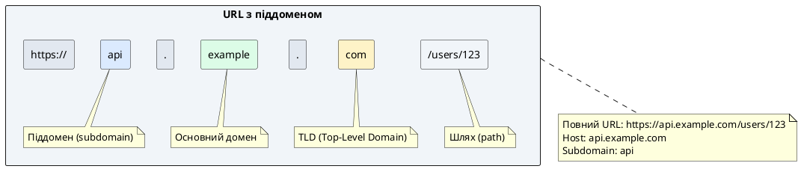
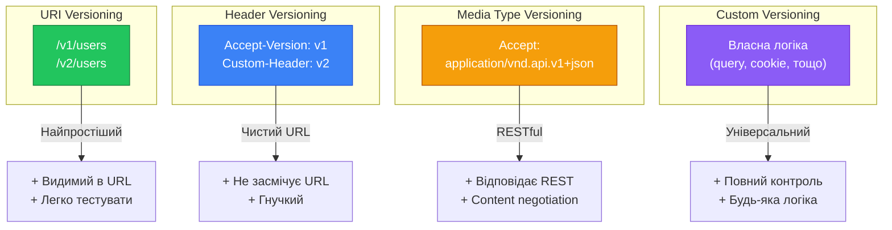

# Маршрутизація за піддоменами та версіонування API

::card-group

::card{title="🎯 Мета лекції" icon="i-lucide-target"}

- Зрозуміти концепцію host-based routing та її переваги для багатопользовацьких систем
- Опанувати використання параметра `host` у декораторі @Controller для піддоменів
- Навчитися витягувати динамічні частини піддомену через @HostParam
- Вивчити підходи до версіонування REST API та їх впл на еволюцію застосунку
- Засвоїти URI Versioning як найпоширеніший метод версіонування
- Практикувати Header Versioning та Media Type Versioning для складних сценаріїв
- Зрозуміти налаштування версіонування через `enableVersioning()` у main.ts
- Навчитися підтримувати кілька версій API одночасно для зворотної сумісності

::

::card{title="🔑 Ключові терміни" icon="i-lucide-key"}

- **Subdomain** (*піддомен*): префікс основного домену (`api.example.com`, `admin.example.com`)
- **Host-based Routing** (*маршрутизація за хостом*): вибір обробника на основі імені домену
- **Multi-tenancy** (*багатопользовацька архітектура*): один застосунок обслуговує кілька клієнтів
- **API Versioning** (*версіонування API*): підтримка кількох версій API для зворотної сумісності
- **Breaking Change** (*критична зміна*): зміна API, що порушує роботу існуючих клієнтів
- **Backward Compatibility** (*зворотна сумісність*): нова версія підтримує старих клієнтів
- **Deprecation** (*застаріння*): оголошення старої версії API застарілою перед видаленням

::

::


## Маршрутизація за піддоменами (Subdomain Routing)

У сучасних веб-застосунках часто виникає необхідність розділити функціональність між різними піддоменами одного основного домену. Наприклад, публічне API може бути доступне за адресою `api.example.com`, адміністративна панель — за `admin.example.com`, а клієнтська документація — за `docs.example.com`. NestJS надає вбудовану підтримку **host-based routing** через параметр `host` у декораторі `@Controller`.

### Проблема, яку вирішує subdomain routing

**Без subdomain routing:**
```typescript
// ❌ Всі ендпоінти на одному домені
GET example.com/api/users
GET example.com/admin/users
GET example.com/docs/api-reference

// Складно розділити логіку, CORS, автентифікацію
```

**З subdomain routing:**
```typescript
// ✅ Логічне розділення за піддоменами
GET api.example.com/users      // Публічне API
GET admin.example.com/users    // Адмін панель
GET docs.example.com/reference // Документація

// Окремі CORS, middleware, Guards для кожного піддомену
```

### Анатомія піддомену

::plant-uml{alt="Структура URL з піддоменом"}



::

**Приклади піддоменів:**

- **api.example.com** — RESTful API для мобільних додатків та інтеграцій
- **admin.example.com** — адміністративна панель для внутрішнього персоналу
- **app.example.com** — клієнтський веб-застосунок (SPA)
- **docs.example.com** — документація API
- **cdn.example.com** — CDN для статичних ресурсів
- **blog.example.com** — блог компанії
- **shop.example.com** — інтернет-магазин

::note
У локальній розробці піддомени можна емулювати через редагування файлу `/etc/hosts` (Linux/macOS) або `C:\Windows\System32\drivers\etc\hosts` (Windows):

```
127.0.0.1 api.localhost
127.0.0.1 admin.localhost
127.0.0.1 app.localhost
```

Після цього застосунок буде доступний за адресами `http://api.localhost:3000`, `http://admin.localhost:3000` тощо.
::


## Параметр host у декораторі @Controller

NestJS дозволяє прив'язати контролер до конкретного піддомену через параметр `host`:

### Базовий синтаксис

```typescript
import { Controller, Get } from '@nestjs/common';

// Контролер для піддомену "api"
@Controller({ host: 'api.localhost', path: 'users' })
export class ApiUsersController {
  @Get()
  findAll() {
    return { message: 'API Users endpoint' };
  }
}

// Контролер для піддомену "admin"
@Controller({ host: 'admin.localhost', path: 'users' })
export class AdminUsersController {
  @Get()
  findAll() {
    return { message: 'Admin Users endpoint' };
  }
}
```

**Поведінка:**
- `GET http://api.localhost:3000/users` → `ApiUsersController.findAll()`
- `GET http://admin.localhost:3000/users` → `AdminUsersController.findAll()`
- `GET http://localhost:3000/users` → 404 Not Found (хост не співпадає)

### Приклад: Розділення публічного API та адмін-панелі

```typescript
// api.controller.ts — Публічне API
import { Controller, Get, Post, Body } from '@nestjs/common';

@Controller({ host: 'api.:domain', path: 'articles' })
export class ApiArticlesController {
  constructor(private readonly articlesService: ArticlesService) {}

  @Get()
  async findAll() {
    // Публічний доступ — лише опубліковані статті
    return this.articlesService.findPublished();
  }

  @Get(':id')
  async findOne(@Param('id') id: string) {
    const article = await this.articlesService.findPublishedById(id);
    
    if (!article) {
      throw new NotFoundException('Article not found');
    }
    
    return article;
  }
}

// admin.controller.ts — Адмін панель
import { Controller, Get, Post, Patch, Delete, UseGuards } from '@nestjs/common';
import { AdminGuard } from './guards/admin.guard';

@Controller({ host: 'admin.:domain', path: 'articles' })
@UseGuards(AdminGuard) // Захист всіх ендпоінтів адмін панелі
export class AdminArticlesController {
  constructor(private readonly articlesService: ArticlesService) {}

  @Get()
  async findAll() {
    // Адмін доступ — всі статті, включно з чернетками
    return this.articlesService.findAll();
  }

  @Post()
  async create(@Body() createArticleDto: CreateArticleDto) {
    return this.articlesService.create(createArticleDto);
  }

  @Patch(':id')
  async update(@Param('id') id: string, @Body() updateDto: UpdateArticleDto) {
    return this.articlesService.update(id, updateDto);
  }

  @Delete(':id')
  async remove(@Param('id') id: string) {
    return this.articlesService.remove(id);
  }
}
```

::terminal-preview{title="Розділення за піддоменами" :cursor="false"}

<div class="line"><span class="opacity-40"># Публічний API — доступ без автентифікації</span></div>
<div class="line"><span class="opacity-40">$</span> <strong class="font-bold">curl http://api.localhost:3000/articles</strong></div>
<div class="line"><span class="text-green-400 font-bold">HTTP/1.1 200 OK</span></div>
<div class="line">[</div>
<div class="line">  { <span class="text-green-400">"id"</span>: <span class="text-yellow-400">1</span>, <span class="text-green-400">"title"</span>: <span class="text-blue-400">"Published Article"</span>, <span class="text-green-400">"status"</span>: <span class="text-blue-400">"published"</span> }</div>
<div class="line">]</div>
<div class="line"></div>
<div class="line"><span class="opacity-40"># Адмін панель — потрібна автентифікація</span></div>
<div class="line"><span class="opacity-40">$</span> <strong class="font-bold">curl http://admin.localhost:3000/articles</strong></div>
<div class="line"><span class="text-rose-400 font-bold">HTTP/1.1 401 Unauthorized</span></div>
<div class="line">{ <span class="text-green-400">"message"</span>: <span class="text-blue-400">"Admin authentication required"</span> }</div>
<div class="line"></div>
<div class="line"><span class="opacity-40">$</span> <strong class="font-bold">curl http://admin.localhost:3000/articles -H "Authorization: Bearer admin-token"</strong></div>
<div class="line"><span class="text-green-400 font-bold">HTTP/1.1 200 OK</span></div>
<div class="line">[</div>
<div class="line">  { <span class="text-green-400">"id"</span>: <span class="text-yellow-400">1</span>, <span class="text-green-400">"title"</span>: <span class="text-blue-400">"Published Article"</span>, <span class="text-green-400">"status"</span>: <span class="text-blue-400">"published"</span> },</div>
<div class="line">  { <span class="text-green-400">"id"</span>: <span class="text-yellow-400">2</span>, <span class="text-green-400">"title"</span>: <span class="text-blue-400">"Draft Article"</span>, <span class="text-green-400">"status"</span>: <span class="text-blue-400">"draft"</span> }</div>
<div class="line">]</div>

::

### Wildcards у host параметрі

Параметр `host` підтримує символ підстановки `:param`, що дозволяє створювати динамічні піддомени:

```typescript
// Підстановка для основного домену
@Controller({ host: 'api.:domain', path: 'users' })
export class ApiController {
  @Get()
  findAll(@HostParam('domain') domain: string) {
    console.log(`Request from domain: ${domain}`);
    // api.example.com → domain = "example.com"
    // api.test.local → domain = "test.local"
  }
}
```

**Зверніть увагу:** `.` перед `:domain` є частиною літерала і **не є wildcard**. Wildcard — це сам параметр `:domain`.


## Декоратор @HostParam: витягування піддомену

Декоратор `@HostParam()` дозволяє витягувати динамічні частини хоста як параметри методу, подібно до `@Param()` для URL:

### Базове використання

```typescript
import { Controller, Get, HostParam } from '@nestjs/common';

@Controller({ host: ':subdomain.example.com', path: 'api' })
export class DynamicSubdomainController {
  @Get('info')
  getInfo(@HostParam('subdomain') subdomain: string) {
    return {
      message: `You are accessing the ${subdomain} subdomain`,
      subdomain,
    };
  }
}
```

**Тестування:**
- `GET http://api.example.com/api/info` → `{ subdomain: "api" }`
- `GET http://admin.example.com/api/info` → `{ subdomain: "admin" }`
- `GET http://v2.example.com/api/info` → `{ subdomain: "v2" }`

### Приклад: Multi-tenancy архітектура

**Multi-tenancy** — це архітектурний підхід, де один застосунок обслуговує кілька незалежних клієнтів (tenant), кожен з яких має власні дані та налаштування. Піддомени ідеально підходять для ідентифікації tenant:

```typescript
import { Controller, Get, HostParam, Param } from '@nestjs/common';

@Controller({ host: ':tenant.saas-app.com', path: 'dashboard' })
export class DashboardController {
  constructor(
    private readonly tenantsService: TenantsService,
    private readonly analyticsService: AnalyticsService,
  ) {}

  @Get()
  async getDashboard(@HostParam('tenant') tenantId: string) {
    // Перевірка існування tenant
    const tenant = await this.tenantsService.findById(tenantId);
    
    if (!tenant) {
      throw new NotFoundException(`Tenant "${tenantId}" not found`);
    }

    // Завантаження даних лише для цього tenant
    const [users, analytics, settings] = await Promise.all([
      this.tenantsService.getUserCount(tenantId),
      this.analyticsService.getStats(tenantId),
      this.tenantsService.getSettings(tenantId),
    ]);

    return {
      tenant: {
        id: tenant.id,
        name: tenant.name,
        plan: tenant.plan,
      },
      users,
      analytics,
      settings,
    };
  }

  @Get('users')
  async getUsers(@HostParam('tenant') tenantId: string) {
    // Користувачі лише для конкретного tenant
    return this.tenantsService.getUsers(tenantId);
  }

  @Get('users/:userId')
  async getUser(
    @HostParam('tenant') tenantId: string,
    @Param('userId') userId: string,
  ) {
    const user = await this.tenantsService.getUser(tenantId, userId);
    
    if (!user) {
      throw new NotFoundException('User not found');
    }
    
    return user;
  }
}
```

**Використання:**
- `GET http://acme-corp.saas-app.com/dashboard` → дані для Acme Corp
- `GET http://startup-inc.saas-app.com/dashboard` → дані для Startup Inc
- `GET http://acme-corp.saas-app.com/dashboard/users/123` → користувач 123 Acme Corp

::warning
**Безпека multi-tenancy:** Критично важливо **ніколи не довіряти** значенню `@HostParam()` без валідації. Завжди перевіряйте існування tenant у базі даних перед завантаженням будь-яких даних:

```typescript
@Get()
async getData(@HostParam('tenant') tenantId: string) {
  // ✅ ОБОВ'ЯЗКОВО: валідація tenant
  const tenant = await this.tenantsService.findById(tenantId);
  
  if (!tenant || !tenant.isActive) {
    throw new NotFoundException('Tenant not found or inactive');
  }
  
  // Тепер безпечно завантажувати дані
  return this.dataService.getForTenant(tenantId);
}
```

Без цієї перевірки зловмисник може підробити піддомен та отримати доступ до даних іншого клієнта!
::

### Комбінування @HostParam та @Param

```typescript
@Controller({ host: ':tenant.example.com', path: 'projects' })
export class ProjectsController {
  @Get(':projectId/tasks/:taskId')
  async getTask(
    @HostParam('tenant') tenantId: string,
    @Param('projectId') projectId: string,
    @Param('taskId') taskId: string,
  ) {
    // Валідація належності проєкту до tenant
    const project = await this.projectsService.findOne(tenantId, projectId);
    
    if (!project) {
      throw new NotFoundException('Project not found');
    }

    const task = await this.tasksService.findOne(projectId, taskId);
    
    if (!task) {
      throw new NotFoundException('Task not found');
    }

    return task;
  }
}
```

**URL структура:**  
`GET http://acme-corp.example.com/projects/proj-123/tasks/task-456`

- `tenantId` = `"acme-corp"` (з піддомену)
- `projectId` = `"proj-123"` (з URL)
- `taskId` = `"task-456"` (з URL)


## Версіонування API: необхідність та підходи

**API Versioning** — це практика підтримки кількох версій API одночасно для забезпечення **зворотної сумісності** (*backward compatibility*) з існуючими клієнтами під час еволюції застосунку. Коли API змінюється способом, що **порушує** роботу старих клієнтів (*breaking change*), нова версія API створюється поруч зі старою, дозволяючи клієнтам мігрувати поступово.

### Чому потрібне версіонування

**Без версіонування:**
```typescript
// ❌ Зміна структури відповіді ламає старих клієнтів
// Було:
GET /users/123 → { "name": "Alice", "email": "..." }

// Стало (BREAKING CHANGE):
GET /users/123 → { "firstName": "Alice", "lastName": "Smith", "contacts": { "email": "..." } }

// Мобільний додаток версії 1.0 очікує поле "name" і ламається!
```

**З версіонуванням:**
```typescript
// ✅ Стара версія продовжує працювати
GET /v1/users/123 → { "name": "Alice", "email": "..." }

// ✅ Нова версія з покращеною структурою
GET /v2/users/123 → { "firstName": "Alice", "lastName": "Smith", "contacts": { "email": "..." } }

// Мобільний додаток 1.0 використовує /v1, додаток 2.0 використовує /v2
```

### Що є breaking change?

**Breaking changes** — зміни, що порушують існуючих клієнтів:

- ❌ Видалення поля з відповіді
- ❌ Зміна назви поля (`name` → `fullName`)
- ❌ Зміна типу поля (string → number)
- ❌ Зміна структури вкладених об'єктів
- ❌ Зміна формату дати/часу
- ❌ Видалення ендпоінту
- ❌ Зміна HTTP-методу ендпоінту

**Non-breaking changes** — зміни, сумісні зі старими клієнтами:

- ✅ Додавання нового поля (клієнти ігнорують невідомі поля)
- ✅ Додавання нового опціонального параметра
- ✅ Додавання нового ендпоінту
- ✅ Виправлення багів без зміни контракту

::note
**Правило thumb:** Якщо зміна API змусить **хоча б одного** існуючого клієнта оновити код для продовження роботи — це **breaking change**, і потрібна нова версія API.
::

### Чотири підходи до версіонування

NestJS підтримує чотири стандартні стратегії версіонування:

::mermaid



::

| Підхід | Приклад | Переваги | Недоліки |
|--------|---------|----------|----------|
| **URI Versioning** | `/v1/users` | Видимий, легко кешується | "Забруднює" URL |
| **Header Versioning** | `Accept-Version: v1` | Чистий URL | Складніше тестувати |
| **Media Type** | `Accept: application/vnd.api.v1+json` | RESTful стандарт | Складно для клієнтів |
| **Custom** | `?version=v1` | Гнучкість | Потрібна реалізація |


## URI Versioning: версіонування через URL

**URI Versioning** — найпопулярніший підхід, де версія API вказується безпосередньо у шляху URL. Використовується компаніями Stripe, Twilio, GitHub, Twitter та більшістю публічних API.

### Налаштування у main.ts

```typescript
// src/main.ts
import { NestFactory } from '@nestjs/core';
import { VersioningType } from '@nestjs/common';
import { AppModule } from './app.module';

async function bootstrap() {
  const app = await NestFactory.create(AppModule);

  // Увімкнення URI versioning
  app.enableVersioning({
    type: VersioningType.URI,
    defaultVersion: '1', // Версія за замовчуванням (опціонально)
    prefix: 'v',         // Префікс версії: "v1", "v2" (за замовчуванням "v")
  });

  await app.listen(3000);
}
bootstrap();
```

### Декоратор @Version у контролерах

```typescript
import { Controller, Get, Version } from '@nestjs/common';

@Controller('users')
export class UsersController {
  // Версія 1 API
  @Version('1')
  @Get()
  findAllV1() {
    return [
      { id: 1, name: 'Alice Johnson' },
      { id: 2, name: 'Bob Smith' },
    ];
  }

  // Версія 2 API — нова структура з окремими полями
  @Version('2')
  @Get()
  findAllV2() {
    return [
      { id: 1, firstName: 'Alice', lastName: 'Johnson', fullName: 'Alice Johnson' },
      { id: 2, firstName: 'Bob', lastName: 'Smith', fullName: 'Bob Smith' },
    ];
  }

  // Метод доступний у кількох версіях
  @Version(['1', '2'])
  @Get(':id')
  findOne(@Param('id') id: string, @Version() version: string) {
    console.log(`Called from version: ${version}`);
    
    if (version === '1') {
      return { id, name: 'Alice Johnson' };
    }
    
    return { id, firstName: 'Alice', lastName: 'Johnson' };
  }
}
```

**Маршрути:**
- `GET /v1/users` → `findAllV1()`
- `GET /v2/users` → `findAllV2()`
- `GET /v1/users/123` → `findOne()` (версія 1)
- `GET /v2/users/123` → `findOne()` (версія 2)

::terminal-preview{title="URI Versioning" :cursor="false"}

<div class="line"><span class="opacity-40"># Версія 1 API</span></div>
<div class="line"><span class="opacity-40">$</span> <strong class="font-bold">curl http://localhost:3000/v1/users</strong></div>
<div class="line"><span class="text-green-400 font-bold">HTTP/1.1 200 OK</span></div>
<div class="line">[</div>
<div class="line">  { <span class="text-green-400">"id"</span>: <span class="text-yellow-400">1</span>, <span class="text-green-400">"name"</span>: <span class="text-blue-400">"Alice Johnson"</span> },</div>
<div class="line">  { <span class="text-green-400">"id"</span>: <span class="text-yellow-400">2</span>, <span class="text-green-400">"name"</span>: <span class="text-blue-400">"Bob Smith"</span> }</div>
<div class="line">]</div>
<div class="line"></div>
<div class="line"><span class="opacity-40"># Версія 2 API — нова структура</span></div>
<div class="line"><span class="opacity-40">$</span> <strong class="font-bold">curl http://localhost:3000/v2/users</strong></div>
<div class="line"><span class="text-green-400 font-bold">HTTP/1.1 200 OK</span></div>
<div class="line">[</div>
<div class="line">  { <span class="text-green-400">"id"</span>: <span class="text-yellow-400">1</span>, <span class="text-green-400">"firstName"</span>: <span class="text-blue-400">"Alice"</span>, <span class="text-green-400">"lastName"</span>: <span class="text-blue-400">"Johnson"</span>, <span class="text-green-400">"fullName"</span>: <span class="text-blue-400">"Alice Johnson"</span> },</div>
<div class="line">  { <span class="text-green-400">"id"</span>: <span class="text-yellow-400">2</span>, <span class="text-green-400">"firstName"</span>: <span class="text-blue-400">"Bob"</span>, <span class="text-green-400">"lastName"</span>: <span class="text-blue-400">"Smith"</span>, <span class="text-green-400">"fullName"</span>: <span class="text-blue-400">"Bob Smith"</span> }</div>
<div class="line">]</div>
<div class="line"></div>
<div class="line"><span class="opacity-40"># Спроба доступу до неіснуючої версії</span></div>
<div class="line"><span class="opacity-40">$</span> <strong class="font-bold">curl http://localhost:3000/v3/users</strong></div>
<div class="line"><span class="text-rose-400 font-bold">HTTP/1.1 404 Not Found</span></div>

::

### Версіонування на рівні контролера

```typescript
// Весь контролер прив'язаний до версії 1
@Controller({ path: 'articles', version: '1' })
export class ArticlesV1Controller {
  @Get()
  findAll() {
    return { version: 'v1', articles: [] };
  }
}

// Контролер для версії 2
@Controller({ path: 'articles', version: '2' })
export class ArticlesV2Controller {
  @Get()
  findAll() {
    return { version: 'v2', articles: [], pagination: {} };
  }
}
```

### Neutral версія (без версіонування)

Деякі ендпоінти можуть бути **version-neutral** — доступні без префікса версії:

```typescript
@Controller('health')
export class HealthController {
  // Доступний як /health (без /v1, /v2)
  @Get()
  check() {
    return { status: 'ok', timestamp: Date.now() };
  }
}
```


## Header Versioning: версіонування через заголовки

**Header Versioning** передає версію через HTTP-заголовок, зберігаючи URL чистими. Використовується у деяких enterprise-системах та внутрішніх API.

### Налаштування

```typescript
// src/main.ts
import { VersioningType } from '@nestjs/common';

async function bootstrap() {
  const app = await NestFactory.create(AppModule);

  app.enableVersioning({
    type: VersioningType.HEADER,
    header: 'X-API-Version', // Назва заголовка
  });

  await app.listen(3000);
}
bootstrap();
```

### Використання

```typescript
@Controller('users')
export class UsersController {
  @Version('1')
  @Get()
  findAllV1() {
    return { version: 'v1', users: [] };
  }

  @Version('2')
  @Get()
  findAllV2() {
    return { version: 'v2', users: [], meta: {} };
  }
}
```

**Запити:**
```bash
# Версія 1
curl http://localhost:3000/users -H "X-API-Version: 1"

# Версія 2
curl http://localhost:3000/users -H "X-API-Version: 2"
```

**Переваги:**
- ✅ URL залишаються чистими
- ✅ Легко додавати нові версії
- ✅ Не впливає на кешування URL

**Недоліки:**
- ❌ Складніше тестувати у браузері
- ❌ Потрібна документація для клієнтів
- ❌ Потрібна підтримка у HTTP-клієнтах


## Media Type Versioning: версіонування через Accept

**Media Type Versioning** використовує заголовок `Accept` для вказівки версії через **custom media type**. Це найбільш RESTful підхід, рекомендований Roy Fielding (автором REST).

### Налаштування

```typescript
// src/main.ts
import { VersioningType } from '@nestjs/common';

async function bootstrap() {
  const app = await NestFactory.create(AppModule);

  app.enableVersioning({
    type: VersioningType.MEDIA_TYPE,
    key: 'v=', // Ключ у media type: "v=1"
  });

  await app.listen(3000);
}
bootstrap();
```

### Використання

```typescript
@Controller('users')
export class UsersController {
  @Version('1')
  @Get()
  findAllV1() {
    return { version: 'v1', users: [] };
  }

  @Version('2')
  @Get()
  findAllV2() {
    return { version: 'v2', users: [] };
  }
}
```

**Запити:**
```bash
# Версія 1
curl http://localhost:3000/users \
  -H "Accept: application/json;v=1"

# Версія 2
curl http://localhost:3000/users \
  -H "Accept: application/json;v=2"

# Альтернативний формат (vendor media type)
curl http://localhost:3000/users \
  -H "Accept: application/vnd.myapp.v1+json"
```

**Переваги:**
- ✅ Відповідає REST-принципам
- ✅ Підтримує content negotiation
- ✅ Чисті URL

**Недоліки:**
- ❌ Найскладніший для клієнтів
- ❌ Рідко використовується у практиці
- ❌ Складна конфігурація


## Custom Versioning: власна логіка

Для нестандартних сценаріїв NestJS дозволяє реалізувати власну логіку версіонування:

```typescript
// src/main.ts
import { VersioningType, VERSION_NEUTRAL } from '@nestjs/common';

async function bootstrap() {
  const app = await NestFactory.create(AppModule);

  app.enableVersioning({
    type: VersioningType.CUSTOM,
    extractor: (request) => {
      // Витягуємо версію з query параметра
      const version = request.query?.version as string;
      
      // Або з cookie
      const versionFromCookie = request.cookies?.api_version;
      
      // Або з піддомену
      const subdomain = request.hostname.split('.')[0];
      if (subdomain.startsWith('v')) {
        return subdomain.slice(1); // "v2" → "2"
      }
      
      return version || versionFromCookie || VERSION_NEUTRAL;
    },
  });

  await app.listen(3000);
}
bootstrap();
```

**Приклади запитів:**
```bash
# Версія через query
GET /users?version=1

# Версія через cookie
GET /users
Cookie: api_version=2

# Версія через піддомен
GET http://v2.api.example.com/users
```


## Best Practices: версіонування у продакшні

::steps

### Крок 1. Виберіть одну стратегію та дотримуйтесь її

Не змішуйте URI versioning з header versioning у одному API. Це заплутує клієнтів.

**✅ Рекомендація:** Використовуйте **URI Versioning** для публічних API (простота для клієнтів) та **Header Versioning** для внутрішніх корпоративних систем.

### Крок 2. Документуйте breaking changes

Ведіть CHANGELOG з чітким позначенням breaking changes:

```markdown
## [2.0.0] - 2026-09-04
### 💥 Breaking Changes
- Поле `name` замінено на `firstName` та `lastName` у `/users`
- Видалено ендпоінт `DELETE /users/bulk`

### ✨ New Features
- Додано пагінацію до `/users` (поля `page`, `limit`, `total`)

### Migration Guide
Оновіть клієнтський код:
- Було: `user.name`
- Стало: `user.firstName + ' ' + user.lastName`
```

### Крок 3. Встановіть deprecation period

Оголошуйте стару версію **deprecated** за 3-6 місяців до видалення:

```typescript
@Controller('users')
export class UsersController {
  @Version('1')
  @Header('X-API-Deprecated', 'true')
  @Header('X-API-Sunset', '2027-03-01') // Дата видалення
  @Get()
  findAllV1() {
    return {
      _warning: 'This API version is deprecated. Please migrate to /v2/users',
      _sunset: '2027-03-01',
      users: [],
    };
  }
}
```

### Крок 4. Версіонуйте DTO окремо

```typescript
// dto/v1/create-user.dto.ts
export class CreateUserDtoV1 {
  @IsString()
  name: string;  // Повне ім'я
  
  @IsEmail()
  email: string;
}

// dto/v2/create-user.dto.ts
export class CreateUserDtoV2 {
  @IsString()
  firstName: string;  // Роздільні поля
  
  @IsString()
  lastName: string;
  
  @IsEmail()
  email: string;
}
```

### Крок 5. Підтримуйте максимум 2-3 версії одночасно

Кожна додаткова версія збільшує складність підтримки. Стандартна практика:

- **v1** — стара версія (deprecated)
- **v2** — поточна стабільна версія
- **v3** — нова версія (beta)

::

## Підсумки та ключові висновки

::card-group

::card{title="✅ Ключові моменти" icon="i-lucide-check-circle"}

- **Host-based routing** дозволяє маршрутизацію на основі піддомену через параметр `host`
- **@HostParam** витягує динамічні частини піддомену як параметри методу
- **Multi-tenancy** ідеально реалізується через піддомени (`:tenant.saas.com`)
- **API Versioning** необхідне для підтримки зворотної сумісності при breaking changes
- **URI Versioning** (`/v1/users`) — найпопулярніший та найпростіший підхід
- **Header Versioning** зберігає URL чистими, але складніший для клієнтів
- **Media Type Versioning** — найбільш RESTful, але рідко використовується
- Налаштування версіонування через `app.enableVersioning()` у main.ts
- Декоратор **@Version()** вказує версію на рівні методу або контролера

::

::card{title="🎓 Практичні рекомендації" icon="i-lucide-graduation-cap"}

- Використовуйте **URI Versioning** для публічних API (простота)
- Завжди валідуйте **@HostParam** перед використанням у БД-запитах
- Документуйте **breaking changes** у CHANGELOG з migration guide
- Встановлюйте **deprecation period** 3-6 місяців перед видаленням версії
- Підтримуйте максимум **2-3 версії** API одночасно
- Додавайте заголовок **X-API-Deprecated** до застарілих версій
- Версіонуйте **DTO окремо** для кожної версії API
- Використовуйте **semantic versioning**: v1, v2, v3 (не v1.0, v1.1)
- Тестуйте **усі підтримувані версії** у CI/CD pipeline

::

::

::tip
Практикуйте версіонування на реальних проєктах. Створіть API з двома версіями, де v2 змінює структуру відповіді (наприклад, розділяє `name` на `firstName` та `lastName`). Додайте deprecation warning до v1 та migration guide. Це найкращий спосіб зрозуміти нюанси зворотної сумісності та lifecycle management API.
::
