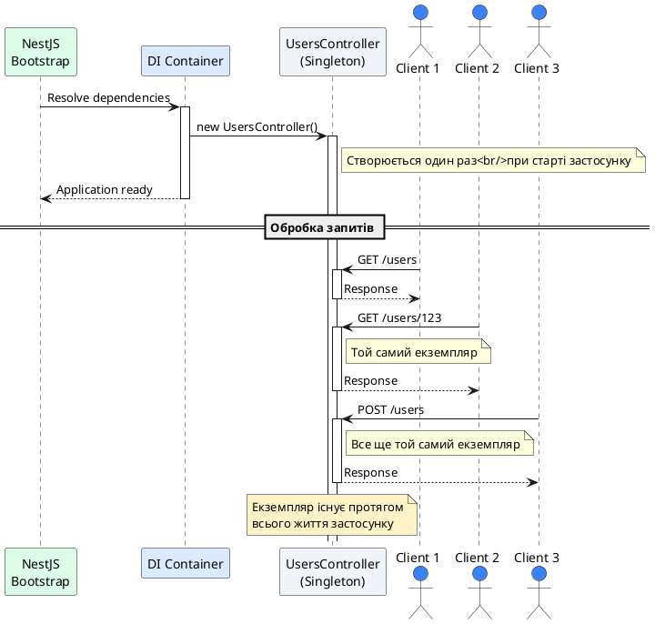
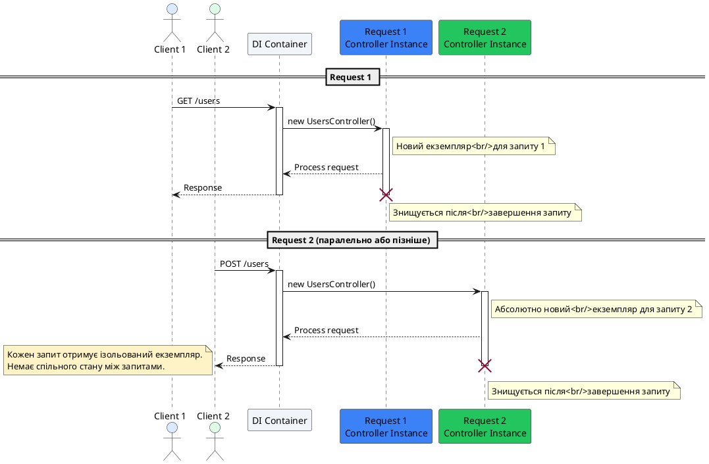
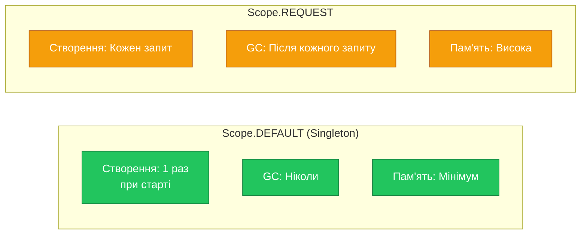
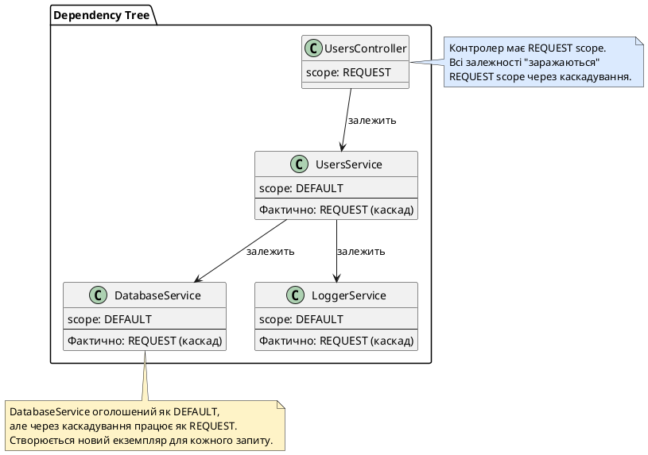
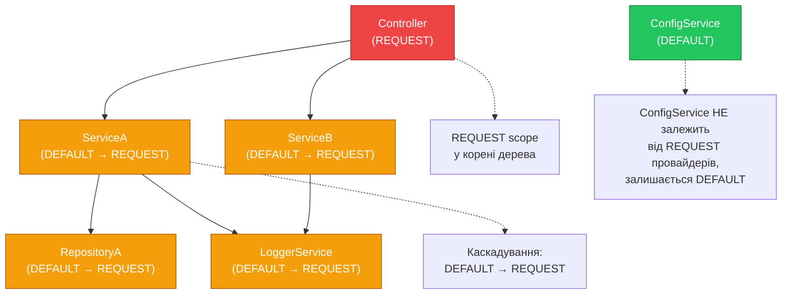

```mermaid
graph TB
    subgraph "Scope.DEFAULT (Singleton)"
        D1["🚀 Application Bootstrap"]
        D2["Створення екземпляра<br/>UsersController"]
        D3["HTTP Request 1"]
        D4["HTTP Request 2"]
        D5["HTTP Request N"]
        D6["💤 Application Shutdown"]
        
        D1 --> D2
        D2 --> D3
        D2 --> D4
        D2 --> D5
        D5 --> D6
        
        style D2 fill:#22c55e,stroke:#15803d,color:#ffffff
        style D3 fill:#DBEAFE,stroke:#1d4ed8,color:#1e293b
        style D4 fill:#DBEAFE,stroke:#1d4ed8,color:#1e293b
        style D5 fill:#DBEAFE,stroke:#1d4ed8,color:#1e293b
    end
    
    subgraph "Scope.REQUEST"
        R1["HTTP Request 1"]
        R2["Створення екземпляра"]
        R3["Обробка запиту"]
        R4["🗑️ Знищення екземпляра"]
        
        R5["HTTP Request 2"]
        R6["Створення нового екземпляра"]
        
        R1 --> R2
        R2 --> R3
        R3 --> R4
        
        R5 --> R6
        
        style R2 fill:#f59e0b,stroke:#b45309,color:#ffffff
        style R6 fill:#f59e0b,stroke:#b45309,color:#ffffff
    end
    
    subgraph "Scope.TRANSIENT"
        T1["Ін'єкція у Controller"]
        T2["Створення екземпляра A"]
        
        T3["Ін'єкція у Service"]
        T4["Створення екземпляра B"]
        
        T1 --> T2
        T3 --> T4
        
        style T2 fill:#ef4444,stroke:#b91c1c,color:#ffffff
        style T4 fill:#ef4444,stroke:#b91c1c,color:#ffffff
    end
```

# Області видимості контролерів (Scopes)

::card-group

::card{title="🎯 Мета лекції" icon="i-lucide-target"}

- Зрозуміти концепцію областей видимості (*Injection Scope*) у контексті Dependency Injection
- Опанувати три типи scope: DEFAULT (Singleton), REQUEST та TRANSIENT
- Вивчити життєвий цикл екземплярів контролерів та провайдерів для кожного scope
- Засвоїти вплив scope на продуктивність застосунку та споживання пам'яті
- Навчитися розпізнавати сценарії, де REQUEST scope є необхідним
- Практикувати конфігурацію scope через параметри @Injectable та @Controller
- Зрозуміти механізм каскадування scope у дереві залежностей
- Ознайомитися з обмеженнями REQUEST scope у контексті WebSocket та мікросервісів

::

::card{title="🔑 Ключові терміни" icon="i-lucide-key"}

- **Injection Scope** (*область видимості ін'єкції*): правило, що визначає життєвий цикл екземпляра класу
- **Singleton Pattern** (*патерн одинак*): один екземпляр об'єкта на весь застосунок
- **Request-scoped**: новий екземпляр створюється для кожного HTTP-запиту
- **Transient**: новий екземпляр створюється при кожній ін'єкції залежності
- **Instance Lifecycle** (*життєвий цикл екземпляра*): час існування об'єкта від створення до знищення
- **Scope Cascading** (*каскадування scope*): автоматичне успадкування scope залежностями
- **Multi-tenancy**: архітектурний патерн, де один застосунок обслуговує кількох клієнтів

::

::


## Концепція областей видимості у Dependency Injection

У попередніх лекціях ми вивчили, як NestJS автоматично створює та ін'єктує залежності через контейнер IoC (*Inversion of Control*). Проте ми не обговорювали **життєвий цикл** цих об'єктів: як довго вони існують, коли створюються та коли знищуються. Саме це визначає **область видимості** (*scope*) провайдера чи контролера.

### Проблема життєвого циклу об'єктів

Розглянемо типову архітектуру NestJS застосунку:

```typescript
@Controller('users')
export class UsersController {
  constructor(
    private readonly usersService: UsersService,
    private readonly logger: Logger,
  ) {}
  
  @Get()
  findAll() {
    this.logger.log('Finding all users');
    return this.usersService.findAll();
  }
}
```

**Запитання, на які має відповісти scope:**

1. **Коли створюється екземпляр `UsersController`?**
   - При старті застосунку один раз?
   - При кожному HTTP-запиті?
   - При кожному виклику методу?

2. **Чи спільно використовують кілька запитів той самий екземпляр `UsersService`?**
   - Якщо так, як захистити стан від race conditions?
   - Якщо ні, чи не буде це надто дорого для продуктивності?

3. **Що станеться, якщо `Logger` зберігає контекст конкретного запиту?**
   - Чи не перемішаються логи від різних користувачів?
   - Чи не витікає інформація між запитами?

**Область видимості** (*scope*) надає чіткі відповіді на ці запитання, визначаючи стратегію управління життєвим циклом об'єктів.

### Три типи scope у NestJS

NestJS підтримує три області видимості через enum `Scope`:

::mermaid



::

| Scope | Життєвий цикл | Спільне використання | Продуктивність |
|-------|--------------|---------------------|----------------|
| **DEFAULT** | Один екземпляр на застосунок | ✅ Всі запити | ⚡️ Найшвидший |
| **REQUEST** | Новий екземпляр на кожен HTTP-запит | ❌ Ізольовані | 🐢 Повільніший |
| **TRANSIENT** | Новий екземпляр при кожній ін'єкції | ❌ Унікальні | 🐌 Найповільніший |

::note
За замовчуванням **всі** провайдери та контролери у NestJS мають scope `Scope.DEFAULT` (Singleton). Це оптимальний вибір для 95% випадків, оскільки забезпечує максимальну продуктивність та мінімальне споживання пам'яті.
::


## Scope.DEFAULT: Singleton Pattern

**Scope.DEFAULT** реалізує класичний патерн **Singleton** (*одинак*): NestJS створює **один екземпляр** класу при старті застосунку та **повторно використовує** його для всіх наступних запитів. Це поведінка за замовчуванням, якщо scope не вказано явно.

### Життєвий цикл Singleton

::plant-uml{alt="Життєвий цикл DEFAULT scope"}



::

### Приклад: DEFAULT scope (неявна поведінка)

```typescript
import { Injectable, Controller, Get } from '@nestjs/common';

// За замовчуванням scope = Scope.DEFAULT
@Injectable()
export class UsersService {
  private callCount = 0; // Лічильник спільний для всіх запитів
  
  findAll() {
    this.callCount++;
    console.log(`UsersService.findAll() called ${this.callCount} times`);
    
    return [
      { id: 1, name: 'Alice' },
      { id: 2, name: 'Bob' },
    ];
  }
}

@Controller('users')
export class UsersController {
  constructor(private readonly usersService: UsersService) {
    console.log('UsersController instance created');
  }
  
  @Get()
  findAll() {
    return this.usersService.findAll();
  }
}
```

**Поведінка у консолі при запуску та запитах:**

::terminal-preview{title="npm run start:dev" :cursor="false"}

<div class="line"><span class="text-blue-400 font-bold">[Nest]</span> Application bootstrapping...</div>
<div class="line"><span class="opacity-40">→</span> UsersController instance created</div>
<div class="line"><span class="text-green-400 font-bold">[Nest]</span> Nest application successfully started</div>
<div class="line"></div>
<div class="line"><span class="opacity-40">// Перший запит:</span></div>
<div class="line"><span class="text-yellow-400">GET /users</span></div>
<div class="line">UsersService.findAll() called <span class="text-green-400 font-bold">1</span> times</div>
<div class="line"></div>
<div class="line"><span class="opacity-40">// Другий запит:</span></div>
<div class="line"><span class="text-yellow-400">GET /users</span></div>
<div class="line">UsersService.findAll() called <span class="text-green-400 font-bold">2</span> times</div>
<div class="line"></div>
<div class="line"><span class="opacity-40">// Третій запит:</span></div>
<div class="line"><span class="text-yellow-400">GET /users</span></div>
<div class="line">UsersService.findAll() called <span class="text-green-400 font-bold">3</span> times</div>

::

**Важливе спостереження:**
- Повідомлення `"UsersController instance created"` з'являється **лише один раз** при старті
- Лічильник `callCount` **зберігається між запитами**, оскільки це один і той же екземпляр

### Переваги Scope.DEFAULT

1. **Максимальна продуктивність**
   - Об'єкт створюється лише один раз — немає накладних витрат на повторне створення
   - Немає витрат на garbage collection після кожного запиту

2. **Мінімальне споживання пам'яті**
   - Один екземпляр на застосунок, незалежно від кількості запитів
   - Критично для застосунків з тисячами одночасних підключень

3. **Простота кешування**
   - Можна безпечно кешувати дані у полях класу (з обережністю щодо конкурентності)
   - Ідеально для конфігурацій, з'єднань з БД, пулів потоків

::tip
**Рекомендація:** Використовуйте Scope.DEFAULT скрізь, де це можливо. Переходьте на REQUEST або TRANSIENT scope **лише** якщо у вас є конкретна технічна причина (request-специфічний контекст, multi-tenancy тощо).
::

### Застереження: Спільний стан

Оскільки екземпляр спільний між усіма запитами, потрібно бути обережним зі станом:

```typescript
@Injectable()
export class DangerousService {
  // ❌ НЕБЕЗПЕЧНО: currentUser перезаписується між запитами
  private currentUser: User;
  
  setUser(user: User) {
    this.currentUser = user; // Race condition!
  }
  
  getUser(): User {
    return this.currentUser; // Може повернути чужого користувача!
  }
}
```

**Проблема:** Якщо два запити обробляються одночасно, `currentUser` може бути перезаписаний посередині виконання, що призведе до **витоку даних між користувачами**.

**Рішення:**
- Передавайте контекст як параметр методу замість збереження у полі
- Або використовуйте REQUEST scope (розглянемо далі)


```typescript
// ✅ БЕЗПЕЧНО: передаємо контекст як параметр
@Injectable()
export class SafeService {
  processOrder(user: User, order: Order) {
    // user існує лише в локальному scope методу
    return {
      userId: user.id,
      orderId: order.id,
      total: order.total,
    };
  }
}
```


## Scope.REQUEST: Ізоляція контексту запиту

**Scope.REQUEST** інструктує NestJS створювати **новий екземпляр** класу для кожного вхідного HTTP-запиту. Після завершення обробки запиту екземпляр автоматично знищується та очищується збирачем сміття (*garbage collector*).

### Життєвий цикл REQUEST scope

::plant-uml{alt="Життєвий цикл REQUEST scope"}



::

### Конфігурація REQUEST scope

Scope вказується через параметр `scope` у декораторі `@Injectable()` або `@Controller()`:

```typescript
import { Injectable, Controller, Get, Scope } from '@nestjs/common';

// Провайдер з REQUEST scope
@Injectable({ scope: Scope.REQUEST })
export class RequestContextService {
  private requestId: string;
  private userId: string;
  
  setContext(requestId: string, userId: string) {
    this.requestId = requestId;
    this.userId = userId;
  }
  
  getContext() {
    return {
      requestId: this.requestId,
      userId: this.userId,
    };
  }
  
  log(message: string) {
    console.log(`[${this.requestId}] [User: ${this.userId}] ${message}`);
  }
}

// Контролер з REQUEST scope
@Controller({ path: 'orders', scope: Scope.REQUEST })
export class OrdersController {
  constructor(
    private readonly contextService: RequestContextService,
    private readonly ordersService: OrdersService,
  ) {
    console.log('New OrdersController instance created');
  }
  
  @Get()
  async findAll() {
    // Кожен запит має свій контекст
    this.contextService.log('Fetching all orders');
    return this.ordersService.findAll();
  }
}
```

**Поведінка:**

::terminal-preview{title="Паралельні запити" :cursor="false"}

<div class="line"><span class="opacity-40">// Request 1:</span></div>
<div class="line">New OrdersController instance created</div>
<div class="line"><span class="text-blue-400">[req-abc123]</span> <span class="text-yellow-400">[User: alice]</span> Fetching all orders</div>
<div class="line"></div>
<div class="line"><span class="opacity-40">// Request 2 (одночасно):</span></div>
<div class="line">New OrdersController instance created</div>
<div class="line"><span class="text-blue-400">[req-xyz789]</span> <span class="text-yellow-400">[User: bob]</span> Fetching all orders</div>
<div class="line"></div>
<div class="line"><span class="opacity-40">// Request 3:</span></div>
<div class="line">New OrdersController instance created</div>
<div class="line"><span class="text-blue-400">[req-def456]</span> <span class="text-yellow-400">[User: alice]</span> Fetching all orders</div>

::

Кожен запит отримує **власний екземпляр** `OrdersController` та `RequestContextService`, тому контекст (requestId, userId) **не змішується** між запитами.

### Коли використовувати REQUEST scope

REQUEST scope вирішує специфічні архітектурні проблеми, де потрібна **ізоляція контексту** між запитами:

#### 1. Multi-tenancy (багатопользовацька архітектура)

У системах, де один застосунок обслуговує кілька клієнтів (*tenants*), потрібно ізолювати дані кожного клієнта:

```typescript
import { Injectable, Scope, Inject } from '@nestjs/common';
import { REQUEST } from '@nestjs/core';
import { Request } from 'express';

@Injectable({ scope: Scope.REQUEST })
export class TenantService {
  private tenantId: string;
  
  constructor(@Inject(REQUEST) private readonly request: Request) {
    // Витягуємо tenantId з заголовка або піддомену
    this.tenantId = this.extractTenantId(request);
  }
  
  private extractTenantId(req: Request): string {
    // Варіант 1: З заголовка
    const headerTenant = req.headers['x-tenant-id'] as string;
    if (headerTenant) return headerTenant;
    
    // Варіант 2: З піддомену (acme.app.com → acme)
    const host = req.hostname;
    const subdomain = host.split('.')[0];
    
    return subdomain;
  }
  
  getTenantId(): string {
    return this.tenantId;
  }
}

@Injectable({ scope: Scope.REQUEST })
export class UsersService {
  constructor(
    private readonly tenantService: TenantService,
    private readonly database: Database,
  ) {}
  
  async findAll() {
    const tenantId = this.tenantService.getTenantId();
    
    // Запит до БД фільтрується за tenantId
    return this.database.query(
      'SELECT * FROM users WHERE tenant_id = $1',
      [tenantId],
    );
  }
}
```

**Переваги:**
- Автоматична ізоляція даних на рівні DI контейнера
- Неможливо випадково отримати дані іншого клієнта

#### 2. Request-specific logging

Логування з контекстом запиту (request ID, user ID, trace ID):

```typescript
import { Injectable, Scope, Inject, Logger } from '@nestjs/common';
import { REQUEST } from '@nestjs/core';
import { Request } from 'express';
import { v4 as uuidv4 } from 'uuid';

@Injectable({ scope: Scope.REQUEST })
export class RequestLogger extends Logger {
  private requestId: string;
  private userId: string;
  
  constructor(@Inject(REQUEST) private readonly request: Request) {
    super('HTTP');
    
    // Генеруємо або витягуємо request ID
    this.requestId = (request.headers['x-request-id'] as string) || uuidv4();
    
    // Витягуємо userId з автентифікації (якщо доступний)
    this.userId = (request as any).user?.id || 'anonymous';
  }
  
  log(message: string) {
    super.log(`[${this.requestId}] [User: ${this.userId}] ${message}`);
  }
  
  error(message: string, trace?: string) {
    super.error(`[${this.requestId}] [User: ${this.userId}] ${message}`, trace);
  }
}

@Controller('products')
export class ProductsController {
  constructor(
    private readonly logger: RequestLogger,
    private readonly productsService: ProductsService,
  ) {}
  
  @Get()
  async findAll() {
    this.logger.log('Fetching all products');
    const products = await this.productsService.findAll();
    this.logger.log(`Found ${products.length} products`);
    return products;
  }
}
```

**Результат у консолі:**

::terminal-preview{title="Structured logging" :cursor="false"}

<div class="line"><span class="text-blue-400 font-bold">[HTTP]</span> <span class="opacity-40">[a7f3e9c1]</span> <span class="text-yellow-400">[User: alice]</span> Fetching all products</div>
<div class="line"><span class="text-blue-400 font-bold">[HTTP]</span> <span class="opacity-40">[b2d8f4a6]</span> <span class="text-yellow-400">[User: bob]</span> Fetching all products</div>
<div class="line"><span class="text-blue-400 font-bold">[HTTP]</span> <span class="opacity-40">[a7f3e9c1]</span> <span class="text-yellow-400">[User: alice]</span> Found 42 products</div>
<div class="line"><span class="text-blue-400 font-bold">[HTTP]</span> <span class="opacity-40">[b2d8f4a6]</span> <span class="text-yellow-400">[User: bob]</span> Found 42 products</div>

::

Логи чітко розділені за request ID, навіть якщо запити обробляються паралельно.

#### 3. Ін'єкція об'єкта Request

REQUEST scope дозволяє ін'єктувати нативний об'єкт `Request` з Express/Fastify через токен `REQUEST`:

```typescript
import { Injectable, Scope, Inject } from '@nestjs/common';
import { REQUEST } from '@nestjs/core';
import { Request } from 'express';

@Injectable({ scope: Scope.REQUEST })
export class AuditService {
  constructor(@Inject(REQUEST) private readonly request: Request) {}
  
  async logAction(action: string, entityId: string) {
    const auditEntry = {
      action,
      entityId,
      userId: (this.request as any).user?.id,
      ipAddress: this.request.ip,
      userAgent: this.request.headers['user-agent'],
      timestamp: new Date(),
    };
    
    // Зберігаємо аудит у БД
    await this.database.save('audit_log', auditEntry);
  }
}
```

::warning
**Важливо:** REQUEST scope працює **лише** з HTTP-контекстом (Express/Fastify). Він **не підтримується** у WebSocket Gateway, GraphQL Subscription, Microservices та Cron Jobs, оскільки у цих контекстах немає поняття "HTTP-запиту".
::

### Вплив на продуктивність

REQUEST scope має суттєві накладні витрати порівняно з DEFAULT:

::mermaid



::

**Виміри продуктивності** (умовні, залежать від складності залежностей):

| Метрика | DEFAULT | REQUEST | Різниця |
|---------|---------|---------|---------|
| **Requests/sec** | 10,000 | 7,500 | -25% |
| **Latency P95** | 15ms | 22ms | +47% |
| **Memory usage** | 80MB | 150MB | +87% |

::caution
**Критичне для продакшн:** REQUEST scope може **знизити пропускну здатність на 20-30%** та **збільшити споживання пам'яті у 2 рази**. Використовуйте його лише там, де DEFAULT scope технічно неможливий.
::


## Scope.TRANSIENT: Унікальні екземпляри

**Scope.TRANSIENT** створює **новий екземпляр** класу при **кожній ін'єкції** залежності, навіть у межах одного запиту. Це найрідкісний scope, що використовується лише у специфічних сценаріях.

### Відмінність TRANSIENT від REQUEST

```typescript
@Injectable({ scope: Scope.TRANSIENT })
export class TransientService {
  private instanceId = Math.random().toString(36);
  
  getInstanceId() {
    return this.instanceId;
  }
}

@Controller('demo')
export class DemoController {
  constructor(
    private readonly service1: TransientService,
    private readonly service2: TransientService,
  ) {
    console.log('Service 1 ID:', service1.getInstanceId());
    console.log('Service 2 ID:', service2.getInstanceId());
  }
}
```

**Вивід при старті:**

::terminal-preview{title="TRANSIENT scope behavior" :cursor="false"}

<div class="line">Service 1 ID: <span class="text-blue-400 font-bold">k7h9x2p</span></div>
<div class="line">Service 2 ID: <span class="text-green-400 font-bold">m3n8q1r</span></div>

::

Навіть у межах одного контролера кожна ін'єкція `TransientService` отримує **власний екземпляр**.

### Порівняльна таблиця scope

| Аспект | DEFAULT | REQUEST | TRANSIENT |
|--------|---------|---------|-----------|
| **Екземплярів на застосунок** | 1 | N (кількість запитів) | M (кількість ін'єкцій) |
| **Створюється** | При старті | Початок запиту | При resolve залежності |
| **Знищується** | При shutdown | Кінець запиту | При GC |
| **Спільний між запитами** | ✅ Так | ❌ Ні | ❌ Ні |
| **Спільний у межах запиту** | ✅ Так | ✅ Так | ❌ Ні |
| **Продуктивність** | ⚡️⚡️⚡️ | ⚡️ | 🐌 |
| **Використання** | 95% випадків | Multi-tenancy, request context | Рідкісні edge cases |

::note
**Практична рекомендація:** У реальних проєктах TRANSIENT scope майже ніколи не використовується. Якщо вам потрібна ізоляція — використовуйте REQUEST scope або фабричні функції замість ін'єкції.
::


## Каскадування scope у дереві залежностей

Одна з найважливіших особливостей scope у NestJS — **каскадування** (*scope bubbling*): якщо провайдер має non-default scope (REQUEST або TRANSIENT), **всі його залежності автоматично успадковують цей scope**, навіть якщо у них вказано DEFAULT.

### Механізм каскадування

::plant-uml{alt="Каскадування scope у дереві залежностей"}



::

### Приклад каскадування

```typescript
// database.service.ts
@Injectable() // scope: Scope.DEFAULT (за замовчуванням)
export class DatabaseService {
  constructor() {
    console.log('DatabaseService instance created');
  }
  
  query(sql: string) {
    return `Executing: ${sql}`;
  }
}

// users.service.ts
@Injectable() // scope: Scope.DEFAULT
export class UsersService {
  constructor(private readonly db: DatabaseService) {
    console.log('UsersService instance created');
  }
  
  findAll() {
    return this.db.query('SELECT * FROM users');
  }
}

// users.controller.ts
@Controller({ path: 'users', scope: Scope.REQUEST })
export class UsersController {
  constructor(private readonly usersService: UsersService) {
    console.log('UsersController instance created');
  }
  
  @Get()
  findAll() {
    return this.usersService.findAll();
  }
}
```

**Поведінка при двох паралельних запитах:**

::terminal-preview{title="Scope cascading в дії" :cursor="false"}

<div class="line"><span class="opacity-40">// Request 1:</span></div>
<div class="line">UsersController instance created</div>
<div class="line">UsersService instance created</div>
<div class="line">DatabaseService instance created</div>
<div class="line"><span class="text-blue-400">GET /users → 200 OK</span></div>
<div class="line"></div>
<div class="line"><span class="opacity-40">// Request 2 (одночасно):</span></div>
<div class="line">UsersController instance created</div>
<div class="line">UsersService instance created</div>
<div class="line">DatabaseService instance created</div>
<div class="line"><span class="text-blue-400">GET /users → 200 OK</span></div>

::

**Ключове спостереження:**
Навіть хоча `UsersService` та `DatabaseService` оголошені як `Scope.DEFAULT`, вони створюються **заново для кожного запиту**, оскільки їх споживач (`UsersController`) має `Scope.REQUEST`.

### Візуалізація каскадування

::mermaid



::

**Правило:** Каскадування відбувається **вниз** по дереву залежностей. Якщо провайдер **не споживається** REQUEST-scoped класом, він залишається DEFAULT.

### Вимикання каскадування через durable providers

У NestJS 8+ з'явилася можливість **вимкнути** каскадування для конкретних провайдерів через параметр `durable`:

```typescript
import { Injectable, Scope } from '@nestjs/common';

@Injectable({ scope: Scope.DEFAULT, durable: true })
export class ConfigService {
  // Цей провайдер завжди залишається Singleton,
  // навіть якщо споживається REQUEST-scoped класами
  
  private config = {
    apiUrl: process.env.API_URL,
    dbHost: process.env.DB_HOST,
  };
  
  get(key: string) {
    return this.config[key];
  }
}
```

**Переваги durable providers:**
- Збереження продуктивності для "важких" сервісів (пули з'єднань, кеші)
- Уникнення непотрібного каскадування для stateless утиліт

::warning
**Обережно з durable:** Якщо провайдер зберігає request-специфічний стан (userId, tenantId), `durable: true` призведе до витоку даних між запитами. Використовуйте лише для **immutable** конфігурацій та stateless сервісів.
::


## Конфігурація scope у декораторах

Scope може бути вказаний як для **контролерів**, так і для **провайдерів** через відповідні декоратори.

### Scope у @Injectable (провайдери)

```typescript
import { Injectable, Scope } from '@nestjs/common';

// Варіант 1: Об'єкт з параметром scope
@Injectable({ scope: Scope.REQUEST })
export class RequestScopedService {
  // Новий екземпляр на кожен HTTP-запит
}

// Варіант 2: Додаткові параметри
@Injectable({
  scope: Scope.DEFAULT,
  durable: true, // Вимкнути каскадування
})
export class DurableService {
  // Завжди Singleton, навіть у REQUEST-дереві
}

// Варіант 3: TRANSIENT scope
@Injectable({ scope: Scope.TRANSIENT })
export class TransientService {
  // Новий екземпляр при кожній ін'єкції
}
```

### Scope у @Controller

```typescript
import { Controller, Scope } from '@nestjs/common';

// Варіант 1: Розширений синтаксис з scope
@Controller({ path: 'users', scope: Scope.REQUEST })
export class UsersController {
  // Новий екземпляр контролера на кожен запит
}

// Варіант 2: Комбінація з host (субдомен)
@Controller({
  path: 'admin/users',
  host: 'admin.example.com',
  scope: Scope.REQUEST,
})
export class AdminUsersController {
  // REQUEST scope + subdomain routing
}
```

### Custom providers з scope

При реєстрації провайдерів через `useClass`, `useFactory` або `useValue`, scope можна вказати у об'єкті конфігурації:

```typescript
// app.module.ts
import { Module, Scope } from '@nestjs/common';

@Module({
  providers: [
    // useClass з REQUEST scope
    {
      provide: 'LOGGER',
      useClass: RequestLogger,
      scope: Scope.REQUEST,
    },
    
    // useFactory з REQUEST scope
    {
      provide: 'DATABASE_CONNECTION',
      useFactory: (configService: ConfigService) => {
        return createDatabaseConnection(configService.get('DB_URL'));
      },
      inject: [ConfigService],
      scope: Scope.REQUEST,
    },
    
    // useValue завжди DEFAULT (немає сенсу створювати копії значення)
    {
      provide: 'API_KEY',
      useValue: process.env.API_KEY,
    },
  ],
})
export class AppModule {}
```

::note
**useValue providers** завжди мають scope `Scope.DEFAULT`, оскільки значення є immutable константою. Вказування `scope: Scope.REQUEST` для useValue буде проігноровано.
::


## Обмеження REQUEST scope

REQUEST scope працює **лише** у контексті HTTP-запитів (Express/Fastify). У інших контекстах він або не підтримується, або має специфічну поведінку.

### Контексти без підтримки REQUEST

| Контекст | REQUEST scope | Альтернатива |
|----------|---------------|--------------|
| **HTTP (Express/Fastify)** | ✅ Підтримується | — |
| **WebSocket Gateway** | ❌ Не працює | Зберігати контекст у `socket.data` |
| **GraphQL Subscriptions** | ❌ Не працює | Використовувати `context` resolvers |
| **Microservices (NATS, Kafka)** | ⚠️ Частково | Scope прив'язується до повідомлення |
| **Cron Jobs** | ❌ Не працює | Використовувати DEFAULT |
| **CLI Commands (NestJS Console)** | ❌ Не працює | Передавати контекст параметрами |

### Приклад проблеми з WebSocket

```typescript
import { WebSocketGateway, SubscribeMessage, MessageBody } from '@nestjs/websockets';
import { Injectable, Scope } from '@nestjs/common';

// ❌ REQUEST scope не працює з WebSocket
@Injectable({ scope: Scope.REQUEST })
export class WebSocketContextService {
  private userId: string;
  
  setUserId(userId: string) {
    this.userId = userId;
  }
}

@WebSocketGateway()
export class ChatGateway {
  constructor(private readonly context: WebSocketContextService) {}
  
  @SubscribeMessage('sendMessage')
  handleMessage(@MessageBody() data: { message: string }) {
    // ⚠️ context.userId буде undefined або змішаний між клієнтами
    // оскільки WebSocket не має поняття "HTTP-запиту"
  }
}
```

**Правильне рішення для WebSocket:**

```typescript
import { WebSocketGateway, WebSocketServer, SubscribeMessage } from '@nestjs/websockets';
import { Server, Socket } from 'socket.io';

@WebSocketGateway()
export class ChatGateway {
  @WebSocketServer()
  server: Server;
  
  handleConnection(client: Socket) {
    // Зберігаємо контекст у самому сокеті
    client.data.userId = this.extractUserId(client);
    console.log(`User ${client.data.userId} connected`);
  }
  
  @SubscribeMessage('sendMessage')
  handleMessage(client: Socket, message: string) {
    // Читаємо контекст з client.data
    const userId = client.data.userId;
    
    this.server.emit('newMessage', {
      userId,
      message,
      timestamp: new Date(),
    });
  }
  
  private extractUserId(client: Socket): string {
    // Витягуємо userId з токена авторизації
    const token = client.handshake.auth.token;
    return this.authService.getUserIdFromToken(token);
  }
}
```


## Best Practices: вибір правильного scope

Вибір scope суттєво впливає на архітектуру, продуктивність та надійність застосунку. Розглянемо перевірені практики для продакшн-систем.

### Правило 1. DEFAULT за замовчуванням

**✅ Завжди починайте з Scope.DEFAULT:**

```typescript
// ✅ Правильно — DEFAULT для stateless логіки
@Injectable()
export class UsersService {
  constructor(private readonly database: Database) {}
  
  async findById(userId: string): Promise<User> {
    return this.database.query('SELECT * FROM users WHERE id = $1', [userId]);
  }
}
```

**❌ Уникайте REQUEST без необхідності:**

```typescript
// ❌ Неправильно — REQUEST без причини
@Injectable({ scope: Scope.REQUEST })
export class UsersService {
  // Немає request-специфічного стану, але страждає продуктивність
  async findById(userId: string): Promise<User> {
    return this.database.query('SELECT * FROM users WHERE id = $1', [userId]);
  }
}
```

### Правило 2. REQUEST лише для контексту

REQUEST scope виправданий **лише** у трьох сценаріях:

1. **Multi-tenancy** — ізоляція даних клієнтів
2. **Request-specific logging** — structured logs з request ID
3. **Ін'єкція Request object** — доступ до headers, IP, user agent

```typescript
// ✅ Правильно — REQUEST для tenant isolation
@Injectable({ scope: Scope.REQUEST })
export class TenantService {
  constructor(@Inject(REQUEST) private readonly request: Request) {
    this.tenantId = request.headers['x-tenant-id'];
  }
}

// ❌ Неправильно — REQUEST для звичайної бізнес-логіки
@Injectable({ scope: Scope.REQUEST })
export class MathService {
  // Чиста функція, немає контексту — DEFAULT достатньо
  add(a: number, b: number): number {
    return a + b;
  }
}
```

### Правило 3. Уникайте TRANSIENT

**TRANSIENT scope майже ніколи не потрібен:**

```typescript
// ❌ Неправильно — TRANSIENT без причини
@Injectable({ scope: Scope.TRANSIENT })
export class ConfigService {
  // Конфігурація immutable — DEFAULT ідеальний
  get(key: string) {
    return process.env[key];
  }
}

// ✅ Правильно — фабрика замість TRANSIENT
@Injectable()
export class LoggerFactory {
  create(context: string): Logger {
    return new Logger(context); // Новий екземпляр через метод
  }
}
```

### Правило 4. Мінімізуйте REQUEST-дерева

**Ізолюйте REQUEST scope на краю застосунку:**

```typescript
// ✅ Правильно — REQUEST лише для middleware/context
@Injectable({ scope: Scope.REQUEST })
export class RequestContextService {
  private context: { tenantId: string; userId: string };
  
  setContext(tenantId: string, userId: string) {
    this.context = { tenantId, userId };
  }
  
  getContext() {
    return this.context;
  }
}

// DEFAULT сервіси приймають контекст як параметр
@Injectable()
export class UsersService {
  async findByTenant(tenantId: string): Promise<User[]> {
    return this.database.query(
      'SELECT * FROM users WHERE tenant_id = $1',
      [tenantId],
    );
  }
}

// Controller витягує контекст та передає далі
@Controller('users')
export class UsersController {
  constructor(
    private readonly usersService: UsersService,
    private readonly requestContext: RequestContextService,
  ) {}
  
  @Get()
  async findAll() {
    const { tenantId } = this.requestContext.getContext();
    return this.usersService.findByTenant(tenantId);
  }
}
```

**Переваги:**
- Каскадування обмежене — лише `RequestContextService` є REQUEST
- `UsersService` залишається DEFAULT — швидкий та тестований
- Контекст передається явно — легко відстежити залежності

### Правило 5. Використовуйте durable для інфраструктури

**Захистіть інфраструктурні сервіси від каскадування:**

```typescript
// ✅ Правильно — пул з'єднань завжди Singleton
@Injectable({ scope: Scope.DEFAULT, durable: true })
export class DatabasePool {
  private pool: Pool;
  
  constructor() {
    this.pool = new Pool({
      host: process.env.DB_HOST,
      database: process.env.DB_NAME,
      max: 20, // Максимум 20 з'єднань
    });
  }
  
  query(sql: string, params: any[]) {
    return this.pool.query(sql, params);
  }
}
```

Навіть якщо `DatabasePool` споживається REQUEST-контролером, він залишиться Singleton, що критично для пула з'єднань.

### Діагностика scope у runtime

Для налагодження проблем з scope можна логувати створення екземплярів:

```typescript
@Injectable({ scope: Scope.REQUEST })
export class DebugService {
  private instanceId = Math.random().toString(36).substring(7);
  
  constructor() {
    console.log(`[DebugService] Instance ${this.instanceId} created`);
  }
  
  getInstanceId() {
    return this.instanceId;
  }
}
```

Якщо бачите **один** instanceId для всіх запитів — scope не працює. Якщо бачите **різні** instanceId — REQUEST scope активний.


## Практичні приклади scope

Розглянемо реальні сценарії використання різних scope у продакшн-застосунках.

### Приклад 1: Multi-tenant SaaS застосунок

```typescript
// tenant.service.ts — REQUEST scope для ізоляції клієнтів
import { Injectable, Scope, Inject } from '@nestjs/common';
import { REQUEST } from '@nestjs/core';
import { Request } from 'express';

@Injectable({ scope: Scope.REQUEST })
export class TenantService {
  private readonly tenantId: string;
  
  constructor(@Inject(REQUEST) private readonly request: Request) {
    // Витягуємо tenant з піддомену: acme.app.com → "acme"
    const subdomain = this.request.hostname.split('.')[0];
    this.tenantId = subdomain;
    
    console.log(`[TenantService] Initialized for tenant: ${this.tenantId}`);
  }
  
  getTenantId(): string {
    return this.tenantId;
  }
  
  async getTenantConfig() {
    // Завантажуємо конфігурацію конкретного клієнта
    return {
      tenantId: this.tenantId,
      features: ['analytics', 'reports'],
      limits: { users: 100, storage: '10GB' },
    };
  }
}

// users.service.ts — DEFAULT scope, приймає tenantId як параметр
@Injectable()
export class UsersService {
  constructor(private readonly database: Database) {}
  
  async findByTenant(tenantId: string): Promise<User[]> {
    return this.database.query(
      `SELECT * FROM users WHERE tenant_id = $1 ORDER BY created_at DESC`,
      [tenantId],
    );
  }
  
  async createUser(tenantId: string, userData: CreateUserDto): Promise<User> {
    return this.database.query(
      `INSERT INTO users (tenant_id, email, name) VALUES ($1, $2, $3) RETURNING *`,
      [tenantId, userData.email, userData.name],
    );
  }
}

// users.controller.ts
@Controller('users')
export class UsersController {
  constructor(
    private readonly usersService: UsersService,
    private readonly tenantService: TenantService, // REQUEST-scoped
  ) {}
  
  @Get()
  async findAll() {
    const tenantId = this.tenantService.getTenantId();
    return this.usersService.findByTenant(tenantId);
  }
  
  @Post()
  async create(@Body() createUserDto: CreateUserDto) {
    const tenantId = this.tenantService.getTenantId();
    return this.usersService.createUser(tenantId, createUserDto);
  }
}
```

**Поведінка:**

::terminal-preview{title="Multi-tenant запити" :cursor="false"}

<div class="line"><span class="opacity-40">// Запит від tenant "acme":</span></div>
<div class="line"><span class="text-blue-400">[TenantService]</span> Initialized for tenant: <span class="font-bold">acme</span></div>
<div class="line"><span class="text-yellow-400">GET</span> acme.app.com/users → <span class="text-green-400">3 users</span></div>
<div class="line"></div>
<div class="line"><span class="opacity-40">// Запит від tenant "globex":</span></div>
<div class="line"><span class="text-blue-400">[TenantService]</span> Initialized for tenant: <span class="font-bold">globex</span></div>
<div class="line"><span class="text-yellow-400">GET</span> globex.app.com/users → <span class="text-green-400">5 users</span></div>

::

Кожен запит автоматично отримує ізольований контекст клієнта.

### Приклад 2: Request tracing для distributed systems

```typescript
// request-context.service.ts — REQUEST scope для tracing
import { Injectable, Scope, Inject } from '@nestjs/common';
import { REQUEST } from '@nestjs/core';
import { Request } from 'express';
import { v4 as uuidv4 } from 'uuid';

@Injectable({ scope: Scope.REQUEST })
export class RequestContextService {
  public readonly traceId: string;
  public readonly spanId: string;
  public readonly userId: string;
  
  constructor(@Inject(REQUEST) private readonly request: Request) {
    // Витягуємо або генеруємо trace ID
    this.traceId = (request.headers['x-trace-id'] as string) || uuidv4();
    this.spanId = uuidv4();
    this.userId = (request as any).user?.id || 'anonymous';
    
    console.log(`[Trace: ${this.traceId}] Request started`);
  }
  
  createChildSpan(operation: string) {
    return {
      traceId: this.traceId,
      parentSpanId: this.spanId,
      spanId: uuidv4(),
      operation,
    };
  }
}

// external-api.service.ts — DEFAULT scope, використовує context
@Injectable()
export class ExternalApiService {
  constructor(
    private readonly httpService: HttpService,
    private readonly requestContext: RequestContextService,
  ) {}
  
  async callPartnerApi(endpoint: string, data: any) {
    const span = this.requestContext.createChildSpan('partner-api-call');
    
    console.log(`[Trace: ${span.traceId}] [Span: ${span.spanId}] Calling ${endpoint}`);
    
    try {
      const response = await firstValueFrom(
        this.httpService.post(endpoint, data, {
          headers: {
            'X-Trace-Id': span.traceId,
            'X-Parent-Span-Id': span.parentSpanId,
            'X-Span-Id': span.spanId,
          },
        }),
      );
      
      console.log(`[Trace: ${span.traceId}] [Span: ${span.spanId}] Response received`);
      return response.data;
      
    } catch (error) {
      console.error(`[Trace: ${span.traceId}] [Span: ${span.spanId}] Error:`, error.message);
      throw error;
    }
  }
}
```

**Результат у логах (distributed tracing):**

::terminal-preview{title="Трасування запитів через мікросервіси" :cursor="false"}

<div class="line"><span class="text-blue-400 font-bold">[Trace: a7f3-e9c1]</span> Request started</div>
<div class="line"><span class="text-blue-400 font-bold">[Trace: a7f3-e9c1]</span> <span class="text-yellow-400">[Span: b2d8-f4a6]</span> Calling /partner-api/orders</div>
<div class="line"><span class="text-blue-400 font-bold">[Trace: a7f3-e9c1]</span> <span class="text-yellow-400">[Span: b2d8-f4a6]</span> Response received</div>

::

Trace ID прокидується через всі сервіси, дозволяючи відстежити повний шлях запиту.


## Резюме та рекомендації

::card-group

::card{title="✅ Використовуйте DEFAULT" icon="i-lucide-check-circle"}

- **За замовчуванням** для всіх контролерів та сервісів
- Максимальна продуктивність та мінімальне споживання пам'яті
- Підходить для 95% сценаріїв

::

::card{title="⚠️ REQUEST з обережністю" icon="i-lucide-alert-triangle"}

- **Лише** для multi-tenancy, request logging, Request injection
- Знижує продуктивність на 20-30%
- Не працює з WebSocket, Cron Jobs

::

::card{title="❌ Уникайте TRANSIENT" icon="i-lucide-x-circle"}

- Рідко потрібен у реальних проєктах
- Використовуйте фабрики замість TRANSIENT scope
- Найгірша продуктивність

::

::card{title="🛡️ Використовуйте durable" icon="i-lucide-shield"}

- Для інфраструктурних сервісів (пули з'єднань, кеші)
- Захищає від небажаного каскадування
- Лише для stateless провайдерів

::

::

### Порівняльна таблиця: коли використовувати кожен scope

| Сценарій | Рекомендований scope | Причина |
|----------|---------------------|---------|
| Бізнес-логіка (сервіси) | DEFAULT | Stateless, максимальна продуктивність |
| Репозиторії (БД) | DEFAULT | Пул з'єднань, кешування |
| Утилітарні функції | DEFAULT | Immutable, без контексту |
| Multi-tenant системи | REQUEST (лише TenantService) | Ізоляція контексту клієнта |
| Request logging | REQUEST (лише Logger) | Trace ID, User ID |
| WebSocket handlers | DEFAULT | REQUEST не підтримується |
| Cron Jobs | DEFAULT | Немає HTTP-контексту |
| Конфігурація | DEFAULT + durable | Immutable, захист від каскадування |
| Пули з'єднань | DEFAULT + durable | Критично для продуктивності |

::accordion

::accordion-item{label="❓ Чому REQUEST scope знижує продуктивність?" icon="i-lucide-help-circle"}

REQUEST scope змушує NestJS **створювати нові екземпляри** всіх провайдерів для кожного HTTP-запиту. Це включає:

1. **Виклики конструкторів** — накладні витрати на ініціалізацію об'єктів
2. **Резолв залежностей** — DI контейнер повторно будує дерево залежностей
3. **Garbage Collection** — після кожного запиту екземпляри збираються GC, що створює тиск на пам'ять
4. **Каскадування** — REQUEST scope "заражає" всі залежності, множачи ефект

У високонавантажених системах (10,000+ RPS) це може знизити пропускну здатність на 20-30% порівняно з DEFAULT scope.

::

::accordion-item{label="❓ Чи можна змішувати REQUEST та DEFAULT scope?" icon="i-lucide-help-circle"}

Так, але з обмеженнями:

- ✅ **DEFAULT може залежати від DEFAULT** — звичайна поведінка
- ✅ **REQUEST може залежати від DEFAULT** — DEFAULT стане REQUEST (каскадування)
- ❌ **DEFAULT НЕ може залежати від REQUEST** — компіляція провалиться

**Приклад помилки:**

```typescript
@Injectable() // DEFAULT
export class UsersService {
  constructor(
    private readonly tenantService: TenantService, // REQUEST scope
  ) {} // ❌ ERROR: Cannot inject REQUEST-scoped provider into DEFAULT
}
```

**Рішення:** Зробіть `UsersService` теж REQUEST або використовуйте `durable: true` для `TenantService`.

::

::accordion-item{label="❓ Як тестувати REQUEST-scoped провайдери?" icon="i-lucide-help-circle"}

У unit-тестах REQUEST scope не активується автоматично. Потрібно явно створювати екземпляри:

```typescript
describe('TenantService', () => {
  let service: TenantService;
  let mockRequest: Partial<Request>;
  
  beforeEach(() => {
    mockRequest = {
      hostname: 'acme.app.com',
      headers: { 'x-tenant-id': 'acme' },
    };
    
    // Явно створюємо екземпляр, передаючи mock Request
    service = new TenantService(mockRequest as Request);
  });
  
  it('should extract tenant from subdomain', () => {
    expect(service.getTenantId()).toBe('acme');
  });
});
```

Для інтеграційних тестів використовуйте `request(app.getHttpServer())` — це активує REQUEST scope природно.

::

::accordion-item{label="❓ Чи працює REQUEST scope з GraphQL?" icon="i-lucide-help-circle"}

Так, але з нюансами:

- **GraphQL Queries/Mutations** — REQUEST scope працює, прив'язується до HTTP-запиту
- **GraphQL Subscriptions (WebSocket)** — REQUEST scope **не працює**, оскільки Subscriptions живуть поза HTTP

**Рішення для Subscriptions:**

```typescript
@Resolver()
export class UsersResolver {
  @Subscription(() => User, {
    resolve: (payload, args, context) => {
      // Використовуйте context замість REQUEST-scoped провайдера
      const userId = context.req.user.id;
      return payload.user;
    },
  })
  userUpdated() {
    return this.pubSub.asyncIterator('userUpdated');
  }
}
```

::

::

::note
**Підсумкова рекомендація:** Scope.DEFAULT — ваш основний інструмент. Переходьте на REQUEST scope **лише** коли DEFAULT технічно неможливий (multi-tenancy, request-specific context). Завжди вимірюйте вплив на продуктивність через навантажувальні тести.
::
