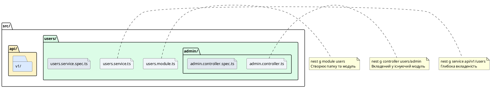
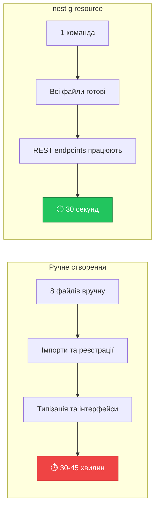

```mermaid
graph TB
    subgraph "Без CLI (ручна робота)"
        M1["📝 Створити controller.ts"]
        M2["📝 Створити service.ts"]
        M3["📝 Створити module.ts"]
        M4["📝 Створити DTO"]
        M5["📝 Імпортувати залежності"]
        M6["📝 Зареєструвати у app.module"]
        M7["⏱️ 10-15 хвилин"]
        
        M1 --> M2 --> M3 --> M4 --> M5 --> M6 --> M7
        
        style M7 fill:#ef4444,stroke:#b91c1c,color:#ffffff
    end
    
    subgraph "З CLI (автоматизація)"
        C1["⚡ nest generate resource users"]
        C2["✅ Всі файли створені"]
        C3["✅ Імпорти налаштовані"]
        C4["✅ Реєстрація у модулі"]
        C5["⏱️ 30 секунд"]
        
        C1 --> C2
        C2 --> C3
        C3 --> C4
        C4 --> C5
        
        style C5 fill:#22c55e,stroke:#15803d,color:#ffffff
    end
```

# Основні команди NestJS CLI

::card-group

::card{title="🎯 Мета лекції" icon="i-lucide-target"}

- Опанувати роботу з інструментом командного рядка NestJS CLI (*Command Line Interface*)
- Навчитися автоматично генерувати компоненти через команду `nest generate`
- Вивчити скорочення команд для прискорення розробки
- Засвоїти генерацію модулів, контролерів, сервісів та повних ресурсів
- Практикувати використання опцій генерації (`--no-spec`, `--flat`, `--dry-run`)
- Зрозуміти структуру шляхів для організації коду у вкладені модулі
- Ознайомитися з командами запуску застосунку у різних режимах
- Навчитися перевіряти структуру проєкту перед генерацією через dry-run

::

::card{title="🔑 Ключові терміни" icon="i-lucide-key"}

- **CLI** (*Command Line Interface*): інтерфейс командного рядка для автоматизації задач
- **Code Generation** (*генерація коду*): автоматичне створення файлів та шаблонів
- **Schematic**: шаблон генерації, що визначає структуру та вміст файлів
- **Dry Run**: симуляція виконання команди без реальних змін у файловій системі
- **Resource**: повний набір компонентів для REST API (module, controller, service, DTO)
- **Flat Structure** (*плоска структура*): розміщення файлів без створення вкладеної папки
- **Watch Mode** (*режим спостереження*): автоматична перекомпіляція при зміні коду

::

::


## Інтерфейс командного рядка NestJS CLI

**NestJS CLI** (*Command Line Interface*) — це потужний інструмент командного рядка, що суттєво прискорює розробку через автоматизацію рутинних задач: створення проєктів, генерацію компонентів, запуск серверу розробки та збірку застосунку для продакшн. CLI забезпечує **консистентність** (*consistency*) структури коду, дотримання найкращих практик та економію часу розробника.

### Філософія інструменту

На відміну від ручного створення файлів, NestJS CLI використовує **schematic-підхід** (*schematics*) — попередньо визначені шаблони, що генерують код з правильною структурою, іменуванням та взаємозв'язками між компонентами:

**Ручне створення (без CLI):**
```typescript
// ❌ Потрібно вручну створити 4+ файли
// users/users.controller.ts
// users/users.service.ts
// users/users.module.ts
// users/dto/create-user.dto.ts
// users/users.controller.spec.ts
// users/users.service.spec.ts

// Потім вручну імпортувати контролер у модуль
// Потім зареєструвати модуль у app.module.ts
// Ризик помилок у іменуванні та імпортах
```

**Генерація через CLI:**
```bash
# ✅ Одна команда створює всі файли та реєстрацію
nest generate resource users
```

::mermaid



::

### Встановлення та перевірка CLI

NestJS CLI встановлюється глобально через npm:

::tabs
::tabs-item{label="npm"}
```bash
npm install -g @nestjs/cli
```
::
::tabs-item{label="yarn"}
```bash
yarn global add @nestjs/cli
```
::
::tabs-item{label="pnpm"}
```bash
pnpm add -g @nestjs/cli
```
::
::

**Перевірка встановлення:**

::terminal-preview{title="nest --version" :cursor="false"}

<div class="line"><span class="opacity-40">$</span> <strong class="font-bold">nest --version</strong></div>
<div class="line"><span class="text-green-400 font-bold">10.4.7</span></div>
<div class="line"></div>
<div class="line"><span class="opacity-40">$</span> <strong class="font-bold">nest --help</strong></div>
<div class="line"></div>
<div class="line"><span class="text-blue-400 font-bold">Usage:</span> nest &lt;command&gt; [options]</div>
<div class="line"></div>
<div class="line"><span class="text-yellow-400 font-bold">Commands:</span></div>
<div class="line">  new          Generate Nest application</div>
<div class="line">  generate     Generate a Nest element</div>
<div class="line">  build        Build Nest application</div>
<div class="line">  start        Run Nest application</div>
<div class="line">  info         Display Nest project details</div>

::

::note
Якщо команда `nest` не знайдена після встановлення, переконайтеся, що шлях до глобальних пакетів npm додано до змінної оточення `PATH`. У macOS/Linux перевірте `~/.bashrc` або `~/.zshrc`, у Windows — налаштування системних змінних.
::


## Команда nest generate

**`nest generate`** (скорочення: `nest g`) — основна команда для створення компонентів застосунку. Вона приймає **схематик** (*schematic*) — тип компоненту та його ім'я, після чого генерує необхідні файли та оновлює існуючі модулі.

### Базовий синтаксис

```bash
nest generate <schematic> <name> [options]

# Скорочений варіант:
nest g <schematic> <name> [options]
```

**Параметри:**
- **schematic** — тип компоненту (`module`, `controller`, `service`, тощо)
- **name** — ім'я компоненту у форматі kebab-case або camelCase
- **options** — додаткові прапорці для налаштування генерації

### Доступні схематики

| Схематик | Скорочення | Призначення | Створені файли |
|----------|-----------|-------------|----------------|
| **module** | `mo` | Модуль | `<name>.module.ts` |
| **controller** | `co` | Контролер | `<name>.controller.ts`, `<name>.controller.spec.ts` |
| **service** | `s` | Сервіс (провайдер) | `<name>.service.ts`, `<name>.service.spec.ts` |
| **class** | `cl` | TypeScript клас | `<name>.ts` |
| **interface** | `itf` | TypeScript інтерфейс | `<name>.interface.ts` |
| **guard** | `gu` | Guard (охоронець) | `<name>.guard.ts`, `<name>.guard.spec.ts` |
| **interceptor** | `itc` | Interceptor (перехоплювач) | `<name>.interceptor.ts` |
| **middleware** | `mi` | Middleware (мідлвар) | `<name>.middleware.ts` |
| **pipe** | `pi` | Pipe (труба валідації) | `<name>.pipe.ts` |
| **filter** | `f` | Exception Filter | `<name>.filter.ts` |
| **decorator** | `d` | Кастомний декоратор | `<name>.decorator.ts` |
| **gateway** | `ga` | WebSocket Gateway | `<name>.gateway.ts` |
| **resource** | `res` | Повний CRUD ресурс | module, controller, service, DTO |

::tip
**Рекомендація:** Використовуйте скорочені форми для швидкості:
- `nest g mo users` замість `nest g module users`
- `nest g co users` замість `nest g controller users`
- `nest g s users` замість `nest g service users`
::

### Структура шляхів

Ім'я компоненту може містити шлях для організації у вкладені папки:

```bash
# Створення у кореневій папці src/
nest g module users
# → src/users/users.module.ts

# Створення у вкладеній папці
nest g controller users/admin
# → src/users/admin/admin.controller.ts

# Створення у глибокій ієрархії
nest g service api/v1/users
# → src/api/v1/users/users.service.ts
```

::plant-uml{alt="Структура шляхів при генерації"}



::


## Генерація модуля

**Модуль** (*module*) — основний будівельний блок архітектури NestJS, що об'єднує пов'язані компоненти (контролери, сервіси) у логічну групу.

### Команда генерації

```bash
nest generate module <name>

# Скорочення:
nest g mo <name>
```

### Приклад: створення модуля users

::terminal-preview{title="nest g module users" :cursor="false"}

<div class="line"><span class="opacity-40">$</span> <strong class="font-bold">nest g module users</strong></div>
<div class="line"><span class="text-green-400">CREATE</span> src/users/users.module.ts <span class="opacity-40">(82 bytes)</span></div>
<div class="line"><span class="text-yellow-400">UPDATE</span> src/app.module.ts <span class="opacity-40">(312 bytes)</span></div>

::

**Створені файли:**

::code-tree

```typescript [src/users/users.module.ts]
import { Module } from '@nestjs/common';

@Module({})
export class UsersModule {}
```

```typescript [src/app.module.ts]
import { Module } from '@nestjs/common';
import { AppController } from './app.controller';
import { AppService } from './app.service';
import { UsersModule } from './users/users.module'; // ← Автоматично додано

@Module({
  imports: [UsersModule], // ← Автоматично зареєстровано
  controllers: [AppController],
  providers: [AppService],
})
export class AppModule {}
```

::

::note
**Важливо:** CLI автоматично **імпортує** новий модуль у `app.module.ts` та додає його до масиву `imports`. Це забезпечує негайну інтеграцію модуля у застосунок без ручних правок.
::

### Генерація модуля у вкладеній папці

```bash
# Модуль у папці features/
nest g mo features/auth
# → src/features/auth/auth.module.ts

# Модуль у папці api/v1/
nest g mo api/v1/products
# → src/api/v1/products/products.module.ts
```

**Результуюча структура:**

```
src/
├── app.module.ts
├── features/
│   └── auth/
│       └── auth.module.ts
└── api/
    └── v1/
        └── products/
            └── products.module.ts
```


## Генерація контролера

**Контролер** (*controller*) обробляє вхідні HTTP-запити та визначає маршрути (*routes*) застосунку.

### Команда генерації

```bash
nest generate controller <name>

# Скорочення:
nest g co <name>
```

### Приклад: створення контролера users

::terminal-preview{title="nest g controller users" :cursor="false"}

<div class="line"><span class="opacity-40">$</span> <strong class="font-bold">nest g controller users</strong></div>
<div class="line"><span class="text-green-400">CREATE</span> src/users/users.controller.ts <span class="opacity-40">(99 bytes)</span></div>
<div class="line"><span class="text-green-400">CREATE</span> src/users/users.controller.spec.ts <span class="opacity-40">(485 bytes)</span></div>
<div class="line"><span class="text-yellow-400">UPDATE</span> src/users/users.module.ts <span class="opacity-40">(166 bytes)</span></div>

::

**Створені файли:**

::code-tree

```typescript [src/users/users.controller.ts]
import { Controller } from '@nestjs/common';

@Controller('users')
export class UsersController {}
```

```typescript [src/users/users.controller.spec.ts]
import { Test, TestingModule } from '@nestjs/testing';
import { UsersController } from './users.controller';

describe('UsersController', () => {
  let controller: UsersController;

  beforeEach(async () => {
    const module: TestingModule = await Test.createTestingModule({
      controllers: [UsersController],
    }).compile();

    controller = module.get<UsersController>(UsersController);
  });

  it('should be defined', () => {
    expect(controller).toBeDefined();
  });
});
```

```typescript [src/users/users.module.ts]
import { Module } from '@nestjs/common';
import { UsersController } from './users.controller'; // ← Додано

@Module({
  controllers: [UsersController], // ← Зареєстровано
})
export class UsersModule {}
```

::

**Ключові спостереження:**

1. **Автоматична реєстрація:** Контролер додано до масиву `controllers` у `UsersModule`
2. **Тестовий файл:** CLI створює базовий unit-тест (`*.spec.ts`) для контролера
3. **Іменування маршруту:** Декоратор `@Controller('users')` автоматично отримує префікс з імені

::tip
Якщо контролер генерується **до** модуля, CLI створить модуль автоматично:

```bash
# Модуль ще не існує
nest g co products
# → CLI створить products.module.ts та зареєструє контролер
```
::

### Генерація вкладеного контролера

```bash
# Контролер у підпапці admin
nest g co users/admin
# → src/users/admin/admin.controller.ts
# → Реєструється у UsersModule (якщо існує)
```


## Генерація сервісу

**Сервіс** (*service*) містить бізнес-логіку застосунку та інкапсулює доступ до даних. Сервіси є **провайдерами** (*providers*), що ін'єктуються через Dependency Injection.

### Команда генерації

```bash
nest generate service <name>

# Скорочення:
nest g s <name>
```

### Приклад: створення сервісу users

::terminal-preview{title="nest g service users" :cursor="false"}

<div class="line"><span class="opacity-40">$</span> <strong class="font-bold">nest g service users</strong></div>
<div class="line"><span class="text-green-400">CREATE</span> src/users/users.service.ts <span class="opacity-40">(89 bytes)</span></div>
<div class="line"><span class="text-green-400">CREATE</span> src/users/users.service.spec.ts <span class="opacity-40">(453 bytes)</span></div>
<div class="line"><span class="text-yellow-400">UPDATE</span> src/users/users.module.ts <span class="opacity-40">(247 bytes)</span></div>

::

**Створені файли:**

::code-tree

```typescript [src/users/users.service.ts]
import { Injectable } from '@nestjs/common';

@Injectable()
export class UsersService {}
```

```typescript [src/users/users.service.spec.ts]
import { Test, TestingModule } from '@nestjs/testing';
import { UsersService } from './users.service';

describe('UsersService', () => {
  let service: UsersService;

  beforeEach(async () => {
    const module: TestingModule = await Test.createTestingModule({
      providers: [UsersService],
    }).compile();

    service = module.get<UsersService>(UsersService);
  });

  it('should be defined', () => {
    expect(service).toBeDefined();
  });
});
```

```typescript [src/users/users.module.ts]
import { Module } from '@nestjs/common';
import { UsersController } from './users.controller';
import { UsersService } from './users.service'; // ← Додано

@Module({
  controllers: [UsersController],
  providers: [UsersService], // ← Зареєстровано як провайдер
})
export class UsersModule {}
```

::

**Ключові спостереження:**

1. **Декоратор @Injectable():** Позначає клас як провайдера для DI контейнера
2. **Реєстрація у providers:** Сервіс додано до масиву `providers` модуля
3. **Готовність до ін'єкції:** Тепер сервіс можна ін'єктувати у контролер або інші сервіси

### Використання згенерованого сервісу

Після генерації сервіс можна одразу ін'єктувати у контролер:

```typescript
// src/users/users.controller.ts
import { Controller, Get } from '@nestjs/common';
import { UsersService } from './users.service';

@Controller('users')
export class UsersController {
  constructor(private readonly usersService: UsersService) {}
  
  @Get()
  findAll() {
    return this.usersService.findAll();
  }
}
```

```typescript
// src/users/users.service.ts
import { Injectable } from '@nestjs/common';

@Injectable()
export class UsersService {
  private users = [
    { id: 1, name: 'Alice' },
    { id: 2, name: 'Bob' },
  ];
  
  findAll() {
    return this.users;
  }
}
```


## Генерація повного ресурсу (Resource)

**`nest generate resource`** — найпотужніша команда CLI, що створює **повний набір** компонентів для REST API або GraphQL: модуль, контролер, сервіс, DTO (*Data Transfer Objects*), та entity класи. Це ідеальна команда для швидкого прототипування або створення нових функціональних блоків.

### Команда генерації

```bash
nest generate resource <name>

# Скорочення:
nest g res <name>
```

### Інтерактивний режим

При виконанні команди CLI запитає кілька питань для налаштування:

::terminal-preview{title="nest g resource products" :cursor="false"}

<div class="line"><span class="opacity-40">$</span> <strong class="font-bold">nest g resource products</strong></div>
<div class="line"></div>
<div class="line"><span class="text-blue-400">?</span> What transport layer do you use?</div>
<div class="line">  <span class="text-green-400 font-bold">❯ REST API</span></div>
<div class="line">    GraphQL (code first)</div>
<div class="line">    GraphQL (schema first)</div>
<div class="line">    Microservice (non-HTTP)</div>
<div class="line">    WebSockets</div>
<div class="line"></div>
<div class="line"><span class="text-blue-400">?</span> Would you like to generate CRUD entry points? <span class="text-green-400 font-bold">Yes</span></div>
<div class="line"></div>
<div class="line"><span class="text-green-400">CREATE</span> src/products/products.controller.ts</div>
<div class="line"><span class="text-green-400">CREATE</span> src/products/products.controller.spec.ts</div>
<div class="line"><span class="text-green-400">CREATE</span> src/products/products.module.ts</div>
<div class="line"><span class="text-green-400">CREATE</span> src/products/products.service.ts</div>
<div class="line"><span class="text-green-400">CREATE</span> src/products/products.service.spec.ts</div>
<div class="line"><span class="text-green-400">CREATE</span> src/products/dto/create-product.dto.ts</div>
<div class="line"><span class="text-green-400">CREATE</span> src/products/dto/update-product.dto.ts</div>
<div class="line"><span class="text-green-400">CREATE</span> src/products/entities/product.entity.ts</div>
<div class="line"><span class="text-yellow-400">UPDATE</span> src/app.module.ts</div>

::

### Структура згенерованого ресурсу

::code-tree

```typescript [src/products/products.controller.ts]
import { Controller, Get, Post, Body, Patch, Param, Delete } from '@nestjs/common';
import { ProductsService } from './products.service';
import { CreateProductDto } from './dto/create-product.dto';
import { UpdateProductDto } from './dto/update-product.dto';

@Controller('products')
export class ProductsController {
  constructor(private readonly productsService: ProductsService) {}

  @Post()
  create(@Body() createProductDto: CreateProductDto) {
    return this.productsService.create(createProductDto);
  }

  @Get()
  findAll() {
    return this.productsService.findAll();
  }

  @Get(':id')
  findOne(@Param('id') id: string) {
    return this.productsService.findOne(+id);
  }

  @Patch(':id')
  update(@Param('id') id: string, @Body() updateProductDto: UpdateProductDto) {
    return this.productsService.update(+id, updateProductDto);
  }

  @Delete(':id')
  remove(@Param('id') id: string) {
    return this.productsService.remove(+id);
  }
}
```

```typescript [src/products/products.service.ts]
import { Injectable } from '@nestjs/common';
import { CreateProductDto } from './dto/create-product.dto';
import { UpdateProductDto } from './dto/update-product.dto';

@Injectable()
export class ProductsService {
  create(createProductDto: CreateProductDto) {
    return 'This action adds a new product';
  }

  findAll() {
    return `This action returns all products`;
  }

  findOne(id: number) {
    return `This action returns a #${id} product`;
  }

  update(id: number, updateProductDto: UpdateProductDto) {
    return `This action updates a #${id} product`;
  }

  remove(id: number) {
    return `This action removes a #${id} product`;
  }
}
```

```typescript [src/products/dto/create-product.dto.ts]
export class CreateProductDto {}
```

```typescript [src/products/dto/update-product.dto.ts]
import { PartialType } from '@nestjs/mapped-types';
import { CreateProductDto } from './create-product.dto';

export class UpdateProductDto extends PartialType(CreateProductDto) {}
```

```typescript [src/products/entities/product.entity.ts]
export class Product {}
```

```typescript [src/products/products.module.ts]
import { Module } from '@nestjs/common';
import { ProductsService } from './products.service';
import { ProductsController } from './products.controller';

@Module({
  controllers: [ProductsController],
  providers: [ProductsService],
})
export class ProductsModule {}
```

::

### Що генерує nest g resource

| Файл | Призначення |
|------|-------------|
| **products.controller.ts** | REST контролер з повним CRUD (Create, Read, Update, Delete) |
| **products.service.ts** | Сервіс з методами-заглушками для бізнес-логіки |
| **products.module.ts** | Модуль, що об'єднує контролер та сервіс |
| **dto/create-product.dto.ts** | DTO для створення продукту (POST запит) |
| **dto/update-product.dto.ts** | DTO для оновлення продукту (PATCH запит) |
| **entities/product.entity.ts** | Entity клас для представлення моделі даних |
| **products.controller.spec.ts** | Unit-тест контролера |
| **products.service.spec.ts** | Unit-тест сервісу |

::note
**DTO (Data Transfer Object)** — об'єкти для передачі даних між шарами застосунку. У REST API DTO визначають структуру вхідних даних для валідації та документації.

**Entity** — клас, що представляє структуру даних у базі даних (використовується з ORM як TypeORM або Prisma).
::

### Переваги nest g resource

::mermaid



::

1. **Швидкість:** Створення повного CRUD за 30 секунд
2. **Консистентність:** Однакова структура у всіх модулях
3. **Best practices:** Правильна архітектура "з коробки"
4. **Тести:** Базові unit-тести вже включені


## Генерація класів та інтерфейсів

Для створення DTO, entity або допоміжних класів використовуються команди `nest g class` та `nest g interface`.

### Генерація класу (DTO)

```bash
nest generate class <path>

# Скорочення:
nest g cl <path>
```

**Приклад: створення DTO для користувача:**

::terminal-preview{title="nest g class users/dto/create-user.dto --no-spec" :cursor="false"}

<div class="line"><span class="opacity-40">$</span> <strong class="font-bold">nest g class users/dto/create-user.dto --no-spec</strong></div>
<div class="line"><span class="text-green-400">CREATE</span> src/users/dto/create-user.dto.ts <span class="opacity-40">(32 bytes)</span></div>

::

**Створений файл:**

```typescript
// src/users/dto/create-user.dto.ts
export class CreateUserDto {}
```

**Заповнення DTO валідацією:**

```typescript
import { IsEmail, IsString, MinLength, MaxLength } from 'class-validator';

export class CreateUserDto {
  @IsEmail()
  email: string;

  @IsString()
  @MinLength(2)
  @MaxLength(50)
  name: string;

  @IsString()
  @MinLength(8)
  password: string;
}
```

### Генерація інтерфейсу

```bash
nest generate interface <path>

# Скорочення:
nest g itf <path>
```

**Приклад: створення інтерфейсу для конфігурації:**

::terminal-preview{title="nest g interface config/database-config.interface" :cursor="false"}

<div class="line"><span class="opacity-40">$</span> <strong class="font-bold">nest g interface config/database-config.interface</strong></div>
<div class="line"><span class="text-green-400">CREATE</span> src/config/database-config.interface.ts <span class="opacity-40">(43 bytes)</span></div>

::

**Створений файл:**

```typescript
// src/config/database-config.interface.ts
export interface DatabaseConfig {}
```

**Заповнення інтерфейсу:**

```typescript
export interface DatabaseConfig {
  host: string;
  port: number;
  username: string;
  password: string;
  database: string;
}
```

::tip
**Клас vs Інтерфейс:**

- **Клас** — існує у runtime, підтримує декоратори валідації (для DTO)
- **Інтерфейс** — лише compile-time типізація, видаляється після компіляції

Для **DTO** завжди використовуйте **класи**, оскільки NestJS потребує їх для валідації та трансформації.
::


## Опції генерації

NestJS CLI підтримує кілька корисних опцій для налаштування процесу генерації.

### --no-spec: Без тестових файлів

За замовчуванням CLI генерує unit-тести (`*.spec.ts`) для кожного компонента. Щоб вимкнути це:

```bash
nest g service users --no-spec
# → Створює лише users.service.ts (без users.service.spec.ts)

nest g controller products --no-spec
# → Створює лише products.controller.ts
```

**Коли використовувати:**
- Прототипування — тести будуть написані пізніше
- E2E-first підхід — unit-тести не потрібні
- Legacy проєкти без тестового покриття

::caution
**Важливо:** У продакшн-проєктах **не рекомендується** пропускати тести. Використовуйте `--no-spec` лише для швидкого прототипування.
::

### --flat: Плоска структура без папки

За замовчуванням CLI створює вкладену папку для компонента. Опція `--flat` розміщує файли у поточній директорії:

```bash
# Без --flat (стандартна поведінка):
nest g service logger
# → src/logger/logger.service.ts
# → src/logger/logger.service.spec.ts

# З --flat:
nest g service logger --flat
# → src/logger.service.ts (без папки logger/)
# → src/logger.service.spec.ts
```

**Коли використовувати:**
- Утилітарні сервіси у папці `common/`
- Декоратори та pipes у папці `shared/`
- Хелпери у папці `utils/`

### --dry-run: Симуляція без змін

Опція `--dry-run` (скорочення: `-d`) виконує **симуляцію** генерації без реального створення файлів. Корисно для перевірки, що буде створено:

::terminal-preview{title="nest g resource orders --dry-run" :cursor="false"}

<div class="line"><span class="opacity-40">$</span> <strong class="font-bold">nest g resource orders --dry-run</strong></div>
<div class="line"></div>
<div class="line"><span class="text-blue-400">?</span> What transport layer do you use? <span class="text-green-400 font-bold">REST API</span></div>
<div class="line"><span class="text-blue-400">?</span> Would you like to generate CRUD entry points? <span class="text-green-400 font-bold">Yes</span></div>
<div class="line"></div>
<div class="line"><span class="text-yellow-400">CREATE (dry run)</span> src/orders/orders.controller.ts</div>
<div class="line"><span class="text-yellow-400">CREATE (dry run)</span> src/orders/orders.controller.spec.ts</div>
<div class="line"><span class="text-yellow-400">CREATE (dry run)</span> src/orders/orders.module.ts</div>
<div class="line"><span class="text-yellow-400">CREATE (dry run)</span> src/orders/orders.service.ts</div>
<div class="line"><span class="text-yellow-400">CREATE (dry run)</span> src/orders/orders.service.spec.ts</div>
<div class="line"><span class="text-yellow-400">CREATE (dry run)</span> src/orders/dto/create-order.dto.ts</div>
<div class="line"><span class="text-yellow-400">CREATE (dry run)</span> src/orders/dto/update-order.dto.ts</div>
<div class="line"><span class="text-yellow-400">CREATE (dry run)</span> src/orders/entities/order.entity.ts</div>
<div class="line"><span class="text-yellow-400">UPDATE (dry run)</span> src/app.module.ts</div>
<div class="line"></div>
<div class="line"><span class="text-blue-400 font-bold">NOTE:</span> The "dryRun" flag means no changes were made.</div>

::

**Коли використовувати:**
- Перевірка структури перед реальною генерацією
- Навчання команд CLI
- Перевірка конфліктів імен файлів

### --skip-import: Без реєстрації у модулі

Опція `--skip-import` створює компонент, але **не додає** його до жодного модуля:

```bash
nest g service auth --skip-import
# → Створює auth.service.ts, але не оновлює auth.module.ts
```

**Коли використовувати:**
- Ручна реєстрація через custom providers
- Динамічні модулі
- Експериментальний код

### Комбінування опцій

Опції можна комбінувати:

```bash
# Сервіс без тестів, плоска структура, dry-run
nest g service logger --no-spec --flat --dry-run

# Контролер без тестів та реєстрації
nest g controller admin --no-spec --skip-import

# Ресурс без тестів у вкладеній папці
nest g resource api/v1/users --no-spec
```


## Команди запуску застосунку

Після генерації компонентів застосунок потрібно **запустити**. NestJS CLI надає кілька команд для різних режимів роботи.

### nest start: Базовий запуск

```bash
nest start
```

Компілює TypeScript у JavaScript та запускає застосунок **один раз**. Після зупинки сервера потрібно перезапустити вручну.

::terminal-preview{title="nest start" :cursor="false"}

<div class="line"><span class="opacity-40">$</span> <strong class="font-bold">nest start</strong></div>
<div class="line"></div>
<div class="line"><span class="text-blue-400">[Nest]</span> Webpack is building...</div>
<div class="line"><span class="text-blue-400">[Nest]</span> Webpack build completed (2.3s)</div>
<div class="line"></div>
<div class="line"><span class="text-green-400 font-bold">[Nest]</span> Starting Nest application...</div>
<div class="line"><span class="text-green-400 font-bold">[Nest]</span> AppModule dependencies initialized</div>
<div class="line"><span class="text-green-400 font-bold">[Nest]</span> UsersModule dependencies initialized</div>
<div class="line"><span class="text-green-400 font-bold">[Nest]</span> Nest application successfully started</div>
<div class="line"><span class="text-blue-400 font-bold">[Nest]</span> Application is running on: <span class="text-green-400">http://localhost:3000</span></div>

::

**Коли використовувати:**
- Тестування після збірки
- Запуск у Docker-контейнері
- Відлагодження проблем компіляції

### nest start:dev: Режим розробки з watch

```bash
npm run start:dev
# або
nest start --watch
```

Запускає застосунок у **watch mode** — автоматично перекомпілює та перезапускає сервер при зміні файлів.

::terminal-preview{title="npm run start:dev" :cursor="true"}

<div class="line"><span class="opacity-40">$</span> <strong class="font-bold">npm run start:dev</strong></div>
<div class="line"></div>
<div class="line"><span class="text-blue-400">[Nest]</span> Starting compilation in watch mode...</div>
<div class="line"><span class="text-green-400 font-bold">[Nest]</span> Nest application successfully started</div>
<div class="line"><span class="text-blue-400 font-bold">[Nest]</span> Application is running on: http://localhost:3000</div>
<div class="line"></div>
<div class="line"><span class="opacity-40">// Змінюємо users.controller.ts...</span></div>
<div class="line"></div>
<div class="line"><span class="text-yellow-400">[Nest]</span> File change detected. Recompiling...</div>
<div class="line"><span class="text-green-400 font-bold">[Nest]</span> Nest application successfully started</div>

::

**Переваги:**
- **Миттєвий feedback loop** — зміни застосовуються за 1-2 секунди
- Не потрібно вручну перезапускати сервер
- Ідеально для активної розробки

::tip
**Рекомендація:** Використовуйте `start:dev` як основну команду під час розробки. Це економить години часу протягом проєкту.
::

### nest start:debug: Режим відлагодження

```bash
npm run start:debug
```

Запускає застосунок з підтримкою **Node.js debugger** на порті `9229`. Можна підключитися через Chrome DevTools або VS Code Debugger.

**Налаштування VS Code для відлагодження:**

```json
// .vscode/launch.json
{
  "version": "0.2.0",
  "configurations": [
    {
      "type": "node",
      "request": "attach",
      "name": "Attach NestJS Debugger",
      "port": 9229,
      "restart": true,
      "stopOnEntry": false,
      "protocol": "inspector"
    }
  ]
}
```

**Використання:**
1. Запустіть `npm run start:debug`
2. Встановіть breakpoints у VS Code
3. Натисніть F5 або "Run → Start Debugging"
4. Виконайте HTTP-запит — виконання зупиниться на breakpoint

### nest build: Компіляція для продакшн

```bash
nest build
```

Компілює TypeScript у оптимізований JavaScript код для production:

::terminal-preview{title="nest build" :cursor="false"}

<div class="line"><span class="opacity-40">$</span> <strong class="font-bold">nest build</strong></div>
<div class="line"></div>
<div class="line"><span class="text-blue-400">[Nest]</span> Building Nest application...</div>
<div class="line"><span class="text-blue-400">[Nest]</span> Successfully compiled 47 files with TypeScript (3.2s)</div>
<div class="line"></div>
<div class="line"><span class="text-green-400 font-bold">Build completed!</span></div>
<div class="line">Output: <span class="text-blue-400">dist/</span></div>

::

**Результат:**

```
dist/
├── main.js
├── main.js.map
├── app.module.js
├── users/
│   ├── users.controller.js
│   ├── users.service.js
│   └── users.module.js
└── ... (всі файли застосунку)
```

**Запуск продакшн-версії:**

```bash
node dist/main.js
```

### npm run start:prod: Продакшн-режим

```bash
npm run start:prod
```

Виконує `nest build` та запускає скомпільований код:

```bash
# Еквівалентно:
nest build && node dist/main
```

**Коли використовувати:**
- Фінальне тестування перед деплоєм
- Запуск у production-середовищі (сервер, Docker)
- Вимірювання продуктивності

### Порівняльна таблиця команд запуску

| Команда | Компіляція | Watch | Debugger | Використання |
|---------|-----------|-------|----------|--------------|
| **nest start** | ✅ Один раз | ❌ | ❌ | Разове тестування |
| **start:dev** | ✅ При змінах | ✅ | ❌ | Активна розробка |
| **start:debug** | ✅ При змінах | ✅ | ✅ | Відлагодження проблем |
| **nest build** | ✅ Production | ❌ | ❌ | Збірка для деплою |
| **start:prod** | ✅ Production | ❌ | ❌ | Запуск на сервері |


## Додаткові корисні команди

Окрім генерації та запуску, CLI надає команди для інформації про проєкт та налаштування.

### nest info: Інформація про проєкт

```bash
nest info
```

Виводить версії встановлених пакетів NestJS та залежностей:

::terminal-preview{title="nest info" :cursor="false"}

<div class="line"><span class="opacity-40">$</span> <strong class="font-bold">nest info</strong></div>
<div class="line"></div>
<div class="line"><span class="text-blue-400 font-bold"> _   _             _      ___  _____  _____  _     _____</span></div>
<div class="line"><span class="text-blue-400 font-bold">| \ | |           | |    |_  |/  ___|/  __ \| |   |_   _|</span></div>
<div class="line"><span class="text-blue-400 font-bold">|  \| |  ___  ___ | |_     | |\ `--. | /  \/| |     | |</span></div>
<div class="line"><span class="text-blue-400 font-bold">| . ` | / _ \/ __|| __|    | | `--. \| |    | |     | |</span></div>
<div class="line"><span class="text-blue-400 font-bold">| |\  ||  __/\__ \| |_ /\__/ //\__/ /| \__/\| |_____| |_</span></div>
<div class="line"><span class="text-blue-400 font-bold">\_| \_/ \___||___/ \__|\____/ \____/  \____/\_____/\___/</span></div>
<div class="line"></div>
<div class="line"><span class="text-green-400 font-bold">[System Information]</span></div>
<div class="line">OS Version     : macOS Sonoma 14.5</div>
<div class="line">NodeJS Version : v20.11.0</div>
<div class="line">npm Version    : 10.2.4</div>
<div class="line"></div>
<div class="line"><span class="text-green-400 font-bold">[Nest CLI]</span></div>
<div class="line">Nest CLI Version : 10.4.7</div>
<div class="line"></div>
<div class="line"><span class="text-green-400 font-bold">[Nest Platform Information]</span></div>
<div class="line">platform-express version : <span class="text-green-400">10.4.4</span></div>
<div class="line">common version           : <span class="text-green-400">10.4.4</span></div>
<div class="line">core version             : <span class="text-green-400">10.4.4</span></div>
<div class="line">cli version              : <span class="text-green-400">10.4.7</span></div>

::

**Коли використовувати:**
- Діагностика проблем з версіями пакетів
- Створення bug reports
- Перевірка сумісності залежностей

### nest new: Створення нового проєкту

```bash
nest new <project-name>
```

Створює новий NestJS проєкт з нуля:

::terminal-preview{title="nest new my-app" :cursor="false"}

<div class="line"><span class="opacity-40">$</span> <strong class="font-bold">nest new my-app</strong></div>
<div class="line"></div>
<div class="line"><span class="text-blue-400">?</span> Which package manager would you ❤️  to use?</div>
<div class="line">  <span class="text-green-400 font-bold">❯ npm</span></div>
<div class="line">    yarn</div>
<div class="line">    pnpm</div>
<div class="line"></div>
<div class="line"><span class="text-green-400">CREATE</span> my-app/.eslintrc.js</div>
<div class="line"><span class="text-green-400">CREATE</span> my-app/.prettierrc</div>
<div class="line"><span class="text-green-400">CREATE</span> my-app/nest-cli.json</div>
<div class="line"><span class="text-green-400">CREATE</span> my-app/package.json</div>
<div class="line"><span class="text-green-400">CREATE</span> my-app/tsconfig.json</div>
<div class="line"><span class="text-green-400">CREATE</span> my-app/src/app.controller.ts</div>
<div class="line"><span class="text-green-400">CREATE</span> my-app/src/app.service.ts</div>
<div class="line"><span class="text-green-400">CREATE</span> my-app/src/main.ts</div>
<div class="line"></div>
<div class="line"><span class="text-blue-400 font-bold">✔</span> Installation in progress... ☕</div>
<div class="line"><span class="text-green-400 font-bold">🚀  Successfully created project my-app</span></div>

::

**Створена структура:**

```
my-app/
├── src/
│   ├── app.controller.ts
│   ├── app.controller.spec.ts
│   ├── app.module.ts
│   ├── app.service.ts
│   ├── app.service.spec.ts
│   └── main.ts
├── test/
│   ├── app.e2e-spec.ts
│   └── jest-e2e.json
├── node_modules/
├── .eslintrc.js
├── .prettierrc
├── nest-cli.json
├── package.json
├── tsconfig.json
└── tsconfig.build.json
```


## Практичні сценарії використання CLI

Розглянемо реальні робочі процеси розробки з використанням NestJS CLI.

### Сценарій 1: Створення нового модуля з нуля

**Задача:** Додати функціональність управління постами у блозі.

**Крок 1: Створення структури модуля**

```bash
# Генерація модуля
nest g module posts
# → src/posts/posts.module.ts

# Генерація контролера
nest g controller posts --no-spec
# → src/posts/posts.controller.ts

# Генерація сервісу
nest g service posts --no-spec
# → src/posts/posts.service.ts
```

**Крок 2: Створення DTO та Entity**

```bash
# DTO для створення поста
nest g class posts/dto/create-post.dto --no-spec
# → src/posts/dto/create-post.dto.ts

# DTO для оновлення поста
nest g class posts/dto/update-post.dto --no-spec
# → src/posts/dto/update-post.dto.ts

# Entity для моделі поста
nest g class posts/entities/post.entity --no-spec
# → src/posts/entities/post.entity.ts
```

**Результуюча структура:**

```
src/posts/
├── dto/
│   ├── create-post.dto.ts
│   └── update-post.dto.ts
├── entities/
│   └── post.entity.ts
├── posts.controller.ts
├── posts.module.ts
└── posts.service.ts
```

**Альтернатива — одна команда:**

```bash
# Замість 6 команд вище:
nest g resource posts --no-spec
# → Створює всю структуру автоматично!
```

### Сценарій 2: Модульна архітектура з вкладеністю

**Задача:** Створити структуру для API v1 з users та products.

```bash
# Створення базових модулів
nest g module api/v1/users --no-spec
nest g module api/v1/products --no-spec

# Контролери для кожного модуля
nest g controller api/v1/users --no-spec
nest g controller api/v1/products --no-spec

# Сервіси
nest g service api/v1/users --no-spec
nest g service api/v1/products --no-spec
```

**Результуюча структура:**

```
src/
├── api/
│   └── v1/
│       ├── users/
│       │   ├── users.controller.ts
│       │   ├── users.module.ts
│       │   └── users.service.ts
│       └── products/
│           ├── products.controller.ts
│           ├── products.module.ts
│           └── products.service.ts
└── app.module.ts
```

**Налаштування префіксу маршруту у main.ts:**

```typescript
// src/main.ts
async function bootstrap() {
  const app = await NestFactory.create(AppModule);
  
  // Глобальний префікс для всіх маршрутів
  app.setGlobalPrefix('api/v1');
  
  await app.listen(3000);
}
bootstrap();

// Тепер маршрути доступні за адресою:
// GET /api/v1/users
// GET /api/v1/products
```

### Сценарій 3: Спільні утиліти та декоратори

**Задача:** Створити спільні компоненти для використання у різних модулях.

```bash
# Створення папки common
mkdir src/common

# Генерація кастомного декоратора
nest g decorator common/decorators/current-user --flat --no-spec
# → src/common/decorators/current-user.decorator.ts

# Генерація pipe для валідації
nest g pipe common/pipes/parse-int --flat --no-spec
# → src/common/pipes/parse-int.pipe.ts

# Генерація guard для автентифікації
nest g guard common/guards/auth --flat --no-spec
# → src/common/guards/auth.guard.ts

# Генерація interceptor для логування
nest g interceptor common/interceptors/logging --flat --no-spec
# → src/common/interceptors/logging.interceptor.ts
```

**Результуюча структура:**

```
src/common/
├── decorators/
│   └── current-user.decorator.ts
├── pipes/
│   └── parse-int.pipe.ts
├── guards/
│   └── auth.guard.ts
└── interceptors/
    └── logging.interceptor.ts
```

::note
Опція `--flat` створює файли **без вкладених папок**, що зручно для організації спільних компонентів у структуровані директорії.
::

### Сценарій 4: Тестування перед генерацією (dry-run)

**Задача:** Перевірити, що буде згенеровано без реальних змін.

```bash
# Перевірка структури ресурсу
nest g resource notifications --dry-run

# Перевірка вкладеної структури
nest g controller admin/users --dry-run

# Перевірка з опціями
nest g service analytics --no-spec --flat --dry-run
```

::terminal-preview{title="Використання dry-run" :cursor="false"}

<div class="line"><span class="opacity-40">$</span> <strong class="font-bold">nest g controller admin/dashboard --no-spec --dry-run</strong></div>
<div class="line"></div>
<div class="line"><span class="text-yellow-400">CREATE (dry run)</span> src/admin/dashboard/dashboard.controller.ts</div>
<div class="line"><span class="text-yellow-400">UPDATE (dry run)</span> src/admin/admin.module.ts</div>
<div class="line"></div>
<div class="line"><span class="text-blue-400 font-bold">NOTE:</span> The "dryRun" flag means no changes were made.</div>
<div class="line"></div>
<div class="line"><span class="opacity-40">// Все виглядає правильно? Виконуємо без --dry-run:</span></div>
<div class="line"><span class="opacity-40">$</span> <strong class="font-bold">nest g controller admin/dashboard --no-spec</strong></div>
<div class="line"><span class="text-green-400">CREATE</span> src/admin/dashboard/dashboard.controller.ts</div>
<div class="line"><span class="text-yellow-400">UPDATE</span> src/admin/admin.module.ts</div>

::

**Переваги dry-run:**
- Перевірка імен файлів перед створенням
- Виявлення конфліктів з існуючими файлами
- Планування структури проєкту


## Best Practices: ефективна робота з CLI

Рекомендації для максимальної продуктивності при роботі з NestJS CLI.

### Правило 1. Використовуйте скорочення команд

**❌ Повільно:**
```bash
nest generate module users
nest generate controller users
nest generate service users
```

**✅ Швидко:**
```bash
nest g mo users
nest g co users
nest g s users
```

Або ще краще — одна команда:
```bash
nest g resource users
```

### Правило 2. Плануйте структуру заздалегідь

**Погана практика — генерація у корені:**
```bash
nest g mo users
nest g mo products
nest g mo orders
# → src/users/, src/products/, src/orders/ (плоска структура)
```

**Хороша практика — групування за функціоналом:**
```bash
# Групування за доменом
nest g mo features/auth
nest g mo features/billing
nest g mo features/analytics

# Або версіонування API
nest g mo api/v1/users
nest g mo api/v1/products
```

### Правило 3. Створюйте алиаси для часто використовуваних команд

**Додайте до ~/.zshrc або ~/.bashrc:**

```bash
# NestJS aliases
alias ngs="nest g service"
alias ngc="nest g controller"
alias ngm="nest g module"
alias ngr="nest g resource"
alias ngcl="nest g class"

# З опціями
alias ngs-ns="nest g service --no-spec"
alias ngc-ns="nest g controller --no-spec"
```

**Використання:**
```bash
ngs users           # → nest g service users
ngc-ns products     # → nest g controller products --no-spec
ngr orders          # → nest g resource orders
```

### Правило 4. Використовуйте --no-spec для прототипування

**Під час розробки MVP:**
```bash
# Швидке прототипування без тестів
nest g resource prototype --no-spec

# Тести додаються пізніше, коли логіка стабілізується
```

**У стабільних проєктах:**
```bash
# Завжди з тестами
nest g resource users
# → Створює *.spec.ts файли
```

::tip
**Компроміс:** Використовуйте `--no-spec` для експериментального коду та первинного прототипування. Як тільки функціональність стабілізується — напишіть тести вручну або регенеруйте компоненти з тестами.
::

### Правило 5. Перевіряйте структуру через dry-run

**Перед масовою генерацією:**
```bash
# Спочатку симуляція
nest g resource api/v2/users --dry-run

# Переконалися, що структура правильна
nest g resource api/v2/users
```

### Правило 6. Організуйте спільні компоненти у common/

**Структура для спільних компонентів:**
```bash
# Декоратори
nest g decorator common/decorators/roles --flat --no-spec

# Guards
nest g guard common/guards/roles --flat --no-spec

# Interceptors
nest g interceptor common/interceptors/transform --flat --no-spec

# Pipes
nest g pipe common/pipes/validation --flat --no-spec

# Filters
nest g filter common/filters/http-exception --flat --no-spec
```

**Результуюча структура:**

```
src/common/
├── decorators/
│   ├── roles.decorator.ts
│   └── current-user.decorator.ts
├── guards/
│   ├── roles.guard.ts
│   └── auth.guard.ts
├── interceptors/
│   ├── transform.interceptor.ts
│   └── logging.interceptor.ts
├── pipes/
│   └── validation.pipe.ts
└── filters/
    └── http-exception.filter.ts
```


## Налаштування CLI через nest-cli.json

Файл `nest-cli.json` дозволяє налаштувати поведінку CLI для всього проєкту.

### Базова конфігурація

```json
{
  "$schema": "https://json.schemastore.org/nest-cli",
  "collection": "@nestjs/schematics",
  "sourceRoot": "src",
  "compilerOptions": {
    "deleteOutDir": true,
    "webpack": true,
    "tsConfigPath": "tsconfig.build.json"
  },
  "generateOptions": {
    "spec": false,
    "flat": false
  }
}
```

### Опції generateOptions

| Опція | Тип | За замовчуванням | Опис |
|-------|-----|------------------|------|
| **spec** | boolean | `true` | Генерувати тестові файли `*.spec.ts` |
| **flat** | boolean | `false` | Створювати файли без вкладеної папки |
| **specFileSuffix** | string | `"spec"` | Суфікс для тестових файлів |

**Приклад: вимкнення тестів глобально**

```json
{
  "generateOptions": {
    "spec": false
  }
}
```

Тепер **всі** команди `nest g` будуть працювати як з прапорцем `--no-spec`:

```bash
nest g service users
# → Створює лише users.service.ts (без users.service.spec.ts)
```

::caution
**Важливо:** Налаштування у `nest-cli.json` застосовуються **глобально** для всього проєкту. Для одноразової зміни поведінки краще використовувати опції командного рядка (`--no-spec`, `--flat`).
::


## Резюме команд CLI

::card-group

::card{title="🚀 Генерація компонентів" icon="i-lucide-package-plus"}

- `nest g module <name>` — модуль
- `nest g controller <name>` — контролер
- `nest g service <name>` — сервіс
- `nest g resource <name>` — повний CRUD ресурс
- `nest g class <name>` — клас (DTO, Entity)
- `nest g interface <name>` — інтерфейс

::

::card{title="⚙️ Опції генерації" icon="i-lucide-settings"}

- `--no-spec` — без тестових файлів
- `--flat` — без вкладеної папки
- `--dry-run` — симуляція без змін
- `--skip-import` — без реєстрації у модулі

::

::card{title="▶️ Запуск застосунку" icon="i-lucide-play"}

- `nest start` — одноразовий запуск
- `npm run start:dev` — watch mode (розробка)
- `npm run start:debug` — з debugger
- `nest build` — збірка для production
- `npm run start:prod` — запуск production

::

::card{title="📋 Інформація" icon="i-lucide-info"}

- `nest --version` — версія CLI
- `nest info` — інформація про проєкт
- `nest --help` — список всіх команд
- `nest g --help` — допомога по генерації

::

::

### Порівняльна таблиця: ручна vs CLI генерація

| Аспект | Ручне створення | NestJS CLI |
|--------|----------------|------------|
| **Швидкість** | 10-15 хвилин | 30 секунд |
| **Помилки** | Високий ризик | Мінімальний |
| **Консистентність** | Залежить від розробника | Гарантована |
| **Імпорти** | Вручну | Автоматично |
| **Реєстрація** | Вручну | Автоматично |
| **Тести** | Вручну | Включені |
| **Структура** | Довільна | Best practices |

::accordion

::accordion-item{label="❓ Чи можна видалити згенеровані файли через CLI?" icon="i-lucide-help-circle"}

Ні, NestJS CLI **не має** команди для видалення компонентів. Видалення потрібно робити вручну:

```bash
# Видалення модуля вручну
rm -rf src/users/

# Також потрібно вручну видалити імпорт з app.module.ts
# import { UsersModule } from './users/users.module'; ← Видалити
```

**Рекомендація:** Використовуйте `--dry-run` перед генерацією, щоб переконатися у правильності структури.

::

::accordion-item{label="❓ Як створити компонент у існуючому модулі?" icon="i-lucide-help-circle"}

CLI автоматично знаходить відповідний модуль за шляхом:

```bash
# Модуль users вже існує
nest g module users

# Контролер буде додано до UsersModule автоматично
nest g controller users
# → Оновлює src/users/users.module.ts

# Сервіс теж додається до UsersModule
nest g service users
# → Оновлює src/users/users.module.ts
```

CLI аналізує шлях (`users/`) та реєструє компонент у модулі з такою ж назвою.

::

::accordion-item{label="❓ Що робити, якщо CLI створив компонент не у той модуль?" icon="i-lucide-help-circle"}

Використовуйте `--skip-import` та зареєструйте вручну:

```bash
# Генерація без автоматичної реєстрації
nest g service special-logger --skip-import

# Потім вручно додайте у потрібний модуль
```

**Або** просто перемістіть файли та оновіть імпорти:

```typescript
// src/logging/logging.module.ts
import { SpecialLoggerService } from '../special-logger/special-logger.service';

@Module({
  providers: [SpecialLoggerService],
  exports: [SpecialLoggerService],
})
export class LoggingModule {}
```

::

::accordion-item{label="❓ Чи можна змінити дефолтні шаблони генерації?" icon="i-lucide-help-circle"}

Так, через **custom schematics**. Можна створити власну колекцію схематиків:

```bash
# Встановлення schematics CLI
npm install -g @angular-devkit/schematics-cli

# Створення власної колекції
schematics blank --name=my-schematics

# Налаштування nest-cli.json
{
  "collection": "./my-schematics/src/collection.json"
}
```

Проте для більшості проєктів **достатньо** стандартних шаблонів NestJS.

::

::

::note
**Підсумкова рекомендація:** NestJS CLI — ваш головний інструмент для прискорення розробки. Використовуйте `nest g resource` для швидкого створення функціональних модулів, `--dry-run` для перевірки структури та `start:dev` як основний режим розробки. Це економить години часу та забезпечує консистентну архітектуру проєкту.
::
