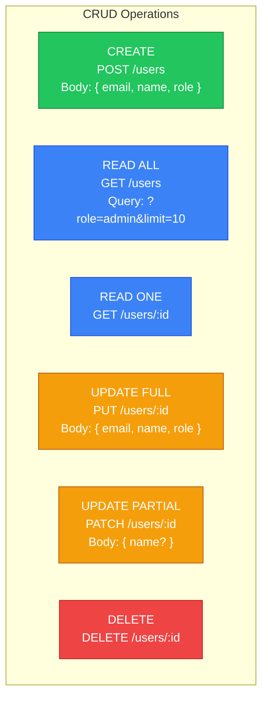
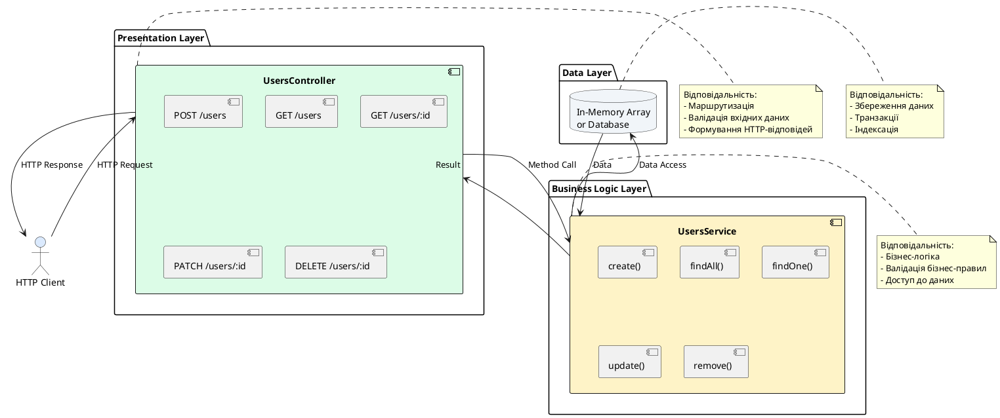

# Практичний приклад: створення CRUD-контролера

::card-group

::card{title="🎯 Мета лекції" icon="i-lucide-target"}

- Побудувати повнофункціональний REST API для управління користувачами
- Реалізувати всі операції CRUD (Create, Read, Update, Delete)
- Застосувати раніше вивчені декоратори (@Get, @Post, @Patch, @Delete)
- Опанувати роботу з параметрами маршруту, тілом запиту та query-параметрами
- Створити DTO (Data Transfer Objects) для валідації вхідних даних
- Інтегрувати контролер із сервісом через Dependency Injection
- Навчитися обробляти помилки через HttpException та NotFoundException
- Практикувати правильне іменування ендпоінтів та HTTP-методів

::

::card{title="🔑 Ключові терміни" icon="i-lucide-key"}

- **CRUD**: акронім для Create, Read, Update, Delete — базові операції над даними
- **REST API**: архітектурний стиль для веб-сервісів із використанням HTTP-методів
- **DTO** (*Data Transfer Object*): об'єкт для передачі та валідації даних між шарами
- **Resource**: сутність у системі (користувач, продукт, замовлення), над якою виконуються операції
- **Idempotency** (*ідемпотентність*): властивість операції давати той самий результат при повторних викликах
- **Status Code**: числовий код HTTP-відповіді (200, 201, 404, 500)
- **Payload**: дані, що передаються у тілі HTTP-запиту

::

::


## Планування REST API для ресурсу Users

Перед написанням коду потрібно **спроєктувати API** — визначити ендпоінти, HTTP-методи, структуру даних та очікувані відповіді. Правильне планування забезпечує консистентність, передбачуваність та легкість інтеграції для клієнтських застосунків.

### Структура ресурсу User

Користувач у нашій системі має наступні поля:

```typescript
interface User {
  id: number;            // Унікальний ідентифікатор
  email: string;         // Email (унікальний)
  name: string;          // Повне ім'я
  role: 'user' | 'admin'; // Роль у системі
  createdAt: Date;       // Дата створення
  updatedAt: Date;       // Дата останнього оновлення
}
```

### Специфікація REST API

::mermaid



::

**Детальна специфікація ендпоінтів:**

| Операція | HTTP-метод | Шлях | Body | Query | Відповідь |
|----------|-----------|------|------|-------|-----------|
| **Створення** | POST | `/users` | CreateUserDto | — | `201 Created` + User |
| **Список** | GET | `/users` | — | `role`, `limit`, `offset` | `200 OK` + User[] |
| **Один користувач** | GET | `/users/:id` | — | — | `200 OK` + User або `404` |
| **Повне оновлення** | PUT | `/users/:id` | UpdateUserDto (всі поля) | — | `200 OK` + User або `404` |
| **Часткове оновлення** | PATCH | `/users/:id` | UpdateUserDto (опціональні) | — | `200 OK` + User або `404` |
| **Видалення** | DELETE | `/users/:id` | — | — | `204 No Content` або `404` |

::note
**PUT vs PATCH:**

- **PUT** — повне оновлення ресурсу, всі поля повинні бути вказані
- **PATCH** — часткове оновлення, можна вказати лише поля, що змінюються

У практиці для користувацьких API частіше використовується **PATCH**, оскільки клієнти зазвичай оновлюють лише окремі поля (ім'я, email), а не весь об'єкт.
::


## Генерація структури проєкту

Використовуємо NestJS CLI для створення базової структури:

::terminal-preview{title="Генерація ресурсу Users" :cursor="false"}

<div class="line"><span class="opacity-40">$</span> <strong class="font-bold">nest g resource users</strong></div>
<div class="line"></div>
<div class="line"><span class="text-blue-400">?</span> What transport layer do you use? <span class="text-green-400 font-bold">REST API</span></div>
<div class="line"><span class="text-blue-400">?</span> Would you like to generate CRUD entry points? <span class="text-green-400 font-bold">Yes</span></div>
<div class="line"></div>
<div class="line"><span class="text-green-400">CREATE</span> src/users/users.controller.ts</div>
<div class="line"><span class="text-green-400">CREATE</span> src/users/users.controller.spec.ts</div>
<div class="line"><span class="text-green-400">CREATE</span> src/users/users.module.ts</div>
<div class="line"><span class="text-green-400">CREATE</span> src/users/users.service.ts</div>
<div class="line"><span class="text-green-400">CREATE</span> src/users/users.service.spec.ts</div>
<div class="line"><span class="text-green-400">CREATE</span> src/users/dto/create-user.dto.ts</div>
<div class="line"><span class="text-green-400">CREATE</span> src/users/dto/update-user.dto.ts</div>
<div class="line"><span class="text-green-400">CREATE</span> src/users/entities/user.entity.ts</div>
<div class="line"><span class="text-yellow-400">UPDATE</span> src/app.module.ts</div>

::

**Створена структура:**

::code-tree

```typescript [src/users/users.module.ts]
import { Module } from '@nestjs/common';
import { UsersService } from './users.service';
import { UsersController } from './users.controller';

@Module({
  controllers: [UsersController],
  providers: [UsersService],
})
export class UsersModule {}
```

```typescript [src/users/entities/user.entity.ts]
export class User {
  id: number;
  email: string;
  name: string;
  role: 'user' | 'admin';
  createdAt: Date;
  updatedAt: Date;
}
```

```typescript [src/users/dto/create-user.dto.ts]
export class CreateUserDto {}
```

```typescript [src/users/dto/update-user.dto.ts]
import { PartialType } from '@nestjs/mapped-types';
import { CreateUserDto } from './create-user.dto';

export class UpdateUserDto extends PartialType(CreateUserDto) {}
```

::


## Створення DTO (Data Transfer Objects)

**DTO** інкапсулюють структуру даних, що надсилаються у запитах, та визначають правила валідації. Для валідації використовуємо бібліотеку **class-validator**.

### Встановлення залежностей

::tabs
::tabs-item{label="npm"}
```bash
npm install class-validator class-transformer
```
::
::tabs-item{label="yarn"}
```bash
yarn add class-validator class-transformer
```
::
::tabs-item{label="pnpm"}
```bash
pnpm add class-validator class-transformer
```
::
::

### CreateUserDto: валідація створення користувача

```typescript
// src/users/dto/create-user.dto.ts
import { IsEmail, IsString, IsEnum, IsNotEmpty, MinLength, MaxLength } from 'class-validator';

export class CreateUserDto {
  @IsEmail({}, { message: 'Invalid email format' })
  @IsNotEmpty({ message: 'Email is required' })
  email: string;

  @IsString({ message: 'Name must be a string' })
  @IsNotEmpty({ message: 'Name is required' })
  @MinLength(2, { message: 'Name must be at least 2 characters' })
  @MaxLength(50, { message: 'Name must not exceed 50 characters' })
  name: string;

  @IsEnum(['user', 'admin'], { message: 'Role must be either "user" or "admin"' })
  @IsNotEmpty({ message: 'Role is required' })
  role: 'user' | 'admin';
}
```

**Декоратори валідації:**

| Декоратор | Призначення | Приклад |
|-----------|-------------|---------|
| **@IsEmail()** | Валідація email-формату | `user@example.com` |
| **@IsString()** | Перевірка типу string | `"John Doe"` |
| **@IsEnum()** | Значення з обмеженого набору | `['user', 'admin']` |
| **@IsNotEmpty()** | Не порожнє значення | Блокує `""`, `null`, `undefined` |
| **@MinLength()** | Мінімальна довжина рядка | `@MinLength(8)` для паролів |
| **@MaxLength()** | Максимальна довжина рядка | `@MaxLength(255)` для імен |

::tip
**Кастомні повідомлення помилок:** Завжди вказуйте параметр `{ message: '...' }` для декораторів валідації. Це забезпечує зрозумілі повідомлення для клієнтів API замість загальних "Validation failed".
::

### UpdateUserDto: часткове оновлення

```typescript
// src/users/dto/update-user.dto.ts
import { PartialType } from '@nestjs/mapped-types';
import { CreateUserDto } from './create-user.dto';

export class UpdateUserDto extends PartialType(CreateUserDto) {}
```

**`PartialType`** — утиліта з `@nestjs/mapped-types`, що робить **всі поля опціональними**:

```typescript
// Еквівалентно:
export class UpdateUserDto {
  email?: string;  // Опціонально
  name?: string;   // Опціонально
  role?: 'user' | 'admin'; // Опціонально
}

// Але з успадкуванням валідації з CreateUserDto!
// Якщо email вказано, він буде перевірений через @IsEmail()
```

**Переваги PartialType:**
- **DRY** (*Don't Repeat Yourself*) — не дублюємо правила валідації
- **Синхронізація** — зміни у `CreateUserDto` автоматично відображаються у `UpdateUserDto`
- **Опціональність** — клієнт може оновити лише потрібні поля

### Увімкнення глобальної валідації

Щоб валідація DTO працювала, потрібно налаштувати **ValidationPipe** у `main.ts`:

```typescript
// src/main.ts
import { NestFactory } from '@nestjs/core';
import { ValidationPipe } from '@nestjs/common';
import { AppModule } from './app.module';

async function bootstrap() {
  const app = await NestFactory.create(AppModule);
  
  // Глобальна валідація всіх DTO
  app.useGlobalPipes(new ValidationPipe({
    whitelist: true,       // Видаляє поля, не описані у DTO
    forbidNonWhitelisted: true, // Повертає помилку при зайвих полях
    transform: true,       // Автоматично трансформує типи (string → number)
  }));
  
  await app.listen(3000);
  console.log('Application is running on: http://localhost:3000');
}
bootstrap();
```

**Опції ValidationPipe:**

| Опція | Призначення |
|-------|-------------|
| **whitelist** | Видаляє з payload поля, не описані у DTO (захист від лишніх даних) |
| **forbidNonWhitelisted** | Повертає `400 Bad Request`, якщо клієнт надіслав невідомі поля |
| **transform** | Автоматично перетворює типи (`"123"` → `123` для `@IsNumber()`) |

::warning
**Безпека:** Завжди вмикайте `whitelist: true`, щоб захистити API від масового присвоєння (*mass assignment*) — атаки, де клієнт намагається змінити поля, які не повинен (наприклад, `isAdmin: true`).
::


## Реалізація UsersService

Сервіс інкапсулює **бізнес-логіку** та доступ до даних. У цьому прикладі використовуємо **in-memory масив** для простоти, але у реальних проєктах це буде база даних (TypeORM, Prisma, Mongoose).

```typescript
// src/users/users.service.ts
import { Injectable, NotFoundException } from '@nestjs/common';
import { CreateUserDto } from './dto/create-user.dto';
import { UpdateUserDto } from './dto/update-user.dto';
import { User } from './entities/user.entity';

@Injectable()
export class UsersService {
  // In-memory "база даних"
  private users: User[] = [
    {
      id: 1,
      email: 'alice@example.com',
      name: 'Alice Johnson',
      role: 'admin',
      createdAt: new Date('2024-01-15'),
      updatedAt: new Date('2024-01-15'),
    },
    {
      id: 2,
      email: 'bob@example.com',
      name: 'Bob Smith',
      role: 'user',
      createdAt: new Date('2024-02-20'),
      updatedAt: new Date('2024-02-20'),
    },
  ];

  private currentId = 3; // Лічильник для генерації ID

  // CREATE: Створення нового користувача
  create(createUserDto: CreateUserDto): User {
    const newUser: User = {
      id: this.currentId++,
      ...createUserDto,
      createdAt: new Date(),
      updatedAt: new Date(),
    };
    
    this.users.push(newUser);
    return newUser;
  }

  // READ: Отримання всіх користувачів з фільтрацією
  findAll(role?: 'user' | 'admin'): User[] {
    if (role) {
      return this.users.filter(user => user.role === role);
    }
    return this.users;
  }

  // READ: Отримання одного користувача за ID
  findOne(id: number): User {
    const user = this.users.find(user => user.id === id);
    
    if (!user) {
      throw new NotFoundException(`User with ID ${id} not found`);
    }
    
    return user;
  }

  // UPDATE: Оновлення користувача
  update(id: number, updateUserDto: UpdateUserDto): User {
    const user = this.findOne(id); // Кидає NotFoundException якщо не знайдено
    
    // Оновлюємо поля
    Object.assign(user, updateUserDto);
    user.updatedAt = new Date();
    
    return user;
  }

  // DELETE: Видалення користувача
  remove(id: number): void {
    const index = this.users.findIndex(user => user.id === id);
    
    if (index === -1) {
      throw new NotFoundException(`User with ID ${id} not found`);
    }
    
    this.users.splice(index, 1);
  }
}
```

**Ключові моменти реалізації:**

1. **NotFoundException** — спеціальний виняток NestJS, що автоматично повертає `404 Not Found`
2. **Immutability-friendly** — методи `findOne` та `update` кидають виняток замість `return null`
3. **Timestamps** — `createdAt` встановлюється при створенні, `updatedAt` — при кожному оновленні
4. **Фільтрація** — `findAll` підтримує опціональний параметр `role`

::note
**In-memory сховище:** У продакшн-застосунках замість масиву використовуються ORM:

- **TypeORM** — для SQL баз даних (PostgreSQL, MySQL)
- **Prisma** — сучасний ORM з потужним Query Builder
- **Mongoose** — для MongoDB

Логіка методів (`create`, `findOne`, `update`, `remove`) залишається схожою, змінюється лише спосіб взаємодії з базою.
::


## Реалізація UsersController

Контролер обробляє HTTP-запити та делегує бізнес-логіку сервісу. Він відповідає за **маршрутизацію**, **валідацію** та **формування відповідей**.

```typescript
// src/users/users.controller.ts
import {
  Controller,
  Get,
  Post,
  Body,
  Patch,
  Param,
  Delete,
  Query,
  HttpCode,
  HttpStatus,
  ParseIntPipe,
} from '@nestjs/common';
import { UsersService } from './users.service';
import { CreateUserDto } from './dto/create-user.dto';
import { UpdateUserDto } from './dto/update-user.dto';

@Controller('users')
export class UsersController {
  constructor(private readonly usersService: UsersService) {}

  // POST /users — Створення користувача
  @Post()
  @HttpCode(HttpStatus.CREATED) // 201
  create(@Body() createUserDto: CreateUserDto) {
    return this.usersService.create(createUserDto);
  }

  // GET /users?role=admin — Список користувачів з фільтрацією
  @Get()
  findAll(@Query('role') role?: 'user' | 'admin') {
    return this.usersService.findAll(role);
  }

  // GET /users/:id — Один користувач за ID
  @Get(':id')
  findOne(@Param('id', ParseIntPipe) id: number) {
    return this.usersService.findOne(id);
  }

  // PATCH /users/:id — Часткове оновлення користувача
  @Patch(':id')
  update(
    @Param('id', ParseIntPipe) id: number,
    @Body() updateUserDto: UpdateUserDto,
  ) {
    return this.usersService.update(id, updateUserDto);
  }

  // DELETE /users/:id — Видалення користувача
  @Delete(':id')
  @HttpCode(HttpStatus.NO_CONTENT) // 204
  remove(@Param('id', ParseIntPipe) id: number) {
    return this.usersService.remove(id);
  }
}
```

### Розбір реалізації по операціях

#### CREATE: POST /users

```typescript
@Post()
@HttpCode(HttpStatus.CREATED) // 201 Created
create(@Body() createUserDto: CreateUserDto) {
  return this.usersService.create(createUserDto);
}
```

**Що відбувається:**

1. Клієнт надсилає `POST /users` з JSON-тілом
2. **ValidationPipe** перевіряє `createUserDto` за правилами з декораторів
3. Якщо валідація провалилася → `400 Bad Request` з деталями помилок
4. Якщо валідація успішна → виклик `usersService.create()`
5. Повернення нового користувача з `201 Created` статусом

**Приклад запиту:**

```http
POST /users HTTP/1.1
Content-Type: application/json

{
  "email": "charlie@example.com",
  "name": "Charlie Brown",
  "role": "user"
}
```

**Відповідь:**

```http
HTTP/1.1 201 Created
Content-Type: application/json

{
  "id": 3,
  "email": "charlie@example.com",
  "name": "Charlie Brown",
  "role": "user",
  "createdAt": "2024-03-15T10:30:00.000Z",
  "updatedAt": "2024-03-15T10:30:00.000Z"
}
```

::tip
**@HttpCode(HttpStatus.CREATED)** явно встановлює статус `201 Created` замість дефолтного `200 OK` для POST-запитів. Це відповідає семантиці REST API: ресурс створено успішно.
::

#### READ ALL: GET /users

```typescript
@Get()
findAll(@Query('role') role?: 'user' | 'admin') {
  return this.usersService.findAll(role);
}
```

**Підтримувані запити:**

```http
# Всі користувачі
GET /users

# Тільки адміністратори
GET /users?role=admin

# Тільки звичайні користувачі
GET /users?role=user
```

**Відповідь (200 OK):**

```json
[
  {
    "id": 1,
    "email": "alice@example.com",
    "name": "Alice Johnson",
    "role": "admin",
    "createdAt": "2024-01-15T00:00:00.000Z",
    "updatedAt": "2024-01-15T00:00:00.000Z"
  },
  {
    "id": 2,
    "email": "bob@example.com",
    "name": "Bob Smith",
    "role": "user",
    "createdAt": "2024-02-20T00:00:00.000Z",
    "updatedAt": "2024-02-20T00:00:00.000Z"
  }
]
```

#### READ ONE: GET /users/:id

```typescript
@Get(':id')
findOne(@Param('id', ParseIntPipe) id: number) {
  return this.usersService.findOne(id);
}
```

**ParseIntPipe:**
- Автоматично перетворює рядковий параметр `":id"` у число
- Якщо конвертація провалилася (наприклад, `GET /users/abc`) → `400 Bad Request`

**Запит:**

```http
GET /users/1 HTTP/1.1
```

**Відповідь (200 OK):**

```json
{
  "id": 1,
  "email": "alice@example.com",
  "name": "Alice Johnson",
  "role": "admin",
  "createdAt": "2024-01-15T00:00:00.000Z",
  "updatedAt": "2024-01-15T00:00:00.000Z"
}
```

**Користувач не знайдений:**

```http
GET /users/999 HTTP/1.1
```

**Відповідь (404 Not Found):**

```json
{
  "statusCode": 404,
  "message": "User with ID 999 not found",
  "error": "Not Found"
}
```

#### UPDATE: PATCH /users/:id

```typescript
@Patch(':id')
update(
  @Param('id', ParseIntPipe) id: number,
  @Body() updateUserDto: UpdateUserDto,
) {
  return this.usersService.update(id, updateUserDto);
}
```

**Часткове оновлення — можна вказати лише змінені поля:**

```http
PATCH /users/2 HTTP/1.1
Content-Type: application/json

{
  "name": "Robert Smith"
}
```

**Відповідь (200 OK):**

```json
{
  "id": 2,
  "email": "bob@example.com",
  "name": "Robert Smith",
  "role": "user",
  "createdAt": "2024-02-20T00:00:00.000Z",
  "updatedAt": "2024-03-15T11:00:00.000Z"
}
```

**Валідація працює:** Якщо вказати невалідний email:

```http
PATCH /users/2 HTTP/1.1
Content-Type: application/json

{
  "email": "invalid-email"
}
```

**Відповідь (400 Bad Request):**

```json
{
  "statusCode": 400,
  "message": ["Invalid email format"],
  "error": "Bad Request"
}
```

#### DELETE: DELETE /users/:id

```typescript
@Delete(':id')
@HttpCode(HttpStatus.NO_CONTENT) // 204
remove(@Param('id', ParseIntPipe) id: number) {
  return this.usersService.remove(id);
}
```

**@HttpCode(HttpStatus.NO_CONTENT)** встановлює статус `204 No Content` — успішне видалення без тіла відповіді.

**Запит:**

```http
DELETE /users/2 HTTP/1.1
```

**Відповідь (204 No Content):**

```http
HTTP/1.1 204 No Content
```

(Немає тіла відповіді)

**Користувач не знайдений:**

```http
DELETE /users/999 HTTP/1.1
```

**Відповідь (404 Not Found):**

```json
{
  "statusCode": 404,
  "message": "User with ID 999 not found",
  "error": "Not Found"
}
```


## Тестування API через cURL та Postman

Після реалізації контролера потрібно **перевірити функціональність** через реальні HTTP-запити.

### Запуск застосунку

::terminal-preview{title="npm run start:dev" :cursor="false"}

<div class="line"><span class="opacity-40">$</span> <strong class="font-bold">npm run start:dev</strong></div>
<div class="line"></div>
<div class="line"><span class="text-blue-400">[Nest]</span> Starting compilation in watch mode...</div>
<div class="line"><span class="text-green-400 font-bold">[Nest]</span> Nest application successfully started</div>
<div class="line"><span class="text-blue-400 font-bold">[Nest]</span> Application is running on: <span class="text-green-400">http://localhost:3000</span></div>

::

### Тестування через cURL

**1. Створення нового користувача:**

```bash
curl -X POST http://localhost:3000/users \
  -H "Content-Type: application/json" \
  -d '{
    "email": "david@example.com",
    "name": "David Wilson",
    "role": "user"
  }'
```

**Відповідь:**

```json
{
  "id": 3,
  "email": "david@example.com",
  "name": "David Wilson",
  "role": "user",
  "createdAt": "2024-03-15T12:00:00.000Z",
  "updatedAt": "2024-03-15T12:00:00.000Z"
}
```

**2. Отримання всіх користувачів:**

```bash
curl http://localhost:3000/users
```

**3. Отримання користувача за ID:**

```bash
curl http://localhost:3000/users/1
```

**4. Часткове оновлення:**

```bash
curl -X PATCH http://localhost:3000/users/3 \
  -H "Content-Type: application/json" \
  -d '{"name": "David A. Wilson"}'
```

**5. Видалення користувача:**

```bash
curl -X DELETE http://localhost:3000/users/3 -v
# -v (verbose) щоб побачити статус 204 No Content
```

### Тестування через Postman

**Колекція запитів для Postman:**

::code-tree

```json [postman-collection.json]
{
  "info": {
    "name": "NestJS Users API",
    "schema": "https://schema.getpostman.com/json/collection/v2.1.0/collection.json"
  },
  "item": [
    {
      "name": "Create User",
      "request": {
        "method": "POST",
        "url": "http://localhost:3000/users",
        "header": [
          { "key": "Content-Type", "value": "application/json" }
        ],
        "body": {
          "mode": "raw",
          "raw": "{\n  \"email\": \"test@example.com\",\n  \"name\": \"Test User\",\n  \"role\": \"user\"\n}"
        }
      }
    },
    {
      "name": "Get All Users",
      "request": {
        "method": "GET",
        "url": "http://localhost:3000/users"
      }
    },
    {
      "name": "Get User by ID",
      "request": {
        "method": "GET",
        "url": "http://localhost:3000/users/1"
      }
    },
    {
      "name": "Update User",
      "request": {
        "method": "PATCH",
        "url": "http://localhost:3000/users/1",
        "header": [
          { "key": "Content-Type", "value": "application/json" }
        ],
        "body": {
          "mode": "raw",
          "raw": "{\n  \"name\": \"Updated Name\"\n}"
        }
      }
    },
    {
      "name": "Delete User",
      "request": {
        "method": "DELETE",
        "url": "http://localhost:3000/users/1"
      }
    }
  ]
}
```

::

**Імпорт у Postman:**
1. Відкрийте Postman
2. File → Import → Paste JSON
3. Запустіть запити у колекції


## Розширення функціональності: пагінація та сортування

Реальні API часто потребують **пагінації** (розбиття на сторінки) та **сортування**. Розглянемо, як додати ці можливості.

### Розширений FindAll з пагінацією

**Оновлення UsersService:**

```typescript
// src/users/users.service.ts
export interface PaginatedResult<T> {
  data: T[];
  total: number;
  page: number;
  limit: number;
  totalPages: number;
}

@Injectable()
export class UsersService {
  // ... попередній код ...

  findAllPaginated(
    role?: 'user' | 'admin',
    page: number = 1,
    limit: number = 10,
    sortBy: 'name' | 'email' | 'createdAt' = 'createdAt',
    sortOrder: 'asc' | 'desc' = 'desc',
  ): PaginatedResult<User> {
    // Фільтрація за роллю
    let filtered = role 
      ? this.users.filter(user => user.role === role)
      : [...this.users];
    
    // Сортування
    filtered.sort((a, b) => {
      const aValue = a[sortBy];
      const bValue = b[sortBy];
      
      if (sortOrder === 'asc') {
        return aValue > bValue ? 1 : -1;
      } else {
        return aValue < bValue ? 1 : -1;
      }
    });
    
    // Пагінація
    const total = filtered.length;
    const totalPages = Math.ceil(total / limit);
    const offset = (page - 1) * limit;
    const data = filtered.slice(offset, offset + limit);
    
    return {
      data,
      total,
      page,
      limit,
      totalPages,
    };
  }
}
```

**Оновлення UsersController:**

```typescript
// src/users/users.controller.ts
import { DefaultValuePipe, ParseIntPipe } from '@nestjs/common';

@Controller('users')
export class UsersController {
  // ... попередній код ...

  // GET /users?page=1&limit=10&sortBy=name&sortOrder=asc
  @Get()
  findAll(
    @Query('role') role?: 'user' | 'admin',
    @Query('page', new DefaultValuePipe(1), ParseIntPipe) page?: number,
    @Query('limit', new DefaultValuePipe(10), ParseIntPipe) limit?: number,
    @Query('sortBy') sortBy: 'name' | 'email' | 'createdAt' = 'createdAt',
    @Query('sortOrder') sortOrder: 'asc' | 'desc' = 'desc',
  ) {
    return this.usersService.findAllPaginated(role, page, limit, sortBy, sortOrder);
  }
}
```

**DefaultValuePipe:**
- Встановлює дефолтні значення для query-параметрів
- `page` за замовчуванням `1`
- `limit` за замовчуванням `10`

**Приклад запиту:**

```http
GET /users?page=2&limit=5&sortBy=name&sortOrder=asc HTTP/1.1
```

**Відповідь:**

```json
{
  "data": [
    {
      "id": 3,
      "email": "charlie@example.com",
      "name": "Charlie Brown",
      "role": "user",
      "createdAt": "2024-03-15T10:30:00.000Z",
      "updatedAt": "2024-03-15T10:30:00.000Z"
    }
  ],
  "total": 8,
  "page": 2,
  "limit": 5,
  "totalPages": 2
}
```

::tip
**Пагінація у продакшн:** Для великих датасетів пагінація критично важлива для продуктивності. Без неї запит `GET /users` може повернути 100,000+ записів, що перевантажить сервер та клієнт.
::


## Обробка помилок та валідація

NestJS має вбудовану систему обробки помилок через **виключення** (*exceptions*).

### Типи HTTP-виключень

```typescript
import {
  BadRequestException,
  NotFoundException,
  ConflictException,
  UnauthorizedException,
  ForbiddenException,
  InternalServerErrorException,
} from '@nestjs/common';
```

| Виключення | HTTP-код | Використання |
|------------|----------|--------------|
| **BadRequestException** | 400 | Невалідні дані від клієнта |
| **UnauthorizedException** | 401 | Відсутня або невалідна автентифікація |
| **ForbiddenException** | 403 | Аутентифікація пройдена, але доступ заборонено |
| **NotFoundException** | 404 | Ресурс не знайдено |
| **ConflictException** | 409 | Конфлікт (наприклад, email вже існує) |
| **InternalServerErrorException** | 500 | Внутрішня помилка сервера |

### Приклад: унікальність email

```typescript
// src/users/users.service.ts
import { ConflictException } from '@nestjs/common';

@Injectable()
export class UsersService {
  // ... попередній код ...

  create(createUserDto: CreateUserDto): User {
    // Перевірка унікальності email
    const existingUser = this.users.find(
      user => user.email === createUserDto.email
    );
    
    if (existingUser) {
      throw new ConflictException(
        `User with email ${createUserDto.email} already exists`
      );
    }
    
    const newUser: User = {
      id: this.currentId++,
      ...createUserDto,
      createdAt: new Date(),
      updatedAt: new Date(),
    };
    
    this.users.push(newUser);
    return newUser;
  }
}
```

**Запит з дублікатом email:**

```http
POST /users HTTP/1.1
Content-Type: application/json

{
  "email": "alice@example.com",
  "name": "Another Alice",
  "role": "user"
}
```

**Відповідь (409 Conflict):**

```json
{
  "statusCode": 409,
  "message": "User with email alice@example.com already exists",
  "error": "Conflict"
}
```

### Структура помилок валідації

При провалі валідації DTO, ValidationPipe автоматично повертає детальну інформацію:

**Запит з невалідними даними:**

```http
POST /users HTTP/1.1
Content-Type: application/json

{
  "email": "not-an-email",
  "name": "A",
  "role": "superadmin"
}
```

**Відповідь (400 Bad Request):**

```json
{
  "statusCode": 400,
  "message": [
    "Invalid email format",
    "Name must be at least 2 characters",
    "Role must be either \"user\" or \"admin\""
  ],
  "error": "Bad Request"
}
```

Клієнт отримує **список всіх помилок** одразу, а не по одній.


## Архітектурні патерни та Best Practices

### Розділення відповідальності (Separation of Concerns)

::plant-uml{alt="Тришарова архітектура NestJS"}



::

**Правило:** Контролер **ніколи** не містить бізнес-логіку — він лише **делегує** її сервісу.

**❌ Погано — бізнес-логіка у контролері:**

```typescript
@Controller('users')
export class UsersController {
  @Post()
  create(@Body() createUserDto: CreateUserDto) {
    // ❌ Бізнес-логіка у контролері
    const existingUser = this.users.find(u => u.email === createUserDto.email);
    if (existingUser) {
      throw new ConflictException('Email exists');
    }
    
    const newUser = {
      id: Math.random(),
      ...createUserDto,
      createdAt: new Date(),
    };
    
    this.users.push(newUser);
    return newUser;
  }
}
```

**✅ Добре — делегація сервісу:**

```typescript
@Controller('users')
export class UsersController {
  constructor(private readonly usersService: UsersService) {}
  
  @Post()
  create(@Body() createUserDto: CreateUserDto) {
    // ✅ Лише делегація
    return this.usersService.create(createUserDto);
  }
}
```

### Іменування ендпоінтів

**Правила REST API:**

1. **Використовуйте іменники у множині:** `/users`, `/products`, `/orders`
2. **Ієрархія ресурсів:** `/users/:userId/posts` (пости конкретного користувача)
3. **Уникайте дієслів:** `GET /users` замість `GET /getUsers`
4. **kebab-case для складених слів:** `/order-items`, `/user-profiles`

**❌ Погані ендпоінти:**

```
GET  /getUsers
POST /createUser
GET  /user/1
DELETE /deleteUserById?id=1
```

**✅ Хороші ендпоінти:**

```
GET    /users
POST   /users
GET    /users/1
DELETE /users/1
GET    /users/1/orders
```

### HTTP-методи та ідемпотентність

| Метод | Ідемпотентність | Безпечність | Використання |
|-------|----------------|-------------|--------------|
| **GET** | ✅ Так | ✅ Так | Читання ресурсів |
| **POST** | ❌ Ні | ❌ Ні | Створення ресурсів |
| **PUT** | ✅ Так | ❌ Ні | Повне оновлення |
| **PATCH** | ❌ Ні | ❌ Ні | Часткове оновлення |
| **DELETE** | ✅ Так | ❌ Ні | Видалення ресурсів |

**Ідемпотентність** — операція дає той самий результат при повторних викликах:

```http
# GET — ідемпотентний
GET /users/1  →  { id: 1, name: "Alice" }
GET /users/1  →  { id: 1, name: "Alice" } (той самий результат)

# DELETE — ідемпотентний
DELETE /users/1  →  204 No Content
DELETE /users/1  →  404 Not Found (але стан системи не змінився)

# POST — НЕ ідемпотентний
POST /users { name: "Bob" }  →  { id: 2, name: "Bob" }
POST /users { name: "Bob" }  →  { id: 3, name: "Bob" } (створено дубль!)
```

### Статус-коди для кожної операції

| Операція | Успіх | Помилка клієнта | Помилка сервера |
|----------|-------|-----------------|-----------------|
| **CREATE** | 201 Created | 400 Bad Request, 409 Conflict | 500 Internal Server Error |
| **READ** | 200 OK | 404 Not Found | 500 Internal Server Error |
| **UPDATE** | 200 OK | 400 Bad Request, 404 Not Found | 500 Internal Server Error |
| **DELETE** | 204 No Content | 404 Not Found | 500 Internal Server Error |

::note
**204 No Content** для DELETE означає, що ресурс успішно видалено і немає тіла відповіді. Це відрізняється від `200 OK`, який може містити тіло (наприклад, підтвердження).
::


## Інтеграція з базою даних (TypeORM)

У реальних проєктах замість in-memory масиву використовується база даних. Розглянемо інтеграцію з **TypeORM** та **PostgreSQL**.

### Встановлення залежностей

::tabs
::tabs-item{label="npm"}
```bash
npm install @nestjs/typeorm typeorm pg
```
::
::tabs-item{label="yarn"}
```bash
yarn add @nestjs/typeorm typeorm pg
```
::
::tabs-item{label="pnpm"}
```bash
pnpm add @nestjs/typeorm typeorm pg
```
::
::

### Налаштування TypeORM

```typescript
// src/app.module.ts
import { Module } from '@nestjs/common';
import { TypeOrmModule } from '@nestjs/typeorm';
import { UsersModule } from './users/users.module';

@Module({
  imports: [
    TypeOrmModule.forRoot({
      type: 'postgres',
      host: 'localhost',
      port: 5432,
      username: 'postgres',
      password: 'postgres',
      database: 'nestjs_crud',
      entities: [__dirname + '/**/*.entity{.ts,.js}'],
      synchronize: true, // ⚠️ Лише для розробки!
    }),
    UsersModule,
  ],
})
export class AppModule {}
```

### Перетворення Entity на TypeORM

```typescript
// src/users/entities/user.entity.ts
import { Entity, PrimaryGeneratedColumn, Column, CreateDateColumn, UpdateDateColumn } from 'typeorm';

@Entity('users')
export class User {
  @PrimaryGeneratedColumn()
  id: number;

  @Column({ unique: true })
  email: string;

  @Column({ length: 50 })
  name: string;

  @Column({ type: 'enum', enum: ['user', 'admin'], default: 'user' })
  role: 'user' | 'admin';

  @CreateDateColumn()
  createdAt: Date;

  @UpdateDateColumn()
  updatedAt: Date;
}
```

### Оновлення UsersService для TypeORM

```typescript
// src/users/users.service.ts
import { Injectable, NotFoundException, ConflictException } from '@nestjs/common';
import { InjectRepository } from '@nestjs/typeorm';
import { Repository } from 'typeorm';
import { User } from './entities/user.entity';
import { CreateUserDto } from './dto/create-user.dto';
import { UpdateUserDto } from './dto/update-user.dto';

@Injectable()
export class UsersService {
  constructor(
    @InjectRepository(User)
    private readonly usersRepository: Repository<User>,
  ) {}

  async create(createUserDto: CreateUserDto): Promise<User> {
    // Перевірка унікальності email
    const existingUser = await this.usersRepository.findOne({
      where: { email: createUserDto.email },
    });
    
    if (existingUser) {
      throw new ConflictException(
        `User with email ${createUserDto.email} already exists`,
      );
    }
    
    const user = this.usersRepository.create(createUserDto);
    return this.usersRepository.save(user);
  }

  async findAll(role?: 'user' | 'admin'): Promise<User[]> {
    if (role) {
      return this.usersRepository.find({ where: { role } });
    }
    return this.usersRepository.find();
  }

  async findOne(id: number): Promise<User> {
    const user = await this.usersRepository.findOne({ where: { id } });
    
    if (!user) {
      throw new NotFoundException(`User with ID ${id} not found`);
    }
    
    return user;
  }

  async update(id: number, updateUserDto: UpdateUserDto): Promise<User> {
    const user = await this.findOne(id); // Кидає NotFoundException
    
    Object.assign(user, updateUserDto);
    return this.usersRepository.save(user);
  }

  async remove(id: number): Promise<void> {
    const result = await this.usersRepository.delete(id);
    
    if (result.affected === 0) {
      throw new NotFoundException(`User with ID ${id} not found`);
    }
  }
}
```

### Реєстрація Repository у модулі

```typescript
// src/users/users.module.ts
import { Module } from '@nestjs/common';
import { TypeOrmModule } from '@nestjs/typeorm';
import { UsersService } from './users.service';
import { UsersController } from './users.controller';
import { User } from './entities/user.entity';

@Module({
  imports: [TypeOrmModule.forFeature([User])],
  controllers: [UsersController],
  providers: [UsersService],
  exports: [UsersService], // Експорт для використання в інших модулях
})
export class UsersModule {}
```

**Ключові зміни:**
- Методи сервісу тепер `async` (робота з БД асинхронна)
- Контролер автоматично обробляє Promise — нічого змінювати не потрібно
- TypeORM автоматично оновлює `updatedAt` при збереженні


## Резюме та рекомендації

::card-group

::card{title="✅ CRUD операції" icon="i-lucide-check-circle"}

- **CREATE** — POST з 201 Created
- **READ** — GET з 200 OK або 404
- **UPDATE** — PATCH з 200 OK або 404
- **DELETE** — DELETE з 204 No Content або 404

::

::card{title="🛡️ Валідація" icon="i-lucide-shield-check"}

- DTO з `class-validator` декораторами
- `ValidationPipe` для автоматичної валідації
- `whitelist: true` для безпеки
- Кастомні повідомлення помилок

::

::card{title="🏗️ Архітектура" icon="i-lucide-layers"}

- Контролер — маршрутизація
- Сервіс — бізнес-логіка
- Repository/Entity — доступ до даних
- DTO — передача та валідація даних

::

::card{title="⚠️ Обробка помилок" icon="i-lucide-alert-triangle"}

- `NotFoundException` для 404
- `ConflictException` для 409
- `BadRequestException` для 400
- Валідація автоматично повертає 400

::

::

::accordion

::accordion-item{label="❓ PUT vs PATCH — коли використовувати?" icon="i-lucide-help-circle"}

**PUT** — повне заміщення ресурсу:
```http
PUT /users/1
{ "email": "new@example.com", "name": "New Name", "role": "admin" }
# Всі поля ПОВИННІ бути вказані
```

**PATCH** — часткове оновлення:
```http
PATCH /users/1
{ "name": "Updated Name" }
# Можна вказати лише змінені поля
```

**Рекомендація:** У більшості випадків використовуйте **PATCH**, оскільки клієнти зазвичай оновлюють лише окремі поля.

::

::accordion-item{label="❓ Як обробляти складні запити з багатьма фільтрами?" icon="i-lucide-help-circle"}

Для складних фільтрів створіть окремий **DTO для query-параметрів**:

```typescript
// src/users/dto/find-users-query.dto.ts
import { IsOptional, IsEnum, IsInt, Min, Max } from 'class-validator';
import { Type } from 'class-transformer';

export class FindUsersQueryDto {
  @IsOptional()
  @IsEnum(['user', 'admin'])
  role?: 'user' | 'admin';

  @IsOptional()
  @Type(() => Number)
  @IsInt()
  @Min(1)
  page?: number = 1;

  @IsOptional()
  @Type(() => Number)
  @IsInt()
  @Min(1)
  @Max(100)
  limit?: number = 10;

  @IsOptional()
  @IsEnum(['name', 'email', 'createdAt'])
  sortBy?: string = 'createdAt';
}

// Використання у контролері
@Get()
findAll(@Query() query: FindUsersQueryDto) {
  return this.usersService.findAll(query);
}
```

::

::accordion-item{label="❓ Чи потрібно завжди повертати повний об'єкт User?" icon="i-lucide-help-circle"}

Ні, для безпеки часто потрібно **виключати чутливі поля** (паролі, токени). Використовуйте **response DTO** або `@Exclude()`:

```typescript
// src/users/entities/user.entity.ts
import { Exclude } from 'class-transformer';

export class User {
  id: number;
  email: string;
  name: string;
  role: 'user' | 'admin';
  
  @Exclude()
  password: string; // Ніколи не повертається у відповіді
  
  createdAt: Date;
  updatedAt: Date;
}

// Увімкнення у main.ts
app.useGlobalInterceptors(new ClassSerializerInterceptor(app.get(Reflector)));
```

::

::accordion-item{label="❓ Як обробляти транзакції для складних операцій?" icon="i-lucide-help-circle"}

TypeORM підтримує транзакції через `QueryRunner`:

```typescript
@Injectable()
export class UsersService {
  constructor(
    @InjectRepository(User)
    private readonly usersRepository: Repository<User>,
    private readonly dataSource: DataSource,
  ) {}

  async createUserWithProfile(createUserDto: CreateUserDto): Promise<User> {
    const queryRunner = this.dataSource.createQueryRunner();
    await queryRunner.connect();
    await queryRunner.startTransaction();
    
    try {
      // Створюємо користувача
      const user = queryRunner.manager.create(User, createUserDto);
      await queryRunner.manager.save(user);
      
      // Створюємо профіль
      const profile = queryRunner.manager.create(Profile, {
        userId: user.id,
        bio: '',
      });
      await queryRunner.manager.save(profile);
      
      // Комітимо транзакцію
      await queryRunner.commitTransaction();
      
      return user;
    } catch (error) {
      // Rollback при помилці
      await queryRunner.rollbackTransaction();
      throw error;
    } finally {
      await queryRunner.release();
    }
  }
}
```

::

::

::note
**Підсумкова рекомендація:** CRUD — основа кожного REST API. Почніть з простої реалізації (in-memory), переконайтеся що валідація та обробка помилок працюють правильно, потім інтегруйте базу даних. Завжди дотримуйтесь REST-конвенцій для іменування ендпоінтів та використання HTTP-методів.
::
