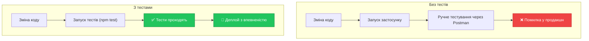
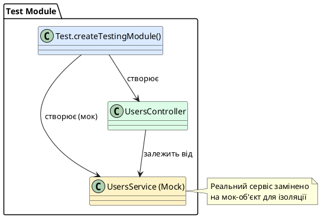

# Тестування контролерів

::card-group

::card{title="🎯 Мета лекції" icon="i-lucide-target"}

- Зрозуміти важливість unit-тестування контролерів для надійності застосунку
- Опанувати створення тестового модуля через `Test.createTestingModule()`
- Навчитися мокувати залежності (сервіси) за допомогою Jest
- Практикувати написання тестів для всіх CRUD-операцій
- Вивчити перевірку викликів методів та аргументів через Jest matchers
- Засвоїти тестування обробки помилок (NotFoundException, ConflictException)
- Ознайомитися з coverage-звітами для оцінки покриття коду
- Навчитися відокремлювати тести контролера від тестів сервісу

::

::card{title="🔑 Ключові терміни" icon="i-lucide-key"}

- **Unit Test** (*модульний тест*): тестування окремого компонента в ізоляції
- **Mock** (*мок, заглушка*): замінник реального об'єкта для контрольованої поведінки
- **Test Suite** (*тестовий набір*): група пов'язаних тестів у блоці `describe()`
- **Test Case** (*тестовий випадок*): одиничний тест у блоці `it()` або `test()`
- **Assertion** (*твердження*): перевірка очікуваного результату через `expect()`
- **Test Coverage** (*покриття коду*): відсоток коду, що виконується під час тестів
- **Arrange-Act-Assert**: структура тесту (підготовка → дія → перевірка)

::

::


## Філософія тестування у NestJS

**Тестування** — невід'ємна частина професійної розробки, що гарантує **надійність**, **підтримуваність** та **впевненість** при рефакторингу коду. NestJS має вбудовану підтримку тестування через фреймворк **Jest**, що дозволяє писати unit-тести, integration-тести та e2e-тести.

### Чому потрібне тестування контролерів

::mermaid



::

**Переваги тестування:**

1. **Швидкий зворотний зв'язок** — тести виконуються за секунди замість хвилин ручного тестування
2. **Впевненість при рефакторингу** — зміни коду не ламають існуючу функціональність
3. **Документація коду** — тести показують, як має працювати компонент
4. **Виявлення регресій** — автоматичне виявлення помилок при додаванні нового коду
5. **CI/CD інтеграція** — автоматична перевірка перед деплоєм

### Unit vs Integration vs E2E тести

| Тип тесту | Що тестує | Швидкість | Ізоляція | Використання |
|-----------|-----------|-----------|----------|--------------|
| **Unit** | Окремий компонент (контролер, сервіс) | ⚡️⚡️⚡️ Найшвидші | ✅ Повна | Логіка методів |
| **Integration** | Взаємодія кількох компонентів | ⚡️⚡️ Середні | ⚠️ Часткова | Інтеграція з БД |
| **E2E** | Весь застосунок через HTTP | ⚡️ Повільні | ❌ Відсутня | Реальні сценарії |

**У цій лекції** ми зосередимося на **unit-тестуванні контролерів** — найшвидшому та найізольованішому типі тестів.


## Структура тестового файлу

NestJS CLI автоматично створює тестовий файл `*.spec.ts` для кожного компонента. Розглянемо базову структуру:

```typescript
// src/users/users.controller.spec.ts
import { Test, TestingModule } from '@nestjs/testing';
import { UsersController } from './users.controller';
import { UsersService } from './users.service';

describe('UsersController', () => {
  let controller: UsersController;
  let service: UsersService;

  beforeEach(async () => {
    const module: TestingModule = await Test.createTestingModule({
      controllers: [UsersController],
      providers: [UsersService],
    }).compile();

    controller = module.get<UsersController>(UsersController);
    service = module.get<UsersService>(UsersService);
  });

  it('should be defined', () => {
    expect(controller).toBeDefined();
  });
});
```

### Анатомія тестового файлу

**1. `describe()` — тестовий набір (test suite)**
```typescript
describe('UsersController', () => {
  // Група пов'язаних тестів
});
```

**2. `beforeEach()` — підготовка перед кожним тестом**
```typescript
beforeEach(async () => {
  // Створення чистого тестового модуля
  // Виконується перед КОЖНИМ тестом
});
```

**3. `it()` або `test()` — тестовий випадок**
```typescript
it('should return all users', () => {
  // Один конкретний тест
});
```

**4. `expect()` — твердження (assertion)**
```typescript
expect(result).toEqual(expectedValue);
```

::note
**beforeEach vs beforeAll:**

- **beforeEach()** — виконується перед кожним тестом (свіжий стан)
- **beforeAll()** — виконується один раз перед усіма тестами (спільний стан)

Для unit-тестів завжди використовуйте **beforeEach()**, щоб уникнути залежностей між тестами.
::


## Створення тестового модуля

**`Test.createTestingModule()`** — утиліта NestJS для створення ізольованого модуля з мокованими залежностями.

### Базовий приклад

```typescript
import { Test, TestingModule } from '@nestjs/testing';
import { UsersController } from './users.controller';
import { UsersService } from './users.service';

describe('UsersController', () => {
  let controller: UsersController;
  let service: UsersService;

  beforeEach(async () => {
    // Створення тестового модуля
    const module: TestingModule = await Test.createTestingModule({
      controllers: [UsersController],
      providers: [UsersService],
    }).compile();

    // Витягування екземплярів з DI контейнера
    controller = module.get<UsersController>(UsersController);
    service = module.get<UsersService>(UsersService);
  });

  // Тести...
});
```

**Що відбувається:**

1. `Test.createTestingModule()` створює мінімальний NestJS-модуль
2. `.compile()` компілює модуль та ініціалізує залежності
3. `module.get<T>()` витягує екземпляр з DI контейнера

::plant-uml{alt="Тестовий модуль NestJS"}



::


## Мокування залежностей

Для unit-тестування контролера потрібно **ізолювати** його від реального сервісу. Мокування дозволяє контролювати поведінку залежностей без виконання реальної бізнес-логіки.

### Мокування сервісу через Jest

```typescript
import { Test, TestingModule } from '@nestjs/testing';
import { UsersController } from './users.controller';
import { UsersService } from './users.service';

describe('UsersController', () => {
  let controller: UsersController;
  let service: UsersService;

  // Мок-об'єкт для UsersService
  const mockUsersService = {
    create: jest.fn(),
    findAll: jest.fn(),
    findOne: jest.fn(),
    update: jest.fn(),
    remove: jest.fn(),
  };

  beforeEach(async () => {
    const module: TestingModule = await Test.createTestingModule({
      controllers: [UsersController],
      providers: [
        {
          provide: UsersService,
          useValue: mockUsersService, // Замінюємо реальний сервіс на мок
        },
      ],
    }).compile();

    controller = module.get<UsersController>(UsersController);
    service = module.get<UsersService>(UsersService);
  });

  // Очищення моків перед кожним тестом
  afterEach(() => {
    jest.clearAllMocks();
  });

  // Тести...
});
```

**Ключові моменти:**

1. **`jest.fn()`** — створює мок-функцію, що записує всі виклики
2. **`provide: UsersService, useValue: mockUsersService`** — заміна реального сервісу
3. **`jest.clearAllMocks()`** — очищення історії викликів між тестами

### Налаштування поведінки моків

```typescript
// Мок повертає конкретне значення
mockUsersService.findAll.mockReturnValue([
  { id: 1, name: 'Alice', email: 'alice@example.com', role: 'user' },
  { id: 2, name: 'Bob', email: 'bob@example.com', role: 'admin' },
]);

// Мок повертає Promise (для async методів)
mockUsersService.findOne.mockResolvedValue({
  id: 1,
  name: 'Alice',
  email: 'alice@example.com',
  role: 'user',
});

// Мок кидає помилку
mockUsersService.findOne.mockRejectedValue(
  new NotFoundException('User not found'),
);
```

**Jest мок-методи:**

| Метод | Призначення |
|-------|-------------|
| **mockReturnValue(value)** | Синхронне повернення значення |
| **mockResolvedValue(value)** | Повернення Promise.resolve(value) |
| **mockRejectedValue(error)** | Повернення Promise.reject(error) |
| **mockImplementation(fn)** | Кастомна реалізація функції |


## Тестування GET-ендпоінтів

Розглянемо тестування методів читання даних (READ operations).

### Тест: отримання всіх користувачів

```typescript
describe('findAll', () => {
  it('should return an array of users', async () => {
    // Arrange: Підготовка моків
    const mockUsers = [
      {
        id: 1,
        email: 'alice@example.com',
        name: 'Alice Johnson',
        role: 'admin' as const,
        createdAt: new Date(),
        updatedAt: new Date(),
      },
      {
        id: 2,
        email: 'bob@example.com',
        name: 'Bob Smith',
        role: 'user' as const,
        createdAt: new Date(),
        updatedAt: new Date(),
      },
    ];

    mockUsersService.findAll.mockResolvedValue(mockUsers);

    // Act: Виклик методу контролера
    const result = await controller.findAll();

    // Assert: Перевірка результату
    expect(result).toEqual(mockUsers);
    expect(service.findAll).toHaveBeenCalled();
    expect(service.findAll).toHaveBeenCalledTimes(1);
  });

  it('should pass role filter to service', async () => {
    // Arrange
    const mockAdmins = [
      {
        id: 1,
        email: 'alice@example.com',
        name: 'Alice Johnson',
        role: 'admin' as const,
        createdAt: new Date(),
        updatedAt: new Date(),
      },
    ];

    mockUsersService.findAll.mockResolvedValue(mockAdmins);

    // Act
    const result = await controller.findAll('admin');

    // Assert
    expect(result).toEqual(mockAdmins);
    expect(service.findAll).toHaveBeenCalledWith('admin');
  });
});
```

**Структура Arrange-Act-Assert:**

1. **Arrange** — налаштування моків та тестових даних
2. **Act** — виклик методу, що тестується
3. **Assert** — перевірка результату через `expect()`

### Тест: отримання одного користувача

```typescript
describe('findOne', () => {
  it('should return a user by id', async () => {
    // Arrange
    const mockUser = {
      id: 1,
      email: 'alice@example.com',
      name: 'Alice Johnson',
      role: 'admin' as const,
      createdAt: new Date(),
      updatedAt: new Date(),
    };

    mockUsersService.findOne.mockResolvedValue(mockUser);

    // Act
    const result = await controller.findOne(1);

    // Assert
    expect(result).toEqual(mockUser);
    expect(service.findOne).toHaveBeenCalledWith(1);
  });

  it('should throw NotFoundException for non-existent user', async () => {
    // Arrange
    mockUsersService.findOne.mockRejectedValue(
      new NotFoundException('User with ID 999 not found'),
    );

    // Act & Assert
    await expect(controller.findOne(999)).rejects.toThrow(NotFoundException);
    await expect(controller.findOne(999)).rejects.toThrow(
      'User with ID 999 not found',
    );
  });
});
```

::tip
**`expect().rejects.toThrow()`** — спеціальний matcher для тестування асинхронних помилок. Для синхронних функцій використовуйте `expect(() => fn()).toThrow()`.
::


## Тестування POST/PATCH/DELETE-ендпоінтів

Тестування операцій зміни даних (CREATE, UPDATE, DELETE).

### Тест: створення користувача

```typescript
describe('create', () => {
  it('should create a new user', async () => {
    // Arrange
    const createUserDto = {
      email: 'charlie@example.com',
      name: 'Charlie Brown',
      role: 'user' as const,
    };

    const mockCreatedUser = {
      id: 3,
      ...createUserDto,
      createdAt: new Date(),
      updatedAt: new Date(),
    };

    mockUsersService.create.mockResolvedValue(mockCreatedUser);

    // Act
    const result = await controller.create(createUserDto);

    // Assert
    expect(result).toEqual(mockCreatedUser);
    expect(service.create).toHaveBeenCalledWith(createUserDto);
    expect(service.create).toHaveBeenCalledTimes(1);
  });

  it('should throw ConflictException for duplicate email', async () => {
    // Arrange
    const createUserDto = {
      email: 'alice@example.com', // Email вже існує
      name: 'Another Alice',
      role: 'user' as const,
    };

    mockUsersService.create.mockRejectedValue(
      new ConflictException('User with email alice@example.com already exists'),
    );

    // Act & Assert
    await expect(controller.create(createUserDto)).rejects.toThrow(
      ConflictException,
    );
  });
});
```

### Тест: оновлення користувача

```typescript
describe('update', () => {
  it('should update a user', async () => {
    // Arrange
    const updateUserDto = {
      name: 'Alice Updated',
    };

    const mockUpdatedUser = {
      id: 1,
      email: 'alice@example.com',
      name: 'Alice Updated',
      role: 'admin' as const,
      createdAt: new Date('2024-01-01'),
      updatedAt: new Date(),
    };

    mockUsersService.update.mockResolvedValue(mockUpdatedUser);

    // Act
    const result = await controller.update(1, updateUserDto);

    // Assert
    expect(result).toEqual(mockUpdatedUser);
    expect(service.update).toHaveBeenCalledWith(1, updateUserDto);
  });

  it('should throw NotFoundException for non-existent user', async () => {
    // Arrange
    const updateUserDto = { name: 'Updated Name' };

    mockUsersService.update.mockRejectedValue(
      new NotFoundException('User with ID 999 not found'),
    );

    // Act & Assert
    await expect(controller.update(999, updateUserDto)).rejects.toThrow(
      NotFoundException,
    );
  });
});
```

### Тест: видалення користувача

```typescript
describe('remove', () => {
  it('should remove a user', async () => {
    // Arrange
    mockUsersService.remove.mockResolvedValue(undefined);

    // Act
    const result = await controller.remove(1);

    // Assert
    expect(result).toBeUndefined(); // DELETE повертає void
    expect(service.remove).toHaveBeenCalledWith(1);
    expect(service.remove).toHaveBeenCalledTimes(1);
  });

  it('should throw NotFoundException for non-existent user', async () => {
    // Arrange
    mockUsersService.remove.mockRejectedValue(
      new NotFoundException('User with ID 999 not found'),
    );

    // Act & Assert
    await expect(controller.remove(999)).rejects.toThrow(NotFoundException);
  });
});
```


## Перевірка викликів методів та аргументів

Jest надає потужні **matchers** для перевірки взаємодії з моками.

### Основні Jest matchers

```typescript
// 1. Перевірка, що метод був викликаний
expect(service.findAll).toHaveBeenCalled();

// 2. Перевірка кількості викликів
expect(service.findAll).toHaveBeenCalledTimes(1);

// 3. Перевірка аргументів виклику
expect(service.create).toHaveBeenCalledWith(createUserDto);

// 4. Перевірка конкретного виклику (якщо метод викликався кілька разів)
expect(service.findOne).toHaveBeenNthCalledWith(1, 1); // 1-й виклик з аргументом 1
expect(service.findOne).toHaveBeenNthCalledWith(2, 2); // 2-й виклик з аргументом 2

// 5. Перевірка останнього виклику
expect(service.update).toHaveBeenLastCalledWith(1, updateUserDto);

// 6. Перевірка, що метод НЕ викликався
expect(service.remove).not.toHaveBeenCalled();
```

### Таблиця Jest matchers

| Matcher | Призначення |
|---------|-------------|
| **toHaveBeenCalled()** | Метод був викликаний принаймні раз |
| **toHaveBeenCalledTimes(n)** | Метод викликався рівно n разів |
| **toHaveBeenCalledWith(...args)** | Метод викликався з конкретними аргументами |
| **toHaveBeenNthCalledWith(n, ...args)** | n-й виклик мав конкретні аргументи |
| **toHaveBeenLastCalledWith(...args)** | Останній виклик мав конкретні аргументи |
| **not.toHaveBeenCalled()** | Метод НЕ викликався |

### Приклад складної перевірки

```typescript
it('should handle multiple findOne calls', async () => {
  // Arrange
  const user1 = { id: 1, name: 'Alice', email: 'alice@example.com', role: 'admin' as const };
  const user2 = { id: 2, name: 'Bob', email: 'bob@example.com', role: 'user' as const };

  mockUsersService.findOne
    .mockResolvedValueOnce(user1) // Перший виклик повертає user1
    .mockResolvedValueOnce(user2); // Другий виклик повертає user2

  // Act
  const result1 = await controller.findOne(1);
  const result2 = await controller.findOne(2);

  // Assert
  expect(result1).toEqual(user1);
  expect(result2).toEqual(user2);
  
  expect(service.findOne).toHaveBeenCalledTimes(2);
  expect(service.findOne).toHaveBeenNthCalledWith(1, 1);
  expect(service.findOne).toHaveBeenNthCalledWith(2, 2);
});
```


## Запуск тестів та аналіз coverage

### Команди запуску тестів

::tabs
::tabs-item{label="Одноразовий запуск"}
```bash
npm run test
```
::
::tabs-item{label="Watch mode"}
```bash
npm run test:watch
```
::
::tabs-item{label="Coverage звіт"}
```bash
npm run test:cov
```
::
::tabs-item{label="Конкретний файл"}
```bash
npm run test users.controller.spec.ts
```
::
::

### Вивід тестів у терміналі

::terminal-preview{title="npm run test users.controller.spec.ts" :cursor="false"}

<div class="line"><span class="opacity-40">$</span> <strong class="font-bold">npm run test users.controller.spec.ts</strong></div>
<div class="line"></div>
<div class="line"><span class="text-blue-400">PASS</span>  src/users/users.controller.spec.ts</div>
<div class="line">  UsersController</div>
<div class="line">    <span class="text-green-400">✓</span> should be defined <span class="opacity-40">(3 ms)</span></div>
<div class="line">    findAll</div>
<div class="line">      <span class="text-green-400">✓</span> should return an array of users <span class="opacity-40">(2 ms)</span></div>
<div class="line">      <span class="text-green-400">✓</span> should pass role filter to service <span class="opacity-40">(1 ms)</span></div>
<div class="line">    findOne</div>
<div class="line">      <span class="text-green-400">✓</span> should return a user by id <span class="opacity-40">(1 ms)</span></div>
<div class="line">      <span class="text-green-400">✓</span> should throw NotFoundException for non-existent user <span class="opacity-40">(2 ms)</span></div>
<div class="line">    create</div>
<div class="line">      <span class="text-green-400">✓</span> should create a new user <span class="opacity-40">(1 ms)</span></div>
<div class="line">      <span class="text-green-400">✓</span> should throw ConflictException for duplicate email <span class="opacity-40">(1 ms)</span></div>
<div class="line">    update</div>
<div class="line">      <span class="text-green-400">✓</span> should update a user <span class="opacity-40">(1 ms)</span></div>
<div class="line">      <span class="text-green-400">✓</span> should throw NotFoundException for non-existent user <span class="opacity-40">(1 ms)</span></div>
<div class="line">    remove</div>
<div class="line">      <span class="text-green-400">✓</span> should remove a user <span class="opacity-40">(1 ms)</span></div>
<div class="line">      <span class="text-green-400">✓</span> should throw NotFoundException for non-existent user <span class="opacity-40">(1 ms)</span></div>
<div class="line"></div>
<div class="line"><span class="text-green-400 font-bold">Test Suites:</span> 1 passed, 1 total</div>
<div class="line"><span class="text-green-400 font-bold">Tests:</span>       11 passed, 11 total</div>
<div class="line"><span class="text-blue-400 font-bold">Time:</span>        1.234 s</div>

::

### Coverage звіт

::terminal-preview{title="npm run test:cov" :cursor="false"}

<div class="line"><span class="opacity-40">$</span> <strong class="font-bold">npm run test:cov</strong></div>
<div class="line"></div>
<div class="line">-------------------|---------|----------|---------|---------|-------------------</div>
<div class="line">File               | % Stmts | % Branch | % Funcs | % Lines | Uncovered Line #s</div>
<div class="line">-------------------|---------|----------|---------|---------|-------------------</div>
<div class="line">All files          |   <span class="text-green-400 font-bold">98.50</span>  |   <span class="text-green-400 font-bold">95.00</span>   |  <span class="text-green-400 font-bold">100.00</span> |   <span class="text-green-400 font-bold">98.33</span>  |</div>
<div class="line"> users             |  <span class="text-green-400 font-bold">100.00</span> |  <span class="text-green-400 font-bold">100.00</span>  |  <span class="text-green-400 font-bold">100.00</span> |  <span class="text-green-400 font-bold">100.00</span> |</div>
<div class="line">  users.controller |  <span class="text-green-400 font-bold">100.00</span> |  <span class="text-green-400 font-bold">100.00</span>  |  <span class="text-green-400 font-bold">100.00</span> |  <span class="text-green-400 font-bold">100.00</span> |</div>
<div class="line">  users.service    |   <span class="text-yellow-400 font-bold">97.50</span> |   <span class="text-yellow-400 font-bold">90.00</span>   |  <span class="text-green-400 font-bold">100.00</span> |   <span class="text-yellow-400 font-bold">97.00</span>  | 45-47</div>
<div class="line">-------------------|---------|----------|---------|---------|-------------------</div>
<div class="line"></div>
<div class="line"><span class="text-green-400 font-bold">Coverage report generated in:</span> coverage/lcov-report/index.html</div>

::

**Метрики coverage:**

- **Statements** — відсоток виконаних інструкцій
- **Branches** — відсоток виконаних гілок (if/else, switch)
- **Functions** — відсоток викликаних функцій
- **Lines** — відсоток виконаних рядків коду

::tip
**Цільові показники:** Для критичних компонентів (контролери, сервіси) прагніть до **80-100% coverage**. Проте coverage — це не самоціль: краще мати 80% якісних тестів, ніж 100% формальних.
::


## Best Practices тестування контролерів

### Правило 1. Тестуйте контролер, а не сервіс

**❌ Погано — тестування логіки сервісу:**

```typescript
it('should validate email format', async () => {
  const invalidDto = { email: 'not-an-email', name: 'Test', role: 'user' };
  
  // ❌ Тестуємо валідацію всередині сервісу
  await expect(controller.create(invalidDto)).rejects.toThrow(BadRequestException);
});
```

**✅ Добре — тестування делегації:**

```typescript
it('should call service.create with correct arguments', async () => {
  const createDto = { email: 'test@example.com', name: 'Test', role: 'user' };
  
  mockUsersService.create.mockResolvedValue({ id: 1, ...createDto });
  
  await controller.create(createDto);
  
  // ✅ Перевіряємо, що контролер правильно делегує
  expect(service.create).toHaveBeenCalledWith(createDto);
});
```

### Правило 2. Один тест — одна перевірка

**❌ Погано — множинні перевірки в одному тесті:**

```typescript
it('should handle user operations', async () => {
  const user = await controller.create(createDto);
  expect(user.id).toBeDefined();
  
  const users = await controller.findAll();
  expect(users).toHaveLength(1);
  
  await controller.remove(user.id);
  expect(service.remove).toHaveBeenCalled();
});
```

**✅ Добре — окремі тести:**

```typescript
it('should create a user with generated id', async () => {
  const user = await controller.create(createDto);
  expect(user.id).toBeDefined();
});

it('should return all users', async () => {
  const users = await controller.findAll();
  expect(users).toHaveLength(1);
});

it('should remove a user', async () => {
  await controller.remove(1);
  expect(service.remove).toHaveBeenCalledWith(1);
});
```

### Правило 3. Описові назви тестів

**❌ Погано:**

```typescript
it('test1', () => { });
it('works', () => { });
it('findAll', () => { });
```

**✅ Добре:**

```typescript
it('should return an array of users', () => { });
it('should throw NotFoundException when user does not exist', () => { });
it('should pass role filter to service.findAll', () => { });
```

### Правило 4. Очищення моків

```typescript
afterEach(() => {
  jest.clearAllMocks(); // Очищення історії викликів
});

afterAll(() => {
  jest.restoreAllMocks(); // Відновлення оригінальних реалізацій
});
```

### Правило 5. Уникайте дублювання тестових даних

```typescript
// ❌ Погано — дублювання у кожному тесті
it('test 1', () => {
  const user = { id: 1, name: 'Alice', email: 'alice@example.com', role: 'admin' };
  // ...
});

it('test 2', () => {
  const user = { id: 1, name: 'Alice', email: 'alice@example.com', role: 'admin' };
  // ...
});

// ✅ Добре — фабричні функції
const createMockUser = (overrides = {}) => ({
  id: 1,
  name: 'Alice',
  email: 'alice@example.com',
  role: 'admin' as const,
  createdAt: new Date(),
  updatedAt: new Date(),
  ...overrides,
});

it('test 1', () => {
  const user = createMockUser();
  // ...
});

it('test 2', () => {
  const admin = createMockUser({ role: 'admin' });
  // ...
});
```


## Резюме

::card-group

::card{title="🧪 Створення тестів" icon="i-lucide-flask-conical"}

- `Test.createTestingModule()` для модуля
- Мокування сервісів через `jest.fn()`
- `beforeEach()` для свіжого стану
- `afterEach()` для очищення моків

::

::card{title="✅ Перевірки" icon="i-lucide-check-square"}

- `expect(result).toEqual(expected)`
- `expect(service.method).toHaveBeenCalled()`
- `expect().toHaveBeenCalledWith(args)`
- `expect().rejects.toThrow(Exception)`

::

::card{title="📊 Coverage" icon="i-lucide-bar-chart"}

- `npm run test:cov` для звіту
- Цільові показники: 80-100%
- Statements, Branches, Functions, Lines
- HTML-звіт у `coverage/lcov-report/`

::

::card{title="🎯 Best Practices" icon="i-lucide-target"}

- Тестуйте делегацію, не логіку сервісу
- Один тест — одна перевірка
- Описові назви тестів
- Фабричні функції для тестових даних

::

::

::note
**Підсумкова рекомендація:** Unit-тестування контролерів забезпечує швидкий зворотний зв'язок та впевненість при рефакторингу. Мокуйте всі залежності, перевіряйте делегацію методів та обробку помилок. Прагніть до високого coverage, але пріоритизуйте якість тестів над кількістю.
::

