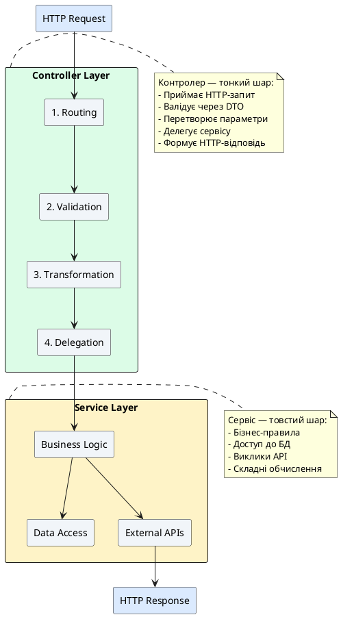

# Best Practices для контролерів та маршрутизації

::card-group

::card{title="🎯 Мета лекції" icon="i-lucide-target"}

- Опанувати принципи проєктування контролерів згідно з Single Responsibility Principle
- Засвоїти розділення відповідальності між контролерами та сервісами
- Вивчити RESTful конвенції для іменування ендпоінтів та використання HTTP-методів
- Практикувати правильне використання HTTP статус-кодів для різних сценаріїв
- Навчитися організовувати контролери за доменами та версіонувати API
- Зрозуміти важливість DTO та валідації для безпеки та підтримуваності
- Ознайомитися з анти-патернами та частими помилками при розробці контролерів
- Засвоїти рекомендації щодо документування API через Swagger

::

::card{title="🔑 Ключові терміни" icon="i-lucide-key"}

- **Single Responsibility Principle** (*принцип єдиної відповідальності*): компонент має одну причину для зміни
- **Separation of Concerns** (*розділення відповідальності*): ізоляція різних аспектів логіки
- **RESTful API**: архітектурний стиль з використанням HTTP-методів та стандартизованих маршрутів
- **Anti-pattern** (*анти-патерн*): поширене рішення, що призводить до проблем
- **API Versioning** (*версіонування API*): підтримка кількох версій API одночасно
- **Idempotent Operation** (*ідемпотентна операція*): дає той самий результат при повторних викликах
- **Defensive Programming** (*захисне програмування*): перевірка вхідних даних та обробка крайніх випадків

::

::


## Принцип Single Responsibility для контролерів

**Single Responsibility Principle (SRP)** — один з п'яти принципів SOLID, що стверджує: **клас повинен мати лише одну причину для зміни**. Для контролерів це означає, що вони мають займатися **лише маршрутизацією та валідацією**, делегуючи всю бізнес-логіку сервісам.

### Анатомія правильного контролера

::plant-uml{alt="Відповідальності контролера"}



::

**✅ Правильна архітектура:**

```typescript
// ✅ Контролер — тонкий шар маршрутизації
@Controller('users')
export class UsersController {
  constructor(private readonly usersService: UsersService) {}

  @Post()
  @HttpCode(HttpStatus.CREATED)
  async create(@Body() createUserDto: CreateUserDto) {
    // Лише делегація — вся логіка у сервісі
    return this.usersService.create(createUserDto);
  }

  @Get()
  async findAll(@Query('role') role?: 'user' | 'admin') {
    return this.usersService.findAll(role);
  }

  @Get(':id')
  async findOne(@Param('id', ParseIntPipe) id: number) {
    return this.usersService.findOne(id);
  }
}
```

```typescript
// ✅ Сервіс — товстий шар бізнес-логіки
@Injectable()
export class UsersService {
  constructor(
    @InjectRepository(User)
    private readonly usersRepository: Repository<User>,
    private readonly emailService: EmailService,
  ) {}

  async create(createUserDto: CreateUserDto): Promise<User> {
    // Перевірка бізнес-правил
    const existingUser = await this.usersRepository.findOne({
      where: { email: createUserDto.email },
    });

    if (existingUser) {
      throw new ConflictException('Email already exists');
    }

    // Хешування пароля
    const hashedPassword = await bcrypt.hash(createUserDto.password, 10);

    // Створення користувача
    const user = this.usersRepository.create({
      ...createUserDto,
      password: hashedPassword,
    });

    const savedUser = await this.usersRepository.save(user);

    // Відправка welcome email
    await this.emailService.sendWelcome(savedUser.email);

    return savedUser;
  }
}
```

**❌ Анти-патерн — бізнес-логіка у контролері:**

```typescript
// ❌ ПОГАНО: контролер містить бізнес-логіку
@Controller('users')
export class UsersController {
  constructor(
    @InjectRepository(User)
    private readonly usersRepository: Repository<User>,
    private readonly emailService: EmailService,
  ) {}

  @Post()
  async create(@Body() createUserDto: CreateUserDto) {
    // ❌ Бізнес-логіка у контролері
    const existingUser = await this.usersRepository.findOne({
      where: { email: createUserDto.email },
    });

    if (existingUser) {
      throw new ConflictException('Email already exists');
    }

    const hashedPassword = await bcrypt.hash(createUserDto.password, 10);

    const user = this.usersRepository.create({
      ...createUserDto,
      password: hashedPassword,
    });

    const savedUser = await this.usersRepository.save(user);

    await this.emailService.sendWelcome(savedUser.email);

    return savedUser;
  }
}
```

**Проблеми анти-патерну:**

1. **Складність тестування** — потрібно мокувати репозиторій та email-сервіс у тестах контролера
2. **Дублювання коду** — логіку неможливо переви використати в інших місцях
3. **Порушення SRP** — контролер має кілька причин для зміни (зміна логіки email, зміна хешування)
4. **Складність підтримки** — логіка розмазана по контролерах


## RESTful дизайн та іменування

REST API має дотримуватися **стандартизованих конвенцій**, що робить його передбачуваним та зрозумілим для розробників.

### Іменування ресурсів

**Правила:**

1. **Використовуйте іменники у множині** — `/users`, `/products`, `/orders`
2. **Уникайте дієслів** — HTTP-метод вже вказує дію
3. **kebab-case для складених слів** — `/user-profiles`, `/order-items`
4. **Ієрархічні ресурси** — `/users/:userId/orders` (замовлення користувача)

**✅ Правильно:**

```typescript
GET    /users              // Список користувачів
POST   /users              // Створення користувача
GET    /users/1            // Один користувач
PATCH  /users/1            // Оновлення користувача
DELETE /users/1            // Видалення користувача

GET    /users/1/orders     // Замовлення користувача 1
POST   /users/1/orders     // Створення замовлення для користувача 1

GET    /order-items        // Всі елементи замовлень
```

**❌ Неправильно:**

```typescript
GET    /getUsers           // ❌ Дієслово
POST   /createUser         // ❌ Дієслово + однина
GET    /user/1             // ❌ Однина
DELETE /deleteUser?id=1    // ❌ Дієслово + query замість param
GET    /users/1/getOrders  // ❌ Дієслово

GET    /order_items        // ❌ snake_case замість kebab-case
```

### HTTP-методи та їх семантика

| Метод | Призначення | Ідемпотентність | Body | Статус успіху |
|-------|-------------|-----------------|------|---------------|
| **GET** | Читання ресурсів | ✅ Так | ❌ Немає | 200 OK |
| **POST** | Створення ресурсу | ❌ Ні | ✅ Так | 201 Created |
| **PUT** | Повне заміщення | ✅ Так | ✅ Так | 200 OK, 204 No Content |
| **PATCH** | Часткове оновлення | ⚠️ Іноді | ✅ Так | 200 OK |
| **DELETE** | Видалення ресурсу | ✅ Так | ❌ Немає | 204 No Content |

**Ідемпотентність** — властивість операції давати той самий результат при повторних викликах:

```typescript
// GET — ідемпотентний (завжди повертає той самий користувач)
GET /users/1
GET /users/1
GET /users/1
// → Всі виклики повертають { id: 1, name: "Alice" }

// DELETE — ідемпотентний (після першого виклику користувач видалено)
DELETE /users/1  // 204 No Content
DELETE /users/1  // 404 Not Found (але стан не змінився)
DELETE /users/1  // 404 Not Found

// POST — НЕ ідемпотентний (кожен виклик створює новий ресурс)
POST /users { name: "Bob" }  // { id: 2, name: "Bob" }
POST /users { name: "Bob" }  // { id: 3, name: "Bob" } ❌ Дубль!
```

### HTTP статус-коди

**Успішні відповіді (2xx):**

| Код | Назва | Використання |
|-----|-------|--------------|
| **200** | OK | Успішна операція з тілом відповіді (GET, PATCH, PUT) |
| **201** | Created | Ресурс створено (POST) |
| **204** | No Content | Успішна операція без тіла відповіді (DELETE) |

**Помилки клієнта (4xx):**

| Код | Назва | Використання |
|-----|-------|--------------|
| **400** | Bad Request | Невалідні дані (провал валідації DTO) |
| **401** | Unauthorized | Відсутня або невалідна автентифікація |
| **403** | Forbidden | Автентифікація пройдена, але доступ заборонено |
| **404** | Not Found | Ресурс не знайдено |
| **409** | Conflict | Конфлікт (email вже існує, race condition) |
| **422** | Unprocessable Entity | Валідні дані, але бізнес-правила порушено |

**Помилки сервера (5xx):**

| Код | Назва | Використання |
|-----|-------|--------------|
| **500** | Internal Server Error | Непередбачена помилка сервера |
| **503** | Service Unavailable | Сервіс тимчасово недоступний |

**Приклад використання у контролері:**

```typescript
@Controller('users')
export class UsersController {
  @Post()
  @HttpCode(HttpStatus.CREATED) // 201
  async create(@Body() dto: CreateUserDto) {
    return this.usersService.create(dto);
  }

  @Get()
  // За замовчуванням 200 OK
  async findAll() {
    return this.usersService.findAll();
  }

  @Delete(':id')
  @HttpCode(HttpStatus.NO_CONTENT) // 204
  async remove(@Param('id', ParseIntPipe) id: number) {
    return this.usersService.remove(id);
  }
}
```


## Використання DTO замість прямих параметрів

**DTO (Data Transfer Objects)** інкапсулюють структуру даних та правила валідації, що робить API безпечнішим та зрозумілішим.

### Чому DTO, а не прості параметри?

**❌ Без DTO — прямі параметри:**

```typescript
@Post()
async create(
  @Body('email') email: string,
  @Body('name') name: string,
  @Body('role') role: string,
  @Body('age') age: number,
  @Body('address') address: string,
) {
  // ❌ Проблеми:
  // 1. Немає валідації
  // 2. Немає типізації
  // 3. Важко додати нове поле (5+ параметрів)
  // 4. Немає документації структури
  
  return this.usersService.create({ email, name, role, age, address });
}
```

**✅ З DTO — інкапсуляція та валідація:**

```typescript
// create-user.dto.ts
export class CreateUserDto {
  @IsEmail()
  @IsNotEmpty()
  email: string;

  @IsString()
  @MinLength(2)
  @MaxLength(50)
  name: string;

  @IsEnum(['user', 'admin'])
  role: 'user' | 'admin';

  @IsInt()
  @Min(18)
  @Max(120)
  age: number;

  @IsString()
  @IsOptional()
  address?: string;
}

// Controller
@Post()
@HttpCode(HttpStatus.CREATED)
async create(@Body() createUserDto: CreateUserDto) {
  // ✅ Переваги:
  // 1. Автоматична валідація через ValidationPipe
  // 2. Повна типізація
  // 3. Легко розширювати
  // 4. Самодокументований код
  
  return this.usersService.create(createUserDto);
}
```

### DTO для query-параметрів

```typescript
// find-users-query.dto.ts
export class FindUsersQueryDto {
  @IsOptional()
  @IsEnum(['user', 'admin'])
  role?: 'user' | 'admin';

  @IsOptional()
  @Type(() => Number)
  @IsInt()
  @Min(1)
  page?: number = 1;

  @IsOptional()
  @Type(() => Number)
  @IsInt()
  @Min(1)
  @Max(100)
  limit?: number = 10;

  @IsOptional()
  @IsEnum(['name', 'email', 'createdAt'])
  sortBy?: string = 'createdAt';

  @IsOptional()
  @IsEnum(['asc', 'desc'])
  sortOrder?: 'asc' | 'desc' = 'desc';
}

// Controller
@Get()
async findAll(@Query() query: FindUsersQueryDto) {
  return this.usersService.findAll(query);
}

// Використання:
// GET /users?role=admin&page=2&limit=20&sortBy=name&sortOrder=asc
```

### Response DTO для безпеки

**Проблема:** Entity може містити чутливі поля (паролі, токени), які не повинні повертатися клієнту.

**Рішення:** Response DTO з виключенням полів:

```typescript
// user.entity.ts
import { Exclude } from 'class-transformer';

export class User {
  id: number;
  email: string;
  name: string;
  role: 'user' | 'admin';

  @Exclude() // Ніколи не серіалізується у відповіді
  password: string;

  @Exclude()
  refreshToken?: string;

  createdAt: Date;
  updatedAt: Date;
}

// main.ts — увімкнення ClassSerializerInterceptor
import { ClassSerializerInterceptor } from '@nestjs/common';
import { Reflector } from '@nestjs/core';

async function bootstrap() {
  const app = await NestFactory.create(AppModule);
  
  app.useGlobalInterceptors(new ClassSerializerInterceptor(app.get(Reflector)));
  
  await app.listen(3000);
}
```

**Результат:**

```http
GET /users/1

{
  "id": 1,
  "email": "alice@example.com",
  "name": "Alice Johnson",
  "role": "admin",
  "createdAt": "2024-01-15T00:00:00.000Z",
  "updatedAt": "2024-01-15T00:00:00.000Z"
}
// password та refreshToken автоматично виключені
```


## Організація контролерів за доменами

Для великих застосунків важливо **логічно групувати** контролери за доменами або функціональністю.

### Модульна структура

```
src/
├── users/
│   ├── users.controller.ts
│   ├── users.service.ts
│   ├── users.module.ts
│   ├── dto/
│   │   ├── create-user.dto.ts
│   │   └── update-user.dto.ts
│   └── entities/
│       └── user.entity.ts
├── products/
│   ├── products.controller.ts
│   ├── products.service.ts
│   ├── products.module.ts
│   └── ...
├── orders/
│   ├── orders.controller.ts
│   ├── orders.service.ts
│   ├── orders.module.ts
│   └── ...
└── app.module.ts
```

**Переваги:**
- **Інкапсуляція** — кожен модуль незалежний
- **Масштабованість** — легко додавати нові модулі
- **Підтримуваність** — зміни у `users` не впливають на `products`

### Версіонування API

Для підтримки зворотної сумісності використовуйте версіонування:

**Варіант 1: URI Versioning**

```typescript
// src/main.ts
app.setGlobalPrefix('api');
app.enableVersioning({
  type: VersioningType.URI,
});

// src/users/users.controller.ts
@Controller({ path: 'users', version: '1' })
export class UsersV1Controller {
  // GET /api/v1/users
}

@Controller({ path: 'users', version: '2' })
export class UsersV2Controller {
  // GET /api/v2/users
}
```

**Варіант 2: Header Versioning**

```typescript
app.enableVersioning({
  type: VersioningType.HEADER,
  header: 'X-API-Version',
});

// Клієнт надсилає:
// X-API-Version: 1
```

**Варіант 3: Media Type Versioning**

```typescript
app.enableVersioning({
  type: VersioningType.MEDIA_TYPE,
  key: 'v=',
});

// Клієнт надсилає:
// Accept: application/json;v=1
```


## Валідація та обробка помилок

### Глобальна валідація

```typescript
// src/main.ts
import { ValidationPipe } from '@nestjs/common';

async function bootstrap() {
  const app = await NestFactory.create(AppModule);
  
  app.useGlobalPipes(new ValidationPipe({
    whitelist: true,              // Видаляє поля, не описані у DTO
    forbidNonWhitelisted: true,   // Повертає помилку при зайвих полях
    transform: true,              // Автоматично трансформує типи
    transformOptions: {
      enableImplicitConversion: true, // "123" → 123 для @IsNumber()
    },
  }));
  
  await app.listen(3000);
}
```

### Кастомні валідатори

```typescript
// validators/is-strong-password.validator.ts
import { registerDecorator, ValidationOptions } from 'class-validator';

export function IsStrongPassword(validationOptions?: ValidationOptions) {
  return function (object: Object, propertyName: string) {
    registerDecorator({
      name: 'isStrongPassword',
      target: object.constructor,
      propertyName: propertyName,
      options: validationOptions,
      validator: {
        validate(value: any) {
          if (typeof value !== 'string') return false;
          
          // Мінімум 8 символів, 1 велика літера, 1 цифра, 1 спецсимвол
          const regex = /^(?=.*[a-z])(?=.*[A-Z])(?=.*\d)(?=.*[@$!%*?&])[A-Za-z\d@$!%*?&]{8,}$/;
          return regex.test(value);
        },
        defaultMessage() {
          return 'Password must contain at least 8 characters, 1 uppercase, 1 number, and 1 special character';
        },
      },
    });
  };
}

// Використання у DTO
export class CreateUserDto {
  @IsStrongPassword()
  password: string;
}
```

### Глобальна обробка помилок

```typescript
// filters/http-exception.filter.ts
import { ExceptionFilter, Catch, ArgumentsHost, HttpException, HttpStatus } from '@nestjs/common';

@Catch()
export class AllExceptionsFilter implements ExceptionFilter {
  catch(exception: unknown, host: ArgumentsHost) {
    const ctx = host.switchToHttp();
    const response = ctx.getResponse();
    const request = ctx.getRequest();

    const status =
      exception instanceof HttpException
        ? exception.getStatus()
        : HttpStatus.INTERNAL_SERVER_ERROR;

    const message =
      exception instanceof HttpException
        ? exception.getResponse()
        : 'Internal server error';

    response.status(status).json({
      statusCode: status,
      timestamp: new Date().toISOString(),
      path: request.url,
      message,
    });
  }
}

// main.ts
app.useGlobalFilters(new AllExceptionsFilter());
```


## Анти-патерни та частіhelpers

### Анти-патерн 1: Використання @Req та @Res

**❌ Погано:**

```typescript
@Get()
async findAll(@Req() req: Request, @Res() res: Response) {
  const users = await this.usersService.findAll();
  res.status(200).json(users); // ❌ Ручне управління відповіддю
}
```

**✅ Добре:**

```typescript
@Get()
async findAll() {
  return this.usersService.findAll(); // ✅ NestJS автоматично серіалізує
}
```

**Чому погано:**
- Втрата автоматичної серіалізації
- Складність тестування
- Ручне управління статус-кодами

### Анти-патерн 2: Масивні контролери

**❌ Погано — один контролер для всього:**

```typescript
@Controller('api')
export class ApiController {
  // ❌ 50+ методів у одному контролері
  @Get('users')
  getUsers() { }
  
  @Post('users')
  createUser() { }
  
  @Get('products')
  getProducts() { }
  
  @Post('orders')
  createOrder() { }
  
  // ... ще 40+ методів
}
```

**✅ Добре — окремі контролери:**

```typescript
@Controller('users')
export class UsersController { }

@Controller('products')
export class ProductsController { }

@Controller('orders')
export class OrdersController { }
```

### Анти-патерн 3: Ігнорування помилок

**❌ Погано:**

```typescript
@Get(':id')
async findOne(@Param('id') id: number) {
  const user = await this.usersService.findOne(id);
  return user; // ❌ Якщо user === null, повертає 200 OK з null
}
```

**✅ Добре:**

```typescript
@Get(':id')
async findOne(@Param('id', ParseIntPipe) id: number) {
  const user = await this.usersService.findOne(id);
  
  if (!user) {
    throw new NotFoundException(`User with ID ${id} not found`);
  }
  
  return user; // ✅ 404 якщо не знайдено, 200 якщо знайдено
}
```


## Документування API через Swagger

**Swagger (OpenAPI)** автоматично генерує інтерактивну документацію API.

### Встановлення

::tabs
::tabs-item{label="npm"}
```bash
npm install @nestjs/swagger
```
::
::tabs-item{label="yarn"}
```bash
yarn add @nestjs/swagger
```
::
::tabs-item{label="pnpm"}
```bash
pnpm add @nestjs/swagger
```
::
::

### Налаштування у main.ts

```typescript
import { NestFactory } from '@nestjs/core';
import { DocumentBuilder, SwaggerModule } from '@nestjs/swagger';
import { AppModule } from './app.module';

async function bootstrap() {
  const app = await NestFactory.create(AppModule);

  const config = new DocumentBuilder()
    .setTitle('Users API')
    .setDescription('API для управління користувачами')
    .setVersion('1.0')
    .addTag('users')
    .addBearerAuth()
    .build();

  const document = SwaggerModule.createDocument(app, config);
  SwaggerModule.setup('api-docs', app, document);

  await app.listen(3000);
  console.log('Swagger docs: http://localhost:3000/api-docs');
}
bootstrap();
```

### Декоратори Swagger

```typescript
import { ApiTags, ApiOperation, ApiResponse, ApiParam, ApiBody } from '@nestjs/swagger';

@ApiTags('users')
@Controller('users')
export class UsersController {
  @Post()
  @ApiOperation({ summary: 'Створити нового користувача' })
  @ApiBody({ type: CreateUserDto })
  @ApiResponse({ status: 201, description: 'Користувача створено', type: User })
  @ApiResponse({ status: 400, description: 'Невалідні дані' })
  @ApiResponse({ status: 409, description: 'Email вже існує' })
  async create(@Body() createUserDto: CreateUserDto) {
    return this.usersService.create(createUserDto);
  }

  @Get(':id')
  @ApiOperation({ summary: 'Отримати користувача за ID' })
  @ApiParam({ name: 'id', type: 'number', description: 'ID користувача' })
  @ApiResponse({ status: 200, description: 'Користувача знайдено', type: User })
  @ApiResponse({ status: 404, description: 'Користувача не знайдено' })
  async findOne(@Param('id', ParseIntPipe) id: number) {
    return this.usersService.findOne(id);
  }
}
```

**Результат:** Інтерактивна документація за адресою `http://localhost:3000/api-docs`


## Резюме Best Practices

::card-group

::card{title="🏗️ Архітектура" icon="i-lucide-layers"}

- **SRP** — контролер = тонкий шар
- **Делегація** — логіка у сервісах
- **Модульність** — один контролер = один домен
- **Версіонування** — підтримка старих клієнтів

::

::card{title="📋 RESTful дизайн" icon="i-lucide-file-text"}

- **Іменники у множині** — `/users`, `/products`
- **Правильні методи** — GET, POST, PATCH, DELETE
- **Статус-коди** — 200, 201, 204, 404, 409
- **Ідемпотентність** — GET, PUT, DELETE

::

::card{title="🛡️ Валідація та безпека" icon="i-lucide-shield"}

- **DTO** — завжди, не прямі параметри
- **ValidationPipe** — whitelist, forbidNonWhitelisted
- **Response DTO** — виключення чутливих полів
- **Обробка помилок** — HttpException для 4xx/5xx

::

::card{title="📚 Документація" icon="i-lucide-book-open"}

- **Swagger** — автоматична документація
- **@ApiOperation** — опис ендпоінтів
- **@ApiResponse** — можливі відповіді
- **@ApiTags** — групування у розділи

::

::

::note
**Підсумкова рекомендація:** Дотримуйтесь принципу Single Responsibility — контролери мають бути тонким шаром маршрутизації. Використовуйте DTO для всіх вхідних даних, дотримуйтесь RESTful конвенцій та документуйте API через Swagger. Ці практики забезпечать підтримуваність, масштабованість та зрозумілість коду для всієї команди.
::

