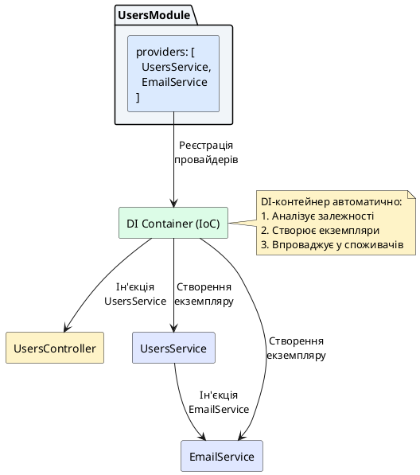
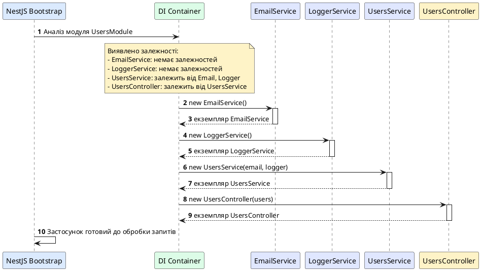

# Концепція провайдерів у NestJS

## Короткий зміст

- Що таке Provider у контексті NestJS
- Декоратор `@Injectable()`: позначення класу як провайдера
- Реєстрація провайдерів у масиві `providers` модуля
- Провайдери як основа для ін'єкції залежностей
- Типи провайдерів: сервіси, репозиторії, фабрики, хелпери
- Автоматичне створення екземплярів через DI-контейнер
- Singleton-патерн за замовчуванням (один екземпляр на застосунок)
- Час життя провайдера: створення при ініціалізації модуля
- Відмінність провайдера від контролера
- Коли створювати власні провайдери

---

## Архітектурний контекст: від контролерів до провайдерів

У попередніх лекціях ми розглянули контролери — основний компонент NestJS для обробки HTTP-запитів. Контролери приймають вхідні запити, маршрутизують їх до відповідних методів-обробників (*handlers*) та формують відповіді. Проте фундаментальний принцип чистої архітектури застосунків полягає у **розділенні відповідальностей** (*Separation of Concerns*): контролери мають обмежуватися лише маршрутизацією та обробкою HTTP-специфічних деталей, тоді як уся бізнес-логіка, робота з даними та складні обчислення виносяться в окремі компоненти.

Саме для цього NestJS впроваджує концепцію **провайдерів** (*providers*) — архітектурних блоків, які інкапсулюють логіку застосунку та можуть бути ін'єктовані у контролери або інші провайдери через механізм **ін'єкції залежностей** (*Dependency Injection, DI*). Провайдери є серцем системи управління залежностями в NestJS та дозволяють створювати модульні, тестовні та легко масштабовані застосунки.

::card-group

::card{title="🎯 Мета лекції" icon="i-lucide-target"}

- Зрозуміти, що таке провайдери та яку роль вони виконують в архітектурі NestJS
- Опанувати декоратор `@Injectable()` для позначення класів як провайдерів
- Навчитися реєструвати провайдери у масиві `providers` модуля
- Усвідомити принципи роботи DI-контейнера та життєвого циклу провайдерів
- Розрізняти різні типи провайдерів та сценарії їх застосування

::

::card{title="🔑 Ключові терміни" icon="i-lucide-key"}

- **Provider** — клас, позначений декоратором `@Injectable()`, який може бути ін'єктований в інші компоненти
- **Dependency Injection (DI)** — патерн проєктування, при якому залежності передаються ззовні, а не створюються всередині класу
- **DI Container** — механізм NestJS, що автоматично створює та управляє життєвим циклом провайдерів
- **Singleton Pattern** — патерн, при якому створюється лише один екземпляр класу, який використовується всюди

::

::

---

## Що таке Provider у контексті NestJS

**Provider** у NestJS — це клас, який позначений спеціальним декоратором `@Injectable()` та може бути зареєстрований в системі ін'єкції залежностей фреймворку. Провайдери є основним механізмом для організації повторно використовуваної логіки застосунку: сервіси (*services*), репозиторії (*repositories*), фабрики (*factories*), допоміжні класи (*helpers*), утиліти та інші компоненти.

Фундаментальна ідея провайдерів полягає в тому, що залежності між класами встановлюються не вручну через `new`, а **декларативно** через конструктори. Коли контролеру потрібен сервіс для роботи з даними користувачів, він не створює екземпляр цього сервісу самостійно, а просто оголошує його у своєму конструкторі. NestJS автоматично розв'язує (*resolve*) цю залежність: знаходить відповідний провайдер, створює його екземпляр (якщо потрібно) та передає його у контролер. Цей процес називається **ін'єкцією залежностей** і є однією з ключових переваг фреймворку.

Розглянемо простий приклад. Припустімо, у нас є контролер `UsersController`, який має обробляти HTTP-запити для роботи з користувачами. Замість того, щоб писати всю логіку всередині методів контролера, ми створюємо окремий провайдер `UsersService`, який інкапсулює бізнес-логіку: пошук користувачів у базі даних, валідацію email, хешування паролів тощо.

```typescript
import { Injectable } from '@nestjs/common';

@Injectable()
export class UsersService {
  private users = [
    { id: 1, name: 'Іван Петренко', email: 'ivan@example.com' },
    { id: 2, name: 'Марія Коваль', email: 'maria@example.com' }
  ];

  findAll() {
    return this.users;
  }

  findOne(id: number) {
    return this.users.find(user => user.id === id);
  }
}
```

У цьому прикладі клас `UsersService` позначений декоратором `@Injectable()`, що дозволяє NestJS розпізнати його як провайдер. Тепер ми можемо ін'єктувати цей сервіс у контролер:


```typescript
import { Controller, Get, Param } from '@nestjs/common';
import { UsersService } from './users.service';

@Controller('users')
export class UsersController {
  constructor(private readonly usersService: UsersService) {}

  @Get()
  findAll() {
    return this.usersService.findAll();
  }

  @Get(':id')
  findOne(@Param('id') id: string) {
    return this.usersService.findOne(+id);
  }
}
```

Зверніть увагу на конструктор контролера: параметр `private readonly usersService: UsersService` одночасно виконує три дії завдяки можливостям TypeScript та NestJS:

1. Оголошує залежність від `UsersService`
2. Автоматично створює приватну властивість `usersService` у класі
3. Сигналізує DI-контейнеру про необхідність ін'єкції екземпляру `UsersService`

Коли NestJS ініціалізує контролер, він розпізнає тип параметра конструктора (`UsersService`), знаходить відповідний зареєстрований провайдер у модулі та автоматично передає його екземпляр у конструктор. Це і є суть ін'єкції залежностей: **залежності надаються ззовні, а не створюються всередині класу**.

::note
Модифікатор `private readonly` у TypeScript означає, що властивість є приватною (доступна лише всередині класу) та незмінною (не може бути перевизначена після ініціалізації). Це рекомендована практика для ін'єктованих залежностей, оскільки гарантує, що залежність не буде випадково змінена під час життя об'єкта.
::

---

## Декоратор `@Injectable()`: позначення класу як провайдера

Декоратор `@Injectable()` є ключовим маркером, який перетворює звичайний TypeScript-клас на **провайдер**, що може управлятися системою ін'єкції залежностей NestJS. Цей декоратор інформує фреймворк про те, що клас може мати власні залежності, які повинні бути автоматично розв'язані при створенні його екземпляру.

На рівні метапрограмування `@Injectable()` прикріплює до класу спеціальні метадані, які NestJS використовує під час побудови графу залежностей (*dependency graph*). Коли фреймворк аналізує модуль, він зчитує всі класи, позначені `@Injectable()`, та реєструє їх у внутрішньому DI-контейнері, створюючи мапу доступних провайдерів.

```typescript
import { Injectable } from '@nestjs/common';

@Injectable()
export class EmailService {
  sendEmail(to: string, subject: string, body: string): void {
    console.log(`Відправка email до ${to}: ${subject}`);
    // Логіка відправки email через SMTP-сервер
  }
}
```

У цьому прикладі клас `EmailService` позначено декоратором `@Injectable()`, що дозволяє використовувати його як залежність в інших провайдерах або контролерах. Наприклад, якщо нам потрібно відправляти email після реєстрації користувача, ми можемо ін'єктувати `EmailService` у `UsersService`:

```typescript
import { Injectable } from '@nestjs/common';
import { EmailService } from './email.service';

@Injectable()
export class UsersService {
  constructor(private readonly emailService: EmailService) {}

  async createUser(name: string, email: string) {
    // Логіка створення користувача в базі даних
    const user = { id: Date.now(), name, email };

    // Відправка привітального email
    this.emailService.sendEmail(
      email,
      'Ласкаво просимо!',
      `Вітаємо, ${name}! Ваш обліковий запис створено.`
    );

    return user;
  }
}
```

Тут `UsersService` також позначений декоратором `@Injectable()`, оскільки він сам має залежність (`EmailService`). NestJS автоматично розв'язує ланцюг залежностей: спочатку створює екземпляр `EmailService`, потім передає його у конструктор `UsersService`, а вже готовий `UsersService` ін'єктує у контролер.

::tip
Використовуйте декоратор `@Injectable()` для всіх класів, які потребують ін'єкції залежностей або можуть самі бути ін'єктовані. Це правило поширюється на сервіси, репозиторії, утиліти та інші допоміжні класи. Контролери не потребують цього декоратора, оскільки вони позначаються через `@Controller()`, який вже включає необхідні метадані для DI.
::

---

## Реєстрація провайдерів у масиві `providers` модуля

Наявність декоратора `@Injectable()` — це лише перший крок. Щоб NestJS дійсно розпізнав клас як провайдер та міг його використовувати, необхідно **зареєструвати** цей клас у модулі через масив `providers` у декораторі `@Module()`.

Модуль (*module*) у NestJS — це логічний контейнер, який групує пов'язані між собою контролери та провайдери. Кожен модуль описується через декоратор `@Module()`, який приймає об'єкт конфігурації з кількома масивами: `controllers`, `providers`, `imports`, `exports`. Саме у масиві `providers` ми перелічуємо всі провайдери, які належать до цього модуля.

```typescript
import { Module } from '@nestjs/common';
import { UsersController } from './users.controller';
import { UsersService } from './users.service';
import { EmailService } from './email.service';

@Module({
  controllers: [UsersController],
  providers: [UsersService, EmailService]
})
export class UsersModule {}
```

У цьому прикладі модуль `UsersModule` реєструє два провайдери: `UsersService` та `EmailService`. Після реєстрації NestJS додає ці класи до свого внутрішнього DI-контейнера, що дозволяє використовувати їх як залежності у контролерах або інших провайдерах цього модуля.


::plant-uml{alt="Процес реєстрації та розв'язання провайдерів у модулі"}



::

Коли NestJS запускає застосунок, він проходить через усі зареєстровані модулі та будує **граф залежностей** (*dependency graph*) — структуру, що визначає порядок створення екземплярів провайдерів на основі їх взаємозалежностей. Якщо `UsersService` залежить від `EmailService`, DI-контейнер спочатку створить екземпляр `EmailService`, а потім передасть його у конструктор `UsersService`.

::warning
Якщо ви забудете зареєструвати провайдер у масиві `providers`, але спробуєте його ін'єктувати у контролер або інший провайдер, NestJS згенерує виняток під час ініціалізації застосунку з повідомленням на кшталт: `Nest can't resolve dependencies of UsersController (?). Please make sure that the argument UsersService at index [0] is available in the UsersModule context.` Це означає, що DI-контейнер не знайшов зареєстрованого провайдера для типу `UsersService`.
::

---

## Провайдери як основа для ін'єкції залежностей

Як уже згадувалося, провайдери тісно пов'язані з патерном **Dependency Injection** (*ін'єкція залежностей*). Цей патерн є одним із фундаментальних принципів SOLID — набору правил проєктування об'єктно-орієнтованих систем, спрямованих на створення гнучкого, тестовного та підтримуваного коду.

Суть ін'єкції залежностей полягає в **інверсії контролю** (*Inversion of Control, IoC*): замість того, щоб клас самостійно створював потрібні йому об'єкти через оператор `new`, він оголошує свої залежності як параметри конструктора, а зовнішня система (DI-контейнер) відповідає за їх надання. Це дозволяє:

1. **Зменшити зв'язаність** (*coupling*) між класами: контролер не знає, як саме створюється `UsersService`, він просто отримує готовий екземпляр
2. **Полегшити тестування**: під час unit-тестування ми можемо передати фіктивний (*mock*) об'єкт замість реального сервісу
3. **Підвищити гнучкість**: легко замінити реалізацію сервісу без зміни коду контролера
4. **Уникнути дублювання коду**: один екземпляр провайдера може бути використаний у кількох місцях

Розглянемо порівняння двох підходів: **без ін'єкції залежностей** та **з ін'єкцією залежностей**.

::code-group

```typescript [Без DI (жорстка залежність)]
import { Controller, Get } from '@nestjs/common';
import { UsersService } from './users.service';

@Controller('users')
export class UsersController {
  private readonly usersService: UsersService;

  constructor() {
    // Контролер самостійно створює екземпляр сервісу
    this.usersService = new UsersService();
  }

  @Get()
  findAll() {
    return this.usersService.findAll();
  }
}
```

```typescript [З DI (гнучка архітектура)]
import { Controller, Get } from '@nestjs/common';
import { UsersService } from './users.service';

@Controller('users')
export class UsersController {
  // Залежність надається ззовні через конструктор
  constructor(private readonly usersService: UsersService) {}

  @Get()
  findAll() {
    return this.usersService.findAll();
  }
}
```

::

У першому варіанті (без DI) контролер жорстко прив'язаний до конкретної реалізації `UsersService`. Якщо згодом ми захочемо використати іншу реалізацію (наприклад, для тестування), доведеться змінювати код контролера. У другому варіанті (з DI) контролер лише оголошує, що йому потрібен `UsersService`, а DI-контейнер вирішує, яку саме реалізацію надати. Це дозволяє легко підмінювати сервіси для тестування або зміни логіки без торкання коду контролера.

::note
NestJS використовує **constructor-based injection** (*ін'єкцію через конструктор*) як основний механізм DI. Це рекомендований підхід у більшості сучасних фреймворків, оскільки він робить залежності явними та незмінними після створення об'єкта. TypeScript автоматично визначає типи параметрів конструктора завдяки метаданим, згенерованим компілятором.
::

---

## Типи провайдерів: сервіси, репозиторії, фабрики, хелпери

Провайдери у NestJS можуть виконувати різноманітні ролі залежно від архітектури застосунку. Розглянемо найпоширеніші типи провайдерів та їх призначення:

### Сервіси (Services)

**Сервіси** — це найбільш універсальний тип провайдерів, який інкапсулює бізнес-логіку застосунку. Сервіси відповідають за виконання операцій, що виходять за межі простої маршрутизації HTTP-запитів: валідація даних, виклики зовнішніх API, обробка файлів, відправка email, робота з черговими повідомленнями тощо.

Приклад сервісу для роботи з товарами в інтернет-магазині:

```typescript
import { Injectable } from '@nestjs/common';

@Injectable()
export class ProductsService {
  private products = [
    { id: 1, name: 'Ноутбук Dell', price: 25000 },
    { id: 2, name: 'Мишка Logitech', price: 800 }
  ];

  findAll() {
    return this.products;
  }

  findById(id: number) {
    return this.products.find(p => p.id === id);
  }

  calculateTotalPrice(productIds: number[]): number {
    return productIds
      .map(id => this.findById(id))
      .filter(p => p !== undefined)
      .reduce((sum, p) => sum + p.price, 0);
  }
}
```


### Репозиторії (Repositories)

**Репозиторії** — це провайдери, що відповідають за комунікацію з джерелами даних: реляційними базами даних (PostgreSQL, MySQL), NoSQL-базами (MongoDB), кешем (Redis), файловими системами тощо. Репозиторії інкапсулюють SQL-запити або ORM-виклики, забезпечуючи абстракцію над рівнем доступу до даних (*Data Access Layer*).

Приклад репозиторію для роботи з користувачами через TypeORM:

```typescript
import { Injectable } from '@nestjs/common';
import { InjectRepository } from '@nestjs/typeorm';
import { Repository } from 'typeorm';
import { User } from './user.entity';

@Injectable()
export class UsersRepository {
  constructor(
    @InjectRepository(User)
    private readonly repository: Repository<User>
  ) {}

  async findAll(): Promise<User[]> {
    return this.repository.find();
  }

  async findByEmail(email: string): Promise<User | null> {
    return this.repository.findOne({ where: { email } });
  }

  async create(userData: Partial<User>): Promise<User> {
    const user = this.repository.create(userData);
    return this.repository.save(user);
  }
}
```

### Фабрики (Factories)

**Фабрики** — це провайдери, що використовуються для динамічного створення об'єктів або конфігурацій на основі умов виконання. Вони особливо корисні, коли створення об'єкта вимагає складної логіки або асинхронних операцій.

Приклад фабрики для створення клієнта HTTP-запитів з різними налаштуваннями:

```typescript
import { Injectable } from '@nestjs/common';
import axios, { AxiosInstance } from 'axios';

@Injectable()
export class HttpClientFactory {
  createClient(baseURL: string, timeout: number = 5000): AxiosInstance {
    return axios.create({
      baseURL,
      timeout,
      headers: {
        'User-Agent': 'NestJS-Application/1.0'
      }
    });
  }

  createAuthenticatedClient(baseURL: string, token: string): AxiosInstance {
    return axios.create({
      baseURL,
      headers: {
        'Authorization': `Bearer ${token}`
      }
    });
  }
}
```

### Хелпери та утиліти (Helpers/Utils)

**Хелпери** — це провайдери, які надають допоміжні функції загального призначення: форматування дат, парсинг рядків, генерація унікальних ідентифікаторів, шифрування паролів тощо. Вони не містять бізнес-логіки, але забезпечують багаторазово використовувані інструменти для інших провайдерів.

Приклад хелпера для роботи з паролями:

```typescript
import { Injectable } from '@nestjs/common';
import * as bcrypt from 'bcrypt';

@Injectable()
export class PasswordHelper {
  private readonly saltRounds = 10;

  async hash(plainPassword: string): Promise<string> {
    return bcrypt.hash(plainPassword, this.saltRounds);
  }

  async compare(plainPassword: string, hashedPassword: string): Promise<boolean> {
    return bcrypt.compare(plainPassword, hashedPassword);
  }
}
```

::tip
Розділяйте провайдери за принципом **єдиної відповідальності** (*Single Responsibility Principle*): кожен провайдер має відповідати за одну чітко визначену область логіки. Наприклад, замість одного величезного `UsersService`, що виконує і валідацію, і роботу з базою даних, і відправку email, краще створити `UsersService` для бізнес-логіки, `UsersRepository` для доступу до даних та `EmailService` для відправки повідомлень.
::

---

## Автоматичне створення екземплярів через DI-контейнер

Одна з найбільших переваг системи провайдерів NestJS — це **автоматизація процесу створення екземплярів** класів та управління їх життєвим циклом. Розробнику не потрібно вручну створювати об'єкти через `new` або відстежувати, коли їх видаляти — цим займається DI-контейнер.

Коли застосунок запускається, NestJS виконує наступні кроки:

1. **Аналіз модулів**: фреймворк сканує всі зареєстровані модулі через декоратор `@Module()`
2. **Побудова графу залежностей**: визначається, які провайдери від яких залежать на основі параметрів конструкторів
3. **Розв'язання залежностей**: DI-контейнер обчислює правильний порядок ініціалізації провайдерів (від залежностей до споживачів)
4. **Створення екземплярів**: провайдери створюються у визначеному порядку, кожна залежність передається у конструктор класу
5. **Кешування екземплярів**: за замовчуванням екземпляри провайдерів зберігаються як **singleton** (один екземпляр на весь застосунок)

Розглянемо приклад із ланцюгом залежностей:

```typescript
// email.service.ts
@Injectable()
export class EmailService {
  sendEmail(to: string, subject: string): void {
    console.log(`Email відправлено до ${to}`);
  }
}

// logger.service.ts
@Injectable()
export class LoggerService {
  log(message: string): void {
    console.log(`[LOG] ${new Date().toISOString()} - ${message}`);
  }
}

// users.service.ts
@Injectable()
export class UsersService {
  constructor(
    private readonly emailService: EmailService,
    private readonly logger: LoggerService
  ) {}

  createUser(name: string, email: string) {
    this.logger.log(`Створення користувача: ${name}`);
    const user = { id: Date.now(), name, email };
    this.emailService.sendEmail(email, 'Вітаємо!');
    return user;
  }
}

// users.controller.ts
@Controller('users')
export class UsersController {
  constructor(private readonly usersService: UsersService) {}

  @Post()
  create(@Body() createUserDto: { name: string; email: string }) {
    return this.usersService.createUser(createUserDto.name, createUserDto.email);
  }
}

// users.module.ts
@Module({
  controllers: [UsersController],
  providers: [UsersService, EmailService, LoggerService]
})
export class UsersModule {}
```

У цьому прикладі `UsersController` залежить від `UsersService`, який у свою чергу залежить від `EmailService` та `LoggerService`. DI-контейнер автоматично визначає порядок створення:

1. Створюється `EmailService` (немає залежностей)
2. Створюється `LoggerService` (немає залежностей)
3. Створюється `UsersService` (отримує `EmailService` та `LoggerService`)
4. Створюється `UsersController` (отримує `UsersService`)


::plant-uml{alt="Послідовність ініціалізації провайдерів у DI-контейнері"}



::

::note
Якщо DI-контейнер виявить циклічну залежність (наприклад, `ServiceA` залежить від `ServiceB`, а `ServiceB` залежить від `ServiceA`), NestJS згенерує виняток під час ініціалізації застосунку. Циклічні залежності свідчать про проблему архітектури та потребують рефакторингу через винесення спільної логіки в окремий провайдер або використання подієвої системи (*event-driven architecture*).
::

---

## Singleton-патерн за замовчуванням: один екземпляр на застосунок

Важливою особливістю провайдерів у NestJS є те, що за замовчуванням вони створюються як **singleton** (*одинак*) — патерн проєктування, при якому для кожного класу існує лише один екземпляр, який використовується у всіх місцях застосунку. Це означає, що якщо `UsersService` ін'єктується у три різні контролери, всі три контролери отримають **той самий екземпляр** `UsersService`, а не три окремі копії.

Singleton-патерн має кілька важливих наслідків:

1. **Економія пам'яті**: замість створення десятків копій одного класу в пам'яті зберігається лише один екземпляр
2. **Спільний стан**: якщо провайдер зберігає будь-який стан (наприклад, кеш або лічильник), цей стан буде спільним для всіх споживачів провайдера
3. **Швидкість ініціалізації**: екземпляри створюються лише один раз під час запуску застосунку, а не при кожному запиті

Розглянемо приклад із провайдером, що підтримує внутрішній стан:

```typescript
import { Injectable } from '@nestjs/common';

@Injectable()
export class CounterService {
  private count = 0;

  increment(): number {
    return ++this.count;
  }

  getCount(): number {
    return this.count;
  }
}
```

Оскільки `CounterService` є singleton, всі виклики методу `increment()` з різних місць застосунку працюватимуть з **одним і тим самим лічильником**. Якщо перший контролер викликає `increment()` і отримує значення `1`, другий контролер при виклику отримає значення `2`, оскільки обидва працюють з одним екземпляром сервісу.

::warning
Будьте обережні зі збереженням стану в singleton-провайдерах! Оскільки екземпляр провайдера спільний для всіх HTTP-запитів, збереження специфічних для запиту даних (наприклад, ідентифікатора користувача) може призвести до витоку даних між різними користувачами. Для зберігання інформації про поточний запит використовуйте request-scoped providers (детальніше у наступних лекціях) або передавайте контекст явно через параметри методів.
::

У деяких випадках може знадобитися створювати **новий екземпляр** провайдера для кожного HTTP-запиту. Для цього NestJS надає механізм **scopes** (*області видимості*), який дозволяє контролювати життєвий цикл провайдерів. Проте в більшості сценаріїв singleton-патерн є оптимальним рішенням з точки зору продуктивності та використання ресурсів.

---

## Час життя провайдера: створення при ініціалізації модуля

Життєвий цикл провайдерів у NestJS чітко визначений та передбачуваний. За замовчуванням всі провайдери створюються **під час ініціалізації застосунку**, а не при першому використанні. Це означає, що коли ви запускаєте сервер NestJS, фреймворк одразу аналізує всі модулі, створює екземпляри всіх зареєстрованих провайдерів у правильному порядку та зберігає їх у DI-контейнері.

Процес ініціалізації провайдерів відбувається у такій послідовності:

::steps

### Крок 1: Завантаження кореневого модуля

NestJS починає з `AppModule` — кореневого модуля застосунку, який є точкою входу для всієї модульної системи. Фреймворк зчитує метадані декоратора `@Module()` та визначає список контролерів, провайдерів та імпортованих модулів.

### Крок 2: Рекурсивний аналіз імпортів

Якщо кореневий модуль імпортує інші модулі (через масив `imports`), NestJS рекурсивно аналізує їх та будує повний граф залежностей всіх модулів застосунку. Цей граф визначає порядок ініціалізації модулів.

### Крок 3: Реєстрація провайдерів

Для кожного модуля NestJS реєструє всі провайдери з масиву `providers` у DI-контейнері. При цьому аналізуються конструктори класів для виявлення залежностей.

### Крок 4: Розв'язання залежностей

DI-контейнер визначає порядок створення провайдерів на основі їх взаємозалежностей. Провайдери без залежностей створюються першими, після чого створюються провайдери, що залежать від уже створених.

### Крок 5: Створення екземплярів

NestJS викликає конструктори провайдерів у визначеному порядку, передаючи необхідні залежності. Створені екземпляри зберігаються у DI-контейнері для подальшого використання.

### Крок 6: Ініціалізація завершена

Після створення всіх провайдерів застосунок переходить у стан готовності та починає обробляти вхідні HTTP-запити або інші події.

::


Важливим наслідком цієї архітектури є те, що помилки у конфігурації провайдерів (відсутність реєстрації, циклічні залежності, невідповідність типів) **виявляються одразу під час запуску** застосунку, а не у момент надходження першого запиту. Це дозволяє уникнути ситуацій, коли застосунок здається працюючим, але падає при першому зверненні до певного ендпоінту.

::terminal-preview{title="nest start" :cursor="false"}

<div class="line"><span class="opacity-40">$</span> <strong class="font-bold">npm run start</strong></div>
<div class="line"></div>
<div class="line"><span class="text-blue-400 font-bold">[Nest]</span> <span class="opacity-40">78492</span> - <span class="opacity-40">04.09.2026, 14:23:01</span> <span class="text-green-400 font-bold">LOG</span> [NestFactory] Starting Nest application...</div>
<div class="line"><span class="text-blue-400 font-bold">[Nest]</span> <span class="opacity-40">78492</span> - <span class="opacity-40">04.09.2026, 14:23:01</span> <span class="text-green-400 font-bold">LOG</span> [InstanceLoader] AppModule dependencies initialized</div>
<div class="line"><span class="text-blue-400 font-bold">[Nest]</span> <span class="opacity-40">78492</span> - <span class="opacity-40">04.09.2026, 14:23:01</span> <span class="text-green-400 font-bold">LOG</span> [InstanceLoader] UsersModule dependencies initialized</div>
<div class="line"><span class="text-blue-400 font-bold">[Nest]</span> <span class="opacity-40">78492</span> - <span class="opacity-40">04.09.2026, 14:23:01</span> <span class="text-green-400 font-bold">LOG</span> [RoutesResolver] UsersController {/users}:</div>
<div class="line"><span class="text-blue-400 font-bold">[Nest]</span> <span class="opacity-40">78492</span> - <span class="opacity-40">04.09.2026, 14:23:01</span> <span class="text-green-400 font-bold">LOG</span> [RouterExplorer] Mapped {/users, GET} route</div>
<div class="line"><span class="text-blue-400 font-bold">[Nest]</span> <span class="opacity-40">78492</span> - <span class="opacity-40">04.09.2026, 14:23:01</span> <span class="text-green-400 font-bold">LOG</span> [NestApplication] Nest application successfully started</div>
<div class="line"><span class="text-green-400 font-bold">Application is running on: http://localhost:3000</span></div>

::

У цьому прикладі виводу консолі чітко видно етапи ініціалізації: спочатку завантажуються залежності `AppModule`, потім `UsersModule`, після чого відбувається реєстрація маршрутів контролерів. Якби у `UsersModule` була помилка у реєстрації провайдерів, застосунок не запустився б і повідомив би про проблему на етапі ініціалізації.

::note
NestJS також підтримує **lazy-loaded modules** (*модулі з відкладеним завантаженням*) та **dynamic modules** (*динамічні модулі*), які дозволяють створювати провайдери асинхронно або на вимогу. Проте за замовчуванням вся ініціалізація відбувається синхронно під час запуску застосунку. Ці розширені можливості будуть розглянуті у наступних лекціях.
::

---

## Відмінність провайдера від контролера

Студенти часто плутають провайдери та контролери, оскільки обидва є класами, що декоруються та реєструються у модулях. Проте між ними існують фундаментальні відмінності за призначенням, відповідальностями та способом взаємодії із зовнішнім світом.

::card-group

::card{title="🎛️ Контролер (Controller)" icon="i-lucide-radio"}

- Відповідає за **маршрутизацію** HTTP-запитів
- Декорується через `@Controller()`
- Реєструється у масиві `controllers` модуля
- Містить методи-обробники з декораторами `@Get()`, `@Post()`, `@Put()` тощо
- Працює з HTTP-специфічними об'єктами: `Request`, `Response`, `Headers`, `Params`
- Не може бути ін'єктований в інші класи
- Один контролер = один API-ресурс (наприклад, `/users`)

::

::card{title="⚙️ Провайдер (Provider)" icon="i-lucide-cog"}

- Відповідає за **бізнес-логіку**, доступ до даних, допоміжні функції
- Декорується через `@Injectable()`
- Реєструється у масиві `providers` модуля
- Не містить HTTP-специфічної логіки
- Може бути ін'єктований у контролери та інші провайдери
- Один провайдер = одна область відповідальності (сервіс, репозиторій, утиліта)
- Незалежний від транспортного протоколу (HTTP, WebSocket, gRPC)

::

::

Розглянемо порівняльний приклад, що демонструє розподіл відповідальностей між контролером та провайдером:

::code-group

```typescript [users.controller.ts]
import { Controller, Get, Post, Body, Param, HttpStatus, HttpException } from '@nestjs/common';
import { UsersService } from './users.service';

@Controller('users')
export class UsersController {
  constructor(private readonly usersService: UsersService) {}

  @Get()
  findAll() {
    // Контролер лише делегує виклик до сервісу
    return this.usersService.findAll();
  }

  @Get(':id')
  findOne(@Param('id') id: string) {
    const user = this.usersService.findById(+id);
    
    if (!user) {
      // Контролер обробляє HTTP-специфічну логіку
      throw new HttpException('Користувача не знайдено', HttpStatus.NOT_FOUND);
    }
    
    return user;
  }

  @Post()
  create(@Body() createUserDto: { name: string; email: string }) {
    // Контролер валідує формат запиту та делегує створення
    return this.usersService.create(createUserDto);
  }
}
```

```typescript [users.service.ts]
import { Injectable } from '@nestjs/common';

@Injectable()
export class UsersService {
  private users = [
    { id: 1, name: 'Іван', email: 'ivan@example.com' }
  ];

  findAll() {
    // Сервіс містить логіку доступу до даних
    return this.users;
  }

  findById(id: number) {
    // Сервіс виконує пошук за критерієм
    return this.users.find(u => u.id === id);
  }

  create(userData: { name: string; email: string }) {
    // Сервіс містить бізнес-логіку створення
    const newUser = {
      id: this.users.length + 1,
      ...userData
    };
    
    // Валідація бізнес-правил
    if (this.users.some(u => u.email === userData.email)) {
      throw new Error('Користувач з таким email вже існує');
    }
    
    this.users.push(newUser);
    return newUser;
  }
}
```

::

У цьому прикладі **контролер** займається лише HTTP-специфічними аспектами: обробкою параметрів запиту (`@Param`, `@Body`), формуванням HTTP-відповідей та генерацією HTTP-винятків (`HttpException`). Вся бізнес-логіка — пошук користувачів, валідація унікальності email, створення нових записів — знаходиться у **сервісі**.

Така архітектура надає кілька переваг:

1. **Повторне використання логіки**: `UsersService` може використовуватися не тільки в HTTP-контролерах, але й у WebSocket-гейтвеях, CLI-командах, фонових завданнях (*background jobs*)
2. **Простота тестування**: сервіс можна тестувати ізольовано без HTTP-сервера
3. **Незалежність від протоколу**: якщо ви змінюєте HTTP на gRPC, контролери зміняться, але сервіси залишаться незмінними
4. **Чистота коду**: кожен компонент має чітко визначену відповідальність

::tip
Дотримуйтесь принципу **thin controllers, fat services** (*тонкі контролери, товсті сервіси*): контролери мають містити мінімальну логіку, лише маршрутизацію та перетворення HTTP-даних, тоді як вся складна логіка виноситься у сервіси. Це полегшує підтримку та масштабування застосунку.
::


---

## Коли створювати власні провайдери

Розуміння того, коли саме слід створювати власні провайдери, є важливою частиною проєктування чистої архітектури NestJS-застосунків. Не вся логіка потребує винесення у провайдери — іноді простіше залишити код безпосередньо у методі контролера. Розглянемо критерії прийняття цього рішення.

### Створюйте провайдер, якщо логіка:

**1. Повторюється у кількох місцях**

Якщо один і той самий код з'являється у різних контролерах або методах, це сигнал до створення провайдера. Дублювання коду (*code duplication*) порушує принцип DRY (*Don't Repeat Yourself*) та ускладнює підтримку.

```typescript
// ❌ Погано: дублювання логіки хешування паролів у кількох контролерах
@Controller('auth')
export class AuthController {
  @Post('register')
  async register(@Body() dto: RegisterDto) {
    const salt = await bcrypt.genSalt(10);
    const hashedPassword = await bcrypt.hash(dto.password, salt);
    // ...
  }
}

@Controller('users')
export class UsersController {
  @Post('change-password')
  async changePassword(@Body() dto: ChangePasswordDto) {
    const salt = await bcrypt.genSalt(10);
    const hashedPassword = await bcrypt.hash(dto.newPassword, salt);
    // ...
  }
}
```

```typescript
// ✅ Добре: винесення у провайдер
@Injectable()
export class PasswordService {
  async hash(plainPassword: string): Promise<string> {
    const salt = await bcrypt.genSalt(10);
    return bcrypt.hash(plainPassword, salt);
  }
}
```

**2. Має складну бізнес-логіку**

Якщо метод контролера перевищує 10-15 рядків складної логіки (обчислення, перетворення даних, складні умови), це кандидат на винесення у провайдер.

```typescript
// ❌ Погано: складна логіка безпосередньо у контролері
@Controller('orders')
export class OrdersController {
  @Post('calculate')
  calculate(@Body() dto: OrderDto) {
    let total = 0;
    
    for (const item of dto.items) {
      const basePrice = item.quantity * item.unitPrice;
      let discount = 0;
      
      if (item.quantity >= 10) {
        discount = basePrice * 0.1;
      } else if (item.quantity >= 5) {
        discount = basePrice * 0.05;
      }
      
      const tax = (basePrice - discount) * 0.2;
      total += basePrice - discount + tax;
    }
    
    return { total };
  }
}
```

```typescript
// ✅ Добре: логіка у сервісі
@Injectable()
export class OrderCalculationService {
  calculateTotal(items: OrderItem[]): number {
    return items.reduce((total, item) => {
      const subtotal = this.calculateItemSubtotal(item);
      return total + subtotal;
    }, 0);
  }

  private calculateItemSubtotal(item: OrderItem): number {
    const basePrice = item.quantity * item.unitPrice;
    const discount = this.calculateDiscount(basePrice, item.quantity);
    const tax = this.calculateTax(basePrice - discount);
    return basePrice - discount + tax;
  }

  private calculateDiscount(basePrice: number, quantity: number): number {
    if (quantity >= 10) return basePrice * 0.1;
    if (quantity >= 5) return basePrice * 0.05;
    return 0;
  }

  private calculateTax(amount: number): number {
    return amount * 0.2;
  }
}
```

**3. Потребує власних залежностей**

Якщо для виконання логіки потрібні інші сервіси (репозиторії, зовнішні API, логери), створіть провайдер для інкапсуляції цих залежностей.

**4. Незалежна від HTTP-контексту**

Якщо логіка не прив'язана до специфіки HTTP (не потребує доступу до `Request`, `Response`, заголовків), вона належить до провайдера, а не контролера.

**5. Потребує тестування ізольовано**

Якщо ви хочете писати unit-тести для конкретної логіки без піднімання HTTP-сервера, винесіть цю логіку у провайдер.

### Не створюйте провайдер, якщо логіка:

- Є простим викликом одного методу сервісу (не потрібна додаткова абстракція)
- Специфічна лише для одного методу одного контролера та ніде більше не використовується
- Є тривіальною (наприклад, просте перетворення формату відповіді)

::accordion

::accordion-item{label="❓ Чи потрібно створювати провайдер для кожного контролера?" icon="i-lucide-help-circle"}

Не обов'язково. Один провайдер може обслуговувати кілька контролерів, і навпаки — один контролер може використовувати кілька провайдерів. Рішення має ґрунтуватися на логічних областях відповідальності, а не на одно-до-одного відповідності між контролерами та провайдерами.

::

::accordion-item{label="❓ Чи можна провайдер використовувати у провайдері?" icon="i-lucide-help-circle"}

Так, це абсолютно нормальна практика. Провайдери можуть ін'єктувати інші провайдери через конструктор. Наприклад, `UsersService` може залежати від `UsersRepository` та `EmailService`. Така композиція дозволяє будувати складні системи з простих, добре тестованих компонентів.

::

::accordion-item{label="❓ Чи може провайдер існувати без декоратора @Injectable()?" icon="i-lucide-help-circle"}

Технічно клас може бути зареєстрований як провайдер і без декоратора `@Injectable()`, якщо він не має власних залежностей. Проте це вважається поганою практикою, оскільки ускладнює читання коду та може призвести до помилок у майбутньому, якщо у провайдер додадуться залежності. Завжди використовуйте `@Injectable()` для класів, що реєструються у масиві `providers`.

::

::

---

## Практичний приклад: комплексна система провайдерів

Для закріплення матеріалу розглянемо повний приклад модуля управління товарами (*products*) із кількома провайдерами різних типів.

::code-tree

```typescript [products/products.module.ts]
import { Module } from '@nestjs/common';
import { ProductsController } from './products.controller';
import { ProductsService } from './products.service';
import { ProductsRepository } from './products.repository';
import { PriceCalculator } from './price-calculator.service';
import { LoggerService } from '../shared/logger.service';

@Module({
  controllers: [ProductsController],
  providers: [
    ProductsService,
    ProductsRepository,
    PriceCalculator,
    LoggerService
  ]
})
export class ProductsModule {}
```

```typescript [products/products.controller.ts]
import { Controller, Get, Post, Body, Param } from '@nestjs/common';
import { ProductsService } from './products.service';

@Controller('products')
export class ProductsController {
  constructor(private readonly productsService: ProductsService) {}

  @Get()
  findAll() {
    return this.productsService.findAll();
  }

  @Get(':id')
  findOne(@Param('id') id: string) {
    return this.productsService.findById(+id);
  }

  @Post()
  create(@Body() createProductDto: any) {
    return this.productsService.create(createProductDto);
  }
}
```

```typescript [products/products.service.ts]
import { Injectable } from '@nestjs/common';
import { ProductsRepository } from './products.repository';
import { PriceCalculator } from './price-calculator.service';
import { LoggerService } from '../shared/logger.service';

@Injectable()
export class ProductsService {
  constructor(
    private readonly repository: ProductsRepository,
    private readonly priceCalculator: PriceCalculator,
    private readonly logger: LoggerService
  ) {}

  findAll() {
    this.logger.log('Отримання списку товарів');
    return this.repository.findAll();
  }

  findById(id: number) {
    this.logger.log(`Пошук товару з ID: ${id}`);
    return this.repository.findById(id);
  }

  create(productData: any) {
    this.logger.log(`Створення нового товару: ${productData.name}`);
    
    // Обчислення фінальної ціни з урахуванням знижок
    const finalPrice = this.priceCalculator.calculate(
      productData.basePrice,
      productData.discount
    );
    
    return this.repository.create({
      ...productData,
      finalPrice
    });
  }
}
```

```typescript [products/products.repository.ts]
import { Injectable } from '@nestjs/common';

@Injectable()
export class ProductsRepository {
  private products = [];

  findAll() {
    return this.products;
  }

  findById(id: number) {
    return this.products.find(p => p.id === id);
  }

  create(product: any) {
    const newProduct = { id: this.products.length + 1, ...product };
    this.products.push(newProduct);
    return newProduct;
  }
}
```

```typescript [products/price-calculator.service.ts]
import { Injectable } from '@nestjs/common';

@Injectable()
export class PriceCalculator {
  calculate(basePrice: number, discountPercent: number): number {
    const discount = basePrice * (discountPercent / 100);
    return basePrice - discount;
  }
}
```

::

У цьому прикладі чітко видно розділення відповідальностей:

- **ProductsController**: маршрутизація HTTP-запитів
- **ProductsService**: бізнес-логіка управління товарами
- **ProductsRepository**: доступ до даних (у реальному проєкті — робота з базою даних)
- **PriceCalculator**: спеціалізовані обчислення цін
- **LoggerService**: логування подій (спільний для всього застосунку)

Кожен провайдер має чітко визначену відповідальність та може бути легко протестований ізольовано або замінений альтернативною реалізацією.

---

## Резюме

Провайдери є основою архітектури NestJS, що дозволяють створювати модульні, тестовні та легко масштабовані застосунки. Ключові тези, які слід запам'ятати:

::card-group

::card{title="✅ Основні принципи" icon="i-lucide-check-circle"}

- Провайдер — це клас з декоратором `@Injectable()`, що може бути ін'єктований в інші компоненти
- Реєструйте провайдери у масиві `providers` модуля для активації DI-механізму
- За замовчуванням провайдери є singleton (один екземпляр на застосунок)
- DI-контейнер автоматично розв'язує залежності та створює екземпляри у правильному порядку

::

::card{title="🎯 Коли створювати провайдери" icon="i-lucide-target"}

- Логіка повторюється у кількох місцях
- Код містить складну бізнес-логіку
- Потрібні власні залежності (інші сервіси, репозиторії)
- Логіка незалежна від HTTP-контексту
- Необхідне ізольоване тестування

::

::

У наступній лекції ми детальніше розглянемо **сервіси** — найбільш поширений тип провайдерів, їх роль в інкапсуляції бізнес-логіки та практичні приклади створення складних сервісів з множинними залежностями.
