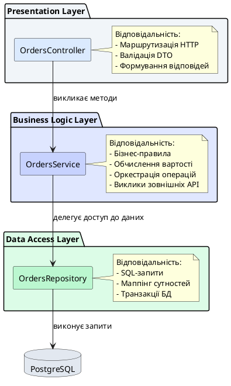
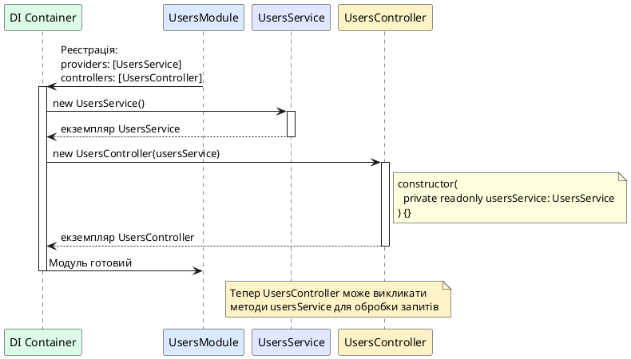
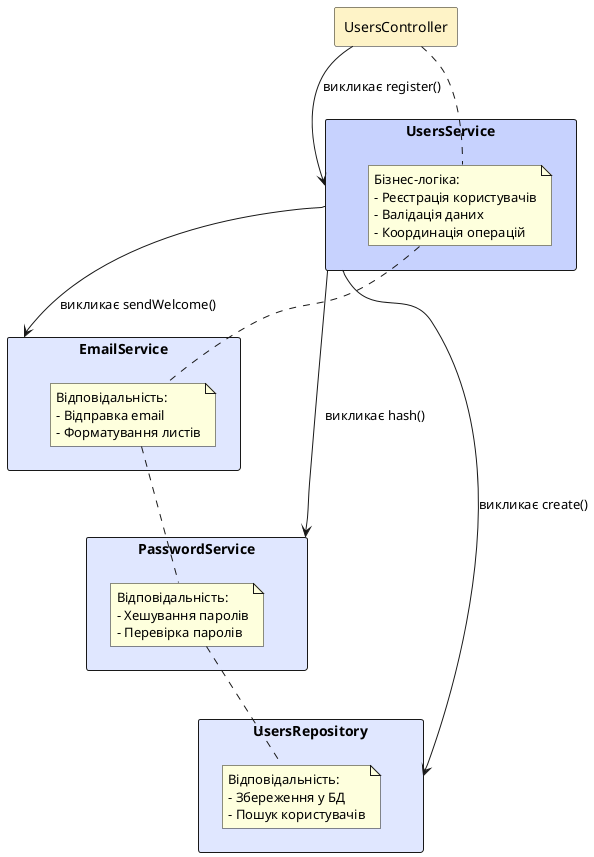

# Сервіси: інкапсуляція бізнес-логіки

## Короткий зміст

- Сервіс як основний тип провайдера
- Роль сервісів: інкапсуляція бізнес-логіки застосунку
- Принцип Single Responsibility: один сервіс = одна область відповідальності
- Генерація сервісу: `nest generate service <name>`
- Структура файлу сервісу: клас з декоратором @Injectable
- Впровадження сервісу у контролер через конструктор
- Виклик методів сервісу з контролера
- Приклад UsersService: CRUD-операції з даними користувачів
- Сервіси можуть залежати від інших сервісів
- Відокремлення бізнес-логіки від HTTP-обробки

---

## Сервіс як основний тип провайдера

У попередній лекції ми розглянули загальну концепцію провайдерів у NestJS — класів, що позначаються декоратором `@Injectable()` та можуть бути ін'єктовані в інші компоненти через систему Dependency Injection. Проте у реальних застосунках найбільш поширеним типом провайдерів є **сервіси** (*services*) — спеціалізовані класи, призначені для інкапсуляції бізнес-логіки та координації роботи різних частин системи.

Сервіси є концептуальним серцем застосунку: якщо контролери відповідають за **комунікацію** із зовнішнім світом (прийом HTTP-запитів, формування відповідей), а репозиторії — за **персистентність** даних (збереження та отримання з бази даних), то сервіси відповідають за **обробку** — валідацію, трансформацію, обчислення, оркестрацію викликів до інших компонентів та реалізацію бізнес-правил.

У NestJS немає окремого декоратора для сервісів (на відміну від `@Controller()` для контролерів). Сервіс — це просто провайдер, позначений `@Injectable()`, який концептуально виконує роль носія бізнес-логіки. Ця семантична роль відображається у назві класу через суфікс `Service` (наприклад, `UsersService`, `OrdersService`, `EmailService`) та у способі організації відповідальностей всередині класу.

::card-group

::card{title="🎯 Мета лекції" icon="i-lucide-target"}

- Зрозуміти роль сервісів як інкапсуляторів бізнес-логіки
- Опанувати принцип Single Responsibility для проєктування сервісів
- Навчитися генерувати сервіси через NestJS CLI
- Розібрати структуру типового сервісу та його методів
- Практикувати впровадження сервісів у контролери
- Побудувати ланцюги залежностей між сервісами

::

::card{title="🔑 Ключові терміни" icon="i-lucide-key"}

- **Service** — провайдер, що інкапсулює бізнес-логіку та оркестрацію операцій
- **Business Logic** — правила та алгоритми, специфічні для предметної області застосунку
- **Single Responsibility Principle (SRP)** — принцип проєктування, при якому клас має одну чітко визначену причину для зміни
- **CRUD** — акронім від Create, Read, Update, Delete — базові операції над даними

::

::

---

## Роль сервісів: інкапсуляція бізнес-логіки застосунку

Щоб зрозуміти роль сервісів, розглянемо типову архітектуру веб-застосунку у стилі **трирівневої моделі** (*three-tier architecture*):

1. **Presentation Layer (Рівень представлення)** — контролери, що обробляють HTTP-запити
2. **Business Logic Layer (Рівень бізнес-логіки)** — сервіси, що реалізують правила предметної області
3. **Data Access Layer (Рівень доступу до даних)** — репозиторії, що працюють з базою даних

::plant-uml{alt="Трирівнева архітектура з сервісами"}



::

У цій архітектурі **сервіси виступають посередниками** (*mediators*) між контролерами та репозиторіями. Вони приймають дані від контролерів, застосовують бізнес-правила, координують виклики до репозиторіїв та інших сервісів, а потім повертають результат назад контролеру для формування HTTP-відповіді.

### Що належить до бізнес-логіки?

Бізнес-логіка — це всі правила, обмеження та алгоритми, специфічні для **предметної області** (*domain*) вашого застосунку. Наприклад:

**Інтернет-магазин:**
- Перевірка наявності товару на складі перед оформленням замовлення
- Обчислення загальної вартості з урахуванням знижок та промокодів
- Валідація бізнес-правила: "Клієнт може мати лише одне активне замовлення водночас"
- Відправка email-повідомлення після успішного оформлення замовлення

**Банківська система:**
- Перевірка достатності коштів на рахунку перед переказом
- Обчислення відсотків за депозитом на основі терміну та ставки
- Блокування рахунку після трьох невдалих спроб введення PIN-коду
- Логування всіх фінансових транзакцій для аудиту

**Система управління проєктами:**
- Призначення задачі лише членам команди проєкту
- Автоматична зміна статусу проєкту на "Завершений", коли всі задачі виконані
- Розрахунок прогресу проєкту на основі виконаних задач
- Нотифікація учасників про зміни у задачах

Усі ці операції не є частиною HTTP-обробки (це робота контролерів) і не є безпосереднім доступом до бази даних (це робота репозиторіїв). Вони представляють **унікальну логіку вашого застосунку**, яка і повинна бути інкапсульована у сервісах.

::note
Сервіси також часто називають **use cases** (*варіанти використання*) у контексті Clean Architecture або **application services** (*прикладні сервіси*) у термінології Domain-Driven Design. Незалежно від термінології, їх призначення залишається незмінним: координація операцій та реалізація бізнес-правил.
::

---

## Принцип Single Responsibility: один сервіс = одна область відповідальності

Один із найважливіших принципів проєктування сервісів — це **Single Responsibility Principle** (SRP, *принцип єдиної відповідальності*), перший принцип з канонічного набору SOLID. Цей принцип стверджує, що **клас повинен мати лише одну причину для зміни**, тобто він має відповідати за одну чітко визначену область функціональності.

Застосовуючи SRP до сервісів, ми отримуємо правило: **один сервіс має обслуговувати одну логічну сутність або один бізнес-процес**. Наприклад:


- `UsersService` — управління користувачами (реєстрація, автентифікація, профіль)
- `OrdersService` — обробка замовлень (створення, обчислення вартості, статуси)
- `EmailService` — відправка електронних повідомлень (SMTP-комунікація, шаблони листів)
- `PaymentService` — інтеграція з платіжними системами (проведення платежів, повернення коштів)

Кожен сервіс зосереджений на **одній предметній області** та має чітко визначені межі відповідальності. Це дозволяє:

1. **Полегшити розуміння коду**: розробник одразу розуміє, що `EmailService` відповідає лише за email
2. **Спростити тестування**: кожен сервіс можна тестувати ізольовано
3. **Полегшити модифікацію**: зміни у логіці email не торкаються логіки замовлень
4. **Підвищити повторне використання**: `EmailService` можна використовувати у різних контекстах

Розглянемо приклад **порушення SRP** (антипатерн "Божественний об'єкт" — *God Object*):

```typescript
// ❌ ПОГАНО: один сервіс робить занадто багато
@Injectable()
export class ApplicationService {
  // Управління користувачами
  createUser(userData: any) { /* ... */ }
  updateUser(id: number, data: any) { /* ... */ }
  
  // Робота з замовленнями
  createOrder(orderData: any) { /* ... */ }
  calculateOrderTotal(orderId: number) { /* ... */ }
  
  // Відправка email
  sendWelcomeEmail(email: string) { /* ... */ }
  sendOrderConfirmation(orderId: number) { /* ... */ }
  
  // Обробка платежів
  processPayment(amount: number, token: string) { /* ... */ }
  refundPayment(transactionId: string) { /* ... */ }
  
  // Логування
  logActivity(message: string) { /* ... */ }
}
```

Цей сервіс порушує SRP, оскільки має **численні причини для зміни**: зміни у логіці користувачів, замовлень, email, платежів або логування вимагатимуть модифікації одного й того самого класу. Це призводить до складності підтримки, конфліктів при роботі в команді та ускладнює тестування.

Правильний підхід — розділити відповідальності на окремі сервіси:

```typescript
// ✅ ДОБРЕ: кожен сервіс має одну відповідальність
@Injectable()
export class UsersService {
  createUser(userData: any) { /* ... */ }
  updateUser(id: number, data: any) { /* ... */ }
}

@Injectable()
export class OrdersService {
  createOrder(orderData: any) { /* ... */ }
  calculateTotal(orderId: number) { /* ... */ }
}

@Injectable()
export class EmailService {
  sendWelcomeEmail(email: string) { /* ... */ }
  sendOrderConfirmation(orderId: number) { /* ... */ }
}

@Injectable()
export class PaymentService {
  processPayment(amount: number, token: string) { /* ... */ }
  refundPayment(transactionId: string) { /* ... */ }
}

@Injectable()
export class LoggerService {
  log(message: string) { /* ... */ }
}
```

Тепер кожен сервіс має чітко визначену область відповідальності та може розвиватися незалежно від інших.

::tip
При проєктуванні сервісів запитайте себе: "Чи можу я описати призначення цього сервісу одним реченням без використання слова 'та'?" Якщо відповідь містить "та" (наприклад, "Сервіс управляє користувачами **та** обробляє платежі"), це сигнал до розділення сервісу на кілька менших.
::

---

## Генерація сервісу через NestJS CLI

NestJS надає потужний інструмент командного рядка — **NestJS CLI** (*Command Line Interface*), який автоматизує створення різних компонентів застосунку: контролерів, сервісів, модулів, фільтрів тощо. Для генерації нового сервісу використовується команда `nest generate service` або скорочена форма `nest g s`.

::tabs

::tabs-item{label="Повна форма"}
```bash
nest generate service users
```
::

::tabs-item{label="Скорочена форма"}
```bash
nest g s users
```
::

::tabs-item{label="З вкладеною структурою"}
```bash
nest g s modules/users/users
```
::

::

Після виконання команди NestJS CLI автоматично створить два файли:

1. **users.service.ts** — файл із класом сервісу
2. **users.service.spec.ts** — файл для unit-тестів сервісу

Крім того, CLI автоматично **зареєструє сервіс у модулі**, додавши його до масиву `providers`. Це економить час та зменшує ризик помилок при ручному редагуванні файлів модуля.

::terminal-preview{title="nest generate service users" :cursor="false"}

<div class="line"><span class="opacity-40">$</span> <strong class="font-bold">nest generate service users</strong></div>
<div class="line"><span class="text-green-400 font-bold">CREATE</span> src/users/users.service.ts <span class="opacity-40">(89 bytes)</span></div>
<div class="line"><span class="text-green-400 font-bold">CREATE</span> src/users/users.service.spec.ts <span class="opacity-40">(453 bytes)</span></div>
<div class="line"><span class="text-blue-400 font-bold">UPDATE</span> src/users/users.module.ts <span class="opacity-40">(+1 import, providers array updated)</span></div>
<div class="line"></div>
<div class="line"><span class="text-green-400 font-bold">✓</span> Service <strong>UsersService</strong> успішно створено та зареєстровано</div>

::

Розглянемо структуру згенерованого файлу `users.service.ts`:

```typescript
import { Injectable } from '@nestjs/common';

@Injectable()
export class UsersService {}
```

CLI створює мінімальний шаблон класу з декоратором `@Injectable()`, готовий до додавання методів бізнес-логіки. Ви також можете згенерувати сервіс у специфічній директорії, додавши шлях:

```bash
# Створить сервіс у директорії src/modules/auth/
nest g s modules/auth/auth
```

::note
Якщо ви хочете створити сервіс без автоматичної генерації файлу тестів, додайте прапорець `--no-spec`:

```bash
nest g s users --no-spec
```

Проте рекомендується завжди генерувати тести разом із сервісом, навіть якщо ви не пишете їх одразу — це сприяє культурі тестування у проєкті.
::

---

## Структура файлу сервісу: клас з декоратором @Injectable

Типовий сервіс у NestJS складається з TypeScript-класу, позначеного декоратором `@Injectable()`, що містить методи для виконання специфічних бізнес-операцій. Розглянемо структуру повноцінного сервісу на прикладі `UsersService`:

```typescript
import { Injectable, NotFoundException } from '@nestjs/common';

// Інтерфейс для представлення користувача
interface User {
  id: number;
  email: string;
  name: string;
  createdAt: Date;
}

// DTO для створення користувача
interface CreateUserDto {
  email: string;
  name: string;
  password: string;
}

@Injectable()
export class UsersService {
  // Приватне сховище даних (у реальному застосунку — це буде репозиторій БД)
  private users: User[] = [];
  private currentId = 1;

  /**
   * Створення нового користувача
   */
  create(createUserDto: CreateUserDto): User {
    const newUser: User = {
      id: this.currentId++,
      email: createUserDto.email,
      name: createUserDto.name,
      createdAt: new Date()
    };

    this.users.push(newUser);
    return newUser;
  }

  /**
   * Отримання всіх користувачів
   */
  findAll(): User[] {
    return this.users;
  }

  /**
   * Пошук користувача за ID
   */
  findOne(id: number): User {
    const user = this.users.find(u => u.id === id);
    
    if (!user) {
      throw new NotFoundException(`Користувача з ID ${id} не знайдено`);
    }
    
    return user;
  }

  /**
   * Пошук користувача за email
   */
  findByEmail(email: string): User | undefined {
    return this.users.find(u => u.email === email);
  }

  /**
   * Оновлення даних користувача
   */
  update(id: number, updateData: Partial<CreateUserDto>): User {
    const user = this.findOne(id); // Викине виняток, якщо не знайдено
    
    Object.assign(user, updateData);
    return user;
  }

  /**
   * Видалення користувача
   */
  remove(id: number): void {
    const index = this.users.findIndex(u => u.id === id);
    
    if (index === -1) {
      throw new NotFoundException(`Користувача з ID ${id} не знайдено`);
    }
    
    this.users.splice(index, 1);
  }
}
```


Цей сервіс демонструє кілька важливих практик:

### Публічні методи як API сервісу

Усі методи сервісу (`create`, `findAll`, `findOne` тощо) є **публічними** (*public*), оскільки вони формують зовнішній API сервісу, доступний для контролерів та інших сервісів. Кожен публічний метод має чітко визначене призначення та виконує одну конкретну операцію.

### Приватні властивості для внутрішнього стану

Масив `users` та лічильник `currentId` позначені як **приватні** (*private*), оскільки є деталями реалізації сервісу. Зовнішні споживачі не мають прямого доступу до цих даних та можуть працювати з ними лише через публічні методи. Це принцип **інкапсуляції** (*encapsulation*).

### Типізація параметрів та повернених значень

Усі параметри методів та повернені значення мають явні типи TypeScript (`User`, `CreateUserDto`, `number` тощо). Це забезпечує безпеку типів на етапі компіляції та покращує автодоповнення у редакторах коду.

### Обробка помилок через винятки

Коли користувача не знайдено, сервіс генерує виняток `NotFoundException` — спеціальний клас NestJS, який автоматично перетворюється у HTTP-відповідь із статусом `404 Not Found`. Це дозволяє контролерам не турбуватися про формування помилок — вони автоматично обробляються глобальним механізмом винятків фреймворку.

::warning
У реальних застосунках **не зберігайте дані у приватних властивостях сервісу**, оскільки сервіси є singleton та діляться між усіма запитами. Будь-які дані, збережені у масиві `this.users`, будуть спільними для всіх користувачів застосунку. Замість цього використовуйте репозиторії для роботи з базою даних або зовнішніми сховищами. У цьому прикладі масив `users` використовується лише для демонстраційних цілей.
::

---

## Впровадження сервісу у контролер через конструктор

Після створення сервісу наступний крок — **впровадження** (*injection*) його у контролер, який оброблятиме HTTP-запити. Як ми розглядали у попередній лекції, ін'єкція залежностей у NestJS відбувається через конструктор класу.

Розглянемо контролер `UsersController`, який використовує `UsersService`:

```typescript
import { 
  Controller, 
  Get, 
  Post, 
  Put, 
  Delete, 
  Body, 
  Param, 
  ParseIntPipe 
} from '@nestjs/common';
import { UsersService } from './users.service';

@Controller('users')
export class UsersController {
  // Ін'єкція UsersService через конструктор
  constructor(private readonly usersService: UsersService) {}

  @Post()
  create(@Body() createUserDto: any) {
    return this.usersService.create(createUserDto);
  }

  @Get()
  findAll() {
    return this.usersService.findAll();
  }

  @Get(':id')
  findOne(@Param('id', ParseIntPipe) id: number) {
    return this.usersService.findOne(id);
  }

  @Put(':id')
  update(
    @Param('id', ParseIntPipe) id: number,
    @Body() updateUserDto: any
  ) {
    return this.usersService.update(id, updateUserDto);
  }

  @Delete(':id')
  remove(@Param('id', ParseIntPipe) id: number) {
    this.usersService.remove(id);
    return { message: 'Користувача успішно видалено' };
  }
}
```

Розберемо детально процес впровадження:

### Оголошення залежності у конструкторі

```typescript
constructor(private readonly usersService: UsersService) {}
```

Цей рядок виконує кілька операцій одночасно завдяки особливостям TypeScript:

1. **Оголошує параметр конструктора** типу `UsersService`
2. **Створює приватну властивість** `usersService` у класі
3. **Позначає властивість як readonly** (незмінну після ініціалізації)
4. **Сигналізує DI-контейнеру** про необхідність ін'єкції екземпляру `UsersService`

Коли NestJS створює екземпляр `UsersController`, він автоматично розпізнає, що конструктор очікує `UsersService`, знаходить зареєстрований провайдер цього типу у модулі та передає його екземпляр у конструктор.

### Використання ін'єктованого сервісу

Після ін'єкції сервіс доступний через `this.usersService` у будь-якому методі контролера:

```typescript
@Get()
findAll() {
  return this.usersService.findAll();
}
```

Контролер не створює екземпляр сервісу вручну через `new UsersService()` — це завдання DI-контейнера. Контролер просто **використовує** готовий екземпляр, який йому надано.

::plant-uml{alt="Процес ін'єкції UsersService у UsersController"}



::

::tip
Завжди використовуйте модифікатор `readonly` для ін'єктованих залежностей. Це запобігає випадковому перевизначенню властивості всередині методів класу, що могло б призвести до непередбачуваної поведінки. Конструктор має бути **єдиним місцем**, де встановлюються залежності класу.
::

---

## Виклик методів сервісу з контролера

Після успішного впровадження сервісу контролер може викликати його методи для виконання бізнес-логіки. Розглянемо детально кілька сценаріїв використання.

### Простий виклик методу

Найпростіший сценарій — контролер напряму повертає результат виклику методу сервісу:

```typescript
@Get()
findAll() {
  return this.usersService.findAll();
}
```

У цьому випадку:
1. Клієнт надсилає `GET /users`
2. NestJS маршрутизує запит до методу `findAll()` контролера
3. Контролер викликає `usersService.findAll()`
4. Сервіс повертає масив користувачів
5. NestJS автоматично серіалізує масив у JSON та відправляє клієнту з статусом `200 OK`

### Передача параметрів до сервісу

Часто контролер отримує дані з HTTP-запиту (параметри URL, тіло запиту, query-параметри) та передає їх до сервісу:

```typescript
@Get(':id')
findOne(@Param('id', ParseIntPipe) id: number) {
  return this.usersService.findOne(id);
}
```

Тут:
- `@Param('id')` витягує параметр `id` з URL (наприклад, `/users/42`)
- `ParseIntPipe` перетворює рядок `"42"` на число `42` та валідує, що це дійсно число
- Результат передається у `usersService.findOne(id)`


### Обробка даних перед викликом сервісу

Іноді контролер виконує мінімальну обробку даних перед передачею їх до сервісу — наприклад, валідацію формату або трансформацію:

```typescript
@Post()
create(@Body() createUserDto: CreateUserDto) {
  // Контролер може виконати HTTP-специфічну валідацію
  if (!createUserDto.email.includes('@')) {
    throw new BadRequestException('Невірний формат email');
  }
  
  // Делегування бізнес-логіки сервісу
  return this.usersService.create(createUserDto);
}
```

Проте зауважте, що **складна валідація бізнес-правил** (наприклад, "Email має бути унікальним") належить сервісу, а не контролеру. Контролер відповідає лише за HTTP-специфічні аспекти.

### Обробка винятків сервісу

Коли сервіс генерує виняток (наприклад, `NotFoundException`), NestJS автоматично перехоплює його та перетворює у відповідну HTTP-відповідь:

```typescript
@Get(':id')
findOne(@Param('id', ParseIntPipe) id: number) {
  // Якщо користувача не знайдено, сервіс згенерує NotFoundException
  // NestJS автоматично перетворить це у HTTP 404
  return this.usersService.findOne(id);
}
```

Контролеру не потрібно обгортати виклик у `try-catch` — глобальний фільтр винятків NestJS подбає про це автоматично.

::note
Якщо вам потрібна спеціальна обробка винятків (наприклад, логування помилки або перетворення типу винятку), ви можете використати блок `try-catch` у контролері. Проте в більшості випадків достатньо покластися на стандартну обробку винятків фреймворку.
::

---

## Приклад UsersService: CRUD-операції з даними користувачів

Розглянемо повний приклад модуля користувачів із контролером та сервісом, що реалізують базові **CRUD-операції** (*Create, Read, Update, Delete*):

::code-tree

```typescript [users/users.module.ts]
import { Module } from '@nestjs/common';
import { UsersController } from './users.controller';
import { UsersService } from './users.service';

@Module({
  controllers: [UsersController],
  providers: [UsersService],
  exports: [UsersService] // Експортуємо для використання в інших модулях
})
export class UsersModule {}
```

```typescript [users/dto/create-user.dto.ts]
export class CreateUserDto {
  email: string;
  name: string;
  password: string;
}

export class UpdateUserDto {
  email?: string;
  name?: string;
}
```

```typescript [users/users.service.ts]
import { Injectable, NotFoundException, ConflictException } from '@nestjs/common';
import { CreateUserDto, UpdateUserDto } from './dto/create-user.dto';

interface User {
  id: number;
  email: string;
  name: string;
  createdAt: Date;
  updatedAt: Date;
}

@Injectable()
export class UsersService {
  private users: User[] = [];
  private currentId = 1;

  // CREATE: Створення нового користувача
  create(createUserDto: CreateUserDto): User {
    // Перевірка унікальності email (бізнес-правило)
    const existingUser = this.findByEmail(createUserDto.email);
    if (existingUser) {
      throw new ConflictException('Користувач з таким email вже існує');
    }

    const newUser: User = {
      id: this.currentId++,
      email: createUserDto.email,
      name: createUserDto.name,
      createdAt: new Date(),
      updatedAt: new Date()
    };

    this.users.push(newUser);
    return newUser;
  }

  // READ: Отримання всіх користувачів
  findAll(): User[] {
    return this.users;
  }

  // READ: Пошук одного користувача за ID
  findOne(id: number): User {
    const user = this.users.find(u => u.id === id);
    
    if (!user) {
      throw new NotFoundException(`Користувача з ID ${id} не знайдено`);
    }
    
    return user;
  }

  // READ: Пошук за email (допоміжний метод)
  findByEmail(email: string): User | undefined {
    return this.users.find(u => u.email === email);
  }

  // UPDATE: Оновлення даних користувача
  update(id: number, updateUserDto: UpdateUserDto): User {
    const user = this.findOne(id);

    // Перевірка унікальності нового email, якщо він змінюється
    if (updateUserDto.email && updateUserDto.email !== user.email) {
      const existingUser = this.findByEmail(updateUserDto.email);
      if (existingUser) {
        throw new ConflictException('Email вже використовується іншим користувачем');
      }
    }

    // Оновлення полів
    Object.assign(user, {
      ...updateUserDto,
      updatedAt: new Date()
    });

    return user;
  }

  // DELETE: Видалення користувача
  remove(id: number): void {
    const index = this.users.findIndex(u => u.id === id);
    
    if (index === -1) {
      throw new NotFoundException(`Користувача з ID ${id} не знайдено`);
    }
    
    this.users.splice(index, 1);
  }

  // Додаткова бізнес-логіка: підрахунок користувачів
  count(): number {
    return this.users.length;
  }

  // Додаткова бізнес-логіка: пошук за частиною імені
  searchByName(query: string): User[] {
    const lowerQuery = query.toLowerCase();
    return this.users.filter(u => 
      u.name.toLowerCase().includes(lowerQuery)
    );
  }
}
```

```typescript [users/users.controller.ts]
import {
  Controller,
  Get,
  Post,
  Put,
  Delete,
  Body,
  Param,
  Query,
  ParseIntPipe,
  HttpCode,
  HttpStatus
} from '@nestjs/common';
import { UsersService } from './users.service';
import { CreateUserDto, UpdateUserDto } from './dto/create-user.dto';

@Controller('users')
export class UsersController {
  constructor(private readonly usersService: UsersService) {}

  // POST /users - Створення користувача
  @Post()
  create(@Body() createUserDto: CreateUserDto) {
    return this.usersService.create(createUserDto);
  }

  // GET /users - Список усіх користувачів
  @Get()
  findAll(@Query('search') search?: string) {
    // Якщо передано параметр пошуку, використовуємо searchByName
    if (search) {
      return this.usersService.searchByName(search);
    }
    return this.usersService.findAll();
  }

  // GET /users/count - Підрахунок користувачів
  @Get('count')
  count() {
    return { count: this.usersService.count() };
  }

  // GET /users/:id - Один користувач за ID
  @Get(':id')
  findOne(@Param('id', ParseIntPipe) id: number) {
    return this.usersService.findOne(id);
  }

  // PUT /users/:id - Оновлення користувача
  @Put(':id')
  update(
    @Param('id', ParseIntPipe) id: number,
    @Body() updateUserDto: UpdateUserDto
  ) {
    return this.usersService.update(id, updateUserDto);
  }

  // DELETE /users/:id - Видалення користувача
  @Delete(':id')
  @HttpCode(HttpStatus.NO_CONTENT) // HTTP 204
  remove(@Param('id', ParseIntPipe) id: number) {
    this.usersService.remove(id);
  }
}
```

::

Цей приклад демонструє повну структуру модуля з розділенням відповідальностей:

- **DTO (Data Transfer Objects)**: інтерфейси для передачі даних між шарами
- **Service**: бізнес-логіка, валідація правил, управління даними
- **Controller**: маршрутизація HTTP, обробка параметрів запитів, формування відповідей
- **Module**: об'єднання компонентів та реєстрація у DI-контейнері

::tip
Зверніть увагу на порядок маршрутів у контролері: більш специфічні маршрути (`/users/count`) розміщені **перед** параметризованими (`/users/:id`). Це важливо, оскільки NestJS перевіряє маршрути у порядку їх оголошення. Якби `/users/:id` було першим, запит до `/users/count` інтерпретувався б як пошук користувача з ID `"count"`.
::


---

## Сервіси можуть залежати від інших сервісів

Однією з найпотужніших можливостей системи DI у NestJS є можливість **композиції сервісів** — один сервіс може ін'єктувати інші сервіси через конструктор та використовувати їх функціональність. Це дозволяє будувати складні системи з простих, добре протестованих компонентів, що дотримуються принципу єдиної відповідальності.

Розглянемо практичний приклад: систему реєстрації користувачів, де `UsersService` залежить від `EmailService` для відправки привітального листа та від `PasswordService` для хешування паролів.

### Архітектура з множинними залежностями

::plant-uml{alt="Ланцюг залежностей між сервісами"}



::

### Реалізація композиції сервісів

```typescript
// email.service.ts
import { Injectable } from '@nestjs/common';

@Injectable()
export class EmailService {
  async sendWelcomeEmail(email: string, name: string): Promise<void> {
    console.log(`📧 Відправка привітального email до ${email}`);
    // Реальна логіка відправки через SMTP
    // await this.smtpClient.send({ to: email, subject: 'Ласкаво просимо!', ... });
  }

  async sendPasswordResetEmail(email: string, token: string): Promise<void> {
    console.log(`🔐 Відправка листа скидання паролю до ${email}`);
  }
}
```

```typescript
// password.service.ts
import { Injectable } from '@nestjs/common';
import * as bcrypt from 'bcrypt';

@Injectable()
export class PasswordService {
  private readonly saltRounds = 10;

  async hash(plainPassword: string): Promise<string> {
    return bcrypt.hash(plainPassword, this.saltRounds);
  }

  async compare(plainPassword: string, hashedPassword: string): Promise<boolean> {
    return bcrypt.compare(plainPassword, hashedPassword);
  }
}
```

```typescript
// users.repository.ts
import { Injectable } from '@nestjs/common';

interface User {
  id: number;
  email: string;
  name: string;
  passwordHash: string;
}

@Injectable()
export class UsersRepository {
  private users: User[] = [];
  private currentId = 1;

  async create(userData: Omit<User, 'id'>): Promise<User> {
    const newUser: User = {
      id: this.currentId++,
      ...userData
    };
    this.users.push(newUser);
    return newUser;
  }

  async findByEmail(email: string): Promise<User | undefined> {
    return this.users.find(u => u.email === email);
  }
}
```

```typescript
// users.service.ts
import { Injectable, ConflictException } from '@nestjs/common';
import { EmailService } from './email.service';
import { PasswordService } from './password.service';
import { UsersRepository } from './users.repository';

interface RegisterUserDto {
  email: string;
  name: string;
  password: string;
}

@Injectable()
export class UsersService {
  // Ін'єкція трьох залежностей через конструктор
  constructor(
    private readonly emailService: EmailService,
    private readonly passwordService: PasswordService,
    private readonly usersRepository: UsersRepository
  ) {}

  async register(dto: RegisterUserDto) {
    // 1. Перевірка унікальності email
    const existingUser = await this.usersRepository.findByEmail(dto.email);
    if (existingUser) {
      throw new ConflictException('Користувач з таким email вже існує');
    }

    // 2. Хешування пароля через PasswordService
    const passwordHash = await this.passwordService.hash(dto.password);

    // 3. Збереження користувача через Repository
    const user = await this.usersRepository.create({
      email: dto.email,
      name: dto.name,
      passwordHash
    });

    // 4. Відправка привітального email через EmailService
    await this.emailService.sendWelcomeEmail(dto.email, dto.name);

    // 5. Повернення даних без пароля
    const { passwordHash: _, ...userWithoutPassword } = user;
    return userWithoutPassword;
  }
}
```

У цьому прикладі `UsersService` **оркеструє** (*orchestrates*) складну операцію реєстрації, координуючи роботу трьох спеціалізованих сервісів. Кожен сервіс відповідає за свою чітко визначену область:

- `PasswordService` — криптографія
- `EmailService` — комунікація
- `UsersRepository` — персистентність даних
- `UsersService` — бізнес-логіка та координація

### Реєстрація у модулі

Щоб ця система працювала, всі сервіси мають бути зареєстровані у модулі:

```typescript
import { Module } from '@nestjs/common';
import { UsersController } from './users.controller';
import { UsersService } from './users.service';
import { EmailService } from './email.service';
import { PasswordService } from './password.service';
import { UsersRepository } from './users.repository';

@Module({
  controllers: [UsersController],
  providers: [
    UsersService,
    EmailService,
    PasswordService,
    UsersRepository
  ],
  exports: [UsersService] // Експортуємо UsersService для інших модулів
})
export class UsersModule {}
```

DI-контейнер автоматично розв'яже ланцюг залежностей:

1. Створить `EmailService` (без залежностей)
2. Створить `PasswordService` (без залежностей)
3. Створить `UsersRepository` (без залежностей)
4. Створить `UsersService` (передасть три попередні сервіси)
5. Створить `UsersController` (передасть `UsersService`)

::note
Порядок оголошення провайдерів у масиві `providers` **не має значення**. DI-контейнер самостійно аналізує граф залежностей та визначає правильний порядок ініціалізації. Ви можете розміщувати провайдери у будь-якому порядку — результат буде однаковим.
::

---

## Відокремлення бізнес-логіки від HTTP-обробки

Фундаментальний принцип, що лежить в основі використання сервісів, — це **відокремлення бізнес-логіки від транспортного рівня**. Контролери не повинні знати нічого про предметну область застосунку — вони лише перетворюють HTTP-запити у виклики методів сервісів та формують HTTP-відповіді з результатів цих викликів.

Це відокремлення надає кілька критичних переваг:

### 1. Незалежність від протоколу

Якщо бізнес-логіка інкапсульована у сервісах, ви можете легко додати альтернативні транспортні механізми без дублювання коду:

```typescript
// HTTP-контролер
@Controller('users')
export class UsersController {
  constructor(private readonly usersService: UsersService) {}

  @Post('register')
  async register(@Body() dto: RegisterUserDto) {
    return this.usersService.register(dto);
  }
}

// WebSocket-гейтвей (альтернативний транспорт)
@WebSocketGateway()
export class UsersGateway {
  constructor(private readonly usersService: UsersService) {}

  @SubscribeMessage('register')
  async handleRegister(client: Socket, dto: RegisterUserDto) {
    const user = await this.usersService.register(dto);
    return { event: 'userRegistered', data: user };
  }
}

// CLI-команда (консольний інтерфейс)
@Injectable()
export class RegisterUserCommand {
  constructor(private readonly usersService: UsersService) {}

  async execute(email: string, name: string, password: string) {
    const user = await this.usersService.register({ email, name, password });
    console.log(`✓ Користувача ${user.name} успішно зареєстровано`);
  }
}
```

Всі три компоненти використовують **один і той самий** `UsersService`. Бізнес-логіка реєстрації не дублюється — вона існує в одному місці.


### 2. Простота тестування

Сервіси можна тестувати ізольовано від HTTP-сервера, що значно спрощує написання unit-тестів:

```typescript
// users.service.spec.ts
import { Test, TestingModule } from '@nestjs/testing';
import { UsersService } from './users.service';
import { EmailService } from './email.service';
import { PasswordService } from './password.service';
import { UsersRepository } from './users.repository';

describe('UsersService', () => {
  let service: UsersService;
  let emailService: EmailService;
  let passwordService: PasswordService;
  let repository: UsersRepository;

  beforeEach(async () => {
    const module: TestingModule = await Test.createTestingModule({
      providers: [
        UsersService,
        {
          provide: EmailService,
          useValue: { sendWelcomeEmail: jest.fn() } // Mock EmailService
        },
        {
          provide: PasswordService,
          useValue: { hash: jest.fn().mockResolvedValue('hashed_password') }
        },
        {
          provide: UsersRepository,
          useValue: { 
            findByEmail: jest.fn(),
            create: jest.fn()
          }
        }
      ]
    }).compile();

    service = module.get<UsersService>(UsersService);
    emailService = module.get<EmailService>(EmailService);
    passwordService = module.get<PasswordService>(PasswordService);
    repository = module.get<UsersRepository>(UsersRepository);
  });

  it('має успішно зареєструвати користувача', async () => {
    // Arrange: підготовка mock-даних
    const dto = { email: 'test@example.com', name: 'Тест', password: 'password123' };
    jest.spyOn(repository, 'findByEmail').mockResolvedValue(undefined);
    jest.spyOn(repository, 'create').mockResolvedValue({
      id: 1,
      email: dto.email,
      name: dto.name,
      passwordHash: 'hashed_password'
    });

    // Act: виконання операції
    const result = await service.register(dto);

    // Assert: перевірка результатів
    expect(result).toEqual({ id: 1, email: dto.email, name: dto.name });
    expect(passwordService.hash).toHaveBeenCalledWith('password123');
    expect(emailService.sendWelcomeEmail).toHaveBeenCalledWith(dto.email, dto.name);
  });
});
```

Цей тест перевіряє лише **бізнес-логіку** сервісу, без запуску HTTP-сервера чи підключення до реальної бази даних. Всі залежності замінені mock-об'єктами.

### 3. Повторне використання логіки

Одна й та сама бізнес-логіка може викликатися з різних контекстів:

```typescript
// Виклик з HTTP-контролера
@Controller('admin/users')
export class AdminUsersController {
  constructor(private readonly usersService: UsersService) {}

  @Post('bulk-register')
  async bulkRegister(@Body() dtos: RegisterUserDto[]) {
    const results = await Promise.all(
      dtos.map(dto => this.usersService.register(dto))
    );
    return { registered: results.length };
  }
}

// Виклик з фонового завдання (cron job)
@Injectable()
export class DailyReportService {
  constructor(private readonly usersService: UsersService) {}

  @Cron('0 0 * * *') // Щодня о 00:00
  async generateReport() {
    const newUsers = await this.usersService.getRegisteredToday();
    // Генерація звіту...
  }
}
```

### 4. Можливість рефакторингу

Якщо вам потрібно змінити спосіб зберігання даних (наприклад, перейти з PostgreSQL на MongoDB), ви змінюєте лише репозиторій — контролери та сервіси залишаються незмінними:

::code-group

```typescript [PostgreSQL Repository]
@Injectable()
export class UsersRepository {
  constructor(
    @InjectRepository(User)
    private readonly repo: Repository<User>
  ) {}

  async create(userData: any): Promise<User> {
    const user = this.repo.create(userData);
    return this.repo.save(user);
  }
}
```

```typescript [MongoDB Repository]
@Injectable()
export class UsersRepository {
  constructor(
    @InjectModel(User.name)
    private readonly model: Model<User>
  ) {}

  async create(userData: any): Promise<User> {
    const user = new this.model(userData);
    return user.save();
  }
}
```

::

Завдяки відокремленню логіки від деталей реалізації зміна бази даних не вимагає модифікації `UsersService` чи `UsersController` — вони продовжують працювати з тим самим інтерфейсом репозиторію.

::accordion

::accordion-item{label="❓ Чи можна викликати методи сервісу безпосередньо з контролера без створення окремого DTO?" icon="i-lucide-help-circle"}

Технічно так, але це погана практика. DTO (Data Transfer Objects) служать кільком цілям: валідація вхідних даних, типобезпека, документація API та відокремлення зовнішнього формату від внутрішніх сутностей. Навіть для простих операцій рекомендується використовувати DTO.

::

::accordion-item{label="❓ Що краще: один великий UsersService або кілька маленьких сервісів?" icon="i-lucide-help-circle"}

Дотримуйтесь принципу Single Responsibility. Якщо `UsersService` виконує реєстрацію, автентифікацію, управління профілем та відправку email, краще розділити це на `UsersService` (управління даними), `AuthService` (автентифікація) та `EmailService` (комунікація). Як правило, якщо сервіс перевищує 200-300 рядків коду, це сигнал до розділення відповідальностей.

::

::accordion-item{label="❓ Чи може сервіс безпосередньо працювати з базою даних без репозиторію?" icon="i-lucide-help-circle"}

Може, але це порушує архітектурний принцип розділення відповідальностей. Репозиторій інкапсулює деталі доступу до даних (SQL-запити, ORM-виклики), тоді як сервіс зосереджений на бізнес-логіці. Така архітектура полегшує зміну способу зберігання даних та тестування сервісів із mock-репозиторіями.

::

::

---

## Практичний приклад: система замовлень з композицією сервісів

Для закріплення матеріалу розглянемо реальний сценарій: систему обробки замовлень в інтернет-магазині, де `OrdersService` координує роботу кількох спеціалізованих сервісів.

```typescript
// products.service.ts
@Injectable()
export class ProductsService {
  async findById(id: number) {
    // Пошук товару в базі даних
    return { id, name: 'Ноутбук', price: 25000, stock: 10 };
  }

  async decrementStock(id: number, quantity: number): Promise<void> {
    // Зменшення кількості товару на складі
    console.log(`Зменшення залишку товару ${id} на ${quantity}`);
  }
}

// discount.service.ts
@Injectable()
export class DiscountService {
  calculateDiscount(basePrice: number, promoCode?: string): number {
    if (promoCode === 'SUMMER2026') {
      return basePrice * 0.15; // 15% знижка
    }
    return 0;
  }
}

// payment.service.ts
@Injectable()
export class PaymentService {
  async processPayment(amount: number, token: string): Promise<string> {
    // Інтеграція з платіжною системою (Stripe, PayPal тощо)
    console.log(`💳 Обробка платежу на суму ${amount} грн`);
    return 'payment_' + Date.now();
  }
}

// orders.service.ts
@Injectable()
export class OrdersService {
  constructor(
    private readonly productsService: ProductsService,
    private readonly discountService: DiscountService,
    private readonly paymentService: PaymentService,
    private readonly emailService: EmailService
  ) {}

  async createOrder(dto: CreateOrderDto) {
    // 1. Перевірка наявності товарів
    const product = await this.productsService.findById(dto.productId);
    if (product.stock < dto.quantity) {
      throw new BadRequestException('Недостатньо товару на складі');
    }

    // 2. Обчислення вартості
    const basePrice = product.price * dto.quantity;
    const discount = this.discountService.calculateDiscount(basePrice, dto.promoCode);
    const totalPrice = basePrice - discount;

    // 3. Обробка платежу
    const paymentId = await this.paymentService.processPayment(
      totalPrice,
      dto.paymentToken
    );

    // 4. Зменшення залишків на складі
    await this.productsService.decrementStock(dto.productId, dto.quantity);

    // 5. Створення запису замовлення
    const order = {
      id: Date.now(),
      productId: dto.productId,
      quantity: dto.quantity,
      basePrice,
      discount,
      totalPrice,
      paymentId,
      status: 'confirmed',
      createdAt: new Date()
    };

    // 6. Відправка підтвердження на email
    await this.emailService.sendOrderConfirmation(dto.email, order);

    return order;
  }
}
```

У цьому прикладі `OrdersService` виступає **оркестратором** складного бізнес-процесу, координуючи роботу чотирьох спеціалізованих сервісів. Кожен сервіс відповідає за свою чітко визначену область, що робить систему модульною, тестованою та легко масштабованою.

---

## Резюме

Сервіси є фундаментальним компонентом архітектури NestJS, що дозволяють інкапсулювати бізнес-логіку та будувати модульні, тестовані застосунки. Ключові тези лекції:

::card-group

::card{title="✅ Основні принципи сервісів" icon="i-lucide-check-circle"}

- Сервіс — це провайдер, що інкапсулює бізнес-логіку застосунку
- Позначається декоратором `@Injectable()` та суфіксом `Service` у назві
- Створюється через `nest g s <name>` для автоматичної генерації та реєстрації
- Впроваджується у контролери та інші сервіси через конструктор
- Дотримується принципу Single Responsibility

::

::card{title="🎯 Відповідальності сервісів" icon="i-lucide-target"}

- Реалізація бізнес-правил та валідація
- Координація викликів до репозиторіїв та інших сервісів
- Трансформація та обчислення даних
- Оркестрація складних операцій
- Відокремлення логіки від HTTP-обробки

::

::

У наступній лекції ми детально розглянемо **практику ін'єкції залежностей**: множинні залежності у конструкторі, модифікатори TypeScript, автоматичне розв'язання залежностей DI-контейнером та найкращі практики проєктування залежностей між сервісами.
