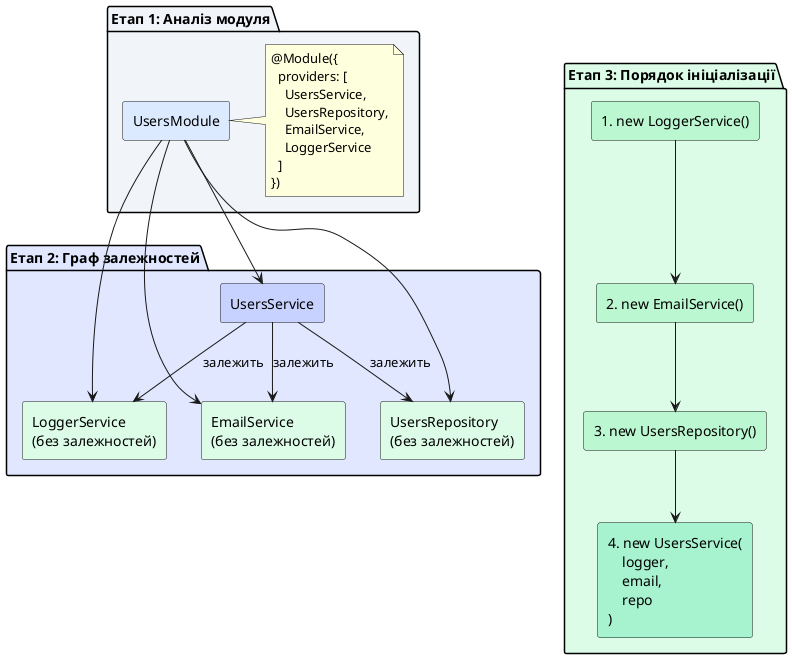
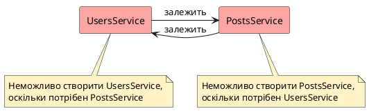

# Практика ін'єкції залежностей

## Короткий зміст

- Впровадження залежностей через параметри конструктора
- TypeScript модифікатори: `private readonly` для автоматичного присвоєння
- Множинні залежності: кілька провайдерів в одному конструкторі
- Автоматичне розв'язання залежностей DI-контейнером
- Порядок створення екземплярів: від залежностей до споживачів
- Циклічні залежності: проблема та попередження
- Приклад: сервіс залежить від репозиторію та логера
- Приклад: контролер залежить від кількох сервісів
- Тестування: легке мокування залежностей
- Best practices: явне оголошення залежностей у конструкторі

---

## Впровадження залежностей через параметри конструктора

У попередніх лекціях ми розглянули концепцію провайдерів та роль сервісів у інкапсуляції бізнес-логіки. Тепер настав час детально зануритися у **механіку ін'єкції залежностей** (*Dependency Injection, DI*) — процес, за допомогою якого NestJS автоматично надає провайдери класам, що їх потребують.

Ін'єкція залежностей у NestJS здійснюється через **constructor-based injection** (*ін'єкція через конструктор*) — підхід, при якому клас оголошує свої залежності як параметри конструктора, а DI-контейнер автоматично передає відповідні екземпляри провайдерів при створенні об'єкта. Це фундаментальний механізм, що лежить в основі всієї архітектури фреймворку.

Розглянемо базовий приклад впровадження одного провайдера:

```typescript
import { Injectable } from '@nestjs/common';
import { UsersRepository } from './users.repository';

@Injectable()
export class UsersService {
  // Оголошення залежності через параметр конструктора
  constructor(private readonly usersRepository: UsersRepository) {}

  async findAll() {
    return this.usersRepository.findAll();
  }
}
```

У цьому прикладі відбувається декілька важливих процесів:

1. **Оголошення залежності**: параметр `usersRepository: UsersRepository` інформує TypeScript та NestJS про те, що `UsersService` потребує екземпляр `UsersRepository`
2. **Автоматичне створення властивості**: модифікатор `private` автоматично створює приватну властивість `this.usersRepository` у класі
3. **Незмінність після ініціалізації**: модифікатор `readonly` гарантує, що властивість не може бути перевизначена після створення об'єкта
4. **Розв'язання залежності**: DI-контейнер розпізнає тип параметра (`UsersRepository`), знаходить відповідний зареєстрований провайдер у модулі та передає його екземпляр у конструктор

::card-group

::card{title="🎯 Мета лекції" icon="i-lucide-target"}

- Опанувати механіку впровадження залежностей через конструктор
- Зрозуміти роль TypeScript модифікаторів у DI
- Навчитися працювати з множинними залежностями у одному класі
- Розібрати процес автоматичного розв'язання залежностей DI-контейнером
- Усвідомити проблему циклічних залежностей та способи їх уникнення
- Практикувати найкращі практики організації залежностей

::

::card{title="🔑 Ключові терміни" icon="i-lucide-key"}

- **Constructor-based Injection** — впровадження залежностей через параметри конструктора класу
- **Dependency Graph** — граф залежностей між класами, що визначає порядок їх ініціалізації
- **Circular Dependency** — циклічна залежність, коли два класи залежать один від одного
- **Mock Object** — підроблений об'єкт, що імітує поведінку реальної залежності під час тестування

::

::

---

## TypeScript модифікатори: `private readonly` для автоматичного присвоєння

TypeScript надає потужну можливість **автоматичного створення властивостей класу** з параметрів конструктора через використання модифікаторів доступу (`private`, `public`, `protected`) у поєднанні з модифікатором `readonly`. Ця можливість значно скорочує кількість шаблонного коду (*boilerplate*) та робить оголошення залежностей лаконічнішим.

### Порівняння традиційного та скороченого синтаксису

Розглянемо два еквівалентні способи оголошення залежностей:

::code-group

```typescript [Традиційний синтаксис (багатослівний)]
import { Injectable } from '@nestjs/common';
import { UsersRepository } from './users.repository';

@Injectable()
export class UsersService {
  // 1. Оголошення приватної властивості
  private readonly usersRepository: UsersRepository;

  // 2. Присвоєння у конструкторі
  constructor(usersRepository: UsersRepository) {
    this.usersRepository = usersRepository;
  }

  async findAll() {
    return this.usersRepository.findAll();
  }
}
```

```typescript [Скорочений синтаксис (рекомендований)]
import { Injectable } from '@nestjs/common';
import { UsersRepository } from './users.repository';

@Injectable()
export class UsersService {
  // Оголошення властивості та присвоєння у одному рядку
  constructor(private readonly usersRepository: UsersRepository) {}

  async findAll() {
    return this.usersRepository.findAll();
  }
}
```

::

Обидва приклади генерують ідентичний JavaScript-код після компіляції, проте скорочений синтаксис є рекомендованим у NestJS-спільноті завдяки лаконічності та виразності.

### Розуміння модифікаторів

**`private`** — модифікатор доступу, що робить властивість доступною лише всередині класу. Зовнішні класи не можуть читати чи змінювати приватні властивості. Це забезпечує **інкапсуляцію** — один із фундаментальних принципів об'єктно-орієнтованого програмування.

```typescript
@Injectable()
export class UsersService {
  constructor(private usersRepository: UsersRepository) {}

  // ✅ Доступ всередині класу — працює
  async findAll() {
    return this.usersRepository.findAll();
  }
}

// ❌ Доступ ззовні класу — помилка компіляції
const service = new UsersService(repository);
console.log(service.usersRepository); // Error: Property 'usersRepository' is private
```

**`readonly`** — модифікатор незмінності, що дозволяє присвоїти значення властивості лише один раз — у момент ініціалізації (у конструкторі). Будь-які спроби змінити властивість після створення об'єкта призведуть до помилки компіляції.

```typescript
@Injectable()
export class UsersService {
  constructor(private readonly usersRepository: UsersRepository) {}

  someMethod() {
    // ❌ Спроба перевизначити властивість — помилка компіляції
    this.usersRepository = new UsersRepository(); 
    // Error: Cannot assign to 'usersRepository' because it is a read-only property
  }
}
```

::tip
Завжди використовуйте комбінацію `private readonly` для ін'єктованих залежностей. Це гарантує, що залежності встановлюються лише один раз у конструкторі та не можуть бути випадково змінені під час життя об'єкта, що запобігає цілому класу потенційних помилок.
::

### Альтернативні модифікатори доступу

Хоча `private` є найпоширенішим вибором, TypeScript також надає інші модифікатори:

**`public`** — властивість доступна ззовні класу. Рідко використовується для залежностей, оскільки порушує інкапсуляцію:

```typescript
@Injectable()
export class UsersService {
  // ⚠️ Публічна залежність — зовнішні класи можуть її читати
  constructor(public readonly usersRepository: UsersRepository) {}
}

// Тепер ззовні можна отримати доступ
const service = new UsersService(repository);
console.log(service.usersRepository); // ✅ Працює, але це антипатерн
```

**`protected`** — властивість доступна у класі та його нащадках (підкласах). Використовується у сценаріях наслідування:

```typescript
@Injectable()
export class BaseService {
  constructor(protected readonly logger: LoggerService) {}
}

@Injectable()
export class UsersService extends BaseService {
  someMethod() {
    // ✅ Доступ до logger з батьківського класу
    this.logger.log('Операція виконана');
  }
}
```

::note
У переважній більшості випадків використовуйте `private readonly` для залежностей. Модифікатор `public` робить внутрішню реалізацію класу доступною ззовні, що порушує принцип інкапсуляції. Модифікатор `protected` використовується лише у сценаріях наслідування, що рідко зустрічається у NestJS-застосунках.
::


---

## Множинні залежності: кілька провайдерів в одному конструкторі

У реальних застосунках класи рідко мають лише одну залежність. Частіше сервіси координують роботу кількох інших провайдерів: репозиторіїв для доступу до даних, утиліт для обчислень, логерів для запису подій, клієнтів для комунікації з зовнішніми API тощо. NestJS дозволяє оголошувати **множинні залежності** у конструкторі, і DI-контейнер автоматично розв'яже їх усі.

### Синтаксис множинних залежностей

Кожна залежність оголошується як окремий параметр конструктора:

```typescript
import { Injectable } from '@nestjs/common';
import { UsersRepository } from './users.repository';
import { EmailService } from '../email/email.service';
import { LoggerService } from '../logger/logger.service';
import { PasswordService } from '../auth/password.service';

@Injectable()
export class UsersService {
  constructor(
    private readonly usersRepository: UsersRepository,
    private readonly emailService: EmailService,
    private readonly logger: LoggerService,
    private readonly passwordService: PasswordService
  ) {}

  async register(email: string, name: string, password: string) {
    this.logger.log(`Реєстрація користувача: ${email}`);

    // Перевірка унікальності
    const existingUser = await this.usersRepository.findByEmail(email);
    if (existingUser) {
      throw new ConflictException('Email вже зайнятий');
    }

    // Хешування пароля
    const passwordHash = await this.passwordService.hash(password);

    // Створення користувача
    const user = await this.usersRepository.create({
      email,
      name,
      passwordHash
    });

    // Відправка привітального email
    await this.emailService.sendWelcome(email, name);

    this.logger.log(`Користувача ${email} успішно зареєстровано`);
    return user;
  }
}
```

У цьому прикладі `UsersService` має **чотири залежності**, кожна з яких виконує свою роль:

1. **UsersRepository** — доступ до даних користувачів у базі даних
2. **EmailService** — відправка електронних повідомлень
3. **LoggerService** — запис логів для моніторингу та налагодження
4. **PasswordService** — криптографічні операції з паролями

DI-контейнер автоматично створює екземпляри всіх чотирьох провайдерів та передає їх у конструктор `UsersService` у правильному порядку.

### Порядок параметрів у конструкторі

Важливо розуміти, що **порядок параметрів у конструкторі не має значення** для DI-контейнера — він розв'язує залежності на основі **типів параметрів**, а не їх позиції. Наступні два варіанти є функціонально ідентичними:

::code-group

```typescript [Варіант 1]
constructor(
  private readonly usersRepository: UsersRepository,
  private readonly emailService: EmailService,
  private readonly logger: LoggerService
) {}
```

```typescript [Варіант 2]
constructor(
  private readonly logger: LoggerService,
  private readonly usersRepository: UsersRepository,
  private readonly emailService: EmailService
) {}
```

::

Проте рекомендується дотримуватися логічного порядку для покращення читабельності коду:

1. **Основні залежності** (репозиторії, сервіси домену) — на початку
2. **Допоміжні сервіси** (логери, утиліти) — наприкінці
3. **Опціональні залежності** — у самому кінці

::tip
Якщо конструктор містить більше 5-7 залежностей, це може бути сигналом до того, що клас порушує принцип Single Responsibility та виконує занадто багато функцій. Розгляньте можливість розділення логіки на кілька менших, більш сфокусованих сервісів.
::

### Приклад контролера з множинними залежностями

Контролери також часто залежать від кількох сервісів:

```typescript
import { Controller, Get, Post, Body, Param } from '@nestjs/common';
import { UsersService } from './users.service';
import { AuthService } from '../auth/auth.service';
import { ValidationService } from '../validation/validation.service';

@Controller('users')
export class UsersController {
  constructor(
    private readonly usersService: UsersService,
    private readonly authService: AuthService,
    private readonly validationService: ValidationService
  ) {}

  @Post('register')
  async register(@Body() dto: RegisterDto) {
    // Валідація через ValidationService
    await this.validationService.validateRegistration(dto);

    // Реєстрація через UsersService
    const user = await this.usersService.register(
      dto.email,
      dto.name,
      dto.password
    );

    // Генерація токена через AuthService
    const token = await this.authService.generateToken(user.id);

    return {
      user,
      token
    };
  }

  @Get(':id')
  async getProfile(@Param('id') id: string) {
    return this.usersService.findById(+id);
  }
}
```

Цей контролер координує роботу трьох сервісів для реалізації ендпоінту реєстрації, демонструючи, як множинні залежності дозволяють розділяти відповідальності між спеціалізованими компонентами.

---

## Автоматичне розв'язання залежностей DI-контейнером

Одна з найпотужніших можливостей NestJS — це **автоматичне розв'язання залежностей** (*automatic dependency resolution*). Розробнику не потрібно вручну створювати екземпляри провайдерів чи відстежувати порядок їх ініціалізації — DI-контейнер аналізує граф залежностей та виконує всю роботу автоматично.

### Як працює розв'язання залежностей

Процес розв'язання залежностей відбувається у кілька етапів:

::steps

### Крок 1: Аналіз метаданих

Коли NestJS завантажує модуль, він зчитує метадані з декораторів `@Module()` та `@Injectable()`. Для кожного зареєстрованого провайдера фреймворк аналізує сигнатуру конструктора через TypeScript-метадані, що генеруються компілятором.

```typescript
@Module({
  providers: [UsersService, UsersRepository, EmailService, LoggerService]
})
export class UsersModule {}
```

NestJS сканує цей модуль та виявляє чотири провайдери, які потрібно зареєструвати у DI-контейнері.

### Крок 2: Побудова графу залежностей

DI-контейнер будує **граф залежностей** (*dependency graph*) — структуру даних, що відображає, які провайдери від яких залежать. Для кожного провайдера аналізуються параметри конструктора:

```typescript
// LoggerService не має залежностей
@Injectable()
export class LoggerService {}

// EmailService не має залежностей
@Injectable()
export class EmailService {}

// UsersRepository не має залежностей
@Injectable()
export class UsersRepository {}

// UsersService залежить від UsersRepository, EmailService та LoggerService
@Injectable()
export class UsersService {
  constructor(
    private readonly usersRepository: UsersRepository,
    private readonly emailService: EmailService,
    private readonly logger: LoggerService
  ) {}
}
```

### Крок 3: Топологічне сортування

DI-контейнер виконує **топологічне сортування** (*topological sort*) графу залежностей, визначаючи правильний порядок створення екземплярів. Провайдери без залежностей створюються першими, після чого створюються провайдери, що залежать від уже ініціалізованих.

### Крок 4: Створення екземплярів

NestJS викликає конструктори провайдерів у визначеному порядку, передаючи необхідні залежності:

1. Створюється `LoggerService` (немає залежностей)
2. Створюється `EmailService` (немає залежностей)
3. Створюється `UsersRepository` (немає залежностей)
4. Створюється `UsersService` (отримує три попередні сервіси)

### Крок 5: Кешування екземплярів

Створені екземпляри зберігаються у DI-контейнері як **singleton** (один екземпляр на застосунок). При наступних запитах на ін'єкцію того самого провайдера контейнер повертає вже створений екземпляр, а не створює новий.

::


::plant-uml{alt="Процес автоматичного розв'язання залежностей"}



::

::note
DI-контейнер NestJS використовує метадані TypeScript для визначення типів параметрів конструктора. Для цього у `tsconfig.json` має бути увімкнена опція `emitDecoratorMetadata: true`. NestJS CLI автоматично налаштовує цю опцію при створенні проєкту, тому ви можете покластися на автоматичне розв'язання залежностей без додаткових налаштувань.
::

---

## Порядок створення екземплярів: від залежностей до споживачів

Розуміння порядку створення екземплярів є важливим для усвідомлення життєвого циклу застосунку та діагностики проблем ініціалізації. NestJS завжди дотримується правила: **залежності створюються раніше, ніж споживачі цих залежностей**.

Розглянемо складніший приклад ієрархії залежностей:

```typescript
// logger.service.ts
@Injectable()
export class LoggerService {
  constructor() {
    console.log('1. LoggerService створено');
  }
}

// config.service.ts
@Injectable()
export class ConfigService {
  constructor(private readonly logger: LoggerService) {
    console.log('2. ConfigService створено');
    this.logger.log('ConfigService ініціалізовано');
  }
}

// database.service.ts
@Injectable()
export class DatabaseService {
  constructor(
    private readonly config: ConfigService,
    private readonly logger: LoggerService
  ) {
    console.log('3. DatabaseService створено');
    const dbUrl = this.config.get('DATABASE_URL');
    this.logger.log(`Підключення до БД: ${dbUrl}`);
  }
}

// users.repository.ts
@Injectable()
export class UsersRepository {
  constructor(
    private readonly database: DatabaseService,
    private readonly logger: LoggerService
  ) {
    console.log('4. UsersRepository створено');
    this.logger.log('UsersRepository готовий до роботи');
  }
}

// users.service.ts
@Injectable()
export class UsersService {
  constructor(
    private readonly repository: UsersRepository,
    private readonly logger: LoggerService
  ) {
    console.log('5. UsersService створено');
    this.logger.log('UsersService ініціалізовано');
  }
}
```

При запуску застосунку консоль виведе:

::terminal-preview{title="npm run start" :cursor="false"}

<div class="line"><span class="text-blue-400 font-bold">[Nest]</span> <span class="opacity-40">12345</span> - <span class="opacity-40">04.09.2026, 15:30:00</span> <span class="text-green-400 font-bold">LOG</span> [NestFactory] Starting Nest application...</div>
<div class="line">1. LoggerService створено</div>
<div class="line">2. ConfigService створено</div>
<div class="line"><span class="text-blue-400">[LoggerService]</span> ConfigService ініціалізовано</div>
<div class="line">3. DatabaseService створено</div>
<div class="line"><span class="text-blue-400">[LoggerService]</span> Підключення до БД: postgresql://localhost/mydb</div>
<div class="line">4. UsersRepository створено</div>
<div class="line"><span class="text-blue-400">[LoggerService]</span> UsersRepository готовий до роботи</div>
<div class="line">5. UsersService створено</div>
<div class="line"><span class="text-blue-400">[LoggerService]</span> UsersService ініціалізовано</div>
<div class="line"><span class="text-blue-400 font-bold">[Nest]</span> <span class="opacity-40">12345</span> - <span class="opacity-40">04.09.2026, 15:30:01</span> <span class="text-green-400 font-bold">LOG</span> [NestApplication] Nest application successfully started</div>

::

Порядок ініціалізації чітко відображає граф залежностей:

1. **LoggerService** створюється першим, оскільки не має залежностей
2. **ConfigService** отримує `LoggerService` та ініціалізується
3. **DatabaseService** отримує `ConfigService` та `LoggerService`
4. **UsersRepository** отримує `DatabaseService` та `LoggerService`
5. **UsersService** отримує `UsersRepository` та `LoggerService` і створюється останнім

::warning
Якщо під час ініціалізації провайдера виникне помилка (наприклад, виняток у конструкторі), застосунок **не запуститься**. NestJS зупинить процес завантаження та виведе повідомлення про помилку. Це захисний механізм, що запобігає запуску застосунку у неповністю ініціалізованому стані.
::

---

## Циклічні залежності: проблема та попередження

**Циклічна залежність** (*circular dependency*) виникає, коли два або більше класів залежать один від одного, утворюючи замкнене коло. Наприклад, `ServiceA` залежить від `ServiceB`, а `ServiceB` залежить від `ServiceA`. Така ситуація створює парадокс: неможливо створити `ServiceA`, не створивши спочатку `ServiceB`, але неможливо створити `ServiceB`, не створивши спочатку `ServiceA`.

### Приклад циклічної залежності

```typescript
// users.service.ts
@Injectable()
export class UsersService {
  constructor(private readonly postsService: PostsService) {}

  async getUserWithPosts(userId: number) {
    const user = await this.findById(userId);
    const posts = await this.postsService.findByUserId(userId);
    return { ...user, posts };
  }
}

// posts.service.ts
@Injectable()
export class PostsService {
  constructor(private readonly usersService: UsersService) {}

  async getPostWithAuthor(postId: number) {
    const post = await this.findById(postId);
    const author = await this.usersService.findById(post.authorId);
    return { ...post, author };
  }
}
```

У цьому прикладі `UsersService` залежить від `PostsService`, а `PostsService` залежить від `UsersService`, створюючи циклічну залежність.

::plant-uml{alt="Циклічна залежність між сервісами"}



::

### Детектування циклічних залежностей

При спробі запуску застосунку з циклічною залежністю NestJS згенерує виняток:

::terminal-preview{title="npm run start" :cursor="false"}

<div class="line"><span class="text-blue-400 font-bold">[Nest]</span> <span class="opacity-40">12345</span> - <span class="opacity-40">04.09.2026, 15:30:00</span> <span class="text-rose-400 font-bold">ERROR</span> [ExceptionHandler] Nest cannot create the UsersService instance.</div>
<div class="line"><span class="text-rose-400 font-bold">The module at index [0] of the UsersService "imports" array is undefined.</span></div>
<div class="line"></div>
<div class="line"><span class="text-rose-400">Potential causes:</span></div>
<div class="line">- A circular dependency between modules. Use forwardRef() to avoid it.</div>
<div class="line">- The module at index [0] is of type "undefined". Check your import statements and the type of the module.</div>

::


### Способи уникнення циклічних залежностей

Існує кілька архітектурних підходів до вирішення проблеми циклічних залежностей:

**1. Рефакторинг через винесення спільної логіки**

Найкращий спосіб — переглянути архітектуру та винести спільну логіку в окремий сервіс:

```typescript
// user-post.service.ts - Новий сервіс-оркестратор
@Injectable()
export class UserPostService {
  constructor(
    private readonly usersService: UsersService,
    private readonly postsService: PostsService
  ) {}

  async getUserWithPosts(userId: number) {
    const user = await this.usersService.findById(userId);
    const posts = await this.postsService.findByUserId(userId);
    return { ...user, posts };
  }

  async getPostWithAuthor(postId: number) {
    const post = await this.postsService.findById(postId);
    const author = await this.usersService.findById(post.authorId);
    return { ...post, author };
  }
}

// users.service.ts - Більше не залежить від PostsService
@Injectable()
export class UsersService {
  constructor(private readonly usersRepository: UsersRepository) {}

  async findById(userId: number) {
    return this.usersRepository.findById(userId);
  }
}

// posts.service.ts - Більше не залежить від UsersService
@Injectable()
export class PostsService {
  constructor(private readonly postsRepository: PostsRepository) {}

  async findById(postId: number) {
    return this.postsRepository.findById(postId);
  }

  async findByUserId(userId: number) {
    return this.postsRepository.findByUserId(userId);
  }
}
```

**2. Використання подієвої архітектури (Event-driven)**

Замість прямих викликів між сервісами використовуйте події:

```typescript
// users.service.ts
@Injectable()
export class UsersService {
  constructor(private readonly eventEmitter: EventEmitter2) {}

  async createUser(userData: any) {
    const user = await this.usersRepository.create(userData);
    
    // Емітуємо подію замість прямого виклику PostsService
    this.eventEmitter.emit('user.created', { userId: user.id });
    
    return user;
  }
}

// posts.service.ts
@Injectable()
export class PostsService {
  @OnEvent('user.created')
  async handleUserCreated(payload: { userId: number }) {
    // Реагуємо на подію без прямої залежності від UsersService
    await this.createWelcomePost(payload.userId);
  }
}
```

**3. Відкладена ін'єкція через `forwardRef()` (останній засіб)**

NestJS надає механізм `forwardRef()` для роботи з циклічними залежностями, проте це слід використовувати лише як тимчасове рішення:

```typescript
import { Injectable, Inject, forwardRef } from '@nestjs/common';

// users.service.ts
@Injectable()
export class UsersService {
  constructor(
    @Inject(forwardRef(() => PostsService))
    private readonly postsService: PostsService
  ) {}
}

// posts.service.ts
@Injectable()
export class PostsService {
  constructor(
    @Inject(forwardRef(() => UsersService))
    private readonly usersService: UsersService
  ) {}
}
```

::caution
Використання `forwardRef()` є **антипатерном** та свідчить про проблеми в архітектурі застосунку. Циклічні залежності ускладнюють тестування, підтримку та розуміння потоку даних. Завжди намагайтеся усунути циклічні залежності через рефакторинг архітектури, а не обходити їх технічними прийомами.
::

---

## Приклад: сервіс залежить від репозиторію та логера

Для закріплення матеріалу розглянемо повний приклад сервісу з двома залежностями — репозиторієм для доступу до даних та логером для запису подій:

```typescript
// logger.service.ts
import { Injectable, LoggerService as NestLoggerService } from '@nestjs/common';

@Injectable()
export class LoggerService implements NestLoggerService {
  log(message: string, context?: string) {
    const timestamp = new Date().toISOString();
    console.log(`[${timestamp}] [${context || 'App'}] ${message}`);
  }

  error(message: string, trace?: string, context?: string) {
    const timestamp = new Date().toISOString();
    console.error(`[${timestamp}] [${context || 'App'}] ERROR: ${message}`);
    if (trace) console.error(trace);
  }

  warn(message: string, context?: string) {
    const timestamp = new Date().toISOString();
    console.warn(`[${timestamp}] [${context || 'App'}] WARN: ${message}`);
  }

  debug(message: string, context?: string) {
    const timestamp = new Date().toISOString();
    console.debug(`[${timestamp}] [${context || 'App'}] DEBUG: ${message}`);
  }

  verbose(message: string, context?: string) {
    const timestamp = new Date().toISOString();
    console.log(`[${timestamp}] [${context || 'App'}] VERBOSE: ${message}`);
  }
}
```

```typescript
// users.repository.ts
import { Injectable, NotFoundException } from '@nestjs/common';

interface User {
  id: number;
  email: string;
  name: string;
  createdAt: Date;
}

@Injectable()
export class UsersRepository {
  private users: User[] = [];
  private currentId = 1;

  async create(userData: Omit<User, 'id' | 'createdAt'>): Promise<User> {
    const user: User = {
      id: this.currentId++,
      ...userData,
      createdAt: new Date()
    };
    this.users.push(user);
    return user;
  }

  async findById(id: number): Promise<User | null> {
    return this.users.find(u => u.id === id) || null;
  }

  async findByEmail(email: string): Promise<User | null> {
    return this.users.find(u => u.email === email) || null;
  }

  async findAll(): Promise<User[]> {
    return this.users;
  }

  async update(id: number, userData: Partial<User>): Promise<User> {
    const user = await this.findById(id);
    if (!user) {
      throw new NotFoundException(`Користувача з ID ${id} не знайдено`);
    }
    Object.assign(user, userData);
    return user;
  }

  async delete(id: number): Promise<void> {
    const index = this.users.findIndex(u => u.id === id);
    if (index === -1) {
      throw new NotFoundException(`Користувача з ID ${id} не знайдено`);
    }
    this.users.splice(index, 1);
  }
}
```

```typescript
// users.service.ts
import { Injectable, ConflictException, NotFoundException } from '@nestjs/common';
import { UsersRepository } from './users.repository';
import { LoggerService } from '../logger/logger.service';

interface CreateUserDto {
  email: string;
  name: string;
}

@Injectable()
export class UsersService {
  private readonly context = 'UsersService';

  constructor(
    private readonly usersRepository: UsersRepository,
    private readonly logger: LoggerService
  ) {
    this.logger.log('UsersService ініціалізовано', this.context);
  }

  async create(createUserDto: CreateUserDto) {
    this.logger.log(`Спроба створення користувача: ${createUserDto.email}`, this.context);

    // Перевірка унікальності email
    const existingUser = await this.usersRepository.findByEmail(createUserDto.email);
    if (existingUser) {
      this.logger.warn(
        `Спроба створити користувача з існуючим email: ${createUserDto.email}`,
        this.context
      );
      throw new ConflictException('Користувач з таким email вже існує');
    }

    // Створення користувача
    const user = await this.usersRepository.create(createUserDto);
    this.logger.log(
      `Користувача успішно створено: ${user.email} (ID: ${user.id})`,
      this.context
    );

    return user;
  }

  async findAll() {
    this.logger.debug('Запит на отримання всіх користувачів', this.context);
    const users = await this.usersRepository.findAll();
    this.logger.log(`Знайдено користувачів: ${users.length}`, this.context);
    return users;
  }

  async findOne(id: number) {
    this.logger.debug(`Пошук користувача з ID: ${id}`, this.context);
    const user = await this.usersRepository.findById(id);

    if (!user) {
      this.logger.warn(`Користувача з ID ${id} не знайдено`, this.context);
      throw new NotFoundException(`Користувача з ID ${id} не знайдено`);
    }

    return user;
  }

  async update(id: number, updateUserDto: Partial<CreateUserDto>) {
    this.logger.log(`Оновлення користувача з ID: ${id}`, this.context);

    // Перевірка існування користувача
    await this.findOne(id); // Викине NotFoundException, якщо не знайдено

    // Перевірка унікальності email, якщо він змінюється
    if (updateUserDto.email) {
      const existingUser = await this.usersRepository.findByEmail(updateUserDto.email);
      if (existingUser && existingUser.id !== id) {
        this.logger.warn(
          `Спроба змінити email на вже існуючий: ${updateUserDto.email}`,
          this.context
        );
        throw new ConflictException('Email вже використовується іншим користувачем');
      }
    }

    const updatedUser = await this.usersRepository.update(id, updateUserDto);
    this.logger.log(`Користувача ${id} успішно оновлено`, this.context);
    return updatedUser;
  }

  async remove(id: number) {
    this.logger.log(`Видалення користувача з ID: ${id}`, this.context);

    // Перевірка існування
    await this.findOne(id);

    await this.usersRepository.delete(id);
    this.logger.log(`Користувача ${id} успішно видалено`, this.context);
  }
}
```

У цьому прикладі `UsersService` демонструє кілька важливих практик:

1. **Ін'єкція двох залежностей** через конструктор
2. **Логування всіх важливих операцій** для моніторингу та налагодження
3. **Чітке розділення відповідальностей**: сервіс містить бізнес-логіку, репозиторій — доступ до даних
4. **Обробка помилок** з відповідним логуванням
5. **Контекстне логування** через властивість `context` для легкої ідентифікації джерела логів


---

## Приклад: контролер залежить від кількох сервісів

Контролери, як координатори HTTP-запитів, часто залежать від кількох сервісів для реалізації складних ендпоінтів. Розглянемо приклад контролера автентифікації, що використовує три сервіси:

```typescript
// auth.controller.ts
import {
  Controller,
  Post,
  Get,
  Body,
  UseGuards,
  Request,
  HttpCode,
  HttpStatus
} from '@nestjs/common';
import { UsersService } from '../users/users.service';
import { AuthService } from './auth.service';
import { LoggerService } from '../logger/logger.service';
import { JwtAuthGuard } from './guards/jwt-auth.guard';

interface RegisterDto {
  email: string;
  name: string;
  password: string;
}

interface LoginDto {
  email: string;
  password: string;
}

@Controller('auth')
export class AuthController {
  private readonly context = 'AuthController';

  constructor(
    private readonly usersService: UsersService,
    private readonly authService: AuthService,
    private readonly logger: LoggerService
  ) {
    this.logger.log('AuthController ініціалізовано', this.context);
  }

  @Post('register')
  async register(@Body() registerDto: RegisterDto) {
    this.logger.log(`Реєстрація нового користувача: ${registerDto.email}`, this.context);

    // Створення користувача через UsersService
    const user = await this.usersService.create({
      email: registerDto.email,
      name: registerDto.name
    });

    // Хешування пароля через AuthService
    await this.authService.setPassword(user.id, registerDto.password);

    // Генерація JWT-токена
    const token = await this.authService.generateToken(user);

    this.logger.log(`Користувача ${user.email} успішно зареєстровано`, this.context);

    return {
      user: {
        id: user.id,
        email: user.email,
        name: user.name
      },
      token
    };
  }

  @Post('login')
  @HttpCode(HttpStatus.OK)
  async login(@Body() loginDto: LoginDto) {
    this.logger.log(`Спроба входу: ${loginDto.email}`, this.context);

    // Валідація облікових даних через AuthService
    const user = await this.authService.validateUser(loginDto.email, loginDto.password);

    // Генерація токена
    const token = await this.authService.generateToken(user);

    this.logger.log(`Успішний вхід: ${user.email}`, this.context);

    return {
      user: {
        id: user.id,
        email: user.email,
        name: user.name
      },
      token
    };
  }

  @Get('profile')
  @UseGuards(JwtAuthGuard)
  async getProfile(@Request() req) {
    const userId = req.user.id;
    this.logger.debug(`Запит профілю користувача: ${userId}`, this.context);

    // Отримання даних користувача через UsersService
    const user = await this.usersService.findOne(userId);

    return {
      id: user.id,
      email: user.email,
      name: user.name
    };
  }

  @Post('logout')
  @UseGuards(JwtAuthGuard)
  @HttpCode(HttpStatus.NO_CONTENT)
  async logout(@Request() req) {
    const userId = req.user.id;
    this.logger.log(`Вихід користувача: ${userId}`, this.context);

    // Можна додати логіку інвалідації токена
    await this.authService.revokeToken(req.user.token);

    return;
  }
}
```

Цей контролер демонструє:

1. **Ін'єкцію трьох сервісів**: `UsersService`, `AuthService`, `LoggerService`
2. **Координацію операцій**: контролер викликає методи різних сервісів у правильній послідовності
3. **Логування всіх дій** для аудиту та моніторингу
4. **Делегування бізнес-логіки**: контролер не містить складної логіки, а делегує її сервісам

---

## Тестування: легке мокування залежностей

Одна з найбільших переваг ін'єкції залежностей — це **простота тестування**. Оскільки залежності передаються ззовні через конструктор, під час тестування ми можемо легко замінити реальні провайдери на **mock-об'єкти** (*фіктивні об'єкти*), що імітують їх поведінку.

### Приклад unit-тесту сервісу

```typescript
// users.service.spec.ts
import { Test, TestingModule } from '@nestjs/testing';
import { ConflictException, NotFoundException } from '@nestjs/common';
import { UsersService } from './users.service';
import { UsersRepository } from './users.repository';
import { LoggerService } from '../logger/logger.service';

describe('UsersService', () => {
  let service: UsersService;
  let repository: UsersRepository;
  let logger: LoggerService;

  // Mock-об'єкти для залежностей
  const mockRepository = {
    create: jest.fn(),
    findById: jest.fn(),
    findByEmail: jest.fn(),
    findAll: jest.fn(),
    update: jest.fn(),
    delete: jest.fn()
  };

  const mockLogger = {
    log: jest.fn(),
    error: jest.fn(),
    warn: jest.fn(),
    debug: jest.fn(),
    verbose: jest.fn()
  };

  beforeEach(async () => {
    const module: TestingModule = await Test.createTestingModule({
      providers: [
        UsersService,
        {
          provide: UsersRepository,
          useValue: mockRepository // Підміна реального репозиторію на mock
        },
        {
          provide: LoggerService,
          useValue: mockLogger // Підміна реального логера на mock
        }
      ]
    }).compile();

    service = module.get<UsersService>(UsersService);
    repository = module.get<UsersRepository>(UsersRepository);
    logger = module.get<LoggerService>(LoggerService);
  });

  afterEach(() => {
    // Очищення mock-викликів після кожного тесту
    jest.clearAllMocks();
  });

  describe('create', () => {
    it('має успішно створити користувача', async () => {
      // Arrange: підготовка даних
      const createUserDto = { email: 'test@example.com', name: 'Тест' };
      const createdUser = { id: 1, ...createUserDto, createdAt: new Date() };

      mockRepository.findByEmail.mockResolvedValue(null); // Email вільний
      mockRepository.create.mockResolvedValue(createdUser);

      // Act: виконання операції
      const result = await service.create(createUserDto);

      // Assert: перевірка результатів
      expect(result).toEqual(createdUser);
      expect(mockRepository.findByEmail).toHaveBeenCalledWith(createUserDto.email);
      expect(mockRepository.create).toHaveBeenCalledWith(createUserDto);
      expect(mockLogger.log).toHaveBeenCalledWith(
        expect.stringContaining('успішно створено'),
        'UsersService'
      );
    });

    it('має викинути ConflictException, якщо email вже існує', async () => {
      // Arrange
      const createUserDto = { email: 'existing@example.com', name: 'Тест' };
      mockRepository.findByEmail.mockResolvedValue({ id: 1, ...createUserDto });

      // Act & Assert
      await expect(service.create(createUserDto)).rejects.toThrow(ConflictException);
      expect(mockRepository.create).not.toHaveBeenCalled();
      expect(mockLogger.warn).toHaveBeenCalled();
    });
  });

  describe('findOne', () => {
    it('має повернути користувача за ID', async () => {
      // Arrange
      const user = { id: 1, email: 'test@example.com', name: 'Тест', createdAt: new Date() };
      mockRepository.findById.mockResolvedValue(user);

      // Act
      const result = await service.findOne(1);

      // Assert
      expect(result).toEqual(user);
      expect(mockRepository.findById).toHaveBeenCalledWith(1);
    });

    it('має викинути NotFoundException, якщо користувача не знайдено', async () => {
      // Arrange
      mockRepository.findById.mockResolvedValue(null);

      // Act & Assert
      await expect(service.findOne(999)).rejects.toThrow(NotFoundException);
      expect(mockLogger.warn).toHaveBeenCalled();
    });
  });
});
```

### Переваги мокування залежностей

Цей підхід до тестування надає кілька критичних переваг:

1. **Ізоляція**: тестуємо лише логіку `UsersService`, без залежності від реалізації `UsersRepository` чи `LoggerService`
2. **Швидкість**: тести виконуються миттєво, оскільки не потребують реального підключення до бази даних
3. **Контроль**: можемо симулювати будь-які сценарії, включаючи помилки та крайні випадки
4. **Надійність**: тести не падають через проблеми з зовнішніми системами (БД, мережа)

::tip
Використовуйте бібліотеки на кшталт `jest` для автоматичного створення mock-об'єктів. Функція `jest.fn()` створює mock-функцію, яка відстежує всі виклики та дозволяє налаштовувати повернені значення через `mockResolvedValue()` або `mockReturnValue()`.
::

---

## Best practices: явне оголошення залежностей у конструкторі

Для забезпечення читабельності, підтримуваності та тестованості коду дотримуйтесь наступних найкращих практик при роботі з ін'єкцією залежностей:

### 1. Завжди використовуйте `private readonly`

```typescript
// ✅ ДОБРЕ
constructor(
  private readonly usersService: UsersService,
  private readonly logger: LoggerService
) {}

// ❌ ПОГАНО: без readonly
constructor(
  private usersService: UsersService,
  private logger: LoggerService
) {}

// ❌ ПОГАНО: без модифікатора доступу
constructor(
  readonly usersService: UsersService,
  readonly logger: LoggerService
) {}
```

### 2. Групуйте залежності логічно

```typescript
// ✅ ДОБРЕ: логічне групування
constructor(
  // Основні бізнес-залежності
  private readonly usersRepository: UsersRepository,
  private readonly authService: AuthService,
  
  // Інфраструктурні сервіси
  private readonly logger: LoggerService,
  private readonly config: ConfigService
) {}
```

### 3. Уникайте занадто багатьох залежностей

```typescript
// ⚠️ ПОГАНО: забагато залежностей (порушення SRP)
constructor(
  private readonly usersRepo: UsersRepository,
  private readonly postsRepo: PostsRepository,
  private readonly commentsRepo: CommentsRepository,
  private readonly likesRepo: LikesRepository,
  private readonly emailService: EmailService,
  private readonly smsService: SmsService,
  private readonly pushService: PushService,
  private readonly logger: LoggerService
) {}

// ✅ ДОБРЕ: розділіть на кілька сервісів
```

### 4. Не використовуйте ін'єкцію властивостей

NestJS підтримує ін'єкцію через властивості, проте це антипатерн:

```typescript
// ❌ ПОГАНО: property-based injection
@Injectable()
export class UsersService {
  @Inject(UsersRepository)
  private repository: UsersRepository;
}

// ✅ ДОБРЕ: constructor-based injection
@Injectable()
export class UsersService {
  constructor(private readonly repository: UsersRepository) {}
}
```

### 5. Документуйте складні залежності

```typescript
@Injectable()
export class OrdersService {
  /**
   * OrdersService координує роботу кількох підсистем:
   * - ProductsService: валідація наявності товарів
   * - PaymentService: обробка платежів
   * - EmailService: відправка підтверджень
   * - LoggerService: аудит операцій
   */
  constructor(
    private readonly productsService: ProductsService,
    private readonly paymentService: PaymentService,
    private readonly emailService: EmailService,
    private readonly logger: LoggerService
  ) {}
}
```

::accordion

::accordion-item{label="❓ Чи можна ін'єктувати один і той самий провайдер у кілька класів?" icon="i-lucide-help-circle"}

Так, це нормальна та бажана практика. Оскільки провайдери за замовчуванням є singleton, один екземпляр провайдера може бути ін'єктований у скільки завгодно класів. Наприклад, `LoggerService` часто ін'єктується майже у всі сервіси застосунку.

::

::accordion-item{label="❓ Що станеться, якщо забути зареєструвати провайдер у модулі?" icon="i-lucide-help-circle"}

NestJS згенерує виняток під час ініціалізації застосунку з повідомленням на кшталт: `Nest can't resolve dependencies of TheClass (?). Please make sure that the argument TheDependency at index [0] is available in the TheModule context.` Застосунок не запуститься, що є захисним механізмом проти неповної конфігурації.

::

::accordion-item{label="❓ Чи можна мати опціональні залежності?" icon="i-lucide-help-circle"}

Так, NestJS підтримує опціональні залежності через декоратор `@Optional()`. Це корисно для провайдерів, які можуть бути відсутніми у певних конфігураціях. Детальніше про це буде розглянуто у наступних лекціях.

::

::

---

## Резюме

Практика ін'єкції залежностей є фундаментальним навиком для розробки NestJS-застосунків. Ключові тези лекції:

::card-group

::card{title="✅ Механіка DI" icon="i-lucide-check-circle"}

- Ін'єкція відбувається через конструктор класу
- Використовуйте `private readonly` для автоматичного створення властивостей
- DI-контейнер автоматично розв'язує залежності на основі типів
- Порядок створення: від залежностей до споживачів
- Singleton-патерн за замовчуванням

::

::card{title="⚠️ Важливі застереження" icon="i-lucide-alert-triangle"}

- Уникайте циклічних залежностей через рефакторинг
- Не використовуйте `forwardRef()` без крайньої необхідності
- Обмежуйте кількість залежностей (5-7 максимум)
- Завжди реєструйте провайдери у модулях
- Використовуйте mock-об'єкти для тестування

::

::

У наступній лекції ми розглянемо **Custom Providers** — спеціалізовані способи реєстрації провайдерів через `useValue`, `useClass`, `useFactory` та `useExisting`, що дозволяють створювати складні конфігурації та динамічно налаштовувати залежності.
