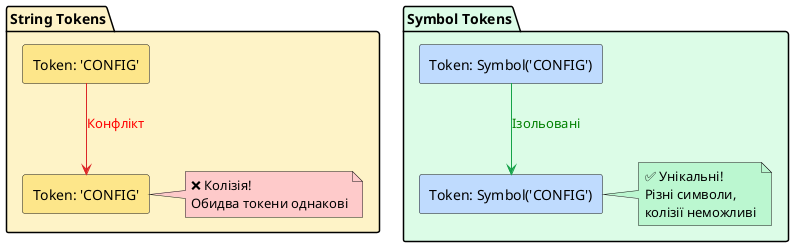

# Injection Tokens: рядкові та символьні токени

## Короткий зміст

- Проблема: коли класу немає (константи, примітиви)
- Рядкові токени: `'CONFIG_OPTIONS'`, `'DATABASE_CONNECTION'`
- Символьні токени: `Symbol('TOKEN_NAME')` для унікальності
- Декоратор `@Inject(token)`: явне вказування токена впровадження
- Константи для токенів: винесення у окремий файл
- Використання InjectionToken з інших фреймворків (аналогія Angular)
- Injection token для інтерфейсів (TypeScript інтерфейси зникають після компіляції)
- Приклад: впровадження об'єкта конфігурації через токен
- Приклад: впровадження підключення до БД
- Best practices: використовувати Symbol замість рядків для уникнення колізій

---

## Проблема: коли класу немає для ін'єкції

У попередніх лекціях ми розглянули базову концепцію провайдерів у NestJS, де ін'єкція залежностей відбувається через **класи TypeScript**. Коли ми ін'єктуємо `UsersService` у контролер, система ін'єкції залежностей NestJS використовує сам клас `UsersService` як **токен** (*token*) — унікальний ідентифікатор, за яким DI-контейнер знаходить відповідний провайдер і створює його екземпляр.

Проте цей підхід працює лише для класів, позначених декоратором `@Injectable()`. У реальних застосунках часто виникає необхідність ін'єктувати значення, які не є класами:

- **Об'єкти конфігурації** — звичайні JavaScript-об'єкти з налаштуваннями застосунку
- **Константи та примітиви** — рядки, числа, булеві значення, масиви
- **Зовнішні бібліотеки** — екземпляри класів зі сторонніх пакетів (наприклад, `AxiosInstance`, `Redis`, `DataSource` з TypeORM)
- **Результати фабричних функцій** — об'єкти, створені динамічно під час ініціалізації застосунку
- **Інтерфейси та абстракції** — TypeScript інтерфейси, які зникають після компіляції та не можуть бути використані як токени

Розглянемо типову ситуацію. Припустімо, у нас є об'єкт конфігурації API:

```typescript
const apiConfig = {
  baseUrl: 'https://api.example.com',
  apiKey: 'secret_key_12345',
  timeout: 5000,
  retryAttempts: 3
};
```

Цей об'єкт не є класом — це звичайний JavaScript-літерал. Як його зареєструвати як провайдер і ін'єктувати у сервіси? Ми не можемо написати:

```typescript
// ❌ НЕ ПРАЦЮЄ: об'єкт не може бути токеном
@Module({
  providers: [
    {
      provide: apiConfig,  // Помилка компіляції!
      useValue: apiConfig
    }
  ]
})
export class AppModule {}
```

TypeScript та DI-контейнер NestJS не дозволяють використовувати звичайні об'єкти як токени. Для розв'язання цієї проблеми NestJS пропонує механізм **Injection Tokens** (*токени впровадження*) — спеціальні ідентифікатори, які можуть бути **рядками** (*string tokens*) або **символами** (*Symbol tokens*).

::card-group

::card{title="🎯 Мета лекції" icon="i-lucide-target"}

- Зрозуміти концепцію Injection Tokens та їх роль у системі DI
- Опанувати використання рядкових та символьних токенів для ін'єкції
- Навчитися застосовувати декоратор `@Inject()` для явного вказування токенів
- Розробити стратегію організації токенів через константи
- Зрозуміти обмеження TypeScript інтерфейсів у контексті DI
- Вивчити best practices для уникнення колізій та забезпечення типобезпеки

::

::card{title="🔑 Ключові терміни" icon="i-lucide-key"}

- **Injection Token** — унікальний ідентифікатор провайдера у DI-контейнері (клас, рядок або Symbol)
- **String Token** — рядковий токен на кшталт `'DATABASE_CONNECTION'`
- **Symbol Token** — унікальний символ JavaScript, створений через `Symbol('name')`
- **@Inject(token)** — декоратор для явного вказування токена при ін'єкції залежності
- **Token Collision** — конфлікт імен, коли два провайдери використовують однаковий токен

::

::

---

## Рядкові токени: найпростіший підхід до ін'єкції нестандартних значень

**Рядкові токени** (*string tokens*) — це найбільш інтуїтивний та поширений спосіб ідентифікації провайдерів, які не є класами. Замість класу у властивості `provide` ми вказуємо рядок — довільне ім'я, яке слугуватиме унікальним ідентифікатором провайдера у DI-контейнері.

### Базовий приклад: реєстрація конфігурації через рядковий токен

```typescript
// config/api.config.ts
export const API_CONFIG = {
  baseUrl: 'https://api.example.com',
  apiKey: process.env.API_KEY || 'default_key',
  timeout: 5000,
  retryAttempts: 3,
  enableLogging: true
};

// app.module.ts
import { Module } from '@nestjs/common';
import { API_CONFIG } from './config/api.config';

@Module({
  providers: [
    {
      provide: 'API_CONFIG',      // Рядковий токен
      useValue: API_CONFIG         // Значення, яке буде ін'єктовано
    }
  ]
})
export class AppModule {}
```

Тепер для ін'єкції цього об'єкта конфігурації у сервіс необхідно використати декоратор `@Inject()`, оскільки TypeScript не може автоматично визначити, що параметр конструктора має тип рядкового токена:

```typescript
import { Injectable, Inject } from '@nestjs/common';

@Injectable()
export class ApiService {
  constructor(
    @Inject('API_CONFIG') private readonly config: typeof API_CONFIG
  ) {
    console.log(`API Base URL: ${this.config.baseUrl}`);
  }

  async fetchUsers() {
    const controller = new AbortController();
    const timeoutId = setTimeout(() => controller.abort(), this.config.timeout);

    try {
      const response = await fetch(`${this.config.baseUrl}/users`, {
        headers: {
          'Authorization': `Bearer ${this.config.apiKey}`
        },
        signal: controller.signal
      });

      clearTimeout(timeoutId);
      return response.json();
    } catch (error) {
      if (this.config.enableLogging) {
        console.error('API request failed:', error);
      }
      throw error;
    }
  }
}
```

У цьому прикладі декоратор `@Inject('API_CONFIG')` явно повідомляє DI-контейнеру, що параметр `config` має бути заповнений провайдером, зареєстрованим під токеном `'API_CONFIG'`. Тип параметра `typeof API_CONFIG` забезпечує типобезпеку: TypeScript знає структуру об'єкта конфігурації та надаватиме автодоповнення для його властивостей.

### Чому потрібен декоратор @Inject()?

Коли параметр конструктора має тип **класу**, TypeScript автоматично додає метадані про цей тип у скомпільований JavaScript-код. NestJS зчитує ці метадані та використовує клас як токен для пошуку відповідного провайдера:

```typescript
// TypeScript автоматично визначає тип залежності
constructor(private readonly usersService: UsersService) {}

// Після компіляції JavaScript містить метадані:
// __metadata("design:paramtypes", [UsersService])
```

Проте коли ми використовуємо рядковий токен, TypeScript не може додати його у метадані, оскільки тип параметра може бути чим завгодно (`string`, `object`, `any`). Тому ми повинні **явно** вказати токен через декоратор `@Inject()`:

```typescript
// Явне вказування токена через декоратор
constructor(@Inject('API_CONFIG') private readonly config: any) {}
```

::note
Декоратор `@Inject()` завжди обов'язковий при ін'єкції провайдерів, зареєстрованих через рядкові або символьні токени. Це явне зв'язування між параметром конструктора та токеном у DI-контейнері.
::

---

## Організація токенів через константи: централізоване управління

Використання магічних рядків (*magic strings*) на кшталт `'API_CONFIG'` безпосередньо у коді є поганою практикою з кількох причин:

1. **Друкарські помилки**: `'API_CONFIG'` vs `'API_CONFG'` — така помилка не буде виявлена компілятором
2. **Складність рефакторингу**: якщо потрібно змінити ім'я токена, доведеться шукати всі входження рядка по всій кодовій базі
3. **Відсутність автодоповнення**: IDE не може підказати доступні токени
4. **Дублювання**: один і той самий рядок може бути написаний по-різному у різних місцях

Професійний підхід полягає у **винесенні всіх токенів у окремий файл констант**, де кожен токен є іменованою константою. Це забезпечує централізоване управління токенами та захист від помилок на етапі компіляції.

### Приклад: файл з константами токенів

```typescript
// constants/injection-tokens.ts

/**
 * Централізоване сховище токенів для системи ін'єкції залежностей.
 * 
 * Використовуйте ці константи замість магічних рядків для забезпечення
 * типобезпеки та полегшення рефакторингу.
 */
export const INJECTION_TOKENS = {
  // Конфігурація
  API_CONFIG: 'API_CONFIG',
  DATABASE_CONFIG: 'DATABASE_CONFIG',
  REDIS_CONFIG: 'REDIS_CONFIG',

  // Підключення до зовнішніх сервісів
  DATABASE_CONNECTION: 'DATABASE_CONNECTION',
  REDIS_CLIENT: 'REDIS_CLIENT',
  HTTP_CLIENT: 'HTTP_CLIENT',

  // Утиліти та хелпери
  LOGGER: 'LOGGER',
  CACHE_MANAGER: 'CACHE_MANAGER',
  FILE_STORAGE: 'FILE_STORAGE',

  // Бізнес-логіка
  PAYMENT_GATEWAY: 'PAYMENT_GATEWAY',
  EMAIL_SERVICE: 'EMAIL_SERVICE',
  SMS_SERVICE: 'SMS_SERVICE'
} as const;

/**
 * Тип для автодоповнення токенів у IDE.
 * Використовуйте у дженериках: @Inject<TokenKey>()
 */
export type TokenKey = keyof typeof INJECTION_TOKENS;
```

Конструкція `as const` робить об'єкт `INJECTION_TOKENS` **незмінним** (*readonly*) на рівні TypeScript, що запобігає випадковій зміні значень токенів під час виконання.

### Використання констант токенів у модулі

```typescript
// app.module.ts
import { Module } from '@nestjs/common';
import { INJECTION_TOKENS } from './constants/injection-tokens';
import { API_CONFIG } from './config/api.config';

@Module({
  providers: [
    {
      provide: INJECTION_TOKENS.API_CONFIG,
      useValue: API_CONFIG
    },
    {
      provide: INJECTION_TOKENS.HTTP_CLIENT,
      useFactory: () => {
        return axios.create({
          baseURL: API_CONFIG.baseUrl,
          timeout: API_CONFIG.timeout
        });
      }
    }
  ]
})
export class AppModule {}
```

### Використання констант токенів у сервісах

```typescript
// services/api.service.ts
import { Injectable, Inject } from '@nestjs/common';
import { AxiosInstance } from 'axios';
import { INJECTION_TOKENS } from '../constants/injection-tokens';

@Injectable()
export class ApiService {
  constructor(
    @Inject(INJECTION_TOKENS.API_CONFIG) 
    private readonly config: typeof API_CONFIG,
    
    @Inject(INJECTION_TOKENS.HTTP_CLIENT) 
    private readonly httpClient: AxiosInstance
  ) {}

  async getData(endpoint: string) {
    const response = await this.httpClient.get(endpoint);
    return response.data;
  }
}
```

Тепер якщо ви зробите друкарську помилку у назві токена, TypeScript негайно повідомить про помилку:

```typescript
// ❌ Помилка компіляції: Property 'API_CONFG' does not exist
@Inject(INJECTION_TOKENS.API_CONFG)

// ✅ Правильно: автодоповнення працює
@Inject(INJECTION_TOKENS.API_CONFIG)
```

::tip
Створюйте окремий файл `injection-tokens.ts` для всіх токенів проєкту та імпортуйте константи замість використання магічних рядків. Це значно полегшує рефакторинг та запобігає помилкам на етапі компіляції.
::


---

## Символьні токени: гарантія унікальності через Symbol

Хоча рядкові токени є зручними та інтуїтивно зрозумілими, вони мають один суттєвий недолік — **можливість колізій імен** (*name collisions*). У великих застосунках, особливо тих, що інтегрують кілька модулів або бібліотек від різних розробників, може статися ситуація, коли два різні модулі випадково використовують однаковий рядковий токен для різних цілей.

Розглянемо проблемну ситуацію:

```typescript
// Module A (бібліотека аутентифікації)
@Module({
  providers: [
    {
      provide: 'CONFIG',
      useValue: { jwtSecret: 'secret123', tokenExpiry: 3600 }
    }
  ]
})
export class AuthModule {}

// Module B (бібліотека кешування)
@Module({
  providers: [
    {
      provide: 'CONFIG',  // ❌ Конфлікт! Той самий токен
      useValue: { ttl: 600, maxSize: 1000 }
    }
  ]
})
export class CacheModule {}
```

Якщо обидва модулі імпортовані у одному застосунку, виникне конфлікт: DI-контейнер не зможе однозначно визначити, який саме провайдер має бути ін'єктований при запиті токена `'CONFIG'`. Поведінка у такій ситуації непередбачувана — зазвичай перемагає останній зареєстрований провайдер, що призводить до важковловимих помилок.

### Рішення: Symbol як унікальний токен

JavaScript-тип **Symbol** був створений саме для вирішення проблеми унікальності ідентифікаторів. Кожен виклик `Symbol()` створює **абсолютно унікальне значення**, яке ніколи не дорівнюватиме іншому символу, навіть якщо вони мають однакові описи:

```typescript
const symbol1 = Symbol('CONFIG');
const symbol2 = Symbol('CONFIG');

console.log(symbol1 === symbol2); // false — різні символи!
console.log(symbol1.description);  // 'CONFIG' — опис для налагодження
```

Використання символів як токенів повністю усуває можливість колізій, навіть якщо різні модулі використовують символи з однаковими описами:

```typescript
// constants/tokens.ts (Module A)
export const AUTH_CONFIG_TOKEN = Symbol('CONFIG');

// constants/tokens.ts (Module B)
export const CACHE_CONFIG_TOKEN = Symbol('CONFIG');

// Ці токени різні, хоча мають однаковий опис!
console.log(AUTH_CONFIG_TOKEN === CACHE_CONFIG_TOKEN); // false
```

### Приклад: реєстрація провайдерів через Symbol-токени

```typescript
// constants/injection-tokens.ts
export const INJECTION_TOKENS = {
  // Конфігурація
  API_CONFIG: Symbol('API_CONFIG'),
  DATABASE_CONFIG: Symbol('DATABASE_CONFIG'),
  REDIS_CONFIG: Symbol('REDIS_CONFIG'),

  // Підключення
  DATABASE_CONNECTION: Symbol('DATABASE_CONNECTION'),
  REDIS_CLIENT: Symbol('REDIS_CLIENT'),
  HTTP_CLIENT: Symbol('HTTP_CLIENT'),

  // Сервіси
  LOGGER: Symbol('LOGGER'),
  CACHE_MANAGER: Symbol('CACHE_MANAGER')
};

// Тип для типобезпеки
export type InjectionToken = typeof INJECTION_TOKENS[keyof typeof INJECTION_TOKENS];
```

Реєстрація провайдера через Symbol-токен:

```typescript
// database.module.ts
import { Module } from '@nestjs/common';
import { DataSource } from 'typeorm';
import { INJECTION_TOKENS } from './constants/injection-tokens';

@Module({
  providers: [
    {
      provide: INJECTION_TOKENS.DATABASE_CONNECTION,
      useFactory: async (): Promise<DataSource> => {
        const dataSource = new DataSource({
          type: 'postgres',
          host: process.env.DB_HOST || 'localhost',
          port: parseInt(process.env.DB_PORT || '5432'),
          username: process.env.DB_USER || 'postgres',
          password: process.env.DB_PASSWORD,
          database: process.env.DB_NAME || 'myapp',
          entities: [__dirname + '/**/*.entity{.ts,.js}'],
          synchronize: false
        });

        await dataSource.initialize();
        console.log('✓ Database connection established');
        return dataSource;
      }
    }
  ],
  exports: [INJECTION_TOKENS.DATABASE_CONNECTION]
})
export class DatabaseModule {}
```

Ін'єкція провайдера через Symbol-токен:

```typescript
// services/users.repository.ts
import { Injectable, Inject } from '@nestjs/common';
import { DataSource, Repository } from 'typeorm';
import { INJECTION_TOKENS } from '../constants/injection-tokens';
import { User } from '../entities/user.entity';

@Injectable()
export class UsersRepository {
  private readonly repository: Repository<User>;

  constructor(
    @Inject(INJECTION_TOKENS.DATABASE_CONNECTION)
    private readonly dataSource: DataSource
  ) {
    this.repository = dataSource.getRepository(User);
  }

  async findAll(): Promise<User[]> {
    return this.repository.find();
  }

  async findById(id: number): Promise<User | null> {
    return this.repository.findOne({ where: { id } });
  }

  async create(userData: Partial<User>): Promise<User> {
    const user = this.repository.create(userData);
    return this.repository.save(user);
  }
}
```

### Переваги Symbol-токенів над рядковими

::plant-uml{alt="Порівняння рядкових та символьних токенів"}



::

Порівняльна таблиця:

| Характеристика | Рядкові токени | Символьні токени |
|----------------|----------------|------------------|
| **Колізії імен** | Можливі при однакових рядках | Неможливі (кожен Symbol унікальний) |
| **Читабельність** | Висока (зрозумілі імена) | Середня (потребують описів) |
| **Рефакторинг** | Складний (пошук по всій базі коду) | Простий (константи з автодоповненням) |
| **Безпека** | Низька (легко підробити рядок) | Висока (Symbol не можна відтворити) |
| **Використання у модульних бібліотеках** | Не рекомендовано | Рекомендовано |
| **Налагодження** | Просто (рядок видно у логах) | Потребує `.description` |

::tip
У продакшн-застосунках, особливо тих, що використовують сторонні модулі або бібліотеки, віддавайте перевагу **Symbol-токенам** для критичних провайдерів (підключення до БД, конфігурація, зовнішні сервіси). Для простих внутрішніх токенів у невеликих проєктах рядкові токени цілком прийнятні.
::

---

## Проблема TypeScript інтерфейсів: зникнення після компіляції

Одна з найбільш заплутаних особливостей системи типів TypeScript у контексті ін'єкції залежностей полягає у тому, що **інтерфейси існують лише на етапі компіляції** та повністю зникають у скомпільованому JavaScript-коді. Це означає, що ви не можете використовувати інтерфейс як токен для ін'єкції залежностей.

### Приклад проблемної ситуації

Припустімо, ви створили інтерфейс для абстракції логера:

```typescript
// interfaces/logger.interface.ts
export interface ILogger {
  log(message: string): void;
  error(message: string, trace?: string): void;
  warn(message: string): void;
  debug(message: string): void;
}
```

Далі ви реалізуєте цей інтерфейс у конкретному класі:

```typescript
// services/console-logger.service.ts
import { Injectable } from '@nestjs/common';
import { ILogger } from '../interfaces/logger.interface';

@Injectable()
export class ConsoleLogger implements ILogger {
  log(message: string): void {
    console.log(`[LOG] ${new Date().toISOString()} - ${message}`);
  }

  error(message: string, trace?: string): void {
    console.error(`[ERROR] ${new Date().toISOString()} - ${message}`);
    if (trace) console.error(trace);
  }

  warn(message: string): void {
    console.warn(`[WARN] ${new Date().toISOString()} - ${message}`);
  }

  debug(message: string): void {
    console.debug(`[DEBUG] ${new Date().toISOString()} - ${message}`);
  }
}
```

Природне бажання — зареєструвати провайдер через інтерфейс:

```typescript
// ❌ НЕ ПРАЦЮЄ: інтерфейс не може бути токеном
@Module({
  providers: [
    {
      provide: ILogger,          // Помилка компіляції!
      useClass: ConsoleLogger
    }
  ]
})
export class AppModule {}
```

TypeScript відразу згенерує помилку: **"Cannot find name 'ILogger'"**. Це відбувається тому, що інтерфейси видаляються під час транспіляції TypeScript → JavaScript, і у фінальному коді не існує жодного об'єкта `ILogger`, який міг би слугувати токеном.

### Рішення 1: Використання абстрактного класу замість інтерфейсу

Абстрактні класи, на відміну від інтерфейсів, **зберігаються** у скомпільованому JavaScript-коді (як звичайні класи) і можуть використовуватися як токени:

```typescript
// abstractions/logger.abstract.ts
export abstract class Logger {
  abstract log(message: string): void;
  abstract error(message: string, trace?: string): void;
  abstract warn(message: string): void;
  abstract debug(message: string): void;
}
```

Реалізація:

```typescript
// services/console-logger.service.ts
import { Injectable } from '@nestjs/common';
import { Logger } from '../abstractions/logger.abstract';

@Injectable()
export class ConsoleLogger extends Logger {
  log(message: string): void {
    console.log(`[LOG] ${message}`);
  }

  error(message: string, trace?: string): void {
    console.error(`[ERROR] ${message}`, trace);
  }

  warn(message: string): void {
    console.warn(`[WARN] ${message}`);
  }

  debug(message: string): void {
    console.debug(`[DEBUG] ${message}`);
  }
}
```

Реєстрація через абстрактний клас як токен:

```typescript
// ✅ ПРАЦЮЄ: абстрактний клас існує у JavaScript
@Module({
  providers: [
    {
      provide: Logger,            // Абстрактний клас як токен
      useClass: ConsoleLogger     // Конкретна реалізація
    }
  ]
})
export class AppModule {}
```

Ін'єкція:

```typescript
// services/users.service.ts
import { Injectable } from '@nestjs/common';
import { Logger } from '../abstractions/logger.abstract';

@Injectable()
export class UsersService {
  constructor(private readonly logger: Logger) {
    this.logger.log('UsersService initialized');
  }

  async createUser(userData: any) {
    this.logger.log(`Creating user: ${userData.email}`);
    // Логіка створення користувача
  }
}
```

### Рішення 2: Symbol-токен для інтерфейсу

Якщо ви все ж хочете використовувати інтерфейси (наприклад, для множинного наслідування або чистоти архітектури), створіть окремий Symbol-токен:

```typescript
// interfaces/logger.interface.ts
export interface ILogger {
  log(message: string): void;
  error(message: string, trace?: string): void;
}

// Токен для ін'єкції
export const LOGGER_TOKEN = Symbol('ILogger');
```

Реєстрація:

```typescript
import { ILogger, LOGGER_TOKEN } from './interfaces/logger.interface';
import { ConsoleLogger } from './services/console-logger.service';

@Module({
  providers: [
    {
      provide: LOGGER_TOKEN,      // Symbol як токен
      useClass: ConsoleLogger
    }
  ]
})
export class AppModule {}
```

Ін'єкція з явною типізацією:

```typescript
import { Injectable, Inject } from '@nestjs/common';
import { ILogger, LOGGER_TOKEN } from '../interfaces/logger.interface';

@Injectable()
export class UsersService {
  constructor(
    @Inject(LOGGER_TOKEN) private readonly logger: ILogger
  ) {
    this.logger.log('UsersService initialized');
  }
}
```

::note
У більшості випадків рекомендується використовувати **абстрактні класи** замість інтерфейсів для визначення контрактів провайдерів у NestJS. Абстрактні класи мають перевагу: вони існують у JavaScript-коді та можуть бути використані безпосередньо як токени без необхідності створення окремих Symbol-констант.
::


---

## Практичний приклад: система конфігурації із Symbol-токенами

Розглянемо реальний сценарій створення централізованої системи конфігурації для веб-застосунку, що включає налаштування бази даних, Redis-кешу, зовнішніх API та логування. Ми використаємо Symbol-токени для забезпечення унікальності та типобезпеки.

### Крок 1: Визначення інтерфейсів конфігурації

```typescript
// config/interfaces/config.interface.ts

export interface DatabaseConfig {
  host: string;
  port: number;
  username: string;
  password: string;
  database: string;
  synchronize: boolean;
  logging: boolean;
}

export interface RedisConfig {
  host: string;
  port: number;
  password?: string;
  db: number;
  keyPrefix: string;
}

export interface ApiConfig {
  baseUrl: string;
  apiKey: string;
  timeout: number;
  retryAttempts: number;
}

export interface AppConfig {
  port: number;
  environment: 'development' | 'staging' | 'production';
  logLevel: 'error' | 'warn' | 'info' | 'debug';
  corsOrigins: string[];
}
```

### Крок 2: Створення Symbol-токенів

```typescript
// config/config.tokens.ts

export const CONFIG_TOKENS = {
  DATABASE: Symbol('DatabaseConfig'),
  REDIS: Symbol('RedisConfig'),
  API: Symbol('ApiConfig'),
  APP: Symbol('AppConfig')
} as const;

// Допоміжний тип для типобезпеки
export type ConfigToken = typeof CONFIG_TOKENS[keyof typeof CONFIG_TOKENS];
```

### Крок 3: Фабричні функції для завантаження конфігурації

```typescript
// config/config.factory.ts
import { DatabaseConfig, RedisConfig, ApiConfig, AppConfig } from './interfaces/config.interface';

export function loadDatabaseConfig(): DatabaseConfig {
  return {
    host: process.env.DB_HOST || 'localhost',
    port: parseInt(process.env.DB_PORT || '5432'),
    username: process.env.DB_USER || 'postgres',
    password: process.env.DB_PASSWORD || '',
    database: process.env.DB_NAME || 'myapp',
    synchronize: process.env.NODE_ENV === 'development',
    logging: process.env.DB_LOGGING === 'true'
  };
}

export function loadRedisConfig(): RedisConfig {
  return {
    host: process.env.REDIS_HOST || 'localhost',
    port: parseInt(process.env.REDIS_PORT || '6379'),
    password: process.env.REDIS_PASSWORD,
    db: parseInt(process.env.REDIS_DB || '0'),
    keyPrefix: process.env.REDIS_PREFIX || 'myapp:'
  };
}

export function loadApiConfig(): ApiConfig {
  return {
    baseUrl: process.env.API_BASE_URL || 'https://api.example.com',
    apiKey: process.env.API_KEY || '',
    timeout: parseInt(process.env.API_TIMEOUT || '5000'),
    retryAttempts: parseInt(process.env.API_RETRY_ATTEMPTS || '3')
  };
}

export function loadAppConfig(): AppConfig {
  return {
    port: parseInt(process.env.PORT || '3000'),
    environment: (process.env.NODE_ENV as any) || 'development',
    logLevel: (process.env.LOG_LEVEL as any) || 'info',
    corsOrigins: process.env.CORS_ORIGINS?.split(',') || ['http://localhost:3000']
  };
}
```

### Крок 4: Реєстрація провайдерів конфігурації

```typescript
// config/config.module.ts
import { Module, Global } from '@nestjs/common';
import { CONFIG_TOKENS } from './config.tokens';
import {
  loadDatabaseConfig,
  loadRedisConfig,
  loadApiConfig,
  loadAppConfig
} from './config.factory';

@Global()  // Робить конфігурацію доступною у всіх модулях
@Module({
  providers: [
    {
      provide: CONFIG_TOKENS.DATABASE,
      useValue: loadDatabaseConfig()
    },
    {
      provide: CONFIG_TOKENS.REDIS,
      useValue: loadRedisConfig()
    },
    {
      provide: CONFIG_TOKENS.API,
      useValue: loadApiConfig()
    },
    {
      provide: CONFIG_TOKENS.APP,
      useValue: loadAppConfig()
    }
  ],
  exports: [
    CONFIG_TOKENS.DATABASE,
    CONFIG_TOKENS.REDIS,
    CONFIG_TOKENS.API,
    CONFIG_TOKENS.APP
  ]
})
export class ConfigModule {}
```

### Крок 5: Використання конфігурації у сервісах

```typescript
// database/database.module.ts
import { Module } from '@nestjs/common';
import { DataSource } from 'typeorm';
import { CONFIG_TOKENS } from '../config/config.tokens';
import { DatabaseConfig } from '../config/interfaces/config.interface';

@Module({
  providers: [
    {
      provide: 'DATABASE_CONNECTION',
      useFactory: async (config: DatabaseConfig): Promise<DataSource> => {
        const dataSource = new DataSource({
          type: 'postgres',
          host: config.host,
          port: config.port,
          username: config.username,
          password: config.password,
          database: config.database,
          entities: [__dirname + '/../**/*.entity{.ts,.js}'],
          synchronize: config.synchronize,
          logging: config.logging
        });

        try {
          await dataSource.initialize();
          console.log(`✓ Database connected: ${config.host}:${config.port}/${config.database}`);
          return dataSource;
        } catch (error) {
          console.error('❌ Database connection failed:', error.message);
          throw error;
        }
      },
      inject: [CONFIG_TOKENS.DATABASE]
    }
  ],
  exports: ['DATABASE_CONNECTION']
})
export class DatabaseModule {}
```

```typescript
// cache/redis.module.ts
import { Module } from '@nestjs/common';
import { createClient, RedisClientType } from 'redis';
import { CONFIG_TOKENS } from '../config/config.tokens';
import { RedisConfig } from '../config/interfaces/config.interface';

@Module({
  providers: [
    {
      provide: 'REDIS_CLIENT',
      useFactory: async (config: RedisConfig): Promise<RedisClientType> => {
        const client = createClient({
          socket: {
            host: config.host,
            port: config.port
          },
          password: config.password,
          database: config.db
        });

        client.on('error', (err) => console.error('Redis Error:', err));
        client.on('connect', () => console.log(`✓ Redis connected: ${config.host}:${config.port}`));

        await client.connect();
        return client;
      },
      inject: [CONFIG_TOKENS.REDIS]
    }
  ],
  exports: ['REDIS_CLIENT']
})
export class RedisModule {}
```

```typescript
// services/api-client.service.ts
import { Injectable, Inject } from '@nestjs/common';
import axios, { AxiosInstance } from 'axios';
import { CONFIG_TOKENS } from '../config/config.tokens';
import { ApiConfig } from '../config/interfaces/config.interface';

@Injectable()
export class ApiClientService {
  private readonly httpClient: AxiosInstance;

  constructor(
    @Inject(CONFIG_TOKENS.API) private readonly config: ApiConfig
  ) {
    this.httpClient = axios.create({
      baseURL: this.config.baseUrl,
      timeout: this.config.timeout,
      headers: {
        'Authorization': `Bearer ${this.config.apiKey}`,
        'Content-Type': 'application/json'
      }
    });

    // Додавання retry-логіки
    this.setupRetryInterceptor();
  }

  private setupRetryInterceptor(): void {
    this.httpClient.interceptors.response.use(
      (response) => response,
      async (error) => {
        const { config } = error;
        
        if (!config._retryCount) {
          config._retryCount = 0;
        }

        if (config._retryCount < this.config.retryAttempts) {
          config._retryCount++;
          console.log(`Retry attempt ${config._retryCount}/${this.config.retryAttempts}`);
          
          // Затримка перед повтором (exponential backoff)
          await new Promise(resolve => 
            setTimeout(resolve, Math.pow(2, config._retryCount) * 1000)
          );
          
          return this.httpClient(config);
        }

        return Promise.reject(error);
      }
    );
  }

  async get<T>(endpoint: string): Promise<T> {
    const response = await this.httpClient.get<T>(endpoint);
    return response.data;
  }

  async post<T>(endpoint: string, data: any): Promise<T> {
    const response = await this.httpClient.post<T>(endpoint, data);
    return response.data;
  }
}
```

### Крок 6: Використання у застосунку

```typescript
// app.module.ts
import { Module } from '@nestjs/common';
import { ConfigModule } from './config/config.module';
import { DatabaseModule } from './database/database.module';
import { RedisModule } from './cache/redis.module';
import { UsersModule } from './users/users.module';

@Module({
  imports: [
    ConfigModule,     // Глобальний модуль конфігурації
    DatabaseModule,
    RedisModule,
    UsersModule
  ]
})
export class AppModule {}
```

```typescript
// main.ts
import { NestFactory } from '@nestjs/core';
import { AppModule } from './app.module';
import { CONFIG_TOKENS } from './config/config.tokens';
import { AppConfig } from './config/interfaces/config.interface';

async function bootstrap() {
  const app = await NestFactory.create(AppModule);

  // Отримання конфігурації з DI-контейнера
  const appConfig = app.get<AppConfig>(CONFIG_TOKENS.APP);

  // Налаштування CORS
  app.enableCors({
    origin: appConfig.corsOrigins,
    credentials: true
  });

  await app.listen(appConfig.port);
  
  console.log(`🚀 Application running on port ${appConfig.port}`);
  console.log(`📦 Environment: ${appConfig.environment}`);
  console.log(`📝 Log level: ${appConfig.logLevel}`);
}

bootstrap();
```

Цей приклад демонструє професійний підхід до організації конфігурації:

- **Symbol-токени** гарантують відсутність колізій
- **Типізовані інтерфейси** забезпечують автодоповнення та перевірку типів
- **Глобальний модуль** (`@Global()`) дозволяє використовувати конфігурацію у будь-якому місці без явного імпорту
- **Фабричні функції** дозволяють валідувати конфігурацію під час завантаження
- **Централізоване управління** всі налаштування зібрані у одному місці

::terminal-preview{title="npm start" :cursor="false"}

<div class="line"><span class="opacity-40">$</span> <strong class="font-bold">npm start</strong></div>
<div class="line"></div>
<div class="line"><span class="text-blue-400 font-bold">[Nest]</span> <span class="opacity-40">12458</span> - <span class="opacity-40">04.09.2026, 16:45:32</span> <span class="text-green-400 font-bold">LOG</span> [NestFactory] Starting Nest application...</div>
<div class="line"><span class="text-blue-400 font-bold">[Nest]</span> <span class="opacity-40">12458</span> - <span class="opacity-40">04.09.2026, 16:45:32</span> <span class="text-green-400 font-bold">LOG</span> [InstanceLoader] ConfigModule dependencies initialized</div>
<div class="line"><span class="text-green-400 font-bold">✓</span> Database connected: localhost:5432/myapp</div>
<div class="line"><span class="text-green-400 font-bold">✓</span> Redis connected: localhost:6379</div>
<div class="line"><span class="text-blue-400 font-bold">[Nest]</span> <span class="opacity-40">12458</span> - <span class="opacity-40">04.09.2026, 16:45:33</span> <span class="text-green-400 font-bold">LOG</span> [NestApplication] Nest application successfully started</div>
<div class="line"><span class="text-green-400 font-bold">🚀 Application running on port 3000</span></div>
<div class="line"><span class="text-blue-400">📦 Environment: development</span></div>
<div class="line"><span class="text-blue-400">📝 Log level: debug</span></div>

::

---

## Декоратор @Inject(): явне зв'язування токенів

Декоратор **`@Inject()`** є ключовим інструментом для явного вказування токена, який має бути ін'єктований у параметр конструктора або властивість класу. Він необхідний у всіх випадках, коли TypeScript не може автоматично визначити тип залежності на основі метаданих.

### Сигнатура декоратора

```typescript
@Inject(token: string | symbol | Type<any>)
```

Декоратор приймає один параметр — токен провайдера, який може бути:
- **Рядком** — `'DATABASE_CONNECTION'`
- **Symbol** — `Symbol('CONFIG')`
- **Класом** — `DatabaseService` (рідко використовується, оскільки TypeScript автоматично визначає класи)

### Базовий приклад: ін'єкція через @Inject()

```typescript
import { Injectable, Inject } from '@nestjs/common';

@Injectable()
export class UsersService {
  constructor(
    @Inject('DATABASE_CONNECTION') 
    private readonly db: any,
    
    @Inject('LOGGER') 
    private readonly logger: any
  ) {
    this.logger.log('UsersService initialized');
  }

  async findAll() {
    return this.db.query('SELECT * FROM users');
  }
}
```

### Порівняння: автоматична ін'єкція vs @Inject()

::code-group

```typescript [Автоматична (через клас)]
import { Injectable } from '@nestjs/common';
import { UsersRepository } from './users.repository';

@Injectable()
export class UsersService {
  // TypeScript автоматично визначає тип залежності
  constructor(
    private readonly usersRepository: UsersRepository
  ) {}
}
```

```typescript [Явна (через @Inject())]
import { Injectable, Inject } from '@nestjs/common';

@Injectable()
export class UsersService {
  // Необхідно явно вказати токен через @Inject()
  constructor(
    @Inject('USERS_REPOSITORY') 
    private readonly usersRepository: any
  ) {}
}
```

::

### Property-based injection: ін'єкція через властивості

Хоча ін'єкція через конструктор є рекомендованим підходом, NestJS також підтримує **ін'єкцію через властивості класу** за допомогою декоратора `@Inject()`:

```typescript
import { Injectable, Inject } from '@nestjs/common';

@Injectable()
export class UsersService {
  @Inject('DATABASE_CONNECTION')
  private readonly db: any;

  @Inject('LOGGER')
  private readonly logger: any;

  async findAll() {
    this.logger.log('Fetching all users');
    return this.db.query('SELECT * FROM users');
  }
}
```

::warning
Ін'єкція через властивості має кілька недоліків порівняно з ін'єкцією через конструктор:

1. **Відсутність явної ініціалізації**: властивості заповнюються після виклику конструктора, що може призвести до помилок, якщо вони використовуються у конструкторі
2. **Складність тестування**: mock-об'єкти не можуть бути передані при створенні екземпляра класу
3. **Менша читабельність**: залежності не видно у сигнатурі конструктора

Використовуйте property injection лише у винятково виправданих випадках (наприклад, циклічні залежності).
::


---

## Best practices: рекомендації для роботи з Injection Tokens

При роботі з токенами впровадження у великих проєктах важливо дотримуватися набору правил, що забезпечують чистоту архітектури, легкість підтримки та запобігають помилкам.

### 1. Віддавайте перевагу Symbol над рядками для публічних API

Якщо ви створюєте бібліотеку або модуль, який буде використовуватися іншими розробниками, завжди використовуйте **Symbol-токени** для запобігання колізіям імен:

```typescript
// ❌ Погано: рядок може конфліктувати з іншими бібліотеками
export const AUTH_CONFIG = 'AUTH_CONFIG';

// ✅ Добре: Symbol унікальний і не може конфліктувати
export const AUTH_CONFIG = Symbol('AUTH_CONFIG');
```

### 2. Створюйте централізоване сховище токенів

Зберігайте всі токени у одному файлі для централізованого управління та легкого рефакторингу:

```typescript
// constants/tokens.ts
export const TOKENS = {
  // Інфраструктура
  DATABASE: Symbol('DATABASE_CONNECTION'),
  REDIS: Symbol('REDIS_CLIENT'),
  ELASTICSEARCH: Symbol('ELASTICSEARCH_CLIENT'),

  // Конфігурація
  APP_CONFIG: Symbol('APP_CONFIG'),
  DB_CONFIG: Symbol('DB_CONFIG'),
  AUTH_CONFIG: Symbol('AUTH_CONFIG'),

  // Сервіси
  LOGGER: Symbol('LOGGER'),
  MAILER: Symbol('MAILER'),
  STORAGE: Symbol('STORAGE')
} as const;
```

### 3. Використовуйте описові назви для токенів

Назви токенів мають чітко відображати їх призначення:

```typescript
// ❌ Погано: неясне призначення
export const TOKEN_1 = Symbol('T1');
export const DATA = Symbol('DATA');

// ✅ Добре: зрозуміле призначення
export const DATABASE_CONNECTION = Symbol('DATABASE_CONNECTION');
export const USER_REPOSITORY = Symbol('USER_REPOSITORY');
```

### 4. Типізуйте ін'єктовані значення

Завжди вказуйте типи для параметрів, що ін'єктуються через `@Inject()`:

```typescript
import { Injectable, Inject } from '@nestjs/common';
import { DataSource } from 'typeorm';
import { TOKENS } from '../constants/tokens';

@Injectable()
export class UsersRepository {
  constructor(
    // ✅ Добре: явна типізація
    @Inject(TOKENS.DATABASE) 
    private readonly dataSource: DataSource
  ) {}
}
```

### 5. Документуйте нестандартні токени

Для складних токенів додавайте JSDoc-коментарі:

```typescript
/**
 * Токен для ін'єкції головного з'єднання до бази даних PostgreSQL.
 * 
 * Провайдер створює та ініціалізує TypeORM DataSource під час запуску застосунку.
 * 
 * @example
 * ```typescript
 * constructor(
 *   @Inject(TOKENS.DATABASE) private readonly db: DataSource
 * ) {}
 * ```
 */
export const DATABASE_CONNECTION = Symbol('DATABASE_CONNECTION');
```

### 6. Уникайте магічних рядків

Ніколи не використовуйте рядкові літерали безпосередньо у коді — виносьте їх у константи:

```typescript
// ❌ Погано: магічний рядок, схильний до помилок
constructor(@Inject('API_CONFIG') private readonly config: any) {}

// ✅ Добре: константа з автодоповненням
import { TOKENS } from '../constants/tokens';
constructor(@Inject(TOKENS.API_CONFIG) private readonly config: ApiConfig) {}
```

### 7. Експортуйте токени з модулів

Якщо інші модулі потребують доступу до ваших провайдерів, експортуйте як провайдери, так і токени:

```typescript
// database/database.module.ts
import { Module } from '@nestjs/common';

export const DATABASE_CONNECTION = Symbol('DATABASE_CONNECTION');

@Module({
  providers: [
    {
      provide: DATABASE_CONNECTION,
      useFactory: async () => {
        // Ініціалізація підключення
      }
    }
  ],
  exports: [DATABASE_CONNECTION]  // Експорт токена
})
export class DatabaseModule {}

// Інший модуль може імпортувати токен
import { DATABASE_CONNECTION } from '../database/database.module';
```

### 8. Використовуйте абстрактні класи для контрактів

Для визначення контрактів провайдерів віддавайте перевагу абстрактним класам перед інтерфейсами:

```typescript
// ❌ Погано: інтерфейс зникає після компіляції
export interface IEmailService {
  sendEmail(to: string, subject: string, body: string): Promise<void>;
}

// Потрібен окремий токен
export const EMAIL_SERVICE = Symbol('IEmailService');

// ✅ Добре: абстрактний клас може бути токеном
export abstract class EmailService {
  abstract sendEmail(to: string, subject: string, body: string): Promise<void>;
}

// Реєстрація без додаткового токена
@Module({
  providers: [
    {
      provide: EmailService,
      useClass: SmtpEmailService
    }
  ]
})
```

### 9. Валідуйте конфігурацію при завантаженні

При використанні токенів для конфігурації додавайте валідацію:

```typescript
// config/config.factory.ts
import { plainToInstance } from 'class-transformer';
import { validateSync } from 'class-validator';

export class DatabaseConfig {
  @IsString()
  @IsNotEmpty()
  host: string;

  @IsNumber()
  @Min(1)
  @Max(65535)
  port: number;

  @IsString()
  @IsNotEmpty()
  username: string;
}

export function loadDatabaseConfig(): DatabaseConfig {
  const config = {
    host: process.env.DB_HOST || 'localhost',
    port: parseInt(process.env.DB_PORT || '5432'),
    username: process.env.DB_USER || 'postgres'
  };

  // Перетворення та валідація
  const validated = plainToInstance(DatabaseConfig, config);
  const errors = validateSync(validated);

  if (errors.length > 0) {
    throw new Error(`Database configuration validation failed: ${errors}`);
  }

  return validated;
}
```

---

## Порівняльна таблиця: коли використовувати кожен тип токена

| Сценарій | Рекомендований токен | Обґрунтування |
|----------|---------------------|---------------|
| Сервіси з `@Injectable()` | Клас (без токена) | Автоматична ін'єкція через TypeScript метадані |
| Внутрішні константи проєкту | Рядок (`'CONFIG'`) | Простота та зручність для невеликих проєктів |
| Публічні бібліотеки/модулі | Symbol (`Symbol('CONFIG')`) | Запобігання колізіям імен |
| Абстрактні контракти | Абстрактний клас | Можливість використання як токена без додаткових Symbol |
| Множинні реалізації інтерфейсу | Symbol для кожної реалізації | Розрізнення різних реалізацій одного контракту |
| Мок-об'єкти для тестування | Той самий токен, що у проді | Легка підміна реалізації у тестах |

---

## Практичний приклад: система логування з різними транспортами

Розглянемо приклад створення гнучкої системи логування, що підтримує кілька транспортів (консоль, файл, зовнішній сервіс) через Injection Tokens.

### Визначення абстракції

```typescript
// logging/logger.abstract.ts
export enum LogLevel {
  ERROR = 'error',
  WARN = 'warn',
  INFO = 'info',
  DEBUG = 'debug'
}

export interface LogEntry {
  timestamp: Date;
  level: LogLevel;
  message: string;
  context?: string;
  trace?: string;
  metadata?: Record<string, any>;
}

export abstract class Logger {
  abstract log(entry: LogEntry): void;
  abstract error(message: string, trace?: string, context?: string): void;
  abstract warn(message: string, context?: string): void;
  abstract info(message: string, context?: string): void;
  abstract debug(message: string, context?: string): void;
}
```

### Реалізації різних транспортів

```typescript
// logging/transports/console-logger.ts
import { Injectable } from '@nestjs/common';
import { Logger, LogEntry, LogLevel } from '../logger.abstract';

@Injectable()
export class ConsoleLogger extends Logger {
  private readonly colors = {
    [LogLevel.ERROR]: '\x1b[31m',  // Червоний
    [LogLevel.WARN]: '\x1b[33m',   // Жовтий
    [LogLevel.INFO]: '\x1b[36m',   // Блакитний
    [LogLevel.DEBUG]: '\x1b[90m'   // Сірий
  };
  private readonly reset = '\x1b[0m';

  log(entry: LogEntry): void {
    const color = this.colors[entry.level] || '';
    const timestamp = entry.timestamp.toISOString();
    const context = entry.context ? `[${entry.context}]` : '';
    
    console.log(
      `${color}[${timestamp}] [${entry.level.toUpperCase()}]${this.reset} ${context} ${entry.message}`
    );

    if (entry.trace) {
      console.log(`${color}${entry.trace}${this.reset}`);
    }
  }

  error(message: string, trace?: string, context?: string): void {
    this.log({
      timestamp: new Date(),
      level: LogLevel.ERROR,
      message,
      trace,
      context
    });
  }

  warn(message: string, context?: string): void {
    this.log({
      timestamp: new Date(),
      level: LogLevel.WARN,
      message,
      context
    });
  }

  info(message: string, context?: string): void {
    this.log({
      timestamp: new Date(),
      level: LogLevel.INFO,
      message,
      context
    });
  }

  debug(message: string, context?: string): void {
    this.log({
      timestamp: new Date(),
      level: LogLevel.DEBUG,
      message,
      context
    });
  }
}
```

```typescript
// logging/transports/file-logger.ts
import { Injectable } from '@nestjs/common';
import { Logger, LogEntry, LogLevel } from '../logger.abstract';
import * as fs from 'fs/promises';
import * as path from 'path';

@Injectable()
export class FileLogger extends Logger {
  private readonly logDir = path.join(process.cwd(), 'logs');
  private readonly logFile = path.join(this.logDir, 'app.log');

  async ensureLogDirectory(): Promise<void> {
    try {
      await fs.mkdir(this.logDir, { recursive: true });
    } catch (error) {
      console.error('Failed to create log directory:', error);
    }
  }

  log(entry: LogEntry): void {
    const logLine = JSON.stringify({
      timestamp: entry.timestamp.toISOString(),
      level: entry.level,
      message: entry.message,
      context: entry.context,
      trace: entry.trace,
      metadata: entry.metadata
    }) + '\n';

    // Асинхронний запис у файл (не блокує виконання)
    fs.appendFile(this.logFile, logLine).catch(err => {
      console.error('Failed to write to log file:', err);
    });
  }

  error(message: string, trace?: string, context?: string): void {
    this.log({
      timestamp: new Date(),
      level: LogLevel.ERROR,
      message,
      trace,
      context
    });
  }

  warn(message: string, context?: string): void {
    this.log({ timestamp: new Date(), level: LogLevel.WARN, message, context });
  }

  info(message: string, context?: string): void {
    this.log({ timestamp: new Date(), level: LogLevel.INFO, message, context });
  }

  debug(message: string, context?: string): void {
    this.log({ timestamp: new Date(), level: LogLevel.DEBUG, message, context });
  }
}
```

### Композитний логер, що використовує кілька транспортів

```typescript
// logging/composite-logger.ts
import { Injectable, Inject } from '@nestjs/common';
import { Logger, LogEntry } from './logger.abstract';

export const LOGGER_TRANSPORTS = Symbol('LOGGER_TRANSPORTS');

@Injectable()
export class CompositeLogger extends Logger {
  constructor(
    @Inject(LOGGER_TRANSPORTS) 
    private readonly transports: Logger[]
  ) {
    super();
  }

  log(entry: LogEntry): void {
    // Відправка логу до всіх транспортів
    this.transports.forEach(transport => transport.log(entry));
  }

  error(message: string, trace?: string, context?: string): void {
    this.transports.forEach(transport => transport.error(message, trace, context));
  }

  warn(message: string, context?: string): void {
    this.transports.forEach(transport => transport.warn(message, context));
  }

  info(message: string, context?: string): void {
    this.transports.forEach(transport => transport.info(message, context));
  }

  debug(message: string, context?: string): void {
    this.transports.forEach(transport => transport.debug(message, context));
  }
}
```

### Конфігурація модуля логування

```typescript
// logging/logging.module.ts
import { Module } from '@nestjs/common';
import { Logger } from './logger.abstract';
import { ConsoleLogger } from './transports/console-logger';
import { FileLogger } from './transports/file-logger';
import { CompositeLogger, LOGGER_TRANSPORTS } from './composite-logger';

@Module({
  providers: [
    ConsoleLogger,
    FileLogger,
    {
      provide: LOGGER_TRANSPORTS,
      useFactory: (
        consoleLogger: ConsoleLogger,
        fileLogger: FileLogger
      ): Logger[] => {
        const transports: Logger[] = [consoleLogger];

        // У продакшні додаємо файловий логер
        if (process.env.NODE_ENV === 'production') {
          transports.push(fileLogger);
        }

        return transports;
      },
      inject: [ConsoleLogger, FileLogger]
    },
    {
      provide: Logger,
      useClass: CompositeLogger
    }
  ],
  exports: [Logger]
})
export class LoggingModule {}
```

### Використання у сервісах

```typescript
// users/users.service.ts
import { Injectable } from '@nestjs/common';
import { Logger } from '../logging/logger.abstract';

@Injectable()
export class UsersService {
  constructor(private readonly logger: Logger) {
    this.logger.info('UsersService initialized', 'UsersService');
  }

  async findAll() {
    this.logger.debug('Fetching all users from database', 'UsersService');
    
    try {
      // Логіка отримання користувачів
      const users = []; // ... запит до БД
      
      this.logger.info(`Found ${users.length} users`, 'UsersService');
      return users;
    } catch (error) {
      this.logger.error(
        'Failed to fetch users',
        error.stack,
        'UsersService'
      );
      throw error;
    }
  }
}
```

Цей приклад демонструє:

- **Використання абстрактного класу** як токена для основної залежності
- **Symbol-токен** для масиву транспортів
- **Фабричну функцію** для динамічного вибору транспортів залежно від середовища
- **Композитний патерн** для агрегації кількох реалізацій

---

## Підсумок та ключові висновки

У цій лекції ми детально розглянули концепцію **Injection Tokens** — фундаментальний механізм NestJS для ідентифікації провайдерів, які не є класами. Ключові висновки:

::card-group

::card{title="🎯 Рядкові токени" icon="i-lucide-type"}

Найпростіший спосіб ідентифікації провайдерів, що не є класами. Підходять для невеликих проєктів та внутрішніх компонентів. Вимагають декоратора `@Inject()` для явного зв'язування.

::

::card{title="🔐 Символьні токени" icon="i-lucide-shield-check"}

Гарантують абсолютну унікальність та запобігають колізіям імен. Рекомендовані для публічних бібліотек, модулів та великих застосунків. Забезпечують кращу ізоляцію між компонентами.

::

::card{title="📦 Абстрактні класи" icon="i-lucide-package"}

Ідеальні для визначення контрактів провайдерів. Зберігаються у JavaScript-коді та можуть використовуватися безпосередньо як токени без необхідності створення окремих Symbol.

::

::card{title="⚠️ Інтерфейси" icon="i-lucide-alert-triangle"}

Не можуть бути токенами, оскільки зникають після компіляції TypeScript. Якщо потрібен інтерфейс, створюйте окремий Symbol-токен для ін'єкції.

::

::

::accordion

::accordion-item{label="❓ Чому не можна використовувати інтерфейси як токени?" icon="i-lucide-help-circle"}

TypeScript інтерфейси існують лише на етапі компіляції та повністю видаляються зі скомпільованого JavaScript-коду. DI-контейнер NestJS працює у середовищі виконання JavaScript, де інтерфейсів не існує. Для визначення контрактів використовуйте абстрактні класи або створюйте Symbol-токени.

::

::accordion-item{label="❓ Чи можна змінити токен провайдера після реєстрації?" icon="i-lucide-help-circle"}

Ні, токени провайдерів визначаються під час ініціалізації модуля та не можуть бути змінені у середовищі виконання. Якщо потрібна динамічна поведінка, використовуйте **динамічні модулі** (*dynamic modules*), які розглядатимуться у наступних лекціях.

::

::accordion-item{label="❓ Як вибрати між рядковими та символьними токенами?" icon="i-lucide-help-circle"}

Використовуйте **рядкові токени** для простих внутрішніх компонентів у невеликих проєктах, де ризик колізій мінімальний. Використовуйте **символьні токени** для:

- Публічних бібліотек та модулів
- Великих застосунків з кількома командами розробників
- Критичних провайдерів (БД, кеш, зовнішні сервіси)
- Будь-яких випадків, де важлива гарантія унікальності

::

::accordion-item{label="❓ Чи впливають токени на продуктивність?" icon="i-lucide-help-circle"}

Ні, вибір між рядковими та символьними токенами не має суттєвого впливу на продуктивність. Розв'язання залежностей відбувається один раз під час ініціалізації застосунку, після чого DI-контейнер просто повертає закешовані екземпляри провайдерів.

::

::

::tip
**Золоте правило токенів**: використовуйте найпростіший підхід, який вирішує вашу задачу. Починайте з класів та абстрактних класів, переходьте до рядкових токенів для конфігурації, та використовуйте Symbol лише там, де важлива гарантія унікальності.
::

У наступній лекції ми розглянемо **Scope провайдерів** — механізм управління життєвим циклом провайдерів, що дозволяє контролювати, коли створюються та знищуються екземпляри класів: на рівні застосунку (Singleton), на рівні запиту (Request) або при кожній ін'єкції (Transient).
