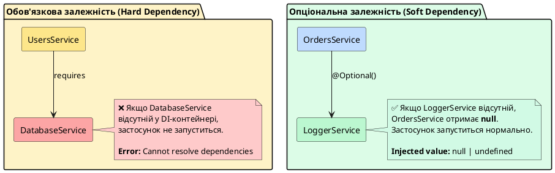

# Опціональні провайдери та декоратор @Optional

## Короткий зміст

- Проблема: залежність може бути відсутня у деяких конфігураціях
- Декоратор `@Optional()`: позначення залежності як необов'язкової
- Перевірка на null/undefined перед використанням
- Значення за замовчуванням для відсутніх залежностей
- Сценарії використання: опціональні інтеграції, плагіни
- Приклад: опціональний logger (якщо модуль не імпортовано)
- Приклад: опціональний cache manager
- Комбінування @Optional та @Inject
- Відмінність від обов'язкових залежностей
- Best practices: документувати опціональні залежності

---

## Проблема: залежність може бути відсутня

У попередніх лекціях ми розглянули фундаментальні механізми ін'єкції залежностей у NestJS: стандартні провайдери, кастомні провайдери через `useValue`, `useClass`, `useFactory`, та використання токенів для ідентифікації залежностей. У всіх цих прикладах ми виходили з припущення, що **кожна залежність, яку запитує сервіс, обов'язково присутня** у DI-контейнері.

Проте у реальних застосунках часто виникають ситуації, коли залежність є **опціональною** (*optional*) — тобто її наявність або відсутність залежить від конфігурації, середовища виконання або підключених модулів. Наприклад:

- **Логування**: у розробці ви можете використовувати детальний консольний логер, а у продакшні — інтеграцію з зовнішнім сервісом моніторингу (Sentry, Datadog). Якщо модуль логування не підключено, застосунок має продовжувати працювати без помилок.
- **Кешування**: у невеликих застосунках або під час тестування кеш може бути відсутнім, і сервіси мають працювати напряму з базою даних.
- **Зовнішні інтеграції**: оплата, відправка SMS, аналітика — ці функції можуть бути вимкнені у тестовому або staging-середовищі.
- **Плагіни та розширення**: у модульній архітектурі певні функції можуть бути надані опціональними модулями, які адміністратор може вмикати або вимикати.

Розглянемо проблемну ситуацію. Припустімо, у вас є сервіс користувачів, який логує операції через `LoggerService`:

```typescript
import { Injectable } from '@nestjs/common';
import { LoggerService } from './logger.service';

@Injectable()
export class UsersService {
  constructor(private readonly logger: LoggerService) {}

  async createUser(userData: any) {
    this.logger.log(`Creating user: ${userData.email}`);
    // Логіка створення користувача
    return { id: 1, ...userData };
  }
}
```

Цей код працює ідеально, **доки** `LoggerService` зареєстрований як провайдер у модулі. Але що станеться, якщо ви запускаєте застосунок у тестовому режимі без модуля логування?

```typescript
@Module({
  providers: [
    UsersService
    // LoggerService відсутній!
  ]
})
export class UsersModule {}
```

NestJS спробує створити екземпляр `UsersService`, побачить залежність `LoggerService` у конструкторі, але не зможе знайти відповідний провайдер у DI-контейнері. Результат — **критична помилка під час запуску застосунку**:

::terminal-preview{title="npm run start:dev" :cursor="false"}

<div class="line"><span class="opacity-40">$</span> <strong class="font-bold">npm run start:dev</strong></div>
<div class="line"></div>
<div class="line"><span class="text-rose-400 font-bold">Error:</span> Nest can't resolve dependencies of the UsersService (?). </div>
<div class="line">Please make sure that the argument <span class="text-yellow-400">LoggerService</span> at index [0] is available</div>
<div class="line">in the <span class="text-blue-400">UsersModule</span> context.</div>
<div class="line"></div>
<div class="line">Hint: This error means that Nest cannot find a provider for <span class="text-yellow-400 font-bold">LoggerService</span>.</div>
<div class="line">Make sure this provider is registered in <span class="text-blue-400 font-bold">UsersModule</span> or imported from another module.</div>
<div class="line"></div>
<div class="line"><span class="text-rose-400 font-bold">Application failed to start.</span></div>

::

Це типова ситуація жорсткої залежності (*hard dependency*): застосунок відмовляється запускатися, якщо будь-яка із залежностей відсутня. У багатьох випадках це правильна поведінка — якщо сервіс користувачів не може працювати без бази даних, краще отримати помилку відразу, ніж дозволити застосунку запуститися у невизначеному стані.

Проте для **другорядних залежностей**, таких як логування або кешування, така поведінка надмірно сувора. Ми хочемо, щоб сервіс міг працювати і без логера, просто пропускаючи виклики логування, якщо логер відсутній.

::card-group

::card{title="🎯 Мета лекції" icon="i-lucide-target"}

- Зрозуміти концепцію опціональних залежностей у системі DI
- Опанувати використання декоратора `@Optional()` для позначення необов'язкових залежностей
- Навчитися безпечно працювати з потенційно відсутніми провайдерами
- Розробити стратегії обробки відсутніх залежностей через значення за замовчуванням
- Застосовувати опціональні залежності для плагінів та інтеграцій
- Комбінувати `@Optional()` з `@Inject()` для токенізованих провайдерів

::

::card{title="🔑 Ключові терміни" icon="i-lucide-key"}

- **Optional Dependency** — необов'язкова залежність, відсутність якої не блокує створення сервісу
- **Hard Dependency** — обов'язкова залежність, без якої сервіс не може функціонувати
- **@Optional()** — декоратор NestJS для позначення параметра конструктора як опціонального
- **Null Safety** — перевірка на `null` або `undefined` перед використанням опціональної залежності
- **Fallback Value** — значення за замовчуванням, яке використовується при відсутності залежності

::

::

---

## Декоратор @Optional(): явне позначення опціональної залежності

NestJS надає спеціальний декоратор **`@Optional()`**, який повідомляє DI-контейнеру, що залежність є необов'язковою. Якщо провайдер з відповідним токеном не знайдено, замість викидання помилки контейнер просто **ін'єктує `null`** або `undefined` (залежно від реалізації).

Синтаксис декоратора надзвичайно простий — достатньо додати `@Optional()` перед параметром конструктора:

```typescript
import { Injectable, Optional } from '@nestjs/common';
import { LoggerService } from './logger.service';

@Injectable()
export class UsersService {
  constructor(
    @Optional() private readonly logger?: LoggerService
  ) {
    if (this.logger) {
      this.logger.log('UsersService initialized with logger');
    } else {
      console.log('UsersService initialized without logger (fallback mode)');
    }
  }

  async createUser(userData: any) {
    // Безпечний виклик: перевірка на існування перед використанням
    this.logger?.log(`Creating user: ${userData.email}`);

    // Основна логіка продовжує працювати незалежно від наявності логера
    return { id: 1, ...userData };
  }

  async deleteUser(userId: number) {
    this.logger?.log(`Deleting user with ID: ${userId}`);
    
    // Логіка видалення
  }
}
```

Зверніть увагу на кілька ключових моментів у цьому коді:

1. **Декоратор `@Optional()`** повідомляє NestJS, що відсутність `LoggerService` не є критичною помилкою
2. **Оператор optional chaining `?.`** забезпечує безпечний виклик методів логера: якщо `this.logger` є `null` або `undefined`, вираз просто поверне `undefined` без викидання помилки
3. **Перевірка у конструкторі** дозволяє зафіксувати режим роботи сервісу — з логером чи без нього
4. **TypeScript optional parameter `?`** у сигнатурі `logger?: LoggerService` відображає, що це поле може бути `undefined`

Тепер застосунок успішно запуститься, навіть якщо `LoggerService` відсутній у модулі:

::terminal-preview{title="npm run start:dev" :cursor="false"}

<div class="line"><span class="opacity-40">$</span> <strong class="font-bold">npm run start:dev</strong></div>
<div class="line"></div>
<div class="line"><span class="text-blue-400 font-bold">INFO</span> [NestFactory] Starting Nest application...</div>
<div class="line"><span class="text-blue-400 font-bold">INFO</span> [InstanceLoader] UsersModule dependencies initialized</div>
<div class="line"><span class="text-yellow-400">LOG</span> UsersService initialized without logger <span class="opacity-60">(fallback mode)</span></div>
<div class="line"><span class="text-green-400 font-bold">SUCCESS</span> Application is running on: <span class="text-blue-400 font-bold">http://localhost:3000</span></div>

::

---

## Перевірка на null/undefined: паттерни безпечного використання

Позначення залежності як опціональної через `@Optional()` — це лише перший крок. Важливо розуміти, що тепер **ви несете відповідальність** за перевірку наявності залежності перед її використанням. У TypeScript існує кілька паттернів для безпечної роботи з потенційно відсутніми значеннями.


### Паттерн 1: Optional Chaining (`?.`)

Optional chaining — найелегантніший та найбільш рекомендований спосіб роботи з опціональними залежностями у TypeScript. Оператор `?.` автоматично перевіряє, чи не є значення `null` або `undefined`, перед доступом до властивості або викликом методу:

```typescript
import { Injectable, Optional } from '@nestjs/common';
import { LoggerService } from './logger.service';

@Injectable()
export class OrdersService {
  constructor(@Optional() private readonly logger?: LoggerService) {}

  async createOrder(orderData: any) {
    // Лаконічний та безпечний виклик
    this.logger?.log(`Creating order for user ${orderData.userId}`);
    
    // Основна бізнес-логіка
    const order = { id: Date.now(), ...orderData, status: 'pending' };
    
    this.logger?.log(`Order created with ID: ${order.id}`);
    return order;
  }

  async cancelOrder(orderId: number) {
    // Опціональний виклик методу з параметрами
    this.logger?.warn(`Cancelling order ${orderId}`);
    
    // Логіка скасування
  }
}
```

Якщо `this.logger` є `null` або `undefined`, вираз `this.logger?.log(...)` просто поверне `undefined` без викидання помилки. Це дозволяє коду продовжувати виконання незалежно від наявності логера.

::tip
Optional chaining (`?.`) — ідіоматичний спосіб роботи з опціональними залежностями у сучасному TypeScript. Використовуйте його для всіх викликів методів опціональних провайдерів.
::

### Паттерн 2: Явна перевірка через `if`

У випадках, коли ви хочете виконати складну логіку тільки при наявності залежності, використовуйте явну умовну конструкцію:

```typescript
import { Injectable, Optional } from '@nestjs/common';
import { CacheManager } from './cache.manager';

@Injectable()
export class ProductsService {
  constructor(@Optional() private readonly cache?: CacheManager) {}

  async getProduct(productId: number) {
    // Спочатку перевіряємо кеш (якщо він доступний)
    if (this.cache) {
      const cached = await this.cache.get(`product:${productId}`);
      if (cached) {
        console.log(`Cache hit for product ${productId}`);
        return cached;
      }
    }

    // Якщо кешу немає або дані відсутні — йдемо в БД
    console.log(`Cache miss or unavailable, fetching from DB`);
    const product = await this.fetchFromDatabase(productId);

    // Зберігаємо у кеш (якщо він доступний)
    if (this.cache) {
      await this.cache.set(`product:${productId}`, product, { ttl: 3600 });
    }

    return product;
  }

  private async fetchFromDatabase(id: number) {
    // Симуляція запиту до БД
    return { id, name: `Product ${id}`, price: 99.99 };
  }
}
```

Цей підхід дозволяє створити **graceful degradation** (*плавну деградацію функціональності*): якщо кеш недоступний, сервіс продовжує працювати, просто пропускаючи етап кешування.

### Паттерн 3: Nullish Coalescing (`??`) для значень за замовчуванням

Оператор nullish coalescing `??` дозволяє надати значення за замовчуванням, якщо змінна є `null` або `undefined`:

```typescript
import { Injectable, Optional } from '@nestjs/common';
import { MetricsCollector } from './metrics.collector';

@Injectable()
export class ApiService {
  private readonly metrics: MetricsCollector | null;

  constructor(@Optional() metricsCollector?: MetricsCollector) {
    this.metrics = metricsCollector ?? null;
    
    // Альтернатива: можна створити заглушку (no-op stub)
    // this.metrics = metricsCollector ?? new NoOpMetricsCollector();
  }

  async handleRequest(endpoint: string) {
    const startTime = Date.now();

    try {
      // Виконання запиту
      const result = await this.processRequest(endpoint);
      
      // Збір метрик (якщо доступно)
      this.metrics?.recordSuccess(endpoint, Date.now() - startTime);
      
      return result;
    } catch (error) {
      this.metrics?.recordError(endpoint, error.message);
      throw error;
    }
  }

  private async processRequest(endpoint: string) {
    // Логіка обробки запиту
    return { data: `Response from ${endpoint}` };
  }
}
```

### Паттерн 4: No-Op Stub (заглушка без операцій)

Іноді зручніше створити об'єкт-заглушку (*stub*), який має той самий інтерфейс, що й реальний провайдер, але не виконує жодних дій:

```typescript
// stubs/no-op-logger.stub.ts
export class NoOpLogger {
  log(message: string): void {
    // Нічого не робимо
  }

  error(message: string, trace?: string): void {
    // Нічого не робимо
  }

  warn(message: string): void {
    // Нічого не робимо
  }
}

// services/users.service.ts
import { Injectable, Optional } from '@nestjs/common';
import { LoggerService } from './logger.service';
import { NoOpLogger } from './stubs/no-op-logger.stub';

@Injectable()
export class UsersService {
  private readonly logger: LoggerService | NoOpLogger;

  constructor(@Optional() logger?: LoggerService) {
    // Завжди маємо об'єкт з методами логування
    this.logger = logger ?? new NoOpLogger();
  }

  async createUser(userData: any) {
    // Тепер можна викликати без перевірки
    this.logger.log(`Creating user: ${userData.email}`);
    
    return { id: 1, ...userData };
  }
}
```

Перевага цього підходу — **відсутність необхідності перевіряти наявність логера** у кожному місці використання. Викликаючий код просто використовує `this.logger.log(...)`, а якщо логер відсутній, заглушка ігнорує виклик.

::note
Паттерн No-Op Stub особливо корисний, коли опціональна залежність використовується у багатьох місцях коду. Замість розміщення перевірок `if (this.logger)` у кожному методі, ви створюєте заглушку один раз у конструкторі.
::

---

## Значення за замовчуванням: ініціалізація у конструкторі

Альтернативний підхід до обробки відсутніх залежностей — **надання значень за замовчуванням** (*default values*) безпосередньо у конструкторі або через ініціалізацію полів класу. Це дозволяє гарантувати, що поле завжди матиме якесь значення, навіть якщо провайдер не знайдено.

### Приклад: конфігурація за замовчуванням

```typescript
import { Injectable, Optional, Inject } from '@nestjs/common';

interface AppConfig {
  apiUrl: string;
  timeout: number;
  retryAttempts: number;
}

const DEFAULT_CONFIG: AppConfig = {
  apiUrl: 'http://localhost:3000',
  timeout: 5000,
  retryAttempts: 3
};

@Injectable()
export class ApiClientService {
  private readonly config: AppConfig;

  constructor(
    @Optional()
    @Inject('APP_CONFIG')
    providedConfig?: AppConfig
  ) {
    // Якщо конфігурація не надана — використовуємо значення за замовчуванням
    this.config = providedConfig ?? DEFAULT_CONFIG;
    
    console.log(`API Client initialized with URL: ${this.config.apiUrl}`);
  }

  async fetchData(endpoint: string) {
    const controller = new AbortController();
    const timeoutId = setTimeout(
      () => controller.abort(),
      this.config.timeout
    );

    try {
      const response = await fetch(`${this.config.apiUrl}${endpoint}`, {
        signal: controller.signal
      });
      clearTimeout(timeoutId);
      return response.json();
    } catch (error) {
      console.error(`API request failed: ${error.message}`);
      throw error;
    }
  }
}
```

У цьому прикладі:

1. Якщо провайдер з токеном `'APP_CONFIG'` зареєстровано — використовується надана конфігурація
2. Якщо провайдер відсутній — сервіс працює з розумними значеннями за замовчуванням
3. Поле `this.config` завжди має коректний тип `AppConfig`, що забезпечує типобезпеку

### Приклад: часткове злиття конфігурацій

Можна комбінувати надану конфігурацію зі значеннями за замовчуванням через оператор spread:

```typescript
import { Injectable, Optional, Inject } from '@nestjs/common';

interface DatabaseOptions {
  host: string;
  port: number;
  username: string;
  password: string;
  poolSize?: number;
  connectionTimeout?: number;
}

const DEFAULT_DB_OPTIONS: Partial<DatabaseOptions> = {
  host: 'localhost',
  port: 5432,
  username: 'postgres',
  password: '',
  poolSize: 10,
  connectionTimeout: 5000
};

@Injectable()
export class DatabaseService {
  private readonly options: DatabaseOptions;

  constructor(
    @Optional()
    @Inject('DB_OPTIONS')
    providedOptions?: Partial<DatabaseOptions>
  ) {
    // Злиття: надані опції перевизначають значення за замовчуванням
    this.options = {
      ...DEFAULT_DB_OPTIONS,
      ...providedOptions
    } as DatabaseOptions;

    console.log(
      `Database configured: ${this.options.username}@${this.options.host}:${this.options.port}`
    );
  }

  async connect() {
    console.log(`Connecting with pool size: ${this.options.poolSize}`);
    // Логіка підключення
  }
}
```

Тепер адміністратор може надати лише частину конфігурації, а решта заповниться значеннями за замовчуванням:

```typescript
// app.module.ts
@Module({
  providers: [
    DatabaseService,
    {
      provide: 'DB_OPTIONS',
      useValue: {
        host: 'prod-db.example.com',
        password: process.env.DB_PASSWORD
        // port, username, poolSize використають значення за замовчуванням
      }
    }
  ]
})
export class AppModule {}
```

::tip
Використовуйте часткове злиття конфігурацій для надання гнучкості: розробники можуть перевизначати лише ті параметри, які відрізняються від стандартних, не дублюючи всю конфігурацію.
::

---

## Сценарії використання: коли опціональні залежності доречні

Опціональні залежності є потужним інструментом, але їх слід використовувати обережно. Розглянемо типові сценарії, де вони справді необхідні, та ситуації, коли краще залишити залежність обов'язковою.

### ✅ Сценарій 1: Опціональне логування та моніторинг

**Проблема**: У розробці ви хочете бачити детальні логи у консолі, а у продакшні — відправляти їх у централізовану систему моніторингу (Sentry, Datadog). Під час тестування логування взагалі не потрібне.

**Рішення**: Зробити залежність від логера опціональною:

```typescript
import { Injectable, Optional } from '@nestjs/common';
import { Logger } from './logger.interface';

@Injectable()
export class PaymentService {
  constructor(@Optional() private readonly logger?: Logger) {}

  async processPayment(amount: number, userId: number) {
    this.logger?.log(`Processing payment: ${amount} for user ${userId}`);

    try {
      // Логіка обробки платежу
      const transactionId = await this.chargeCard(amount);
      
      this.logger?.log(`Payment successful: transaction ${transactionId}`);
      return { success: true, transactionId };
    } catch (error) {
      this.logger?.error(`Payment failed: ${error.message}`, error.stack);
      throw error;
    }
  }

  private async chargeCard(amount: number): Promise<string> {
    // Симуляція API платіжної системи
    return `txn_${Date.now()}`;
  }
}
```

### ✅ Сценарій 2: Опціональне кешування

**Проблема**: У продакшні ви використовуєте Redis для кешування, але у розробці хочете обходитися без нього для простоти налаштування.

**Рішення**: Кеш-менеджер як опціональна залежність:

```typescript
import { Injectable, Optional } from '@nestjs/common';
import { CacheManager } from '@nestjs/cache-manager';

@Injectable()
export class UsersRepository {
  constructor(@Optional() private readonly cache?: CacheManager) {}

  async findById(userId: number) {
    // Спроба отримати з кешу
    if (this.cache) {
      const cached = await this.cache.get(`user:${userId}`);
      if (cached) {
        console.log('Cache HIT');
        return cached;
      }
    }

    // Запит до БД
    console.log('Cache MISS or disabled, querying database');
    const user = await this.queryDatabase(userId);

    // Збереження у кеш (якщо доступний)
    if (this.cache) {
      await this.cache.set(`user:${userId}`, user, 3600);
    }

    return user;
  }

  private async queryDatabase(id: number) {
    // Симуляція запиту до БД
    return { id, name: `User ${id}`, email: `user${id}@example.com` };
  }
}
```

### ✅ Сценарій 3: Плагіни та розширення

**Проблема**: Ваш застосунок підтримує опціональні плагіни (наприклад, інтеграцію з аналітикою, системами оплати, повідомленнями).

**Рішення**: Кожен плагін — опціональна залежність:

```typescript
import { Injectable, Optional } from '@nestjs/common';
import { AnalyticsService } from './analytics.service';
import { NotificationService } from './notification.service';

@Injectable()
export class OrderCompletionHandler {
  constructor(
    @Optional() private readonly analytics?: AnalyticsService,
    @Optional() private readonly notifications?: NotificationService
  ) {}

  async handleOrderCompleted(orderId: number, userId: number) {
    console.log(`Order ${orderId} completed for user ${userId}`);

    // Відправка аналітики (якщо модуль підключено)
    this.analytics?.trackEvent('order_completed', {
      orderId,
      userId,
      timestamp: Date.now()
    });

    // Відправка повідомлення (якщо модуль підключено)
    await this.notifications?.sendEmail(
      userId,
      'Order Completed',
      `Your order #${orderId} has been successfully completed.`
    );

    // Основна логіка виконується завжди
    await this.updateOrderStatus(orderId, 'completed');
  }

  private async updateOrderStatus(orderId: number, status: string) {
    console.log(`Updating order ${orderId} to status: ${status}`);
  }
}
```

### ❌ Коли НЕ використовувати опціональні залежності

**1. Критичні інфраструктурні залежності**

Підключення до бази даних, системи черг, файлового сховища — ці залежності **мають бути обов'язковими**. Якщо вони відсутні, застосунок не може виконувати свої основні функції:

```typescript
// ❌ НЕПРАВИЛЬНО: база даних не може бути опціональною
constructor(@Optional() private readonly db?: DataSource) {}

// ✅ ПРАВИЛЬНО: база даних — критична залежність
constructor(private readonly db: DataSource) {}
```

**2. Бізнес-логіка залежить від провайдера**

Якщо сервіс не може виконати свою основну роботу без залежності, вона має бути обов'язковою:

```typescript
// ❌ НЕПРАВИЛЬНО: сервіс оплати не може працювати без платіжного шлюзу
@Injectable()
export class PaymentService {
  constructor(@Optional() private readonly gateway?: PaymentGateway) {}
  
  async charge(amount: number) {
    // Що робити, якщо gateway відсутній?
    return this.gateway?.charge(amount);
  }
}

// ✅ ПРАВИЛЬНО: платіжний шлюз — обов'язкова залежність
@Injectable()
export class PaymentService {
  constructor(private readonly gateway: PaymentGateway) {}
  
  async charge(amount: number) {
    return this.gateway.charge(amount);
  }
}
```

::warning
Використовуйте опціональні залежності лише для **другорядної функціональності**: логування, кешування, аналітика, повідомлення. Критичні компоненти, без яких застосунок не може функціонувати, мають бути обов'язковими залежностями.
::


---

## Комбінування @Optional та @Inject: токенізовані опціональні залежності

У попередній лекції ми розглянули використання токенів (рядкових та символьних) для ідентифікації провайдерів, які не є класами. Опціональні залежності чудово комбінуються з токенами через одночасне застосування декораторів `@Optional()` та `@Inject()`.

### Синтаксис: порядок декораторів має значення

При комбінуванні декораторів **порядок їх застосування важливий**. Загальне правило: `@Inject()` завжди йде першим (найближче до параметра), а `@Optional()` — перед ним:

```typescript
import { Injectable, Optional, Inject } from '@nestjs/common';

@Injectable()
export class ExampleService {
  constructor(
    @Optional()                    // Позначаємо як опціональне
    @Inject('SOME_TOKEN')          // Вказуємо токен
    private readonly dependency?: any
  ) {}
}
```

Ця послідовність відображає логіку обробки: спочатку NestJS визначає **який саме провайдер** запитується (`@Inject`), а потім дізнається, що його відсутність **не є критичною** (`@Optional`).

### Приклад: опціональна конфігурація через Symbol-токен

```typescript
// config/config.tokens.ts
export const CONFIG_TOKENS = {
  ANALYTICS: Symbol('AnalyticsConfig'),
  FEATURE_FLAGS: Symbol('FeatureFlags'),
  RATE_LIMITS: Symbol('RateLimits')
} as const;

// config/analytics.config.ts
export interface AnalyticsConfig {
  enabled: boolean;
  trackingId: string;
  sampleRate: number;
}

// services/analytics-tracker.service.ts
import { Injectable, Optional, Inject } from '@nestjs/common';
import { CONFIG_TOKENS } from '../config/config.tokens';
import { AnalyticsConfig } from '../config/analytics.config';

@Injectable()
export class AnalyticsTracker {
  private readonly config: AnalyticsConfig | null;

  constructor(
    @Optional()
    @Inject(CONFIG_TOKENS.ANALYTICS)
    analyticsConfig?: AnalyticsConfig
  ) {
    this.config = analyticsConfig ?? null;

    if (this.config?.enabled) {
      console.log(`Analytics enabled with tracking ID: ${this.config.trackingId}`);
    } else {
      console.log('Analytics disabled or not configured');
    }
  }

  trackEvent(eventName: string, properties?: Record<string, any>): void {
    if (!this.config?.enabled) {
      // Аналітика вимкнена — нічого не робимо
      return;
    }

    // Перевірка sample rate (відправляємо не всі події)
    if (Math.random() > this.config.sampleRate) {
      return;
    }

    console.log(`[Analytics] Event: ${eventName}`, properties);
    // Реальна відправка даних у аналітичну систему
  }

  trackPageView(url: string): void {
    if (!this.config?.enabled) return;

    console.log(`[Analytics] Page view: ${url}`);
  }
}
```

Тепер модуль може надати конфігурацію аналітики або не надавати — сервіс працюватиме в обох випадках:

```typescript
// app.module.ts (з аналітикою)
import { Module } from '@nestjs/common';
import { CONFIG_TOKENS } from './config/config.tokens';
import { AnalyticsTracker } from './services/analytics-tracker.service';

@Module({
  providers: [
    AnalyticsTracker,
    {
      provide: CONFIG_TOKENS.ANALYTICS,
      useValue: {
        enabled: true,
        trackingId: 'UA-123456789-1',
        sampleRate: 0.1  // Відправляємо 10% подій
      }
    }
  ]
})
export class AppModule {}
```

```typescript
// test.module.ts (без аналітики)
import { Module } from '@nestjs/common';
import { AnalyticsTracker } from './services/analytics-tracker.service';

@Module({
  providers: [
    AnalyticsTracker
    // Провайдер CONFIG_TOKENS.ANALYTICS відсутній
  ]
})
export class TestModule {}
```

### Приклад: опціональне підключення до Redis

```typescript
// constants/injection-tokens.ts
export const REDIS_CLIENT_TOKEN = Symbol('RedisClient');

// cache/redis-cache.service.ts
import { Injectable, Optional, Inject } from '@nestjs/common';
import { RedisClientType } from 'redis';
import { REDIS_CLIENT_TOKEN } from '../constants/injection-tokens';

@Injectable()
export class RedisCacheService {
  constructor(
    @Optional()
    @Inject(REDIS_CLIENT_TOKEN)
    private readonly redis?: RedisClientType
  ) {
    if (this.redis) {
      console.log('✓ Redis cache service initialized with connection');
    } else {
      console.log('⚠ Redis cache service running in no-op mode (no connection)');
    }
  }

  async get(key: string): Promise<string | null> {
    if (!this.redis) {
      console.log('Cache disabled: returning null');
      return null;
    }

    try {
      return await this.redis.get(key);
    } catch (error) {
      console.error(`Redis GET error:`, error);
      return null;
    }
  }

  async set(key: string, value: string, ttlSeconds?: number): Promise<void> {
    if (!this.redis) {
      console.log('Cache disabled: skipping SET');
      return;
    }

    try {
      if (ttlSeconds) {
        await this.redis.setEx(key, ttlSeconds, value);
      } else {
        await this.redis.set(key, value);
      }
    } catch (error) {
      console.error(`Redis SET error:`, error);
    }
  }

  async delete(key: string): Promise<void> {
    if (!this.redis) return;

    try {
      await this.redis.del(key);
    } catch (error) {
      console.error(`Redis DELETE error:`, error);
    }
  }
}
```

Модуль може надати підключення до Redis або залишити його опціональним:

```typescript
// redis.module.ts
import { Module } from '@nestjs/common';
import { createClient } from 'redis';
import { REDIS_CLIENT_TOKEN } from '../constants/injection-tokens';
import { RedisCacheService } from './redis-cache.service';

@Module({
  providers: [
    {
      provide: REDIS_CLIENT_TOKEN,
      useFactory: async () => {
        // Якщо змінна оточення не встановлена — не створюємо клієнт
        if (!process.env.REDIS_URL) {
          console.log('REDIS_URL not set, skipping Redis connection');
          return undefined;  // Поверне undefined — спрацює @Optional
        }

        const client = createClient({ url: process.env.REDIS_URL });
        await client.connect();
        console.log('✓ Redis client connected');
        return client;
      }
    },
    RedisCacheService
  ],
  exports: [RedisCacheService]
})
export class RedisModule {}
```

::note
Комбінація `@Optional()` та `@Inject()` особливо корисна для **умовного підключення інфраструктурних сервісів**. Наприклад, Redis може бути недоступний у локальному оточенні розробника, але обов'язковий у продакшні — опціональна залежність дозволяє застосунку запуститися в обох випадках.
::

---

## Діаграма: обов'язкові vs опціональні залежності

Розглянемо візуальну різницю між обов'язковими та опціональними залежностями у контексті створення екземплярів сервісів:

::plant-uml{alt="Поведінка DI-контейнера при відсутності залежностей"}



::

### Таблиця порівняння

| Характеристика | Обов'язкова залежність | Опціональна залежність |
|----------------|------------------------|------------------------|
| **Декоратор** | Без додаткових декораторів | `@Optional()` |
| **Поведінка при відсутності** | ❌ Помилка під час запуску застосунку | ✅ Ін'єкція `null` або `undefined` |
| **Типізація параметра** | `dependency: SomeService` | `dependency?: SomeService` |
| **Перевірка перед використанням** | Не потрібна | **Обов'язкова**: `if (this.dependency)` або `?.` |
| **Сценарії використання** | Критичні компоненти (БД, конфігурація) | Другорядні функції (логування, кеш) |
| **Відповідальність за null** | DI-контейнер гарантує наявність | Розробник перевіряє перед використанням |

---

## Практичний приклад: система повідомлень з опціональними каналами

Розглянемо комплексний приклад застосунку електронної комерції, де система повідомлень підтримує кілька каналів доставки (email, SMS, push-notifications), але кожен канал є опціональним і може бути вимкнений у конфігурації.

### Крок 1: Визначення інтерфейсів каналів

```typescript
// notifications/interfaces/notification-channel.interface.ts
export interface NotificationChannel {
  send(recipient: string, message: string): Promise<boolean>;
  isAvailable(): boolean;
}

// notifications/channels/email-channel.service.ts
import { Injectable } from '@nestjs/common';
import { NotificationChannel } from '../interfaces/notification-channel.interface';

@Injectable()
export class EmailChannel implements NotificationChannel {
  async send(recipient: string, message: string): Promise<boolean> {
    console.log(`📧 Sending email to ${recipient}: ${message}`);
    // Реальна логіка відправки через SMTP або сервіс (SendGrid, AWS SES)
    return true;
  }

  isAvailable(): boolean {
    return true;
  }
}

// notifications/channels/sms-channel.service.ts
import { Injectable } from '@nestjs/common';
import { NotificationChannel } from '../interfaces/notification-channel.interface';

@Injectable()
export class SmsChannel implements NotificationChannel {
  async send(recipient: string, message: string): Promise<boolean> {
    console.log(`📱 Sending SMS to ${recipient}: ${message}`);
    // Реальна логіка через Twilio, AWS SNS тощо
    return true;
  }

  isAvailable(): boolean {
    return !!process.env.SMS_API_KEY;
  }
}

// notifications/channels/push-channel.service.ts
import { Injectable } from '@nestjs/common';
import { NotificationChannel } from '../interfaces/notification-channel.interface';

@Injectable()
export class PushChannel implements NotificationChannel {
  async send(recipient: string, message: string): Promise<boolean> {
    console.log(`🔔 Sending push notification to ${recipient}: ${message}`);
    // Реальна логіка через Firebase Cloud Messaging, OneSignal тощо
    return true;
  }

  isAvailable(): boolean {
    return !!process.env.PUSH_SERVICE_KEY;
  }
}
```

### Крок 2: Сервіс повідомлень з опціональними каналами

```typescript
// notifications/notification.service.ts
import { Injectable, Optional } from '@nestjs/common';
import { EmailChannel } from './channels/email-channel.service';
import { SmsChannel } from './channels/sms-channel.service';
import { PushChannel } from './channels/push-channel.service';

@Injectable()
export class NotificationService {
  private readonly availableChannels: string[] = [];

  constructor(
    @Optional() private readonly emailChannel?: EmailChannel,
    @Optional() private readonly smsChannel?: SmsChannel,
    @Optional() private readonly pushChannel?: PushChannel
  ) {
    // Визначаємо доступні канали при ініціалізації
    if (this.emailChannel?.isAvailable()) {
      this.availableChannels.push('email');
    }
    if (this.smsChannel?.isAvailable()) {
      this.availableChannels.push('sms');
    }
    if (this.pushChannel?.isAvailable()) {
      this.availableChannels.push('push');
    }

    console.log(`Notification service initialized with channels: ${this.availableChannels.join(', ')}`);
  }

  /**
   * Відправити повідомлення через всі доступні канали
   */
  async sendToAll(recipient: string, message: string): Promise<void> {
    const results: Array<{ channel: string; success: boolean }> = [];

    if (this.emailChannel) {
      try {
        const success = await this.emailChannel.send(recipient, message);
        results.push({ channel: 'email', success });
      } catch (error) {
        console.error('Email sending failed:', error);
        results.push({ channel: 'email', success: false });
      }
    }

    if (this.smsChannel) {
      try {
        const success = await this.smsChannel.send(recipient, message);
        results.push({ channel: 'sms', success });
      } catch (error) {
        console.error('SMS sending failed:', error);
        results.push({ channel: 'sms', success: false });
      }
    }

    if (this.pushChannel) {
      try {
        const success = await this.pushChannel.send(recipient, message);
        results.push({ channel: 'push', success });
      } catch (error) {
        console.error('Push notification failed:', error);
        results.push({ channel: 'push', success: false });
      }
    }

    console.log('Notification results:', results);
  }

  /**
   * Відправити повідомлення через конкретний канал
   */
  async sendViaChannel(
    channel: 'email' | 'sms' | 'push',
    recipient: string,
    message: string
  ): Promise<boolean> {
    switch (channel) {
      case 'email':
        if (!this.emailChannel) {
          console.warn('Email channel not available');
          return false;
        }
        return this.emailChannel.send(recipient, message);

      case 'sms':
        if (!this.smsChannel) {
          console.warn('SMS channel not available');
          return false;
        }
        return this.smsChannel.send(recipient, message);

      case 'push':
        if (!this.pushChannel) {
          console.warn('Push channel not available');
          return false;
        }
        return this.pushChannel.send(recipient, message);

      default:
        throw new Error(`Unknown channel: ${channel}`);
    }
  }

  /**
   * Перевірка доступності каналу
   */
  isChannelAvailable(channel: 'email' | 'sms' | 'push'): boolean {
    return this.availableChannels.includes(channel);
  }

  /**
   * Отримати список доступних каналів
   */
  getAvailableChannels(): string[] {
    return [...this.availableChannels];
  }
}
```

### Крок 3: Конфігурація модуля

```typescript
// notifications/notification.module.ts
import { Module } from '@nestjs/common';
import { NotificationService } from './notification.service';
import { EmailChannel } from './channels/email-channel.service';
import { SmsChannel } from './channels/sms-channel.service';
import { PushChannel } from './channels/push-channel.service';

@Module({
  providers: [
    NotificationService,
    
    // Умовна реєстрація каналів на основі змінних оточення
    ...(process.env.EMAIL_ENABLED === 'true' ? [EmailChannel] : []),
    ...(process.env.SMS_ENABLED === 'true' ? [SmsChannel] : []),
    ...(process.env.PUSH_ENABLED === 'true' ? [PushChannel] : [])
  ],
  exports: [NotificationService]
})
export class NotificationModule {}
```

### Крок 4: Використання у бізнес-логіці

```typescript
// orders/orders.service.ts
import { Injectable } from '@nestjs/common';
import { NotificationService } from '../notifications/notification.service';

@Injectable()
export class OrdersService {
  constructor(private readonly notifications: NotificationService) {
    console.log(
      `Orders service initialized. Available notification channels: ${this.notifications.getAvailableChannels().join(', ')}`
    );
  }

  async createOrder(userId: string, items: any[]) {
    // Створення замовлення
    const order = {
      id: Date.now(),
      userId,
      items,
      status: 'pending',
      createdAt: new Date()
    };

    console.log(`Order created: ${order.id}`);

    // Відправка повідомлення через всі доступні канали
    await this.notifications.sendToAll(
      userId,
      `Your order #${order.id} has been successfully created!`
    );

    return order;
  }

  async shipOrder(orderId: number, trackingNumber: string) {
    console.log(`Shipping order ${orderId} with tracking: ${trackingNumber}`);

    // Спроба відправити SMS (якщо канал доступний)
    if (this.notifications.isChannelAvailable('sms')) {
      await this.notifications.sendViaChannel(
        'sms',
        'user-phone',
        `Your order #${orderId} has been shipped. Tracking: ${trackingNumber}`
      );
    } else {
      // Fallback на email
      if (this.notifications.isChannelAvailable('email')) {
        await this.notifications.sendViaChannel(
          'email',
          'user@example.com',
          `Your order #${orderId} has been shipped. Tracking: ${trackingNumber}`
        );
      }
    }
  }
}
```

### Результати виконання у різних конфігураціях

**Конфігурація 1: Всі канали увімкнені**

::terminal-preview{title="npm run start:dev" :cursor="false"}

<div class="line"><span class="opacity-40">$</span> <strong class="font-bold">EMAIL_ENABLED=true SMS_ENABLED=true PUSH_ENABLED=true npm run start:dev</strong></div>
<div class="line"></div>
<div class="line"><span class="text-blue-400 font-bold">INFO</span> Notification service initialized with channels: <span class="text-green-400">email, sms, push</span></div>
<div class="line"><span class="text-blue-400 font-bold">INFO</span> Orders service initialized. Available notification channels: <span class="text-green-400">email, sms, push</span></div>
<div class="line"></div>
<div class="line">📧 Sending email to user123: Your order #1709845200000 has been successfully created!</div>
<div class="line">📱 Sending SMS to user123: Your order #1709845200000 has been successfully created!</div>
<div class="line">🔔 Sending push notification to user123: Your order #1709845200000 has been successfully created!</div>

::

**Конфігурація 2: Тільки email**

::terminal-preview{title="npm run start:dev" :cursor="false"}

<div class="line"><span class="opacity-40">$</span> <strong class="font-bold">EMAIL_ENABLED=true npm run start:dev</strong></div>
<div class="line"></div>
<div class="line"><span class="text-blue-400 font-bold">INFO</span> Notification service initialized with channels: <span class="text-green-400">email</span></div>
<div class="line"><span class="text-blue-400 font-bold">INFO</span> Orders service initialized. Available notification channels: <span class="text-green-400">email</span></div>
<div class="line"></div>
<div class="line">📧 Sending email to user123: Your order #1709845200000 has been successfully created!</div>
<div class="line"><span class="text-yellow-400">WARN</span> SMS channel not available</div>
<div class="line"><span class="text-yellow-400">WARN</span> Push channel not available</div>

::

**Конфігурація 3: Жодного каналу**

::terminal-preview{title="npm run start:dev" :cursor="false"}

<div class="line"><span class="opacity-40">$</span> <strong class="font-bold">npm run start:dev</strong></div>
<div class="line"></div>
<div class="line"><span class="text-yellow-400 font-bold">WARN</span> Notification service initialized with channels: <span class="text-gray-400 opacity-60">(none)</span></div>
<div class="line"><span class="text-blue-400 font-bold">INFO</span> Orders service initialized. Available notification channels: <span class="text-gray-400 opacity-60">(none)</span></div>
<div class="line"></div>
<div class="line"><span class="text-yellow-400">WARN</span> No notification channels available, messages will be skipped</div>

::

::tip
Цей патерн особливо корисний для **модульних систем**, де різні розгортання (staging, production, development) мають різні набори підключених функцій. Опціональні залежності дозволяють одному і тому ж коду працювати у всіх середовищах без жорстко закодованих умов.
::


---

## Best Practices: документування та проєктування опціональних залежностей

Опціональні залежності вносять додаткову складність у код — вони вимагають перевірок, обробки відсутності та чітких правил поведінки. Дотримання best practices допоможе зробити ваш код більш передбачуваним та підтримуваним.

### 1. Документуйте поведінку при відсутності залежності

Кожна опціональна залежність має супроводжуватися документацією, що пояснює:
- Що станеться, якщо залежність відсутня
- Чи є альтернативна поведінка (fallback)
- Які функції будуть недоступні

```typescript
import { Injectable, Optional } from '@nestjs/common';
import { CacheManager } from './cache.manager';

/**
 * Сервіс роботи з товарами.
 * 
 * @remarks
 * Цей сервіс підтримує опціональне кешування через CacheManager.
 * Якщо кеш недоступний, сервіс працюватиме з прямим доступом до БД,
 * що може призвести до зниження продуктивності при великому навантаженні.
 * 
 * @example
 * // З кешуванням (продакшн)
 * providers: [ProductsService, CacheManager]
 * 
 * @example
 * // Без кешування (розробка/тести)
 * providers: [ProductsService]
 */
@Injectable()
export class ProductsService {
  /**
   * @param cache - Опціональний менеджер кешу.
   *   Якщо не надано, всі запити йтимуть напряму в БД.
   */
  constructor(
    @Optional() private readonly cache?: CacheManager
  ) {}

  // ...
}
```

### 2. Використовуйте єдиний стиль перевірки

Обирайте єдиний патерн для всього проєкту: або optional chaining (`?.`), або явні перевірки `if`, або no-op stubs. Змішування стилів погіршує читабельність:

```typescript
// ❌ ПОГАНО: різні стилі перевірки
class BadExample {
  constructor(
    @Optional() private logger?: Logger,
    @Optional() private cache?: CacheManager
  ) {}

  method1() {
    // Optional chaining
    this.logger?.log('Message');
  }

  method2() {
    // Явна перевірка
    if (this.cache) {
      this.cache.set('key', 'value');
    }
  }
}

// ✅ ДОБРЕ: єдиний стиль (optional chaining)
class GoodExample {
  constructor(
    @Optional() private logger?: Logger,
    @Optional() private cache?: CacheManager
  ) {}

  method1() {
    this.logger?.log('Message');
  }

  method2() {
    this.cache?.set('key', 'value');
  }
}
```

### 3. Надавайте значення за замовчуванням там, де це доречно

Для конфігураційних об'єктів краще надати розумні значення за замовчуванням, ніж залишати `null`:

```typescript
import { Injectable, Optional, Inject } from '@nestjs/common';

interface RateLimitConfig {
  maxRequests: number;
  windowMs: number;
  message: string;
}

const DEFAULT_RATE_LIMIT: RateLimitConfig = {
  maxRequests: 100,
  windowMs: 60000,  // 1 хвилина
  message: 'Too many requests, please try again later.'
};

@Injectable()
export class RateLimiter {
  private readonly config: RateLimitConfig;

  constructor(
    @Optional()
    @Inject('RATE_LIMIT_CONFIG')
    providedConfig?: Partial<RateLimitConfig>
  ) {
    // Злиття з значеннями за замовчуванням
    this.config = { ...DEFAULT_RATE_LIMIT, ...providedConfig };
  }

  isAllowed(clientId: string): boolean {
    // Логіка перевірки ліміту на основі this.config
    return true;
  }
}
```

### 4. Логуйте факт відсутності залежності

При ініціалізації сервісу з опціональними залежностями корисно логувати інформацію про те, які залежності були знайдені, а які ні:

```typescript
import { Injectable, Optional } from '@nestjs/common';
import { Logger } from '@nestjs/common';

@Injectable()
export class ReportGenerator {
  private readonly logger = new Logger(ReportGenerator.name);

  constructor(
    @Optional() private readonly pdfService?: PdfService,
    @Optional() private readonly excelService?: ExcelService,
    @Optional() private readonly csvService?: CsvService
  ) {
    const available: string[] = [];
    const unavailable: string[] = [];

    if (this.pdfService) available.push('PDF');
    else unavailable.push('PDF');

    if (this.excelService) available.push('Excel');
    else unavailable.push('Excel');

    if (this.csvService) available.push('CSV');
    else unavailable.push('CSV');

    this.logger.log(`Report formats available: ${available.join(', ')}`);
    if (unavailable.length > 0) {
      this.logger.warn(`Report formats unavailable: ${unavailable.join(', ')}`);
    }
  }

  async generateReport(format: 'pdf' | 'excel' | 'csv', data: any) {
    switch (format) {
      case 'pdf':
        if (!this.pdfService) {
          throw new Error('PDF generation not available');
        }
        return this.pdfService.generate(data);

      case 'excel':
        if (!this.excelService) {
          throw new Error('Excel generation not available');
        }
        return this.excelService.generate(data);

      case 'csv':
        if (!this.csvService) {
          throw new Error('CSV generation not available');
        }
        return this.csvService.generate(data);
    }
  }
}
```

### 5. Не перетворюйте критичні залежності на опціональні

Опціональні залежності — це інструмент для **другорядної функціональності**. Якщо залежність критична для роботи сервісу, залиште її обов'язковою:

```typescript
// ❌ ПОГАНО: база даних не може бути опціональною для репозиторію
@Injectable()
export class UsersRepository {
  constructor(@Optional() private db?: DataSource) {}

  async findAll() {
    if (!this.db) {
      // Що повернути? Пустий масив? Викинути помилку?
      throw new Error('Database not available');
    }
    return this.db.query('SELECT * FROM users');
  }
}

// ✅ ДОБРЕ: база даних — обов'язкова залежність
@Injectable()
export class UsersRepository {
  constructor(private readonly db: DataSource) {}

  async findAll() {
    // Гарантовано працює — db завжди доступна
    return this.db.query('SELECT * FROM users');
  }
}
```

### 6. Використовуйте TypeScript strict mode

Увімкніть `strictNullChecks` у `tsconfig.json`, щоб TypeScript примушував вас обробляти потенційні `null` та `undefined`:

```json
{
  "compilerOptions": {
    "strict": true,
    "strictNullChecks": true,
    "noImplicitAny": true
  }
}
```

Це запобіжить помилкам на кшталт:

```typescript
@Injectable()
export class BadService {
  constructor(@Optional() private logger?: Logger) {}

  someMethod() {
    // ❌ TypeScript помилка (у strict mode):
    // Object is possibly 'undefined'
    this.logger.log('Message');

    // ✅ Правильно: перевірка або optional chaining
    this.logger?.log('Message');
  }
}
```

::warning
Опціональні залежності збільшують складність коду та вимагають додаткових перевірок на `null`/`undefined`. Використовуйте їх тільки там, де це справді необхідно — для другорядних функцій, які не впливають на основну бізнес-логіку.
::

---

## Підсумкові запитання для самоперевірки

::accordion

::accordion-item{label="❓ Чому NestJS не викидає помилку, коли провайдер позначений @Optional() відсутній?" icon="i-lucide-help-circle"}

Декоратор `@Optional()` повідомляє DI-контейнеру, що залежність є необов'язковою. Якщо провайдер не знайдено, контейнер просто ін'єктує `null` або `undefined` замість викидання помилки. Це дозволяє сервісу успішно ініціалізуватися навіть без цієї залежності, але розробник має самостійно перевіряти її наявність перед використанням.

::

::accordion-item{label="❓ У чому різниця між optional chaining (?.`) та явною перевіркою через `if`?" icon="i-lucide-help-circle"}

**Optional chaining (`?.`)** — лаконічний синтаксис для одноразових викликів методів або доступу до властивостей. Якщо значення є `null` або `undefined`, вираз повертає `undefined` без викидання помилки.

**Явна перевірка `if`** — використовується, коли потрібно виконати блок коду (кілька рядків) тільки при наявності залежності, або коли потрібна альтернативна логіка (fallback).

Приклад:
```typescript
// Optional chaining — для одного виклику
this.logger?.log('Message');

// Явна перевірка — для складної логіки
if (this.cache) {
  const cached = await this.cache.get(key);
  if (cached) return cached;
  await this.cache.set(key, newValue);
}
```

::

::accordion-item{label="❓ Чому поєднання @Optional() та @Inject() вимагає певного порядку декораторів?" icon="i-lucide-help-circle"}

Декоратори у TypeScript застосовуються **знизу вгору** (від найближчого до параметра). Порядок `@Optional() @Inject(TOKEN)` означає:
1. Спочатку `@Inject(TOKEN)` повідомляє DI-контейнеру, який токен шукати
2. Потім `@Optional()` вказує, що відсутність токена не є критичною помилкою

Якщо змінити порядок, декоратори можуть не спрацювати коректно, оскільки NestJS очікує такий паттерн для обробки метаданих.

::

::accordion-item{label="❓ Коли варто використовувати no-op stub замість перевірок `?.` у кожному методі?" icon="i-lucide-help-circle"}

No-op stub (заглушка без операцій) доречна, коли опціональна залежність використовується у **багатьох місцях** по всьому класу. Замість розміщення перевірок `if (this.logger)` або `?.` у кожному методі, ви створюєте об'єкт-заглушку один раз у конструкторі:

```typescript
constructor(@Optional() logger?: Logger) {
  this.logger = logger ?? new NoOpLogger();
}
```

Тепер у всіх методах можна просто викликати `this.logger.log(...)` без перевірок. Це зменшує кількість умовних конструкцій та робить код чистішим.

::

::accordion-item{label="❓ Чи може опціональна залежність викликати проблеми у продакшні, якщо вона раптово стане недоступною?" icon="i-lucide-help-circle"}

Так, якщо сервіс покладається на опціональну залежність для критичної функціональності, її раптова відсутність може призвести до **мовчазної деградації** (*silent degradation*). Наприклад, якщо логування є опціональним, але у продакшні воно має збирати критичні події для аудиту, його відсутність може залишитися непоміченою.

**Рішення:**
- Логувати факт відсутності залежності під час запуску застосунку
- Використовувати health checks для перевірки доступності критичних інтеграцій
- Розрізняти справді опціональні функції (аналітика) та критичні залежності (аудит-лог)

::

::accordion-item{label="❓ Чи можна комбінувати @Optional() з useFactory провайдерами?" icon="i-lucide-help-circle"}

Так, `@Optional()` працює з будь-яким типом провайдера: `useClass`, `useValue`, `useFactory`, `useExisting`. DI-контейнер просто перевіряє наявність провайдера з відповідним токеном, незалежно від способу його реєстрації.

Приклад з фабрикою:
```typescript
// Модуль
providers: [
  {
    provide: 'REDIS_CLIENT',
    useFactory: async () => {
      if (!process.env.REDIS_URL) return undefined;
      const client = createClient({ url: process.env.REDIS_URL });
      await client.connect();
      return client;
    }
  }
]

// Сервіс
constructor(
  @Optional()
  @Inject('REDIS_CLIENT')
  private redis?: RedisClientType
) {}
```

Якщо фабрика поверне `undefined`, це еквівалентно відсутності провайдера.

::

::

---

## Резюме: коли та як використовувати опціональні залежності

::card-group

::card{title="✅ Використовуйте @Optional() для:" icon="i-lucide-check-circle"}

- **Логування та моніторинг** — сервіси мають працювати без логів у тестовому середовищі
- **Кешування** — застосунок може працювати без кешу, просто повільніше
- **Зовнішні інтеграції** — платіжні системи, аналітика, повідомлення можуть бути вимкнені
- **Плагіни та розширення** — модульна архітектура з опціональними функціями
- **Конфігурація з fallback** — надання значень за замовчуванням при відсутності провайдера

::

::card{title="❌ Не використовуйте @Optional() для:" icon="i-lucide-x-circle"}

- **Підключення до бази даних** — критична залежність для більшості сервісів
- **Основної бізнес-логіки** — якщо сервіс не може працювати без залежності
- **Аутентифікації та авторизації** — безпека має бути гарантована
- **Конфігурації застосунку** — базова конфігурація має бути завжди доступна
- **Інфраструктурних сервісів** — черги, файлове сховище, системи повідомлень

::

::

### Чек-лист правильного використання

::steps

### Позначте залежність декоратором @Optional()

Додайте `@Optional()` перед параметром конструктора та оператор `?` у TypeScript-сигнатурі:

```typescript
constructor(@Optional() private readonly logger?: LoggerService) {}
```

### Комбінуйте з @Inject() для токенізованих провайдерів

Якщо використовуєте рядкові або Symbol-токени:

```typescript
constructor(
  @Optional()
  @Inject('CONFIG_TOKEN')
  private readonly config?: AppConfig
) {}
```

### Додайте перевірки перед використанням

Використовуйте optional chaining або явні перевірки:

```typescript
this.logger?.log('Message');
// або
if (this.logger) {
  this.logger.log('Message');
}
```

### Надайте fallback-поведінку або значення за замовчуванням

Визначте, що робити при відсутності залежності:

```typescript
this.config = providedConfig ?? DEFAULT_CONFIG;
```

### Задокументуйте опціональну залежність

Опишіть поведінку у JSDoc-коментарях:

```typescript
/**
 * @param cache - Опціональний кеш-менеджер.
 *   Якщо не надано, сервіс працюватиме без кешування.
 */
```

::

---

У цій лекції ми детально розглянули механізм опціональних залежностей у NestJS — потужний інструмент для створення гнучких та модульних застосунків. Декоратор `@Optional()` дозволяє позначити залежність як необов'язкову, що дає змогу сервісам працювати навіть за відсутності певних провайдерів.

Ключові висновки:

- Опціональні залежності підходять для **другорядних функцій**: логування, кешування, аналітика, зовнішні інтеграції
- Використовуйте **optional chaining (`?.`)** для лаконічних викликів методів
- Надавайте **значення за замовчуванням** для конфігураційних об'єктів
- **Документуйте** поведінку при відсутності залежності
- **Не робіть опціональними** критичні залежності: база даних, аутентифікація, основна бізнес-логіка

У наступній лекції ми перейдемо до вивчення структури модулів NestJS — декоратора `@Module()` та його властивостей `imports`, `controllers`, `providers`, `exports`, що дозволяють організовувати застосунок у логічні блоки та керувати видимістю провайдерів між модулями.

