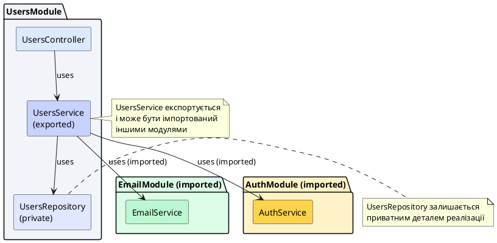
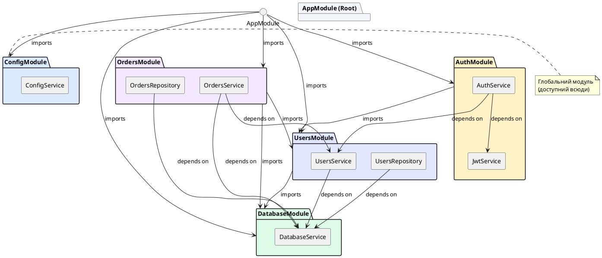
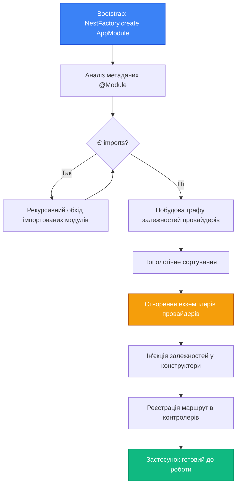

# Структура модулів: imports, controllers, providers, exports

## Короткий зміст

- Модуль як організаційний блок застосунку
- Декоратор `@Module()` та його метадані
- `imports`: масив імпортованих модулів
- `controllers`: контролери, що належать цьому модулю
- `providers`: провайдери, доступні у цьому модулі
- `exports`: провайдери, які експортуються для інших модулів
- Інкапсуляція: провайдери за замовчуванням приватні для модуля
- Кореневий модуль (AppModule): точка входу модульної системи
- Граф модулів: як NestJS будує дерево залежностей
- Генерація модуля: `nest generate module <name>`

---

## Архітектурний контекст: від окремих компонентів до модульної системи

У попередніх лекціях ми детально розглянули концепцію провайдерів: як створювати сервіси, реєструвати їх через декоратор `@Injectable()`, впроваджувати залежності через конструктори та використовувати різні типи кастомних провайдерів (`useValue`, `useClass`, `useFactory`, `useExisting`). Ми також дослідили механізми роботи з токенами для ідентифікації провайдерів та опціональні залежності через декоратор `@Optional()`.

Проте всі ці компоненти — контролери, сервіси, репозиторії, фабрики — не існують у вакуумі. Вони мають бути організовані у структуровану систему, яка визначає їх видимість, життєвий цикл та взаємозв'язки. Саме для цього NestJS впроваджує концепцію **модулів** (*modules*) — архітектурних контейнерів, які групують пов'язані компоненти та визначають межі їх інкапсуляції.

Модульна система NestJS запозичує фундаментальні принципи з Angular (фреймворк для фронтенд-розробки) та Java Spring Framework, адаптуючи їх під специфіку серверних застосунків на Node.js. Кожен модуль оголошує, які контролери він містить, які провайдери йому потрібні, які інші модулі він імпортує та які провайдери він експортує для використання іншими модулями. Ця декларативна структура дозволяє NestJS автоматично будувати **граф залежностей** (*dependency graph*) всього застосунку та ініціалізувати компоненти у правильному порядку.

::card-group

::card{title="🎯 Мета лекції" icon="i-lucide-target"}

- Зрозуміти роль модулів як організаційних одиниць застосунку
- Опанувати декоратор `@Module()` та його конфігураційні властивості
- Навчитися структурувати застосунок через imports, providers, controllers, exports
- Розібрати принципи інкапсуляції: приватні провайдери vs публічні експорти
- Дослідити, як NestJS будує граф залежностей між модулями
- Практикувати генерацію модулів через CLI

::

::card{title="🔑 Ключові терміни" icon="i-lucide-key"}

- **Module** — декларативний контейнер, що групує контролери, провайдери та імпорти
- **@Module()** — декоратор для позначення класу як модуля
- **imports** — масив модулів, провайдери яких стають доступними у поточному модулі
- **providers** — масив провайдерів, що реєструються у DI-контейнері цього модуля
- **controllers** — масив контролерів, що належать цьому модулю
- **exports** — масив провайдерів або модулів, які стають доступними для імпортуючих модулів
- **Encapsulation** — інкапсуляція, приховування внутрішніх провайдерів модуля від зовнішніх споживачів

::

::

---

## Модуль як організаційний блок застосунку

**Модуль** у NestJS — це клас, позначений декоратором `@Module()`, який об'єднує логічно пов'язані компоненти застосунку: контролери, провайдери та посилання на інші модулі. Модулі є фундаментальним архітектурним інструментом для структурування коду у великих застосунках, оскільки вони дозволяють:

1. **Організувати код за доменами**: наприклад, `UsersModule` містить все, що стосується користувачів (контролер, сервіс, репозиторій, DTO)
2. **Контролювати видимість**: провайдери одного модуля не видимі іншим модулям, доки не експортовані явно
3. **Створювати переусопоставлений код**: модулі можна імпортувати у різних частинах застосунку або навіть в інших проєктах
4. **Розділяти відповідальності**: кожен модуль відповідає за конкретну функціональність
5. **Полегшити тестування**: модулі можна тестувати ізольовано, підміняючи залежності

Розглянемо найпростіший приклад модуля — кореневий модуль застосунку `AppModule`:

```typescript
import { Module } from '@nestjs/common';
import { AppController } from './app.controller';
import { AppService } from './app.service';

@Module({
  imports: [],
  controllers: [AppController],
  providers: [AppService]
})
export class AppModule {}
```

Цей модуль декларує, що він містить один контролер (`AppController`) та один провайдер (`AppService`). Масив `imports` порожній, оскільки цей модуль не залежить від інших модулів. Декоратор `@Module()` приймає об'єкт конфігурації, який визначає структуру модуля.

Важливо розуміти, що **клас модуля зазвичай порожній** — вся конфігурація передається через метадані декоратора `@Module()`. Сам клас слугує лише як носій цих метаданих та точка входу для системи модулів NestJS. У деяких випадках клас модуля може містити методи життєвого циклу (`onModuleInit`, `onModuleDestroy`), але це винятки, а не правило.

::note
Кожен застосунок NestJS має щонайменше один модуль — **кореневий модуль** (*root module*), який є точкою входу для побудови графу залежностей. За конвенцією він називається `AppModule` та знаходиться у файлі `src/app.module.ts`.
::

---

## Декоратор @Module() та його метадані

Декоратор `@Module()` є одним із фундаментальних декораторів NestJS поряд із `@Controller()` та `@Injectable()`. Він перетворює звичайний TypeScript-клас на **модуль** — структурний компонент, розпізнаваний системою DI фреймворку. Декоратор приймає об'єкт конфігурації, який визначає чотири основні масиви компонентів:

```typescript
@Module({
  imports: [],      // Модулі, які імпортуються
  controllers: [],  // Контролери цього модуля
  providers: [],    // Провайдери цього модуля
  exports: []       // Провайдери/модулі, які експортуються
})
export class SomeModule {}
```

Кожна з цих властивостей має своє чітко визначене призначення:

### imports: підключення залежностей від інших модулів

Масив `imports` перелічує інші модулі, провайдери яких мають стати доступними у поточному модулі. Коли ви імпортуєте модуль, всі провайдери, які він **експортує** (через власний масив `exports`), стають доступними для ін'єкції у контролерах та провайдерах поточного модуля.

```typescript
import { Module } from '@nestjs/common';
import { DatabaseModule } from './database/database.module';
import { UsersService } from './users.service';

@Module({
  imports: [DatabaseModule],  // Імпорт модуля бази даних
  providers: [UsersService]
})
export class UsersModule {}
```

У цьому прикладі `UsersModule` імпортує `DatabaseModule`. Якщо `DatabaseModule` експортує провайдер `DatabaseService`, то `UsersService` зможе його ін'єктувати:

```typescript
@Injectable()
export class UsersService {
  constructor(private readonly db: DatabaseService) {}
  // DatabaseService доступний завдяки імпорту DatabaseModule
}
```

### controllers: реєстрація HTTP-обробників

Масив `controllers` містить класи контролерів, позначені декоратором `@Controller()`, які належать цьому модулю. NestJS автоматично реєструє маршрути цих контролерів та створює їх екземпляри з ін'єкцією необхідних залежностей.

```typescript
@Module({
  controllers: [UsersController, ProfileController]
})
export class UsersModule {}
```

Контролери завжди є **приватними** для модуля — їх не можна експортувати або імпортувати. Якщо інший модуль потребує доступу до функціональності, яку надає контролер, замість експорту контролера слід експортувати сервіс, який цей контролер використовує.

### providers: реєстрація провайдерів у DI-контейнері

Масив `providers` містить всі провайдери (сервіси, репозиторії, фабрики, хелпери), які мають бути зареєстровані у DI-контейнері цього модуля. Провайдери стають доступними для ін'єкції у контролери та інші провайдери **цього ж модуля**.

```typescript
@Module({
  providers: [
    UsersService,
    UsersRepository,
    EmailService,
    PasswordHasher
  ]
})
export class UsersModule {}
```

За замовчуванням провайдери є **приватними** для модуля. Якщо інший модуль потребує доступу до `UsersService`, цей провайдер має бути явно експортований через масив `exports`.

### exports: публікація провайдерів для інших модулів

Масив `exports` визначає, які провайдери або імпортовані модулі стають доступними для модулів, що імпортують поточний модуль. Це основний механізм **контролю видимості** у модульній системі NestJS.

```typescript
@Module({
  providers: [UsersService, UsersRepository, InternalLogger],
  exports: [UsersService]  // Тільки UsersService доступний зовні
})
export class UsersModule {}
```

У цьому прикладі `UsersService` експортується і може бути ін'єктований в інших модулях, тоді як `UsersRepository` та `InternalLogger` залишаються приватними деталями реалізації `UsersModule`.

::tip
Експортуйте тільки ті провайдери, які є **публічним API** вашого модуля. Внутрішні деталі реалізації (репозиторії, хелпери, утиліти) мають залишатися приватними для підтримки інкапсуляції та можливості рефакторингу без впливу на споживачів модуля.
::

---

## Повний приклад: структура UsersModule

Розглянемо реалістичний приклад модуля для роботи з користувачами, який демонструє всі чотири типи метаданих:

```typescript
// users/users.module.ts
import { Module } from '@nestjs/common';
import { TypeOrmModule } from '@nestjs/typeorm';
import { UsersController } from './users.controller';
import { UsersService } from './users.service';
import { UsersRepository } from './users.repository';
import { User } from './entities/user.entity';
import { EmailModule } from '../email/email.module';
import { AuthModule } from '../auth/auth.module';

@Module({
  imports: [
    TypeOrmModule.forFeature([User]),  // Реєстрація сутності User для TypeORM
    EmailModule,                        // Доступ до EmailService
    AuthModule                          // Доступ до AuthService (для хешування паролів)
  ],
  controllers: [
    UsersController                     // HTTP-обробник для /users
  ],
  providers: [
    UsersService,                       // Бізнес-логіка користувачів
    UsersRepository                     // Доступ до бази даних
  ],
  exports: [
    UsersService                        // Експортуємо для інших модулів (наприклад, OrdersModule)
  ]
})
export class UsersModule {}
```

Проаналізуємо цей модуль детальніше:

**imports:**
- `TypeOrmModule.forFeature([User])` — динамічний модуль TypeORM, що реєструє сутність `User` та надає репозиторій для роботи з нею
- `EmailModule` — імпортуємо для доступу до `EmailService` (відправка привітального email після реєстрації)
- `AuthModule` — імпортуємо для доступу до `AuthService` (хешування паролів)

**controllers:**
- `UsersController` — обробляє HTTP-запити до ендпоінтів `/users` (GET, POST, PATCH, DELETE)

**providers:**
- `UsersService` — містить бізнес-логіку: валідація email, перевірка унікальності, виклик EmailService
- `UsersRepository` — інкапсулює запити до бази даних через TypeORM

**exports:**
- `UsersService` — експортується для використання в інших модулях, наприклад, `OrdersModule` може потребувати метод `findById` для перевірки існування користувача при створенні замовлення

::plant-uml{alt="Структура залежностей UsersModule"}



::

Ця структура демонструє ключовий принцип модульної архітектури: **інкапсуляція деталей реалізації**. Зовнішні модулі (наприклад, `OrdersModule`) бачать лише `UsersService`, не знаючи про існування `UsersRepository` або про те, яку саме ORM використовує модуль для роботи з даними.


---

## imports: масив імпортованих модулів

Масив `imports` у декораторі `@Module()` є основним механізмом для встановлення залежностей між модулями. Коли ви імпортуєте модуль, всі провайдери, які він експортує, стають доступними для ін'єкції у поточному модулі. Це дозволяє розділити застосунок на незалежні, переусопоставлені блоки, які можуть бути скомбіновані у різних конфігураціях.

### Синтаксис імпорту модулів

Найпростіший варіант імпорту — це просте перерахування класів модулів у масиві:

```typescript
import { Module } from '@nestjs/common';
import { DatabaseModule } from './database/database.module';
import { ConfigModule } from './config/config.module';
import { LoggerModule } from './logger/logger.module';
import { OrdersService } from './orders.service';

@Module({
  imports: [
    DatabaseModule,
    ConfigModule,
    LoggerModule
  ],
  providers: [OrdersService]
})
export class OrdersModule {}
```

Тепер `OrdersService` може ін'єктувати будь-які провайдери, експортовані цими трьома модулями:

```typescript
import { Injectable } from '@nestjs/common';
import { DatabaseService } from './database/database.service';
import { ConfigService } from './config/config.service';
import { LoggerService } from './logger/logger.service';

@Injectable()
export class OrdersService {
  constructor(
    private readonly db: DatabaseService,      // з DatabaseModule
    private readonly config: ConfigService,    // з ConfigModule
    private readonly logger: LoggerService     // з LoggerModule
  ) {}

  async createOrder(orderData: any) {
    this.logger.log('Creating order');
    
    const dbHost = this.config.get('DATABASE_HOST');
    const result = await this.db.query('INSERT INTO orders ...');
    
    return result;
  }
}
```

### Реекспорт модулів через exports

Цікава особливість системи модулів — можливість **реекспортувати імпортовані модулі**. Це дозволяє створювати "модулі-агрегатори", які комбінують кілька модулів під одним іменем:

```typescript
// shared/shared.module.ts
import { Module } from '@nestjs/common';
import { LoggerModule } from './logger/logger.module';
import { UtilsModule } from './utils/utils.module';
import { ValidationModule } from './validation/validation.module';

@Module({
  imports: [
    LoggerModule,
    UtilsModule,
    ValidationModule
  ],
  exports: [
    LoggerModule,    // Реекспорт: імпортувати LoggerModule окремо не потрібно
    UtilsModule,
    ValidationModule
  ]
})
export class SharedModule {}
```

Тепер інші модулі можуть імпортувати `SharedModule` замість трьох окремих модулів:

```typescript
@Module({
  imports: [SharedModule],  // Отримуємо Logger, Utils, Validation одночасно
  providers: [UsersService]
})
export class UsersModule {}
```

Це особливо корисно для створення **shared modules** — модулів, що надають загальну функціональність для багатьох частин застосунку.

::note
Реекспорт модулів через `exports` не створює додаткових копій провайдерів. Провайдери залишаються singleton — один екземпляр на весь застосунок, незалежно від кількості місць, де імпортовано модуль.
::

### Динамічні модулі у imports

NestJS підтримує концепцію **динамічних модулів** (*dynamic modules*) — модулів, конфігурація яких визначається під час виконання. Динамічні модулі повертаються методами на кшталт `.forRoot()` або `.forFeature()`:

```typescript
import { Module } from '@nestjs/common';
import { TypeOrmModule } from '@nestjs/typeorm';
import { ConfigModule } from '@nestjs/config';

@Module({
  imports: [
    // Динамічний модуль з конфігурацією
    ConfigModule.forRoot({
      isGlobal: true,
      envFilePath: '.env'
    }),
    
    // Динамічний модуль TypeORM
    TypeOrmModule.forRoot({
      type: 'postgres',
      host: 'localhost',
      port: 5432,
      database: 'myapp'
    })
  ]
})
export class AppModule {}
```

Динамічні модулі будуть детально розглянуті у наступних лекціях, але важливо розуміти, що вони також імпортуються через масив `imports`.

---

## controllers: контролери, що належать цьому модулю

Масив `controllers` містить класи контролерів, позначені декоратором `@Controller()`, які обробляють HTTP-запити для цього модуля. NestJS автоматично реєструє маршрути цих контролерів та створює їх екземпляри з ін'єкцією залежностей.

### Реєстрація контролерів

```typescript
import { Module } from '@nestjs/common';
import { UsersController } from './users.controller';
import { ProfileController } from './profile.controller';
import { UsersService } from './users.service';

@Module({
  controllers: [
    UsersController,   // Обробляє /users
    ProfileController  // Обробляє /profile
  ],
  providers: [UsersService]
})
export class UsersModule {}
```

Кожен контролер у масиві `controllers` має доступ до всіх провайдерів, зареєстрованих у цьому модулі, а також до провайдерів, експортованих з імпортованих модулів:

```typescript
import { Controller, Get } from '@nestjs/common';
import { UsersService } from './users.service';

@Controller('users')
export class UsersController {
  constructor(
    private readonly usersService: UsersService  // Доступний з providers цього модуля
  ) {}

  @Get()
  findAll() {
    return this.usersService.findAll();
  }
}
```

### Важлива відмінність від провайдерів

На відміну від провайдерів, контролери **не можуть бути експортовані**. Якщо інший модуль потребує функціональності, яку надає контролер, замість експорту контролера слід експортувати сервіс:

```typescript
// ❌ НЕПРАВИЛЬНО: контролери не експортуються
@Module({
  controllers: [UsersController],
  exports: [UsersController]  // Це викличе помилку!
})
export class UsersModule {}

// ✅ ПРАВИЛЬНО: експортуємо сервіс
@Module({
  controllers: [UsersController],
  providers: [UsersService],
  exports: [UsersService]  // Інші модулі можуть використовувати UsersService
})
export class UsersModule {}
```

Ця архітектурна особливість підкреслює, що **контролери є точками входу для HTTP**, а не логікою, яку можна переусопоставлювати між модулями. Логіка має бути інкапсульована у сервісах.

::warning
Не розміщуйте бізнес-логіку безпосередньо у контролерах. Контролер має бути тонким шаром, що делегує всю роботу сервісам. Це полегшує тестування (можна тестувати сервіси окремо від HTTP-рівня) та дозволяє переусопоставлювати логіку в інших контекстах (WebSocket, GraphQL, CLI).
::

### Множина контролерів в одному модулі

Модуль може містити кілька контролерів, якщо вони логічно пов'язані та працюють з однією предметною областю:

```typescript
import { Module } from '@nestjs/common';
import { UsersController } from './controllers/users.controller';
import { UsersProfileController } from './controllers/users-profile.controller';
import { UsersSettingsController } from './controllers/users-settings.controller';
import { UsersService } from './services/users.service';
import { ProfileService } from './services/profile.service';
import { SettingsService } from './services/settings.service';

@Module({
  controllers: [
    UsersController,          // /users
    UsersProfileController,   // /users/profile
    UsersSettingsController   // /users/settings
  ],
  providers: [
    UsersService,
    ProfileService,
    SettingsService
  ],
  exports: [UsersService]
})
export class UsersModule {}
```

Така організація дозволяє розділити відповідальності між контролерами, зберігаючи їх у межах одного модуля.

---

## providers: провайдери, доступні у цьому модулі

Масив `providers` є серцем системи Dependency Injection у модулі. Він містить всі класи та токени, які мають бути зареєстровані у DI-контейнері та доступні для ін'єкції у контролерах та інших провайдерах цього модуля.

### Проста реєстрація через клас

Найпоширеніший варіант — проста реєстрація класів-провайдерів:

```typescript
import { Module } from '@nestjs/common';
import { UsersService } from './users.service';
import { UsersRepository } from './users.repository';
import { EmailService } from './email.service';

@Module({
  providers: [
    UsersService,
    UsersRepository,
    EmailService
  ]
})
export class UsersModule {}
```

Це скорочена форма запису, еквівалентна:

```typescript
@Module({
  providers: [
    { provide: UsersService, useClass: UsersService },
    { provide: UsersRepository, useClass: UsersRepository },
    { provide: EmailService, useClass: EmailService }
  ]
})
export class UsersModule {}
```

### Кастомні провайдери через токени

Як ми розглядали у попередніх лекціях, провайдери можуть використовувати різні типи токенів та фабрик:

```typescript
import { Module } from '@nestjs/common';

@Module({
  providers: [
    UsersService,  // Стандартний клас-провайдер
    
    // Провайдер через useValue
    {
      provide: 'APP_CONFIG',
      useValue: {
        apiUrl: 'https://api.example.com',
        timeout: 5000
      }
    },
    
    // Провайдер через useFactory
    {
      provide: 'DATABASE_CONNECTION',
      useFactory: async () => {
        const connection = await createConnection();
        return connection;
      }
    },
    
    // Провайдер через useExisting (аліас)
    {
      provide: 'LEGACY_USERS_SERVICE',
      useExisting: UsersService
    }
  ]
})
export class UsersModule {}
```

### Область видимості провайдерів

За замовчуванням провайдери, зареєстровані у масиві `providers`, є **приватними** для цього модуля. Вони доступні тільки у контролерах та провайдерах цього ж модуля. Щоб зробити провайдер доступним для інших модулів, його потрібно явно експортувати через масив `exports`.

::plant-uml{alt="Видимість провайдерів у модулі"}

```plantuml
@startuml
skinparam style plain
skinparam backgroundColor #FFFFFF

package "UsersModule" #F1F5F9 {
  rectangle "UsersService\n(public via exports)" as Service #C7D2FE
  rectangle "UsersRepository\n(private)" as Repository #E0E7FF
  rectangle "PasswordHasher\n(private)" as Hasher #E0E7FF
  
  Service --> Repository : uses
  Service --> Hasher : uses
}

package "OrdersModule" #DCFCE7 {
  rectangle "OrdersService" as Orders #BBF7D0
}

Orders ..> Service : can inject\n(exported)
Orders -[#FF0000]x Repository : <color:red>cannot inject</color>\n<color:red>(not exported)</color>

note bottom of Repository
  UsersRepository доступний
  тільки всередині UsersModule
end note

@enduml
```

::

Ця інкапсуляція дозволяє модулям змінювати внутрішню реалізацію без впливу на зовнішні модулі. Наприклад, ви можете замінити `UsersRepository` з TypeORM на Prisma, і це не вплине на `OrdersModule`, оскільки він залежить лише від публічного `UsersService`.

---

## exports: провайдери, які експортуються для інших модулів

Масив `exports` визначає, які провайдери або імпортовані модулі стають доступними для модулів, що імпортують поточний модуль. Це ключовий механізм контролю видимості у модульній архітектурі NestJS.

### Експорт власних провайдерів

Найпоширеніший сценарій — експорт провайдерів, зареєстрованих у масиві `providers`:

```typescript
import { Module } from '@nestjs/common';
import { UsersService } from './users.service';
import { UsersRepository } from './users.repository';
import { InternalLogger } from './internal-logger.service';

@Module({
  providers: [
    UsersService,
    UsersRepository,
    InternalLogger
  ],
  exports: [
    UsersService  // Тільки UsersService доступний зовні
  ]
})
export class UsersModule {}
```

Тепер інші модулі можуть імпортувати `UsersModule` та ін'єктувати `UsersService`:

```typescript
import { Module } from '@nestjs/common';
import { UsersModule } from './users/users.module';
import { OrdersService } from './orders.service';

@Module({
  imports: [UsersModule],
  providers: [OrdersService]
})
export class OrdersModule {}
```

```typescript
import { Injectable } from '@nestjs/common';
import { UsersService } from './users/users.service';

@Injectable()
export class OrdersService {
  constructor(
    private readonly usersService: UsersService  // Доступний завдяки exports у UsersModule
  ) {}

  async createOrder(userId: number, items: any[]) {
    const user = await this.usersService.findById(userId);
    if (!user) {
      throw new Error('User not found');
    }
    
    // Створення замовлення
  }
}
```

### Експорт імпортованих модулів (реекспорт)

Модуль може експортувати не лише власні провайдери, а й цілі імпортовані модулі. Це створює "модулі-агрегатори":

```typescript
import { Module } from '@nestjs/common';
import { LoggerModule } from './logger/logger.module';
import { CacheModule } from './cache/cache.module';
import { MetricsModule } from './metrics/metrics.module';

@Module({
  imports: [
    LoggerModule,
    CacheModule,
    MetricsModule
  ],
  exports: [
    LoggerModule,    // Реекспорт
    CacheModule,     // Реекспорт
    MetricsModule    // Реекспорт
  ]
})
export class CommonModule {}
```

Тепер інші модулі можуть імпортувати `CommonModule` і автоматично отримають доступ до `LoggerModule`, `CacheModule` та `MetricsModule`:

```typescript
@Module({
  imports: [CommonModule],  // Отримуємо Logger, Cache, Metrics одночасно
  providers: [UsersService]
})
export class UsersModule {}
```

### Експорт провайдерів з токенами

Токенізовані провайдери також можуть бути експортовані через їх токени:

```typescript
import { Module } from '@nestjs/common';

const CONFIG_TOKEN = 'APP_CONFIG';

@Module({
  providers: [
    {
      provide: CONFIG_TOKEN,
      useValue: { apiUrl: 'https://api.example.com' }
    }
  ],
  exports: [CONFIG_TOKEN]  // Експорт через токен
})
export class ConfigModule {}
```

Інші модулі можуть ін'єктувати цей провайдер через `@Inject()`:

```typescript
import { Injectable, Inject } from '@nestjs/common';

@Injectable()
export class ApiService {
  constructor(
    @Inject('APP_CONFIG') private readonly config: any
  ) {}
}
```

::tip
Експортуйте лише те, що складає **публічний API** вашого модуля. Внутрішні деталі (репозиторії, хелпери, утиліти) мають залишатися приватними. Це дозволяє змінювати реалізацію без впливу на споживачів модуля і забезпечує чіткі межі відповідальності.
::

---

## Інкапсуляція: провайдери за замовчуванням приватні для модуля

Одним із фундаментальних принципів модульної системи NestJS є **інкапсуляція** (*encapsulation*) — приховування внутрішніх деталей реалізації модуля від зовнішніх споживачів. За замовчуванням всі провайдери, зареєстровані у масиві `providers`, є приватними і не можуть бути ін'єктовані за межами модуля.

### Чому інкапсуляція важлива

Інкапсуляція надає кілька ключових переваг:

1. **Контроль змін**: можна змінювати внутрішню реалізацію без впливу на зовнішні модулі
2. **Чіткі межі відповідальності**: зовнішні модулі взаємодіють лише з публічним API
3. **Полегшення рефакторингу**: внутрішні провайдери можна переписувати, видаляти або об'єднувати
4. **Зменшення зв'язаності** (*coupling*): зовнішні модулі не залежать від деталей реалізації

Розглянемо приклад порушення інкапсуляції та його наслідки:

```typescript
// users/users.module.ts (❌ ПОГАНА ПРАКТИКА)
@Module({
  providers: [
    UsersService,
    UsersRepository,      // Репозиторій — внутрішня деталь
    EmailValidator,       // Валідатор — внутрішня деталь
    PasswordHasher        // Хешування — внутрішня деталь
  ],
  exports: [
    UsersService,
    UsersRepository,      // ❌ Експортуємо внутрішню деталь!
    EmailValidator,       // ❌ Експортуємо внутрішню деталь!
    PasswordHasher        // ❌ Експортуємо внутрішню деталь!
  ]
})
export class UsersModule {}
```

Якщо `OrdersModule` починає безпосередньо використовувати `UsersRepository`:

```typescript
// orders/orders.service.ts (❌ ПОГАНА ПРАКТИКА)
@Injectable()
export class OrdersService {
  constructor(
    private readonly usersRepository: UsersRepository  // Пряма залежність від деталі реалізації
  ) {}

  async createOrder(userId: number) {
    const user = await this.usersRepository.findById(userId);
    // ...
  }
}
```

Тепер, якщо `UsersModule` вирішить замінити `UsersRepository` на інший підхід (наприклад, перейти з TypeORM на Prisma), доведеться змінювати **і** `OrdersModule`, оскільки він має пряму залежність від `UsersRepository`.

**Правильний підхід:**

```typescript
// users/users.module.ts (✅ ПРАВИЛЬНО)
@Module({
  providers: [
    UsersService,
    UsersRepository,      // Приватний
    EmailValidator,       // Приватний
    PasswordHasher        // Приватний
  ],
  exports: [
    UsersService          // Тільки публічний API
  ]
})
export class UsersModule {}
```

```typescript
// orders/orders.service.ts (✅ ПРАВИЛЬНО)
@Injectable()
export class OrdersService {
  constructor(
    private readonly usersService: UsersService  // Залежність від публічного API
  ) {}

  async createOrder(userId: number) {
    const user = await this.usersService.findById(userId);
    // ...
  }
}
```

Тепер `OrdersModule` залежить лише від публічного контракту `UsersService`, і зміни у внутрішній реалізації `UsersModule` не впливають на нього.

::accordion

::accordion-item{label="❓ Чи можна експортувати провайдер, який не зареєстрований у масиві providers?" icon="i-lucide-help-circle"}

Ні. Щоб експортувати провайдер, він спочатку має бути зареєстрований у масиві `providers` цього ж модуля або імпортований з іншого модуля. Спроба експортувати незареєстрований провайдер призведе до помилки під час ініціалізації застосунку.

::

::accordion-item{label="❓ Що станеться, якщо два модулі експортують провайдери з однаковим токеном?" icon="i-lucide-help-circle"}

Якщо модуль імпортує два інші модулі, які експортують провайдери з однаковим токеном, виникне конфлікт. NestJS використовує токен останнього імпортованого модуля. Щоб уникнути таких ситуацій, використовуйте унікальні Symbol-токени замість рядкових або забезпечте унікальність імен.

::

::accordion-item{label="❓ Чи можна експортувати контролери?" icon="i-lucide-help-circle"}

Ні. Контролери не можуть бути експортовані, оскільки вони є точками входу для HTTP-запитів, а не логікою, яку можна переусопоставлювати між модулями. Якщо потрібно поділитися функціональністю контролера з іншими модулями, винесіть цю логіку у сервіс та експортуйте сервіс.

::

::


---

## Кореневий модуль (AppModule): точка входу модульної системи

Кожен застосунок NestJS має щонайменше один модуль — **кореневий модуль** (*root module*), який є точкою входу для побудови графу залежностей всього застосунку. За конвенцією кореневий модуль називається `AppModule` та знаходиться у файлі `src/app.module.ts`.

### Роль кореневого модуля

Кореневий модуль виконує кілька ключових функцій:

1. **Точка входу для NestFactory**: при створенні застосунку через `NestFactory.create()` передається саме кореневий модуль
2. **Агрегація feature modules**: імпортує всі функціональні модулі застосунку
3. **Глобальна конфігурація**: реєструє глобальні модулі (конфігурація, логування, база даних)
4. **Власні контролери та провайдери**: може містити загальні контролери (наприклад, health check)

### Структура типового AppModule

```typescript
// src/app.module.ts
import { Module } from '@nestjs/common';
import { ConfigModule } from '@nestjs/config';
import { TypeOrmModule } from '@nestjs/typeorm';
import { AppController } from './app.controller';
import { AppService } from './app.service';
import { UsersModule } from './users/users.module';
import { AuthModule } from './auth/auth.module';
import { ProductsModule } from './products/products.module';
import { OrdersModule } from './orders/orders.module';

@Module({
  imports: [
    // Глобальний модуль конфігурації
    ConfigModule.forRoot({
      isGlobal: true,
      envFilePath: '.env'
    }),
    
    // Підключення до бази даних
    TypeOrmModule.forRoot({
      type: 'postgres',
      host: process.env.DB_HOST,
      port: parseInt(process.env.DB_PORT, 10),
      username: process.env.DB_USER,
      password: process.env.DB_PASSWORD,
      database: process.env.DB_NAME,
      autoLoadEntities: true,
      synchronize: process.env.NODE_ENV === 'development'
    }),
    
    // Feature modules
    UsersModule,
    AuthModule,
    ProductsModule,
    OrdersModule
  ],
  controllers: [AppController],  // Кореневий контролер для /health, /version тощо
  providers: [AppService]
})
export class AppModule {}
```

### Використання кореневого модуля у main.ts

Кореневий модуль передається у `NestFactory.create()` для ініціалізації застосунку:

```typescript
// src/main.ts
import { NestFactory } from '@nestjs/core';
import { AppModule } from './app.module';

async function bootstrap() {
  const app = await NestFactory.create(AppModule);  // Створення застосунку з AppModule
  
  await app.listen(3000);
  console.log(`Application is running on: http://localhost:3000`);
}

bootstrap();
```

Під час виклику `NestFactory.create(AppModule)` NestJS:

1. Аналізує метадані `AppModule` через декоратор `@Module()`
2. Рекурсивно обходить всі імпортовані модулі з масиву `imports`
3. Будує повний граф залежностей всіх модулів та провайдерів
4. Створює екземпляри провайдерів у правильному порядку
5. Реєструє маршрути всіх контролерів
6. Повертає готовий до роботи екземпляр застосунку

::note
Кореневий модуль не має спеціальних властивостей на рівні синтаксису — це звичайний модуль, позначений `@Module()`. Його особлива роль визначається лише тим, що він передається у `NestFactory.create()` як точка входу.
::

### Приклад: мінімальний застосунок з одним модулем

Найпростіший застосунок може складатися лише з кореневого модуля:

```typescript
// src/app.module.ts
import { Module } from '@nestjs/common';
import { AppController } from './app.controller';
import { AppService } from './app.service';

@Module({
  imports: [],
  controllers: [AppController],
  providers: [AppService]
})
export class AppModule {}
```

```typescript
// src/app.controller.ts
import { Controller, Get } from '@nestjs/common';
import { AppService } from './app.service';

@Controller()
export class AppController {
  constructor(private readonly appService: AppService) {}

  @Get()
  getHello(): string {
    return this.appService.getHello();
  }
}
```

```typescript
// src/app.service.ts
import { Injectable } from '@nestjs/common';

@Injectable()
export class AppService {
  getHello(): string {
    return 'Hello World!';
  }
}
```

Цей застосунок має лише один модуль, один контролер та один сервіс, але він повністю функціональний та може обробляти HTTP-запити.

---

## Граф модулів: як NestJS будує дерево залежностей

Одна з найпотужніших можливостей модульної системи NestJS — автоматична побудова **графу залежностей** (*dependency graph*) — структури, що визначає порядок ініціалізації модулів та провайдерів на основі їх взаємозв'язків.

### Процес побудови графу модулів

Коли NestJS запускає застосунок, він виконує наступні кроки:

::steps

### Крок 1: Аналіз кореневого модуля

NestJS починає з `AppModule`, переданого у `NestFactory.create()`. Фреймворк зчитує метадані декоратора `@Module()` та визначає масиви `imports`, `controllers`, `providers`, `exports`.

### Крок 2: Рекурсивний обхід imports

Для кожного модуля з масиву `imports` NestJS рекурсивно повторює крок 1: аналізує його метадані та продовжує обхід для імпортованих ним модулів. Цей процес триває доти, доки не будуть виявлені всі модулі застосунку.

### Крок 3: Побудова графу залежностей провайдерів

Для кожного модуля NestJS аналізує конструктори всіх провайдерів та контролерів, визначаючи їх залежності. Формується граф: "Провайдер A залежить від провайдерів B та C".

### Крок 4: Топологічне сортування

NestJS виконує топологічне сортування графу, щоб визначити порядок створення провайдерів: провайдери без залежностей створюються першими, після чого створюються провайдери, що залежать від уже створених.

### Крок 5: Створення екземплярів

Провайдери створюються у визначеному порядку. Кожен провайдер отримує свої залежності через конструктор та зберігається у DI-контейнері як singleton.

### Крок 6: Реєстрація маршрутів

Після створення всіх провайдерів NestJS реєструє маршрути контролерів у внутрішньому HTTP-сервері (Express або Fastify).

::

### Візуалізація графу модулів

Розглянемо застосунок з наступною структурою модулів:

```typescript
// app.module.ts
@Module({
  imports: [
    ConfigModule.forRoot({ isGlobal: true }),
    DatabaseModule,
    UsersModule,
    AuthModule,
    OrdersModule
  ]
})
export class AppModule {}

// users.module.ts
@Module({
  imports: [DatabaseModule],
  providers: [UsersService, UsersRepository],
  exports: [UsersService]
})
export class UsersModule {}

// auth.module.ts
@Module({
  imports: [UsersModule],
  providers: [AuthService, JwtService],
  exports: [AuthService]
})
export class AuthModule {}

// orders.module.ts
@Module({
  imports: [UsersModule, DatabaseModule],
  providers: [OrdersService, OrdersRepository],
  exports: [OrdersService]
})
export class OrdersModule {}
```

::plant-uml{alt="Граф модулів застосунку"}



::

### Порядок ініціалізації

Для цього графу NestJS визначить наступний порядок створення провайдерів:

1. `ConfigService` (немає залежностей, глобальний)
2. `DatabaseService` (немає залежностей)
3. `UsersRepository` (залежить від `DatabaseService`)
4. `UsersService` (залежить від `UsersRepository`)
5. `JwtService` (немає залежностей)
6. `AuthService` (залежить від `UsersService` та `JwtService`)
7. `OrdersRepository` (залежить від `DatabaseService`)
8. `OrdersService` (залежить від `UsersService` та `OrdersRepository`)

::tip
NestJS автоматично виявляє **циклічні залежності** (*circular dependencies*) під час побудови графу та видає помилку з детальним описом циклу. Наприклад, якщо `UsersService` залежить від `AuthService`, а `AuthService` залежить від `UsersService`, застосунок не запуститься. Циклічні залежності свідчать про проблему архітектури та потребують рефакторингу.
::

---

## Генерація модуля: nest generate module <name>

NestJS CLI надає команду для автоматичної генерації модулів, що значно прискорює початкову структуризацію проєкту та забезпечує дотримання конвенцій.

### Синтаксис команди

```bash
nest generate module <name>
```

або коротка форма:

```bash
nest g mo <name>
```

### Приклад: генерація модуля користувачів

::terminal-preview{title="nest generate module users" :cursor="false"}

<div class="line"><span class="opacity-40">$</span> <strong class="font-bold">nest generate module users</strong></div>
<div class="line"></div>
<div class="line"><span class="text-green-400">CREATE</span> src/users/users.module.ts <span class="opacity-60">(82 bytes)</span></div>
<div class="line"><span class="text-yellow-400">UPDATE</span> src/app.module.ts <span class="opacity-60">(312 bytes)</span></div>
<div class="line"></div>
<div class="line"><span class="text-green-400 font-bold">✔</span> Module "users" successfully generated</div>

::

CLI автоматично створює:

1. **Директорію модуля**: `src/users/`
2. **Файл модуля**: `src/users/users.module.ts`
3. **Автоматично імпортує** у `AppModule`

Згенерований файл модуля:

```typescript
// src/users/users.module.ts
import { Module } from '@nestjs/common';

@Module({})
export class UsersModule {}
```

Оновлений `AppModule`:

```typescript
// src/app.module.ts
import { Module } from '@nestjs/common';
import { AppController } from './app.controller';
import { AppService } from './app.service';
import { UsersModule } from './users/users.module';  // Автоматично додано

@Module({
  imports: [UsersModule],  // Автоматично додано
  controllers: [AppController],
  providers: [AppService]
})
export class AppModule {}
```

### Генерація вкладених модулів

Можна генерувати модулі у вкладених директоріях через слеш:

```bash
nest g mo features/payments
```

::terminal-preview{title="nest generate module features/payments" :cursor="false"}

<div class="line"><span class="opacity-40">$</span> <strong class="font-bold">nest generate module features/payments</strong></div>
<div class="line"></div>
<div class="line"><span class="text-green-400">CREATE</span> src/features/payments/payments.module.ts <span class="opacity-60">(85 bytes)</span></div>
<div class="line"><span class="text-yellow-400">UPDATE</span> src/app.module.ts <span class="opacity-60">(398 bytes)</span></div>

::

Це створить структуру:

```
src/
├── features/
│   └── payments/
│       └── payments.module.ts
└── app.module.ts
```

### Опції команди генерації

CLI підтримує кілька корисних опцій:

::code-group

```bash [Без автоімпорту в AppModule]
nest g mo users --no-spec --skip-import
```

```bash [Генерація з власним шляхом]
nest g mo users --flat --no-spec
```

```bash [Сухий прогон (без створення файлів)]
nest g mo users --dry-run
```

::

**Пояснення опцій:**

- `--no-spec`: не генерувати тестовий файл `users.module.spec.ts`
- `--skip-import`: не додавати модуль у `imports` батьківського модуля
- `--flat`: створити файл модуля без окремої директорії
- `--dry-run`: показати, що буде створено, але не створювати файли

::note
Використання CLI для генерації модулів забезпечує дотримання конвенцій іменування та структури проєкту. Це особливо корисно у командній роботі, оскільки всі модулі мають єдиний формат.
::

---

## Практичний приклад: створення повного модуля

Розглянемо повний процес створення функціонального модуля для роботи з продуктами:

### Крок 1: Генерація модуля

```bash
nest g mo products
nest g co products --no-spec
nest g s products --no-spec
```

Ці команди створять:

```
src/products/
├── products.controller.ts
├── products.service.ts
└── products.module.ts
```

### Крок 2: Реалізація сервісу

```typescript
// src/products/products.service.ts
import { Injectable } from '@nestjs/common';

export interface Product {
  id: number;
  name: string;
  price: number;
  category: string;
}

@Injectable()
export class ProductsService {
  private products: Product[] = [
    { id: 1, name: 'Ноутбук Dell XPS 15', price: 45000, category: 'Електроніка' },
    { id: 2, name: 'Мишка Logitech MX Master 3', price: 2500, category: 'Аксесуари' },
    { id: 3, name: 'Клавіатура Keychron K2', price: 3200, category: 'Аксесуари' }
  ];

  findAll(): Product[] {
    return this.products;
  }

  findById(id: number): Product | undefined {
    return this.products.find(p => p.id === id);
  }

  findByCategory(category: string): Product[] {
    return this.products.filter(p => p.category === category);
  }

  create(productData: Omit<Product, 'id'>): Product {
    const newProduct: Product = {
      id: Math.max(...this.products.map(p => p.id), 0) + 1,
      ...productData
    };
    this.products.push(newProduct);
    return newProduct;
  }

  update(id: number, productData: Partial<Product>): Product | null {
    const index = this.products.findIndex(p => p.id === id);
    if (index === -1) return null;

    this.products[index] = { ...this.products[index], ...productData };
    return this.products[index];
  }

  delete(id: number): boolean {
    const index = this.products.findIndex(p => p.id === id);
    if (index === -1) return false;

    this.products.splice(index, 1);
    return true;
  }
}
```

### Крок 3: Реалізація контролера

```typescript
// src/products/products.controller.ts
import { Controller, Get, Post, Patch, Delete, Param, Body, Query } from '@nestjs/common';
import { ProductsService, Product } from './products.service';

@Controller('products')
export class ProductsController {
  constructor(private readonly productsService: ProductsService) {}

  @Get()
  findAll(@Query('category') category?: string): Product[] {
    if (category) {
      return this.productsService.findByCategory(category);
    }
    return this.productsService.findAll();
  }

  @Get(':id')
  findOne(@Param('id') id: string): Product | undefined {
    return this.productsService.findById(+id);
  }

  @Post()
  create(@Body() productData: Omit<Product, 'id'>): Product {
    return this.productsService.create(productData);
  }

  @Patch(':id')
  update(@Param('id') id: string, @Body() productData: Partial<Product>): Product | null {
    return this.productsService.update(+id, productData);
  }

  @Delete(':id')
  remove(@Param('id') id: string): { success: boolean } {
    const success = this.productsService.delete(+id);
    return { success };
  }
}
```

### Крок 4: Конфігурація модуля

```typescript
// src/products/products.module.ts
import { Module } from '@nestjs/common';
import { ProductsController } from './products.controller';
import { ProductsService } from './products.service';

@Module({
  controllers: [ProductsController],
  providers: [ProductsService],
  exports: [ProductsService]  // Експортуємо для використання в інших модулях
})
export class ProductsModule {}
```

### Крок 5: Використання у іншому модулі

Припустімо, у нас є `OrdersModule`, який потребує доступу до продуктів:

```typescript
// src/orders/orders.module.ts
import { Module } from '@nestjs/common';
import { OrdersController } from './orders.controller';
import { OrdersService } from './orders.service';
import { ProductsModule } from '../products/products.module';  // Імпорт ProductsModule

@Module({
  imports: [ProductsModule],  // Отримуємо доступ до ProductsService
  controllers: [OrdersController],
  providers: [OrdersService]
})
export class OrdersModule {}
```

```typescript
// src/orders/orders.service.ts
import { Injectable } from '@nestjs/common';
import { ProductsService } from '../products/products.service';

@Injectable()
export class OrdersService {
  constructor(
    private readonly productsService: ProductsService  // Ін'єкція ProductsService
  ) {}

  async createOrder(productIds: number[]): Promise<any> {
    // Перевірка існування всіх продуктів
    const products = productIds
      .map(id => this.productsService.findById(id))
      .filter(p => p !== undefined);

    if (products.length !== productIds.length) {
      throw new Error('Деякі продукти не знайдено');
    }

    const totalPrice = products.reduce((sum, p) => sum + p.price, 0);

    return {
      orderId: Date.now(),
      products,
      totalPrice,
      status: 'pending'
    };
  }
}
```

Тепер `OrdersService` може використовувати `ProductsService` завдяки тому, що `ProductsModule` експортує `ProductsService`, а `OrdersModule` імпортує `ProductsModule`.

::tip
При проєктуванні модулів завжди думайте про **публічний API** модуля: які провайдери мають бути доступні зовні? Експортуйте тільки необхідне, залишаючи внутрішні деталі приватними. Це дозволяє змінювати реалізацію без впливу на споживачів модуля.
::

---

## Підсумок: анатомія модуля NestJS

Підсумуємо ключові аспекти структури модулів:

::card-group

::card{title="📦 imports" icon="i-lucide-package"}

**Призначення**: Імпорт інших модулів для отримання доступу до їх експортованих провайдерів

**Правила**:
- Імпортувати можна тільки модулі (класи з декоратором `@Module`)
- Провайдери імпортованого модуля доступні, тільки якщо вони експортовані
- Можна імпортувати динамічні модулі (`.forRoot()`, `.forFeature()`)

::

::card{title="🎮 controllers" icon="i-lucide-route"}

**Призначення**: Реєстрація HTTP-обробників (контролерів)

**Правила**:
- Контролери автоматично реєструють свої маршрути
- Контролери **не можуть бути експортовані**
- Контролери мають доступ до провайдерів свого модуля та імпортованих модулів

::

::card{title="⚙️ providers" icon="i-lucide-cog"}

**Призначення**: Реєстрація провайдерів (сервісів, репозиторіїв, фабрик) у DI-контейнері

**Правила**:
- За замовчуванням провайдери **приватні** для модуля
- Можна використовувати різні типи провайдерів (`useClass`, `useValue`, `useFactory`, `useExisting`)
- Провайдери створюються як singleton за замовчуванням

::

::card{title="📤 exports" icon="i-lucide-upload"}

**Призначення**: Експорт провайдерів або модулів для використання в інших модулях

**Правила**:
- Експортувати можна тільки провайдери, зареєстровані у `providers`, або імпортовані модулі
- Експортовані провайдери стають частиною **публічного API** модуля
- Контролери **не можуть бути експортовані**

::

::

::note
Модульна система NestJS базується на принципах **інкапсуляції** та **чітких меж відповідальності**. Кожен модуль має приховувати свої внутрішні деталі та надавати зовні лише мінімальний необхідний інтерфейс. Це дозволяє розробляти великі застосунки, які легко підтримувати, тестувати та масштабувати.
::


---

## Порівняння: монолітний клас vs модульна архітектура

Щоб краще усвідомити переваги модульної системи, порівняємо два підходи до організації застосунку:

::code-group

```typescript [❌ Монолітний підхід (все в AppModule)]
// app.module.ts
import { Module } from '@nestjs/common';
import { UsersController } from './users.controller';
import { ProductsController } from './products.controller';
import { OrdersController } from './orders.controller';
import { AuthController } from './auth.controller';
import { UsersService } from './users.service';
import { ProductsService } from './products.service';
import { OrdersService } from './orders.service';
import { AuthService } from './auth.service';
import { UsersRepository } from './users.repository';
import { ProductsRepository } from './products.repository';
import { OrdersRepository } from './orders.repository';
import { EmailService } from './email.service';
import { LoggerService } from './logger.service';
import { ConfigService } from './config.service';

@Module({
  controllers: [
    UsersController,
    ProductsController,
    OrdersController,
    AuthController
  ],
  providers: [
    UsersService,
    ProductsService,
    OrdersService,
    AuthService,
    UsersRepository,
    ProductsRepository,
    OrdersRepository,
    EmailService,
    LoggerService,
    ConfigService
  ]
})
export class AppModule {}
```

```typescript [✅ Модульна архітектура]
// app.module.ts
import { Module } from '@nestjs/common';
import { ConfigModule } from './config/config.module';
import { DatabaseModule } from './database/database.module';
import { UsersModule } from './users/users.module';
import { AuthModule } from './auth/auth.module';
import { ProductsModule } from './products/products.module';
import { OrdersModule } from './orders/orders.module';
import { SharedModule } from './shared/shared.module';

@Module({
  imports: [
    ConfigModule.forRoot({ isGlobal: true }),
    DatabaseModule,
    SharedModule,
    UsersModule,
    AuthModule,
    ProductsModule,
    OrdersModule
  ]
})
export class AppModule {}

// users/users.module.ts
@Module({
  imports: [DatabaseModule, SharedModule],
  controllers: [UsersController],
  providers: [UsersService, UsersRepository],
  exports: [UsersService]
})
export class UsersModule {}

// products/products.module.ts
@Module({
  imports: [DatabaseModule, SharedModule],
  controllers: [ProductsController],
  providers: [ProductsService, ProductsRepository],
  exports: [ProductsService]
})
export class ProductsModule {}

// orders/orders.module.ts
@Module({
  imports: [
    DatabaseModule,
    SharedModule,
    UsersModule,      // Використовує UsersService
    ProductsModule    // Використовує ProductsService
  ],
  controllers: [OrdersController],
  providers: [OrdersService, OrdersRepository],
  exports: [OrdersService]
})
export class OrdersModule {}
```

::

**Переваги модульного підходу:**

1. **Чіткі межі відповідальності**: кожен модуль відповідає за конкретну предметну область
2. **Контроль видимості**: `UsersRepository` доступний тільки всередині `UsersModule`
3. **Переусопоставлення**: `SharedModule` можна імпортувати у будь-якому модулі
4. **Незалежне тестування**: можна тестувати `UsersModule` окремо від `OrdersModule`
5. **Легкість рефакторингу**: зміни у `ProductsModule` не впливають на `AuthModule`
6. **Масштабованість**: можна додавати нові модулі без зміни існуючих

---

## Діаграма: життєвий цикл модуля

::mermaid



::

---

## Запитання для самоперевірки

::accordion

::accordion-item{label="❓ Яка різниця між imports та providers у декораторі @Module?" icon="i-lucide-help-circle"}

**imports** — це масив інших **модулів**, які імпортуються для отримання доступу до їх експортованих провайдерів. Ви імпортуєте модулі, а не окремі провайдери.

**providers** — це масив **провайдерів** (класів, токенів, фабрик), які реєструються у DI-контейнері **цього конкретного модуля**. Провайдери за замовчуванням приватні для модуля.

**Приклад:**
```typescript
@Module({
  imports: [UsersModule],        // Імпортуємо модуль
  providers: [OrdersService]     // Реєструємо провайдер
})
export class OrdersModule {}
```

::

::accordion-item{label="❓ Чи можна імпортувати провайдер безпосередньо, без модуля?" icon="i-lucide-help-circle"}

Ні. У NestJS **можна імпортувати тільки модулі**, а не окремі провайдери. Якщо вам потрібен провайдер з іншого модуля, ви маєте:

1. Переконатися, що цей провайдер експортований у своєму модулі через масив `exports`
2. Імпортувати весь модуль через масив `imports`

**Неправильно:**
```typescript
@Module({
  imports: [UsersService]  // ❌ Помилка! Імпортувати можна тільки модулі
})
```

**Правильно:**
```typescript
@Module({
  imports: [UsersModule]  // ✅ Імпортуємо модуль, який експортує UsersService
})
```

::

::accordion-item{label="❓ Що станеться, якщо забути експортувати провайдер, який потрібен іншому модулю?" icon="i-lucide-help-circle"}

NestJS згенерує помилку під час ініціалізації застосунку. Припустімо, `OrdersModule` імпортує `UsersModule` та намагається ін'єктувати `UsersService`:

```typescript
// users.module.ts
@Module({
  providers: [UsersService],
  exports: []  // ❌ Забули експортувати UsersService
})
export class UsersModule {}

// orders.module.ts
@Module({
  imports: [UsersModule],
  providers: [OrdersService]
})
export class OrdersModule {}

// orders.service.ts
@Injectable()
export class OrdersService {
  constructor(private readonly usersService: UsersService) {}  // Спроба ін'єкції
}
```

**Помилка при запуску:**
```
Error: Nest can't resolve dependencies of the OrdersService (?). 
Please make sure that the argument UsersService at index [0] 
is available in the OrdersModule context.
```

**Рішення**: додати `UsersService` у масив `exports` модуля `UsersModule`.

::

::accordion-item{label="❓ Чи можна експортувати контролери?" icon="i-lucide-help-circle"}

Ні. Контролери не можуть бути експортовані, оскільки вони є **точками входу для HTTP-запитів**, а не логікою, яку можна переусопоставлювати між модулями.

Якщо інший модуль потребує функціональності контролера, винесіть цю функціональність у **сервіс** та експортуйте сервіс:

```typescript
// ❌ НЕПРАВИЛЬНО
@Module({
  controllers: [UsersController],
  exports: [UsersController]  // Помилка!
})
export class UsersModule {}

// ✅ ПРАВИЛЬНО
@Module({
  controllers: [UsersController],
  providers: [UsersService],
  exports: [UsersService]  // Експортуємо сервіс
})
export class UsersModule {}
```

::

::accordion-item{label="❓ Що таке реекспорт модулів і навіщо він потрібен?" icon="i-lucide-help-circle"}

**Реекспорт** — це експорт імпортованих модулів через масив `exports`. Це дозволяє створювати "модулі-агрегатори", які комбінують кілька модулів під одним іменем:

```typescript
// shared.module.ts
@Module({
  imports: [
    LoggerModule,
    CacheModule,
    MetricsModule
  ],
  exports: [
    LoggerModule,    // Реекспорт
    CacheModule,
    MetricsModule
  ]
})
export class SharedModule {}
```

Тепер інші модулі можуть імпортувати `SharedModule` замість трьох окремих модулів:

```typescript
@Module({
  imports: [SharedModule],  // Отримуємо всі три модулі одночасно
  providers: [UsersService]
})
export class UsersModule {}
```

**Переваги:**
- Спрощення структури імпортів
- Логічне групування пов'язаних модулів
- Єдина точка входу для загальної функціональності

::

::accordion-item{label="❓ Чи створюються нові екземпляри провайдерів при кожному імпорті модуля?" icon="i-lucide-help-circle"}

Ні. Провайдери у NestJS за замовчуванням є **singleton** — створюється лише один екземпляр на весь застосунок, незалежно від кількості місць, де імпортовано модуль.

**Приклад:**
```typescript
// logger.module.ts
@Module({
  providers: [LoggerService],
  exports: [LoggerService]
})
export class LoggerModule {}

// Імпортуємо LoggerModule у трьох місцях
@Module({ imports: [LoggerModule] })
export class UsersModule {}

@Module({ imports: [LoggerModule] })
export class ProductsModule {}

@Module({ imports: [LoggerModule] })
export class OrdersModule {}
```

Незважаючи на те, що `LoggerModule` імпортовано тричі, **створюється лише один екземпляр** `LoggerService`, який використовується у всіх трьох модулях. Це забезпечує ефективне використання пам'яті та дозволяє підтримувати спільний стан (наприклад, лічильники, кеш).

::

::accordion-item{label="❓ Що буде, якщо два модулі реєструють провайдери з однаковим токеном?" icon="i-lucide-help-circle"}

Якщо модуль імпортує два інші модулі, які експортують провайдери з **однаковим токеном** (особливо рядковим), виникне конфлікт імен. NestJS використає провайдер з **останнього імпортованого модуля** (порядок у масиві `imports` має значення).

**Приклад конфлікту:**
```typescript
// config-v1.module.ts
@Module({
  providers: [{ provide: 'CONFIG', useValue: { version: 1 } }],
  exports: ['CONFIG']
})
export class ConfigV1Module {}

// config-v2.module.ts
@Module({
  providers: [{ provide: 'CONFIG', useValue: { version: 2 } }],
  exports: ['CONFIG']
})
export class ConfigV2Module {}

// app.module.ts
@Module({
  imports: [
    ConfigV1Module,  // Експортує 'CONFIG' з version: 1
    ConfigV2Module   // Експортує 'CONFIG' з version: 2 (перевизначає попередній)
  ]
})
export class AppModule {}

// У провайдері буде доступна версія 2:
@Injectable()
export class SomeService {
  constructor(@Inject('CONFIG') config: any) {
    console.log(config.version);  // 2
  }
}
```

**Рішення:** використовуйте **Symbol-токени** замість рядків для гарантування унікальності:
```typescript
export const CONFIG_V1_TOKEN = Symbol('ConfigV1');
export const CONFIG_V2_TOKEN = Symbol('ConfigV2');
```

::

::

---

## Висновки та best practices

Модульна система NestJS є фундаментом для побудови масштабованих, підтримуваних та тестовних застосунків. Підсумуємо ключові принципи роботи з модулями:

::card-group

::card{title="✅ Організація коду" icon="i-lucide-folder-tree"}

**Принципи:**
- Один модуль = одна предметна область (Users, Products, Orders)
- Використовуйте feature modules для великих функціональностей
- Групуйте загальну функціональність у shared modules
- Дотримуйтеся структури директорій: кожен модуль у своїй папці

**Приклад структури:**
```
src/
├── users/
│   ├── users.module.ts
│   ├── users.controller.ts
│   ├── users.service.ts
│   └── users.repository.ts
├── products/
├── orders/
└── shared/
```

::

::card{title="🔒 Інкапсуляція" icon="i-lucide-lock"}

**Принципи:**
- За замовчуванням всі провайдери приватні
- Експортуйте тільки публічний API модуля
- Приховуйте деталі реалізації (репозиторії, хелпери)
- Не експортуйте контролери

**Що експортувати:**
- ✅ Сервіси з бізнес-логікою
- ✅ Репозиторії (рідко, краще через сервіс)
- ✅ Утиліти загального призначення
- ❌ Внутрішні хелпери
- ❌ Контролери

::

::card{title="📦 Залежності" icon="i-lucide-package"}

**Принципи:**
- Імпортуйте модулі, а не провайдери
- Уникайте циклічних залежностей
- Використовуйте реекспорт для групування модулів
- Явно оголошуйте всі залежності у `imports`

**Антипаттерни:**
- ❌ Імпортування провайдерів напряму
- ❌ Циклічні залежності між модулями
- ❌ Глобальні модулі для всього (використовуйте обережно)

::

::card{title="🧪 Тестування" icon="i-lucide-flask-conical"}

**Принципи:**
- Модулі полегшують ізольоване тестування
- Підміняйте імпортовані модулі через мок-модулі
- Тестуйте публічний API (експортовані провайдери)
- Не тестуйте приватні деталі модуля

**Приклад тесту модуля:**
```typescript
const moduleRef = await Test.createTestingModule({
  imports: [UsersModule],
  providers: [/* мок-провайдери */]
}).compile();

const usersService = moduleRef.get(UsersService);
```

::

::

::tip
При проєктуванні модульної архітектури керуйтеся принципом **високої зв'язності всередині модуля** (*high cohesion*) та **низької зв'язаності між модулями** (*low coupling*). Компоненти одного модуля мають бути тісно пов'язані між собою, тоді як модулі повинні мати мінімальні залежності один від одного.
::

---

## Наступні кроки

У цій лекції ми детально розглянули структуру модулів NestJS: декоратор `@Module()`, масиви `imports`, `controllers`, `providers`, `exports`, принципи інкапсуляції та побудову графу залежностей. Наступні лекції поглиблять розуміння модульної системи:

- **Feature Modules**: організація коду за доменами бізнес-логіки
- **Shared Modules**: створення переусопоставлюваної функціональності
- **Global Modules**: глобальні провайдери, доступні у всьому застосунку
- **Dynamic Modules**: конфігурація модулів під час виконання
- **Circular Dependencies**: виявлення та розв'язання циклічних залежностей

::note
Модульна система NestJS є одним із найпотужніших інструментів фреймворку для організації великих застосунків. Інвестуйте час у правильне проєктування структури модулів на ранніх етапах проєкту — це окупиться значним спрощенням підтримки та масштабування у майбутньому.
::
