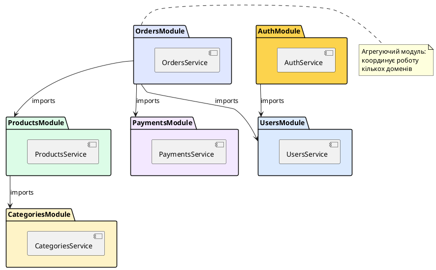

# Feature Modules: ізоляція функціональності

## Короткий зміст

- Що таке Feature Module (функціональний модуль)
- Організація коду за доменами бізнес-логіки
- Приклад: UsersModule (контролер, сервіс, репозиторій)
- Приклад: AuthModule, ProductsModule, OrdersModule
- Структура feature-модуля: окрема директорія з усіма компонентами
- Реєстрація feature-модуля у кореневому AppModule
- Ізоляція залежностей: кожен модуль має свої провайдери
- Експорт сервісів для використання в інших модулях
- Організація великого проєкту: модулі за бізнес-доменами
- Best practices: один модуль = одна область відповідальності

---

## Концепція Feature Module: домен-орієнтована архітектура

У попередній лекції ми розглянули загальну структуру модулів NestJS: декоратор `@Module()`, масиви `imports`, `controllers`, `providers`, `exports` та принципи інкапсуляції. Тепер перейдемо до практичного застосування цих знань для організації реального застосунку.

**Feature Module** (*функціональний модуль*) — це модуль, що інкапсулює повну функціональність конкретної **предметної області** (*domain*) або **бізнес-сутності**. На відміну від технічних модулів (DatabaseModule, ConfigModule), які надають інфраструктурні сервіси, feature modules організовані навколо бізнес-концепцій: користувачі, продукти, замовлення, платежі, повідомлення тощо.

Кожен feature module містить **усі компоненти**, необхідні для роботи з певною предметною областю:

- **Контролери** — HTTP-ендпоінти для взаємодії з клієнтами
- **Сервіси** — бізнес-логіка та оркестрація операцій
- **Репозиторії** — доступ до даних та персистентність
- **DTO** (*Data Transfer Objects*) — об'єкти для валідації та трансформації даних
- **Сутності** (*entities*) — моделі предметної області

Такий підхід називається **вертикальним поділом** (*vertical slicing*): замість розділення за технічними шарами (всі контролери в одному місці, всі сервіси в іншому), ми групуємо код за функціональністю. Це підвищує зв'язність (*cohesion*) всередині модуля та знижує зв'язаність (*coupling*) між модулями.

::card-group

::card{title="🎯 Мета лекції" icon="i-lucide-target"}

- Зрозуміти концепцію feature modules та домен-орієнтованої архітектури
- Навчитися структурувати код за бізнес-доменами замість технічних шарів
- Опанувати створення повнофункціональних модулів з контролерами, сервісами та репозиторіями
- Дослідити патерни взаємодії між feature modules
- Практикувати організацію великих застосунків через множину feature modules

::

::card{title="🔑 Ключові терміни" icon="i-lucide-key"}

- **Feature Module** — модуль, що інкапсулює повну функціональність предметної області
- **Domain** — бізнес-сутність або область відповідальності (користувачі, замовлення, платежі)
- **Vertical Slicing** — організація коду за функціональністю, а не за технічними шарами
- **Bounded Context** — межа відповідальності модуля, його власна модель предметної області
- **Cohesion** — міра зв'язності компонентів всередині модуля (висока — добре)
- **Coupling** — міра залежності між модулями (низька — добре)

::

::

---

## Структура типового Feature Module

Розглянемо класичну структуру feature module на прикладі модуля користувачів:

```
src/users/
├── dto/
│   ├── create-user.dto.ts
│   ├── update-user.dto.ts
│   └── user-response.dto.ts
├── entities/
│   └── user.entity.ts
├── users.controller.ts
├── users.service.ts
├── users.repository.ts
└── users.module.ts
```

Кожен файл має чітко визначену відповідальність:

### DTO (Data Transfer Objects)

Об'єкти передачі даних для валідації та трансформації вхідних/вихідних даних:

```typescript
// dto/create-user.dto.ts
import { IsEmail, IsString, MinLength } from 'class-validator';

export class CreateUserDto {
  @IsString()
  @MinLength(2)
  name: string;

  @IsEmail()
  email: string;

  @IsString()
  @MinLength(8)
  password: string;
}
```

```typescript
// dto/update-user.dto.ts
import { PartialType } from '@nestjs/mapped-types';
import { CreateUserDto } from './create-user.dto';

export class UpdateUserDto extends PartialType(CreateUserDto) {}
```

```typescript
// dto/user-response.dto.ts
export class UserResponseDto {
  id: number;
  name: string;
  email: string;
  createdAt: Date;
  // Пароль не включаємо у відповідь
}
```

### Entity (Модель даних)

Представлення сутності у базі даних (приклад для TypeORM):

```typescript
// entities/user.entity.ts
import { Entity, PrimaryGeneratedColumn, Column, CreateDateColumn, UpdateDateColumn } from 'typeorm';

@Entity('users')
export class User {
  @PrimaryGeneratedColumn()
  id: number;

  @Column()
  name: string;

  @Column({ unique: true })
  email: string;

  @Column()
  password: string;

  @Column({ default: true })
  isActive: boolean;

  @CreateDateColumn()
  createdAt: Date;

  @UpdateDateColumn()
  updatedAt: Date;
}
```

### Repository (Доступ до даних)

Інкапсуляція запитів до бази даних:

```typescript
// users.repository.ts
import { Injectable } from '@nestjs/common';
import { InjectRepository } from '@nestjs/typeorm';
import { Repository } from 'typeorm';
import { User } from './entities/user.entity';

@Injectable()
export class UsersRepository {
  constructor(
    @InjectRepository(User)
    private readonly repository: Repository<User>
  ) {}

  async create(userData: Partial<User>): Promise<User> {
    const user = this.repository.create(userData);
    return this.repository.save(user);
  }

  async findAll(): Promise<User[]> {
    return this.repository.find();
  }

  async findById(id: number): Promise<User | null> {
    return this.repository.findOne({ where: { id } });
  }

  async findByEmail(email: string): Promise<User | null> {
    return this.repository.findOne({ where: { email } });
  }

  async update(id: number, userData: Partial<User>): Promise<User | null> {
    await this.repository.update(id, userData);
    return this.findById(id);
  }

  async delete(id: number): Promise<boolean> {
    const result = await this.repository.delete(id);
    return result.affected > 0;
  }
}
```

### Service (Бізнес-логіка)

Оркестрація операцій, валідація бізнес-правил:

```typescript
// users.service.ts
import { Injectable, ConflictException, NotFoundException } from '@nestjs/common';
import { UsersRepository } from './users.repository';
import { CreateUserDto } from './dto/create-user.dto';
import { UpdateUserDto } from './dto/update-user.dto';
import * as bcrypt from 'bcrypt';

@Injectable()
export class UsersService {
  constructor(private readonly usersRepository: UsersRepository) {}

  async create(createUserDto: CreateUserDto) {
    // Перевірка унікальності email
    const existingUser = await this.usersRepository.findByEmail(createUserDto.email);
    if (existingUser) {
      throw new ConflictException('Користувач з таким email вже існує');
    }

    // Хешування пароля
    const hashedPassword = await bcrypt.hash(createUserDto.password, 10);

    // Створення користувача
    const user = await this.usersRepository.create({
      ...createUserDto,
      password: hashedPassword
    });

    // Видаляємо пароль з відповіді
    const { password, ...result } = user;
    return result;
  }

  async findAll() {
    const users = await this.usersRepository.findAll();
    return users.map(({ password, ...user }) => user);
  }

  async findOne(id: number) {
    const user = await this.usersRepository.findById(id);
    if (!user) {
      throw new NotFoundException(`Користувача з ID ${id} не знайдено`);
    }
    
    const { password, ...result } = user;
    return result;
  }

  async update(id: number, updateUserDto: UpdateUserDto) {
    const user = await this.usersRepository.findById(id);
    if (!user) {
      throw new NotFoundException(`Користувача з ID ${id} не знайдено`);
    }

    // Якщо змінюється пароль — хешуємо
    if (updateUserDto.password) {
      updateUserDto.password = await bcrypt.hash(updateUserDto.password, 10);
    }

    const updatedUser = await this.usersRepository.update(id, updateUserDto);
    const { password, ...result } = updatedUser;
    return result;
  }

  async remove(id: number) {
    const user = await this.usersRepository.findById(id);
    if (!user) {
      throw new NotFoundException(`Користувача з ID ${id} не знайдено`);
    }

    await this.usersRepository.delete(id);
    return { message: 'Користувача успішно видалено' };
  }
}
```

### Controller (HTTP-ендпоінти)

Обробка HTTP-запитів та делегування сервісу:

```typescript
// users.controller.ts
import { Controller, Get, Post, Patch, Delete, Body, Param, ParseIntPipe } from '@nestjs/common';
import { UsersService } from './users.service';
import { CreateUserDto } from './dto/create-user.dto';
import { UpdateUserDto } from './dto/update-user.dto';

@Controller('users')
export class UsersController {
  constructor(private readonly usersService: UsersService) {}

  @Post()
  create(@Body() createUserDto: CreateUserDto) {
    return this.usersService.create(createUserDto);
  }

  @Get()
  findAll() {
    return this.usersService.findAll();
  }

  @Get(':id')
  findOne(@Param('id', ParseIntPipe) id: number) {
    return this.usersService.findOne(id);
  }

  @Patch(':id')
  update(
    @Param('id', ParseIntPipe) id: number,
    @Body() updateUserDto: UpdateUserDto
  ) {
    return this.usersService.update(id, updateUserDto);
  }

  @Delete(':id')
  remove(@Param('id', ParseIntPipe) id: number) {
    return this.usersService.remove(id);
  }
}
```

### Module (Об'єднання компонентів)

Декларація модуля з реєстрацією всіх компонентів:

```typescript
// users.module.ts
import { Module } from '@nestjs/common';
import { TypeOrmModule } from '@nestjs/typeorm';
import { UsersController } from './users.controller';
import { UsersService } from './users.service';
import { UsersRepository } from './users.repository';
import { User } from './entities/user.entity';

@Module({
  imports: [
    TypeOrmModule.forFeature([User])  // Реєстрація сутності для TypeORM
  ],
  controllers: [UsersController],
  providers: [UsersService, UsersRepository],
  exports: [UsersService]  // Експортуємо для використання в інших модулях
})
export class UsersModule {}
```

::note
Зверніть увагу на **чітке розділення відповідальностей**: контролер обробляє HTTP, сервіс виконує бізнес-логіку, репозиторій працює з базою даних. Кожен компонент має одну причину для зміни (*Single Responsibility Principle*).
::

---

## Приклади Feature Modules за різними доменами

Розглянемо кілька типових feature modules для різних бізнес-сутностей:

### AuthModule: автентифікація та авторизація

```typescript
// auth/auth.module.ts
import { Module } from '@nestjs/common';
import { JwtModule } from '@nestjs/jwt';
import { PassportModule } from '@nestjs/passport';
import { AuthController } from './auth.controller';
import { AuthService } from './auth.service';
import { JwtStrategy } from './strategies/jwt.strategy';
import { UsersModule } from '../users/users.module';

@Module({
  imports: [
    UsersModule,  // Потрібен для перевірки користувачів
    PassportModule.register({ defaultStrategy: 'jwt' }),
    JwtModule.register({
      secret: process.env.JWT_SECRET,
      signOptions: { expiresIn: '1d' }
    })
  ],
  controllers: [AuthController],
  providers: [AuthService, JwtStrategy],
  exports: [AuthService, JwtModule]
})
export class AuthModule {}
```

**Ключові особливості:**
- Імпортує `UsersModule` для доступу до `UsersService`
- Експортує `AuthService` для використання у guard'ах інших модулів
- Використовує зовнішні модулі (`JwtModule`, `PassportModule`)

### ProductsModule: каталог товарів

```typescript
// products/products.module.ts
import { Module } from '@nestjs/common';
import { TypeOrmModule } from '@nestjs/typeorm';
import { ProductsController } from './products.controller';
import { ProductsService } from './products.service';
import { ProductsRepository } from './products.repository';
import { Product } from './entities/product.entity';
import { CategoriesModule } from '../categories/categories.module';

@Module({
  imports: [
    TypeOrmModule.forFeature([Product]),
    CategoriesModule  // Для прив'язки продуктів до категорій
  ],
  controllers: [ProductsController],
  providers: [ProductsService, ProductsRepository],
  exports: [ProductsService]
})
export class ProductsModule {}
```

### OrdersModule: управління замовленнями

```typescript
// orders/orders.module.ts
import { Module } from '@nestjs/common';
import { TypeOrmModule } from '@nestjs/typeorm';
import { OrdersController } from './orders.controller';
import { OrdersService } from './orders.service';
import { OrdersRepository } from './orders.repository';
import { Order } from './entities/order.entity';
import { OrderItem } from './entities/order-item.entity';
import { UsersModule } from '../users/users.module';
import { ProductsModule } from '../products/products.module';
import { PaymentsModule } from '../payments/payments.module';

@Module({
  imports: [
    TypeOrmModule.forFeature([Order, OrderItem]),
    UsersModule,      // Для перевірки користувача
    ProductsModule,   // Для перевірки наявності товарів
    PaymentsModule    // Для обробки оплати
  ],
  controllers: [OrdersController],
  providers: [OrdersService, OrdersRepository],
  exports: [OrdersService]
})
export class OrdersModule {}
```

**Ключова особливість:** `OrdersModule` імпортує багато інших feature modules, оскільки замовлення — це **агрегуючий домен**, що координує роботу користувачів, продуктів та платежів.

::plant-uml{alt="Взаємодія Feature Modules"}



::

---

## Реєстрація Feature Modules у кореневому AppModule

Після створення feature modules їх потрібно зареєструвати у кореневому модулі застосунку:

```typescript
// app.module.ts
import { Module } from '@nestjs/common';
import { ConfigModule } from '@nestjs/config';
import { TypeOrmModule } from '@nestjs/typeorm';
import { UsersModule } from './users/users.module';
import { AuthModule } from './auth/auth.module';
import { ProductsModule } from './products/products.module';
import { CategoriesModule } from './categories/categories.module';
import { OrdersModule } from './orders/orders.module';
import { PaymentsModule } from './payments/payments.module';

@Module({
  imports: [
    // Інфраструктурні модулі
    ConfigModule.forRoot({ isGlobal: true }),
    TypeOrmModule.forRoot({
      type: 'postgres',
      host: process.env.DB_HOST,
      port: parseInt(process.env.DB_PORT),
      username: process.env.DB_USER,
      password: process.env.DB_PASSWORD,
      database: process.env.DB_NAME,
      autoLoadEntities: true,
      synchronize: process.env.NODE_ENV === 'development'
    }),

    // Feature modules
    UsersModule,
    AuthModule,
    CategoriesModule,
    ProductsModule,
    PaymentsModule,
    OrdersModule
  ]
})
export class AppModule {}
```

::tip
Групуйте імпорти за типами: спочатку інфраструктурні модулі (конфігурація, база даних), потім feature modules. Для великих застосунків можна додатково групувати feature modules за бізнес-областями через коментарі.
::

---

## Ізоляція залежностей: інкапсуляція у межах модуля

Кожен feature module має власний набір провайдерів, які за замовчуванням **приватні** для цього модуля. Це означає, що `UsersRepository` з `UsersModule` не може бути ін'єктований у `OrdersService`, навіть якщо `OrdersModule` імпортує `UsersModule`.

### Правильна організація залежностей

```typescript
// ✅ ПРАВИЛЬНО: OrdersService залежить від UsersService
@Injectable()
export class OrdersService {
  constructor(
    private readonly usersService: UsersService  // Експортований з UsersModule
  ) {}

  async createOrder(userId: number, items: any[]) {
    const user = await this.usersService.findOne(userId);
    // Створення замовлення
  }
}
```

```typescript
// ❌ НЕПРАВИЛЬНО: пряма залежність від репозиторію
@Injectable()
export class OrdersService {
  constructor(
    private readonly usersRepository: UsersRepository  // Приватний для UsersModule!
  ) {}
}
```

Ця помилка призведе до виключення:

```
Error: Nest can't resolve dependencies of the OrdersService (?). 
Please make sure that the argument UsersRepository at index [0] 
is available in the OrdersModule context.
```

::warning
Ніколи не експортуйте репозиторії з feature modules. Репозиторії — це **деталь реалізації** модуля. Зовнішні модулі мають взаємодіяти лише через **публічний API сервісу**. Це дозволяє змінювати спосіб зберігання даних (наприклад, перейти з PostgreSQL на MongoDB) без впливу на споживачів модуля.
::

---

## Експорт сервісів для міжмодульної взаємодії

Щоб інші модулі могли використовувати функціональність feature module, потрібно експортувати відповідні сервіси:

```typescript
// users/users.module.ts
@Module({
  imports: [TypeOrmModule.forFeature([User])],
  controllers: [UsersController],
  providers: [UsersService, UsersRepository],
  exports: [UsersService]  // ✅ Експортуємо UsersService
})
export class UsersModule {}
```

Тепер `UsersService` можна ін'єктувати в інших модулях:

```typescript
// auth/auth.module.ts
@Module({
  imports: [UsersModule],  // Імпортуємо UsersModule
  providers: [AuthService],
  exports: [AuthService]
})
export class AuthModule {}

// auth/auth.service.ts
@Injectable()
export class AuthService {
  constructor(
    private readonly usersService: UsersService  // ✅ Доступний завдяки exports
  ) {}

  async validateUser(email: string, password: string) {
    const user = await this.usersService.findByEmail(email);
    // Перевірка пароля
  }
}
```

### Що експортувати з Feature Module?

**✅ Експортуйте:**
- Сервіси з бізнес-логікою, які потрібні іншим модулям
- Публічні інтерфейси та DTO, якщо вони є частиною контракту

**❌ Не експортуйте:**
- Репозиторії (деталь реалізації)
- Контролери (неможливо експортувати)
- Внутрішні хелпери та утиліти
- Приватні сервіси, що використовуються лише всередині модуля


---

## Організація великого проєкту за бізнес-доменами

У великих застосунках кількість feature modules може сягати десятків. Розглянемо структуру реального enterprise-застосунку для e-commerce платформи:

```
src/
├── app.module.ts
├── main.ts
│
├── common/                    # Спільна функціональність
│   ├── guards/
│   ├── interceptors/
│   ├── filters/
│   └── pipes/
│
├── config/                    # Конфігурація
│   └── config.module.ts
│
├── database/                  # Інфраструктура БД
│   └── database.module.ts
│
├── users/                     # Домен: Користувачі
│   ├── dto/
│   ├── entities/
│   ├── users.controller.ts
│   ├── users.service.ts
│   ├── users.repository.ts
│   └── users.module.ts
│
├── auth/                      # Домен: Автентифікація
│   ├── strategies/
│   ├── guards/
│   ├── auth.controller.ts
│   ├── auth.service.ts
│   └── auth.module.ts
│
├── products/                  # Домен: Продукти
│   ├── dto/
│   ├── entities/
│   ├── products.controller.ts
│   ├── products.service.ts
│   ├── products.repository.ts
│   └── products.module.ts
│
├── categories/                # Домен: Категорії
│   ├── dto/
│   ├── entities/
│   ├── categories.controller.ts
│   ├── categories.service.ts
│   └── categories.module.ts
│
├── cart/                      # Домен: Кошик
│   ├── dto/
│   ├── entities/
│   ├── cart.controller.ts
│   ├── cart.service.ts
│   └── cart.module.ts
│
├── orders/                    # Домен: Замовлення
│   ├── dto/
│   ├── entities/
│   ├── orders.controller.ts
│   ├── orders.service.ts
│   ├── orders.repository.ts
│   └── orders.module.ts
│
├── payments/                  # Домен: Платежі
│   ├── dto/
│   ├── gateways/
│   ├── payments.controller.ts
│   ├── payments.service.ts
│   └── payments.module.ts
│
├── shipping/                  # Домен: Доставка
│   ├── dto/
│   ├── providers/
│   ├── shipping.controller.ts
│   ├── shipping.service.ts
│   └── shipping.module.ts
│
├── notifications/             # Домен: Повідомлення
│   ├── channels/
│   ├── notifications.service.ts
│   └── notifications.module.ts
│
├── reviews/                   # Домен: Відгуки
│   ├── dto/
│   ├── entities/
│   ├── reviews.controller.ts
│   ├── reviews.service.ts
│   └── reviews.module.ts
│
└── analytics/                 # Домен: Аналітика
    ├── analytics.service.ts
    └── analytics.module.ts
```

### Принципи організації

1. **Один модуль = одна bounded context**: кожен feature module відповідає за конкретну бізнес-сутність
2. **Самодостатність**: модуль містить все необхідне для роботи з доменом (контролери, сервіси, сутності, DTO)
3. **Чіткі межі**: взаємодія між модулями лише через експортовані сервіси
4. **Незалежність**: модуль можна розробляти, тестувати та розгортати незалежно

---

## Взаємодія між Feature Modules: патерни та антипаттерни

### ✅ Патерн 1: Сервіс-орієнтована взаємодія

Модулі взаємодіють через експортовані сервіси:

```typescript
// orders/orders.service.ts
@Injectable()
export class OrdersService {
  constructor(
    private readonly usersService: UsersService,
    private readonly productsService: ProductsService,
    private readonly paymentsService: PaymentsService
  ) {}

  async createOrder(userId: number, items: { productId: number; quantity: number }[]) {
    // Перевірка користувача
    const user = await this.usersService.findOne(userId);
    
    // Перевірка доступності продуктів
    const products = await Promise.all(
      items.map(item => this.productsService.findOne(item.productId))
    );

    // Обчислення суми
    const totalAmount = items.reduce((sum, item, index) => {
      return sum + products[index].price * item.quantity;
    }, 0);

    // Створення замовлення
    const order = await this.ordersRepository.create({
      userId,
      items,
      totalAmount,
      status: 'pending'
    });

    // Обробка оплати
    const payment = await this.paymentsService.processPayment({
      orderId: order.id,
      amount: totalAmount
    });

    return { order, payment };
  }
}
```

### ✅ Патерн 2: Подієва взаємодія (Event-Driven)

Для слабкої зв'язаності між модулями використовуйте події:

```typescript
// orders/orders.service.ts
import { EventEmitter2 } from '@nestjs/event-emitter';

@Injectable()
export class OrdersService {
  constructor(
    private readonly eventEmitter: EventEmitter2
  ) {}

  async createOrder(orderData: any) {
    const order = await this.ordersRepository.create(orderData);
    
    // Випускаємо подію замість прямого виклику сервісів
    this.eventEmitter.emit('order.created', { orderId: order.id, userId: order.userId });
    
    return order;
  }
}

// notifications/notifications.service.ts
import { OnEvent } from '@nestjs/event-emitter';

@Injectable()
export class NotificationsService {
  @OnEvent('order.created')
  async handleOrderCreated(payload: { orderId: number; userId: number }) {
    // Відправка повідомлення про створення замовлення
    await this.sendEmail(payload.userId, 'Ваше замовлення створено!');
  }
}
```

### ❌ Антипаттерн: Циклічні залежності

```typescript
// ❌ НЕПРАВИЛЬНО: UsersService залежить від OrdersService
@Injectable()
export class UsersService {
  constructor(private readonly ordersService: OrdersService) {}
}

// ❌ НЕПРАВИЛЬНО: OrdersService залежить від UsersService
@Injectable()
export class OrdersService {
  constructor(private readonly usersService: UsersService) {}
}
```

Це призведе до помилки під час ініціалізації. **Рішення:** використовуйте події або винесіть спільну логіку в окремий модуль.

### ❌ Антипаттерн: Надмірна зв'язаність

```typescript
// ❌ НЕПРАВИЛЬНО: прямий доступ до репозиторію іншого модуля
@Injectable()
export class OrdersService {
  constructor(
    private readonly usersRepository: UsersRepository  // Порушення інкапсуляції!
  ) {}
}
```

**Чому це погано:**
- Порушується інкапсуляція модуля
- Зовнішній модуль залежить від деталей реалізації
- Неможливо змінити спосіб зберігання даних без впливу на споживачів

**Правильно:** взаємодія через сервіс:
```typescript
@Injectable()
export class OrdersService {
  constructor(
    private readonly usersService: UsersService  // Залежність від публічного API
  ) {}
}
```

---

## Best Practices: правила проєктування Feature Modules

::card-group

::card{title="🎯 Bounded Context" icon="i-lucide-box"}

**Принцип:** Кожен модуль має чітко визначені межі відповідальності

**Правила:**
- Один модуль = одна бізнес-сутність або домен
- Уникайте "божественних" модулів, що роблять все
- Якщо модуль містить >10 провайдерів — розділіть його на підмодулі

**Приклад розділення:**
```
products/
├── products-catalog/
│   └── products-catalog.module.ts
├── products-inventory/
│   └── products-inventory.module.ts
└── products.module.ts  (об'єднує підмодулі)
```

::

::card{title="🔒 Інкапсуляція" icon="i-lucide-lock"}

**Принцип:** Приховуйте деталі реалізації

**Правила:**
- Експортуйте тільки сервіси, які складають публічний API
- Репозиторії, хелпери, утиліти мають бути приватними
- Використовуйте DTO для контракту даних між модулями

**Приклад:**
```typescript
@Module({
  providers: [
    UsersService,        // Публічний API
    UsersRepository,     // Приватна деталь
    PasswordHasher,      // Приватна деталь
    EmailValidator       // Приватна деталь
  ],
  exports: [UsersService]  // Експортуємо тільки публічний API
})
```

::

::card{title="🔗 Слабка зв'язаність" icon="i-lucide-unlink"}

**Принцип:** Мінімізуйте залежності між модулями

**Правила:**
- Уникайте прямих залежностей від багатьох модулів
- Використовуйте події для асинхронної взаємодії
- Створюйте проміжні модулі для координації

**Приклад подієвої взаємодії:**
```typescript
// Замість прямих викликів
this.notificationsService.send();
this.analyticsService.track();
this.auditService.log();

// Використовуйте події
this.eventEmitter.emit('user.registered', userData);
```

::

::card{title="📦 Переусопоставлення" icon="i-lucide-package"}

**Принцип:** Модулі мають бути автономними та переусопоставлюваними

**Правила:**
- Уникайте жорстких залежностей від конкретного оточення
- Використовуйте dependency injection для всіх зовнішніх сервісів
- Документуйте залежності модуля

**Приклад переусопоставлюваного модуля:**
```typescript
@Module({
  imports: [
    // Всі залежності явно оголошені
    DatabaseModule,
    ConfigModule
  ],
  providers: [UsersService],
  exports: [UsersService]
})
export class UsersModule {}
```

::

::

---

## Генерація Feature Module через CLI

NestJS CLI дозволяє автоматизувати створення feature modules:

```bash
# Генерація повного модуля з усіма компонентами
nest g resource products
```

::terminal-preview{title="nest generate resource products" :cursor="false"}

<div class="line"><span class="opacity-40">$</span> <strong class="font-bold">nest generate resource products</strong></div>
<div class="line"></div>
<div class="line">? What transport layer do you use? <span class="text-blue-400 font-bold">REST API</span></div>
<div class="line">? Would you like to generate CRUD entry points? <span class="text-green-400 font-bold">Yes</span></div>
<div class="line"></div>
<div class="line"><span class="text-green-400">CREATE</span> src/products/products.controller.ts <span class="opacity-60">(894 bytes)</span></div>
<div class="line"><span class="text-green-400">CREATE</span> src/products/products.controller.spec.ts <span class="opacity-60">(566 bytes)</span></div>
<div class="line"><span class="text-green-400">CREATE</span> src/products/products.module.ts <span class="opacity-60">(247 bytes)</span></div>
<div class="line"><span class="text-green-400">CREATE</span> src/products/products.service.ts <span class="opacity-60">(609 bytes)</span></div>
<div class="line"><span class="text-green-400">CREATE</span> src/products/products.service.spec.ts <span class="opacity-60">(453 bytes)</span></div>
<div class="line"><span class="text-green-400">CREATE</span> src/products/dto/create-product.dto.ts <span class="opacity-60">(30 bytes)</span></div>
<div class="line"><span class="text-green-400">CREATE</span> src/products/dto/update-product.dto.ts <span class="opacity-60">(169 bytes)</span></div>
<div class="line"><span class="text-green-400">CREATE</span> src/products/entities/product.entity.ts <span class="opacity-60">(21 bytes)</span></div>
<div class="line"><span class="text-yellow-400">UPDATE</span> src/app.module.ts <span class="opacity-60">(312 bytes)</span></div>
<div class="line"></div>
<div class="line"><span class="text-green-400 font-bold">✔</span> Resource "products" successfully generated</div>

::

Ця команда створює повну структуру feature module:
- Контролер з CRUD-ендпоінтами
- Сервіс з базовою CRUD-логікою
- DTO для створення та оновлення
- Сутність (entity)
- Тестові файли
- Автоматичну реєстрацію у `AppModule`

---

## Запитання для самоперевірки

::accordion

::accordion-item{label="❓ Яка різниця між feature module та technical module?" icon="i-lucide-help-circle"}

**Feature Module** організований навколо **бізнес-домену** (Users, Products, Orders) та містить усі компоненти для роботи з цим доменом: контролери, сервіси, репозиторії, DTO.

**Technical Module** організований навколо **технічної функції** (Database, Config, Logger) та надає інфраструктурні сервіси, які використовуються багатьма feature modules.

**Приклади:**
- Feature: `UsersModule`, `OrdersModule`, `PaymentsModule`
- Technical: `DatabaseModule`, `ConfigModule`, `LoggerModule`

::

::accordion-item{label="❓ Чому не можна експортувати репозиторії з feature module?" icon="i-lucide-help-circle"}

Репозиторії є **деталлю реалізації** модуля. Експорт репозиторію призводить до:

1. **Порушення інкапсуляції**: зовнішні модулі отримують доступ до внутрішньої структури даних
2. **Висока зв'язаність**: споживачі залежать від способу зберігання даних
3. **Складність рефакторингу**: неможливо змінити ORM або структуру БД без впливу на всі споживачі

**Правильно:** експортуйте сервіс, який інкапсулює роботу з репозиторієм:

```typescript
@Module({
  providers: [UsersService, UsersRepository],
  exports: [UsersService]  // ✅ Експортуємо сервіс, а не репозиторій
})
export class UsersModule {}
```

::

::accordion-item{label="❓ Коли feature module має імпортувати інші feature modules?" icon="i-lucide-help-circle"}

Feature module імпортує інші feature modules, коли його бізнес-логіка **залежить від функціональності цих модулів**.

**Приклади:**
- `OrdersModule` імпортує `UsersModule`, `ProductsModule`, `PaymentsModule` — для перевірки користувача, доступності товарів та обробки оплати
- `AuthModule` імпортує `UsersModule` — для валідації облікових даних користувача
- `ReviewsModule` імпортує `UsersModule`, `ProductsModule` — для перевірки, що користувач купував продукт перед залишенням відгуку

**Антипаттерн:** імпортувати модуль "на всяк випадок" без реальної потреби.

::

::accordion-item{label="❓ Як уникнути циклічних залежностей між feature modules?" icon="i-lucide-help-circle"}

Циклічні залежності виникають, коли два модулі залежать один від одного:

```
UsersModule → OrdersModule → UsersModule (цикл!)
```

**Рішення:**

1. **Переглянути архітектуру**: можливо, один з модулів не повинен залежати від іншого
2. **Використати події**: замість прямих викликів використовуйте `EventEmitter`
3. **Винести спільну логіку**: створіть третій модуль для координації
4. **Forward reference**: використовуйте `forwardRef()` (тільки у крайньому випадку!)

**Приклад з подіями:**
```typescript
// Замість циклічної залежності
@Injectable()
export class UsersService {
  constructor(private readonly eventEmitter: EventEmitter2) {}

  async register(userData: any) {
    const user = await this.create(userData);
    this.eventEmitter.emit('user.registered', user);  // Подія замість прямого виклику
    return user;
  }
}
```

::

::

---

## Висновки

Feature Modules є основою модульної архітектури NestJS для організації великих застосунків. Ключові принципи:

- **Домен-орієнтована організація**: один модуль = одна бізнес-сутність
- **Вертикальний поділ**: всі компоненти домену у одному місці
- **Інкапсуляція**: приховування деталей реалізації
- **Слабка зв'язаність**: мінімальні залежності між модулями
- **Висока зв'язність**: тісна зв'язок компонентів всередині модуля

У наступних лекціях ми розглянемо інші типи модулів: Shared Modules для переусопоставлення загальної функціональності, Global Modules для глобально доступних сервісів та Dynamic Modules для конфігурації під час виконання.
