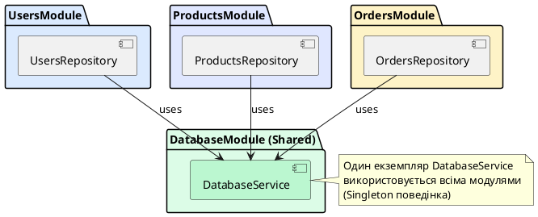
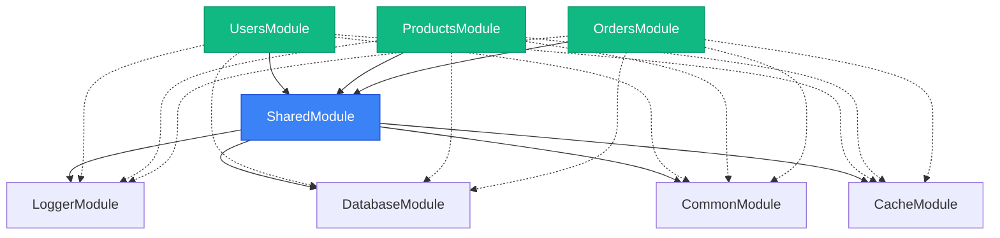

# Shared Modules: перевикористання провайдерів

## Короткий зміст

- Що таке Shared Module (спільний модуль)
- Проблема: кілька модулів потребують одного сервісу
- Експорт провайдерів через масив `exports`
- Імпорт модуля для доступу до експортованих провайдерів
- Приклад: DatabaseModule експортує DatabaseService
- Приклад: CommonModule з утилітами (LoggerService, ConfigService)
- Реекспорт модулів: експорт імпортованих модулів
- Singleton-поведінка: один екземпляр для всіх модулів
- Організація спільного коду: shared/ або common/ директорія
- Best practices: експортувати тільки необхідні провайдери

---

## Концепція Shared Module: переусопоставлення загальної функціональності

У попередній лекції ми розглянули Feature Modules — модулі, організовані навколо бізнес-доменів (Users, Products, Orders). Проте у будь-якому застосунку є функціональність, яка потрібна **багатьом модулям одночасно**: логування, валідація, робота з датами, HTTP-клієнти, утиліти тощо.

**Shared Module** (*спільний модуль*) — це модуль, який інкапсулює загальну функціональність та **експортує** свої провайдери для використання в інших модулях. На відміну від Feature Modules, які орієнтовані на конкретний бізнес-домен, Shared Modules надають **горизонтальні сервіси** — функції, що використовуються наскрізь у всьому застосунку.

Ключова ідея полягає у принципі **DRY** (*Don't Repeat Yourself*): замість дублювання однієї логіки у кількох модулях, ми створюємо один Shared Module, який можна імпортувати скрізь, де потрібно.

::card-group

::card{title="🎯 Мета лекції" icon="i-lucide-target"}

- Зрозуміти концепцію Shared Modules та їх відмінність від Feature Modules
- Опанувати механізм експорту та імпорту провайдерів між модулями
- Навчитися створювати переусопоставлювані модулі для загальної функціональності
- Дослідити патерн реекспорту модулів для агрегації функціональності
- Усвідомити singleton-поведінку провайдерів у Shared Modules

::

::card{title="🔑 Ключові терміни" icon="i-lucide-key"}

- **Shared Module** — модуль, що експортує провайдери для використання в інших модулях
- **Re-export** — експорт імпортованих модулів для агрегації функціональності
- **Horizontal Services** — сервіси, що використовуються наскрізь у застосунку (логування, валідація)
- **Singleton Behavior** — один екземпляр провайдера для всього застосунку, незалежно від кількості імпортів

::

::

---

## Проблема: дублювання залежностей у множині модулів

Розглянемо ситуацію без використання Shared Modules. Припустімо, у нас є `LoggerService`, який потрібен у трьох різних модулях:

```typescript
// users/users.module.ts
@Module({
  providers: [UsersService, LoggerService],  // Дублювання LoggerService
  controllers: [UsersController]
})
export class UsersModule {}

// products/products.module.ts
@Module({
  providers: [ProductsService, LoggerService],  // Дублювання LoggerService
  controllers: [ProductsController]
})
export class ProductsModule {}

// orders/orders.module.ts
@Module({
  providers: [OrdersService, LoggerService],  // Дублювання LoggerService
  controllers: [OrdersController]
})
export class OrdersModule {}
```

**Проблеми цього підходу:**

1. **Дублювання коду**: `LoggerService` реєструється у кожному модулі окремо
2. **Складність підтримки**: зміни у `LoggerService` потребують оновлення всіх модулів
3. **Порушення DRY**: одна й та сама конфігурація повторюється багато разів
4. **Ризик неконсистентності**: різні модулі можуть налаштовувати `LoggerService` по-різному

**Рішення:** створити `LoggerModule` як Shared Module та імпортувати його скрізь:

```typescript
// logger/logger.module.ts
@Module({
  providers: [LoggerService],
  exports: [LoggerService]  // Експортуємо для інших модулів
})
export class LoggerModule {}

// users/users.module.ts
@Module({
  imports: [LoggerModule],  // Імпортуємо модуль
  providers: [UsersService],
  controllers: [UsersController]
})
export class UsersModule {}

// products/products.module.ts
@Module({
  imports: [LoggerModule],  // Імпортуємо той самий модуль
  providers: [ProductsService],
  controllers: [ProductsController]
})
export class ProductsModule {}
```

Тепер `LoggerService` визначено у одному місці, і всі модулі отримують доступ до нього через імпорт `LoggerModule`.

---

## Експорт провайдерів через масив exports

Щоб зробити провайдер доступним для інших модулів, його потрібно включити до масиву `exports` у декораторі `@Module()`. Лише експортовані провайдери стають частиною **публічного API** модуля.

### Базовий приклад: LoggerModule

```typescript
// logger/logger.service.ts
import { Injectable } from '@nestjs/common';

@Injectable()
export class LoggerService {
  log(message: string, context?: string): void {
    const timestamp = new Date().toISOString();
    const contextStr = context ? `[${context}]` : '';
    console.log(`${timestamp} ${contextStr} ${message}`);
  }

  error(message: string, trace?: string, context?: string): void {
    const timestamp = new Date().toISOString();
    const contextStr = context ? `[${context}]` : '';
    console.error(`${timestamp} ${contextStr} ERROR: ${message}`);
    if (trace) {
      console.error(trace);
    }
  }

  warn(message: string, context?: string): void {
    const timestamp = new Date().toISOString();
    const contextStr = context ? `[${context}]` : '';
    console.warn(`${timestamp} ${contextStr} WARNING: ${message}`);
  }
}
```

```typescript
// logger/logger.module.ts
import { Module } from '@nestjs/common';
import { LoggerService } from './logger.service';

@Module({
  providers: [LoggerService],
  exports: [LoggerService]  // ✅ Експортуємо для використання в інших модулях
})
export class LoggerModule {}
```

Тепер `LoggerService` можна ін'єктувати у будь-якому модулі, що імпортує `LoggerModule`:

```typescript
// users/users.service.ts
import { Injectable } from '@nestjs/common';
import { LoggerService } from '../logger/logger.service';

@Injectable()
export class UsersService {
  constructor(private readonly logger: LoggerService) {}

  async createUser(userData: any) {
    this.logger.log('Creating new user', 'UsersService');
    // Логіка створення користувача
    this.logger.log(`User created with ID: ${userData.id}`, 'UsersService');
  }
}
```

::note
Експортований провайдер залишається **singleton** — всі модулі, що імпортують `LoggerModule`, отримують **той самий екземпляр** `LoggerService`. Це забезпечує консистентність стану (наприклад, лічильників логів) у всьому застосунку.
::

---

## Приклад: DatabaseModule для спільного підключення

Розглянемо більш складний приклад — модуль для роботи з базою даних, який надає підключення всім feature modules:

```typescript
// database/database.service.ts
import { Injectable, OnModuleInit, OnModuleDestroy } from '@nestjs/common';
import { Pool, PoolClient } from 'pg';

@Injectable()
export class DatabaseService implements OnModuleInit, OnModuleDestroy {
  private pool: Pool;

  async onModuleInit() {
    this.pool = new Pool({
      host: process.env.DB_HOST,
      port: parseInt(process.env.DB_PORT, 10),
      user: process.env.DB_USER,
      password: process.env.DB_PASSWORD,
      database: process.env.DB_NAME,
      max: 20
    });

    console.log('✓ Database connection pool initialized');
  }

  async onModuleDestroy() {
    await this.pool.end();
    console.log('✗ Database connection pool closed');
  }

  async query(text: string, params?: any[]): Promise<any> {
    const client = await this.pool.connect();
    try {
      const result = await client.query(text, params);
      return result.rows;
    } finally {
      client.release();
    }
  }

  async getClient(): Promise<PoolClient> {
    return this.pool.connect();
  }
}
```

```typescript
// database/database.module.ts
import { Module } from '@nestjs/common';
import { DatabaseService } from './database.service';

@Module({
  providers: [DatabaseService],
  exports: [DatabaseService]  // Експортуємо для всіх модулів
})
export class DatabaseModule {}
```

Тепер feature modules можуть імпортувати `DatabaseModule` та використовувати `DatabaseService`:

```typescript
// users/users.module.ts
@Module({
  imports: [DatabaseModule],  // Імпортуємо для доступу до DatabaseService
  providers: [UsersService, UsersRepository],
  controllers: [UsersController],
  exports: [UsersService]
})
export class UsersModule {}

// users/users.repository.ts
@Injectable()
export class UsersRepository {
  constructor(private readonly db: DatabaseService) {}

  async findAll(): Promise<any[]> {
    return this.db.query('SELECT * FROM users');
  }

  async findById(id: number): Promise<any> {
    const result = await this.db.query('SELECT * FROM users WHERE id = $1', [id]);
    return result[0];
  }

  async create(userData: any): Promise<any> {
    const result = await this.db.query(
      'INSERT INTO users (name, email) VALUES ($1, $2) RETURNING *',
      [userData.name, userData.email]
    );
    return result[0];
  }
}
```

::plant-uml{alt="DatabaseModule як Shared Module"}



::

---

## CommonModule: агрегація утиліт та допоміжних сервісів

У великих застосунках часто створюють **CommonModule** або **SharedModule**, який агрегує багато переусопоставлюваних сервісів:

```typescript
// common/services/date.service.ts
import { Injectable } from '@nestjs/common';

@Injectable()
export class DateService {
  formatDate(date: Date): string {
    return date.toISOString().split('T')[0];
  }

  addDays(date: Date, days: number): Date {
    const result = new Date(date);
    result.setDate(result.getDate() + days);
    return result;
  }

  isExpired(date: Date): boolean {
    return date < new Date();
  }
}
```

```typescript
// common/services/validation.service.ts
import { Injectable } from '@nestjs/common';

@Injectable()
export class ValidationService {
  isValidEmail(email: string): boolean {
    const regex = /^[^\s@]+@[^\s@]+\.[^\s@]+$/;
    return regex.test(email);
  }

  isValidPhone(phone: string): boolean {
    const regex = /^\+?[1-9]\d{1,14}$/;
    return regex.test(phone);
  }

  sanitizeString(str: string): string {
    return str.trim().toLowerCase();
  }
}
```

```typescript
// common/services/crypto.service.ts
import { Injectable } from '@nestjs/common';
import * as bcrypt from 'bcrypt';
import * as crypto from 'crypto';

@Injectable()
export class CryptoService {
  async hashPassword(password: string): Promise<string> {
    return bcrypt.hash(password, 10);
  }

  async comparePasswords(password: string, hash: string): Promise<boolean> {
    return bcrypt.compare(password, hash);
  }

  generateToken(length: number = 32): string {
    return crypto.randomBytes(length).toString('hex');
  }

  generateUUID(): string {
    return crypto.randomUUID();
  }
}
```

```typescript
// common/common.module.ts
import { Module } from '@nestjs/common';
import { DateService } from './services/date.service';
import { ValidationService } from './services/validation.service';
import { CryptoService } from './services/crypto.service';
import { LoggerService } from '../logger/logger.service';

@Module({
  providers: [
    DateService,
    ValidationService,
    CryptoService,
    LoggerService
  ],
  exports: [
    DateService,
    ValidationService,
    CryptoService,
    LoggerService
  ]
})
export class CommonModule {}
```

Тепер feature modules можуть імпортувати `CommonModule` та отримувати доступ до всіх утиліт одночасно:

```typescript
// users/users.module.ts
@Module({
  imports: [
    DatabaseModule,
    CommonModule  // Імпортуємо всі утиліти одночасно
  ],
  providers: [UsersService, UsersRepository],
  controllers: [UsersController],
  exports: [UsersService]
})
export class UsersModule {}

// users/users.service.ts
@Injectable()
export class UsersService {
  constructor(
    private readonly usersRepository: UsersRepository,
    private readonly logger: LoggerService,
    private readonly crypto: CryptoService,
    private readonly validation: ValidationService
  ) {}

  async register(email: string, password: string) {
    if (!this.validation.isValidEmail(email)) {
      throw new BadRequestException('Invalid email format');
    }

    const hashedPassword = await this.crypto.hashPassword(password);
    const user = await this.usersRepository.create({ email, password: hashedPassword });

    this.logger.log(`User registered: ${email}`, 'UsersService');
    return user;
  }
}
```

---

## Реекспорт модулів: експорт імпортованих модулів

NestJS дозволяє **реекспортувати** імпортовані модулі через масив `exports`. Це дозволяє створювати **модулі-агрегатори**, які комбінують функціональність кількох модулів під одним іменем.

### Приклад: SharedModule як агрегатор

```typescript
// shared/shared.module.ts
import { Module } from '@nestjs/common';
import { LoggerModule } from '../logger/logger.module';
import { DatabaseModule } from '../database/database.module';
import { CommonModule } from '../common/common.module';
import { CacheModule } from '../cache/cache.module';

@Module({
  imports: [
    LoggerModule,
    DatabaseModule,
    CommonModule,
    CacheModule
  ],
  exports: [
    LoggerModule,    // Реекспорт
    DatabaseModule,  // Реекспорт
    CommonModule,    // Реекспорт
    CacheModule      // Реекспорт
  ]
})
export class SharedModule {}
```

Тепер feature modules можуть імпортувати `SharedModule` замість чотирьох окремих модулів:

```typescript
// users/users.module.ts
@Module({
  imports: [SharedModule],  // Одразу отримуємо Logger, Database, Common, Cache
  providers: [UsersService, UsersRepository],
  controllers: [UsersController],
  exports: [UsersService]
})
export class UsersModule {}
```

::tip
Використовуйте реекспорт для створення логічних груп модулів. Наприклад, `InfrastructureModule` може реекспортувати всі інфраструктурні модулі (Database, Cache, Queue), а `UtilsModule` — всі утиліти (Logger, Validator, Crypto).
::

### Візуалізація реекспорту

::mermaid



::

---

## Singleton-поведінка: один екземпляр для всього застосунку

Важлива особливість провайдерів у Shared Modules — вони залишаються **singleton**, незалежно від кількості разів, коли модуль імпортується.

```typescript
// logger/logger.service.ts
@Injectable()
export class LoggerService {
  private logCount = 0;

  log(message: string): void {
    this.logCount++;
    console.log(`[${this.logCount}] ${message}`);
  }

  getLogCount(): number {
    return this.logCount;
  }
}

// logger/logger.module.ts
@Module({
  providers: [LoggerService],
  exports: [LoggerService]
})
export class LoggerModule {}
```

Навіть якщо `LoggerModule` імпортовано у трьох різних модулях:

```typescript
@Module({ imports: [LoggerModule] })
export class UsersModule {}

@Module({ imports: [LoggerModule] })
export class ProductsModule {}

@Module({ imports: [LoggerModule] })
export class OrdersModule {}
```

Всі три модулі отримують **той самий екземпляр** `LoggerService`:

```typescript
// users.service.ts
constructor(private readonly logger: LoggerService) {
  this.logger.log('UsersService initialized');  // Лічильник: 1
}

// products.service.ts
constructor(private readonly logger: LoggerService) {
  this.logger.log('ProductsService initialized');  // Лічильник: 2
}

// orders.service.ts
constructor(private readonly logger: LoggerService) {
  this.logger.log('OrdersService initialized');  // Лічильник: 3
  console.log(this.logger.getLogCount());  // Виведе: 3
}
```

::warning
Будьте обережні зі збереженням **специфічного для запиту стану** у Shared Modules! Оскільки провайдер є singleton, будь-який стан буде спільним для всіх HTTP-запитів. Для зберігання контексту запиту використовуйте request-scoped providers або передавайте контекст явно через параметри методів.
::

---

## Організація коду: директорія shared/ або common/

У великих проєктах Shared Modules зазвичай організовані у окрему директорію:

```
src/
├── shared/                 # Або common/
│   ├── services/
│   │   ├── logger.service.ts
│   │   ├── date.service.ts
│   │   ├── validation.service.ts
│   │   └── crypto.service.ts
│   ├── guards/
│   │   ├── auth.guard.ts
│   │   └── roles.guard.ts
│   ├── interceptors/
│   │   ├── logging.interceptor.ts
│   │   └── transform.interceptor.ts
│   ├── pipes/
│   │   ├── validation.pipe.ts
│   │   └── parse-int.pipe.ts
│   ├── filters/
│   │   └── http-exception.filter.ts
│   ├── decorators/
│   │   ├── current-user.decorator.ts
│   │   └── roles.decorator.ts
│   └── shared.module.ts
│
├── users/
├── products/
├── orders/
└── app.module.ts
```

```typescript
// shared/shared.module.ts
import { Module, Global } from '@nestjs/common';
import { LoggerService } from './services/logger.service';
import { DateService } from './services/date.service';
import { ValidationService } from './services/validation.service';
import { CryptoService } from './services/crypto.service';

@Module({
  providers: [
    LoggerService,
    DateService,
    ValidationService,
    CryptoService
  ],
  exports: [
    LoggerService,
    DateService,
    ValidationService,
    CryptoService
  ]
})
export class SharedModule {}
```

---

## Best Practices для Shared Modules

::card-group

::card{title="✅ Експортуйте осмислено" icon="i-lucide-check-circle"}

**Правила:**
- Експортуйте тільки те, що дійсно потрібно іншим модулям
- Не експортуйте внутрішні деталі реалізації
- Документуйте публічний API модуля

**Приклад:**
```typescript
@Module({
  providers: [
    PublicService,      // Експортуємо
    InternalHelper,     // Не експортуємо
    PrivateUtility      // Не експортуємо
  ],
  exports: [PublicService]
})
```

::

::card{title="🔄 Використовуйте реекспорт" icon="i-lucide-repeat"}

**Правила:**
- Групуйте пов'язані модулі через реекспорт
- Створюйте логічні агрегатори (InfrastructureModule, UtilsModule)
- Спрощуйте імпорти для feature modules

**Приклад:**
```typescript
@Module({
  imports: [LoggerModule, CacheModule, QueueModule],
  exports: [LoggerModule, CacheModule, QueueModule]
})
export class InfrastructureModule {}
```

::

::card{title="⚠️ Уникайте глобального стану" icon="i-lucide-alert-triangle"}

**Правила:**
- Не зберігайте специфічні для запиту дані у singleton-провайдерах
- Використовуйте request-scoped providers для контексту запиту
- Документуйте потокобезпечність методів

**Антипаттерн:**
```typescript
// ❌ НЕПРАВИЛЬНО
@Injectable()
export class AuthService {
  private currentUser: User;  // Спільний стан для всіх запитів!
}
```

::

::card{title="📦 Модульність та переусопоставлення" icon="i-lucide-package"}

**Правила:**
- Shared Modules мають бути самодостатніми
- Мінімізуйте залежності від Feature Modules
- Створюйте модулі, які можна використати в інших проєктах

**Приклад переусопоставлюваного модуля:**
```typescript
@Module({
  providers: [LoggerService],
  exports: [LoggerService]
})
export class LoggerModule {
  // Немає залежностей від Feature Modules
}
```

::

::

---

## Висновки

Shared Modules є ключовим інструментом для організації переусопоставлюваної функціональності у NestJS. Основні принципи:

- **Експорт через `exports`**: провайдери стають доступними для імпортуючих модулів
- **Singleton-поведінка**: один екземпляр провайдера для всього застосунку
- **Реекспорт**: агрегація пов'язаних модулів під одним іменем
- **Організація**: централізоване зберігання у `shared/` або `common/` директорії

У наступній лекції ми розглянемо Global Modules — особливий тип модулів, провайдери яких доступні **автоматично** у всіх модулях застосунку без явного імпорту.
