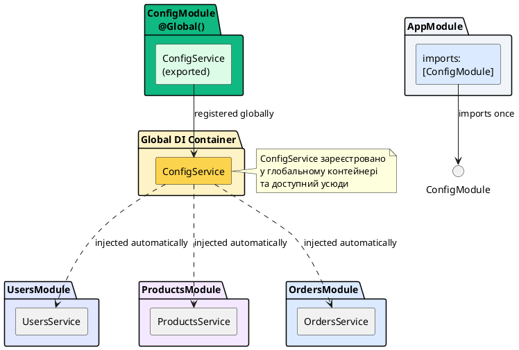

# Global Modules та декоратор @Global

## Короткий зміст

- Що таке Global Module
- Декоратор `@Global()`: позначення модуля як глобального
- Глобальні провайдери доступні без імпорту модуля
- Автоматична реєстрація у всіх модулях застосунку
- Сценарії використання: конфігурація, логування, підключення до БД
- Приклад: ConfigModule як глобальний модуль
- Приклад: DatabaseModule для спільного підключення
- Переваги: зручність, менше імпортів
- Ризики: неявні залежності, складність тестування
- Best practices: використовувати обмежено, тільки для інфраструктурних сервісів

---

## Концепція Global Module: провайдери без явного імпорту

У попередніх лекціях ми розглянули Feature Modules та Shared Modules, які потребують **явного імпорту** для доступу до їх провайдерів. Проте деякі провайдери настільки універсальні, що потрібні **абсолютно всім модулям** застосунку: конфігурація, логування, підключення до бази даних, метрики тощо.

Для таких випадків NestJS надає механізм **Global Modules** — модулів, провайдери яких стають доступними **автоматично у всіх модулях застосунку** без необхідності додавати їх до масиву `imports`.

**Global Module** позначається спеціальним декоратором `@Global()`, який інформує NestJS, що експортовані провайдери цього модуля мають бути зареєстровані у глобальній області видимості.

::card-group

::card{title="🎯 Мета лекції" icon="i-lucide-target"}

- Зрозуміти концепцію глобальних модулів та їх відмінність від звичайних
- Опанувати декоратор `@Global()` для позначення модулів як глобальних
- Навчитися визначати, коли доречно використовувати глобальні модулі
- Дослідити переваги та ризики глобальних залежностей
- Застосовувати best practices для мінімізації побічних ефектів

::

::card{title="🔑 Ключові терміни" icon="i-lucide-key"}

- **Global Module** — модуль, провайдери якого доступні автоматично у всіх модулях
- **@Global()** — декоратор для позначення модуля як глобального
- **Implicit Dependency** — неявна залежність, коли провайдер доступний без явного імпорту
- **Global Scope** — глобальна область видимості, де зареєстровані всі глобальні провайдери

::

::

---

## Декоратор @Global(): позначення модуля як глобального

Щоб зробити модуль глобальним, достатньо додати декоратор `@Global()` перед декоратором `@Module()`:

```typescript
// config/config.module.ts
import { Global, Module } from '@nestjs/common';
import { ConfigService } from './config.service';

@Global()  // ✅ Позначаємо модуль як глобальний
@Module({
  providers: [ConfigService],
  exports: [ConfigService]
})
export class ConfigModule {}
```

Тепер `ConfigService` можна ін'єктувати у будь-якому модулі **без імпорту** `ConfigModule`:

```typescript
// users/users.module.ts
@Module({
  // imports: [ConfigModule],  ❌ Імпорт НЕ потрібен!
  providers: [UsersService],
  controllers: [UsersController]
})
export class UsersModule {}

// users/users.service.ts
@Injectable()
export class UsersService {
  constructor(
    private readonly config: ConfigService  // ✅ Доступний автоматично!
  ) {}

  getAppName(): string {
    return this.config.get('APP_NAME');
  }
}
```

::warning
Глобальний модуль все одно потрібно **зареєструвати один раз** у кореневому модулі (`AppModule`) або в одному з його імпортів. Декоратор `@Global()` не робить модуль автоматично доступним — він лише змінює поведінку його експортованих провайдерів після реєстрації.
::

---

## Автоматична реєстрація: як це працює

Коли NestJS зустрічає глобальний модуль під час побудови графу залежностей, він реєструє всі експортовані провайдери цього модуля у **глобальному контейнері DI**. Це означає, що ці провайдери стають доступними у всіх модулях застосунку без додаткових дій.

### Порівняння: звичайний vs глобальний модуль

::code-group

```typescript [Звичайний модуль (потребує імпорту)]
// logger/logger.module.ts
@Module({
  providers: [LoggerService],
  exports: [LoggerService]
})
export class LoggerModule {}

// Потрібно явно імпортувати у кожному модулі
@Module({
  imports: [LoggerModule],  // ✅ Обов'язковий імпорт
  providers: [UsersService]
})
export class UsersModule {}

@Module({
  imports: [LoggerModule],  // ✅ Обов'язковий імпорт
  providers: [ProductsService]
})
export class ProductsModule {}
```

```typescript [Глобальний модуль (автоматичний доступ)]
// logger/logger.module.ts
@Global()  // ✅ Позначаємо як глобальний
@Module({
  providers: [LoggerService],
  exports: [LoggerService]
})
export class LoggerModule {}

// Імпорт НЕ потрібен
@Module({
  // imports: [],  ❌ LoggerModule не потрібен у imports
  providers: [UsersService]  // UsersService може ін'єктувати LoggerService
})
export class UsersModule {}

@Module({
  // imports: [],  ❌ LoggerModule не потрібен у imports
  providers: [ProductsService]  // ProductsService може ін'єктувати LoggerService
})
export class ProductsModule {}
```

::

### Візуалізація глобального модуля

::plant-uml{alt="Глобальний модуль у DI-контейнері"}



::

---

## Сценарії використання: коли використовувати Global Modules

Global Modules доречні для **інфраструктурних сервісів**, які потрібні скрізь у застосунку та не змінюють свою поведінку залежно від контексту.

### ✅ Сценарій 1: ConfigModule для конфігурації

Конфігурація — це класичний випадок для глобального модуля, оскільки майже кожен сервіс потребує доступу до налаштувань:

```typescript
// config/config.service.ts
import { Injectable } from '@nestjs/common';
import * as dotenv from 'dotenv';

@Injectable()
export class ConfigService {
  private readonly envConfig: Record<string, string>;

  constructor() {
    const result = dotenv.config();
    this.envConfig = result.parsed || {};
  }

  get(key: string): string {
    const value = this.envConfig[key] || process.env[key];
    if (!value) {
      throw new Error(`Configuration key "${key}" not found`);
    }
    return value;
  }

  getNumber(key: string): number {
    return parseInt(this.get(key), 10);
  }

  getBoolean(key: string): boolean {
    return this.get(key).toLowerCase() === 'true';
  }

  isDevelopment(): boolean {
    return this.get('NODE_ENV') === 'development';
  }

  isProduction(): boolean {
    return this.get('NODE_ENV') === 'production';
  }
}
```

```typescript
// config/config.module.ts
import { Global, Module } from '@nestjs/common';
import { ConfigService } from './config.service';

@Global()
@Module({
  providers: [ConfigService],
  exports: [ConfigService]
})
export class ConfigModule {}
```

```typescript
// app.module.ts
@Module({
  imports: [
    ConfigModule,  // Реєструємо один раз
    UsersModule,
    ProductsModule,
    OrdersModule
  ]
})
export class AppModule {}
```

Тепер всі модулі можуть використовувати `ConfigService` без імпорту:

```typescript
// users/users.service.ts
@Injectable()
export class UsersService {
  constructor(private readonly config: ConfigService) {}

  getMaxUsersLimit(): number {
    return this.config.getNumber('MAX_USERS');
  }
}

// products/products.service.ts
@Injectable()
export class ProductsService {
  constructor(private readonly config: ConfigService) {}

  getApiUrl(): string {
    return this.config.get('PRODUCTS_API_URL');
  }
}
```

### ✅ Сценарій 2: DatabaseModule для спільного підключення

База даних — ще один типовий кандидат для глобального модуля:

```typescript
// database/database.module.ts
import { Global, Module } from '@nestjs/common';
import { TypeOrmModule } from '@nestjs/typeorm';
import { ConfigService } from '../config/config.service';

@Global()
@Module({
  imports: [
    TypeOrmModule.forRootAsync({
      inject: [ConfigService],
      useFactory: (config: ConfigService) => ({
        type: 'postgres',
        host: config.get('DB_HOST'),
        port: config.getNumber('DB_PORT'),
        username: config.get('DB_USER'),
        password: config.get('DB_PASSWORD'),
        database: config.get('DB_NAME'),
        autoLoadEntities: true,
        synchronize: config.isDevelopment()
      })
    })
  ]
})
export class DatabaseModule {}
```

### ✅ Сценарій 3: LoggerModule для централізованого логування

```typescript
// logger/logger.service.ts
import { Injectable, LoggerService as NestLoggerService } from '@nestjs/common';

@Injectable()
export class CustomLoggerService implements NestLoggerService {
  log(message: string, context?: string) {
    console.log(`[LOG] [${context || 'App'}] ${message}`);
  }

  error(message: string, trace?: string, context?: string) {
    console.error(`[ERROR] [${context || 'App'}] ${message}`);
    if (trace) console.error(trace);
  }

  warn(message: string, context?: string) {
    console.warn(`[WARN] [${context || 'App'}] ${message}`);
  }

  debug(message: string, context?: string) {
    console.debug(`[DEBUG] [${context || 'App'}] ${message}`);
  }

  verbose(message: string, context?: string) {
    console.log(`[VERBOSE] [${context || 'App'}] ${message}`);
  }
}
```

```typescript
// logger/logger.module.ts
import { Global, Module } from '@nestjs/common';
import { CustomLoggerService } from './logger.service';

@Global()
@Module({
  providers: [CustomLoggerService],
  exports: [CustomLoggerService]
})
export class LoggerModule {}
```

---

## Переваги Global Modules

::card-group

::card{title="✅ Зручність" icon="i-lucide-zap"}

**Переваги:**
- Менше коду: не потрібно імпортувати модуль у кожному місці
- Швидша розробка: забули додати імпорт — не проблема
- Чистіший код: масиви `imports` коротші та зрозуміліші

**Приклад:**
```typescript
// Замість цього у кожному модулі:
@Module({
  imports: [ConfigModule, LoggerModule, MetricsModule],
  providers: [SomeService]
})

// Можна просто:
@Module({
  providers: [SomeService]
})
```

::

::card{title="🔧 Зменшення дублювання" icon="i-lucide-copy"}

**Переваги:**
- Єдина точка реєстрації у `AppModule`
- Зміни конфігурації в одному місці
- Легше підтримувати консистентність

**Приклад:**
```typescript
// app.module.ts — єдина точка реєстрації
@Module({
  imports: [
    ConfigModule,   // Глобальний
    DatabaseModule, // Глобальний
    LoggerModule,   // Глобальний
    // Feature modules не потребують імпорту цих модулів
    UsersModule,
    ProductsModule
  ]
})
```

::

::

---

## Ризики та недоліки Global Modules

::card-group

::card{title="⚠️ Неявні залежності" icon="i-lucide-alert-triangle"}

**Проблема:** Залежності не видимі у `imports`, що ускладнює розуміння коду

**Приклад:**
```typescript
// users/users.module.ts
@Module({
  providers: [UsersService]
  // Де залежності? Незрозуміло!
})
export class UsersModule {}

// users/users.service.ts
@Injectable()
export class UsersService {
  constructor(
    private readonly config: ConfigService,    // Звідки це?
    private readonly logger: LoggerService,    // І це?
    private readonly metrics: MetricsService   // І це теж?
  ) {}
}
```

**Рішення:** документуйте глобальні залежності у README або коментарях.

::

::card{title="🧪 Складність тестування" icon="i-lucide-flask-conical"}

**Проблема:** У тестах потрібно явно надавати глобальні залежності

**Приклад:**
```typescript
// users.service.spec.ts
describe('UsersService', () => {
  let service: UsersService;

  beforeEach(async () => {
    const module = await Test.createTestingModule({
      providers: [
        UsersService,
        // ❌ Потрібно явно надавати всі глобальні залежності!
        { provide: ConfigService, useValue: mockConfig },
        { provide: LoggerService, useValue: mockLogger },
        { provide: MetricsService, useValue: mockMetrics }
      ]
    }).compile();

    service = module.get<UsersService>(UsersService);
  });
});
```

::

::card{title="🔗 Висока зв'язаність" icon="i-lucide-link"}

**Проблема:** Всі модулі стають залежними від глобальних провайдерів

**Приклад:**
```typescript
// Якщо видалити ConfigModule з AppModule:
@Module({
  imports: [
    // ConfigModule,  ❌ Видалили
    UsersModule,
    ProductsModule,
    OrdersModule
  ]
})
export class AppModule {}

// Всі модулі, що використовують ConfigService, зламаються!
```

::

::card{title="🌐 Забруднення глобального простору" icon="i-lucide-globe"}

**Проблема:** Надмірна кількість глобальних провайдерів ускладнює розуміння архітектури

**Антипаттерн:**
```typescript
// ❌ НЕПРАВИЛЬНО: занадто багато глобальних модулів
@Module({
  imports: [
    ConfigModule,      // @Global
    DatabaseModule,    // @Global
    LoggerModule,      // @Global
    MetricsModule,     // @Global
    CacheModule,       // @Global
    QueueModule,       // @Global
    EmailModule,       // @Global
    SmsModule,         // @Global
    PaymentModule,     // @Global  ❌ Це вже забагато!
    // ...
  ]
})
```

::

::

---

## Best Practices: коли використовувати @Global

### ✅ Використовуйте Global Modules для:

1. **Конфігурації** (`ConfigModule`)
   - Потрібна абсолютно всім модулям
   - Немає варіацій у різних контекстах

2. **Підключення до інфраструктури** (`DatabaseModule`, `CacheModule`)
   - Спільні ресурси для всього застосунку
   - Єдиний пул з'єднань

3. **Логування та метрики** (`LoggerModule`, `MetricsModule`)
   - Універсальні інструменти для діагностики
   - Однакова поведінка скрізь

### ❌ НЕ використовуйте Global Modules для:

1. **Feature-специфічних сервісів**
   ```typescript
   // ❌ НЕПРАВИЛЬНО
   @Global()
   @Module({ providers: [UsersService], exports: [UsersService] })
   export class UsersModule {}
   ```

2. **Бізнес-логіки**
   ```typescript
   // ❌ НЕПРАВИЛЬНО
   @Global()
   @Module({ providers: [PaymentGateway], exports: [PaymentGateway] })
   export class PaymentModule {}
   ```

3. **Модулів з багатьма провайдерами**
   ```typescript
   // ❌ НЕПРАВИЛЬНО: занадто багато експортованих провайдерів
   @Global()
   @Module({
     providers: [Service1, Service2, Service3, /*...*/Service20],
     exports: [Service1, Service2, Service3, /*...*/Service20]
   })
   ```

### 🎯 Золоте правило

::tip
**Використовуйте Global Modules дуже обмежено** — не більше 3-5 на застосунок. Якщо у вас більше 5 глобальних модулів, переглянете архітектуру: можливо, деякі з них мають бути звичайними Shared Modules.
::

---

## Практичний приклад: правильна організація глобальних модулів

```typescript
// app.module.ts
import { Module } from '@nestjs/common';

// Глобальні модулі (обмежена кількість)
import { ConfigModule } from './config/config.module';
import { DatabaseModule } from './database/database.module';
import { LoggerModule } from './logger/logger.module';

// Shared модулі (потребують імпорту)
import { CommonModule } from './common/common.module';
import { AuthModule } from './auth/auth.module';

// Feature модулі
import { UsersModule } from './users/users.module';
import { ProductsModule } from './products/products.module';
import { OrdersModule } from './orders/orders.module';

@Module({
  imports: [
    // ✅ Глобальні модулі (3 штуки — оптимально)
    ConfigModule,    // @Global - конфігурація
    DatabaseModule,  // @Global - підключення до БД
    LoggerModule,    // @Global - логування

    // ✅ Shared модулі (потребують імпорту у feature modules)
    CommonModule,
    AuthModule,

    // ✅ Feature модулі
    UsersModule,
    ProductsModule,
    OrdersModule
  ]
})
export class AppModule {}
```

```typescript
// users/users.module.ts
@Module({
  imports: [
    CommonModule,  // ✅ Явний імпорт shared модуля
    AuthModule     // ✅ Явний імпорт shared модуля
    // ConfigModule, DatabaseModule, LoggerModule — не потрібні (глобальні)
  ],
  providers: [UsersService, UsersRepository],
  controllers: [UsersController],
  exports: [UsersService]
})
export class UsersModule {}
```

---

## Порівняння: Shared vs Global Modules

::code-group

```typescript [Shared Module (явний імпорт)]
// ✅ Переваги:
// - Явні залежності у imports
// - Легше тестувати
// - Краще для переусопоставлення

@Module({
  providers: [CommonService],
  exports: [CommonService]
})
export class CommonModule {}

// Використання:
@Module({
  imports: [CommonModule],  // ✅ Явний імпорт
  providers: [UsersService]
})
export class UsersModule {}
```

```typescript [Global Module (автоматичний доступ)]
// ✅ Переваги:
// - Менше коду
// - Зручність для інфраструктурних сервісів

// ⚠️ Недоліки:
// - Неявні залежності
// - Складніше тестувати

@Global()
@Module({
  providers: [ConfigService],
  exports: [ConfigService]
})
export class ConfigModule {}

// Використання:
@Module({
  // imports: [],  ✅ Імпорт не потрібен
  providers: [UsersService]  // ConfigService доступний автоматично
})
export class UsersModule {}
```

::

---

## Висновки

Global Modules є потужним, але небезпечним інструментом. Ключові принципи:

- **Обмежене використання**: не більше 3-5 глобальних модулів на застосунок
- **Тільки для інфраструктури**: конфігурація, БД, логування, метрики
- **Ніколи для бізнес-логіки**: feature-сервіси мають бути звичайними модулями
- **Документація**: завжди документуйте глобальні залежності
- **Тестування**: будьте готові явно надавати мок-об'єкти у тестах

::warning
**Золоте правило:** якщо сумніваєтеся, чи робити модуль глобальним — **не робіть**. Краще явний імпорт, ніж неявна залежність.
::

У наступній лекції ми розглянемо Dynamic Modules — модулі, конфігурація яких визначається під час виконання через методи `.forRoot()` та `.forFeature()`.
