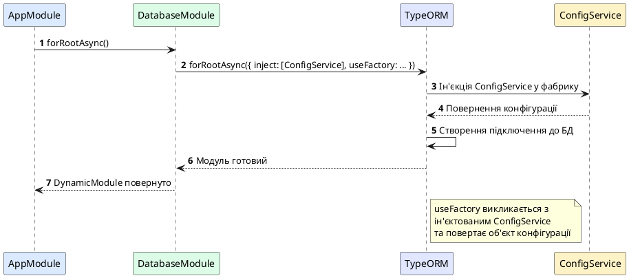

# Dynamic Modules: конфігурація під час виконання

## Короткий зміст

- Що таке Dynamic Module
- Проблема статичних модулів: неможливість конфігурації
- Метод `forRoot()`: налаштування модуля при імпорті
- Повернення DynamicModule з методу: module, providers, exports
- Приклад: ConfigModule.forRoot({ folder: './config' })
- Метод `forRootAsync()`: асинхронна конфігурація
- Використання useFactory для динамічного створення конфігурації
- Метод `forFeature()`: реєстрація специфічних для модуля ресурсів
- Приклад: TypeOrmModule.forFeature([UserEntity])
- Best practices: іменування методів відповідно до призначення

---

## Концепція Dynamic Module: гнучка конфігурація модулів

У всіх попередніх лекціях ми працювали зі **статичними модулями** — модулями, конфігурація яких визначена на етапі написання коду через декоратор `@Module()`. Проте у реальних застосунках часто потрібна **динамічна конфігурація**: різні налаштування для розробки та продакшну, параметри з'єднання з базою даних з змінних оточення, реєстрація специфічних для модуля сутностей тощо.

**Dynamic Module** (*динамічний модуль*) — це модуль, конфігурація якого визначається **під час виконання** через статичні методи, що повертають об'єкт `DynamicModule`. Це дозволяє передавати параметри при імпорті модуля та динамічно створювати провайдери на основі цих параметрів.

Динамічні модулі широко використовуються у популярних пакетах NestJS:
- `@nestjs/config`: `ConfigModule.forRoot({ envFilePath: '.env' })`
- `@nestjs/typeorm`: `TypeOrmModule.forRoot({ type: 'postgres', host: 'localhost' })`
- `@nestjs/jwt`: `JwtModule.register({ secret: 'my-secret' })`
- `@nestjs/passport`: `PassportModule.register({ defaultStrategy: 'jwt' })`

::card-group

::card{title="🎯 Мета лекції" icon="i-lucide-target"}

- Зрозуміти концепцію динамічних модулів та їх відмінність від статичних
- Опанувати створення методів `forRoot()`, `forRootAsync()`, `forFeature()`
- Навчитися повертати об'єкт `DynamicModule` з правильною структурою
- Дослідити патерни асинхронної конфігурації через фабрики
- Застосовувати best practices для іменування та організації динамічних модулів

::

::card{title="🔑 Ключові терміни" icon="i-lucide-key"}

- **Dynamic Module** — модуль, конфігурація якого визначається під час виконання
- **DynamicModule** — інтерфейс TypeScript для опису структури динамічного модуля
- **forRoot()** — метод для глобальної конфігурації модуля (реєструється один раз)
- **forRootAsync()** — асинхронна версія `forRoot()` з підтримкою фабрик
- **forFeature()** — метод для реєстрації специфічних для модуля ресурсів (використовується багаторазово)

::

::

---

## Проблема статичних модулів: неможливість конфігурації при імпорті

Розглянемо обмеження статичних модулів. Припустімо, ми хочемо створити `DatabaseModule` з підключенням до PostgreSQL:

```typescript
// database/database.module.ts (статичний варіант)
import { Module } from '@nestjs/common';
import { TypeOrmModule } from '@nestjs/typeorm';

@Module({
  imports: [
    TypeOrmModule.forRoot({
      type: 'postgres',
      host: 'localhost',      // ❌ Жорстко закодовано
      port: 5432,             // ❌ Жорстко закодовано
      username: 'postgres',   // ❌ Жорстко закодовано
      password: 'password',   // ❌ Жорстко закодовано
      database: 'myapp'       // ❌ Жорстко закодовано
    })
  ]
})
export class DatabaseModule {}
```

**Проблеми:**
1. Неможливо змінити конфігурацію без редагування коду
2. Різні оточення (dev, staging, prod) потребують окремих модулів
3. Немає способу передати параметри з `AppModule`

**Бажана поведінка:**
```typescript
// Хочемо передавати конфігурацію при імпорті:
@Module({
  imports: [
    DatabaseModule.forRoot({
      host: process.env.DB_HOST,
      port: parseInt(process.env.DB_PORT)
    })
  ]
})
export class AppModule {}
```

Саме це і дозволяють динамічні модулі!

---

## Інтерфейс DynamicModule: структура динамічного модуля

Динамічний модуль створюється через метод, що повертає об'єкт типу `DynamicModule`:

```typescript
interface DynamicModule {
  module: Type<any>;              // Клас модуля (обов'язково)
  imports?: Array<...>;           // Імпортовані модулі
  controllers?: Array<...>;       // Контролери
  providers?: Array<...>;         // Провайдери
  exports?: Array<...>;           // Експортовані провайдери/модулі
  global?: boolean;               // Чи є модуль глобальним
}
```

Ключова відмінність від декоратора `@Module()` — наявність поля `module`, яке вказує на клас модуля.

---

## Метод forRoot(): налаштування модуля при імпорті

Метод `forRoot()` використовується для **глобальної конфігурації модуля**, яка застосовується один раз на весь застосунок. За конвенцією цей метод викликається у кореневому модулі (`AppModule`).

### Приклад: ConfigModule з динамічною конфігурацією

```typescript
// config/config.service.ts
import { Injectable } from '@nestjs/common';
import * as fs from 'fs';
import * as path from 'path';

@Injectable()
export class ConfigService {
  private readonly config: Record<string, any>;

  constructor(private readonly options: { folder: string }) {
    const configPath = path.join(process.cwd(), options.folder, 'config.json');
    this.config = JSON.parse(fs.readFileSync(configPath, 'utf-8'));
  }

  get(key: string): any {
    return this.config[key];
  }
}
```

```typescript
// config/config.module.ts
import { DynamicModule, Module } from '@nestjs/common';
import { ConfigService } from './config.service';

@Module({})
export class ConfigModule {
  static forRoot(options: { folder: string }): DynamicModule {
    return {
      module: ConfigModule,                              // ✅ Обов'язкове поле
      providers: [
        {
          provide: 'CONFIG_OPTIONS',                     // Токен для опцій
          useValue: options
        },
        ConfigService                                    // Сервіс, що використовує опції
      ],
      exports: [ConfigService],
      global: true                                       // ✅ Робимо модуль глобальним
    };
  }
}
```

### Використання у AppModule

```typescript
// app.module.ts
import { Module } from '@nestjs/common';
import { ConfigModule } from './config/config.module';
import { UsersModule } from './users/users.module';

@Module({
  imports: [
    ConfigModule.forRoot({ folder: './config' }),  // ✅ Передаємо конфігурацію
    UsersModule
  ]
})
export class AppModule {}
```

Тепер `ConfigService` можна ін'єктувати у будь-якому модулі:

```typescript
// users/users.service.ts
@Injectable()
export class UsersService {
  constructor(private readonly config: ConfigService) {}

  getAppName(): string {
    return this.config.get('appName');
  }
}
```

::note
Метод `forRoot()` зазвичай викликається **один раз** у кореневому модулі. Якщо потрібна багаторазова реєстрація з різними параметрами, використовуйте `register()` або `forFeature()`.
::

---

## Метод forRootAsync(): асинхронна конфігурація

Часто конфігурація модуля залежить від інших провайдерів (наприклад, `ConfigService`), які можуть бути недоступні синхронно. Для таких випадків використовується `forRootAsync()`.

### Приклад: DatabaseModule з асинхронною конфігурацією

```typescript
// database/database.module.ts
import { DynamicModule, Module } from '@nestjs/common';
import { TypeOrmModule } from '@nestjs/typeorm';
import { ConfigService } from '../config/config.service';

@Module({})
export class DatabaseModule {
  static forRootAsync(): DynamicModule {
    return {
      module: DatabaseModule,
      imports: [
        TypeOrmModule.forRootAsync({
          inject: [ConfigService],                        // ✅ Ін'єктуємо ConfigService
          useFactory: (config: ConfigService) => ({       // ✅ Фабрика з доступом до ConfigService
            type: 'postgres',
            host: config.get('DB_HOST'),
            port: config.getNumber('DB_PORT'),
            username: config.get('DB_USER'),
            password: config.get('DB_PASSWORD'),
            database: config.get('DB_NAME'),
            autoLoadEntities: true,
            synchronize: config.isDevelopment()
          })
        })
      ]
    };
  }
}
```

### Використання у AppModule

```typescript
// app.module.ts
@Module({
  imports: [
    ConfigModule.forRoot({ folder: './config' }),  // Спочатку ConfigModule
    DatabaseModule.forRootAsync()                  // Потім DatabaseModule (залежить від ConfigService)
  ]
})
export class AppModule {}
```

::plant-uml{alt="Асинхронна конфігурація через useFactory"}



::

---

## Патерн useFactory: динамічне створення провайдерів

`useFactory` дозволяє створювати провайдери динамічно на основі інших залежностей:

```typescript
// jwt/jwt.module.ts
import { DynamicModule, Module } from '@nestjs/common';
import { JwtModule as NestJwtModule } from '@nestjs/jwt';
import { ConfigService } from '../config/config.service';

@Module({})
export class JwtModule {
  static forRootAsync(): DynamicModule {
    return {
      module: JwtModule,
      imports: [
        NestJwtModule.registerAsync({
          inject: [ConfigService],
          useFactory: (config: ConfigService) => ({
            secret: config.get('JWT_SECRET'),
            signOptions: {
              expiresIn: config.get('JWT_EXPIRES_IN') || '1d'
            }
          })
        })
      ],
      exports: [NestJwtModule]
    };
  }
}
```

### Альтернативні патерни конфігурації

::code-group

```typescript [useFactory (найгнучкіше)]
{
  provide: 'DATABASE_CONNECTION',
  inject: [ConfigService],
  useFactory: async (config: ConfigService) => {
    const connection = await createConnection({
      host: config.get('DB_HOST'),
      port: config.getNumber('DB_PORT')
    });
    return connection;
  }
}
```

```typescript [useClass]
{
  provide: 'DATABASE_CONNECTION',
  useClass: ProductionDatabaseConnection  // Клас з @Injectable()
}
```

```typescript [useValue]
{
  provide: 'DATABASE_CONNECTION',
  useValue: {
    host: 'localhost',
    port: 5432
  }
}
```

::

---

## Метод forFeature(): реєстрація специфічних для модуля ресурсів

Метод `forFeature()` використовується для реєстрації ресурсів, **специфічних для конкретного модуля**, на відміну від `forRoot()`, який налаштовує модуль глобально.

### Приклад: TypeOrmModule.forFeature()

Найпопулярніший приклад — реєстрація сутностей TypeORM у feature modules:

```typescript
// users/users.module.ts
import { Module } from '@nestjs/common';
import { TypeOrmModule } from '@nestjs/typeorm';
import { User } from './entities/user.entity';
import { UsersController } from './users.controller';
import { UsersService } from './users.service';

@Module({
  imports: [
    TypeOrmModule.forFeature([User])  // ✅ Реєструємо User entity для цього модуля
  ],
  controllers: [UsersController],
  providers: [UsersService]
})
export class UsersModule {}

// products/products.module.ts
@Module({
  imports: [
    TypeOrmModule.forFeature([Product, Category])  // ✅ Реєструємо інші entities
  ],
  controllers: [ProductsController],
  providers: [ProductsService]
})
export class ProductsModule {}
```

### Різниця між forRoot() та forFeature()

| Метод | Призначення | Використання | Кількість викликів |
|-------|-------------|--------------|-------------------|
| `forRoot()` | Глобальна конфігурація модуля | У кореневому модулі (`AppModule`) | Один раз |
| `forFeature()` | Реєстрація специфічних для модуля ресурсів | У feature modules | Багаторазово |

**Приклад архітектури:**

```typescript
// app.module.ts
@Module({
  imports: [
    TypeOrmModule.forRoot({              // ✅ Один раз — глобальне підключення
      type: 'postgres',
      host: 'localhost',
      // ...
    }),
    UsersModule,
    ProductsModule,
    OrdersModule
  ]
})
export class AppModule {}

// users/users.module.ts
@Module({
  imports: [
    TypeOrmModule.forFeature([User])     // ✅ Багаторазово — для кожного модуля
  ]
})
export class UsersModule {}

// products/products.module.ts
@Module({
  imports: [
    TypeOrmModule.forFeature([Product])  // ✅ Багаторазово — для кожного модуля
  ]
})
export class ProductsModule {}
```

---

## Створення власного динамічного модуля: повний приклад

Розглянемо створення власного модуля з підтримкою `forRoot()` та `forFeature()`:

### Крок 1: Інтерфейси конфігурації

```typescript
// cache/interfaces/cache-options.interface.ts
export interface CacheModuleOptions {
  ttl: number;                  // Time to live у секундах
  max: number;                  // Максимальна кількість елементів
  prefix?: string;              // Префікс для ключів
}

export interface CacheFeatureOptions {
  keys: string[];               // Ключі кешу для цього модуля
}
```

### Крок 2: Сервіс кешування

```typescript
// cache/cache.service.ts
import { Injectable, Inject } from '@nestjs/common';
import { CacheModuleOptions } from './interfaces/cache-options.interface';

@Injectable()
export class CacheService {
  private readonly cache = new Map<string, { value: any; expires: number }>();

  constructor(
    @Inject('CACHE_OPTIONS')
    private readonly options: CacheModuleOptions
  ) {}

  set(key: string, value: any, ttl?: number): void {
    const prefixedKey = this.getPrefixedKey(key);
    const expiresAt = Date.now() + (ttl || this.options.ttl) * 1000;
    
    if (this.cache.size >= this.options.max) {
      const firstKey = this.cache.keys().next().value;
      this.cache.delete(firstKey);
    }

    this.cache.set(prefixedKey, { value, expires: expiresAt });
  }

  get(key: string): any | null {
    const prefixedKey = this.getPrefixedKey(key);
    const entry = this.cache.get(prefixedKey);

    if (!entry) return null;
    if (Date.now() > entry.expires) {
      this.cache.delete(prefixedKey);
      return null;
    }

    return entry.value;
  }

  delete(key: string): boolean {
    const prefixedKey = this.getPrefixedKey(key);
    return this.cache.delete(prefixedKey);
  }

  clear(): void {
    this.cache.clear();
  }

  private getPrefixedKey(key: string): string {
    return this.options.prefix ? `${this.options.prefix}:${key}` : key;
  }
}
```

### Крок 3: Динамічний модуль

```typescript
// cache/cache.module.ts
import { DynamicModule, Module, Provider } from '@nestjs/common';
import { CacheService } from './cache.service';
import { CacheModuleOptions, CacheFeatureOptions } from './interfaces/cache-options.interface';

@Module({})
export class CacheModule {
  // Глобальна конфігурація (один раз у AppModule)
  static forRoot(options: CacheModuleOptions): DynamicModule {
    const cacheOptionsProvider: Provider = {
      provide: 'CACHE_OPTIONS',
      useValue: options
    };

    return {
      module: CacheModule,
      providers: [cacheOptionsProvider, CacheService],
      exports: [CacheService],
      global: true
    };
  }

  // Реєстрація специфічних для модуля ключів (багаторазово)
  static forFeature(options: CacheFeatureOptions): DynamicModule {
    const featureProviders: Provider[] = options.keys.map(key => ({
      provide: `CACHE_KEY_${key.toUpperCase()}`,
      useValue: key
    }));

    return {
      module: CacheModule,
      providers: featureProviders,
      exports: featureProviders
    };
  }

  // Асинхронна версія forRoot
  static forRootAsync(options: {
    inject?: any[];
    useFactory: (...args: any[]) => Promise<CacheModuleOptions> | CacheModuleOptions;
  }): DynamicModule {
    const cacheOptionsProvider: Provider = {
      provide: 'CACHE_OPTIONS',
      inject: options.inject || [],
      useFactory: options.useFactory
    };

    return {
      module: CacheModule,
      providers: [cacheOptionsProvider, CacheService],
      exports: [CacheService],
      global: true
    };
  }
}
```

### Крок 4: Використання у застосунку

```typescript
// app.module.ts
@Module({
  imports: [
    CacheModule.forRoot({                 // ✅ Глобальна конфігурація
      ttl: 300,
      max: 1000,
      prefix: 'app'
    }),
    UsersModule,
    ProductsModule
  ]
})
export class AppModule {}

// users/users.module.ts
@Module({
  imports: [
    CacheModule.forFeature({              // ✅ Специфічні ключі для UsersModule
      keys: ['user_profile', 'user_sessions']
    })
  ],
  providers: [UsersService],
  controllers: [UsersController]
})
export class UsersModule {}

// users/users.service.ts
@Injectable()
export class UsersService {
  constructor(
    private readonly cache: CacheService,
    @Inject('CACHE_KEY_USER_PROFILE') private readonly profileKey: string
  ) {}

  async getUserProfile(userId: number) {
    // Перевірка кешу
    const cached = this.cache.get(`${this.profileKey}:${userId}`);
    if (cached) return cached;

    // Запит до БД
    const profile = await this.fetchFromDatabase(userId);

    // Збереження у кеш
    this.cache.set(`${this.profileKey}:${userId}`, profile, 600);

    return profile;
  }

  private async fetchFromDatabase(userId: number) {
    // Логіка запиту до БД
  }
}
```

---

## Best Practices для динамічних модулів

::card-group

::card{title="🏷️ Іменування методів" icon="i-lucide-tag"}

**Конвенції:**
- `forRoot()` — глобальна конфігурація, один раз
- `forRootAsync()` — асинхронна глобальна конфігурація
- `forFeature()` — специфічні для модуля ресурси, багаторазово
- `register()` — альтернатива `forRoot()` для локальної реєстрації

**Приклади:**
- `ConfigModule.forRoot()`
- `TypeOrmModule.forRootAsync()`
- `TypeOrmModule.forFeature([User])`
- `JwtModule.register()`

::

::card{title="🔒 Типобезпека" icon="i-lucide-shield-check"}

**Правила:**
- Створюйте TypeScript інтерфейси для опцій
- Використовуйте generic типи для гнучкості
- Валідуйте опції через class-validator

**Приклад:**
```typescript
export interface CacheOptions {
  ttl: number;
  max: number;
}

static forRoot(options: CacheOptions): DynamicModule {
  // Валідація
  if (options.ttl < 0) {
    throw new Error('TTL must be positive');
  }
  // ...
}
```

::

::card{title="📦 Модульність" icon="i-lucide-package"}

**Правила:**
- Динамічний модуль має бути самодостатнім
- Документуйте всі опції через JSDoc
- Надавайте значення за замовчуванням

**Приклад:**
```typescript
/**
 * Налаштування кешування
 * @param ttl - Час життя у секундах (за замовчуванням: 300)
 * @param max - Максимальна кількість елементів (за замовчуванням: 100)
 */
static forRoot(options: Partial<CacheOptions> = {}): DynamicModule {
  const defaults: CacheOptions = { ttl: 300, max: 100 };
  const config = { ...defaults, ...options };
  // ...
}
```

::

::card{title="🧪 Тестованість" icon="i-lucide-flask-conical"}

**Правила:**
- Забезпечуйте легку підміну конфігурації у тестах
- Використовуйте `useValue` або `useClass` для моків

**Приклад:**
```typescript
const moduleRef = await Test.createTestingModule({
  imports: [
    CacheModule.forRoot({
      ttl: 1,      // ✅ Короткий TTL для тестів
      max: 10
    })
  ]
}).compile();
```

::

::

---

## Порівняння: статичні vs динамічні модулі

::code-group

```typescript [Статичний модуль]
// ❌ Обмеження:
// - Жорстко закодована конфігурація
// - Неможливо налаштувати при імпорті

@Module({
  providers: [
    {
      provide: 'CONFIG',
      useValue: {
        host: 'localhost',  // Не можна змінити
        port: 5432
      }
    },
    DatabaseService
  ],
  exports: [DatabaseService]
})
export class DatabaseModule {}

// Використання:
@Module({
  imports: [DatabaseModule]  // Немає можливості налаштувати
})
export class AppModule {}
```

```typescript [Динамічний модуль]
// ✅ Переваги:
// - Гнучка конфігурація
// - Різні налаштування для різних оточень

@Module({})
export class DatabaseModule {
  static forRoot(options: DbOptions): DynamicModule {
    return {
      module: DatabaseModule,
      providers: [
        { provide: 'CONFIG', useValue: options },
        DatabaseService
      ],
      exports: [DatabaseService]
    };
  }
}

// Використання:
@Module({
  imports: [
    DatabaseModule.forRoot({  // ✅ Передаємо конфігурацію
      host: process.env.DB_HOST,
      port: parseInt(process.env.DB_PORT)
    })
  ]
})
export class AppModule {}
```

::

---

## Висновки

Dynamic Modules є потужним механізмом для створення гнучких, конфігурованих модулів у NestJS. Ключові принципи:

- **Метод forRoot()**: глобальна конфігурація, викликається один раз у `AppModule`
- **Метод forRootAsync()**: асинхронна конфігурація через `useFactory` з ін'єкцією залежностей
- **Метод forFeature()**: реєстрація специфічних для модуля ресурсів, викликається багаторазово
- **Інтерфейс DynamicModule**: обов'язкове поле `module` + опціональні `providers`, `exports`, `imports`, `global`
- **Типобезпека**: завжди створюйте TypeScript інтерфейси для опцій конфігурації

Dynamic Modules дозволяють створювати переусопоставлювані модулі, які можна налаштовувати під різні потреби без зміни коду, що робить їх незамінним інструментом для розробки бібліотек та пакетів NestJS.

::tip
При проєктуванні власних динамічних модулів керуйтеся конвенціями популярних пакетів (`@nestjs/config`, `@nestjs/typeorm`, `@nestjs/jwt`) — це зробить ваш API інтуїтивно зрозумілим для інших розробників.
::
