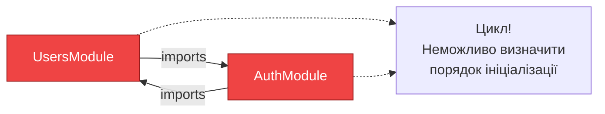
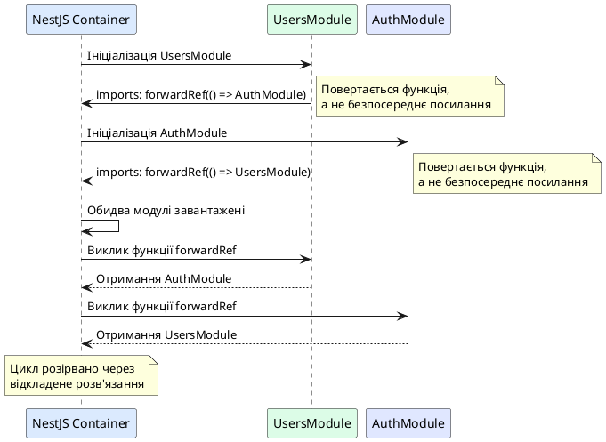
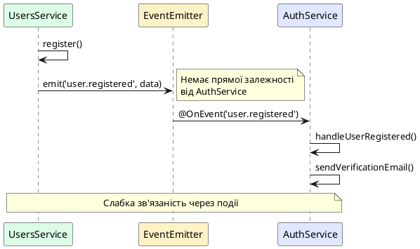

# Циклічні залежності та forwardRef

## Короткий зміст

- Що таке циклічна залежність (circular dependency)
- Проблема: ModuleA залежить від ModuleB, який залежить від ModuleA
- Помилка при запуску: "Cannot access X before initialization"
- Функція `forwardRef()`: відкладене розв'язання залежності
- Використання у декораторі @Module (imports)
- Використання у параметрах конструктора (@Inject(forwardRef))
- Приклад: UsersService ↔ AuthService взаємна залежність
- Альтернативи: рефакторинг архітектури, винесення спільної логіки
- Коли forwardRef неминучий: domain events, circular business logic
- Best practices: уникати циклічних залежностей через перепроєктування

---

## Концепція циклічної залежності

**Циклічна залежність** (*circular dependency*) виникає, коли два або більше модулів чи провайдерів залежать один від одного, створюючи замкнене коло залежностей. Це одна з найпоширеніших архітектурних проблем у великих застосунках, яка призводить до помилок під час ініціалізації.

У NestJS циклічні залежності можуть виникати на двох рівнях:

1. **Між модулями**: `UsersModule` імпортує `AuthModule`, а `AuthModule` імпортує `UsersModule`
2. **Між провайдерами**: `UsersService` залежить від `AuthService`, а `AuthService` залежить від `UsersService`

JavaScript/TypeScript не можуть вирішити такі залежності автоматично, оскільки для створення екземпляру `A` потрібен екземпляр `B`, але для створення `B` потрібен `A` — це неможлива ситуація без спеціальних механізмів.

::card-group

::card{title="🎯 Мета лекції" icon="i-lucide-target"}

- Зрозуміти природу циклічних залежностей та причини їх виникнення
- Опанувати функцію `forwardRef()` для розв'язання циклів
- Навчитися виявляти та діагностувати циклічні залежності
- Дослідити альтернативні підходи до рефакторингу архітектури
- Застосовувати best practices для запобігання циклічним залежностям

::

::card{title="🔑 Ключові терміни" icon="i-lucide-key"}

- **Circular Dependency** — циклічна залежність, коли A залежить від B, а B залежить від A
- **forwardRef()** — функція NestJS для відкладеного розв'язання циклічних залежностей
- **Dependency Graph** — граф залежностей модулів та провайдерів
- **Forward Reference** — посилання на клас, що буде визначений пізніше у коді
- **Architectural Smell** — ознака проблеми у проєктуванні архітектури

::

::

---

## Проблема: як виникають циклічні залежності

Розглянемо типовий сценарій виникнення циклічної залежності між модулями:

```typescript
// users/users.module.ts
import { Module } from '@nestjs/common';
import { AuthModule } from '../auth/auth.module';  // Імпорт AuthModule
import { UsersService } from './users.service';
import { UsersController } from './users.controller';

@Module({
  imports: [AuthModule],  // UsersModule залежить від AuthModule
  providers: [UsersService],
  controllers: [UsersController],
  exports: [UsersService]
})
export class UsersModule {}

// auth/auth.module.ts
import { Module } from '@nestjs/common';
import { UsersModule } from '../users/users.module';  // Імпорт UsersModule
import { AuthService } from './auth.service';
import { AuthController } from './auth.controller';

@Module({
  imports: [UsersModule],  // AuthModule залежить від UsersModule
  providers: [AuthService],
  controllers: [AuthController],
  exports: [AuthService]
})
export class AuthModule {}
```

**Візуалізація циклічної залежності:**

::mermaid



::

### Помилка при запуску застосунку

При спробі запустити застосунок з циклічною залежністю NestJS згенерує помилку:

::terminal-preview{title="npm run start:dev" :cursor="false"}

<div class="line"><span class="opacity-40">$</span> <strong class="font-bold">npm run start:dev</strong></div>
<div class="line"></div>
<div class="line"><span class="text-rose-400 font-bold">Error:</span> A circular dependency has been detected</div>
<div class="line"><span class="text-rose-400">between modules:</span></div>
<div class="line"></div>
<div class="line">  <span class="text-yellow-400">UsersModule</span> → <span class="text-yellow-400">AuthModule</span></div>
<div class="line">  <span class="text-yellow-400">AuthModule</span> → <span class="text-yellow-400">UsersModule</span></div>
<div class="line"></div>
<div class="line"><span class="opacity-60">at checkCircularImport (nest/core/injector/module.js:84:15)</span></div>
<div class="line"><span class="opacity-60">at InstanceLoader.createInstancesOfDependencies</span></div>

::

Або у випадку циклічної залежності між провайдерами:

::terminal-preview{title="npm run start:dev" :cursor="false"}

<div class="line"><span class="opacity-40">$</span> <strong class="font-bold">npm run start:dev</strong></div>
<div class="line"></div>
<div class="line"><span class="text-rose-400 font-bold">ReferenceError:</span> Cannot access 'UsersService' before initialization</div>
<div class="line"></div>
<div class="line">  <span class="opacity-60">at Object.<anonymous> (auth/auth.service.ts:3:17)</span></div>
<div class="line">  <span class="opacity-60">at Module._compile (internal/modules/cjs/loader.js:1085:14)</span></div>

::

---

## Функція forwardRef(): відкладене розв'язання залежності

NestJS надає функцію **`forwardRef()`**, яка дозволяє створити **forward reference** — посилання на клас, що буде визначений пізніше. Це дозволяє розірвати цикл залежностей, відкладаючи розв'язання залежності до моменту, коли обидва класи будуть повністю завантажені.

### Синтаксис forwardRef

```typescript
import { forwardRef } from '@nestjs/common';

// У декораторі @Module
imports: [forwardRef(() => SomeModule)]

// У параметрах конструктора
constructor(@Inject(forwardRef(() => SomeService)) private service: SomeService) {}
```

**Ключова ідея:** замість прямого посилання на клас `SomeModule` ми передаємо **функцію**, що повертає клас. Ця функція викликається пізніше, коли клас вже визначений.

---

## Використання forwardRef у декораторі @Module

Для розв'язання циклічної залежності між модулями потрібно використати `forwardRef()` в **обох** модулях:

```typescript
// users/users.module.ts
import { Module, forwardRef } from '@nestjs/common';
import { AuthModule } from '../auth/auth.module';
import { UsersService } from './users.service';
import { UsersController } from './users.controller';

@Module({
  imports: [
    forwardRef(() => AuthModule)  // ✅ Forward reference на AuthModule
  ],
  providers: [UsersService],
  controllers: [UsersController],
  exports: [UsersService]
})
export class UsersModule {}

// auth/auth.module.ts
import { Module, forwardRef } from '@nestjs/common';
import { UsersModule } from '../users/users.module';
import { AuthService } from './auth.service';
import { AuthController } from './auth.controller';

@Module({
  imports: [
    forwardRef(() => UsersModule)  // ✅ Forward reference на UsersModule
  ],
  providers: [AuthService],
  controllers: [AuthController],
  exports: [AuthService]
})
export class AuthModule {}
```

::plant-uml{alt="Розв'язання циклічної залежності через forwardRef"}



::

::warning
**Важливо:** `forwardRef()` потрібно використовувати в **обох** модулях, що утворюють цикл. Якщо застосувати його лише в одному модулі, помилка залишиться.
::

---

## Використання forwardRef у параметрах конструктора

Циклічна залежність може виникнути не тільки між модулями, а й між провайдерами. Наприклад, `UsersService` потребує `AuthService`, а `AuthService` потребує `UsersService`:

```typescript
// users/users.service.ts
import { Injectable, Inject, forwardRef } from '@nestjs/common';
import { AuthService } from '../auth/auth.service';

@Injectable()
export class UsersService {
  constructor(
    @Inject(forwardRef(() => AuthService))  // ✅ Forward reference
    private readonly authService: AuthService
  ) {}

  async createUser(userData: any) {
    const user = await this.saveToDatabase(userData);
    
    // Використання AuthService
    await this.authService.sendVerificationEmail(user.email);
    
    return user;
  }

  async findByEmail(email: string) {
    // Логіка пошуку
  }

  private async saveToDatabase(userData: any) {
    // Збереження у БД
  }
}

// auth/auth.service.ts
import { Injectable, Inject, forwardRef } from '@nestjs/common';
import { UsersService } from '../users/users.service';

@Injectable()
export class AuthService {
  constructor(
    @Inject(forwardRef(() => UsersService))  // ✅ Forward reference
    private readonly usersService: UsersService
  ) {}

  async validateUser(email: string, password: string) {
    // Використання UsersService
    const user = await this.usersService.findByEmail(email);
    
    if (user && await this.comparePasswords(password, user.password)) {
      return user;
    }
    
    return null;
  }

  async sendVerificationEmail(email: string) {
    // Відправка email
  }

  private async comparePasswords(plain: string, hashed: string) {
    // Порівняння паролів
  }
}
```

::note
При використанні `forwardRef()` у конструкторах **обов'язково** потрібен декоратор `@Inject()`, оскільки TypeScript не може автоматично визначити тип параметра через forward reference.
::

---

## Повний приклад: UsersModule ↔ AuthModule

Розглянемо повний приклад розв'язання циклічної залежності на всіх рівнях:

```typescript
// users/users.module.ts
import { Module, forwardRef } from '@nestjs/common';
import { AuthModule } from '../auth/auth.module';
import { UsersService } from './users.service';
import { UsersController } from './users.controller';
import { UsersRepository } from './users.repository';

@Module({
  imports: [
    forwardRef(() => AuthModule)  // ✅ Розв'язання циклу на рівні модулів
  ],
  providers: [UsersService, UsersRepository],
  controllers: [UsersController],
  exports: [UsersService]
})
export class UsersModule {}

// auth/auth.module.ts
import { Module, forwardRef } from '@nestjs/common';
import { JwtModule } from '@nestjs/jwt';
import { PassportModule } from '@nestjs/passport';
import { UsersModule } from '../users/users.module';
import { AuthService } from './auth.service';
import { AuthController } from './auth.controller';
import { JwtStrategy } from './strategies/jwt.strategy';

@Module({
  imports: [
    forwardRef(() => UsersModule),  // ✅ Розв'язання циклу на рівні модулів
    PassportModule,
    JwtModule.register({
      secret: process.env.JWT_SECRET,
      signOptions: { expiresIn: '1d' }
    })
  ],
  providers: [AuthService, JwtStrategy],
  controllers: [AuthController],
  exports: [AuthService]
})
export class AuthModule {}

// users/users.service.ts
import { Injectable, Inject, forwardRef } from '@nestjs/common';
import { AuthService } from '../auth/auth.service';
import { UsersRepository } from './users.repository';

@Injectable()
export class UsersService {
  constructor(
    private readonly usersRepository: UsersRepository,
    @Inject(forwardRef(() => AuthService))  // ✅ Розв'язання циклу на рівні провайдерів
    private readonly authService: AuthService
  ) {}

  async register(email: string, password: string) {
    // Перевірка унікальності
    const existingUser = await this.usersRepository.findByEmail(email);
    if (existingUser) {
      throw new Error('User already exists');
    }

    // Хешування пароля через AuthService
    const hashedPassword = await this.authService.hashPassword(password);

    // Створення користувача
    const user = await this.usersRepository.create({
      email,
      password: hashedPassword
    });

    return user;
  }

  async findByEmail(email: string) {
    return this.usersRepository.findByEmail(email);
  }
}

// auth/auth.service.ts
import { Injectable, Inject, forwardRef } from '@nestjs/common';
import { JwtService } from '@nestjs/jwt';
import { UsersService } from '../users/users.service';
import * as bcrypt from 'bcrypt';

@Injectable()
export class AuthService {
  constructor(
    private readonly jwtService: JwtService,
    @Inject(forwardRef(() => UsersService))  // ✅ Розв'язання циклу на рівні провайдерів
    private readonly usersService: UsersService
  ) {}

  async validateUser(email: string, password: string) {
    // Отримання користувача через UsersService
    const user = await this.usersService.findByEmail(email);
    
    if (user && await bcrypt.compare(password, user.password)) {
      const { password, ...result } = user;
      return result;
    }
    
    return null;
  }

  async login(user: any) {
    const payload = { email: user.email, sub: user.id };
    return {
      access_token: this.jwtService.sign(payload)
    };
  }

  async hashPassword(password: string): Promise<string> {
    return bcrypt.hash(password, 10);
  }
}
```

---

## Альтернативи forwardRef: рефакторинг архітектури

Хоча `forwardRef()` розв'язує технічну проблему циклічних залежностей, він є **антипаттерном**, що свідчить про проблеми у проєктуванні архітектури. У більшості випадків циклічні залежності можна уникнути через рефакторинг.

### ✅ Альтернатива 1: Винесення спільної логіки у третій модуль

Створіть окремий модуль для спільної функціональності:

```typescript
// shared/password/password.module.ts
import { Module } from '@nestjs/common';
import { PasswordService } from './password.service';

@Module({
  providers: [PasswordService],
  exports: [PasswordService]
})
export class PasswordModule {}

// shared/password/password.service.ts
import { Injectable } from '@nestjs/common';
import * as bcrypt from 'bcrypt';

@Injectable()
export class PasswordService {
  async hash(password: string): Promise<string> {
    return bcrypt.hash(password, 10);
  }

  async compare(password: string, hash: string): Promise<boolean> {
    return bcrypt.compare(password, hash);
  }
}
```

Тепер обидва модулі можуть імпортувати `PasswordModule` без циклічної залежності:

```typescript
// users/users.module.ts
@Module({
  imports: [PasswordModule],  // ✅ Немає циклічної залежності
  providers: [UsersService],
  exports: [UsersService]
})
export class UsersModule {}

// auth/auth.module.ts
@Module({
  imports: [
    UsersModule,      // ✅ Односпрямована залежність
    PasswordModule    // ✅ Немає циклічної залежності
  ],
  providers: [AuthService],
  exports: [AuthService]
})
export class AuthModule {}
```

### ✅ Альтернатива 2: Подієва архітектура (Event-Driven)

Замість прямих викликів використовуйте події:

```typescript
// users/users.service.ts
import { Injectable } from '@nestjs/common';
import { EventEmitter2 } from '@nestjs/event-emitter';

@Injectable()
export class UsersService {
  constructor(private readonly eventEmitter: EventEmitter2) {}

  async register(email: string, password: string) {
    const user = await this.createUser(email, password);
    
    // Випускаємо подію замість прямого виклику AuthService
    this.eventEmitter.emit('user.registered', { userId: user.id, email: user.email });
    
    return user;
  }
}

// auth/auth.service.ts
import { Injectable } from '@nestjs/common';
import { OnEvent } from '@nestjs/event-emitter';

@Injectable()
export class AuthService {
  // Підписуємося на подію
  @OnEvent('user.registered')
  async handleUserRegistered(payload: { userId: number; email: string }) {
    // Відправка привітального email
    await this.sendVerificationEmail(payload.email);
  }
}
```

::plant-uml{alt="Рефакторинг через подієву архітектуру"}



::

### ✅ Альтернатива 3: Інверсія залежності через інтерфейси

Визначте інтерфейс у нейтральному місці та залежте від абстракції:

```typescript
// common/interfaces/authentication.interface.ts
export interface IAuthenticationService {
  hashPassword(password: string): Promise<string>;
  validateUser(email: string, password: string): Promise<any>;
}

// users/users.service.ts
@Injectable()
export class UsersService {
  constructor(
    @Inject('IAuthenticationService')
    private readonly authService: IAuthenticationService  // Залежність від інтерфейсу
  ) {}
}

// auth/auth.module.ts
@Module({
  providers: [
    {
      provide: 'IAuthenticationService',
      useClass: AuthService  // Реалізація інтерфейсу
    }
  ],
  exports: ['IAuthenticationService']
})
export class AuthModule {}
```

---

## Коли forwardRef неминучий

У деяких випадках циклічні залежності є природною частиною предметної області:

### Сценарій 1: Bidirectional Relations у Domain Models

```typescript
// У системі з двосторонніми зв'язками між сутностями:
// User має багато Posts, Post належить User

// entities/user.entity.ts
@Entity()
export class User {
  @OneToMany(() => Post, post => post.author)
  posts: Post[];
}

// entities/post.entity.ts
@Entity()
export class Post {
  @ManyToOne(() => User, user => user.posts)
  author: User;
}
```

### Сценарій 2: Plugin Systems

```typescript
// Система плагінів, де кожен плагін може залежати від core та навпаки
```

::caution
Навіть у цих випадках спочатку розгляньте альтернативи рефакторингу. Використовуйте `forwardRef()` лише як **останній засіб**, коли всі інші підходи неможливі або надмірно складні.
::

---

## Best Practices: уникання циклічних залежностей

::card-group

::card{title="🚫 Уникайте за замовчуванням" icon="i-lucide-ban"}

**Принцип:** Циклічні залежності — це architectural smell

**Рекомендації:**
- Переглядайте архітектуру при виникненні циклів
- Шукайте спільну логіку, що може бути винесена
- Використовуйте подієву архітектуру для слабкої зв'язаності

::

::card{title="📐 Дотримуйтесь принципу DIP" icon="i-lucide-triangle"}

**Dependency Inversion Principle:** Залежте від абстракцій, а не реалізацій

**Рекомендації:**
- Визначайте інтерфейси у нейтральних місцях
- Використовуйте токени для ін'єкції
- Уникайте прямих імпортів конкретних реалізацій

::

::card{title="🔄 Використовуйте події" icon="i-lucide-repeat"}

**Event-Driven Architecture:** Слабка зв'язаність через події

**Рекомендації:**
- Застосовуйте `EventEmitter2` для асинхронної комунікації
- Підписуйтеся на події через `@OnEvent()`
- Документуйте події як частину публічного API

::

::card{title="🛠️ Рефакторинг > forwardRef" icon="i-lucide-wrench"}

**Принцип:** `forwardRef()` — це технічне рішення, не архітектурне

**Рекомендації:**
- Використовуйте `forwardRef()` лише як тимчасове рішення
- Плануйте рефакторинг для усунення циклів
- Документуйте причину використання `forwardRef()`

::

::

---

## Висновки

Циклічні залежності є серйозною архітектурною проблемою, яка потребує уваги. Ключові принципи:

- **Виявлення**: NestJS автоматично виявляє циклічні залежності під час запуску
- **Технічне рішення**: `forwardRef()` дозволяє розірвати цикл через відкладене розв'язання
- **Архітектурне рішення**: рефакторинг через винесення спільної логіки, події або інверсію залежностей
- **Best practice**: уникайте циклічних залежностей через правильне проєктування архітектури

::warning
`forwardRef()` — це **костиль**, а не рішення. Якщо ви використовуєте його, це сигнал про необхідність переглянути архітектуру застосунку.
::

У наступній лекції ми розглянемо Lifecycle Hooks — механізми для виконання коду на різних етапах життєвого циклу модулів та провайдерів.
