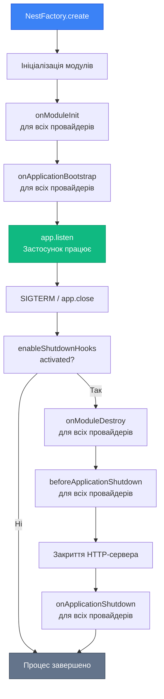
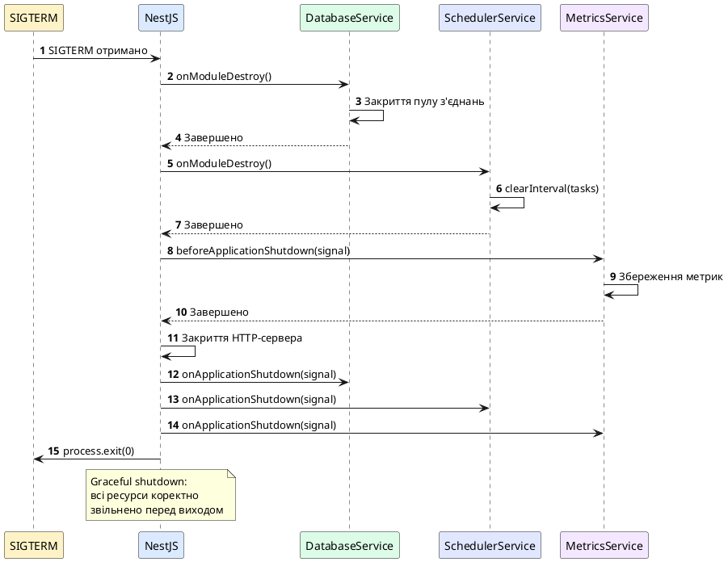

# Lifecycle Hooks: хуки життєвого циклу

## Короткий зміст

- Життєвий цикл застосунку NestJS
- Інтерфейс `OnModuleInit`: виконання після ініціалізації модуля
- Інтерфейс `OnApplicationBootstrap`: виконання після запуску всього застосунку
- Інтерфейс `OnModuleDestroy`: очищення перед знищенням модуля
- Інтерфейс `BeforeApplicationShutdown`: перед завершенням застосунку
- Інтерфейс `OnApplicationShutdown`: при завершенні застосунку
- Порядок виконання hooks
- Сценарії використання: підключення до БД, закриття з'єднань
- Приклад: ініціалізація кешу в onModuleInit
- Graceful shutdown: коректне завершення з очищенням ресурсів

---

## Життєвий цикл застосунку NestJS

Кожен застосунок NestJS проходить через чітко визначений **життєвий цикл** (*lifecycle*) від запуску до завершення. NestJS надає набір **lifecycle hooks** (*хуків життєвого циклу*) — спеціальних методів, які викликаються на різних етапах життя застосунку, модулів та провайдерів.

Lifecycle hooks дозволяють виконувати код у критичні моменти:
- **Ініціалізація**: підключення до БД, завантаження конфігурації, прогрівання кешу
- **Запуск**: реєстрація слухачів подій, старт фонових процесів
- **Завершення**: закриття з'єднань, збереження стану, очищення ресурсів

::card-group

::card{title="🎯 Мета лекції" icon="i-lucide-target"}

- Зрозуміти фази життєвого циклу застосунку NestJS
- Опанувати всі доступні lifecycle hooks та їх призначення
- Навчитися коректно ініціалізувати ресурси при запуску
- Реалізувати graceful shutdown для чистого завершення
- Застосовувати best practices для роботи з lifecycle hooks

::

::card{title="🔑 Ключові терміни" icon="i-lucide-key"}

- **Lifecycle Hook** — метод, що викликається на певному етапі життєвого циклу
- **Initialization Phase** — фаза ініціалізації модулів та провайдерів
- **Bootstrap Phase** — фаза запуску застосунку
- **Termination Phase** — фаза завершення застосунку
- **Graceful Shutdown** — коректне завершення з очищенням ресурсів

::

::

---

## Фази життєвого циклу та порядок виконання hooks

::mermaid



::

### Детальна послідовність lifecycle hooks

::steps

### Фаза 1: Ініціалізація (Initialization)

`onModuleInit()` викликається для кожного провайдера та контролера **після створення** всіх залежностей модуля, але **до запуску** застосунку.

### Фаза 2: Завантаження (Bootstrap)

`onApplicationBootstrap()` викликається **після завершення** ініціалізації всіх модулів, але **до прослуховування** порту HTTP-сервером.

### Фаза 3: Робота (Running)

Застосунок обробляє запити. Lifecycle hooks не викликаються.

### Фаза 4: Підготовка до завершення (Pre-Termination)

`onModuleDestroy()` викликається після отримання сигналу завершення (SIGTERM) або виклику `app.close()`.

### Фаза 5: Завершення HTTP-сервера

NestJS закриває HTTP-сервер та завершує обробку активних з'єднань.

### Фаза 6: Фінальне очищення (Shutdown)

`beforeApplicationShutdown()` викликається **перед** остаточним завершенням процесу.

`onApplicationShutdown()` викликається **безпосередньо перед** завершенням Node.js процесу.

::

---

## OnModuleInit: ініціалізація після створення модуля

Інтерфейс `OnModuleInit` визначає метод `onModuleInit()`, який викликається **після того, як всі залежності модуля створені**, але **до запуску застосунку**.

### Приклад: підключення до бази даних

```typescript
// database/database.service.ts
import { Injectable, OnModuleInit } from '@nestjs/common';
import { Pool } from 'pg';

@Injectable()
export class DatabaseService implements OnModuleInit {
  private pool: Pool;

  async onModuleInit() {
    console.log('DatabaseService: Ініціалізація підключення до БД...');
    
    this.pool = new Pool({
      host: process.env.DB_HOST,
      port: parseInt(process.env.DB_PORT, 10),
      user: process.env.DB_USER,
      password: process.env.DB_PASSWORD,
      database: process.env.DB_NAME,
      max: 20
    });

    // Перевірка з'єднання
    try {
      const client = await this.pool.connect();
      console.log('✓ Підключення до БД встановлено');
      client.release();
    } catch (error) {
      console.error('✗ Помилка підключення до БД:', error.message);
      throw error;
    }
  }

  async query(text: string, params?: any[]) {
    return this.pool.query(text, params);
  }
}
```

### Приклад: прогрівання кешу

```typescript
// cache/cache.service.ts
import { Injectable, OnModuleInit } from '@nestjs/common';

@Injectable()
export class CacheService implements OnModuleInit {
  private cache = new Map<string, any>();

  async onModuleInit() {
    console.log('CacheService: Прогрівання кешу...');
    
    // Завантаження популярних даних у кеш
    await this.preloadPopularData();
    
    console.log(`✓ Кеш прогрітий: ${this.cache.size} записів`);
  }

  private async preloadPopularData() {
    // Симуляція завантаження з БД
    const popularItems = [
      { key: 'config:app_name', value: 'My App' },
      { key: 'config:api_version', value: 'v1.0.0' },
      { key: 'config:max_requests', value: 1000 }
    ];

    for (const item of popularItems) {
      this.cache.set(item.key, item.value);
    }
  }

  get(key: string): any {
    return this.cache.get(key);
  }

  set(key: string, value: any): void {
    this.cache.set(key, value);
  }
}
```

::note
`onModuleInit()` може бути **асинхронним**. NestJS чекатиме на завершення Promise перед продовженням ініціалізації наступних модулів.
::

---

## OnApplicationBootstrap: виконання після запуску застосунку

Інтерфейс `OnApplicationBootstrap` визначає метод `onApplicationBootstrap()`, який викликається **після завершення ініціалізації всіх модулів**, безпосередньо **перед прослуховуванням порту**.

### Приклад: реєстрація фонових задач

```typescript
// scheduler/scheduler.service.ts
import { Injectable, OnApplicationBootstrap } from '@nestjs/common';

@Injectable()
export class SchedulerService implements OnApplicationBootstrap {
  private intervals: NodeJS.Timeout[] = [];

  onApplicationBootstrap() {
    console.log('SchedulerService: Запуск фонових задач...');
    
    // Щохвилинна задача
    this.intervals.push(
      setInterval(() => this.cleanupExpiredSessions(), 60000)
    );

    // Щогодинна задача
    this.intervals.push(
      setInterval(() => this.generateReports(), 3600000)
    );

    console.log('✓ Фонові задачі запущено');
  }

  private cleanupExpiredSessions() {
    console.log('[Cron] Очищення застарілих сесій');
    // Логіка очищення
  }

  private generateReports() {
    console.log('[Cron] Генерація звітів');
    // Логіка генерації звітів
  }
}
```

### Приклад: підписка на події WebSocket

```typescript
// notifications/notifications.service.ts
import { Injectable, OnApplicationBootstrap } from '@nestjs/common';
import { EventEmitter2 } from '@nestjs/event-emitter';

@Injectable()
export class NotificationsService implements OnApplicationBootstrap {
  constructor(private readonly eventEmitter: EventEmitter2) {}

  onApplicationBootstrap() {
    console.log('NotificationsService: Підписка на події...');
    
    // Підписка на події користувачів
    this.eventEmitter.on('user.registered', (data) => {
      this.sendWelcomeEmail(data.email);
    });

    this.eventEmitter.on('order.completed', (data) => {
      this.sendOrderConfirmation(data.userId, data.orderId);
    });

    console.log('✓ Підписки на події налаштовано');
  }

  private sendWelcomeEmail(email: string) {
    console.log(`Відправка вітального email на ${email}`);
  }

  private sendOrderConfirmation(userId: number, orderId: number) {
    console.log(`Підтвердження замовлення #${orderId} для користувача #${userId}`);
  }
}
```

::tip
Використовуйте `onApplicationBootstrap()` для задач, що потребують **повністю ініціалізованого застосунку**, наприклад, запуск WebSocket-серверів, підписка на зовнішні події або реєстрація у service discovery.
::

---

## OnModuleDestroy: очищення перед знищенням модуля

Інтерфейс `OnModuleDestroy` визначає метод `onModuleDestroy()`, який викликається **перед знищенням модуля** при завершенні застосунку.

### Приклад: закриття підключення до БД

```typescript
// database/database.service.ts
import { Injectable, OnModuleInit, OnModuleDestroy } from '@nestjs/common';
import { Pool } from 'pg';

@Injectable()
export class DatabaseService implements OnModuleInit, OnModuleDestroy {
  private pool: Pool;

  async onModuleInit() {
    this.pool = new Pool({
      host: process.env.DB_HOST,
      port: parseInt(process.env.DB_PORT, 10),
      database: process.env.DB_NAME
    });
    console.log('✓ Підключення до БД встановлено');
  }

  async onModuleDestroy() {
    console.log('DatabaseService: Закриття підключення до БД...');
    
    await this.pool.end();
    
    console.log('✓ Підключення до БД закрито');
  }

  async query(text: string, params?: any[]) {
    return this.pool.query(text, params);
  }
}
```

### Приклад: зупинка фонових задач

```typescript
// scheduler/scheduler.service.ts
import { Injectable, OnApplicationBootstrap, OnModuleDestroy } from '@nestjs/common';

@Injectable()
export class SchedulerService implements OnApplicationBootstrap, OnModuleDestroy {
  private intervals: NodeJS.Timeout[] = [];

  onApplicationBootstrap() {
    this.intervals.push(
      setInterval(() => this.cleanupExpiredSessions(), 60000)
    );
    console.log('✓ Фонові задачі запущено');
  }

  onModuleDestroy() {
    console.log('SchedulerService: Зупинка фонових задач...');
    
    // Очищення всіх інтервалів
    this.intervals.forEach(interval => clearInterval(interval));
    this.intervals = [];
    
    console.log('✓ Фонові задачі зупинено');
  }

  private cleanupExpiredSessions() {
    // Логіка очищення
  }
}
```

::warning
`onModuleDestroy()` викликається **тільки** якщо увімкнено graceful shutdown через `app.enableShutdownHooks()`. Без цього hook не спрацює!
::

---

## BeforeApplicationShutdown та OnApplicationShutdown

Ці hooks виконуються на фінальних етапах завершення застосунку:

### BeforeApplicationShutdown

Викликається **після** `onModuleDestroy()`, але **до** остаточного завершення процесу. Отримує сигнал завершення як параметр.

```typescript
// metrics/metrics.service.ts
import { Injectable, BeforeApplicationShutdown } from '@nestjs/common';

@Injectable()
export class MetricsService implements BeforeApplicationShutdown {
  private metrics = {
    requestsProcessed: 0,
    errorsCount: 0
  };

  beforeApplicationShutdown(signal?: string) {
    console.log(`MetricsService: Отримано сигнал завершення: ${signal}`);
    console.log('Збереження метрик перед завершенням...');
    
    // Збереження метрик у файл або БД
    this.saveMetricsToFile();
    
    console.log('✓ Метрики збережено');
  }

  private saveMetricsToFile() {
    const fs = require('fs');
    fs.writeFileSync(
      'metrics.json',
      JSON.stringify(this.metrics, null, 2)
    );
  }

  incrementRequests() {
    this.metrics.requestsProcessed++;
  }

  incrementErrors() {
    this.metrics.errorsCount++;
  }
}
```

### OnApplicationShutdown

Викликається **безпосередньо перед** завершенням Node.js процесу. Останній шанс виконати критичні операції.

```typescript
// logger/logger.service.ts
import { Injectable, OnApplicationShutdown } from '@nestjs/common';

@Injectable()
export class LoggerService implements OnApplicationShutdown {
  private logBuffer: string[] = [];

  onApplicationShutdown(signal?: string) {
    console.log(`LoggerService: Фінальна синхронізація логів (${signal})`);
    
    // Скидання буфера логів
    this.flushLogs();
    
    console.log('✓ Логи синхронізовано');
  }

  log(message: string) {
    this.logBuffer.push(`[${new Date().toISOString()}] ${message}`);
  }

  private flushLogs() {
    // Запис усіх буферизованих логів
    this.logBuffer.forEach(log => console.log(log));
    this.logBuffer = [];
  }
}
```

---

## Увімкнення Graceful Shutdown

За замовчуванням NestJS **не** викликає hooks завершення (`onModuleDestroy`, `beforeApplicationShutdown`, `onApplicationShutdown`). Щоб увімкнути graceful shutdown, потрібно явно активувати його:

```typescript
// main.ts
import { NestFactory } from '@nestjs/core';
import { AppModule } from './app.module';

async function bootstrap() {
  const app = await NestFactory.create(AppModule);

  // ✅ Увімкнення graceful shutdown
  app.enableShutdownHooks();

  await app.listen(3000);
  console.log('Застосунок запущено на http://localhost:3000');
}

bootstrap();
```

Тепер при отриманні сигналів `SIGTERM` або `SIGINT` (Ctrl+C) NestJS коректно завершить роботу:

::terminal-preview{title="Graceful Shutdown" :cursor="false"}

<div class="line"><span class="opacity-40">$</span> <strong class="font-bold">npm run start:prod</strong></div>
<div class="line"></div>
<div class="line"><span class="text-blue-400">INFO</span> Застосунок запущено на http://localhost:3000</div>
<div class="line"><span class="text-green-400">✓</span> DatabaseService підключено до БД</div>
<div class="line"><span class="text-green-400">✓</span> CacheService прогрітий: 150 записів</div>
<div class="line"><span class="text-green-400">✓</span> SchedulerService фонові задачі запущено</div>
<div class="line"></div>
<div class="line"><span class="opacity-60">[Користувач натискає Ctrl+C]</span></div>
<div class="line"></div>
<div class="line"><span class="text-yellow-400">WARN</span> Отримано сигнал SIGINT. Завершення роботи...</div>
<div class="line"><span class="text-blue-400">INFO</span> SchedulerService: Зупинка фонових задач...</div>
<div class="line"><span class="text-green-400">✓</span> Фонові задачі зупинено</div>
<div class="line"><span class="text-blue-400">INFO</span> DatabaseService: Закриття підключення до БД...</div>
<div class="line"><span class="text-green-400">✓</span> Підключення до БД закрито</div>
<div class="line"><span class="text-blue-400">INFO</span> MetricsService: Збереження метрик...</div>
<div class="line"><span class="text-green-400">✓</span> Метрики збережено</div>
<div class="line"></div>
<div class="line"><span class="text-green-400 font-bold">Застосунок коректно завершено</span></div>

::

::plant-uml{alt="Послідовність виконання lifecycle hooks при завершенні"}



::

---

## Повний приклад: сервіс з lifecycle hooks

```typescript
// redis/redis.service.ts
import {
  Injectable,
  OnModuleInit,
  OnApplicationBootstrap,
  OnModuleDestroy,
  BeforeApplicationShutdown,
  OnApplicationShutdown
} from '@nestjs/common';
import { createClient, RedisClientType } from 'redis';

@Injectable()
export class RedisService
  implements
    OnModuleInit,
    OnApplicationBootstrap,
    OnModuleDestroy,
    BeforeApplicationShutdown,
    OnApplicationShutdown
{
  private client: RedisClientType;
  private connectionStatus: 'connecting' | 'connected' | 'disconnecting' | 'disconnected' = 'disconnected';

  // 1. Ініціалізація після створення модуля
  async onModuleInit() {
    console.log('[1] RedisService.onModuleInit: Підключення до Redis...');
    
    this.connectionStatus = 'connecting';
    this.client = createClient({
      url: process.env.REDIS_URL || 'redis://localhost:6379'
    });

    this.client.on('error', (err) => console.error('Redis Error:', err));

    await this.client.connect();
    this.connectionStatus = 'connected';
    
    console.log('✓ Redis підключено');
  }

  // 2. Виконання після запуску застосунку
  onApplicationBootstrap() {
    console.log('[2] RedisService.onApplicationBootstrap: Перевірка з'єднання...');
    
    // Запис тестового ключа
    this.client.set('app:status', 'running', { EX: 3600 });
    
    console.log('✓ Redis готовий до роботи');
  }

  // 3. Очищення перед знищенням модуля
  async onModuleDestroy() {
    console.log('[3] RedisService.onModuleDestroy: Початок відключення...');
    
    this.connectionStatus = 'disconnecting';
    
    // Видалення тестового ключа
    await this.client.del('app:status');
  }

  // 4. Перед завершенням застосунку
  async beforeApplicationShutdown(signal?: string) {
    console.log(`[4] RedisService.beforeApplicationShutdown: Сигнал ${signal}`);
    
    // Збереження критичних даних перед відключенням
    const pendingWrites = await this.getPendingWrites();
    console.log(`Очікуються записи: ${pendingWrites}`);
  }

  // 5. При завершенні застосунку
  async onApplicationShutdown(signal?: string) {
    console.log(`[5] RedisService.onApplicationShutdown: Закриття з'єднання (${signal})`);
    
    await this.client.quit();
    this.connectionStatus = 'disconnected';
    
    console.log('✓ Redis відключено');
  }

  // Публічний API сервісу
  async get(key: string): Promise<string | null> {
    if (this.connectionStatus !== 'connected') {
      throw new Error('Redis not connected');
    }
    return this.client.get(key);
  }

  async set(key: string, value: string, ttl?: number): Promise<void> {
    if (this.connectionStatus !== 'connected') {
      throw new Error('Redis not connected');
    }
    await this.client.set(key, value, ttl ? { EX: ttl } : undefined);
  }

  private async getPendingWrites(): Promise<number> {
    // Логіка підрахунку незавершених записів
    return 0;
  }
}
```

---

## Best Practices для lifecycle hooks

::card-group

::card{title="⚡ Швидкість виконання" icon="i-lucide-zap"}

**Принцип:** Hooks мають виконуватися швидко

**Рекомендації:**
- Уникайте довгих синхронних операцій у hooks
- Використовуйте таймаути для зовнішніх викликів
- Логуйте час виконання для моніторингу

::

::card{title="🔒 Безпека даних" icon="i-lucide-shield-check"}

**Принцип:** Критичні дані мають бути збережені перед завершенням

**Рекомендації:**
- Скидайте буфери у `beforeApplicationShutdown()`
- Завершуйте активні транзакції перед відключенням
- Перевіряйте статус збереження перед виходом

::

::card{title="📝 Логування" icon="i-lucide-file-text"}

**Принцип:** Логуйте всі етапи життєвого циклу

**Рекомендації:**
- Додавайте логи у всі lifecycle hooks
- Вказуйте назву сервісу та етап
- Логуйте помилки з контекстом

::

::card{title="⏱️ Graceful Shutdown" icon="i-lucide-clock"}

**Принцип:** Завжди увімкнюйте graceful shutdown у продакшні

**Рекомендації:**
- Викликайте `app.enableShutdownHooks()` у `main.ts`
- Встановлюйте таймаути для завершення
- Тестуйте поведінку при SIGTERM/SIGINT

::

::

---

## Висновки

Lifecycle hooks є потужним механізмом для контролю поведінки застосунку на різних етапах життєвого циклу. Ключові принципи:

- **Ініціалізація**: `onModuleInit()` для підготовки ресурсів, `onApplicationBootstrap()` для запуску фонових процесів
- **Завершення**: `onModuleDestroy()` для очищення, `beforeApplicationShutdown()` для збереження даних, `onApplicationShutdown()` для фінальних операцій
- **Graceful Shutdown**: обов'язкове увімкнення через `app.enableShutdownHooks()` для коректного завершення
- **Порядок**: hooks викликаються у чіткій послідовності для всіх модулів та провайдерів

::tip
Використовуйте lifecycle hooks для критичних операцій ініціалізації та очищення. Це забезпечить надійну роботу застосунку та коректне звільнення ресурсів при завершенні.
::

У наступній лекції ми розглянемо ModuleRef — спеціальний клас для динамічного доступу до провайдерів у runtime.
