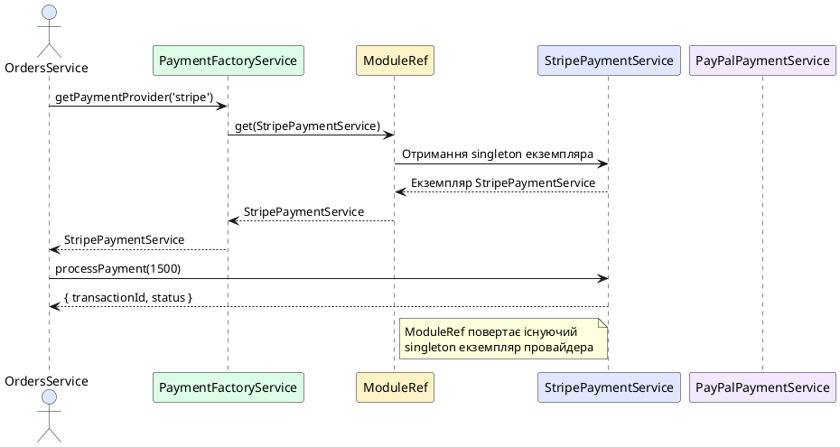

# ModuleRef: динамічний доступ до провайдерів

## Короткий зміст

- Що таке ModuleRef
- Впровадження ModuleRef у конструктор
- Метод `get<T>(token)`: отримання провайдера за токеном
- Метод `resolve<T>(token)`: отримання TRANSIENT провайдера
- Метод `create<T>(type)`: динамічне створення екземпляра
- Сценарії використання: фабрики, plugin systems, dynamic routing
- Різниця між get та resolve
- Доступ до провайдерів із інших модулів
- Приклад: динамічний вибір стратегії обробки
- Best practices: використовувати звичайний DI, ModuleRef для особливих випадків

---

## Концепція ModuleRef: програмний доступ до DI-контейнера

У попередніх лекціях ми працювали з **декларативним** підходом до Dependency Injection: залежності оголошуються у конструкторі, а NestJS автоматично їх розв'язує. Проте існують ситуації, коли потрібен **імперативний** доступ до DI-контейнера для динамічного отримання провайдерів під час виконання.

**ModuleRef** — це спеціальний клас NestJS, що надає програмний доступ до DI-контейнера поточного модуля. Через `ModuleRef` можна:
- Отримувати провайдери за токеном у runtime
- Створювати нові екземпляри провайдерів динамічно
- Реалізовувати патерни Factory, Strategy, Plugin System

::card-group

::card{title="🎯 Мета лекції" icon="i-lucide-target"}

- Зрозуміти концепцію `ModuleRef` та відмінність від декларативного DI
- Опанувати методи `get()`, `resolve()`, `create()` для динамічного доступу
- Навчитися застосовувати `ModuleRef` для реалізації фабрик та стратегій
- Дослідити різницю між singleton та transient провайдерами
- Застосовувати best practices для уникнення надмірного використання

::

::card{title="🔑 Ключові терміни" icon="i-lucide-key"}

- **ModuleRef** — клас для програмного доступу до DI-контейнера
- **Runtime Resolution** — динамічне розв'язання залежностей під час виконання
- **Transient Provider** — провайдер, для якого створюється новий екземпляр при кожному запиті
- **Singleton Provider** — провайдер з єдиним екземпляром на весь застосунок
- **Service Locator Pattern** — патерн доступу до сервісів через централізований реєстр

::

::

---

## Впровадження ModuleRef у конструктор

`ModuleRef` є звичайним провайдером, який можна ін'єктувати у будь-який сервіс або контролер:

```typescript
// services/factory.service.ts
import { Injectable } from '@nestjs/common';
import { ModuleRef } from '@nestjs/core';

@Injectable()
export class FactoryService {
  constructor(private readonly moduleRef: ModuleRef) {}

  // Методи для роботи з ModuleRef
}
```

::note
`ModuleRef` автоматично доступний у всіх модулях NestJS без явної реєстрації. Його не потрібно додавати до масиву `providers`.
::

---

## Метод get<T>(token): отримання singleton провайдера

Метод `get()` повертає **існуючий екземпляр** провайдера з DI-контейнера. Це аналог звичайної ін'єкції через конструктор, але виконаний програмно:

```typescript
// payment/payment-factory.service.ts
import { Injectable } from '@nestjs/common';
import { ModuleRef } from '@nestjs/core';
import { StripePaymentService } from './providers/stripe-payment.service';
import { PayPalPaymentService } from './providers/paypal-payment.service';

@Injectable()
export class PaymentFactoryService {
  constructor(private readonly moduleRef: ModuleRef) {}

  getPaymentProvider(type: 'stripe' | 'paypal') {
    if (type === 'stripe') {
      return this.moduleRef.get(StripePaymentService, { strict: false });
    } else if (type === 'paypal') {
      return this.moduleRef.get(PayPalPaymentService, { strict: false });
    }
    
    throw new Error(`Невідомий тип платіжної системи: ${type}`);
  }
}

// payment/providers/stripe-payment.service.ts
@Injectable()
export class StripePaymentService {
  async processPayment(amount: number): Promise<any> {
    console.log(`Stripe: Обробка платежу ${amount} грн`);
    // Логіка інтеграції зі Stripe API
    return { transactionId: 'stripe_123', status: 'success' };
  }
}

// payment/providers/paypal-payment.service.ts
@Injectable()
export class PayPalPaymentService {
  async processPayment(amount: number): Promise<any> {
    console.log(`PayPal: Обробка платежу ${amount} грн`);
    // Логіка інтеграції з PayPal API
    return { transactionId: 'paypal_456', status: 'success' };
  }
}
```

### Використання фабрики:

```typescript
// orders/orders.service.ts
@Injectable()
export class OrdersService {
  constructor(private readonly paymentFactory: PaymentFactoryService) {}

  async createOrder(orderData: any, paymentMethod: 'stripe' | 'paypal') {
    const order = await this.saveOrder(orderData);
    
    // Динамічний вибір платіжного провайдера
    const paymentProvider = this.paymentFactory.getPaymentProvider(paymentMethod);
    const paymentResult = await paymentProvider.processPayment(order.totalAmount);
    
    return { order, payment: paymentResult };
  }

  private async saveOrder(orderData: any) {
    // Збереження замовлення у БД
    return { id: 1, totalAmount: 1500, ...orderData };
  }
}
```

### Параметр strict

Метод `get()` приймає опціональний параметр `strict`:

```typescript
// strict: true (за замовчуванням)
const service = this.moduleRef.get(SomeService, { strict: true });
// Шукає провайдер ТІЛЬКИ у поточному модулі

// strict: false
const service = this.moduleRef.get(SomeService, { strict: false });
// Шукає провайдер у всьому DI-контейнері (включаючи глобальні модулі)
```

::plant-uml{alt="Динамічний вибір платіжного провайдера"}



::

---

## Метод resolve<T>(token): отримання transient провайдера

На відміну від `get()`, метод `resolve()` створює **новий екземпляр** провайдера при кожному виклику. Це корисно для **transient** (*перехідних*) провайдерів, стан яких не повинен зберігатися між викликами.

### Визначення transient провайдера

```typescript
// reports/report-generator.service.ts
import { Injectable, Scope } from '@nestjs/common';

@Injectable({ scope: Scope.TRANSIENT })  // ✅ Позначаємо як transient
export class ReportGeneratorService {
  private data: any[] = [];

  addData(item: any) {
    this.data.push(item);
  }

  generate(): string {
    return `Звіт згенеровано з ${this.data.length} записами`;
  }
}
```

### Використання через resolve()

```typescript
// reports/reports.service.ts
@Injectable()
export class ReportsService {
  constructor(private readonly moduleRef: ModuleRef) {}

  async generateDailyReport() {
    // ✅ Створюємо новий екземпляр для кожного звіту
    const generator = await this.moduleRef.resolve(ReportGeneratorService);
    
    generator.addData({ date: '2026-09-04', sales: 1500 });
    generator.addData({ date: '2026-09-05', sales: 2000 });
    
    return generator.generate();
  }

  async generateWeeklyReport() {
    // ✅ Ще один незалежний екземпляр
    const generator = await this.moduleRef.resolve(ReportGeneratorService);
    
    generator.addData({ week: 36, totalSales: 15000 });
    
    return generator.generate();
  }
}
```

::warning
`resolve()` завжди повертає **Promise**, навіть для синхронних провайдерів. Обов'язково використовуйте `await` або `.then()`.
::

### Різниця між get() та resolve()

::code-group

```typescript [get() - Singleton]
// Один екземпляр для всіх
const service1 = this.moduleRef.get(MyService);
const service2 = this.moduleRef.get(MyService);

console.log(service1 === service2);  // ✅ true

service1.count = 10;
console.log(service2.count);  // 10 (спільний стан)
```

```typescript [resolve() - Transient]
// Новий екземпляр при кожному виклику
const service1 = await this.moduleRef.resolve(MyService);
const service2 = await this.moduleRef.resolve(MyService);

console.log(service1 === service2);  // ❌ false

service1.count = 10;
console.log(service2.count);  // undefined (окремі стани)
```

::

---

## Метод create<T>(type): динамічне створення екземпляра

Метод `create()` дозволяє створити екземпляр класу **без його попередньої реєстрації** у DI-контейнері. NestJS автоматично розв'яже залежності класу та створить екземпляр:

```typescript
// plugins/plugin-loader.service.ts
@Injectable()
export class PluginLoaderService {
  constructor(private readonly moduleRef: ModuleRef) {}

  async loadPlugin(pluginClass: Type<any>) {
    // ✅ Динамічне створення екземпляра з автоматичною ін'єкцією залежностей
    const pluginInstance = await this.moduleRef.create(pluginClass);
    
    return pluginInstance;
  }
}

// plugins/email-plugin.ts
export class EmailPlugin {
  constructor(
    private readonly emailService: EmailService  // Автоматична ін'єкція
  ) {}

  async execute() {
    await this.emailService.sendEmail('admin@example.com', 'Plugin activated');
  }
}

// app.service.ts
@Injectable()
export class AppService {
  constructor(private readonly pluginLoader: PluginLoaderService) {}

  async activatePlugin() {
    const plugin = await this.pluginLoader.loadPlugin(EmailPlugin);
    await plugin.execute();
  }
}
```

::note
`create()` корисний для динамічного завантаження класів, plugin systems або ситуацій, коли список провайдерів невідомий на етапі компіляції.
::

---

## Сценарії використання ModuleRef

### Сценарій 1: Strategy Pattern (вибір стратегії у runtime)

```typescript
// storage/storage-factory.service.ts
@Injectable()
export class StorageFactoryService {
  constructor(private readonly moduleRef: ModuleRef) {}

  getStorageStrategy(type: 'local' | 's3' | 'azure'): IStorageStrategy {
    const strategyMap = {
      'local': LocalStorageStrategy,
      's3': S3StorageStrategy,
      'azure': AzureStorageStrategy
    };

    const StrategyClass = strategyMap[type];
    if (!StrategyClass) {
      throw new Error(`Unknown storage type: ${type}`);
    }

    return this.moduleRef.get(StrategyClass, { strict: false });
  }
}

// Використання:
const storage = this.storageFactory.getStorageStrategy('s3');
await storage.upload(file);
```

### Сценарій 2: Plugin System (динамічне завантаження плагінів)

```typescript
// plugins/plugin-manager.service.ts
@Injectable()
export class PluginManagerService {
  private plugins: Map<string, any> = new Map();

  constructor(private readonly moduleRef: ModuleRef) {}

  async registerPlugin(name: string, pluginClass: Type<any>) {
    const plugin = await this.moduleRef.create(pluginClass);
    this.plugins.set(name, plugin);
    console.log(`Plugin "${name}" зареєстровано`);
  }

  executePlugin(name: string, ...args: any[]) {
    const plugin = this.plugins.get(name);
    if (!plugin || !plugin.execute) {
      throw new Error(`Plugin "${name}" не знайдено або не має методу execute`);
    }
    return plugin.execute(...args);
  }
}
```

### Сценарій 3: Conditional Service Injection

```typescript
// feature-toggle/feature-toggle.service.ts
@Injectable()
export class FeatureToggleService {
  constructor(
    private readonly moduleRef: ModuleRef,
    private readonly config: ConfigService
  ) {}

  getNotificationService() {
    const isNewFeatureEnabled = this.config.get('NEW_NOTIFICATIONS_ENABLED');

    if (isNewFeatureEnabled) {
      return this.moduleRef.get(NewNotificationsService, { strict: false });
    } else {
      return this.moduleRef.get(LegacyNotificationsService, { strict: false });
    }
  }
}
```

---

## Best Practices: коли використовувати ModuleRef

### ✅ Використовуйте ModuleRef для:

1. **Factory Patterns**: динамічний вибір реалізації на основі параметрів
2. **Plugin Systems**: завантаження та реєстрація плагінів у runtime
3. **Strategy Patterns**: вибір стратегії обробки на основі умов
4. **Feature Toggles**: умовне переключення між реалізаціями
5. **Dynamic Module Configuration**: створення провайдерів на основі конфігурації

### ❌ НЕ використовуйте ModuleRef для:

1. **Звичайної ін'єкції залежностей**: завжди віддавайте перевагу декларативному DI через конструктор
2. **Обхід архітектури модулів**: не використовуйте для доступу до непублічних провайдерів
3. **Service Locator антипаттерн**: не перетворюйте весь застосунок на пошук сервісів через `ModuleRef`

::code-group

```typescript [❌ Антипаттерн]
// НЕ робіть так!
@Injectable()
export class BadService {
  constructor(private readonly moduleRef: ModuleRef) {}

  doSomething() {
    // ❌ Використання ModuleRef замість нормального DI
    const userService = this.moduleRef.get(UsersService);
    const orderService = this.moduleRef.get(OrdersService);
    const emailService = this.moduleRef.get(EmailService);
    
    // Логіка...
  }
}
```

```typescript [✅ Правильно]
// Робіть так!
@Injectable()
export class GoodService {
  constructor(
    private readonly userService: UsersService,    // ✅ Декларативний DI
    private readonly orderService: OrdersService,  // ✅ Явні залежності
    private readonly emailService: EmailService    // ✅ Легко тестувати
  ) {}

  doSomething() {
    // Логіка...
  }
}
```

::

::warning
**Золоте правило:** Використовуйте декларативний DI (через конструктор) як основний підхід. `ModuleRef` — це інструмент для особливих випадків, коли залежності не можуть бути визначені статично.
::

---

## Висновки

`ModuleRef` надає програмний доступ до DI-контейнера для реалізації складних патернів. Ключові принципи:

- **get()**: отримання singleton провайдерів, аналог конструкторної ін'єкції
- **resolve()**: створення нових екземплярів transient провайдерів
- **create()**: динамічне створення екземплярів незареєстрованих класів
- **Use cases**: Factory, Strategy, Plugin Systems, Feature Toggles
- **Best practice**: використовуйте декларативний DI як основу, `ModuleRef` для виняткових випадків

У наступній, фінальній лекції ми розглянемо тестування сервісів та провайдерів з використанням мокування залежностей.
