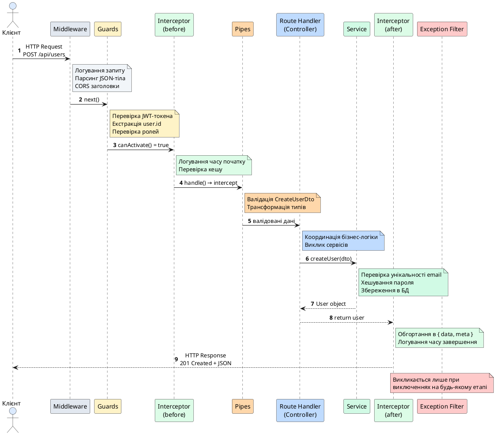
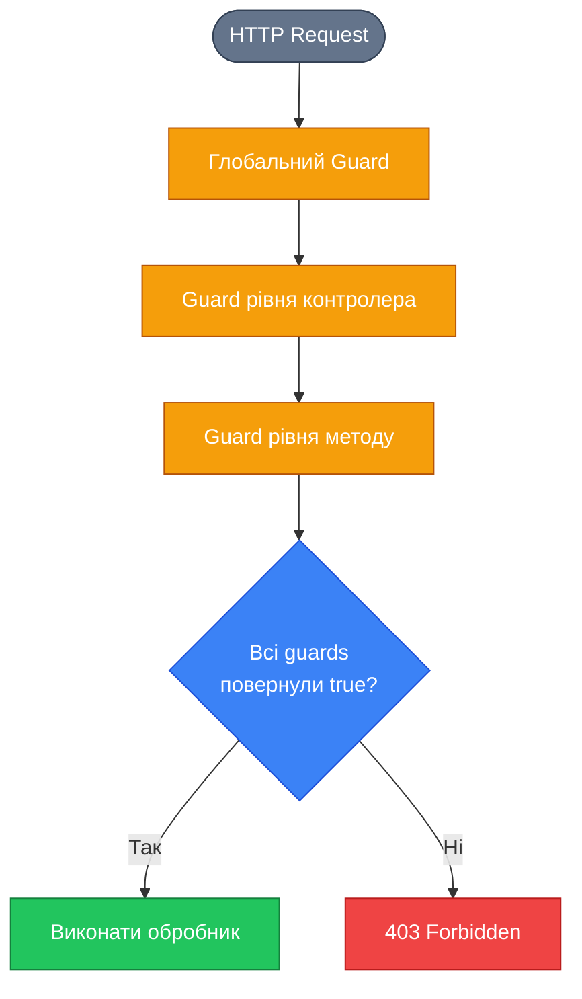

# Request Pipeline: конвеєр обробки запитів

::card-group

::card{title="🎯 Мета лекції" icon="i-lucide-target"}

- Зрозуміти архітектуру конвеєра обробки запитів (*Request Pipeline*) у NestJS як систему послідовних точок втручання
- Опанувати порядок виконання компонентів: Middleware → Guards → Interceptors (before) → Pipes → Handler → Interceptors (after) → Exception Filters
- Навчитися проєктувати архітектуру застосунку з урахуванням етапів обробки запиту
- Засвоїти механізми передачі управління між компонентами та умови припинення обробки
- Вивчити роль ExecutionContext як носія метаданих про поточний запит
- Розуміти, на якому етапі pipeline використовувати конкретний тип компонента

::

::card{title="🔑 Ключові терміни" icon="i-lucide-key"}

- **Request Pipeline** (*конвеєр обробки запитів*): впорядкована послідовність етапів обробки HTTP-запиту від прийняття до відправлення відповіді
- **Middleware** (*проміжне програмне забезпечення*): функція, що виконується до маршрутизації та має доступ до об'єктів `request` і `response`
- **Guard** (*стражник*): компонент авторизації, що визначає, чи дозволено виконати запит
- **Interceptor** (*перехоплювач*): компонент для трансформації запитів та відповідей, логування, кешування
- **Pipe** (*конвеєрний елемент*): компонент валідації та трансформації вхідних даних перед їх передачею в обробник
- **Exception Filter** (*фільтр виключень*): компонент обробки помилок та формування структурованих відповідей про помилки
- **ExecutionContext** (*контекст виконання*): об'єкт, що надає метадані про поточний запит, доступний на кожному етапі pipeline

::

::

## Архітектурна концепція Request Pipeline

Фреймворк NestJS побудований на філософії **шарової обробки запитів** (*layered request processing*), де кожен HTTP-запит проходить через ланцюг спеціалізованих компонентів перед тим, як досягти фінального обробника (*route handler*) у контролері. Цей підхід відомий як **конвеєр обробки запитів** (*Request Pipeline*) і є фундаментальним патерном сучасних серверних фреймворків, таких як ASP.NET Core, Laravel, Spring Boot.

Конвеєр можна уявити як виробничу лінію, де кожен етап виконує чітко визначену функцію: перевірку автентифікації, валідацію вхідних даних, трансформацію форматів, логування, кешування тощо. Завдяки чіткому розділенню відповідальностей (*separation of concerns*) між компонентами, архітектура стає модульною, тестовною та легко розширюваною.

Ключова особливість pipeline у NestJS полягає в тому, що **кожен компонент може приймати одне з трьох рішень**:

1. **Передати управління далі** (*pass-through*): дозволити запиту продовжити рух по конвеєру до наступного компонента
2. **Трансформувати дані** (*transform*): змінити запит або відповідь, але продовжити обробку
3. **Припинити обробку** (*terminate*): викинути виключення або повернути відповідь, зупинивши подальше виконання

Такий підхід забезпечує надзвичайну гнучкість: можна додавати нові рівні валідації, міняти формат відповідей, впроваджувати систему прав доступу — все це без зміни бізнес-логіки контролерів.

::note
Pipeline у NestJS є реалізацією патерну **Chain of Responsibility** (*ланцюг відповідальності*), де кожен компонент має можливість обробити запит, передати його далі або делегувати обробку наступному елементу ланцюга. Цей патерн описаний у книзі «Design Patterns: Elements of Reusable Object-Oriented Software» (Gang of Four, 1994) і широко використовується в серверних фреймворках для розділення cross-cutting concerns.
::

## Повна послідовність етапів обробки запиту

Коли HTTP-запит надходить на сервер NestJS, він проходить через наступну послідовність компонентів у суворо визначеному порядку:

::steps

### Етап 1: Middleware (проміжне програмне забезпечення)

Middleware — це перший шар, який зустрічає вхідний запит. Middleware функції виконуються **до процесу маршрутизації**, тому вони не мають інформації про те, який саме контролер чи обробник буде викликано. Middleware має повний доступ до нативних об'єктів `Request` та `Response` з Express/Fastify і може виконувати операції, що впливають на весь застосунок: логування запитів, парсинг тіла запиту, обробку CORS, сесії, автентифікацію за токенами.

Middleware може завершити обробку запиту, надіславши відповідь напряму через `res.send()`, або передати управління далі, викликавши функцію `next()`.

### Етап 2: Guards (стражники авторизації)

Guards виконуються **після маршрутизації**, коли вже відомо, який обробник буде викликано. Основне призначення guards — прийняття рішення про **авторизацію**: чи має поточний користувач право виконати цей запит? Guards повертають булеве значення: `true` дозволяє продовжити обробку, `false` — викидає виключення `ForbiddenException` та зупиняє конвеєр.

Guards мають доступ до `ExecutionContext`, що дозволяє їм інспектувати метадані, прикріплені до обробника через кастомні декоратори (наприклад, `@Roles(['admin'])`).

### Етап 3: Interceptors (до обробника)

Interceptors є потужним механізмом для **трансформації запитів та відповідей**. На етапі "before" (до виклику обробника) interceptor може модифікувати вхідні дані, логувати час початку операції, перевіряти кеш. Interceptor обгортає виклик обробника в RxJS `Observable`, що дозволяє застосовувати реактивні оператори для асинхронної обробки.

Interceptors виконуються в **двох фазах**: спочатку логіка "before", потім виклик обробника, потім логіка "after". Це дозволяє їм вимірювати час виконання, модифікувати результат, обробляти помилки.

### Етап 4: Pipes (валідація та трансформація параметрів)

Pipes виконуються **безпосередньо перед викликом методу обробника** і відповідають за валідацію та трансформацію аргументів обробника. Наприклад, `ValidationPipe` перевіряє, чи відповідає тіло запиту визначеній DTO-схемі з декораторами `class-validator`. `ParseIntPipe` перетворює рядкові параметри URL у числа.

Якщо pipe викидає виключення (наприклад, `BadRequestException` через невалідні дані), обробник не викликається, і управління передається в Exception Filters.

### Етап 5: Route Handler (обробник контролера)

Це фінальна точка призначення запиту — метод контролера, який містить бізнес-логіку. На цьому етапі всі дані вже перевірені, трансформовані, користувач автентифікований і авторизований. Обробник викликає сервіси для виконання операцій над даними та повертає результат.

Якщо обробник викидає виключення, управління переходить до Exception Filters, пропускаючи логіку "after" interceptors.

### Етап 6: Interceptors (після обробника)

Після успішного виконання обробника interceptors отримують його результат у фазі "after". Тут можна трансформувати відповідь (наприклад, обгорнути дані в єдиний формат `{ data, meta }`), додати додаткові заголовки, залогувати час виконання.

Interceptors мають можливість **повністю замінити відповідь** обробника або збагатити її додатковими полями.

### Етап 7: Exception Filters (обробка виключень)

Якщо на будь-якому з попередніх етапів викидається виключення, воно перехоплюється Exception Filters. Filters формують структуровану HTTP-відповідь з відповідним статус-кодом (400, 401, 403, 500 тощо) та тілом помилки у форматі JSON.

NestJS має вбудований глобальний Exception Filter, але можна створювати кастомні фільтри для специфічних типів помилок (валідація, бізнес-логіка, інфраструктурні збої).

::

::tip
Розуміння порядку виконання компонентів у pipeline є критичним для правильного проєктування архітектури. Наприклад, якщо потрібно перевірити JWT-токен, це має відбуватися в Middleware або Guards, але **не** в Pipes, оскільки pipes виконуються занадто пізно і не мають доступу до всього запиту.
::

## Візуалізація повного циклу обробки запиту

Для кращого розуміння взаємодії компонентів розглянемо послідовність обробки конкретного HTTP-запиту через усі етапи pipeline:

::plant-uml{alt="Повний конвеєр обробки HTTP-запиту в NestJS"}



::

Діаграма демонструє успішний сценарій обробки запиту, де кожен компонент передає управління далі. Проте в реальних застосунках важливо розуміти, **що станеться при помилці** на кожному етапі.


## Сценарії припинення обробки запиту

На відміну від успішного проходження через весь конвеєр, запит може бути **припинено на будь-якому етапі** через викидання виключення або явне повернення відповіді. Розглянемо типові сценарії:

### Припинення в Middleware

Якщо middleware не викликає функцію `next()`, запит **ніколи не досягне маршрутизатора**. Це корисно для блокування неавторизованих запитів на рівні всього застосунку:

```typescript
import { Injectable, NestMiddleware } from '@nestjs/common';
import { Request, Response, NextFunction } from 'express';

@Injectable()
export class ApiKeyMiddleware implements NestMiddleware {
  use(req: Request, res: Response, next: NextFunction) {
    const apiKey = req.headers['x-api-key'];
    
    if (!apiKey || apiKey !== process.env.VALID_API_KEY) {
      // Припинення обробки: надсилаємо відповідь напряму
      return res.status(401).json({
        statusCode: 401,
        message: 'Invalid API key',
        error: 'Unauthorized'
      });
    }
    
    // Продовжуємо обробку
    next();
  }
}
```

У цьому випадку Guards, Interceptors та інші компоненти **не будуть викликані**.

::warning
Middleware, що припиняє обробку через `res.send()` або `res.json()`, **оминає Exception Filters**. Якщо потрібна уніфікована обробка помилок, краще викидати виключення через `throw new UnauthorizedException()`, але це працює лише в **function middleware**, а не class middleware.
::

### Припинення в Guards

Guards повертають булеве значення або Promise/Observable, що резолвиться в boolean. Якщо Guard повертає `false` або викидає виключення, обробник не викликається:

```typescript
import { Injectable, CanActivate, ExecutionContext, ForbiddenException } from '@nestjs/common';
import { Reflector } from '@nestjs/core';

@Injectable()
export class RolesGuard implements CanActivate {
  constructor(private reflector: Reflector) {}

  canActivate(context: ExecutionContext): boolean {
    const requiredRoles = this.reflector.get<string[]>('roles', context.getHandler());
    if (!requiredRoles) {
      return true; // Немає вимог до ролей — дозволяємо
    }

    const request = context.switchToHttp().getRequest();
    const user = request.user;

    const hasRole = requiredRoles.some(role => user.roles?.includes(role));
    
    if (!hasRole) {
      // Припинення з чітким повідомленням про помилку
      throw new ForbiddenException('You do not have permission to access this resource');
    }

    return true;
  }
}
```

Виключення `ForbiddenException` буде перехоплено Exception Filter і перетворено на HTTP-відповідь `403 Forbidden`.

### Припинення в Pipes

Pipes викидають виключення, якщо дані не відповідають очікуваному формату або не проходять валідацію:

```typescript
import { PipeTransform, Injectable, BadRequestException } from '@nestjs/common';

@Injectable()
export class ParsePositiveIntPipe implements PipeTransform<string, number> {
  transform(value: string): number {
    const val = parseInt(value, 10);
    
    if (isNaN(val)) {
      throw new BadRequestException(`"${value}" is not a valid integer`);
    }
    
    if (val <= 0) {
      throw new BadRequestException(`Value must be a positive integer, received: ${val}`);
    }
    
    return val;
  }
}
```

Якщо pipe викине виключення, **метод контролера не буде викликано**, і запит відразу потрапить в Exception Filter.

### Припинення в Route Handler

Обробник може явно викинути виключення для сигналізування про бізнес-помилку:

```typescript
import { Controller, Get, Param, NotFoundException } from '@nestjs/common';
import { UsersService } from './users.service';

@Controller('users')
export class UsersController {
  constructor(private readonly usersService: UsersService) {}

  @Get(':id')
  async getUserById(@Param('id') id: string) {
    const user = await this.usersService.findById(id);
    
    if (!user) {
      // Припинення через бізнес-помилку
      throw new NotFoundException(`User with ID "${id}" not found`);
    }
    
    return user;
  }
}
```

Виключення пропустить фазу "after" interceptors і потрапить безпосередньо в Exception Filter.

::note
Interceptors мають унікальну можливість **перехоплювати виключення** через оператор RxJS `catchError()` і трансформувати їх у валідну відповідь або перекинути заново. Це дозволяє реалізувати fallback-логіку або retry-механізми для нестабільних зовнішніх API.
::

## ExecutionContext: контекст виконання на кожному етапі

Об'єкт `ExecutionContext` є центральним носієм метаданих у pipeline NestJS. Він передається в Guards, Interceptors та Exception Filters, надаючи уніфікований інтерфейс для доступу до деталей поточного запиту, незалежно від транспортного протоколу (HTTP, WebSocket, GraphQL, RPC).

### Структура ExecutionContext

`ExecutionContext` розширює інтерфейс `ArgumentsHost` і надає додаткові методи для роботи з метаданими:

```typescript
interface ExecutionContext extends ArgumentsHost {
  // Отримати клас контролера
  getClass<T = any>(): Type<T>;
  
  // Отримати метод обробника
  getHandler(): Function;
  
  // Перемикання між контекстами (HTTP, RPC, WebSockets)
  switchToHttp(): HttpArgumentsHost;
  switchToRpc(): RpcArgumentsHost;
  switchToWs(): WsArgumentsHost;
  
  // Тип контексту: 'http' | 'rpc' | 'ws' | 'graphql'
  getType<TContext extends string = ContextType>(): TContext;
  
  // Аргументи обробника (масив параметрів методу)
  getArgs<T extends Array<any> = any[]>(): T;
  getArgByIndex<T = any>(index: number): T;
}
```

### Приклад використання в Guard

```typescript
import { Injectable, CanActivate, ExecutionContext } from '@nestjs/common';
import { Reflector } from '@nestjs/core';
import { Observable } from 'rxjs';

@Injectable()
export class AuthGuard implements CanActivate {
  constructor(private reflector: Reflector) {}

  canActivate(context: ExecutionContext): boolean | Promise<boolean> | Observable<boolean> {
    // Визначити тип запиту
    const contextType = context.getType();
    
    if (contextType === 'http') {
      // Отримати об'єкт Request для HTTP
      const request = context.switchToHttp().getRequest();
      const token = request.headers.authorization;
      
      // Отримати метадані з декоратора
      const isPublic = this.reflector.get<boolean>('isPublic', context.getHandler());
      
      if (isPublic) {
        return true; // Публічний маршрут — пропускаємо
      }
      
      return this.validateToken(token);
    }
    
    // Обробка інших типів контексту (WebSocket, GraphQL)
    return true;
  }

  private validateToken(token: string | undefined): boolean {
    // Логіка перевірки JWT-токена
    return !!token && token.startsWith('Bearer ');
  }
}
```

### Доступ до метаданих через Reflector

`Reflector` — це сервіс для читання метаданих, прикріплених до класів та методів через кастомні декоратори. Це дозволяє реалізувати декларативну систему прав доступу:

```typescript
// Кастомний декоратор для позначення публічних маршрутів
import { SetMetadata } from '@nestjs/common';

export const Public = () => SetMetadata('isPublic', true);
```

```typescript
// Використання в контролері
@Controller('auth')
export class AuthController {
  @Public() // Цей маршрут не вимагає автентифікації
  @Post('login')
  login(@Body() credentials: LoginDto) {
    // Логіка входу
  }

  @Get('profile')
  getProfile(@Req() request) {
    // Цей маршрут вимагає автентифікації (немає декоратора @Public)
    return request.user;
  }
}
```

Guard зчитує метадані через `this.reflector.get('isPublic', context.getHandler())` і приймає рішення про авторизацію на основі наявності декоратора `@Public`.

::tip
Використання `ExecutionContext` та метаданих дозволяє створювати **переконфігуровані компоненти**, які поводяться по-різному залежно від декораторів на маршруті. Це основа для реалізації систем контролю доступу (RBAC, ABAC), кешування, логування та інших cross-cutting concerns.
::


## Трансформація даних на різних етапах pipeline

Одна з ключових можливостей Request Pipeline — це **поступова трансформація даних** в міру проходження запиту через компоненти. Кожен етап може збагачувати або модифікувати дані для наступних етапів, створюючи ланцюг перетворень.

### Збагачення запиту в Middleware

Middleware може додавати властивості до об'єкта `Request`, які будуть доступні в усіх наступних компонентах:

```typescript
import { Injectable, NestMiddleware } from '@nestjs/common';
import { Request, Response, NextFunction } from 'express';
import { JwtService } from '@nestjs/jwt';

@Injectable()
export class AuthMiddleware implements NestMiddleware {
  constructor(private jwtService: JwtService) {}

  use(req: Request, res: Response, next: NextFunction) {
    const token = req.headers.authorization?.replace('Bearer ', '');
    
    if (token) {
      try {
        const payload = this.jwtService.verify(token);
        // Збагачуємо запит: додаємо розпакований payload
        req['user'] = {
          id: payload.sub,
          email: payload.email,
          roles: payload.roles || []
        };
      } catch (error) {
        // Невалідний токен — не додаємо user, Guard відхилить запит
      }
    }
    
    next();
  }
}
```

Тепер у Guards та контролерах можна звертатися до `request.user` без повторного парсингу токена:

```typescript
@Injectable()
export class RolesGuard implements CanActivate {
  canActivate(context: ExecutionContext): boolean {
    const request = context.switchToHttp().getRequest();
    const user = request.user; // Доступний завдяки Middleware
    
    return user && user.roles.includes('admin');
  }
}
```

### Трансформація параметрів у Pipes

Pipes перетворюють рядкові параметри з URL або query string у типізовані значення:

```typescript
@Controller('articles')
export class ArticlesController {
  @Get(':id')
  findOne(
    @Param('id', ParseIntPipe) id: number, // Рядок → число
    @Query('published', ParseBoolPipe) published: boolean, // "true" → true
    @Query('tags', new ParseArrayPipe({ items: String, separator: ',' })) tags: string[]
  ) {
    // id: number, published: boolean, tags: string[]
    return this.articlesService.findOne(id, { published, tags });
  }
}
```

Без pipes TypeScript-сигнатура показувала б `number`, але реально отримували б `string`. Pipes забезпечують **runtime-відповідність типів**.

### Трансформація відповіді в Interceptors

Interceptors можуть обгорнути відповідь обробника в єдиний формат, додати метадані, виконати серіалізацію:

```typescript
import { Injectable, NestInterceptor, ExecutionContext, CallHandler } from '@nestjs/core';
import { Observable } from 'rxjs';
import { map } from 'rxjs/operators';

export interface Response<T> {
  data: T;
  meta: {
    timestamp: string;
    path: string;
  };
}

@Injectable()
export class TransformInterceptor<T> implements NestInterceptor<T, Response<T>> {
  intercept(context: ExecutionContext, next: CallHandler): Observable<Response<T>> {
    const request = context.switchToHttp().getRequest();
    
    return next.handle().pipe(
      map(data => ({
        data, // Оригінальні дані від обробника
        meta: {
          timestamp: new Date().toISOString(),
          path: request.url
        }
      }))
    );
  }
}
```

Контролер повертає просто `User`, але клієнт отримує структуровану відповідь:

```json
{
  "data": {
    "id": 1,
    "email": "user@example.com"
  },
  "meta": {
    "timestamp": "2026-09-04T12:00:00.000Z",
    "path": "/api/users/1"
  }
}
```

::note
Порядок застосування interceptors має значення. Якщо є кілька interceptors на різних рівнях (глобальний, контролер, метод), вони виконуються у порядку **від загального до конкретного** на фазі "before" та у **зворотному порядку** на фазі "after". Це дозволяє глобальному interceptor «обгорнути» результат специфічних interceptors.
::

## Визначення рівня застосування компонентів

Кожен тип компонента можна застосувати на **різних рівнях гранулярності**: глобально, на рівні контролера або окремого методу. Розуміння цих рівнів є критичним для проєктування архітектури:

### Рівні застосування Guards

::code-group

```typescript [Глобальний Guard]
// main.ts
import { NestFactory } from '@nestjs/core';
import { AppModule } from './app.module';
import { AuthGuard } from './guards/auth.guard';

async function bootstrap() {
  const app = await NestFactory.create(AppModule);
  
  // Застосовується до всіх маршрутів
  app.useGlobalGuards(new AuthGuard());
  
  await app.listen(3000);
}
bootstrap();
```

```typescript [Guard на рівні контролера]
import { Controller, UseGuards } from '@nestjs/common';
import { RolesGuard } from './guards/roles.guard';

@Controller('admin')
@UseGuards(RolesGuard) // Застосовується до всіх методів контролера
export class AdminController {
  @Get('users')
  getAllUsers() {
    // Захищено RolesGuard
  }

  @Delete('users/:id')
  deleteUser(@Param('id') id: string) {
    // Також захищено RolesGuard
  }
}
```

```typescript [Guard на рівні методу]
import { Controller, Get, UseGuards } from '@nestjs/common';
import { JwtAuthGuard } from './guards/jwt-auth.guard';
import { RolesGuard } from './guards/roles.guard';
import { Roles } from './decorators/roles.decorator';

@Controller('users')
export class UsersController {
  @Get()
  findAll() {
    // Публічний маршрут — без guards
  }

  @Get('profile')
  @UseGuards(JwtAuthGuard) // Лише автентифікація
  getProfile(@Req() req) {
    return req.user;
  }

  @Delete(':id')
  @UseGuards(JwtAuthGuard, RolesGuard) // Автентифікація + авторизація
  @Roles('admin')
  deleteUser(@Param('id') id: string) {
    // Захищено двома guards
  }
}
```

::

### Рівні застосування Pipes

Pipes можна застосовувати **до окремого параметра**, всього методу, контролера або глобально:

::code-group

```typescript [Pipe на рівні параметра]
@Get(':id')
findOne(@Param('id', ParseIntPipe) id: number) {
  // ParseIntPipe застосований лише до параметра id
}
```

```typescript [Pipe на рівні методу]
@Post()
@UsePipes(new ValidationPipe({ whitelist: true }))
create(@Body() createDto: CreateUserDto) {
  // ValidationPipe застосований до всіх параметрів методу
}
```

```typescript [Pipe на рівні контролера]
@Controller('users')
@UsePipes(ValidationPipe)
export class UsersController {
  // ValidationPipe застосований до всіх методів контролера
}
```

```typescript [Глобальний Pipe]
// main.ts
app.useGlobalPipes(new ValidationPipe({
  whitelist: true,
  forbidNonWhitelisted: true,
  transform: true
}));
```

::

::warning
Глобальні pipes, зареєстровані через `app.useGlobalPipes()`, **не можуть використовувати Dependency Injection**, оскільки вони створюються поза контекстом модуля. Для DI-залежних pipes використовуйте провайдер `APP_PIPE` у `AppModule`:

```typescript
import { Module } from '@nestjs/common';
import { APP_PIPE } from '@nestjs/core';
import { ValidationPipe } from '@nestjs/common';

@Module({
  providers: [
    {
      provide: APP_PIPE,
      useClass: ValidationPipe,
    },
  ],
})
export class AppModule {}
```
::

### Порядок виконання компонентів одного типу

Якщо на маршрут застосовано **кілька guards, pipes або interceptors**, вони виконуються у визначеному порядку:

1. **Глобальні компоненти** (зареєстровані через `app.useGlobal*()` або `APP_*` провайдери)
2. **Компоненти рівня контролера** (через декоратор `@UseGuards()`, `@UsePipes()` тощо на класі)
3. **Компоненти рівня методу** (через декоратор на методі)

Якщо на методі застосовано кілька guards через `@UseGuards(Guard1, Guard2, Guard3)`, вони виконуються **зліва направо**.

::mermaid



::


## Вибір правильного компонента для конкретної задачі

Одна з найбільших складнощів для розробників, що починають працювати з NestJS, — це розуміння **коли використовувати який компонент**. Оскільки Middleware, Guards, Interceptors та Pipes перекриваються у функціональності (всі можуть читати запит та викидати виключення), важливо дотримуватися принципу **єдиної відповідальності** для кожного типу.

### Middleware: загальносистемна обробка та підготовка

**Використовуйте Middleware для:**

- Логування **всіх** вхідних запитів до маршрутизації
- Парсингу тіла запиту (JSON, форми, multipart)
- Налаштування CORS-заголовків
- Обробки сесій та cookies
- Компресії відповідей (gzip, brotli)
- Ініціалізації контексту трасування запитів (request ID)
- Перевірки API-ключів для всього застосунку

**Не використовуйте Middleware для:**

- Авторизації на основі ролей (використовуйте Guards)
- Валідації тіла запиту (використовуйте Pipes)
- Трансформації відповідей обробника (використовуйте Interceptors)

::note
Middleware є найбільш «низькорівневим» компонентом у NestJS, максимально наближеним до Express/Fastify. Він ідеально підходить для операцій, які мають виконуватися **для всього застосунку** без винятків, ще до того, як NestJS визначить, який контролер обслуговуватиме запит.
::

### Guards: рішення про дозвіл виконання

**Використовуйте Guards для:**

- Автентифікації: перевірки JWT-токенів, OAuth, сесій
- Авторизації: перевірки ролей користувача (RBAC)
- Перевірки прав доступу на основі атрибутів (ABAC)
- Дросселювання запитів (rate limiting) для конкретних користувачів
- Блокування доступу на основі IP-адреси

**Не використовуйте Guards для:**

- Валідації структури даних (використовуйте Pipes)
- Трансформації запиту або відповіді (використовуйте Interceptors)
- Логування часу виконання (використовуйте Interceptors)

Guards мають повертати булеве значення або викидати виключення. Їхня семантика — це **питання дозволу**: «Чи може цей користувач виконати цю дію?».

::tip
Якщо ваш Guard виконує складну валідацію даних або трансформацію, це сигнал, що логіку варто перенести в Pipe або Interceptor. Guards мають бути швидкими та сфокусованими на авторизації.
::

### Interceptors: трансформація та додаткова логіка

**Використовуйте Interceptors для:**

- Обгортання відповідей в єдиний формат (`{ data, meta, errors }`)
- Логування часу виконання запитів
- Кешування відповідей (in-memory або Redis)
- Видалення чутливих полів з відповіді (серіалізація)
- Таймаути запитів та retry-логіка
- Перетворення помилок в альтернативні відповіді (fallback)

**Не використовуйте Interceptors для:**

- Авторизації (використовуйте Guards)
- Валідації вхідних даних (використовуйте Pipes)

Interceptors володіють унікальною можливістю **обгортати виклик обробника** в RxJS `Observable`, що дозволяє застосовувати потужні реактивні оператори (`map`, `tap`, `catchError`, `timeout`).

::code-group

```typescript [Логування часу виконання]
import { Injectable, NestInterceptor, ExecutionContext, CallHandler } from '@nestjs/core';
import { Observable } from 'rxjs';
import { tap } from 'rxjs/operators';

@Injectable()
export class LoggingInterceptor implements NestInterceptor {
  intercept(context: ExecutionContext, next: CallHandler): Observable<any> {
    const request = context.switchToHttp().getRequest();
    const method = request.method;
    const url = request.url;
    const now = Date.now();

    return next.handle().pipe(
      tap(() => {
        const duration = Date.now() - now;
        console.log(`${method} ${url} - ${duration}ms`);
      })
    );
  }
}
```

```typescript [Кешування відповідей]
import { Injectable, NestInterceptor, ExecutionContext, CallHandler } from '@nestjs/core';
import { Observable, of } from 'rxjs';
import { tap } from 'rxjs/operators';

@Injectable()
export class CacheInterceptor implements NestInterceptor {
  private cache = new Map<string, any>();

  intercept(context: ExecutionContext, next: CallHandler): Observable<any> {
    const request = context.switchToHttp().getRequest();
    const cacheKey = `${request.method}:${request.url}`;

    if (this.cache.has(cacheKey)) {
      console.log('Cache hit:', cacheKey);
      return of(this.cache.get(cacheKey)); // Повертаємо з кешу
    }

    return next.handle().pipe(
      tap(response => {
        this.cache.set(cacheKey, response);
        console.log('Cache miss:', cacheKey);
      })
    );
  }
}
```

```typescript [Таймаут запитів]
import { Injectable, NestInterceptor, ExecutionContext, CallHandler, RequestTimeoutException } from '@nestjs/core';
import { Observable, throwError, TimeoutError } from 'rxjs';
import { catchError, timeout } from 'rxjs/operators';

@Injectable()
export class TimeoutInterceptor implements NestInterceptor {
  intercept(context: ExecutionContext, next: CallHandler): Observable<any> {
    return next.handle().pipe(
      timeout(5000), // 5 секунд
      catchError(err => {
        if (err instanceof TimeoutError) {
          return throwError(() => new RequestTimeoutException('Request took too long'));
        }
        return throwError(() => err);
      })
    );
  }
}
```

::

### Pipes: валідація та трансформація аргументів

**Використовуйте Pipes для:**

- Валідації тіла запиту через `class-validator`
- Трансформації рядкових параметрів у числа, дати, булеві значення
- Парсингу масивів з query string
- Санітизації вхідних даних (видалення HTML-тегів, обрізка пробілів)
- Перевірки існування ресурсів за ID перед викликом обробника

**Не використовуйте Pipes для:**

- Авторизації (використовуйте Guards)
- Логування або збагачення запиту (використовуйте Middleware або Interceptors)

Pipes працюють **на рівні параметрів методу**, що робить їх ідеальним місцем для валідації конкретних вхідних даних.

::code-group

```typescript [Валідація DTO]
import { IsEmail, IsString, MinLength } from 'class-validator';

export class CreateUserDto {
  @IsEmail()
  email: string;

  @IsString()
  @MinLength(8)
  password: string;
}

@Controller('users')
export class UsersController {
  @Post()
  create(@Body(ValidationPipe) dto: CreateUserDto) {
    // dto вже провалідовано
  }
}
```

```typescript [Трансформація параметрів]
@Get(':id')
findOne(
  @Param('id', ParseIntPipe) id: number,
  @Query('include', new DefaultValuePipe([]), ParseArrayPipe) include: string[]
) {
  // id — гарантовано число
  // include — завжди масив, навіть якщо параметр відсутній
}
```

::

### Exception Filters: уніфікована обробка помилок

**Використовуйте Exception Filters для:**

- Форматування помилок у специфічний для API формат
- Логування помилок у систему моніторингу (Sentry, LogRocket)
- Перекладу помилок валідації на мову користувача
- Приховування технічних деталей помилок від клієнта

**Не використовуйте Exception Filters для:**

- Бізнес-логіки (помилки мають викидатися у сервісах)
- Авторизації (використовуйте Guards)

Exception Filters є останнім рубежем обробки запиту і мають перетворювати виключення у зрозумілі HTTP-відповіді.

::accordion

::accordion-item{label="❓ Чому не можна використовувати Middleware для авторизації на основі ролей?" icon="i-lucide-help-circle"}

Middleware виконується **до маршрутизації**, тому він не має інформації про те, який саме обробник буде викликано і які метадані (наприклад, `@Roles(['admin'])`) до нього прикріплені. Guards виконуються **після маршрутизації** і мають доступ до `ExecutionContext`, через який можна отримати метадані за допомогою `Reflector`. Крім того, Middleware не може використовувати Dependency Injection для впровадження сервісів авторизації.

::

::accordion-item{label="❓ Чи можуть Interceptors модифікувати вхідний запит перед обробником?" icon="i-lucide-help-circle"}

Так, Interceptors можуть змінювати об'єкт `Request` на фазі "before" через `context.switchToHttp().getRequest()`. Проте це вважається анти-патерном, оскільки мутація запиту ускладнює відстеження потоку даних. Краще використовувати Middleware для збагачення запиту або Pipes для трансформації параметрів. Interceptors найкраще підходять для трансформації **відповіді** на фазі "after".

::

::accordion-item{label="❓ Що станеться, якщо Guard викине виключення всередині Interceptor?" icon="i-lucide-help-circle"}

Guards виконуються **перед** Interceptors (на фазі "before"), тому виключення з Guard пропустить і "before", і "after" логіку Interceptor. Виключення потрапить безпосередньо в Exception Filter. Interceptors можуть перехопити виключення лише від **обробника** або наступних Interceptors через оператор RxJS `catchError()`.

::

::

## Практичний приклад: повний pipeline для захищеного API

Для закріплення розглянемо реалістичний приклад застосунку з усіма типами компонентів:

```typescript
// main.ts — глобальна конфігурація
import { NestFactory } from '@nestjs/core';
import { ValidationPipe } from '@nestjs/common';
import { AppModule } from './app.module';

async function bootstrap() {
  const app = await NestFactory.create(AppModule);
  
  // Глобальний Pipe для валідації всіх DTO
  app.useGlobalPipes(new ValidationPipe({
    whitelist: true, // Видаляти невідомі поля
    forbidNonWhitelisted: true, // Викидати помилку для невідомих полів
    transform: true, // Автоматично трансформувати типи
  }));
  
  await app.listen(3000);
}
bootstrap();
```

```typescript
// app.module.ts — реєстрація Middleware
import { Module, NestModule, MiddlewareConsumer } from '@nestjs/common';
import { APP_GUARD, APP_INTERCEPTOR } from '@nestjs/core';
import { LoggerMiddleware } from './middleware/logger.middleware';
import { JwtAuthGuard } from './guards/jwt-auth.guard';
import { TransformInterceptor } from './interceptors/transform.interceptor';
import { UsersModule } from './users/users.module';

@Module({
  imports: [UsersModule],
  providers: [
    // Глобальний Guard через DI
    {
      provide: APP_GUARD,
      useClass: JwtAuthGuard,
    },
    // Глобальний Interceptor
    {
      provide: APP_INTERCEPTOR,
      useClass: TransformInterceptor,
    },
  ],
})
export class AppModule implements NestModule {
  configure(consumer: MiddlewareConsumer) {
    // Middleware застосовується до всіх маршрутів
    consumer.apply(LoggerMiddleware).forRoutes('*');
  }
}
```

```typescript
// users.controller.ts — використання компонентів на різних рівнях
import { Controller, Get, Post, Body, Param, UseGuards, ParseIntPipe } from '@nestjs/common';
import { RolesGuard } from '../guards/roles.guard';
import { Roles } from '../decorators/roles.decorator';
import { Public } from '../decorators/public.decorator';
import { CreateUserDto } from './dto/create-user.dto';
import { UsersService } from './users.service';

@Controller('users')
@UseGuards(RolesGuard) // Guard рівня контролера
export class UsersController {
  constructor(private readonly usersService: UsersService) {}

  @Public() // Публічний маршрут — JwtAuthGuard пропустить
  @Get()
  findAll() {
    return this.usersService.findAll();
  }

  @Get(':id')
  findOne(@Param('id', ParseIntPipe) id: number) {
    // ParseIntPipe гарантує, що id — це число
    return this.usersService.findOne(id);
  }

  @Post()
  @Roles('admin') // Лише адміністратори
  create(@Body() dto: CreateUserDto) {
    // ValidationPipe автоматично валідує dto
    return this.usersService.create(dto);
  }
}
```

Цей приклад демонструє повний lifecycle запиту:

1. **LoggerMiddleware** логує всі запити
2. **JwtAuthGuard** перевіряє токен (окрім маршрутів з `@Public`)
3. **RolesGuard** перевіряє ролі для методів з `@Roles`
4. **ValidationPipe** валідує DTO
5. **ParseIntPipe** трансформує параметр `:id`
6. **Обробник контролера** виконує бізнес-логіку
7. **TransformInterceptor** обгортає відповідь у формат `{ data, meta }`

::tip
Використовуйте **кастомні декоратори** (`@Public`, `@Roles`) для декларативного визначення поведінки маршрутів. Це робить код читабельнішим і відокремлює метадані від логіки Guards та Interceptors.
::

## Підсумок: коли використовувати кожен компонент

::card-group

::card{title="Middleware" icon="i-lucide-layers"}

- Логування запитів
- CORS, компресія, парсинг body
- Перевірка API-ключів
- Ініціалізація request ID
- Підготовка контексту для наступних етапів

::

::card{title="Guards" icon="i-lucide-shield-check"}

- Автентифікація (JWT, OAuth, сесії)
- Авторизація (RBAC, ABAC)
- Rate limiting для користувачів
- Перевірка IP-адрес
- Рішення типу «дозволити/заборонити»

::

::card{title="Interceptors" icon="i-lucide-split"}

- Трансформація відповідей
- Логування часу виконання
- Кешування
- Таймаути та retry
- Видалення чутливих полів

::

::card{title="Pipes" icon="i-lucide-filter"}

- Валідація DTO через `class-validator`
- Трансформація типів параметрів
- Парсинг масивів, дат, enum
- Санітизація вхідних даних
- Перевірка існування ресурсів

::

::card{title="Exception Filters" icon="i-lucide-alert-triangle"}

- Форматування помилок
- Логування помилок у моніторинг
- Переклад помилок
- Приховування технічних деталей
- Уніфікація структури помилок

::

::

Розуміння Request Pipeline та правильний вибір компонентів для конкретних задач є фундаментом для створення чистої, підтримуваної архітектури NestJS-застосунків. У наступних лекціях ми детально розглянемо кожен тип компонента з практичними прикладами реалізації.
