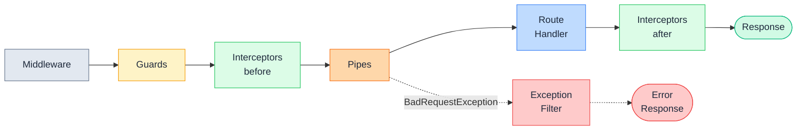

# Pipes: концепція трансформації та валідації

::card-group

::card{title="🎯 Мета лекції" icon="i-lucide-target"}

- Зрозуміти роль Pipes як спеціалізованого компонента для валідації та трансформації вхідних даних
- Опанувати інтерфейс `PipeTransform<T, R>` та метод `transform()` як основу для створення власних pipes
- Навчитися застосовувати pipes на різних рівнях: параметр, метод, контролер, глобально
- Засвоїти дві основні функції pipes: трансформація типів та валідація структури даних
- Вивчити механізм обробки помилок у pipes через викидання виключень
- Розуміти порядок виконання множинних pipes та їхню композицію

::

::card{title="🔑 Ключові терміни" icon="i-lucide-key"}

- **Pipe** (*конвеєрний елемент*): компонент NestJS, що виконує трансформацію або валідацію аргументів методу обробника
- **PipeTransform Interface** (*інтерфейс трансформації*): контракт, що визначає метод `transform()` для обробки значення
- **Transformation** (*трансформація*): перетворення вхідного значення з одного типу в інший (наприклад, string → number)
- **Validation** (*валідація*): перевірка відповідності даних певним правилам із викиданням виключення при невідповідності
- **Argument Metadata** (*метадані аргументу*): інформація про параметр методу (тип, назва декоратора, позиція)
- **Global Pipes** (*глобальні pipes*): pipes, застосовані до всіх маршрутів застосунку

::

::

## Що таке Pipe: спеціалізований трансформатор даних

Pipes є одним з п'яти фундаментальних компонентів Request Pipeline у NestJS і відповідають за **трансформацію** та **валідацію** вхідних даних безпосередньо перед їх передачею в метод обробника контролера. На відміну від Middleware, що працює з сирими об'єктами `Request` та `Response`, та Guards, що приймають рішення про авторизацію, Pipes фокусуються на **перетворенні аргументів методу** у потрібний формат та перевірці їхньої коректності.

Концептуально Pipe можна порівняти з фільтром на виробничій лінії: він отримує сирий матеріал (рядки з URL, JSON-тіло запиту), обробляє його згідно зі специфікацією та передає далі у рафінованому вигляді. Якщо матеріал не відповідає стандартам, Pipe зупиняє конвеєр, викидаючи виключення.

Ключова відмінність Pipes від інших компонентів полягає в тому, що вони працюють на **рівні параметрів методу** (*method parameter level*). Коли ви пишете:

```typescript
@Get(':id')
findOne(@Param('id', ParseIntPipe) id: number) {
  return this.usersService.findOne(id);
}
```

`ParseIntPipe` виконується **тільки для параметра `id`**, а не для всього запиту. Це забезпечує високу гранулярність та можливість застосовувати різні pipe для різних параметрів одного методу.

::note
Pipes у NestJS інспіровані концепцією **Unix pipes** та патерном **Chain of Responsibility**. Подібно до того, як Unix-команди передають дані через `|` (`cat file.txt | grep "error" | wc -l`), NestJS pipes обробляють дані послідовно, де кожен pipe може трансформувати або відкинути вхідне значення.
::

## Дві основні функції Pipes

Pipes у NestJS виконують дві чітко розмежовані, але взаємодоповнювальні функції:

### Функція 1: Трансформація даних (Transformation)

Трансформація полягає у **зміні типу або формату** вхідного значення. HTTP-запити передають дані у вигляді **рядків** (параметри URL, query string) або **JSON** (тіло запиту). Проте TypeScript-сигнатури методів очікують конкретні типи: `number`, `boolean`, `Date`, класи DTO. Pipes виконують перетворення з рядкового представлення у типізоване значення.

::code-group

```typescript [Без Pipe — отримуємо string]
@Get(':id')
findOne(@Param('id') id: string) {
  // id = "123" (string!)
  // typeof id === "string"
  return this.usersService.findOne(parseInt(id, 10));
}
```

```typescript [З ParseIntPipe — отримуємо number]
@Get(':id')
findOne(@Param('id', ParseIntPipe) id: number) {
  // id = 123 (number!)
  // typeof id === "number"
  return this.usersService.findOne(id);
}
```

::

Трансформація гарантує, що **runtime-тип відповідає compile-time типу**, усуваючи невідповідність між TypeScript-анотаціями та реальними даними.

### Функція 2: Валідація даних (Validation)

Валідація перевіряє, чи **відповідають дані встановленим правилам**. На відміну від трансформації, валідація не змінює значення, а лише визначає його коректність. Якщо дані невалідні, Pipe викидає виключення, зупиняючи обробку запиту.

Валідація може включати:

- **Перевірку формату**: чи є рядок валідним UUID, email, URL
- **Діапазонні обмеження**: чи знаходиться число в межах `[0, 100]`
- **Структурну валідацію**: чи містить об'єкт всі обов'язкові поля з правильними типами
- **Бізнес-правила**: чи відповідає значення доменним обмеженням (наприклад, вік >= 18)

```typescript
import { PipeTransform, Injectable, BadRequestException } from '@nestjs/common';

@Injectable()
export class ValidateAgePipe implements PipeTransform<number, number> {
  transform(value: number): number {
    if (value < 18) {
      throw new BadRequestException('Age must be at least 18');
    }
    if (value > 120) {
      throw new BadRequestException('Age must be less than 120');
    }
    return value; // Значення не змінюється, лише перевіряється
  }
}
```

::tip
Pipes можуть **комбінувати** обидві функції: спочатку трансформувати дані, потім валідувати результат. Наприклад, `ParseIntPipe` трансформує рядок у число, а потім перевіряє, чи не є результат `NaN`.
::

## Інтерфейс PipeTransform: контракт для всіх Pipes

Всі Pipes у NestJS реалізують інтерфейс `PipeTransform<T, R>`, де `T` — тип вхідного значення, а `R` — тип повернутого значення. Інтерфейс визначає єдиний метод `transform()`:

```typescript
import { PipeTransform, ArgumentMetadata } from '@nestjs/common';

interface PipeTransform<T = any, R = any> {
  transform(value: T, metadata: ArgumentMetadata): R | Promise<R>;
}
```

### Параметри методу transform()

Метод `transform()` отримує два аргументи:

1. **`value: T`** — вхідне значення, що потребує обробки (наприклад, рядок `"123"` з параметра URL)
2. **`metadata: ArgumentMetadata`** — об'єкт з метаданими про параметр методу

Структура `ArgumentMetadata`:

```typescript
interface ArgumentMetadata {
  type: 'body' | 'query' | 'param' | 'custom';
  metatype?: Type<unknown>;
  data?: string;
}
```

- **`type`**: звідки прийшло значення (`@Body()`, `@Query()`, `@Param()`, кастомний декоратор)
- **`metatype`**: TypeScript-тип параметра (наприклад, `String`, `Number`, `CreateUserDto`)
- **`data`**: ім'я властивості, якщо декоратор має аргумент (наприклад, `'id'` для `@Param('id')`)

### Приклад реалізації власного Pipe

```typescript
import { PipeTransform, Injectable, ArgumentMetadata, BadRequestException } from '@nestjs/common';

@Injectable()
export class ParsePositiveIntPipe implements PipeTransform<string, number> {
  transform(value: string, metadata: ArgumentMetadata): number {
    console.log('Metadata:', metadata);
    // { type: 'param', metatype: Number, data: 'id' }
    
    const val = parseInt(value, 10);
    
    if (isNaN(val)) {
      throw new BadRequestException(`Validation failed: "${value}" is not a valid integer`);
    }
    
    if (val <= 0) {
      throw new BadRequestException(`Validation failed: value must be positive, received ${val}`);
    }
    
    return val;
  }
}
```

Використання:

```typescript
@Get(':id')
findOne(@Param('id', ParsePositiveIntPipe) id: number) {
  // id гарантовано є додатнім числом
  return this.usersService.findOne(id);
}
```

::note
Метод `transform()` може бути **асинхронним** і повертати `Promise<R>`. Це дозволяє виконувати асинхронні операції всередині Pipe, наприклад, перевірку існування ресурсу в базі даних перед передачею його ID в обробник.
::

## Позиція Pipes у Request Pipeline

Pipes виконуються на **п'ятому етапі** конвеєра обробки запиту, безпосередньо перед викликом методу обробника:

::mermaid



::

Це означає, що на момент виконання Pipes:

- **Middleware вже виконано**: запит розпарсено, CORS-заголовки встановлено, контекст підготовлено
- **Guards вже перевірили авторизацію**: користувач автентифікований, права доступу підтверджено
- **Interceptors (before) вже виконалися**: час початку залоговано, кеш перевірено
- **Обробник ще не викликано**: метод контролера чекає на валідовані аргументи

Якщо Pipe викидає виключення, **обробник не викликається**, і управління відразу передається в Exception Filters.

::warning
Pipes **не мають доступу до повного об'єкта `Request`**. Вони отримують лише конкретне значення параметра (`value`) та його метадані. Якщо потрібен доступ до заголовків або контексту запиту, використовуйте Guards або Middleware.
::

## Рівні застосування Pipes

Pipes можна застосовувати на чотирьох рівнях гранулярності, що забезпечує гнучкість у проєктуванні валідації:

### Рівень 1: Pipe на параметрі методу (найбільш специфічний)

Pipe застосовується **лише до конкретного параметра** конкретного методу:

```typescript
@Get(':id')
findOne(
  @Param('id', ParseIntPipe) id: number,
  @Query('limit', new DefaultValuePipe(10), ParseIntPipe) limit: number
) {
  // ParseIntPipe застосовано до id
  // DefaultValuePipe та ParseIntPipe застосовано до limit у ланцюгу
  return this.usersService.findMany(id, limit);
}
```

Це найбільш точний рівень, що дозволяє мати різні pipes для різних параметрів.


### Рівень 2: Pipe на методі контролера

Pipe застосовується **до всіх параметрів методу**:

```typescript
@Post()
@UsePipes(new ValidationPipe({ whitelist: true }))
create(@Body() dto: CreateUserDto, @Query('notify') notify: string) {
  // ValidationPipe застосовано до обох параметрів: dto та notify
  return this.usersService.create(dto, notify === 'true');
}
```

Це зручно, коли всі параметри методу потребують однакової обробки.

### Рівень 3: Pipe на рівні контролера

Pipe застосовується **до всіх методів контролера**:

```typescript
@Controller('users')
@UsePipes(ValidationPipe)
export class UsersController {
  @Get()
  findAll(@Query() query: FindAllDto) {
    // ValidationPipe застосовано
  }

  @Post()
  create(@Body() dto: CreateUserDto) {
    // ValidationPipe застосовано
  }
  
  @Patch(':id')
  update(@Param('id') id: string, @Body() dto: UpdateUserDto) {
    // ValidationPipe застосовано до обох параметрів
  }
}
```

Це дозволяє встановити єдину політику валідації для всього ресурсу.

### Рівень 4: Глобальний Pipe (найменш специфічний)

Pipe застосовується **до всіх маршрутів усього застосунку**:

::code-group

```typescript [main.ts — без DI]
import { NestFactory } from '@nestjs/core';
import { ValidationPipe } from '@nestjs/common';
import { AppModule } from './app.module';

async function bootstrap() {
  const app = await NestFactory.create(AppModule);
  
  // Глобальний Pipe для всього застосунку
  app.useGlobalPipes(new ValidationPipe({
    whitelist: true,
    forbidNonWhitelisted: true,
    transform: true,
  }));
  
  await app.listen(3000);
}
bootstrap();
```

```typescript [app.module.ts — з DI]
import { Module } from '@nestjs/common';
import { APP_PIPE } from '@nestjs/core';
import { ValidationPipe } from '@nestjs/common';

@Module({
  providers: [
    {
      provide: APP_PIPE,
      useClass: ValidationPipe,
    },
  ],
})
export class AppModule {}
```

::

::tip
Використовуйте підхід через `APP_PIPE` провайдер, якщо Pipe має залежності (наприклад, впроваджені через конструктор сервіси). Pipes, зареєстровані через `app.useGlobalPipes()`, створюються поза контекстом модуля і **не можуть використовувати Dependency Injection**.
::

## Порядок виконання множинних Pipes

Якщо до одного параметра застосовано кілька Pipes (наприклад, на рівні параметра, методу та глобально), вони виконуються у порядку **від загального до конкретного**:

1. **Глобальні Pipes** (зареєстровані в `main.ts` або через `APP_PIPE`)
2. **Pipes рівня контролера** (через `@UsePipes()` на класі)
3. **Pipes рівня методу** (через `@UsePipes()` на методі)
4. **Pipes рівня параметра** (через другий аргумент декоратора `@Param()`, `@Body()` тощо)

Кожен наступний Pipe отримує результат попереднього:

```typescript
@Controller('users')
@UsePipes(TrimStringsPipe) // Виконається 2-м
export class UsersController {
  @Post()
  @UsePipes(SanitizeHtmlPipe) // Виконається 3-м
  create(
    @Body(new ValidateEmailPipe()) dto: CreateUserDto // Виконається 4-м
  ) {
    // dto пройшов через 3 pipes: Trim → Sanitize → ValidateEmail
  }
}
```

::warning
Якщо будь-який Pipe у ланцюгу викидає виключення, наступні Pipes **не виконуються**. Виключення відразу передається в Exception Filters. Це означає, що порядок Pipes має значення: спочатку трансформація, потім валідація.
::

## Викидання виключень у Pipes

Якщо Pipe виявляє невалідні дані, він має **викинути виключення** для припинення обробки запиту. NestJS надає вбудовані класи виключень для різних HTTP-статусів:

```typescript
import { 
  PipeTransform, 
  Injectable, 
  BadRequestException,
  NotFoundException 
} from '@nestjs/common';

@Injectable()
export class ParseIntPipe implements PipeTransform<string, number> {
  transform(value: string): number {
    const val = parseInt(value, 10);
    
    if (isNaN(val)) {
      // 400 Bad Request
      throw new BadRequestException(
        `Validation failed: "${value}" is not a valid integer`
      );
    }
    
    return val;
  }
}

@Injectable()
export class UserExistsPipe implements PipeTransform {
  constructor(private usersService: UsersService) {}

  async transform(userId: string) {
    const user = await this.usersService.findById(userId);
    
    if (!user) {
      // 404 Not Found
      throw new NotFoundException(`User with ID "${userId}" does not exist`);
    }
    
    return user; // Повертаємо об'єкт замість ID
  }
}
```

Виключення автоматично перехоплюється Exception Filter та перетворюється на HTTP-відповідь:

```json
{
  "statusCode": 400,
  "message": "Validation failed: \"abc\" is not a valid integer",
  "error": "Bad Request"
}
```

::note
Pipes можуть викидати **будь-які** виключення, що успадковують `HttpException`. Найбільш поширені:
- `BadRequestException` (400) — невалідні вхідні дані
- `UnauthorizedException` (401) — відсутня або невалідна автентифікація
- `ForbiddenException` (403) — відмова в доступі
- `NotFoundException` (404) — ресурс не знайдено
::

## Композиція Pipes: ланцюгова обробка даних

Потужна можливість Pipes полягає в тому, що їх можна **комбінувати** для послідовної обробки. Наприклад, спочатку встановити значення за замовчуванням, потім перетворити у число, потім перевірити діапазон:

```typescript
@Get()
findAll(
  @Query('page', new DefaultValuePipe(1), ParseIntPipe) page: number,
  @Query('limit', new DefaultValuePipe(10), ParseIntPipe, new MaxValuePipe(100)) limit: number
) {
  // Якщо page відсутній → DefaultValuePipe встановить 1
  // Потім ParseIntPipe перетворить на number
  // Аналогічно для limit + MaxValuePipe обмежить до 100
  return this.usersService.findAll({ page, limit });
}
```

Реалізація `MaxValuePipe`:

```typescript
import { PipeTransform, Injectable, BadRequestException } from '@nestjs/common';

@Injectable()
export class MaxValuePipe implements PipeTransform<number, number> {
  constructor(private readonly max: number) {}

  transform(value: number): number {
    if (value > this.max) {
      throw new BadRequestException(`Value must not exceed ${this.max}, received: ${value}`);
    }
    return value;
  }
}
```

Такий підхід дозволяє створювати **переконфігуровані** pipes, що можна комбінувати як будівельні блоки.

::tip
Для складних сценаріїв валідації та трансформації краще використовувати **ValidationPipe** з бібліотекою `class-validator`, яка надає декларативний підхід через декоратори на DTO-класах. Це буде детально розглянуто в наступних лекціях.
::

## Коли використовувати Pipes замість інших компонентів

Розуміння правильного місця для Pipes у архітектурі є критичним для підтримуваного коду:

### ✅ Використовуйте Pipes для:

1. **Трансформації типів параметрів**: string → number, string → boolean, string → Date
2. **Валідації структури DTO**: перевірка обов'язкових полів, типів, форматів
3. **Парсингу складних типів**: масиви, enum, UUID, JSON
4. **Встановлення значень за замовчуванням**: коли параметр опційний
5. **Санітизації вхідних даних**: обрізання пробілів, видалення HTML-тегів
6. **Перевірки існування ресурсів**: завантаження об'єкта з БД за ID перед обробником

### ❌ Не використовуйте Pipes для:

1. **Авторизації**: перевірка прав доступу належить Guards
2. **Автентифікації**: перевірка токенів належить Middleware або Guards
3. **Логування**: це завдання Interceptors або Middleware
4. **Трансформації відповідей**: використовуйте Interceptors на фазі "after"
5. **Складної бізнес-логіки**: вона належить сервісам

::accordion

::accordion-item{label="❓ Чи можна використовувати асинхронні операції всередині Pipe?" icon="i-lucide-help-circle"}

Так, метод `transform()` може повертати `Promise<R>`, що дозволяє виконувати асинхронні операції, наприклад, запити до бази даних. Це корисно для Pipes, що перевіряють існування ресурсів:

```typescript
@Injectable()
export class UserByIdPipe implements PipeTransform {
  constructor(private usersService: UsersService) {}

  async transform(id: string) {
    const user = await this.usersService.findById(id);
    if (!user) {
      throw new NotFoundException(`User ${id} not found`);
    }
    return user; // Обробник отримає об'єкт User замість ID
  }
}
```

::

::accordion-item{label="❓ Що станеться, якщо Pipe поверне інший тип, ніж очікує TypeScript-сигнатура?" icon="i-lucide-help-circle"}

TypeScript-анотації типів є **compile-time** перевірками і не впливають на runtime. Якщо Pipe поверне об'єкт `User`, але параметр має тип `string`, TypeScript покаже помилку під час компіляції, але код все одно виконається. Проте це порушує контракт та може призвести до runtime-помилок у логіці обробника. **Завжди узгоджуйте типи Pipe з TypeScript-сигнатурою**.

::

::accordion-item{label="❓ Чи можна пропустити виконання Pipe за певних умов?" icon="i-lucide-help-circle"}

Pipe завжди виконується, якщо він застосований до параметра. Якщо потрібна умовна валідація, використовуйте логіку всередині Pipe:

```typescript
@Injectable()
export class OptionalValidationPipe implements PipeTransform {
  transform(value: any, metadata: ArgumentMetadata) {
    if (!value) {
      return value; // Пропускаємо валідацію для null/undefined
    }
    // Валідуємо лише якщо значення присутнє
    return this.validate(value);
  }
}
```

Альтернативно, для складної умовної логіки використовуйте Guards.

::

::

## Приклад: комплексна валідація з використанням Pipes

Розглянемо реалістичний приклад створення користувача з множинними рівнями валідації:

```typescript
// create-user.dto.ts
export class CreateUserDto {
  email: string;
  password: string;
  age: number;
  roles: string[];
}

// validate-age.pipe.ts
import { PipeTransform, Injectable, BadRequestException } from '@nestjs/common';

@Injectable()
export class ValidateAgePipe implements PipeTransform<number, number> {
  transform(age: number): number {
    if (age < 18) {
      throw new BadRequestException('User must be at least 18 years old');
    }
    if (age > 120) {
      throw new BadRequestException('Invalid age value');
    }
    return age;
  }
}

// validate-roles.pipe.ts
@Injectable()
export class ValidateRolesPipe implements PipeTransform<string[], string[]> {
  private readonly allowedRoles = ['user', 'admin', 'moderator'];

  transform(roles: string[]): string[] {
    if (!Array.isArray(roles)) {
      throw new BadRequestException('Roles must be an array');
    }

    const invalidRoles = roles.filter(role => !this.allowedRoles.includes(role));
    
    if (invalidRoles.length > 0) {
      throw new BadRequestException(
        `Invalid roles: ${invalidRoles.join(', ')}. Allowed: ${this.allowedRoles.join(', ')}`
      );
    }

    return roles;
  }
}
```

Використання в контролері:

```typescript
import { Controller, Post, Body } from '@nestjs/common';
import { CreateUserDto } from './dto/create-user.dto';
import { ValidateAgePipe } from './pipes/validate-age.pipe';
import { ValidateRolesPipe } from './pipes/validate-roles.pipe';
import { UsersService } from './users.service';

@Controller('users')
export class UsersController {
  constructor(private readonly usersService: UsersService) {}

  @Post()
  async create(@Body() dto: CreateUserDto) {
    // Валідація age відбувається в окремому Pipe
    const validatedAge = await new ValidateAgePipe().transform(dto.age);
    // Валідація roles відбувається в іншому Pipe
    const validatedRoles = await new ValidateRolesPipe().transform(dto.roles);

    return this.usersService.create({
      ...dto,
      age: validatedAge,
      roles: validatedRoles,
    });
  }
}
```

Проте більш елегантний підхід — застосувати Pipes безпосередньо до полів DTO через `ValidationPipe` з декораторами `class-validator`, що буде розглянуто в наступній лекції.

## Порівняння Pipes з іншими компонентами

::code-group

```typescript [Pipes — Трансформація параметрів]
@Get(':id')
findOne(@Param('id', ParseIntPipe) id: number) {
  // Pipe перетворює string → number
  return this.service.findOne(id);
}
```

```typescript [Guards — Авторизація]
@Get(':id')
@UseGuards(RolesGuard)
@Roles('admin')
findOne(@Param('id') id: string) {
  // Guard перевіряє права доступу
  return this.service.findOne(id);
}
```

```typescript [Interceptors — Трансформація відповіді]
@Get(':id')
@UseInterceptors(TransformInterceptor)
findOne(@Param('id') id: string) {
  // Interceptor обгортає результат у { data }
  return this.service.findOne(id);
}
```

```typescript [Middleware — Підготовка запиту]
// app.module.ts
export class AppModule implements NestModule {
  configure(consumer: MiddlewareConsumer) {
    consumer.apply(LoggerMiddleware).forRoutes('*');
    // Middleware логує всі запити
  }
}
```

::

Кожен компонент має чітко визначену відповідальність у конвеєрі обробки запиту.

## Підсумок: ключові концепції Pipes

::card-group

::card{title="Призначення" icon="i-lucide-shuffle"}

Pipes трансформують та валідують **аргументи методів обробників** перед їх виконанням, забезпечуючи типобезпеку та коректність даних.

::

::card{title="Інтерфейс" icon="i-lucide-code"}

Всі Pipes реалізують `PipeTransform<T, R>` з методом `transform(value, metadata)`, що повертає трансформоване значення або викидає виключення.

::

::card{title="Рівні застосування" icon="i-lucide-layers"}

Pipes застосовуються на чотирьох рівнях: параметр → метод → контролер → глобально, виконуючись від загального до конкретного.

::

::card{title="Обробка помилок" icon="i-lucide-alert-circle"}

При викиданні виключення Pipe припиняє обробку, і запит потрапляє в Exception Filter без виклику обробника.

::

::

У наступній лекції ми детально розглянемо **вбудовані Pipes**, що надаються NestJS з коробки: `ParseIntPipe`, `ParseBoolPipe`, `ParseUUIDPipe`, `DefaultValuePipe` та інші, з практичними прикладами їхнього використання.
