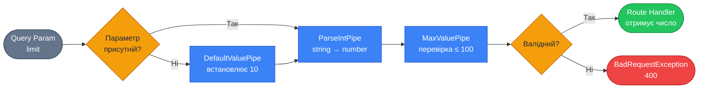

# Вбудовані pipes: ParseIntPipe, ParseBoolPipe, ParseUUIDPipe

::card-group

::card{title="🎯 Мета лекції" icon="i-lucide-target"}

- Опанувати використання вбудованих Pipes для типових сценаріїв трансформації та валідації
- Навчитися застосовувати `ParseIntPipe`, `ParseFloatPipe`, `ParseBoolPipe` для перетворення рядкових параметрів
- Вивчити спеціалізовані pipes: `ParseUUIDPipe`, `ParseEnumPipe`, `ParseArrayPipe`
- Засвоїти механізм налаштування pipes через передачу опцій конфігурації
- Зрозуміти роль `DefaultValuePipe` для обробки опційних параметрів
- Практикувати комбінування pipes для створення складної логіки валідації

::

::card{title="🔑 Ключові терміни" icon="i-lucide-key"}

- **Parse Pipe** (*парсинг-pipe*): pipe, що перетворює рядок у конкретний тип (число, boolean, UUID)
- **DefaultValuePipe** (*pipe значення за замовчуванням*): pipe, що встановлює fallback-значення для відсутніх параметрів
- **UUID (Universally Unique Identifier)**: стандартизований формат унікального ідентифікатора (128-біт)
- **Enum Validation** (*валідація перелічення*): перевірка, чи належить значення до визначеного набору констант
- **Optional Parameters** (*опційні параметри*): параметри, що можуть бути відсутніми в запиті
- **Error Status Code** (*код статусу помилки*): HTTP-код, що повертається при невалідних даних (зазвичай 400)

::

::

## ParseIntPipe: перетворення рядків у цілі числа

`ParseIntPipe` є одним з найбільш часто використовуваних pipes у NestJS-застосунках. Він розв'язує фундаментальну проблему: HTTP-параметри (як у URL, так і в query string) передаються як **рядки**, навіть якщо вони представляють числа.

### Проблема без ParseIntPipe

Без використання pipe TypeScript-компілятор «думає», що параметр має тип `number`, але насправді він є рядком:

```typescript
@Get(':id')
findOne(@Param('id') id: number) {
  console.log(typeof id); // Виведе: "string" ❌
  console.log(id === 123); // false, навіть якщо URL містить /123
  console.log(id === "123"); // true
  
  // Небезпечна операція: JavaScript приведе типи неявно
  const nextId = id + 1; // "1231" замість 124 ❌
  
  return this.usersService.findOne(id);
}
```

Це призводить до **type coercion** (неявного приведення типів) та потенційних помилок у бізнес-логіці.

### Рішення з ParseIntPipe

```typescript
import { Controller, Get, Param, ParseIntPipe } from '@nestjs/common';

@Controller('users')
export class UsersController {
  @Get(':id')
  findOne(@Param('id', ParseIntPipe) id: number) {
    console.log(typeof id); // "number" ✅
    console.log(id === 123); // true ✅
    
    const nextId = id + 1; // 124 ✅
    
    return this.usersService.findOne(id);
  }
}
```

Якщо клієнт надішле невалідний параметр (наприклад, `/users/abc`), `ParseIntPipe` автоматично викине `BadRequestException`:

```json
{
  "statusCode": 400,
  "message": "Validation failed (numeric string is expected)",
  "error": "Bad Request"
}
```

::note
`ParseIntPipe` використовує стандартну JavaScript-функцію `parseInt(value, 10)` для перетворення. Це означає, що рядки на кшталт `"123abc"` будуть перетворені на `123` (часткове парсування). Якщо потрібна строга валідація, розгляньте створення власного pipe або використання `class-validator`.
::

### Налаштування ParseIntPipe

`ParseIntPipe` приймає опційний об'єкт конфігурації:

```typescript
import { ParseIntPipe, HttpStatus } from '@nestjs/common';

@Get(':id')
findOne(
  @Param('id', new ParseIntPipe({
    errorHttpStatusCode: HttpStatus.NOT_ACCEPTABLE, // 406 замість 400
    optional: false, // За замовчуванням false
    exceptionFactory: (error) => {
      // Кастомне повідомлення про помилку
      return new BadRequestException(`ID must be a valid integer: ${error}`);
    }
  }))
  id: number
) {
  return this.usersService.findOne(id);
}
```

**Опції конфігурації:**

| Опція | Тип | Опис |
|-------|-----|------|
| `errorHttpStatusCode` | `HttpStatus` | HTTP-статус для помилки (за замовчуванням 400) |
| `optional` | `boolean` | Дозволити `undefined` (за замовчуванням `false`) |
| `exceptionFactory` | `(error: string) => any` | Функція для створення кастомного виключення |

## ParseFloatPipe: числа з плаваючою комою

`ParseFloatPipe` працює аналогічно до `ParseIntPipe`, але використовує `parseFloat()` для підтримки десяткових дробів:

```typescript
@Get('products')
findProducts(
  @Query('minPrice', ParseFloatPipe) minPrice: number,
  @Query('maxPrice', ParseFloatPipe) maxPrice: number
) {
  console.log(typeof minPrice); // "number"
  console.log(minPrice); // 19.99 (не "19.99")
  
  return this.productsService.findInPriceRange(minPrice, maxPrice);
}
```

**Приклад запиту:**
```
GET /products?minPrice=19.99&maxPrice=99.50
```

Параметри `minPrice` та `maxPrice` будуть автоматично перетворені з рядків `"19.99"` та `"99.50"` у числа `19.99` та `99.5`.

::warning
`parseFloat()` ігнорує нецифрові символи після числа: `"123.45abc"` → `123.45`. Для строгої валідації використовуйте `ValidationPipe` з декораторами `class-validator` (`@IsNumber()`, `@IsPositive()`).
::

## ParseBoolPipe: конвертація рядків у boolean

`ParseBoolPipe` перетворює рядкові представлення булевих значень у справжні `boolean`:

```typescript
@Get('articles')
findAll(
  @Query('published', ParseBoolPipe) published: boolean,
  @Query('featured', ParseBoolPipe) featured: boolean
) {
  console.log(typeof published); // "boolean"
  console.log(published === true); // true, не "true"
  
  return this.articlesService.findAll({ published, featured });
}
```

**Приклад запиту:**
```
GET /articles?published=true&featured=false
```

### Правила конвертації ParseBoolPipe

`ParseBoolPipe` розпізнає наступні значення:

| Рядок | Результат |
|-------|-----------|
| `"true"`, `"1"`, `"yes"` | `true` |
| `"false"`, `"0"`, `"no"` | `false` |
| Будь-що інше | `BadRequestException` |

```typescript
// ✅ Валідні запити
GET /articles?published=true
GET /articles?published=false
GET /articles?published=1
GET /articles?published=0

// ❌ Невалідні запити (викинуть 400)
GET /articles?published=yes   // "yes" не підтримується стандартним ParseBoolPipe
GET /articles?published=maybe
GET /articles?published=
```

::tip
Для підтримки більш гнучкого парсування (наприклад, `"yes"`, `"on"`, `"enabled"`) створіть власний pipe:

```typescript
@Injectable()
export class FlexibleParseBoolPipe implements PipeTransform<string, boolean> {
  private readonly truthyValues = ['true', '1', 'yes', 'on', 'enabled'];
  private readonly falsyValues = ['false', '0', 'no', 'off', 'disabled'];

  transform(value: string): boolean {
    const lowerValue = value.toLowerCase();
    
    if (this.truthyValues.includes(lowerValue)) {
      return true;
    }
    if (this.falsyValues.includes(lowerValue)) {
      return false;
    }
    
    throw new BadRequestException(
      `Boolean value expected, received: "${value}"`
    );
  }
}
```
::


## ParseUUIDPipe: валідація унікальних ідентифікаторів

UUID (*Universally Unique Identifier*) є стандартизованим форматом для унікальних ідентифікаторів, що часто використовується замість автоінкрементних числових ID у розподілених системах. Формат UUID: `550e8400-e29b-41d4-a716-446655440000`.

`ParseUUIDPipe` перевіряє, чи відповідає рядок валідному UUID-формату:

```typescript
import { Controller, Get, Param, ParseUUIDPipe } from '@nestjs/common';

@Controller('orders')
export class OrdersController {
  @Get(':id')
  findOne(@Param('id', ParseUUIDPipe) id: string) {
    // id гарантовано є валідним UUID
    return this.ordersService.findOne(id);
  }
}
```

**Приклади запитів:**

```bash
# ✅ Валідний UUID
GET /orders/550e8400-e29b-41d4-a716-446655440000

# ❌ Невалідний UUID (викине 400)
GET /orders/123
GET /orders/not-a-uuid
GET /orders/550e8400-e29b-41d4-a716  # Неповний UUID
```

### Версії UUID

`ParseUUIDPipe` підтримує різні версії UUID (v1, v3, v4, v5). За замовчуванням приймаються всі версії, але можна обмежити:

```typescript
@Get(':id')
findOne(
  @Param('id', new ParseUUIDPipe({ version: '4' })) id: string
) {
  // Приймає лише UUIDv4 (найпоширеніший формат)
  return this.ordersService.findOne(id);
}
```

**Опції ParseUUIDPipe:**

| Опція | Тип | Опис |
|-------|-----|------|
| `version` | `'3' \| '4' \| '5'` | Конкретна версія UUID (за замовчуванням будь-яка) |
| `errorHttpStatusCode` | `HttpStatus` | Статус помилки (за замовчуванням 400) |
| `exceptionFactory` | `(error: string) => any` | Кастомна фабрика виключень |

::note
UUID v4 є найпоширенішою версією, що генерується випадковим чином. UUID v1 містить часову мітку та MAC-адресу, UUID v3/v5 базуються на хешуванні (MD5/SHA-1). Для більшості застосунків достатньо використовувати UUIDv4.
::

## ParseEnumPipe: валідація значень з перелічення

`ParseEnumPipe` перевіряє, чи належить значення до визначеного TypeScript enum:

```typescript
// Визначення enum
export enum UserRole {
  Admin = 'admin',
  User = 'user',
  Moderator = 'moderator',
}

@Controller('users')
export class UsersController {
  @Get()
  findByRole(
    @Query('role', new ParseEnumPipe(UserRole)) role: UserRole
  ) {
    console.log(role); // 'admin' | 'user' | 'moderator'
    return this.usersService.findByRole(role);
  }
}
```

**Приклади запитів:**

```bash
# ✅ Валідні значення
GET /users?role=admin
GET /users?role=user
GET /users?role=moderator

# ❌ Невалідні значення (викинуть 400)
GET /users?role=superuser
GET /users?role=guest
GET /users?role=Admin  # Чутливий до регістру!
```

Повідомлення про помилку автоматично включає список дозволених значень:

```json
{
  "statusCode": 400,
  "message": "Validation failed (expected one of: admin, user, moderator)",
  "error": "Bad Request"
}
```

::tip
Для enum з числовими значеннями `ParseEnumPipe` автоматично перетворює рядок у число:

```typescript
enum Priority {
  Low = 1,
  Medium = 2,
  High = 3,
}

@Get('tasks')
findByPriority(
  @Query('priority', new ParseEnumPipe(Priority)) priority: Priority
) {
  console.log(typeof priority); // "number"
  console.log(priority); // 1, 2 або 3
}

// GET /tasks?priority=2 → priority = Priority.Medium (2)
```
::

## ParseArrayPipe: перетворення рядків у масиви

`ParseArrayPipe` дозволяє парсити параметри, що представляють масиви значень. Це корисно для query string параметрів, що містять списки:

```typescript
import { Controller, Get, Query, ParseArrayPipe } from '@nestjs/common';

@Controller('products')
export class ProductsController {
  @Get()
  findByTags(
    @Query('tags', new ParseArrayPipe({ items: String, separator: ',' }))
    tags: string[]
  ) {
    console.log(tags); // ['electronics', 'gadgets', 'sale']
    return this.productsService.findByTags(tags);
  }
}
```

**Приклад запиту:**
```bash
GET /products?tags=electronics,gadgets,sale
```

### Налаштування ParseArrayPipe

**Обов'язкові опції:**

| Опція | Тип | Опис |
|-------|-----|------|
| `items` | `Type<any>` | Тип елементів масиву (`String`, `Number`, класи DTO) |
| `separator` | `string` | Роздільник елементів (за замовчуванням `','`) |

**Опційні налаштування:**

| Опція | Тип | Опис |
|-------|-----|------|
| `optional` | `boolean` | Дозволити `undefined` |
| `whitelist` | `boolean` | Видалити невідомі властивості (для об'єктів) |

### Парсинг масивів чисел

```typescript
@Get('users')
findByIds(
  @Query('ids', new ParseArrayPipe({ items: Number, separator: ',' }))
  ids: number[]
) {
  console.log(ids); // [1, 2, 3, 5, 8]
  console.log(typeof ids[0]); // "number"
  return this.usersService.findByIds(ids);
}

// GET /users?ids=1,2,3,5,8
```

### Парсинг масивів DTO-об'єктів

Для складніших структур `ParseArrayPipe` може парсити JSON-масиви:

```typescript
export class FilterDto {
  field: string;
  operator: string;
  value: any;
}

@Get('search')
search(
  @Query('filters', new ParseArrayPipe({ items: FilterDto }))
  filters: FilterDto[]
) {
  return this.searchService.applyFilters(filters);
}

// GET /search?filters=[{"field":"age","operator":"gt","value":18}]
```

::warning
Для парсингу JSON-масивів через query string клієнт має правильно закодувати значення через `encodeURIComponent()`. Альтернативно, передавайте складні структури через тіло POST-запиту.
::

## DefaultValuePipe: значення за замовчуванням

`DefaultValuePipe` встановлює fallback-значення для **опційних параметрів**, що відсутні в запиті. Це особливо корисно для параметрів пагінації:

```typescript
@Get()
findAll(
  @Query('page', new DefaultValuePipe(1), ParseIntPipe) page: number,
  @Query('limit', new DefaultValuePipe(10), ParseIntPipe) limit: number
) {
  console.log(page); // 1, якщо параметр відсутній
  console.log(limit); // 10, якщо параметр відсутній
  
  return this.usersService.findAll({ page, limit });
}
```

**Порядок виконання pipes:**

1. `DefaultValuePipe` перевіряє наявність значення:
   - Якщо параметр **відсутній** (`undefined` або `null`) → повертає значення за замовчуванням
   - Якщо параметр **присутній** → передає його далі без змін

2. `ParseIntPipe` перетворює рядок у число

**Приклади запитів:**

```bash
# Обидва параметри відсутні → page=1, limit=10
GET /users

# Частково присутні → page=5, limit=10
GET /users?page=5

# Обидва присутні → page=2, limit=50
GET /users?page=2&limit=50
```

::tip
`DefaultValuePipe` має бути **перед** трансформуючими pipes (наприклад, `ParseIntPipe`), оскільки він працює з `undefined`, а `ParseIntPipe` очікує рядок або число.
::

### Комплексні значення за замовчуванням

`DefaultValuePipe` може встановлювати складні структури:

```typescript
@Get('search')
search(
  @Query('filters', new DefaultValuePipe([]), ParseArrayPipe)
  filters: any[]
) {
  // filters завжди масив, навіть якщо параметр відсутній
  console.log(Array.isArray(filters)); // true
}
```

## Комбінування множинних pipes

Потужна можливість NestJS полягає у **композиції pipes** для створення складної логіки валідації та трансформації:

```typescript
@Get()
findAll(
  @Query('page', new DefaultValuePipe(1), ParseIntPipe) page: number,
  @Query('limit', new DefaultValuePipe(10), ParseIntPipe, new MaxValuePipe(100)) limit: number,
  @Query('sort', new DefaultValuePipe('createdAt'), new ParseEnumPipe(SortField)) sort: SortField,
  @Query('active', new DefaultValuePipe('true'), ParseBoolPipe) active: boolean
) {
  return this.usersService.findAll({ page, limit, sort, active });
}
```

**Ланцюг обробки для параметра `limit`:**

1. `DefaultValuePipe(10)` → якщо відсутній, встановлює `10`
2. `ParseIntPipe` → перетворює рядок у число
3. `MaxValuePipe(100)` → перевіряє, чи не перевищує `100`

::mermaid



::

## Практичний приклад: API пагінації з повною валідацією

Розглянемо реалістичний приклад створення ендпоінту з комплексною валідацією параметрів:

```typescript
import {
  Controller,
  Get,
  Query,
  ParseIntPipe,
  ParseBoolPipe,
  ParseEnumPipe,
  DefaultValuePipe,
  BadRequestException,
} from '@nestjs/common';

// Enum для сортування
export enum SortOrder {
  ASC = 'asc',
  DESC = 'desc',
}

// Кастомний Pipe для обмеження діапазону
class RangePipe implements PipeTransform<number, number> {
  constructor(private min: number, private max: number) {}

  transform(value: number): number {
    if (value < this.min || value > this.max) {
      throw new BadRequestException(
        `Value must be between ${this.min} and ${this.max}`
      );
    }
    return value;
  }
}

@Controller('articles')
export class ArticlesController {
  @Get()
  findAll(
    // Пагінація: page від 1 до 1000, за замовчуванням 1
    @Query('page', new DefaultValuePipe(1), ParseIntPipe, new RangePipe(1, 1000))
    page: number,

    // Розмір сторінки: limit від 1 до 100, за замовчуванням 20
    @Query('limit', new DefaultValuePipe(20), ParseIntPipe, new RangePipe(1, 100))
    limit: number,

    // Сортування: asc або desc, за замовчуванням desc
    @Query('order', new DefaultValuePipe(SortOrder.DESC), new ParseEnumPipe(SortOrder))
    order: SortOrder,

    // Фільтр: тільки опубліковані, за замовчуванням true
    @Query('published', new DefaultValuePipe('true'), ParseBoolPipe)
    published: boolean,

    // Теги: опційний масив рядків
    @Query('tags', new DefaultValuePipe([]), new ParseArrayPipe({ items: String, separator: ',' }))
    tags: string[]
  ) {
    const offset = (page - 1) * limit;

    return this.articlesService.findAll({
      offset,
      limit,
      order,
      published,
      tags,
    });
  }
}
```

**Приклади запитів:**

```bash
# Мінімальний запит (всі значення за замовчуванням)
GET /articles
# → page=1, limit=20, order=desc, published=true, tags=[]

# З пагінацією
GET /articles?page=3&limit=50
# → page=3, limit=50, order=desc, published=true, tags=[]

# З фільтрацією
GET /articles?published=false&tags=typescript,nestjs
# → page=1, limit=20, order=desc, published=false, tags=['typescript','nestjs']

# Повна конфігурація
GET /articles?page=2&limit=30&order=asc&published=true&tags=tutorial,backend
```

**Помилкові запити:**

```bash
# ❌ page поза діапазоном
GET /articles?page=2000
# → 400: Value must be between 1 and 1000

# ❌ limit поза діапазоном
GET /articles?limit=500
# → 400: Value must be between 1 and 100

# ❌ Невалідний order
GET /articles?order=random
# → 400: Validation failed (expected one of: asc, desc)

# ❌ Невалідний тип page
GET /articles?page=abc
# → 400: Validation failed (numeric string is expected)
```

::accordion

::accordion-item{label="❓ Чому DefaultValuePipe має бути перед ParseIntPipe?" icon="i-lucide-help-circle"}

`DefaultValuePipe` перевіряє, чи є значення `undefined` або `null`, і повертає fallback. `ParseIntPipe` очікує рядок або число, а не `undefined`. Якщо `ParseIntPipe` виконається першим, він викине помилку для відсутніх параметрів. Правильний порядок: `DefaultValuePipe` → трансформуючі pipes → валідуючі pipes.

::

::accordion-item{label="❓ Чи можна використовувати ParseIntPipe з опцією optional замість DefaultValuePipe?" icon="i-lucide-help-circle"}

Так, `ParseIntPipe` підтримує опцію `optional: true`, що дозволяє пропускати `undefined`:

```typescript
@Query('page', new ParseIntPipe({ optional: true })) page?: number
```

Проте `DefaultValuePipe` є більш декларативним та явно показує значення за замовчуванням у коді, що покращує читабельність.

::

::accordion-item{label="❓ Як обробити ситуацію, коли клієнт надсилає масив через множинні параметри (tags=a&tags=b)?" icon="i-lucide-help-circle"}

Express автоматично перетворює множинні параметри з однаковою назвою у масив:

```typescript
@Query('tags') tags: string[]

// GET /articles?tags=a&tags=b&tags=c
// → tags = ['a', 'b', 'c']
```

У цьому випадку `ParseArrayPipe` не потрібен, оскільки значення вже є масивом. Проте для узгодженості API краще документувати єдиний формат (через кому або множинні параметри).

::

::

## Підсумок: коли використовувати які pipes

::card-group

::card{title="ParseIntPipe / ParseFloatPipe" icon="i-lucide-hash"}

Для ID ресурсів, параметрів пагінації (`page`, `limit`), числових фільтрів (`age`, `price`).

::

::card{title="ParseBoolPipe" icon="i-lucide-toggle-left"}

Для прапорців фільтрації (`published`, `active`, `featured`), опцій конфігурації.

::

::card{title="ParseUUIDPipe" icon="i-lucide-fingerprint"}

Для унікальних ідентифікаторів у розподілених системах, foreign keys, токенів.

::

::card{title="ParseEnumPipe" icon="i-lucide-list"}

Для обмежених наборів значень: статуси (`pending`, `approved`), ролі, типи.

::

::card{title="ParseArrayPipe" icon="i-lucide-brackets"}

Для множинних фільтрів (`tags`, `categories`), списків ID, bulk-операцій.

::

::card{title="DefaultValuePipe" icon="i-lucide-circle-dot"}

Для опційних параметрів з розумними значеннями за замовчуванням (`page=1`, `limit=10`).

::

::

У наступній лекції ми розглянемо **ValidationPipe** — найпотужніший вбудований pipe, що інтегрується з бібліотекою `class-validator` для декларативної валідації складних DTO-структур через декоратори.
