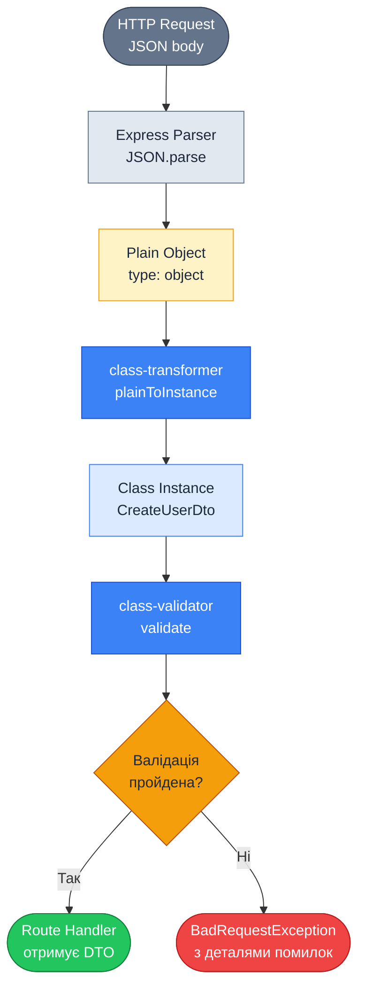

# ValidationPipe: автоматична валідація DTO

::card-group

::card{title="🎯 Мета лекції" icon="i-lucide-target"}

- Опанувати ValidationPipe як основний інструмент для декларативної валідації складних DTO-об'єктів
- Навчитися інтегрувати бібліотеки `class-validator` та `class-transformer` для метаданих-орієнтованої валідації
- Вивчити критичні опції конфігурації: `whitelist`, `forbidNonWhitelisted`, `transform`
- Засвоїти механізм автоматичного перетворення типів JSON-даних у типізовані екземпляри класів
- Зрозуміти стратегії безпеки валідації: видалення зайвих полів, блокування невідомих властивостей
- Практикувати налаштування ValidationPipe для різних середовищ (розробка, продакшен)

::

::card{title="🔑 Ключові терміни" icon="i-lucide-key"}

- **ValidationPipe** (*pipe валідації*): вбудований NestJS pipe для автоматичної валідації DTO через декоратори `class-validator`
- **class-validator** (*валідатор класів*): бібліотека декораторів для декларативної валідації властивостей класів
- **class-transformer** (*трансформер класів*): бібліотека для перетворення plain objects у типізовані екземпляри класів
- **Whitelist** (*білий список*): режим, що видаляє властивості, не позначені декораторами валідації
- **Transformation** (*трансформація*): автоматичне перетворення типів JSON-даних відповідно до TypeScript-метаданих
- **DTO (Data Transfer Object)** (*об'єкт передачі даних*): клас, що визначає структуру та правила валідації вхідних даних

::

::

## ValidationPipe: декларативна валідація через декоратори

`ValidationPipe` є найпотужнішим і найчастіше використовуваним вбудованим pipe у NestJS. На відміну від простих pipes на кшталт `ParseIntPipe`, що перетворюють скалярні значення, ValidationPipe працює з **складними об'єктами** (DTO — Data Transfer Objects) і виконує **структурну валідацію** на основі метаданих, прикріплених через декоратори бібліотеки `class-validator`.

Ключова відмінність цього підходу полягає в тому, що правила валідації визначаються **декларативно** безпосередньо на класі DTO, а не імперативно у коді pipe. Це забезпечує чистоту коду, повторне використання логіки валідації та природну інтеграцію з TypeScript-типами.

### Архітектурний контекст

ValidationPipe базується на двох взаємопов'язаних бібліотеках:

1. **`class-validator`**: надає декоратори для визначення правил валідації (`@IsEmail()`, `@MinLength()`, `@IsInt()`)
2. **`class-transformer`**: перетворює plain JavaScript objects (JSON) у типізовані екземпляри класів

::mermaid



::

Цей процес гарантує, що обробник контролера отримує **валідований екземпляр класу** з правильними типами, а не сирий JavaScript-об'єкт з невизначеними типами.

::note
ValidationPipe є реалізацією патерну **Validation Layer** з Domain-Driven Design (DDD). Він створює чіткий бар'єр між зовнішнім світом (невалідовані HTTP-дані) та доменним шаром (типізовані об'єкти з гарантованою коректністю).
::

## Встановлення залежностей

Перед використанням ValidationPipe необхідно встановити дві обов'язкові залежності:

::tabs

::tabs-item{label="npm"}
```bash
npm install class-validator class-transformer
```
::

::tabs-item{label="yarn"}
```bash
yarn add class-validator class-transformer
```
::

::tabs-item{label="pnpm"}
```bash
pnpm add class-validator class-transformer
```
::

::

**Призначення бібліотек:**

- **`class-validator`**: близько 100+ декораторів для валідації (числа, рядки, дати, масиви, вкладені об'єкти)
- **`class-transformer`**: перетворення plain objects ↔ class instances, підтримка трансформації типів

::warning
ValidationPipe **не працюватиме** без цих залежностей. Якщо ви застосуєте ValidationPipe до DTO без встановлених `class-validator` та `class-transformer`, отримаєте runtime-помилку про відсутність необхідних модулів.
::

## Глобальне підключення ValidationPipe

Найпоширеніший спосіб використання ValidationPipe — це **глобальна реєстрація** для всього застосунку. Це гарантує, що всі DTO автоматично валідуються без необхідності явно застосовувати pipe до кожного параметра.

### Базова конфігурація (main.ts)

```typescript
import { NestFactory } from '@nestjs/core';
import { ValidationPipe } from '@nestjs/common';
import { AppModule } from './app.module';

async function bootstrap() {
  const app = await NestFactory.create(AppModule);
  
  // Глобальна реєстрація ValidationPipe
  app.useGlobalPipes(new ValidationPipe());
  
  await app.listen(3000);
}
bootstrap();
```

Після цього всі параметри, позначені декораторами `@Body()`, `@Query()`, `@Param()`, автоматично проходитимуть валідацію, якщо їхній тип є класом з декораторами `class-validator`.

### Приклад використання

```typescript
// dto/create-user.dto.ts
import { IsEmail, IsString, MinLength, MaxLength } from 'class-validator';

export class CreateUserDto {
  @IsEmail()
  email: string;

  @IsString()
  @MinLength(8)
  @MaxLength(50)
  password: string;

  @IsString()
  @MinLength(2)
  @MaxLength(100)
  name: string;
}
```

```typescript
// users.controller.ts
import { Controller, Post, Body } from '@nestjs/common';
import { CreateUserDto } from './dto/create-user.dto';

@Controller('users')
export class UsersController {
  @Post()
  create(@Body() dto: CreateUserDto) {
    // dto автоматично провалідовано ValidationPipe
    // Якщо дані невалідні, обробник не викликається
    console.log(dto instanceof CreateUserDto); // true
    console.log(typeof dto.email); // "string"
    
    return this.usersService.create(dto);
  }
}
```

**Запит з валідними даними:**

```bash
POST /users
Content-Type: application/json

{
  "email": "user@example.com",
  "password": "securePassword123",
  "name": "John Doe"
}

# Відповідь: 201 Created
```

**Запит з невалідними даними:**

```bash
POST /users
Content-Type: application/json

{
  "email": "invalid-email",
  "password": "123",
  "name": "A"
}

# Відповідь: 400 Bad Request
```

```json
{
  "statusCode": 400,
  "message": [
    "email must be an email",
    "password must be longer than or equal to 8 characters",
    "name must be longer than or equal to 2 characters"
  ],
  "error": "Bad Request"
}
```

::tip
ValidationPipe автоматично **агрегує всі помилки валідації** і повертає їх у єдиній відповіді. Це дозволяє клієнту побачити всі проблеми одразу, а не отримувати помилки послідовно після виправлення кожної.
::

## Опція `whitelist`: захист від зайвих властивостей

Опція `whitelist: true` **видаляє** всі властивості з вхідного об'єкта, які **не мають декораторів валідації**. Це критично важлива опція для безпеки, оскільки вона запобігає атакам типу **mass assignment**, де зловмисник намагається передати зайві поля для модифікації захищених властивостей.

### Проблема без whitelist

```typescript
export class CreateUserDto {
  @IsEmail()
  email: string;

  @IsString()
  password: string;
  
  // Немає декоратора для isAdmin!
}

// Зловмисний запит
POST /users
{
  "email": "hacker@evil.com",
  "password": "password123",
  "isAdmin": true  // ⚠️ Зайве поле!
}
```

Без `whitelist: true` властивість `isAdmin` потрапить в об'єкт `dto` і може бути випадково збережена в базі даних, надавши зловмиснику права адміністратора.

### Рішення з whitelist

```typescript
app.useGlobalPipes(new ValidationPipe({
  whitelist: true, // Видаляти невалідовані властивості
}));
```

Тепер властивість `isAdmin` буде **тихо видалена** з DTO перед передачею в обробник:

```typescript
@Post()
create(@Body() dto: CreateUserDto) {
  console.log(dto); 
  // { email: 'hacker@evil.com', password: 'password123' }
  // isAdmin відсутній ✅
}
```

::warning
`whitelist: true` видаляє зайві поля **без помилки**. Якщо потрібно **відхилити** запит при наявності невідомих властивостей, використовуйте `forbidNonWhitelisted: true` разом з `whitelist`.
::


## Опція `forbidNonWhitelisted`: явне блокування невідомих полів

Опція `forbidNonWhitelisted: true` працює разом з `whitelist` і **викидає виключення**, якщо у запиті присутні властивості, не позначені декораторами валідації. Це забезпечує строгий контракт API.

### Конфігурація

```typescript
app.useGlobalPipes(new ValidationPipe({
  whitelist: true,
  forbidNonWhitelisted: true, // Викидати помилку для невідомих полів
}));
```

### Поведінка

```typescript
export class CreateUserDto {
  @IsEmail()
  email: string;

  @IsString()
  password: string;
}

// Запит із зайвим полем
POST /users
{
  "email": "user@example.com",
  "password": "password123",
  "unknownField": "value"
}

// Відповідь: 400 Bad Request
{
  "statusCode": 400,
  "message": ["property unknownField should not exist"],
  "error": "Bad Request"
}
```

::tip
Комбінація `whitelist: true` + `forbidNonWhitelisted: true` рекомендується для **продакшен-середовищ**, оскільки вона забезпечує максимальну безпеку та дозволяє виявляти помилки у клієнтських додатках (наприклад, якщо фронтенд надсилає поля, що більше не підтримуються API).
::

### Порівняння режимів

::code-group

```typescript [Без whitelist]
app.useGlobalPipes(new ValidationPipe());

// Запит
POST /users
{
  "email": "user@example.com",
  "password": "password123",
  "isAdmin": true
}

// Результат у контролері
console.log(dto);
// { email: '...', password: '...', isAdmin: true }
// ⚠️ Небезпечно: isAdmin потрапив у DTO
```

```typescript [whitelist: true]
app.useGlobalPipes(new ValidationPipe({
  whitelist: true
}));

// Запит
POST /users
{
  "email": "user@example.com",
  "password": "password123",
  "isAdmin": true
}

// Результат у контролері
console.log(dto);
// { email: '...', password: '...' }
// ✅ isAdmin тихо видалено
// ❌ Немає помилки — клієнт не знає про проблему
```

```typescript [whitelist + forbidNonWhitelisted]
app.useGlobalPipes(new ValidationPipe({
  whitelist: true,
  forbidNonWhitelisted: true
}));

// Запит
POST /users
{
  "email": "user@example.com",
  "password": "password123",
  "isAdmin": true
}

// Результат
// 400 Bad Request
// "property isAdmin should not exist"
// ✅ Строга валідація контракту
```

::

## Опція `transform`: автоматичне перетворення типів

За замовчуванням ValidationPipe **не перетворює типи**. Навіть якщо ви позначите властивість як `number` у TypeScript, вона залишиться рядком після парсингу JSON. Опція `transform: true` вмикає автоматичне перетворення типів на основі TypeScript-метаданих.

### Проблема без transform

```typescript
export class UpdateUserDto {
  @IsInt()
  age: number; // TypeScript-тип: number

  @IsBoolean()
  isActive: boolean; // TypeScript-тип: boolean
}

// main.ts
app.useGlobalPipes(new ValidationPipe()); // transform за замовчуванням false
```

```typescript
@Patch(':id')
update(@Param('id') id: string, @Body() dto: UpdateUserDto) {
  console.log(typeof dto.age); // "number" (JSON-число)
  console.log(typeof dto.isActive); // "boolean" (JSON-boolean)
  
  // ⚠️ Проте для @Query параметрів типи залишаються рядками!
}
```

```typescript
@Get()
findAll(
  @Query('page') page: number, // TypeScript каже number
  @Query('active') active: boolean // TypeScript каже boolean
) {
  console.log(typeof page); // "string" ❌ (query завжди рядки)
  console.log(typeof active); // "string" ❌
  
  // Потрібно вручну парсити або використовувати ParseIntPipe
}
```

### Рішення з transform

```typescript
app.useGlobalPipes(new ValidationPipe({
  transform: true, // Автоматичне перетворення типів
}));
```

Тепер ValidationPipe автоматично перетворює типи на основі **TypeScript-метаданих** (які зберігаються завдяки `emitDecoratorMetadata: true` у `tsconfig.json`):

```typescript
@Get()
findAll(
  @Query('page') page: number,
  @Query('active') active: boolean
) {
  console.log(typeof page); // "number" ✅
  console.log(typeof active); // "boolean" ✅
  
  // Працює без ParseIntPipe і ParseBoolPipe!
}
```

::note
Опція `transform: true` працює лише для **примітивних типів** (number, boolean, string) та класів DTO. Для складних трансформацій (наприклад, рядок → Date) потрібні додаткові декоратори з `class-transformer` (`@Type(() => Date)`).
::

### Вплив на продуктивність

Трансформація має невелике overhead через використання рефлексії TypeScript. Для більшості застосунків це незначно, але для high-throughput API можна вимкнути `transform` і використовувати явні pipes (`ParseIntPipe`) для критичних маршрутів.

## Опція `transformOptions`: налаштування трансформації

Опція `transformOptions` передає конфігурацію безпосередньо в `class-transformer`. Найкорисніші налаштування:

```typescript
app.useGlobalPipes(new ValidationPipe({
  transform: true,
  transformOptions: {
    enableImplicitConversion: true, // Спрощене перетворення типів
    excludeExtraneousValues: false, // Видалити поля без декораторів @Expose()
    exposeDefaultValues: true, // Зберігати значення за замовчуванням
  },
}));
```

### `enableImplicitConversion`: спрощене приведення типів

За замовчуванням `class-transformer` вимагає явних декораторів `@Type()` для перетворення складних типів. `enableImplicitConversion: true` дозволяє автоматичне приведення на основі TypeScript-типів:

```typescript
export class CreateEventDto {
  @IsString()
  title: string;

  // Без enableImplicitConversion потрібен @Type(() => Date)
  @IsDate()
  startDate: Date; // Автоматично перетворить рядок ISO 8601 → Date
}

// Запит
POST /events
{
  "title": "Conference",
  "startDate": "2026-09-04T12:00:00Z"
}

// Результат у контролері (з enableImplicitConversion: true)
console.log(dto.startDate instanceof Date); // true ✅
console.log(dto.startDate.getFullYear()); // 2026
```

::warning
`enableImplicitConversion` може призвести до **неочікуваних перетворень**. Наприклад, рядок `"123"` може бути перетворений на число `123`, навіть якщо це небажано. Для критичних полів використовуйте явні декоратори `@Type()`.
::

## Опція `skipMissingProperties`: пропуск відсутніх полів

За замовчуванням ValidationPipe валідує **всі властивості**, навіть якщо вони `undefined`. Опція `skipMissingProperties: true` пропускає валідацію для відсутніх полів, що корисно для часткового оновлення (PATCH):

```typescript
export class UpdateUserDto {
  @IsEmail()
  @IsOptional() // Дозволяє undefined
  email?: string;

  @MinLength(8)
  @IsOptional()
  password?: string;

  @IsString()
  @IsOptional()
  name?: string;
}
```

Без `skipMissingProperties` кожне поле має бути позначене `@IsOptional()`. З `skipMissingProperties: true` відсутні поля автоматично пропускаються:

```typescript
app.useGlobalPipes(new ValidationPipe({
  skipMissingProperties: true, // Не валідувати undefined поля
}));
```

```typescript
@Patch(':id')
update(@Param('id') id: string, @Body() dto: UpdateUserDto) {
  // Запит: { "email": "new@example.com" }
  // password та name відсутні → валідація пропущена
  // Оновимо лише email
}
```

::caution
`skipMissingProperties: true` **не рекомендується для створення ресурсів** (POST), оскільки це дозволяє створювати об'єкти з відсутніми обов'язковими полями. Використовуйте цю опцію лише для окремих DTO оновлення або застосовуйте ValidationPipe з різною конфігурацією на рівні методу.
::

## Опція `disableErrorMessages`: приховування деталей у продакшені

За замовчуванням ValidationPipe повертає **детальні повідомлення про помилки**, включаючи назви полів та правила валідації. У продакшен-середовищі це може розкривати внутрішню структуру API.

```typescript
app.useGlobalPipes(new ValidationPipe({
  disableErrorMessages: process.env.NODE_ENV === 'production',
}));
```

**Поведінка:**

::code-group

```json [Development (детальні помилки)]
{
  "statusCode": 400,
  "message": [
    "email must be an email",
    "password must be longer than or equal to 8 characters"
  ],
  "error": "Bad Request"
}
```

```json [Production (загальна помилка)]
{
  "statusCode": 400,
  "message": "Bad Request"
}
```

::

::tip
Для кращого контролю над повідомленнями використовуйте `exceptionFactory` (див. нижче) замість повного вимкнення деталей помилок.
::

## Кастомізація повідомлень помилок: `exceptionFactory`

Опція `exceptionFactory` дозволяє **повністю контролювати** формат відповіді про помилки валідації:

```typescript
import { ValidationPipe, BadRequestException, ValidationError } from '@nestjs/common';

app.useGlobalPipes(new ValidationPipe({
  exceptionFactory: (errors: ValidationError[]) => {
    // Перетворити ValidationError[] у кастомний формат
    const messages = errors.map(error => ({
      field: error.property,
      errors: Object.values(error.constraints || {}),
    }));

    return new BadRequestException({
      statusCode: 400,
      error: 'Validation Failed',
      validationErrors: messages,
      timestamp: new Date().toISOString(),
    });
  },
}));
```

**Результуюча відповідь:**

```json
{
  "statusCode": 400,
  "error": "Validation Failed",
  "validationErrors": [
    {
      "field": "email",
      "errors": ["email must be an email"]
    },
    {
      "field": "password",
      "errors": [
        "password must be longer than or equal to 8 characters",
        "password must be a string"
      ]
    }
  ],
  "timestamp": "2026-09-04T12:00:00.000Z"
}
```

### Локалізація повідомлень помилок

`exceptionFactory` можна використовувати для перекладу помилок на мову користувача:

```typescript
const translations = {
  en: {
    'email must be an email': 'Email address is invalid',
    'password must be longer than or equal to 8 characters': 'Password is too short',
  },
  uk: {
    'email must be an email': 'Адреса електронної пошти невалідна',
    'password must be longer than or equal to 8 characters': 'Пароль занадто короткий',
  },
};

app.useGlobalPipes(new ValidationPipe({
  exceptionFactory: (errors: ValidationError[]) => {
    const lang = 'uk'; // Отримати з заголовка Accept-Language
    
    const messages = errors.flatMap(error =>
      Object.values(error.constraints || {}).map(msg =>
        translations[lang][msg] || msg
      )
    );

    return new BadRequestException({
      statusCode: 400,
      message: messages,
    });
  },
}));
```

## Рекомендована конфігурація для продакшену

Для більшості застосунків рекомендується наступна конфігурація ValidationPipe:

```typescript
import { NestFactory } from '@nestjs/core';
import { ValidationPipe } from '@nestjs/common';
import { AppModule } from './app.module';

async function bootstrap() {
  const app = await NestFactory.create(AppModule);
  
  app.useGlobalPipes(new ValidationPipe({
    // Безпека: видалити невалідовані поля
    whitelist: true,
    
    // Безпека: відхилити запити з невідомими полями
    forbidNonWhitelisted: true,
    
    // Зручність: автоматичне перетворення типів
    transform: true,
    
    // Зручність: спрощене приведення складних типів
    transformOptions: {
      enableImplicitConversion: true,
    },
    
    // Продуктивність: приховати деталі помилок у production
    disableErrorMessages: process.env.NODE_ENV === 'production',
  }));
  
  await app.listen(3000);
}
bootstrap();
```

::accordion

::accordion-item{label="❓ Чому ValidationPipe не працює для примітивних типів (string, number)?" icon="i-lucide-help-circle"}

ValidationPipe працює лише з **класами**, що мають декоратори `class-validator`. Примітивні типи (string, number, boolean) не є класами і не можуть мати декораторів. Для валідації примітивних значень використовуйте `ParseIntPipe`, `ParseBoolPipe` або створіть простий DTO-клас:

```typescript
class PageDto {
  @IsInt()
  @Min(1)
  page: number;
}

@Get()
findAll(@Query() dto: PageDto) {
  // dto.page валідовано
}
```

::

::accordion-item{label="❓ Чи можна застосувати різну конфігурацію ValidationPipe для різних маршрутів?" icon="i-lucide-help-circle"}

Так, ValidationPipe можна застосовувати на рівні методу з кастомною конфігурацією:

```typescript
@Post()
@UsePipes(new ValidationPipe({ skipMissingProperties: true }))
partialUpdate(@Body() dto: UpdateUserDto) {
  // Ця конфігурація має вищий пріоритет за глобальну
}
```

Або створити окремі провайдери ValidationPipe для різних модулів.

::

::accordion-item{label="❓ Що станеться, якщо забути встановити class-validator?" icon="i-lucide-help-circle"}

Застосунок запуститься, але ValidationPipe **не виконуватиме валідацію**. Декоратори на кшталт `@IsEmail()` будуть проігноровані, і всі дані потраплять у контролер без перевірки. Завжди встановлюйте `class-validator` та `class-transformer` при використанні ValidationPipe.

::

::

## Підсумок: ключові опції ValidationPipe

| Опція | Значення | Призначення |
|-------|----------|-------------|
| `whitelist` | `true` | Видаляти невалідовані властивості (захист від mass assignment) |
| `forbidNonWhitelisted` | `true` | Викидати помилку для невідомих полів (строгий контракт) |
| `transform` | `true` | Автоматичне перетворення типів (зручність) |
| `transformOptions.enableImplicitConversion` | `true` | Спрощене приведення складних типів (Date, вкладені об'єкти) |
| `skipMissingProperties` | `false` | Не валідувати відсутні поля (корисно для PATCH) |
| `disableErrorMessages` | `production` | Приховувати деталі помилок у продакшені |
| `exceptionFactory` | `function` | Кастомізувати формат відповіді про помилки |

У наступній лекції ми детально розглянемо **декоратори class-validator** для різних типів валідації: рядки, числа, дати, масиви, вкладені об'єкти та умовна валідація.
