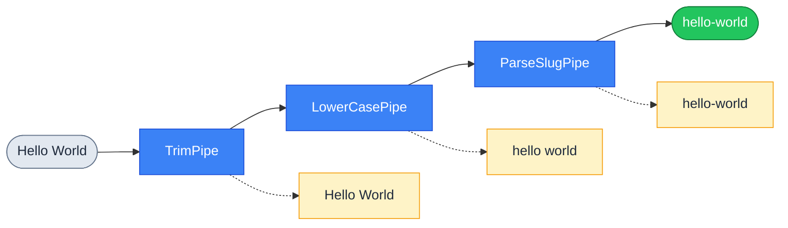

# Створення власних Pipes

::card-group

::card{title="🎯 Мета лекції" icon="i-lucide-target"}

- Опанувати створення власних Pipes для специфічних задач трансформації та валідації даних
- Навчитися імплементувати інтерфейс `PipeTransform<T, R>` для типобезпечних перетворень
- Вивчити використання `ArgumentMetadata` для контекстно-залежної обробки параметрів
- Засвоїти патерни конфігурації pipes через конструктор та опції
- Зрозуміти різницю між валідаційними та трансформаційними pipes
- Практикувати створення pipes для типових сценаріїв: санітизація, нормалізація, парсинг

::

::card{title="🔑 Ключові терміни" icon="i-lucide-key"}

- **Custom Pipe** (*кастомний pipe*): клас, що імплементує `PipeTransform` для специфічної логіки обробки даних
- **PipeTransform<T, R>** (*інтерфейс трансформації*): generic-інтерфейс, де T — тип вхідного значення, R — тип результату
- **ArgumentMetadata** (*метадані аргументу*): об'єкт з інформацією про параметр методу (тип декоратора, TypeScript-тип)
- **Transformation Pipe** (*трансформаційний pipe*): pipe, що змінює значення без валідації
- **Validation Pipe** (*валідаційний pipe*): pipe, що перевіряє коректність даних і викидає виключення при помилці
- **Sanitization** (*санітизація*): очищення даних від небезпечного вмісту (HTML, SQL, XSS)

::

::

## Анатомія кастомного Pipe

Кастомний pipe є класом TypeScript, що імплементує інтерфейс `PipeTransform<T, R>` та позначений декоратором `@Injectable()`. На відміну від validators з `class-validator`, pipes працюють на рівні **окремих параметрів методу** і можуть як трансформувати дані, так і валідувати їх структуру.

### Мінімальна структура Pipe

```typescript
import { PipeTransform, Injectable, ArgumentMetadata } from '@nestjs/common';

@Injectable()
export class CustomPipe implements PipeTransform<InputType, OutputType> {
  transform(value: InputType, metadata: ArgumentMetadata): OutputType {
    // Логіка трансформації або валідації
    return transformedValue;
  }
}
```

**Ключові компоненти:**

1. **`@Injectable()`**: дозволяє використовувати Dependency Injection для впровадження сервісів
2. **`PipeTransform<T, R>`**: generic-інтерфейс, що визначає тип вхідних та вихідних даних
3. **`transform(value, metadata)`**: метод, що виконує логіку обробки
4. **`ArgumentMetadata`**: об'єкт з метаданими про параметр методу

### Структура ArgumentMetadata

```typescript
interface ArgumentMetadata {
  type: 'body' | 'query' | 'param' | 'custom';  // Джерело параметра
  metatype?: Type<unknown>;                      // TypeScript-тип (Number, String, DTO-клас)
  data?: string;                                 // Назва властивості (@Param('id') → 'id')
}
```

**Приклад використання метаданих:**

```typescript
@Injectable()
export class LoggingPipe implements PipeTransform {
  transform(value: any, metadata: ArgumentMetadata) {
    console.log(`Processing ${metadata.type} parameter "${metadata.data}"`);
    console.log(`Expected type: ${metadata.metatype?.name}`);
    console.log(`Received value:`, value);
    return value;
  }
}

// У контролері:
@Get(':id')
findOne(@Param('id', LoggingPipe) id: string) {
  // Консоль виведе:
  // Processing param parameter "id"
  // Expected type: String
  // Received value: 123
}
```

::note
`ArgumentMetadata` надає контекст для **контекстно-залежної обробки**: pipe може поводитися по-різному залежно від того, чи параметр прийшов з `@Body()`, `@Query()` чи `@Param()`.
::

## Трансформаційні Pipes: зміна форми даних

Трансформаційні pipes **змінюють** вхідне значення без валідації коректності. Їхня мета — привести дані до бажаного формату.

### TrimPipe: видалення зайвих пробілів

Один з найкорисніших pipes для будь-якого API — автоматичне обрізання пробілів на початку та в кінці рядків:

```typescript
import { PipeTransform, Injectable, ArgumentMetadata } from '@nestjs/common';

@Injectable()
export class TrimPipe implements PipeTransform<string, string> {
  transform(value: string, metadata: ArgumentMetadata): string {
    if (typeof value !== 'string') {
      return value; // Пропускаємо не-рядки
    }
    
    return value.trim();
  }
}
```

**Використання:**

```typescript
@Post()
create(@Body(TrimPipe) dto: CreateUserDto) {
  // Всі рядкові поля DTO автоматично обрізані
  console.log(dto.name); // "John Doe" замість "  John Doe  "
}
```

### Глибока трансформація об'єктів

Для обробки всіх рядкових полів у DTO рекурсивно:

```typescript
@Injectable()
export class DeepTrimPipe implements PipeTransform {
  transform(value: any, metadata: ArgumentMetadata): any {
    if (metadata.type !== 'body') {
      return value; // Застосовуємо лише до тіла запиту
    }
    
    return this.trimStringsRecursively(value);
  }

  private trimStringsRecursively(obj: any): any {
    if (typeof obj === 'string') {
      return obj.trim();
    }
    
    if (Array.isArray(obj)) {
      return obj.map(item => this.trimStringsRecursively(item));
    }
    
    if (obj !== null && typeof obj === 'object') {
      const trimmedObj: any = {};
      for (const key in obj) {
        if (obj.hasOwnProperty(key)) {
          trimmedObj[key] = this.trimStringsRecursively(obj[key]);
        }
      }
      return trimmedObj;
    }
    
    return obj;
  }
}
```

**Використання:**

```typescript
@Post()
create(@Body(DeepTrimPipe) dto: CreateArticleDto) {
  // Всі рядкові поля, включно з вкладеними об'єктами та масивами, обрізані
}
```

::tip
Глибока трансформація корисна, але має overhead через рекурсивний обхід. Для високонавантажених API використовуйте простий `TrimPipe` лише для критичних полів або застосовуйте трансформацію на рівні DTO через декоратор `@Transform()` з `class-transformer`.
::

### ParseSlugPipe: нормалізація URL-slug

Перетворення рядка на валідний URL-slug (kebab-case, лише ASCII, без спецсимволів):

```typescript
import { PipeTransform, Injectable, BadRequestException } from '@nestjs/common';

@Injectable()
export class ParseSlugPipe implements PipeTransform<string, string> {
  transform(value: string): string {
    if (!value || typeof value !== 'string') {
      throw new BadRequestException('Slug must be a non-empty string');
    }

    // Перетворення у нижній регістр
    let slug = value.toLowerCase();
    
    // Заміна пробілів та підкреслень на дефіси
    slug = slug.replace(/[\s_]+/g, '-');
    
    // Видалення всіх символів, крім літер, цифр та дефісів
    slug = slug.replace(/[^a-z0-9-]/g, '');
    
    // Видалення множинних дефісів
    slug = slug.replace(/-+/g, '-');
    
    // Видалення дефісів на початку та в кінці
    slug = slug.replace(/^-+|-+$/g, '');

    if (!slug) {
      throw new BadRequestException('Slug cannot be empty after normalization');
    }

    return slug;
  }
}
```

**Використання:**

```typescript
@Post('articles')
create(@Body() dto: CreateArticleDto) {
  @IsString()
  title: string;

  @IsString()
  @Transform(({ value }) => value || undefined) // Генерувати зі slug, якщо відсутній
  slug?: string;
}

// У контролері
@Post('articles')
create(
  @Body('title') title: string,
  @Body('slug', ParseSlugPipe) slug: string
) {
  // slug автоматично нормалізовано
  // "Hello World!" → "hello-world"
  // "TypeScript  Guide" → "typescript-guide"
}
```

### UpperCasePipe та LowerCasePipe: зміна регістру

```typescript
@Injectable()
export class UpperCasePipe implements PipeTransform<string, string> {
  transform(value: string): string {
    if (typeof value !== 'string') {
      return value;
    }
    return value.toUpperCase();
  }
}

@Injectable()
export class LowerCasePipe implements PipeTransform<string, string> {
  transform(value: string): string {
    if (typeof value !== 'string') {
      return value;
    }
    return value.toLowerCase();
  }
}
```

**Використання:**

```typescript
@Get()
search(
  @Query('term', LowerCasePipe) term: string, // Пошуковий запит у нижньому регістрі
  @Query('category', UpperCasePipe) category: string // Категорія у верхньому регістрі
) {
  return this.searchService.find(term, category);
}
```

## Валідаційні Pipes: перевірка з викиданням виключень

Валідаційні pipes **не змінюють** значення, а лише перевіряють його коректність і викидають виключення при невідповідності правилам.

### ParsePositiveIntPipe: лише додатні числа

```typescript
import { PipeTransform, Injectable, BadRequestException } from '@nestjs/common';

@Injectable()
export class ParsePositiveIntPipe implements PipeTransform<string, number> {
  transform(value: string): number {
    const val = parseInt(value, 10);
    
    if (isNaN(val)) {
      throw new BadRequestException(
        `Validation failed: "${value}" is not a valid integer`
      );
    }
    
    if (val <= 0) {
      throw new BadRequestException(
        `Validation failed: value must be positive, received ${val}`
      );
    }
    
    return val;
  }
}
```

**Використання:**

```typescript
@Get(':id')
findOne(@Param('id', ParsePositiveIntPipe) id: number) {
  // id гарантовано додатнє число
}

// GET /users/-5 → 400 Bad Request: "value must be positive, received -5"
// GET /users/abc → 400 Bad Request: "abc is not a valid integer"
```

### ValidateJsonPipe: парсинг та валідація JSON

Парсинг JSON-рядків з query string або headers:

```typescript
import { PipeTransform, Injectable, BadRequestException } from '@nestjs/common';

@Injectable()
export class ValidateJsonPipe implements PipeTransform<string, object> {
  transform(value: string): object {
    if (!value) {
      throw new BadRequestException('JSON value is required');
    }

    try {
      const parsed = JSON.parse(value);
      
      if (typeof parsed !== 'object' || parsed === null) {
        throw new BadRequestException('Parsed value must be an object');
      }
      
      return parsed;
    } catch (error) {
      if (error instanceof SyntaxError) {
        throw new BadRequestException(`Invalid JSON: ${error.message}`);
      }
      throw error;
    }
  }
}
```

**Використання:**

```typescript
@Get('search')
search(@Query('filters', ValidateJsonPipe) filters: object) {
  // filters — це розпарсений об'єкт
  console.log(filters); // { category: 'books', minPrice: 10 }
}

// GET /search?filters={"category":"books","minPrice":10}
```

::warning
Парсинг JSON з query string є **антипатерном** для складних структур. Краще використовувати POST-запит з тілом у форматі JSON. ValidateJsonPipe корисний лише для простих об'єктів конфігурації.
::

## Pipes з конфігурацією: передача опцій

Pipes можуть приймати конфігурацію через конструктор для гнучкої поведінки:

### MaxLengthPipe з налаштовуваним лімітом

```typescript
import { PipeTransform, Injectable, BadRequestException } from '@nestjs/common';

@Injectable()
export class MaxLengthPipe implements PipeTransform<string, string> {
  constructor(private readonly maxLength: number) {}

  transform(value: string): string {
    if (typeof value !== 'string') {
      throw new BadRequestException('Value must be a string');
    }

    if (value.length > this.maxLength) {
      throw new BadRequestException(
        `String length must not exceed ${this.maxLength} characters, received ${value.length}`
      );
    }

    return value;
  }
}
```

**Використання:**

```typescript
@Post()
create(
  @Body('title', new MaxLengthPipe(100)) title: string,
  @Body('description', new MaxLengthPipe(500)) description: string
) {
  // title обмежено 100 символами
  // description обмежено 500 символами
}
```

### RangePipe: перевірка діапазону

```typescript
interface RangeOptions {
  min?: number;
  max?: number;
}

@Injectable()
export class RangePipe implements PipeTransform<number, number> {
  constructor(private readonly options: RangeOptions) {}

  transform(value: number): number {
    if (typeof value !== 'number' || isNaN(value)) {
      throw new BadRequestException('Value must be a number');
    }

    if (this.options.min !== undefined && value < this.options.min) {
      throw new BadRequestException(
        `Value must be at least ${this.options.min}, received ${value}`
      );
    }

    if (this.options.max !== undefined && value > this.options.max) {
      throw new BadRequestException(
        `Value must be at most ${this.options.max}, received ${value}`
      );
    }

    return value;
  }
}
```

**Використання:**

```typescript
@Get()
findAll(
  @Query('page', new RangePipe({ min: 1, max: 1000 })) page: number,
  @Query('limit', new RangePipe({ min: 1, max: 100 })) limit: number
) {
  // page: 1-1000, limit: 1-100
}
```

## Санітизація: захист від XSS та ін'єкцій

### SanitizeHtmlPipe: очищення HTML-тегів

Використання бібліотеки `sanitize-html` для безпечного видалення небезпечних тегів:

```typescript
import { PipeTransform, Injectable } from '@nestjs/common';
import sanitizeHtml from 'sanitize-html';

@Injectable()
export class SanitizeHtmlPipe implements PipeTransform<string, string> {
  private readonly allowedTags = ['b', 'i', 'em', 'strong', 'a', 'p', 'br'];
  private readonly allowedAttributes = {
    'a': ['href', 'title']
  };

  transform(value: string): string {
    if (typeof value !== 'string') {
      return value;
    }

    return sanitizeHtml(value, {
      allowedTags: this.allowedTags,
      allowedAttributes: this.allowedAttributes,
      disallowedTagsMode: 'discard',
    });
  }
}
```

**Використання:**

```typescript
@Post('comments')
create(@Body('content', SanitizeHtmlPipe) content: string) {
  // Небезпечні теги видалено
  // Вхід: '<script>alert("XSS")</script><p>Safe text</p>'
  // Результат: '<p>Safe text</p>'
}
```

**Встановлення залежності:**

```bash
npm install sanitize-html
npm install -D @types/sanitize-html
```

::caution
Санітизація HTML у pipes є **першим рубежем захисту**, але не єдиним. Завжди використовуйте:
- Content Security Policy (CSP) headers
- HttpOnly cookies для токенів
- Екранування на фронтенді
- Prepared statements для SQL
::

### StripTagsPipe: повне видалення HTML

Для випадків, коли HTML взагалі не дозволений:

```typescript
@Injectable()
export class StripTagsPipe implements PipeTransform<string, string> {
  transform(value: string): string {
    if (typeof value !== 'string') {
      return value;
    }

    // Видалення всіх HTML-тегів
    return value.replace(/<[^>]*>/g, '').trim();
  }
}
```

## Pipes з Dependency Injection

Pipes можуть впроваджувати сервіси для складної логіки:

### FileExistsPipe: перевірка існування файлу

```typescript
import { PipeTransform, Injectable, NotFoundException } from '@nestjs/common';
import { FilesService } from '../files/files.service';

@Injectable()
export class FileExistsPipe implements PipeTransform<string, string> {
  constructor(private readonly filesService: FilesService) {}

  async transform(fileId: string): Promise<string> {
    const exists = await this.filesService.exists(fileId);
    
    if (!exists) {
      throw new NotFoundException(`File with ID "${fileId}" not found`);
    }
    
    return fileId;
  }
}
```

**Реєстрація в модулі:**

```typescript
@Module({
  providers: [FilesService, FileExistsPipe],
  controllers: [FilesController],
})
export class FilesModule {}
```

**Використання:**

```typescript
@Get('files/:id')
async download(@Param('id', FileExistsPipe) fileId: string) {
  // fileId гарантовано існує в системі
  return this.filesService.getDownloadUrl(fileId);
}
```

::note
Pipes з асинхронною логікою (запити до БД, API) можуть **сповільнити** обробку запитів. Розгляньте альтернативи: перевірку в сервісі або використання Guards для авторизації доступу до ресурсів.
::


## Композиція Pipes: ланцюгова обробка

Кілька pipes можна застосовувати послідовно для створення комплексної логіки обробки:

```typescript
@Post('articles')
create(
  @Body('slug', TrimPipe, LowerCasePipe, ParseSlugPipe) slug: string,
  @Body('content', TrimPipe, SanitizeHtmlPipe) content: string
) {
  // slug пройшов через: Trim → LowerCase → ParseSlug
  // content пройшов через: Trim → SanitizeHtml
}
```

**Порядок виконання:** зліва направо, результат кожного pipe передається наступному.

::mermaid



::

## Практичний приклад: ParseDateRangePipe

Розглянемо складний pipe для парсингу діапазону дат з query string:

```typescript
import { PipeTransform, Injectable, BadRequestException } from '@nestjs/common';

interface DateRange {
  startDate: Date;
  endDate: Date;
}

@Injectable()
export class ParseDateRangePipe implements PipeTransform<string, DateRange> {
  transform(value: string): DateRange {
    if (!value) {
      throw new BadRequestException('Date range is required');
    }

    // Формат: "2026-01-01,2026-12-31"
    const parts = value.split(',').map(part => part.trim());

    if (parts.length !== 2) {
      throw new BadRequestException(
        'Date range must be in format: "YYYY-MM-DD,YYYY-MM-DD"'
      );
    }

    const [startDateStr, endDateStr] = parts;

    const startDate = new Date(startDateStr);
    const endDate = new Date(endDateStr);

    // Перевірка валідності дат
    if (isNaN(startDate.getTime())) {
      throw new BadRequestException(`Invalid start date: "${startDateStr}"`);
    }

    if (isNaN(endDate.getTime())) {
      throw new BadRequestException(`Invalid end date: "${endDateStr}"`);
    }

    // Перевірка логіки: startDate < endDate
    if (startDate >= endDate) {
      throw new BadRequestException('Start date must be before end date');
    }

    // Перевірка діапазону: не більше 1 року
    const maxDays = 365;
    const diffDays = Math.floor(
      (endDate.getTime() - startDate.getTime()) / (1000 * 60 * 60 * 24)
    );

    if (diffDays > maxDays) {
      throw new BadRequestException(
        `Date range cannot exceed ${maxDays} days, received ${diffDays} days`
      );
    }

    return { startDate, endDate };
  }
}
```

**Використання:**

```typescript
@Get('reports')
getReports(@Query('dateRange', ParseDateRangePipe) dateRange: DateRange) {
  console.log(dateRange);
  // { startDate: Date, endDate: Date }
  
  return this.reportsService.generate(dateRange.startDate, dateRange.endDate);
}

// GET /reports?dateRange=2026-01-01,2026-03-31
```

**Помилкові запити:**

```bash
# ❌ Невірний формат
GET /reports?dateRange=2026-01-01
# 400: Date range must be in format: "YYYY-MM-DD,YYYY-MM-DD"

# ❌ Невалідна дата
GET /reports?dateRange=2026-13-01,2026-12-31
# 400: Invalid start date: "2026-13-01"

# ❌ Неправильна послідовність
GET /reports?dateRange=2026-12-31,2026-01-01
# 400: Start date must be before end date

# ❌ Занадто великий діапазон
GET /reports?dateRange=2025-01-01,2027-12-31
# 400: Date range cannot exceed 365 days, received 730 days
```

## Тестування кастомних Pipes

Pipes легко тестувати завдяки їхній ізольованій логіці:

```typescript
import { BadRequestException } from '@nestjs/common';
import { ParsePositiveIntPipe } from './parse-positive-int.pipe';

describe('ParsePositiveIntPipe', () => {
  let pipe: ParsePositiveIntPipe;

  beforeEach(() => {
    pipe = new ParsePositiveIntPipe();
  });

  it('should parse valid positive integer', () => {
    const result = pipe.transform('42');
    expect(result).toBe(42);
  });

  it('should throw error for non-numeric string', () => {
    expect(() => pipe.transform('abc')).toThrow(BadRequestException);
    expect(() => pipe.transform('abc')).toThrow(
      '"abc" is not a valid integer'
    );
  });

  it('should throw error for negative number', () => {
    expect(() => pipe.transform('-5')).toThrow(BadRequestException);
    expect(() => pipe.transform('-5')).toThrow('value must be positive');
  });

  it('should throw error for zero', () => {
    expect(() => pipe.transform('0')).toThrow(BadRequestException);
  });

  it('should parse string with leading zeros', () => {
    const result = pipe.transform('007');
    expect(result).toBe(7);
  });
});
```

**Тестування з метаданими:**

```typescript
import { ArgumentMetadata } from '@nestjs/common';
import { TrimPipe } from './trim.pipe';

describe('TrimPipe', () => {
  let pipe: TrimPipe;

  beforeEach(() => {
    pipe = new TrimPipe();
  });

  it('should trim whitespace from string', () => {
    const metadata: ArgumentMetadata = {
      type: 'body',
      metatype: String,
      data: 'name',
    };

    const result = pipe.transform('  John Doe  ', metadata);
    expect(result).toBe('John Doe');
  });

  it('should not modify non-string values', () => {
    const metadata: ArgumentMetadata = {
      type: 'query',
      metatype: Number,
      data: 'age',
    };

    const result = pipe.transform(123, metadata);
    expect(result).toBe(123);
  });
});
```

## Порівняння підходів: Pipes vs Validators

::code-group

```typescript [Pipe для валідації]
@Injectable()
export class ValidateEmailPipe implements PipeTransform {
  transform(email: string): string {
    const emailRegex = /^[^\s@]+@[^\s@]+\.[^\s@]+$/;
    
    if (!emailRegex.test(email)) {
      throw new BadRequestException('Invalid email format');
    }
    
    return email;
  }
}

// Використання
@Post()
create(@Body('email', ValidateEmailPipe) email: string) {}
```

```typescript [class-validator декоратор]
export class CreateUserDto {
  @IsEmail()
  email: string;
}

// Використання (з ValidationPipe)
@Post()
create(@Body() dto: CreateUserDto) {}
```

::

**Коли використовувати Pipes:**
- Валідація **скалярних значень** (@Param, @Query)
- Трансформація даних (trim, lowercase, slug)
- Логіка, що залежить від `ArgumentMetadata`
- Швидкі перевірки без складної структури

**Коли використовувати class-validator:**
- Валідація **складних об'єктів** (@Body з DTO)
- Декларативна валідація з метаданими
- Вкладені об'єкти та масиви
- Повторне використання валідації в різних контекстах

## Організація кастомних Pipes

Для великих проєктів створіть структуровану ієрархію:

```
src/
├── common/
│   └── pipes/
│       ├── index.ts                    # Barrel export
│       ├── transformation/
│       │   ├── trim.pipe.ts
│       │   ├── lowercase.pipe.ts
│       │   ├── parse-slug.pipe.ts
│       │   └── deep-trim.pipe.ts
│       ├── validation/
│       │   ├── parse-positive-int.pipe.ts
│       │   ├── validate-json.pipe.ts
│       │   └── file-exists.pipe.ts
│       ├── sanitization/
│       │   ├── sanitize-html.pipe.ts
│       │   └── strip-tags.pipe.ts
│       └── parsing/
│           ├── parse-date-range.pipe.ts
│           └── parse-coordinates.pipe.ts
└── users/
    └── pipes/
        └── user-exists.pipe.ts         # Модуль-специфічний pipe
```

**index.ts (barrel export):**

```typescript
// Transformation
export * from './transformation/trim.pipe';
export * from './transformation/lowercase.pipe';
export * from './transformation/parse-slug.pipe';

// Validation
export * from './validation/parse-positive-int.pipe';
export * from './validation/validate-json.pipe';

// Sanitization
export * from './sanitization/sanitize-html.pipe';
export * from './sanitization/strip-tags.pipe';

// Parsing
export * from './parsing/parse-date-range.pipe';
```

**Використання:**

```typescript
import {
  TrimPipe,
  ParseSlugPipe,
  SanitizeHtmlPipe,
} from '@/common/pipes';
```

::accordion

::accordion-item{label="❓ Чи можна використовувати один pipe для кількох параметрів?" icon="i-lucide-help-circle"}

Так, pipe можна застосовувати до будь-якої кількості параметрів:

```typescript
@Get()
search(
  @Query('q', TrimPipe) query: string,
  @Query('category', TrimPipe) category: string,
  @Query('tag', TrimPipe) tag: string
) {
  // Всі параметри оброблені TrimPipe
}
```

Альтернативно, застосуйте pipe на рівні методу через `@UsePipes(TrimPipe)`, щоб обробити всі параметри одразу.

::

::accordion-item{label="❓ Як pipe відрізняється від Interceptor для трансформації даних?" icon="i-lucide-help-circle"}

**Pipes:**
- Виконуються **перед** обробником
- Працюють на рівні **окремих параметрів**
- Трансформують **вхідні дані**
- Можуть викидати виключення для блокування запиту

**Interceptors:**
- Виконуються **до і після** обробника
- Працюють на рівні **всього запиту**
- Трансформують **відповіді** (фаза "after")
- Обгортають виклик обробника в Observable

Використовуйте Pipes для вхідних даних, Interceptors для відповідей.

::

::accordion-item{label="❓ Чи може pipe змінити тип параметра з string на number?" icon="i-lucide-help-circle"}

Так, саме це робить `ParseIntPipe`:

```typescript
@Get(':id')
findOne(@Param('id', ParseIntPipe) id: number) {
  console.log(typeof id); // "number"
}
```

Generic `PipeTransform<T, R>` дозволяє визначити різні типи входу (T) та виходу (R):

```typescript
class MyPipe implements PipeTransform<string, number> {
  transform(value: string): number {
    return parseInt(value, 10);
  }
}
```

::

::

## Підсумок: коли створювати кастомні Pipes

::card-group

::card{title="Трансформація" icon="i-lucide-repeat"}

Створюйте pipe для перетворення даних у бажаний формат: trim, lowercase, slug, date parsing.

::

::card{title="Валідація скалярів" icon="i-lucide-check-square"}

Використовуйте pipe для простої валідації @Param та @Query параметрів без DTO.

::

::card{title="Санітизація" icon="i-lucide-shield"}

Створюйте pipe для захисту від XSS, SQL-ін'єкцій та інших атак через очищення вхідних даних.

::

::card{title="Парсинг складних форматів" icon="i-lucide-code"}

Pipe підходить для парсингу спеціальних форматів: діапазони дат, координати, JSON з query string.

::

::card{title="Інтеграція з сервісами" icon="i-lucide-database"}

Використовуйте pipe з DI для перевірки існування ресурсів або складної валідації з БД.

::

::

У наступній лекції ми розглянемо **Middleware** — перший компонент у Request Pipeline, що обробляє запит ще до маршрутизації.
