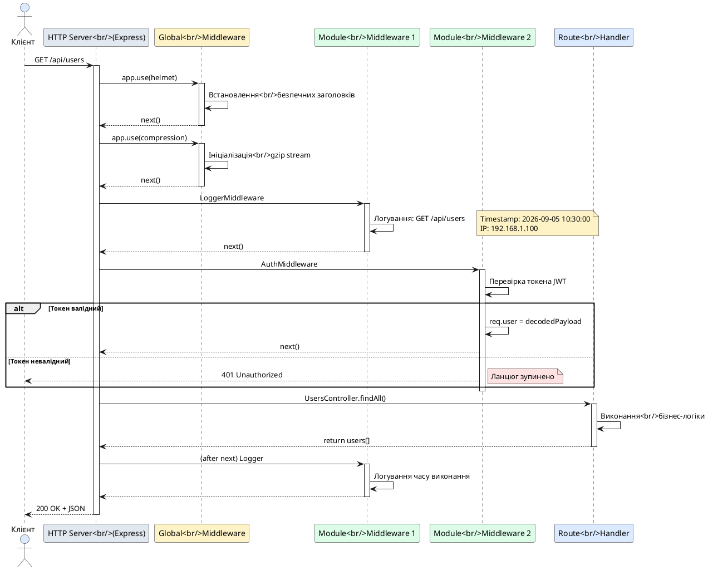

# Основи Middleware

::card-group

::card{title="🎯 Мета лекції" icon="i-lucide-target"}

- Зрозуміти концепцію Middleware (*проміжне програмне забезпечення*) як першого етапу Request Pipeline
- Опанувати анатомію middleware: сигнатуру функції, об'єкти `request`, `response` та колбек `next()`
- Навчитися створювати функціональні та класові middleware для обробки запитів на рівні застосунку
- Вивчити механізми реєстрації middleware: на рівні модуля через `configure()` та глобально через `app.use()`
- Засвоїти порядок виконання middleware та вплив виклику `next()` на ланцюг обробки
- Розуміти різницю між middleware NestJS та Express middleware та можливості їхньої взаємодії

::

::card{title="🔑 Ключові терміни" icon="i-lucide-key"}

- **Middleware** (*проміжне програмне забезпечення*): функція, що виконується між надходженням HTTP-запиту та викликом обробника маршруту
- **Request Object** (*об'єкт запиту*): об'єкт `req`, що містить інформацію про HTTP-запит (headers, body, query, params)
- **Response Object** (*об'єкт відповіді*): об'єкт `res` для відправлення HTTP-відповіді клієнту
- **Next Function** (*функція next*): колбек для передачі управління наступному middleware у ланцюгу
- **Middleware Chain** (*ланцюг middleware*): послідовність middleware функцій, що виконуються по черзі до досягнення обробника
- **Global Middleware** (*глобальний middleware*): middleware, зареєстрований на рівні застосунку та застосовується до всіх маршрутів
- **Route-Specific Middleware** (*маршрут-специфічний middleware*): middleware, застосований лише до певних шляхів або модулів

::

::

## Концепція Middleware: перший страж запиту

Middleware у NestJS є першим компонентом у конвеєрі обробки запитів (*Request Pipeline*), що отримує управління **до процесу маршрутизації**. На відміну від Guards, Interceptors та Pipes, які виконуються після того, як фреймворк визначив, який обробник контролера має бути викликано, middleware працює на **найнижчому рівні HTTP-стеку**, безпосередньо після прийняття з'єднання мережевим сервером (Express або Fastify).

Саме тому middleware ідеально підходить для операцій, що повинні виконуватися **для всіх запитів** незалежно від їхнього маршруту:

- **Логування запитів**: запис методу HTTP, URL, IP-адреси клієнта, часу надходження запиту
- **Парсинг тіла запиту**: перетворення сирих байтів у JSON, XML або form-urlencoded об'єкти
- **Обробка CORS**: додавання заголовків `Access-Control-Allow-Origin` для міжсайтових запитів
- **Автентифікація**: перевірка JWT-токенів, session cookies, API-ключів
- **Стиснення відповідей**: gzip/brotli компресія для зменшення обсягу переданих даних
- **Обмеження частоти запитів** (*rate limiting*): захист від DDoS та зловживання API

Middleware має повний доступ до **нативних об'єктів** Express або Fastify (`req`, `res`), що дозволяє виконувати низькорівневі операції: читання та модифікація заголовків, потокове читання тіла запиту, встановлення cookies, завершення запиту без виклику наступних компонентів pipeline.

::note
Middleware у NestJS базується на стандартному middleware Express (для платформи `@nestjs/platform-express`) або Fastify (`@nestjs/platform-fastify`). Це означає, що **будь-який існуючий Express middleware** можна використовувати в NestJS-застосунку без модифікацій. Наприклад, популярні пакети `helmet` (безпека), `morgan` (логування), `compression` (стиснення) працюють одразу після підключення.
::

## Анатомія Middleware: сигнатура функції

Middleware у NestJS може бути представлений у двох формах: як **функція** (*functional middleware*) або як **клас** (*class-based middleware*). Обидва підходи мають однакову сигнатуру та поведінку, але клас дозволяє використовувати Dependency Injection для впровадження сервісів.

### Функціональний Middleware

Найпростіша форма middleware — це функція з трьома параметрами:

```typescript
import { Request, Response, NextFunction } from 'express';

export function simpleMiddleware(
  req: Request,
  res: Response,
  next: NextFunction
) {
  console.log('Request received:', req.method, req.url);
  next(); // Передача управління далі
}
```

**Параметри функції:**

1. **`req: Request`** — об'єкт запиту з властивостями:
   - `req.method` — HTTP-метод (`GET`, `POST`, `PUT`, `DELETE`)
   - `req.url` — повний шлях запиту з query string (`/api/users?page=1`)
   - `req.path` — шлях без query string (`/api/users`)
   - `req.headers` — заголовки запиту (об'єкт ключ-значення)
   - `req.body` — тіло запиту (доступне після парсингу, наприклад, через `express.json()`)
   - `req.query` — об'єкт з параметрами query string
   - `req.params` — параметри маршруту (для динамічних сегментів URL)
   - `req.ip` — IP-адреса клієнта
   - `req.cookies` — cookies (потребує middleware `cookie-parser`)

2. **`res: Response`** — об'єкт відповіді з методами:
   - `res.status(code)` — встановлення статус-коду
   - `res.send(body)` — відправлення відповіді
   - `res.json(data)` — відправлення JSON-відповіді
   - `res.setHeader(name, value)` — встановлення заголовка
   - `res.cookie(name, value, options)` — встановлення cookie
   - `res.redirect(url)` — перенаправлення на інший URL

3. **`next: NextFunction`** — колбек для передачі управління наступному middleware або обробнику. **Виклик `next()` є обов'язковим**, якщо middleware не завершує обробку запиту через `res.send()` чи `res.json()`.

::warning
Якщо middleware **не викличе** `next()` і **не відправить відповідь** через `res.send()`, запит **зависне назавжди** (*request hangs*). Клієнт чекатиме до timeout, а сервер утримуватиме з'єднання. Це одна з найпоширеніших помилок при роботі з middleware.
::

### Класовий Middleware

Для складнішої логіки, що потребує впровадження сервісів через Dependency Injection, використовується класова форма:

```typescript
import { Injectable, NestMiddleware } from '@nestjs/common';
import { Request, Response, NextFunction } from 'express';

@Injectable()
export class LoggerMiddleware implements NestMiddleware {
  use(req: Request, res: Response, next: NextFunction) {
    console.log(`[${new Date().toISOString()}] ${req.method} ${req.url}`);
    next();
  }
}
```

**Ключові елементи класового middleware:**

1. **`@Injectable()`** — декоратор, що дозволяє використовувати Dependency Injection
2. **`implements NestMiddleware`** — інтерфейс, що вимагає реалізації методу `use(req, res, next)`
3. **Метод `use()`** — аналог функціонального middleware, має ту саму сигнатуру

### Middleware з Dependency Injection

Основна перевага класового middleware — можливість впровадження сервісів:

```typescript
import { Injectable, NestMiddleware } from '@nestjs/common';
import { Request, Response, NextFunction } from 'express';
import { LoggingService } from './logging.service';

@Injectable()
export class RequestLoggerMiddleware implements NestMiddleware {
  constructor(private readonly loggingService: LoggingService) {}

  use(req: Request, res: Response, next: NextFunction) {
    const logEntry = {
      timestamp: new Date().toISOString(),
      method: req.method,
      url: req.url,
      ip: req.ip,
      userAgent: req.get('user-agent'),
    };

    this.loggingService.logRequest(logEntry);
    next();
  }
}
```

У цьому прикладі `LoggingService` впроваджується через конструктор, що дозволяє зберігати логи у базу даних, файл або стороннє сховище (наприклад, Elasticsearch, Datadog).

::tip
Використовуйте **функціональний middleware** для простої логіки без залежностей (базове логування, встановлення заголовків). Використовуйте **класовий middleware** для складної логіки, що потребує взаємодії з сервісами, базами даних або зовнішніми API.
::

## Порядок виконання Middleware: ланцюг відповідальності

Middleware виконуються в **суворо визначеному порядку** — в тій послідовності, в якій вони зареєстровані. Кожен middleware вирішує, чи передати управління далі через `next()`, чи завершити обробку через відправлення відповіді.

### Приклад ланцюга виконання

```typescript
// Middleware 1: Логування
export function loggerMiddleware(req: Request, res: Response, next: NextFunction) {
  console.log('1. Logger: Request received');
  next(); // Передача управління до Middleware 2
  console.log('4. Logger: Response sent'); // Виконається після відправлення відповіді
}

// Middleware 2: Автентифікація
export function authMiddleware(req: Request, res: Response, next: NextFunction) {
  console.log('2. Auth: Checking token');
  const token = req.headers.authorization;
  
  if (!token) {
    console.log('3. Auth: No token, sending 401');
    return res.status(401).json({ message: 'Unauthorized' });
    // next() НЕ викликається — ланцюг зупинено
  }
  
  console.log('3. Auth: Token valid, proceeding');
  next(); // Передача до обробника контролера
}
```

**Консольний вивід для успішного запиту з токеном:**

```
1. Logger: Request received
2. Auth: Checking token
3. Auth: Token valid, proceeding
[Обробник контролера виконується]
4. Logger: Response sent
```

**Консольний вивід для запиту без токена:**

```
1. Logger: Request received
2. Auth: Checking token
3. Auth: No token, sending 401
```

::note
Middleware виконуються у **two-phase** режимі: спочатку всі middleware у прямому порядку (до виклику `next()`), потім у **зворотному порядку** після завершення обробки запиту (код після `next()`). Це дозволяє вимірювати час виконання запиту: зафіксувати час на початку, викликати `next()`, потім обчислити різницю після завершення.
::


## Реєстрація Middleware: прив'язка до маршрутів

На відміну від Guards та Pipes, які можна застосовувати через декоратори (`@UseGuards()`, `@UsePipes()`), middleware реєструються через метод `configure()` у класі модуля. Це пов'язано з тим, що middleware працює на рівні HTTP-стеку **до процесу маршрутизації**, тому фреймворк має налаштувати їх ще до створення екземплярів контролерів.

### Реєстрація на рівні модуля

Для реєстрації middleware модуль повинен імплементувати інтерфейс `NestModule` та визначити метод `configure()`:

```typescript
import { Module, NestModule, MiddlewareConsumer } from '@nestjs/common';
import { UsersController } from './users.controller';
import { UsersService } from './users.service';
import { LoggerMiddleware } from './logger.middleware';

@Module({
  controllers: [UsersController],
  providers: [UsersService],
})
export class UsersModule implements NestModule {
  configure(consumer: MiddlewareConsumer) {
    consumer
      .apply(LoggerMiddleware)
      .forRoutes('users'); // Застосувати до всіх маршрутів, що починаються з /users
  }
}
```

**Параметр `consumer: MiddlewareConsumer`** надає fluent API для налаштування middleware:

- **`apply(...middlewares)`** — вказує, які middleware застосувати (можна передати кілька через кому)
- **`forRoutes(...routes)`** — визначає, до яких маршрутів прив'язати middleware

### Фільтрація маршрутів: специфічні шляхи

Можна застосовувати middleware лише до певних шляхів:

```typescript
configure(consumer: MiddlewareConsumer) {
  consumer
    .apply(AuthMiddleware)
    .forRoutes('users/profile', 'users/settings'); // Лише для /users/profile та /users/settings
}
```

### Фільтрація за HTTP-методом

Застосування middleware лише до певних методів:

```typescript
import { RequestMethod } from '@nestjs/common';

configure(consumer: MiddlewareConsumer) {
  consumer
    .apply(AuthMiddleware)
    .forRoutes(
      { path: 'users', method: RequestMethod.POST },
      { path: 'users/:id', method: RequestMethod.DELETE }
    );
  // Middleware виконається лише для POST /users та DELETE /users/:id
}
```

**Доступні методи:**

- `RequestMethod.GET`
- `RequestMethod.POST`
- `RequestMethod.PUT`
- `RequestMethod.PATCH`
- `RequestMethod.DELETE`
- `RequestMethod.ALL` — всі методи

### Прив'язка до контролера

Замість рядкових шляхів можна вказати класи контролерів:

```typescript
configure(consumer: MiddlewareConsumer) {
  consumer
    .apply(LoggerMiddleware)
    .forRoutes(UsersController); // Застосувати до всіх маршрутів UsersController
}
```

Це зручніше, оскільки при зміні префікса контролера (`@Controller('users')` → `@Controller('api/v2/users')`) middleware автоматично застосується до нового шляху.

### Виключення маршрутів

Можна виключити певні шляхи з обробки middleware:

```typescript
configure(consumer: MiddlewareConsumer) {
  consumer
    .apply(AuthMiddleware)
    .exclude(
      { path: 'users/public', method: RequestMethod.GET },
      'users/health' // Виключити GET /users/public та будь-які методи /users/health
    )
    .forRoutes(UsersController);
}
```

У цьому прикладі `AuthMiddleware` застосується до **всіх маршрутів** `UsersController`, **крім** `/users/public` (GET) та `/users/health` (всі методи).

::tip
Використовуйте `.exclude()` для створення **публічних ендпоінтів** у захищених контролерах. Наприклад, весь API вимагає автентифікації, але маршрути реєстрації (`POST /auth/register`) та логіну (`POST /auth/login`) мають бути доступні без токена.
::

### Застосування кількох middleware

Можна зареєструвати кілька middleware, які виконуватимуться послідовно:

```typescript
configure(consumer: MiddlewareConsumer) {
  consumer
    .apply(LoggerMiddleware, CorsMiddleware, AuthMiddleware)
    .forRoutes('*'); // До всіх маршрутів
}
```

**Порядок виконання:** `LoggerMiddleware` → `CorsMiddleware` → `AuthMiddleware` → обробник контролера.

Альтернативний синтаксис для складних конфігурацій:

```typescript
configure(consumer: MiddlewareConsumer) {
  // Логування для всіх маршрутів
  consumer
    .apply(LoggerMiddleware)
    .forRoutes('*');
  
  // Автентифікація лише для захищених маршрутів
  consumer
    .apply(AuthMiddleware)
    .exclude('auth/login', 'auth/register')
    .forRoutes('*');
  
  // CORS лише для API
  consumer
    .apply(CorsMiddleware)
    .forRoutes('api/*');
}
```

## Глобальний Middleware: app.use()

Для middleware, що повинен виконуватися **для всіх запитів без винятку** (наприклад, логування, парсинг JSON, CORS), існує спрощений спосіб реєстрації через метод `app.use()` у файлі `main.ts`.

### Реєстрація глобального middleware

```typescript
import { NestFactory } from '@nestjs/core';
import { AppModule } from './app.module';
import * as compression from 'compression';
import helmet from 'helmet';
import { loggerMiddleware } from './common/middleware/logger.middleware';

async function bootstrap() {
  const app = await NestFactory.create(AppModule);

  // Глобальні middleware
  app.use(loggerMiddleware); // Кастомний функціональний middleware
  app.use(helmet()); // Безпека: встановлення HTTP-заголовків
  app.use(compression()); // Стиснення відповідей

  await app.listen(3000);
}
bootstrap();
```

**Обмеження глобального middleware:**

1. **Неможливо використовувати Dependency Injection**: глобальні middleware не мають доступу до контейнера залежностей NestJS, оскільки реєструються на рівні Express/Fastify **до ініціалізації модулів**
2. **Неможливо застосовувати фільтри маршрутів**: middleware виконується для **всіх** запитів без можливості виключення шляхів

::note
Глобальні middleware через `app.use()` виконуються **раніше**, ніж middleware, зареєстровані через `configure()` у модулях. Порядок виконання:

1. Глобальні middleware з `main.ts` (`app.use()`)
2. Модульні middleware з `configure()` (в порядку реєстрації модулів)
3. Guards → Interceptors → Pipes → Обробник
::

### Express-сумісні middleware

Оскільки NestJS за замовчуванням використовує Express як HTTP-платформу, будь-який Express middleware можна використовувати напряму:

```typescript
import * as morgan from 'morgan'; // HTTP request logger
import * as cookieParser from 'cookie-parser';
import * as session from 'express-session';

async function bootstrap() {
  const app = await NestFactory.create(AppModule);

  app.use(morgan('combined')); // Логування запитів у Apache Combined Log Format
  app.use(cookieParser('secret-key')); // Парсинг підписаних cookies
  app.use(
    session({
      secret: 'my-secret',
      resave: false,
      saveUninitialized: false,
    })
  );

  await app.listen(3000);
}
```

**Популярні Express middleware для NestJS:**

| Пакет | Призначення |
|-------|-------------|
| `helmet` | Встановлення безпечних HTTP-заголовків (Content-Security-Policy, X-Frame-Options) |
| `compression` | Gzip/Brotli стиснення відповідей для зменшення трафіку |
| `morgan` | Логування HTTP-запитів у стандартних форматах (Apache, Nginx) |
| `cookie-parser` | Парсинг cookies з заголовка `Cookie` |
| `express-session` | Управління сесіями на стороні сервера |
| `cors` | Обробка Cross-Origin Resource Sharing (CORS) |
| `body-parser` | Парсинг тіла запиту (JSON, URL-encoded, multipart) |

::warning
Middleware `body-parser` для JSON та URL-encoded форм **вже вбудований** у NestJS за замовчуванням. Не потрібно підключати `body-parser` вручну, якщо не використовуєте спеціальні формати (наприклад, XML).
::

## Передача даних між Middleware та обробниками

Middleware може **розширювати об'єкт `request`** додатковими властивостями, які будуть доступні в подальших middleware, guards та обробниках контролерів.

### Додавання властивостей до request

```typescript
import { Injectable, NestMiddleware } from '@nestjs/common';
import { Request, Response, NextFunction } from 'express';

@Injectable()
export class AddRequestIdMiddleware implements NestMiddleware {
  use(req: Request, res: Response, next: NextFunction) {
    // Генерація унікального ідентифікатора запиту
    req['requestId'] = `${Date.now()}-${Math.random().toString(36).substr(2, 9)}`;
    next();
  }
}
```

### Використання розширеного request у контролері

```typescript
import { Controller, Get, Req } from '@nestjs/common';
import { Request } from 'express';

@Controller('users')
export class UsersController {
  @Get()
  findAll(@Req() req: Request) {
    console.log('Request ID:', req['requestId']);
    return { requestId: req['requestId'] };
  }
}
```

### Типобезпечне розширення Request

Для типобезпечності створіть інтерфейс розширення:

```typescript
// types/express.d.ts
import { Request } from 'express';

declare module 'express' {
  export interface Request {
    requestId?: string;
    user?: {
      id: number;
      email: string;
      roles: string[];
    };
  }
}
```

Після цього TypeScript буде автоматично розпізнавати нові властивості:

```typescript
@Get()
findAll(@Req() req: Request) {
  const requestId: string | undefined = req.requestId; // Типізовано
  const userId: number | undefined = req.user?.id; // Типізовано
}
```

::tip
Розширення `request` є стандартним механізмом для передачі даних автентифікації через middleware. Наприклад, JWT middleware розшифровує токен та прикріплює об'єкт користувача до `req.user`, який потім використовується в Guards для перевірки прав доступу.
::


## Асинхронний Middleware

Middleware може бути асинхронним, що дозволяє виконувати операції з базою даних, зовнішніми API або файловою системою:

```typescript
import { Injectable, NestMiddleware } from '@nestjs/common';
import { Request, Response, NextFunction } from 'express';
import { AuthService } from '../auth/auth.service';

@Injectable()
export class JwtAuthMiddleware implements NestMiddleware {
  constructor(private readonly authService: AuthService) {}

  async use(req: Request, res: Response, next: NextFunction) {
    const token = req.headers.authorization?.replace('Bearer ', '');

    if (!token) {
      return res.status(401).json({ message: 'No token provided' });
    }

    try {
      // Асинхронна перевірка токена
      const payload = await this.authService.verifyToken(token);
      
      // Асинхронний запит до БД для отримання користувача
      const user = await this.authService.getUserById(payload.sub);
      
      if (!user) {
        return res.status(401).json({ message: 'User not found' });
      }

      // Прикріплення користувача до request
      req.user = user;
      next();
    } catch (error) {
      return res.status(401).json({ message: 'Invalid token' });
    }
  }
}
```

**Важливі аспекти асинхронних middleware:**

1. **Метод `use()` позначений `async`**: це дозволяє використовувати `await` для асинхронних операцій
2. **Обробка помилок через try-catch**: виключення в асинхронному коді не перехоплюються автоматично, тому потрібна явна обробка
3. **Виклик `next()` після завершення**: `next()` викликається після успішного виконання асинхронної логіки

::caution
Асинхронні middleware **блокують обробку запиту** до завершення операції. Якщо запит до бази даних займає 200 мс, запит чекатиме 200 мс перед викликом обробника контролера. Для високонавантажених систем розгляньте винесення складної логіки в Guards або використання кешування результатів перевірок.
::

## Візуалізація порядку виконання Middleware

Розглянемо приклад застосунку з кількома middleware для розуміння повного ланцюга виконання:

::plant-uml{alt="Порядок виконання Middleware у Request Pipeline"}



::

**Ключові спостереження з діаграми:**

1. **Глобальні middleware виконуються першими** — `helmet` та `compression` обробляються на рівні Express до будь-якої логіки NestJS
2. **Модульні middleware виконуються в порядку реєстрації** — `LoggerMiddleware` перед `AuthMiddleware`
3. **Middleware можуть припинити обробку** — якщо `AuthMiddleware` виявить невалідний токен, обробник не викликається
4. **Код після `next()` виконується у зворотному порядку** — це дозволяє логувати фінальний час виконання

## Відмінності від Guards та Interceptors

Часто виникає плутанина між Middleware, Guards та Interceptors, оскільки всі три компоненти можуть виконувати автентифікацію та авторизацію. Проте кожен має свою зону відповідальності:

::code-group

```typescript [Middleware: JWT автентифікація]
@Injectable()
export class JwtAuthMiddleware implements NestMiddleware {
  constructor(private authService: AuthService) {}

  async use(req: Request, res: Response, next: NextFunction) {
    const token = req.headers.authorization?.replace('Bearer ', '');
    
    if (token) {
      try {
        const user = await this.authService.verifyToken(token);
        req.user = user; // Прикріплюємо користувача
      } catch {}
    }
    
    next(); // Завжди пропускаємо далі (навіть без токена)
  }
}
```

```typescript [Guard: Авторизація за ролями]
@Injectable()
export class RolesGuard implements CanActivate {
  constructor(private reflector: Reflector) {}

  canActivate(context: ExecutionContext): boolean {
    const requiredRoles = this.reflector.get<string[]>(
      'roles',
      context.getHandler()
    );
    
    if (!requiredRoles) {
      return true; // Немає обмежень
    }

    const request = context.switchToHttp().getRequest();
    const user = request.user;

    // Блокуємо доступ, якщо роль не відповідає
    return requiredRoles.some(role => user?.roles?.includes(role));
  }
}
```

```typescript [Interceptor: Трансформація відповіді]
@Injectable()
export class TransformInterceptor implements NestInterceptor {
  intercept(context: ExecutionContext, next: CallHandler): Observable<any> {
    return next.handle().pipe(
      map(data => ({
        success: true,
        timestamp: new Date().toISOString(),
        data, // Обгортаємо відповідь у стандартний формат
      }))
    );
  }
}
```

::

**Порівняльна таблиця:**

| Компонент | Етап виконання | Доступ до метаданих | Можливість блокувати запит | Типове призначення |
|-----------|----------------|---------------------|----------------------------|-------------------|
| **Middleware** | До маршрутизації | ❌ Ні (не знає про обробник) | ✅ Так (через `res.send()`) | Логування, парсинг, CORS, автентифікація |
| **Guard** | Після маршрутизації, до обробника | ✅ Так (ExecutionContext) | ✅ Так (через `false`) | Авторизація, перевірка прав доступу |
| **Interceptor** | До та після обробника | ✅ Так (ExecutionContext) | ✅ Так (через виключення) | Трансформація відповідей, кешування, логування часу |

::tip
**Загальне правило вибору:**

- Використовуйте **Middleware** для операцій, що **не залежать від конкретного маршруту** (логування всіх запитів, глобальна автентифікація)
- Використовуйте **Guards** для **авторизації доступу** до конкретних обробників на основі метаданих (ролі, права, підписки)
- Використовуйте **Interceptors** для **трансформації даних** (обгортання відповідей, кешування, логування часу виконання)
::

## Middleware для різних HTTP-платформ

NestJS підтримує дві HTTP-платформи: **Express** (за замовчуванням) та **Fastify** (високопродуктивна альтернатива). Сигнатура middleware залежить від обраної платформи.

### Express Middleware (за замовчуванням)

```typescript
import { Request, Response, NextFunction } from 'express';

export function expressMiddleware(req: Request, res: Response, next: NextFunction) {
  console.log('Express middleware');
  next();
}
```

### Fastify Middleware

```typescript
import { FastifyRequest, FastifyReply } from 'fastify';

export function fastifyMiddleware(
  req: FastifyRequest,
  res: FastifyReply,
  next: () => void
) {
  console.log('Fastify middleware');
  next();
}
```

**Основні відмінності Fastify:**

1. **Типи:** `FastifyRequest` та `FastifyReply` замість `Request` та `Response`
2. **API відповіді:** `res.send(data)` замість `res.json(data)` або `res.send(data)`
3. **Продуктивність:** Fastify швидший на 20-30% за Express завдяки оптимізації маршрутизації та серіалізації JSON

::note
Більшість Express middleware **несумісні** з Fastify. Для Fastify існують окремі аналоги: `@fastify/helmet`, `@fastify/cors`, `@fastify/compress`. Перед міграцією на Fastify переконайтеся, що всі ваші middleware мають Fastify-сумісні версії.
::

## Обробка помилок у Middleware

Middleware повинен коректно обробляти виключення, щоб не порушити стабільність застосунку:

### Синхронна обробка помилок

```typescript
export function parseHeaderMiddleware(req: Request, res: Response, next: NextFunction) {
  try {
    const customHeader = req.headers['x-custom-data'] as string;
    req['parsedData'] = JSON.parse(customHeader);
    next();
  } catch (error) {
    // Відправлення помилки клієнту
    return res.status(400).json({
      message: 'Invalid X-Custom-Data header',
      error: error.message,
    });
  }
}
```

### Асинхронна обробка помилок

```typescript
@Injectable()
export class DatabaseCheckMiddleware implements NestMiddleware {
  constructor(private databaseService: DatabaseService) {}

  async use(req: Request, res: Response, next: NextFunction) {
    try {
      const isConnected = await this.databaseService.ping();
      
      if (!isConnected) {
        return res.status(503).json({
          message: 'Service Unavailable: Database connection failed',
        });
      }

      next();
    } catch (error) {
      return res.status(500).json({
        message: 'Internal Server Error',
        error: error.message,
      });
    }
  }
}
```

::warning
Якщо middleware викидає **неперехоплене виключення** (без `try-catch`), Express/Fastify передасть помилку в глобальний обробник помилок. Проте це **не** буде оброблено Exception Filters NestJS, оскільки middleware виконується **до входу в NestJS pipeline**. Завжди обробляйте помилки явно у middleware через `try-catch` або використовуйте Guards для логіки, що може викинути виключення.
::


## Передача управління через next(): поглиблений аналіз

Функція `next()` є центральним механізмом ланцюга middleware. Її поведінка визначає, чи буде запит оброблено далі, чи зупиниться на поточному middleware.

### Три сценарії виклику next()

```typescript
export function middlewareScenarios(req: Request, res: Response, next: NextFunction) {
  // Сценарій 1: Успішна передача управління
  console.log('Processing request');
  next(); // Запит продовжує рух по pipeline
  console.log('This will execute AFTER response is sent');

  // Сценарій 2: Передача помилки наступному обробнику помилок
  // next(new Error('Something went wrong')); // Express викличе error handler

  // Сценарій 3: Завершення запиту без виклику next()
  // res.status(200).json({ message: 'Completed' });
  // return; // Ланцюг зупинено, обробник контролера НЕ викликається
}
```

**Детальний розбір сценаріїв:**

1. **Виклик `next()` без аргументів** — управління передається наступному middleware або обробнику. Код після `next()` виконається **після завершення всього ланцюга** (це дозволяє реалізувати post-processing логіку).

2. **Виклик `next(error)` з об'єктом помилки** — управління передається в Express error handler (middleware з сигнатурою `(err, req, res, next)`). NestJS Exception Filters **не перехоплюють** помилки з `next(error)`, оскільки це відбувається на рівні Express.

3. **Відправлення відповіді через `res.send()` без `next()`** — ланцюг зупиняється, обробник контролера не викликається. Це використовується для раннього завершення обробки (наприклад, при невалідному токені).

### Middleware з логікою до та після обробника

```typescript
@Injectable()
export class TimingMiddleware implements NestMiddleware {
  use(req: Request, res: Response, next: NextFunction) {
    const startTime = Date.now();

    // Логіка ДО виклику обробника
    console.log(`[${req.method}] ${req.url} - Start`);

    // Перехоплення події завершення відповіді
    res.on('finish', () => {
      // Логіка ПІСЛЯ відправлення відповіді
      const duration = Date.now() - startTime;
      console.log(`[${req.method}] ${req.url} - Completed in ${duration}ms`);
    });

    next(); // Передача управління далі
  }
}
```

**Консольний вивід:**

```
[GET] /api/users - Start
[GET] /api/users - Completed in 45ms
```

::note
Використання події `res.on('finish')` є **єдиним способом** коректно виміряти час виконання запиту у middleware, оскільки код після `next()` виконується одразу після виклику `next()`, а **не** після завершення обробки запиту. Подія `finish` емітується Express/Fastify після відправлення останнього байта відповіді клієнту.
::

## Практичний приклад: повний життєвий цикл запиту

Створімо реалістичний приклад з кількома middleware для розуміння повної картини:

```typescript
// 1. Глобальний middleware для логування (main.ts)
function globalLoggerMiddleware(req: Request, res: Response, next: NextFunction) {
  console.log('1. Global: Request received');
  next();
}

// 2. Модульний middleware для встановлення Request ID
@Injectable()
export class RequestIdMiddleware implements NestMiddleware {
  use(req: Request, res: Response, next: NextFunction) {
    req['requestId'] = `req-${Date.now()}`;
    console.log('2. RequestId:', req['requestId']);
    next();
  }
}

// 3. Модульний middleware для автентифікації
@Injectable()
export class AuthMiddleware implements NestMiddleware {
  constructor(private authService: AuthService) {}

  async use(req: Request, res: Response, next: NextFunction) {
    console.log('3. Auth: Checking token');
    const token = req.headers.authorization;

    if (!token) {
      console.log('3. Auth: No token, blocking request');
      return res.status(401).json({ message: 'Unauthorized' });
    }

    try {
      const user = await this.authService.verifyToken(token);
      req.user = user;
      console.log('3. Auth: Token valid, user:', user.email);
      next();
    } catch {
      return res.status(401).json({ message: 'Invalid token' });
    }
  }
}

// 4. Реєстрація у модулі
@Module({
  controllers: [UsersController],
  providers: [UsersService, AuthService, RequestIdMiddleware, AuthMiddleware],
})
export class UsersModule implements NestModule {
  configure(consumer: MiddlewareConsumer) {
    consumer
      .apply(RequestIdMiddleware, AuthMiddleware)
      .forRoutes(UsersController);
  }
}

// 5. Контролер
@Controller('users')
export class UsersController {
  @Get()
  findAll(@Req() req: Request) {
    console.log('4. Handler: Executing controller logic');
    return {
      requestId: req['requestId'],
      user: req.user.email,
      data: [{ id: 1, name: 'John' }],
    };
  }
}
```

**Консольний вивід успішного запиту:**

```
1. Global: Request received
2. RequestId: req-1725536400123
3. Auth: Checking token
3. Auth: Token valid, user: john@example.com
4. Handler: Executing controller logic
```

**Консольний вивід запиту без токена:**

```
1. Global: Request received
2. RequestId: req-1725536400456
3. Auth: Checking token
3. Auth: No token, blocking request
```

## Тестування Middleware

Middleware легко тестувати завдяки їхній ізольованості:

```typescript
import { Request, Response, NextFunction } from 'express';
import { RequestIdMiddleware } from './request-id.middleware';

describe('RequestIdMiddleware', () => {
  let middleware: RequestIdMiddleware;
  let mockRequest: Partial<Request>;
  let mockResponse: Partial<Response>;
  let nextFunction: NextFunction;

  beforeEach(() => {
    middleware = new RequestIdMiddleware();
    mockRequest = {};
    mockResponse = {};
    nextFunction = jest.fn();
  });

  it('should add requestId to request object', () => {
    middleware.use(
      mockRequest as Request,
      mockResponse as Response,
      nextFunction
    );

    expect(mockRequest['requestId']).toBeDefined();
    expect(typeof mockRequest['requestId']).toBe('string');
    expect(nextFunction).toHaveBeenCalled();
  });

  it('should generate unique requestIds', () => {
    const req1 = {} as Request;
    const req2 = {} as Request;

    middleware.use(req1, mockResponse as Response, jest.fn());
    middleware.use(req2, mockResponse as Response, jest.fn());

    expect(req1['requestId']).not.toBe(req2['requestId']);
  });
});
```

**Тестування middleware з Dependency Injection:**

```typescript
import { Test } from '@nestjs/testing';
import { AuthMiddleware } from './auth.middleware';
import { AuthService } from '../auth/auth.service';

describe('AuthMiddleware', () => {
  let middleware: AuthMiddleware;
  let authService: AuthService;

  beforeEach(async () => {
    const module = await Test.createTestingModule({
      providers: [
        AuthMiddleware,
        {
          provide: AuthService,
          useValue: {
            verifyToken: jest.fn(),
          },
        },
      ],
    }).compile();

    middleware = module.get<AuthMiddleware>(AuthMiddleware);
    authService = module.get<AuthService>(AuthService);
  });

  it('should attach user to request when token is valid', async () => {
    const mockUser = { id: 1, email: 'test@example.com' };
    jest.spyOn(authService, 'verifyToken').mockResolvedValue(mockUser);

    const mockReq = {
      headers: { authorization: 'Bearer valid-token' },
    } as any;
    const mockRes = {} as any;
    const nextFn = jest.fn();

    await middleware.use(mockReq, mockRes, nextFn);

    expect(mockReq.user).toEqual(mockUser);
    expect(nextFn).toHaveBeenCalled();
  });

  it('should return 401 when token is invalid', async () => {
    jest.spyOn(authService, 'verifyToken').mockRejectedValue(new Error('Invalid'));

    const mockReq = {
      headers: { authorization: 'Bearer invalid-token' },
    } as any;
    const mockRes = {
      status: jest.fn().mockReturnThis(),
      json: jest.fn(),
    } as any;
    const nextFn = jest.fn();

    await middleware.use(mockReq, mockRes, nextFn);

    expect(mockRes.status).toHaveBeenCalledWith(401);
    expect(mockRes.json).toHaveBeenCalledWith({ message: 'Invalid token' });
    expect(nextFn).not.toHaveBeenCalled();
  });
});
```

## Міграція з Express Middleware на NestJS

Якщо у вас є існуючий Express middleware, його можна легко інтегрувати:

::code-group

```typescript [Express Middleware (оригінал)]
// custom-logger.js (Express)
function customLogger(req, res, next) {
  console.log(`[${new Date().toISOString()}] ${req.method} ${req.url}`);
  next();
}

module.exports = customLogger;
```

```typescript [NestJS Функціональний (без DI)]
// custom-logger.middleware.ts
import { Request, Response, NextFunction } from 'express';

export function customLoggerMiddleware(
  req: Request,
  res: Response,
  next: NextFunction
) {
  console.log(`[${new Date().toISOString()}] ${req.method} ${req.url}`);
  next();
}

// Реєстрація
app.use(customLoggerMiddleware);
```

```typescript [NestJS Класовий (з DI)]
// custom-logger.middleware.ts
import { Injectable, NestMiddleware } from '@nestjs/common';
import { Request, Response, NextFunction } from 'express';
import { LoggerService } from './logger.service';

@Injectable()
export class CustomLoggerMiddleware implements NestMiddleware {
  constructor(private logger: LoggerService) {}

  use(req: Request, res: Response, next: NextFunction) {
    this.logger.log(`${req.method} ${req.url}`);
    next();
  }
}

// Реєстрація через configure()
```

::

## Підсумок: коли використовувати Middleware

::card-group

::card{title="Глобальна обробка" icon="i-lucide-globe"}

Використовуйте middleware для операцій, що повинні виконуватися **для всіх запитів**: логування, парсинг, CORS, стиснення.

::

::card{title="Низькорівневі операції" icon="i-lucide-layers"}

Middleware має доступ до нативних об'єктів Express/Fastify, що дозволяє виконувати операції, недоступні у Guards чи Interceptors: потокове читання тіла, модифікація заголовків.

::

::card{title="Автентифікація" icon="i-lucide-key"}

Middleware підходить для базової автентифікації (перевірка токена, прикріплення користувача до `request`). Авторизацію краще виконувати у Guards.

::

::card{title="Інтеграція зі сторонніми пакетами" icon="i-lucide-package"}

Будь-який Express middleware (`helmet`, `morgan`, `compression`) можна використовувати напряму через `app.use()`.

::

::

::accordion

::accordion-item{label="❓ Чи можна використовувати middleware для валідації тіла запиту?" icon="i-lucide-help-circle"}

Технічно так, але **не рекомендується**. Middleware не має доступу до метаданих обробника (DTO-класів), тому валідацію краще виконувати через `ValidationPipe` та `class-validator`. Middleware підходить для базових перевірок (наявність токена, формат заголовків), але не для складної валідації структур даних.

::

::accordion-item{label="❓ Чому middleware не має доступу до ExecutionContext?" icon="i-lucide-help-circle"}

Middleware виконується **до процесу маршрутизації**, коли NestJS ще не визначив, який контролер і метод буде викликано. `ExecutionContext` стає доступним лише після маршрутизації — у Guards, Interceptors та Pipes. Саме тому middleware не може інспектувати метадані через `Reflector`.

::

::accordion-item{label="❓ Як middleware співвідноситься з Express app.use()?" icon="i-lucide-help-circle"}

Middleware, зареєстровані через `app.use()` у `main.ts`, є **глобальними Express middleware** і виконуються **раніше** за модульні NestJS middleware з `configure()`. Порядок виконання:

1. Глобальні Express middleware (`app.use()`)
2. Модульні NestJS middleware (`configure()`)
3. Guards → Interceptors → Pipes → Handler

::

::

У наступній лекції ми розглянемо **практичні приклади Middleware** для реальних задач: логування запитів, вимірювання часу виконання, обмеження частоти запитів (rate limiting), та інтеграцію зі сторонніми пакетами.

