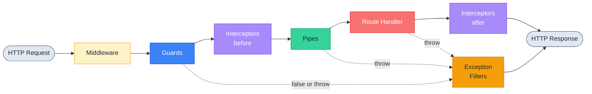
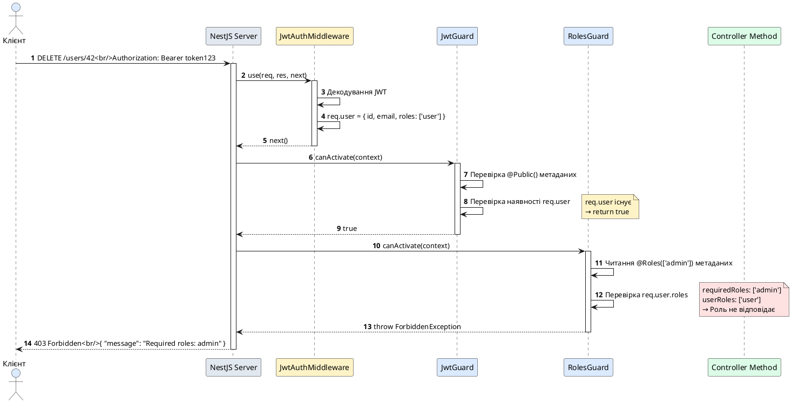

# Guards: захисні перехоплювачі доступу

::card-group

::card{title="🎯 Мета лекції" icon="i-lucide-target"}

- Зрозуміти концепцію Guards (*захисні перехоплювачі*) як компонентів авторизації у Request Pipeline
- Опанувати інтерфейс `CanActivate` та його метод `canActivate()` для прийняття рішень про доступ
- Навчитися працювати з `ExecutionContext` для отримання метаданих про запит та обробник
- Вивчити механізми застосування Guards: декоратор `@UseGuards()` на рівні методу, контролера та глобально
- Засвоїти різницю між поверненням `false` (403 Forbidden) та викиданням виключень (401 Unauthorized)
- Розуміти місце Guards у Request Pipeline: після Middleware, до Interceptors та Pipes
- Практикувати використання `Reflector` для читання метаданих, прикріплених через кастомні декоратори

::

::card{title="🔑 Ключові терміни" icon="i-lucide-key"}

- **Guard** (*захисний перехоплювач*): компонент, що приймає рішення про дозвіл або блокування виконання запиту
- **CanActivate** (*інтерфейс активації*): інтерфейс з методом `canActivate()`, який повертає `boolean` або `Promise<boolean>`
- **ExecutionContext** (*контекст виконання*): об'єкт з метаданими про поточний запит, обробник та його декоратори
- **Authorization** (*авторизація*): перевірка прав доступу користувача до ресурсу на основі ролей, дозволів або бізнес-правил
- **Reflector** (*рефлектор*): сервіс для читання метаданих, встановлених через `@SetMetadata()` або кастомні декоратори
- **UnauthorizedException** (*виключення неавтентифікованості*): виключення зі статус-кодом 401 для відсутньої автентифікації
- **ForbiddenException** (*виключення заборони доступу*): виключення зі статус-кодом 403 для недостатніх прав доступу

::

::

## Концепція Guards: страж авторизації

Guards у NestJS виконують роль **другого ешелону захисту** у Request Pipeline, розташовуючись між Middleware та Interceptors. На відміну від Middleware, що працює **до маршрутизації** і не має інформації про цільовий обробник, Guards виконуються **після маршрутизації** та мають повний доступ до метаданих обробника через `ExecutionContext`.

Основна відповідальність Guards — **авторизація**: прийняття рішення про те, чи має поточний користувач **право** виконати певну операцію. Guards не займаються автентифікацією (перевіркою ідентичності) — це робота Middleware або Passport.js стратегій. Guards лише відповідають на запитання: **«Чи дозволено цьому автентифікованому користувачу виконати цю дію?»**

Типові сценарії використання Guards:

- **Перевірка ролей** (*Role-Based Access Control, RBAC*): дозволити доступ лише адміністраторам або модераторам
- **Перевірка дозволів** (*Permission-Based Access Control*): перевірка конкретних прав (наприклад, `user:delete`, `post:publish`)
- **Власність ресурсу**: дозволити редагування лише автору посту чи власнику акаунта
- **Тарифні плани та підписки**: обмежити функціонал для безкоштовних користувачів
- **Географічні обмеження**: блокувати доступ з певних країн або IP-діапазонів
- **Часові обмеження**: дозволити доступ лише в робочі години або під час акції

::note
Guards у NestJS є реалізацією патерну **Strategy** для авторизації, де кожен guard інкапсулює окрему стратегію перевірки доступу. Це дозволяє комбінувати кілька guards для створення складних політик безпеки: наприклад, перевірити наявність токена (JwtGuard), потім перевірити роль (RolesGuard), потім перевірити власність ресурсу (OwnershipGuard).
::

## Анатомія Guard: інтерфейс CanActivate

Кожен guard реалізує інтерфейс `CanActivate`, що містить єдиний метод `canActivate()`. Цей метод отримує `ExecutionContext` та повертає `boolean` або `Promise<boolean>`:

```typescript
import { Injectable, CanActivate, ExecutionContext } from '@nestjs/common';

@Injectable()
export class SimpleGuard implements CanActivate {
  canActivate(context: ExecutionContext): boolean | Promise<boolean> {
    // true = дозволити виконання запиту
    // false = заблокувати запит (403 Forbidden)
    return true;
  }
}
```

**Ключові компоненти:**

1. **`@Injectable()`**: дозволяє використовувати Dependency Injection для впровадження сервісів
2. **`implements CanActivate`**: гарантує наявність методу `canActivate()`
3. **`context: ExecutionContext`**: об'єкт з метаданими про поточний запит
4. **Повернене значення**:
   - `true` — дозволити виконання запиту (передати управління далі в pipeline)
   - `false` — заблокувати запит (NestJS автоматично викине `ForbiddenException` зі статус-кодом 403)

### Синхронний Guard

Для простих перевірок без асинхронних операцій:

```typescript
import { Injectable, CanActivate, ExecutionContext } from '@nestjs/common';

@Injectable()
export class MaintenanceGuard implements CanActivate {
  canActivate(context: ExecutionContext): boolean {
    const isMaintenanceMode = process.env.MAINTENANCE_MODE === 'true';
    
    if (isMaintenanceMode) {
      return false; // Блокувати всі запити під час обслуговування
    }
    
    return true;
  }
}
```

### Асинхронний Guard

Для перевірок, що потребують запитів до БД або зовнішніх API:

```typescript
import { Injectable, CanActivate, ExecutionContext } from '@nestjs/common';
import { UsersService } from '../users/users.service';

@Injectable()
export class ActiveUserGuard implements CanActivate {
  constructor(private usersService: UsersService) {}

  async canActivate(context: ExecutionContext): Promise<boolean> {
    const request = context.switchToHttp().getRequest();
    const userId = request.user?.id;

    if (!userId) {
      return false; // Немає автентифікації
    }

    // Асинхронний запит до БД
    const user = await this.usersService.findById(userId);
    
    // Перевірка статусу користувача
    return user?.isActive === true;
  }
}
```

::warning
Асинхронні guards **блокують обробку запиту** до завершення операції. Якщо запит до БД займає 200 мс, запит чекатиме 200 мс перед викликом обробника. Для оптимізації використовуйте:
- **Кешування результатів** перевірок у Redis з TTL 5-15 хвилин
- **Денормалізацію даних** у JWT-токені (ролі, статус користувача)
- **Lazy loading** — перевіряти статус лише для критичних операцій, а не для кожного запиту
::

## ExecutionContext: вікно у метадані запиту

`ExecutionContext` є центральним об'єктом, що надає Guards доступ до інформації про поточний запит та цільовий обробник. Це розширення стандартного `ArgumentsHost` з додатковими методами для роботи з метаданими.

### Основні методи ExecutionContext

```typescript
@Injectable()
export class InspectionGuard implements CanActivate {
  canActivate(context: ExecutionContext): boolean {
    // 1. Отримання HTTP-запиту та відповіді
    const http = context.switchToHttp();
    const request = http.getRequest<Request>();
    const response = http.getResponse<Response>();

    console.log('Method:', request.method);
    console.log('URL:', request.url);
    console.log('User:', request.user);

    // 2. Отримання класу обробника (контролера)
    const handlerClass = context.getClass();
    console.log('Controller:', handlerClass.name);

    // 3. Отримання методу обробника
    const handlerMethod = context.getHandler();
    console.log('Handler method:', handlerMethod.name);

    // 4. Тип контексту (http, rpc, ws)
    const contextType = context.getType();
    console.log('Context type:', contextType); // 'http'

    return true;
  }
}
```

**Приклад консольного виводу:**

::terminal-preview{title="Guard Inspection Output" :cursor="false"}

<div class="line"><span class="text-blue-400 font-bold">Method:</span> GET</div>
<div class="line"><span class="text-blue-400 font-bold">URL:</span> /api/users/42</div>
<div class="line"><span class="text-blue-400 font-bold">User:</span> { id: 123, email: 'john@example.com', roles: ['user'] }</div>
<div class="line"><span class="text-blue-400 font-bold">Controller:</span> UsersController</div>
<div class="line"><span class="text-blue-400 font-bold">Handler method:</span> findOne</div>
<div class="line"><span class="text-blue-400 font-bold">Context type:</span> http</div>

::

### Структура ExecutionContext

```typescript
interface ExecutionContext {
  // Перемикання контексту (HTTP, WebSocket, Microservice)
  switchToHttp(): HttpArgumentsHost;
  switchToRpc(): RpcArgumentsHost;
  switchToWs(): WsArgumentsHost;

  // Отримання класу контролера
  getClass<T = any>(): Type<T>;

  // Отримання методу обробника
  getHandler(): Function;

  // Тип контексту ('http' | 'rpc' | 'ws')
  getType<TContext extends string = ContextType>(): TContext;

  // Аргументи обробника (для HTTP: [request, response, next])
  getArgs<T extends Array<any> = any[]>(): T;
  getArgByIndex<T = any>(index: number): T;
}
```

::tip
`ExecutionContext` є універсальним інтерфейсом для різних типів застосунків: HTTP REST API, WebSocket-сервери, gRPC мікросервіси. Метод `switchToHttp()` перетворює контекст у HTTP-специфічний формат, дозволяючи отримати `request` та `response`. Для WebSocket використовуйте `switchToWs()`, для мікросервісів — `switchToRpc()`.
::

## Повернення false vs викидання виключень

Guards мають два способи заблокувати запит: повернути `false` або викинути виключення. Кожен спосіб має свою семантику та статус-код відповіді.

### Повернення false: 403 Forbidden

Коли guard повертає `false`, NestJS автоматично викидає `ForbiddenException` зі статус-кодом **403**:

```typescript
@Injectable()
export class RolesGuard implements CanActivate {
  canActivate(context: ExecutionContext): boolean {
    const request = context.switchToHttp().getRequest();
    const user = request.user;

    // Користувач автентифікований, але не має прав
    if (!user?.roles?.includes('admin')) {
      return false; // → 403 Forbidden
    }

    return true;
  }
}
```

**HTTP-відповідь при `return false`:**

```http
HTTP/1.1 403 Forbidden
Content-Type: application/json

{
  "statusCode": 403,
  "message": "Forbidden resource",
  "error": "Forbidden"
}
```

### Викидання виключень: кастомні повідомлення

Для контролю над повідомленням помилки викидайте виключення явно:

```typescript
import { Injectable, CanActivate, ExecutionContext, ForbiddenException } from '@nestjs/common';

@Injectable()
export class RolesGuard implements CanActivate {
  canActivate(context: ExecutionContext): boolean {
    const request = context.switchToHttp().getRequest();
    const user = request.user;

    if (!user?.roles?.includes('admin')) {
      throw new ForbiddenException(
        'Only administrators can access this resource'
      );
    }

    return true;
  }
}
```

**HTTP-відповідь з кастомним повідомленням:**

```http
HTTP/1.1 403 Forbidden
Content-Type: application/json

{
  "statusCode": 403,
  "message": "Only administrators can access this resource",
  "error": "Forbidden"
}
```

### 401 Unauthorized vs 403 Forbidden

Використовуйте правильний статус-код залежно від причини блокування:

::code-group

```typescript [401 Unauthorized: немає автентифікації]
@Injectable()
export class JwtGuard implements CanActivate {
  canActivate(context: ExecutionContext): boolean {
    const request = context.switchToHttp().getRequest();
    
    if (!request.user) {
      // Користувач НЕ автентифікований (немає токена або токен невалідний)
      throw new UnauthorizedException('Authentication required');
    }
    
    return true;
  }
}
```

```typescript [403 Forbidden: недостатньо прав]
@Injectable()
export class AdminGuard implements CanActivate {
  canActivate(context: ExecutionContext): boolean {
    const request = context.switchToHttp().getRequest();
    const user = request.user;
    
    if (!user?.roles?.includes('admin')) {
      // Користувач автентифікований, але НЕ має прав адміністратора
      throw new ForbiddenException('Admin access required');
    }
    
    return true;
  }
}
```

::

**Семантична різниця:**

| Статус-код | Причина | Дія клієнта |
|------------|---------|-------------|
| **401 Unauthorized** | Користувач **не автентифікований** (немає токена, токен прострочений) | Перенаправити на сторінку логіну або оновити токен |
| **403 Forbidden** | Користувач **автентифікований**, але **не має прав** на ресурс | Показати повідомлення «Доступ заборонено», змінити інтерфейс |

::note
Назва `UnauthorizedException` є **історичною неточністю** HTTP-специфікації. Статус-код 401 насправді означає **unauthenticated** («неавтентифікований»), а не «неавторизований». Правильна інтерпретація:
- **401 Unauthorized** = «Хто ти? Ідентифікуйся!» (немає автентифікації)
- **403 Forbidden** = «Я знаю, хто ти, але тобі заборонено» (є автентифікація, немає авторизації)
::


## Застосування Guards: декоратор @UseGuards()

Guards застосовуються через декоратор `@UseGuards()` на трьох рівнях: метод обробника, контролер або глобально. Порядок виконання guards залежить від порядку їх оголошення у декораторі.

### Застосування на рівні методу

Найточніший контроль — застосування guard до конкретного методу:

```typescript
import { Controller, Get, UseGuards } from '@nestjs/common';
import { AdminGuard } from './guards/admin.guard';

@Controller('users')
export class UsersController {
  @Get()
  findAll() {
    return 'Доступно для всіх';
  }

  @Get('admin-only')
  @UseGuards(AdminGuard) // Застосувати лише до цього методу
  adminPanel() {
    return 'Доступно лише адміністраторам';
  }
}
```

У цьому прикладі `AdminGuard` виконується **лише** для запиту `GET /users/admin-only`, але не для `GET /users`.

### Застосування на рівні контролера

Для захисту всіх методів контролера:

```typescript
import { Controller, Get, Post, UseGuards } from '@nestjs/common';
import { JwtGuard } from './guards/jwt.guard';

@Controller('profile')
@UseGuards(JwtGuard) // Застосувати до всіх методів контролера
export class ProfileController {
  @Get()
  getProfile() {
    return 'Профіль користувача';
  }

  @Post('update')
  updateProfile() {
    return 'Оновлення профілю';
  }
}
```

Тепер `JwtGuard` виконується для **всіх** методів `ProfileController`: `GET /profile` та `POST /profile/update`.

### Комбінація guards на різних рівнях

Guards можна застосовувати на кількох рівнях одночасно — вони виконуються **послідовно**:

```typescript
import { Controller, Get, Post, UseGuards } from '@nestjs/common';
import { JwtGuard } from './guards/jwt.guard';
import { RolesGuard } from './guards/roles.guard';

@Controller('admin')
@UseGuards(JwtGuard) // Глобальний для контролера
export class AdminController {
  @Get('dashboard')
  getDashboard() {
    return 'Дашборд адміністратора';
  }

  @Post('delete-user')
  @UseGuards(RolesGuard) // Додатковий guard для цього методу
  deleteUser() {
    return 'Видалення користувача';
  }
}
```

**Порядок виконання для `POST /admin/delete-user`:**

1. `JwtGuard` (рівень контролера) — перевірка наявності токена
2. `RolesGuard` (рівень методу) — перевірка ролі адміністратора

Якщо `JwtGuard` поверне `false`, `RolesGuard` **не виконається**, оскільки запит зупиниться на першому guard.

### Кілька guards у одному декораторі

Можна передати кілька guards через кому:

```typescript
@Post('sensitive-operation')
@UseGuards(JwtGuard, RolesGuard, SubscriptionGuard)
sensitiveOperation() {
  // Виконається, лише якщо ВСІ три guards повернуть true
}
```

**Порядок виконання:** зліва направо (`JwtGuard` → `RolesGuard` → `SubscriptionGuard`).

::tip
Розміщуйте guards від **загальних** до **специфічних**:
1. `JwtGuard` — перевірка автентифікації (загальна умова)
2. `RolesGuard` — перевірка ролі (більш специфічна)
3. `OwnershipGuard` — перевірка власності ресурсу (найспецифічніша)

Така послідовність дозволяє швидко заблокувати неавтентифікованих користувачів без виконання складніших перевірок.
::

### Глобальні Guards

Для застосування guard до **всіх** маршрутів застосунку:

```typescript
import { Module } from '@nestjs/common';
import { APP_GUARD } from '@nestjs/core';
import { JwtGuard } from './guards/jwt.guard';

@Module({
  providers: [
    {
      provide: APP_GUARD,
      useClass: JwtGuard,
    },
  ],
})
export class AppModule {}
```

Тепер `JwtGuard` виконується для **кожного** запиту, включаючи маршрути з інших модулів.

**Виключення маршрутів з глобального guard:**

Для створення «публічних» маршрутів у застосунку з глобальним guard використовуйте кастомний декоратор та Reflector:

```typescript
import { SetMetadata } from '@nestjs/common';

// Декоратор для позначення публічних маршрутів
export const Public = () => SetMetadata('isPublic', true);
```

**Використання у контролері:**

```typescript
@Controller('auth')
export class AuthController {
  @Public() // Позначити як публічний маршрут
  @Post('login')
  login(@Body() credentials: LoginDto) {
    return this.authService.login(credentials);
  }

  @Public()
  @Post('register')
  register(@Body() userData: RegisterDto) {
    return this.authService.register(userData);
  }
}
```

**Модифікований глобальний guard з підтримкою @Public():**

```typescript
import { Injectable, CanActivate, ExecutionContext } from '@nestjs/common';
import { Reflector } from '@nestjs/core';

@Injectable()
export class JwtGuard implements CanActivate {
  constructor(private reflector: Reflector) {}

  canActivate(context: ExecutionContext): boolean {
    // Перевірка наявності метаданих 'isPublic'
    const isPublic = this.reflector.getAllAndOverride<boolean>('isPublic', [
      context.getHandler(), // Перевірити метод
      context.getClass(),   // Перевірити контролер
    ]);

    if (isPublic) {
      return true; // Пропустити без перевірки токена
    }

    // Звичайна логіка перевірки JWT
    const request = context.switchToHttp().getRequest();
    return !!request.user;
  }
}
```

::note
`Reflector.getAllAndOverride()` шукає метадані спочатку у методі обробника, потім у класі контролера. Якщо метадані знайдені на рівні методу, значення з контролера **ігнорується**. Це дозволяє перевизначати поведінку на рівні методу:

```typescript
@Controller('articles')
@UseGuards(JwtGuard) // Захистити всі методи
export class ArticlesController {
  @Public() // Перевизначити: зробити публічним
  @Get()
  findAll() {}

  @Get(':id') // Залишається захищеним
  findOne(@Param('id') id: string) {}
}
```
::

## Reflector: читання метаданих декораторів

`Reflector` є сервісом NestJS для читання метаданих, встановлених через `@SetMetadata()` або кастомні декоратори. Це дозволяє Guards приймати рішення на основі анотацій обробників.

### Створення кастомного декоратора для ролей

```typescript
import { SetMetadata } from '@nestjs/common';

export const Roles = (...roles: string[]) => SetMetadata('roles', roles);
```

**Використання у контролері:**

```typescript
import { Controller, Get, Post, UseGuards } from '@nestjs/common';
import { Roles } from './decorators/roles.decorator';
import { RolesGuard } from './guards/roles.guard';

@Controller('admin')
@UseGuards(RolesGuard)
export class AdminController {
  @Get('dashboard')
  @Roles('admin', 'moderator') // Дозволити адмінам та модераторам
  getDashboard() {
    return 'Дашборд адміністрації';
  }

  @Post('delete-user')
  @Roles('admin') // Дозволити лише адмінам
  deleteUser() {
    return 'Видалення користувача';
  }
}
```

### Імплементація RolesGuard з Reflector

```typescript
import { Injectable, CanActivate, ExecutionContext } from '@nestjs/common';
import { Reflector } from '@nestjs/core';

@Injectable()
export class RolesGuard implements CanActivate {
  constructor(private reflector: Reflector) {}

  canActivate(context: ExecutionContext): boolean {
    // Читання метаданих 'roles' з методу та контролера
    const requiredRoles = this.reflector.getAllAndOverride<string[]>('roles', [
      context.getHandler(),
      context.getClass(),
    ]);

    // Якщо метадані відсутні, дозволити доступ
    if (!requiredRoles) {
      return true;
    }

    // Отримання користувача з request (прикріплено Middleware або JwtGuard)
    const request = context.switchToHttp().getRequest();
    const user = request.user;

    // Перевірка наявності хоча б однієї ролі
    return requiredRoles.some(role => user?.roles?.includes(role));
  }
}
```

**Логіка роботи:**

1. `Reflector.getAllAndOverride('roles', [...])` шукає метадані `'roles'` у методі та контролері
2. Якщо метадані відсутні (маршрут без `@Roles()`), guard **дозволяє** доступ (повертає `true`)
3. Якщо метадані присутні, guard перевіряє, чи має користувач **хоча б одну** з вказаних ролей
4. Якщо користувач має потрібну роль, повертається `true`, інакше — `false` (403 Forbidden)

::tip
**Методи Reflector:**

| Метод | Поведінка |
|-------|-----------|
| `get<T>(key, target)` | Отримує метадані з **конкретного** цілі (метод або клас) |
| `getAll<T>(key, targets[])` | Отримує метадані з **усіх** цілей та повертає масив |
| `getAllAndOverride<T>(key, targets[])` | Отримує метадані з першої цілі, де вони знайдені, ігноруючи інші |
| `getAllAndMerge<T>(key, targets[])` | Об'єднує метадані з усіх цілей у один масив |

Для більшості випадків використовуйте `getAllAndOverride()` — це найбільш інтуїтивна поведінка (значення методу перевизначає значення контролера).
::

## Місце Guards у Request Pipeline

Guards займають **друге місце** у конвеєрі обробки запитів, виконуючись після Middleware, але перед Interceptors та Pipes:

::mermaid



::

**Послідовність виконання компонентів:**

1. **Middleware** — парсинг тіла, логування, автентифікація (прикріплення `req.user`)
2. **Guards** — авторизація (перевірка прав доступу на основі `req.user`)
3. **Interceptors (before)** — трансформація запиту, кешування
4. **Pipes** — валідація та трансформація параметрів обробника
5. **Route Handler** — бізнес-логіка контролера
6. **Interceptors (after)** — трансформація відповіді
7. **Exception Filters** — обробка помилок з будь-якого етапу

::note
Guards виконуються **після маршрутизації**, тому вони мають доступ до:
- Класу контролера (`context.getClass()`)
- Методу обробника (`context.getHandler()`)
- Метаданих, прикріплених через декоратори (`Reflector`)

Це дозволяє Guards приймати **контекстно-залежні рішення**: один і той же guard може дозволити доступ до одного ендпоінта, але заблокувати доступ до іншого на основі метаданих (`@Roles(['admin'])`).
::


## Відмінності Guards від Middleware

Хоча Guards та Middleware можуть виконувати схожі функції (автентифікація, логування), вони мають фундаментальні відмінності у можливостях та призначенні:

::code-group

```typescript [Middleware: Автентифікація]
@Injectable()
export class JwtAuthMiddleware implements NestMiddleware {
  constructor(private jwtService: JwtService) {}

  async use(req: Request, res: Response, next: NextFunction) {
    const token = req.headers.authorization?.replace('Bearer ', '');
    
    if (token) {
      try {
        const payload = await this.jwtService.verifyAsync(token);
        req.user = payload; // Прикріпити користувача
      } catch {}
    }
    
    next(); // Завжди продовжує (навіть без токена)
  }
}
```

```typescript [Guard: Авторизація]
@Injectable()
export class RolesGuard implements CanActivate {
  constructor(private reflector: Reflector) {}

  canActivate(context: ExecutionContext): boolean {
    const requiredRoles = this.reflector.get<string[]>(
      'roles',
      context.getHandler()
    );
    
    if (!requiredRoles) {
      return true; // Немає обмежень
    }

    const request = context.switchToHttp().getRequest();
    const user = request.user;

    // Блокує запит, якщо роль не відповідає
    return requiredRoles.some(role => user?.roles?.includes(role));
  }
}
```

::

**Порівняльна таблиця:**

| Характеристика | Middleware | Guard |
|----------------|------------|-------|
| **Момент виконання** | До маршрутизації | Після маршрутизації |
| **Знає про обробник** | ❌ Ні | ✅ Так |
| **Доступ до метаданих** | ❌ Ні | ✅ Так (Reflector) |
| **ExecutionContext** | ❌ Ні | ✅ Так |
| **Dependency Injection** | ✅ Так (класовий) | ✅ Так |
| **Може блокувати запит** | ✅ Так (через `res.send()`) | ✅ Так (через `false` або виключення) |
| **Типове призначення** | Автентифікація, логування, парсинг | Авторизація, перевірка прав доступу |
| **Застосування** | `configure()` у модулі або `app.use()` | `@UseGuards()` на методі/контролері |

### Коли використовувати Middleware

- **Глобальна автентифікація**: декодування JWT-токена та прикріплення користувача до `request` для всіх маршрутів
- **Логування запитів**: запис методу, URL, IP-адреси, часу виконання
- **Парсинг тіла запиту**: перетворення JSON, form-urlencoded, multipart у об'єкти JavaScript
- **CORS**: додавання заголовків `Access-Control-Allow-Origin` для міжсайтових запитів
- **Rate Limiting**: обмеження частоти запитів на IP-адресу
- **Compression**: стиснення відповідей через gzip/brotli

### Коли використовувати Guards

- **Авторизація за ролями**: перевірка, чи має користувач роль `admin`, `moderator` тощо
- **Авторизація за дозволами**: перевірка конкретних прав (`user:delete`, `post:publish`)
- **Власність ресурсу**: дозволити редагування лише автору посту або власнику акаунта
- **Бізнес-правила**: перевірка підписки, тарифного плану, часових обмежень
- **Контекстно-залежна авторизація**: різні правила для різних маршрутів на основі метаданих

::tip
**Загальне правило розподілу відповідальностей:**

- **Middleware відповідає на запитання «Хто ти?»** (*authentication*): перевіряє токен, ідентифікує користувача
- **Guard відповідає на запитання «Чи можеш ти це зробити?»** (*authorization*): перевіряє права доступу

Типова комбінація:
1. Middleware декодує JWT та прикріплює `req.user = { id, email, roles }`
2. Guard перевіряє `req.user.roles` та блокує доступ, якщо роль не відповідає метаданим `@Roles(['admin'])`
::

## Практичний приклад: повний життєвий цикл запиту з Guards

Розглянемо реалістичний сценарій з автентифікацією через Middleware та авторизацією через Guards:

### Крок 1: Middleware для автентифікації

```typescript
// jwt-auth.middleware.ts
import { Injectable, NestMiddleware } from '@nestjs/common';
import { Request, Response, NextFunction } from 'express';
import { JwtService } from '@nestjs/jwt';

@Injectable()
export class JwtAuthMiddleware implements NestMiddleware {
  constructor(private jwtService: JwtService) {}

  async use(req: Request, res: Response, next: NextFunction) {
    const authHeader = req.headers.authorization;

    if (authHeader?.startsWith('Bearer ')) {
      const token = authHeader.substring(7);

      try {
        const payload = await this.jwtService.verifyAsync(token);
        
        // Прикріпити користувача до request
        req.user = {
          id: payload.sub,
          email: payload.email,
          roles: payload.roles || [],
        };
      } catch {
        // Невалідний токен — продовжити без користувача
      }
    }

    next();
  }
}
```

### Крок 2: Guard для перевірки автентифікації

```typescript
// jwt.guard.ts
import { Injectable, CanActivate, ExecutionContext, UnauthorizedException } from '@nestjs/common';
import { Reflector } from '@nestjs/core';

@Injectable()
export class JwtGuard implements CanActivate {
  constructor(private reflector: Reflector) {}

  canActivate(context: ExecutionContext): boolean {
    // Перевірка метаданих @Public()
    const isPublic = this.reflector.getAllAndOverride<boolean>('isPublic', [
      context.getHandler(),
      context.getClass(),
    ]);

    if (isPublic) {
      return true;
    }

    // Перевірка наявності користувача
    const request = context.switchToHttp().getRequest();
    
    if (!request.user) {
      throw new UnauthorizedException('Authentication required');
    }

    return true;
  }
}
```

### Крок 3: Guard для перевірки ролей

```typescript
// roles.guard.ts
import { Injectable, CanActivate, ExecutionContext, ForbiddenException } from '@nestjs/common';
import { Reflector } from '@nestjs/core';

@Injectable()
export class RolesGuard implements CanActivate {
  constructor(private reflector: Reflector) {}

  canActivate(context: ExecutionContext): boolean {
    const requiredRoles = this.reflector.getAllAndOverride<string[]>('roles', [
      context.getHandler(),
      context.getClass(),
    ]);

    // Немає обмежень за ролями
    if (!requiredRoles) {
      return true;
    }

    const request = context.switchToHttp().getRequest();
    const user = request.user;

    // Перевірка наявності хоча б однієї ролі
    const hasRole = requiredRoles.some(role => user?.roles?.includes(role));

    if (!hasRole) {
      throw new ForbiddenException(
        `Required roles: ${requiredRoles.join(', ')}`
      );
    }

    return true;
  }
}
```

### Крок 4: Контролер з комбінацією Guards

```typescript
// users.controller.ts
import { Controller, Get, Post, Delete, Param, UseGuards } from '@nestjs/common';
import { JwtGuard } from './guards/jwt.guard';
import { RolesGuard } from './guards/roles.guard';
import { Roles } from './decorators/roles.decorator';
import { Public } from './decorators/public.decorator';

@Controller('users')
@UseGuards(JwtGuard, RolesGuard) // Застосувати до всіх методів
export class UsersController {
  @Public() // Перевизначити: доступно без автентифікації
  @Get()
  findAll() {
    return 'Список користувачів (публічний)';
  }

  @Get('me')
  getProfile() {
    // Потрібна лише автентифікація (немає @Roles)
    return 'Профіль поточного користувача';
  }

  @Get(':id')
  @Roles('admin', 'moderator') // Дозволити адмінам та модераторам
  findOne(@Param('id') id: string) {
    return `Деталі користувача ${id}`;
  }

  @Delete(':id')
  @Roles('admin') // Дозволити лише адмінам
  deleteUser(@Param('id') id: string) {
    return `Видалення користувача ${id}`;
  }
}
```

### Крок 5: Реєстрація у модулі

```typescript
// users.module.ts
import { Module, NestModule, MiddlewareConsumer } from '@nestjs/common';
import { JwtModule } from '@nestjs/jwt';
import { UsersController } from './users.controller';
import { UsersService } from './users.service';
import { JwtAuthMiddleware } from './middleware/jwt-auth.middleware';
import { JwtGuard } from './guards/jwt.guard';
import { RolesGuard } from './guards/roles.guard';

@Module({
  imports: [
    JwtModule.register({
      secret: process.env.JWT_SECRET,
      signOptions: { expiresIn: '1h' },
    }),
  ],
  controllers: [UsersController],
  providers: [UsersService, JwtGuard, RolesGuard],
})
export class UsersModule implements NestModule {
  configure(consumer: MiddlewareConsumer) {
    consumer
      .apply(JwtAuthMiddleware)
      .forRoutes('*'); // Застосувати до всіх маршрутів
  }
}
```

### Візуалізація послідовності виконання

::plant-uml{alt="Послідовність виконання Middleware та Guards"}



::

**Ключові спостереження з діаграми:**

1. **Middleware виконується першим** — декодує токен та прикріплює користувача до `request`
2. **JwtGuard перевіряє автентифікацію** — блокує запит, якщо `request.user` відсутній
3. **RolesGuard перевіряє авторизацію** — блокує запит, якщо роль користувача не відповідає метаданим
4. **Обробник не викликається** — якщо будь-який guard заблокував запит

::warning
Якщо **Middleware не прикріпить** `req.user`, **JwtGuard заблокує** запит з `UnauthorizedException` (401). Важливо забезпечити, щоб Middleware виконувався **до** Guards у Request Pipeline.
::

## Тестування Guards

Guards легко тестувати завдяки їхній ізольованій логіці:

```typescript
import { Test } from '@nestjs/testing';
import { ExecutionContext } from '@nestjs/common';
import { Reflector } from '@nestjs/core';
import { RolesGuard } from './roles.guard';

describe('RolesGuard', () => {
  let guard: RolesGuard;
  let reflector: Reflector;

  beforeEach(async () => {
    const module = await Test.createTestingModule({
      providers: [RolesGuard, Reflector],
    }).compile();

    guard = module.get<RolesGuard>(RolesGuard);
    reflector = module.get<Reflector>(Reflector);
  });

  it('should allow access when no roles are required', () => {
    // Mock ExecutionContext
    const context = {
      getHandler: jest.fn(),
      getClass: jest.fn(),
      switchToHttp: jest.fn().mockReturnValue({
        getRequest: jest.fn().mockReturnValue({
          user: { id: 1, roles: ['user'] },
        }),
      }),
    } as unknown as ExecutionContext;

    // Mock Reflector (немає метаданих)
    jest.spyOn(reflector, 'getAllAndOverride').mockReturnValue(undefined);

    const result = guard.canActivate(context);
    expect(result).toBe(true);
  });

  it('should allow access when user has required role', () => {
    const context = {
      getHandler: jest.fn(),
      getClass: jest.fn(),
      switchToHttp: jest.fn().mockReturnValue({
        getRequest: jest.fn().mockReturnValue({
          user: { id: 1, roles: ['admin', 'user'] },
        }),
      }),
    } as unknown as ExecutionContext;

    // Mock метадані: роль 'admin' потрібна
    jest.spyOn(reflector, 'getAllAndOverride').mockReturnValue(['admin']);

    const result = guard.canActivate(context);
    expect(result).toBe(true);
  });

  it('should deny access when user lacks required role', () => {
    const context = {
      getHandler: jest.fn(),
      getClass: jest.fn(),
      switchToHttp: jest.fn().mockReturnValue({
        getRequest: jest.fn().mockReturnValue({
          user: { id: 1, roles: ['user'] },
        }),
      }),
    } as unknown as ExecutionContext;

    // Mock метадані: роль 'admin' потрібна
    jest.spyOn(reflector, 'getAllAndOverride').mockReturnValue(['admin']);

    expect(() => guard.canActivate(context)).toThrow();
  });
});
```


## Комбінування кількох Guards: логіка AND та OR

За замовчуванням кілька guards працюють за логікою **AND**: всі guards мають повернути `true`, щоб дозволити доступ. Проте можна реалізувати власну логіку OR або складніші комбінації.

### Логіка AND (за замовчуванням)

```typescript
@Post('sensitive-operation')
@UseGuards(JwtGuard, RolesGuard, SubscriptionGuard)
sensitiveOperation() {
  // Виконається, лише якщо ВСІ три guards повернуть true
}
```

**Поведінка:**
- Якщо `JwtGuard` поверне `false`, два інших guards **не виконаються**
- Якщо `RolesGuard` поверне `false`, `SubscriptionGuard` **не виконається**
- Обробник викликається, **лише якщо всі guards повернули `true`**

### Логіка OR: власний CompositeGuard

Для реалізації логіки OR (дозволити, якщо **хоча б один** guard повертає `true`):

```typescript
import { Injectable, CanActivate, ExecutionContext } from '@nestjs/common';

@Injectable()
export class OrGuard implements CanActivate {
  constructor(private guards: CanActivate[]) {}

  async canActivate(context: ExecutionContext): Promise<boolean> {
    for (const guard of this.guards) {
      try {
        const result = await guard.canActivate(context);
        if (result) {
          return true; // Хоча б один guard дозволив
        }
      } catch {
        // Ігнорувати виключення та перевірити наступний guard
      }
    }

    return false; // Жоден guard не дозволив
  }
}
```

**Використання:**

```typescript
const orGuard = new OrGuard([new AdminGuard(), new ModeratorGuard()]);

@Post('moderate')
@UseGuards(orGuard) // Дозволити, якщо користувач admin АБО moderator
moderate() {
  return 'Модерація контенту';
}
```

::tip
Для складних політик авторизації розгляньте використання спеціалізованих бібліотек:
- **CASL** (Conditional Access Specification Language) — декларативна авторизація на основі правил
- **Casbin** — авторизація на основі моделей (RBAC, ABAC, ACL)
- **Nest AccessControl** — готове рішення для RBAC у NestJS

Ці бібліотеки надають гнучкі DSL для визначення складних політик без написання великої кількості guards.
::

## Async Guards з зовнішніми сервісами

Guards можуть виконувати асинхронні операції: запити до БД, зовнішніх API, кешів:

```typescript
import { Injectable, CanActivate, ExecutionContext } from '@nestjs/common';
import { Redis } from 'ioredis';

@Injectable()
export class SubscriptionGuard implements CanActivate {
  constructor(
    private redis: Redis,
    private subscriptionService: SubscriptionService,
  ) {}

  async canActivate(context: ExecutionContext): Promise<boolean> {
    const request = context.switchToHttp().getRequest();
    const userId = request.user?.id;

    if (!userId) {
      return false;
    }

    // Спроба отримати статус підписки з кешу
    const cacheKey = `subscription:${userId}`;
    const cached = await this.redis.get(cacheKey);

    if (cached) {
      return cached === 'active';
    }

    // Запит до БД при відсутності кешу
    const subscription = await this.subscriptionService.findByUserId(userId);
    const isActive = subscription?.status === 'active';

    // Збереження результату в кеш на 15 хвилин
    await this.redis.set(cacheKey, isActive ? 'active' : 'inactive', 'EX', 900);

    return isActive;
  }
}
```

**Оптимізація продуктивності:**

- **Redis-кеш**: зберігання результатів перевірок для зменшення навантаження на БД
- **TTL (Time To Live)**: автоматичне видалення застарілих даних
- **Lazy loading**: перевірка лише для критичних операцій, а не для кожного запиту

::caution
Кешування результатів авторизації **може** призвести до проблем безпеки:
- Якщо адміністратор заблокував користувача, зміни набудуть чинності лише після закінчення TTL кешу
- Якщо користувач змінив роль, старі права залишаться активними до оновлення кешу

**Рішення:**
1. Інвалідувати кеш при зміні прав користувача (через event emitter або pub/sub)
2. Використовувати короткий TTL (1-5 хвилин) для критичних операцій
3. Не кешувати результати для операцій видалення, зміни даних користувача тощо
::

## Обробка помилок у Guards

Guards можуть викидати різні типи виключень залежно від причини блокування:

```typescript
import { 
  Injectable, 
  CanActivate, 
  ExecutionContext,
  UnauthorizedException,
  ForbiddenException,
  BadRequestException,
} from '@nestjs/common';

@Injectable()
export class ComprehensiveGuard implements CanActivate {
  async canActivate(context: ExecutionContext): Promise<boolean> {
    const request = context.switchToHttp().getRequest();
    const user = request.user;

    // 1. Перевірка автентифікації
    if (!user) {
      throw new UnauthorizedException('Authentication required');
    }

    // 2. Перевірка статусу акаунта
    if (user.isBlocked) {
      throw new ForbiddenException('Account has been blocked');
    }

    if (!user.emailVerified) {
      throw new ForbiddenException('Email verification required');
    }

    // 3. Перевірка підписки
    if (user.subscription?.status !== 'active') {
      throw new ForbiddenException('Active subscription required');
    }

    // 4. Перевірка IP-адреси (географічні обмеження)
    const ip = request.ip;
    const isBlacklistedIp = await this.checkBlacklistedIp(ip);
    
    if (isBlacklistedIp) {
      throw new ForbiddenException('Access denied from your location');
    }

    return true;
  }

  private async checkBlacklistedIp(ip: string): Promise<boolean> {
    // Логіка перевірки IP
    return false;
  }
}
```

**HTTP-відповіді для різних виключень:**

::code-group

```http [401 Unauthorized]
HTTP/1.1 401 Unauthorized
Content-Type: application/json

{
  "statusCode": 401,
  "message": "Authentication required",
  "error": "Unauthorized"
}
```

```http [403 Forbidden: Blocked Account]
HTTP/1.1 403 Forbidden
Content-Type: application/json

{
  "statusCode": 403,
  "message": "Account has been blocked",
  "error": "Forbidden"
}
```

```http [403 Forbidden: Subscription]
HTTP/1.1 403 Forbidden
Content-Type: application/json

{
  "statusCode": 403,
  "message": "Active subscription required",
  "error": "Forbidden"
}
```

::

## Підсумок: архітектура Guards у NestJS

::card-group

::card{title="Авторизація" icon="i-lucide-shield-check"}

Guards відповідають за **авторизацію**: перевірку прав доступу користувача до ресурсу на основі ролей, дозволів або бізнес-правил.

::

::card{title="ExecutionContext" icon="i-lucide-layers"}

Через `ExecutionContext` guards мають доступ до метаданих обробника, що дозволяє приймати **контекстно-залежні рішення**.

::

::card{title="Reflector" icon="i-lucide-eye"}

`Reflector` дозволяє читати метадані, встановлені через кастомні декоратори (`@Roles()`, `@Public()`), для гнучкої конфігурації авторизації.

::

::card{title="Композиція" icon="i-lucide-boxes"}

Кілька guards можна комбінувати для створення складних політик безпеки: автентифікація → ролі → підписка → власність ресурсу.

::

::card{title="Місце у Pipeline" icon="i-lucide-git-merge"}

Guards виконуються **після Middleware**, що дозволяє їм використовувати результати автентифікації (`req.user`), прикріпленої Middleware.

::

::card{title="Помилки" icon="i-lucide-alert-triangle"}

Guards можуть повертати `false` (403) або викидати виключення (`UnauthorizedException`, `ForbiddenException`) для точного контролю над статус-кодами.

::

::

::accordion

::accordion-item{label="❓ Чи може Guard модифікувати request або response?" icon="i-lucide-help-circle"}

Guards **не повинні** модифікувати `request` або `response` — їхня єдина відповідальність полягає у **прийнятті рішення** про доступ. Для модифікації даних використовуйте:
- **Middleware** для змін до обробника
- **Interceptors** для трансформації відповіді після обробника
- **Pipes** для трансформації параметрів обробника

Якщо guard намагається змінити `request`, це порушує принцип Single Responsibility та ускладнює тестування.

::

::accordion-item{label="❓ Чи виконуються guards для статичних файлів?" icon="i-lucide-help-circle"}

Ні, guards виконуються **лише для маршрутів NestJS**, але **не** для статичних файлів, що обслуговуються через `app.useStaticAssets()` або Express Static Middleware.

Якщо потрібно захистити статичні файли (наприклад, приватні завантаження), використовуйте:
1. Кастомний контролер з guard для завантаження файлів
2. Stream файлів через `res.sendFile()` після перевірки прав
3. Presigned URLs (для S3) з обмеженим часом життя

::

::accordion-item{label="❓ Як guards співпрацюють з Passport.js стратегіями?" icon="i-lucide-help-circle"}

Passport.js стратегії (`LocalStrategy`, `JwtStrategy`) **реалізуються як guards** у NestJS через `@nestjs/passport`:

```typescript
import { Injectable } from '@nestjs/common';
import { AuthGuard } from '@nestjs/passport';

@Injectable()
export class JwtAuthGuard extends AuthGuard('jwt') {}
```

`AuthGuard('jwt')` автоматично викликає `JwtStrategy.validate()` та прикріплює результат до `request.user`. Після цього можна застосовувати додаткові guards для перевірки ролей:

```typescript
@Get('profile')
@UseGuards(JwtAuthGuard, RolesGuard)
getProfile() {}
```

**Порядок виконання:** `JwtAuthGuard` (автентифікація) → `RolesGuard` (авторизація).

::

::

У наступній лекції ми розглянемо **практичні приклади Guards** для реальних сценаріїв: Role-Based Access Control (RBAC), перевірка власності ресурсів, тарифні плани та інтеграція з CASL для складних політик авторизації.

