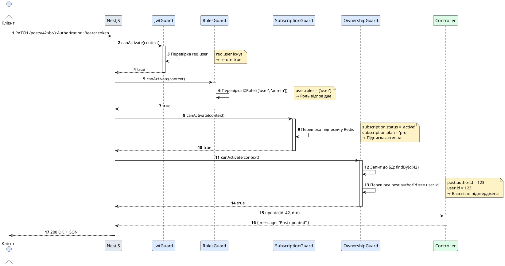

# Створення кастомних Guards

::card-group

::card{title="🎯 Мета лекції" icon="i-lucide-target"}

- Опанувати створення кастомних Guards для специфічних сценаріїв авторизації
- Навчитися імплементувати інтерфейс `CanActivate` з власною логікою перевірки доступу
- Вивчити створення RolesGuard для Role-Based Access Control (RBAC)
- Засвоїти імплементацію OwnershipGuard для перевірки власності ресурсів
- Практикувати використання Reflector для читання метаданих з кастомних декораторів
- Розуміти патерни створення складних guards: SubscriptionGuard, IpWhitelistGuard, TimeWindowGuard
- Навчитися комбінувати кілька guards для створення багаторівневих політик безпеки

::

::card{title="🔑 Ключові терміни" icon="i-lucide-key"}

- **Custom Guard** (*кастомний захисний перехоплювач*): клас з власною логікою авторизації, що імплементує `CanActivate`
- **Role-Based Access Control (RBAC)** (*контроль доступу на основі ролей*): модель авторизації, де права визначаються ролями користувача
- **Resource Ownership** (*власність ресурсу*): патерн авторизації, що дозволяє дії лише власнику ресурсу
- **Permission-Based Authorization** (*авторизація на основі дозволів*): модель з детальними правами (наприклад, `post:edit`, `user:delete`)
- **Metadata Reflection** (*рефлексія метаданих*): читання інформації, прикріпленої до обробників через декоратори
- **Guard Composition** (*композиція захисних перехоплювачів*): комбінування кількох guards для складних політик безпеки
- **Subscription Guard** (*перехоплювач підписки*): guard для перевірки статусу підписки або тарифного плану користувача

::

::

## RolesGuard: авторизація на основі ролей

Role-Based Access Control (RBAC) є найпоширенішим патерном авторизації у веб-застосунках. Ідея проста: кожен користувач має одну або кілька ролей (наприклад, `user`, `admin`, `moderator`), а кожен маршрут вимагає певні ролі для доступу.

### Створення декоратора @Roles()

Спочатку створимо кастомний декоратор для визначення дозволених ролей:

```typescript
// decorators/roles.decorator.ts
import { SetMetadata } from '@nestjs/common';

export const ROLES_KEY = 'roles';
export const Roles = (...roles: string[]) => SetMetadata(ROLES_KEY, roles);
```

**Використання у контролері:**

```typescript
import { Controller, Get, Post, UseGuards } from '@nestjs/common';
import { Roles } from './decorators/roles.decorator';

@Controller('admin')
export class AdminController {
  @Get('dashboard')
  @Roles('admin', 'moderator') // Дозволити адмінам та модераторам
  getDashboard() {
    return 'Дашборд адміністрації';
  }

  @Post('users/ban')
  @Roles('admin') // Дозволити лише адмінам
  banUser() {
    return 'Блокування користувача';
  }

  @Get('stats')
  @Roles('admin', 'analyst') // Дозволити адмінам та аналітикам
  getStatistics() {
    return 'Статистика системи';
  }
}
```

### Імплементація RolesGuard

Тепер створимо guard, що перевірятиме наявність потрібних ролей у користувача:

```typescript
// guards/roles.guard.ts
import { Injectable, CanActivate, ExecutionContext, ForbiddenException } from '@nestjs/common';
import { Reflector } from '@nestjs/core';
import { ROLES_KEY } from '../decorators/roles.decorator';

@Injectable()
export class RolesGuard implements CanActivate {
  constructor(private reflector: Reflector) {}

  canActivate(context: ExecutionContext): boolean {
    // Читання метаданих 'roles' з обробника та контролера
    const requiredRoles = this.reflector.getAllAndOverride<string[]>(
      ROLES_KEY,
      [context.getHandler(), context.getClass()]
    );

    // Якщо метадані відсутні, дозволити доступ (маршрут без @Roles())
    if (!requiredRoles) {
      return true;
    }

    // Отримання користувача з request (прикріплено Middleware або AuthGuard)
    const request = context.switchToHttp().getRequest();
    const user = request.user;

    // Перевірка автентифікації
    if (!user) {
      throw new ForbiddenException('User not authenticated');
    }

    // Перевірка наявності хоча б однієї ролі
    const hasRole = requiredRoles.some(role => user.roles?.includes(role));

    if (!hasRole) {
      throw new ForbiddenException(
        `User does not have required roles: ${requiredRoles.join(', ')}`
      );
    }

    return true;
  }
}
```

**Ключові елементи:**

1. **`Reflector.getAllAndOverride()`** — шукає метадані `'roles'` спочатку у методі, потім у контролері
2. **Перевірка на відсутність метаданих** — якщо `@Roles()` не застосовано, guard дозволяє доступ
3. **`some()`** — перевіряє, чи має користувач **хоча б одну** з вказаних ролей
4. **`ForbiddenException`** — викидається, якщо роль не відповідає (403 Forbidden)

### Реєстрація RolesGuard

Застосування на рівні контролера:

```typescript
import { Controller, UseGuards } from '@nestjs/common';
import { RolesGuard } from './guards/roles.guard';

@Controller('admin')
@UseGuards(RolesGuard) // Застосувати до всіх методів контролера
export class AdminController {
  // ... методи з @Roles()
}
```

Або глобально для всього застосунку:

```typescript
// app.module.ts
import { Module } from '@nestjs/common';
import { APP_GUARD } from '@nestjs/core';
import { RolesGuard } from './guards/roles.guard';

@Module({
  providers: [
    {
      provide: APP_GUARD,
      useClass: RolesGuard,
    },
  ],
})
export class AppModule {}
```

::note
Глобальний RolesGuard **не блокуватиме** маршрути без декоратора `@Roles()`, оскільки guard повертає `true` при відсутності метаданих. Це дозволяє створювати «публічні» маршрути без додаткових декораторів.
::

### Приклад HTTP-відповіді при блокуванні

::code-group

```http [Успішний запит]
GET /admin/dashboard HTTP/1.1
Authorization: Bearer valid-token
# User: { id: 1, roles: ['admin'] }

HTTP/1.1 200 OK
Content-Type: application/json

{
  "message": "Дашборд адміністрації"
}
```

```http [Недостатньо прав]
GET /admin/dashboard HTTP/1.1
Authorization: Bearer valid-token
# User: { id: 2, roles: ['user'] }

HTTP/1.1 403 Forbidden
Content-Type: application/json

{
  "statusCode": 403,
  "message": "User does not have required roles: admin, moderator",
  "error": "Forbidden"
}
```

```http [Немає автентифікації]
GET /admin/dashboard HTTP/1.1
# Немає токена

HTTP/1.1 403 Forbidden
Content-Type: application/json

{
  "statusCode": 403,
  "message": "User not authenticated",
  "error": "Forbidden"
}
```

::

## PermissionsGuard: авторизація на основі дозволів

Для більш детального контролю доступу використовується модель **Permission-Based Authorization**, де замість ролей перевіряються конкретні дозволи (permissions).

### Створення декоратора @RequirePermissions()

```typescript
// decorators/permissions.decorator.ts
import { SetMetadata } from '@nestjs/common';

export const PERMISSIONS_KEY = 'permissions';
export const RequirePermissions = (...permissions: string[]) =>
  SetMetadata(PERMISSIONS_KEY, permissions);
```

**Використання у контролері:**

```typescript
@Controller('posts')
export class PostsController {
  @Get()
  @RequirePermissions('posts:read') // Дозвіл на читання
  findAll() {
    return 'Список постів';
  }

  @Post()
  @RequirePermissions('posts:create') // Дозвіл на створення
  create(@Body() dto: CreatePostDto) {
    return 'Створення посту';
  }

  @Patch(':id')
  @RequirePermissions('posts:edit') // Дозвіл на редагування
  update(@Param('id') id: string, @Body() dto: UpdatePostDto) {
    return `Оновлення посту ${id}`;
  }

  @Delete(':id')
  @RequirePermissions('posts:delete') // Дозвіл на видалення
  remove(@Param('id') id: string) {
    return `Видалення посту ${id}`;
  }
}
```

### Імплементація PermissionsGuard

```typescript
// guards/permissions.guard.ts
import { Injectable, CanActivate, ExecutionContext, ForbiddenException } from '@nestjs/common';
import { Reflector } from '@nestjs/core';
import { PERMISSIONS_KEY } from '../decorators/permissions.decorator';

@Injectable()
export class PermissionsGuard implements CanActivate {
  constructor(private reflector: Reflector) {}

  canActivate(context: ExecutionContext): boolean {
    const requiredPermissions = this.reflector.getAllAndOverride<string[]>(
      PERMISSIONS_KEY,
      [context.getHandler(), context.getClass()]
    );

    if (!requiredPermissions) {
      return true; // Немає обмежень
    }

    const request = context.switchToHttp().getRequest();
    const user = request.user;

    if (!user) {
      throw new ForbiddenException('User not authenticated');
    }

    // Перевірка наявності ВСІХ потрібних дозволів (логіка AND)
    const hasAllPermissions = requiredPermissions.every(permission =>
      user.permissions?.includes(permission)
    );

    if (!hasAllPermissions) {
      throw new ForbiddenException(
        `Missing permissions: ${requiredPermissions.join(', ')}`
      );
    }

    return true;
  }
}
```

**Відмінність від RolesGuard:**

- **RolesGuard** використовує `some()` — достатньо **хоча б однієї** ролі з переліку
- **PermissionsGuard** використовує `every()` — потрібні **ВСІ** дозволи з переліку

### Комбінування ролей та дозволів

Можна застосувати обидва guards одночасно:

```typescript
@Controller('admin/users')
@UseGuards(RolesGuard, PermissionsGuard)
export class AdminUsersController {
  @Delete(':id')
  @Roles('admin', 'super-admin') // Лише адміни
  @RequirePermissions('users:delete') // + дозвіл users:delete
  deleteUser(@Param('id') id: string) {
    return `Видалення користувача ${id}`;
  }
}
```

**Порядок виконання:** `RolesGuard` → `PermissionsGuard` → обробник.

::tip
**Модель ролей з успадкуванням дозволів:**

Замість прямого зберігання дозволів у користувача, створіть відображення ролей на дозволи:

```typescript
const ROLE_PERMISSIONS = {
  user: ['posts:read', 'profile:edit'],
  moderator: ['posts:read', 'posts:edit', 'comments:delete'],
  admin: ['posts:*', 'users:*', 'settings:*'], // Всі дозволи
};

// У guard
const userPermissions = user.roles.flatMap(role => ROLE_PERMISSIONS[role] || []);
const hasPermission = requiredPermissions.every(perm => 
  userPermissions.includes(perm) || userPermissions.includes(perm.split(':')[0] + ':*')
);
```

Це дозволяє централізовано керувати правами та уникнути дублювання дозволів у БД.
::


## OwnershipGuard: перевірка власності ресурсу

Часто потрібно дозволити редагування або видалення ресурсу лише його **власнику**. Наприклад, користувач може редагувати лише свої пости, коментарі або профіль.

### Створення декоратора @CheckOwnership()

```typescript
// decorators/ownership.decorator.ts
import { SetMetadata } from '@nestjs/common';

export const OWNERSHIP_KEY = 'ownership';

interface OwnershipConfig {
  resourceParam: string; // Назва параметра з ID ресурсу (@Param('id'))
  service: string; // Назва сервісу для перевірки власності
  method: string; // Метод сервісу (наприклад, 'findById')
  ownerField: string; // Поле з ID власника у ресурсі (наприклад, 'authorId')
}

export const CheckOwnership = (config: OwnershipConfig) =>
  SetMetadata(OWNERSHIP_KEY, config);
```

**Використання у контролері:**

```typescript
import { Controller, Get, Patch, Delete, Param, UseGuards } from '@nestjs/common';
import { CheckOwnership } from './decorators/ownership.decorator';
import { OwnershipGuard } from './guards/ownership.guard';

@Controller('posts')
@UseGuards(OwnershipGuard)
export class PostsController {
  @Patch(':id')
  @CheckOwnership({
    resourceParam: 'id',
    service: 'PostsService',
    method: 'findById',
    ownerField: 'authorId',
  })
  update(@Param('id') id: string, @Body() dto: UpdatePostDto) {
    return `Оновлення посту ${id}`;
  }

  @Delete(':id')
  @CheckOwnership({
    resourceParam: 'id',
    service: 'PostsService',
    method: 'findById',
    ownerField: 'authorId',
  })
  remove(@Param('id') id: string) {
    return `Видалення посту ${id}`;
  }
}
```

### Імплементація OwnershipGuard

```typescript
// guards/ownership.guard.ts
import { Injectable, CanActivate, ExecutionContext, ForbiddenException, NotFoundException } from '@nestjs/common';
import { Reflector } from '@nestjs/core';
import { ModuleRef } from '@nestjs/core';
import { OWNERSHIP_KEY } from '../decorators/ownership.decorator';

@Injectable()
export class OwnershipGuard implements CanActivate {
  constructor(
    private reflector: Reflector,
    private moduleRef: ModuleRef, // Для динамічного отримання сервісів
  ) {}

  async canActivate(context: ExecutionContext): Promise<boolean> {
    const config = this.reflector.get(OWNERSHIP_KEY, context.getHandler());

    if (!config) {
      return true; // Немає перевірки власності
    }

    const request = context.switchToHttp().getRequest();
    const user = request.user;

    if (!user) {
      throw new ForbiddenException('User not authenticated');
    }

    // Отримання ID ресурсу з параметрів запиту
    const resourceId = request.params[config.resourceParam];

    if (!resourceId) {
      throw new NotFoundException('Resource ID not provided');
    }

    // Динамічне отримання сервісу
    const service = this.moduleRef.get(config.service, { strict: false });

    if (!service || typeof service[config.method] !== 'function') {
      throw new Error(`Service ${config.service} or method ${config.method} not found`);
    }

    // Запит до БД для отримання ресурсу
    const resource = await service[config.method](resourceId);

    if (!resource) {
      throw new NotFoundException('Resource not found');
    }

    // Перевірка власності
    const ownerId = resource[config.ownerField];

    if (ownerId !== user.id) {
      throw new ForbiddenException('You do not own this resource');
    }

    return true;
  }
}
```

**Ключові особливості:**

1. **`ModuleRef`** — сервіс NestJS для динамічного отримання інших сервісів за назвою
2. **Асинхронний запит до БД** — guard чекає на результат `service[method](resourceId)`
3. **Перевірка власності** — порівнює `resource.authorId` (або інше поле) з `user.id`
4. **Помилки 404 та 403** — розділяє випадки «ресурс не знайдено» та «недостатньо прав»

### Оптимізація: уникнення дублювання запитів

Проблема: якщо `OwnershipGuard` виконує запит до БД для перевірки власності, а потім обробник **знову** виконує той самий запит для отримання даних — це дублювання.

**Рішення: прикріплення ресурсу до request:**

```typescript
async canActivate(context: ExecutionContext): Promise<boolean> {
  // ... попередня логіка ...

  const resource = await service[config.method](resourceId);

  if (!resource) {
    throw new NotFoundException('Resource not found');
  }

  // Перевірка власності
  if (resource[config.ownerField] !== user.id) {
    throw new ForbiddenException('You do not own this resource');
  }

  // Прикріпити ресурс до request для використання в обробнику
  request[config.service.toLowerCase()] = resource;

  return true;
}
```

**Використання у контролері:**

```typescript
@Patch(':id')
@CheckOwnership({ /* ... */ })
update(
  @Param('id') id: string,
  @Body() dto: UpdatePostDto,
  @Req() req: Request,
) {
  const post = req['postsservice']; // Ресурс вже завантажений у guard
  // Оновити post без повторного запиту до БД
  return this.postsService.update(post, dto);
}
```

::note
Прикріплення ресурсу до `request` є стандартною практикою для уникнення N+1 запитів. Це особливо корисно для складних guards, що виконують кілька запитів до БД (перевірка власності, перевірка підписки, перевірка блокування).
::

## SubscriptionGuard: перевірка тарифного плану

Для SaaS-застосунків часто потрібно обмежити функціонал залежно від підписки користувача:

### Створення декоратора @RequireSubscription()

```typescript
// decorators/subscription.decorator.ts
import { SetMetadata } from '@nestjs/common';

export const SUBSCRIPTION_KEY = 'subscription';
export const RequireSubscription = (...plans: string[]) =>
  SetMetadata(SUBSCRIPTION_KEY, plans);
```

**Використання у контролері:**

```typescript
@Controller('analytics')
export class AnalyticsController {
  @Get('basic')
  @RequireSubscription('free', 'pro', 'enterprise') // Всі плани
  getBasicStats() {
    return 'Базова статистика';
  }

  @Get('advanced')
  @RequireSubscription('pro', 'enterprise') // Лише платні плани
  getAdvancedStats() {
    return 'Розширена статистика';
  }

  @Get('custom-reports')
  @RequireSubscription('enterprise') // Лише для enterprise
  getCustomReports() {
    return 'Кастомні звіти';
  }
}
```

### Імплементація SubscriptionGuard

```typescript
// guards/subscription.guard.ts
import { Injectable, CanActivate, ExecutionContext, ForbiddenException } from '@nestjs/common';
import { Reflector } from '@nestjs/core';
import { SUBSCRIPTION_KEY } from '../decorators/subscription.decorator';
import { SubscriptionService } from '../subscription/subscription.service';

@Injectable()
export class SubscriptionGuard implements CanActivate {
  constructor(
    private reflector: Reflector,
    private subscriptionService: SubscriptionService,
  ) {}

  async canActivate(context: ExecutionContext): Promise<boolean> {
    const requiredPlans = this.reflector.getAllAndOverride<string[]>(
      SUBSCRIPTION_KEY,
      [context.getHandler(), context.getClass()]
    );

    if (!requiredPlans) {
      return true; // Немає обмежень
    }

    const request = context.switchToHttp().getRequest();
    const user = request.user;

    if (!user) {
      throw new ForbiddenException('User not authenticated');
    }

    // Запит до БД для перевірки підписки
    const subscription = await this.subscriptionService.findByUserId(user.id);

    // Перевірка наявності активної підписки
    if (!subscription || subscription.status !== 'active') {
      throw new ForbiddenException('Active subscription required');
    }

    // Перевірка відповідності плану
    if (!requiredPlans.includes(subscription.plan)) {
      throw new ForbiddenException(
        `This feature requires one of the following plans: ${requiredPlans.join(', ')}. Your current plan: ${subscription.plan}`
      );
    }

    return true;
  }
}
```

### Оптимізація через кешування

Для зменшення навантаження на БД, підписку можна кешувати у Redis:

```typescript
import { Injectable, CanActivate, ExecutionContext, ForbiddenException } from '@nestjs/common';
import { Reflector } from '@nestjs/core';
import { Redis } from 'ioredis';
import { SUBSCRIPTION_KEY } from '../decorators/subscription.decorator';
import { SubscriptionService } from '../subscription/subscription.service';

@Injectable()
export class CachedSubscriptionGuard implements CanActivate {
  constructor(
    private reflector: Reflector,
    private subscriptionService: SubscriptionService,
    private redis: Redis,
  ) {}

  async canActivate(context: ExecutionContext): Promise<boolean> {
    const requiredPlans = this.reflector.getAllAndOverride<string[]>(
      SUBSCRIPTION_KEY,
      [context.getHandler(), context.getClass()]
    );

    if (!requiredPlans) {
      return true;
    }

    const request = context.switchToHttp().getRequest();
    const user = request.user;

    if (!user) {
      throw new ForbiddenException('User not authenticated');
    }

    const cacheKey = `subscription:${user.id}`;

    // Спроба отримати з кешу
    const cached = await this.redis.get(cacheKey);

    let subscription;

    if (cached) {
      subscription = JSON.parse(cached);
    } else {
      // Запит до БД при відсутності кешу
      subscription = await this.subscriptionService.findByUserId(user.id);

      // Збереження в кеш на 15 хвилин
      await this.redis.set(
        cacheKey,
        JSON.stringify(subscription),
        'EX',
        900
      );
    }

    // Перевірка статусу та плану
    if (!subscription || subscription.status !== 'active') {
      throw new ForbiddenException('Active subscription required');
    }

    if (!requiredPlans.includes(subscription.plan)) {
      throw new ForbiddenException(
        `Required plan: ${requiredPlans.join(' or ')}. Current: ${subscription.plan}`
      );
    }

    return true;
  }
}
```

::warning
Кешування підписки може призвести до затримки у застосуванні змін:
- Якщо користувач змінив план, зміни набудуть чинності лише через 15 хвилин (TTL кешу)
- Якщо адміністратор заблокував підписку, користувач матиме доступ до закінчення TTL

**Рішення:**
1. Інвалідувати кеш при зміні підписки (через event emitter або pub/sub)
2. Використовувати короткий TTL (1-5 хвилин) для критичних операцій
3. Не кешувати результат для операцій, що змінюють дані користувача
::

## IpWhitelistGuard: обмеження доступу за IP-адресою

Для адміністративних панелей або внутрішніх API корисно обмежити доступ лише з певних IP-адрес:

### Створення декоратора @AllowedIps()

```typescript
// decorators/allowed-ips.decorator.ts
import { SetMetadata } from '@nestjs/common';

export const ALLOWED_IPS_KEY = 'allowedIps';
export const AllowedIps = (...ips: string[]) => SetMetadata(ALLOWED_IPS_KEY, ips);
```

### Імплементація IpWhitelistGuard

```typescript
// guards/ip-whitelist.guard.ts
import { Injectable, CanActivate, ExecutionContext, ForbiddenException } from '@nestjs/common';
import { Reflector } from '@nestjs/core';
import { ALLOWED_IPS_KEY } from '../decorators/allowed-ips.decorator';

@Injectable()
export class IpWhitelistGuard implements CanActivate {
  constructor(private reflector: Reflector) {}

  canActivate(context: ExecutionContext): boolean {
    const allowedIps = this.reflector.getAllAndOverride<string[]>(
      ALLOWED_IPS_KEY,
      [context.getHandler(), context.getClass()]
    );

    if (!allowedIps || allowedIps.length === 0) {
      return true; // Немає обмежень
    }

    const request = context.switchToHttp().getRequest();
    const clientIp = this.getClientIp(request);

    // Перевірка наявності IP у whitelist
    if (!allowedIps.includes(clientIp)) {
      throw new ForbiddenException(
        `Access denied from IP: ${clientIp}. Contact administrator.`
      );
    }

    return true;
  }

  private getClientIp(request: any): string {
    // Перевірка заголовків з проксі (Nginx, CloudFlare)
    return (
      request.headers['x-forwarded-for']?.split(',')[0] ||
      request.headers['x-real-ip'] ||
      request.connection.remoteAddress ||
      request.socket.remoteAddress ||
      request.ip
    );
  }
}
```

**Використання у контролері:**

```typescript
@Controller('admin/system')
@AllowedIps('192.168.1.100', '10.0.0.5') // Внутрішні IP офісу
@UseGuards(IpWhitelistGuard)
export class SystemController {
  @Get('health')
  getHealth() {
    return 'System health status';
  }

  @Post('restart')
  restartService() {
    return 'Service restarting...';
  }
}
```

### Підтримка CIDR-нотації

Для більш гнучких правил можна додати підтримку CIDR (наприклад, `192.168.1.0/24`):

```bash
npm install ip-range-check
```

```typescript
import * as ipRangeCheck from 'ip-range-check';

private isIpAllowed(clientIp: string, allowedIps: string[]): boolean {
  return allowedIps.some(pattern => {
    // Підтримка CIDR та точних IP
    return ipRangeCheck(clientIp, pattern);
  });
}
```

**Приклад використання:**

```typescript
@AllowedIps('192.168.1.0/24', '10.0.0.0/16', '203.0.113.5')
```


## TimeWindowGuard: обмеження доступу за часом

Деякі операції повинні бути доступні лише у певний період часу (наприклад, бекап вночі, технічні роботи):

### Створення декоратора @TimeWindow()

```typescript
// decorators/time-window.decorator.ts
import { SetMetadata } from '@nestjs/common';

export const TIME_WINDOW_KEY = 'timeWindow';

interface TimeWindow {
  startHour: number; // 0-23
  endHour: number;   // 0-23
  timezone?: string; // 'Europe/Kiev', 'America/New_York'
}

export const TimeWindow = (config: TimeWindow) =>
  SetMetadata(TIME_WINDOW_KEY, config);
```

### Імплементація TimeWindowGuard

```typescript
// guards/time-window.guard.ts
import { Injectable, CanActivate, ExecutionContext, ForbiddenException } from '@nestjs/common';
import { Reflector } from '@nestjs/core';
import { TIME_WINDOW_KEY } from '../decorators/time-window.decorator';

@Injectable()
export class TimeWindowGuard implements CanActivate {
  constructor(private reflector: Reflector) {}

  canActivate(context: ExecutionContext): boolean {
    const config = this.reflector.get(TIME_WINDOW_KEY, context.getHandler());

    if (!config) {
      return true; // Немає обмежень за часом
    }

    const currentTime = new Date();
    const currentHour = currentTime.getHours();

    // Перевірка часового вікна
    const isWithinWindow = this.isWithinTimeWindow(
      currentHour,
      config.startHour,
      config.endHour
    );

    if (!isWithinWindow) {
      throw new ForbiddenException(
        `This operation is only available between ${config.startHour}:00 and ${config.endHour}:00`
      );
    }

    return true;
  }

  private isWithinTimeWindow(
    currentHour: number,
    startHour: number,
    endHour: number
  ): boolean {
    // Випадок: вікно не перетинає північ (наприклад, 9:00 - 18:00)
    if (startHour <= endHour) {
      return currentHour >= startHour && currentHour < endHour;
    }

    // Випадок: вікно перетинає північ (наприклад, 22:00 - 6:00)
    return currentHour >= startHour || currentHour < endHour;
  }
}
```

**Використання у контролері:**

```typescript
@Controller('admin/maintenance')
@UseGuards(TimeWindowGuard)
export class MaintenanceController {
  @Post('backup')
  @TimeWindow({ startHour: 2, endHour: 6 }) // Доступно лише з 2:00 до 6:00
  createBackup() {
    return 'Starting database backup...';
  }

  @Post('cleanup')
  @TimeWindow({ startHour: 22, endHour: 6 }) // З 22:00 до 6:00 (перетинає північ)
  cleanupLogs() {
    return 'Cleaning up old logs...';
  }
}
```

### Підтримка часових поясів через Luxon

Для роботи з часовими поясами використовуйте бібліотеку `luxon`:

```bash
npm install luxon
npm install -D @types/luxon
```

```typescript
import { DateTime } from 'luxon';

canActivate(context: ExecutionContext): boolean {
  const config = this.reflector.get(TIME_WINDOW_KEY, context.getHandler());

  if (!config) {
    return true;
  }

  // Використання заданого часового поясу або UTC
  const timezone = config.timezone || 'UTC';
  const currentTime = DateTime.now().setZone(timezone);
  const currentHour = currentTime.hour;

  const isWithinWindow = this.isWithinTimeWindow(
    currentHour,
    config.startHour,
    config.endHour
  );

  if (!isWithinWindow) {
    throw new ForbiddenException(
      `Operation available only between ${config.startHour}:00 and ${config.endHour}:00 ${timezone}`
    );
  }

  return true;
}
```

## ThrottleGuard: обмеження частоти запитів на користувача

На відміну від глобального rate limiting (на рівні IP), ThrottleGuard обмежує частоту запитів **на автентифікованого користувача**:

### Створення декоратора @Throttle()

```typescript
// decorators/throttle.decorator.ts
import { SetMetadata } from '@nestjs/common';

export const THROTTLE_KEY = 'throttle';

interface ThrottleConfig {
  limit: number;      // Максимум запитів
  ttl: number;        // Період у секундах
  message?: string;   // Кастомне повідомлення
}

export const Throttle = (config: ThrottleConfig) =>
  SetMetadata(THROTTLE_KEY, config);
```

### Імплементація ThrottleGuard з Redis

```typescript
// guards/throttle.guard.ts
import { Injectable, CanActivate, ExecutionContext, TooManyRequestsException } from '@nestjs/common';
import { Reflector } from '@nestjs/core';
import { Redis } from 'ioredis';
import { THROTTLE_KEY } from '../decorators/throttle.decorator';

@Injectable()
export class ThrottleGuard implements CanActivate {
  constructor(
    private reflector: Reflector,
    private redis: Redis,
  ) {}

  async canActivate(context: ExecutionContext): Promise<boolean> {
    const config = this.reflector.get(THROTTLE_KEY, context.getHandler());

    if (!config) {
      return true; // Немає обмежень
    }

    const request = context.switchToHttp().getRequest();
    const user = request.user;

    if (!user) {
      return true; // Throttling лише для автентифікованих користувачів
    }

    // Ключ у Redis: throttle:userId:handlerName
    const handler = context.getHandler().name;
    const key = `throttle:${user.id}:${handler}`;

    // Отримання поточного лічильника
    const current = await this.redis.get(key);
    const count = current ? parseInt(current, 10) : 0;

    if (count >= config.limit) {
      const ttl = await this.redis.ttl(key);
      const message = config.message || `Rate limit exceeded. Try again in ${ttl} seconds.`;
      
      throw new TooManyRequestsException(message);
    }

    // Інкремент лічильника
    const newCount = await this.redis.incr(key);

    // Встановлення TTL при першому запиті
    if (newCount === 1) {
      await this.redis.expire(key, config.ttl);
    }

    return true;
  }
}
```

**Використання у контролері:**

```typescript
@Controller('api')
@UseGuards(ThrottleGuard)
export class ApiController {
  @Post('generate-report')
  @Throttle({ limit: 5, ttl: 3600 }) // Максимум 5 звітів на годину
  generateReport() {
    return 'Generating report...';
  }

  @Post('send-email')
  @Throttle({ limit: 10, ttl: 60, message: 'Too many emails sent. Please wait.' })
  sendEmail(@Body() dto: SendEmailDto) {
    return 'Email sent';
  }
}
```

**HTTP-відповідь при перевищенні ліміту:**

```http
HTTP/1.1 429 Too Many Requests
Content-Type: application/json
Retry-After: 3542

{
  "statusCode": 429,
  "message": "Rate limit exceeded. Try again in 3542 seconds.",
  "error": "Too Many Requests"
}
```

::tip
ThrottleGuard корисний для захисту від зловживання ресурсоємними операціями:
- Генерація звітів
- Експорт даних
- Відправлення email/SMS
- Завантаження файлів
- Виклики зовнішніх API

Для звичайних CRUD-операцій використовуйте глобальний rate limiting на рівні IP.
::

## CompositeGuard: комбінування логіки кількох guards

Для складних сценаріїв можна створити guard, що об'єднує логіку кількох інших guards:

```typescript
// guards/composite.guard.ts
import { Injectable, CanActivate, ExecutionContext } from '@nestjs/common';

@Injectable()
export class CompositeGuard implements CanActivate {
  constructor(private guards: CanActivate[]) {}

  async canActivate(context: ExecutionContext): Promise<boolean> {
    for (const guard of this.guards) {
      const result = await guard.canActivate(context);
      
      if (!result) {
        return false; // Якщо хоча б один guard заблокував
      }
    }

    return true; // Всі guards дозволили
  }
}
```

**Використання:**

```typescript
const secureGuard = new CompositeGuard([
  new JwtGuard(),
  new RolesGuard(),
  new SubscriptionGuard(),
  new IpWhitelistGuard(),
]);

@Controller('admin/sensitive')
@UseGuards(secureGuard)
export class SensitiveController {
  @Post('critical-operation')
  criticalOperation() {
    return 'Operation completed';
  }
}
```

## Візуалізація ланцюга виконання guards

::plant-uml{alt="Виконання множинних Guards"}



::

**Ключові спостереження:**

1. **Послідовне виконання** — guards виконуються у порядку реєстрації
2. **Ранній вихід** — якщо будь-який guard поверне `false`, наступні не виконуються
3. **Кумулятивна валідація** — кожен guard перевіряє свій аспект авторизації
4. **Оптимізація запитів** — OwnershipGuard прикріплює ресурс до `request` для уникнення дублювання


## Best Practices: архітектура guards

### Принцип єдиної відповідальності (Single Responsibility)

Кожен guard має виконувати **одну** перевірку:

::code-group

```typescript [❌ Неправильно: guard з множинною логікою]
@Injectable()
export class MegaGuard implements CanActivate {
  async canActivate(context: ExecutionContext): Promise<boolean> {
    const request = context.switchToHttp().getRequest();
    const user = request.user;

    // Перевірка автентифікації
    if (!user) return false;

    // Перевірка ролі
    if (!user.roles.includes('admin')) return false;

    // Перевірка підписки
    const subscription = await this.subService.findByUserId(user.id);
    if (subscription.status !== 'active') return false;

    // Перевірка IP
    if (!this.allowedIps.includes(request.ip)) return false;

    return true;
  }
}
```

```typescript [✅ Правильно: окремі guards]
@Injectable()
export class JwtGuard implements CanActivate {
  canActivate(context: ExecutionContext): boolean {
    const user = context.switchToHttp().getRequest().user;
    return !!user;
  }
}

@Injectable()
export class RolesGuard implements CanActivate {
  // Лише перевірка ролей
}

@Injectable()
export class SubscriptionGuard implements CanActivate {
  // Лише перевірка підписки
}

@Injectable()
export class IpWhitelistGuard implements CanActivate {
  // Лише перевірка IP
}

// Використання
@UseGuards(JwtGuard, RolesGuard, SubscriptionGuard, IpWhitelistGuard)
```

::

**Переваги розділення:**
- Легше тестувати кожен guard окремо
- Можна переглядати композицію guards для різних маршрутів
- Зміни в одній перевірці не впливають на інші

### Ієрархія guards: від загального до специфічного

Розміщуйте guards від найшвидших перевірок до найповільніших:

```typescript
@UseGuards(
  JwtGuard,           // 1. Швидко: перевірка req.user (без запитів до БД)
  RolesGuard,         // 2. Швидко: перевірка масиву ролей у пам'яті
  ThrottleGuard,      // 3. Середньо: запит до Redis
  SubscriptionGuard,  // 4. Повільно: запит до БД (або Redis кеш)
  OwnershipGuard      // 5. Найповільніше: запит до БД для перевірки власності
)
```

**Логіка:** якщо користувач не автентифікований (`JwtGuard` заблокував), немає сенсу перевіряти підписку чи власність — економимо запити до БД.

### Кешування результатів guards

Для guards з дорогими операціями (запити до БД, зовнішніх API) використовуйте кешування:

```typescript
@Injectable()
export class CachedRolesGuard implements CanActivate {
  private cache = new Map<string, { roles: string[], expires: number }>();

  async canActivate(context: ExecutionContext): Promise<boolean> {
    const user = context.switchToHttp().getRequest().user;
    const cacheKey = `roles:${user.id}`;

    // Перевірка кешу
    const cached = this.cache.get(cacheKey);
    if (cached && cached.expires > Date.now()) {
      return this.checkRoles(cached.roles, context);
    }

    // Запит до БД
    const userRoles = await this.userService.getRoles(user.id);

    // Збереження в кеш на 5 хвилин
    this.cache.set(cacheKey, {
      roles: userRoles,
      expires: Date.now() + 5 * 60 * 1000,
    });

    return this.checkRoles(userRoles, context);
  }

  private checkRoles(roles: string[], context: ExecutionContext): boolean {
    // Логіка перевірки ролей
    return true;
  }
}
```

::warning
In-memory кеш **не працює** в кластері Node.js або при горизонтальному масштабуванні. Для production використовуйте **Redis** для розподіленого кешування між екземплярами застосунку.
::

### Централізована обробка помилок

Створіть базовий клас для guards з єдиною обробкою помилок:

```typescript
// guards/base.guard.ts
import { CanActivate, ExecutionContext, ForbiddenException, Logger } from '@nestjs/common';

export abstract class BaseGuard implements CanActivate {
  protected readonly logger = new Logger(this.constructor.name);

  async canActivate(context: ExecutionContext): Promise<boolean> {
    try {
      return await this.validate(context);
    } catch (error) {
      this.logger.error(`Guard failed: ${error.message}`, error.stack);
      
      // Перетворити всі помилки на ForbiddenException
      if (error instanceof ForbiddenException) {
        throw error;
      }
      
      throw new ForbiddenException('Access denied');
    }
  }

  protected abstract validate(context: ExecutionContext): Promise<boolean>;
}
```

**Використання:**

```typescript
@Injectable()
export class SubscriptionGuard extends BaseGuard {
  constructor(private subscriptionService: SubscriptionService) {
    super();
  }

  protected async validate(context: ExecutionContext): Promise<boolean> {
    const user = context.switchToHttp().getRequest().user;
    const subscription = await this.subscriptionService.findByUserId(user.id);
    
    return subscription?.status === 'active';
  }
}
```

## Тестування кастомних Guards

### Unit-тестування RolesGuard

```typescript
import { Test } from '@nestjs/testing';
import { ExecutionContext, ForbiddenException } from '@nestjs/common';
import { Reflector } from '@nestjs/core';
import { RolesGuard } from './roles.guard';
import { ROLES_KEY } from '../decorators/roles.decorator';

describe('RolesGuard', () => {
  let guard: RolesGuard;
  let reflector: Reflector;

  beforeEach(async () => {
    const module = await Test.createTestingModule({
      providers: [RolesGuard, Reflector],
    }).compile();

    guard = module.get<RolesGuard>(RolesGuard);
    reflector = module.get<Reflector>(Reflector);
  });

  const createMockContext = (user: any, roles?: string[]): ExecutionContext => {
    const mockContext = {
      getHandler: jest.fn(),
      getClass: jest.fn(),
      switchToHttp: jest.fn().mockReturnValue({
        getRequest: jest.fn().mockReturnValue({ user }),
      }),
    } as unknown as ExecutionContext;

    if (roles !== undefined) {
      jest.spyOn(reflector, 'getAllAndOverride').mockReturnValue(roles);
    }

    return mockContext;
  };

  it('should allow access when no roles are required', () => {
    const context = createMockContext({ id: 1, roles: ['user'] }, undefined);
    jest.spyOn(reflector, 'getAllAndOverride').mockReturnValue(undefined);

    const result = guard.canActivate(context);
    expect(result).toBe(true);
  });

  it('should allow access when user has required role', () => {
    const user = { id: 1, roles: ['admin', 'user'] };
    const context = createMockContext(user, ['admin']);

    const result = guard.canActivate(context);
    expect(result).toBe(true);
  });

  it('should deny access when user lacks required role', () => {
    const user = { id: 1, roles: ['user'] };
    const context = createMockContext(user, ['admin']);

    expect(() => guard.canActivate(context)).toThrow(ForbiddenException);
  });

  it('should deny access when user is not authenticated', () => {
    const context = createMockContext(null, ['admin']);

    expect(() => guard.canActivate(context)).toThrow(ForbiddenException);
  });

  it('should allow access when user has any of the required roles', () => {
    const user = { id: 1, roles: ['moderator'] };
    const context = createMockContext(user, ['admin', 'moderator']);

    const result = guard.canActivate(context);
    expect(result).toBe(true);
  });
});
```

### Integration-тестування guards з контролером

```typescript
import { Test } from '@nestjs/testing';
import { INestApplication } from '@nestjs/common';
import * as request from 'supertest';
import { AppModule } from '../app.module';

describe('Guards Integration (e2e)', () => {
  let app: INestApplication;
  let adminToken: string;
  let userToken: string;

  beforeAll(async () => {
    const moduleFixture = await Test.createTestingModule({
      imports: [AppModule],
    }).compile();

    app = moduleFixture.createNestApplication();
    await app.init();

    // Отримання токенів для тестування
    adminToken = 'mock-admin-jwt-token';
    userToken = 'mock-user-jwt-token';
  });

  afterAll(async () => {
    await app.close();
  });

  describe('RolesGuard', () => {
    it('should allow admin to access admin endpoint', () => {
      return request(app.getHttpServer())
        .get('/admin/dashboard')
        .set('Authorization', `Bearer ${adminToken}`)
        .expect(200);
    });

    it('should deny user access to admin endpoint', () => {
      return request(app.getHttpServer())
        .get('/admin/dashboard')
        .set('Authorization', `Bearer ${userToken}`)
        .expect(403);
    });

    it('should deny unauthenticated access', () => {
      return request(app.getHttpServer())
        .get('/admin/dashboard')
        .expect(403);
    });
  });
});
```

## Підсумок: типові сценарії guards

::card-group

::card{title="RolesGuard" icon="i-lucide-shield"}

Для перевірки ролей користувача (admin, moderator, user). Використовує `some()` для логіки OR.

::

::card{title="PermissionsGuard" icon="i-lucide-key"}

Для детального контролю через конкретні дозволи (posts:edit, users:delete). Використовує `every()` для логіки AND.

::

::card{title="OwnershipGuard" icon="i-lucide-user-check"}

Для перевірки власності ресурсу. Дозволяє редагування лише власнику посту/коментаря/профілю.

::

::card{title="SubscriptionGuard" icon="i-lucide-credit-card"}

Для обмеження функціоналу залежно від тарифного плану (free, pro, enterprise).

::

::card{title="IpWhitelistGuard" icon="i-lucide-network"}

Для обмеження доступу з певних IP-адрес. Корисно для адміністративних панелей.

::

::card{title="TimeWindowGuard" icon="i-lucide-clock"}

Для обмеження доступу за часом. Корисно для планових технічних робіт або бекапів.

::

::card{title="ThrottleGuard" icon="i-lucide-gauge"}

Для обмеження частоти запитів на автентифікованого користувача. Захист від зловживання ресурсоємними операціями.

::

::

::accordion

::accordion-item{label="❓ Чи може guard модифікувати дані запиту або відповіді?" icon="i-lucide-help-circle"}

Guards **не повинні** модифікувати `request` або `response` — їхня єдина відповідальність полягає у **прийнятті рішення** про доступ (`true`/`false`). Проте допустимо **прикріплювати дані до `request`** для оптимізації:

```typescript
// ✅ Допустимо: прикріплення завантаженого ресурсу
request['post'] = await this.postsService.findById(id);

// ❌ Неправильно: зміна тіла запиту
request.body.userId = user.id;

// ❌ Неправильно: встановлення заголовків відповіді
res.setHeader('X-Custom', 'value');
```

Для трансформації даних використовуйте Interceptors або Pipes.

::

::accordion-item{label="❓ Як guards співпрацюють з Passport.js стратегіями?" icon="i-lucide-help-circle"}

Passport.js стратегії (`JwtStrategy`, `LocalStrategy`) **імплементуються як guards** через `@nestjs/passport`:

```typescript
import { Injectable } from '@nestjs/common';
import { AuthGuard } from '@nestjs/passport';

@Injectable()
export class JwtAuthGuard extends AuthGuard('jwt') {}
```

`AuthGuard('jwt')` автоматично:
1. Викликає `JwtStrategy.validate(payload)`
2. Прикріплює результат до `request.user`
3. Блокує запит при помилці

Після цього можна застосовувати додаткові guards для авторизації:

```typescript
@UseGuards(JwtAuthGuard, RolesGuard, SubscriptionGuard)
```

::

::accordion-item{label="❓ Як реалізувати логіку OR для кількох guards?" icon="i-lucide-help-circle"}

За замовчуванням кілька guards працюють за логікою **AND** (всі мають повернути `true`). Для логіки OR створіть композитний guard:

```typescript
@Injectable()
export class OrGuard implements CanActivate {
  constructor(private guards: CanActivate[]) {}

  async canActivate(context: ExecutionContext): Promise<boolean> {
    for (const guard of this.guards) {
      try {
        const result = await guard.canActivate(context);
        if (result) return true; // Хоча б один дозволив
      } catch {}
    }
    return false; // Жоден не дозволив
  }
}

// Використання
const moderationGuard = new OrGuard([
  new AdminGuard(),
  new ModeratorGuard()
]);

@UseGuards(moderationGuard)
```

::

::

У наступній лекції ми розглянемо **Interceptors** — потужні компоненти для трансформації запитів та відповідей, кешування, логування часу виконання та обробки помилок через RxJS операторі.

