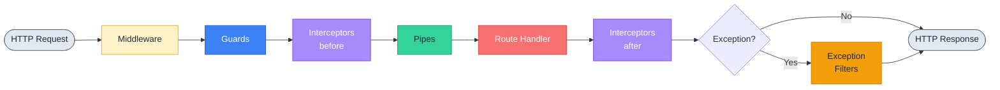

# Interceptors: перехоплення та трансформація відповідей

::card-group

::card{title="🎯 Мета лекції" icon="i-lucide-target"}

- Зрозуміти концепцію Interceptors (*перехоплювачів*) як компонентів для трансформації запитів та відповідей
- Опанувати інтерфейс `NestInterceptor` та метод `intercept(context, next)`
- Навчитися працювати з `CallHandler` для виклику обробника через `handle()`
- Вивчити використання RxJS операторів для трансформації даних: `map()`, `tap()`, `catchError()`, `timeout()`
- Засвоїти двофазову модель виконання: логіка before (до обробника) та after (після обробника)
- Розуміти місце Interceptors у Request Pipeline між Guards та Pipes
- Практикувати створення interceptors для логування, кешування, трансформації відповідей

::

::card{title="🔑 Ключові терміни" icon="i-lucide-key"}

- **Interceptor** (*перехоплювач*): компонент, що обгортає виклик обробника та може трансформувати запит/відповідь
- **NestInterceptor** (*інтерфейс перехоплювача*): інтерфейс з методом `intercept(context, next)` для обробки запиту
- **CallHandler** (*обробник виклику*): об'єкт з методом `handle()`, що повертає `Observable` результату обробника
- **Observable** (*спостережуваний потік*): RxJS об'єкт для асинхронної обробки даних через функціональні оператори
- **RxJS Operators** (*оператори RxJS*): функції трансформації даних (`map`, `tap`, `catchError`, `timeout`)
- **Before/After Logic** (*логіка до/після*): можливість виконувати код до та після виклику обробника
- **Response Transformation** (*трансформація відповіді*): зміна структури даних, що повертаються клієнту

::

::

## Концепція Interceptors: двофазова обробка

Interceptors у NestJS є **третім компонентом** у Request Pipeline, виконуючись після Guards, але до та після Pipes і обробника. Ключова особливість interceptors полягає у можливості виконувати логіку у **двох фазах**:

1. **Before (до виклику обробника)**: логування, валідація, модифікація запиту
2. **After (після виклику обробника)**: трансформація відповіді, кешування, логування часу виконання

На відміну від Middleware (що працює на рівні HTTP-стеку) та Guards (що приймають рішення про доступ), Interceptors мають **повний контроль** над результатом обробника через RxJS `Observable`. Це дозволяє:

- **Трансформувати відповідь**: обгорнути дані в єдиний формат `{ data, meta }`
- **Кешувати результати**: зберегти відповідь у Redis та повернути при наступному запиті
- **Логувати час виконання**: виміряти тривалість обробки запиту з точністю до мілісекунд
- **Обробляти помилки**: перехопити виключення та трансформувати їх у структуровані відповіді
- **Встановлювати timeout**: автоматично скасувати запит, що виконується занадто довго

Interceptors базуються на бібліотеці **RxJS** (Reactive Extensions for JavaScript), що надає потужні оператори для роботи з асинхронними потоками даних. Навіть якщо обробник повертає звичайне значення або `Promise`, NestJS автоматично обгортає його в `Observable` для уніфікованої обробки.

::note
Interceptors є реалізацією патерну **Aspect-Oriented Programming (AOP)**, що дозволяє вплітати cross-cutting concerns (логування, кешування, трансформацію) у бізнес-логіку без її модифікації. Цей підхід широко використовується у фреймворках Spring (Java), ASP.NET Core (C#) та Angular (TypeScript).
::

## Анатомія Interceptor: інтерфейс NestInterceptor

Кожен interceptor реалізує інтерфейс `NestInterceptor<T, R>`, що містить метод `intercept()`:

```typescript
import { Injectable, NestInterceptor, ExecutionContext, CallHandler } from '@nestjs/common';
import { Observable } from 'rxjs';

@Injectable()
export class SimpleInterceptor implements NestInterceptor {
  intercept(context: ExecutionContext, next: CallHandler): Observable<any> {
    console.log('Before handler execution');

    // Виклик обробника через next.handle()
    return next.handle().pipe(
      // RxJS оператори для трансформації результату
    );
  }
}
```

**Ключові компоненти:**

1. **`@Injectable()`**: дозволяє використовувати Dependency Injection
2. **`NestInterceptor<T, R>`**: generic-інтерфейс, де T — тип вхідних даних, R — тип результату
3. **`intercept(context, next)`**: метод, що обгортає виклик обробника
4. **`ExecutionContext`**: об'єкт з метаданими про запит (той самий, що у Guards)
5. **`CallHandler`**: об'єкт з методом `handle()`, що викликає обробник та повертає `Observable`
6. **`Observable<any>`**: результат має бути обгорнутий у RxJS Observable

### CallHandler та метод handle()

`CallHandler.handle()` є центральним механізмом interceptors — цей метод **викликає наступний interceptor** або **обробник маршруту**:

```typescript
intercept(context: ExecutionContext, next: CallHandler): Observable<any> {
  // Логіка BEFORE: виконується до виклику обробника
  console.log('Interceptor: before handler');

  // Виклик обробника
  const now = Date.now();
  
  return next.handle().pipe(
    // Логіка AFTER: виконується після виклику обробника
    tap(() => console.log(`Execution time: ${Date.now() - now}ms`))
  );
}
```

**Поведінка `next.handle()`:**

- Повертає `Observable`, що емітує результат обробника
- Якщо не викликати `next.handle()`, обробник **ніколи не виконається**
- Можна обгорнути `next.handle()` у RxJS оператори для трансформації результату

::warning
Якщо interceptor **не викличе** `next.handle()`, запит **зависне назавжди**. Клієнт чекатиме до timeout, а обробник контролера не буде викликано. Це схоже на middleware без виклику `next()`.
::

## RxJS оператори для трансформації

Interceptors використовують RxJS оператори для обробки результату обробника. Ось найпоширеніші:

### map(): трансформація даних

Найпростіший оператор для зміни структури відповіді:

```typescript
import { Injectable, NestInterceptor, ExecutionContext, CallHandler } from '@nestjs/common';
import { Observable } from 'rxjs';
import { map } from 'rxjs/operators';

@Injectable()
export class TransformInterceptor implements NestInterceptor {
  intercept(context: ExecutionContext, next: CallHandler): Observable<any> {
    return next.handle().pipe(
      map(data => ({
        success: true,
        timestamp: new Date().toISOString(),
        data, // Оригінальні дані з обробника
      }))
    );
  }
}
```

**Обробник повертає:**

```typescript
@Get()
findAll() {
  return [{ id: 1, name: 'John' }];
}
```

**Клієнт отримує після трансформації:**

```json
{
  "success": true,
  "timestamp": "2026-09-05T12:30:00.123Z",
  "data": [
    { "id": 1, "name": "John" }
  ]
}
```

### tap(): побічні ефекти без зміни даних

Виконує логіку (логування, аналітику) **без зміни** результату:

```typescript
import { tap } from 'rxjs/operators';

@Injectable()
export class LoggingInterceptor implements NestInterceptor {
  private readonly logger = new Logger('HTTP');

  intercept(context: ExecutionContext, next: CallHandler): Observable<any> {
    const request = context.switchToHttp().getRequest();
    const { method, url } = request;
    const now = Date.now();

    return next.handle().pipe(
      tap({
        next: (data) => {
          // Виконується при успішному результаті
          this.logger.log(`${method} ${url} - ${Date.now() - now}ms`);
        },
        error: (error) => {
          // Виконується при помилці
          this.logger.error(`${method} ${url} - Error: ${error.message}`);
        },
      })
    );
  }
}
```

**tap() не змінює дані**, лише виконує побічні ефекти (логування, метрики, аналітику).

### catchError(): обробка помилок

Перехоплює виключення з обробника та трансформує їх:

```typescript
import { catchError } from 'rxjs/operators';
import { throwError } from 'rxjs';

@Injectable()
export class ErrorsInterceptor implements NestInterceptor {
  intercept(context: ExecutionContext, next: CallHandler): Observable<any> {
    return next.handle().pipe(
      catchError(err => {
        // Логування помилки
        console.error('Caught error:', err);

        // Трансформація помилки
        return throwError(() => new BadRequestException('Custom error message'));
      })
    );
  }
}
```

### timeout(): обмеження часу виконання

Автоматично скасовує запит, що виконується занадто довго:

```typescript
import { timeout } from 'rxjs/operators';
import { TimeoutError } from 'rxjs';

@Injectable()
export class TimeoutInterceptor implements NestInterceptor {
  intercept(context: ExecutionContext, next: CallHandler): Observable<any> {
    return next.handle().pipe(
      timeout(5000), // Максимум 5 секунд
      catchError(err => {
        if (err instanceof TimeoutError) {
          throw new RequestTimeoutException('Request took too long');
        }
        throw err;
      })
    );
  }
}
```

**HTTP-відповідь при timeout:**

```http
HTTP/1.1 408 Request Timeout
Content-Type: application/json

{
  "statusCode": 408,
  "message": "Request took too long",
  "error": "Request Timeout"
}
```

## Двофазова модель: before та after

Interceptor може виконувати логіку **до** та **після** виклику обробника:

```typescript
@Injectable()
export class DualPhaseInterceptor implements NestInterceptor {
  intercept(context: ExecutionContext, next: CallHandler): Observable<any> {
    // ========== BEFORE PHASE ==========
    const request = context.switchToHttp().getRequest();
    console.log('BEFORE: Request received', request.method, request.url);
    
    // Модифікація request (рідко використовується)
    request['customData'] = 'Added by interceptor';

    const startTime = Date.now();

    // ========== HANDLER EXECUTION ==========
    return next.handle().pipe(
      // ========== AFTER PHASE ==========
      tap(data => {
        const duration = Date.now() - startTime;
        console.log('AFTER: Response sent in', duration, 'ms');
        console.log('AFTER: Response data:', data);
      })
    );
  }
}
```

**Консольний вивід:**

::terminal-preview{title="npm run start:dev" :cursor="false"}

<div class="line"><span class="text-blue-400 font-bold">BEFORE:</span> Request received GET /api/users</div>
<div class="line"><span class="opacity-40">[Handler execution...]</span></div>
<div class="line"><span class="text-green-400 font-bold">AFTER:</span> Response sent in <span class="font-bold">45</span> ms</div>
<div class="line"><span class="text-green-400 font-bold">AFTER:</span> Response data: [ { id: 1, name: 'John' } ]</div>

::

::tip
Використовуйте **before phase** для:
- Логування вхідних даних
- Валідації заголовків
- Встановлення метаданих запиту

Використовуйте **after phase** для:
- Трансформації відповіді
- Логування часу виконання
- Кешування результатів
- Збору метрик продуктивності
::


## Застосування Interceptors: декоратор @UseInterceptors()

Interceptors застосовуються через декоратор `@UseInterceptors()` на трьох рівнях: метод, контролер або глобально.

### Застосування на рівні методу

```typescript
import { Controller, Get, UseInterceptors } from '@nestjs/common';
import { TransformInterceptor } from './interceptors/transform.interceptor';

@Controller('users')
export class UsersController {
  @Get()
  @UseInterceptors(TransformInterceptor) // Застосувати лише до цього методу
  findAll() {
    return [{ id: 1, name: 'John' }];
  }

  @Get(':id')
  findOne(@Param('id') id: string) {
    // Без interceptor
    return { id, name: 'John' };
  }
}
```

### Застосування на рівні контролера

```typescript
@Controller('products')
@UseInterceptors(TransformInterceptor) // Застосувати до всіх методів
export class ProductsController {
  @Get()
  findAll() {
    return ['Product 1', 'Product 2'];
  }

  @Get(':id')
  findOne(@Param('id') id: string) {
    return `Product ${id}`;
  }
}
```

### Глобальні Interceptors

Для застосування до **всіх** маршрутів застосунку:

```typescript
// app.module.ts
import { Module } from '@nestjs/common';
import { APP_INTERCEPTOR } from '@nestjs/core';
import { LoggingInterceptor } from './interceptors/logging.interceptor';

@Module({
  providers: [
    {
      provide: APP_INTERCEPTOR,
      useClass: LoggingInterceptor,
    },
  ],
})
export class AppModule {}
```

### Комбінування кількох Interceptors

Можна застосувати кілька interceptors, які виконуватимуться послідовно:

```typescript
@Get()
@UseInterceptors(LoggingInterceptor, TransformInterceptor, CacheInterceptor)
findAll() {
  return ['Data 1', 'Data 2'];
}
```

**Порядок виконання (стек):**

1. `LoggingInterceptor` (before) → 
2. `TransformInterceptor` (before) → 
3. `CacheInterceptor` (before) → 
4. **Handler execution** → 
5. `CacheInterceptor` (after) → 
6. `TransformInterceptor` (after) → 
7. `LoggingInterceptor` (after)

Interceptors виконуються у **стековому порядку**: перший викликаний — останній завершений.

::note
Порядок виконання interceptors схожий на **матрьошку** (nested calls):

```
LoggingInterceptor {
  TransformInterceptor {
    CacheInterceptor {
      Handler()
    }
  }
}
```

Це дозволяє зовнішнім interceptors бачити результат роботи внутрішніх.
::

## Місце Interceptors у Request Pipeline

Interceptors займають **третє місце** у конвеєрі обробки запитів:

::mermaid



::

**Послідовність виконання:**

1. **Middleware** — парсинг, логування, автентифікація
2. **Guards** — авторизація, перевірка прав доступу
3. **Interceptors (before)** — логування, підготовка даних
4. **Pipes** — валідація та трансформація параметрів
5. **Route Handler** — бізнес-логіка
6. **Interceptors (after)** — трансформація відповіді, кешування
7. **Exception Filters** — обробка помилок

::note
Interceptors виконуються **навколо** Pipes та Handler, що дозволяє їм:
- **Before**: підготувати дані до валідації Pipes
- **After**: трансформувати результат Handler незалежно від його типу (Promise, Observable, синхронне значення)

Це робить Interceptors ідеальним місцем для **універсальної трансформації відповідей** усього API.
::

## Відмінності Interceptors від інших компонентів

::code-group

```typescript [Middleware: Низькорівнева обробка]
export function loggerMiddleware(req, res, next) {
  console.log(`${req.method} ${req.url}`);
  next(); // Продовжити до наступного
}

// Немає доступу до результату обробника
```

```typescript [Guard: Авторизація]
@Injectable()
export class RolesGuard implements CanActivate {
  canActivate(context: ExecutionContext): boolean {
    const user = context.switchToHttp().getRequest().user;
    return user?.roles?.includes('admin');
  }
}

// Повертає лише true/false
```

```typescript [Interceptor: Трансформація]
@Injectable()
export class TransformInterceptor implements NestInterceptor {
  intercept(context: ExecutionContext, next: CallHandler) {
    return next.handle().pipe(
      map(data => ({ success: true, data }))
    );
  }
}

// Повний контроль над результатом через RxJS
```

```typescript [Pipe: Валідація параметрів]
@Injectable()
export class ValidationPipe implements PipeTransform {
  transform(value: any, metadata: ArgumentMetadata) {
    // Валідація окремого параметра
    return value;
  }
}

// Працює на рівні параметрів, а не відповідей
```

::

**Порівняльна таблиця:**

| Характеристика | Middleware | Guard | Interceptor | Pipe |
|----------------|------------|-------|-------------|------|
| **Доступ до результату Handler** | ❌ Ні | ❌ Ні | ✅ Так | ❌ Ні |
| **Трансформація відповіді** | ❌ Складно | ❌ Ні | ✅ Так | ❌ Ні (лише параметри) |
| **RxJS Observable** | ❌ Ні | ❌ Ні | ✅ Так | ❌ Ні |
| **Логіка before/after** | ✅ Так (через події) | ❌ Ні | ✅ Так | ❌ Ні |
| **ExecutionContext** | ❌ Ні | ✅ Так | ✅ Так | Частково |
| **Типове призначення** | Парсинг, CORS, логування | Авторизація | Трансформація, кешування | Валідація |

### Коли використовувати Interceptors

- **Трансформація відповідей**: обгортання даних у єдиний формат для всього API
- **Логування часу виконання**: вимірювання продуктивності обробників
- **Кешування результатів**: збереження відповідей у Redis для швидкого доступу
- **Обробка помилок**: перехоплення виключень та форматування у структуровані відповіді
- **Timeout**: автоматичне скасування запитів, що виконуються занадто довго
- **Response mapping**: додавання метаданих (pagination, timestamps) до відповідей

### Коли НЕ використовувати Interceptors

- **Автентифікація**: краще використовувати Middleware (виконується раніше)
- **Авторизація**: використовуйте Guards (чіткіша семантика блокування)
- **Валідація параметрів**: використовуйте Pipes (призначені саме для цього)
- **Статичні заголовки**: використовуйте Middleware (швидше та простіше)

## Практичний приклад: LoggingInterceptor

Розглянемо повноцінний interceptor для логування запитів з часом виконання:

```typescript
import { Injectable, NestInterceptor, ExecutionContext, CallHandler, Logger } from '@nestjs/common';
import { Observable } from 'rxjs';
import { tap } from 'rxjs/operators';

@Injectable()
export class LoggingInterceptor implements NestInterceptor {
  private readonly logger = new Logger('HTTP');

  intercept(context: ExecutionContext, next: CallHandler): Observable<any> {
    const request = context.switchToHttp().getRequest();
    const { method, url, body, query, params } = request;
    const userAgent = request.get('user-agent') || '';
    const ip = request.ip;

    const startTime = Date.now();

    this.logger.log(
      `[REQUEST] ${method} ${url} - IP: ${ip} - UserAgent: ${userAgent}`
    );

    if (Object.keys(body || {}).length > 0) {
      this.logger.debug(`[REQUEST BODY] ${JSON.stringify(body)}`);
    }

    return next.handle().pipe(
      tap({
        next: (data) => {
          const response = context.switchToHttp().getResponse();
          const { statusCode } = response;
          const duration = Date.now() - startTime;

          this.logger.log(
            `[RESPONSE] ${method} ${url} ${statusCode} - ${duration}ms`
          );

          if (data !== undefined) {
            this.logger.debug(
              `[RESPONSE DATA] ${JSON.stringify(data).substring(0, 200)}`
            );
          }
        },
        error: (error) => {
          const duration = Date.now() - startTime;
          this.logger.error(
            `[ERROR] ${method} ${url} - ${error.message} - ${duration}ms`,
            error.stack
          );
        },
      })
    );
  }
}
```

**Консольний вивід:**

::terminal-preview{title="npm run start:dev" :cursor="false"}

<div class="line"><span class="text-blue-400 font-bold">[HTTP]</span> <span class="text-yellow-400">LOG</span> [REQUEST] GET /api/users - IP: ::1 - UserAgent: Mozilla/5.0</div>
<div class="line"><span class="text-blue-400 font-bold">[HTTP]</span> <span class="text-yellow-400">LOG</span> [RESPONSE] GET /api/users 200 - <span class="font-bold">45ms</span></div>
<div class="line"><span class="text-blue-400 font-bold">[HTTP]</span> <span class="text-green-400">DEBUG</span> [RESPONSE DATA] [{"id":1,"name":"John"},{"id":2,"name":"Jane"}]</div>

::

## Тестування Interceptors

```typescript
import { Test } from '@nestjs/testing';
import { of } from 'rxjs';
import { TransformInterceptor } from './transform.interceptor';

describe('TransformInterceptor', () => {
  let interceptor: TransformInterceptor;

  beforeEach(async () => {
    const module = await Test.createTestingModule({
      providers: [TransformInterceptor],
    }).compile();

    interceptor = module.get<TransformInterceptor>(TransformInterceptor);
  });

  it('should transform response to include success and timestamp', (done) => {
    const mockContext = {} as any;
    const mockNext = {
      handle: () => of({ id: 1, name: 'John' }),
    };

    interceptor
      .intercept(mockContext, mockNext)
      .subscribe((result) => {
        expect(result).toHaveProperty('success', true);
        expect(result).toHaveProperty('timestamp');
        expect(result).toHaveProperty('data');
        expect(result.data).toEqual({ id: 1, name: 'John' });
        done();
      });
  });
});
```

## Підсумок

::card-group

::card{title="Трансформація" icon="i-lucide-repeat"}

Interceptors ідеально підходять для універсальної трансформації відповідей через RxJS оператори.

::

::card{title="Before/After" icon="i-lucide-git-merge"}

Двофазова модель дозволяє виконувати логіку до та після обробника у єдиному компоненті.

::

::card{title="RxJS" icon="i-lucide-workflow"}

Повна інтеграція з RxJS надає потужні оператори: `map`, `tap`, `catchError`, `timeout`.

::

::card{title="Observable" icon="i-lucide-activity"}

Результат Handler автоматично обгортається в Observable для уніфікованої обробки.

::

::

::accordion

::accordion-item{label="❓ Чи можна змінити параметри Handler через Interceptor?" icon="i-lucide-help-circle"}

Interceptor **не може** змінити параметри, що передаються Handler (це робота Pipes). Проте можна:
- Модифікувати `request` у before phase (додати дані)
- Трансформувати результат Handler у after phase через RxJS оператори

Для зміни параметрів використовуйте Pipes або Middleware.

::

::accordion-item{label="❓ Як Interceptor відрізняється від Express middleware?" icon="i-lucide-help-circle"}

**Middleware:**
- Виконується **до маршрутизації**
- Немає доступу до результату Handler
- Працює на рівні HTTP-стеку (Express/Fastify)

**Interceptor:**
- Виконується **після маршрутизації**
- Має повний доступ до результату через Observable
- Працює на рівні NestJS з ExecutionContext та Reflector

::

::

У наступній лекції ми розглянемо **практичні приклади Interceptors** для кешування, трансформації відповідей, обробки помилок та моніторингу продуктивності.

