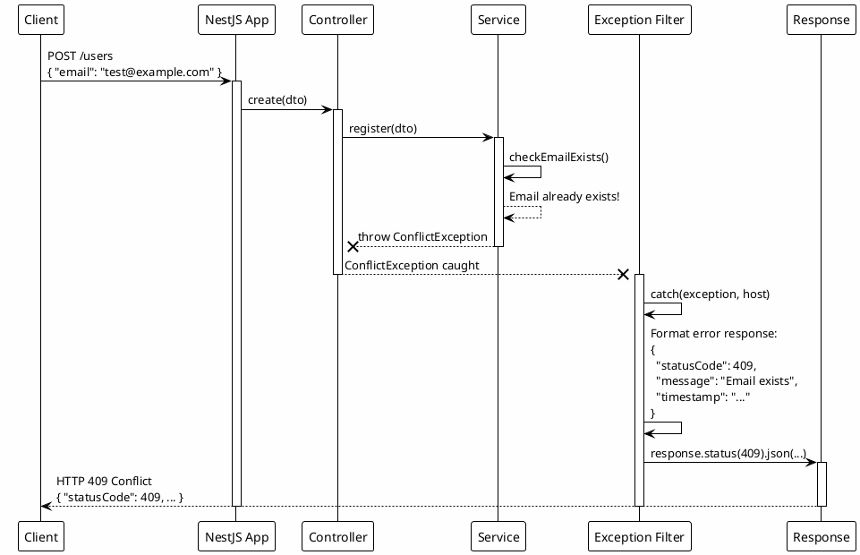
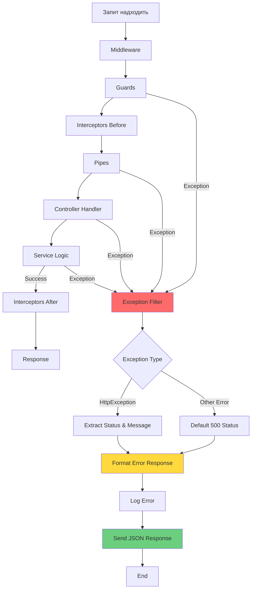

# Exception Filters: обробка виключень

::card-group

::card{title="🎯 Мета лекції" icon="i-lucide-target"}

- Зрозуміти концепцію Exception Filters (*фільтри виключень*) як останнього компонента Request Pipeline
- Опанувати ієрархію вбудованих HTTP-виключень NestJS та їхню семантику статус-кодів
- Навчитися створювати кастомні виключення через розширення класу `HttpException`
- Вивчити інтерфейс `ExceptionFilter` та метод `catch()` для перехоплення помилок
- Засвоїти роботу з `ArgumentsHost` для доступу до контексту виконання
- Практикувати формування структурованих JSON-відповідей з деталями помилок
- Розуміти різницю між специфічними та глобальними exception filters

::

::card{title="🔑 Ключові терміни" icon="i-lucide-key"}

- **Exception Filter** (*фільтр виключень*): компонент для перехоплення та обробки виключень на фінальному етапі Pipeline
- **HttpException** (*HTTP-виключення*): базовий клас для всіх виключень, що повертають HTTP-відповідь
- **ArgumentsHost** (*хост аргументів*): об'єкт з методами для доступу до request, response та інших аргументів контексту
- **Exception Response** (*відповідь про помилку*): структурований JSON-об'єкт з деталями помилки (statusCode, message, error)
- **Global Exception Filter** (*глобальний фільтр*): фільтр, що обробляє всі необроблені виключення у застосунку
- **Custom Exception** (*кастомне виключення*): власний клас помилки для специфічних бізнес-сценаріїв

::

::

## Концепція Exception Filters: останній рубіж захисту

Exception Filters є **фінальним компонентом** у Request Pipeline, що перехоплює всі виключення, викинуті на будь-якому етапі обробки запиту. Вони виконують роль **централізованого механізму обробки помилок**, що трансформує необроблені виключення у структуровані HTTP-відповіді.

На відміну від інших компонентів Pipeline (Middleware, Guards, Interceptors), що працюють **послідовно**, Exception Filters активуються **лише при виникненні виключення** та **пропускають** нормальний потік виконання. Їхня основна відповідальність:

- **Перехоплення виключень**: ловити помилки з Pipes, Guards, Interceptors, обробників
- **Логування помилок**: записувати стек трейси, контекст запиту, метадані користувача
- **Форматування відповідей**: перетворювати виключення в читабельні JSON-об'єкти
- **Приховування деталей**: не розкривати клієнту внутрішні помилки сервера
- **Встановлення статус-кодів**: правильний HTTP-статус для кожного типу помилки

Типові сценарії використання Exception Filters:

- **Валідаційні помилки**: формування списку помилок полів DTO
- **Помилки бази даних**: перетворення SQLException у зрозумілі повідомлення
- **Помилки зовнішніх API**: обробка timeout, connection refused
- **Помилки аутентифікації/авторизації**: уніфіковані відповіді 401/403
- **Невідомі помилки**: безпечне повідомлення «Internal Server Error»

::note
Exception Filters є реалізацією патерну **Exception Handling Pattern**, що централізує обробку помилок замість розкидання `try-catch` по всьому коду. Це дозволяє:
- Уникнути дублювання логіки обробки помилок
- Гарантувати консистентний формат відповідей про помилки
- Інтегрувати з системами моніторингу (Sentry, Datadog) в одному місці
::

## Ієрархія вбудованих HTTP-виключень

NestJS надає готові класи виключень для всіх стандартних HTTP-статус-кодів. Всі вони розширюють базовий клас `HttpException`:

```typescript
import {
  BadRequestException,           // 400 Bad Request
  UnauthorizedException,         // 401 Unauthorized
  PaymentRequiredException,      // 402 Payment Required
  ForbiddenException,            // 403 Forbidden
  NotFoundException,             // 404 Not Found
  MethodNotAllowedException,     // 405 Method Not Allowed
  NotAcceptableException,        // 406 Not Acceptable
  RequestTimeoutException,       // 408 Request Timeout
  ConflictException,             // 409 Conflict
  GoneException,                 // 410 Gone
  PreconditionFailedException,   // 412 Precondition Failed
  PayloadTooLargeException,      // 413 Payload Too Large
  UnsupportedMediaTypeException, // 415 Unsupported Media Type
  UnprocessableEntityException,  // 422 Unprocessable Entity
  TooManyRequestsException,      // 429 Too Many Requests
  InternalServerErrorException,  // 500 Internal Server Error
  NotImplementedException,       // 501 Not Implemented
  BadGatewayException,           // 502 Bad Gateway
  ServiceUnavailableException,   // 503 Service Unavailable
  GatewayTimeoutException,       // 504 Gateway Timeout
} from '@nestjs/common';
```

### Використання вбудованих виключень

```typescript
import { Controller, Get, Post, Param, Body, NotFoundException, ConflictException } from '@nestjs/common';

@Controller('users')
export class UsersController {
  constructor(private readonly usersService: UsersService) {}

  @Get(':id')
  async findOne(@Param('id') id: string) {
    const user = await this.usersService.findById(id);
    
    if (!user) {
      // Викидання виключення зупиняє виконання методу
      throw new NotFoundException(`User with ID ${id} not found`);
    }
    
    return user;
  }

  @Post()
  async create(@Body() dto: CreateUserDto) {
    const existingUser = await this.usersService.findByEmail(dto.email);
    
    if (existingUser) {
      throw new ConflictException('Email already registered');
    }
    
    try {
      return await this.usersService.create(dto);
    } catch (error) {
      if (error.code === '23505') { // PostgreSQL unique violation
        throw new ConflictException('Duplicate entry');
      }
      throw new InternalServerErrorException('Database error');
    }
  }

  @Get('premium/:id')
  async getPremiumContent(@Param('id') id: string, @Req() req: Request) {
    const user = req.user;

    if (!user) {
      throw new UnauthorizedException('Authentication required');
    }

    if (!user.subscription || user.subscription.status !== 'active') {
      throw new PaymentRequiredException('Active subscription required');
    }

    return this.contentService.getPremium(id);
  }
}
```

**HTTP-відповіді для різних виключень:**

::code-group

```http [404 Not Found]
GET /users/999 HTTP/1.1

HTTP/1.1 404 Not Found
Content-Type: application/json

{
  "statusCode": 404,
  "message": "User with ID 999 not found",
  "error": "Not Found"
}
```

```http [409 Conflict]
POST /users HTTP/1.1
Content-Type: application/json

{
  "email": "john@example.com"
}

HTTP/1.1 409 Conflict
Content-Type: application/json

{
  "statusCode": 409,
  "message": "Email already registered",
  "error": "Conflict"
}
```

```http [401 Unauthorized]
GET /users/premium/123 HTTP/1.1

HTTP/1.1 401 Unauthorized
Content-Type: application/json

{
  "statusCode": 401,
  "message": "Authentication required",
  "error": "Unauthorized"
}
```

::

### Передача детальної інформації про помилку

Виключення може приймати не лише рядок, а й об'єкт з додатковими полями:

```typescript
throw new BadRequestException({
  statusCode: 400,
  message: 'Validation failed',
  errors: [
    { field: 'email', message: 'Invalid email format' },
    { field: 'age', message: 'Must be at least 18' },
  ],
});
```

**HTTP-відповідь:**

```json
{
  "statusCode": 400,
  "message": "Validation failed",
  "errors": [
    { "field": "email", "message": "Invalid email format" },
    { "field": "age", "message": "Must be at least 18" }
  ],
  "error": "Bad Request"
}
```


## Створення кастомних виключень

Власні класи виключень дозволяють інкапсулювати специфічну бізнес-логіку помилок:

### Базове кастомне виключення

```typescript
import { HttpException, HttpStatus } from '@nestjs/common';

export class UserNotFoundException extends HttpException {
  constructor(userId: string) {
    super(
      `User with ID ${userId} not found`,
      HttpStatus.NOT_FOUND
    );
  }
}

export class EmailAlreadyExistsException extends HttpException {
  constructor(email: string) {
    super(
      `Email ${email} is already registered`,
      HttpStatus.CONFLICT
    );
  }
}

export class InsufficientBalanceException extends HttpException {
  constructor(required: number, available: number) {
    super(
      {
        statusCode: HttpStatus.PAYMENT_REQUIRED,
        error: 'Insufficient Balance',
        message: `Insufficient balance: required ${required}, available ${available}`,
        required,
        available,
      },
      HttpStatus.PAYMENT_REQUIRED
    );
  }
}
```

**Використання:**

```typescript
@Controller('users')
export class UsersController {
  @Get(':id')
  async findOne(@Param('id') id: string) {
    const user = await this.usersService.findById(id);
    
    if (!user) {
      throw new UserNotFoundException(id);
    }
    
    return user;
  }

  @Post('register')
  async register(@Body() dto: RegisterDto) {
    const exists = await this.usersService.existsByEmail(dto.email);
    
    if (exists) {
      throw new EmailAlreadyExistsException(dto.email);
    }
    
    return this.usersService.register(dto);
  }

  @Post('purchase')
  async purchase(@Body() dto: PurchaseDto, @CurrentUser() user: User) {
    if (user.balance < dto.amount) {
      throw new InsufficientBalanceException(dto.amount, user.balance);
    }
    
    return this.paymentsService.process(dto);
  }
}
```

### Виключення з action hints

Додавання підказок для клієнта про можливі дії:

```typescript
export class SubscriptionExpiredException extends HttpException {
  constructor(userId: string, expiredAt: Date) {
    super(
      {
        statusCode: HttpStatus.PAYMENT_REQUIRED,
        error: 'Subscription Expired',
        message: 'Your subscription has expired',
        expiredAt: expiredAt.toISOString(),
        actions: [
          { type: 'renew', label: 'Renew Subscription', url: '/subscriptions/renew' },
          { type: 'upgrade', label: 'Upgrade Plan', url: '/subscriptions/upgrade' },
        ],
      },
      HttpStatus.PAYMENT_REQUIRED
    );
  }
}
```

**JSON-відповідь:**

```json
{
  "statusCode": 402,
  "error": "Subscription Expired",
  "message": "Your subscription has expired",
  "expiredAt": "2026-08-01T00:00:00.000Z",
  "actions": [
    { "type": "renew", "label": "Renew Subscription", "url": "/subscriptions/renew" },
    { "type": "upgrade", "label": "Upgrade Plan", "url": "/subscriptions/upgrade" }
  ]
}
```

## Анатомія Exception Filter: інтерфейс ExceptionFilter

Кастомний filter реалізує інтерфейс `ExceptionFilter` з методом `catch()`:

```typescript
import { ExceptionFilter, Catch, ArgumentsHost, HttpException } from '@nestjs/common';
import { Request, Response } from 'express';

@Catch(HttpException)
export class HttpExceptionFilter implements ExceptionFilter {
  catch(exception: HttpException, host: ArgumentsHost) {
    const ctx = host.switchToHttp();
    const response = ctx.getResponse<Response>();
    const request = ctx.getRequest<Request>();
    
    const status = exception.getStatus();
    const exceptionResponse = exception.getResponse();

    // Формування структурованої відповіді
    const errorResponse = {
      statusCode: status,
      timestamp: new Date().toISOString(),
      path: request.url,
      method: request.method,
      message: typeof exceptionResponse === 'string' 
        ? exceptionResponse 
        : (exceptionResponse as any).message || exceptionResponse,
    };

    response.status(status).json(errorResponse);
  }
}
```

**Ключові компоненти:**

1. **`@Catch(HttpException)`**: вказує, які типи виключень перехоплювати
2. **`catch(exception, host)`**: метод, що викликається при виключенні
3. **`ArgumentsHost`**: об'єкт для доступу до контексту виконання
4. **`host.switchToHttp()`**: перемикання на HTTP-контекст (для отримання request/response)

### Розширений filter з логуванням

```typescript
import { ExceptionFilter, Catch, ArgumentsHost, HttpException, Logger } from '@nestjs/common';

@Catch(HttpException)
export class ExtendedHttpExceptionFilter implements ExceptionFilter {
  private readonly logger = new Logger(ExtendedHttpExceptionFilter.name);

  catch(exception: HttpException, host: ArgumentsHost) {
    const ctx = host.switchToHttp();
    const response = ctx.getResponse();
    const request = ctx.getRequest();
    const status = exception.getStatus();
    const exceptionResponse = exception.getResponse();

    // Логування помилки з контекстом
    this.logger.error(
      `HTTP ${status} Error: ${request.method} ${request.url}`,
      {
        statusCode: status,
        message: exception.message,
        stack: exception.stack,
        user: request.user?.id,
        ip: request.ip,
        userAgent: request.get('user-agent'),
      }
    );

    // Формування відповіді
    const errorResponse = {
      statusCode: status,
      timestamp: new Date().toISOString(),
      path: request.url,
      method: request.method,
      message: typeof exceptionResponse === 'string'
        ? exceptionResponse
        : (exceptionResponse as any).message,
      ...(process.env.NODE_ENV === 'development' && {
        stack: exception.stack, // Стек лише у development
      }),
    };

    response.status(status).json(errorResponse);
  }
}
```

## Глобальний Exception Filter

Для обробки **всіх** типів виключень (включно з неочікуваними помилками):

```typescript
import { ExceptionFilter, Catch, ArgumentsHost, HttpException, HttpStatus, Logger } from '@nestjs/common';
import { Request, Response } from 'express';

@Catch()
export class AllExceptionsFilter implements ExceptionFilter {
  private readonly logger = new Logger(AllExceptionsFilter.name);

  catch(exception: unknown, host: ArgumentsHost) {
    const ctx = host.switchToHttp();
    const response = ctx.getResponse<Response>();
    const request = ctx.getRequest<Request>();

    // Визначення статус-коду
    const status = exception instanceof HttpException
      ? exception.getStatus()
      : HttpStatus.INTERNAL_SERVER_ERROR;

    // Визначення повідомлення
    let message: string | object = 'Internal server error';
    
    if (exception instanceof HttpException) {
      const exceptionResponse = exception.getResponse();
      message = typeof exceptionResponse === 'string'
        ? exceptionResponse
        : exceptionResponse;
    } else if (exception instanceof Error) {
      message = exception.message;
    }

    // Логування помилки
    this.logger.error(
      `${request.method} ${request.url}`,
      {
        statusCode: status,
        message,
        stack: exception instanceof Error ? exception.stack : undefined,
        user: request['user']?.id,
        timestamp: new Date().toISOString(),
      }
    );

    // Відправлення відповіді
    response.status(status).json({
      statusCode: status,
      timestamp: new Date().toISOString(),
      path: request.url,
      message: status === 500 
        ? 'Internal server error' // Приховати деталі для 500
        : message,
    });
  }
}
```

**Реєстрація глобально:**

```typescript
// main.ts
import { NestFactory } from '@nestjs/core';
import { AppModule } from './app.module';
import { AllExceptionsFilter } from './filters/all-exceptions.filter';

async function bootstrap() {
  const app = await NestFactory.create(AppModule);

  // Глобальна реєстрація
  app.useGlobalFilters(new AllExceptionsFilter());

  await app.listen(3000);
}
bootstrap();
```

**Альтернативно через модуль (з DI):**

```typescript
// app.module.ts
import { Module } from '@nestjs/common';
import { APP_FILTER } from '@nestjs/core';
import { AllExceptionsFilter } from './filters/all-exceptions.filter';

@Module({
  providers: [
    {
      provide: APP_FILTER,
      useClass: AllExceptionsFilter,
    },
  ],
})
export class AppModule {}
```

::note
Реєстрація через модуль (`APP_FILTER`) дозволяє використовувати Dependency Injection у filter. Якщо filter потребує впровадження сервісів (наприклад, для логування у БД), обирайте цей спосіб замість `app.useGlobalFilters()`.
::

## Спеціалізовані Exception Filters

### Filter для ValidationException

Обробка помилок валідації з детальним списком полів:

```typescript
import { ExceptionFilter, Catch, ArgumentsHost, BadRequestException } from '@nestjs/common';

@Catch(BadRequestException)
export class ValidationExceptionFilter implements ExceptionFilter {
  catch(exception: BadRequestException, host: ArgumentsHost) {
    const ctx = host.switchToHttp();
    const response = ctx.getResponse();
    const request = ctx.getRequest();
    const exceptionResponse: any = exception.getResponse();

    // Витягування помилок валідації
    const validationErrors = exceptionResponse.message;

    const errorResponse = {
      statusCode: 400,
      timestamp: new Date().toISOString(),
      path: request.url,
      message: 'Validation failed',
      errors: Array.isArray(validationErrors)
        ? validationErrors.map(err => ({
            field: err.property || 'unknown',
            value: err.value,
            constraints: err.constraints,
          }))
        : [{ message: validationErrors }],
    };

    response.status(400).json(errorResponse);
  }
}
```

**JSON-відповідь:**

```json
{
  "statusCode": 400,
  "timestamp": "2026-09-05T16:00:00.123Z",
  "path": "/api/users",
  "message": "Validation failed",
  "errors": [
    {
      "field": "email",
      "value": "invalid-email",
      "constraints": {
        "isEmail": "email must be an email"
      }
    },
    {
      "field": "age",
      "value": 15,
      "constraints": {
        "min": "age must not be less than 18"
      }
    }
  ]
}
```

### Filter для помилок бази даних

```typescript
import { ExceptionFilter, Catch, ArgumentsHost, HttpStatus } from '@nestjs/common';
import { QueryFailedError } from 'typeorm';

@Catch(QueryFailedError)
export class DatabaseExceptionFilter implements ExceptionFilter {
  catch(exception: QueryFailedError, host: ArgumentsHost) {
    const ctx = host.switchToHttp();
    const response = ctx.getResponse();
    const request = ctx.getRequest();

    // PostgreSQL error codes
    const errorCode = (exception as any).code;
    let statusCode = HttpStatus.INTERNAL_SERVER_ERROR;
    let message = 'Database error';

    switch (errorCode) {
      case '23505': // unique_violation
        statusCode = HttpStatus.CONFLICT;
        message = 'Duplicate entry: record already exists';
        break;
      case '23503': // foreign_key_violation
        statusCode = HttpStatus.BAD_REQUEST;
        message = 'Referenced record does not exist';
        break;
      case '23502': // not_null_violation
        statusCode = HttpStatus.BAD_REQUEST;
        message = 'Required field is missing';
        break;
      case '22P02': // invalid_text_representation
        statusCode = HttpStatus.BAD_REQUEST;
        message = 'Invalid data format';
        break;
    }

    response.status(statusCode).json({
      statusCode,
      timestamp: new Date().toISOString(),
      path: request.url,
      message,
    });
  }
}
```

## Застосування filters на різних рівнях

### На рівні методу

```typescript
@Controller('users')
export class UsersController {
  @Get(':id')
  @UseFilters(HttpExceptionFilter)
  async findOne(@Param('id') id: string) {
    return this.usersService.findById(id);
  }
}
```

### На рівні контролера

```typescript
@Controller('products')
@UseFilters(HttpExceptionFilter, ValidationExceptionFilter)
export class ProductsController {
  // Всі методи використовують обидва filters
}
```

### Глобально

```typescript
// main.ts
app.useGlobalFilters(
  new AllExceptionsFilter(),
  new ValidationExceptionFilter(),
  new DatabaseExceptionFilter()
);
```

**Порядок виконання filters:** специфічний → загальний (від конкретного до універсального).


## Робота з ArgumentsHost: доступ до контексту виконання

`ArgumentsHost` надає уніфікований інтерфейс для доступу до аргументів обробника в різних контекстах (HTTP, WebSockets, RPC):

### Методи ArgumentsHost

```typescript
import { ArgumentsHost } from '@nestjs/common';

@Catch()
export class DetailedExceptionFilter implements ExceptionFilter {
  catch(exception: unknown, host: ArgumentsHost) {
    // 1. Визначення типу контексту
    const contextType = host.getType(); // 'http' | 'rpc' | 'ws'
    
    if (contextType === 'http') {
      // 2. Перемикання на HTTP-контекст
      const httpContext = host.switchToHttp();
      
      // 3. Отримання request та response
      const request = httpContext.getRequest<Request>();
      const response = httpContext.getResponse<Response>();
      
      // 4. Доступ до next() (якщо використовується Express middleware)
      const next = httpContext.getNext();
      
      // Використання даних з request
      const { method, url, headers, body, query, params } = request;
      const userAgent = request.get('user-agent');
      const ip = request.ip;
      const user = request['user']; // з JWT payload після AuthGuard
      
      // Формування відповіді
      response.status(500).json({
        statusCode: 500,
        path: url,
        method,
        timestamp: new Date().toISOString(),
        message: 'Internal server error',
      });
    }
  }
}
```

### Витягування контексту для різних платформ

```typescript
@Catch()
export class UniversalExceptionFilter implements ExceptionFilter {
  catch(exception: unknown, host: ArgumentsHost) {
    const contextType = host.getType<'http' | 'rpc' | 'ws'>();

    switch (contextType) {
      case 'http':
        return this.handleHttpException(exception, host);
      case 'ws':
        return this.handleWsException(exception, host);
      case 'rpc':
        return this.handleRpcException(exception, host);
    }
  }

  private handleHttpException(exception: unknown, host: ArgumentsHost) {
    const ctx = host.switchToHttp();
    const response = ctx.getResponse();
    const request = ctx.getRequest();
    
    response.status(500).json({
      message: 'HTTP error occurred',
      path: request.url,
    });
  }

  private handleWsException(exception: unknown, host: ArgumentsHost) {
    const client = host.switchToWs().getClient();
    client.emit('error', { message: 'WebSocket error occurred' });
  }

  private handleRpcException(exception: unknown, host: ArgumentsHost) {
    // Обробка RPC (gRPC, TCP)
    const rpcContext = host.switchToRpc();
    const data = rpcContext.getData();
    // ...
  }
}
```

### Доступ до метаданих через Reflector

```typescript
import { ExceptionFilter, Catch, ArgumentsHost, HttpException } from '@nestjs/common';
import { Reflector } from '@nestjs/core';

@Catch(HttpException)
export class MetadataAwareExceptionFilter implements ExceptionFilter {
  constructor(private reflector: Reflector) {}

  catch(exception: HttpException, host: ArgumentsHost) {
    const ctx = host.switchToHttp();
    const response = ctx.getResponse();
    
    // Витягування метаданих з handler або class
    const handler = host.getHandler();
    const classRef = host.getClass();
    
    const isPublic = this.reflector.get<boolean>('isPublic', handler);
    const roles = this.reflector.get<string[]>('roles', handler);
    
    // Логіка залежно від метаданих
    const errorResponse = {
      statusCode: exception.getStatus(),
      message: exception.message,
      ...(isPublic && { hint: 'This is a public endpoint' }),
      ...(roles && { requiredRoles: roles }),
    };
    
    response.status(exception.getStatus()).json(errorResponse);
  }
}
```

::tip
**Порада:** використовуйте `ArgumentsHost` для доступу до **request headers** (User-Agent, Authorization), **user об'єкта** (з JWT), **query/body параметрів** для логування та формування детальних відповідей про помилки.
::

## Інтеграція з системами моніторингу

### Інтеграція з Sentry

```typescript
import { ExceptionFilter, Catch, ArgumentsHost, HttpException } from '@nestjs/common';
import * as Sentry from '@sentry/node';

@Catch()
export class SentryExceptionFilter implements ExceptionFilter {
  catch(exception: unknown, host: ArgumentsHost) {
    const ctx = host.switchToHttp();
    const response = ctx.getResponse();
    const request = ctx.getRequest();

    // Відправлення помилки в Sentry
    Sentry.withScope(scope => {
      scope.setExtra('request', {
        method: request.method,
        url: request.url,
        headers: request.headers,
        body: request.body,
        query: request.query,
      });

      scope.setUser({
        id: request.user?.id,
        email: request.user?.email,
        ip_address: request.ip,
      });

      scope.setTag('status', exception instanceof HttpException 
        ? exception.getStatus() 
        : 500
      );

      if (exception instanceof Error) {
        Sentry.captureException(exception);
      } else {
        Sentry.captureMessage(`Non-error exception: ${JSON.stringify(exception)}`);
      }
    });

    // Формування відповіді
    const status = exception instanceof HttpException
      ? exception.getStatus()
      : 500;

    response.status(status).json({
      statusCode: status,
      message: status === 500 ? 'Internal server error' : exception['message'],
      timestamp: new Date().toISOString(),
    });
  }
}
```

### Інтеграція з Winston Logger

```typescript
import { ExceptionFilter, Catch, ArgumentsHost, HttpException } from '@nestjs/common';
import { Logger } from 'winston';

@Catch()
export class WinstonExceptionFilter implements ExceptionFilter {
  constructor(private readonly logger: Logger) {}

  catch(exception: unknown, host: ArgumentsHost) {
    const ctx = host.switchToHttp();
    const response = ctx.getResponse();
    const request = ctx.getRequest();

    const status = exception instanceof HttpException
      ? exception.getStatus()
      : 500;

    // Логування у Winston з різними рівнями
    const logLevel = status >= 500 ? 'error' : 'warn';
    
    this.logger.log(logLevel, 'Exception occurred', {
      statusCode: status,
      method: request.method,
      url: request.url,
      message: exception instanceof Error ? exception.message : 'Unknown error',
      stack: exception instanceof Error ? exception.stack : undefined,
      userId: request.user?.id,
      timestamp: new Date().toISOString(),
      requestId: request.id,
    });

    response.status(status).json({
      statusCode: status,
      message: exception instanceof HttpException 
        ? exception.message 
        : 'Internal server error',
      timestamp: new Date().toISOString(),
    });
  }
}
```

## Тестування Exception Filters

### Unit-тестування filter

```typescript
import { HttpException, HttpStatus } from '@nestjs/common';
import { Test } from '@nestjs/testing';
import { HttpExceptionFilter } from './http-exception.filter';

describe('HttpExceptionFilter', () => {
  let filter: HttpExceptionFilter;

  beforeEach(async () => {
    const module = await Test.createTestingModule({
      providers: [HttpExceptionFilter],
    }).compile();

    filter = module.get<HttpExceptionFilter>(HttpExceptionFilter);
  });

  it('should format HttpException correctly', () => {
    const exception = new HttpException('Not found', HttpStatus.NOT_FOUND);
    
    const mockJson = jest.fn();
    const mockStatus = jest.fn().mockReturnValue({ json: mockJson });
    const mockGetResponse = jest.fn().mockReturnValue({
      status: mockStatus,
    });
    const mockGetRequest = jest.fn().mockReturnValue({
      url: '/api/users/999',
      method: 'GET',
    });

    const host = {
      switchToHttp: () => ({
        getResponse: mockGetResponse,
        getRequest: mockGetRequest,
      }),
    } as any;

    filter.catch(exception, host);

    expect(mockStatus).toHaveBeenCalledWith(404);
    expect(mockJson).toHaveBeenCalledWith(
      expect.objectContaining({
        statusCode: 404,
        message: 'Not found',
        path: '/api/users/999',
        method: 'GET',
      })
    );
  });

  it('should handle custom exception with object response', () => {
    const exception = new HttpException(
      {
        statusCode: 400,
        message: 'Validation failed',
        errors: [{ field: 'email', message: 'Invalid email' }],
      },
      HttpStatus.BAD_REQUEST
    );

    const mockJson = jest.fn();
    const mockStatus = jest.fn().mockReturnValue({ json: mockJson });
    const mockGetResponse = jest.fn().mockReturnValue({
      status: mockStatus,
    });
    const mockGetRequest = jest.fn().mockReturnValue({
      url: '/api/users',
      method: 'POST',
    });

    const host = {
      switchToHttp: () => ({
        getResponse: mockGetResponse,
        getRequest: mockGetRequest,
      }),
    } as any;

    filter.catch(exception, host);

    expect(mockStatus).toHaveBeenCalledWith(400);
    expect(mockJson).toHaveBeenCalledWith(
      expect.objectContaining({
        statusCode: 400,
        message: expect.anything(),
      })
    );
  });
});
```

### E2E-тестування з фільтрами

```typescript
import { Test, TestingModule } from '@nestjs/testing';
import { INestApplication, HttpStatus } from '@nestjs/common';
import * as request from 'supertest';
import { AppModule } from './../src/app.module';
import { AllExceptionsFilter } from './../src/filters/all-exceptions.filter';

describe('Exception Filters (e2e)', () => {
  let app: INestApplication;

  beforeAll(async () => {
    const moduleFixture: TestingModule = await Test.createTestingModule({
      imports: [AppModule],
    }).compile();

    app = moduleFixture.createNestApplication();
    app.useGlobalFilters(new AllExceptionsFilter());
    await app.init();
  });

  afterAll(async () => {
    await app.close();
  });

  it('/users/:id (GET) - should return 404 for non-existent user', () => {
    return request(app.getHttpServer())
      .get('/users/999')
      .expect(HttpStatus.NOT_FOUND)
      .expect(res => {
        expect(res.body).toMatchObject({
          statusCode: 404,
          message: expect.stringContaining('not found'),
          timestamp: expect.any(String),
        });
      });
  });

  it('/users (POST) - should return 409 for duplicate email', () => {
    return request(app.getHttpServer())
      .post('/users')
      .send({ email: 'existing@example.com', password: '123456' })
      .expect(HttpStatus.CONFLICT)
      .expect(res => {
        expect(res.body.statusCode).toBe(409);
        expect(res.body.message).toContain('already exists');
      });
  });

  it('should handle validation errors with structured response', () => {
    return request(app.getHttpServer())
      .post('/users')
      .send({ email: 'invalid-email', age: 15 })
      .expect(HttpStatus.BAD_REQUEST)
      .expect(res => {
        expect(res.body).toMatchObject({
          statusCode: 400,
          message: 'Validation failed',
          errors: expect.arrayContaining([
            expect.objectContaining({ field: 'email' }),
            expect.objectContaining({ field: 'age' }),
          ]),
        });
      });
  });
});
```

::note
**Важливо:** у unit-тестах filters використовуйте **мокування** `ArgumentsHost` з методами `switchToHttp()`, `getResponse()`, `getRequest()`. У E2E-тестах перевіряйте **реальні HTTP-відповіді** через `supertest`.
::

## Візуалізація виконання Exception Filters



**Опис діаграми:**

1. **Client → Controller**: запит надходить до контролера
2. **Controller → Service**: виклик бізнес-логіки
3. **Service**: виявляється помилка (email вже існує)
4. **Service → Exception**: викидається `ConflictException`
5. **Exception Filter**: перехоплює виключення
6. **Filter → Response**: формує структуровану JSON-відповідь
7. **Response → Client**: повертає HTTP 409 з деталями помилки

## Найкращі практики Exception Filters

### 1. Структуровані відповіді

::code-group

```typescript [❌ Погано]
throw new Error('Something went wrong');

// Response:
{
  "statusCode": 500,
  "message": "Something went wrong"
}
```

```typescript [✅ Добре]
throw new BadRequestException({
  statusCode: 400,
  error: 'Validation Error',
  message: 'Invalid input data',
  fields: [
    { name: 'email', error: 'Invalid format' },
  ],
});

// Response:
{
  "statusCode": 400,
  "error": "Validation Error",
  "message": "Invalid input data",
  "fields": [
    { "name": "email", "error": "Invalid format" }
  ],
  "timestamp": "2026-09-05T17:00:00.000Z"
}
```

::

### 2. Не розкривати чутливу інформацію

::code-group

```typescript [❌ Погано]
catch (error) {
  throw new InternalServerErrorException(error.stack); // Стек у production!
}
```

```typescript [✅ Добре]
catch (error) {
  this.logger.error('Database error', error.stack);
  throw new InternalServerErrorException('An error occurred');
}
```

::

### 3. Логування з контекстом

```typescript
this.logger.error('User registration failed', {
  error: exception.message,
  stack: exception.stack,
  userId: request.user?.id,
  email: dto.email,
  ip: request.ip,
  userAgent: request.get('user-agent'),
  timestamp: new Date().toISOString(),
  requestId: request.headers['x-request-id'],
});
```

### 4. Узгоджений формат для всіх помилок

```typescript
interface ErrorResponse {
  statusCode: number;
  error: string;           // Назва помилки (NotFound, ValidationError)
  message: string;         // Читабельне повідомлення
  timestamp: string;       // ISO 8601
  path: string;            // URL запиту
  method: string;          // HTTP-метод
  requestId?: string;      // Для трейсингу
  details?: any;           // Додаткова інформація
}
```

### 5. Різні filter для різних середовищ

```typescript
// production.filter.ts
@Catch()
export class ProductionExceptionFilter implements ExceptionFilter {
  catch(exception: unknown, host: ArgumentsHost) {
    // Мінімальна інформація, без стеків
    response.json({
      statusCode: 500,
      message: 'Internal server error',
    });
  }
}

// development.filter.ts
@Catch()
export class DevelopmentExceptionFilter implements ExceptionFilter {
  catch(exception: unknown, host: ArgumentsHost) {
    // Детальна інформація зі стеками
    response.json({
      statusCode: 500,
      message: exception.message,
      stack: exception.stack,
      details: exception,
    });
  }
}

// main.ts
const filter = process.env.NODE_ENV === 'production'
  ? new ProductionExceptionFilter()
  : new DevelopmentExceptionFilter();

app.useGlobalFilters(filter);
```

### 6. Централізоване логування помилок

```typescript
@Injectable()
export class ErrorLoggerService {
  async logError(error: Error, context: any) {
    // Логування у БД
    await this.errorLogsRepository.save({
      message: error.message,
      stack: error.stack,
      context,
      timestamp: new Date(),
    });

    // Відправлення в Sentry/Datadog
    Sentry.captureException(error, { extra: context });
  }
}

@Catch()
export class LoggingExceptionFilter implements ExceptionFilter {
  constructor(private errorLogger: ErrorLoggerService) {}

  async catch(exception: unknown, host: ArgumentsHost) {
    const ctx = host.switchToHttp();
    const request = ctx.getRequest();

    await this.errorLogger.logError(exception as Error, {
      url: request.url,
      method: request.method,
      userId: request.user?.id,
    });

    // ... формування відповіді
  }
}
```


## Діаграма lifecycle Exception Filter



**Опис етапів:**

1. **Запит проходить Pipeline**: Middleware → Guards → Interceptors → Pipes → Handler
2. **Виключення може виникнути** на будь-якому етапі (Guards, Pipes, Controller, Service)
3. **Exception Filter перехоплює** виключення незалежно від місця виникнення
4. **Визначення типу**: `HttpException` (статус з об'єкта) або загальна помилка (500)
5. **Форматування відповіді**: створення структурованого JSON
6. **Логування**: запис у лог-систему (Winston, Sentry)
7. **Відправлення відповіді**: повернення JSON клієнту з правильним HTTP-статусом

## Підсумок

::card-group

::card{title="🎯 HttpException Hierarchy" icon="i-lucide-layers"}

NestJS надає готові класи виключень для всіх стандартних HTTP-статус-кодів (400, 401, 403, 404, 409, 500). Використовуйте їх замість загального `Error` для автоматичного встановлення правильного статус-коду.

**Приклад:**
```typescript
throw new NotFoundException('User not found');
// Response: HTTP 404
```

::

::card{title="🔧 Custom Exception Filters" icon="i-lucide-filter"}

Створюйте кастомні filters через декоратор `@Catch()` та інтерфейс `ExceptionFilter`. Метод `catch()` отримує виключення та `ArgumentsHost` для доступу до request/response.

**Приклад:**
```typescript
@Catch(HttpException)
export class HttpExceptionFilter implements ExceptionFilter {
  catch(exception, host) { /* ... */ }
}
```

::

::card{title="📍 ArgumentsHost API" icon="i-lucide-cpu"}

`ArgumentsHost` надає уніфікований доступ до контексту виконання. Метод `switchToHttp()` повертає HTTP-контекст з `getRequest()` та `getResponse()` для витягування даних запиту.

**Приклад:**
```typescript
const ctx = host.switchToHttp();
const request = ctx.getRequest();
const response = ctx.getResponse();
```

::

::card{title="🌍 Global Exception Filters" icon="i-lucide-globe"}

Реєструйте глобальні filters через `app.useGlobalFilters()` у `main.ts` або через `APP_FILTER` токен у модулі для використання Dependency Injection.

**Приклад:**
```typescript
app.useGlobalFilters(new AllExceptionsFilter());
```

::

::card{title="📝 Structured Error Responses" icon="i-lucide-file-json"}

Формуйте структуровані JSON-відповіді з полями: `statusCode`, `message`, `timestamp`, `path`, `error`. Додавайте поля `details`, `requestId` для детального трейсингу.

**Приклад:**
```json
{
  "statusCode": 400,
  "message": "Validation failed",
  "errors": [...]
}
```

::

::card{title="🔒 Security Best Practices" icon="i-lucide-shield"}

Не розкривайте клієнту внутрішні деталі помилок (stack traces, SQL-запити, шляхи до файлів). У production повертайте загальне повідомлення «Internal server error» для 500-х помилок.

**Приклад:**
```typescript
message: isDevelopment ? error.stack : 'Internal server error'
```

::

::card{title="📊 Monitoring Integration" icon="i-lucide-activity"}

Інтегруйте filters з системами моніторингу (Sentry, Datadog) для централізованого збору помилок. Додавайте контекст: userId, requestId, user-agent, IP-адресу.

**Приклад:**
```typescript
Sentry.captureException(error, { extra: { userId, url } });
```

::

::card{title="🧪 Testing Filters" icon="i-lucide-flask-conical"}

Тестуйте filters через unit-тести (мокування `ArgumentsHost`) та E2E-тести (`supertest`). Перевіряйте структуру відповідей, статус-коди, логування.

**Приклад:**
```typescript
expect(mockStatus).toHaveBeenCalledWith(404);
expect(mockJson).toHaveBeenCalledWith({ statusCode: 404 });
```

::

::

## Часті запитання (FAQ)

::accordion

::accordion-item{title="Чи можна мати кілька exception filters для одного контролера?"}

**Так**, можна застосувати кілька filters через `@UseFilters()`:

```typescript
@Controller('users')
@UseFilters(HttpExceptionFilter, ValidationExceptionFilter, DatabaseExceptionFilter)
export class UsersController {}
```

**Порядок виконання:** від специфічного до загального. Якщо перший filter не обробив виключення (не відповідає типу у `@Catch()`), воно передається наступному.

::

::accordion-item{title="Яка різниця між @Catch(HttpException) та @Catch()?"}

- **`@Catch(HttpException)`**: перехоплює **лише** `HttpException` та його підкласи (404, 400, 401).
- **`@Catch()`**: перехоплює **всі** типи виключень, включно з `Error`, `TypeError`, необроблені помилки.

**Рекомендація:** використовуйте `@Catch()` для **глобального** filter, що є останнім рубежем захисту.

::

::accordion-item{title="Як передати кастомні дані у виключенні?"}

Передайте об'єкт замість рядка у конструкторі `HttpException`:

```typescript
throw new BadRequestException({
  statusCode: 400,
  error: 'Validation Error',
  message: 'Invalid data',
  fields: [
    { name: 'email', error: 'Required' },
  ],
});
```

У filter отримайте через `exception.getResponse()`:

```typescript
const response = exception.getResponse();
// { statusCode: 400, error: 'Validation Error', ... }
```

::

::accordion-item{title="Чи можна використовувати Dependency Injection у exception filters?"}

**Так**, якщо зареєструвати filter через модуль:

```typescript
// app.module.ts
@Module({
  providers: [
    {
      provide: APP_FILTER,
      useClass: LoggingExceptionFilter,
    },
    ErrorLoggerService, // Сервіс для логування
  ],
})
export class AppModule {}

// logging-exception.filter.ts
@Catch()
export class LoggingExceptionFilter implements ExceptionFilter {
  constructor(private errorLogger: ErrorLoggerService) {}
  // Сервіс впроваджується автоматично
}
```

**Увага:** `app.useGlobalFilters(new MyFilter())` **не підтримує** DI, бо створює екземпляр поза контейнером.

::

::accordion-item{title="Як обробити помилки валідації з class-validator?"}

NestJS автоматично викидає `BadRequestException` при помилках валідації. Створіть спеціалізований filter:

```typescript
@Catch(BadRequestException)
export class ValidationExceptionFilter implements ExceptionFilter {
  catch(exception: BadRequestException, host: ArgumentsHost) {
    const response = host.switchToHttp().getResponse();
    const exceptionResponse: any = exception.getResponse();

    // Витягування помилок з ValidationPipe
    const errors = exceptionResponse.message; // Масив об'єктів ValidationError

    response.status(400).json({
      statusCode: 400,
      message: 'Validation failed',
      errors: errors.map(err => ({
        field: err.property,
        constraints: err.constraints,
      })),
    });
  }
}
```

::

::accordion-item{title="Чи виконуються exception filters для interceptors?"}

**Так**. Якщо `Interceptor` викидає виключення (до або після обробника), воно перехоплюється `ExceptionFilter`:

```typescript
@Injectable()
export class LoggingInterceptor implements NestInterceptor {
  intercept(context, next) {
    if (someCondition) {
      throw new ForbiddenException('Access denied'); // Перехопить filter
    }
    return next.handle();
  }
}
```

::

::accordion-item{title="Як логувати помилки у filter без блокування відповіді?"}

Використовуйте **асинхронне логування** (Promise без `await` або event-emitter):

```typescript
catch(exception: unknown, host: ArgumentsHost) {
  const ctx = host.switchToHttp();
  const response = ctx.getResponse();

  // Асинхронне логування (не блокує)
  this.logError(exception, ctx).catch(err => {
    console.error('Logging failed', err);
  });

  // Відразу відправляємо відповідь
  response.status(500).json({ message: 'Error' });
}

private async logError(exception: unknown, ctx: any) {
  await this.errorLogsRepository.save({ /* ... */ });
  await Sentry.captureException(exception);
}
```

**Альтернатива:** використовуйте черги (Bull, RabbitMQ) для офлайн-логування.

::

::accordion-item{title="Чи можна змінити стандартну відповідь для всіх виключень?"}

**Так**, створіть глобальний filter з `@Catch()`:

```typescript
@Catch()
export class GlobalExceptionFilter implements ExceptionFilter {
  catch(exception: unknown, host: ArgumentsHost) {
    const ctx = host.switchToHttp();
    const response = ctx.getResponse();

    // Уніфікований формат для всіх помилок
    const status = exception instanceof HttpException 
      ? exception.getStatus() 
      : 500;

    response.status(status).json({
      success: false, // Додаткове поле
      statusCode: status,
      message: exception['message'] || 'Error',
      timestamp: new Date().toISOString(),
    });
  }
}
```

Зареєструйте глобально: `app.useGlobalFilters(new GlobalExceptionFilter())`.

::

::accordion-item{title="Як протестувати exception filter у unit-тестах?"}

Мокуйте `ArgumentsHost` та його методи:

```typescript
it('should handle exception', () => {
  const filter = new HttpExceptionFilter();
  const exception = new NotFoundException('Not found');

  const mockJson = jest.fn();
  const mockStatus = jest.fn().mockReturnValue({ json: mockJson });
  const mockResponse = { status: mockStatus };
  const mockRequest = { url: '/users/1', method: 'GET' };

  const host = {
    switchToHttp: () => ({
      getResponse: () => mockResponse,
      getRequest: () => mockRequest,
    }),
  } as any;

  filter.catch(exception, host);

  expect(mockStatus).toHaveBeenCalledWith(404);
  expect(mockJson).toHaveBeenCalledWith(
    expect.objectContaining({
      statusCode: 404,
      message: 'Not found',
    })
  );
});
```

::

::

---

У наступній лекції **15. Custom Exception Filters** ми розглянемо створення спеціалізованих filters для валідації, помилок бази даних, зовнішніх API та інтеграцію з Sentry/Datadog.
