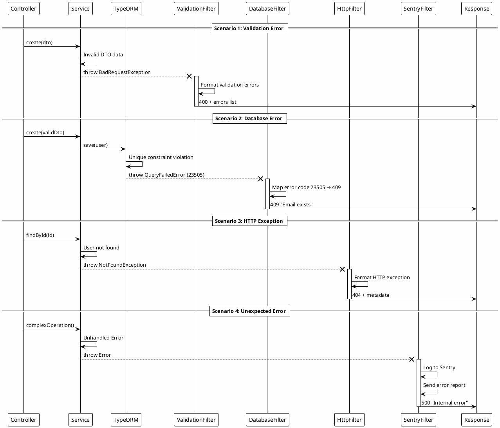

# Custom Exception Filters: спеціалізовані фільтри

::card-group

::card{title="🎯 Мета лекції" icon="i-lucide-target"}

- Зрозуміти необхідність спеціалізованих exception filters для різних типів помилок
- Опанувати створення `ValidationExceptionFilter` для детальної обробки помилок валідації DTO
- Навчитися розробляти `DatabaseExceptionFilter` для трансформації помилок TypeORM/Sequelize
- Вивчити `HttpExceptionFilter` для форматування стандартних HTTP-виключень
- Засвоїти інтеграцію з Sentry/Datadog для централізованого моніторингу помилок
- Практикувати створення `TimeoutExceptionFilter` та `UnauthorizedExceptionFilter`
- Розуміти композицію filters та їх пріоритетність виконання

::

::card{title="🔑 Ключові терміни" icon="i-lucide-key"}

- **ValidationExceptionFilter** (*фільтр валідації*): filter для обробки помилок `class-validator` з деталями про поля
- **DatabaseExceptionFilter** (*фільтр БД*): filter для трансформації помилок ORM у зрозумілі HTTP-відповіді
- **Exception Transformation** (*трансформація виключень*): перетворення низькорівневих помилок у структуровані відповіді
- **Sentry Integration** (*інтеграція Sentry*): автоматична відправка помилок у систему моніторингу
- **Error Context Enrichment** (*збагачення контексту*): додавання метаданих (user, request, trace) до логів помилок
- **Filter Composition** (*композиція фільтрів*): комбінування кількох filters для різних типів виключень

::

::

## Необхідність спеціалізованих exception filters

Різні типи помилок вимагають **різної обробки**:

- **Валідаційні помилки**: потребують списку полів з constraints
- **Помилки бази даних**: приховують SQL-деталі, перетворюють коди помилок
- **Помилки зовнішніх API**: обробляють timeout, connection refused, 503
- **Помилки аутентифікації**: додають WWW-Authenticate заголовки
- **Помилки авторизації**: логують спроби несанкціонованого доступу

**Загальний filter vs спеціалізовані:**

::code-group

```typescript [❌ Один filter для всього]
@Catch()
export class GeneralFilter implements ExceptionFilter {
  catch(exception: unknown, host: ArgumentsHost) {
    // Складна логіка if-else для кожного типу
    if (exception instanceof ValidationError) { /* ... */ }
    else if (exception instanceof QueryFailedError) { /* ... */ }
    else if (exception instanceof UnauthorizedException) { /* ... */ }
    // 100+ рядків коду
  }
}
```

```typescript [✅ Спеціалізовані filters]
@Catch(BadRequestException)
export class ValidationExceptionFilter { /* ... */ }

@Catch(QueryFailedError)
export class DatabaseExceptionFilter { /* ... */ }

@Catch(UnauthorizedException)
export class AuthExceptionFilter { /* ... */ }

// Кожен filter фокусується на одному типі
```

::

::note
Спеціалізовані filters дотримуються принципу **Single Responsibility** (SOLID): кожен filter відповідає за **один тип** помилок, що спрощує підтримку та тестування.
::

## ValidationExceptionFilter: обробка помилок валідації

`ValidationPipe` автоматично викидає `BadRequestException` при помилках `class-validator`. Створимо filter для детального форматування:

### Базова версія ValidationExceptionFilter

```typescript
import { ExceptionFilter, Catch, ArgumentsHost, BadRequestException } from '@nestjs/common';
import { Request, Response } from 'express';

@Catch(BadRequestException)
export class ValidationExceptionFilter implements ExceptionFilter {
  catch(exception: BadRequestException, host: ArgumentsHost) {
    const ctx = host.switchToHttp();
    const response = ctx.getResponse<Response>();
    const request = ctx.getRequest<Request>();
    const status = exception.getStatus();
    const exceptionResponse: any = exception.getResponse();

    // Витягування помилок валідації
    const validationErrors = exceptionResponse.message;

    // Структурування відповіді
    const errorResponse = {
      statusCode: status,
      error: 'Validation Failed',
      message: 'Request validation failed',
      timestamp: new Date().toISOString(),
      path: request.url,
      method: request.method,
      errors: this.formatValidationErrors(validationErrors),
    };

    response.status(status).json(errorResponse);
  }

  private formatValidationErrors(errors: any): any[] {
    if (!Array.isArray(errors)) {
      return [{ message: errors }];
    }

    return errors.map(error => ({
      field: error.property,
      value: error.value,
      constraints: Object.values(error.constraints || {}),
    }));
  }
}
```

**Приклад використання:**

```typescript
// create-user.dto.ts
import { IsEmail, IsString, MinLength, IsInt, Min, Max } from 'class-validator';

export class CreateUserDto {
  @IsEmail({}, { message: 'Invalid email format' })
  email: string;

  @IsString()
  @MinLength(8, { message: 'Password must be at least 8 characters' })
  password: string;

  @IsInt()
  @Min(18, { message: 'Must be at least 18 years old' })
  @Max(120, { message: 'Invalid age' })
  age: number;
}

// users.controller.ts
@Controller('users')
@UseFilters(ValidationExceptionFilter)
export class UsersController {
  @Post()
  async create(@Body() dto: CreateUserDto) {
    return this.usersService.create(dto);
  }
}
```

**HTTP-запит з невалідними даними:**

```http
POST /users HTTP/1.1
Content-Type: application/json

{
  "email": "invalid-email",
  "password": "123",
  "age": 15
}
```

**JSON-відповідь:**

```json
{
  "statusCode": 400,
  "error": "Validation Failed",
  "message": "Request validation failed",
  "timestamp": "2026-09-05T18:00:00.123Z",
  "path": "/users",
  "method": "POST",
  "errors": [
    {
      "field": "email",
      "value": "invalid-email",
      "constraints": ["Invalid email format"]
    },
    {
      "field": "password",
      "value": "123",
      "constraints": ["Password must be at least 8 characters"]
    },
    {
      "field": "age",
      "value": 15,
      "constraints": ["Must be at least 18 years old"]
    }
  ]
}
```

### Розширена версія з групуванням помилок

```typescript
@Catch(BadRequestException)
export class AdvancedValidationExceptionFilter implements ExceptionFilter {
  catch(exception: BadRequestException, host: ArgumentsHost) {
    const ctx = host.switchToHttp();
    const response = ctx.getResponse();
    const request = ctx.getRequest();
    const exceptionResponse: any = exception.getResponse();

    const validationErrors = exceptionResponse.message;

    // Групування помилок за полями
    const fieldErrors = this.groupErrorsByField(validationErrors);

    response.status(400).json({
      statusCode: 400,
      error: 'Validation Failed',
      message: `${Object.keys(fieldErrors).length} field(s) failed validation`,
      timestamp: new Date().toISOString(),
      path: request.url,
      fields: fieldErrors,
    });
  }

  private groupErrorsByField(errors: any): Record<string, string[]> {
    if (!Array.isArray(errors)) {
      return { general: [errors] };
    }

    const grouped: Record<string, string[]> = {};

    errors.forEach(error => {
      const field = error.property;
      const messages = Object.values(error.constraints || {}) as string[];
      grouped[field] = messages;
    });

    return grouped;
  }
}
```

**JSON-відповідь (згруповано):**

```json
{
  "statusCode": 400,
  "error": "Validation Failed",
  "message": "3 field(s) failed validation",
  "timestamp": "2026-09-05T18:00:00.123Z",
  "path": "/users",
  "fields": {
    "email": ["Invalid email format"],
    "password": ["Password must be at least 8 characters"],
    "age": ["Must be at least 18 years old"]
  }
}
```

::tip
**Порада:** групування помилок за полями спрощує відображення в UI-формах. Frontend може безпосередньо прив'язати помилки до інпутів: `fields['email']` → `<input name="email" error="...">`.
::


## DatabaseExceptionFilter: трансформація помилок ORM

Помилки бази даних (TypeORM, Sequelize, Prisma) містять SQL-деталі, які **не повинні** потрапляти до клієнта. `DatabaseExceptionFilter` трансформує їх у зрозумілі повідомлення:

### Filter для TypeORM

```typescript
import { ExceptionFilter, Catch, ArgumentsHost, HttpStatus, Logger } from '@nestjs/common';
import { QueryFailedError } from 'typeorm';
import { Response } from 'express';

@Catch(QueryFailedError)
export class DatabaseExceptionFilter implements ExceptionFilter {
  private readonly logger = new Logger(DatabaseExceptionFilter.name);

  catch(exception: QueryFailedError, host: ArgumentsHost) {
    const ctx = host.switchToHttp();
    const response = ctx.getResponse<Response>();
    const request = ctx.getRequest();

    // Логування повної помилки (для дебагу)
    this.logger.error('Database error', {
      message: exception.message,
      query: exception.query,
      parameters: exception.parameters,
      driverError: exception.driverError,
    });

    // Витягування коду помилки (PostgreSQL)
    const errorCode = (exception.driverError as any)?.code;
    const constraint = (exception.driverError as any)?.constraint;

    // Трансформація у HTTP-відповідь
    const { statusCode, message } = this.mapDatabaseError(errorCode, constraint, exception);

    response.status(statusCode).json({
      statusCode,
      error: 'Database Error',
      message,
      timestamp: new Date().toISOString(),
      path: request.url,
    });
  }

  private mapDatabaseError(
    code: string,
    constraint: string,
    exception: QueryFailedError
  ): { statusCode: number; message: string } {
    switch (code) {
      case '23505': // unique_violation
        return {
          statusCode: HttpStatus.CONFLICT,
          message: this.extractUniqueViolationMessage(constraint, exception),
        };

      case '23503': // foreign_key_violation
        return {
          statusCode: HttpStatus.BAD_REQUEST,
          message: 'Referenced record does not exist',
        };

      case '23502': // not_null_violation
        return {
          statusCode: HttpStatus.BAD_REQUEST,
          message: this.extractNotNullViolationMessage(exception),
        };

      case '22P02': // invalid_text_representation
        return {
          statusCode: HttpStatus.BAD_REQUEST,
          message: 'Invalid data format',
        };

      case '22001': // string_data_right_truncation
        return {
          statusCode: HttpStatus.BAD_REQUEST,
          message: 'Data too long for field',
        };

      case '42P01': // undefined_table
        return {
          statusCode: HttpStatus.INTERNAL_SERVER_ERROR,
          message: 'Database configuration error',
        };

      default:
        return {
          statusCode: HttpStatus.INTERNAL_SERVER_ERROR,
          message: 'An unexpected database error occurred',
        };
    }
  }

  private extractUniqueViolationMessage(constraint: string, exception: QueryFailedError): string {
    // Витягування назви поля з constraint name
    // Наприклад: "users_email_key" → "email"
    const match = constraint?.match(/^(.+?)_(.+?)_key$/);
    const field = match ? match[2] : 'field';

    return `Duplicate value: ${field} already exists`;
  }

  private extractNotNullViolationMessage(exception: QueryFailedError): string {
    // Витягування назви колонки з повідомлення помилки
    const match = exception.message.match(/column "(.+?)"/);
    const column = match ? match[1] : 'field';

    return `Required field missing: ${column}`;
  }
}
```

**Приклад використання:**

```typescript
// users.service.ts
@Injectable()
export class UsersService {
  constructor(
    @InjectRepository(User)
    private usersRepository: Repository<User>,
  ) {}

  async create(dto: CreateUserDto): Promise<User> {
    const user = this.usersRepository.create(dto);
    
    // Якщо email вже існує, TypeORM викине QueryFailedError з кодом 23505
    return await this.usersRepository.save(user);
  }
}

// users.controller.ts
@Controller('users')
@UseFilters(DatabaseExceptionFilter)
export class UsersController {
  @Post()
  async create(@Body() dto: CreateUserDto) {
    return this.usersService.create(dto);
  }
}
```

**HTTP-запит (дублікат email):**

```http
POST /users HTTP/1.1
Content-Type: application/json

{
  "email": "john@example.com",
  "password": "password123"
}
```

**JSON-відповідь (без фільтра - розкриває SQL):**

```json
{
  "statusCode": 500,
  "message": "duplicate key value violates unique constraint \"users_email_key\""
}
```

**JSON-відповідь (з фільтром - зрозуміло клієнту):**

```json
{
  "statusCode": 409,
  "error": "Database Error",
  "message": "Duplicate value: email already exists",
  "timestamp": "2026-09-05T18:30:00.000Z",
  "path": "/users"
}
```

### Filter для Prisma

```typescript
import { ExceptionFilter, Catch, ArgumentsHost, HttpStatus } from '@nestjs/common';
import { Prisma } from '@prisma/client';

@Catch(Prisma.PrismaClientKnownRequestError)
export class PrismaExceptionFilter implements ExceptionFilter {
  catch(exception: Prisma.PrismaClientKnownRequestError, host: ArgumentsHost) {
    const ctx = host.switchToHttp();
    const response = ctx.getResponse();
    const request = ctx.getRequest();

    const { statusCode, message } = this.mapPrismaError(exception);

    response.status(statusCode).json({
      statusCode,
      error: 'Database Error',
      message,
      timestamp: new Date().toISOString(),
      path: request.url,
    });
  }

  private mapPrismaError(
    exception: Prisma.PrismaClientKnownRequestError
  ): { statusCode: number; message: string } {
    switch (exception.code) {
      case 'P2002': // Unique constraint failed
        const target = (exception.meta?.target as string[]) || [];
        return {
          statusCode: HttpStatus.CONFLICT,
          message: `Duplicate value: ${target.join(', ')} already exists`,
        };

      case 'P2003': // Foreign key constraint failed
        return {
          statusCode: HttpStatus.BAD_REQUEST,
          message: 'Referenced record does not exist',
        };

      case 'P2025': // Record not found
        return {
          statusCode: HttpStatus.NOT_FOUND,
          message: 'Record not found',
        };

      case 'P2014': // Invalid ID
        return {
          statusCode: HttpStatus.BAD_REQUEST,
          message: 'Invalid identifier',
        };

      default:
        return {
          statusCode: HttpStatus.INTERNAL_SERVER_ERROR,
          message: 'Database error occurred',
        };
    }
  }
}
```

::note
**Важливо:** завжди логуйте повну помилку бази даних (з SQL, параметрами) для дебагу, але **не відправляйте** клієнту. Використовуйте `Logger` або Sentry для збереження деталей.
::

## HttpExceptionFilter: форматування стандартних виключень

Універсальний filter для всіх `HttpException` з додаванням метаданих:

```typescript
import { ExceptionFilter, Catch, ArgumentsHost, HttpException, Logger } from '@nestjs/common';
import { Request, Response } from 'express';

@Catch(HttpException)
export class HttpExceptionFilter implements ExceptionFilter {
  private readonly logger = new Logger(HttpExceptionFilter.name);

  catch(exception: HttpException, host: ArgumentsHost) {
    const ctx = host.switchToHttp();
    const response = ctx.getResponse<Response>();
    const request = ctx.getRequest<Request>();
    const status = exception.getStatus();
    const exceptionResponse = exception.getResponse();

    // Витягування повідомлення
    let message: string | object;
    if (typeof exceptionResponse === 'string') {
      message = exceptionResponse;
    } else {
      message = (exceptionResponse as any).message || exceptionResponse;
    }

    // Логування з контекстом
    this.logger.warn(`HTTP ${status} - ${request.method} ${request.url}`, {
      statusCode: status,
      message,
      user: request['user']?.id,
      ip: request.ip,
      userAgent: request.get('user-agent'),
    });

    // Формування відповіді
    const errorResponse = {
      statusCode: status,
      timestamp: new Date().toISOString(),
      path: request.url,
      method: request.method,
      message,
      ...(process.env.NODE_ENV === 'development' && {
        stack: exception.stack,
      }),
    };

    response.status(status).json(errorResponse);
  }
}
```

**Реєстрація глобально:**

```typescript
// app.module.ts
import { Module } from '@nestjs/common';
import { APP_FILTER } from '@nestjs/core';

@Module({
  providers: [
    {
      provide: APP_FILTER,
      useClass: HttpExceptionFilter,
    },
  ],
})
export class AppModule {}
```

## Інтеграція з Sentry: моніторинг помилок

Sentry — це платформа для відстеження помилок у production. Інтегруємо її з exception filter:

### Встановлення Sentry

```bash
npm install @sentry/node @sentry/tracing
```

### Ініціалізація Sentry

```typescript
// main.ts
import { NestFactory } from '@nestjs/core';
import * as Sentry from '@sentry/node';
import { AppModule } from './app.module';

async function bootstrap() {
  // Ініціалізація Sentry
  Sentry.init({
    dsn: process.env.SENTRY_DSN,
    environment: process.env.NODE_ENV,
    tracesSampleRate: 1.0,
  });

  const app = await NestFactory.create(AppModule);
  await app.listen(3000);
}
bootstrap();
```

### SentryExceptionFilter

```typescript
import { ExceptionFilter, Catch, ArgumentsHost, HttpException, HttpStatus } from '@nestjs/common';
import * as Sentry from '@sentry/node';
import { Request, Response } from 'express';

@Catch()
export class SentryExceptionFilter implements ExceptionFilter {
  catch(exception: unknown, host: ArgumentsHost) {
    const ctx = host.switchToHttp();
    const response = ctx.getResponse<Response>();
    const request = ctx.getRequest<Request>();

    // Визначення статусу
    const status = exception instanceof HttpException
      ? exception.getStatus()
      : HttpStatus.INTERNAL_SERVER_ERROR;

    // Відправлення в Sentry (лише 5xx помилки)
    if (status >= 500) {
      Sentry.withScope(scope => {
        // Додавання контексту запиту
        scope.setExtra('request', {
          method: request.method,
          url: request.url,
          headers: request.headers,
          body: request.body,
          query: request.query,
          params: request.params,
        });

        // Додавання користувача
        if (request['user']) {
          scope.setUser({
            id: request['user'].id,
            email: request['user'].email,
            username: request['user'].username,
          });
        }

        // Додавання тегів
        scope.setTag('http.status_code', status);
        scope.setTag('http.method', request.method);
        scope.setTag('http.url', request.url);

        // Встановлення рівня severity
        scope.setLevel(status >= 500 ? 'error' : 'warning');

        // Відправлення помилки
        if (exception instanceof Error) {
          Sentry.captureException(exception);
        } else {
          Sentry.captureMessage(`Non-error exception: ${JSON.stringify(exception)}`);
        }
      });
    }

    // Формування відповіді
    const message = exception instanceof HttpException
      ? exception.message
      : 'Internal server error';

    response.status(status).json({
      statusCode: status,
      message: status >= 500 ? 'Internal server error' : message,
      timestamp: new Date().toISOString(),
      path: request.url,
    });
  }
}
```

**Реєстрація:**

```typescript
// main.ts
app.useGlobalFilters(new SentryExceptionFilter());
```

::tip
**Порада:** у Sentry додайте **Breadcrumbs** (сліди виконання) для кращого розуміння контексту помилки. Наприклад, логуйте кожен HTTP-запит як breadcrumb перед обробкою.
::

### Додавання Breadcrumbs

```typescript
// logging.interceptor.ts
import { Injectable, NestInterceptor, ExecutionContext, CallHandler } from '@nestjs/common';
import * as Sentry from '@sentry/node';
import { Observable } from 'rxjs';
import { tap } from 'rxjs/operators';

@Injectable()
export class SentryBreadcrumbsInterceptor implements NestInterceptor {
  intercept(context: ExecutionContext, next: CallHandler): Observable<any> {
    const request = context.switchToHttp().getRequest();

    // Додавання breadcrumb для кожного запиту
    Sentry.addBreadcrumb({
      category: 'http',
      message: `${request.method} ${request.url}`,
      level: 'info',
      data: {
        method: request.method,
        url: request.url,
        params: request.params,
        query: request.query,
      },
    });

    return next.handle().pipe(
      tap(() => {
        Sentry.addBreadcrumb({
          category: 'http',
          message: `${request.method} ${request.url} - Success`,
          level: 'info',
        });
      })
    );
  }
}
```

**Реєстрація глобально:**

```typescript
// main.ts
app.useGlobalInterceptors(new SentryBreadcrumbsInterceptor());
```


## TimeoutExceptionFilter: обробка таймаутів

Обробка помилок при перевищенні часу виконання запиту:

```typescript
import { ExceptionFilter, Catch, ArgumentsHost, RequestTimeoutException, HttpStatus } from '@nestjs/common';
import { Request, Response } from 'express';
import { TimeoutError } from 'rxjs';

@Catch(TimeoutError, RequestTimeoutException)
export class TimeoutExceptionFilter implements ExceptionFilter {
  catch(exception: TimeoutError | RequestTimeoutException, host: ArgumentsHost) {
    const ctx = host.switchToHttp();
    const response = ctx.getResponse<Response>();
    const request = ctx.getRequest<Request>();

    const errorResponse = {
      statusCode: HttpStatus.REQUEST_TIMEOUT,
      error: 'Request Timeout',
      message: 'The request took too long to process. Please try again later.',
      timestamp: new Date().toISOString(),
      path: request.url,
      method: request.method,
      suggestion: 'Consider reducing the complexity of the request or checking the server status',
    };

    response.status(HttpStatus.REQUEST_TIMEOUT).json(errorResponse);
  }
}
```

**Використання з Timeout Interceptor:**

```typescript
// timeout.interceptor.ts
import { Injectable, NestInterceptor, ExecutionContext, CallHandler } from '@nestjs/common';
import { Observable, throwError, TimeoutError } from 'rxjs';
import { catchError, timeout } from 'rxjs/operators';

@Injectable()
export class TimeoutInterceptor implements NestInterceptor {
  intercept(context: ExecutionContext, next: CallHandler): Observable<any> {
    return next.handle().pipe(
      timeout(5000), // 5 секунд
      catchError(err => {
        if (err instanceof TimeoutError) {
          return throwError(() => new RequestTimeoutException('Operation timed out'));
        }
        return throwError(() => err);
      }),
    );
  }
}

// app.module.ts
@Module({
  providers: [
    { provide: APP_INTERCEPTOR, useClass: TimeoutInterceptor },
    { provide: APP_FILTER, useClass: TimeoutExceptionFilter },
  ],
})
export class AppModule {}
```

## UnauthorizedExceptionFilter: спеціалізована обробка 401

Додавання WWW-Authenticate заголовків для помилок аутентифікації:

```typescript
import { ExceptionFilter, Catch, ArgumentsHost, UnauthorizedException, Logger } from '@nestjs/common';
import { Request, Response } from 'express';

@Catch(UnauthorizedException)
export class UnauthorizedExceptionFilter implements ExceptionFilter {
  private readonly logger = new Logger(UnauthorizedExceptionFilter.name);

  catch(exception: UnauthorizedException, host: ArgumentsHost) {
    const ctx = host.switchToHttp();
    const response = ctx.getResponse<Response>();
    const request = ctx.getRequest<Request>();

    // Логування спроб несанкціонованого доступу
    this.logger.warn('Unauthorized access attempt', {
      path: request.url,
      method: request.method,
      ip: request.ip,
      userAgent: request.get('user-agent'),
      authHeader: request.headers.authorization ? 'present' : 'missing',
    });

    // Додавання WWW-Authenticate заголовку
    response.setHeader('WWW-Authenticate', 'Bearer realm="api"');

    // Формування відповіді
    const errorResponse = {
      statusCode: 401,
      error: 'Unauthorized',
      message: 'Authentication is required to access this resource',
      timestamp: new Date().toISOString(),
      path: request.url,
      actions: [
        {
          type: 'login',
          label: 'Login',
          url: '/auth/login',
        },
        {
          type: 'register',
          label: 'Create Account',
          url: '/auth/register',
        },
      ],
    };

    response.status(401).json(errorResponse);
  }
}
```

## ForbiddenExceptionFilter: обробка 403 з логуванням

```typescript
import { ExceptionFilter, Catch, ArgumentsHost, ForbiddenException, Logger } from '@nestjs/common';
import { Request, Response } from 'express';

@Catch(ForbiddenException)
export class ForbiddenExceptionFilter implements ExceptionFilter {
  private readonly logger = new Logger(ForbiddenExceptionFilter.name);

  catch(exception: ForbiddenException, host: ArgumentsHost) {
    const ctx = host.switchToHttp();
    const response = ctx.getResponse<Response>();
    const request = ctx.getRequest<Request>();

    // Логування спроб доступу до заборонених ресурсів
    this.logger.warn('Forbidden access attempt', {
      userId: request['user']?.id,
      path: request.url,
      method: request.method,
      roles: request['user']?.roles,
      ip: request.ip,
    });

    const errorResponse = {
      statusCode: 403,
      error: 'Forbidden',
      message: 'You do not have permission to access this resource',
      timestamp: new Date().toISOString(),
      path: request.url,
      requiredPermissions: exception['requiredPermissions'], // З метаданих Guard
    };

    response.status(403).json(errorResponse);
  }
}
```

## Композиція exception filters: комбінування

Реєстрація кількох filters для різних типів помилок:

### Глобальна реєстрація через модуль

```typescript
// app.module.ts
import { Module } from '@nestjs/common';
import { APP_FILTER } from '@nestjs/core';
import {
  ValidationExceptionFilter,
  DatabaseExceptionFilter,
  HttpExceptionFilter,
  TimeoutExceptionFilter,
  UnauthorizedExceptionFilter,
  ForbiddenExceptionFilter,
  SentryExceptionFilter,
} from './filters';

@Module({
  providers: [
    // Специфічні filters (виконуються першими)
    { provide: APP_FILTER, useClass: ValidationExceptionFilter },
    { provide: APP_FILTER, useClass: DatabaseExceptionFilter },
    { provide: APP_FILTER, useClass: TimeoutExceptionFilter },
    { provide: APP_FILTER, useClass: UnauthorizedExceptionFilter },
    { provide: APP_FILTER, useClass: ForbiddenExceptionFilter },
    
    // Загальні filters (виконуються останніми)
    { provide: APP_FILTER, useClass: HttpExceptionFilter },
    { provide: APP_FILTER, useClass: SentryExceptionFilter }, // Catch-all
  ],
})
export class AppModule {}
```

**Порядок виконання:**

1. **ValidationExceptionFilter** → перехоплює `BadRequestException` з помилками валідації
2. **DatabaseExceptionFilter** → перехоплює `QueryFailedError` з TypeORM
3. **TimeoutExceptionFilter** → перехоплює `RequestTimeoutException`
4. **UnauthorizedExceptionFilter** → перехоплює `UnauthorizedException`
5. **ForbiddenExceptionFilter** → перехоплює `ForbiddenException`
6. **HttpExceptionFilter** → перехоплює всі інші `HttpException`
7. **SentryExceptionFilter** → перехоплює **всі** необроблені виключення (catch-all)

::note
**Важливо:** якщо filter **не відповідає** типу виключення у `@Catch()`, виключення **передається** наступному filter. Тому **catch-all filter** (`@Catch()`) має бути **останнім**.
::

### Умовна реєстрація залежно від середовища

```typescript
// filters.provider.ts
import { Provider } from '@nestjs/common';
import { APP_FILTER } from '@nestjs/core';
import { DevelopmentExceptionFilter } from './development-exception.filter';
import { ProductionExceptionFilter } from './production-exception.filter';

export const exceptionsFilterProvider: Provider = {
  provide: APP_FILTER,
  useClass: process.env.NODE_ENV === 'production'
    ? ProductionExceptionFilter
    : DevelopmentExceptionFilter,
};

// app.module.ts
@Module({
  providers: [exceptionsFilterProvider],
})
export class AppModule {}
```

## Інтеграція з Datadog: APM та логування

Datadog — це платформа для моніторингу та APM (Application Performance Monitoring):

### Встановлення Datadog

```bash
npm install dd-trace
```

### Ініціалізація Datadog

```typescript
// tracer.ts
import tracer from 'dd-trace';

tracer.init({
  service: 'nestjs-app',
  env: process.env.NODE_ENV,
  logInjection: true,
});

export default tracer;

// main.ts
import './tracer'; // Імпортувати першим рядком
import { NestFactory } from '@nestjs/core';
import { AppModule } from './app.module';

async function bootstrap() {
  const app = await NestFactory.create(AppModule);
  await app.listen(3000);
}
bootstrap();
```

### DatadogExceptionFilter

```typescript
import { ExceptionFilter, Catch, ArgumentsHost, HttpException, HttpStatus, Logger } from '@nestjs/common';
import tracer from 'dd-trace';
import { Request, Response } from 'express';

@Catch()
export class DatadogExceptionFilter implements ExceptionFilter {
  private readonly logger = new Logger(DatadogExceptionFilter.name);

  catch(exception: unknown, host: ArgumentsHost) {
    const ctx = host.switchToHttp();
    const response = ctx.getResponse<Response>();
    const request = ctx.getRequest<Request>();

    const status = exception instanceof HttpException
      ? exception.getStatus()
      : HttpStatus.INTERNAL_SERVER_ERROR;

    // Отримання активного span з Datadog APM
    const span = tracer.scope().active();
    if (span) {
      span.setTag('error', true);
      span.setTag('http.status_code', status);
      span.setTag('error.message', exception instanceof Error ? exception.message : 'Unknown error');
      span.setTag('error.type', exception?.constructor?.name || 'UnknownError');
      
      if (exception instanceof Error) {
        span.setTag('error.stack', exception.stack);
      }
    }

    // Логування у Datadog Logs
    this.logger.error('Exception occurred', {
      statusCode: status,
      message: exception instanceof Error ? exception.message : 'Unknown error',
      stack: exception instanceof Error ? exception.stack : undefined,
      userId: request['user']?.id,
      path: request.url,
      method: request.method,
      dd: {
        trace_id: span?.context().toTraceId(),
        span_id: span?.context().toSpanId(),
      },
    });

    // Формування відповіді
    response.status(status).json({
      statusCode: status,
      message: status >= 500 ? 'Internal server error' : exception['message'],
      timestamp: new Date().toISOString(),
      path: request.url,
    });
  }
}
```

::tip
**Порада:** Datadog APM автоматично створює **traces** (сліди виконання) для HTTP-запитів. У exception filter додайте тег `error: true` до span, щоб помилкові запити виділялися в інтерфейсі Datadog.
::

## Тестування спеціалізованих filters

### Unit-тестування ValidationExceptionFilter

```typescript
import { BadRequestException } from '@nestjs/common';
import { Test } from '@nestjs/testing';
import { ValidationExceptionFilter } from './validation-exception.filter';

describe('ValidationExceptionFilter', () => {
  let filter: ValidationExceptionFilter;

  beforeEach(async () => {
    const module = await Test.createTestingModule({
      providers: [ValidationExceptionFilter],
    }).compile();

    filter = module.get(ValidationExceptionFilter);
  });

  it('should format validation errors correctly', () => {
    const exception = new BadRequestException({
      message: [
        {
          property: 'email',
          value: 'invalid',
          constraints: { isEmail: 'email must be an email' },
        },
        {
          property: 'age',
          value: 15,
          constraints: { min: 'age must not be less than 18' },
        },
      ],
    });

    const mockJson = jest.fn();
    const mockStatus = jest.fn().mockReturnValue({ json: mockJson });
    const mockResponse = { status: mockStatus };
    const mockRequest = { url: '/users', method: 'POST' };

    const host = {
      switchToHttp: () => ({
        getResponse: () => mockResponse,
        getRequest: () => mockRequest,
      }),
    } as any;

    filter.catch(exception, host);

    expect(mockStatus).toHaveBeenCalledWith(400);
    expect(mockJson).toHaveBeenCalledWith(
      expect.objectContaining({
        statusCode: 400,
        error: 'Validation Failed',
        errors: expect.arrayContaining([
          expect.objectContaining({ field: 'email' }),
          expect.objectContaining({ field: 'age' }),
        ]),
      })
    );
  });
});
```

### Unit-тестування DatabaseExceptionFilter

```typescript
import { Test } from '@nestjs/testing';
import { QueryFailedError } from 'typeorm';
import { DatabaseExceptionFilter } from './database-exception.filter';

describe('DatabaseExceptionFilter', () => {
  let filter: DatabaseExceptionFilter;

  beforeEach(async () => {
    const module = await Test.createTestingModule({
      providers: [DatabaseExceptionFilter],
    }).compile();

    filter = module.get(DatabaseExceptionFilter);
  });

  it('should handle unique constraint violation (23505)', () => {
    const exception = new QueryFailedError(
      'INSERT INTO users ...',
      [],
      {
        code: '23505',
        constraint: 'users_email_key',
      } as any
    );

    const mockJson = jest.fn();
    const mockStatus = jest.fn().mockReturnValue({ json: mockJson });
    const mockResponse = { status: mockStatus };
    const mockRequest = { url: '/users', method: 'POST' };

    const host = {
      switchToHttp: () => ({
        getResponse: () => mockResponse,
        getRequest: () => mockRequest,
      }),
    } as any;

    filter.catch(exception, host);

    expect(mockStatus).toHaveBeenCalledWith(409);
    expect(mockJson).toHaveBeenCalledWith(
      expect.objectContaining({
        statusCode: 409,
        message: expect.stringContaining('email'),
      })
    );
  });

  it('should handle foreign key violation (23503)', () => {
    const exception = new QueryFailedError(
      'INSERT INTO posts ...',
      [],
      { code: '23503' } as any
    );

    const mockJson = jest.fn();
    const mockStatus = jest.fn().mockReturnValue({ json: mockJson });
    const mockResponse = { status: mockStatus };
    const mockRequest = { url: '/posts', method: 'POST' };

    const host = {
      switchToHttp: () => ({
        getResponse: () => mockResponse,
        getRequest: () => mockRequest,
      }),
    } as any;

    filter.catch(exception, host);

    expect(mockStatus).toHaveBeenCalledWith(400);
    expect(mockJson).toHaveBeenCalledWith(
      expect.objectContaining({
        message: 'Referenced record does not exist',
      })
    );
  });
});
```

### E2E-тестування з композицією filters

```typescript
import { Test, TestingModule } from '@nestjs/testing';
import { INestApplication, HttpStatus } from '@nestjs/common';
import * as request from 'supertest';
import { AppModule } from './../src/app.module';

describe('Exception Filters Composition (e2e)', () => {
  let app: INestApplication;

  beforeAll(async () => {
    const moduleFixture: TestingModule = await Test.createTestingModule({
      imports: [AppModule],
    }).compile();

    app = moduleFixture.createNestApplication();
    await app.init();
  });

  afterAll(async () => {
    await app.close();
  });

  it('ValidationExceptionFilter should handle validation errors', () => {
    return request(app.getHttpServer())
      .post('/users')
      .send({ email: 'invalid', age: 15 })
      .expect(HttpStatus.BAD_REQUEST)
      .expect(res => {
        expect(res.body.error).toBe('Validation Failed');
        expect(res.body.errors).toHaveLength(2);
      });
  });

  it('DatabaseExceptionFilter should handle duplicate email', async () => {
    // Створення користувача
    await request(app.getHttpServer())
      .post('/users')
      .send({ email: 'test@example.com', password: '12345678', age: 25 });

    // Спроба дублікату
    return request(app.getHttpServer())
      .post('/users')
      .send({ email: 'test@example.com', password: '12345678', age: 25 })
      .expect(HttpStatus.CONFLICT)
      .expect(res => {
        expect(res.body.message).toContain('email');
      });
  });

  it('UnauthorizedExceptionFilter should handle missing token', () => {
    return request(app.getHttpServer())
      .get('/profile')
      .expect(HttpStatus.UNAUTHORIZED)
      .expect(res => {
        expect(res.body.error).toBe('Unauthorized');
        expect(res.headers['www-authenticate']).toBeDefined();
      });
  });

  it('HttpExceptionFilter should handle 404', () => {
    return request(app.getHttpServer())
      .get('/users/999')
      .expect(HttpStatus.NOT_FOUND)
      .expect(res => {
        expect(res.body.statusCode).toBe(404);
        expect(res.body.timestamp).toBeDefined();
      });
  });
});
```


## Візуалізація потоку виконання спеціалізованих filters



**Опис сценаріїв:**

1. **Validation Error**: `BadRequestException` → `ValidationExceptionFilter` → 400 з деталями полів
2. **Database Error**: `QueryFailedError` → `DatabaseExceptionFilter` → 409/400 з читабельним повідомленням
3. **HTTP Exception**: `NotFoundException` → `HttpExceptionFilter` → 404 з метаданими
4. **Unexpected Error**: `Error` → `SentryExceptionFilter` (catch-all) → логування + 500

## Найкращі практики спеціалізованих filters

### 1. Один filter — один тип помилки

::code-group

```typescript [❌ Погано - все в одному]
@Catch()
export class MegaFilter implements ExceptionFilter {
  catch(exception: unknown, host: ArgumentsHost) {
    if (exception instanceof BadRequestException) {
      // 50 рядків обробки валідації
    } else if (exception instanceof QueryFailedError) {
      // 80 рядків обробки БД
    } else if (exception instanceof UnauthorizedException) {
      // 40 рядків обробки авторизації
    }
    // 300+ рядків коду
  }
}
```

```typescript [✅ Добре - спеціалізовані filters]
@Catch(BadRequestException)
export class ValidationExceptionFilter { /* ... */ }

@Catch(QueryFailedError)
export class DatabaseExceptionFilter { /* ... */ }

@Catch(UnauthorizedException)
export class AuthExceptionFilter { /* ... */ }
```

::

### 2. Не розкривати чутливу інформацію

::code-group

```typescript [❌ Погано]
catch(exception: QueryFailedError, host: ArgumentsHost) {
  response.json({
    message: exception.message, // "duplicate key value violates unique constraint \"users_email_key\""
    query: exception.query,     // SQL-запит
    parameters: exception.parameters, // Параметри запиту
  });
}
```

```typescript [✅ Добре]
catch(exception: QueryFailedError, host: ArgumentsHost) {
  // Логування повної помилки для дебагу
  this.logger.error('Database error', {
    message: exception.message,
    query: exception.query,
  });

  // Клієнту лише загальне повідомлення
  response.json({
    statusCode: 409,
    message: 'Duplicate value: email already exists',
  });
}
```

::

### 3. Логування з контекстом для дебагу

```typescript
this.logger.error('Exception occurred', {
  // Деталі помилки
  message: exception.message,
  stack: exception.stack,
  type: exception.constructor.name,
  
  // Контекст запиту
  method: request.method,
  url: request.url,
  params: request.params,
  query: request.query,
  body: request.body, // Обережно з паролями!
  
  // Контекст користувача
  userId: request.user?.id,
  userEmail: request.user?.email,
  userRoles: request.user?.roles,
  
  // Технічний контекст
  ip: request.ip,
  userAgent: request.get('user-agent'),
  requestId: request.headers['x-request-id'],
  timestamp: new Date().toISOString(),
});
```

### 4. Різні відповіді для development та production

```typescript
const errorResponse = {
  statusCode: status,
  message: exception.message,
  timestamp: new Date().toISOString(),
  path: request.url,
  
  // Деталі лише у development
  ...(process.env.NODE_ENV === 'development' && {
    stack: exception.stack,
    query: exception['query'],
    details: exception,
  }),
};
```

### 5. Структуровані відповіді з action hints

```typescript
response.json({
  statusCode: 409,
  error: 'Conflict',
  message: 'Email already registered',
  timestamp: new Date().toISOString(),
  
  // Підказки для клієнта
  actions: [
    { type: 'login', label: 'Login with this email', url: '/auth/login' },
    { type: 'reset', label: 'Reset password', url: '/auth/reset-password' },
  ],
  
  // Додаткові деталі
  field: 'email',
  value: dto.email,
});
```

### 6. Centralізація mapping помилок БД

```typescript
// database-error.mapper.ts
export class DatabaseErrorMapper {
  static mapPostgresError(code: string, constraint: string): { statusCode: number; message: string } {
    const errorMap = {
      '23505': { statusCode: 409, message: 'Duplicate entry' },
      '23503': { statusCode: 400, message: 'Referenced record does not exist' },
      '23502': { statusCode: 400, message: 'Required field missing' },
      '22P02': { statusCode: 400, message: 'Invalid data format' },
    };

    return errorMap[code] || { statusCode: 500, message: 'Database error' };
  }
}

// database-exception.filter.ts
@Catch(QueryFailedError)
export class DatabaseExceptionFilter implements ExceptionFilter {
  catch(exception: QueryFailedError, host: ArgumentsHost) {
    const errorCode = (exception.driverError as any)?.code;
    const constraint = (exception.driverError as any)?.constraint;
    
    const { statusCode, message } = DatabaseErrorMapper.mapPostgresError(errorCode, constraint);
    
    // ...
  }
}
```

### 7. Інтеграція з APM через interceptor

```typescript
// apm.interceptor.ts
@Injectable()
export class ApmInterceptor implements NestInterceptor {
  intercept(context: ExecutionContext, next: CallHandler): Observable<any> {
    const request = context.switchToHttp().getRequest();
    
    return next.handle().pipe(
      catchError(error => {
        // Додавання метаданих до помилки
        error['metadata'] = {
          controller: context.getClass().name,
          handler: context.getHandler().name,
          method: request.method,
          url: request.url,
          userId: request.user?.id,
        };
        
        throw error;
      }),
    );
  }
}

// В exception filter витягуйте метадані
const metadata = exception['metadata'];
Sentry.setContext('request', metadata);
```

## Підсумок

::card-group

::card{title="🎯 ValidationExceptionFilter" icon="i-lucide-check-circle"}

Обробляє `BadRequestException` з помилками `class-validator`. Форматує список полів з constraints у структурований JSON. Групує помилки за полями для зручності відображення у формах.

**Приклад:**
```typescript
@Catch(BadRequestException)
export class ValidationExceptionFilter { /* ... */ }
```

::

::card{title="💾 DatabaseExceptionFilter" icon="i-lucide-database"}

Трансформує помилки TypeORM/Prisma (`QueryFailedError`) у зрозумілі HTTP-відповіді. Мапить коди помилок PostgreSQL (23505 → 409 Conflict). Приховує SQL-деталі від клієнта.

**Приклад:**
```typescript
@Catch(QueryFailedError)
export class DatabaseExceptionFilter { /* ... */ }
```

::

::card{title="📡 Sentry Integration" icon="i-lucide-activity"}

Автоматична відправка 5xx помилок у Sentry з контекстом запиту, користувача, тегами. Додавання Breadcrumbs через interceptor для трейсингу виконання. Збагачення помилок метаданими.

**Приклад:**
```typescript
Sentry.captureException(error, { extra: { userId, url } });
```

::

::card{title="⏱️ TimeoutExceptionFilter" icon="i-lucide-clock"}

Обробляє `RequestTimeoutException` та `TimeoutError` з RxJS. Повертає 408 Request Timeout з підказками для клієнта. Використовується з `TimeoutInterceptor`.

**Приклад:**
```typescript
@Catch(TimeoutError, RequestTimeoutException)
export class TimeoutExceptionFilter { /* ... */ }
```

::

::card{title="🔒 UnauthorizedExceptionFilter" icon="i-lucide-lock"}

Спеціалізована обробка 401 помилок. Додає WWW-Authenticate заголовок. Логує спроби несанкціонованого доступу з IP та User-Agent. Надає action hints для логіну/реєстрації.

**Приклад:**
```typescript
response.setHeader('WWW-Authenticate', 'Bearer realm="api"');
```

::

::card{title="🧩 Filter Composition" icon="i-lucide-layers"}

Комбінування кількох filters через `APP_FILTER` токен. Порядок виконання: специфічний → загальний. Catch-all filter (`@Catch()`) реєструється останнім для обробки необроблених помилок.

**Приклад:**
```typescript
{ provide: APP_FILTER, useClass: ValidationExceptionFilter },
{ provide: APP_FILTER, useClass: SentryExceptionFilter }, // Останній
```

::

::card{title="📊 Datadog APM" icon="i-lucide-bar-chart"}

Інтеграція з Datadog для APM (Application Performance Monitoring). Додавання тегів до span: `error: true`, `http.status_code`. Логування з trace_id та span_id для кореляції.

**Приклад:**
```typescript
span.setTag('error', true);
span.setTag('http.status_code', 500);
```

::

::card{title="🧪 Testing Filters" icon="i-lucide-flask-conical"}

Unit-тести з мокуванням `ArgumentsHost`. E2E-тести для перевірки композиції filters. Тестування mapping помилок БД, форматування валідації, інтеграції з Sentry.

**Приклад:**
```typescript
expect(mockStatus).toHaveBeenCalledWith(409);
expect(mockJson).toHaveBeenCalledWith({ message: 'Duplicate' });
```

::

::

## Часті запитання (FAQ)

::accordion

::accordion-item{title="Як витягнути назву поля з помилки unique constraint PostgreSQL?"}

Використовуйте regex для парсингу назви constraint:

```typescript
private extractFieldName(constraint: string): string {
  // constraint format: "table_field_key"
  const match = constraint?.match(/^(.+?)_(.+?)_key$/);
  return match ? match[2] : 'field';
}

// Використання
const field = this.extractFieldName('users_email_key'); // "email"
```

Альтернативно, витягуйте з `exception.message`:

```typescript
const match = exception.message.match(/Key \((.+?)\)=/);
const field = match ? match[1] : 'unknown';
```

::

::accordion-item{title="Чи потрібно логувати всі помилки в exception filter?"}

**Залежить від статус-коду:**

- **4xx (Client Errors)**: логувати на рівні `warn` або не логувати взагалі (це очікувані помилки)
- **5xx (Server Errors)**: логувати на рівні `error` з повним стеком та контекстом

```typescript
const logLevel = status >= 500 ? 'error' : status >= 400 ? 'warn' : 'log';
this.logger[logLevel]('Exception occurred', { /* ... */ });
```

**Рекомендація:** логуйте 401/403 для виявлення атак, але не логуйте 404 (зайвий шум).

::

::accordion-item{title="Як тестувати exception filter з інтеграцією Sentry?"}

Мокуйте Sentry у тестах:

```typescript
jest.mock('@sentry/node', () => ({
  captureException: jest.fn(),
  withScope: jest.fn(callback => callback({
    setExtra: jest.fn(),
    setUser: jest.fn(),
    setTag: jest.fn(),
  })),
}));

import * as Sentry from '@sentry/node';

it('should send error to Sentry', () => {
  const exception = new Error('Test error');
  
  filter.catch(exception, host);
  
  expect(Sentry.captureException).toHaveBeenCalledWith(exception);
});
```

::

::accordion-item{title="Як обробити помилки зовнішніх API (fetch, axios)?"}

Створіть спеціалізований filter:

```typescript
export class ExternalApiException extends HttpException {
  constructor(
    public readonly service: string,
    public readonly statusCode: number,
    message: string,
  ) {
    super({ service, statusCode, message }, HttpStatus.BAD_GATEWAY);
  }
}

@Catch(ExternalApiException)
export class ExternalApiExceptionFilter implements ExceptionFilter {
  catch(exception: ExternalApiException, host: ArgumentsHost) {
    const response = host.switchToHttp().getResponse();
    
    response.status(502).json({
      statusCode: 502,
      error: 'External Service Error',
      message: `${exception.service} service unavailable`,
      originalStatus: exception.statusCode,
      timestamp: new Date().toISOString(),
    });
  }
}

// Використання у сервісі
try {
  const data = await axios.get('https://external-api.com/data');
  return data.data;
} catch (error) {
  throw new ExternalApiException('ExternalAPI', error.response?.status, error.message);
}
```

::

::accordion-item{title="Чи можна змінити формат відповіді для ValidationPipe глобально?"}

**Так**, налаштуйте ValidationPipe з кастомним `exceptionFactory`:

```typescript
// main.ts
app.useGlobalPipes(
  new ValidationPipe({
    exceptionFactory: (errors) => {
      const formattedErrors = errors.map(error => ({
        field: error.property,
        value: error.value,
        errors: Object.values(error.constraints || {}),
      }));

      return new BadRequestException({
        statusCode: 400,
        error: 'Validation Failed',
        fields: formattedErrors,
      });
    },
  }),
);
```

Тоді `ValidationExceptionFilter` отримає вже структуровані помилки.

::

::accordion-item{title="Як додати requestId для трейсингу запитів?"}

Використовуйте middleware для генерації requestId:

```typescript
// request-id.middleware.ts
import { Injectable, NestMiddleware } from '@nestjs/common';
import { v4 as uuidv4 } from 'uuid';

@Injectable()
export class RequestIdMiddleware implements NestMiddleware {
  use(req: any, res: any, next: () => void) {
    req.id = uuidv4();
    res.setHeader('X-Request-Id', req.id);
    next();
  }
}

// app.module.ts
export class AppModule implements NestModule {
  configure(consumer: MiddlewareConsumer) {
    consumer.apply(RequestIdMiddleware).forRoutes('*');
  }
}

// В exception filter
const errorResponse = {
  statusCode: status,
  message: exception.message,
  requestId: request.id, // UUID з middleware
  timestamp: new Date().toISOString(),
};
```

::

::accordion-item{title="Як обробити помилки асинхронних операцій (jobs, queues)?"}

Для асинхронних jobs (Bull, BullMQ) створіть окремий error handler:

```typescript
// job-error.handler.ts
import { Injectable, Logger } from '@nestjs/common';
import * as Sentry from '@sentry/node';

@Injectable()
export class JobErrorHandler {
  private readonly logger = new Logger(JobErrorHandler.name);

  handleJobError(job: any, error: Error) {
    this.logger.error(`Job ${job.name} failed`, {
      jobId: job.id,
      data: job.data,
      error: error.message,
      stack: error.stack,
    });

    Sentry.captureException(error, {
      tags: { job: job.name },
      extra: { jobId: job.id, data: job.data },
    });
  }
}

// email.processor.ts
@Processor('email')
export class EmailProcessor {
  constructor(private errorHandler: JobErrorHandler) {}

  @Process('send')
  async handleSend(job: Job) {
    try {
      await this.emailService.send(job.data);
    } catch (error) {
      this.errorHandler.handleJobError(job, error);
      throw error; // Bull помітить як failed job
    }
  }
}
```

::

::accordion-item{title="Як уникнути дублювання логування в кількох filters?"}

Створіть централізований logging service:

```typescript
// error-logging.service.ts
@Injectable()
export class ErrorLoggingService {
  private readonly logger = new Logger(ErrorLoggingService.name);
  private loggedErrors = new Set<string>();

  logError(exception: unknown, context: any) {
    const errorKey = this.generateErrorKey(exception, context);

    // Уникнення дублювання
    if (this.loggedErrors.has(errorKey)) {
      return;
    }

    this.loggedErrors.add(errorKey);
    setTimeout(() => this.loggedErrors.delete(errorKey), 5000);

    this.logger.error('Exception occurred', {
      message: exception instanceof Error ? exception.message : 'Unknown',
      stack: exception instanceof Error ? exception.stack : undefined,
      ...context,
    });
  }

  private generateErrorKey(exception: unknown, context: any): string {
    const message = exception instanceof Error ? exception.message : 'unknown';
    return `${message}-${context.url}`;
  }
}

// Використання в filters
@Catch()
export class LoggingExceptionFilter implements ExceptionFilter {
  constructor(private errorLogging: ErrorLoggingService) {}

  catch(exception: unknown, host: ArgumentsHost) {
    const request = host.switchToHttp().getRequest();
    this.errorLogging.logError(exception, { url: request.url });
    // ...
  }
}
```

::

::

---

У наступній лекції **16. Execution Context** ми розглянемо API `ExecutionContext`, методи `ArgumentsHost`, роботу з `Reflector` для витягування метаданих та практичне застосування у Guards, Interceptors та Filters.
