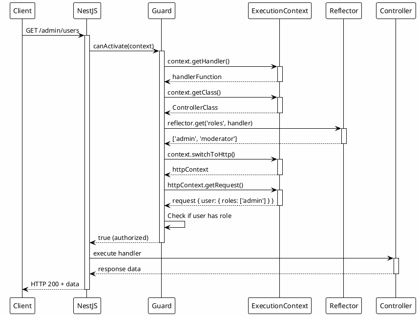

# Execution Context: контекст виконання

::card-group

::card{title="🎯 Мета лекції" icon="i-lucide-target"}

- Зрозуміти концепцію `ExecutionContext` як розширення `ArgumentsHost` з додатковими методами
- Опанувати API `ArgumentsHost` для доступу до request, response, next у різних контекстах (HTTP, WS, RPC)
- Навчитися використовувати `Reflector` для витягування метаданих з декораторів через `@SetMetadata()`
- Вивчити методи `ExecutionContext`: `getClass()`, `getHandler()`, `getType()`, `switchToHttp()`
- Засвоїти практичне застосування у Guards для перевірки ролей через метадані
- Практикувати створення metadata-aware Interceptors та Filters
- Розуміти різницю між контекстами виконання: HTTP, WebSockets, Microservices

::

::card{title="🔑 Ключові терміни" icon="i-lucide-key"}

- **ExecutionContext** (*контекст виконання*): об'єкт з інформацією про поточний обробник, клас, тип контексту
- **ArgumentsHost** (*хост аргументів*): базовий інтерфейс для доступу до аргументів обробника (request, response)
- **Reflector** (*рефлектор*): утиліта для витягування метаданих, встановлених через `@SetMetadata()` або кастомні декоратори
- **Metadata** (*метадані*): додаткова інформація, прикріплена до класів/методів через декоратори (@Roles, @Public)
- **Handler** (*обробник*): метод контролера, що обробляє запит (функція з `@Get()`, `@Post()`)
- **Context Type** (*тип контексту*): `'http'`, `'ws'` (WebSockets), `'rpc'` (Microservices)

::

::

## Концепція ExecutionContext: розширення ArgumentsHost

`ExecutionContext` **розширює** `ArgumentsHost` додатковими методами для витягування інформації про поточний **обробник** та **клас**:

```typescript
interface ExecutionContext extends ArgumentsHost {
  getClass<T = any>(): Type<T>;      // Клас контролера
  getHandler(): Function;             // Метод-обробник
}
```

**Ієрархія:**

```
ArgumentsHost (базовий інтерфейс)
    ↓
ExecutionContext (розширення з getClass/getHandler)
```

**Де використовується:**

- **Guards**: для витягування метаданих ролей через `Reflector`
- **Interceptors**: для логування назв контролера/методу
- **Pipes**: для доступу до типу параметра через метадані
- **Filters**: для форматування помилок залежно від контексту

::note
`ArgumentsHost` надає доступ до **аргументів** (request, response), а `ExecutionContext` додатково надає доступ до **метаданих** класу та обробника. Це дозволяє створювати компоненти, що **реагують** на декоратори (наприклад, `@Roles('admin')`).
::

## ArgumentsHost API: доступ до контексту запиту

`ArgumentsHost` надає уніфікований інтерфейс для роботи з різними типами контекстів:

### Методи ArgumentsHost

```typescript
interface ArgumentsHost {
  getArgs<T extends Array<any> = any[]>(): T;
  getArgByIndex<T = any>(index: number): T;
  switchToHttp(): HttpArgumentsHost;
  switchToRpc(): RpcArgumentsHost;
  switchToWs(): WsArgumentsHost;
  getType<TContext extends string = ContextType>(): TContext;
}
```

### HTTP-контекст

```typescript
import { Injectable, CanActivate, ExecutionContext } from '@nestjs/common';
import { Request, Response } from 'express';

@Injectable()
export class ExampleGuard implements CanActivate {
  canActivate(context: ExecutionContext): boolean {
    // 1. Перемикання на HTTP-контекст
    const httpContext = context.switchToHttp();
    
    // 2. Витягування request та response
    const request = httpContext.getRequest<Request>();
    const response = httpContext.getResponse<Response>();
    const next = httpContext.getNext(); // Express next() function
    
    // 3. Доступ до властивостей request
    const { method, url, headers, body, query, params } = request;
    const authHeader = headers.authorization;
    const userAgent = request.get('user-agent');
    const ip = request.ip;
    
    // 4. Доступ до user об'єкта (після AuthGuard)
    const user = request['user'];
    
    console.log(`${method} ${url} from ${ip}`);
    console.log(`User: ${user?.email}`);
    
    return true;
  }
}
```

### WebSockets-контекст

```typescript
import { Injectable, CanActivate, ExecutionContext } from '@nestjs/common';

@Injectable()
export class WsGuard implements CanActivate {
  canActivate(context: ExecutionContext): boolean {
    // Перевірка типу контексту
    if (context.getType() === 'ws') {
      const wsContext = context.switchToWs();
      
      // Доступ до WebSocket client та data
      const client = wsContext.getClient();
      const data = wsContext.getData();
      
      console.log('WebSocket event:', data);
      console.log('Client ID:', client.id);
      
      return true;
    }
    
    return false;
  }
}
```

### RPC/Microservices-контекст

```typescript
import { Injectable, CanActivate, ExecutionContext } from '@nestjs/common';

@Injectable()
export class RpcGuard implements CanActivate {
  canActivate(context: ExecutionContext): boolean {
    if (context.getType() === 'rpc') {
      const rpcContext = context.switchToRpc();
      
      // Доступ до RPC data та context
      const data = rpcContext.getData();
      const rpcCtx = rpcContext.getContext();
      
      console.log('RPC data:', data);
      
      return true;
    }
    
    return false;
  }
}
```

### Універсальний guard для всіх контекстів

```typescript
import { Injectable, CanActivate, ExecutionContext } from '@nestjs/common';

@Injectable()
export class UniversalGuard implements CanActivate {
  canActivate(context: ExecutionContext): boolean {
    const contextType = context.getType<'http' | 'ws' | 'rpc'>();
    
    switch (contextType) {
      case 'http':
        return this.handleHttpContext(context);
      case 'ws':
        return this.handleWsContext(context);
      case 'rpc':
        return this.handleRpcContext(context);
      default:
        return false;
    }
  }

  private handleHttpContext(context: ExecutionContext): boolean {
    const request = context.switchToHttp().getRequest();
    console.log(`HTTP: ${request.method} ${request.url}`);
    return true;
  }

  private handleWsContext(context: ExecutionContext): boolean {
    const data = context.switchToWs().getData();
    console.log('WS:', data);
    return true;
  }

  private handleRpcContext(context: ExecutionContext): boolean {
    const data = context.switchToRpc().getData();
    console.log('RPC:', data);
    return true;
  }
}
```

::tip
**Порада:** завжди перевіряйте тип контексту через `context.getType()` перед викликом `switchToHttp()`, `switchToWs()` або `switchToRpc()`. Це запобігає помилкам у мікросервісних застосунках.
::


## ExecutionContext API: getClass() та getHandler()

Методи `getClass()` та `getHandler()` надають доступ до **класу контролера** та **методу-обробника**:

### Витягування назв класу та методу

```typescript
import { Injectable, CanActivate, ExecutionContext, Logger } from '@nestjs/common';

@Injectable()
export class LoggingGuard implements CanActivate {
  private readonly logger = new Logger(LoggingGuard.name);

  canActivate(context: ExecutionContext): boolean {
    // Витягування класу контролера
    const controllerClass = context.getClass();
    const controllerName = controllerClass.name;
    
    // Витягування методу-обробника
    const handler = context.getHandler();
    const handlerName = handler.name;
    
    // Доступ до request
    const request = context.switchToHttp().getRequest();
    
    this.logger.log(`${controllerName}.${handlerName} - ${request.method} ${request.url}`);
    
    return true;
  }
}
```

**Приклад використання:**

```typescript
@Controller('users')
@UseGuards(LoggingGuard)
export class UsersController {
  @Get(':id')
  findOne(@Param('id') id: string) {
    return { id };
  }

  @Post()
  create(@Body() dto: CreateUserDto) {
    return dto;
  }
}
```

**Логи:**

```
[LoggingGuard] UsersController.findOne - GET /users/123
[LoggingGuard] UsersController.create - POST /users
```

### Практичне застосування: Performance Interceptor

```typescript
import { Injectable, NestInterceptor, ExecutionContext, CallHandler, Logger } from '@nestjs/common';
import { Observable } from 'rxjs';
import { tap } from 'rxjs/operators';

@Injectable()
export class PerformanceInterceptor implements NestInterceptor {
  private readonly logger = new Logger(PerformanceInterceptor.name);

  intercept(context: ExecutionContext, next: CallHandler): Observable<any> {
    const controllerName = context.getClass().name;
    const handlerName = context.getHandler().name;
    const request = context.switchToHttp().getRequest();
    
    const startTime = Date.now();
    
    return next.handle().pipe(
      tap(() => {
        const duration = Date.now() - startTime;
        
        this.logger.log(
          `${controllerName}.${handlerName} - ${request.method} ${request.url} - ${duration}ms`
        );
        
        // Відправлення метрик у Datadog/Prometheus
        if (duration > 1000) {
          this.logger.warn(`Slow endpoint detected: ${controllerName}.${handlerName} (${duration}ms)`);
        }
      }),
    );
  }
}
```

## Reflector: витягування метаданих

`Reflector` дозволяє витягувати метадані, встановлені через `@SetMetadata()` або кастомні декоратори:

### Створення метаданих через @SetMetadata

```typescript
import { SetMetadata } from '@nestjs/common';

// 1. Створення кастомного декоратора
export const Roles = (...roles: string[]) => SetMetadata('roles', roles);
export const Public = () => SetMetadata('isPublic', true);
export const RequirePermissions = (...permissions: string[]) => 
  SetMetadata('permissions', permissions);

// 2. Використання у контролері
@Controller('admin')
export class AdminController {
  @Get('dashboard')
  @Roles('admin', 'moderator')
  getDashboard() {
    return { message: 'Dashboard data' };
  }

  @Get('users')
  @Roles('admin')
  @RequirePermissions('users:read', 'users:list')
  getUsers() {
    return { users: [] };
  }

  @Get('health')
  @Public()
  getHealth() {
    return { status: 'ok' };
  }
}
```

### Витягування метаданих через Reflector у Guard

```typescript
import { Injectable, CanActivate, ExecutionContext } from '@nestjs/common';
import { Reflector } from '@nestjs/core';

@Injectable()
export class RolesGuard implements CanActivate {
  constructor(private reflector: Reflector) {}

  canActivate(context: ExecutionContext): boolean {
    // 1. Витягування метаданих 'roles' з handler
    const requiredRoles = this.reflector.get<string[]>('roles', context.getHandler());
    
    // 2. Якщо метадані не встановлені, дозволяємо доступ
    if (!requiredRoles || requiredRoles.length === 0) {
      return true;
    }
    
    // 3. Витягування user з request
    const request = context.switchToHttp().getRequest();
    const user = request.user;
    
    if (!user || !user.roles) {
      return false;
    }
    
    // 4. Перевірка чи user має хоча б одну з необхідних ролей
    return requiredRoles.some(role => user.roles.includes(role));
  }
}
```

**Реєстрація глобально:**

```typescript
// app.module.ts
@Module({
  providers: [
    {
      provide: APP_GUARD,
      useClass: RolesGuard,
    },
  ],
})
export class AppModule {}
```

### Reflector.getAllAndOverride(): пріоритет метаданих

Метод `getAllAndOverride()` витягує метадані з **handler** та **class**, віддаючи **пріоритет handler**:

```typescript
@Injectable()
export class EnhancedRolesGuard implements CanActivate {
  constructor(private reflector: Reflector) {}

  canActivate(context: ExecutionContext): boolean {
    // Витягування метаданих з handler та class, пріоритет handler
    const requiredRoles = this.reflector.getAllAndOverride<string[]>('roles', [
      context.getHandler(), // Пріоритет 1
      context.getClass(),   // Пріоритет 2
    ]);
    
    if (!requiredRoles) {
      return true;
    }
    
    const request = context.switchToHttp().getRequest();
    const user = request.user;
    
    return requiredRoles.some(role => user.roles?.includes(role));
  }
}
```

**Приклад з override:**

```typescript
@Controller('products')
@Roles('user') // Метадані на рівні класу
export class ProductsController {
  @Get()
  findAll() {
    // Використовується 'user' з класу
    return [];
  }

  @Get(':id')
  @Roles('admin') // Override: пріоритет методу
  findOne(@Param('id') id: string) {
    // Використовується 'admin' з методу (не 'user')
    return { id };
  }

  @Delete(':id')
  remove(@Param('id') id: string) {
    // Використовується 'user' з класу
    return { deleted: true };
  }
}
```

### Reflector.getAllAndMerge(): об'єднання метаданих

Метод `getAllAndMerge()` **об'єднує** метадані з handler та class у один масив:

```typescript
@Injectable()
export class PermissionsGuard implements CanActivate {
  constructor(private reflector: Reflector) {}

  canActivate(context: ExecutionContext): boolean {
    // Об'єднання метаданих з handler та class
    const requiredPermissions = this.reflector.getAllAndMerge<string[]>('permissions', [
      context.getHandler(),
      context.getClass(),
    ]);
    
    if (!requiredPermissions || requiredPermissions.length === 0) {
      return true;
    }
    
    const request = context.switchToHttp().getRequest();
    const user = request.user;
    
    // Перевірка чи user має ВСІ необхідні permissions
    return requiredPermissions.every(permission => user.permissions?.includes(permission));
  }
}
```

**Приклад з merge:**

```typescript
@Controller('admin')
@RequirePermissions('admin:access') // Метадані класу
export class AdminController {
  @Get('users')
  @RequirePermissions('users:read', 'users:list') // Метадані методу
  getUsers() {
    // requiredPermissions = ['admin:access', 'users:read', 'users:list']
    return [];
  }

  @Delete('users/:id')
  @RequirePermissions('users:delete') // Метадані методу
  deleteUser(@Param('id') id: string) {
    // requiredPermissions = ['admin:access', 'users:delete']
    return { deleted: true };
  }
}
```

::note
**Різниця між `getAllAndOverride()` та `getAllAndMerge()`:**
- **`getAllAndOverride()`**: бере метадані з **першого** джерела, що має значення (handler → class)
- **`getAllAndMerge()`**: **об'єднує** метадані з handler та class у один масив

Використовуйте `getAllAndOverride()` для **заміни** (ролі), `getAllAndMerge()` для **накопичення** (permissions).
::

## Практичне застосування: Public endpoint guard

Створення guard, що пропускає endpoints з декоратором `@Public()`:

### Декоратор @Public

```typescript
// decorators/public.decorator.ts
import { SetMetadata } from '@nestjs/common';

export const IS_PUBLIC_KEY = 'isPublic';
export const Public = () => SetMetadata(IS_PUBLIC_KEY, true);
```

### AuthGuard з підтримкою @Public

```typescript
import { Injectable, CanActivate, ExecutionContext, UnauthorizedException } from '@nestjs/common';
import { Reflector } from '@nestjs/core';
import { IS_PUBLIC_KEY } from './decorators/public.decorator';

@Injectable()
export class JwtAuthGuard implements CanActivate {
  constructor(private reflector: Reflector) {}

  canActivate(context: ExecutionContext): boolean {
    // 1. Перевірка чи endpoint позначений як Public
    const isPublic = this.reflector.getAllAndOverride<boolean>(IS_PUBLIC_KEY, [
      context.getHandler(),
      context.getClass(),
    ]);

    if (isPublic) {
      return true; // Пропустити аутентифікацію
    }

    // 2. Витягування request
    const request = context.switchToHttp().getRequest();
    const authHeader = request.headers.authorization;

    if (!authHeader) {
      throw new UnauthorizedException('Missing authorization header');
    }

    // 3. Перевірка JWT token
    const token = authHeader.replace('Bearer ', '');
    
    try {
      const user = this.validateToken(token);
      request.user = user;
      return true;
    } catch (error) {
      throw new UnauthorizedException('Invalid token');
    }
  }

  private validateToken(token: string): any {
    // JWT validation logic
    return { id: 1, email: 'user@example.com' };
  }
}
```

**Використання:**

```typescript
// app.module.ts
@Module({
  providers: [
    {
      provide: APP_GUARD,
      useClass: JwtAuthGuard, // Застосовується глобально
    },
  ],
})
export class AppModule {}

// auth.controller.ts
@Controller('auth')
export class AuthController {
  @Post('login')
  @Public() // Пропустить JwtAuthGuard
  login(@Body() dto: LoginDto) {
    return { token: 'jwt-token' };
  }

  @Post('register')
  @Public()
  register(@Body() dto: RegisterDto) {
    return { message: 'User registered' };
  }

  @Get('profile')
  // Без @Public() - потрібна аутентифікація
  getProfile(@Req() req) {
    return req.user;
  }
}
```

## Metadata-Aware Interceptor: умовне логування

Створення interceptor, що логує лише endpoints з декоратором `@Log()`:

### Декоратор @Log

```typescript
// decorators/log.decorator.ts
import { SetMetadata } from '@nestjs/common';

export const LOG_KEY = 'shouldLog';
export const Log = (options?: { includeBody?: boolean; includeResponse?: boolean }) => 
  SetMetadata(LOG_KEY, options || {});
```

### LoggingInterceptor з метаданими

```typescript
import { Injectable, NestInterceptor, ExecutionContext, CallHandler, Logger } from '@nestjs/common';
import { Reflector } from '@nestjs/core';
import { Observable } from 'rxjs';
import { tap } from 'rxjs/operators';
import { LOG_KEY } from './decorators/log.decorator';

@Injectable()
export class MetadataLoggingInterceptor implements NestInterceptor {
  private readonly logger = new Logger(MetadataLoggingInterceptor.name);

  constructor(private reflector: Reflector) {}

  intercept(context: ExecutionContext, next: CallHandler): Observable<any> {
    // Витягування метаданих логування
    const logOptions = this.reflector.get(LOG_KEY, context.getHandler());

    // Якщо @Log() не встановлений, пропускаємо
    if (!logOptions) {
      return next.handle();
    }

    const request = context.switchToHttp().getRequest();
    const controllerName = context.getClass().name;
    const handlerName = context.getHandler().name;
    
    const logMessage = `${controllerName}.${handlerName} - ${request.method} ${request.url}`;
    
    // Логування запиту
    if (logOptions.includeBody) {
      this.logger.log(`${logMessage} - Body: ${JSON.stringify(request.body)}`);
    } else {
      this.logger.log(logMessage);
    }

    const startTime = Date.now();

    return next.handle().pipe(
      tap(data => {
        const duration = Date.now() - startTime;
        
        // Логування відповіді
        if (logOptions.includeResponse) {
          this.logger.log(
            `${logMessage} - ${duration}ms - Response: ${JSON.stringify(data)}`
          );
        } else {
          this.logger.log(`${logMessage} - ${duration}ms`);
        }
      }),
    );
  }
}
```

**Використання:**

```typescript
@Controller('products')
export class ProductsController {
  @Get()
  @Log() // Просте логування
  findAll() {
    return [];
  }

  @Post()
  @Log({ includeBody: true }) // Логування з body
  create(@Body() dto: CreateProductDto) {
    return dto;
  }

  @Get(':id')
  @Log({ includeResponse: true }) // Логування з response
  findOne(@Param('id') id: string) {
    return { id, name: 'Product' };
  }

  @Delete(':id')
  // Без @Log() - не логується
  remove(@Param('id') id: string) {
    return { deleted: true };
  }
}
```

**Логи:**

```
[MetadataLoggingInterceptor] ProductsController.findAll - GET /products
[MetadataLoggingInterceptor] ProductsController.findAll - GET /products - 15ms

[MetadataLoggingInterceptor] ProductsController.create - POST /products - Body: {"name":"New Product"}
[MetadataLoggingInterceptor] ProductsController.create - POST /products - 25ms

[MetadataLoggingInterceptor] ProductsController.findOne - GET /products/123
[MetadataLoggingInterceptor] ProductsController.findOne - GET /products/123 - 10ms - Response: {"id":"123","name":"Product"}
```


## Композиція метаданих: комбінування декораторів

Створення складних декораторів через композицію:

### applyDecorators: комбінування кількох декораторів

```typescript
import { applyDecorators, UseGuards, SetMetadata } from '@nestjs/common';
import { ApiOperation, ApiResponse, ApiBearerAuth } from '@nestjs/swagger';
import { RolesGuard } from './guards/roles.guard';
import { JwtAuthGuard } from './guards/jwt-auth.guard';

// Композитний декоратор для admin endpoints
export function AdminOnly(description?: string) {
  return applyDecorators(
    SetMetadata('roles', ['admin']),
    UseGuards(JwtAuthGuard, RolesGuard),
    ApiBearerAuth(),
    ApiOperation({ summary: description || 'Admin only endpoint' }),
    ApiResponse({ status: 403, description: 'Forbidden' }),
  );
}

// Композитний декоратор для authenticated endpoints
export function Authenticated(...roles: string[]) {
  return applyDecorators(
    SetMetadata('roles', roles),
    UseGuards(JwtAuthGuard, RolesGuard),
    ApiBearerAuth(),
  );
}

// Композитний декоратор для публічних endpoints з rate limiting
export function PublicEndpoint(rateLimit?: number) {
  return applyDecorators(
    SetMetadata('isPublic', true),
    SetMetadata('rateLimit', rateLimit || 10),
  );
}
```

**Використання:**

```typescript
@Controller('admin')
export class AdminController {
  @Get('dashboard')
  @AdminOnly('Get admin dashboard')
  getDashboard() {
    return { data: 'Dashboard' };
  }

  @Get('users')
  @Authenticated('admin', 'moderator')
  getUsers() {
    return { users: [] };
  }
}

@Controller('public')
export class PublicController {
  @Get('status')
  @PublicEndpoint(100) // 100 requests per minute
  getStatus() {
    return { status: 'ok' };
  }
}
```

### Витягування кількох метаданих в одному Guard

```typescript
import { Injectable, CanActivate, ExecutionContext } from '@nestjs/common';
import { Reflector } from '@nestjs/core';

@Injectable()
export class MultiMetadataGuard implements CanActivate {
  constructor(private reflector: Reflector) {}

  canActivate(context: ExecutionContext): boolean {
    // Витягування кількох метаданих
    const isPublic = this.reflector.getAllAndOverride<boolean>('isPublic', [
      context.getHandler(),
      context.getClass(),
    ]);

    const requiredRoles = this.reflector.getAllAndOverride<string[]>('roles', [
      context.getHandler(),
      context.getClass(),
    ]);

    const requiredPermissions = this.reflector.getAllAndMerge<string[]>('permissions', [
      context.getHandler(),
      context.getClass(),
    ]);

    // 1. Якщо public endpoint, дозволяємо
    if (isPublic) {
      return true;
    }

    const request = context.switchToHttp().getRequest();
    const user = request.user;

    if (!user) {
      return false;
    }

    // 2. Перевірка ролей
    if (requiredRoles && requiredRoles.length > 0) {
      const hasRole = requiredRoles.some(role => user.roles?.includes(role));
      if (!hasRole) {
        return false;
      }
    }

    // 3. Перевірка permissions
    if (requiredPermissions && requiredPermissions.length > 0) {
      const hasPermissions = requiredPermissions.every(perm => 
        user.permissions?.includes(perm)
      );
      if (!hasPermissions) {
        return false;
      }
    }

    return true;
  }
}
```

## Практичний приклад: Rate Limiting з метаданими

Створення rate limiter, що використовує метадані для налаштування лімітів:

### Декоратор @RateLimit

```typescript
// decorators/rate-limit.decorator.ts
import { SetMetadata } from '@nestjs/common';

export const RATE_LIMIT_KEY = 'rateLimit';

export interface RateLimitOptions {
  limit: number;      // Кількість запитів
  window: number;     // Часове вікно в секундах
}

export const RateLimit = (limit: number, window: number = 60) => 
  SetMetadata(RATE_LIMIT_KEY, { limit, window } as RateLimitOptions);
```

### RateLimitGuard з метаданими

```typescript
import { Injectable, CanActivate, ExecutionContext, HttpException, HttpStatus } from '@nestjs/common';
import { Reflector } from '@nestjs/core';
import { RATE_LIMIT_KEY, RateLimitOptions } from './decorators/rate-limit.decorator';

@Injectable()
export class RateLimitGuard implements CanActivate {
  private requests = new Map<string, { count: number; resetTime: number }>();

  constructor(private reflector: Reflector) {}

  canActivate(context: ExecutionContext): boolean {
    // Витягування метаданих rate limit
    const rateLimitOptions = this.reflector.getAllAndOverride<RateLimitOptions>(
      RATE_LIMIT_KEY,
      [context.getHandler(), context.getClass()]
    );

    // Якщо метадані не встановлені, пропускаємо
    if (!rateLimitOptions) {
      return true;
    }

    const request = context.switchToHttp().getRequest();
    const key = this.generateKey(request);

    const now = Date.now();
    const record = this.requests.get(key);

    if (!record || now > record.resetTime) {
      // Створення нового запису
      this.requests.set(key, {
        count: 1,
        resetTime: now + rateLimitOptions.window * 1000,
      });
      return true;
    }

    if (record.count >= rateLimitOptions.limit) {
      const retryAfter = Math.ceil((record.resetTime - now) / 1000);
      
      throw new HttpException(
        {
          statusCode: HttpStatus.TOO_MANY_REQUESTS,
          message: 'Rate limit exceeded',
          retryAfter,
        },
        HttpStatus.TOO_MANY_REQUESTS
      );
    }

    record.count++;
    return true;
  }

  private generateKey(request: any): string {
    // Ключ: IP + endpoint
    return `${request.ip}-${request.url}`;
  }
}
```

**Використання:**

```typescript
@Controller('api')
@UseGuards(RateLimitGuard)
export class ApiController {
  @Get('data')
  @RateLimit(10, 60) // 10 requests per 60 seconds
  getData() {
    return { data: [] };
  }

  @Post('upload')
  @RateLimit(3, 300) // 3 requests per 5 minutes
  uploadFile(@Body() dto: UploadDto) {
    return { uploaded: true };
  }

  @Get('public')
  @RateLimit(100, 60) // 100 requests per minute
  getPublic() {
    return { message: 'Public data' };
  }
}
```

## Metadata в Exception Filters

Використання метаданих у exception filters для кастомізації відповідей:

### Декоратор @ErrorResponse

```typescript
// decorators/error-response.decorator.ts
import { SetMetadata } from '@nestjs/common';

export const ERROR_RESPONSE_KEY = 'errorResponse';

export interface ErrorResponseOptions {
  includeStack?: boolean;
  includeTrace?: boolean;
  customMessage?: string;
}

export const ErrorResponse = (options: ErrorResponseOptions) => 
  SetMetadata(ERROR_RESPONSE_KEY, options);
```

### MetadataAwareExceptionFilter

```typescript
import { ExceptionFilter, Catch, ArgumentsHost, HttpException, Logger } from '@nestjs/common';
import { Reflector } from '@nestjs/core';
import { ERROR_RESPONSE_KEY, ErrorResponseOptions } from './decorators/error-response.decorator';

@Catch(HttpException)
export class MetadataAwareExceptionFilter implements ExceptionFilter {
  private readonly logger = new Logger(MetadataAwareExceptionFilter.name);

  constructor(private reflector: Reflector) {}

  catch(exception: HttpException, host: ArgumentsHost) {
    const ctx = host.switchToHttp();
    const response = ctx.getResponse();
    const request = ctx.getRequest();

    // Витягування метаданих з handler
    const handler = host.getHandler();
    const errorOptions = this.reflector.get<ErrorResponseOptions>(
      ERROR_RESPONSE_KEY,
      handler
    );

    const status = exception.getStatus();
    const defaultResponse = exception.getResponse();

    // Формування відповіді з урахуванням метаданих
    const errorResponse: any = {
      statusCode: status,
      timestamp: new Date().toISOString(),
      path: request.url,
      message: errorOptions?.customMessage || exception.message,
    };

    // Додавання стеку якщо вказано в метаданих
    if (errorOptions?.includeStack) {
      errorResponse.stack = exception.stack;
    }

    // Додавання trace ID якщо вказано
    if (errorOptions?.includeTrace) {
      errorResponse.traceId = request.headers['x-trace-id'] || 'unknown';
    }

    this.logger.error(`${request.method} ${request.url}`, {
      statusCode: status,
      message: exception.message,
      handler: handler.name,
    });

    response.status(status).json(errorResponse);
  }
}
```

**Використання:**

```typescript
@Controller('debug')
@UseFilters(MetadataAwareExceptionFilter)
export class DebugController {
  @Get('error')
  @ErrorResponse({ includeStack: true, includeTrace: true })
  triggerError() {
    throw new HttpException('Debug error', 500);
  }

  @Get('not-found')
  @ErrorResponse({ customMessage: 'Resource not found in our system' })
  notFound() {
    throw new NotFoundException();
  }
}
```

## Тестування компонентів з ExecutionContext

### Unit-тестування Guard з Reflector

```typescript
import { Test } from '@nestjs/testing';
import { Reflector } from '@nestjs/core';
import { ExecutionContext } from '@nestjs/common';
import { RolesGuard } from './roles.guard';

describe('RolesGuard', () => {
  let guard: RolesGuard;
  let reflector: Reflector;

  beforeEach(async () => {
    const module = await Test.createTestingModule({
      providers: [RolesGuard, Reflector],
    }).compile();

    guard = module.get<RolesGuard>(RolesGuard);
    reflector = module.get<Reflector>(Reflector);
  });

  it('should allow access when no roles required', () => {
    jest.spyOn(reflector, 'get').mockReturnValue(undefined);

    const context = createMockExecutionContext();
    
    expect(guard.canActivate(context)).toBe(true);
  });

  it('should deny access when user does not have required role', () => {
    jest.spyOn(reflector, 'get').mockReturnValue(['admin']);

    const context = createMockExecutionContext({
      user: { id: 1, roles: ['user'] },
    });

    expect(guard.canActivate(context)).toBe(false);
  });

  it('should allow access when user has required role', () => {
    jest.spyOn(reflector, 'get').mockReturnValue(['admin']);

    const context = createMockExecutionContext({
      user: { id: 1, roles: ['admin'] },
    });

    expect(guard.canActivate(context)).toBe(true);
  });

  function createMockExecutionContext(request: any = {}): ExecutionContext {
    return {
      switchToHttp: () => ({
        getRequest: () => request,
      }),
      getHandler: () => ({}),
      getClass: () => ({}),
      getType: () => 'http',
    } as any;
  }
});
```

### Unit-тестування Interceptor з ExecutionContext

```typescript
import { Test } from '@nestjs/testing';
import { Reflector } from '@nestjs/core';
import { of } from 'rxjs';
import { MetadataLoggingInterceptor } from './metadata-logging.interceptor';

describe('MetadataLoggingInterceptor', () => {
  let interceptor: MetadataLoggingInterceptor;
  let reflector: Reflector;

  beforeEach(async () => {
    const module = await Test.createTestingModule({
      providers: [MetadataLoggingInterceptor, Reflector],
    }).compile();

    interceptor = module.get(MetadataLoggingInterceptor);
    reflector = module.get(Reflector);
  });

  it('should skip logging when @Log() not set', (done) => {
    jest.spyOn(reflector, 'get').mockReturnValue(undefined);
    const logSpy = jest.spyOn(interceptor['logger'], 'log');

    const context = createMockExecutionContext();
    const callHandler = { handle: () => of('result') };

    interceptor.intercept(context, callHandler).subscribe(() => {
      expect(logSpy).not.toHaveBeenCalled();
      done();
    });
  });

  it('should log when @Log() is set', (done) => {
    jest.spyOn(reflector, 'get').mockReturnValue({});
    const logSpy = jest.spyOn(interceptor['logger'], 'log');

    const context = createMockExecutionContext();
    const callHandler = { handle: () => of('result') };

    interceptor.intercept(context, callHandler).subscribe(() => {
      expect(logSpy).toHaveBeenCalled();
      done();
    });
  });

  function createMockExecutionContext(): any {
    return {
      switchToHttp: () => ({
        getRequest: () => ({
          method: 'GET',
          url: '/test',
        }),
      }),
      getHandler: () => ({ name: 'testHandler' }),
      getClass: () => ({ name: 'TestController' }),
    };
  }
});
```

## Візуалізація потоку виконання з ExecutionContext



**Опис потоку:**

1. **Client → Guard**: запит проходить через Guard
2. **Guard → ExecutionContext**: витягування handler та class через `getHandler()`, `getClass()`
3. **Guard → Reflector**: витягування метаданих `'roles'` через `reflector.get()`
4. **Guard → ExecutionContext**: доступ до request через `switchToHttp().getRequest()`
5. **Guard**: перевірка чи user має необхідну роль
6. **Guard → NestJS**: повернення `true` (доступ дозволено)
7. **NestJS → Controller**: виконання handler
8. **Controller → Client**: повернення відповіді


## Найкращі практики ExecutionContext та Reflector

### 1. Завжди перевіряйте тип контексту

::code-group

```typescript [❌ Погано]
canActivate(context: ExecutionContext): boolean {
  const request = context.switchToHttp().getRequest(); // Помилка у WS-контексті!
  // ...
}
```

```typescript [✅ Добре]
canActivate(context: ExecutionContext): boolean {
  if (context.getType() !== 'http') {
    return true; // Або false залежно від логіки
  }
  
  const request = context.switchToHttp().getRequest();
  // ...
}
```

::

### 2. Використовуйте getAllAndOverride для заміни метаданих

::code-group

```typescript [❌ Погано - дублювання]
const handlerRoles = this.reflector.get('roles', context.getHandler());
const classRoles = this.reflector.get('roles', context.getClass());
const roles = handlerRoles || classRoles; // Ручне визначення пріоритету
```

```typescript [✅ Добре - автоматичний пріоритет]
const roles = this.reflector.getAllAndOverride('roles', [
  context.getHandler(),
  context.getClass(),
]);
```

::

### 3. Використовуйте getAllAndMerge для накопичення метаданих

```typescript
// Permissions з класу та методу накопичуються
const permissions = this.reflector.getAllAndMerge<string[]>('permissions', [
  context.getHandler(),
  context.getClass(),
]);

// @Controller() @RequirePermissions('admin:access')
// @Get() @RequirePermissions('users:read')
// Result: ['admin:access', 'users:read']
```

### 4. Створюйте типізовані метадані

::code-group

```typescript [❌ Погано - магічні рядки]
@SetMetadata('rolesList', ['admin'])
// ...
const roles = this.reflector.get('rolesList', handler); // Опечатка!
```

```typescript [✅ Добре - типізовані константи]
export const ROLES_KEY = 'roles';
export const Roles = (...roles: string[]) => SetMetadata(ROLES_KEY, roles);

// Використання
const roles = this.reflector.get<string[]>(ROLES_KEY, handler);
```

::

### 5. Логування контексту для дебагу

```typescript
intercept(context: ExecutionContext, next: CallHandler) {
  const controllerName = context.getClass().name;
  const handlerName = context.getHandler().name;
  const contextType = context.getType();
  
  this.logger.debug(`Executing: ${controllerName}.${handlerName} [${contextType}]`);
  
  return next.handle();
}
```

### 6. Кешування метаданих для performance

```typescript
@Injectable()
export class OptimizedRolesGuard implements CanActivate {
  private metadataCache = new Map<Function, string[]>();

  constructor(private reflector: Reflector) {}

  canActivate(context: ExecutionContext): boolean {
    const handler = context.getHandler();
    
    // Перевірка кешу
    if (this.metadataCache.has(handler)) {
      return this.checkRoles(this.metadataCache.get(handler), context);
    }
    
    // Витягування та кешування
    const roles = this.reflector.getAllAndOverride<string[]>('roles', [
      handler,
      context.getClass(),
    ]);
    
    this.metadataCache.set(handler, roles);
    
    return this.checkRoles(roles, context);
  }

  private checkRoles(roles: string[], context: ExecutionContext): boolean {
    if (!roles) return true;
    
    const request = context.switchToHttp().getRequest();
    return roles.some(role => request.user?.roles?.includes(role));
  }
}
```

## Підсумок

::card-group

::card{title="🎯 ExecutionContext API" icon="i-lucide-cpu"}

`ExecutionContext` розширює `ArgumentsHost` методами `getClass()` (клас контролера) та `getHandler()` (метод-обробник). Надає доступ до метаданих через `Reflector`.

**Приклад:**
```typescript
const controllerName = context.getClass().name;
const handlerName = context.getHandler().name;
```

::

::card{title="🔄 ArgumentsHost Methods" icon="i-lucide-layers"}

`ArgumentsHost` надає `switchToHttp()`, `switchToWs()`, `switchToRpc()` для доступу до контексту. Метод `getType()` повертає тип контексту ('http', 'ws', 'rpc').

**Приклад:**
```typescript
if (context.getType() === 'http') {
  const request = context.switchToHttp().getRequest();
}
```

::

::card{title="🔍 Reflector API" icon="i-lucide-search"}

`Reflector` витягує метадані через `get()`, `getAllAndOverride()` (пріоритет handler), `getAllAndMerge()` (об'єднання handler + class). Використовується з `@SetMetadata()`.

**Приклад:**
```typescript
const roles = this.reflector.getAllAndOverride('roles', [
  context.getHandler(),
  context.getClass(),
]);
```

::

::card{title="🏷️ Metadata Decorators" icon="i-lucide-tag"}

Створення кастомних декораторів через `@SetMetadata(key, value)`. Композиція через `applyDecorators()` для комбінування кількох декораторів.

**Приклад:**
```typescript
export const Roles = (...roles: string[]) => 
  SetMetadata('roles', roles);
```

::

::card{title="🛡️ Metadata-Aware Guards" icon="i-lucide-shield"}

Guards витягують метадані для авторизації (@Roles, @Public). Використовують `Reflector` для отримання значень з handler/class.

**Приклад:**
```typescript
const isPublic = this.reflector.get('isPublic', handler);
if (isPublic) return true;
```

::

::card{title="📝 Metadata-Aware Interceptors" icon="i-lucide-file-edit"}

Interceptors використовують метадані для умовного логування (@Log), кешування (@Cache), трансформації відповідей.

**Приклад:**
```typescript
const logOptions = this.reflector.get('log', handler);
if (!logOptions) return next.handle();
```

::

::card{title="🔧 getAllAndOverride vs getAllAndMerge" icon="i-lucide-git-compare"}

`getAllAndOverride()` бере перше значення (handler → class). `getAllAndMerge()` об'єднує значення з handler та class у масив.

**Використання:**
- **Override**: ролі (метод замінює клас)
- **Merge**: permissions (метод додає до класу)

::

::card{title="🧪 Testing with ExecutionContext" icon="i-lucide-flask-conical"}

Мокування `ExecutionContext` з методами `getClass()`, `getHandler()`, `switchToHttp()`. Мокування `Reflector` через `jest.spyOn()`.

**Приклад:**
```typescript
const context = { getHandler: () => ({}), getClass: () => ({}) } as any;
jest.spyOn(reflector, 'get').mockReturnValue(['admin']);
```

::

::

## Часті запитання (FAQ)

::accordion

::accordion-item{title="Яка різниця між ArgumentsHost та ExecutionContext?"}

**ArgumentsHost:**
- Базовий інтерфейс для доступу до аргументів обробника (request, response)
- Методи: `switchToHttp()`, `switchToWs()`, `switchToRpc()`, `getType()`
- Використовується в **Exception Filters**

**ExecutionContext:**
- Розширює `ArgumentsHost` додатковими методами
- Додає `getClass()` (клас контролера) та `getHandler()` (метод-обробник)
- Використовується в **Guards**, **Interceptors**, **Pipes**

**Висновок:** `ExecutionContext` = `ArgumentsHost` + метадані про handler/class.

::

::accordion-item{title="Як витягнути метадані з handler та class одночасно?"}

Використовуйте `getAllAndOverride()` або `getAllAndMerge()`:

```typescript
// Пріоритет handler (метод замінює клас)
const roles = this.reflector.getAllAndOverride<string[]>('roles', [
  context.getHandler(), // Пріоритет 1
  context.getClass(),   // Пріоритет 2
]);

// Об'єднання handler + class
const permissions = this.reflector.getAllAndMerge<string[]>('permissions', [
  context.getHandler(),
  context.getClass(),
]);
```

**Коли використовувати:**
- **getAllAndOverride**: ролі (метод **замінює** клас)
- **getAllAndMerge**: permissions (метод **додає** до класу)

::

::accordion-item{title="Чи можна використовувати ExecutionContext у Exception Filters?"}

**Ні**, Exception Filters отримують лише `ArgumentsHost`, а не `ExecutionContext`:

```typescript
@Catch(HttpException)
export class MyFilter implements ExceptionFilter {
  catch(exception: HttpException, host: ArgumentsHost) {
    // host НЕ має getClass() та getHandler()
    
    // Але можна отримати handler через host.getHandler()
    const handler = host.getHandler(); // Це працює!
    const controllerClass = host.getClass(); // Це ТЕОЖ працює!
  }
}
```

**Оновлення:** `ArgumentsHost` **також має** методи `getClass()` та `getHandler()`, тому можна використовувати метадані у filters.

::

::accordion-item{title="Як створити декоратор з параметрами?"}

Використовуйте функцію-фабрику, що повертає декоратор:

```typescript
// Декоратор без параметрів
export const Public = () => SetMetadata('isPublic', true);

// Декоратор з параметрами
export const Roles = (...roles: string[]) => SetMetadata('roles', roles);

// Декоратор з об'єктом параметрів
export const CacheControl = (options: { ttl: number; key?: string }) => 
  SetMetadata('cache', options);

// Використання
@Public()
@Roles('admin', 'moderator')
@CacheControl({ ttl: 300, key: 'users-list' })
getUsers() {}
```

::

::accordion-item{title="Чи можна комбінувати кілька декораторів в один?"}

**Так**, використовуйте `applyDecorators()`:

```typescript
import { applyDecorators, UseGuards, SetMetadata } from '@nestjs/common';

export function AdminOnly() {
  return applyDecorators(
    SetMetadata('roles', ['admin']),
    UseGuards(JwtAuthGuard, RolesGuard),
    ApiBearerAuth(), // Swagger
  );
}

// Використання
@Get('dashboard')
@AdminOnly() // Замість 3 декораторів
getDashboard() {}
```

::

::accordion-item{title="Як перевірити чи endpoint позначений як @Public()?"}

Використовуйте `Reflector` у Guard:

```typescript
@Injectable()
export class JwtAuthGuard implements CanActivate {
  constructor(private reflector: Reflector) {}

  canActivate(context: ExecutionContext): boolean {
    const isPublic = this.reflector.getAllAndOverride<boolean>('isPublic', [
      context.getHandler(),
      context.getClass(),
    ]);

    if (isPublic) {
      return true; // Пропустить аутентифікацію
    }

    // Перевірка JWT token
    // ...
  }
}
```

::

::accordion-item{title="Як витягнути user з request в ExecutionContext?"}

Використовуйте `switchToHttp().getRequest()`:

```typescript
canActivate(context: ExecutionContext): boolean {
  const request = context.switchToHttp().getRequest();
  const user = request.user; // Встановлюється AuthGuard
  
  if (!user) {
    return false;
  }
  
  console.log('User ID:', user.id);
  console.log('User roles:', user.roles);
  
  return true;
}
```

**Примітка:** `request.user` встановлюється **AuthGuard** (наприклад, `JwtAuthGuard`) після валідації JWT token.

::

::accordion-item{title="Чи можна змінити request у Guard/Interceptor?"}

**Так**, можна модифікувати `request` об'єкт:

```typescript
@Injectable()
export class RequestModifierGuard implements CanActivate {
  canActivate(context: ExecutionContext): boolean {
    const request = context.switchToHttp().getRequest();
    
    // Додавання кастомних властивостей
    request['requestId'] = uuid();
    request['timestamp'] = Date.now();
    
    return true;
  }
}

// У контролері
@Get()
getData(@Req() req: Request) {
  console.log(req['requestId']); // Доступно!
  console.log(req['timestamp']);
}
```

::

::accordion-item{title="Як тестувати Guard з Reflector?"}

Мокуйте `Reflector` через `jest.spyOn()`:

```typescript
describe('RolesGuard', () => {
  let guard: RolesGuard;
  let reflector: Reflector;

  beforeEach(async () => {
    const module = await Test.createTestingModule({
      providers: [RolesGuard, Reflector],
    }).compile();

    guard = module.get(RolesGuard);
    reflector = module.get(Reflector);
  });

  it('should allow access when user has role', () => {
    // Мокування метаданих
    jest.spyOn(reflector, 'getAllAndOverride').mockReturnValue(['admin']);

    const context = {
      getHandler: () => ({}),
      getClass: () => ({}),
      switchToHttp: () => ({
        getRequest: () => ({
          user: { roles: ['admin'] },
        }),
      }),
    } as any;

    expect(guard.canActivate(context)).toBe(true);
  });
});
```

::

::

---

У наступній лекції **17. Custom Decorators** ми розглянемо створення власних декораторів: parameter decorators (@CurrentUser), metadata decorators (@Roles), композицію через `applyDecorators()` та advanced patterns (pipes у декораторах).
