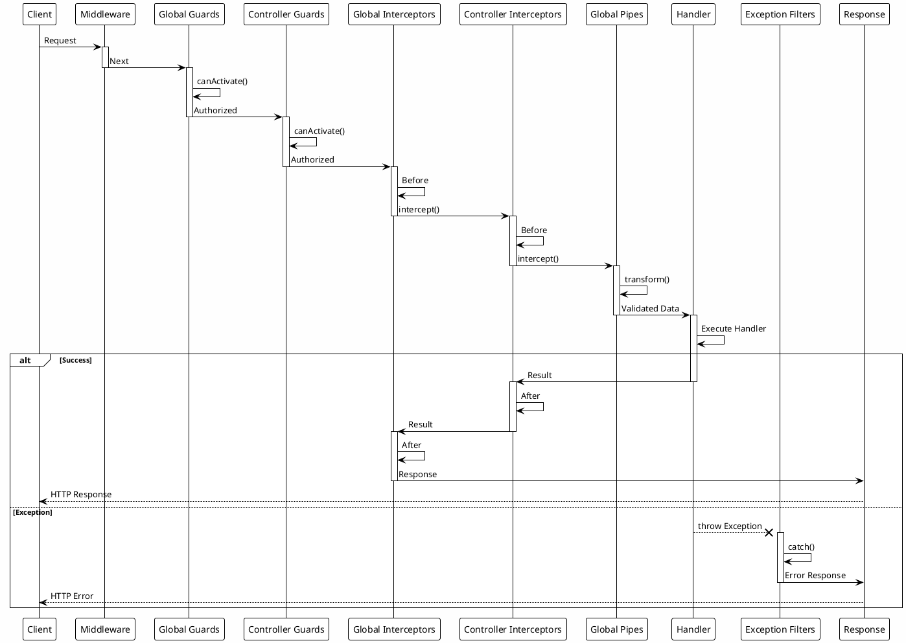

# Global Components: глобальні компоненти

::card-group

::card{title="🎯 Мета лекції" icon="i-lucide-target"}

- Зрозуміти концепцію глобальних компонентів та їхнє призначення у NestJS
- Опанувати використання `APP_*` токенів для реєстрації глобальних Guards, Interceptors, Pipes, Filters
- Навчитися різниці між `app.useGlobal*()` та модульною реєстрацією через токени
- Вивчити порядок виконання глобальних компонентів у Request Pipeline
- Засвоїти patterns для організації глобальних компонентів у модулях
- Практикувати налаштування пріоритетності та умовну реєстрацію компонентів
- Розуміти переваги та недоліки глобальної vs локальної реєстрації

::

::card{title="🔑 Ключові терміни" icon="i-lucide-key"}

- **Global Component** (*глобальний компонент*): компонент, що застосовується до всіх роутів застосунку автоматично
- **APP_* Tokens** (*токени APP_*): спеціальні injection tokens для реєстрації глобальних компонентів через DI
- **Module-Based Registration** (*модульна реєстрація*): реєстрація глобальних компонентів через `providers` з доступом до DI
- **Imperative Registration** (*імперативна реєстрація*): реєстрація через `app.useGlobal*()` у `main.ts` без DI
- **Execution Order** (*порядок виконання*): послідовність застосування глобальних компонентів у Pipeline
- **Provider Scope** (*область видимості*): рівень доступності компонента (global, module-scoped, request-scoped)

::

::

## Концепція глобальних компонентів

Глобальні компоненти автоматично **застосовуються до всіх роутів** застосунку без явного застосування через декоратори:

### Локальна vs глобальна реєстрація

::code-group

```typescript [Локальна реєстрація]
@Controller('users')
@UseGuards(JwtAuthGuard) // Тільки для цього контролера
@UseInterceptors(LoggingInterceptor)
export class UsersController {
  @Get()
  @UsePipes(ValidationPipe) // Тільки для цього методу
  findAll() {}
}
```

```typescript [Глобальна реєстрація]
// app.module.ts
@Module({
  providers: [
    { provide: APP_GUARD, useClass: JwtAuthGuard }, // Для всіх роутів
    { provide: APP_INTERCEPTOR, useClass: LoggingInterceptor },
    { provide: APP_PIPE, useClass: ValidationPipe },
  ],
})
export class AppModule {}

// users.controller.ts
@Controller('users')
export class UsersController {
  @Get()
  findAll() {} // JwtAuthGuard, LoggingInterceptor, ValidationPipe застосовуються автоматично
}
```

::

**Переваги глобальної реєстрації:**
- Централізована конфігурація компонентів
- Уникнення дублювання декораторів
- Гарантована послідовність виконання
- Простіше управління для крос-функціонального функціоналу (логування, аутентифікація)

**Недоліки:**
- Застосовується навіть до роутів, де не потрібно
- Складніше відключити для конкретних endpoints (потрібні metadata декоратори як `@Public()`)

## APP_* токени: модульна реєстрація з DI

NestJS надає спеціальні injection tokens для реєстрації глобальних компонентів:

### Доступні APP_* токени

```typescript
import { 
  APP_GUARD,          // Глобальні Guards
  APP_INTERCEPTOR,    // Глобальні Interceptors
  APP_PIPE,           // Глобальні Pipes
  APP_FILTER,         // Глобальні Exception Filters
} from '@nestjs/core';
```

### APP_GUARD: глобальні Guards

```typescript
// app.module.ts
import { Module } from '@nestjs/common';
import { APP_GUARD } from '@nestjs/core';
import { JwtAuthGuard } from './guards/jwt-auth.guard';
import { RolesGuard } from './guards/roles.guard';

@Module({
  providers: [
    // Глобальна аутентифікація
    {
      provide: APP_GUARD,
      useClass: JwtAuthGuard,
    },
    // Глобальна авторизація
    {
      provide: APP_GUARD,
      useClass: RolesGuard,
    },
  ],
})
export class AppModule {}
```

**Порядок виконання Guards:** у порядку реєстрації (JwtAuthGuard → RolesGuard).

**Використання з @Public():**

```typescript
@Controller('auth')
export class AuthController {
  @Post('login')
  @Public() // Пропускає JwtAuthGuard
  login(@Body() dto: LoginDto) {
    return this.authService.login(dto);
  }

  @Get('profile')
  // Без @Public() - застосовується JwtAuthGuard
  getProfile(@CurrentUser() user: User) {
    return user;
  }
}
```

### APP_INTERCEPTOR: глобальні Interceptors

```typescript
// app.module.ts
import { Module } from '@nestjs/common';
import { APP_INTERCEPTOR } from '@nestjs/core';
import { LoggingInterceptor } from './interceptors/logging.interceptor';
import { TransformInterceptor } from './interceptors/transform.interceptor';
import { TimeoutInterceptor } from './interceptors/timeout.interceptor';

@Module({
  providers: [
    {
      provide: APP_INTERCEPTOR,
      useClass: LoggingInterceptor,
    },
    {
      provide: APP_INTERCEPTOR,
      useClass: TransformInterceptor,
    },
    {
      provide: APP_INTERCEPTOR,
      useClass: TimeoutInterceptor,
    },
  ],
})
export class AppModule {}
```

**Порядок виконання Interceptors:**

1. **Before:** LoggingInterceptor → TransformInterceptor → TimeoutInterceptor
2. **Handler:** виконання контролера
3. **After:** TimeoutInterceptor → TransformInterceptor → LoggingInterceptor (зворотний порядок)

### APP_PIPE: глобальні Pipes

```typescript
// app.module.ts
import { Module } from '@nestjs/common';
import { APP_PIPE } from '@nestjs/core';
import { ValidationPipe } from '@nestjs/common';

@Module({
  providers: [
    {
      provide: APP_PIPE,
      useValue: new ValidationPipe({
        whitelist: true,
        forbidNonWhitelisted: true,
        transform: true,
        transformOptions: {
          enableImplicitConversion: true,
        },
      }),
    },
  ],
})
export class AppModule {}
```

**Альтернатива з useClass:**

```typescript
{
  provide: APP_PIPE,
  useClass: ValidationPipe,
}
```

**Примітка:** `useValue` дозволяє передати конфігурацію, `useClass` створює екземпляр з дефолтними налаштуваннями.

### APP_FILTER: глобальні Exception Filters

```typescript
// app.module.ts
import { Module } from '@nestjs/common';
import { APP_FILTER } from '@nestjs/core';
import { AllExceptionsFilter } from './filters/all-exceptions.filter';
import { HttpExceptionFilter } from './filters/http-exception.filter';
import { ValidationExceptionFilter } from './filters/validation-exception.filter';

@Module({
  providers: [
    // Специфічні filters (виконуються першими)
    {
      provide: APP_FILTER,
      useClass: ValidationExceptionFilter,
    },
    {
      provide: APP_FILTER,
      useClass: HttpExceptionFilter,
    },
    // Catch-all filter (виконується останнім)
    {
      provide: APP_FILTER,
      useClass: AllExceptionsFilter,
    },
  ],
})
export class AppModule {}
```

**Порядок виконання Filters:** у порядку реєстрації. Catch-all filter (`@Catch()`) має бути **останнім**.

## Імперативна реєстрація: app.useGlobal*()

Альтернативний спосіб реєстрації глобальних компонентів через `main.ts`:

### useGlobalGuards()

```typescript
// main.ts
import { NestFactory } from '@nestjs/core';
import { AppModule } from './app.module';
import { JwtAuthGuard } from './guards/jwt-auth.guard';

async function bootstrap() {
  const app = await NestFactory.create(AppModule);
  
  // Глобальна реєстрація Guard
  app.useGlobalGuards(new JwtAuthGuard());
  
  await app.listen(3000);
}
bootstrap();
```

### useGlobalInterceptors()

```typescript
// main.ts
import { LoggingInterceptor } from './interceptors/logging.interceptor';
import { TransformInterceptor } from './interceptors/transform.interceptor';

async function bootstrap() {
  const app = await NestFactory.create(AppModule);
  
  app.useGlobalInterceptors(
    new LoggingInterceptor(),
    new TransformInterceptor(),
  );
  
  await app.listen(3000);
}
bootstrap();
```

### useGlobalPipes()

```typescript
// main.ts
import { ValidationPipe } from '@nestjs/common';

async function bootstrap() {
  const app = await NestFactory.create(AppModule);
  
  app.useGlobalPipes(
    new ValidationPipe({
      whitelist: true,
      transform: true,
    })
  );
  
  await app.listen(3000);
}
bootstrap();
```

### useGlobalFilters()

```typescript
// main.ts
import { AllExceptionsFilter } from './filters/all-exceptions.filter';

async function bootstrap() {
  const app = await NestFactory.create(AppModule);
  
  app.useGlobalFilters(new AllExceptionsFilter());
  
  await app.listen(3000);
}
bootstrap();
```

## Модульна vs імперативна реєстрація

::code-group

```typescript [Модульна (APP_* tokens)]
// ✅ Підтримує Dependency Injection
@Module({
  providers: [
    {
      provide: APP_GUARD,
      useClass: JwtAuthGuard,
    },
    JwtService, // JwtAuthGuard може впроваджувати JwtService
  ],
})
export class AppModule {}

// jwt-auth.guard.ts
@Injectable()
export class JwtAuthGuard {
  constructor(private jwtService: JwtService) {} // DI працює
}
```

```typescript [Імперативна (app.useGlobal*)]
// ❌ Не підтримує Dependency Injection
async function bootstrap() {
  const app = await NestFactory.create(AppModule);
  
  // JwtAuthGuard не може впроваджувати сервіси
  app.useGlobalGuards(new JwtAuthGuard()); // Помилка якщо потребує DI
  
  await app.listen(3000);
}
```

::

**Коли використовувати модульну реєстрацію:**
- Компонент потребує **Dependency Injection** (сервіси, репозиторії, Reflector)
- Потрібна конфігурація через ConfigService
- Складна логіка з залежностями

**Коли використовувати імперативну реєстрацію:**
- Простий компонент **без залежностей**
- ValidationPipe з статичною конфігурацією
- Швидкий прототип

::note
**Рекомендація:** завжди використовуйте **модульну реєстрацію** (APP_* токени) для максимальної гнучкості та підтримки DI.
::


## Порядок виконання глобальних компонентів

Розуміння порядку виконання критично важливе для правильної роботи Pipeline:

### Повний lifecycle Request Pipeline

```
1. Middleware (app.use())
2. Global Guards (APP_GUARD)
3. Controller Guards (@UseGuards)
4. Route Guards (@UseGuards на методі)
5. Global Interceptors (APP_INTERCEPTOR) - Before
6. Controller Interceptors - Before
7. Route Interceptors - Before
8. Global Pipes (APP_PIPE)
9. Controller Pipes
10. Route Pipes
11. Parameter Pipes
12. **Handler Execution** (Controller method)
13. Route Interceptors - After
14. Controller Interceptors - After
15. Global Interceptors - After
16. Exception Filters (якщо виникла помилка)
17. Response
```

### Діаграма порядку виконання



### Приклад з реальними компонентами

```typescript
// app.module.ts
@Module({
  providers: [
    // 1. Global Guard - виконується першим
    { provide: APP_GUARD, useClass: JwtAuthGuard },
    { provide: APP_GUARD, useClass: RolesGuard },
    
    // 2. Global Interceptor
    { provide: APP_INTERCEPTOR, useClass: LoggingInterceptor },
    { provide: APP_INTERCEPTOR, useClass: TransformInterceptor },
    
    // 3. Global Pipe
    { provide: APP_PIPE, useClass: ValidationPipe },
    
    // 4. Global Filter
    { provide: APP_FILTER, useClass: AllExceptionsFilter },
  ],
})
export class AppModule {}

// users.controller.ts
@Controller('users')
@UseInterceptors(CacheInterceptor) // Controller Interceptor
export class UsersController {
  @Post()
  @UseGuards(OwnershipGuard) // Route Guard
  @UsePipes(CustomValidationPipe) // Route Pipe
  create(@Body() dto: CreateUserDto) {
    return this.usersService.create(dto);
  }
}
```

**Порядок виконання для POST /users:**

1. **JwtAuthGuard** (global) → перевірка JWT
2. **RolesGuard** (global) → перевірка ролей
3. **OwnershipGuard** (route) → перевірка власності
4. **LoggingInterceptor** (global) → логування before
5. **TransformInterceptor** (global) → трансформація before
6. **CacheInterceptor** (controller) → перевірка кешу before
7. **ValidationPipe** (global) → валідація DTO
8. **CustomValidationPipe** (route) → додаткова валідація
9. **Handler** → create(dto)
10. **CacheInterceptor** (controller) → збереження у кеш after
11. **TransformInterceptor** (global) → трансформація after
12. **LoggingInterceptor** (global) → логування after
13. **Response** → повернення клієнту

Якщо виникла помилка:
- **AllExceptionsFilter** (global) → обробка виключення

## Організація глобальних компонентів

### Pattern: Core Module з глобальними компонентами

```typescript
// core/core.module.ts
import { Module, Global } from '@nestjs/common';
import { APP_GUARD, APP_INTERCEPTOR, APP_PIPE, APP_FILTER } from '@nestjs/core';
import { JwtAuthGuard } from './guards/jwt-auth.guard';
import { RolesGuard } from './guards/roles.guard';
import { LoggingInterceptor } from './interceptors/logging.interceptor';
import { TransformInterceptor } from './interceptors/transform.interceptor';
import { ValidationPipe } from '@nestjs/common';
import { AllExceptionsFilter } from './filters/all-exceptions.filter';

@Global() // Робить модуль глобальним
@Module({
  providers: [
    // Guards
    { provide: APP_GUARD, useClass: JwtAuthGuard },
    { provide: APP_GUARD, useClass: RolesGuard },
    
    // Interceptors
    { provide: APP_INTERCEPTOR, useClass: LoggingInterceptor },
    { provide: APP_INTERCEPTOR, useClass: TransformInterceptor },
    
    // Pipes
    {
      provide: APP_PIPE,
      useValue: new ValidationPipe({
        whitelist: true,
        transform: true,
      }),
    },
    
    // Filters
    { provide: APP_FILTER, useClass: AllExceptionsFilter },
  ],
})
export class CoreModule {}

// app.module.ts
@Module({
  imports: [CoreModule], // Імпорт один раз
  // ...
})
export class AppModule {}
```

### Pattern: Feature-specific глобальні компоненти

```typescript
// auth/auth.module.ts
@Module({
  providers: [
    AuthService,
    JwtService,
    // Глобальні Auth компоненти
    { provide: APP_GUARD, useClass: JwtAuthGuard },
    { provide: APP_GUARD, useClass: RolesGuard },
  ],
  exports: [AuthService],
})
export class AuthModule {}

// logging/logging.module.ts
@Module({
  providers: [
    LoggingService,
    // Глобальні Logging компоненти
    { provide: APP_INTERCEPTOR, useClass: LoggingInterceptor },
    { provide: APP_FILTER, useClass: LoggingExceptionFilter },
  ],
  exports: [LoggingService],
})
export class LoggingModule {}

// app.module.ts
@Module({
  imports: [
    AuthModule,    // Реєструє JwtAuthGuard, RolesGuard
    LoggingModule, // Реєструє LoggingInterceptor, LoggingExceptionFilter
  ],
})
export class AppModule {}
```

### Pattern: Умовна реєстрація залежно від environment

```typescript
// core/core.module.ts
import { Module, DynamicModule } from '@nestjs/common';
import { APP_INTERCEPTOR } from '@nestjs/core';
import { LoggingInterceptor } from './interceptors/logging.interceptor';
import { PerformanceInterceptor } from './interceptors/performance.interceptor';

@Module({})
export class CoreModule {
  static register(): DynamicModule {
    const providers = [];

    // Логування у всіх environments
    providers.push({
      provide: APP_INTERCEPTOR,
      useClass: LoggingInterceptor,
    });

    // Performance tracking лише у development
    if (process.env.NODE_ENV === 'development') {
      providers.push({
        provide: APP_INTERCEPTOR,
        useClass: PerformanceInterceptor,
      });
    }

    return {
      module: CoreModule,
      providers,
    };
  }
}

// app.module.ts
@Module({
  imports: [CoreModule.register()],
})
export class AppModule {}
```

### Pattern: Конфігуровані глобальні компоненти

```typescript
// validation/validation.module.ts
import { Module, DynamicModule } from '@nestjs/common';
import { APP_PIPE } from '@nestjs/core';
import { ValidationPipe, ValidationPipeOptions } from '@nestjs/common';

@Module({})
export class ValidationModule {
  static forRoot(options?: ValidationPipeOptions): DynamicModule {
    return {
      module: ValidationModule,
      providers: [
        {
          provide: APP_PIPE,
          useValue: new ValidationPipe({
            whitelist: true,
            transform: true,
            ...options, // Merge з користувацькою конфігурацією
          }),
        },
      ],
    };
  }
}

// app.module.ts
@Module({
  imports: [
    ValidationModule.forRoot({
      forbidNonWhitelisted: true,
      transformOptions: {
        enableImplicitConversion: true,
      },
    }),
  ],
})
export class AppModule {}
```

## Пріоритетність та відключення глобальних компонентів

### Відключення глобального Guard для конкретних роутів

```typescript
// decorators/public.decorator.ts
import { SetMetadata } from '@nestjs/common';

export const IS_PUBLIC_KEY = 'isPublic';
export const Public = () => SetMetadata(IS_PUBLIC_KEY, true);

// guards/jwt-auth.guard.ts
@Injectable()
export class JwtAuthGuard implements CanActivate {
  constructor(private reflector: Reflector) {}

  canActivate(context: ExecutionContext): boolean {
    // Пропуск для @Public() endpoints
    const isPublic = this.reflector.getAllAndOverride<boolean>(IS_PUBLIC_KEY, [
      context.getHandler(),
      context.getClass(),
    ]);

    if (isPublic) {
      return true;
    }

    // Перевірка JWT
    const request = context.switchToHttp().getRequest();
    return this.validateToken(request.headers.authorization);
  }
}

// auth.controller.ts
@Controller('auth')
export class AuthController {
  @Post('login')
  @Public() // Відключає JwtAuthGuard
  login(@Body() dto: LoginDto) {
    return this.authService.login(dto);
  }

  @Get('profile')
  // Без @Public() - застосовується JwtAuthGuard
  getProfile(@CurrentUser() user: User) {
    return user;
  }
}
```

### Відключення глобального Interceptor

```typescript
// decorators/skip-logging.decorator.ts
import { SetMetadata } from '@nestjs/common';

export const SKIP_LOGGING_KEY = 'skipLogging';
export const SkipLogging = () => SetMetadata(SKIP_LOGGING_KEY, true);

// interceptors/logging.interceptor.ts
@Injectable()
export class LoggingInterceptor implements NestInterceptor {
  constructor(private reflector: Reflector) {}

  intercept(context: ExecutionContext, next: CallHandler): Observable<any> {
    const skipLogging = this.reflector.get<boolean>(SKIP_LOGGING_KEY, context.getHandler());

    if (skipLogging) {
      return next.handle(); // Пропуск логування
    }

    // Логування
    console.log('Before...');
    return next.handle().pipe(tap(() => console.log('After...')));
  }
}

// Використання
@Get('sensitive')
@SkipLogging()
getSensitiveData() {
  return { data: 'secret' };
}
```

### Override глобального Pipe для конкретного параметра

```typescript
// Глобальний ValidationPipe з transform: true
@Module({
  providers: [
    {
      provide: APP_PIPE,
      useValue: new ValidationPipe({ transform: true }),
    },
  ],
})
export class AppModule {}

// Controller
@Controller('users')
export class UsersController {
  @Get(':id')
  // Override: ParseIntPipe для параметра :id (виконується після глобального)
  findOne(@Param('id', ParseIntPipe) id: number) {
    return this.usersService.findById(id);
  }

  @Post()
  // Глобальний ValidationPipe застосується до dto
  create(@Body() dto: CreateUserDto) {
    return this.usersService.create(dto);
  }
}
```

## Тестування глобальних компонентів

### E2E-тестування з глобальними компонентами

```typescript
import { Test, TestingModule } from '@nestjs/testing';
import { INestApplication, ValidationPipe } from '@nestjs/common';
import * as request from 'supertest';
import { AppModule } from './../src/app.module';

describe('Global Components (e2e)', () => {
  let app: INestApplication;

  beforeAll(async () => {
    const moduleFixture: TestingModule = await Test.createTestingModule({
      imports: [AppModule],
    }).compile();

    app = moduleFixture.createNestApplication();
    
    // Глобальні компоненти застосовуються тут (якщо використовується імперативна реєстрація)
    app.useGlobalPipes(new ValidationPipe({ whitelist: true }));
    
    await app.init();
  });

  afterAll(async () => {
    await app.close();
  });

  describe('Global ValidationPipe', () => {
    it('should validate DTO and remove non-whitelisted properties', () => {
      return request(app.getHttpServer())
        .post('/users')
        .send({
          email: 'test@example.com',
          password: 'password123',
          hackAttempt: 'malicious', // Буде видалено
        })
        .expect(201)
        .expect(res => {
          expect(res.body).not.toHaveProperty('hackAttempt');
        });
    });

    it('should return 400 for invalid DTO', () => {
      return request(app.getHttpServer())
        .post('/users')
        .send({
          email: 'invalid-email',
          password: '123', // Занадто короткий
        })
        .expect(400);
    });
  });

  describe('Global JwtAuthGuard', () => {
    it('should protect endpoints without @Public()', () => {
      return request(app.getHttpServer())
        .get('/users/profile')
        .expect(401);
    });

    it('should allow access to @Public() endpoints', () => {
      return request(app.getHttpServer())
        .post('/auth/login')
        .send({ email: 'test@example.com', password: 'password' })
        .expect(201);
    });
  });

  describe('Global LoggingInterceptor', () => {
    it('should log requests', (done) => {
      const logSpy = jest.spyOn(console, 'log');

      request(app.getHttpServer())
        .get('/users')
        .expect(200)
        .end(() => {
          expect(logSpy).toHaveBeenCalled();
          done();
        });
    });
  });
});
```

### Unit-тестування модуля з глобальними компонентами

```typescript
import { Test } from '@nestjs/testing';
import { APP_GUARD, APP_INTERCEPTOR } from '@nestjs/core';
import { CoreModule } from './core.module';
import { JwtAuthGuard } from './guards/jwt-auth.guard';
import { LoggingInterceptor } from './interceptors/logging.interceptor';

describe('CoreModule', () => {
  it('should provide global guards', async () => {
    const module = await Test.createTestingModule({
      imports: [CoreModule],
    }).compile();

    const guards = module.get(APP_GUARD);
    expect(guards).toBeDefined();
  });

  it('should provide global interceptors', async () => {
    const module = await Test.createTestingModule({
      imports: [CoreModule],
    }).compile();

    const interceptors = module.get(APP_INTERCEPTOR);
    expect(interceptors).toBeDefined();
  });
});
```


## Найкращі практики глобальних компонентів

### 1. Використовуйте модульну реєстрацію (APP_* tokens)

::code-group

```typescript [❌ Погано - імперативна без DI]
// main.ts
app.useGlobalGuards(new JwtAuthGuard()); // Не може впроваджувати JwtService
```

```typescript [✅ Добре - модульна з DI]
// app.module.ts
@Module({
  providers: [
    { provide: APP_GUARD, useClass: JwtAuthGuard },
    JwtService, // JwtAuthGuard може впроваджувати
  ],
})
export class AppModule {}
```

::

### 2. Групуйте глобальні компоненти у CoreModule

```typescript
// core/core.module.ts
@Global()
@Module({
  providers: [
    { provide: APP_GUARD, useClass: JwtAuthGuard },
    { provide: APP_INTERCEPTOR, useClass: LoggingInterceptor },
    { provide: APP_PIPE, useClass: ValidationPipe },
    { provide: APP_FILTER, useClass: AllExceptionsFilter },
  ],
})
export class CoreModule {}
```

### 3. Надавайте можливість відключення через metadata

```typescript
// Guard з підтримкою @Public()
@Injectable()
export class JwtAuthGuard implements CanActivate {
  constructor(private reflector: Reflector) {}

  canActivate(context: ExecutionContext): boolean {
    const isPublic = this.reflector.get('isPublic', context.getHandler());
    if (isPublic) return true;
    
    // Auth logic
  }
}
```

### 4. Дотримуйтесь порядку реєстрації

```typescript
// Правильний порядок для Guards
@Module({
  providers: [
    { provide: APP_GUARD, useClass: JwtAuthGuard },   // 1. Auth
    { provide: APP_GUARD, useClass: RolesGuard },     // 2. Authorization
    { provide: APP_GUARD, useClass: ThrottlerGuard }, // 3. Rate limiting
  ],
})
```

### 5. Використовуйте умовну реєстрацію для environment-specific компонентів

```typescript
const providers = [
  { provide: APP_GUARD, useClass: JwtAuthGuard },
];

if (process.env.NODE_ENV === 'development') {
  providers.push({
    provide: APP_INTERCEPTOR,
    useClass: DebugInterceptor,
  });
}

@Module({ providers })
export class CoreModule {}
```

## Підсумок

::card-group

::card{title="🌍 Global Components" icon="i-lucide-globe"}

Глобальні компоненти застосовуються до всіх роутів автоматично. Реєструються через APP_* токени (модульна) або app.useGlobal*() (імперативна). Централізована конфігурація.

**Приклад:**
```typescript
{ provide: APP_GUARD, useClass: JwtAuthGuard }
```

::

::card{title="🔑 APP_* Tokens" icon="i-lucide-key-round"}

Спеціальні injection tokens: APP_GUARD, APP_INTERCEPTOR, APP_PIPE, APP_FILTER. Підтримують Dependency Injection. Реєструються у providers модуля.

**Приклад:**
```typescript
providers: [
  { provide: APP_GUARD, useClass: JwtAuthGuard },
]
```

::

::card{title="⚙️ Module-Based Registration" icon="i-lucide-settings"}

Реєстрація через модуль з APP_* токенами. Підтримує DI для впровадження сервісів. Рекомендований спосіб для складних компонентів.

**Переваги:** DI, конфігурація, тестування

::

::card{title="🚀 Imperative Registration" icon="i-lucide-zap"}

Реєстрація через app.useGlobal*() у main.ts. Без підтримки DI. Простий спосіб для статичних компонентів.

**Використання:** ValidationPipe з конфігурацією

::

::card{title="📊 Execution Order" icon="i-lucide-git-compare"}

Порядок: Middleware → Global Guards → Controller Guards → Interceptors Before → Pipes → Handler → Interceptors After → Filters. Глобальні виконуються першими.

**Правило:** реєстрація визначає порядок

::

::card{title="🎯 Core Module Pattern" icon="i-lucide-box"}

Централізація глобальних компонентів у CoreModule. Декоратор @Global() для доступності. Імпорт один раз у AppModule.

**Структура:** Guards, Interceptors, Pipes, Filters в одному модулі

::

::card{title="🔓 Skip Metadata Decorators" icon="i-lucide-unlock"}

@Public() для пропуску JwtAuthGuard. @SkipLogging() для відключення логування. Reflector читає метадані у компонентах.

**Приклад:**
```typescript
@Public()
@Post('login')
```

::

::card{title="🧪 Testing Global Components" icon="i-lucide-flask-conical"}

E2E-тести перевіряють глобальну поведінку. Unit-тести для модулів з APP_* providers. Мокування для ізоляції компонентів.

**Підхід:** створити app з модулем, тестувати реальні запити

::

::

## Часті запитання (FAQ)

::accordion

::accordion-item{title="Яка різниця між app.useGlobalGuards() та APP_GUARD токеном?"}

**app.useGlobalGuards() (імперативна):**
- Реєстрація у `main.ts`
- **Не підтримує** Dependency Injection
- Простіше для статичних компонентів
- Екземпляр створюється вручну: `new JwtAuthGuard()`

**APP_GUARD токен (модульна):**
- Реєстрація у модулі через `providers`
- **Підтримує** Dependency Injection
- Гнучкіше для складних компонентів
- NestJS створює екземпляр автоматично

**Рекомендація:** завжди використовуйте APP_GUARD якщо компонент потребує DI.

::

::accordion-item{title="Чи можна мати кілька глобальних Guards?"}

**Так**, реєструйте кілька providers з APP_GUARD:

```typescript
@Module({
  providers: [
    { provide: APP_GUARD, useClass: JwtAuthGuard },
    { provide: APP_GUARD, useClass: RolesGuard },
    { provide: APP_GUARD, useClass: ThrottlerGuard },
  ],
})
export class AppModule {}
```

**Порядок виконання:** у порядку реєстрації (JwtAuthGuard → RolesGuard → ThrottlerGuard).

::

::accordion-item{title="Як відключити глобальний Guard для конкретного endpoint?"}

Використовуйте metadata декоратор з перевіркою у Guard:

```typescript
// 1. Декоратор
export const Public = () => SetMetadata('isPublic', true);

// 2. Guard з перевіркою
@Injectable()
export class JwtAuthGuard {
  constructor(private reflector: Reflector) {}

  canActivate(context: ExecutionContext) {
    const isPublic = this.reflector.get('isPublic', context.getHandler());
    if (isPublic) return true; // Пропуск
    
    // Auth logic
  }
}

// 3. Використання
@Post('login')
@Public() // Відключає JwtAuthGuard
login() {}
```

::

::accordion-item{title="Чи виконуються глобальні Pipes перед Route Pipes?"}

**Так**, глобальні завжди виконуються **першими**:

1. Global Pipes (APP_PIPE)
2. Controller Pipes (@UsePipes на класі)
3. Route Pipes (@UsePipes на методі)
4. Parameter Pipes (@Param('id', ParseIntPipe))

**Приклад:**
```typescript
// Global ValidationPipe трансформує DTO
// Route ParseIntPipe трансформує :id параметр
```

::

::accordion-item{title="Як налаштувати ValidationPipe глобально з конфігурацією?"}

Використовуйте `useValue` з екземпляром:

```typescript
@Module({
  providers: [
    {
      provide: APP_PIPE,
      useValue: new ValidationPipe({
        whitelist: true,
        forbidNonWhitelisted: true,
        transform: true,
        transformOptions: {
          enableImplicitConversion: true,
        },
      }),
    },
  ],
})
export class AppModule {}
```

Альтернативно у `main.ts`:

```typescript
app.useGlobalPipes(new ValidationPipe({ whitelist: true }));
```

::

::accordion-item{title="Чи можна використовувати ConfigService у глобальних компонентах?"}

**Так**, через модульну реєстрацію з `useFactory`:

```typescript
@Module({
  imports: [ConfigModule],
  providers: [
    {
      provide: APP_GUARD,
      useFactory: (configService: ConfigService) => {
        return new RateLimitGuard(configService.get('RATE_LIMIT'));
      },
      inject: [ConfigService],
    },
  ],
})
export class AppModule {}
```

::

::accordion-item{title="Як протестувати глобальні компоненти у E2E-тестах?"}

Створіть повний застосунок з модулем:

```typescript
describe('Global Components (e2e)', () => {
  let app: INestApplication;

  beforeAll(async () => {
    const moduleFixture = await Test.createTestingModule({
      imports: [AppModule], // Включає всі глобальні компоненти
    }).compile();

    app = moduleFixture.createNestApplication();
    await app.init();
  });

  it('should apply global ValidationPipe', () => {
    return request(app.getHttpServer())
      .post('/users')
      .send({ invalid: 'data' })
      .expect(400); // Валідація спрацювала
  });
});
```

::

::accordion-item{title="Чи можна умовно реєструвати глобальні компоненти?"}

**Так**, через DynamicModule:

```typescript
@Module({})
export class CoreModule {
  static register(): DynamicModule {
    const providers = [];

    // Завжди
    providers.push({ provide: APP_GUARD, useClass: JwtAuthGuard });

    // Умовно
    if (process.env.ENABLE_RATE_LIMIT === 'true') {
      providers.push({ provide: APP_GUARD, useClass: ThrottlerGuard });
    }

    return {
      module: CoreModule,
      providers,
    };
  }
}

// app.module.ts
@Module({
  imports: [CoreModule.register()],
})
export class AppModule {}
```

::

::accordion-item{title="Як змінити порядок виконання глобальних компонентів?"}

**Порядок реєстрації** визначає порядок виконання:

```typescript
@Module({
  providers: [
    { provide: APP_GUARD, useClass: FirstGuard },  // Виконається першим
    { provide: APP_GUARD, useClass: SecondGuard }, // Виконається другим
    { provide: APP_GUARD, useClass: ThirdGuard },  // Виконається третім
  ],
})
```

**Важливо:** для Interceptors порядок **after** зворотний:
- Before: First → Second → Third
- After: Third → Second → First

::

::

---

У наступній лекції **19. Pipeline Best Practices** ми розглянемо найкращі практики проектування Request Pipeline: Single Responsibility, оптимізацію performance, стратегії обробки помилок, patterns тестування та архітектурні рекомендації.
