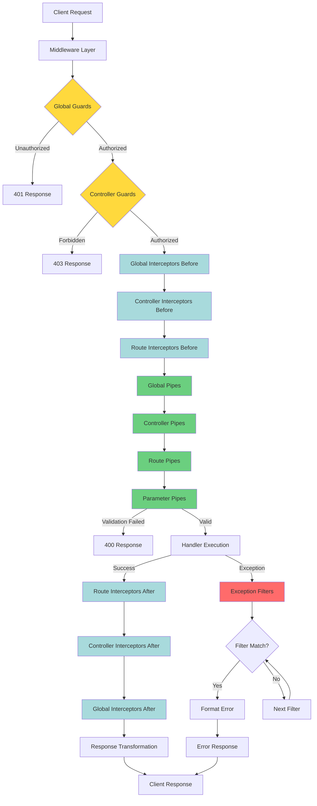

# Pipeline Best Practices: найкращі практики

::card-group

::card{title="🎯 Мета лекції" icon="i-lucide-target"}

- Зрозуміти принцип Single Responsibility для компонентів Pipeline
- Опанувати patterns оптимізації performance (кешування, lazy loading, async operations)
- Навчитися проектувати ефективні стратегії обробки помилок у Pipeline
- Вивчити best practices тестування Guards, Interceptors, Pipes, Filters
- Засвоїти архітектурні patterns для складних Pipeline (multi-tenant, microservices)
- Практикувати debugging та моніторинг компонентів Pipeline
- Розуміти trade-offs між глобальною та локальною реєстрацією компонентів

::

::card{title="🔑 Ключові терміни" icon="i-lucide-key"}

- **Single Responsibility Principle** (*принцип єдиної відповідальності*): кожен компонент має одну чітко визначену задачу
- **Performance Optimization** (*оптимізація продуктивності*): мінімізація overhead компонентів Pipeline
- **Error Handling Strategy** (*стратегія обробки помилок*): централізований підхід до обробки виключень
- **Testing Pyramid** (*піраміда тестування*): співвідношення unit/integration/e2e тестів
- **Pipeline Composition** (*композиція Pipeline*): комбінування компонентів для складної логіки
- **Observability** (*спостережуваність*): моніторинг, логування, трейсинг компонентів Pipeline

::

::

## Single Responsibility Principle у Pipeline

Кожен компонент Pipeline має виконувати **одну чітко визначену задачу**:

### Приклад порушення SRP

::code-group

```typescript [❌ Погано - Guard робить занадто багато]
@Injectable()
export class MegaGuard implements CanActivate {
  async canActivate(context: ExecutionContext): Promise<boolean> {
    const request = context.switchToHttp().getRequest();
    
    // 1. Аутентифікація
    const token = request.headers.authorization;
    if (!token) return false;
    const user = await this.jwtService.verify(token);
    
    // 2. Авторизація
    const requiredRoles = this.reflector.get('roles', context.getHandler());
    if (!requiredRoles.some(role => user.roles.includes(role))) {
      return false;
    }
    
    // 3. Rate limiting
    const key = `${user.id}:${request.url}`;
    const count = await this.redisClient.get(key);
    if (count > 10) return false;
    await this.redisClient.incr(key);
    
    // 4. Валідація ownership
    const resourceId = request.params.id;
    const resource = await this.resourceService.findOne(resourceId);
    if (resource.userId !== user.id) return false;
    
    request.user = user;
    return true;
  }
}
```

```typescript [✅ Добре - розділені Guards]
// 1. Аутентифікація
@Injectable()
export class JwtAuthGuard implements CanActivate {
  canActivate(context: ExecutionContext): boolean {
    const request = context.switchToHttp().getRequest();
    const token = request.headers.authorization;
    
    if (!token) return false;
    
    const user = this.jwtService.verify(token);
    request.user = user;
    return true;
  }
}

// 2. Авторизація
@Injectable()
export class RolesGuard implements CanActivate {
  canActivate(context: ExecutionContext): boolean {
    const requiredRoles = this.reflector.get('roles', context.getHandler());
    const user = context.switchToHttp().getRequest().user;
    
    return requiredRoles.some(role => user.roles.includes(role));
  }
}

// 3. Rate limiting
@Injectable()
export class ThrottlerGuard implements CanActivate {
  async canActivate(context: ExecutionContext): Promise<boolean> {
    const request = context.switchToHttp().getRequest();
    const key = `${request.user.id}:${request.url}`;
    
    const count = await this.redisClient.get(key);
    if (count > 10) return false;
    
    await this.redisClient.incr(key);
    return true;
  }
}

// 4. Ownership validation
@Injectable()
export class OwnershipGuard implements CanActivate {
  async canActivate(context: ExecutionContext): Promise<boolean> {
    const request = context.switchToHttp().getRequest();
    const resourceId = request.params.id;
    const resource = await this.resourceService.findOne(resourceId);
    
    return resource.userId === request.user.id;
  }
}

// Використання
@Controller('posts')
@UseGuards(JwtAuthGuard, RolesGuard, ThrottlerGuard, OwnershipGuard)
export class PostsController {
  @Patch(':id')
  @Roles('user')
  update(@Param('id') id: string, @Body() dto: UpdatePostDto) {
    return this.postsService.update(id, dto);
  }
}
```

::

**Переваги розділення:**
- Кожен Guard можна **тестувати окремо**
- **Переві використання** у різних контекстах
- **Простіше підтримувати** та модифікувати
- **Зрозуміліший** порядок виконання

### Приклад правильного розділення відповідальностей

```typescript
// Interceptor: логування запитів
@Injectable()
export class LoggingInterceptor implements NestInterceptor {
  intercept(context: ExecutionContext, next: CallHandler) {
    const request = context.switchToHttp().getRequest();
    console.log(`${request.method} ${request.url}`);
    return next.handle();
  }
}

// Interceptor: трансформація відповідей
@Injectable()
export class TransformInterceptor implements NestInterceptor {
  intercept(context: ExecutionContext, next: CallHandler) {
    return next.handle().pipe(
      map(data => ({ data, timestamp: new Date().toISOString() }))
    );
  }
}

// Interceptor: кешування
@Injectable()
export class CacheInterceptor implements NestInterceptor {
  intercept(context: ExecutionContext, next: CallHandler) {
    const key = this.generateCacheKey(context);
    const cached = this.cache.get(key);
    
    if (cached) return of(cached);
    
    return next.handle().pipe(tap(data => this.cache.set(key, data)));
  }
}
```

## Performance Optimization: оптимізація продуктивності

### 1. Мінімізація async операцій у Guards

::code-group

```typescript [❌ Погано - кілька DB queries]
@Injectable()
export class ResourceGuard implements CanActivate {
  async canActivate(context: ExecutionContext): Promise<boolean> {
    const request = context.switchToHttp().getRequest();
    
    // 3 окремих DB queries
    const user = await this.usersService.findOne(request.user.id);
    const resource = await this.resourcesService.findOne(request.params.id);
    const permissions = await this.permissionsService.getForUser(user.id);
    
    return permissions.includes('resource:read');
  }
}
```

```typescript [✅ Добре - batch query]
@Injectable()
export class ResourceGuard implements CanActivate {
  async canActivate(context: ExecutionContext): Promise<boolean> {
    const request = context.switchToHttp().getRequest();
    
    // 1 batch query
    const [user, resource, permissions] = await Promise.all([
      this.usersService.findOne(request.user.id),
      this.resourcesService.findOne(request.params.id),
      this.permissionsService.getForUser(request.user.id),
    ]);
    
    return permissions.includes('resource:read');
  }
}
```

::

### 2. Кешування метаданих у Reflector

```typescript
@Injectable()
export class OptimizedRolesGuard implements CanActivate {
  private metadataCache = new Map<Function, string[]>();

  constructor(private reflector: Reflector) {}

  canActivate(context: ExecutionContext): boolean {
    const handler = context.getHandler();
    
    // Кешування метаданих
    if (!this.metadataCache.has(handler)) {
      const roles = this.reflector.getAllAndOverride<string[]>('roles', [
        handler,
        context.getClass(),
      ]);
      this.metadataCache.set(handler, roles);
    }
    
    const requiredRoles = this.metadataCache.get(handler);
    if (!requiredRoles) return true;
    
    const user = context.switchToHttp().getRequest().user;
    return requiredRoles.some(role => user.roles?.includes(role));
  }
}
```

### 3. Lazy loading для важких операцій

```typescript
@Injectable()
export class HeavyInterceptor implements NestInterceptor {
  private heavyService?: HeavyService;

  constructor(private moduleRef: ModuleRef) {}

  async intercept(context: ExecutionContext, next: CallHandler) {
    // Lazy load сервісу лише коли потрібно
    if (!this.heavyService) {
      this.heavyService = await this.moduleRef.get(HeavyService, { strict: false });
    }
    
    return next.handle();
  }
}
```

### 4. Умовне виконання компонентів

```typescript
@Injectable()
export class ConditionalLoggingInterceptor implements NestInterceptor {
  constructor(private reflector: Reflector) {}

  intercept(context: ExecutionContext, next: CallHandler) {
    const shouldLog = this.reflector.get('log', context.getHandler());
    
    // Пропуск якщо логування не потрібне
    if (!shouldLog) {
      return next.handle();
    }
    
    // Логування лише для позначених endpoints
    console.log('Logging...');
    return next.handle();
  }
}
```

### 5. Оптимізація Exception Filters

```typescript
@Catch()
export class OptimizedExceptionFilter implements ExceptionFilter {
  private readonly logger = new Logger(OptimizedExceptionFilter.name);

  catch(exception: unknown, host: ArgumentsHost) {
    const ctx = host.switchToHttp();
    const response = ctx.getResponse();
    const request = ctx.getRequest();

    // Асинхронне логування без блокування відповіді
    setImmediate(() => {
      this.logger.error('Exception occurred', {
        url: request.url,
        error: exception,
      });
    });

    // Швидка відповідь клієнту
    const status = exception instanceof HttpException 
      ? exception.getStatus() 
      : 500;
    
    response.status(status).json({
      statusCode: status,
      message: 'Error occurred',
    });
  }
}
```

## Error Handling Strategy: стратегії обробки помилок

### 1. Централізована обробка через Exception Filters

```typescript
// filters/all-exceptions.filter.ts
@Catch()
export class AllExceptionsFilter implements ExceptionFilter {
  constructor(
    private logger: Logger,
    private errorReporter: ErrorReporterService,
  ) {}

  catch(exception: unknown, host: ArgumentsHost) {
    const ctx = host.switchToHttp();
    const response = ctx.getResponse();
    const request = ctx.getRequest();

    const status = this.getStatus(exception);
    const message = this.getMessage(exception);

    // Логування
    this.logger.error(`${request.method} ${request.url}`, {
      statusCode: status,
      message,
      stack: exception instanceof Error ? exception.stack : undefined,
      userId: request.user?.id,
    });

    // Відправлення у Sentry/Datadog
    if (status >= 500) {
      this.errorReporter.captureException(exception, { request });
    }

    // Відповідь клієнту
    response.status(status).json({
      statusCode: status,
      message: status >= 500 ? 'Internal server error' : message,
      timestamp: new Date().toISOString(),
      path: request.url,
    });
  }

  private getStatus(exception: unknown): number {
    if (exception instanceof HttpException) {
      return exception.getStatus();
    }
    return HttpStatus.INTERNAL_SERVER_ERROR;
  }

  private getMessage(exception: unknown): string {
    if (exception instanceof HttpException) {
      return exception.message;
    }
    if (exception instanceof Error) {
      return exception.message;
    }
    return 'Unknown error';
  }
}
```

### 2. Ієрархія кастомних виключень

```typescript
// Базове виключення
export class AppException extends HttpException {
  constructor(
    public readonly code: string,
    message: string,
    statusCode: number,
  ) {
    super({ code, message }, statusCode);
  }
}

// Специфічні виключення
export class UserNotFoundException extends AppException {
  constructor(userId: string) {
    super('USER_NOT_FOUND', `User with ID ${userId} not found`, 404);
  }
}

export class InsufficientBalanceException extends AppException {
  constructor(required: number, available: number) {
    super(
      'INSUFFICIENT_BALANCE',
      `Insufficient balance: required ${required}, available ${available}`,
      402
    );
  }
}

export class ResourceConflictException extends AppException {
  constructor(resourceType: string, identifier: string) {
    super(
      'RESOURCE_CONFLICT',
      `${resourceType} with identifier ${identifier} already exists`,
      409
    );
  }
}
```

**Використання:**

```typescript
@Controller('users')
export class UsersController {
  @Get(':id')
  async findOne(@Param('id') id: string) {
    const user = await this.usersService.findById(id);
    
    if (!user) {
      throw new UserNotFoundException(id); // Клієнт отримає код помилки
    }
    
    return user;
  }

  @Post('purchase')
  async purchase(@Body() dto: PurchaseDto, @CurrentUser() user: User) {
    if (user.balance < dto.amount) {
      throw new InsufficientBalanceException(dto.amount, user.balance);
    }
    
    return this.paymentsService.process(dto);
  }
}
```

### 3. Circuit Breaker для зовнішніх API

```typescript
@Injectable()
export class CircuitBreakerInterceptor implements NestInterceptor {
  private failures = new Map<string, number>();
  private readonly threshold = 5;
  private readonly timeout = 60000; // 1 minute

  intercept(context: ExecutionContext, next: CallHandler) {
    const key = this.getKey(context);
    const failures = this.failures.get(key) || 0;

    if (failures >= this.threshold) {
      throw new ServiceUnavailableException(
        'Service temporarily unavailable due to circuit breaker'
      );
    }

    return next.handle().pipe(
      tap(() => this.failures.set(key, 0)), // Reset on success
      catchError(err => {
        this.failures.set(key, failures + 1);
        
        setTimeout(() => {
          this.failures.set(key, 0); // Reset after timeout
        }, this.timeout);
        
        throw err;
      }),
    );
  }

  private getKey(context: ExecutionContext): string {
    return `${context.getClass().name}.${context.getHandler().name}`;
  }
}
```


## Testing Patterns: патерни тестування

### Testing Pyramid для Pipeline компонентів

```
         /\
        /E2\     10% - E2E tests (повні інтеграційні сценарії)
       /____\
      /      \
     / Integr \   20% - Integration tests (взаємодія компонентів)
    /________\
   /          \
  /   Unit     \  70% - Unit tests (окремі компоненти)
 /______________\
```

### 1. Unit-тестування Guards

```typescript
import { Test } from '@nestjs/testing';
import { Reflector } from '@nestjs/core';
import { ExecutionContext } from '@nestjs/common';
import { RolesGuard } from './roles.guard';

describe('RolesGuard', () => {
  let guard: RolesGuard;
  let reflector: Reflector;

  beforeEach(async () => {
    const module = await Test.createTestingModule({
      providers: [RolesGuard, Reflector],
    }).compile();

    guard = module.get(RolesGuard);
    reflector = module.get(Reflector);
  });

  describe('canActivate', () => {
    it('should return true when no roles required', () => {
      jest.spyOn(reflector, 'getAllAndOverride').mockReturnValue(undefined);

      const context = createMockContext({ user: { roles: ['user'] } });
      
      expect(guard.canActivate(context)).toBe(true);
    });

    it('should return false when user lacks required role', () => {
      jest.spyOn(reflector, 'getAllAndOverride').mockReturnValue(['admin']);

      const context = createMockContext({ user: { roles: ['user'] } });
      
      expect(guard.canActivate(context)).toBe(false);
    });

    it('should return true when user has required role', () => {
      jest.spyOn(reflector, 'getAllAndOverride').mockReturnValue(['admin', 'user']);

      const context = createMockContext({ user: { roles: ['admin'] } });
      
      expect(guard.canActivate(context)).toBe(true);
    });

    it('should return false when user is not authenticated', () => {
      jest.spyOn(reflector, 'getAllAndOverride').mockReturnValue(['user']);

      const context = createMockContext({ user: null });
      
      expect(guard.canActivate(context)).toBe(false);
    });
  });

  function createMockContext(request: any): ExecutionContext {
    return {
      switchToHttp: () => ({ getRequest: () => request }),
      getHandler: () => ({}),
      getClass: () => ({}),
      getType: () => 'http',
    } as any;
  }
});
```

### 2. Unit-тестування Interceptors

```typescript
import { of } from 'rxjs';
import { LoggingInterceptor } from './logging.interceptor';

describe('LoggingInterceptor', () => {
  let interceptor: LoggingInterceptor;
  let logger: any;

  beforeEach(() => {
    logger = { log: jest.fn(), error: jest.fn() };
    interceptor = new LoggingInterceptor(logger);
  });

  it('should log request and response', (done) => {
    const context = createMockContext();
    const callHandler = { handle: () => of('result') };

    interceptor.intercept(context, callHandler).subscribe({
      next: (data) => {
        expect(data).toBe('result');
        expect(logger.log).toHaveBeenCalledTimes(2); // Before and after
        done();
      },
    });
  });

  it('should log errors', (done) => {
    const context = createMockContext();
    const error = new Error('Test error');
    const callHandler = { handle: () => throwError(() => error) };

    interceptor.intercept(context, callHandler).subscribe({
      error: (err) => {
        expect(err).toBe(error);
        expect(logger.error).toHaveBeenCalled();
        done();
      },
    });
  });

  function createMockContext(): any {
    return {
      switchToHttp: () => ({
        getRequest: () => ({ method: 'GET', url: '/test' }),
      }),
      getHandler: () => ({ name: 'testHandler' }),
      getClass: () => ({ name: 'TestController' }),
    };
  }
});
```

### 3. Unit-тестування Pipes

```typescript
import { BadRequestException } from '@nestjs/common';
import { ParsePositiveIntPipe } from './parse-positive-int.pipe';

describe('ParsePositiveIntPipe', () => {
  let pipe: ParsePositiveIntPipe;

  beforeEach(() => {
    pipe = new ParsePositiveIntPipe();
  });

  it('should parse valid positive integer', () => {
    expect(pipe.transform('42', { type: 'param' })).toBe(42);
  });

  it('should throw on negative integer', () => {
    expect(() => pipe.transform('-1', { type: 'param' }))
      .toThrow(BadRequestException);
  });

  it('should throw on zero', () => {
    expect(() => pipe.transform('0', { type: 'param' }))
      .toThrow(BadRequestException);
  });

  it('should throw on non-integer', () => {
    expect(() => pipe.transform('abc', { type: 'param' }))
      .toThrow(BadRequestException);
  });

  it('should throw on float', () => {
    expect(() => pipe.transform('3.14', { type: 'param' }))
      .toThrow(BadRequestException);
  });
});
```

### 4. Unit-тестування Exception Filters

```typescript
import { HttpException, HttpStatus } from '@nestjs/common';
import { HttpExceptionFilter } from './http-exception.filter';

describe('HttpExceptionFilter', () => {
  let filter: HttpExceptionFilter;

  beforeEach(() => {
    filter = new HttpExceptionFilter();
  });

  it('should format 404 error correctly', () => {
    const exception = new HttpException('Not found', HttpStatus.NOT_FOUND);
    
    const mockJson = jest.fn();
    const mockStatus = jest.fn().mockReturnValue({ json: mockJson });
    const mockResponse = { status: mockStatus };
    const mockRequest = { url: '/users/999', method: 'GET' };

    const host = {
      switchToHttp: () => ({
        getResponse: () => mockResponse,
        getRequest: () => mockRequest,
      }),
    } as any;

    filter.catch(exception, host);

    expect(mockStatus).toHaveBeenCalledWith(404);
    expect(mockJson).toHaveBeenCalledWith(
      expect.objectContaining({
        statusCode: 404,
        message: 'Not found',
      })
    );
  });
});
```

### 5. Integration-тестування Pipeline

```typescript
import { Test, TestingModule } from '@nestjs/testing';
import { INestApplication } from '@nestjs/common';
import { UsersController } from './users.controller';
import { UsersService } from './users.service';
import { JwtAuthGuard } from '../guards/jwt-auth.guard';
import { RolesGuard } from '../guards/roles.guard';

describe('Users Pipeline (Integration)', () => {
  let app: INestApplication;
  let usersService: UsersService;

  beforeAll(async () => {
    const moduleFixture: TestingModule = await Test.createTestingModule({
      controllers: [UsersController],
      providers: [
        UsersService,
        JwtAuthGuard,
        RolesGuard,
      ],
    }).compile();

    app = moduleFixture.createNestApplication();
    usersService = moduleFixture.get(UsersService);
    
    await app.init();
  });

  afterAll(async () => {
    await app.close();
  });

  it('should pass through all guards and interceptors', async () => {
    const spy = jest.spyOn(usersService, 'findAll');
    
    // Імітація запиту з правильним токеном та роллю
    const request = {
      user: { id: 1, roles: ['admin'] },
    };

    // Test execution...
    
    expect(spy).toHaveBeenCalled();
  });
});
```

### 6. E2E-тестування повного Pipeline

```typescript
import { Test, TestingModule } from '@nestjs/testing';
import { INestApplication } from '@nestjs/common';
import * as request from 'supertest';
import { AppModule } from './../src/app.module';

describe('Complete Pipeline (e2e)', () => {
  let app: INestApplication;
  let authToken: string;

  beforeAll(async () => {
    const moduleFixture: TestingModule = await Test.createTestingModule({
      imports: [AppModule],
    }).compile();

    app = moduleFixture.createNestApplication();
    await app.init();

    // Отримання токену
    const loginResponse = await request(app.getHttpServer())
      .post('/auth/login')
      .send({ email: 'admin@example.com', password: 'password' });

    authToken = loginResponse.body.token;
  });

  afterAll(async () => {
    await app.close();
  });

  describe('Full Pipeline Flow', () => {
    it('should execute complete pipeline successfully', async () => {
      return request(app.getHttpServer())
        .get('/users')
        .set('Authorization', `Bearer ${authToken}`)
        .expect(200)
        .expect(res => {
          // Перевірка що response трансформовано через TransformInterceptor
          expect(res.body).toHaveProperty('data');
          expect(res.body).toHaveProperty('timestamp');
        });
    });

    it('should reject unauthorized requests', async () => {
      return request(app.getHttpServer())
        .get('/users')
        .expect(401);
    });

    it('should validate request body', async () => {
      return request(app.getHttpServer())
        .post('/users')
        .set('Authorization', `Bearer ${authToken}`)
        .send({ email: 'invalid-email' }) // Невалідний email
        .expect(400)
        .expect(res => {
          expect(res.body.message).toContain('Validation');
        });
    });

    it('should enforce rate limits', async () => {
      const endpoint = '/api/limited';

      // Зробити багато запитів
      for (let i = 0; i < 10; i++) {
        await request(app.getHttpServer()).get(endpoint);
      }

      // Наступний має бути заблокований
      return request(app.getHttpServer())
        .get(endpoint)
        .expect(429);
    });
  });
});
```

## Архітектурні Patterns

### 1. Multi-Tenant Architecture

```typescript
// interceptors/tenant.interceptor.ts
@Injectable()
export class TenantInterceptor implements NestInterceptor {
  constructor(private tenantService: TenantService) {}

  async intercept(context: ExecutionContext, next: CallHandler) {
    const request = context.switchToHttp().getRequest();
    const tenantId = request.headers['x-tenant-id'];

    if (!tenantId) {
      throw new BadRequestException('Tenant ID required');
    }

    // Завантаження tenant
    const tenant = await this.tenantService.findById(tenantId);
    if (!tenant) {
      throw new NotFoundException('Tenant not found');
    }

    // Встановлення tenant у request
    request.tenant = tenant;

    // Встановлення tenant для database connection
    await this.tenantService.setCurrentTenant(tenant);

    return next.handle();
  }
}

// Використання
@Controller('api')
@UseInterceptors(TenantInterceptor)
export class ApiController {
  @Get('data')
  getData(@Req() req: Request) {
    const tenant = req['tenant'];
    // Всі DB queries автоматично фільтруються по tenant
    return this.dataService.findAll();
  }
}
```

### 2. Request Context Pattern

```typescript
// request-context.service.ts
@Injectable({ scope: Scope.REQUEST })
export class RequestContextService {
  private context = new Map<string, any>();

  set(key: string, value: any): void {
    this.context.set(key, value);
  }

  get<T>(key: string): T | undefined {
    return this.context.get(key);
  }
}

// interceptors/context.interceptor.ts
@Injectable()
export class ContextInterceptor implements NestInterceptor {
  constructor(private contextService: RequestContextService) {}

  intercept(context: ExecutionContext, next: CallHandler) {
    const request = context.switchToHttp().getRequest();
    
    // Зберігання контексту
    this.contextService.set('user', request.user);
    this.contextService.set('requestId', request.headers['x-request-id']);
    this.contextService.set('tenant', request.tenant);
    
    return next.handle();
  }
}

// Використання у сервісах
@Injectable()
export class AuditService {
  constructor(private contextService: RequestContextService) {}

  async logAction(action: string) {
    const user = this.contextService.get('user');
    const requestId = this.contextService.get('requestId');
    
    await this.auditRepository.save({
      action,
      userId: user?.id,
      requestId,
      timestamp: new Date(),
    });
  }
}
```

### 3. Feature Flags Pattern

```typescript
// decorators/feature-flag.decorator.ts
import { SetMetadata } from '@nestjs/common';

export const FEATURE_FLAG_KEY = 'featureFlag';
export const FeatureFlag = (flagName: string) => SetMetadata(FEATURE_FLAG_KEY, flagName);

// guards/feature-flag.guard.ts
@Injectable()
export class FeatureFlagGuard implements CanActivate {
  constructor(
    private reflector: Reflector,
    private featureFlagsService: FeatureFlagsService,
  ) {}

  async canActivate(context: ExecutionContext): Promise<boolean> {
    const flagName = this.reflector.get<string>(FEATURE_FLAG_KEY, context.getHandler());

    if (!flagName) {
      return true;
    }

    const request = context.switchToHttp().getRequest();
    const isEnabled = await this.featureFlagsService.isEnabled(flagName, {
      userId: request.user?.id,
      tenant: request.tenant?.id,
    });

    if (!isEnabled) {
      throw new NotFoundException('Feature not available');
    }

    return true;
  }
}

// Використання
@Controller('features')
@UseGuards(FeatureFlagGuard)
export class FeaturesController {
  @Get('new-dashboard')
  @FeatureFlag('new-dashboard')
  getNewDashboard() {
    return { message: 'New dashboard' };
  }
}
```

### 4. API Versioning Pattern

```typescript
// interceptors/api-version.interceptor.ts
@Injectable()
export class ApiVersionInterceptor implements NestInterceptor {
  intercept(context: ExecutionContext, next: CallHandler) {
    const request = context.switchToHttp().getRequest();
    const version = request.headers['api-version'] || '1.0';

    request.apiVersion = version;

    return next.handle().pipe(
      map(data => {
        // Трансформація відповіді залежно від версії API
        if (version === '2.0') {
          return this.transformToV2(data);
        }
        return data;
      }),
    );
  }

  private transformToV2(data: any): any {
    // Трансформація структури для v2
    return {
      version: '2.0',
      result: data,
      metadata: {
        timestamp: new Date().toISOString(),
      },
    };
  }
}
```

## Observability: моніторинг та debugging

### 1. Structured Logging

```typescript
@Injectable()
export class StructuredLoggingInterceptor implements NestInterceptor {
  private readonly logger = new Logger(StructuredLoggingInterceptor.name);

  intercept(context: ExecutionContext, next: CallHandler) {
    const request = context.switchToHttp().getRequest();
    const startTime = Date.now();

    // Log request
    this.logger.log('Incoming request', {
      method: request.method,
      url: request.url,
      params: request.params,
      query: request.query,
      userId: request.user?.id,
      requestId: request.headers['x-request-id'],
      userAgent: request.headers['user-agent'],
      ip: request.ip,
    });

    return next.handle().pipe(
      tap(data => {
        const duration = Date.now() - startTime;
        
        // Log response
        this.logger.log('Request completed', {
          method: request.method,
          url: request.url,
          statusCode: 200,
          duration,
          requestId: request.headers['x-request-id'],
        });
      }),
      catchError(err => {
        const duration = Date.now() - startTime;
        
        // Log error
        this.logger.error('Request failed', {
          method: request.method,
          url: request.url,
          error: err.message,
          stack: err.stack,
          duration,
          requestId: request.headers['x-request-id'],
        });
        
        throw err;
      }),
    );
  }
}
```

### 2. Distributed Tracing

```typescript
import * as opentelemetry from '@opentelemetry/api';

@Injectable()
export class TracingInterceptor implements NestInterceptor {
  intercept(context: ExecutionContext, next: CallHandler) {
    const tracer = opentelemetry.trace.getTracer('nestjs-app');
    const request = context.switchToHttp().getRequest();
    
    return tracer.startActiveSpan(
      `${request.method} ${request.url}`,
      (span) => {
        span.setAttributes({
          'http.method': request.method,
          'http.url': request.url,
          'http.user_agent': request.headers['user-agent'],
          'user.id': request.user?.id,
        });

        return next.handle().pipe(
          tap(() => {
            span.setStatus({ code: opentelemetry.SpanStatusCode.OK });
            span.end();
          }),
          catchError(err => {
            span.setStatus({
              code: opentelemetry.SpanStatusCode.ERROR,
              message: err.message,
            });
            span.recordException(err);
            span.end();
            throw err;
          }),
        );
      },
    );
  }
}
```

### 3. Metrics Collection

```typescript
@Injectable()
export class MetricsInterceptor implements NestInterceptor {
  constructor(private metricsService: MetricsService) {}

  intercept(context: ExecutionContext, next: CallHandler) {
    const request = context.switchToHttp().getRequest();
    const startTime = Date.now();

    return next.handle().pipe(
      tap(() => {
        const duration = Date.now() - startTime;
        
        // Збір метрик
        this.metricsService.recordHttpRequest({
          method: request.method,
          endpoint: request.route?.path || request.url,
          statusCode: 200,
          duration,
        });
      }),
      catchError(err => {
        const duration = Date.now() - startTime;
        
        this.metricsService.recordHttpRequest({
          method: request.method,
          endpoint: request.route?.path || request.url,
          statusCode: err.status || 500,
          duration,
        });
        
        throw err;
      }),
    );
  }
}
```


## Checklist: контрольний список для Pipeline

### Перед впровадженням компонента

- [ ] **Single Responsibility:** компонент виконує одну чітко визначену задачу
- [ ] **Performance:** мінімізовано async операції та DB queries
- [ ] **Error Handling:** правильна обробка виключень з інформативними повідомленнями
- [ ] **Testing:** написано unit-тести (70%+ coverage)
- [ ] **Observability:** додано логування для дебагу
- [ ] **Documentation:** додано JSDoc коментарі та приклади використання

### Для Guards

- [ ] Не виконує бізнес-логіку (лише перевірка доступу)
- [ ] Використовує Reflector для метаданих
- [ ] Надає можливість пропуску через metadata декоратор
- [ ] Викидає зрозумілі виключення (UnauthorizedException, ForbiddenException)
- [ ] Async операції мінімізовані

### Для Interceptors

- [ ] Не модифікує request напряму (immutable підхід)
- [ ] Правильно обробляє помилки у pipe operators
- [ ] Використовує tap() для side effects
- [ ] Не блокує response (async операції у setImmediate або окремих потоках)
- [ ] Має можливість умовного виконання

### Для Pipes

- [ ] Викидає BadRequestException при невалідних даних
- [ ] Має чіткий error message
- [ ] Підтримує трансформацію типів
- [ ] Не має side effects (чистий pipe)
- [ ] Швидко виконується (без DB queries)

### Для Exception Filters

- [ ] Не розкриває стек трейси у production
- [ ] Логує помилки з контекстом
- [ ] Відправляє 5xx помилки у Sentry/Datadog
- [ ] Повертає структуровані JSON-відповіді
- [ ] Приховує чутливу інформацію

## Діаграма: повний Request Pipeline flow



**Легенда:**
- **Жовтий (Guards)**: перевірка аутентифікації та авторизації
- **Зелений (Pipes)**: валідація та трансформація даних
- **Блакитний (Interceptors)**: логування, трансформація, кешування
- **Червоний (Exception Filters)**: обробка помилок

## Підсумок

::card-group

::card{title="🎯 Single Responsibility" icon="i-lucide-target"}

Кожен компонент Pipeline виконує одну задачу. Розділяйте аутентифікацію, авторизацію, rate limiting на окремі Guards. Спрощує тестування та підтримку.

**Правило:** один Guard = одна перевірка

::

::card{title="⚡ Performance Optimization" icon="i-lucide-zap"}

Мінімізуйте async операції через Promise.all(). Кешуйте метадані Reflector. Використовуйте lazy loading для важких сервісів. Уникайте блокування response.

**Ключ:** batch queries, кешування, умовне виконання

::

::card{title="🛡️ Error Handling Strategy" icon="i-lucide-shield"}

Централізована обробка через Exception Filters. Ієрархія кастомних виключень з кодами помилок. Circuit Breaker для зовнішніх API. Логування з контекстом.

**Підхід:** catch all → log → transform → respond

::

::card{title="🧪 Testing Pyramid" icon="i-lucide-pyramid"}

70% unit-тести (окремі компоненти), 20% integration (взаємодія), 10% E2E (повні сценарії). Мокування ExecutionContext та Reflector. Supertest для E2E.

**Структура:** unit → integration → e2e

::

::card{title="🏗️ Architectural Patterns" icon="i-lucide-building"}

Multi-tenant через TenantInterceptor. Request Context для зберігання даних запиту. Feature Flags для A/B тестування. API Versioning для backward compatibility.

**Patterns:** tenant isolation, feature toggles, versioning

::

::card{title="📊 Observability" icon="i-lucide-activity"}

Structured logging з контекстом (requestId, userId, duration). Distributed tracing через OpenTelemetry. Metrics collection (request count, duration, errors).

**Інструменти:** Winston, OpenTelemetry, Prometheus

::

::card{title="✅ Quality Checklist" icon="i-lucide-check-square"}

Перевірка перед deploy: SRP дотримано, performance оптимізовано, error handling налаштовано, тести написано, логування додано, документація оновлена.

**Мінімум:** 70% coverage, structured logs, error tracking

::

::card{title="🔄 Pipeline Flow" icon="i-lucide-git-merge"}

Middleware → Guards → Interceptors Before → Pipes → Handler → Interceptors After → Filters. Глобальні виконуються перед локальними. Порядок реєстрації = порядок виконання.

**Запам'ятати:** global → controller → route → parameter

::

::

## Часті запитання (FAQ)

::accordion

::accordion-item{title="Скільки Guards можна додати на один endpoint?"}

**Технічно необмежено**, але рекомендується **не більше 5-7** для читабельності:

```typescript
@UseGuards(
  JwtAuthGuard,      // 1. Аутентифікація
  RolesGuard,        // 2. Авторизація ролей
  PermissionsGuard,  // 3. Авторизація permissions
  ThrottlerGuard,    // 4. Rate limiting
  OwnershipGuard,    // 5. Перевірка власності
)
```

**Кожен Guard додає overhead**, тому:
- Об'єднуйте прості перевірки в один Guard
- Використовуйте глобальні Guards для повторюваних перевірок
- Кешуйте результати перевірок якщо можливо

::

::accordion-item{title="Чи можна змінити порядок виконання Pipes?"}

**Порядок фіксований:**
1. Global Pipes (APP_PIPE)
2. Controller Pipes (@UsePipes на класі)
3. Route Pipes (@UsePipes на методі)
4. Parameter Pipes (@Param('id', ParseIntPipe))

**Не можна змінити**, але можна:
- Контролювати через порядок реєстрації Global Pipes
- Використовувати умовне виконання у Pipe
- Створити композитний Pipe, що викликає інші в потрібному порядку

::

::accordion-item{title="Як дебажити Pipeline коли щось не працює?"}

**Крок 1:** Додайте LoggingInterceptor для трейсингу:

```typescript
@Injectable()
export class DebugInterceptor implements NestInterceptor {
  intercept(context: ExecutionContext, next: CallHandler) {
    const request = context.switchToHttp().getRequest();
    console.log('Before handler:', {
      url: request.url,
      user: request.user,
      body: request.body,
    });

    return next.handle().pipe(
      tap(data => console.log('After handler:', data)),
      catchError(err => {
        console.error('Error in handler:', err);
        throw err;
      }),
    );
  }
}
```

**Крок 2:** Перевірте порядок Guards:

```typescript
console.log('Guards order:', [
  'JwtAuthGuard',
  'RolesGuard',
  'ThrottlerGuard',
]);
```

**Крок 3:** Використовуйте NestJS Logger з рівнем DEBUG:

```typescript
// main.ts
app.useLogger(['log', 'error', 'warn', 'debug', 'verbose']);
```

::

::accordion-item{title="Чи варто використовувати Interceptor для бізнес-логіки?"}

**Ні**, Interceptors призначені для:
- Логування
- Трансформація response
- Кешування
- Performance monitoring

**Бізнес-логіка належить у:**
- **Services:** основна бізнес-логіка
- **Guards:** перевірка доступу
- **Pipes:** валідація даних

**Приклад:**

```typescript
// ❌ Погано - бізнес-логіка в Interceptor
@Injectable()
export class BadInterceptor implements NestInterceptor {
  intercept(context, next) {
    const request = context.switchToHttp().getRequest();
    const user = request.user;
    
    // Бізнес-логіка - не тут!
    if (user.subscription.status !== 'active') {
      throw new PaymentRequiredException();
    }
    
    return next.handle();
  }
}

// ✅ Добре - бізнес-логіка в Guard
@Injectable()
export class SubscriptionGuard implements CanActivate {
  canActivate(context: ExecutionContext): boolean {
    const user = context.switchToHttp().getRequest().user;
    return user.subscription.status === 'active';
  }
}
```

::

::accordion-item{title="Як обробляти помилки у глобальних Interceptors?"}

Використовуйте `catchError` operator:

```typescript
@Injectable()
export class SafeInterceptor implements NestInterceptor {
  private readonly logger = new Logger(SafeInterceptor.name);

  intercept(context: ExecutionContext, next: CallHandler) {
    return next.handle().pipe(
      catchError(err => {
        // Логування помилки
        this.logger.error('Error in interceptor', err);

        // Пропуск помилки далі до Exception Filter
        return throwError(() => err);
      }),
    );
  }
}
```

**Важливо:** не ковтайте помилки (`return of(null)`), інакше Exception Filter їх не побачить!

::

::accordion-item{title="Чи можна використовувати async/await у Guards?"}

**Так**, Guards підтримують async:

```typescript
@Injectable()
export class AsyncGuard implements CanActivate {
  constructor(private usersService: UsersService) {}

  async canActivate(context: ExecutionContext): Promise<boolean> {
    const request = context.switchToHttp().getRequest();
    const userId = request.user?.id;

    // Async DB query
    const user = await this.usersService.findById(userId);
    
    return user?.isActive === true;
  }
}
```

**Рекомендація:** мінімізуйте async операції для performance.

::

::accordion-item{title="Як протестувати глобальні компоненти окремо від застосунку?"}

Створіть тестовий модуль з лише потрібними компонентами:

```typescript
describe('Global Pipeline Components', () => {
  let guard: JwtAuthGuard;
  let interceptor: LoggingInterceptor;

  beforeEach(async () => {
    const module = await Test.createTestingModule({
      providers: [
        JwtAuthGuard,
        LoggingInterceptor,
        { provide: JwtService, useValue: mockJwtService },
      ],
    }).compile();

    guard = module.get(JwtAuthGuard);
    interceptor = module.get(LoggingInterceptor);
  });

  it('should work independently', () => {
    const context = createMockContext();
    expect(guard.canActivate(context)).toBe(true);
  });
});
```

::

::accordion-item{title="Яка різниця між Exception Filter та Error Interceptor?"}

**Exception Filter:**
- Перехоплює **необроблені виключення**
- Виконується **після** всіх Interceptors
- Формує **фінальну** HTTP-відповідь про помилку
- Використовується для **централізованої** обробки помилок

**Error Interceptor:**
- Перехоплює помилки у **RxJS pipe**
- Виконується **під час** обробки response
- Може **трансформувати** помилки перед Exception Filter
- Використовується для **специфічної** обробки (retry, fallback)

**Приклад:**

```typescript
// Interceptor: retry на помилку
@Injectable()
export class RetryInterceptor implements NestInterceptor {
  intercept(context, next) {
    return next.handle().pipe(
      retry(3), // Retry 3 рази
      catchError(err => {
        // Якщо всі retry failed, помилка йде у Exception Filter
        return throwError(() => err);
      }),
    );
  }
}

// Filter: фінальна обробка
@Catch()
export class AllExceptionsFilter implements ExceptionFilter {
  catch(exception, host) {
    // Формування відповіді клієнту
    response.status(500).json({ error: 'Internal server error' });
  }
}
```

::

::

---

**Вітаємо!** Ви завершили вивчення **NestJS Validation Pipeline**. Тепер ви володієте знаннями про:
- Middleware, Guards, Interceptors, Pipes, Exception Filters
- Execution Context, ArgumentsHost, Reflector
- Custom Decorators (parameter та metadata)
- Global Components та APP_* токени
- Best Practices: SRP, performance, error handling, testing

**Наступні кроки:**
- Практикуйте створення власних компонентів Pipeline
- Інтегруйте з реальними проектами
- Вивчайте advanced patterns (multi-tenant, microservices)
- Розширюйте знання про NestJS ecosystem (TypeORM, GraphQL, WebSockets)

**Успіхів у розробці!** 🚀
