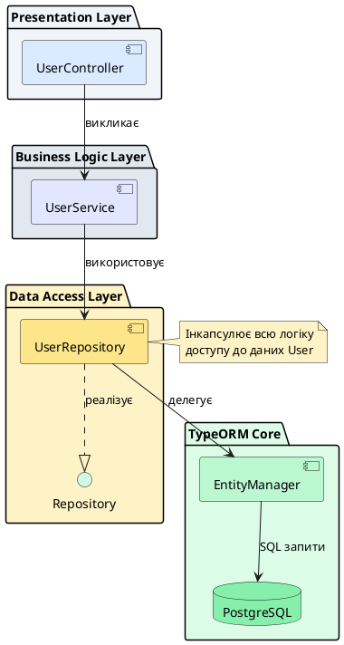

# Repository Pattern та CRUD операції

::card-group

::card{title="🎯 Мета лекції" icon="i-lucide-target"}

- Опанувати Repository Pattern — архітектурний патерн для абстракції доступу до даних у TypeORM.
- Вивчити методи репозиторіїв для виконання CRUD операцій: create, read, update, delete.
- Навчитися працювати з транзакціями для забезпечення атомарності складних операцій.
- Освоїти bulk операції для ефективної роботи з великими обсягами даних.
- Створити custom репозиторії для інкапсуляції складної бізнес-логіки.

::

::card{title="🔑 Ключові терміни" icon="i-lucide-key"}

- **Repository:** об'єкт-посередник між бізнес-логікою та шаром доступу до даних, що надає методи для роботи з Entity.
- **CRUD:** акронім для базових операцій з даними: Create (створення), Read (читання), Update (оновлення), Delete (видалення).
- **Transaction:** послідовність операцій БД, що виконуються як атомарна одиниця (all or nothing).
- **Bulk Operation:** масова операція над множиною записів одним запитом для підвищення продуктивності.

::

::

---

## Repository Pattern: концепція та архітектура

### Що таке Repository Pattern

**Repository Pattern** — це архітектурний патерн, що створює шар абстракції між бізнес-логікою застосунку та механізмом персистентності (збереження даних). Замість прямого звернення до Entity Manager або DataSource, весь код працює з даними через уніфікований інтерфейс репозиторію.

**Фундаментальна схема взаємодії:**

::plant-uml{alt="Repository Pattern Architecture"}



::

**Ключові принципи Repository Pattern:**

1. **Абстракція:** Бізнес-логіка не знає про SQL, Entity Manager або специфіку БД.
2. **Уніфікація:** Всі операції з даними виконуються через методи репозиторію (`save()`, `find()`, `delete()`).
3. **Тестованість:** Легко замінити справжній репозиторій на mock у юніт-тестах.
4. **Розділення відповідальностей:** Репозиторій відповідає тільки за персистентність, а не за бізнес-правила.

::note

У попередніх лекціях ми створили Entity класи (`User`, `Post`, `Product`). Тепер ми навчимося взаємодіяти з цими Entity через репозиторії — основний спосіб роботи з даними у TypeORM.

::

### Отримання репозиторію у NestJS

У NestJS репозиторії інжектяться через Dependency Injection за допомогою декоратора `@InjectRepository()`:

```typescript [src/users/users.service.ts]
import { Injectable } from '@nestjs/common';
import { InjectRepository } from '@nestjs/typeorm';
import { Repository } from 'typeorm';
import { User } from './entities/user.entity';

@Injectable()
export class UsersService {
  constructor(
    @InjectRepository(User)
    private readonly userRepository: Repository<User>,
  ) {}

  async findAll(): Promise<User[]> {
    return this.userRepository.find();
  }

  async findById(id: string): Promise<User | null> {
    return this.userRepository.findOneBy({ id });
  }
}
```

**Реєстрація Entity у модулі:**

```typescript [src/users/users.module.ts]
import { Module } from '@nestjs/common';
import { TypeOrmModule } from '@nestjs/typeorm';
import { User } from './entities/user.entity';
import { UsersService } from './users.service';
import { UsersController } from './users.controller';

@Module({
  imports: [
    TypeOrmModule.forFeature([User]), // Реєстрація Entity
  ],
  providers: [UsersService],
  controllers: [UsersController],
  exports: [UsersService], // Експорт для використання в інших модулях
})
export class UsersModule {}
```

### Repository vs EntityManager

TypeORM надає два способи роботи з даними:

**Repository:** Специфічний для конкретної Entity, типізований.

```typescript
const userRepository: Repository<User> = dataSource.getRepository(User);
const user = await userRepository.findOneBy({ id: 1 }); // Повертає User | null
```

**EntityManager:** Універсальний менеджер для всіх Entity, менш типізований.

```typescript
const entityManager = dataSource.manager;
const user = await entityManager.findOne(User, { where: { id: 1 } }); // Потребує явного вказання Entity
```

**Порівняння:**

| Характеристика      | Repository                    | EntityManager                |
| ------------------- | ----------------------------- | ---------------------------- |
| Типізація           | ✅ Повна (`Repository<User>`) | ⚠️ Часткова                  |
| Зручність           | ✅ Зручні методи              | ⚠️ Багатослівніше            |
| Гнучкість           | ⚠️ Лише для одної Entity      | ✅ Для всіх Entity           |
| Використання        | ✅ Рекомендовано              | ⚠️ Для транзакцій, raw SQL  |

::tip

**Best practice:** Використовуйте Repository для стандартних операцій та EntityManager лише для транзакцій або коли потрібно працювати з кількома Entity у одному контексті.

::

---

## CREATE: створення записів

### Метод `create()` для ініціалізації Entity

Метод `create()` створює новий екземпляр Entity **без збереження у БД**. Це корисно для ініціалізації об'єкта з валідацією типів:

```typescript
const user = userRepository.create({
  email: 'test@example.com',
  first_name: 'John',
  last_name: 'Doe',
  role: UserRole.USER,
});

console.log(user instanceof User); // true
console.log(user.id); // undefined (ще не збережено)
```

**Перевага над `new User()`:**

```typescript
// ❌ Без валідації, можливі помилки типів
const user1 = new User();
user1.email = 'test@example.com';
user1.nonExistentField = 'value'; // Не помітимо помилку до runtime

// ✅ TypeScript перевірить поля на етапі компіляції
const user2 = userRepository.create({
  email: 'test@example.com',
  // nonExistentField: 'value' // ❌ Compile error
});
```

### Метод `save()` для збереження у БД

Метод `save()` виконує INSERT (якщо Entity нова) або UPDATE (якщо існує):

```typescript
// Створення нового користувача
const user = userRepository.create({
  email: 'john@example.com',
  first_name: 'John',
  last_name: 'Doe',
});

const savedUser = await userRepository.save(user);

console.log(savedUser.id); // UUID або auto-increment ID
console.log(savedUser.created_at); // Автоматично встановлено
```

Згенерований SQL:

```sql
INSERT INTO "users" ("email", "first_name", "last_name", "role", "created_at", "updated_at")
VALUES ($1, $2, $3, $4, NOW(), NOW())
RETURNING "id", "created_at", "updated_at";
```

::note

`save()` повертає збережений об'єкт з усіма автоматично згенерованими полями (`id`, `created_at`, `updated_at`). TypeORM виконує `RETURNING` у PostgreSQL для отримання цих значень одним запитом.

::

### INSERT vs UPSERT (save vs insert)

TypeORM надає два методи для вставки:

**`save()`:** Виконує INSERT або UPDATE залежно від наявності ID.

```typescript
const user = userRepository.create({ email: 'test@example.com', first_name: 'John', last_name: 'Doe' });
await userRepository.save(user); // INSERT

user.first_name = 'Jane';
await userRepository.save(user); // UPDATE (бо є ID)
```

**`insert()`:** Завжди виконує INSERT, швидше за `save()` для нових записів.

```typescript
const result = await userRepository.insert({
  email: 'test@example.com',
  first_name: 'John',
  last_name: 'Doe',
});

console.log(result.identifiers); // [{ id: 'uuid-here' }]
console.log(result.generatedMaps); // [{ id, created_at, updated_at }]
```

**Різниця у продуктивності:**

| Метод      | Перевірка існування | Lifecycle hooks | Швидкість        |
| ---------- | ------------------- | --------------- | ---------------- |
| `save()`   | ✅ Так (SELECT)     | ✅ Так          | ⚠️ Повільніше    |
| `insert()` | ❌ Ні               | ❌ Ні           | ✅ Швидше        |

::tip

Для bulk-вставок використовуйте `insert()` замість циклу із `save()`. Це може бути у 10-100 разів швидше для великих обсягів даних.

::

### Bulk вставка (масове створення)

Для вставки кількох записів одночасно:

```typescript
const users = [
  { email: 'user1@example.com', first_name: 'Alice', last_name: 'Smith' },
  { email: 'user2@example.com', first_name: 'Bob', last_name: 'Johnson' },
  { email: 'user3@example.com', first_name: 'Charlie', last_name: 'Brown' },
];

// Підхід 1: save() (повільно, але з lifecycle hooks)
const savedUsers = await userRepository.save(users); // 3 окремі INSERT

// Підхід 2: insert() (швидко, один запит)
await userRepository.insert(users); // 1 INSERT з VALUES (...), (...), (...)
```

Матеріал продовжується у наступному повідомленні через обмеження розміру...


Згенерований SQL для `insert()`:

```sql
INSERT INTO "users" ("email", "first_name", "last_name", "role", "created_at", "updated_at")
VALUES 
  ('user1@example.com', 'Alice', 'Smith', 'user', NOW(), NOW()),
  ('user2@example.com', 'Bob', 'Johnson', 'user', NOW(), NOW()),
  ('user3@example.com', 'Charlie', 'Brown', 'user', NOW(), NOW())
RETURNING "id", "created_at", "updated_at";
```

**Benchmark приклад:**

```typescript
console.time('save() x1000');
for (let i = 0; i < 1000; i++) {
  await userRepository.save({ email: `user${i}@example.com`, first_name: 'Test', last_name: 'User' });
}
console.timeEnd('save() x1000'); // ~15 секунд

console.time('insert() x1000');
const bulk = Array.from({ length: 1000 }, (_, i) => ({
  email: `user${i}@example.com`,
  first_name: 'Test',
  last_name: 'User',
}));
await userRepository.insert(bulk);
console.timeEnd('insert() x1000'); // ~0.5 секунди
```

---

## READ: читання даних

### Метод `find()` для отримання списку

Метод `find()` повертає масив Entity, що відповідають умовам:

```typescript
// Всі користувачі
const allUsers = await userRepository.find();

// З обмеженням
const first10Users = await userRepository.find({
  take: 10,
  skip: 0,
});

// З сортуванням
const sortedUsers = await userRepository.find({
  order: {
    created_at: 'DESC',
  },
});

// З вибірковими полями
const usersWithEmails = await userRepository.find({
  select: ['id', 'email'],
});
```

**Опції методу `find()`:**

::field-group

::field{name="where" type="FindOptionsWhere<Entity>"}
Умови фільтрації. Може бути об'єктом або масивом об'єктів для OR логіки.

::

::field{name="select" type="Array<keyof Entity>"}
Список полів для вибірки. За замовчуванням вибираються всі поля (крім тих, що мають `select: false`).

::

::field{name="relations" type="string[]"}
Масив назв зв'язків (*relations*) для eager loading. Буде детально у наступних лекціях.

::

::field{name="order" type="FindOptionsOrder<Entity>"}
Об'єкт для сортування. Ключі — назви полів, значення — `'ASC'` або `'DESC'`.

::

::field{name="take" type="number"}
Ліміт кількості записів (SQL `LIMIT`).

::

::field{name="skip" type="number"}
Пропустити N записів (SQL `OFFSET`). Використовується для пагінації.

::

::

**Приклади складних запитів:**

```typescript
// Активні адміністратори, створені за останні 30 днів
const recentAdmins = await userRepository.find({
  where: {
    role: UserRole.ADMIN,
    is_active: true,
    created_at: MoreThan(new Date(Date.now() - 30 * 24 * 60 * 60 * 1000)),
  },
  order: {
    created_at: 'DESC',
  },
  take: 20,
});
```

### Метод `findOne()` для одного запису

Повертає перший знайдений запис або `null`:

```typescript
const user = await userRepository.findOne({
  where: { email: 'john@example.com' },
});

if (!user) {
  throw new NotFoundException('User not found');
}
```

**Різниця між `findOne()` та `findOneBy()`:**

```typescript
// findOne() — повний об'єкт опцій
const user1 = await userRepository.findOne({
  where: { email: 'test@example.com' },
  select: ['id', 'email'],
  order: { created_at: 'DESC' },
});

// findOneBy() — тільки where умова (shorthand)
const user2 = await userRepository.findOneBy({ 
  email: 'test@example.com' 
});
```

### Метод `findOneBy()` — спрощений пошук

Shorthand для `findOne()` з лише `where` умовою:

```typescript
// Замість
const user = await userRepository.findOne({
  where: { id: userId },
});

// Можна
const user = await userRepository.findOneBy({ id: userId });
```

### `findOneOrFail()` — з викиданням помилки

Викидає `EntityNotFoundError`, якщо запис не знайдено:

```typescript
import { EntityNotFoundError } from 'typeorm';

try {
  const user = await userRepository.findOneOrFail({
    where: { id: 'non-existent-id' },
  });
} catch (error) {
  if (error instanceof EntityNotFoundError) {
    console.error('User not found!');
  }
}
```

**Використання у NestJS:**

```typescript
async getUserById(id: string): Promise<User> {
  try {
    return await this.userRepository.findOneOrFail({ 
      where: { id } 
    });
  } catch (error) {
    throw new NotFoundException(`User with ID ${id} not found`);
  }
}
```

### Методи `findBy()` та `findAndCount()`

**`findBy()`:** Shorthand для `find()` з лише `where` умовою.

```typescript
const admins = await userRepository.findBy({ 
  role: UserRole.ADMIN 
});
```

**`findAndCount()`:** Повертає масив записів та їх загальну кількість (для пагінації).

```typescript
const [users, total] = await userRepository.findAndCount({
  where: { is_active: true },
  take: 10,
  skip: 0,
});

console.log(`Showing ${users.length} of ${total} users`);
// Showing 10 of 1523 users
```

Згенерований SQL (2 запити):

```sql
-- Запит 1: отримання даних
SELECT * FROM "users" WHERE "is_active" = true LIMIT 10 OFFSET 0;

-- Запит 2: підрахунок загальної кількості
SELECT COUNT(*) FROM "users" WHERE "is_active" = true;
```

::tip

Для пагінації завжди використовуйте `findAndCount()`, щоб отримати загальну кількість сторінок без додаткового запиту.

::

---

## UPDATE: оновлення записів

### Метод `save()` для оновлення існуючих Entity

Якщо Entity має ID, `save()` виконує UPDATE:

```typescript
// Завантажити користувача
const user = await userRepository.findOneBy({ id: userId });

if (!user) {
  throw new NotFoundException('User not found');
}

// Змінити поля
user.first_name = 'UpdatedName';
user.email = 'newemail@example.com';

// Зберегти зміни
await userRepository.save(user);
```

Згенерований SQL:

```sql
UPDATE "users"
SET "first_name" = $1, "email" = $2, "updated_at" = NOW()
WHERE "id" = $3;
```

::note

TypeORM автоматично оновлює `@UpdateDateColumn()` при виклику `save()`. Ви не повинні встановлювати `updated_at` вручну.

::

### Метод `update()` для прямого оновлення

Виконує UPDATE без попереднього завантаження Entity (швидше):

```typescript
await userRepository.update(
  { id: userId }, // Умова WHERE
  { first_name: 'NewName', is_active: false } // SET
);
```

**Різниця між `save()` та `update()`:**

| Характеристика       | `save()`                       | `update()`                  |
| -------------------- | ------------------------------ | --------------------------- |
| Завантаження Entity  | ✅ Потрібно                    | ❌ Ні                       |
| Lifecycle hooks      | ✅ Спрацьовують                | ❌ Ні                       |
| Валідація            | ✅ Через class-validator       | ❌ Ні                       |
| Швидкість            | ⚠️ Повільніше (2 запити)      | ✅ Швидше (1 запит)         |
| UpdateDateColumn     | ✅ Автоматично                 | ⚠️ Потрібно явно вказати    |

**Коли використовувати:**

- **`save()`:** Коли потрібна валідація, lifecycle hooks або ви вже завантажили Entity.
- **`update()`:** Для простих оновлень без додаткової логіки, особливо для bulk операцій.

::caution

Метод `update()` **не оновлює** `@UpdateDateColumn()` автоматично! Якщо вам потрібно, додайте явно:

```typescript
await userRepository.update(
  { id: userId },
  { first_name: 'NewName', updated_at: new Date() }
);
```

::

### Bulk оновлення (масове оновлення)

Для оновлення багатьох записів використовуйте `update()` з умовами:

```typescript
// Деактивувати всіх неверифікованих користувачів
await userRepository.update(
  { is_email_verified: false },
  { is_active: false }
);
```

Згенерований SQL:

```sql
UPDATE "users"
SET "is_active" = false
WHERE "is_email_verified" = false;
```

**Використання операторів для складних умов:**

```typescript
import { LessThan } from 'typeorm';

// Архівувати пости старше 1 року
await postRepository.update(
  { 
    created_at: LessThan(new Date(Date.now() - 365 * 24 * 60 * 60 * 1000)),
    status: PostStatus.PUBLISHED,
  },
  { status: PostStatus.ARCHIVED }
);
```

### Часткове оновлення (partial update)

TypeScript підтримує часткові типи через `Partial<T>`:

```typescript
async updateUser(id: string, updates: Partial<User>): Promise<void> {
  await this.userRepository.update({ id }, updates);
}

// Використання
await usersService.updateUser(userId, { 
  first_name: 'NewName' // Оновлюється тільки first_name
});
```

TypeORM згенерує SQL тільки для переданих полів:

```sql
UPDATE "users" SET "first_name" = $1 WHERE "id" = $2;
```

Продовження у наступному блоці через обмеження довжини...


---

## DELETE: видалення записів

### Метод `remove()` для видалення Entity

Метод `remove()` приймає екземпляр Entity або масив екземплярів:

```typescript
// Завантажити користувача
const user = await userRepository.findOneBy({ id: userId });

if (!user) {
  throw new NotFoundException('User not found');
}

// Видалити
await userRepository.remove(user);

console.log(user.id); // undefined (ID видаляється після remove)
```

**Масове видалення через `remove()`:**

```typescript
const inactiveUsers = await userRepository.findBy({ is_active: false });
await userRepository.remove(inactiveUsers); // Видаляє всі неактивні
```

### Метод `delete()` для прямого видалення

Виконує DELETE без попереднього завантаження Entity (швидше):

```typescript
// Видалити за ID
await userRepository.delete({ id: userId });

// Видалити за умовою
await userRepository.delete({ is_email_verified: false });
```

**Різниця між `remove()` та `delete()`:**

| Характеристика      | `remove()`                    | `delete()`                  |
| ------------------- | ----------------------------- | --------------------------- |
| Завантаження Entity | ✅ Потрібно                   | ❌ Ні                       |
| Lifecycle hooks     | ✅ Спрацьовують               | ❌ Ні                       |
| Каскадне видалення  | ✅ Автоматично                | ⚠️ Залежить від FK          |
| Швидкість           | ⚠️ Повільніше (2 запити)     | ✅ Швидше (1 запит)         |
| Повернення          | `Entity` (без ID)             | `DeleteResult`              |

**Коли використовувати:**

- **`remove()`:** Коли потрібні lifecycle hooks або каскадне видалення зв'язаних Entity.
- **`delete()`:** Для швидкого видалення без додаткової логіки.

### Hard delete vs Soft delete

**Hard delete:** Фізичне видалення рядка з таблиці (незворотне).

```typescript
// Hard delete — запис назавжди видаляється
await userRepository.delete({ id: userId });
```

**Soft delete:** Логічне видалення через встановлення `deleted_at` (можна відновити).

```typescript
// Soft delete — встановлює deleted_at = NOW()
await userRepository.softDelete({ id: userId });

// Запис залишається у БД, але приховується з запитів
const user = await userRepository.findOneBy({ id: userId }); // null

// Пошук разом із видаленими
const userWithDeleted = await userRepository.findOne({
  where: { id: userId },
  withDeleted: true,
});
```

::note

Soft delete працює лише якщо у Entity є декоратор `@DeleteDateColumn()`. У попередній лекції ми детально розглянули його налаштування.

::

### Bulk видалення

Для видалення багатьох записів одним запитом:

```typescript
// Видалити всіх користувачів старше 5 років без активності
import { LessThan } from 'typeorm';

await userRepository.delete({
  last_login_at: LessThan(new Date(Date.now() - 5 * 365 * 24 * 60 * 60 * 1000)),
  is_active: false,
});
```

Згенерований SQL:

```sql
DELETE FROM "users"
WHERE "last_login_at" < $1 AND "is_active" = false;
```

### Метод `softRemove()` та `restore()`

**`softRemove()`:** Аналог `remove()` для soft delete.

```typescript
const user = await userRepository.findOneBy({ id: userId });
await userRepository.softRemove(user); // Встановлює deleted_at
```

**`restore()`:** Відновлення soft-deleted записів.

```typescript
// Відновити користувача
await userRepository.restore({ id: userId }); // Встановлює deleted_at = NULL

// Масове відновлення
await userRepository.restore({ 
  role: UserRole.ADMIN 
}); // Відновлює всіх адмінів
```

**Практичний приклад із обробкою:**

```typescript
@Injectable()
export class UsersService {
  constructor(
    @InjectRepository(User)
    private userRepository: Repository<User>,
  ) {}

  async deleteUser(id: string): Promise<void> {
    const user = await this.userRepository.findOneBy({ id });
    
    if (!user) {
      throw new NotFoundException(`User with ID ${id} not found`);
    }

    // Soft delete для можливості відновлення
    await this.userRepository.softDelete({ id });
  }

  async restoreUser(id: string): Promise<User> {
    // Перевірити, чи існує видалений користувач
    const deletedUser = await this.userRepository.findOne({
      where: { id },
      withDeleted: true,
    });

    if (!deletedUser) {
      throw new NotFoundException(`User with ID ${id} not found`);
    }

    if (!deletedUser.deleted_at) {
      throw new BadRequestException('User is not deleted');
    }

    await this.userRepository.restore({ id });
    
    return this.userRepository.findOneBy({ id });
  }

  async permanentlyDeleteUser(id: string): Promise<void> {
    const result = await this.userRepository.delete({ id });
    
    if (result.affected === 0) {
      throw new NotFoundException(`User with ID ${id} not found`);
    }
  }
}
```

---

## Оператори для складних запитів

TypeORM надає набір операторів для побудови складних умов фільтрації.

### Оператори порівняння

```typescript
import { 
  Equal, 
  Not, 
  MoreThan, 
  MoreThanOrEqual,
  LessThan, 
  LessThanOrEqual 
} from 'typeorm';

// Дорівнює (за замовчуванням, можна опустити)
const user1 = await userRepository.findBy({ 
  role: Equal(UserRole.ADMIN) 
});

// Не дорівнює
const activeUsers = await userRepository.findBy({ 
  is_active: Not(false) 
});

// Більше за
const recentUsers = await userRepository.findBy({
  created_at: MoreThan(new Date('2024-01-01')),
});

// Більше або дорівнює
const adultsOnly = await userRepository.findBy({
  age: MoreThanOrEqual(18),
});

// Менше за
const youngUsers = await userRepository.findBy({
  age: LessThan(30),
});

// Менше або дорівнює
const oldPosts = await postRepository.findBy({
  views_count: LessThanOrEqual(100),
});
```

### Оператори діапазону

```typescript
import { Between, In, IsNull, Not } from 'typeorm';

// Між двома значеннями (включно)
const usersInRange = await userRepository.findBy({
  age: Between(18, 65),
});

// У списку значень
const selectedUsers = await userRepository.findBy({
  id: In(['uuid-1', 'uuid-2', 'uuid-3']),
});

const specificRoles = await userRepository.findBy({
  role: In([UserRole.ADMIN, UserRole.MODERATOR]),
});

// NULL перевірка
const usersWithoutPhone = await userRepository.findBy({
  phone: IsNull(),
});

// NOT NULL
const usersWithPhone = await userRepository.findBy({
  phone: Not(IsNull()),
});
```

### Текстові оператори

```typescript
import { Like, ILike } from 'typeorm';

// LIKE (case-sensitive)
const gmailUsers = await userRepository.findBy({
  email: Like('%@gmail.com'),
});

// Починається з
const johnUsers = await userRepository.findBy({
  first_name: Like('John%'),
});

// ILIKE (case-insensitive, тільки PostgreSQL)
const caseInsensitiveSearch = await userRepository.findBy({
  email: ILike('%EXAMPLE.COM%'), // Знайде example.com, Example.com, EXAMPLE.COM
});
```

::caution

Оператор `LIKE '%pattern%'` (пошук у середині рядка) **не використовує індекси** і виконує повне сканування таблиці. Для full-text search використовуйте PostgreSQL `tsvector` та GIN індекси.

::

### Логічні оператори: комбінація умов

**AND логіка (за замовчуванням):**

```typescript
// Всі умови повинні виконуватися
const result = await userRepository.findBy({
  role: UserRole.ADMIN,
  is_active: true,
  created_at: MoreThan(new Date('2024-01-01')),
});
// WHERE role = 'admin' AND is_active = true AND created_at > '2024-01-01'
```

**OR логіка (масив об'єктів):**

```typescript
// Хоча б одна умова повинна виконатися
const result = await userRepository.find({
  where: [
    { role: UserRole.ADMIN },
    { role: UserRole.MODERATOR },
  ],
});
// WHERE role = 'admin' OR role = 'moderator'
```

**Комбінація AND та OR:**

```typescript
const result = await userRepository.find({
  where: [
    { role: UserRole.ADMIN, is_active: true },
    { role: UserRole.MODERATOR, is_active: true },
  ],
});
// WHERE (role = 'admin' AND is_active = true) OR (role = 'moderator' AND is_active = true)
```

**Складний приклад:**

```typescript
const complexQuery = await postRepository.find({
  where: [
    {
      status: PostStatus.PUBLISHED,
      views_count: MoreThan(1000),
      published_at: Between(new Date('2024-01-01'), new Date('2024-12-31')),
    },
    {
      status: PostStatus.FEATURED,
      likes_count: MoreThanOrEqual(500),
    },
  ],
  order: {
    views_count: 'DESC',
  },
  take: 10,
});
```

---

## Транзакції

### Що таке транзакція та навіщо вона потрібна

**Транзакція** — це послідовність операцій з базою даних, що виконуються як одна атомарна одиниця роботи. Або всі операції виконуються успішно, або жодна з них не застосовується (принцип *all or nothing*).

**Класична проблема без транзакцій:**

```typescript
// ❌ НЕБЕЗПЕЧНО: без транзакції
async transferMoney(fromAccountId: string, toAccountId: string, amount: number) {
  const fromAccount = await this.accountRepository.findOneBy({ id: fromAccountId });
  const toAccount = await this.accountRepository.findOneBy({ id: toAccountId });

  // Зняти гроші з відправника
  fromAccount.balance -= amount;
  await this.accountRepository.save(fromAccount);

  // 💥 ЩО ЯКЩО ТУТ ВІДБУДЕТЬСЯ ПОМИЛКА? (network failure, crash)
  // Гроші зникнуть!

  // Додати гроші отримувачу
  toAccount.balance += amount;
  await this.accountRepository.save(toAccount);
}
```

Якщо між двома операціями `save()` відбудеться помилка, гроші зникнуть з першого рахунку, але не з'являться на другому.

### `dataSource.transaction()` — автоматична транзакція

TypeORM надає метод для автоматичного керування транзакціями:

```typescript
import { DataSource } from 'typeorm';

@Injectable()
export class AccountsService {
  constructor(
    private dataSource: DataSource,
    @InjectRepository(Account)
    private accountRepository: Repository<Account>,
  ) {}

  async transferMoney(fromAccountId: string, toAccountId: string, amount: number) {
    await this.dataSource.transaction(async (transactionalEntityManager) => {
      // Всі операції всередині цього блоку — в одній транзакції
      
      const fromAccount = await transactionalEntityManager.findOneBy(Account, { 
        id: fromAccountId 
      });
      const toAccount = await transactionalEntityManager.findOneBy(Account, { 
        id: toAccountId 
      });

      if (fromAccount.balance < amount) {
        throw new BadRequestException('Insufficient funds');
      }

      fromAccount.balance -= amount;
      toAccount.balance += amount;

      await transactionalEntityManager.save(Account, fromAccount);
      await transactionalEntityManager.save(Account, toAccount);

      // Якщо дійшли до кінця без помилок — автоматичний COMMIT
    });
    // Якщо викинута помилка — автоматичний ROLLBACK
  }
}
```

**Згенерований SQL:**

```sql
BEGIN;

SELECT * FROM "accounts" WHERE "id" = $1; -- fromAccount
SELECT * FROM "accounts" WHERE "id" = $2; -- toAccount

UPDATE "accounts" SET "balance" = $1 WHERE "id" = $2; -- fromAccount
UPDATE "accounts" SET "balance" = $1 WHERE "id" = $2; -- toAccount

COMMIT; -- або ROLLBACK при помилці
```

::tip

Використовуйте `transactionalEntityManager` замість звичайних репозиторіїв всередині транзакції, щоб всі операції виконувалися в одному з'єднанні.

::

### QueryRunner для ручного керування

Для більшого контролю над транзакцією використовуйте `QueryRunner`:

```typescript
async transferMoneyWithQueryRunner(fromAccountId: string, toAccountId: string, amount: number) {
  const queryRunner = this.dataSource.createQueryRunner();

  // Встановити з'єднання
  await queryRunner.connect();

  // Почати транзакцію
  await queryRunner.startTransaction();

  try {
    const fromAccount = await queryRunner.manager.findOneBy(Account, { 
      id: fromAccountId 
    });
    const toAccount = await queryRunner.manager.findOneBy(Account, { 
      id: toAccountId 
    });

    if (fromAccount.balance < amount) {
      throw new BadRequestException('Insufficient funds');
    }

    fromAccount.balance -= amount;
    toAccount.balance += amount;

    await queryRunner.manager.save(fromAccount);
    await queryRunner.manager.save(toAccount);

    // Зафіксувати транзакцію
    await queryRunner.commitTransaction();

  } catch (error) {
    // Відкотити транзакцію при помилці
    await queryRunner.rollbackTransaction();
    throw error;

  } finally {
    // Завжди звільняти QueryRunner
    await queryRunner.release();
  }
}
```

**Коли використовувати QueryRunner:**

- Потрібен контроль над моментом `COMMIT` або `ROLLBACK`.
- Транзакція охоплює кілька методів сервісу.
- Потрібні savepoints (часткові відкати).

### Ізоляція транзакцій

PostgreSQL підтримує 4 рівні ізоляції транзакцій:

```typescript
import { QueryRunner } from 'typeorm';

async performIsolatedTransaction() {
  const queryRunner = this.dataSource.createQueryRunner();
  await queryRunner.connect();

  // Встановити рівень ізоляції
  await queryRunner.startTransaction('SERIALIZABLE');
  // або: 'READ UNCOMMITTED', 'READ COMMITTED', 'REPEATABLE READ'

  try {
    // Операції з БД
    await queryRunner.commitTransaction();
  } catch (error) {
    await queryRunner.rollbackTransaction();
    throw error;
  } finally {
    await queryRunner.release();
  }
}
```

**Рівні ізоляції:**

| Рівень             | Dirty Read | Non-repeatable Read | Phantom Read | Швидкість       |
| ------------------ | ---------- | ------------------- | ------------ | --------------- |
| READ UNCOMMITTED   | ✅ Так     | ✅ Так              | ✅ Так       | ✅ Найшвидше    |
| READ COMMITTED     | ❌ Ні      | ✅ Так              | ✅ Так       | ✅ Швидко       |
| REPEATABLE READ    | ❌ Ні      | ❌ Ні               | ✅ Так       | ⚠️ Середнє      |
| SERIALIZABLE       | ❌ Ні      | ❌ Ні               | ❌ Ні        | ⚠️ Повільно     |

::note

За замовчуванням PostgreSQL використовує `READ COMMITTED`. Для більшості веб-застосунків цього достатньо. Використовуйте `SERIALIZABLE` лише для критичних фінансових операцій.

::

### Обробка помилок у транзакціях

```typescript
async complexTransaction() {
  try {
    await this.dataSource.transaction(async (manager) => {
      // Операція 1
      const user = await manager.save(User, { email: 'test@example.com' });

      // Операція 2
      const post = await manager.save(Post, { 
        title: 'First Post', 
        user_id: user.id 
      });

      // Операція 3 — може викинути помилку
      await this.sendWelcomeEmail(user.email);
    });

    console.log('Transaction committed successfully');

  } catch (error) {
    console.error('Transaction rolled back:', error.message);
    
    if (error instanceof QueryFailedError) {
      // Помилка БД (constraint violation, deadlock)
      throw new BadRequestException('Database error: ' + error.message);
    }
    
    throw new InternalServerErrorException('Transaction failed');
  }
}
```

---

## Custom Repositories

### Створення власного репозиторію

Custom Repository дозволяє інкапсулювати складну бізнес-логіку та специфічні запити:

```typescript [src/users/repositories/user.repository.ts]
import { Injectable } from '@nestjs/common';
import { DataSource, Repository } from 'typeorm';
import { User, UserRole } from '../entities/user.entity';

@Injectable()
export class UserRepository extends Repository<User> {
  constructor(private dataSource: DataSource) {
    super(User, dataSource.createEntityManager());
  }

  // Кастомні методи
  async findActiveAdmins(): Promise<User[]> {
    return this.find({
      where: {
        role: UserRole.ADMIN,
        is_active: true,
      },
      order: {
        created_at: 'DESC',
      },
    });
  }

  async findByEmailDomain(domain: string): Promise<User[]> {
    return this.createQueryBuilder('user')
      .where('user.email LIKE :pattern', { pattern: `%@${domain}` })
      .getMany();
  }

  async getUserStatistics(userId: string) {
    const user = await this.findOneBy({ id: userId });
    
    if (!user) {
      return null;
    }

    // Складна логіка агрегації
    const postCount = await this.dataSource
      .getRepository('Post')
      .count({ where: { user_id: userId } });

    return {
      user,
      totalPosts: postCount,
      joinedDaysAgo: Math.floor(
        (Date.now() - user.created_at.getTime()) / (1000 * 60 * 60 * 24)
      ),
    };
  }
}
```


### Інкапсуляція складної бізнес-логіки

Custom Repository ідеально підходить для інкапсуляції складних запитів та бізнес-правил:

```typescript [src/users/repositories/user.repository.ts]
@Injectable()
export class UserRepository extends Repository<User> {
  constructor(private dataSource: DataSource) {
    super(User, dataSource.createEntityManager());
  }

  /**
   * Знайти користувачів із високою активністю за останній місяць
   */
  async findHighlyActiveUsers(minPostCount: number = 10): Promise<User[]> {
    return this.createQueryBuilder('user')
      .leftJoin('user.posts', 'post')
      .where('post.created_at > :oneMonthAgo', {
        oneMonthAgo: new Date(Date.now() - 30 * 24 * 60 * 60 * 1000),
      })
      .groupBy('user.id')
      .having('COUNT(post.id) >= :minPostCount', { minPostCount })
      .getMany();
  }

  /**
   * Пошук користувачів із можливістю full-text search
   */
  async searchUsers(query: string): Promise<User[]> {
    return this.createQueryBuilder('user')
      .where(
        `to_tsvector('english', user.first_name || ' ' || user.last_name || ' ' || user.email) @@ plainto_tsquery('english', :query)`,
        { query }
      )
      .getMany();
  }

  /**
   * Масове оновлення із валідацією
   */
  async promoteToModerators(userIds: string[]): Promise<void> {
    // Перевірити, що всі користувачі активні
    const users = await this.findBy({
      id: In(userIds),
    });

    const inactiveUsers = users.filter(u => !u.is_active);
    if (inactiveUsers.length > 0) {
      throw new BadRequestException(
        `Cannot promote inactive users: ${inactiveUsers.map(u => u.email).join(', ')}`
      );
    }

    // Масове оновлення
    await this.update(
      { id: In(userIds) },
      { role: UserRole.MODERATOR }
    );
  }

  /**
   * Транзакційне створення користувача з профілем
   */
  async createWithProfile(userData: Partial<User>, profileData: any): Promise<User> {
    return this.dataSource.transaction(async (manager) => {
      // Створити користувача
      const user = manager.create(User, userData);
      await manager.save(user);

      // Створити профіль
      const profile = manager.create('UserProfile', {
        ...profileData,
        user_id: user.id,
      });
      await manager.save(profile);

      return user;
    });
  }
}
```

### Реєстрація у NestJS

Зареєструйте custom repository як provider у модулі:

```typescript [src/users/users.module.ts]
import { Module } from '@nestjs/common';
import { TypeOrmModule } from '@nestjs/typeorm';
import { User } from './entities/user.entity';
import { UserRepository } from './repositories/user.repository';
import { UsersService } from './users.service';
import { UsersController } from './users.controller';

@Module({
  imports: [
    TypeOrmModule.forFeature([User]),
  ],
  providers: [
    UserRepository, // Реєструємо custom repository
    UsersService,
  ],
  controllers: [UsersController],
  exports: [UserRepository, UsersService],
})
export class UsersModule {}
```

**Використання у сервісі:**

```typescript [src/users/users.service.ts]
import { Injectable } from '@nestjs/common';
import { UserRepository } from './repositories/user.repository';

@Injectable()
export class UsersService {
  constructor(
    private readonly userRepository: UserRepository, // Інжектимо custom repository
  ) {}

  async getActiveAdmins() {
    return this.userRepository.findActiveAdmins();
  }

  async searchUsers(query: string) {
    return this.userRepository.searchUsers(query);
  }

  async promoteUsers(userIds: string[]) {
    return this.userRepository.promoteToModerators(userIds);
  }
}
```

### Приклади use cases

**Use Case 1: Складні агрегації з кількома таблицями**

```typescript
async getDashboardStatistics(): Promise<DashboardStats> {
  const totalUsers = await this.count();
  const activeUsers = await this.count({ where: { is_active: true } });
  
  const newUsersThisWeek = await this.count({
    where: {
      created_at: MoreThan(new Date(Date.now() - 7 * 24 * 60 * 60 * 1000)),
    },
  });

  const topPosters = await this.createQueryBuilder('user')
    .leftJoin('user.posts', 'post')
    .select('user.id', 'id')
    .addSelect('user.first_name', 'first_name')
    .addSelect('user.last_name', 'last_name')
    .addSelect('COUNT(post.id)', 'post_count')
    .groupBy('user.id')
    .orderBy('post_count', 'DESC')
    .limit(10)
    .getRawMany();

  return {
    totalUsers,
    activeUsers,
    newUsersThisWeek,
    topPosters,
  };
}
```

**Use Case 2: Batch операції з валідацією**

```typescript
async bulkUpdateUserRoles(updates: Array<{ userId: string; role: UserRole }>): Promise<void> {
  // Перевірити, що всі користувачі існують
  const userIds = updates.map(u => u.userId);
  const users = await this.findBy({ id: In(userIds) });

  if (users.length !== userIds.length) {
    const foundIds = users.map(u => u.id);
    const missingIds = userIds.filter(id => !foundIds.includes(id));
    throw new NotFoundException(`Users not found: ${missingIds.join(', ')}`);
  }

  // Виконати оновлення у транзакції
  await this.dataSource.transaction(async (manager) => {
    for (const update of updates) {
      await manager.update(User, { id: update.userId }, { role: update.role });
    }
  });
}
```

**Use Case 3: Кешування популярних запитів**

```typescript
import { CACHE_MANAGER } from '@nestjs/cache-manager';
import { Cache } from 'cache-manager';
import { Inject } from '@nestjs/common';

@Injectable()
export class UserRepository extends Repository<User> {
  constructor(
    private dataSource: DataSource,
    @Inject(CACHE_MANAGER) private cacheManager: Cache,
  ) {
    super(User, dataSource.createEntityManager());
  }

  async findByIdWithCache(id: string): Promise<User | null> {
    const cacheKey = `user:${id}`;
    
    // Спробувати отримати з кешу
    const cached = await this.cacheManager.get<User>(cacheKey);
    if (cached) {
      return cached;
    }

    // Якщо немає у кеші — завантажити з БД
    const user = await this.findOneBy({ id });
    
    if (user) {
      // Зберегти у кеші на 5 хвилин
      await this.cacheManager.set(cacheKey, user, 5 * 60 * 1000);
    }

    return user;
  }

  async invalidateUserCache(id: string): Promise<void> {
    await this.cacheManager.del(`user:${id}`);
  }
}
```

---

## Повний приклад CRUD сервісу

Зведемо всі набуті знання у повноцінний сервіс для керування користувачами:

```typescript [src/users/dto/create-user.dto.ts]
import { IsEmail, IsString, MinLength, IsEnum, IsOptional } from 'class-validator';
import { UserRole } from '../entities/user.entity';

export class CreateUserDto {
  @IsEmail()
  email: string;

  @IsString()
  @MinLength(8)
  password: string;

  @IsString()
  @MinLength(2)
  first_name: string;

  @IsString()
  @MinLength(2)
  last_name: string;

  @IsOptional()
  @IsString()
  phone?: string;

  @IsOptional()
  @IsEnum(UserRole)
  role?: UserRole;
}
```

```typescript [src/users/dto/update-user.dto.ts]
import { PartialType } from '@nestjs/mapped-types';
import { CreateUserDto } from './create-user.dto';

export class UpdateUserDto extends PartialType(CreateUserDto) {}
```

```typescript [src/users/users.service.ts]
import { Injectable, NotFoundException, ConflictException } from '@nestjs/common';
import { InjectRepository } from '@nestjs/typeorm';
import { Repository } from 'typeorm';
import * as bcrypt from 'bcrypt';
import { User } from './entities/user.entity';
import { CreateUserDto } from './dto/create-user.dto';
import { UpdateUserDto } from './dto/update-user.dto';

@Injectable()
export class UsersService {
  constructor(
    @InjectRepository(User)
    private readonly userRepository: Repository<User>,
  ) {}

  /**
   * CREATE: Створити нового користувача
   */
  async create(createUserDto: CreateUserDto): Promise<User> {
    // Перевірити, чи email вже існує
    const existing = await this.userRepository.findOneBy({ 
      email: createUserDto.email 
    });

    if (existing) {
      throw new ConflictException('User with this email already exists');
    }

    // Хешувати пароль
    const hashedPassword = await bcrypt.hash(createUserDto.password, 10);

    // Створити користувача
    const user = this.userRepository.create({
      ...createUserDto,
      password: hashedPassword,
    });

    return this.userRepository.save(user);
  }

  /**
   * READ: Отримати всіх користувачів із пагінацією
   */
  async findAll(page: number = 1, limit: number = 10) {
    const [users, total] = await this.userRepository.findAndCount({
      take: limit,
      skip: (page - 1) * limit,
      order: {
        created_at: 'DESC',
      },
    });

    return {
      data: users,
      meta: {
        page,
        limit,
        total,
        totalPages: Math.ceil(total / limit),
      },
    };
  }

  /**
   * READ: Знайти користувача за ID
   */
  async findOne(id: string): Promise<User> {
    const user = await this.userRepository.findOneBy({ id });

    if (!user) {
      throw new NotFoundException(`User with ID ${id} not found`);
    }

    return user;
  }

  /**
   * READ: Знайти користувача за email (включно з паролем)
   */
  async findByEmail(email: string): Promise<User | null> {
    return this.userRepository
      .createQueryBuilder('user')
      .addSelect('user.password') // Явно включаємо password
      .where('user.email = :email', { email })
      .getOne();
  }

  /**
   * UPDATE: Оновити користувача
   */
  async update(id: string, updateUserDto: UpdateUserDto): Promise<User> {
    const user = await this.findOne(id); // Викине помилку, якщо не знайдено

    // Якщо оновлюється пароль — хешувати
    if (updateUserDto.password) {
      updateUserDto.password = await bcrypt.hash(updateUserDto.password, 10);
    }

    // Оновити поля
    Object.assign(user, updateUserDto);

    return this.userRepository.save(user);
  }

  /**
   * DELETE: Soft delete користувача
   */
  async remove(id: string): Promise<void> {
    const user = await this.findOne(id);
    await this.userRepository.softDelete({ id: user.id });
  }

  /**
   * DELETE: Permanently delete користувача
   */
  async permanentlyRemove(id: string): Promise<void> {
    const result = await this.userRepository.delete({ id });

    if (result.affected === 0) {
      throw new NotFoundException(`User with ID ${id} not found`);
    }
  }

  /**
   * Відновити soft-deleted користувача
   */
  async restore(id: string): Promise<User> {
    await this.userRepository.restore({ id });
    return this.findOne(id);
  }

  /**
   * Статистика користувача
   */
  async getUserStats(id: string) {
    const user = await this.findOne(id);

    // Підрахунок зв'язаних даних (буде детально у лекції про relations)
    const postCount = 0; // TODO: через relations

    return {
      user,
      stats: {
        totalPosts: postCount,
        accountAge: Math.floor(
          (Date.now() - user.created_at.getTime()) / (1000 * 60 * 60 * 24)
        ),
        isActive: user.is_active,
      },
    };
  }
}
```

```typescript [src/users/users.controller.ts]
import { 
  Controller, 
  Get, 
  Post, 
  Put, 
  Delete, 
  Body, 
  Param, 
  Query,
  ParseUUIDPipe,
  ParseIntPipe,
} from '@nestjs/common';
import { UsersService } from './users.service';
import { CreateUserDto } from './dto/create-user.dto';
import { UpdateUserDto } from './dto/update-user.dto';

@Controller('users')
export class UsersController {
  constructor(private readonly usersService: UsersService) {}

  @Post()
  create(@Body() createUserDto: CreateUserDto) {
    return this.usersService.create(createUserDto);
  }

  @Get()
  findAll(
    @Query('page', ParseIntPipe) page: number = 1,
    @Query('limit', ParseIntPipe) limit: number = 10,
  ) {
    return this.usersService.findAll(page, limit);
  }

  @Get(':id')
  findOne(@Param('id', ParseUUIDPipe) id: string) {
    return this.usersService.findOne(id);
  }

  @Get(':id/stats')
  getStats(@Param('id', ParseUUIDPipe) id: string) {
    return this.usersService.getUserStats(id);
  }

  @Put(':id')
  update(
    @Param('id', ParseUUIDPipe) id: string,
    @Body() updateUserDto: UpdateUserDto,
  ) {
    return this.usersService.update(id, updateUserDto);
  }

  @Delete(':id')
  remove(@Param('id', ParseUUIDPipe) id: string) {
    return this.usersService.remove(id);
  }

  @Post(':id/restore')
  restore(@Param('id', ParseUUIDPipe) id: string) {
    return this.usersService.restore(id);
  }
}
```

---

## Підсумок

::card-group

::card{title="✅ Що ви опанували" icon="i-lucide-check-circle"}

- Repository Pattern для абстракції доступу до даних та розділення відповідальностей.
- CRUD операції: `create()`, `save()`, `find()`, `findOne()`, `update()`, `delete()`, `remove()`.
- Різницю між методами: `save()` vs `insert()`, `update()` vs `save()`, `delete()` vs `remove()`.
- Оператори для складних запитів: `MoreThan`, `LessThan`, `Between`, `In`, `Like`, `ILike`.
- Транзакції через `dataSource.transaction()` та QueryRunner для атомарності операцій.
- Custom Repositories для інкапсуляції складної бізнес-логіки.
- Повноцінну реалізацію CRUD сервісу з валідацією, обробкою помилок та DTO.

::

::card{title="🚀 Наступні кроки" icon="i-lucide-arrow-right"}

У наступній лекції ви перейдете до пагінації та фільтрації:
- Реалізація cursor-based та offset-based пагінації
- Динамічні фільтри через Query Builder
- Сортування та пошук
- Оптимізація запитів для великих датасетів

::

::

::accordion

::accordion-item{label="❓ Чи можна використовувати кілька репозиторіїв в одній транзакції?" icon="i-lucide-help-circle"}

Так! Використовуйте `transactionalEntityManager` для роботи з усіма Entity:

```typescript
await this.dataSource.transaction(async (manager) => {
  const user = await manager.save(User, userData);
  const post = await manager.save(Post, { ...postData, user_id: user.id });
  const comment = await manager.save(Comment, { ...commentData, post_id: post.id });
});
```

Всі операції виконуються в одній транзакції незалежно від Entity.

::

::accordion-item{label="❓ Що краще: `save()` чи `update()` для оновлення одного поля?" icon="i-lucide-help-circle"}

Залежить від контексту:

- **`update()`** швидше, якщо ви знаєте ID і не потребуєте lifecycle hooks:
  ```typescript
  await userRepository.update({ id }, { is_active: false });
  ```

- **`save()`** якщо Entity вже завантажений або потрібна валідація:
  ```typescript
  const user = await userRepository.findOneBy({ id });
  user.is_active = false;
  await userRepository.save(user);
  ```

Для production систем із високим навантаженням використовуйте `update()` для простих оновлень.

::

::accordion-item{label="❓ Як обробити deadlock у транзакціях?" icon="i-lucide-help-circle"}

Deadlock виникає, коли дві транзакції чекають на блокування, які утримує інша. PostgreSQL автоматично відміняє одну з транзакцій із помилкою `deadlock_detected`.

Обробка:

```typescript
async transferWithRetry(fromId, toId, amount, maxRetries = 3) {
  for (let attempt = 0; attempt < maxRetries; attempt++) {
    try {
      await this.dataSource.transaction(async (manager) => {
        // Завжди блокуйте рядки у одному порядку (за ID)
        const [account1, account2] = [fromId, toId].sort();
        
        await manager.query('SELECT * FROM accounts WHERE id = $1 FOR UPDATE', [account1]);
        await manager.query('SELECT * FROM accounts WHERE id = $1 FOR UPDATE', [account2]);
        
        // Виконати операцію
      });
      return; // Успіх
    } catch (error) {
      if (error.code === '40P01' && attempt < maxRetries - 1) {
        await new Promise(resolve => setTimeout(resolve, 100 * (attempt + 1)));
        continue; // Retry
      }
      throw error;
    }
  }
}
```

::

::

::note

**Корисні ресурси:**

- [TypeORM Repository API](https://typeorm.io/repository-api)
- [TypeORM Find Options](https://typeorm.io/find-options)
- [TypeORM Transactions](https://typeorm.io/transactions)
- [NestJS CRUD Best Practices](https://docs.nestjs.com/recipes/crud-generator)

::

---

**Вітаємо! Ви опанували Repository Pattern та CRUD операції у TypeORM.** Тепер ви можете створювати повноцінні сервіси для роботи з даними, використовувати транзакції для складних операцій та інкапсулювати бізнес-логіку у custom repositories. У наступній лекції ми перейдемо до пагінації, фільтрації та оптимізації запитів.