# Пагінація та фільтрація даних

::card-group

::card{title="🎯 Мета лекції" icon="i-lucide-target"}

- Опанувати механізми пагінації для ефективного відображення великих наборів даних.
- Вивчити різницю між offset-based та cursor-based підходами до пагінації.
- Навчитися створювати динамічну фільтрацію через query параметри HTTP-запитів.
- Освоїти сортування результатів за різними критеріями.
- Створити універсальні DTO для пагінації та стандартизованих відповідей API.

::

::card{title="🔑 Ключові терміни" icon="i-lucide-key"}

- **Pagination:** механізм розбиття великого набору даних на менші сторінки для покращення продуктивності та UX.
- **Offset:** кількість записів, які потрібно пропустити перед початком вибірки (SQL `OFFSET`).
- **Cursor:** унікальний ідентифікатор або позиція у наборі даних для навігації без підрахунку зміщення.
- **Filter:** умови відбору даних на основі значень полів Entity (SQL `WHERE`).

::

::

---

## Пагінація: архітектурна необхідність

### Чому пагінація критична для production-систем

Уявіть веб-застосунок із таблицею користувачів, де зареєстровано 1 мільйон облікових записів. Якщо ви спробуєте завантажити всі записи одним запитом через `userRepository.find()`, виникнуть наступні проблеми:

1. **Витрата пам'яті:** PostgreSQL поверне 1 млн рядків, TypeORM перетворить їх у 1 млн JavaScript-об'єктів, які займуть сотні мегабайтів у heap Node.js процесу. Це може призвести до out-of-memory exception або тригеру garbage collector, що зупинить обробку запитів на кілька секунд.

2. **Мережевий трафік:** Передача гігабайтів даних через TCP-з'єднання займе значний час, особливо для клієнтів із повільним інтернетом. Навіть із компресією gzip розмір payload залишиться неприйнятним.

3. **Тайм-аути:** Більшість HTTP-серверів (Nginx, AWS ALB) мають тайм-аути відповіді у діапазоні 30–60 секунд. Якщо запит до БД триватиме довше, клієнт отримає `504 Gateway Timeout`, навіть якщо дані успішно завантажилися.

4. **Неможливість рендерингу:** Браузер фізично не може відрендерити 1 млн `<tr>` елементів у DOM без повного зависання інтерфейсу. Навіть віртуалізація списків (наприклад, через `react-window`) вимагає розбиття на сторінки.

::note

Пагінація — це не лише оптимізація продуктивності, а фундаментальна вимога для масштабованості. У реляційних базах даних вибірка з `LIMIT` та `OFFSET` дозволяє PostgreSQL зупинити виконання запиту одразу після отримання потрібної кількості рядків, не скануючи всю таблицю.

::

### Типи пагінації: offset vs cursor

**Offset-based pagination** (*сторінкова пагінація*):

Клієнт передає номер сторінки (`page`) та розмір сторінки (`limit`). Сервер обчислює зміщення як `offset = (page - 1) * limit` та виконує запит:

```sql
SELECT * FROM users ORDER BY created_at DESC LIMIT 20 OFFSET 40;
```

**Переваги:**
- Простота реалізації та розуміння.
- Можливість навігації до довільної сторінки (наприклад, "перейти на сторінку 5").
- Підтримка підрахунку загальної кількості сторінок для UI пагінатора.

**Недоліки:**
- **Проблема N+1 при великих offset:** Для отримання сторінки №1000 PostgreSQL все одно має просканувати та пропустити перші 999 сторінок, навіть якщо вони не повертаються клієнту. Це призводить до деградації продуктивності: запит для сторінки 1 виконується за 10 мс, а для сторінки 10000 — за 5 секунд.
- **Пропуск або дублювання записів:** Якщо під час перегляду сторінок користувач додав новий запис, який потрапив на початок списку, всі наступні записи зміщуються. Користувач може побачити той самий запис на сторінках 2 та 3.

**Cursor-based pagination** (*пагінація за курсором*):

Замість номера сторінки клієнт передає курсор — унікальний ідентифікатор або timestamp останнього елемента попередньої сторінки. Сервер виконує запит:

```sql
SELECT * FROM users 
WHERE created_at < '2026-09-05 10:00:00' 
ORDER BY created_at DESC 
LIMIT 20;
```

**Переваги:**
- **Стабільна продуктивність:** Незалежно від позиції у наборі даних, запит завжди використовує індекс та виконується за однаковий час.
- **Консистентність:** Нові записи не впливають на вже завантажені сторінки.
- **Ідеально для infinite scroll:** Twitter, Instagram, Facebook використовують саме цей підхід.

**Недоліки:**
- Неможливість переходу на довільну сторінку (наприклад, "показати сторінку 15").
- Складніша реалізація для сортування за кількома полями.
- Потребує унікальних та впорядкованих полів (наприклад, `created_at` + `id`).

::tip

**Практична рекомендація:** Для адміністративних панелей та звітів використовуйте offset-based pagination. Для користувацьких feeds, чатів та нескінченної прокрутки використовуйте cursor-based pagination.

::

::plant-uml{alt="Порівняння offset та cursor пагінації"}

```plantuml
@startuml
skinparam style plain
skinparam backgroundColor #FFFFFF

package "Offset-Based Pagination" #F1F5F9 {
    [Client] as C1 #DBEAFE
    [Server] as S1 #E2E8F0
    database "PostgreSQL\nScan: 0-1000" as DB1 #FEF3C7
    
    C1 -> S1 : GET /users?page=10&limit=100
    S1 -> DB1 : SELECT * FROM users\nOFFSET 900 LIMIT 100
    note right of DB1 #FDE68A
      PostgreSQL сканує перші 900 рядків,
      навіть якщо вони не повертаються
    end note
}

package "Cursor-Based Pagination" #E0E7FF {
    [Client] as C2 #D1FAE5
    [Server] as S2 #BBF7D0
    database "PostgreSQL\nIndex Seek" as DB2 #DCFCE7
    
    C2 -> S2 : GET /users?cursor=2026-09-05T10:00:00Z&limit=100
    S2 -> DB2 : SELECT * FROM users\nWHERE created_at < $1\nLIMIT 100
    note right of DB2 #86EFAC
      Використовує B-tree індекс
      на created_at для миттєвого пошуку
    end note
}

@enduml
```



::

---

## Offset-based pagination у TypeORM

### Базові параметри `skip` та `take`

TypeORM надає два параметри у `FindOptions` для реалізації offset-based пагінації:

- **`take`**: кількість записів, які потрібно повернути (аналог SQL `LIMIT`).
- **`skip`**: кількість записів, які потрібно пропустити (аналог SQL `OFFSET`).

```typescript [src/users/users.service.ts]
import { Injectable } from '@nestjs/common';
import { InjectRepository } from '@nestjs/typeorm';
import { Repository } from 'typeorm';
import { User } from './entities/user.entity';

@Injectable()
export class UsersService {
  constructor(
    @InjectRepository(User)
    private readonly userRepository: Repository<User>,
  ) {}

  async findAllPaginated(page: number, limit: number): Promise<User[]> {
    const skip = (page - 1) * limit;
    
    return this.userRepository.find({
      skip,
      take: limit,
      order: {
        created_at: 'DESC',
      },
    });
  }
}
```

Згенерований SQL:

```sql
SELECT 
  "user"."id", 
  "user"."email", 
  "user"."created_at"
FROM "users" "user"
ORDER BY "user"."created_at" DESC
LIMIT 20 OFFSET 40;
```

::note

Параметр `take` відповідає `LIMIT`, а `skip` — `OFFSET`. Якщо `page = 3` та `limit = 20`, то `skip = (3 - 1) * 20 = 40`. PostgreSQL пропустить перші 40 записів та поверне наступні 20.

::

### Метод `findAndCount()` для підрахунку загальної кількості

Для побудови UI пагінатора (наприклад, "Сторінка 3 з 10") необхідно знати загальну кількість записів. TypeORM надає метод `findAndCount()`, який виконує два запити:

1. `SELECT COUNT(*) FROM users` — підрахунок загальної кількості.
2. `SELECT * FROM users LIMIT ... OFFSET ...` — вибірка даних.

```typescript
async findAllPaginatedWithTotal(
  page: number, 
  limit: number
): Promise<{ data: User[]; total: number }> {
  const skip = (page - 1) * limit;
  
  const [data, total] = await this.userRepository.findAndCount({
    skip,
    take: limit,
    order: {
      created_at: 'DESC',
    },
  });
  
  return { data, total };
}
```

**Результат виконання:**

```typescript
const result = await usersService.findAllPaginatedWithTotal(2, 10);
// result = { 
//   data: [User, User, User, ...], // 10 елементів
//   total: 156 // загальна кількість у таблиці
// }
```

::warning

Метод `findAndCount()` виконує окремий запит `COUNT(*)`, що може бути повільним для таблиць із мільйонами записів без належних індексів. Для надвеликих таблиць розгляньте можливість кешування `total` або використання приблизних оцінок через `pg_class.reltuples`.

::


### Формування metadata для клієнта

Стандартна відповідь API з пагінацією має містити не лише дані, а й метаінформацію для побудови навігації:

```typescript [src/common/dto/paginated-response.dto.ts]
export class PaginationMeta {
  page: number;           // Поточна сторінка
  limit: number;          // Розмір сторінки
  total: number;          // Загальна кількість записів
  totalPages: number;     // Загальна кількість сторінок
  hasPreviousPage: boolean;
  hasNextPage: boolean;
}

export class PaginatedResponseDto<T> {
  data: T[];
  meta: PaginationMeta;
}
```

**Реалізація у сервісі:**

```typescript [src/users/users.service.ts]
async findAllPaginated(
  page: number,
  limit: number,
): Promise<PaginatedResponseDto<User>> {
  const skip = (page - 1) * limit;
  const [data, total] = await this.userRepository.findAndCount({
    skip,
    take: limit,
    order: { created_at: 'DESC' },
  });

  const totalPages = Math.ceil(total / limit);

  return {
    data,
    meta: {
      page,
      limit,
      total,
      totalPages,
      hasPreviousPage: page > 1,
      hasNextPage: page < totalPages,
    },
  };
}
```

**Приклад відповіді API:**

```json
{
  "data": [
    { "id": 1, "email": "user1@example.com", "created_at": "2026-09-01T10:00:00Z" },
    { "id": 2, "email": "user2@example.com", "created_at": "2026-09-01T09:30:00Z" }
  ],
  "meta": {
    "page": 2,
    "limit": 10,
    "total": 156,
    "totalPages": 16,
    "hasPreviousPage": true,
    "hasNextPage": true
  }
}
```

::tip

Додайте у `meta` також поля `first`, `prev`, `next`, `last` із URL-адресами для навігації (HATEOAS принцип). Це дозволить клієнтам навігувати без ручної побудови query-рядків.

::

---

## DTO для пагінації та валідація

### Створення `PaginationDto` з валідацією

Для безпечної обробки query параметрів створіть DTO із валідацією через `class-validator`:

::tabs

::tabs-item{label="pagination.dto.ts"}

```typescript [src/common/dto/pagination.dto.ts]
import { IsOptional, IsInt, Min, Max } from 'class-validator';
import { Type } from 'class-transformer';

export class PaginationDto {
  @IsOptional()
  @Type(() => Number)
  @IsInt()
  @Min(1)
  page?: number = 1; // За замовчуванням перша сторінка

  @IsOptional()
  @Type(() => Number)
  @IsInt()
  @Min(1)
  @Max(100) // Максимум 100 елементів для захисту від зловживань
  limit?: number = 20; // За замовчуванням 20 елементів
}
```

::

::tabs-item{label="users.controller.ts"}

```typescript [src/users/users.controller.ts]
import { Controller, Get, Query } from '@nestjs/common';
import { UsersService } from './users.service';
import { PaginationDto } from '../common/dto/pagination.dto';

@Controller('users')
export class UsersController {
  constructor(private readonly usersService: UsersService) {}

  @Get()
  async findAll(@Query() paginationDto: PaginationDto) {
    const { page, limit } = paginationDto;
    return this.usersService.findAllPaginated(page, limit);
  }
}
```

::

::

**Приклади запитів:**

```bash
# Перша сторінка з 20 елементами (default)
GET /users

# Друга сторінка з 10 елементами
GET /users?page=2&limit=10

# Перша сторінка з 50 елементами
GET /users?page=1&limit=50

# Помилка валідації: limit > 100
GET /users?limit=500
# Відповідь: 400 Bad Request
# { "message": ["limit must not be greater than 100"] }
```

::note

Декоратор `@Type(() => Number)` із пакету `class-transformer` автоматично перетворює query параметри (які завжди є рядками) у числа. Без цього декоратора валідація `@IsInt()` завжди фейлиться, бо `"5"` !== `5`.

::

### Захист від зловживань

Обов'язково встановіть максимальний ліміт для захисту від DoS-атак:

```typescript
@Max(100)
limit?: number = 20;
```

Без цього обмеження зловмисник може виконати запит:

```bash
GET /users?limit=999999999
```

Це призведе до спроби вивантаження всієї таблиці у пам'ять, що спричинить out-of-memory exception.

::caution

Навіть із обмеженням `@Max(100)`, якщо у таблиці є relations із великою кількістю вкладених об'єктів, 100 записів можуть перетворитися на 10000+ об'єктів у пам'яті через eager loading. Завжди контролюйте глибину вкладеності через параметр `relations`.

::

---

## Фільтрація через where умови

### Базова фільтрація з простими умовами

TypeORM дозволяє передавати об'єкт `where` у `FindOptions` для фільтрації результатів:

```typescript
// Всі користувачі з email = 'test@example.com'
const users = await userRepository.find({
  where: {
    email: 'test@example.com',
  },
});

// Всі користувачі з role = 'admin'
const admins = await userRepository.find({
  where: {
    role: UserRole.ADMIN,
  },
});
```

Згенерований SQL:

```sql
SELECT * FROM "users" 
WHERE "email" = 'test@example.com';

SELECT * FROM "users" 
WHERE "role" = 'admin';
```

**Комбінування кількох умов (AND логіка):**

```typescript
const activeAdmins = await userRepository.find({
  where: {
    role: UserRole.ADMIN,
    is_active: true,
  },
});
```

SQL:

```sql
SELECT * FROM "users" 
WHERE "role" = 'admin' AND "is_active" = true;
```

### Оператори для складних умов

Для умов, складніших за пряму рівність, TypeORM надає оператори з пакету `typeorm`:

```typescript
import { 
  Not, 
  LessThan, 
  LessThanOrEqual, 
  MoreThan, 
  MoreThanOrEqual,
  Equal,
  Like,
  ILike,
  Between,
  In,
  IsNull,
} from 'typeorm';
```

**Приклади використання:**

```typescript
// Користувачі, створені за останні 7 днів
const recentUsers = await userRepository.find({
  where: {
    created_at: MoreThan(new Date(Date.now() - 7 * 24 * 60 * 60 * 1000)),
  },
});

// Користувачі з email, що починається на 'admin'
const adminEmails = await userRepository.find({
  where: {
    email: Like('admin%'),
  },
});

// Користувачі з ID у переліку [1, 5, 10, 15]
const specificUsers = await userRepository.find({
  where: {
    id: In([1, 5, 10, 15]),
  },
});

// Користувачі без номера телефону
const usersWithoutPhone = await userRepository.find({
  where: {
    phone: IsNull(),
  },
});

// Користувачі з датою народження між 1990 та 2000
const millennials = await userRepository.find({
  where: {
    birth_date: Between(new Date('1990-01-01'), new Date('2000-01-01')),
  },
});
```

**Таблиця операторів:**

| Оператор              | SQL еквівалент              | Приклад                              |
| --------------------- | --------------------------- | ------------------------------------ |
| `Equal(value)`        | `= value`                   | `id: Equal(5)`                       |
| `Not(value)`          | `!= value`                  | `role: Not('guest')`                 |
| `LessThan(value)`     | `< value`                   | `age: LessThan(18)`                  |
| `LessThanOrEqual(...)`| `<= value`                  | `price: LessThanOrEqual(100)`        |
| `MoreThan(value)`     | `> value`                   | `salary: MoreThan(50000)`            |
| `MoreThanOrEqual(...)`| `>= value`                  | `rating: MoreThanOrEqual(4.5)`       |
| `Like(pattern)`       | `LIKE pattern`              | `name: Like('John%')`                |
| `ILike(pattern)`      | `ILIKE pattern`             | `email: ILike('%@gmail.com')`        |
| `Between(a, b)`       | `BETWEEN a AND b`           | `created_at: Between(start, end)`    |
| `In(array)`           | `IN (val1, val2, ...)`      | `status: In(['active', 'pending'])`  |
| `IsNull()`            | `IS NULL`                   | `deleted_at: IsNull()`               |
| `Not(IsNull())`       | `IS NOT NULL`               | `email: Not(IsNull())`               |

::note

Оператор `ILike` (case-insensitive LIKE) є специфічним для PostgreSQL. У MySQL або SQLite використовуйте `Like()`, оскільки `LIKE` там за замовчуванням нечутливий до регістру.

::

### OR логіка через масив умов

Для реалізації OR логіки передайте масив об'єктів у параметр `where`:

```typescript
// Користувачі з email = 'admin@example.com' АБО role = 'admin'
const users = await userRepository.find({
  where: [
    { email: 'admin@example.com' },
    { role: UserRole.ADMIN },
  ],
});
```

SQL:

```sql
SELECT * FROM "users" 
WHERE "email" = 'admin@example.com' OR "role" = 'admin';
```

**Комбінування AND та OR:**

```typescript
// (role = 'admin' AND is_active = true) OR (role = 'superadmin')
const privilegedUsers = await userRepository.find({
  where: [
    { role: UserRole.ADMIN, is_active: true },
    { role: UserRole.SUPERADMIN },
  ],
});
```

SQL:

```sql
SELECT * FROM "users" 
WHERE ("role" = 'admin' AND "is_active" = true) 
   OR ("role" = 'superadmin');
```

::warning

TypeORM не підтримує складні вкладені OR/AND комбінації безпосередньо через об'єкт `where`. Для складних умов (наприклад, `(A OR B) AND (C OR D)`) використовуйте QueryBuilder, який буде детально розглянутий у наступній лекції.

::


---

## Динамічна фільтрація з query параметрів

### Створення DTO для фільтрів

Для прийому фільтрів через query параметри створіть окремий DTO:

```typescript [src/users/dto/user-filter.dto.ts]
import { IsOptional, IsEnum, IsString, IsBoolean } from 'class-validator';
import { Type } from 'class-transformer';
import { UserRole } from '../entities/user.entity';

export class UserFilterDto {
  @IsOptional()
  @IsString()
  email?: string;

  @IsOptional()
  @IsEnum(UserRole)
  role?: UserRole;

  @IsOptional()
  @Type(() => Boolean)
  @IsBoolean()
  is_active?: boolean;

  @IsOptional()
  @IsString()
  search?: string; // Для пошуку по email або name
}
```

**Використання у контролері:**

```typescript [src/users/users.controller.ts]
import { Controller, Get, Query } from '@nestjs/common';
import { UsersService } from './users.service';
import { UserFilterDto } from './dto/user-filter.dto';
import { PaginationDto } from '../common/dto/pagination.dto';

@Controller('users')
export class UsersController {
  constructor(private readonly usersService: UsersService) {}

  @Get()
  async findAll(
    @Query() paginationDto: PaginationDto,
    @Query() filterDto: UserFilterDto,
  ) {
    return this.usersService.findAllWithFilters(paginationDto, filterDto);
  }
}
```

### Побудова where об'єкта динамічно

У сервісі побудуйте `where` об'єкт тільки з тих параметрів, які передано клієнтом:

```typescript [src/users/users.service.ts]
import { Injectable } from '@nestjs/common';
import { InjectRepository } from '@nestjs/typeorm';
import { Repository, FindOptionsWhere, ILike } from 'typeorm';
import { User } from './entities/user.entity';
import { UserFilterDto } from './dto/user-filter.dto';
import { PaginationDto } from '../common/dto/pagination.dto';
import { PaginatedResponseDto } from '../common/dto/paginated-response.dto';

@Injectable()
export class UsersService {
  constructor(
    @InjectRepository(User)
    private readonly userRepository: Repository<User>,
  ) {}

  async findAllWithFilters(
    paginationDto: PaginationDto,
    filterDto: UserFilterDto,
  ): Promise<PaginatedResponseDto<User>> {
    const { page = 1, limit = 20 } = paginationDto;
    const { email, role, is_active, search } = filterDto;

    // Динамічна побудова where умов
    const where: FindOptionsWhere<User> = {};

    if (email) {
      where.email = email;
    }

    if (role) {
      where.role = role;
    }

    if (is_active !== undefined) {
      where.is_active = is_active;
    }

    // Пошук по email або name (OR логіка через масив)
    const whereConditions = search
      ? [
          { ...where, email: ILike(`%${search}%`) },
          { ...where, name: ILike(`%${search}%`) },
        ]
      : where;

    const skip = (page - 1) * limit;
    const [data, total] = await this.userRepository.findAndCount({
      where: whereConditions,
      skip,
      take: limit,
      order: { created_at: 'DESC' },
    });

    const totalPages = Math.ceil(total / limit);

    return {
      data,
      meta: {
        page,
        limit,
        total,
        totalPages,
        hasPreviousPage: page > 1,
        hasNextPage: page < totalPages,
      },
    };
  }
}
```

**Приклади запитів:**

```bash
# Всі користувачі (без фільтрів)
GET /users

# Фільтр по ролі
GET /users?role=admin

# Фільтр по ролі та активності
GET /users?role=admin&is_active=true

# Пошук по email або name
GET /users?search=john

# Пошук з пагінацією
GET /users?search=john&page=2&limit=10

# Комбінація всіх фільтрів
GET /users?role=admin&is_active=true&search=john&page=1&limit=20
```

::tip

Для складніших сценаріїв пошуку (наприклад, full-text search) використовуйте PostgreSQL `tsvector` та `tsquery`. TypeORM підтримує raw SQL через `where: "to_tsvector(email) @@ to_tsquery(:query)", parameters: { query: 'admin' }`.

::

### Type safety для динамічних фільтрів

Використовуйте типізований підхід для уникнення помилок:

```typescript
function buildWhereClause<T>(
  filters: Partial<T>,
): FindOptionsWhere<T> | FindOptionsWhere<T>[] {
  const where: FindOptionsWhere<T> = {} as FindOptionsWhere<T>;

  for (const [key, value] of Object.entries(filters)) {
    if (value !== undefined && value !== null) {
      where[key as keyof T] = value;
    }
  }

  return where;
}

// Використання
const where = buildWhereClause<User>(filterDto);
```

::note

Цей підхід гарантує, що у `where` об'єкт потраплять лише поля, що існують у Entity `User`, запобігаючи помилкам типу `Cannot find column "nonExistentField"`.

::

---

## Сортування результатів

### Базове сортування через параметр `order`

TypeORM дозволяє сортувати результати через параметр `order` у `FindOptions`:

```typescript
// Сортування по created_at у порядку спадання (найновіші спочатку)
const users = await userRepository.find({
  order: {
    created_at: 'DESC',
  },
});

// Сортування по name у порядку зростання (A-Z)
const sortedByName = await userRepository.find({
  order: {
    name: 'ASC',
  },
});
```

**Сортування за кількома полями:**

```typescript
// Спочатку по role (ASC), потім по created_at (DESC)
const users = await userRepository.find({
  order: {
    role: 'ASC',
    created_at: 'DESC',
  },
});
```

SQL:

```sql
SELECT * FROM "users" 
ORDER BY "role" ASC, "created_at" DESC;
```

### Динамічне сортування з query параметрів

Розширте `PaginationDto` для підтримки сортування:

```typescript [src/common/dto/pagination.dto.ts]
import { IsOptional, IsInt, Min, Max, IsEnum, IsString } from 'class-validator';
import { Type } from 'class-transformer';

export enum SortOrder {
  ASC = 'ASC',
  DESC = 'DESC',
}

export class PaginationDto {
  @IsOptional()
  @Type(() => Number)
  @IsInt()
  @Min(1)
  page?: number = 1;

  @IsOptional()
  @Type(() => Number)
  @IsInt()
  @Min(1)
  @Max(100)
  limit?: number = 20;

  @IsOptional()
  @IsString()
  sortBy?: string = 'created_at'; // Поле для сортування

  @IsOptional()
  @IsEnum(SortOrder)
  sortOrder?: SortOrder = SortOrder.DESC; // Напрямок сортування
}
```

**Використання у сервісі з валідацією дозволених полів:**

```typescript [src/users/users.service.ts]
async findAllWithFilters(
  paginationDto: PaginationDto,
  filterDto: UserFilterDto,
): Promise<PaginatedResponseDto<User>> {
  const { page = 1, limit = 20, sortBy = 'created_at', sortOrder = SortOrder.DESC } = paginationDto;

  // Білий список дозволених полів для сортування
  const allowedSortFields = ['id', 'email', 'name', 'created_at', 'updated_at'];
  const validSortBy = allowedSortFields.includes(sortBy) ? sortBy : 'created_at';

  // Побудова where умов (як у попередньому прикладі)
  const where = this.buildWhereConditions(filterDto);

  const skip = (page - 1) * limit;
  const [data, total] = await this.userRepository.findAndCount({
    where,
    skip,
    take: limit,
    order: {
      [validSortBy]: sortOrder,
    },
  });

  // Формування meta (як раніше)
  // ...
}

private buildWhereConditions(filterDto: UserFilterDto): FindOptionsWhere<User> | FindOptionsWhere<User>[] {
  const { email, role, is_active, search } = filterDto;
  const where: FindOptionsWhere<User> = {};

  if (email) where.email = email;
  if (role) where.role = role;
  if (is_active !== undefined) where.is_active = is_active;

  if (search) {
    return [
      { ...where, email: ILike(`%${search}%`) },
      { ...where, name: ILike(`%${search}%`) },
    ];
  }

  return where;
}
```

**Приклади запитів:**

```bash
# Сортування по email у порядку зростання
GET /users?sortBy=email&sortOrder=ASC

# Сортування по created_at у порядку спадання (default)
GET /users

# Сортування по name з пагінацією
GET /users?sortBy=name&sortOrder=ASC&page=2&limit=10

# Комбінація фільтрації та сортування
GET /users?role=admin&sortBy=email&sortOrder=ASC
```

::warning

Завжди валідуйте параметр `sortBy` через білий список дозволених полів. Якщо дозволити користувачам передавати довільні назви полів, це може призвести до SQL injection або розкриття структури таблиці.

::

::caution

**Проблема продуктивності:** Сортування по полях без індексів на великих таблицях (>1M рядків) може призвести до full table scan. Завжди створюйте індекси для полів, що використовуються у `ORDER BY`:

```sql
CREATE INDEX idx_users_created_at ON users(created_at DESC);
CREATE INDEX idx_users_email ON users(email);
```

::


---

## Cursor-based pagination (детальний розбір)

### Принцип роботи з курсорами

У cursor-based пагінації замість номера сторінки клієнт передає курсор — унікальний ідентифікатор або timestamp останнього елемента попередньої сторінки. Сервер використовує цей курсор як точку відліку для завантаження наступного набору записів.

**Схема взаємодії:**

::mermaid

```mermaid
sequenceDiagram
    participant C as Client
    participant S as Server
    participant DB as PostgreSQL

    Note over C,DB: Перший запит (без курсора)
    C->>S: GET /users?limit=20
    S->>DB: SELECT * FROM users<br/>ORDER BY created_at DESC<br/>LIMIT 20
    DB-->>S: [User1...User20]<br/>cursor = User20.created_at
    S-->>C: { data: [...], nextCursor: "2026-09-01T10:00:00Z" }

    Note over C,DB: Наступний запит (з курсором)
    C->>S: GET /users?cursor=2026-09-01T10:00:00Z&limit=20
    S->>DB: SELECT * FROM users<br/>WHERE created_at < '2026-09-01T10:00:00Z'<br/>ORDER BY created_at DESC<br/>LIMIT 20
    DB-->>S: [User21...User40]<br/>cursor = User40.created_at
    S-->>C: { data: [...], nextCursor: "2026-08-31T15:30:00Z" }
    
    style C fill:#DBEAFE,stroke:#1d4ed8,color:#1e293b
    style S fill:#E2E8F0,stroke:#64748b,color:#1e293b
    style DB fill:#DCFCE7,stroke:#16a34a,color:#1e293b
```

::

### Реалізація через where умови

**DTO для cursor-based пагінації:**

```typescript [src/common/dto/cursor-pagination.dto.ts]
import { IsOptional, IsInt, Min, Max, IsDateString } from 'class-validator';
import { Type } from 'class-transformer';

export class CursorPaginationDto {
  @IsOptional()
  @IsDateString()
  cursor?: string; // ISO 8601 timestamp або ID

  @IsOptional()
  @Type(() => Number)
  @IsInt()
  @Min(1)
  @Max(100)
  limit?: number = 20;
}
```

**Реалізація у сервісі:**

```typescript [src/users/users.service.ts]
import { Injectable } from '@nestjs/common';
import { InjectRepository } from '@nestjs/typeorm';
import { Repository, LessThan } from 'typeorm';
import { User } from './entities/user.entity';
import { CursorPaginationDto } from '../common/dto/cursor-pagination.dto';

interface CursorPaginatedResponse<T> {
  data: T[];
  nextCursor: string | null;
  hasMore: boolean;
}

@Injectable()
export class UsersService {
  constructor(
    @InjectRepository(User)
    private readonly userRepository: Repository<User>,
  ) {}

  async findAllCursorPaginated(
    paginationDto: CursorPaginationDto,
  ): Promise<CursorPaginatedResponse<User>> {
    const { cursor, limit = 20 } = paginationDto;

    // Побудова where умови
    const where = cursor
      ? { created_at: LessThan(new Date(cursor)) }
      : {};

    // Завантажуємо limit + 1 для перевірки наявності наступної сторінки
    const users = await this.userRepository.find({
      where,
      take: limit + 1,
      order: {
        created_at: 'DESC',
      },
    });

    // Перевірка, чи є наступна сторінка
    const hasMore = users.length > limit;
    const data = hasMore ? users.slice(0, limit) : users;

    // Визначення наступного курсора
    const nextCursor = hasMore && data.length > 0
      ? data[data.length - 1].created_at.toISOString()
      : null;

    return {
      data,
      nextCursor,
      hasMore,
    };
  }
}
```

**Контролер:**

```typescript [src/users/users.controller.ts]
@Controller('users')
export class UsersController {
  constructor(private readonly usersService: UsersService) {}

  @Get('cursor')
  async findAllCursor(@Query() paginationDto: CursorPaginationDto) {
    return this.usersService.findAllCursorPaginated(paginationDto);
  }
}
```

**Приклад відповіді:**

```json
{
  "data": [
    { "id": 1, "email": "user1@example.com", "created_at": "2026-09-05T10:00:00Z" },
    { "id": 2, "email": "user2@example.com", "created_at": "2026-09-05T09:30:00Z" }
  ],
  "nextCursor": "2026-09-05T09:30:00Z",
  "hasMore": true
}
```

**Наступний запит клієнта:**

```bash
GET /users/cursor?cursor=2026-09-05T09:30:00Z&limit=20
```

### Cursor з composite key (ID + timestamp)

Для унікальності курсора при однакових timestamp використовуйте композитний ключ:

```typescript
interface CursorData {
  created_at: Date;
  id: number;
}

// Кодування курсора у Base64
function encodeCursor(data: CursorData): string {
  const json = JSON.stringify(data);
  return Buffer.from(json).toString('base64');
}

// Декодування курсора з Base64
function decodeCursor(cursor: string): CursorData {
  const json = Buffer.from(cursor, 'base64').toString('utf-8');
  return JSON.parse(json);
}

// Використання у сервісі
async findAllCursorPaginated(
  paginationDto: CursorPaginationDto,
): Promise<CursorPaginatedResponse<User>> {
  const { cursor, limit = 20 } = paginationDto;

  let where: FindOptionsWhere<User> | FindOptionsWhere<User>[] = {};

  if (cursor) {
    const { created_at, id } = decodeCursor(cursor);
    where = [
      { created_at: LessThan(new Date(created_at)) },
      { created_at: Equal(new Date(created_at)), id: LessThan(id) },
    ];
  }

  const users = await this.userRepository.find({
    where,
    take: limit + 1,
    order: {
      created_at: 'DESC',
      id: 'DESC',
    },
  });

  const hasMore = users.length > limit;
  const data = hasMore ? users.slice(0, limit) : users;

  const nextCursor = hasMore && data.length > 0
    ? encodeCursor({
        created_at: data[data.length - 1].created_at,
        id: data[data.length - 1].id,
      })
    : null;

  return { data, nextCursor, hasMore };
}
```

::note

Кодування курсора у Base64 приховує внутрішню структуру від клієнта та дозволяє легко додавати нові поля без зміни API контракту. Клієнт просто передає непрозорий рядок назад серверу.

::

### Переваги cursor-based для real-time feeds

**Use cases:**

1. **Twitter/X feed:** Нові твіти постійно додаються у верхню частину стрічки. Offset-based пагінація призвела б до дублювання або пропуску твітів.

2. **Чат-додатки:** Повідомлення завантажуються у зворотньому порядку (найновіші внизу). Cursor-based дозволяє завантажувати старіші повідомлення без впливу на вже відображені.

3. **Infinite scroll:** Instagram, TikTok, Pinterest використовують cursor-based, оскільки користувач не переходить на "сторінку 5", а просто прокручує вниз.

::tip

Для API, що обслуговують мобільні застосунки з поганим інтернетом, cursor-based пагінація зменшує ризик помилок синхронізації. Клієнт може відновити завантаження з останнього успішного курсора навіть після тривалого розриву з'єднання.

::

---

## Повна інтеграція: фільтрація + сортування + пагінація

### Універсальний сервіс із всіма функціями

Об'єднаємо всі розглянуті техніки у єдиний метод:

```typescript [src/users/users.service.ts]
import { Injectable } from '@nestjs/common';
import { InjectRepository } from '@nestjs/typeorm';
import { Repository, FindOptionsWhere, ILike, FindOptionsOrder } from 'typeorm';
import { User } from './entities/user.entity';
import { PaginationDto, SortOrder } from '../common/dto/pagination.dto';
import { UserFilterDto } from './dto/user-filter.dto';
import { PaginatedResponseDto, PaginationMeta } from '../common/dto/paginated-response.dto';

@Injectable()
export class UsersService {
  constructor(
    @InjectRepository(User)
    private readonly userRepository: Repository<User>,
  ) {}

  async findAll(
    paginationDto: PaginationDto,
    filterDto: UserFilterDto,
  ): Promise<PaginatedResponseDto<User>> {
    const { page = 1, limit = 20, sortBy = 'created_at', sortOrder = SortOrder.DESC } = paginationDto;

    // 1. Побудова where умов
    const where = this.buildWhereConditions(filterDto);

    // 2. Валідація та побудова order
    const order = this.buildOrderClause(sortBy, sortOrder);

    // 3. Виконання запиту з пагінацією
    const skip = (page - 1) * limit;
    const [data, total] = await this.userRepository.findAndCount({
      where,
      order,
      skip,
      take: limit,
      // select: ['id', 'email', 'name', 'created_at'], // Опціонально: вибірка полів
    });

    // 4. Формування meta
    const totalPages = Math.ceil(total / limit);
    const meta: PaginationMeta = {
      page,
      limit,
      total,
      totalPages,
      hasPreviousPage: page > 1,
      hasNextPage: page < totalPages,
    };

    return { data, meta };
  }

  private buildWhereConditions(
    filterDto: UserFilterDto,
  ): FindOptionsWhere<User> | FindOptionsWhere<User>[] {
    const { email, role, is_active, search } = filterDto;
    const where: FindOptionsWhere<User> = {};

    if (email) {
      where.email = email;
    }

    if (role) {
      where.role = role;
    }

    if (is_active !== undefined) {
      where.is_active = is_active;
    }

    // Пошук по кількох полях (OR логіка)
    if (search) {
      return [
        { ...where, email: ILike(`%${search}%`) },
        { ...where, name: ILike(`%${search}%`) },
      ];
    }

    return where;
  }

  private buildOrderClause(
    sortBy: string,
    sortOrder: SortOrder,
  ): FindOptionsOrder<User> {
    // Білий список дозволених полів для сортування
    const allowedSortFields: (keyof User)[] = [
      'id',
      'email',
      'name',
      'created_at',
      'updated_at',
    ];

    const validSortBy = allowedSortFields.includes(sortBy as keyof User)
      ? (sortBy as keyof User)
      : 'created_at';

    return {
      [validSortBy]: sortOrder,
    };
  }
}
```

**Контролер:**

```typescript [src/users/users.controller.ts]
import { Controller, Get, Query } from '@nestjs/common';
import { UsersService } from './users.service';
import { PaginationDto } from '../common/dto/pagination.dto';
import { UserFilterDto } from './dto/user-filter.dto';

@Controller('users')
export class UsersController {
  constructor(private readonly usersService: UsersService) {}

  @Get()
  async findAll(
    @Query() paginationDto: PaginationDto,
    @Query() filterDto: UserFilterDto,
  ) {
    return this.usersService.findAll(paginationDto, filterDto);
  }
}
```

**Приклади запитів:**

```bash
# Всі користувачі з default налаштуваннями
GET /users

# Фільтр по ролі + пагінація
GET /users?role=admin&page=2&limit=10

# Пошук + сортування
GET /users?search=john&sortBy=email&sortOrder=ASC

# Комбінація всіх параметрів
GET /users?role=admin&is_active=true&search=john&sortBy=created_at&sortOrder=DESC&page=1&limit=20

# Фільтр по email (точна відповідність)
GET /users?email=admin@example.com
```


---

## Best practices та оптимізація продуктивності

### Індексація полів для фільтрації та сортування

Кожен запит із `WHERE` або `ORDER BY` на неіндексованому полі призводить до full table scan — повного сканування таблиці. Для таблиці з 1 мільйоном записів це може тривати секунди.

**Створення індексів через міграції TypeORM:**

```typescript [src/migrations/1693420000000-AddUserIndexes.ts]
import { MigrationInterface, QueryRunner } from 'typeorm';

export class AddUserIndexes1693420000000 implements MigrationInterface {
  public async up(queryRunner: QueryRunner): Promise<void> {
    // Індекс для фільтрації по email (UNIQUE також створює індекс)
    await queryRunner.query(`
      CREATE UNIQUE INDEX "idx_users_email" ON "users" ("email");
    `);

    // Індекс для фільтрації по role
    await queryRunner.query(`
      CREATE INDEX "idx_users_role" ON "users" ("role");
    `);

    // Індекс для сортування по created_at (DESC для оптимізації ORDER BY DESC)
    await queryRunner.query(`
      CREATE INDEX "idx_users_created_at" ON "users" ("created_at" DESC);
    `);

    // Composite індекс для фільтрації role + сортування created_at
    await queryRunner.query(`
      CREATE INDEX "idx_users_role_created_at" ON "users" ("role", "created_at" DESC);
    `);

    // GIN індекс для full-text search (якщо використовується tsvector)
    await queryRunner.query(`
      CREATE INDEX "idx_users_name_gin" ON "users" USING GIN (to_tsvector('english', "name"));
    `);
  }

  public async down(queryRunner: QueryRunner): Promise<void> {
    await queryRunner.query(`DROP INDEX "idx_users_email";`);
    await queryRunner.query(`DROP INDEX "idx_users_role";`);
    await queryRunner.query(`DROP INDEX "idx_users_created_at";`);
    await queryRunner.query(`DROP INDEX "idx_users_role_created_at";`);
    await queryRunner.query(`DROP INDEX "idx_users_name_gin";`);
  }
}
```

::warning

Індекси прискорюють читання (`SELECT`), але уповільнюють запис (`INSERT`, `UPDATE`, `DELETE`), оскільки PostgreSQL має підтримувати індекс у актуальному стані. Не створюйте індекси на кожному полі — лише на тих, що використовуються у `WHERE`, `ORDER BY` або `JOIN`.

::

**Перевірка використання індексу через `EXPLAIN ANALYZE`:**

```sql
EXPLAIN ANALYZE
SELECT * FROM "users"
WHERE "role" = 'admin'
ORDER BY "created_at" DESC
LIMIT 20;
```

**Приклад виводу з індексом:**

```
Index Scan using idx_users_role_created_at on users  (cost=0.42..12.45 rows=20 width=123) (actual time=0.015..0.018 rows=20 loops=1)
  Index Cond: (role = 'admin'::text)
Planning Time: 0.082 ms
Execution Time: 0.028 ms
```

**Приклад виводу без індексу (Seq Scan):**

```
Seq Scan on users  (cost=0.00..18456.00 rows=20 width=123) (actual time=0.010..142.345 rows=20 loops=1)
  Filter: (role = 'admin'::text)
  Rows Removed by Filter: 999980
Planning Time: 0.095 ms
Execution Time: 142.378 ms
```

::note

`Seq Scan` (sequential scan) означає full table scan — PostgreSQL читає всі рядки таблиці. `Index Scan` означає, що використовується індекс, що на порядки швидше.

::

### Кешування результатів пагінації

Для популярних запитів (наприклад, перша сторінка без фільтрів) використовуйте кешування:

```typescript [src/users/users.service.ts]
import { Injectable, Inject } from '@nestjs/common';
import { CACHE_MANAGER } from '@nestjs/cache-manager';
import { Cache } from 'cache-manager';

@Injectable()
export class UsersService {
  constructor(
    @InjectRepository(User)
    private readonly userRepository: Repository<User>,
    @Inject(CACHE_MANAGER)
    private readonly cacheManager: Cache,
  ) {}

  async findAll(
    paginationDto: PaginationDto,
    filterDto: UserFilterDto,
  ): Promise<PaginatedResponseDto<User>> {
    // Генерація ключа кешу на основі параметрів
    const cacheKey = `users:page:${paginationDto.page}:limit:${paginationDto.limit}:sort:${paginationDto.sortBy}:order:${paginationDto.sortOrder}:filter:${JSON.stringify(filterDto)}`;

    // Спроба отримати з кешу
    const cached = await this.cacheManager.get<PaginatedResponseDto<User>>(cacheKey);
    if (cached) {
      return cached;
    }

    // Виконання запиту
    const result = await this.executeQuery(paginationDto, filterDto);

    // Збереження у кеш на 5 хвилин
    await this.cacheManager.set(cacheKey, result, 300000);

    return result;
  }

  private async executeQuery(
    paginationDto: PaginationDto,
    filterDto: UserFilterDto,
  ): Promise<PaginatedResponseDto<User>> {
    // Логіка запиту з попередніх прикладів
    // ...
  }
}
```

::tip

Для інвалідації кешу після створення, оновлення або видалення користувача підпишіться на події Entity або використовуйте декоратор `@CacheEvict()` у методах, що змінюють дані.

::

### Оптимізація COUNT(*) для великих таблиць

Метод `findAndCount()` виконує окремий запит `SELECT COUNT(*)`, що може бути повільним для таблиць із десятками мільйонів записів. PostgreSQL надає приблизну оцінку через системний каталог:

```typescript
async getApproximateTotalCount(): Promise<number> {
  const result = await this.userRepository.query(`
    SELECT reltuples::bigint AS estimate
    FROM pg_class
    WHERE relname = 'users';
  `);
  return parseInt(result[0].estimate, 10);
}
```

**Використання:**

```typescript
const total = await this.getApproximateTotalCount();
// total ≈ 1050000 (може відрізнятися на 5-10% від реального значення)
```

::caution

Приблизна оцінка `reltuples` оновлюється під час `VACUUM` або `ANALYZE`. Для таблиць, що швидко змінюються, значення може бути застарілим. Використовуйте цей підхід лише для UI елементів, де точність не критична (наприклад, "Приблизно 1M результатів").

::

### Обмеження максимального ліміту

Завжди встановлюйте максимальний ліміт для захисту від зловживань:

```typescript
export class PaginationDto {
  @IsOptional()
  @Type(() => Number)
  @IsInt()
  @Min(1)
  @Max(100) // Максимум 100 елементів
  limit?: number = 20;
}
```

Для адміністративних ендпоінтів можна дозволити більший ліміт через окремий DTO:

```typescript
export class AdminPaginationDto extends PaginationDto {
  @IsOptional()
  @Type(() => Number)
  @IsInt()
  @Min(1)
  @Max(1000) // Адмінам дозволено до 1000 елементів
  limit?: number = 50;
}
```

---

## Практичні приклади та Edge Cases

### Обробка порожніх результатів

Коли запит не повертає жодного результату:

```typescript
const result = await usersService.findAll({ page: 999, limit: 20 }, {});

// result = {
//   data: [],
//   meta: {
//     page: 999,
//     limit: 20,
//     total: 156,
//     totalPages: 8,
//     hasPreviousPage: true,
//     hasNextPage: false,
//   }
// }
```

**Валідація page у контролері:**

```typescript
@Get()
async findAll(
  @Query() paginationDto: PaginationDto,
  @Query() filterDto: UserFilterDto,
) {
  const result = await this.usersService.findAll(paginationDto, filterDto);
  
  // Якщо page виходить за межі, перенаправити на останню сторінку
  if (paginationDto.page > result.meta.totalPages && result.meta.totalPages > 0) {
    throw new BadRequestException(`Page ${paginationDto.page} does not exist. Maximum page is ${result.meta.totalPages}.`);
  }
  
  return result;
}
```

### Пагінація з relations

При eager loading relations кількість об'єктів у пам'яті зростає експоненційно:

```typescript
const users = await userRepository.find({
  relations: ['posts', 'posts.comments'], // Кожен user має 50 posts, кожен post має 100 comments
  take: 10, // 10 users * 50 posts * 100 comments = 50,000 об'єктів!
});
```

**Рішення:** Використовуйте окремі запити або QueryBuilder із JOIN:

```typescript
const users = await userRepository
  .createQueryBuilder('user')
  .leftJoinAndSelect('user.posts', 'post')
  .where('user.role = :role', { role: 'admin' })
  .take(10)
  .skip(0)
  .getMany();
```

::note

QueryBuilder для складних запитів буде детально розглянуто у наступній лекції "QueryBuilder для складних запитів".

::

### Тестування пагінації

Приклад unit-тесту для методу пагінації:

```typescript [src/users/users.service.spec.ts]
import { Test, TestingModule } from '@nestjs/testing';
import { getRepositoryToken } from '@nestjs/typeorm';
import { UsersService } from './users.service';
import { User } from './entities/user.entity';

describe('UsersService - Pagination', () => {
  let service: UsersService;
  let mockRepository: any;

  beforeEach(async () => {
    mockRepository = {
      findAndCount: jest.fn(),
    };

    const module: TestingModule = await Test.createTestingModule({
      providers: [
        UsersService,
        {
          provide: getRepositoryToken(User),
          useValue: mockRepository,
        },
      ],
    }).compile();

    service = module.get<UsersService>(UsersService);
  });

  it('should return paginated users with correct meta', async () => {
    const mockUsers = [
      { id: 1, email: 'user1@example.com' },
      { id: 2, email: 'user2@example.com' },
    ];

    mockRepository.findAndCount.mockResolvedValue([mockUsers, 156]);

    const result = await service.findAll({ page: 2, limit: 10 }, {});

    expect(result.data).toHaveLength(2);
    expect(result.meta.page).toBe(2);
    expect(result.meta.total).toBe(156);
    expect(result.meta.totalPages).toBe(16);
    expect(result.meta.hasPreviousPage).toBe(true);
    expect(result.meta.hasNextPage).toBe(true);
  });

  it('should handle empty results', async () => {
    mockRepository.findAndCount.mockResolvedValue([[], 0]);

    const result = await service.findAll({ page: 1, limit: 10 }, {});

    expect(result.data).toHaveLength(0);
    expect(result.meta.total).toBe(0);
    expect(result.meta.totalPages).toBe(0);
    expect(result.meta.hasPreviousPage).toBe(false);
    expect(result.meta.hasNextPage).toBe(false);
  });
});
```

---

## Підсумки та рекомендації

::card-group

::card{title="✅ Використовуйте offset-based для:" icon="i-lucide-check"}

- Адміністративних панелей із навігацією по сторінках
- Таблиць із пагінатором "1 2 3 ... 10"
- Звітів та експорту даних
- Коли потрібен точний підрахунок загальної кількості

::

::card{title="🔄 Використовуйте cursor-based для:" icon="i-lucide-refresh-cw"}

- Social media feeds (Twitter, Instagram)
- Infinite scroll інтерфейсів
- Real-time даних (чати, повідомлення)
- Коли дані постійно додаються у верхню частину списку

::

::card{title="⚡ Оптимізація продуктивності:" icon="i-lucide-zap"}

- Створюйте індекси на полях для `WHERE` та `ORDER BY`
- Використовуйте кешування для популярних запитів
- Встановлюйте `@Max()` ліміт для захисту від зловживань
- Уникайте eager loading relations у пагінованих запитах

::

::card{title="🛡️ Безпека та валідація:" icon="i-lucide-shield"}

- Валідуйте `sortBy` через білий список дозволених полів
- Використовуйте `class-validator` для перевірки query параметрів
- Обробляйте edge cases (порожні результати, page > totalPages)
- Логуйте повільні запити для моніторингу продуктивності

::

::

::accordion

::accordion-item{label="❓ Чому offset-based пагінація уповільнюється на великих offset?" icon="i-lucide-help-circle"}

PostgreSQL має фізично прочитати та пропустити всі рядки до `OFFSET`, навіть якщо вони не повертаються клієнту. Для `OFFSET 100000` база даних сканує 100,000 рядків, перш ніж почати повертати результати. Cursor-based пагінація уникає цієї проблеми, використовуючи умову `WHERE id > last_seen_id`, що дозволяє PostgreSQL перейти одразу до потрібної позиції через індекс.

::

::accordion-item{label="❓ Як обробити сортування за кількома полями у cursor-based пагінації?" icon="i-lucide-help-circle"}

Використовуйте композитний курсор, що містить значення всіх полів сортування. Наприклад, для сортування по `priority DESC, created_at DESC` курсор має містити `{ priority, created_at, id }`. У WHERE умові застосуйте tuple comparison: `WHERE (priority, created_at, id) < ($1, $2, $3)`. PostgreSQL підтримує таке порівняння нативно.

::

::accordion-item{label="❓ Чи можна комбінувати фільтрацію з cursor-based пагінацією?" icon="i-lucide-help-circle"}

Так. Додайте фільтри до WHERE умови разом із курсором: `WHERE role = 'admin' AND created_at < $cursor`. Важливо, щоб індекс включав як поля фільтрації, так і поле курсора: `CREATE INDEX idx_users_role_created_at ON users(role, created_at DESC)`.

::

::accordion-item{label="❓ Як обробити зміну даних під час перегляду сторінок?" icon="i-lucide-help-circle"}

У offset-based це призводить до пропуску або дублювання записів. Рішення: 1) використовуйте cursor-based пагінацію; 2) додайте timestamp фільтр `created_at < $initial_query_time`, щоб "заморозити" набір даних на момент першого запиту; 3) для критичних сценаріїв використовуйте транзакції з isolation level `REPEATABLE READ`.

::

::

::note

У наступній лекції ми розглянемо **QueryBuilder** — потужний інструмент TypeORM для побудови складних SQL-запитів програмним способом. Це дозволить реалізувати запити, які неможливо виразити через прості `FindOptions`.

::
