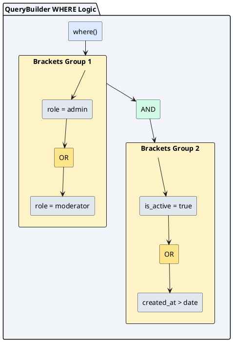

# QueryBuilder для складних запитів

::card-group

::card{title="🎯 Мета лекції" icon="i-lucide-target"}

- Опанувати QueryBuilder — програмний конструктор SQL-запитів для складних сценаріїв, недоступних через Repository методи.
- Вивчити побудову SELECT запитів із динамічними умовами WHERE, JOIN операціями та агрегатними функціями.
- Навчитися використовувати параметризовані запити для захисту від SQL injection.
- Освоїти методи виконання запитів: `getMany()`, `getOne()`, `getRawMany()`, `getCount()`.
- Зрозуміти різницю між Entity результатами та raw результатами.

::

::card{title="🔑 Ключові терміни" icon="i-lucide-key"}

- **QueryBuilder:** fluent API для програмної побудови SQL-запитів через ланцюжок методів замість написання сирого SQL.
- **Alias:** псевдонім таблиці у SQL-запиті (наприклад, `FROM users u` — `u` є alias).
- **Raw Result:** об'єкт із значеннями колонок без перетворення на Entity екземпляр.
- **Subquery:** вкладений SELECT-запит усередині іншого запиту (наприклад, у WHERE або FROM).

::

::

---

## Коли використовувати QueryBuilder

### Обмеження Repository методів

У попередніх лекціях ми використовували методи репозиторію (`find()`, `findOne()`, `save()`) для стандартних CRUD операцій. Проте існують сценарії, коли можливостей `FindOptions` недостатньо:

**1. Складні OR/AND комбінації:**

Repository методи підтримують лише прості OR умови через масив об'єктів. Для вкладеної логіки типу `(A OR B) AND (C OR D)` потрібен QueryBuilder.

```typescript
// ❌ Неможливо виразити через FindOptions:
// WHERE (role = 'admin' OR role = 'moderator') 
//   AND (is_active = true OR created_at > '2026-01-01')

// ✅ Легко через QueryBuilder:
const users = await userRepository
  .createQueryBuilder('user')
  .where('(user.role = :admin OR user.role = :moderator)', { admin: 'admin', moderator: 'moderator' })
  .andWhere('(user.is_active = :active OR user.created_at > :date)', { active: true, date: new Date('2026-01-01') })
  .getMany();
```

**2. Агрегатні функції (COUNT, SUM, AVG, MIN, MAX):**

```typescript
// Підрахунок користувачів по ролях
const stats = await userRepository
  .createQueryBuilder('user')
  .select('user.role', 'role')
  .addSelect('COUNT(user.id)', 'count')
  .groupBy('user.role')
  .getRawMany();

// Результат: [{ role: 'admin', count: '5' }, { role: 'user', count: '120' }]
```

**3. Підзапити (subqueries):**

```typescript
// Користувачі, що створили більше 10 постів
const activeAuthors = await userRepository
  .createQueryBuilder('user')
  .where((qb) => {
    const subQuery = qb
      .subQuery()
      .select('post.user_id')
      .from(Post, 'post')
      .groupBy('post.user_id')
      .having('COUNT(post.id) > :count', { count: 10 })
      .getQuery();
    return `user.id IN ${subQuery}`;
  })
  .getMany();
```

**4. JOIN з умовами:**

```typescript
// Користувачі з опублікованими постами за останній місяць
const authors = await userRepository
  .createQueryBuilder('user')
  .innerJoin('user.posts', 'post', 'post.published_at > :date', { date: new Date(Date.now() - 30 * 24 * 60 * 60 * 1000) })
  .getMany();
```

**5. Часткові оновлення без завантаження Entity:**

```typescript
// Збільшити лічильник постів для всіх адмінів
await userRepository
  .createQueryBuilder()
  .update(User)
  .set({ post_count: () => 'post_count + 1' })
  .where('role = :role', { role: 'admin' })
  .execute();
```

::note

QueryBuilder генерує SQL динамічно у runtime, що дозволяє будувати запити на основі користувацького вводу, конфігурації або бізнес-логіки. Це неможливо зробити через статичні `FindOptions`.

::

### Переваги QueryBuilder над raw SQL

| Характеристика          | Raw SQL                          | QueryBuilder                        |
| ----------------------- | -------------------------------- | ----------------------------------- |
| Type safety             | ❌ Відсутня                      | ✅ Часткова (через TypeScript)     |
| Параметризація          | Вручну через `$1, $2`            | ✅ Автоматична через `:paramName`  |
| Динамічна побудова      | ❌ Складно (конкатенація рядків) | ✅ Fluent API                       |
| Підтримка БД            | ❌ Залежить від SQL діалекту     | ✅ Абстрагує відмінності            |
| Повернення Entity       | ❌ Потребує ручного mapping      | ✅ Автоматичне через `getMany()`   |
| Intellisense            | ❌ Відсутній                     | ✅ Автодоповнення методів           |

**Приклад порівняння:**

::code-group

```typescript [QueryBuilder]
const users = await userRepository
  .createQueryBuilder('user')
  .where('user.email LIKE :search', { search: `%${query}%` })
  .andWhere('user.is_active = :active', { active: true })
  .orderBy('user.created_at', 'DESC')
  .take(10)
  .getMany(); // Повертає User[] з усіма методами Entity
```

```typescript [Raw SQL]
const result = await dataSource.query(
  `SELECT * FROM users 
   WHERE email LIKE $1 AND is_active = $2 
   ORDER BY created_at DESC 
   LIMIT $3`,
  [`%${query}%`, true, 10]
);
// result — масив сирих об'єктів, потребує mapping на User
const users = result.map(row => {
  const user = new User();
  user.id = row.id;
  user.email = row.email;
  // ... ручне заповнення всіх полів
  return user;
});
```

::

::tip

**Практична рекомендація:** Використовуйте Repository методи для 80% типових операцій (CRUD, проста фільтрація). QueryBuilder застосовуйте для 20% складних запитів (аналітика, звіти, пошук). Raw SQL залишайте для екстремальних випадків (специфічні функції PostgreSQL, оптимізація критичних запитів).

::

---

## Створення QueryBuilder

### Метод `repository.createQueryBuilder()`

Найпоширеніший спосіб створення QueryBuilder — через репозиторій:

```typescript [src/users/users.service.ts]
import { Injectable } from '@nestjs/common';
import { InjectRepository } from '@nestjs/typeorm';
import { Repository } from 'typeorm';
import { User } from './entities/user.entity';

@Injectable()
export class UsersService {
  constructor(
    @InjectRepository(User)
    private readonly userRepository: Repository<User>,
  ) {}

  async findActiveUsers(): Promise<User[]> {
    return this.userRepository
      .createQueryBuilder('user') // 'user' — alias для таблиці users
      .where('user.is_active = :active', { active: true })
      .getMany();
  }
}
```

**Згенерований SQL:**

```sql
SELECT 
  "user"."id" AS "user_id",
  "user"."email" AS "user_email",
  "user"."name" AS "user_name",
  "user"."is_active" AS "user_is_active",
  "user"."created_at" AS "user_created_at"
FROM "users" "user"
WHERE "user"."is_active" = $1;
```

::note

Параметр `'user'` у `createQueryBuilder('user')` — це **alias** (псевдонім) для таблиці. Він використовується для посилання на поля у WHERE, SELECT, ORDER BY. TypeORM автоматично екранує alias у лапки для сумісності з PostgreSQL.

::

### Метод `dataSource.createQueryBuilder()`

Якщо потрібно створити запит без прив'язки до конкретного Entity:

```typescript [src/analytics/analytics.service.ts]
import { Injectable } from '@nestjs/common';
import { DataSource } from 'typeorm';
import { User } from '../users/entities/user.entity';

@Injectable()
export class AnalyticsService {
  constructor(private readonly dataSource: DataSource) {}

  async getUserStats() {
    return this.dataSource
      .createQueryBuilder()
      .select('role', 'role')
      .addSelect('COUNT(*)', 'count')
      .from(User, 'user')
      .groupBy('role')
      .getRawMany();
  }
}
```

**Різниця між підходами:**

| Метод                              | Використання                                   | Повернення за замовчуванням |
| ---------------------------------- | ---------------------------------------------- | --------------------------- |
| `repository.createQueryBuilder()`  | Запити до конкретної Entity                    | Entity екземпляри           |
| `dataSource.createQueryBuilder()`  | Запити до кількох таблиць або без Entity       | Raw об'єкти                 |

### Вибір alias та його використання

Alias — це скорочена назва таблиці для зручності написання умов:

```typescript
// ✅ З alias
const users = await userRepository
  .createQueryBuilder('u') // Коротко
  .where('u.email LIKE :search', { search: '%@gmail.com' })
  .andWhere('u.created_at > :date', { date: new Date('2026-01-01') })
  .getMany();

// ❌ Без alias (не компілюється)
const users = await userRepository
  .createQueryBuilder()
  .where('email LIKE :search', { search: '%@gmail.com' }) // Error: не зрозуміло, до якої таблиці відноситься email
  .getMany();
```

**Конвенція іменування alias:**

- Для основної таблиці: використовуйте перші 1-2 літери або повну назву Entity у нижньому регістрі (`user`, `u`, `post`, `p`).
- Для JOIN таблиць: використовуйте змістовні назви (`author`, `comments`, `tags`).

```typescript
const posts = await postRepository
  .createQueryBuilder('post')
  .leftJoinAndSelect('post.author', 'author') // author — alias для User Entity
  .leftJoinAndSelect('post.comments', 'comments') // comments — alias для Comment Entity
  .where('author.role = :role', { role: 'admin' })
  .getMany();
```

---

## SELECT запити та вибір полів

### Базовий SELECT усіх полів

За замовчуванням QueryBuilder вибирає всі поля Entity:

```typescript
const users = await userRepository
  .createQueryBuilder('user')
  .getMany();

// Еквівалентно: SELECT user.* FROM users user
```

### Метод `select()` для вибору конкретних полів

Для оптимізації передачі даних вибирайте лише потрібні поля:

```typescript
const users = await userRepository
  .createQueryBuilder('user')
  .select(['user.id', 'user.email', 'user.created_at'])
  .getMany();
```

**Згенерований SQL:**

```sql
SELECT 
  "user"."id" AS "user_id",
  "user"."email" AS "user_email",
  "user"."created_at" AS "user_created_at"
FROM "users" "user";
```

::warning

Якщо ви вибираєте лише частину полів через `select()`, інші поля у поверненому Entity будуть `undefined`. Це може призвести до помилок, якщо код очікує наявність всіх полів.

::

### Метод `addSelect()` для додавання полів

```typescript
const users = await userRepository
  .createQueryBuilder('user')
  .select(['user.id', 'user.email']) // Базова вибірка
  .addSelect('user.created_at') // Додаємо ще одне поле
  .addSelect('user.updated_at')
  .getMany();
```

**Обчислення полів у SELECT:**

```typescript
const stats = await userRepository
  .createQueryBuilder('user')
  .select('user.role', 'role')
  .addSelect('COUNT(user.id)', 'total')
  .addSelect('MAX(user.created_at)', 'latest_registration')
  .groupBy('user.role')
  .getRawMany();

// Результат:
// [
//   { role: 'admin', total: '5', latest_registration: '2026-09-05T10:00:00Z' },
//   { role: 'user', total: '120', latest_registration: '2026-09-04T15:30:00Z' }
// ]
```

::note

Для запитів із агрегатними функціями (`COUNT`, `SUM`, `AVG`) використовуйте `getRawMany()` замість `getMany()`, оскільки результат не є повноцінними Entity екземплярами.

::

### DISTINCT для унікальних значень

```typescript
const roles = await userRepository
  .createQueryBuilder('user')
  .select('DISTINCT user.role', 'role')
  .getRawMany();

// Результат: [{ role: 'admin' }, { role: 'user' }, { role: 'moderator' }]
```


---

## WHERE умови та логічні оператори

### Метод `where()` для базової умови

Метод `where()` встановлює основну умову фільтрації. Він **замінює** попередню умову, якщо викликається повторно:

```typescript
const users = await userRepository
  .createQueryBuilder('user')
  .where('user.role = :role', { role: 'admin' })
  .getMany();
```

**SQL:**

```sql
SELECT * FROM "users" "user" WHERE "user"."role" = $1;
```

**Множинні параметри:**

```typescript
const users = await userRepository
  .createQueryBuilder('user')
  .where('user.email = :email AND user.is_active = :active', {
    email: 'admin@example.com',
    active: true,
  })
  .getMany();
```

::warning

**Повторний виклик `where()` замінює попередню умову:**

```typescript
const users = await userRepository
  .createQueryBuilder('user')
  .where('user.role = :role', { role: 'admin' })
  .where('user.is_active = :active', { active: true }); // ❌ Перша умова втрачена!

// Згенерований SQL: WHERE user.is_active = true (без умови role)
```

Для додавання умов використовуйте `andWhere()` або `orWhere()`.

::

### Метод `andWhere()` для додавання AND умов

```typescript
const users = await userRepository
  .createQueryBuilder('user')
  .where('user.role = :role', { role: 'admin' })
  .andWhere('user.is_active = :active', { active: true })
  .andWhere('user.created_at > :date', { date: new Date('2026-01-01') })
  .getMany();
```

**SQL:**

```sql
SELECT * FROM "users" "user"
WHERE "user"."role" = $1 
  AND "user"."is_active" = $2
  AND "user"."created_at" > $3;
```

### Метод `orWhere()` для додавання OR умов

```typescript
const users = await userRepository
  .createQueryBuilder('user')
  .where('user.role = :admin', { admin: 'admin' })
  .orWhere('user.role = :moderator', { moderator: 'moderator' })
  .getMany();
```

**SQL:**

```sql
SELECT * FROM "users" "user"
WHERE "user"."role" = $1 OR "user"."role" = $2;
```

### Складні вкладені умови через Brackets

Для побудови складної логіки типу `(A OR B) AND (C OR D)` використовуйте `Brackets`:

```typescript
import { Brackets } from 'typeorm';

const users = await userRepository
  .createQueryBuilder('user')
  .where(new Brackets((qb) => {
    qb.where('user.role = :admin', { admin: 'admin' })
      .orWhere('user.role = :moderator', { moderator: 'moderator' });
  }))
  .andWhere(new Brackets((qb) => {
    qb.where('user.is_active = :active', { active: true })
      .orWhere('user.created_at > :date', { date: new Date('2026-01-01') });
  }))
  .getMany();
```

**SQL:**

```sql
SELECT * FROM "users" "user"
WHERE (
    "user"."role" = $1 OR "user"."role" = $2
  )
  AND (
    "user"."is_active" = $3 OR "user"."created_at" > $4
  );
```

::plant-uml{alt="Структура вкладених WHERE умов"}



::

### Метод `whereInIds()` для пошуку за масивом ID

Спрощений спосіб фільтрації за кількома ID:

```typescript
const users = await userRepository
  .createQueryBuilder('user')
  .whereInIds([1, 5, 10, 15])
  .getMany();
```

**SQL:**

```sql
SELECT * FROM "users" "user" WHERE "user"."id" IN ($1, $2, $3, $4);
```

**Еквівалент через `where()`:**

```typescript
const users = await userRepository
  .createQueryBuilder('user')
  .where('user.id IN (:...ids)', { ids: [1, 5, 10, 15] })
  .getMany();
```

::note

Синтаксис `:...ids` автоматично розгортає масив у список параметрів. TypeORM згенерує `IN ($1, $2, $3, $4)` замість спроби передати масив як один параметр.

::

---

## Параметризовані запити

### Чому важливо параметризувати запити

**SQL injection** — одна з найнебезпечніших вразливостей веб-застосунків. Розглянемо небезпечний код:

```typescript
// ❌ НІКОЛИ ТАК НЕ РОБІТЬ!
async searchUsers(searchQuery: string) {
  return this.userRepository
    .createQueryBuilder('user')
    .where(`user.email LIKE '%${searchQuery}%'`) // Пряма конкатенація!
    .getMany();
}
```

**Атака:**

```typescript
// Зловмисник передає:
searchQuery = "' OR '1'='1' --"

// Згенерований SQL:
// SELECT * FROM users WHERE user.email LIKE '%' OR '1'='1' --%'
// Умова '1'='1' завжди істинна — повертаються всі користувачі!
```

::caution

Пряма конкатенація користувацького вводу у SQL — це критична вразливість безпеки. Зловмисник може:
1. Отримати доступ до всіх даних (через `' OR '1'='1`).
2. Видалити таблиці (через `'; DROP TABLE users; --`).
3. Викрасти дані (через `UNION SELECT` атаки).

::

### Синтаксис іменованих параметрів

TypeORM використовує іменовані параметри з префіксом `:`:

```typescript
// ✅ Безпечно
async searchUsers(searchQuery: string) {
  return this.userRepository
    .createQueryBuilder('user')
    .where('user.email LIKE :search', { search: `%${searchQuery}%` })
    .getMany();
}
```

**Як це працює:**

1. TypeORM замінює `:search` на плейсхолдер `$1` (PostgreSQL) або `?` (MySQL).
2. Значення `searchQuery` передається як окремий параметр, а не вбудовується у SQL-рядок.
3. PostgreSQL автоматично екранує спеціальні символи у параметрах.

**Згенерований SQL:**

```sql
SELECT * FROM "users" "user" WHERE "user"."email" LIKE $1;
-- Параметр: ['%test%']
```

### Передача параметрів через об'єкт

```typescript
const users = await userRepository
  .createQueryBuilder('user')
  .where('user.role = :role', { role: 'admin' })
  .andWhere('user.is_active = :active', { active: true })
  .andWhere('user.created_at > :startDate', { startDate: new Date('2026-01-01') })
  .getMany();
```

**Множинні параметри у одній умові:**

```typescript
const users = await userRepository
  .createQueryBuilder('user')
  .where('user.role = :role AND user.is_active = :active', {
    role: 'admin',
    active: true,
  })
  .getMany();
```

### Метод `setParameter()` для пізнього встановлення параметрів

```typescript
const qb = userRepository
  .createQueryBuilder('user')
  .where('user.email = :email');

if (includeInactive) {
  qb.andWhere('user.is_active = :active');
  qb.setParameter('active', false);
}

qb.setParameter('email', 'admin@example.com');

const users = await qb.getMany();
```

**Масове встановлення параметрів:**

```typescript
const qb = userRepository
  .createQueryBuilder('user')
  .where('user.role = :role')
  .andWhere('user.created_at BETWEEN :startDate AND :endDate');

qb.setParameters({
  role: 'admin',
  startDate: new Date('2026-01-01'),
  endDate: new Date('2026-12-31'),
});

const users = await qb.getMany();
```

::tip

Використовуйте `setParameter()` для динамічної побудови запитів, коли умови додаються залежно від бізнес-логіки або користувацького вводу.

::

---

## Сортування та пагінація

### Метод `orderBy()` для сортування

```typescript
const users = await userRepository
  .createQueryBuilder('user')
  .orderBy('user.created_at', 'DESC')
  .getMany();
```

**SQL:**

```sql
SELECT * FROM "users" "user" ORDER BY "user"."created_at" DESC;
```

**Сортування за кількома полями:**

```typescript
const users = await userRepository
  .createQueryBuilder('user')
  .orderBy('user.role', 'ASC')
  .addOrderBy('user.created_at', 'DESC')
  .getMany();
```

**SQL:**

```sql
SELECT * FROM "users" "user" 
ORDER BY "user"."role" ASC, "user"."created_at" DESC;
```

::warning

**Повторний виклик `orderBy()` замінює попереднє сортування:**

```typescript
const users = await userRepository
  .createQueryBuilder('user')
  .orderBy('user.name', 'ASC')
  .orderBy('user.created_at', 'DESC'); // ❌ Перше сортування втрачено!

// SQL: ORDER BY user.created_at DESC (без user.name)
```

Використовуйте `addOrderBy()` для додавання додаткових полів сортування.

::

### Методи `skip()` та `take()` для пагінації

```typescript
async findPaginated(page: number, limit: number): Promise<User[]> {
  const skip = (page - 1) * limit;

  return this.userRepository
    .createQueryBuilder('user')
    .orderBy('user.created_at', 'DESC')
    .skip(skip)
    .take(limit)
    .getMany();
}
```

**Альтернативний синтаксис: `limit()` та `offset()`:**

```typescript
return this.userRepository
  .createQueryBuilder('user')
  .orderBy('user.created_at', 'DESC')
  .limit(limit)
  .offset(skip)
  .getMany();
```

**SQL:**

```sql
SELECT * FROM "users" "user" 
ORDER BY "user"."created_at" DESC 
LIMIT 20 OFFSET 40;
```

### Підрахунок загальної кількості з `getManyAndCount()`

Для отримання даних та загальної кількості одночасно:

```typescript
async findPaginatedWithTotal(page: number, limit: number) {
  const skip = (page - 1) * limit;

  const [data, total] = await this.userRepository
    .createQueryBuilder('user')
    .where('user.is_active = :active', { active: true })
    .orderBy('user.created_at', 'DESC')
    .skip(skip)
    .take(limit)
    .getManyAndCount();

  return {
    data,
    meta: {
      page,
      limit,
      total,
      totalPages: Math.ceil(total / limit),
    },
  };
}
```

**Згеновані SQL-запити:**

```sql
-- Запит 1: Підрахунок
SELECT COUNT(DISTINCT("user"."id")) AS "cnt" 
FROM "users" "user" 
WHERE "user"."is_active" = $1;

-- Запит 2: Вибірка даних
SELECT * FROM "users" "user" 
WHERE "user"."is_active" = $1 
ORDER BY "user"."created_at" DESC 
LIMIT 20 OFFSET 40;
```


---

## JOIN операції (базовий огляд)

::note

Детальний розгляд відношень між Entity (One-to-Many, Many-to-One, Many-to-Many) та складних JOIN операцій буде у наступних лекціях. Тут ми розглянемо лише базовий синтаксис QueryBuilder для JOIN.

::

### Різниця між `leftJoin()` та `leftJoinAndSelect()`

**`leftJoin()`** — виконує JOIN, але не завантажує дані зв'язаної Entity:

```typescript
const users = await userRepository
  .createQueryBuilder('user')
  .leftJoin('user.posts', 'post') // JOIN виконується, але Post не завантажуються
  .where('post.published_at IS NOT NULL') // Можна використати post у WHERE
  .getMany();

// Результат: User[] (без завантажених posts)
```

**`leftJoinAndSelect()`** — виконує JOIN **та** завантажує дані зв'язаної Entity:

```typescript
const users = await userRepository
  .createQueryBuilder('user')
  .leftJoinAndSelect('user.posts', 'post') // JOIN + завантаження
  .getMany();

// Результат: User[] (кожен User має заповнене поле posts: Post[])
```

**Згенерований SQL для `leftJoinAndSelect()`:**

```sql
SELECT 
  "user"."id" AS "user_id",
  "user"."email" AS "user_email",
  "post"."id" AS "post_id",
  "post"."title" AS "post_title",
  "post"."user_id" AS "post_user_id"
FROM "users" "user"
LEFT JOIN "posts" "post" ON "post"."user_id" = "user"."id";
```

### Метод `innerJoin()` та `innerJoinAndSelect()`

**INNER JOIN** повертає лише записи, що мають відповідність у обох таблицях:

```typescript
// Користувачі, що мають хоча б один пост
const authors = await userRepository
  .createQueryBuilder('user')
  .innerJoinAndSelect('user.posts', 'post')
  .getMany();
```

**Порівняння LEFT JOIN vs INNER JOIN:**

| JOIN тип      | Поведінка                                                    | Use case                           |
| ------------- | ------------------------------------------------------------ | ---------------------------------- |
| `LEFT JOIN`   | Повертає всі записи з лівої таблиці, навіть якщо немає match | Користувачі (з постами або без)    |
| `INNER JOIN`  | Повертає лише записи з match у обох таблицях                 | Користувачі, що обов'язково мають пости |

### JOIN з умовами

Додаткові умови JOIN через третій параметр:

```typescript
const users = await userRepository
  .createQueryBuilder('user')
  .leftJoinAndSelect(
    'user.posts', 
    'post', 
    'post.published_at > :date', 
    { date: new Date('2026-01-01') }
  )
  .getMany();
```

**SQL:**

```sql
SELECT * FROM "users" "user"
LEFT JOIN "posts" "post" 
  ON "post"."user_id" = "user"."id" 
  AND "post"."published_at" > $1;
```

::tip

Використовуйте умови у JOIN (третій параметр) для фільтрації зв'язаних записів **до** виконання JOIN. Це ефективніше, ніж фільтрація через `WHERE` після JOIN, оскільки зменшує кількість рядків, що обробляються.

::

---

## Виконання запитів та отримання результатів

### Метод `getMany()` для масиву Entity

Повертає масив екземплярів Entity з усіма методами та властивостями:

```typescript
const users = await userRepository
  .createQueryBuilder('user')
  .where('user.role = :role', { role: 'admin' })
  .getMany();

// Тип: User[]
// Кожен елемент — повноцінний екземпляр класу User
console.log(users[0] instanceof User); // true
console.log(users[0].getDisplayName()); // Метод з Entity класу
```

### Метод `getOne()` для одного Entity

Повертає перший знайдений запис або `null`:

```typescript
const user = await userRepository
  .createQueryBuilder('user')
  .where('user.email = :email', { email: 'admin@example.com' })
  .getOne();

// Тип: User | null
if (user) {
  console.log(user.email);
}
```

::warning

Якщо запит повертає кілька записів, `getOne()` поверне лише перший. Для гарантії унікальності використовуйте `LIMIT 1` або додайте `take(1)`.

::

### Метод `getRawMany()` для raw результатів

Повертає масив сирих об'єктів без перетворення на Entity:

```typescript
const stats = await userRepository
  .createQueryBuilder('user')
  .select('user.role', 'role')
  .addSelect('COUNT(user.id)', 'count')
  .addSelect('MAX(user.created_at)', 'latest')
  .groupBy('user.role')
  .getRawMany();

// Тип: Array<{ role: string; count: string; latest: Date }>
// [
//   { role: 'admin', count: '5', latest: '2026-09-05T10:00:00Z' },
//   { role: 'user', count: '120', latest: '2026-09-04T15:30:00Z' }
// ]
```

::note

Агрегатні функції (`COUNT`, `SUM`, `AVG`) завжди повертають результат як рядок у PostgreSQL. Використовуйте `parseInt()` або `parseFloat()` для конвертації у числа.

::

### Метод `getRawOne()` для одного raw результату

```typescript
const stat = await userRepository
  .createQueryBuilder('user')
  .select('COUNT(user.id)', 'total')
  .where('user.role = :role', { role: 'admin' })
  .getRawOne();

// Тип: { total: string } | undefined
console.log(parseInt(stat.total)); // 5
```

### Метод `getCount()` для підрахунку кількості

Спрощений спосіб отримання кількості записів без завантаження даних:

```typescript
const count = await userRepository
  .createQueryBuilder('user')
  .where('user.is_active = :active', { active: true })
  .getCount();

// Тип: number
console.log(count); // 120
```

**SQL:**

```sql
SELECT COUNT(DISTINCT("user"."id")) AS "cnt" 
FROM "users" "user" 
WHERE "user"."is_active" = $1;
```

### Комбінування методів: `getManyAndCount()`

```typescript
const [users, total] = await userRepository
  .createQueryBuilder('user')
  .where('user.role = :role', { role: 'admin' })
  .skip(0)
  .take(10)
  .getManyAndCount();

// users: User[] (10 елементів)
// total: number (загальна кількість адмінів)
```

**Порівняння методів виконання:**

| Метод              | Повертає              | Use case                              |
| ------------------ | --------------------- | ------------------------------------- |
| `getMany()`        | `Entity[]`            | Стандартна вибірка записів            |
| `getOne()`         | `Entity \| null`      | Пошук одного запису                   |
| `getRawMany()`     | `Object[]`            | Агрегація, GROUP BY, обчислення       |
| `getRawOne()`      | `Object \| undefined` | Один агрегований результат            |
| `getCount()`       | `number`              | Підрахунок кількості                  |
| `getManyAndCount()`| `[Entity[], number]`  | Пагінація з total count               |

---

## Агрегатні функції та GROUP BY

### Підрахунок за групами через COUNT

```typescript
const usersByRole = await userRepository
  .createQueryBuilder('user')
  .select('user.role', 'role')
  .addSelect('COUNT(user.id)', 'count')
  .groupBy('user.role')
  .getRawMany();

// Результат:
// [
//   { role: 'admin', count: '5' },
//   { role: 'moderator', count: '12' },
//   { role: 'user', count: '983' }
// ]
```

### Агрегація через SUM, AVG, MIN, MAX

```typescript
interface OrderStats {
  total_orders: string;
  total_revenue: string;
  avg_order_value: string;
  min_order: string;
  max_order: string;
}

const stats = await orderRepository
  .createQueryBuilder('order')
  .select('COUNT(order.id)', 'total_orders')
  .addSelect('SUM(order.total)', 'total_revenue')
  .addSelect('AVG(order.total)', 'avg_order_value')
  .addSelect('MIN(order.total)', 'min_order')
  .addSelect('MAX(order.total)', 'max_order')
  .where('order.status = :status', { status: 'completed' })
  .getRawOne<OrderStats>();

console.log({
  totalOrders: parseInt(stats.total_orders),
  totalRevenue: parseFloat(stats.total_revenue),
  avgOrderValue: parseFloat(stats.avg_order_value),
  minOrder: parseFloat(stats.min_order),
  maxOrder: parseFloat(stats.max_order),
});
```

### Фільтрація груп через HAVING

```typescript
// Користувачі, що створили більше 10 постів
const activeAuthors = await userRepository
  .createQueryBuilder('user')
  .leftJoin('user.posts', 'post')
  .select('user.id', 'id')
  .addSelect('user.email', 'email')
  .addSelect('COUNT(post.id)', 'post_count')
  .groupBy('user.id')
  .addGroupBy('user.email')
  .having('COUNT(post.id) > :minPosts', { minPosts: 10 })
  .orderBy('COUNT(post.id)', 'DESC')
  .getRawMany();
```

**SQL:**

```sql
SELECT 
  "user"."id" AS "id",
  "user"."email" AS "email",
  COUNT("post"."id") AS "post_count"
FROM "users" "user"
LEFT JOIN "posts" "post" ON "post"."user_id" = "user"."id"
GROUP BY "user"."id", "user"."email"
HAVING COUNT("post"."id") > $1
ORDER BY COUNT("post"."id") DESC;
```

::note

**Різниця між WHERE та HAVING:**
- `WHERE` фільтрує рядки **до** групування (застосовується до окремих записів).
- `HAVING` фільтрує групи **після** групування (застосовується до результатів агрегації).

**Приклад:**
- `WHERE user.is_active = true` — виключає неактивних користувачів перед підрахунком постів.
- `HAVING COUNT(post.id) > 10` — виключає користувачів із малою кількістю постів після підрахунку.

::

---

## Підзапити (Subqueries)

### Підзапит у WHERE

```typescript
// Користувачі, що створили пости за останній місяць
const activeAuthors = await userRepository
  .createQueryBuilder('user')
  .where((qb) => {
    const subQuery = qb
      .subQuery()
      .select('post.user_id')
      .from(Post, 'post')
      .where('post.created_at > :date', { date: new Date(Date.now() - 30 * 24 * 60 * 60 * 1000) })
      .getQuery();
    return `user.id IN ${subQuery}`;
  })
  .getMany();
```

**SQL:**

```sql
SELECT * FROM "users" "user"
WHERE "user"."id" IN (
  SELECT "post"."user_id" 
  FROM "posts" "post" 
  WHERE "post"."created_at" > $1
);
```

### Підзапит у SELECT

```typescript
const usersWithPostCount = await userRepository
  .createQueryBuilder('user')
  .select('user.id', 'id')
  .addSelect('user.email', 'email')
  .addSelect((subQuery) => {
    return subQuery
      .select('COUNT(post.id)', 'count')
      .from(Post, 'post')
      .where('post.user_id = user.id');
  }, 'post_count')
  .getRawMany();
```

**SQL:**

```sql
SELECT 
  "user"."id" AS "id",
  "user"."email" AS "email",
  (
    SELECT COUNT("post"."id") AS "count"
    FROM "posts" "post"
    WHERE "post"."user_id" = "user"."id"
  ) AS "post_count"
FROM "users" "user";
```

::tip

Підзапити у SELECT можуть бути повільними для великих таблиць, оскільки виконуються для кожного рядка. Розгляньте використання JOIN з GROUP BY як альтернативу для кращої продуктивності.

::


---

## Raw SQL запити

### Коли QueryBuilder не вистачає

Іноді виникають ситуації, коли потрібні специфічні функції PostgreSQL або складні конструкції, які важко виразити через QueryBuilder:

1. **Full-text search через `tsvector`:**

```sql
SELECT * FROM posts 
WHERE to_tsvector('english', title || ' ' || content) @@ to_tsquery('postgresql & search');
```

2. **Window functions (ROW_NUMBER, RANK, LAG, LEAD):**

```sql
SELECT 
  user_id,
  email,
  ROW_NUMBER() OVER (PARTITION BY role ORDER BY created_at DESC) as row_num
FROM users;
```

3. **Recursive CTE (Common Table Expressions):**

```sql
WITH RECURSIVE category_tree AS (
  SELECT id, name, parent_id, 1 as level
  FROM categories WHERE parent_id IS NULL
  UNION ALL
  SELECT c.id, c.name, c.parent_id, ct.level + 1
  FROM categories c
  INNER JOIN category_tree ct ON c.parent_id = ct.id
)
SELECT * FROM category_tree;
```

4. **JSON операції через `jsonb_*` функції:**

```sql
SELECT * FROM users 
WHERE metadata @> '{"verified": true}'::jsonb;
```

### Метод `dataSource.query()` для raw SQL

```typescript
import { Injectable } from '@nestjs/common';
import { DataSource } from 'typeorm';

@Injectable()
export class UsersService {
  constructor(private readonly dataSource: DataSource) {}

  async searchUsers(query: string): Promise<any[]> {
    return this.dataSource.query(
      `
      SELECT 
        id, 
        email, 
        ts_rank(to_tsvector('english', email || ' ' || name), to_tsquery($1)) as rank
      FROM users
      WHERE to_tsvector('english', email || ' ' || name) @@ to_tsquery($1)
      ORDER BY rank DESC
      LIMIT 10
      `,
      [query]
    );
  }
}
```

**Параметризація через `$1, $2, $3`:**

```typescript
async findByDateRange(startDate: Date, endDate: Date): Promise<any[]> {
  return this.dataSource.query(
    `
    SELECT * FROM users
    WHERE created_at BETWEEN $1 AND $2
    ORDER BY created_at DESC
    `,
    [startDate, endDate]
  );
}
```

::caution

**Важливі застереження для raw SQL:**

1. **Відсутність type safety:** TypeScript не може перевірити правильність SQL-синтаксису або типів колонок. Помилки виявляться лише у runtime.

2. **Залежність від БД:** Raw SQL може працювати лише у конкретній СУБД (PostgreSQL, MySQL, SQLite). Міграція на іншу БД потребуватиме переписування запитів.

3. **Ризик SQL injection:** Завжди використовуйте параметризацію через `$1, $2` замість конкатенації рядків.

4. **Немає автоматичного mapping на Entity:** Результат — це масив сирих об'єктів, які потрібно вручну перетворювати на Entity.

::

### Мапінг raw результатів на Entity

```typescript
async findUsersRaw(): Promise<User[]> {
  const rawResults = await this.dataSource.query(`
    SELECT id, email, name, created_at 
    FROM users 
    WHERE role = $1
  `, ['admin']);

  // Ручний mapping на Entity
  return rawResults.map(row => {
    const user = new User();
    user.id = row.id;
    user.email = row.email;
    user.name = row.name;
    user.created_at = row.created_at;
    return user;
  });
}
```

**Альтернатива через `getRepository().create()`:**

```typescript
async findUsersRaw(): Promise<User[]> {
  const rawResults = await this.dataSource.query(`
    SELECT id, email, name, created_at 
    FROM users 
    WHERE role = $1
  `, ['admin']);

  return rawResults.map(row => this.userRepository.create(row));
}
```

### Використання raw SQL всередині QueryBuilder

Для комбінування QueryBuilder із сирим SQL використовуйте методи з префіксом `Raw`:

```typescript
import { Raw } from 'typeorm';

// Пошук через ILIKE з додатковою логікою
const users = await userRepository.find({
  where: {
    email: Raw((alias) => `LOWER(${alias}) LIKE LOWER(:email)`, {
      email: '%@gmail.com',
    }),
  },
});
```

**У QueryBuilder:**

```typescript
const users = await userRepository
  .createQueryBuilder('user')
  .where(`LOWER(user.email) LIKE LOWER(:email)`, { email: '%@gmail.com' })
  .andWhere(`to_tsvector('english', user.name) @@ to_tsquery(:query)`, { query: 'john' })
  .getMany();
```

::tip

Для складних full-text search розгляньте використання спеціалізованих рішень (Elasticsearch, Meilisearch, Typesense) замість PostgreSQL `tsvector`. Вони надають кращу релевантність, підтримку багатьох мов та масштабованість.

::

---

## Практичні приклади

### Пошук з partial match (LIKE)

```typescript
async searchUsersByEmail(query: string): Promise<User[]> {
  return this.userRepository
    .createQueryBuilder('user')
    .where('user.email ILIKE :query', { query: `%${query}%` })
    .orWhere('user.name ILIKE :query', { query: `%${query}%` })
    .orderBy('user.created_at', 'DESC')
    .take(20)
    .getMany();
}
```

**Оптимізований варіант із GIN індексом:**

```typescript
// У міграції створіть GIN індекс:
// CREATE INDEX idx_users_email_gin ON users USING GIN (email gin_trgm_ops);
// CREATE EXTENSION IF NOT EXISTS pg_trgm;

async searchUsersFast(query: string): Promise<User[]> {
  return this.userRepository
    .createQueryBuilder('user')
    .where('user.email % :query', { query }) // Оператор % (similarity) з pg_trgm
    .orderBy('similarity(user.email, :query)', 'DESC')
    .setParameter('query', query)
    .take(20)
    .getMany();
}
```

### Складний запит із множинними JOIN

```typescript
// Пости з автором та коментарями, опубліковані за останній тиждень
async getRecentPostsWithDetails(): Promise<Post[]> {
  const oneWeekAgo = new Date(Date.now() - 7 * 24 * 60 * 60 * 1000);

  return this.postRepository
    .createQueryBuilder('post')
    .leftJoinAndSelect('post.author', 'author')
    .leftJoinAndSelect('post.comments', 'comment')
    .leftJoinAndSelect('comment.user', 'commentAuthor')
    .where('post.published_at > :date', { date: oneWeekAgo })
    .andWhere('post.status = :status', { status: 'published' })
    .orderBy('post.published_at', 'DESC')
    .addOrderBy('comment.created_at', 'ASC')
    .take(10)
    .getMany();
}
```

### Динамічна фільтрація з опціональними параметрами

```typescript
interface UserSearchFilters {
  role?: string;
  isActive?: boolean;
  createdAfter?: Date;
  search?: string;
}

async searchUsersAdvanced(filters: UserSearchFilters): Promise<User[]> {
  const qb = this.userRepository.createQueryBuilder('user');

  if (filters.role) {
    qb.andWhere('user.role = :role', { role: filters.role });
  }

  if (filters.isActive !== undefined) {
    qb.andWhere('user.is_active = :active', { active: filters.isActive });
  }

  if (filters.createdAfter) {
    qb.andWhere('user.created_at > :date', { date: filters.createdAfter });
  }

  if (filters.search) {
    qb.andWhere(
      new Brackets((qb) => {
        qb.where('user.email ILIKE :search', { search: `%${filters.search}%` })
          .orWhere('user.name ILIKE :search', { search: `%${filters.search}%` });
      })
    );
  }

  return qb
    .orderBy('user.created_at', 'DESC')
    .take(50)
    .getMany();
}
```

**Використання:**

```typescript
// Пошук активних адмінів з email, що містить "john"
const users = await usersService.searchUsersAdvanced({
  role: 'admin',
  isActive: true,
  search: 'john',
});

// Пошук користувачів, створених після 2026-01-01
const recentUsers = await usersService.searchUsersAdvanced({
  createdAfter: new Date('2026-01-01'),
});
```

### Комбінування Repository методів та QueryBuilder

```typescript
async findUserWithLatestPost(userId: number): Promise<User | null> {
  // Завантажуємо користувача через Repository
  const user = await this.userRepository.findOne({
    where: { id: userId },
  });

  if (!user) {
    return null;
  }

  // Завантажуємо останній пост через QueryBuilder
  const latestPost = await this.postRepository
    .createQueryBuilder('post')
    .where('post.user_id = :userId', { userId })
    .orderBy('post.published_at', 'DESC')
    .take(1)
    .getOne();

  // Вручну прикріплюємо пост до користувача
  user.posts = latestPost ? [latestPost] : [];

  return user;
}
```

### Оновлення через QueryBuilder

```typescript
// Деактивувати неактивних користувачів
async deactivateInactiveUsers(daysInactive: number): Promise<number> {
  const cutoffDate = new Date(Date.now() - daysInactive * 24 * 60 * 60 * 1000);

  const result = await this.userRepository
    .createQueryBuilder()
    .update(User)
    .set({ is_active: false, deactivated_at: new Date() })
    .where('last_login_at < :cutoff', { cutoff: cutoffDate })
    .andWhere('is_active = :active', { active: true })
    .execute();

  return result.affected || 0;
}
```

**SQL:**

```sql
UPDATE "users"
SET "is_active" = $1, "deactivated_at" = $2
WHERE "last_login_at" < $3 AND "is_active" = $4;
```

### Видалення через QueryBuilder

```typescript
// Видалити spam коментарі
async deleteSpamComments(): Promise<number> {
  const result = await this.commentRepository
    .createQueryBuilder()
    .delete()
    .from(Comment)
    .where('is_spam = :spam', { spam: true })
    .andWhere('created_at < :date', { date: new Date(Date.now() - 30 * 24 * 60 * 60 * 1000) })
    .execute();

  return result.affected || 0;
}
```

::warning

Методи `update()` та `delete()` через QueryBuilder **не** тригерять lifecycle hooks (`@BeforeUpdate`, `@AfterRemove` тощо) та не взаємодіють із relations. Вони виконують прямі SQL-команди, що швидше, але обминає логіку Entity.

::

---

## Оптимізація та Best Practices

### Використання індексів для WHERE та ORDER BY

```typescript
// Завжди створюйте індекси для полів, що використовуються у WHERE
// Міграція:
await queryRunner.query(`
  CREATE INDEX idx_users_email ON users(email);
  CREATE INDEX idx_users_role ON users(role);
  CREATE INDEX idx_users_created_at ON users(created_at DESC);
`);
```

**Перевірка використання індексу:**

```typescript
// У development режимі логуйте згенерований SQL
const qb = this.userRepository
  .createQueryBuilder('user')
  .where('user.email = :email', { email: 'test@example.com' });

console.log(qb.getSql()); // Виводить SQL для перевірки через EXPLAIN
```

**Аналіз через EXPLAIN ANALYZE:**

```sql
EXPLAIN ANALYZE
SELECT * FROM users WHERE email = 'test@example.com';
```

### Уникайте N+1 проблеми

```typescript
// ❌ Погано: N+1 запитів (1 для users + N для кожного user.posts)
const users = await this.userRepository.find();
for (const user of users) {
  user.posts = await this.postRepository.find({ where: { user_id: user.id } });
}

// ✅ Добре: 1 запит з JOIN
const users = await this.userRepository
  .createQueryBuilder('user')
  .leftJoinAndSelect('user.posts', 'post')
  .getMany();
```

### Обмеження глибини вкладеності relations

```typescript
// ❌ Погано: Глибока вкладеність (може завантажити тисячі об'єктів)
const posts = await this.postRepository
  .createQueryBuilder('post')
  .leftJoinAndSelect('post.author', 'author')
  .leftJoinAndSelect('post.comments', 'comment')
  .leftJoinAndSelect('comment.user', 'commentUser')
  .leftJoinAndSelect('commentUser.profile', 'profile')
  .getMany();

// ✅ Добре: Обмежена вкладеність + окремий запит для деталей
const posts = await this.postRepository
  .createQueryBuilder('post')
  .leftJoinAndSelect('post.author', 'author')
  .leftJoinAndSelect('post.comments', 'comment')
  .take(10)
  .getMany();
```

### Використання `select()` для зменшення payload

```typescript
// ❌ Погано: Завантажуємо всі поля (включно з великими TEXT колонками)
const users = await this.userRepository
  .createQueryBuilder('user')
  .getMany();

// ✅ Добре: Вибираємо лише потрібні поля
const users = await this.userRepository
  .createQueryBuilder('user')
  .select(['user.id', 'user.email', 'user.name'])
  .getMany();
```

### Логування запитів у development

```typescript [src/config/typeorm.config.ts]
export const typeOrmConfig: TypeOrmModuleOptions = {
  type: 'postgres',
  // ...
  logging: process.env.NODE_ENV === 'development' ? ['query', 'error'] : ['error'],
  logger: 'advanced-console',
};
```

Це виведе у консоль кожен згенерований SQL:

```
query: SELECT "user"."id" AS "user_id", "user"."email" AS "user_email" FROM "users" "user" WHERE "user"."role" = $1
parameters: ["admin"]
```


---

## Тестування QueryBuilder запитів

### Mock Repository для unit-тестів

```typescript [src/users/users.service.spec.ts]
import { Test, TestingModule } from '@nestjs/testing';
import { getRepositoryToken } from '@nestjs/typeorm';
import { UsersService } from './users.service';
import { User } from './entities/user.entity';
import { SelectQueryBuilder } from 'typeorm';

describe('UsersService - QueryBuilder', () => {
  let service: UsersService;
  let mockQueryBuilder: Partial<SelectQueryBuilder<User>>;

  beforeEach(async () => {
    mockQueryBuilder = {
      where: jest.fn().mockReturnThis(),
      andWhere: jest.fn().mockReturnThis(),
      orderBy: jest.fn().mockReturnThis(),
      take: jest.fn().mockReturnThis(),
      skip: jest.fn().mockReturnThis(),
      getMany: jest.fn().mockResolvedValue([]),
      getOne: jest.fn().mockResolvedValue(null),
      getCount: jest.fn().mockResolvedValue(0),
    };

    const mockRepository = {
      createQueryBuilder: jest.fn().mockReturnValue(mockQueryBuilder),
    };

    const module: TestingModule = await Test.createTestingModule({
      providers: [
        UsersService,
        {
          provide: getRepositoryToken(User),
          useValue: mockRepository,
        },
      ],
    }).compile();

    service = module.get<UsersService>(UsersService);
  });

  it('should build query with correct where condition', async () => {
    await service.findActiveUsers();

    expect(mockQueryBuilder.where).toHaveBeenCalledWith(
      'user.is_active = :active',
      { active: true }
    );
    expect(mockQueryBuilder.getMany).toHaveBeenCalled();
  });

  it('should apply filters correctly', async () => {
    const filters = { role: 'admin', isActive: true };
    await service.searchUsersAdvanced(filters);

    expect(mockQueryBuilder.andWhere).toHaveBeenCalledWith(
      'user.role = :role',
      { role: 'admin' }
    );
    expect(mockQueryBuilder.andWhere).toHaveBeenCalledWith(
      'user.is_active = :active',
      { active: true }
    );
  });
});
```

### Integration тести з реальною БД

```typescript [test/users.e2e-spec.ts]
import { Test, TestingModule } from '@nestjs/testing';
import { INestApplication } from '@nestjs/common';
import { TypeOrmModule } from '@nestjs/typeorm';
import { UsersService } from '../src/users/users.service';
import { User } from '../src/users/entities/user.entity';

describe('UsersService Integration Tests', () => {
  let app: INestApplication;
  let service: UsersService;

  beforeAll(async () => {
    const module: TestingModule = await Test.createTestingModule({
      imports: [
        TypeOrmModule.forRoot({
          type: 'postgres',
          host: 'localhost',
          port: 5432,
          username: 'test',
          password: 'test',
          database: 'test_db',
          entities: [User],
          synchronize: true, // Лише для тестів!
        }),
        TypeOrmModule.forFeature([User]),
      ],
      providers: [UsersService],
    }).compile();

    app = module.createNestApplication();
    await app.init();
    service = module.get<UsersService>(UsersService);
  });

  afterAll(async () => {
    await app.close();
  });

  it('should find users by role', async () => {
    // Створюємо тестові дані
    await service.create({ email: 'admin@test.com', role: 'admin' });
    await service.create({ email: 'user@test.com', role: 'user' });

    // Тестуємо запит
    const admins = await service.findByRole('admin');
    
    expect(admins).toHaveLength(1);
    expect(admins[0].email).toBe('admin@test.com');
  });
});
```

---

## Діагностика та відлагодження

### Виведення згенерованого SQL

```typescript
const qb = userRepository
  .createQueryBuilder('user')
  .where('user.email = :email', { email: 'test@example.com' });

// Виведення SQL без виконання
console.log(qb.getSql());
// SELECT ... FROM "users" "user" WHERE "user"."email" = $1

// Виведення SQL з підставленими параметрами (для відлагодження)
console.log(qb.getQueryAndParameters());
// [
//   'SELECT ... FROM "users" "user" WHERE "user"."email" = $1',
//   ['test@example.com']
// ]
```

### Вимірювання продуктивності запитів

```typescript
async findUsersWithTiming(): Promise<{ users: User[]; duration: number }> {
  const startTime = Date.now();

  const users = await this.userRepository
    .createQueryBuilder('user')
    .where('user.role = :role', { role: 'admin' })
    .getMany();

  const duration = Date.now() - startTime;

  if (duration > 1000) {
    console.warn(`Slow query detected: ${duration}ms`);
  }

  return { users, duration };
}
```

### Використання query result cache

```typescript
// Кешування результату запиту на 60 секунд
const users = await userRepository
  .createQueryBuilder('user')
  .where('user.is_active = :active', { active: true })
  .cache('active_users', 60000) // Ключ кешу + TTL у мілісекундах
  .getMany();

// Інвалідація кешу при оновленні даних
await userRepository
  .createQueryBuilder()
  .update(User)
  .set({ is_active: false })
  .where('id = :id', { id: 1 })
  .execute();

// Очистити кеш вручну
await connection.queryResultCache?.remove(['active_users']);
```

::note

Query result cache TypeORM підтримує кілька backends: database table (за замовчуванням), Redis, або інші key-value сховища. Для production рекомендується використовувати Redis для масштабованості.

::

---

## Підсумки та рекомендації

::card-group

::card{title="✅ Використовуйте QueryBuilder для:" icon="i-lucide-check"}

- Складних WHERE умов із вкладеною OR/AND логікою
- Агрегатних функцій (COUNT, SUM, AVG, GROUP BY)
- Підзапитів (subqueries) у WHERE або SELECT
- Динамічної побудови запитів на основі користувацького вводу
- JOIN операцій з умовами
- Bulk UPDATE або DELETE без завантаження Entity

::

::card{title="❌ Не використовуйте QueryBuilder для:" icon="i-lucide-x"}

- Простих CRUD операцій (використовуйте Repository методи)
- Коли `find()` із `FindOptions` достатньо
- Якщо type safety критичніша за гнучкість
- Коли потрібні lifecycle hooks Entity (`@BeforeUpdate`, тощо)

::

::card{title="🛡️ Безпека та валідація:" icon="i-lucide-shield"}

- Завжди використовуйте параметризацію (`:paramName`) замість конкатенації
- Валідуйте користувацький ввід через `class-validator`
- Обмежуйте кількість результатів через `take()` або `limit()`
- Уникайте передачі сирих SQL рядків від користувача

::

::card{title="⚡ Оптимізація продуктивності:" icon="i-lucide-zap"}

- Створюйте індекси для полів у WHERE та ORDER BY
- Використовуйте `select()` для вибору лише потрібних полів
- Уникайте глибокої вкладеності JOIN (N+1 проблема)
- Логуйте повільні запити (> 1 секунди) для моніторингу
- Використовуйте query result cache для популярних запитів

::

::

::accordion

::accordion-item{label="❓ Чому QueryBuilder повертає рядки замість чисел для агрегатних функцій?" icon="i-lucide-help-circle"}

PostgreSQL (та більшість СУБД) повертає результати `COUNT()`, `SUM()`, `AVG()` як рядки для запобігання втрати точності при роботі з великими числами. TypeORM не перетворює їх автоматично, оскільки не знає, чи потрібно використати `parseInt()`, `parseFloat()`, або `BigInt()`. Завжди конвертуйте результат вручну залежно від вашого use case.

::

::accordion-item{label="❓ Як дізнатися, чи використовується індекс у моєму запиті?" icon="i-lucide-help-circle"}

Використовуйте `EXPLAIN ANALYZE` у PostgreSQL:

```typescript
const sql = qb.getSql();
const params = qb.getParameters();

await dataSource.query(`EXPLAIN ANALYZE ${sql}`, Object.values(params));
```

Шукайте у виводі:
- `Index Scan` — індекс використовується ✅
- `Seq Scan` — full table scan, індекс не використовується ❌

Якщо бачите `Seq Scan`, створіть індекс на відповідних полях.

::

::accordion-item{label="❓ Чи можна комбінувати QueryBuilder з Repository методами?" icon="i-lucide-help-circle"}

Так. QueryBuilder та Repository методи можна використовувати разом:

```typescript
// Завантажити Entity через Repository
const user = await userRepository.findOne({ where: { id: 1 } });

// Завантажити зв'язані дані через QueryBuilder
user.recentPosts = await postRepository
  .createQueryBuilder('post')
  .where('post.user_id = :userId', { userId: user.id })
  .orderBy('post.created_at', 'DESC')
  .take(5)
  .getMany();
```

Це корисно, коли базовий Entity простий, але потрібні складні умови для relations.

::

::accordion-item{label="❓ Як обробити помилки при виконанні QueryBuilder запитів?" icon="i-lucide-help-circle"}

Використовуйте try-catch для обробки помилок SQL:

```typescript
try {
  const users = await userRepository
    .createQueryBuilder('user')
    .where('user.nonexistent_column = :value', { value: 'test' })
    .getMany();
} catch (error) {
  if (error.code === '42703') { // PostgreSQL код для "column does not exist"
    console.error('Invalid column name:', error.message);
  } else if (error.code === '42P01') { // "relation does not exist"
    console.error('Table not found:', error.message);
  } else {
    throw error; // Перекидаємо невідомі помилки вгору
  }
}
```

Для production логуйте помилки через централізовану систему (Sentry, LogRocket).

::

::

::note

У наступних лекціях ми розглянемо **Relations** між Entity (One-to-Many, Many-to-One, Many-to-Many) та складні JOIN операції для роботи з зв'язаними даними. QueryBuilder, який ви освоїли в цій лекції, стане основним інструментом для навігації по цих зв'язках.

::

---

## Довідкова таблиця методів QueryBuilder

| Метод                    | Призначення                              | Приклад                                   |
| ------------------------ | ---------------------------------------- | ----------------------------------------- |
| `select()`               | Вибір полів                              | `.select(['user.id', 'user.email'])`     |
| `addSelect()`            | Додавання полів до вибірки               | `.addSelect('COUNT(*)', 'count')`         |
| `where()`                | Базова WHERE умова                       | `.where('user.id = :id', { id: 1 })`      |
| `andWhere()`             | Додавання AND умови                      | `.andWhere('user.is_active = :active')`   |
| `orWhere()`              | Додавання OR умови                       | `.orWhere('user.role = :role')`           |
| `whereInIds()`           | Фільтр за масивом ID                     | `.whereInIds([1, 2, 3])`                  |
| `orderBy()`              | Сортування                               | `.orderBy('user.created_at', 'DESC')`     |
| `addOrderBy()`           | Додаткове сортування                     | `.addOrderBy('user.name', 'ASC')`         |
| `groupBy()`              | Групування для агрегації                 | `.groupBy('user.role')`                   |
| `addGroupBy()`           | Додаткове групування                     | `.addGroupBy('user.country')`             |
| `having()`               | Умова для груп (після GROUP BY)          | `.having('COUNT(*) > :min', { min: 10 })` |
| `skip()` / `offset()`    | Пропустити N записів                     | `.skip(20)` або `.offset(20)`             |
| `take()` / `limit()`     | Обмежити кількість результатів           | `.take(10)` або `.limit(10)`              |
| `leftJoin()`             | LEFT JOIN без завантаження               | `.leftJoin('user.posts', 'post')`         |
| `leftJoinAndSelect()`    | LEFT JOIN із завантаженням               | `.leftJoinAndSelect('user.posts', 'post')`|
| `innerJoin()`            | INNER JOIN без завантаження              | `.innerJoin('user.posts', 'post')`        |
| `innerJoinAndSelect()`   | INNER JOIN із завантаженням              | `.innerJoinAndSelect('user.posts', 'post')`|
| `getMany()`              | Виконати запит, повернути Entity[]       | `await qb.getMany()`                      |
| `getOne()`               | Виконати запит, повернути Entity \| null | `await qb.getOne()`                       |
| `getRawMany()`           | Повернути масив raw об'єктів             | `await qb.getRawMany()`                   |
| `getRawOne()`            | Повернути один raw об'єкт                | `await qb.getRawOne()`                    |
| `getCount()`             | Підрахувати кількість                    | `await qb.getCount()`                     |
| `getManyAndCount()`      | Повернути [Entity[], number]             | `await qb.getManyAndCount()`              |
| `getSql()`               | Отримати згенерований SQL                | `qb.getSql()`                             |
| `getQueryAndParameters()`| Отримати SQL + параметри                 | `qb.getQueryAndParameters()`              |
| `setParameter()`         | Встановити параметр                      | `.setParameter('id', 1)`                  |
| `setParameters()`        | Встановити кілька параметрів             | `.setParameters({ id: 1, role: 'admin' })`|
| `update()`               | Створити UPDATE запит                    | `.update(User)`                           |
| `set()`                  | Встановити значення для UPDATE           | `.set({ is_active: false })`              |
| `delete()`               | Створити DELETE запит                    | `.delete().from(User)`                    |
| `execute()`              | Виконати UPDATE або DELETE               | `await qb.execute()`                      |
| `cache()`                | Кешувати результат запиту                | `.cache('key', 60000)`                    |

::tip

Збережіть цю таблицю як quick reference для швидкого пошуку методів QueryBuilder під час розробки.

::
