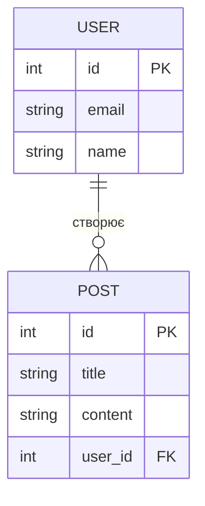
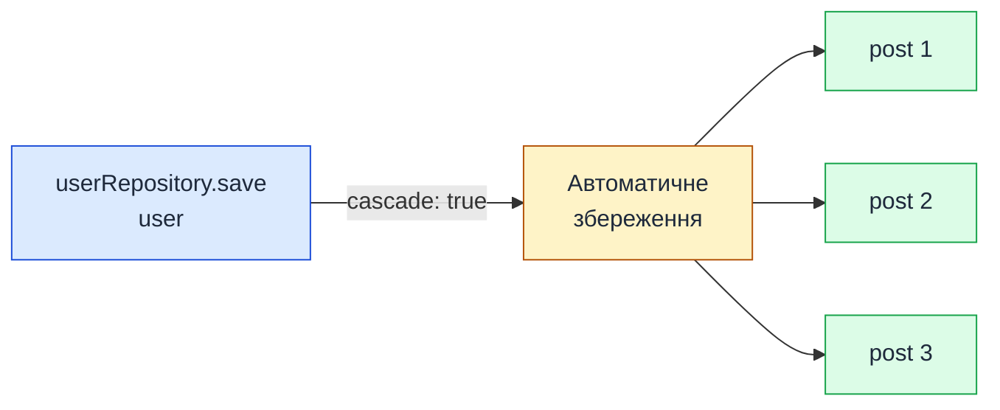

# Зв'язки One-to-Many та Many-to-One

::card-group

::card{title="🎯 Мета лекції" icon="i-lucide-target"}

- Опанувати концепцію зв'язків One-to-Many та Many-to-One у реляційних базах даних та їх реалізацію через TypeORM.
- Вивчити декоратори `@ManyToOne` та `@OneToMany` для створення двонаправлених зв'язків між Entity класами.
- Навчитися налаштовувати поведінку зовнішніх ключів (*foreign keys*): каскадні операції, стратегії видалення та оновлення.
- Освоїти завантаження зв'язаних даних через Eager loading, Lazy loading та QueryBuilder для уникнення N+1 проблеми.
- Зрозуміти практичні сценарії створення, оновлення та видалення зв'язаних entities у NestJS застосунках.

::

::card{title="🔑 Ключові терміни" icon="i-lucide-key"}

- **One-to-Many (Один до багатьох):** тип зв'язку, де один запис батьківської таблиці може бути пов'язаний з багатьма записами дочірньої таблиці.
- **Many-to-One (Багато до одного):** зворотний бік One-to-Many зв'язку, де багато записів дочірньої таблиці посилаються на один запис батьківської таблиці.
- **Foreign Key (Зовнішній ключ):** колонка у дочірній таблиці, що зберігає primary key батьківської таблиці для встановлення зв'язку.
- **Cascade Operations (Каскадні операції):** автоматичне поширення операцій (`insert`, `update`, `remove`) від батьківської entity на зв'язані дочірні entities.
- **Eager Loading:** автоматичне завантаження зв'язаних даних при кожному запиті до батьківської entity.
- **Lazy Loading:** відкладене завантаження зв'язаних даних лише при явному зверненні до відповідної властивості.
- **N+1 Problem:** проблема продуктивності, коли для завантаження колекції з N елементів виконується 1 запит для батьківських entities + N додаткових запитів для кожної дочірньої entity.

::

::

---

## Концепція зв'язків One-to-Many / Many-to-One

### Що означає One-to-Many

**One-to-Many (один до багатьох)** — це фундаментальний тип зв'язку у реляційних базах даних, де один запис у батьківській таблиці може мати декілька пов'язаних записів у дочірній таблиці. Це найпоширеніший тип відносин у реальних системах, оскільки моделює ієрархічну природу даних.

Розглянемо класичний приклад: **користувачі та їхні пости**.

::mermaid



::

**Пояснення діаграми:**

- Один користувач (`USER`) може створити багато постів (`POST`) — це **One-to-Many** зв'язок з боку User.
- Кожен пост належить рівно одному користувачу — це **Many-to-One** зв'язок з боку Post.
- Колонка `user_id` у таблиці `POST` є **зовнішнім ключем** (*foreign key*), що зберігає посилання на `id` з таблиці `USER`.

::note

**Двостороння природа зв'язку:**  
One-to-Many та Many-to-One — це дві назви для одного й того ж зв'язку, що розглядаються з різних сторін таблиць. У TypeORM ви оголошуєте обидві сторони зв'язку через декоратори `@OneToMany` (на батьківській entity) та `@ManyToOne` (на дочірній entity).

::

### Приклади з реального світу

**1. Блог-платформа:**

- **User → Posts:** Один користувач пише багато статей.
- **Category → Posts:** Одна категорія містить багато статей.
- **Post → Comments:** Один пост має багато коментарів.

**2. E-commerce система:**

- **Customer → Orders:** Один клієнт може створити багато замовлень.
- **Order → OrderItems:** Одне замовлення містить багато товарних позицій.
- **Product → Reviews:** Один товар має багато відгуків.

**3. Університетська система:**

- **Professor → Courses:** Один викладач веде багато курсів.
- **Student → Enrollments:** Один студент може бути зареєстрований на багато курсів (через проміжну таблицю enrollments).

### Foreign Key у реляційних БД

**Зовнішній ключ** (*foreign key*, FK) — це механізм забезпечення **референційної цілісності** (*referential integrity*) у реляційних базах даних. Він гарантує, що значення у дочірній таблиці завжди посилається на існуючий запис у батьківській таблиці.

**SQL-приклад створення таблиць з FK:**

```sql
CREATE TABLE users (
    id SERIAL PRIMARY KEY,
    email VARCHAR(255) UNIQUE NOT NULL,
    name VARCHAR(100) NOT NULL
);

CREATE TABLE posts (
    id SERIAL PRIMARY KEY,
    title VARCHAR(255) NOT NULL,
    content TEXT NOT NULL,
    user_id INTEGER NOT NULL,
    created_at TIMESTAMP DEFAULT CURRENT_TIMESTAMP,
    CONSTRAINT fk_posts_user FOREIGN KEY (user_id) 
        REFERENCES users(id) 
        ON DELETE CASCADE 
        ON UPDATE CASCADE
);
```

**Що робить foreign key constraint:**

1. **Запобігає створенню "сирітських" записів:** Ви не можете створити пост з `user_id = 999`, якщо користувача з `id = 999` не існує у таблиці `users`.
   
2. **Контролює поведінку при видаленні батьківського запису:**
   - `ON DELETE CASCADE` — при видаленні користувача всі його пости автоматично видаляються.
   - `ON DELETE SET NULL` — при видаленні користувача `user_id` у постах встановлюється у `NULL` (потрібно, щоб колонка дозволяла NULL).
   - `ON DELETE RESTRICT` (за замовчуванням) — заборона видалення користувача, якщо у нього є пости.

3. **Контролює поведінку при оновленні:**
   - `ON UPDATE CASCADE` — якщо primary key користувача змінився (рідкісний випадок), foreign key у постах автоматично оновиться.

::warning

**Важливість референційної цілісності:**  
Без foreign key constraints ваша база даних може опинитися у **несумісному стані** — наприклад, пост посилається на неіснуючого користувача. TypeORM автоматично створює foreign key constraints при синхронізації схеми або міграціях, але ви маєте контролювати їх поведінку через декоратори.

::

---

## Декоратор `@ManyToOne`

### Синтаксис: `@ManyToOne(() => ParentEntity)`

Декоратор `@ManyToOne` використовується на **дочірній entity** (тій, що містить foreign key) для визначення зв'язку "багато до одного". TypeORM автоматично створить колонку foreign key у базі даних.

**Базовий приклад — Post entity:**

```typescript [src/entities/post.entity.ts]
import { Entity, PrimaryGeneratedColumn, Column, ManyToOne, CreateDateColumn } from 'typeorm';
import { User } from './user.entity';

@Entity('posts')
export class Post {
  @PrimaryGeneratedColumn()
  id: number;

  @Column({ type: 'varchar', length: 255 })
  title: string;

  @Column({ type: 'text' })
  content: string;

  // ===== Many-to-One зв'язок: багато постів належать одному користувачу =====
  @ManyToOne(() => User, (user) => user.posts, {
    nullable: false,  // user_id не може бути NULL
    onDelete: 'CASCADE',  // При видаленні користувача видаляються його пости
  })
  user: User;

  @CreateDateColumn()
  createdAt: Date;
}
```

**Пояснення коду:**

1. **`() => User`** — перший аргумент декоратора. Це функція, що повертає клас батьківської entity. Використання функції (а не прямого посилання `User`) необхідне для уникнення проблем з циклічними залежностями (*circular dependencies*) при імпортах.

2. **`(user) => user.posts`** — другий аргумент. Це callback-функція, що вказує на зворотну сторону зв'язку (властивість `posts` у `User` entity). Цей параметр **опціональний**, але дозволяє TypeORM налаштувати двонаправлений зв'язок.

3. **`nullable: false`** — означає, що кожен пост **обов'язково** має належати користувачу. На рівні БД колонка `user_id` буде мати constraint `NOT NULL`.

4. **`onDelete: 'CASCADE'`** — при видаленні користувача з БД всі його пости автоматично видаляються. Інші опції: `SET NULL`, `RESTRICT`, `NO ACTION`.

::tip

**Чому використовувати функцію `() => User`?**  
TypeScript модулі завантажуються синхронно, і якщо `User` імпортує `Post`, а `Post` імпортує `User`, виникає циклічна залежність. Функція-обгортка відкладає резолвінг типу до runtime, коли обидва класи вже завантажені. Це стандартний паттерн у TypeORM для всіх декораторів зв'язків.

::

### Автоматичне створення foreign key

TypeORM автоматично створює колонку foreign key у таблиці `posts` з назвою `userId` (camelCase перетворюється на snake_case у БД: `user_id`). Ця колонка зберігає посилання на `id` з таблиці `users`.

**SQL-еквівалент генерованої структури:**

```sql
CREATE TABLE posts (
    id SERIAL PRIMARY KEY,
    title VARCHAR(255) NOT NULL,
    content TEXT NOT NULL,
    user_id INTEGER NOT NULL,
    created_at TIMESTAMP DEFAULT CURRENT_TIMESTAMP,
    CONSTRAINT fk_posts_user FOREIGN KEY (user_id)
        REFERENCES users(id)
        ON DELETE CASCADE
);
```

::note

Якщо ви хочете вручну контролювати назву колонки foreign key або додати додаткові опції, використовуйте декоратор `@JoinColumn()` (докладніше в розділі про налаштування зовнішніх ключів).

::

### Опції декоратора `@ManyToOne`

Декоратор приймає об'єкт налаштувань з такими ключовими опціями:

| Опція       | Тип      | Опис                                                                          |
|-------------|----------|-------------------------------------------------------------------------------|
| `nullable`  | boolean  | Чи може foreign key бути `NULL` (за замовчуванням `true`).                   |
| `onDelete`  | string   | Стратегія при видаленні батьківського запису: `CASCADE`, `SET NULL`, `RESTRICT`, `NO ACTION`. |
| `onUpdate`  | string   | Стратегія при оновленні primary key батьківського запису (рідко використовується). |
| `eager`     | boolean  | Автоматично завантажувати зв'язану entity при кожному запиті (докладніше в розділі про Eager loading). |
| `cascade`   | boolean або string[] | Каскадні операції для `insert`, `update`, `remove` (докладніше в розділі про Cascade operations). |
| `orphanedRowAction` | string | Як обробляти "осиротілі" рядки: `nullify`, `delete`, `disable` (TypeORM 0.3+). |

**Приклад з детальними налаштуваннями:**

```typescript
@ManyToOne(() => User, (user) => user.posts, {
  nullable: true,          // Дозволяємо пости без автора
  onDelete: 'SET NULL',    // При видаленні користувача user_id стає NULL
  onUpdate: 'CASCADE',     // При зміні user.id (рідко) оновити user_id у постах
  eager: false,            // Не завантажувати автора автоматично (за замовчуванням)
  cascade: ['insert'],     // При створенні поста автоматично створити користувача, якщо його немає
})
user: User;
```

::caution

**Обережно з `cascade: true`!**  
Опція `cascade: true` активує всі типи каскадних операцій (`insert`, `update`, `remove`). Це означає, що при видаленні поста через `postRepository.remove(post)` може бути видалений і зв'язаний користувач, якщо `cascade: ['remove']` встановлено на `@ManyToOne`. Використовуйте каскадні операції вибірково та усвідомлено.

::

---

## Декоратор `@OneToMany`

### Синтаксис: `@OneToMany(() => ChildEntity, child => child.parent)`

Декоратор `@OneToMany` використовується на **батьківській entity** для визначення зв'язку "один до багатьох". На відміну від `@ManyToOne`, цей декоратор **не створює колонку у базі даних** — він лише надає зручний доступ до колекції дочірніх entities через TypeScript властивість.

**Приклад — User entity:**

```typescript [src/entities/user.entity.ts]
import { Entity, PrimaryGeneratedColumn, Column, OneToMany, CreateDateColumn } from 'typeorm';
import { Post } from './post.entity';

@Entity('users')
export class User {
  @PrimaryGeneratedColumn()
  id: number;

  @Column({ type: 'varchar', length: 255, unique: true })
  email: string;

  @Column({ type: 'varchar', length: 100 })
  name: string;

  // ===== One-to-Many зв'язок: один користувач має багато постів =====
  @OneToMany(() => Post, (post) => post.user, {
    cascade: true,  // При збереженні користувача автоматично зберегти нові пости
  })
  posts: Post[];

  @CreateDateColumn()
  createdAt: Date;
}
```

**Пояснення коду:**

1. **`() => Post`** — перший аргумент. Функція, що повертає клас дочірньої entity.

2. **`(post) => post.user`** — другий аргумент (**обов'язковий**). Це зворотній callback, що вказує на властивість у дочірній entity, яка представляє зв'язок `@ManyToOne`. TypeORM використовує це для налаштування двонаправлених зв'язків.

3. **`posts: Post[]`** — властивість має тип масиву дочірніх entities. При завантаженні користувача з зв'язками (`relations: ['posts']`) TypeORM автоматично заповнить цей масив.

4. **`cascade: true`** — якщо ви створите нового користувача з вже прикріпленими постами та викличете `userRepository.save(user)`, TypeORM автоматично збереже і пости.

### Двонаправлений зв'язок

**Двонаправлений зв'язок** (*bidirectional relation*) означає, що обидві entity знають про існування одна одної:

- `Post.user` дозволяє отримати автора поста.
- `User.posts` дозволяє отримати всі пости користувача.

Щоб TypeORM правильно налаштував такий зв'язок, **обов'язково** вкажіть зворотній callback у другому аргументі декораторів:

```typescript
// У Post entity
@ManyToOne(() => User, (user) => user.posts)
user: User;

// У User entity
@OneToMany(() => Post, (post) => post.user)
posts: Post[];
```

::warning

**Частая помилка — забути зворотній callback:**  
Якщо ви оголосите лише `@ManyToOne(() => User)` без другого параметра, TypeORM не зможе правильно завантажити зв'язок при використанні `relations: ['posts']`. Завжди використовуйте повний синтаксис для двонаправлених зв'язків.

::

### Опції декоратора `@OneToMany`


Декоратор `@OneToMany` має менше опцій, ніж `@ManyToOne`, оскільки не створює колонок у БД:

| Опція       | Тип      | Опис                                                                          |
|-------------|----------|-------------------------------------------------------------------------------|
| `cascade`   | boolean або string[] | Каскадні операції: `['insert', 'update', 'remove']`.             |
| `eager`     | boolean  | Автоматично завантажувати дочірні entities при кожному запиті до батьківської. |
| `orphanedRowAction` | string | Стратегія для "осиротілих" рядків (TypeORM 0.3+).               |

**Приклад з вибірковими каскадними операціями:**

```typescript
@OneToMany(() => Post, (post) => post.user, {
  cascade: ['insert', 'update'],  // Зберігати нові/оновлені пости, але не видаляти
  eager: false,                    // Не завантажувати пости автоматично (рекомендовано)
})
posts: Post[];
```

::tip

**Рекомендація щодо `eager` у `@OneToMany`:**  
Встановлення `eager: true` на `@OneToMany` зв'язках може спричинити **проблеми продуктивності**, оскільки при кожному запиті користувача TypeORM завантажуватиме всі його пости (навіть якщо вони вам не потрібні). Краще завантажувати зв'язані дані явно через `relations: ['posts']` або QueryBuilder.

::

---

## Налаштування зовнішніх ключів

### Ім'я колонки foreign key

За замовчуванням TypeORM генерує назву колонки foreign key автоматично на основі назви властивості у TypeScript. Для властивості `user: User` буде створена колонка `userId` (у БД перетвориться у `user_id` через naming strategy).

**Автоматичне іменування:**

```typescript
@ManyToOne(() => User)
user: User;  // Створить колонку "user_id" у БД
```

**Проблема з колізією імен:**

Якщо у вас є кілька зв'язків з однією entity, автоматичне іменування може призвести до конфлікту:

```typescript
@Entity('posts')
export class Post {
  @ManyToOne(() => User)
  author: User;  // Створить колонку "author_id"

  @ManyToOne(() => User)
  editor: User;  // Створить колонку "editor_id"
}
```

У такому випадку TypeORM правильно розрізнить зв'язки, але якщо ви хочете більш точного контролю, використовуйте `@JoinColumn()`.

### Декоратор `@JoinColumn()` для кастомізації

Декоратор `@JoinColumn()` дозволяє вручну вказати назву колонки foreign key, назву constraint та додаткові опції. Він використовується **лише на стороні `@ManyToOne`**, оскільки саме там створюється колонка у БД.

**Базовий синтаксис:**

```typescript
import { ManyToOne, JoinColumn } from 'typeorm';

@ManyToOne(() => User, (user) => user.posts)
@JoinColumn({ name: 'author_id' })  // Явна назва колонки FK
user: User;
```

**SQL-результат:**

```sql
CREATE TABLE posts (
    id SERIAL PRIMARY KEY,
    title VARCHAR(255),
    author_id INTEGER NOT NULL,  -- Кастомна назва
    CONSTRAINT fk_posts_author FOREIGN KEY (author_id) REFERENCES users(id)
);
```

**Детальна кастомізація:**

```typescript
@ManyToOne(() => User, (user) => user.posts, { onDelete: 'CASCADE' })
@JoinColumn({
  name: 'author_id',                      // Назва колонки FK
  referencedColumnName: 'id',             // На яку колонку у users посилається (за замовчуванням "id")
  foreignKeyConstraintName: 'fk_post_author',  // Назва constraint (TypeORM 0.3+)
})
user: User;
```

::note

**Коли використовувати `@JoinColumn()`:**

1. Якщо вам потрібна специфічна назва колонки для сумісності з legacy БД.
2. Якщо у вас є кілька зв'язків з однією entity і ви хочете семантично зрозумілих імен (`author_id`, `editor_id`, `reviewer_id`).
3. Якщо ви посилаєтесь на колонку, відмінну від `id` (рідкісний випадок).

::

### Опції `onDelete` та `onUpdate`

Ці опції контролюють поведінку foreign key constraint при зміні батьківської entity:

**`onDelete` стратегії:**

| Значення    | Поведінка                                                                 |
|-------------|---------------------------------------------------------------------------|
| `CASCADE`   | При видаленні батьківського запису всі дочірні записи автоматично видаляються. |
| `SET NULL`  | При видаленні батьківського запису foreign key у дочірніх записах встановлюється у `NULL` (потрібно `nullable: true`). |
| `RESTRICT`  | Заборона видалення батьківського запису, якщо існують дочірні записи (за замовчуванням у PostgreSQL). |
| `NO ACTION` | Те саме, що `RESTRICT`, але перевірка виконується наприкінці транзакції (для відкладених constraint). |
| `SET DEFAULT` | При видаленні батьківського запису foreign key встановлюється у значення `DEFAULT` (рідко використовується). |

**`onUpdate` стратегії:**

Ці опції рідко використовуються на практиці, оскільки primary key зазвичай не змінюється. Вони мають ті самі значення, що й `onDelete`.

**Приклад — різні стратегії для різних зв'язків:**

```typescript [src/entities/post.entity.ts]
@Entity('posts')
export class Post {
  @PrimaryGeneratedColumn()
  id: number;

  // При видаленні користувача видаляються всі його пости
  @ManyToOne(() => User, (user) => user.posts, {
    nullable: false,
    onDelete: 'CASCADE',
  })
  @JoinColumn({ name: 'author_id' })
  author: User;

  // При видаленні категорії пости залишаються без категорії
  @ManyToOne(() => Category, (category) => category.posts, {
    nullable: true,
    onDelete: 'SET NULL',
  })
  @JoinColumn({ name: 'category_id' })
  category: Category;
}
```

**Генерований SQL:**

```sql
CREATE TABLE posts (
    id SERIAL PRIMARY KEY,
    title VARCHAR(255),
    author_id INTEGER NOT NULL,
    category_id INTEGER,
    CONSTRAINT fk_posts_author FOREIGN KEY (author_id) 
        REFERENCES users(id) 
        ON DELETE CASCADE,
    CONSTRAINT fk_posts_category FOREIGN KEY (category_id) 
        REFERENCES categories(id) 
        ON DELETE SET NULL
);
```

::warning

**Обережно з `CASCADE DELETE`!**  
Стратегія `onDelete: 'CASCADE'` може призвести до ланцюгового видалення великої кількості даних. Наприклад, якщо ви видалите користувача з 10,000 постів, а кожен пост має по 100 коментарів, то одна операція призведе до видалення 1,000,000+ записів. Завжди продумуйте наслідки каскадного видалення у production системах.

::

---

## Eager vs Lazy loading

### Eager loading: автоматичне завантаження

**Eager loading** — це режим, коли TypeORM автоматично завантажує зв'язані entities при кожному запиті до батьківської entity, **без явного вказання** `relations` у методах `find()`.

**Активація через `eager: true`:**

```typescript [src/entities/user.entity.ts]
@Entity('users')
export class User {
  @PrimaryGeneratedColumn()
  id: number;

  @Column()
  name: string;

  @OneToMany(() => Post, (post) => post.user, {
    eager: true,  // Завжди завантажувати пости разом з користувачем
  })
  posts: Post[];
}
```

**Використання:**

```typescript
// Запит без relations — але posts все одно завантажаться!
const user = await userRepository.findOne({ where: { id: 1 } });
console.log(user.posts);  // Масив постів доступний відразу
```

**Генерований SQL (одразу LEFT JOIN):**

```sql
SELECT 
    u.id, u.name,
    p.id AS post_id, p.title, p.content
FROM users u
LEFT JOIN posts p ON p.user_id = u.id
WHERE u.id = 1;
```

### Lazy loading: завантаження на вимогу

**Lazy loading** — це режим, коли зв'язані entities завантажуються лише при **явному зверненні** до відповідної властивості. У TypeORM це реалізується через обгортання властивості у `Promise<T[]>`.

**Активація Lazy loading:**

```typescript
@Entity('users')
export class User {
  @PrimaryGeneratedColumn()
  id: number;

  @Column()
  name: string;

  // Lazy loading: тип Promise<Post[]> замість Post[]
  @OneToMany(() => Post, (post) => post.user)
  posts: Promise<Post[]>;
}
```

**Використання:**

```typescript
const user = await userRepository.findOne({ where: { id: 1 } });
console.log(user.posts);  // Promise<Post[]> — дані ще не завантажені

// Явне завантаження при зверненні
const posts = await user.posts;  // Виконується додатковий SQL-запит
console.log(posts);  // Масив постів
```

**SQL-запити:**

```sql
-- Перший запит: завантаження користувача
SELECT * FROM users WHERE id = 1;

-- Другий запит: завантаження постів (при await user.posts)
SELECT * FROM posts WHERE user_id = 1;
```

::caution

**Lazy loading застаріває у TypeORM 0.3+:**  
У нових версіях TypeORM lazy loading через `Promise<T[]>` вважається anti-pattern через складність типізації та ризик N+1 проблеми. Рекомендується використовувати явне завантаження через `relations` або QueryBuilder.

::

### Performance implications (вплив на продуктивність)

**Eager loading:**

✅ **Переваги:**
- Один SQL-запит з JOIN замість багатьох.
- Простота використання — дані завжди доступні без додаткових дій.

❌ **Недоліки:**
- Завантаження даних навіть коли вони не потрібні (наприклад, у списку користувачів без перегляду постів).
- Збільшення обсягу даних, що передаються з БД.
- Неможливість відключити eager loading у конкретному запиті (без перевизначення entity).

**Lazy loading:**

✅ **Переваги:**
- Дані завантажуються лише коли потрібні.
- Економія пам'яті та мережевого трафіку.

❌ **Недоліки:**
- **N+1 problem:** Якщо ви завантажите 100 користувачів і потім пройдетесь у циклі по `await user.posts`, виконається 100 додаткових запитів.
- Складність типізації (`Promise<T[]>` замість `T[]`).

### Коли використовувати кожен підхід

**Використовуйте Eager loading:**

1. Коли зв'язані дані потрібні **завжди** (наприклад, завантаження профілю користувача з аватаром).
2. Коли обсяг зв'язаних даних невеликий (наприклад, один зв'язок, а не колекція).
3. Коли ви впевнені, що JOIN не спричинить проблем продуктивності.

**Уникайте Eager loading:**

1. На зв'язках `@OneToMany`, де дочірніх записів може бути багато.
2. У списках (paginated queries), де користувач не переглядає деталі кожного запису.
3. У API endpoint, де клієнт може вибирати, які дані завантажувати (наприклад, GraphQL).

**Рекомендація:**

::tip

**Best Practice — явне завантаження:**  
Найкращий підхід — **не використовувати** `eager: true` за замовчуванням. Замість цього явно вказуйте `relations` у методах репозиторію або використовуйте QueryBuilder з `leftJoinAndSelect()`. Це дає повний контроль над тим, які дані завантажуються у кожному конкретному запиті.

::

---

## Завантаження зв'язаних даних

### Опція `relations` у `find()`

Найпростіший спосіб завантажити зв'язані entities — використати опцію `relations` у методах репозиторію.

**Базовий приклад:**

```typescript
// Завантажити користувача з постами
const user = await userRepository.findOne({
  where: { id: 1 },
  relations: ['posts'],  // Завантажити зв'язок posts
});

console.log(user.posts);  // Масив постів доступний відразу
```

**Генерований SQL (LEFT JOIN):**

```sql
SELECT 
    u.id, u.email, u.name, u.created_at,
    p.id AS post_id, p.title, p.content, p.user_id, p.created_at AS post_created_at
FROM users u
LEFT JOIN posts p ON p.user_id = u.id
WHERE u.id = 1;
```

**Багаторівневі зв'язки (nested relations):**

Якщо у `Post` є зв'язок з `Category`, ви можете завантажити всю ієрархію:

```typescript
const user = await userRepository.findOne({
  where: { id: 1 },
  relations: ['posts', 'posts.category'],  // Завантажити пости та їх категорії
});

console.log(user.posts[0].category);  // Категорія першого поста
```

**SQL-результат (вкладені JOIN):**

```sql
SELECT 
    u.*, p.*, c.*
FROM users u
LEFT JOIN posts p ON p.user_id = u.id
LEFT JOIN categories c ON p.category_id = c.id
WHERE u.id = 1;
```

### `leftJoinAndSelect()` у QueryBuilder

Для більш складних сценаріїв використовуйте QueryBuilder:

```typescript
const users = await userRepository
  .createQueryBuilder('user')
  .leftJoinAndSelect('user.posts', 'post')  // JOIN і SELECT
  .where('user.is_active = :active', { active: true })
  .andWhere('post.published_at > :date', { date: new Date('2026-01-01') })
  .getMany();
```

**Переваги QueryBuilder:**

1. Умови на зв'язаних таблицях (через `andWhere`).
2. Фільтрація JOIN (замість LEFT JOIN всіх постів можна завантажити лише опубліковані).
3. Додаткові методи: сортування (`orderBy`), пагінація (`skip`, `take`), агрегація.

**Приклад з фільтрацією зв'язків:**

```typescript
// Користувачі лише з опублікованими постами
const authors = await userRepository
  .createQueryBuilder('user')
  .innerJoinAndSelect('user.posts', 'post', 'post.status = :status', { status: 'published' })
  .getMany();
```

::note

**`leftJoin` vs `innerJoin`:**

- `leftJoinAndSelect` — завантажує батьківську entity навіть якщо зв'язаних дочірніх немає (наприклад, користувача без постів).
- `innerJoinAndSelect` — завантажує лише батьківські entities, які мають хоча б одну дочірню (лише користувачів з постами).

::

### Вибіркове завантаження зв'язків

У великих системах entity може мати десятки зв'язків. Завантаження всіх зв'язків призведе до величезних JOIN запитів та проблем продуктивності.

**Приклад entity з багатьма зв'язками:**

```typescript
@Entity('users')
export class User {
  @OneToMany(() => Post, (post) => post.author)
  posts: Post[];

  @OneToMany(() => Comment, (comment) => comment.author)
  comments: Comment[];

  @OneToMany(() => Like, (like) => like.user)
  likes: Like[];

  @ManyToOne(() => Company, (company) => company.employees)
  company: Company;

  @ManyToMany(() => Role, (role) => role.users)
  roles: Role[];
}
```

**Вибіркове завантаження:**

```typescript
// Лише пости та компанія
const user = await userRepository.findOne({
  where: { id: 1 },
  relations: ['posts', 'company'],
});

// Лише коментарі та ролі
const user2 = await userRepository.findOne({
  where: { id: 1 },
  relations: ['comments', 'roles'],
});
```

### N+1 problem та як його уникнути

**N+1 problem** — це класична проблема продуктивності ORM, коли для завантаження N записів виконується 1 запит для батьківських entities + N додаткових запитів для кожної дочірньої entity.

**Приклад проблеми:**

```typescript
// ❌ Поганий код — N+1 problem
const users = await userRepository.find();  // 1 запит: SELECT * FROM users

for (const user of users) {
  const posts = await postRepository.find({ where: { userId: user.id } });  // N запитів!
  console.log(`User ${user.name} has ${posts.length} posts`);
}

// Якщо users.length = 100, виконається 101 запит!
```

**Рішення 1 — використати `relations`:**

```typescript
// ✅ Правильно — один запит з JOIN
const users = await userRepository.find({
  relations: ['posts'],  // LEFT JOIN posts
});

for (const user of users) {
  console.log(`User ${user.name} has ${user.posts.length} posts`);
}
```

**Генерований SQL (один запит):**

```sql
SELECT 
    u.*, p.*
FROM users u
LEFT JOIN posts p ON p.user_id = u.id;
```

**Рішення 2 — QueryBuilder з JOIN:**

```typescript
const users = await userRepository
  .createQueryBuilder('user')
  .leftJoinAndSelect('user.posts', 'post')
  .getMany();
```

**Рішення 3 — DataLoader (для GraphQL):**

У GraphQL серверах використовуйте бібліотеку [DataLoader](https://github.com/graphql/dataloader), яка автоматично батчить запити та кешує результати.

::warning

**Завжди перевіряйте SQL-запити:**  
Увімкніть логування SQL-запитів у DataSource налаштуваннях (`logging: true`), щоб бачити, скільки запитів виконується. Це допоможе виявити N+1 проблеми на ранніх етапах розробки.

::


---

## Cascade operations

### Що таке каскадні операції

**Cascade operations** — це автоматичне поширення операцій зі збереження або видалення від батьківської entity на зв'язані дочірні entities. Каскадні операції спрощують роботу з графами об'єктів, оскільки не потрібно вручну викликати `save()` або `remove()` для кожної зв'язаної entity.

::mermaid



::

### Типи cascade операцій

TypeORM підтримує кілька типів каскадних операцій:

| Тип       | Опис                                                                 |
|-----------|----------------------------------------------------------------------|
| `insert`  | При збереженні батьківської entity автоматично зберегти нові дочірні entities. |
| `update`  | При оновленні батьківської entity автоматично оновити зв'язані дочірні entities. |
| `remove`  | При видаленні батьківської entity автоматично видалити зв'язані дочірні entities. |
| `soft-remove` | При soft delete батьківської entity автоматично виконати soft delete дочірніх. |
| `recover` | При відновленні soft-deleted батьківської entity відновити дочірні. |

### Налаштування `cascade: true`

Опція `cascade: true` активує **всі** типи каскадних операцій:

```typescript [src/entities/user.entity.ts]
@Entity('users')
export class User {
  @PrimaryGeneratedColumn()
  id: number;

  @Column()
  name: string;

  @OneToMany(() => Post, (post) => post.user, {
    cascade: true,  // Активує insert, update, remove, soft-remove, recover
  })
  posts: Post[];
}
```

**Використання:**

```typescript
const user = new User();
user.name = 'Олександр';
user.posts = [
  Object.assign(new Post(), { title: 'Пост 1', content: 'Контент 1' }),
  Object.assign(new Post(), { title: 'Пост 2', content: 'Контент 2' }),
];

// Один виклик save зберігає користувача та всі пости
await userRepository.save(user);
```

**SQL-запити:**

```sql
-- Вставка користувача
INSERT INTO users (name) VALUES ('Олександр') RETURNING id;

-- Вставка постів з автоматичним встановленням user_id
INSERT INTO posts (title, content, user_id) VALUES ('Пост 1', 'Контент 1', 1);
INSERT INTO posts (title, content, user_id) VALUES ('Пост 2', 'Контент 2', 1);
```

### Вибірковий cascade: `cascade: ['insert', 'update']`

Часто вам потрібні лише певні типи каскадних операцій. Наприклад, автоматичне збереження нових постів, але без автоматичного видалення.

**Рекомендований підхід:**

```typescript
@OneToMany(() => Post, (post) => post.user, {
  cascade: ['insert', 'update'],  // Лише збереження/оновлення
})
posts: Post[];
```

**Приклад використання:**

```typescript
// Створення нового користувача з постами (спрацює cascade insert)
const user = new User();
user.name = 'Марія';
user.posts = [
  Object.assign(new Post(), { title: 'Пост A', content: 'Контент A' }),
];
await userRepository.save(user);  // Зберігає user та post

// Оновлення існуючого поста (спрацює cascade update)
user.posts[0].title = 'Оновлений пост A';
await userRepository.save(user);  // Оновлює user та post

// Видалення користувача (каскад НЕ спрацює — потрібно вручну видалити пости)
await userRepository.remove(user);  // ❌ Помилка FK constraint, якщо є пости
```

### Обережність з `cascade: ['remove']`

Опція `cascade: ['remove']` — найнебезпечніша, оскільки може призвести до **непередбачуваного видалення великих обсягів даних**.

**Приклад проблеми:**

```typescript
@OneToMany(() => Post, (post) => post.user, {
  cascade: ['remove'],  // ⚠️ Небезпечно!
})
posts: Post[];
```

```typescript
// Видалення користувача автоматично видалить всі його пости
const user = await userRepository.findOne({ where: { id: 1 }, relations: ['posts'] });
await userRepository.remove(user);  // Видалить user + всі posts (навіть якщо їх 10,000+)
```

::caution

**Коли НЕ використовувати `cascade: ['remove']`:**

1. Якщо дочірні entities можуть мати власну цінність (наприклад, коментарі користувачів можуть залишатися навіть після видалення автора).
2. Якщо обсяг дочірніх даних великий (видалення може зайняти багато часу та заблокувати таблицю).
3. Якщо у вас є складна бізнес-логіка видалення (наприклад, відправка email-сповіщень перед видаленням).

**Альтернатива:** Використовуйте `onDelete: 'CASCADE'` на рівні БД замість TypeORM cascade. Це швидше та безпечніше, оскільки БД сама оптимізує операції.

::

**Рекомендоване налаштування для більшості випадків:**

```typescript
@Entity('users')
export class User {
  @OneToMany(() => Post, (post) => post.user, {
    cascade: ['insert', 'update'],  // Тільки збереження
  })
  posts: Post[];
}

@Entity('posts')
export class Post {
  @ManyToOne(() => User, (user) => user.posts, {
    nullable: false,
    onDelete: 'CASCADE',  // Видалення на рівні БД
  })
  user: User;
}
```

::tip

**Best Practice — розділяйте відповідальність:**

- **TypeORM cascade** (`insert`, `update`) — для зручності збереження графів об'єктів у коді.
- **БД cascade** (`onDelete: 'CASCADE'`) — для видалення та референційної цілісності.

Це дає найкращу комбінацію зручності розробки та продуктивності.

::

---

## Створення та збереження зв'язаних entities

### Створення дочірньої entity з посиланням на батьківську

**Спосіб 1 — створення через `new` з встановленням зв'язку:**

```typescript
const user = await userRepository.findOne({ where: { id: 1 } });

const post = new Post();
post.title = 'Новий пост';
post.content = 'Контент поста';
post.user = user;  // Встановлюємо зв'язок

await postRepository.save(post);
```

**Генерований SQL:**

```sql
INSERT INTO posts (title, content, user_id, created_at)
VALUES ('Новий пост', 'Контент поста', 1, CURRENT_TIMESTAMP)
RETURNING id;
```

**Спосіб 2 — створення без завантаження батьківської entity (оптимізація):**

Якщо вам потрібно лише встановити foreign key, не завантажуйте повну entity — створіть "stub" об'єкт:

```typescript
const post = new Post();
post.title = 'Новий пост';
post.content = 'Контент поста';
post.user = { id: 1 } as User;  // "Stub" об'єкт з лише id

await postRepository.save(post);
```

::tip

**Оптимізація — уникайте зайвих SELECT запитів:**  
Якщо вам потрібно лише встановити зв'язок, використовуйте "stub" об'єкт замість завантаження повної entity. Це зменшує кількість запитів до БД та покращує продуктивність.

::

### Cascade save через батьківську entity

Якщо у вас налаштовано `cascade: ['insert']` на батьківській entity, ви можете зберегти весь граф об'єктів за один виклик:

```typescript
const user = new User();
user.name = 'Іван';
user.email = 'ivan@example.com';
user.posts = [
  Object.assign(new Post(), { title: 'Пост 1', content: 'Контент 1' }),
  Object.assign(new Post(), { title: 'Пост 2', content: 'Контент 2' }),
];

// Один виклик зберігає user та всі posts
await userRepository.save(user);
```

**SQL-запити:**

```sql
INSERT INTO users (name, email, created_at) VALUES ('Іван', 'ivan@example.com', CURRENT_TIMESTAMP) RETURNING id;
INSERT INTO posts (title, content, user_id, created_at) VALUES ('Пост 1', 'Контент 1', 1, CURRENT_TIMESTAMP);
INSERT INTO posts (title, content, user_id, created_at) VALUES ('Пост 2', 'Контент 2', 1, CURRENT_TIMESTAMP);
```

**Оновлення існуючого користувача з новими постами:**

```typescript
const user = await userRepository.findOne({ where: { id: 1 }, relations: ['posts'] });

// Додаємо новий пост до існуючого масиву
user.posts.push(Object.assign(new Post(), { title: 'Новий пост', content: 'Контент' }));

await userRepository.save(user);  // Cascade insert спрацює для нового поста
```

### Використання `save()` для зв'язків

Метод `save()` у TypeORM є **"upsert"** операцією — він або вставляє новий запис (якщо немає `id`), або оновлює існуючий (якщо `id` присутній).

**Важливі особливості:**

1. **Автоматичне встановлення foreign key:** Якщо ви встановлюєте зв'язок через об'єкт, TypeORM автоматично витягує `id` та встановлює його як foreign key.

   ```typescript
   const post = new Post();
   post.user = user;  // TypeORM встановить user_id = user.id
   await postRepository.save(post);
   ```

2. **Оновлення зв'язків:** Ви можете змінити батьківську entity просто присвоївши нову:

   ```typescript
   const post = await postRepository.findOne({ where: { id: 1 }, relations: ['user'] });
   const newUser = await userRepository.findOne({ where: { id: 2 } });

   post.user = newUser;  // Зміна user_id з 1 на 2
   await postRepository.save(post);
   ```

   **SQL:**
   ```sql
   UPDATE posts SET user_id = 2 WHERE id = 1;
   ```

3. **Видалення зв'язку (встановлення NULL):**

   ```typescript
   const post = await postRepository.findOne({ where: { id: 1 }, relations: ['user'] });
   post.user = null;  // Видалити зв'язок (потрібно nullable: true)
   await postRepository.save(post);
   ```

   **SQL:**
   ```sql
   UPDATE posts SET user_id = NULL WHERE id = 1;
   ```

### Обробка помилок foreign key constraints

При роботі зі зв'язками TypeORM може кидати помилки, якщо порушується референційна цілісність:

**Помилка 1 — створення дочірньої entity з неіснуючим батьківським `id`:**

```typescript
const post = new Post();
post.title = 'Пост';
post.user = { id: 99999 } as User;  // Користувача з id=99999 немає у БД

await postRepository.save(post);
// ❌ QueryFailedError: insert or update on table "posts" violates foreign key constraint "fk_posts_user"
```

**Обробка:**

```typescript
try {
  await postRepository.save(post);
} catch (error) {
  if (error.code === '23503') {  // PostgreSQL код для FK constraint violation
    throw new BadRequestException('Користувач не знайдений');
  }
  throw error;
}
```

**Помилка 2 — видалення батьківської entity при `onDelete: 'RESTRICT'`:**

```typescript
const user = await userRepository.findOne({ where: { id: 1 } });
await userRepository.remove(user);
// ❌ QueryFailedError: update or delete on table "users" violates foreign key constraint "fk_posts_user"
```

**Обробка:**

```typescript
try {
  await userRepository.remove(user);
} catch (error) {
  if (error.code === '23503') {
    throw new BadRequestException('Не можна видалити користувача, який має пости. Спочатку видаліть пости.');
  }
  throw error;
}
```

::note

**Коди помилок PostgreSQL для FK constraints:**

- `23503` — foreign key violation (спроба створити/оновити запис з неіснуючим FK або видалити батьківський запис).
- `23505` — unique violation (порушення унікальності).

Для інших БД (MySQL, SQLite) коди можуть відрізнятися. Використовуйте `error.code` та `error.message` для діагностики.

::

---

## Видалення зв'язаних entities

### Стратегії `onDelete`

Стратегія `onDelete` визначає, що відбувається з дочірніми entities при видаленні батьківської. Ми вже розглядали опції у розділі про налаштування foreign keys. Тепер побачимо їх у дії.

**Приклад 1 — `CASCADE` (каскадне видалення):**

```typescript
@Entity('posts')
export class Post {
  @ManyToOne(() => User, (user) => user.posts, {
    onDelete: 'CASCADE',
  })
  user: User;
}
```

```typescript
// Видалення користувача автоматично видалить всі його пости
const user = await userRepository.findOne({ where: { id: 1 } });
await userRepository.remove(user);
// SQL: DELETE FROM users WHERE id = 1;
// БД автоматично виконає: DELETE FROM posts WHERE user_id = 1;
```

**Приклад 2 — `SET NULL` (встановлення NULL):**

```typescript
@Entity('posts')
export class Post {
  @ManyToOne(() => User, (user) => user.posts, {
    nullable: true,  // Обов'язково для SET NULL
    onDelete: 'SET NULL',
  })
  user: User;
}
```

```typescript
const user = await userRepository.findOne({ where: { id: 1 } });
await userRepository.remove(user);
// SQL: DELETE FROM users WHERE id = 1;
// БД автоматично виконає: UPDATE posts SET user_id = NULL WHERE user_id = 1;
```

**Приклад 3 — `RESTRICT` (заборона видалення):**

```typescript
@Entity('posts')
export class Post {
  @ManyToOne(() => User, (user) => user.posts, {
    onDelete: 'RESTRICT',
  })
  user: User;
}
```

```typescript
const user = await userRepository.findOne({ where: { id: 1 } });
await userRepository.remove(user);
// ❌ QueryFailedError: Cannot delete user because posts reference it
```

### Soft delete з зв'язками

**Soft delete** — це логічне видалення через встановлення timestamp у колонці `deleted_at` замість фізичного видалення запису. TypeORM підтримує soft delete через декоратор `@DeleteDateColumn()`.

**Налаштування soft delete:**

```typescript [src/entities/user.entity.ts]
import { DeleteDateColumn } from 'typeorm';

@Entity('users')
export class User {
  @PrimaryGeneratedColumn()
  id: number;

  @Column()
  name: string;

  @DeleteDateColumn()  // Автоматично встановлюється при softRemove()
  deletedAt: Date;

  @OneToMany(() => Post, (post) => post.user, {
    cascade: ['soft-remove'],  // Каскадний soft delete
  })
  posts: Post[];
}
```

**Використання:**

```typescript
const user = await userRepository.findOne({ where: { id: 1 }, relations: ['posts'] });

// Soft delete (встановлення deletedAt, запис залишається у БД)
await userRepository.softRemove(user);
// SQL: UPDATE users SET deleted_at = CURRENT_TIMESTAMP WHERE id = 1;
// Якщо є cascade soft-remove: UPDATE posts SET deleted_at = CURRENT_TIMESTAMP WHERE user_id = 1;
```

**Відновлення soft-deleted запису:**

```typescript
await userRepository.recover(user);
// SQL: UPDATE users SET deleted_at = NULL WHERE id = 1;
```

**Фільтрація soft-deleted записів:**

```typescript
// За замовчуванням find() ігнорує soft-deleted записи
const users = await userRepository.find();  // Лише активні користувачі

// Включити soft-deleted записи
const allUsers = await userRepository.find({ withDeleted: true });

// Лише soft-deleted записи
const deletedUsers = await userRepository
  .createQueryBuilder('user')
  .where('user.deletedAt IS NOT NULL')
  .withDeleted()
  .getMany();
```

::tip

**Переваги soft delete:**

1. Можливість відновлення даних без backup.
2. Збереження історії для аудиту.
3. Запобігання втраті даних при помилковому видаленні.

**Недоліки:**

1. Збільшення розміру БД (видалені записи займають місце).
2. Необхідність фільтрації у всіх запитах (потенційні помилки, якщо забути).
3. Ускладнення унікальних constraints (наприклад, email може бути у видаленого та активного користувача).

::

### Orphan removal pattern

**Orphan removal** — це паттерн, коли дочірні entities автоматично видаляються, якщо вони більше не пов'язані з батьківською entity (стали "сиротами").

**Приклад проблеми:**

```typescript
const user = await userRepository.findOne({ where: { id: 1 }, relations: ['posts'] });

// Видаляємо пост з масиву
user.posts = user.posts.filter(post => post.id !== 5);

await userRepository.save(user);
// ❓ Що станеться з постом id=5? Він залишиться у БД, але більше не пов'язаний з користувачем
```

**Рішення — ручне видалення:**

```typescript
const user = await userRepository.findOne({ where: { id: 1 }, relations: ['posts'] });
const postToRemove = user.posts.find(post => post.id === 5);

user.posts = user.posts.filter(post => post.id !== 5);

await postRepository.remove(postToRemove);  // Явно видалити
await userRepository.save(user);
```

::note

**TypeORM не підтримує автоматичний orphan removal:**  
На відміну від Hibernate (Java) або Doctrine (PHP), TypeORM не має опції `orphanRemoval: true`. Ви маєте вручну обробляти видалення "осиротілих" записів або використовувати `onDelete: 'CASCADE'` на рівні БД.

::

### Ручне видалення vs cascade

**Ручне видалення (явний контроль):**

```typescript
// Спочатку видалити всі пости
await postRepository.delete({ userId: 1 });

// Потім видалити користувача
await userRepository.delete(1);
```

**Переваги:**

- Повний контроль над порядком операцій.
- Можливість додати бізнес-логіку (наприклад, логування, відправка email).
- Можливість використати bulk operations для продуктивності.

**Каскадне видалення (зручність):**

```typescript
// Одна операція видаляє все (якщо налаштовано cascade або onDelete: CASCADE)
await userRepository.remove(user);
```

**Переваги:**

- Простота коду.
- Атомарність (всі операції у одній транзакції).
- Автоматична референційна цілісність.

**Рекомендація:**

::tip

Для production систем використовуйте **`onDelete: 'CASCADE'` на рівні БД** замість TypeORM cascade operations. Це швидше, безпечніше та не залежить від ORM. Додайте логування та аудит через БД тригери або event listeners у TypeORM.

::


---

## Практичні приклади

### User → Posts зв'язок (повна реалізація)

**Крок 1 — визначення entities:**

```typescript [src/entities/user.entity.ts]
import { Entity, PrimaryGeneratedColumn, Column, OneToMany, CreateDateColumn } from 'typeorm';
import { Post } from './post.entity';

@Entity('users')
export class User {
  @PrimaryGeneratedColumn()
  id: number;

  @Column({ type: 'varchar', length: 255, unique: true })
  email: string;

  @Column({ type: 'varchar', length: 100 })
  name: string;

  @Column({ type: 'varchar', length: 255 })
  passwordHash: string;

  @OneToMany(() => Post, (post) => post.author, {
    cascade: ['insert', 'update'],
  })
  posts: Post[];

  @CreateDateColumn()
  createdAt: Date;
}
```

```typescript [src/entities/post.entity.ts]
import { Entity, PrimaryGeneratedColumn, Column, ManyToOne, JoinColumn, CreateDateColumn, UpdateDateColumn } from 'typeorm';
import { User } from './user.entity';

@Entity('posts')
export class Post {
  @PrimaryGeneratedColumn()
  id: number;

  @Column({ type: 'varchar', length: 255 })
  title: string;

  @Column({ type: 'text' })
  content: string;

  @Column({ type: 'varchar', length: 50, default: 'draft' })
  status: string;  // draft, published, archived

  @ManyToOne(() => User, (user) => user.posts, {
    nullable: false,
    onDelete: 'CASCADE',
  })
  @JoinColumn({ name: 'author_id' })
  author: User;

  @CreateDateColumn()
  createdAt: Date;

  @UpdateDateColumn()
  updatedAt: Date;
}
```

**Крок 2 — NestJS сервіс для CRUD операцій:**

```typescript [src/posts/posts.service.ts]
import { Injectable, NotFoundException, BadRequestException } from '@nestjs/common';
import { InjectRepository } from '@nestjs/typeorm';
import { Repository } from 'typeorm';
import { Post } from '../entities/post.entity';
import { User } from '../entities/user.entity';

@Injectable()
export class PostsService {
  constructor(
    @InjectRepository(Post)
    private readonly postRepository: Repository<Post>,
    @InjectRepository(User)
    private readonly userRepository: Repository<User>,
  ) {}

  // Створення поста для користувача
  async createPost(userId: number, dto: { title: string; content: string }): Promise<Post> {
    // Перевірка існування користувача (опціонально — можна використати stub)
    const userExists = await this.userRepository.existsBy({ id: userId });
    if (!userExists) {
      throw new NotFoundException(`Користувача з ID ${userId} не знайдено`);
    }

    const post = this.postRepository.create({
      title: dto.title,
      content: dto.content,
      author: { id: userId } as User,  // Stub для оптимізації
      status: 'draft',
    });

    return this.postRepository.save(post);
  }

  // Отримання всіх постів користувача
  async getUserPosts(userId: number): Promise<Post[]> {
    return this.postRepository.find({
      where: { author: { id: userId } },
      order: { createdAt: 'DESC' },
    });
  }

  // Отримання поста з автором (уникнення N+1)
  async getPostWithAuthor(postId: number): Promise<Post> {
    const post = await this.postRepository.findOne({
      where: { id: postId },
      relations: ['author'],  // JOIN з users
    });

    if (!post) {
      throw new NotFoundException(`Пост з ID ${postId} не знайдено`);
    }

    return post;
  }

  // Публікація поста
  async publishPost(postId: number, userId: number): Promise<Post> {
    const post = await this.postRepository.findOne({
      where: { id: postId, author: { id: userId } },
    });

    if (!post) {
      throw new NotFoundException('Пост не знайдено або ви не є автором');
    }

    post.status = 'published';
    return this.postRepository.save(post);
  }

  // Видалення поста (тільки автор)
  async deletePost(postId: number, userId: number): Promise<void> {
    const result = await this.postRepository.delete({
      id: postId,
      author: { id: userId },
    });

    if (result.affected === 0) {
      throw new NotFoundException('Пост не знайдено або ви не є автором');
    }
  }
}
```

**Крок 3 — NestJS контролер:**

```typescript [src/posts/posts.controller.ts]
import { Controller, Get, Post, Delete, Body, Param, ParseIntPipe, UseGuards, Request } from '@nestjs/common';
import { PostsService } from './posts.service';

@Controller('posts')
export class PostsController {
  constructor(private readonly postsService: PostsService) {}

  @Post()
  async create(
    @Body() dto: { title: string; content: string },
    @Request() req,  // З JWT guard отримуємо req.user
  ) {
    const userId = req.user.id;
    return this.postsService.createPost(userId, dto);
  }

  @Get('my')
  async getMyPosts(@Request() req) {
    return this.postsService.getUserPosts(req.user.id);
  }

  @Get(':id')
  async getPost(@Param('id', ParseIntPipe) id: number) {
    return this.postsService.getPostWithAuthor(id);
  }

  @Post(':id/publish')
  async publish(@Param('id', ParseIntPipe) id: number, @Request() req) {
    return this.postsService.publishPost(id, req.user.id);
  }

  @Delete(':id')
  async delete(@Param('id', ParseIntPipe) id: number, @Request() req) {
    await this.postsService.deletePost(id, req.user.id);
    return { message: 'Пост успішно видалено' };
  }
}
```

### Category → Products зв'язок

**Entities:**

```typescript [src/entities/category.entity.ts]
import { Entity, PrimaryGeneratedColumn, Column, OneToMany } from 'typeorm';
import { Product } from './product.entity';

@Entity('categories')
export class Category {
  @PrimaryGeneratedColumn()
  id: number;

  @Column({ type: 'varchar', length: 100, unique: true })
  name: string;

  @Column({ type: 'varchar', length: 100, unique: true })
  slug: string;

  @OneToMany(() => Product, (product) => product.category, {
    cascade: ['insert', 'update'],
  })
  products: Product[];
}
```

```typescript [src/entities/product.entity.ts]
import { Entity, PrimaryGeneratedColumn, Column, ManyToOne, JoinColumn } from 'typeorm';
import { Category } from './category.entity';

@Entity('products')
export class Product {
  @PrimaryGeneratedColumn()
  id: number;

  @Column({ type: 'varchar', length: 255 })
  name: string;

  @Column({ type: 'decimal', precision: 10, scale: 2 })
  price: number;

  @Column({ type: 'int', default: 0 })
  stock: number;

  @ManyToOne(() => Category, (category) => category.products, {
    nullable: true,
    onDelete: 'SET NULL',  // При видаленні категорії товари залишаються без категорії
  })
  @JoinColumn({ name: 'category_id' })
  category: Category;
}
```

**Сервіс з фільтрацією:**

```typescript [src/products/products.service.ts]
import { Injectable } from '@nestjs/common';
import { InjectRepository } from '@nestjs/typeorm';
import { Repository } from 'typeorm';
import { Product } from '../entities/product.entity';
import { Category } from '../entities/category.entity';

@Injectable()
export class ProductsService {
  constructor(
    @InjectRepository(Product)
    private readonly productRepository: Repository<Product>,
    @InjectRepository(Category)
    private readonly categoryRepository: Repository<Category>,
  ) {}

  // Отримання товарів категорії (з пагінацією)
  async getProductsByCategory(categorySlug: string, page = 1, limit = 20): Promise<{ items: Product[]; total: number }> {
    const [items, total] = await this.productRepository.findAndCount({
      where: { category: { slug: categorySlug } },
      relations: ['category'],
      order: { name: 'ASC' },
      skip: (page - 1) * limit,
      take: limit,
    });

    return { items, total };
  }

  // Отримання категорій з підрахунком товарів (через QueryBuilder)
  async getCategoriesWithProductCount(): Promise<Array<{ category: Category; productCount: number }>> {
    const results = await this.categoryRepository
      .createQueryBuilder('category')
      .leftJoin('category.products', 'product')
      .select('category.id', 'id')
      .addSelect('category.name', 'name')
      .addSelect('category.slug', 'slug')
      .addSelect('COUNT(product.id)', 'productCount')
      .groupBy('category.id')
      .getRawMany();

    return results.map(row => ({
      category: { id: row.id, name: row.name, slug: row.slug } as Category,
      productCount: parseInt(row.productCount, 10),
    }));
  }

  // Переміщення товару в іншу категорію
  async moveProductToCategory(productId: number, categoryId: number | null): Promise<Product> {
    const product = await this.productRepository.findOne({ where: { id: productId } });
    if (!product) {
      throw new NotFoundException('Товар не знайдено');
    }

    if (categoryId === null) {
      product.category = null;
    } else {
      const category = await this.categoryRepository.findOne({ where: { id: categoryId } });
      if (!category) {
        throw new NotFoundException('Категорія не знайдена');
      }
      product.category = category;
    }

    return this.productRepository.save(product);
  }
}
```

### Фільтрація за зв'язаними даними

**Приклад 1 — пошук постів за ім'ям автора:**

```typescript
// Через find() з relations
const posts = await postRepository.find({
  where: { author: { name: Like('%Олександр%') } },
  relations: ['author'],
});

// Через QueryBuilder (більш гнучко)
const posts = await postRepository
  .createQueryBuilder('post')
  .innerJoinAndSelect('post.author', 'author')
  .where('author.name ILIKE :name', { name: '%Олександр%' })
  .getMany();
```

**Приклад 2 — пошук користувачів, які мають опубліковані пости:**

```typescript
const activeAuthors = await userRepository
  .createQueryBuilder('user')
  .innerJoin('user.posts', 'post', 'post.status = :status', { status: 'published' })
  .select('user.id', 'id')
  .addSelect('user.name', 'name')
  .addSelect('user.email', 'email')
  .distinct(true)
  .getRawMany();
```

**Приклад 3 — пошук товарів з фільтрацією по категорії та ціні:**

```typescript
const products = await productRepository
  .createQueryBuilder('product')
  .leftJoinAndSelect('product.category', 'category')
  .where('category.slug = :categorySlug', { categorySlug: 'electronics' })
  .andWhere('product.price BETWEEN :minPrice AND :maxPrice', { minPrice: 100, maxPrice: 500 })
  .andWhere('product.stock > :minStock', { minStock: 0 })
  .orderBy('product.price', 'ASC')
  .getMany();
```

**Приклад 4 — підрахунок статистики (агрегація):**

```typescript
// Підрахунок кількості постів кожного користувача
const userStats = await userRepository
  .createQueryBuilder('user')
  .leftJoin('user.posts', 'post')
  .select('user.id', 'userId')
  .addSelect('user.name', 'userName')
  .addSelect('COUNT(post.id)', 'postCount')
  .addSelect('MAX(post.createdAt)', 'lastPostDate')
  .groupBy('user.id')
  .having('COUNT(post.id) > :minPosts', { minPosts: 5 })
  .getRawMany();

console.log(userStats);
// [
//   { userId: 1, userName: 'Олександр', postCount: '12', lastPostDate: '2026-09-05' },
//   { userId: 3, userName: 'Марія', postCount: '8', lastPostDate: '2026-09-04' }
// ]
```

::note

**Важливість INNER JOIN vs LEFT JOIN:**

- **LEFT JOIN** — завантажує батьківські entities навіть якщо зв'язаних дочірніх немає (наприклад, користувачі без постів).
- **INNER JOIN** — завантажує лише батьківські entities, які мають хоча б одну дочірню (лише користувачі з постами).

Вибір типу JOIN впливає на результат запиту, тому завжди продумуйте логіку фільтрації.

::

---

## Підсумки

::card-group

::card{title="✅ Що ми опанували" icon="i-lucide-check-circle"}

- **Концепцію One-to-Many та Many-to-One:** Зрозуміли двосторонню природу зв'язків та роль foreign keys у забезпеченні референційної цілісності.
- **Декоратори `@ManyToOne` та `@OneToMany`:** Навчилися оголошувати зв'язки на обох сторонах entity для двонаправленої навігації.
- **Налаштування foreign keys:** Освоїли `@JoinColumn()`, стратегії `onDelete` та `onUpdate` для контролю поведінки при видаленні/оновленні.
- **Eager vs Lazy loading:** Зрозуміли різницю між автоматичним та відкладеним завантаженням зв'язків, їх вплив на продуктивність.
- **Уникнення N+1 проблеми:** Навчилися використовувати `relations` та `leftJoinAndSelect()` для оптимізації запитів.
- **Cascade operations:** Освоїли каскадні операції `insert`, `update`, `remove` та їх безпечне використання.
- **CRUD операції зі зв'язками:** Реалізували повний цикл створення, читання, оновлення та видалення зв'язаних entities.

::

::card{title="⚠️ Важливі застереження" icon="i-lucide-alert-triangle"}

- **`cascade: ['remove']` — небезпечна опція:** Може призвести до масового видалення даних. Використовуйте `onDelete: 'CASCADE'` на рівні БД замість TypeORM cascade.
- **Eager loading на `@OneToMany` — антипаттерн:** Завантаження всіх дочірніх entities при кожному запиті погіршує продуктивність. Використовуйте явне завантаження.
- **N+1 problem:** Завжди перевіряйте SQL-запити через `logging: true` у DataSource налаштуваннях.
- **Foreign key constraints:** Обробляйте помилки `QueryFailedError` з кодом `23503` для діагностики порушень референційної цілісності.

::

::card{title="📚 Що далі" icon="i-lucide-book-open"}

У наступній лекції ми розглянемо інші типи зв'язків:

- **One-to-One:** зв'язок один-до-одного (наприклад, User → Profile).
- **Many-to-Many:** зв'язок багато-до-багатьох через проміжну таблицю (наприклад, Students ↔ Courses).
- **Self-referencing relations:** зв'язки entity сама з собою (наприклад, ієрархія категорій).
- **Polymorphic relations:** гнучкі зв'язки з різними типами entities (advanced pattern).

::

::

---

## Запитання для самоконтролю

::accordion

::accordion-item{label="❓ Чому декоратор @OneToMany не створює колонку у базі даних?" icon="i-lucide-help-circle"}

Декоратор `@OneToMany` використовується на батьківській entity для зручного доступу до колекції дочірніх entities через TypeScript властивість. Проте сама колонка foreign key зберігається у **дочірній** таблиці (там, де декоратор `@ManyToOne`). 

Батьківська таблиця не потребує додаткової колонки, оскільки зв'язок вже встановлений через foreign key у дочірній таблиці. `@OneToMany` лише надає TypeORM метадані для побудови JOIN запитів при завантаженні зв'язків.

::

::accordion-item{label="❓ Що станеться, якщо забути вказати зворотній callback у @ManyToOne?" icon="i-lucide-help-circle"}

Якщо ви оголосите лише `@ManyToOne(() => User)` без другого параметра `(user) => user.posts`, TypeORM не зможе правильно налаштувати **двонаправлений зв'язок**. 

Це призведе до помилок при спробі завантажити зв'язок через `relations: ['posts']` на батьківській entity, оскільки TypeORM не знатиме, яка властивість у `User` відповідає за цей зв'язок. 

**Правило:** Завжди вказуйте зворотній callback для двонаправлених зв'язків.

::

::accordion-item{label="❓ У чому різниця між onDelete: 'CASCADE' (БД) та cascade: ['remove'] (TypeORM)?" icon="i-lucide-help-circle"}

**`onDelete: 'CASCADE'` (на рівні БД):**

- Виконується **базою даних** автоматично при видаленні батьківського запису.
- Швидше, оскільки працює на рівні SQL без завантаження entities у TypeORM.
- Атомарно у рамках транзакції БД.
- Не тригерить TypeORM lifecycle hooks (наприклад, `@BeforeRemove`, `@AfterRemove`).

**`cascade: ['remove']` (на рівні TypeORM):**

- Виконується **TypeORM** у коді застосунку — спочатку завантажуються всі дочірні entities, потім для кожної викликається `remove()`.
- Повільніше, оскільки потрібно завантажити дані з БД та виконати N додаткових запитів.
- Тригерить lifecycle hooks, що дозволяє додати бізнес-логіку (логування, відправка email).
- Ризик масового видалення великих обсягів даних у циклі.

**Рекомендація:** Використовуйте `onDelete: 'CASCADE'` на рівні БД для продуктивності, а `cascade: ['remove']` лише якщо вам потрібні lifecycle hooks.

::

::accordion-item{label="❓ Як уникнути N+1 проблеми при завантаженні списку користувачів з їх постами?" icon="i-lucide-help-circle"}

**Поганий підхід (N+1 problem):**

```typescript
const users = await userRepository.find();  // 1 запит
for (const user of users) {
  const posts = await postRepository.find({ where: { userId: user.id } });  // N запитів
}
```

**Правильний підхід 1 — через `relations`:**

```typescript
const users = await userRepository.find({
  relations: ['posts'],  // Один запит з LEFT JOIN
});
```

**Правильний підхід 2 — через QueryBuilder:**

```typescript
const users = await userRepository
  .createQueryBuilder('user')
  .leftJoinAndSelect('user.posts', 'post')
  .getMany();
```

Обидва підходи виконують **один SQL-запит з JOIN** замість N+1 окремих запитів, що значно покращує продуктивність.

::

::accordion-item{label="❓ Коли використовувати nullable: false на @ManyToOne зв'язку?" icon="i-lucide-help-circle"}

Встановлюйте `nullable: false`, коли **дочірня entity не може існувати без батьківської**. Наприклад:

- Пост завжди має автора (`Post.author` не може бути NULL).
- Товар завжди належить магазину (`Product.store` не може бути NULL).
- Коментар завжди прив'язаний до поста (`Comment.post` не може бути NULL).

**Переваги:**

1. Гарантія референційної цілісності на рівні БД (колонка має constraint `NOT NULL`).
2. Type safety у TypeScript — `user.author` завжди визначений, не потрібні перевірки на `null`.
3. Спрощення бізнес-логіки — не потрібно обробляти випадок відсутності зв'язку.

**Коли використовувати `nullable: true`:**

- Якщо зв'язок опціональний (наприклад, пост може існувати без категорії).
- Якщо ви використовуєте `onDelete: 'SET NULL'` (при видаленні батьківської entity foreign key встановлюється у NULL).

::

::

