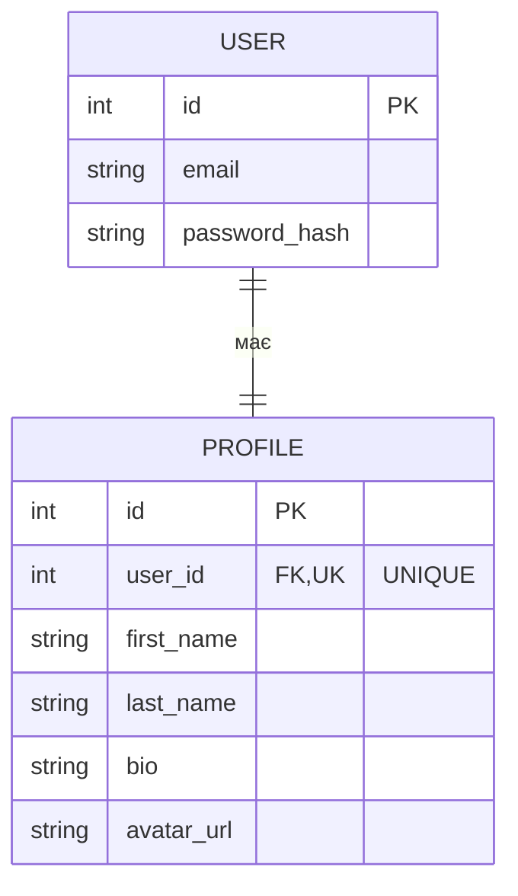
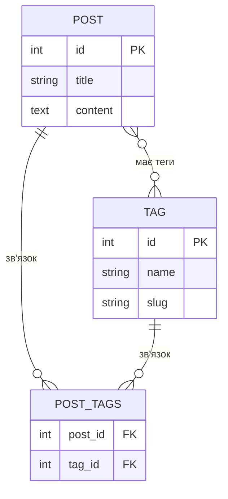

# Зв'язки One-to-One та Many-to-Many

::card-group

::card{title="🎯 Мета лекції" icon="i-lucide-target"}

- Опанувати зв'язки One-to-One (*один до одного*) для моделювання унікальних відносин між entities, таких як User ↔ Profile або Person ↔ Passport.
- Вивчити зв'язки Many-to-Many (*багато до багатьох*) через проміжні таблиці (*junction tables*) для моделювання складних відносин, таких як Posts ↔ Tags або Students ↔ Courses.
- Навчитися використовувати декоратори `@OneToOne`, `@ManyToMany`, `@JoinColumn` та `@JoinTable` для створення та налаштування цих зв'язків.
- Освоїти роботу з проміжними таблицями: автоматичне створення, кастомізація та додавання додаткових полів через окремі entities.
- Зрозуміти, коли використовувати автоматичні проміжні таблиці TypeORM, а коли створювати власні entities з двома `@ManyToOne` зв'язками.

::

::card{title="🔑 Ключові терміни" icon="i-lucide-key"}

- **One-to-One (Один до одного):** тип зв'язку, де один запис в одній таблиці відповідає рівно одному запису в іншій таблиці.
- **Many-to-Many (Багато до багатьох):** тип зв'язку, де один запис з однієї таблиці може бути пов'язаний з багатьма записами з іншої таблиці, і навпаки.
- **Junction Table (Проміжна таблиця):** допоміжна таблиця для реалізації Many-to-Many зв'язку, що зберігає пари foreign keys з обох пов'язаних таблиць.
- **Join Column:** колонка foreign key у таблиці, що є власником (*owner*) зв'язку One-to-One.
- **Relation Owner (Власник зв'язку):** сторона зв'язку, яка фізично зберігає foreign key у своїй таблиці (визначається декоратором `@JoinColumn()` або `@JoinTable()`).

::

::

---

## One-to-One зв'язок: концепція

### Що означає One-to-One

**One-to-One (один до одного)** — це тип зв'язку, де один запис з першої таблиці відповідає **рівно одному** запису з другої таблиці, і навпаки. Цей зв'язок використовується для розділення даних однієї логічної сутності на кілька таблиць з метою оптимізації або організації структури бази даних.

На відміну від **One-to-Many**, де один батьківський запис може мати багато дочірніх, у **One-to-One** кожна entity має максимум одну пов'язану entity.

::mermaid



::

**Пояснення діаграми:**

- Один користувач (`USER`) має **рівно один** профіль (`PROFILE`).
- Один профіль належить **рівно одному** користувачу.
- Колонка `user_id` у таблиці `PROFILE` є **foreign key** з **унікальним constraint** (позначено `UK`), що забезпечує відношення One-to-One.

::note

**Унікальність foreign key:**  
Ключова відмінність One-to-One від One-to-Many полягає у тому, що foreign key у дочірній таблиці має **унікальний constraint** (`UNIQUE`). Це гарантує, що один батьківський запис може бути пов'язаний лише з одним дочірнім записом. TypeORM автоматично додає цей constraint при оголошенні `@OneToOne` зв'язку.

::

### Приклади з реального світу

**1. User ↔ Profile (Користувач ↔ Профіль):**

- **User:** зберігає критичні дані автентифікації (email, password hash, дата реєстрації).
- **Profile:** зберігає додаткову інформацію (ім'я, прізвище, біо, аватар, соціальні мережі).

**Чому розділити на дві таблиці?**  
Дані автентифікації змінюються рідко та завантажуються при кожному логіні. Дані профілю завантажуються лише при перегляді сторінки профілю. Розділення покращує продуктивність та організацію коду.

**2. Person ↔ Passport (Особа ↔ Паспорт):**

- **Person:** базова інформація про особу.
- **Passport:** інформація про паспорт (номер, серія, дата видачі, ким виданий).

Не кожна особа має паспорт, тому зв'язок може бути **nullable**.

**3. Company ↔ BillingInfo (Компанія ↔ Платіжні дані):**

- **Company:** основна інформація про компанію.
- **BillingInfo:** реквізити для виставлення рахунків (банківські дані, податковий номер).

**4. Order ↔ ShippingDetails (Замовлення ↔ Дані доставки):**

- **Order:** інформація про замовлення.
- **ShippingDetails:** адреса доставки, трекінг-номер, перевізник.

### Коли використовувати One-to-One

✅ **Використовуйте One-to-One коли:**

1. **Розділення відповідальності:** Деякі дані завантажуються часто (наприклад, email користувача), а інші рідко (біографія, налаштування). Розділення на дві таблиці покращує продуктивність запитів.

2. **Опціональні дані:** Одна з сторін зв'язку може бути відсутня (наприклад, користувач без заповненого профілю, компанія без платіжних даних). Це дозволяє уникнути `NULL` значень у великій кількості колонок основної таблиці.

3. **Різні життєві цикли:** Дані мають різні правила оновлення або видалення. Наприклад, профіль може бути видалений (soft delete), але користувач залишається для збереження історії.

4. **Розмір рядка:** Якщо entity містить багато великих полів (наприклад, `TEXT` колонки), розділення на кілька таблиць зменшує розмір основного рядка та покращує продуктивність сканування індексів.

❌ **Не використовуйте One-to-One коли:**

1. Дані завжди завантажуються разом — немає сенсу розділяти на дві таблиці.
2. Структура даних проста та не передбачає масштабування.
3. Немає потреби у різних правилах доступу або життєвих циклах.

### Відмінності від One-to-Many

| Характеристика         | One-to-One                              | One-to-Many                             |
|------------------------|-----------------------------------------|-----------------------------------------|
| **Кількість зв'язків** | Один запис ↔ один запис                 | Один запис ↔ багато записів             |
| **Foreign key**        | Має **UNIQUE constraint**               | Без UNIQUE constraint                   |
| **Приклад**            | User ↔ Profile                          | User → Posts                            |
| **Типова структура**   | Розділення однієї логічної сутності     | Ієрархічні відносини батьків-діти       |
| **Використання JOIN**  | LEFT JOIN для опціональних зв'язків     | LEFT JOIN для завантаження колекції     |

---

## Декоратори `@OneToOne` та `@JoinColumn`

### Синтаксис: `@OneToOne(() => RelatedEntity)`

Декоратор `@OneToOne` використовується на **обох сторонах** зв'язку для визначення двонаправленого зв'язку. Одна з сторін повинна бути **власником** (*owner*) зв'язку та містити декоратор `@JoinColumn()`, який вказує, де зберігається foreign key.

**Базовий приклад — User ↔ Profile:**

```typescript [src/entities/user.entity.ts]
import { Entity, PrimaryGeneratedColumn, Column, OneToOne } from 'typeorm';
import { Profile } from './profile.entity';

@Entity('users')
export class User {
  @PrimaryGeneratedColumn()
  id: number;

  @Column({ type: 'varchar', length: 255, unique: true })
  email: string;

  @Column({ type: 'varchar', length: 255 })
  passwordHash: string;

  // ===== One-to-One зв'язок: один користувач має один профіль =====
  @OneToOne(() => Profile, (profile) => profile.user, {
    cascade: true,  // При збереженні user автоматично зберегти profile
  })
  profile: Profile;
}
```

```typescript [src/entities/profile.entity.ts]
import { Entity, PrimaryGeneratedColumn, Column, OneToOne, JoinColumn } from 'typeorm';
import { User } from './user.entity';

@Entity('profiles')
export class Profile {
  @PrimaryGeneratedColumn()
  id: number;

  @Column({ type: 'varchar', length: 100 })
  firstName: string;

  @Column({ type: 'varchar', length: 100 })
  lastName: string;

  @Column({ type: 'text', nullable: true })
  bio: string;

  @Column({ type: 'varchar', length: 500, nullable: true })
  avatarUrl: string;

  // ===== Власник зв'язку: тут зберігається foreign key =====
  @OneToOne(() => User, (user) => user.profile, {
    nullable: false,
    onDelete: 'CASCADE',
  })
  @JoinColumn({ name: 'user_id' })  // Створить колонку user_id з UNIQUE constraint
  user: User;
}
```

**Генерований SQL для таблиці `profiles`:**

```sql
CREATE TABLE profiles (
    id SERIAL PRIMARY KEY,
    first_name VARCHAR(100) NOT NULL,
    last_name VARCHAR(100) NOT NULL,
    bio TEXT,
    avatar_url VARCHAR(500),
    user_id INTEGER NOT NULL UNIQUE,  -- UNIQUE забезпечує One-to-One
    CONSTRAINT fk_profiles_user FOREIGN KEY (user_id)
        REFERENCES users(id)
        ON DELETE CASCADE
);
```

::tip

**Яка сторона повинна бути власником?**  
Зазвичай **власником** робиться та entity, яка **залежить** від іншої або створюється пізніше. У прикладі вище `Profile` є власником, оскільки профіль створюється після реєстрації користувача та не може існувати без користувача.

**Правило thumb:** Якщо зв'язок опціональний з одного боку, робіть власником сторону, де зв'язок **обов'язковий** (`nullable: false`).

::

### Декоратор `@JoinColumn()`: визначення власника зв'язку

Декоратор `@JoinColumn()` **обов'язковий** на **одній зі сторін** зв'язку `@OneToOne`. Він вказує, яка entity зберігає foreign key у своїй таблиці. Без `@JoinColumn()` TypeORM не зможе визначити власника та видасть помилку при синхронізації.

**Особливості `@JoinColumn()`:**

1. **Створює колонку foreign key** у таблиці entity, де він оголошений.
2. **Додає UNIQUE constraint** для забезпечення One-to-One відношення.
3. **Дозволяє кастомізувати** назву колонки та constraint.

**Приклад кастомізації:**

```typescript
@OneToOne(() => User, (user) => user.profile, {
  onDelete: 'CASCADE',
})
@JoinColumn({
  name: 'user_id',                         // Назва колонки FK
  referencedColumnName: 'id',              // На яку колонку у users посилається
  foreignKeyConstraintName: 'fk_profile_user',  // Назва constraint (TypeORM 0.3+)
})
user: User;
```

::warning

**Помилка — забути `@JoinColumn()`:**  
Якщо ви оголосите `@OneToOne` на обох сторонах, але **не додасте** `@JoinColumn()` ні на одній, TypeORM видасть помилку при синхронізації схеми:

```
Error: @JoinColumn() decorator is missing on one side of OneToOne relationship.
```

Завжди додавайте `@JoinColumn()` на **одну зі сторін**.

::

### Двонаправлений vs однонаправлений зв'язок

**Двонаправлений зв'язок** (*bidirectional*) — обидві entities знають про існування одна одної:

```typescript
// User може отримати profile через user.profile
@OneToOne(() => Profile, (profile) => profile.user)
profile: Profile;

// Profile може отримати user через profile.user
@OneToOne(() => User, (user) => user.profile)
@JoinColumn()
user: User;
```

**Однонаправлений зв'язок** (*unidirectional*) — лише одна entity знає про зв'язок:

```typescript [src/entities/profile.entity.ts]
@Entity('profiles')
export class Profile {
  @PrimaryGeneratedColumn()
  id: number;

  @Column()
  firstName: string;

  // Однонаправлений зв'язок: Profile знає про User, але User не знає про Profile
  @OneToOne(() => User, {
    nullable: false,
    onDelete: 'CASCADE',
  })
  @JoinColumn({ name: 'user_id' })
  user: User;
}
```

```typescript [src/entities/user.entity.ts]
@Entity('users')
export class User {
  @PrimaryGeneratedColumn()
  id: number;

  @Column()
  email: string;

  // Немає властивості profile — User не знає про Profile
}
```

**Коли використовувати однонаправлений зв'язок:**

- Якщо вам **ніколи** не потрібно завантажувати зв'язану entity з батьківської сторони.
- Для спрощення коду та зменшення кількості JOIN запитів.
- У випадках, коли зв'язок має чітку ієрархію (наприклад, `Order → ShippingDetails`, де Order ніколи не завантажується через ShippingDetails).

::note

**Рекомендація:**  
Для більшості випадків використовуйте **двонаправлений зв'язок**, оскільки він надає більшу гнучкість у запитах. Однонаправлений зв'язок доречний лише у специфічних сценаріях оптимізації.

::

---

## Налаштування One-to-One зв'язку

### Eager loading у One-to-One

Опція `eager: true` автоматично завантажує зв'язану entity при кожному запиті. У One-to-One зв'язках eager loading часто доречний, оскільки завантажується лише **один додатковий запис**, а не колекція.

**Приклад:**

```typescript
@Entity('users')
export class User {
  @OneToOne(() => Profile, (profile) => profile.user, {
    eager: true,  // Завжди завантажувати profile разом з user
    cascade: true,
  })
  profile: Profile;
}
```

**Використання:**

```typescript
// Запит без relations — але profile завантажиться автоматично
const user = await userRepository.findOne({ where: { id: 1 } });
console.log(user.profile);  // Profile доступний відразу
```

**SQL-запит (автоматичний LEFT JOIN):**

```sql
SELECT 
    u.id, u.email, u.password_hash,
    p.id AS profile_id, p.first_name, p.last_name, p.bio, p.avatar_url
FROM users u
LEFT JOIN profiles p ON p.user_id = u.id
WHERE u.id = 1;
```

::tip

**Коли використовувати eager loading у One-to-One:**

✅ Якщо зв'язана entity завантажується **майже завжди** (наприклад, профіль користувача на сторінці профілю).  
✅ Якщо зв'язана entity невелика (не містить великих `TEXT` полів або blob-даних).  
✅ Якщо ви хочете спростити код та уникнути явного вказування `relations` у кожному запиті.

❌ **Не використовуйте eager loading:**  
Якщо зв'язана entity рідко потрібна або містить великі обсяги даних.

::

### Cascade операції

Cascade операції у One-to-One працюють аналогічно до One-to-Many. Найчастіше використовуються `insert` та `update` для зручності збереження графів об'єктів.

**Приклад з cascade:**

```typescript
@Entity('users')
export class User {
  @OneToOne(() => Profile, (profile) => profile.user, {
    cascade: ['insert', 'update'],  // Автоматично зберігати profile при збереженні user
  })
  profile: Profile;
}
```

**Використання:**

```typescript
const user = new User();
user.email = 'john@example.com';
user.passwordHash = await bcrypt.hash('password123', 10);

// Створюємо profile та прикріплюємо до user
const profile = new Profile();
profile.firstName = 'John';
profile.lastName = 'Doe';
profile.bio = 'Software engineer';
user.profile = profile;

// Один виклик save зберігає user та profile
await userRepository.save(user);
```

**SQL-запити:**

```sql
INSERT INTO users (email, password_hash) VALUES ('john@example.com', '$2b$10...') RETURNING id;
INSERT INTO profiles (first_name, last_name, bio, user_id) VALUES ('John', 'Doe', 'Software engineer', 1);
```

::caution

**Обережно з `cascade: ['remove']`:**  
У One-to-One зв'язках каскадне видалення може бути небезпечним. Наприклад, якщо ви видалите `Profile`, це може автоматично видалити `User`, якщо `cascade: ['remove']` налаштовано на зворотній стороні зв'язку.

**Рекомендація:** Використовуйте `onDelete: 'CASCADE'` на рівні БД для контролю поведінки видалення, а TypeORM cascade лише для `insert` та `update`.

::

### Опція `nullable`

Опція `nullable` визначає, чи може foreign key бути `NULL`. У One-to-One зв'язках це дозволяє моделювати **опціональні зв'язки**.

**Приклад — опціональний зв'язок:**

```typescript [src/entities/person.entity.ts]
@Entity('persons')
export class Person {
  @PrimaryGeneratedColumn()
  id: number;

  @Column()
  name: string;

  @OneToOne(() => Passport, (passport) => passport.person, {
    cascade: true,
  })
  passport: Passport;
}
```

```typescript [src/entities/passport.entity.ts]
@Entity('passports')
export class Passport {
  @PrimaryGeneratedColumn()
  id: number;

  @Column()
  passportNumber: string;

  @OneToOne(() => Person, (person) => person.passport, {
    nullable: true,  // Паспорт може існувати без особи (або навпаки)
    onDelete: 'SET NULL',
  })
  @JoinColumn({ name: 'person_id' })
  person: Person;
}
```

**SQL:**

```sql
CREATE TABLE passports (
    id SERIAL PRIMARY KEY,
    passport_number VARCHAR(20) NOT NULL,
    person_id INTEGER UNIQUE,  -- Може бути NULL
    CONSTRAINT fk_passport_person FOREIGN KEY (person_id)
        REFERENCES persons(id)
        ON DELETE SET NULL
);
```

### Унікальність foreign key

TypeORM автоматично додає **UNIQUE constraint** на foreign key колонку у One-to-One зв'язках. Це гарантує, що один запис з батьківської таблиці може бути пов'язаний лише з одним записом дочірньої таблиці.

**Перевірка унікальності:**

Якщо ви спробуєте створити два профілі для одного користувача, БД поверне помилку:

```typescript
const user = await userRepository.findOne({ where: { id: 1 } });

const profile1 = new Profile();
profile1.user = user;
await profileRepository.save(profile1);  // ✅ OK

const profile2 = new Profile();
profile2.user = user;
await profileRepository.save(profile2);  
// ❌ Error: duplicate key value violates unique constraint "UQ_profile_user_id"
```

::note

**Важливість UNIQUE constraint:**  
Цей constraint є **критичним** для забезпечення семантики One-to-One. Без нього зв'язок перетвориться на One-to-Many, що призведе до логічних помилок у застосунку.

::


---

## Робота з One-to-One зв'язками

### Створення зв'язаних entities

**Спосіб 1 — створення обох entities окремо:**

```typescript
// Спочатку створити користувача
const user = userRepository.create({
  email: 'alice@example.com',
  passwordHash: await bcrypt.hash('secret', 10),
});
await userRepository.save(user);

// Потім створити профіль з посиланням на користувача
const profile = profileRepository.create({
  firstName: 'Alice',
  lastName: 'Smith',
  bio: 'Passionate developer',
  user: user,  // Встановлюємо зв'язок
});
await profileRepository.save(profile);
```

**Спосіб 2 — створення через cascade (рекомендовано):**

```typescript
const user = userRepository.create({
  email: 'bob@example.com',
  passwordHash: await bcrypt.hash('password', 10),
  profile: profileRepository.create({
    firstName: 'Bob',
    lastName: 'Johnson',
    bio: 'UI/UX Designer',
  }),
});

// Один виклик save зберігає user та profile (завдяки cascade: true)
await userRepository.save(user);
```

**SQL-запити:**

```sql
INSERT INTO users (email, password_hash) VALUES ('bob@example.com', '$2b$10...') RETURNING id;
INSERT INTO profiles (first_name, last_name, bio, user_id) VALUES ('Bob', 'Johnson', 'UI/UX Designer', 1);
```

### Завантаження через relations

**Завантаження користувача з профілем:**

```typescript
// Через опцію relations
const user = await userRepository.findOne({
  where: { id: 1 },
  relations: ['profile'],
});

console.log(user.profile);  // Profile entity доступний
```

**Завантаження профілю з користувачем:**

```typescript
const profile = await profileRepository.findOne({
  where: { id: 1 },
  relations: ['user'],
});

console.log(profile.user);  // User entity доступний
```

**Через QueryBuilder:**

```typescript
const user = await userRepository
  .createQueryBuilder('user')
  .leftJoinAndSelect('user.profile', 'profile')
  .where('user.id = :id', { id: 1 })
  .getOne();
```

::tip

**Оптимізація — уникайте зайвих завантажень:**  
Якщо вам потрібні лише деякі поля зв'язаної entity, використовуйте QueryBuilder з вибірковим `select()`:

```typescript
const users = await userRepository
  .createQueryBuilder('user')
  .leftJoinAndSelect('user.profile', 'profile')
  .select(['user.id', 'user.email', 'profile.firstName', 'profile.lastName'])
  .getMany();
```

Це зменшує обсяг даних, що передаються з БД.

::

### Оновлення зв'язаних даних

**Оновлення профілю через користувача (з cascade):**

```typescript
const user = await userRepository.findOne({
  where: { id: 1 },
  relations: ['profile'],
});

// Змінюємо дані профілю
user.profile.bio = 'Updated bio';
user.profile.avatarUrl = 'https://example.com/avatar.jpg';

// Збереження user автоматично оновить profile (завдяки cascade: ['update'])
await userRepository.save(user);
```

**SQL:**

```sql
UPDATE profiles SET bio = 'Updated bio', avatar_url = 'https://example.com/avatar.jpg' WHERE id = 1;
```

**Заміна зв'язку (зміна user у profile):**

```typescript
const profile = await profileRepository.findOne({ where: { id: 1 }, relations: ['user'] });
const newUser = await userRepository.findOne({ where: { id: 2 } });

profile.user = newUser;  // Зміна user_id з 1 на 2
await profileRepository.save(profile);
```

**SQL:**

```sql
UPDATE profiles SET user_id = 2 WHERE id = 1;
```

::warning

**Обережно зі зміною власника One-to-One:**  
Якщо ви змінюєте `user_id` у профілі, переконайтеся, що новий користувач ще не має профілю. Інакше виникне помилка унікального constraint:

```
Error: duplicate key value violates unique constraint "UQ_profiles_user_id"
```

::

### Видалення та cascade

**Видалення користувача з каскадним видаленням профілю:**

```typescript
const user = await userRepository.findOne({ where: { id: 1 } });
await userRepository.remove(user);
// БД автоматично видалить profile завдяки onDelete: 'CASCADE'
```

**SQL:**

```sql
DELETE FROM users WHERE id = 1;
-- БД автоматично виконає: DELETE FROM profiles WHERE user_id = 1;
```

**Видалення профілю без видалення користувача:**

```typescript
const profile = await profileRepository.findOne({ where: { id: 1 } });
await profileRepository.remove(profile);
// Користувач залишається у БД
```

**Видалення зв'язку (встановлення NULL):**

```typescript
const profile = await profileRepository.findOne({ where: { id: 1 }, relations: ['user'] });
profile.user = null;  // Видалити зв'язок (потрібно nullable: true)
await profileRepository.save(profile);
```

**SQL:**

```sql
UPDATE profiles SET user_id = NULL WHERE id = 1;
```

---

## Many-to-Many зв'язок: концепція

### Що означає Many-to-Many

**Many-to-Many (багато до багатьох)** — це тип зв'язку, де **багато записів** з однієї таблиці можуть бути пов'язані з **багатьма записами** з іншої таблиці. Цей зв'язок реалізується через **проміжну таблицю** (*junction table* або *pivot table*), яка зберігає пари foreign keys з обох таблиць.

::mermaid



::

**Пояснення діаграми:**

- Один пост може мати багато тегів (наприклад, `#TypeScript`, `#WebDev`, `#Tutorial`).
- Один тег може належати багатьом постам (наприклад, тег `#TypeScript` використовується у сотнях постів).
- Проміжна таблиця `POST_TAGS` зберігає пари (`post_id`, `tag_id`) для встановлення зв'язків.

### Проміжна таблиця (junction table)

**Junction table** — це допоміжна таблиця, яка містить мінімум дві колонки з foreign keys, що посилаються на обидві пов'язані таблиці. TypeORM автоматично створює цю таблицю при використанні декоратора `@ManyToMany`.

**SQL-структура проміжної таблиці:**

```sql
CREATE TABLE post_tags (
    post_id INTEGER NOT NULL,
    tag_id INTEGER NOT NULL,
    PRIMARY KEY (post_id, tag_id),  -- Композитний первинний ключ
    CONSTRAINT fk_post_tags_post FOREIGN KEY (post_id) REFERENCES posts(id) ON DELETE CASCADE,
    CONSTRAINT fk_post_tags_tag FOREIGN KEY (tag_id) REFERENCES tags(id) ON DELETE CASCADE
);

-- Індекси для оптимізації запитів
CREATE INDEX idx_post_tags_post_id ON post_tags(post_id);
CREATE INDEX idx_post_tags_tag_id ON post_tags(tag_id);
```

**Особливості проміжної таблиці:**

1. **Композитний primary key:** Пара (`post_id`, `tag_id`) є унікальною — один пост не може мати один тег двічі.
2. **Каскадне видалення:** При видаленні поста або тегу відповідні записи з проміжної таблиці автоматично видаляються.
3. **Індекси:** Для швидкого пошуку постів за тегом та тегів за постом.

### Приклади з реального світу

**1. Posts ↔ Tags (Статті ↔ Теги):**

- Одна стаття має багато тегів для категоризації.
- Один тег використовується у багатьох статтях.

**2. Students ↔ Courses (Студенти ↔ Курси):**

- Один студент може бути зареєстрований на багато курсів.
- Один курс має багато студентів.

**3. Users ↔ Roles (Користувачі ↔ Ролі):**

- Один користувач може мати багато ролей (наприклад, `admin`, `editor`, `viewer`).
- Одна роль може бути призначена багатьом користувачам.

**4. Products ↔ Categories (Товари ↔ Категорії):**

- Один товар може належати багатьом категоріям (наприклад, `Electronics`, `Sale`, `New Arrivals`).
- Одна категорія містить багато товарів.

### Автоматичне створення junction table

TypeORM автоматично створює проміжну таблицю при використанні декоратора `@ManyToMany` **без необхідності оголошення окремої Entity**. Назва таблиці генерується автоматично за шаблоном: `<entity1>_<entity2>_<relationName>`.

**Приклад автоматичного створення:**

```typescript
@Entity('posts')
export class Post {
  @ManyToMany(() => Tag)
  @JoinTable()
  tags: Tag[];
}
```

**Результат:**

TypeORM створить таблицю з назвою `post_tags_tags` (не найкраща назва, тому рекомендується кастомізація).

::note

**Коли використовувати автоматичні проміжні таблиці:**  
Якщо вам **не потрібні додаткові поля** у зв'язку (наприклад, дата додавання тегу до поста, порядковий номер, додаткові метадані). Для простих Many-to-Many зв'язків автоматичні проміжні таблиці ідеальні.

**Коли створювати окрему Entity:**  
Якщо потрібні додаткові поля (наприклад, `Student ↔ Course` з полем `grade` для оцінки). У такому випадку створюється окрема Entity з двома `@ManyToOne` зв'язками (докладніше в розділі про custom junction table).

::

---

## Декоратори `@ManyToMany` та `@JoinTable`

### Синтаксис: `@ManyToMany(() => RelatedEntity)`

Декоратор `@ManyToMany` використовується на **обох сторонах** зв'язку для створення двонаправленого зв'язку. Одна з сторін повинна бути **власником** (*owner*) і містити декоратор `@JoinTable()`, який вказує TypeORM створити проміжну таблицю.

**Базовий приклад — Post ↔ Tag:**

```typescript [src/entities/post.entity.ts]
import { Entity, PrimaryGeneratedColumn, Column, ManyToMany, JoinTable } from 'typeorm';
import { Tag } from './tag.entity';

@Entity('posts')
export class Post {
  @PrimaryGeneratedColumn()
  id: number;

  @Column({ type: 'varchar', length: 255 })
  title: string;

  @Column({ type: 'text' })
  content: string;

  // ===== Many-to-Many зв'язок: багато постів мають багато тегів =====
  @ManyToMany(() => Tag, (tag) => tag.posts, {
    cascade: true,  // При збереженні post автоматично зберегти нові теги
  })
  @JoinTable({
    name: 'post_tags',  // Назва проміжної таблиці
    joinColumn: { name: 'post_id', referencedColumnName: 'id' },
    inverseJoinColumn: { name: 'tag_id', referencedColumnName: 'id' },
  })
  tags: Tag[];
}
```

```typescript [src/entities/tag.entity.ts]
import { Entity, PrimaryGeneratedColumn, Column, ManyToMany } from 'typeorm';
import { Post } from './post.entity';

@Entity('tags')
export class Tag {
  @PrimaryGeneratedColumn()
  id: number;

  @Column({ type: 'varchar', length: 50, unique: true })
  name: string;

  @Column({ type: 'varchar', length: 50, unique: true })
  slug: string;

  // ===== Зворотна сторона зв'язку (без @JoinTable) =====
  @ManyToMany(() => Post, (post) => post.tags)
  posts: Post[];
}
```

**Генерований SQL для проміжної таблиці:**

```sql
CREATE TABLE post_tags (
    post_id INTEGER NOT NULL,
    tag_id INTEGER NOT NULL,
    PRIMARY KEY (post_id, tag_id),
    CONSTRAINT fk_post_tags_post FOREIGN KEY (post_id) REFERENCES posts(id) ON DELETE CASCADE,
    CONSTRAINT fk_post_tags_tag FOREIGN KEY (tag_id) REFERENCES tags(id) ON DELETE CASCADE
);
```

### Декоратор `@JoinTable()`: власник зв'язку

Декоратор `@JoinTable()` **обов'язковий на одній зі сторін** зв'язку `@ManyToMany`. Він вказує TypeORM створити проміжну таблицю та визначає, яка entity є власником зв'язку.

**Правило вибору власника:**

- Зазвичай власником робиться entity, яка **логічно ініціює** зв'язок.
- У прикладі `Post ↔ Tag` власником є `Post`, оскільки ви додаєте теги до постів (а не навпаки).
- У прикладі `Student ↔ Course` власником може бути `Student`, оскільки студент реєструється на курси.

::tip

**Семантика власника:**  
Власник — це сторона, з якої ви частіше **модифікуєте** зв'язок. Якщо ви частіше додаєте теги до поста, ніж пости до тегу, робіть `Post` власником.

::

### Автоматичне іменування junction table

Якщо не вказати параметр `name` у `@JoinTable()`, TypeORM автоматично генерує назву за шаблоном:

```
<ownerEntityName>_<relationName>_<inverseEntityName>
```

**Приклад:**

```typescript
@ManyToMany(() => Tag, (tag) => tag.posts)
@JoinTable()  // Без кастомізації
tags: Tag[];
```

**Генерована назва таблиці:** `post_tags_tags` (не дуже зрозуміла назва).

::warning

**Проблема автоматичного іменування:**  
Автоматично згенеровані назви часто незручні та незрозумілі. **Завжди вказуйте явну назву** через параметр `name` у `@JoinTable()`.

::

### Кастомізація junction table

Декоратор `@JoinTable()` дозволяє повністю налаштувати структуру проміжної таблиці:

```typescript
@JoinTable({
  name: 'post_tags',  // Назва таблиці
  joinColumn: {
    name: 'post_id',                // Назва колонки FK для Post
    referencedColumnName: 'id',     // На яку колонку у posts посилається
  },
  inverseJoinColumn: {
    name: 'tag_id',                 // Назва колонки FK для Tag
    referencedColumnName: 'id',     // На яку колонку у tags посилається
  },
})
tags: Tag[];
```

**Опціональні параметри:**

| Параметр                | Опис                                                     |
|-------------------------|----------------------------------------------------------|
| `name`                  | Назва проміжної таблиці                                   |
| `joinColumn.name`       | Назва колонки FK для власника                             |
| `inverseJoinColumn.name`| Назва колонки FK для зворотної сторони                    |
| `schema`                | Схема БД (для PostgreSQL, наприклад `public`)             |
| `synchronize`           | Чи синхронізувати структуру таблиці (за замовчуванням `true`) |

---

## Налаштування Many-to-Many зв'язку

### Eager loading у Many-to-Many

Опція `eager: true` автоматично завантажує зв'язані entities при кожному запиті. У Many-to-Many зв'язках eager loading **не рекомендується**, оскільки може призвести до завантаження великих обсягів даних.

**Приклад (не рекомендовано):**

```typescript
@ManyToMany(() => Tag, (tag) => tag.posts, {
  eager: true,  // ⚠️ Завжди завантажувати всі теги
})
@JoinTable()
tags: Tag[];
```

**Проблема:**

Якщо ви завантажите список з 100 постів, TypeORM виконає JOIN з `post_tags` та `tags`, що призведе до **картезіанського добутку** (*Cartesian product*) у результаті. Якщо кожен пост має 5 тегів, результат міститиме 500 рядків, які TypeORM потім згрупує у 100 постів з масивами тегів.

::caution

**Не використовуйте `eager: true` у Many-to-Many:**  
Завжди завантажуйте зв'язані entities явно через `relations` або QueryBuilder. Це дає контроль над тим, коли завантажувати дані, та дозволяє додати пагінацію.

::

### Cascade операції

Cascade операції у Many-to-Many зв'язках працюють аналогічно до інших типів зв'язків. Найчастіше використовується `insert` для автоматичного створення нових тегів при створенні поста.

**Приклад:**

```typescript
@ManyToMany(() => Tag, (tag) => tag.posts, {
  cascade: ['insert'],  // Автоматично створювати нові теги
})
@JoinTable()
tags: Tag[];
```

**Використання:**

```typescript
const post = postRepository.create({
  title: 'TypeORM Guide',
  content: 'Learn about relations...',
  tags: [
    tagRepository.create({ name: 'TypeScript', slug: 'typescript' }),
    tagRepository.create({ name: 'Database', slug: 'database' }),
  ],
});

// Збереже post та створить 2 нові теги + записи у post_tags
await postRepository.save(post);
```

**SQL-запити:**

```sql
INSERT INTO posts (title, content) VALUES ('TypeORM Guide', 'Learn about relations...') RETURNING id;
INSERT INTO tags (name, slug) VALUES ('TypeScript', 'typescript') RETURNING id;
INSERT INTO tags (name, slug) VALUES ('Database', 'database') RETURNING id;
INSERT INTO post_tags (post_id, tag_id) VALUES (1, 1);
INSERT INTO post_tags (post_id, tag_id) VALUES (1, 2);
```

::tip

**Рекомендація — уникайте `cascade: ['remove']`:**  
У Many-to-Many зв'язках cascade видалення рідко потрібне. Наприклад, при видаленні поста теги повинні залишатися у БД для використання в інших постах. Використовуйте `onDelete: 'CASCADE'` лише на рівні проміжної таблиці (це відбувається автоматично).

::

### Bi-directional (двосторонній) зв'язок

**Двосторонній зв'язок** дозволяє навігацію в обох напрямках:

- `post.tags` — отримати теги поста.
- `tag.posts` — отримати пости, що мають цей тег.

**Налаштування:**

```typescript
// У Post entity
@ManyToMany(() => Tag, (tag) => tag.posts)
@JoinTable()
tags: Tag[];

// У Tag entity
@ManyToMany(() => Post, (post) => post.tags)
posts: Post[];
```

### Uni-directional (односторонній) зв'язок

**Односторонній зв'язок** означає, що лише одна entity знає про зв'язок:

```typescript
// У Post entity
@ManyToMany(() => Tag)
@JoinTable()
tags: Tag[];

// У Tag entity — немає властивості posts
```

**Коли використовувати односторонній зв'язок:**

- Якщо вам **ніколи** не потрібно отримувати пости за тегом (лише теги за постом).
- Для спрощення коду та зменшення кількості JOIN запитів.

::note

**Рекомендація:**  
Для більшості випадків використовуйте **двосторонній зв'язок**, оскільки він надає більшу гнучкість у запитах. Односторонній зв'язок доречний лише у специфічних сценаріях.

::


---

## Робота з Many-to-Many зв'язками

### Додавання зв'язків через масиви

TypeORM дозволяє працювати з Many-to-Many зв'язками через звичайні TypeScript масиви. Ви можете додавати, видаляти та модифікувати зв'язки, просто змінюючи масив `tags` у властивості entity.

**Приклад — додавання існуючих тегів до поста:**

```typescript
const post = await postRepository.findOne({ where: { id: 1 }, relations: ['tags'] });
const newTag = await tagRepository.findOne({ where: { slug: 'typescript' } });

// Додаємо тег до масиву
post.tags.push(newTag);

// Збереження post синхронізує зв'язки у проміжній таблиці
await postRepository.save(post);
```

**SQL-запити:**

```sql
-- TypeORM перевіряє існуючі зв'язки
SELECT * FROM post_tags WHERE post_id = 1;

-- Додає новий запис у проміжну таблицю
INSERT INTO post_tags (post_id, tag_id) VALUES (1, 5);
```

**Додавання кількох тегів за раз:**

```typescript
const post = await postRepository.findOne({ where: { id: 1 }, relations: ['tags'] });
const additionalTags = await tagRepository.findBy({ slug: In(['javascript', 'nodejs']) });

post.tags.push(...additionalTags);
await postRepository.save(post);
```

### Використання `save()` для синхронізації

Метод `save()` у TypeORM автоматично **синхронізує** стан масиву `tags` з проміжною таблицею. TypeORM:

1. Завантажує поточні зв'язки з проміжної таблиці.
2. Порівнює їх з масивом у entity.
3. **Додає** нові записи, яких немає у БД.
4. **Видаляє** записи, які були видалені з масиву.

**Приклад — заміна всіх тегів:**

```typescript
const post = await postRepository.findOne({ where: { id: 1 }, relations: ['tags'] });

// Замінюємо всі теги новими
post.tags = await tagRepository.findBy({ slug: In(['react', 'vue', 'angular']) });

await postRepository.save(post);
// TypeORM видалить старі записи з post_tags та додасть нові
```

**SQL-запити:**

```sql
-- Видалення старих зв'язків
DELETE FROM post_tags WHERE post_id = 1 AND tag_id NOT IN (10, 11, 12);

-- Додавання нових зв'язків
INSERT INTO post_tags (post_id, tag_id) VALUES (1, 10), (1, 11), (1, 12) ON CONFLICT DO NOTHING;
```

::warning

**Важливо завантажувати існуючі зв'язки:**  
Перед зміною масиву `tags` **завжди завантажуйте** поточні зв'язки через `relations: ['tags']`. Якщо ви не завантажите існуючі зв'язки, TypeORM вважатиме, що масив порожній, і видалить всі зв'язки у проміжній таблиці.

::

### Видалення зв'язків

**Видалення одного тегу з поста:**

```typescript
const post = await postRepository.findOne({ where: { id: 1 }, relations: ['tags'] });

// Видаляємо тег з масиву
post.tags = post.tags.filter(tag => tag.slug !== 'javascript');

await postRepository.save(post);
// TypeORM видалить відповідний запис з post_tags
```

**SQL:**

```sql
DELETE FROM post_tags WHERE post_id = 1 AND tag_id = 3;
```

**Видалення всіх тегів з поста:**

```typescript
const post = await postRepository.findOne({ where: { id: 1 }, relations: ['tags'] });
post.tags = [];
await postRepository.save(post);
```

**SQL:**

```sql
DELETE FROM post_tags WHERE post_id = 1;
```

**Видалення поста (автоматичне каскадне видалення зв'язків):**

```typescript
const post = await postRepository.findOne({ where: { id: 1 } });
await postRepository.remove(post);
// БД автоматично видалить записи з post_tags завдяки ON DELETE CASCADE
```

### Отримання зв'язаних entities

**Отримання постів з їх тегами:**

```typescript
const posts = await postRepository.find({
  relations: ['tags'],
  order: { createdAt: 'DESC' },
  take: 10,
});

posts.forEach(post => {
  console.log(`${post.title}: ${post.tags.map(t => t.name).join(', ')}`);
});
```

**Отримання тегу з усіма його постами:**

```typescript
const tag = await tagRepository.findOne({
  where: { slug: 'typescript' },
  relations: ['posts'],
});

console.log(`Tag "${tag.name}" має ${tag.posts.length} постів`);
```

**Через QueryBuilder з фільтрацією:**

```typescript
// Пости, що мають тег "TypeScript"
const posts = await postRepository
  .createQueryBuilder('post')
  .innerJoinAndSelect('post.tags', 'tag')
  .where('tag.slug = :slug', { slug: 'typescript' })
  .getMany();
```

**SQL:**

```sql
SELECT 
    p.*, t.*
FROM posts p
INNER JOIN post_tags pt ON pt.post_id = p.id
INNER JOIN tags t ON t.id = pt.tag_id
WHERE t.slug = 'typescript';
```

---

## Складні запити зі зв'язками

### QueryBuilder для JOIN

QueryBuilder надає повний контроль над SQL-запитами та дозволяє будувати складні JOIN з фільтрацією.

**Приклад 1 — пости з конкретним тегом:**

```typescript
const posts = await postRepository
  .createQueryBuilder('post')
  .innerJoinAndSelect('post.tags', 'tag', 'tag.slug = :slug', { slug: 'typescript' })
  .getMany();
```

**Приклад 2 — пости, що мають хоча б один з тегів:**

```typescript
const posts = await postRepository
  .createQueryBuilder('post')
  .innerJoin('post.tags', 'tag')
  .where('tag.slug IN (:...slugs)', { slugs: ['typescript', 'javascript', 'nodejs'] })
  .distinct(true)  // Уникнути дублікатів, якщо пост має кілька тегів зі списку
  .getMany();
```

**Приклад 3 — пости, що мають ВСІ вказані теги (складний запит):**

```typescript
const requiredTags = ['typescript', 'nestjs'];

const posts = await postRepository
  .createQueryBuilder('post')
  .innerJoin('post.tags', 'tag')
  .where('tag.slug IN (:...slugs)', { slugs: requiredTags })
  .groupBy('post.id')
  .having('COUNT(DISTINCT tag.id) = :count', { count: requiredTags.length })
  .getMany();
```

**SQL:**

```sql
SELECT p.*
FROM posts p
INNER JOIN post_tags pt ON pt.post_id = p.id
INNER JOIN tags t ON t.id = pt.tag_id
WHERE t.slug IN ('typescript', 'nestjs')
GROUP BY p.id
HAVING COUNT(DISTINCT t.id) = 2;
```

### `leftJoinAndSelect()` vs `innerJoinAndSelect()`

| Метод                   | Поведінка                                                      |
|-------------------------|----------------------------------------------------------------|
| `leftJoinAndSelect()`   | Завантажує всі пости, навіть якщо у них немає тегів            |
| `innerJoinAndSelect()`  | Завантажує лише пости, які мають хоча б один тег                |

**Приклад:**

```typescript
// LEFT JOIN — пости без тегів теж включені
const allPosts = await postRepository
  .createQueryBuilder('post')
  .leftJoinAndSelect('post.tags', 'tag')
  .getMany();

// INNER JOIN — лише пости з тегами
const taggedPosts = await postRepository
  .createQueryBuilder('post')
  .innerJoinAndSelect('post.tags', 'tag')
  .getMany();
```

### Фільтрація за зв'язаними entities

**Приклад 1 — пости, автор яких має email з доменом `@example.com`:**

```typescript
const posts = await postRepository
  .createQueryBuilder('post')
  .innerJoinAndSelect('post.author', 'author')
  .innerJoinAndSelect('post.tags', 'tag')
  .where('author.email LIKE :domain', { domain: '%@example.com' })
  .getMany();
```

**Приклад 2 — теги, що використовуються більше ніж у 10 постах:**

```typescript
const popularTags = await tagRepository
  .createQueryBuilder('tag')
  .innerJoin('tag.posts', 'post')
  .select('tag.id', 'id')
  .addSelect('tag.name', 'name')
  .addSelect('tag.slug', 'slug')
  .addSelect('COUNT(post.id)', 'postCount')
  .groupBy('tag.id')
  .having('COUNT(post.id) > :minCount', { minCount: 10 })
  .orderBy('COUNT(post.id)', 'DESC')
  .getRawMany();
```

**Результат:**

```typescript
[
  { id: 5, name: 'TypeScript', slug: 'typescript', postCount: '45' },
  { id: 8, name: 'JavaScript', slug: 'javascript', postCount: '38' },
]
```

### Підрахунок кількості зв'язків

**Приклад — пости з підрахунком кількості тегів:**

```typescript
const postsWithTagCount = await postRepository
  .createQueryBuilder('post')
  .leftJoin('post.tags', 'tag')
  .select('post.id', 'id')
  .addSelect('post.title', 'title')
  .addSelect('COUNT(tag.id)', 'tagCount')
  .groupBy('post.id')
  .getRawMany();
```

**Результат:**

```typescript
[
  { id: 1, title: 'TypeORM Guide', tagCount: '3' },
  { id: 2, title: 'React Hooks', tagCount: '2' },
  { id: 3, title: 'Node.js Basics', tagCount: '0' },
]
```

### Пагінація зі зв'язками

**Проблема — пагінація з `leftJoinAndSelect()` працює некоректно:**

```typescript
// ❌ Неправильно — пагінація застосовується до рядків після JOIN
const posts = await postRepository
  .createQueryBuilder('post')
  .leftJoinAndSelect('post.tags', 'tag')
  .skip(0)
  .take(10)  // Може повернути менше 10 постів через кількість тегів
  .getMany();
```

**Рішення — використати підзапит або окремі запити:**

```typescript
// ✅ Правильно — спочатку отримати ID постів, потім завантажити з тегами
const postIds = await postRepository
  .createQueryBuilder('post')
  .select('post.id')
  .orderBy('post.createdAt', 'DESC')
  .skip(0)
  .take(10)
  .getRawMany();

const posts = await postRepository
  .createQueryBuilder('post')
  .leftJoinAndSelect('post.tags', 'tag')
  .whereInIds(postIds.map(p => p.id))
  .getMany();
```

**Альтернатива — використати `loadRelationCountAndMap()`:**

```typescript
const posts = await postRepository
  .createQueryBuilder('post')
  .loadRelationCountAndMap('post.tagCount', 'post.tags')
  .orderBy('post.createdAt', 'DESC')
  .skip(0)
  .take(10)
  .getMany();

// Тепер кожен post має властивість tagCount (не завантажуючи самі теги)
console.log(posts[0].tagCount);  // 3
```

::tip

**Best Practice для пагінації з Many-to-Many:**  
Використовуйте **два запити**:

1. Отримайте ID батьківських entities з `skip` та `take`.
2. Завантажте повні entities з зв'язками за отриманими ID.

Це гарантує коректну пагінацію та уникнення проблем з картезіанським добутком.

::

---

## Custom junction table з додатковими полями

### Коли потрібні додаткові дані у зв'язку

Автоматична проміжна таблиця TypeORM підходить для **простих** Many-to-Many зв'язків, де потрібні лише пари foreign keys. Проте у реальних системах часто потрібні **додаткові метадані** про зв'язок:

**Приклад 1 — Student ↔ Course з оцінкою:**

- Кожен студент має оцінку за курс (`grade`).
- Кожен студент має дату реєстрації на курс (`enrolledAt`).

**Приклад 2 — User ↔ Project з роллю:**

- Кожен користувач у проєкті має роль (`role`: `owner`, `admin`, `member`).
- Кожен користувач має дату приєднання до проєкту (`joinedAt`).

**Приклад 3 — Post ↔ Tag з порядковим номером:**

- Теги мають порядковий номер для відображення у певному порядку (`order`).
- Теги мають дату додавання до поста (`addedAt`).

У таких випадках потрібно створити **окрему Entity** для проміжної таблиці.

### Створення окремої Entity для junction table

Замість використання автоматичної проміжної таблиці через `@ManyToMany` + `@JoinTable`, створюється **окрема Entity** з двома `@ManyToOne` зв'язками.

**Приклад — Student ↔ Course з оцінкою:**

```typescript [src/entities/student.entity.ts]
import { Entity, PrimaryGeneratedColumn, Column, OneToMany } from 'typeorm';
import { Enrollment } from './enrollment.entity';

@Entity('students')
export class Student {
  @PrimaryGeneratedColumn()
  id: number;

  @Column({ type: 'varchar', length: 100 })
  name: string;

  @Column({ type: 'varchar', length: 255, unique: true })
  email: string;

  @OneToMany(() => Enrollment, (enrollment) => enrollment.student)
  enrollments: Enrollment[];
}
```

```typescript [src/entities/course.entity.ts]
import { Entity, PrimaryGeneratedColumn, Column, OneToMany } from 'typeorm';
import { Enrollment } from './enrollment.entity';

@Entity('courses')
export class Course {
  @PrimaryGeneratedColumn()
  id: number;

  @Column({ type: 'varchar', length: 100 })
  title: string;

  @Column({ type: 'varchar', length: 20, unique: true })
  code: string;

  @OneToMany(() => Enrollment, (enrollment) => enrollment.course)
  enrollments: Enrollment[];
}
```

```typescript [src/entities/enrollment.entity.ts]
import { Entity, PrimaryGeneratedColumn, Column, ManyToOne, JoinColumn, CreateDateColumn, Unique } from 'typeorm';
import { Student } from './student.entity';
import { Course } from './course.entity';

@Entity('enrollments')
@Unique(['student', 'course'])  // Один студент не може бути зареєстрований на курс двічі
export class Enrollment {
  @PrimaryGeneratedColumn()
  id: number;

  @ManyToOne(() => Student, (student) => student.enrollments, {
    nullable: false,
    onDelete: 'CASCADE',
  })
  @JoinColumn({ name: 'student_id' })
  student: Student;

  @ManyToOne(() => Course, (course) => course.enrollments, {
    nullable: false,
    onDelete: 'CASCADE',
  })
  @JoinColumn({ name: 'course_id' })
  course: Course;

  // ===== Додаткові поля =====
  @Column({ type: 'decimal', precision: 3, scale: 1, nullable: true })
  grade: number;  // Оцінка за курс (наприклад, 4.5)

  @CreateDateColumn()
  enrolledAt: Date;  // Дата реєстрації на курс
}
```

**Генерований SQL:**

```sql
CREATE TABLE enrollments (
    id SERIAL PRIMARY KEY,
    student_id INTEGER NOT NULL,
    course_id INTEGER NOT NULL,
    grade DECIMAL(3, 1),
    enrolled_at TIMESTAMP DEFAULT CURRENT_TIMESTAMP,
    CONSTRAINT fk_enrollment_student FOREIGN KEY (student_id) REFERENCES students(id) ON DELETE CASCADE,
    CONSTRAINT fk_enrollment_course FOREIGN KEY (course_id) REFERENCES courses(id) ON DELETE CASCADE,
    CONSTRAINT UQ_enrollment_student_course UNIQUE (student_id, course_id)
);
```

### Two `@ManyToOne` замість `@ManyToMany`

Ключова відмінність — замість одного `@ManyToMany` зв'язку використовуються **два `@ManyToOne` зв'язки** у окремій Entity:

| Підхід                  | Структура                                              | Коли використовувати                  |
|-------------------------|--------------------------------------------------------|---------------------------------------|
| `@ManyToMany` + `@JoinTable` | Автоматична проміжна таблиця без додаткових полів     | Прості зв'язки (лише пари FK)         |
| Окрема Entity з `@ManyToOne` | Ручна проміжна Entity з додатковими полями             | Зв'язки з метаданими (дата, роль, оцінка) |

### Робота з custom junction table

**Створення зв'язку (реєстрація студента на курс):**

```typescript
const student = await studentRepository.findOne({ where: { id: 1 } });
const course = await courseRepository.findOne({ where: { id: 5 } });

const enrollment = enrollmentRepository.create({
  student,
  course,
  grade: null,  // Оцінка поки невідома
});

await enrollmentRepository.save(enrollment);
```

**Оновлення оцінки:**

```typescript
const enrollment = await enrollmentRepository.findOne({
  where: { student: { id: 1 }, course: { id: 5 } },
});

enrollment.grade = 4.8;
await enrollmentRepository.save(enrollment);
```

**Отримання курсів студента з оцінками:**

```typescript
const enrollments = await enrollmentRepository.find({
  where: { student: { id: 1 } },
  relations: ['course'],
  order: { enrolledAt: 'DESC' },
});

enrollments.forEach(e => {
  console.log(`${e.course.title}: ${e.grade || 'Без оцінки'}`);
});
```

**Отримання студентів курсу з оцінками:**

```typescript
const enrollments = await enrollmentRepository.find({
  where: { course: { id: 5 } },
  relations: ['student'],
  order: { student: { name: 'ASC' } },
});

enrollments.forEach(e => {
  console.log(`${e.student.name}: ${e.grade || 'Без оцінки'}`);
});
```

**Видалення зв'язку (відрахування студента з курсу):**

```typescript
await enrollmentRepository.delete({
  student: { id: 1 },
  course: { id: 5 },
});
```

::tip

**Переваги custom junction table:**

1. **Додаткові поля** для метаданих зв'язку.
2. **Власний primary key** (`id`), що спрощує оновлення та аудит.
3. **Можливість додати методи** до Entity для бізнес-логіки.
4. **Простіше відстежувати зміни** через timestamps (`created_at`, `updated_at`).

**Недоліки:**

1. Більше коду порівняно з автоматичною проміжною таблицею.
2. Потрібно вручну обробляти операції додавання/видалення зв'язків.

::


---

## Практичні приклади

### User ↔ Profile (One-to-One) — повна реалізація

**Сервіс для роботи з профілем:**

```typescript [src/users/users.service.ts]
import { Injectable, NotFoundException, ConflictException } from '@nestjs/common';
import { InjectRepository } from '@nestjs/typeorm';
import { Repository } from 'typeorm';
import { User } from '../entities/user.entity';
import { Profile } from '../entities/profile.entity';
import * as bcrypt from 'bcrypt';

@Injectable()
export class UsersService {
  constructor(
    @InjectRepository(User)
    private readonly userRepository: Repository<User>,
    @InjectRepository(Profile)
    private readonly profileRepository: Repository<Profile>,
  ) {}

  // Реєстрація користувача з профілем
  async register(dto: { email: string; password: string; firstName: string; lastName: string }): Promise<User> {
    const existingUser = await this.userRepository.findOne({ where: { email: dto.email } });
    if (existingUser) {
      throw new ConflictException('Email вже використовується');
    }

    const user = this.userRepository.create({
      email: dto.email,
      passwordHash: await bcrypt.hash(dto.password, 10),
      profile: this.profileRepository.create({
        firstName: dto.firstName,
        lastName: dto.lastName,
      }),
    });

    return this.userRepository.save(user);  // Cascade збереже profile
  }

  // Отримання користувача з профілем
  async getUserWithProfile(userId: number): Promise<User> {
    const user = await this.userRepository.findOne({
      where: { id: userId },
      relations: ['profile'],
    });

    if (!user) {
      throw new NotFoundException('Користувача не знайдено');
    }

    return user;
  }

  // Оновлення профілю
  async updateProfile(userId: number, dto: { firstName?: string; lastName?: string; bio?: string; avatarUrl?: string }): Promise<Profile> {
    const user = await this.userRepository.findOne({
      where: { id: userId },
      relations: ['profile'],
    });

    if (!user || !user.profile) {
      throw new NotFoundException('Профіль не знайдено');
    }

    Object.assign(user.profile, dto);
    await this.profileRepository.save(user.profile);

    return user.profile;
  }

  // Видалення користувача (профіль видаляється автоматично через CASCADE)
  async deleteUser(userId: number): Promise<void> {
    const user = await this.userRepository.findOne({ where: { id: userId } });
    if (!user) {
      throw new NotFoundException('Користувача не знайдено');
    }

    await this.userRepository.remove(user);
  }
}
```

**Контролер:**

```typescript [src/users/users.controller.ts]
import { Controller, Get, Post, Put, Delete, Body, Param, ParseIntPipe, Request } from '@nestjs/common';
import { UsersService } from './users.service';

@Controller('users')
export class UsersController {
  constructor(private readonly usersService: UsersService) {}

  @Post('register')
  async register(@Body() dto: { email: string; password: string; firstName: string; lastName: string }) {
    return this.usersService.register(dto);
  }

  @Get('me')
  async getMe(@Request() req) {
    return this.usersService.getUserWithProfile(req.user.id);
  }

  @Put('me/profile')
  async updateMyProfile(@Request() req, @Body() dto: { firstName?: string; lastName?: string; bio?: string; avatarUrl?: string }) {
    return this.usersService.updateProfile(req.user.id, dto);
  }

  @Delete('me')
  async deleteMe(@Request() req) {
    await this.usersService.deleteUser(req.user.id);
    return { message: 'Аккаунт успішно видалено' };
  }
}
```

### Post ↔ Tags (Many-to-Many) — повна реалізація

**Сервіс для роботи з постами та тегами:**

```typescript [src/posts/posts.service.ts]
import { Injectable, NotFoundException } from '@nestjs/common';
import { InjectRepository } from '@nestjs/typeorm';
import { Repository, In } from 'typeorm';
import { Post } from '../entities/post.entity';
import { Tag } from '../entities/tag.entity';

@Injectable()
export class PostsService {
  constructor(
    @InjectRepository(Post)
    private readonly postRepository: Repository<Post>,
    @InjectRepository(Tag)
    private readonly tagRepository: Repository<Tag>,
  ) {}

  // Створення поста з тегами (автоматичне створення нових тегів)
  async createPost(userId: number, dto: { title: string; content: string; tagSlugs: string[] }): Promise<Post> {
    // Отримати існуючі теги
    const existingTags = await this.tagRepository.findBy({ slug: In(dto.tagSlugs) });
    const existingTagSlugs = existingTags.map(t => t.slug);

    // Створити нові теги для тих, що не існують
    const newTags = dto.tagSlugs
      .filter(slug => !existingTagSlugs.includes(slug))
      .map(slug => this.tagRepository.create({
        name: slug.charAt(0).toUpperCase() + slug.slice(1),
        slug,
      }));

    const post = this.postRepository.create({
      title: dto.title,
      content: dto.content,
      author: { id: userId } as any,
      tags: [...existingTags, ...newTags],
    });

    return this.postRepository.save(post);  // Cascade збереже нові теги
  }

  // Отримання постів за тегом
  async getPostsByTag(tagSlug: string, page = 1, limit = 20): Promise<{ items: Post[]; total: number }> {
    const tag = await this.tagRepository.findOne({ where: { slug: tagSlug } });
    if (!tag) {
      throw new NotFoundException('Тег не знайдено');
    }

    const [items, total] = await this.postRepository.findAndCount({
      where: { tags: { slug: tagSlug } },
      relations: ['author', 'tags'],
      order: { createdAt: 'DESC' },
      skip: (page - 1) * limit,
      take: limit,
    });

    return { items, total };
  }

  // Отримання поста з тегами
  async getPostWithTags(postId: number): Promise<Post> {
    const post = await this.postRepository.findOne({
      where: { id: postId },
      relations: ['author', 'tags'],
    });

    if (!post) {
      throw new NotFoundException('Пост не знайдено');
    }

    return post;
  }

  // Додавання тегів до поста
  async addTagsToPost(postId: number, tagSlugs: string[]): Promise<Post> {
    const post = await this.postRepository.findOne({
      where: { id: postId },
      relations: ['tags'],
    });

    if (!post) {
      throw new NotFoundException('Пост не знайдено');
    }

    const newTags = await this.tagRepository.findBy({ slug: In(tagSlugs) });

    // Додаємо нові теги, уникаючи дублікатів
    const existingTagIds = post.tags.map(t => t.id);
    const tagsToAdd = newTags.filter(t => !existingTagIds.includes(t.id));
    post.tags.push(...tagsToAdd);

    return this.postRepository.save(post);
  }

  // Видалення тегів з поста
  async removeTagsFromPost(postId: number, tagSlugs: string[]): Promise<Post> {
    const post = await this.postRepository.findOne({
      where: { id: postId },
      relations: ['tags'],
    });

    if (!post) {
      throw new NotFoundException('Пост не знайдено');
    }

    post.tags = post.tags.filter(tag => !tagSlugs.includes(tag.slug));

    return this.postRepository.save(post);
  }

  // Заміна всіх тегів поста
  async replacePostTags(postId: number, tagSlugs: string[]): Promise<Post> {
    const post = await this.postRepository.findOne({
      where: { id: postId },
      relations: ['tags'],
    });

    if (!post) {
      throw new NotFoundException('Пост не знайдено');
    }

    post.tags = await this.tagRepository.findBy({ slug: In(tagSlugs) });

    return this.postRepository.save(post);
  }

  // Отримання популярних тегів з підрахунком постів
  async getPopularTags(limit = 20): Promise<Array<{ tag: Tag; postCount: number }>> {
    const results = await this.tagRepository
      .createQueryBuilder('tag')
      .innerJoin('tag.posts', 'post')
      .select('tag.id', 'id')
      .addSelect('tag.name', 'name')
      .addSelect('tag.slug', 'slug')
      .addSelect('COUNT(post.id)', 'postCount')
      .groupBy('tag.id')
      .orderBy('COUNT(post.id)', 'DESC')
      .limit(limit)
      .getRawMany();

    return results.map(row => ({
      tag: { id: row.id, name: row.name, slug: row.slug } as Tag,
      postCount: parseInt(row.postCount, 10),
    }));
  }

  // Пошук постів за кількома тегами (всі теги мають бути присутні)
  async findPostsWithAllTags(tagSlugs: string[]): Promise<Post[]> {
    return this.postRepository
      .createQueryBuilder('post')
      .innerJoin('post.tags', 'tag')
      .where('tag.slug IN (:...slugs)', { slugs: tagSlugs })
      .groupBy('post.id')
      .having('COUNT(DISTINCT tag.id) = :count', { count: tagSlugs.length })
      .getMany();
  }
}
```

**Контролер:**

```typescript [src/posts/posts.controller.ts]
import { Controller, Get, Post, Put, Delete, Body, Param, Query, ParseIntPipe, Request } from '@nestjs/common';
import { PostsService } from './posts.service';

@Controller('posts')
export class PostsController {
  constructor(private readonly postsService: PostsService) {}

  @Post()
  async create(@Request() req, @Body() dto: { title: string; content: string; tagSlugs: string[] }) {
    return this.postsService.createPost(req.user.id, dto);
  }

  @Get('by-tag/:slug')
  async getByTag(@Param('slug') slug: string, @Query('page', ParseIntPipe) page = 1, @Query('limit', ParseIntPipe) limit = 20) {
    return this.postsService.getPostsByTag(slug, page, limit);
  }

  @Get('popular-tags')
  async getPopularTags(@Query('limit', ParseIntPipe) limit = 20) {
    return this.postsService.getPopularTags(limit);
  }

  @Get(':id')
  async getOne(@Param('id', ParseIntPipe) id: number) {
    return this.postsService.getPostWithTags(id);
  }

  @Put(':id/tags')
  async replaceTags(@Param('id', ParseIntPipe) id: number, @Body() dto: { tagSlugs: string[] }) {
    return this.postsService.replacePostTags(id, dto.tagSlugs);
  }

  @Post(':id/tags')
  async addTags(@Param('id', ParseIntPipe) id: number, @Body() dto: { tagSlugs: string[] }) {
    return this.postsService.addTagsToPost(id, dto.tagSlugs);
  }

  @Delete(':id/tags')
  async removeTags(@Param('id', ParseIntPipe) id: number, @Body() dto: { tagSlugs: string[] }) {
    return this.postsService.removeTagsFromPost(id, dto.tagSlugs);
  }
}
```

### Повна реалізація з усіма типами зв'язків

**Приклад — блог-платформа з комплексними зв'язками:**

```typescript
// User (One-to-One з Profile, One-to-Many з Post, Many-to-Many з Role)
@Entity('users')
export class User {
  @PrimaryGeneratedColumn()
  id: number;

  @Column({ unique: true })
  email: string;

  @OneToOne(() => Profile, profile => profile.user, { cascade: true })
  profile: Profile;

  @OneToMany(() => Post, post => post.author)
  posts: Post[];

  @ManyToMany(() => Role, role => role.users)
  @JoinTable({ name: 'user_roles' })
  roles: Role[];
}

// Profile (One-to-One з User)
@Entity('profiles')
export class Profile {
  @PrimaryGeneratedColumn()
  id: number;

  @Column()
  firstName: string;

  @Column()
  lastName: string;

  @OneToOne(() => User, user => user.profile, { onDelete: 'CASCADE' })
  @JoinColumn({ name: 'user_id' })
  user: User;
}

// Post (Many-to-One з User, Many-to-Many з Tag, One-to-Many з Comment)
@Entity('posts')
export class Post {
  @PrimaryGeneratedColumn()
  id: number;

  @Column()
  title: string;

  @Column('text')
  content: string;

  @ManyToOne(() => User, user => user.posts, { onDelete: 'CASCADE' })
  @JoinColumn({ name: 'author_id' })
  author: User;

  @ManyToMany(() => Tag, tag => tag.posts, { cascade: true })
  @JoinTable({ name: 'post_tags' })
  tags: Tag[];

  @OneToMany(() => Comment, comment => comment.post)
  comments: Comment[];
}

// Tag (Many-to-Many з Post)
@Entity('tags')
export class Tag {
  @PrimaryGeneratedColumn()
  id: number;

  @Column({ unique: true })
  slug: string;

  @ManyToMany(() => Post, post => post.tags)
  posts: Post[];
}

// Comment (Many-to-One з Post, Many-to-One з User)
@Entity('comments')
export class Comment {
  @PrimaryGeneratedColumn()
  id: number;

  @Column('text')
  content: string;

  @ManyToOne(() => Post, post => post.comments, { onDelete: 'CASCADE' })
  @JoinColumn({ name: 'post_id' })
  post: Post;

  @ManyToOne(() => User, { onDelete: 'CASCADE' })
  @JoinColumn({ name: 'author_id' })
  author: User;
}

// Role (Many-to-Many з User)
@Entity('roles')
export class Role {
  @PrimaryGeneratedColumn()
  id: number;

  @Column({ unique: true })
  name: string;

  @ManyToMany(() => User, user => user.roles)
  users: User[];
}
```

**Приклад складного запиту — пости з усіма зв'язками:**

```typescript
const posts = await postRepository
  .createQueryBuilder('post')
  .leftJoinAndSelect('post.author', 'author')
  .leftJoinAndSelect('author.profile', 'profile')
  .leftJoinAndSelect('post.tags', 'tag')
  .leftJoinAndSelect('post.comments', 'comment')
  .leftJoinAndSelect('comment.author', 'commentAuthor')
  .where('post.status = :status', { status: 'published' })
  .orderBy('post.createdAt', 'DESC')
  .take(10)
  .getMany();
```

---

## Підсумки

::card-group

::card{title="✅ Що ми опанували" icon="i-lucide-check-circle"}

- **One-to-One зв'язки:** Зрозуміли концепцію унікальних зв'язків та їх реалізацію через `@OneToOne` + `@JoinColumn`.
- **Many-to-Many зв'язки:** Освоїли роботу з проміжними таблицями через `@ManyToMany` + `@JoinTable`.
- **Двонаправлені та однонаправлені зв'язки:** Навчилися вибирати правильний тип зв'язку залежно від потреб.
- **Робота зі зв'язками:** Освоїли CRUD операції для зв'язаних entities через масиви та методи репозиторію.
- **Складні запити:** Навчилися використовувати QueryBuilder для JOIN, фільтрації, агрегації та пагінації.
- **Custom junction tables:** Зрозуміли, коли використовувати окремі entities для проміжних таблиць з додатковими полями.
- **Практичні паттерни:** Реалізували повноцінні сервіси для User↔Profile та Post↔Tags зв'язків.

::

::card{title="⚠️ Важливі застереження" icon="i-lucide-alert-triangle"}

- **Унікальність у One-to-One:** Foreign key автоматично отримує UNIQUE constraint — не можна створити два профілі для одного користувача.
- **Eager loading у Many-to-Many:** Уникайте `eager: true` на колекціях — це призводить до картезіанського добутку та проблем продуктивності.
- **Пагінація зі зв'язками:** Використовуйте два запити (спочатку ID, потім повні entities) для коректної пагінації.
- **Завантаження існуючих зв'язків:** Завжди завантажуйте поточні зв'язки через `relations` перед зміною масиву, інакше TypeORM видалить всі зв'язки.
- **Custom junction tables:** Використовуйте окремі entities з `@ManyToOne` замість `@ManyToMany`, якщо потрібні додаткові поля у зв'язку.

::

::card{title="📚 Що далі" icon="i-lucide-book-open"}

У наступній лекції ми розглянемо **міграції** (*migrations*) — інструмент для версіонування схеми бази даних:

- Автоматична генерація міграцій з Entity класів.
- Ручне створення міграцій для складних змін.
- Виконання міграцій у production середовищі.
- Rollback міграцій при помилках.
- Best practices для роботи з міграціями у командній розробці.

::

::

---

## Запитання для самоконтролю

::accordion

::accordion-item{label="❓ Чому у One-to-One зв'язку потрібен UNIQUE constraint на foreign key?" icon="i-lucide-help-circle"}

UNIQUE constraint на foreign key у One-to-One зв'язку гарантує, що **один запис батьківської таблиці може бути пов'язаний лише з одним записом дочірньої таблиці**. Без цього constraint зв'язок перетвориться на One-to-Many, що призведе до логічних помилок.

**Приклад:**  
Якщо у таблиці `profiles` колонка `user_id` не має UNIQUE constraint, ви зможете створити два профілі для одного користувача:

```sql
INSERT INTO profiles (user_id, first_name) VALUES (1, 'Профіль 1');
INSERT INTO profiles (user_id, first_name) VALUES (1, 'Профіль 2');  -- Без UNIQUE це працюватиме!
```

TypeORM автоматично додає UNIQUE constraint при оголошенні `@OneToOne`, що запобігає такій ситуації.

::

::accordion-item{label="❓ Яка різниця між @ManyToMany з автоматичною проміжною таблицею та окремою Entity з двома @ManyToOne?" icon="i-lucide-help-circle"}

**`@ManyToMany` з автоматичною проміжною таблицею:**

- TypeORM автоматично створює проміжну таблицю без оголошення окремої Entity.
- Проміжна таблиця містить **лише два foreign keys** — неможливо додати додаткові поля.
- Підходить для **простих** зв'язків (наприклад, `Post ↔ Tag` без метаданих).

**Окрема Entity з двома `@ManyToOne`:**

- Ви створюєте власну Entity для проміжної таблиці з primary key (`id`) та додатковими полями (наприклад, `grade`, `joinedAt`, `role`).
- Більше контролю над структурою та можливість додати методи до Entity.
- Підходить для **складних** зв'язків (наприклад, `Student ↔ Course` з оцінкою за курс).

**Правило:** Якщо потрібні додаткові поля у зв'язку — створюйте окрему Entity. Інакше використовуйте автоматичну проміжну таблицю.

::

::accordion-item{label="❓ Чому пагінація з leftJoinAndSelect() може працювати некоректно у Many-to-Many зв'язках?" icon="i-lucide-help-circle"}

При використанні `leftJoinAndSelect()` з `skip()` та `take()` TypeORM застосовує **LIMIT та OFFSET до SQL-запиту на рівні рядків після JOIN**, а не на рівні батьківських entities.

**Приклад проблеми:**

```typescript
// Спроба отримати 10 постів з тегами
const posts = await postRepository
  .createQueryBuilder('post')
  .leftJoinAndSelect('post.tags', 'tag')
  .skip(0)
  .take(10)  // LIMIT 10 у SQL
  .getMany();
```

**SQL:**

```sql
SELECT * FROM posts p
LEFT JOIN post_tags pt ON pt.post_id = p.id
LEFT JOIN tags t ON t.id = pt.tag_id
LIMIT 10;
```

Якщо перший пост має 5 тегів, SQL поверне 5 рядків для одного поста, і `LIMIT 10` означатиме **не 10 постів, а 10 рядків**, що може бути лише 2-3 пости.

**Рішення:** Виконайте два запити — спочатку отримайте ID постів з пагінацією, потім завантажте повні пости з тегами за цими ID.

::

::accordion-item{label="❓ Коли використовувати eager: true у зв'язках?" icon="i-lucide-help-circle"}

**Використовуйте `eager: true` коли:**

1. **Зв'язана entity завантажується майже завжди** (наприклад, профіль користувача на сторінці профілю).
2. **Зв'язана entity — не колекція** (One-to-One або Many-to-One), що гарантує завантаження лише одного додаткового запису.
3. **Зв'язана entity невелика** та не містить великих обсягів даних.

**Уникайте `eager: true` коли:**

1. **Зв'язана entity — колекція** (`@OneToMany`, `@ManyToMany`) — це може призвести до завантаження великих обсягів даних та картезіанського добутку.
2. **Зв'язані дані потрібні не завжди** — eager loading завантажує дані навіть коли вони не використовуються.
3. **У списках з пагінацією** — eager loading може порушити логіку пагінації.

**Best Practice:** Використовуйте явне завантаження через `relations` або QueryBuilder замість eager loading для повного контролю.

::

::accordion-item{label="❓ Як правильно додати новий тег до поста, не видаливши існуючі?" icon="i-lucide-help-circle"}

**Правильний підхід (завантажити існуючі зв'язки):**

```typescript
const post = await postRepository.findOne({
  where: { id: 1 },
  relations: ['tags'],  // ✅ ОБОВ'ЯЗКОВО завантажити існуючі теги
});

const newTag = await tagRepository.findOne({ where: { slug: 'typescript' } });
post.tags.push(newTag);  // Додаємо новий тег до масиву

await postRepository.save(post);  // TypeORM додасть лише новий зв'язок
```

**Неправильний підхід (без завантаження існуючих):**

```typescript
const post = await postRepository.findOne({ where: { id: 1 } });  // ❌ Без relations

const newTag = await tagRepository.findOne({ where: { slug: 'typescript' } });
post.tags = [newTag];  // Замінить ВСІ теги одним новим

await postRepository.save(post);  // TypeORM видалить всі старі зв'язки!
```

**Правило:** Завжди завантажуйте існуючі зв'язки через `relations` перед модифікацією масиву.

::

::

