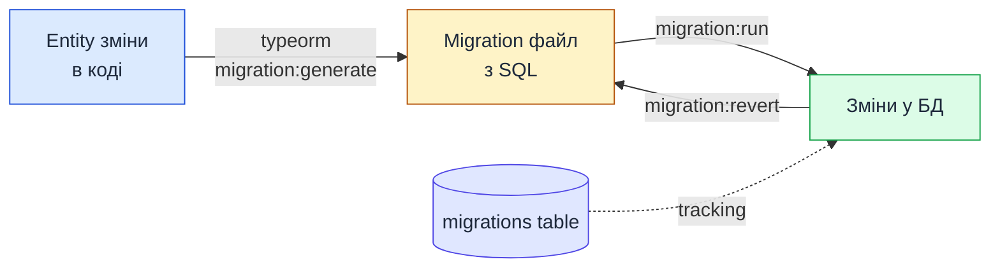

# Керування міграціями бази даних

::card-group

::card{title="🎯 Мета лекції" icon="i-lucide-target"}

- Опанувати концепцію міграцій (*migrations*) як інструменту версіонування схеми бази даних для безпечного оновлення production систем.
- Зрозуміти небезпеку використання `synchronize: true` у production середовищі та критичність ручного керування змінами схеми.
- Навчитися налаштовувати TypeORM CLI для автоматичної генерації міграцій з Entity класів та створення власних міграцій.
- Освоїти команди для застосування міграцій (`migration:run`), відкату змін (`migration:revert`) та перегляду історії міграцій.
- Вивчити best practices для роботи з міграціями у командній розробці: атомарність, backward compatibility, тестування та rollback стратегії.

::

::card{title="🔑 Ключові терміми" icon="i-lucide-key"}

- **Migration (Міграція):** файл з SQL-командами або TypeORM операціями для зміни схеми бази даних (додавання таблиць, колонок, індексів тощо).
- **Schema Versioning (Версіонування схеми):** процес відстеження змін структури БД через нумеровані міграційні файли.
- **Up Method (Метод up):** функція у міграції, що містить SQL-команди для **застосування** змін до БД.
- **Down Method (Метод down):** функція у міграції, що містить SQL-команди для **відкату** змін (rollback).
- **Migration Table (Таблиця міграцій):** службова таблиця `migrations` у БД, що зберігає список застосованих міграцій з timestamp для tracking.
- **Backward Compatible Migration (Зворотньо сумісна міграція):** міграція, яка не ламає роботу старої версії коду при розгортанні нової версії.

::

::

---

## Навіщо потрібні міграції

### Версіонування схеми бази даних

**Міграції** — це інструмент для відстеження та застосування змін у структурі бази даних через версійовані файли. Кожна міграція представляє **одну зміну** схеми БД (наприклад, додавання таблиці, створення індексу, зміна типу колонки) та має **унікальний timestamp**, що визначає порядок виконання.

::mermaid



::

**Аналогія з Git:**

- **Git** версіонує код через commits.
- **Міграції** версіонують структуру БД через migration files.

Кожна міграція — це "commit" для схеми БД, що дозволяє:

1. Бачити **історію змін** структури БД.
2. **Відкотити** зміни у разі помилки.
3. **Застосувати** зміни на різних середовищах (dev, staging, production) у правильному порядку.

### Синхронізація змін між розробниками

У командній розробці кілька розробників можуть одночасно змінювати Entity класи. Міграції дозволяють **синхронізувати** ці зміни між усіма учасниками команди.

**Сценарій без міграцій:**

1. Розробник A додає нову колонку `bio` до `User` entity у своїй локальній БД.
2. Розробник B завантажує зміни з Git та бачить нову колонку у Entity класі.
3. Розробник B запускає застосунок, але **його локальна БД не має колонки `bio`** → помилка при виконанні запитів.

**Сценарій з міграціями:**

1. Розробник A додає колонку `bio` до Entity, генерує міграцію та комітить **і Entity, і migration file** до Git.
2. Розробник B завантажує зміни з Git та виконує `npm run migration:run`.
3. Міграція автоматично додає колонку `bio` до локальної БД розробника B.

::tip

**Правило командної роботи:**  
Кожна зміна Entity класу має супроводжуватись **відповідною міграцією**. Міграційні файли комітяться до Git разом з кодом.

::

### Безпечне оновлення production БД

У production системах зміна схеми БД — це **критична операція**, що може призвести до простою сервісу або втрати даних. Міграції забезпечують **контрольоване** та **відтворюване** оновлення схеми.

**Переваги міграцій для production:**

1. **Передбачуваність:** Ви точно знаєте, які SQL-команди будуть виконані.
2. **Тестування:** Міграції можна спочатку застосувати на staging середовищі для перевірки.
3. **Rollback:** У разі помилки можна відкотити зміни через `migration:revert`.
4. **Аудит:** Історія міграцій зберігається у таблиці `migrations` для відстеження змін.

**Альтернатива — `synchronize: true` (небезпечно у production):**

TypeORM має опцію `synchronize: true`, що **автоматично** змінює схему БД при запуску застосунку. Це зручно для розробки, але **катастрофічно небезпечно** для production (докладніше в наступному розділі).

### Історія змін та можливість rollback

Міграції створюють **аудит trail** (аудиторський слід) змін схеми БД. Кожна міграція має:

- **Унікальний timestamp** у назві файлу (наприклад, `1709728345123-AddBioToUser.ts`).
- **Метод `up()`** для застосування змін.
- **Метод `down()`** для відкату змін.

**Приклад історії міграцій:**

```
migrations/
├── 1709728345123-InitialSchema.ts       # Створення початкових таблиць
├── 1709828456789-AddUserProfile.ts      # Додавання таблиці profiles
├── 1709928567890-AddPostTags.ts         # Додавання Many-to-Many зв'язку
└── 1710028678901-AddEmailIndex.ts       # Створення індексу на email
```

**Rollback сценарій:**

```bash
# Застосувати всі міграції
npm run migration:run

# Виявлено помилку у останній міграції
# Відкат останньої міграції
npm run migration:revert

# Виправлення коду міграції
# Повторне застосування
npm run migration:run
```

### Проблеми з `synchronize: true`

Опція `synchronize: true` у DataSource налаштуваннях змушує TypeORM **автоматично** оновлювати схему БД при запуску застосунку, щоб вона відповідала Entity класам.

**Чому це зручно у розробці:**

```typescript
const dataSource = new DataSource({
  type: 'postgres',
  host: 'localhost',
  database: 'mydb',
  synchronize: true,  // Автоматична синхронізація схеми
  entities: [User, Post, Comment],
});
```

При запуску застосунку TypeORM:

1. Порівнює Entity класи з поточною схемою БД.
2. Автоматично створює/видаляє/змінює таблиці та колонки.
3. Не потребує ручного написання SQL або міграцій.

**Чому це катастрофічно небезпечно у production:**

::caution

**НІКОЛИ не використовуйте `synchronize: true` у production!**

Ця опція може:

1. **Видалити колонки**, які більше не існують у Entity (втрата даних).
2. **Видалити таблиці**, якщо Entity були видалені з коду.
3. **Змінити типи колонок** без міграції даних (наприклад, `VARCHAR` → `INT` може призвести до втрати даних).
4. **Виконати зміни без попередження** при кожному перезапуску застосунку.

::

**Приклад катастрофи:**

```typescript
// У минулому: Entity мала поле middleName
@Entity('users')
export class User {
  @Column()
  firstName: string;

  @Column()
  middleName: string;  // ❌ Розробник видалив це поле

  @Column()
  lastName: string;
}

// Після видалення middleName з Entity та перезапуску з synchronize: true
// TypeORM виконає: ALTER TABLE users DROP COLUMN middle_name;
// Всі дані у цій колонці ВТРАЧЕНІ!
```

::note

**Правило для production:**  
Завжди встановлюйте `synchronize: false` у production середовищі та використовуйте міграції для керування змінами схеми.

::

---

## Небезпека synchronize у production

### Автоматичне видалення даних

TypeORM з `synchronize: true` **не зберігає дані** при видаленні колонок або зміні типів. Він просто виконує `DROP COLUMN` або `ALTER COLUMN TYPE`, що призводить до безповоротної втрати інформації.

**Приклад 1 — видалення колонки:**

```typescript
// До: Entity мала поле age
@Entity('users')
export class User {
  @Column({ type: 'int' })
  age: number;  // Розробник вирішив видалити вік
}

// Після видалення поля з Entity
@Entity('users')
export class User {
  // age більше немає
}

// TypeORM виконає: DROP COLUMN age
// SQL: ALTER TABLE users DROP COLUMN age;
// Результат: втрачено вік усіх користувачів у БД!
```

**Приклад 2 — зміна типу колонки:**

```typescript
// До: ID був числовим
@Entity('users')
export class User {
  @PrimaryGeneratedColumn()
  id: number;
}

// Після: розробник змінив на UUID
@Entity('users')
export class User {
  @PrimaryGeneratedColumn('uuid')
  id: string;
}

// TypeORM спробує виконати: ALTER TABLE users ALTER COLUMN id TYPE UUID;
// PostgreSQL: ERROR - cannot cast type integer to uuid
// Застосунок не запуститься!
```

### Непередбачувані зміни схеми

TypeORM може інтерпретувати зміни у Entity класах по-різному залежно від контексту, що призводить до **непередбачуваної поведінки**.

**Приклад — перейменування колонки vs видалення + створення:**

```typescript
// До:
@Column()
userName: string;

// Після: розробник перейменував властивість
@Column()
username: string;  // Змінено з userName на username
```

**Що зробить TypeORM:**

```sql
-- TypeORM не розуміє, що це перейменування!
-- Він бачить це як видалення старої колонки та створення нової:
ALTER TABLE users DROP COLUMN user_name;
ALTER TABLE users ADD COLUMN username VARCHAR(255);

-- Результат: втрачено всі дані у user_name!
```

**Правильний спосіб через міграцію:**

```sql
-- Міграція явно перейменовує колонку
ALTER TABLE users RENAME COLUMN user_name TO username;
```

### Відсутність контролю

З `synchronize: true` ви **не контролюєте**, які саме SQL-команди виконуються при запуску застосунку. TypeORM приймає рішення автоматично, що може призвести до:

- **Блокування таблиць** на час виконання `ALTER TABLE` (критично для високонавантажених систем).
- **Створення індексів** під час роботи сервісу, що уповільнює запити.
- **Видалення constraints** без попередження.

### Неможливість rollback

Якщо `synchronize: true` виконав руйнівну операцію (наприклад, видалив колонку), **не існує механізму автоматичного rollback**. Єдиний спосіб відновити дані — з backup БД.

**Порівняння з міграціями:**

| Характеристика         | synchronize: true           | Міграції                        |
|------------------------|-----------------------------|--------------------------------|
| **Контроль SQL**       | Немає                       | Повний (перегляд перед виконанням) |
| **Rollback**           | Неможливий                  | Через `migration:revert`        |
| **Тестування**         | Неможливе                   | На staging перед production     |
| **Історія змін**       | Немає                       | У Git + таблиця `migrations`    |
| **Безпека даних**      | Високий ризик втрати        | Контрольована міграція даних    |

### Best practice: synchronize тільки у development

::tip

**Рекомендована конфігурація:**

```typescript
const dataSource = new DataSource({
  type: 'postgres',
  host: process.env.DB_HOST,
  database: process.env.DB_NAME,
  synchronize: process.env.NODE_ENV === 'development',  // ✅ Тільки у dev
  migrationsRun: process.env.NODE_ENV === 'production', // ✅ Автоміграції у prod
  migrations: ['dist/migrations/*.js'],
  entities: [User, Post, Comment],
});
```

**Пояснення:**

- **Development:** `synchronize: true` дозволяє швидко експериментувати з Entity без написання міграцій.
- **Production:** `synchronize: false` + `migrationsRun: true` автоматично застосовує міграції при запуску, але **не змінює схему** без явних migration files.

::

---

## Налаштування Data Source для CLI

### Створення файлу `data-source.ts`

TypeORM CLI потребує окремого файлу конфігурації DataSource для виконання команд генерації та застосування міграцій. Цей файл має експортувати **ініціалізований** екземпляр `DataSource`.

**Структура проєкту:**

```
my-project/
├── src/
│   ├── entities/
│   │   ├── user.entity.ts
│   │   ├── post.entity.ts
│   │   └── tag.entity.ts
│   ├── migrations/        # Тут зберігаються міграції
│   └── data-source.ts     # ← Файл конфігурації для CLI
├── package.json
└── tsconfig.json
```

**Приклад `src/data-source.ts`:**

```typescript
import { DataSource } from 'typeorm';
import { config } from 'dotenv';

// Завантаження змінних оточення
config();

export const AppDataSource = new DataSource({
  type: 'postgres',
  host: process.env.DB_HOST || 'localhost',
  port: parseInt(process.env.DB_PORT || '5432', 10),
  username: process.env.DB_USERNAME || 'postgres',
  password: process.env.DB_PASSWORD || 'password',
  database: process.env.DB_NAME || 'mydb',
  
  // ===== Налаштування для міграцій =====
  synchronize: false,  // ✅ Вимкнено для production
  logging: process.env.NODE_ENV === 'development',  // Логування SQL у dev
  
  // Шлях до Entity класів
  entities: ['src/entities/**/*.entity.ts'],
  
  // Шлях до міграцій (TypeScript файли у dev, JavaScript у prod)
  migrations: ['src/migrations/**/*.ts'],
  
  // Шлях для створення нових міграцій
  migrationsTableName: 'migrations',  // Назва таблиці для tracking
});
```

::note

**Чому окремий файл?**  
У NestJS застосунках DataSource налаштовується через `TypeOrmModule.forRoot()` у модулі. Проте TypeORM CLI не має доступу до NestJS контексту, тому потрібен окремий файл для CLI команд.

::

### Конфігурація підключення

**Використання змінних оточення:**

Створіть файл `.env` для локальних налаштувань:

```env
DB_HOST=localhost
DB_PORT=5432
DB_USERNAME=postgres
DB_PASSWORD=mypassword
DB_NAME=myapp_dev
NODE_ENV=development
```

**Production налаштування (у CI/CD або Docker):**

```env
DB_HOST=production-db.example.com
DB_PORT=5432
DB_USERNAME=app_user
DB_PASSWORD=secure_password
DB_NAME=myapp_production
NODE_ENV=production
```

### Шлях до entities та migrations

**Важливе правило шляхів:**

- **У development:** використовуйте `.ts` файли (TypeScript).
- **У production:** використовуйте `.js` файли (скомпільовані JavaScript).

**Універсальна конфігурація:**

```typescript
export const AppDataSource = new DataSource({
  // ...
  entities: [
    process.env.NODE_ENV === 'production'
      ? 'dist/entities/**/*.entity.js'  // Після компіляції
      : 'src/entities/**/*.entity.ts',   // У development
  ],
  migrations: [
    process.env.NODE_ENV === 'production'
      ? 'dist/migrations/**/*.js'
      : 'src/migrations/**/*.ts',
  ],
});
```

### Експорт DataSource instance

TypeORM CLI очікує **named export** з назвою, що закінчується на `DataSource`:

```typescript
// ✅ Правильно
export const AppDataSource = new DataSource({ /* config */ });

// ❌ Неправильно (CLI не знайде)
export default new DataSource({ /* config */ });
export const dataSource = new DataSource({ /* config */ });
```

**Використання у NestJS застосунку:**

```typescript [src/app.module.ts]
import { Module } from '@nestjs/common';
import { TypeOrmModule } from '@nestjs/typeorm';
import { AppDataSource } from './data-source';

@Module({
  imports: [
    TypeOrmModule.forRoot(AppDataSource.options),  // Використання тієї ж конфігурації
  ],
})
export class AppModule {}
```


---

## Налаштування npm scripts

### `typeorm` CLI через package.json

TypeORM надає CLI (*Command Line Interface*) для виконання операцій з міграціями. Для зручності команди CLI додаються до секції `scripts` у `package.json`.

**Встановлення залежностей:**

```bash
npm install typeorm reflect-metadata pg
npm install --save-dev ts-node @types/node
```

**Базові scripts у `package.json`:**

```json
{
  "scripts": {
    "typeorm": "typeorm-ts-node-commonjs",
    "migration:generate": "npm run typeorm -- migration:generate -d src/data-source.ts",
    "migration:create": "npm run typeorm -- migration:create",
    "migration:run": "npm run typeorm -- migration:run -d src/data-source.ts",
    "migration:revert": "npm run typeorm -- migration:revert -d src/data-source.ts",
    "migration:show": "npm run typeorm -- migration:show -d src/data-source.ts"
  }
}
```

::note

**Пояснення параметрів:**

- `typeorm-ts-node-commonjs` — обгортка для запуску TypeORM CLI з TypeScript через `ts-node`.
- `-d src/data-source.ts` — шлях до файлу конфігурації DataSource.
- `--` — передача аргументів до команди `typeorm` (наприклад, `migration:generate src/migrations/AddBio`).

::

### Script для generation: `migration:generate`

Команда `migration:generate` **автоматично** порівнює поточні Entity класи зі схемою БД та генерує міграцію з необхідними SQL-командами для синхронізації.

**Синтаксис:**

```bash
npm run migration:generate src/migrations/MigrationName
```

**Приклад:**

```bash
npm run migration:generate src/migrations/AddBioToUser
```

**Що станеться:**

1. TypeORM завантажує Entity класи з `src/entities/`.
2. Підключається до БД та зчитує поточну схему.
3. Порівнює Entity з БД та виявляє відмінності.
4. Генерує файл `src/migrations/<timestamp>-AddBioToUser.ts` з методами `up()` та `down()`.

### Script для creation: `migration:create`

Команда `migration:create` створює **порожню** міграцію з базовою структурою класу. Використовується для написання власних SQL-команд.

**Синтаксис:**

```bash
npm run migration:create src/migrations/MigrationName
```

**Приклад:**

```bash
npm run migration:create src/migrations/CreateFullTextSearchIndex
```

**Результат:**

```typescript
import { MigrationInterface, QueryRunner } from 'typeorm';

export class CreateFullTextSearchIndex1709728345123 implements MigrationInterface {
  public async up(queryRunner: QueryRunner): Promise<void> {
    // TODO: Написати SQL для застосування змін
  }

  public async down(queryRunner: QueryRunner): Promise<void> {
    // TODO: Написати SQL для відкату змін
  }
}
```

### Script для run: `migration:run`

Команда `migration:run` застосовує **всі непримінені міграції** до БД у порядку їх timestamp.

**Синтаксис:**

```bash
npm run migration:run
```

**Що станеться:**

1. TypeORM перевіряє таблицю `migrations` у БД для отримання списку застосованих міграцій.
2. Порівнює з файлами у директорії `src/migrations/`.
3. Виконує метод `up()` для кожної нової міграції у транзакції.
4. Додає запис про міграцію до таблиці `migrations`.

### Script для revert: `migration:revert`

Команда `migration:revert` відкочує **останню застосовану міграцію** через виконання методу `down()`.

**Синтаксис:**

```bash
npm run migration:revert
```

**Для відкату кількох міграцій:**

```bash
npm run migration:revert  # Відкат останньої
npm run migration:revert  # Відкат передостанньої
npm run migration:revert  # Відкат ще однієї
```

::tip

**Додаткові корисні scripts:**

```json
{
  "scripts": {
    "migration:show": "npm run typeorm -- migration:show -d src/data-source.ts",
    "schema:drop": "npm run typeorm -- schema:drop -d src/data-source.ts",
    "schema:sync": "npm run typeorm -- schema:sync -d src/data-source.ts"
  }
}
```

- **`migration:show`** — показує список застосованих та непримінених міграцій.
- **`schema:drop`** — видаляє всю схему БД (для очищення у dev).
- **`schema:sync`** — синхронізує схему БД з Entity (еквівалент `synchronize: true`).

::

---

## Генерація міграцій

### Команда `typeorm migration:generate`

Автоматична генерація міграцій — це найзручніший спосіб створення migration files, оскільки TypeORM сам аналізує Entity класи та генерує необхідні SQL-команди.

**Крок 1 — зміна Entity:**

```typescript [src/entities/user.entity.ts]
@Entity('users')
export class User {
  @PrimaryGeneratedColumn()
  id: number;

  @Column()
  email: string;

  // ===== Додана нова колонка =====
  @Column({ type: 'text', nullable: true })
  bio: string;
}
```

**Крок 2 — генерація міграції:**

```bash
npm run migration:generate src/migrations/AddBioToUser
```

**Вивід у консоль:**

```
Migration /path/to/project/src/migrations/1709728345123-AddBioToUser.ts has been generated successfully.
```

### Автоматичне порівняння entities зі схемою БД

TypeORM виконує наступні кроки:

1. **Завантаження Entity метаданих** з файлів у `src/entities/`.
2. **Підключення до БД** та отримання поточної схеми через SQL-запити (для PostgreSQL: `information_schema.columns`).
3. **Порівняння** Entity з БД:
   - Відсутні таблиці → `CREATE TABLE`.
   - Відсутні колонки → `ALTER TABLE ADD COLUMN`.
   - Зайві колонки (видалені з Entity) → `ALTER TABLE DROP COLUMN`.
   - Зміни типів колонок → `ALTER TABLE ALTER COLUMN TYPE`.
   - Зміни індексів → `CREATE INDEX` / `DROP INDEX`.
   - Зміни зовнішніх ключів → `ALTER TABLE ADD CONSTRAINT` / `DROP CONSTRAINT`.

### Генерація SQL для sync

TypeORM генерує SQL-команди у методах `up()` та `down()` згенерованої міграції.

**Приклад згенерованої міграції:**

```typescript [src/migrations/1709728345123-AddBioToUser.ts]
import { MigrationInterface, QueryRunner } from 'typeorm';

export class AddBioToUser1709728345123 implements MigrationInterface {
  name = 'AddBioToUser1709728345123';

  public async up(queryRunner: QueryRunner): Promise<void> {
    await queryRunner.query(`
      ALTER TABLE "users" ADD "bio" text
    `);
  }

  public async down(queryRunner: QueryRunner): Promise<void> {
    await queryRunner.query(`
      ALTER TABLE "users" DROP COLUMN "bio"
    `);
  }
}
```

**Складніший приклад — додавання таблиці та зв'язку:**

```typescript [src/migrations/1709828456789-AddUserProfile.ts]
export class AddUserProfile1709828456789 implements MigrationInterface {
  name = 'AddUserProfile1709828456789';

  public async up(queryRunner: QueryRunner): Promise<void> {
    await queryRunner.query(`
      CREATE TABLE "profiles" (
        "id" SERIAL NOT NULL,
        "first_name" character varying(100) NOT NULL,
        "last_name" character varying(100) NOT NULL,
        "avatar_url" character varying(500),
        "user_id" integer NOT NULL,
        CONSTRAINT "UQ_profiles_user_id" UNIQUE ("user_id"),
        CONSTRAINT "PK_profiles" PRIMARY KEY ("id")
      )
    `);

    await queryRunner.query(`
      ALTER TABLE "profiles"
      ADD CONSTRAINT "FK_profiles_user"
      FOREIGN KEY ("user_id")
      REFERENCES "users"("id")
      ON DELETE CASCADE
    `);

    await queryRunner.query(`
      CREATE INDEX "IDX_profiles_user_id" ON "profiles" ("user_id")
    `);
  }

  public async down(queryRunner: QueryRunner): Promise<void> {
    await queryRunner.query(`DROP INDEX "IDX_profiles_user_id"`);
    await queryRunner.query(`ALTER TABLE "profiles" DROP CONSTRAINT "FK_profiles_user"`);
    await queryRunner.query(`DROP TABLE "profiles"`);
  }
}
```

### Іменування міграцій з timestamp

TypeORM автоматично додає **unix timestamp** до назви класу та файлу міграції:

```
<timestamp>-<MigrationName>.ts
```

**Приклад:**

```
1709728345123-AddBioToUser.ts
```

**Timestamp гарантує:**

1. **Унікальність** назви файлу (два розробники не створять файли з однаковою назвою).
2. **Порядок виконання** (міграції застосовуються у порядку зростання timestamp).
3. **Аудит trail** (за timestamp можна визначити, коли була створена міграція).

### Перегляд згенерованих файлів

Після генерації міграції **обов'язково** переглянете згенерований SQL-код перед застосуванням.

**Перевірка:**

```bash
# Відкрити файл у редакторі
code src/migrations/1709728345123-AddBioToUser.ts

# Або переглянути список міграцій
npm run migration:show
```

**Вивід `migration:show`:**

```
 [ ] AddBioToUser1709728345123  (pending)
 [X] InitialSchema1709628234012  (ran on 2026-09-01)
 [X] AddUserProfile1709728234123 (ran on 2026-09-02)
```

::warning

**Важливо перевіряти згенерований SQL:**  
TypeORM може генерувати **руйнівні** операції (наприклад, `DROP COLUMN`), якщо ви видалили властивість з Entity. Завжди перевіряйте згенеровані міграції перед застосуванням, особливо у production.

::

---

## Створення порожньої міграції

### Команда `typeorm migration:create`

Команда `migration:create` створює порожню міграцію для написання власних SQL-команд. Використовується у випадках, коли автоматична генерація не підходить.

**Синтаксис:**

```bash
npm run migration:create src/migrations/MigrationName
```

**Приклад:**

```bash
npm run migration:create src/migrations/SeedInitialData
```

### Коли використовувати замість generate

**Використовуйте `migration:create` коли:**

1. **Міграція даних:** Потрібно перенести дані з однієї колонки в іншу з трансформацією.
2. **Складні SQL-операції:** Наприклад, створення full-text search індексів, тригерів, stored procedures.
3. **Seed data:** Вставка початкових даних (наприклад, ролі, налаштування, тестові користувачі).
4. **Множинні операції:** Коли потрібно виконати кілька не пов'язаних SQL-команд у одній міграції.
5. **Backwards incompatible зміни:** Коли TypeORM не може правильно згенерувати rollback.

**Використовуйте `migration:generate` коли:**

- Зміни у Entity відповідають простим операціям (додавання колонки, створення таблиці, індекси).
- TypeORM може правильно згенерувати SQL для синхронізації.

### Структура migration класу

Порожня міграція має базову структуру:

```typescript [src/migrations/1709928567890-SeedInitialData.ts]
import { MigrationInterface, QueryRunner } from 'typeorm';

export class SeedInitialData1709928567890 implements MigrationInterface {
  public async up(queryRunner: QueryRunner): Promise<void> {
    // TODO: Написати SQL для застосування змін
  }

  public async down(queryRunner: QueryRunner): Promise<void> {
    // TODO: Написати SQL для відкату змін
  }
}
```

**Інтерфейс `MigrationInterface`:**

- **`up()`** — виконується при застосуванні міграції (`migration:run`).
- **`down()`** — виконується при відкаті міграції (`migration:revert`).
- **`queryRunner`** — об'єкт для виконання SQL-запитів.

### Методи `up()` та `down()`

**Метод `up()` — застосування змін:**

```typescript
public async up(queryRunner: QueryRunner): Promise<void> {
  // Виконання одного SQL-запиту
  await queryRunner.query(`
    ALTER TABLE users ADD COLUMN last_login TIMESTAMP
  `);

  // Виконання кількох запитів
  await queryRunner.query(`CREATE INDEX idx_users_email ON users(email)`);
  await queryRunner.query(`CREATE INDEX idx_users_created_at ON users(created_at)`);
}
```

**Метод `down()` — відкат змін:**

```typescript
public async down(queryRunner: QueryRunner): Promise<void> {
  // Відкат має виконувати операції у ЗВОРОТНОМУ порядку
  await queryRunner.query(`DROP INDEX idx_users_created_at`);
  await queryRunner.query(`DROP INDEX idx_users_email`);
  await queryRunner.query(`ALTER TABLE users DROP COLUMN last_login`);
}
```

::tip

**Правило написання `down()`:**  
Операції у `down()` мають бути **дзеркальним відображенням** операцій у `up()` у **зворотному порядку**. Якщо `up()` створює індекс, то `down()` видаляє індекс. Якщо `up()` додає колонку, то `down()` видаляє колонку.

::

### Написання власних SQL команд

**Приклад 1 — вставка початкових даних:**

```typescript [src/migrations/1709928567890-SeedRoles.ts]
export class SeedRoles1709928567890 implements MigrationInterface {
  public async up(queryRunner: QueryRunner): Promise<void> {
    await queryRunner.query(`
      INSERT INTO roles (name, description) VALUES
        ('admin', 'Administrator with full access'),
        ('editor', 'Can create and edit content'),
        ('viewer', 'Can only view content')
    `);
  }

  public async down(queryRunner: QueryRunner): Promise<void> {
    await queryRunner.query(`
      DELETE FROM roles WHERE name IN ('admin', 'editor', 'viewer')
    `);
  }
}
```

**Приклад 2 — міграція даних з трансформацією:**

```typescript [src/migrations/1710028678901-SplitFullName.ts]
export class SplitFullName1710028678901 implements MigrationInterface {
  public async up(queryRunner: QueryRunner): Promise<void> {
    // Додаємо нові колонки
    await queryRunner.query(`
      ALTER TABLE users
      ADD COLUMN first_name VARCHAR(100),
      ADD COLUMN last_name VARCHAR(100)
    `);

    // Міграція даних: розбиваємо full_name на first_name та last_name
    await queryRunner.query(`
      UPDATE users
      SET
        first_name = SPLIT_PART(full_name, ' ', 1),
        last_name = SPLIT_PART(full_name, ' ', 2)
      WHERE full_name IS NOT NULL
    `);

    // Видаляємо стару колонку
    await queryRunner.query(`ALTER TABLE users DROP COLUMN full_name`);
  }

  public async down(queryRunner: QueryRunner): Promise<void> {
    // Додаємо стару колонку назад
    await queryRunner.query(`ALTER TABLE users ADD COLUMN full_name VARCHAR(255)`);

    // Відновлюємо дані: об'єднуємо first_name та last_name
    await queryRunner.query(`
      UPDATE users
      SET full_name = CONCAT(first_name, ' ', last_name)
      WHERE first_name IS NOT NULL
    `);

    // Видаляємо нові колонки
    await queryRunner.query(`
      ALTER TABLE users
      DROP COLUMN first_name,
      DROP COLUMN last_name
    `);
  }
}
```

**Приклад 3 — створення full-text search індексу:**

```typescript [src/migrations/1710128789012-AddFullTextSearch.ts]
export class AddFullTextSearch1710128789012 implements MigrationInterface {
  public async up(queryRunner: QueryRunner): Promise<void> {
    // Додаємо tsvector колонку для PostgreSQL full-text search
    await queryRunner.query(`
      ALTER TABLE posts
      ADD COLUMN search_vector tsvector
    `);

    // Заповнюємо search_vector даними
    await queryRunner.query(`
      UPDATE posts
      SET search_vector = to_tsvector('english', title || ' ' || content)
    `);

    // Створюємо GIN індекс для швидкого пошуку
    await queryRunner.query(`
      CREATE INDEX idx_posts_search_vector ON posts USING GIN(search_vector)
    `);

    // Створюємо тригер для автоматичного оновлення search_vector
    await queryRunner.query(`
      CREATE FUNCTION posts_search_vector_update() RETURNS trigger AS $$
      BEGIN
        NEW.search_vector := to_tsvector('english', NEW.title || ' ' || NEW.content);
        RETURN NEW;
      END
      $$ LANGUAGE plpgsql;
    `);

    await queryRunner.query(`
      CREATE TRIGGER trig_posts_search_vector_update
      BEFORE INSERT OR UPDATE ON posts
      FOR EACH ROW EXECUTE FUNCTION posts_search_vector_update()
    `);
  }

  public async down(queryRunner: QueryRunner): Promise<void> {
    await queryRunner.query(`DROP TRIGGER IF EXISTS trig_posts_search_vector_update ON posts`);
    await queryRunner.query(`DROP FUNCTION IF EXISTS posts_search_vector_update`);
    await queryRunner.query(`DROP INDEX idx_posts_search_vector`);
    await queryRunner.query(`ALTER TABLE posts DROP COLUMN search_vector`);
  }
}
```

::note

**Використання `queryRunner.query()`:**  
Метод `queryRunner.query()` приймає **сирий SQL** як рядок. Для складних запитів з параметрами використовуйте параметризовані запити для захисту від SQL injection:

```typescript
await queryRunner.query(
  `INSERT INTO users (email, password_hash) VALUES ($1, $2)`,
  ['user@example.com', 'hashedPassword']
);
```

::


---

## Застосування міграцій

### Команда `typeorm migration:run`

Команда `migration:run` застосовує всі непримінені міграції до БД у порядку їх timestamp.

**Виконання:**

```bash
npm run migration:run
```

**Вивід у консоль:**

```
query: SELECT * FROM "migrations" "migrations" ORDER BY "id" DESC
query: CREATE TABLE IF NOT EXISTS "migrations" ("id" SERIAL NOT NULL, "timestamp" bigint NOT NULL, "name" character varying NOT NULL, CONSTRAINT "PK_migrations" PRIMARY KEY ("id"))
query: SELECT * FROM "migrations" "migrations" ORDER BY "id" DESC
3 migrations are already loaded in the database.
1 migrations were found in the source code.
AddBioToUser1709728345123 is the last executed migration. It was executed on Mon Sep 01 2026 10:45:45 GMT+0300.
1 migrations are new migrations must be executed.
query: START TRANSACTION
query: ALTER TABLE "users" ADD "bio" text
query: INSERT INTO "migrations"("timestamp", "name") VALUES ($1, $2) -- PARAMETERS: [1709728345123,"AddBioToUser1709728345123"]
query: COMMIT
Migration AddBioToUser1709728345123 has been executed successfully.
```

### Таблиця `migrations` для tracking

TypeORM автоматично створює службову таблицю `migrations` при першому запуску `migration:run`. Ця таблиця зберігає **список застосованих міграцій**.

**Структура таблиці `migrations`:**

```sql
CREATE TABLE migrations (
    id SERIAL PRIMARY KEY,
    timestamp BIGINT NOT NULL,  -- Unix timestamp з назви міграції
    name VARCHAR NOT NULL        -- Повна назва класу міграції
);
```

**Приклад даних:**

| id  | timestamp      | name                         |
|-----|----------------|------------------------------|
| 1   | 1709628234012  | InitialSchema1709628234012   |
| 2   | 1709728234123  | AddUserProfile1709728234123  |
| 3   | 1709728345123  | AddBioToUser1709728345123    |

**Як це працює:**

1. При запуску `migration:run` TypeORM зчитує таблицю `migrations`.
2. Порівнює з файлами міграцій у директорії `src/migrations/`.
3. Виконує лише ті міграції, яких **немає** у таблиці `migrations`.
4. Після успішного виконання додає запис до таблиці.

### Транзакційність міграцій

Кожна міграція виконується у **транзакції** (*transaction*). Це означає, що якщо будь-який SQL-запит у методі `up()` завершиться помилкою, **всі зміни відкатяться** автоматично.

**Приклад помилки у міграції:**

```typescript
public async up(queryRunner: QueryRunner): Promise<void> {
  await queryRunner.query(`ALTER TABLE users ADD COLUMN age INT`);       // ✅ Виконано
  await queryRunner.query(`ALTER TABLE users ADD COLUMN invalid INVALID`); // ❌ Помилка синтаксису
  await queryRunner.query(`ALTER TABLE users ADD COLUMN bio TEXT`);      // ❌ Не виконається
}
```

**Результат:**

```
query: START TRANSACTION
query: ALTER TABLE users ADD COLUMN age INT
query: ALTER TABLE users ADD COLUMN invalid INVALID
QueryFailedError: syntax error at or near "INVALID"
query: ROLLBACK

Migration AddBioToUser1709728345123 has failed, changes reverted.
```

**Важливість транзакційності:**

- Гарантує **атомарність** міграції — або всі зміни застосовуються, або жодна.
- Запобігає **частковій міграції** БД (коли половина змін застосована, а половина ні).
- Дозволяє **безпечно виправити** помилки у міграції та перезапустити.

::caution

**Обмеження транзакційності:**  
Деякі SQL-операції **не можуть бути відкачені** у транзакції (наприклад, `CREATE DATABASE`, `DROP DATABASE`, деякі `ALTER TABLE` у MySQL). У таких випадках потрібна особлива обережність.

::

### Логування процесу

TypeORM логує всі SQL-запити під час міграцій, що дозволяє відстежувати прогрес та діагностувати помилки.

**Увімкнення логування:**

```typescript [src/data-source.ts]
export const AppDataSource = new DataSource({
  // ...
  logging: true,  // ✅ Логувати всі SQL-запити
  logger: 'advanced-console',  // Детальний вивід
});
```

**Приклад виводу:**

```
query: SELECT * FROM "migrations" ORDER BY "id" DESC
query: START TRANSACTION
query: ALTER TABLE "users" ADD "bio" text
Migration AddBioToUser1709728345123 has been executed successfully.
query: COMMIT
```

### Обробка помилок під час міграції

Якщо міграція завершилася помилкою, TypeORM:

1. **Відкочує** всі зміни у транзакції.
2. **Не додає** запис до таблиці `migrations`.
3. **Виводить помилку** у консоль з деталями SQL-запиту, що спричинив збій.

**Алгоритм виправлення помилки:**

1. Прочитайте повідомлення про помилку та знайдіть проблемний SQL-запит.
2. Виправте міграційний файл (змініть SQL або видаліть проблемний рядок).
3. Перезапустіть `npm run migration:run`.

**Приклад:**

```bash
# Помилка у міграції
npm run migration:run
# Error: column "bio" already exists

# Виправлення: додати IF NOT EXISTS або видалити дублікат
# У файлі міграції:
await queryRunner.query(`ALTER TABLE users ADD COLUMN IF NOT EXISTS bio TEXT`);

# Повторний запуск
npm run migration:run
# Migration AddBioToUser1709728345123 has been executed successfully.
```

---

## Відкат міграцій

### Команда `typeorm migration:revert`

Команда `migration:revert` відкочує **останню застосовану міграцію** через виконання методу `down()`.

**Виконання:**

```bash
npm run migration:revert
```

**Вивід у консоль:**

```
query: SELECT * FROM "migrations" "migrations" ORDER BY "id" DESC
1 migrations are already loaded in the database.
AddBioToUser1709728345123 is the last executed migration. It is going to be reverted now.
query: START TRANSACTION
query: ALTER TABLE "users" DROP COLUMN "bio"
query: DELETE FROM "migrations" WHERE "timestamp" = $1 AND "name" = $2 -- PARAMETERS: [1709728345123,"AddBioToUser1709728345123"]
query: COMMIT
Migration AddBioToUser1709728345123 has been reverted successfully.
```

### Виконання методу `down()`

TypeORM виконує метод `down()` з останньої міграції у таблиці `migrations` та видаляє відповідний запис з таблиці.

**Приклад міграції з rollback:**

```typescript
export class AddBioToUser1709728345123 implements MigrationInterface {
  public async up(queryRunner: QueryRunner): Promise<void> {
    await queryRunner.query(`ALTER TABLE "users" ADD "bio" text`);
  }

  public async down(queryRunner: QueryRunner): Promise<void> {
    await queryRunner.query(`ALTER TABLE "users" DROP COLUMN "bio"`);
  }
}
```

### Відкат останньої застосованої міграції

TypeORM завжди відкочує **останню** міграцію у порядку застосування. Порядок визначається за timestamp у таблиці `migrations`.

**Приклад:**

```sql
-- Таблиця migrations
id | timestamp      | name
1  | 1709628234012  | InitialSchema1709628234012
2  | 1709728234123  | AddUserProfile1709728234123
3  | 1709728345123  | AddBioToUser1709728345123  ← Буде відкачена першою
```

### Множинний rollback

Для відкату **кількох** міграцій виконайте команду `migration:revert` кілька разів:

```bash
npm run migration:revert  # Відкат AddBioToUser1709728345123
npm run migration:revert  # Відкат AddUserProfile1709728234123
npm run migration:revert  # Відкат InitialSchema1709628234012
```

::warning

**Обережно з відкатом у production:**  
Відкат міграцій у production може призвести до **втрати даних**, якщо метод `down()` містить `DROP COLUMN` або `DROP TABLE`. Завжди тестуйте rollback на staging перед виконанням у production.

::

### Тестування rollback перед production

**Best Practice — тестування на staging:**

```bash
# 1. Застосувати міграцію на staging
npm run migration:run

# 2. Перевірити роботу застосунку

# 3. Відкатити міграцію
npm run migration:revert

# 4. Переконатися, що rollback працює коректно

# 5. Повторно застосувати міграцію
npm run migration:run

# 6. Якщо все ОК — застосувати на production
```

::tip

**Практика "Rollback Rehearsal":**  
Перед кожним production deployment виконайте **репетицію rollback** на staging:

1. Застосуйте міграцію.
2. Відкатіть міграцію.
3. Перевірте, що БД повернулася у попередній стан.
4. Повторно застосуйте міграцію для production.

Це гарантує, що у разі проблем у production ви зможете швидко відкотити зміни.

::

---

## Best practices для міграцій

### Атомарні міграції: одна зміна - одна міграція

**Правило атомарності:** Кожна міграція повинна виконувати **одну логічну зміну** схеми БД.

**❌ Погано (кілька не пов'язаних змін у одній міграції):**

```typescript
public async up(queryRunner: QueryRunner): Promise<void> {
  await queryRunner.query(`ALTER TABLE users ADD COLUMN bio TEXT`);
  await queryRunner.query(`ALTER TABLE posts ADD COLUMN views_count INT DEFAULT 0`);
  await queryRunner.query(`CREATE TABLE tags (...)`);
}
```

**✅ Добре (окремі міграції для кожної зміни):**

```bash
npm run migration:generate src/migrations/AddBioToUser
npm run migration:generate src/migrations/AddViewsCountToPosts
npm run migration:generate src/migrations/CreateTagsTable
```

**Переваги атомарності:**

1. **Легше відкотити** конкретну зміну без впливу на інші.
2. **Чіткіша історія** змін у Git.
3. **Простіше код review** — рецензенти бачать одну зміну за раз.

### Тестування міграцій на staging

**Алгоритм безпечного deployment:**

1. **Локальна розробка:** Розробник створює міграцію та тестує локально.
2. **Code review:** Команда перевіряє SQL-код міграції у Pull Request.
3. **Staging deployment:** Міграція застосовується на staging середовищі з копією production даних.
4. **Тестування:** QA команда перевіряє роботу застосунку після міграції.
5. **Rollback rehearsal:** Виконується відкат міграції для перевірки методу `down()`.
6. **Production deployment:** Міграція застосовується на production.

### Завжди писати down() метод

**Правило:** Кожна міграція має містити робочий метод `down()` для rollback.

**❌ Погано (порожній down):**

```typescript
public async down(queryRunner: QueryRunner): Promise<void> {
  // TODO: implement rollback
}
```

**✅ Добре (повний rollback):**

```typescript
public async up(queryRunner: QueryRunner): Promise<void> {
  await queryRunner.query(`ALTER TABLE users ADD COLUMN bio TEXT`);
  await queryRunner.query(`CREATE INDEX idx_users_bio ON users(bio)`);
}

public async down(queryRunner: QueryRunner): Promise<void> {
  await queryRunner.query(`DROP INDEX idx_users_bio`);
  await queryRunner.query(`ALTER TABLE users DROP COLUMN bio`);
}
```

**Виняток — необоротні міграції:**

Якщо міграція **не може бути відкачена** без втрати даних (наприклад, видалення колонки з даними), додайте коментар та throw помилку:

```typescript
public async down(queryRunner: QueryRunner): Promise<void> {
  throw new Error('Cannot revert this migration - data loss would occur');
}
```

### Резервне копіювання перед міграцією

**Правило для production:** Завжди створюйте **backup БД** перед застосуванням міграцій.

**PostgreSQL backup:**

```bash
# Backup перед міграцією
pg_dump -h localhost -U postgres -d myapp_production > backup_before_migration_$(date +%Y%m%d_%H%M%S).sql

# Застосування міграції
npm run migration:run

# У разі проблем — відновлення з backup
psql -h localhost -U postgres -d myapp_production < backup_before_migration_20260906_143000.sql
```

### Code review для міграцій

**Міграції — це критичний код**, що змінює структуру БД. Вони мають проходити такий самий code review, як і звичайний код.

**Чеклист для review міграцій:**

- [ ] Метод `up()` містить коректні SQL-команди.
- [ ] Метод `down()` правильно відкочує зміни у зворотному порядку.
- [ ] Міграція не видаляє дані без попередження.
- [ ] Міграція не змінює типи колонок без міграції даних.
- [ ] Міграція не створює великі індекси на заповнених таблицях без `CONCURRENTLY` (PostgreSQL).
- [ ] Назва міграції відповідає змісту.

### Уникання руйнівних операцій без попередження

**Руйнівні операції** — це зміни, що призводять до втрати даних:

- `DROP COLUMN` — видалення колонки.
- `DROP TABLE` — видалення таблиці.
- `ALTER COLUMN TYPE` — зміна типу без конвертації даних.
- `TRUNCATE TABLE` — очищення таблиці.

**Best Practice:**

1. **Попередження у назві:** Назвіть міграцію так, щоб було зрозуміло, що вона руйнівна (наприклад, `DropUnusedEmailColumn`).
2. **Коментар у коді:** Додайте коментар з попередженням:

   ```typescript
   public async up(queryRunner: QueryRunner): Promise<void> {
     // ⚠️ WARNING: This migration drops the "middle_name" column
     // All data in this column will be LOST
     await queryRunner.query(`ALTER TABLE users DROP COLUMN middle_name`);
   }
   ```

3. **Двоетапна міграція:**
   - **Етап 1:** Позначити колонку як deprecated, але не видаляти (додати коментар у БД).
   - **Етап 2:** Після кількох днів (коли переконалися, що дані не потрібні) — видалити колонку.

---

## Стратегії для production

### Blue-green deployment

**Blue-green deployment** — це стратегія, коли нова версія застосунку розгортається **паралельно** зі старою, а потім трафік перемикається миттєво.

**Проблема з міграціями:**  
Якщо міграція змінює схему несумісно зі старою версією коду, blue-green deployment неможливий (стара версія не працюватиме з новою схемою).

**Рішення — Backward Compatible Migrations:**

Міграція має бути **зворотньо сумісною**, тобто працювати як зі старою, так і з новою версією коду.

**Приклад:**

```typescript
// ❌ Несумісна міграція (стара версія коду не знає про нову колонку)
public async up(queryRunner: QueryRunner): Promise<void> {
  await queryRunner.query(`ALTER TABLE users ADD COLUMN new_field VARCHAR NOT NULL`);
}

// ✅ Зворотньо сумісна (нова колонка має DEFAULT або nullable)
public async up(queryRunner: QueryRunner): Promise<void> {
  await queryRunner.query(`ALTER TABLE users ADD COLUMN new_field VARCHAR DEFAULT 'default_value'`);
}
```

### Backward compatible міграції

**Правила створення зворотньо сумісних міграцій:**

1. **Нові колонки мають бути nullable або мати DEFAULT:** Стара версія коду не вставлятиме значення у нову колонку.

   ```sql
   -- ✅ Зворотньо сумісно
   ALTER TABLE users ADD COLUMN bio TEXT DEFAULT NULL;
   
   -- ❌ Несумісно (стара версія коду не може вставити NOT NULL значення)
   ALTER TABLE users ADD COLUMN bio TEXT NOT NULL;
   ```

2. **Перейменування колонок — через етапи:**

   ```sql
   -- Етап 1: Додати нову колонку
   ALTER TABLE users ADD COLUMN new_name VARCHAR;
   
   -- Етап 2: Міграція даних (у наступній міграції)
   UPDATE users SET new_name = old_name WHERE new_name IS NULL;
   
   -- Етап 3: Оновити код для використання new_name
   
   -- Етап 4: Видалити стару колонку (у наступній міграції)
   ALTER TABLE users DROP COLUMN old_name;
   ```

3. **Видалення колонок — через deprecated:**

   ```typescript
   // Етап 1: Позначити колонку як deprecated у коді (не писати у неї)
   // Зачекати кілька днів
   
   // Етап 2: Міграція для видалення
   public async up(queryRunner: QueryRunner): Promise<void> {
     await queryRunner.query(`ALTER TABLE users DROP COLUMN deprecated_field`);
   }
   ```

### Розділення міграцій на етапи

Для складних змін (наприклад, перейменування таблиці або зміна типу ключа) використовуйте **багатоетапний підхід**.

**Приклад — перейменування таблиці:**

```sql
-- Етап 1: Створити view зі старою назвою
CREATE VIEW old_table_name AS SELECT * FROM new_table_name;

-- Етап 2: Оновити код для використання нової назви
-- (старий код працює через view)

-- Етап 3: Видалити view після deployment нової версії
DROP VIEW old_table_name;
```

### Rollback strategy

**Завжди мати план rollback:**

1. **Протестувати rollback на staging.**
2. **Документувати процес rollback** у README або runbook.
3. **Моніторити метрики** після міграції (час відповіді API, помилки БД).
4. **Мати готовий backup** для швидкого відновлення.

### Моніторинг під час міграції

**Метрики для відстеження:**

- **Час виконання міграції:** Скільки часу займає `migration:run`.
- **Блокування таблиць:** Чи блокує міграція таблиці для запису.
- **CPU та memory usage БД:** Чи перевантажує міграція сервер.
- **Error rate API:** Чи призвела міграція до помилок у застосунку.

**Інструменти:**

- **PostgreSQL:** `pg_stat_activity` для перегляду активних запитів.
- **Grafana / Prometheus:** Для візуалізації метрик БД.
- **New Relic / DataDog:** Для APM моніторингу.

---

## Практичні приклади

### Додавання нової колонки

```typescript [src/migrations/1709728345123-AddLastLoginToUser.ts]
export class AddLastLoginToUser1709728345123 implements MigrationInterface {
  public async up(queryRunner: QueryRunner): Promise<void> {
    await queryRunner.query(`
      ALTER TABLE "users" ADD COLUMN "last_login" TIMESTAMP DEFAULT NULL
    `);
  }

  public async down(queryRunner: QueryRunner): Promise<void> {
    await queryRunner.query(`
      ALTER TABLE "users" DROP COLUMN "last_login"
    `);
  }
}
```

### Створення індексу

```typescript [src/migrations/1709828456789-AddEmailIndexToUsers.ts]
export class AddEmailIndexToUsers1709828456789 implements MigrationInterface {
  public async up(queryRunner: QueryRunner): Promise<void> {
    // PostgreSQL: CONCURRENTLY дозволяє створити індекс без блокування таблиці
    await queryRunner.query(`
      CREATE INDEX CONCURRENTLY "IDX_users_email" ON "users" ("email")
    `);
  }

  public async down(queryRunner: QueryRunner): Promise<void> {
    await queryRunner.query(`DROP INDEX "IDX_users_email"`);
  }
}
```

### Зміна типу колонки (з міграцією даних)

```typescript [src/migrations/1709928567890-ChangeUserIdToUUID.ts]
export class ChangeUserIdToUUID1709928567890 implements MigrationInterface {
  public async up(queryRunner: QueryRunner): Promise<void> {
    // Крок 1: Додати нову UUID колонку
    await queryRunner.query(`ALTER TABLE "users" ADD COLUMN "new_id" UUID DEFAULT gen_random_uuid()`);

    // Крок 2: Заповнити нову колонку UUID
    await queryRunner.query(`UPDATE "users" SET "new_id" = gen_random_uuid() WHERE "new_id" IS NULL`);

    // Крок 3: Видалити старий primary key
    await queryRunner.query(`ALTER TABLE "users" DROP CONSTRAINT "PK_users"`);

    // Крок 4: Видалити стару колонку
    await queryRunner.query(`ALTER TABLE "users" DROP COLUMN "id"`);

    // Крок 5: Перейменувати нову колонку
    await queryRunner.query(`ALTER TABLE "users" RENAME COLUMN "new_id" TO "id"`);

    // Крок 6: Встановити новий primary key
    await queryRunner.query(`ALTER TABLE "users" ADD CONSTRAINT "PK_users" PRIMARY KEY ("id")`);
  }

  public async down(queryRunner: QueryRunner): Promise<void> {
    throw new Error('Cannot revert UUID migration - data transformation is not reversible');
  }
}
```

### Додавання foreign key

```typescript [src/migrations/1710028678901-AddAuthorToPost.ts]
export class AddAuthorToPost1710028678901 implements MigrationInterface {
  public async up(queryRunner: QueryRunner): Promise<void> {
    await queryRunner.query(`
      ALTER TABLE "posts"
      ADD CONSTRAINT "FK_posts_author"
      FOREIGN KEY ("author_id")
      REFERENCES "users"("id")
      ON DELETE CASCADE
    `);
  }

  public async down(queryRunner: QueryRunner): Promise<void> {
    await queryRunner.query(`ALTER TABLE "posts" DROP CONSTRAINT "FK_posts_author"`);
  }
}
```

### Перейменування таблиці

```typescript [src/migrations/1710128789012-RenamePostsToArticles.ts]
export class RenamePostsToArticles1710128789012 implements MigrationInterface {
  public async up(queryRunner: QueryRunner): Promise<void> {
    await queryRunner.query(`ALTER TABLE "posts" RENAME TO "articles"`);
  }

  public async down(queryRunner: QueryRunner): Promise<void> {
    await queryRunner.query(`ALTER TABLE "articles" RENAME TO "posts"`);
  }
}
```

---

## Підсумки

::card-group

::card{title="✅ Що ми опанували" icon="i-lucide-check-circle"}

- **Концепцію міграцій:** Зрозуміли важливість версіонування схеми БД та небезпеку `synchronize: true` у production.
- **Налаштування TypeORM CLI:** Навчилися створювати `data-source.ts` та налаштовувати npm scripts для роботи з міграціями.
- **Генерацію міграцій:** Освоїли автоматичну генерацію через `migration:generate` та ручне створення через `migration:create`.
- **Застосування та відкат:** Вивчили команди `migration:run` та `migration:revert`, транзакційність міграцій та таблицю `migrations`.
- **Best practices:** Опанували атомарні міграції, backward compatibility, тестування на staging та rollback стратегії.
- **Production стратегії:** Зрозуміли важливість blue-green deployment, багатоетапних міграцій та моніторингу під час змін схеми.

::

::card{title="⚠️ Важливі застереження" icon="i-lucide-alert-triangle"}

- **НІКОЛИ не використовуйте `synchronize: true` у production** — це може призвести до автоматичного видалення даних.
- **Завжди пишіть метод `down()`** — rollback має бути можливим для кожної міграції.
- **Тестуйте міграції на staging** з копією production даних перед deployment.
- **Робіть backup БД** перед застосуванням міграцій у production.
- **Backward compatible міграції** критичні для blue-green deployment та zero-downtime updates.
- **Code review міграцій** так само важливий, як і code review звичайного коду.

::

::card{title="📚 Що далі" icon="i-lucide-book-open"}

У наступній лекції ми розглянемо **транзакції** (*transactions*) у TypeORM:

- Ізоляція транзакцій та рівні ізоляції.
- Query Runner для ручного керування транзакціями.
- Transaction декоратор у NestJS.
- Оптимістичне блокування (*optimistic locking*).
- Pessimistic locking та FOR UPDATE.
- Розподілені транзакції та SAGA pattern.

::

::

---

## Запитання для самоконтролю

::accordion

::accordion-item{label="❓ Чому synchronize: true небезпечно у production?" icon="i-lucide-help-circle"}

Опція `synchronize: true` змушує TypeORM **автоматично** змінювати схему БД при кожному запуску застосунку, щоб вона відповідала Entity класам. Це призводить до:

1. **Автоматичного видалення колонок** без попередження, якщо розробник видалив властивість з Entity.
2. **Непередбачуваних змін** — TypeORM може інтерпретувати перейменування як видалення + створення.
3. **Неможливості rollback** — немає механізму автоматичного відкату змін.
4. **Втрати контролю** — ви не знаєте, які SQL-команди виконуються при запуску.

**Best Practice:** Використовуйте `synchronize: true` лише у development. У production завжди використовуйте міграції для ручного контролю змін схеми.

::

::accordion-item{label="❓ Яка різниця між migration:generate та migration:create?" icon="i-lucide-help-circle"}

**`migration:generate`:**

- **Автоматично** порівнює Entity класи з поточною схемою БД.
- Генерує SQL-код для синхронізації у методах `up()` та `down()`.
- Використовується для **простих змін** (додавання таблиць, колонок, індексів).

**`migration:create`:**

- Створює **порожню** міграцію з базовою структурою.
- Вимагає ручного написання SQL-команд.
- Використовується для **складних операцій** (міграція даних, тригери, full-text search, seed data).

**Правило:** Використовуйте `migration:generate` для змін Entity, а `migration:create` для SQL-операцій, які TypeORM не може згенерувати автоматично.

::

::accordion-item{label="❓ Що станеться, якщо міграція завершиться помилкою під час виконання?" icon="i-lucide-help-circle"}

Кожна міграція виконується у **транзакції**. Якщо будь-який SQL-запит завершиться помилкою, TypeORM:

1. **Відкочує всі зміни** у транзакції (ROLLBACK).
2. **Не додає** запис про міграцію до таблиці `migrations`.
3. **Виводить помилку** у консоль з деталями SQL-запиту, що спричинив збій.

Це гарантує **атомарність** міграції — або всі зміни застосовуються, або жодна. Після виправлення помилки ви можете перезапустити `migration:run`, і TypeORM виконає міграцію заново.

::

::accordion-item{label="❓ Як правильно перейменувати колонку без втрати даних?" icon="i-lucide-help-circle"}

TypeORM **не розуміє** перейменування колонок — він бачить це як видалення старої колонки + створення нової, що призводить до втрати даних.

**Правильний спосіб через `migration:create`:**

```typescript
public async up(queryRunner: QueryRunner): Promise<void> {
  await queryRunner.query(`
    ALTER TABLE "users" RENAME COLUMN "user_name" TO "username"
  `);
}

public async down(queryRunner: QueryRunner): Promise<void> {
  await queryRunner.query(`
    ALTER TABLE "users" RENAME COLUMN "username" TO "user_name"
  `);
}
```

**Неправильний спосіб (втрата даних):**

```typescript
// ❌ TypeORM згенерує:
// DROP COLUMN user_name;
// ADD COLUMN username VARCHAR;
// Всі дані у user_name втрачені!
```

::

::accordion-item{label="❓ Що таке backward compatible міграція і чому вона важлива?" icon="i-lucide-help-circle"}

**Backward compatible migration** — це міграція, яка працює як зі **старою**, так і з **новою** версією коду. Це критично для:

1. **Blue-green deployment:** Стара та нова версії працюють паралельно.
2. **Zero-downtime updates:** Сервіс не зупиняється під час deployment.
3. **Rollback без downtime:** Можна відкотити код без відкату міграції.

**Приклад:**

```sql
-- ✅ Зворотньо сумісно (стара версія коду не знає про нову колонку, але працює)
ALTER TABLE users ADD COLUMN bio TEXT DEFAULT NULL;

-- ❌ Несумісно (стара версія коду не може вставити NOT NULL значення)
ALTER TABLE users ADD COLUMN bio TEXT NOT NULL;
```

**Правило:** Нові колонки мають бути **nullable** або мати **DEFAULT значення**, щоб стара версія коду продовжувала працювати після міграції.

::

::

