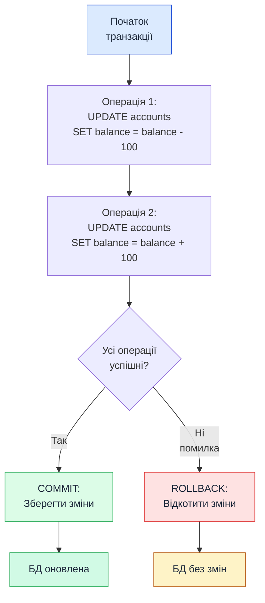
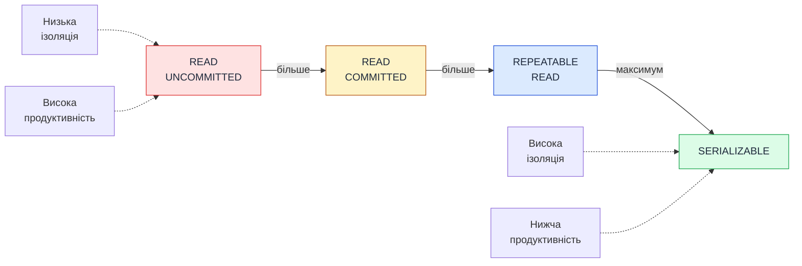
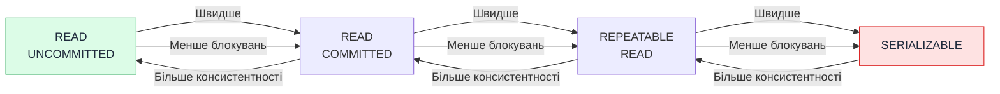

# Транзакції у TypeORM

::card-group

::card{title="🎯 Мета лекції" icon="i-lucide-target"}

- Опанувати концепцію транзакцій (*transactions*) як фундаментальний механізм забезпечення цілісності даних у багатокористувацьких системах.
- Вивчити ACID властивості транзакцій та їх критичну роль у фінансових операціях, створенні комплексних об'єктів та забезпеченні узгодженості даних.
- Навчитися використовувати TypeORM API для транзакцій: `DataSource.transaction()` для простих сценаріїв та `QueryRunner` для ручного контролю commit/rollback.
- Освоїти рівні ізоляції транзакцій (*isolation levels*) та їх вплив на продуктивність і узгодженість даних у конкурентному середовищі.
- Зрозуміти deadlocks, їх причини та стратегії уникнення через правильний порядок блокування ресурсів та timeout налаштування.

::

::card{title="🔑 Ключові терміни" icon="i-lucide-key"}

- **Transaction (Транзакція):** послідовність операцій з БД, що виконується як атомарна одиниця роботи — або всі операції застосовуються, або жодна.
- **ACID:** набір властивостей транзакцій, що гарантують надійність: Atomicity (атомарність), Consistency (узгодженість), Isolation (ізольованість), Durability (довговічність).
- **Commit (Фіксація):** застосування всіх змін транзакції до БД назавжди.
- **Rollback (Відкат):** скасування всіх змін транзакції, повернення БД до стану до початку транзакції.
- **Isolation Level (Рівень ізоляції):** параметр транзакції, що визначає, наскільки зміни однієї транзакції видимі іншим конкурентним транзакціям.
- **Deadlock (Взаємне блокування):** ситуація, коли дві або більше транзакцій чекають на звільнення ресурсів, заблокованих одна одною, що призводить до нескінченного очікування.
- **QueryRunner:** об'єкт TypeORM для ручного керування транзакціями, з'єднаннями та виконання SQL-запитів.

::

::

---

## Концепція транзакцій

### Що таке транзакція в БД

**Транзакція** — це логічна одиниця роботи з базою даних, що складається з однієї або кількох операцій (SELECT, INSERT, UPDATE, DELETE), які виконуються як **атомарне ціле**. Або всі операції у транзакції завершуються успішно і їх результати зберігаються у БД (commit), або всі операції скасовуються і БД залишається у попередньому стані (rollback).

::mermaid



::

**Класичний приклад — переказ коштів:**

Уявіть переказ 100 грн з рахунку A на рахунок B. Ця операція складається з двох кроків:

1. Зняти 100 грн з рахунку A: `UPDATE accounts SET balance = balance - 100 WHERE id = A`.
2. Додати 100 грн на рахунок B: `UPDATE accounts SET balance = balance + 100 WHERE id = B`.

**Без транзакції:**

Якщо після кроку 1 станеться збій (наприклад, відключення електроенергії), гроші **зникнуть** — вони знялися з рахунку A, але не додалися на рахунок B.

**З транзакцією:**

```sql
BEGIN TRANSACTION;
UPDATE accounts SET balance = balance - 100 WHERE id = 'A';
UPDATE accounts SET balance = balance + 100 WHERE id = 'B';
COMMIT;
```

Якщо будь-який крок завершиться помилкою, БД автоматично виконає `ROLLBACK`, і обидва рахунки залишаться у вихідному стані.

### ACID властивості

**ACID** — це акронім, що описує чотири ключові властивості транзакцій, які забезпечують надійність роботи з даними.

#### Atomicity (Атомарність)

**Атомарність** означає, що транзакція є **неподільною одиницею роботи** — або всі операції у транзакції виконуються успішно, або жодна. Не існує проміжного стану, коли частина операцій застосована, а частина ні.

**Приклад:**

```typescript
await dataSource.transaction(async (manager) => {
  await manager.update(Account, { id: 'A' }, { balance: () => 'balance - 100' }); // ✅ Виконано
  await manager.update(Account, { id: 'B' }, { balance: () => 'balance + 100' }); // ❌ Помилка
  // Транзакція автоматично відкотиться — баланс рахунку A залишиться без змін
});
```

#### Consistency (Узгодженість)

**Узгодженість** гарантує, що транзакція переводить БД з одного **валідного стану** в інший валідний стан, дотримуючись всіх правил цілісності (constraints, тригери, cascades).

**Приклад:**

```sql
-- Constraint: баланс не може бути від'ємним
ALTER TABLE accounts ADD CONSTRAINT check_balance_positive CHECK (balance >= 0);

BEGIN TRANSACTION;
UPDATE accounts SET balance = balance - 100 WHERE id = 'A';  -- Якщо баланс A < 100, constraint порушується
COMMIT;  -- ❌ Транзакція відкатиться через порушення constraint
```

Транзакція **не може** залишити БД у стані, що порушує правила цілісності даних.

#### Isolation (Ізольованість)

**Ізольованість** означає, що **конкурентні транзакції** не заважають одна одній — зміни однієї транзакції не видимі іншим транзакціям до моменту commit.

**Приклад проблеми без ізоляції:**

```typescript
// Транзакція 1: Переказ 100 грн з A на B
BEGIN;
UPDATE accounts SET balance = balance - 100 WHERE id = 'A';  // balance A = 900
-- (не завершена)

// Транзакція 2: Читання балансу A
SELECT balance FROM accounts WHERE id = 'A';  
// ❓ Яке значення побачить транзакція 2: 1000 (старе) чи 900 (нове)?
```

Рівень ізоляції визначає, чи побачить транзакція 2 незафіксовані зміни транзакції 1 (**dirty read**).

#### Durability (Довговічність)

**Довговічність** гарантує, що після успішного commit транзакції зміни **назавжди** зберігаються у БД, навіть у разі збою системи (відключення живлення, crash сервера).

**Механізми забезпечення:**

- **Write-Ahead Logging (WAL):** Перед зміною даних на диску БД записує лог операцій. При відновленні після збою БД відтворює зміни з логу.
- **Fsync:** Синхронізація буферів ОС з фізичним диском для гарантії збереження даних.

::note

**Практичне значення ACID:**  
ACID властивості критичні для **фінансових систем**, **e-commerce**, **медичних баз даних** та будь-яких систем, де втрата або корупція даних неприпустима. Без ACID гарантій неможливо побудувати надійну багатокористувацьку систему.

::

### Навіщо потрібні транзакції

**1. Забезпечення цілісності даних:**

Коли операція складається з кількох кроків, транзакція гарантує, що або всі кроки виконаються, або жодний. Це запобігає корупції даних.

**2. Ізоляція конкурентних операцій:**

У багатокористувацьких системах десятки або сотні запитів виконуються одночасно. Транзакції забезпечують, що конкурентні операції не заважають одна одній.

**3. Rollback при помилках:**

Якщо під час виконання складної операції станеться помилка, транзакція автоматично відкочує всі зміни, залишаючи БД у узгодженому стані.

**4. Аудит та логування:**

Транзакції дозволяють логувати операції як атомарні одиниці, що спрощує аудит та діагностику проблем.

---

## Коли використовувати транзакції

### Множинні пов'язані операції

Завжди використовуйте транзакції, коли операція складається з **кількох SQL-запитів**, успіх яких залежить один від одного.

**Приклад — створення замовлення:**

```typescript
await dataSource.transaction(async (manager) => {
  // 1. Створити замовлення
  const order = await manager.save(Order, {
    userId: 1,
    totalAmount: 250.00,
    status: 'pending',
  });

  // 2. Додати позиції замовлення
  await manager.save(OrderItem, [
    { orderId: order.id, productId: 10, quantity: 2, price: 100.00 },
    { orderId: order.id, productId: 15, quantity: 1, price: 50.00 },
  ]);

  // 3. Оновити кількість товарів на складі
  await manager.decrement(Product, { id: 10 }, 'stock', 2);
  await manager.decrement(Product, { id: 15 }, 'stock', 1);

  // Якщо будь-який крок завершиться помилкою — rollback всіх операцій
});
```

**Без транзакції:**

Якщо крок 3 завершиться помилкою (наприклад, недостатньо товару на складі), замовлення та позиції **залишаться у БД**, але склад не оновиться → некоректний стан.

### Фінансові операції

Будь-які операції з грошима **обов'язково** мають виконуватися у транзакціях для забезпечення узгодженості.

**Приклад — поповнення балансу через платіжну систему:**

```typescript
await dataSource.transaction(async (manager) => {
  // 1. Створити запис про платіж
  const payment = await manager.save(Payment, {
    userId: 1,
    amount: 100.00,
    status: 'completed',
    paymentMethod: 'card',
  });

  // 2. Оновити баланс користувача
  await manager.increment(User, { id: 1 }, 'balance', 100.00);

  // 3. Додати запис до історії транзакцій
  await manager.save(Transaction, {
    userId: 1,
    type: 'deposit',
    amount: 100.00,
    paymentId: payment.id,
  });
});
```

### Створення комплексних об'єктів з залежностями

При створенні об'єктів з багатьма зв'язками транзакція гарантує, що або весь граф об'єктів створюється, або жодна частина.

**Приклад — реєстрація користувача з профілем та налаштуваннями:**

```typescript
await dataSource.transaction(async (manager) => {
  // 1. Створити користувача
  const user = await manager.save(User, {
    email: 'user@example.com',
    passwordHash: await bcrypt.hash('password', 10),
  });

  // 2. Створити профіль
  await manager.save(Profile, {
    userId: user.id,
    firstName: 'John',
    lastName: 'Doe',
  });

  // 3. Створити налаштування за замовчуванням
  await manager.save(UserSettings, {
    userId: user.id,
    theme: 'light',
    language: 'uk',
    notifications: true,
  });

  // 4. Призначити роль за замовчуванням
  await manager.save(UserRole, {
    userId: user.id,
    roleId: 3, // 'user' role
  });
});
```

### Забезпечення цілісності даних

Транзакції критичні для операцій, що **залежать від попереднього стану** даних та можуть призвести до **race conditions** без ізоляції.

**Приклад — система бронювання місць:**

```typescript
await dataSource.transaction(async (manager) => {
  // 1. Перевірити доступність місця
  const seat = await manager.findOne(Seat, {
    where: { id: seatId, status: 'available' },
    lock: { mode: 'pessimistic_write' }, // Блокування для запису
  });

  if (!seat) {
    throw new Error('Seat is not available');
  }

  // 2. Забронювати місце
  await manager.update(Seat, { id: seatId }, { status: 'reserved', userId: userId });

  // 3. Створити запис про бронювання
  await manager.save(Booking, {
    userId: userId,
    seatId: seatId,
    expiresAt: new Date(Date.now() + 15 * 60 * 1000), // 15 хвилин
  });
});
```

**Без транзакції з блокуванням:**

Два користувачі можуть одночасно прочитати, що місце доступне, і обидва спробують його забронювати → race condition.

### Rollback при помилці

Транзакції автоматично відкочують зміни при виникненні помилки, запобігаючи частковому застосуванню операцій.

**Приклад — масове оновлення з валідацією:**

```typescript
try {
  await dataSource.transaction(async (manager) => {
    const users = await manager.find(User, { where: { isActive: true } });

    for (const user of users) {
      // Валідація email
      if (!isValidEmail(user.email)) {
        throw new Error(`Invalid email for user ${user.id}`);
      }

      // Оновлення
      await manager.update(User, { id: user.id }, { emailVerified: true });
    }
  });
} catch (error) {
  console.error('Rollback: Email verification failed', error.message);
  // Всі оновлення відкочені — жоден user не отримав emailVerified: true
}
```

---

## Простий спосіб: DataSource.transaction()

### Синтаксис з async callback

TypeORM надає метод `DataSource.transaction()`, який приймає **async callback** та автоматично обробляє commit/rollback.

**Базовий синтаксис:**

```typescript
await dataSource.transaction(async (manager: EntityManager) => {
  // Всі операції з БД через manager
  await manager.save(SomeEntity, { /* data */ });
  await manager.update(AnotherEntity, { id: 1 }, { /* updates */ });
  // При успішному завершенні callback — автоматичний COMMIT
  // При помилці (throw) — автоматичний ROLLBACK
});
```

**Приклад у NestJS сервісі:**

```typescript
import { Injectable } from '@nestjs/common';
import { DataSource } from 'typeorm';
import { User } from './entities/user.entity';
import { Profile } from './entities/profile.entity';

@Injectable()
export class UsersService {
  constructor(private readonly dataSource: DataSource) {}

  async createUserWithProfile(dto: CreateUserDto): Promise<User> {
    return this.dataSource.transaction(async (manager) => {
      // Створити користувача
      const user = manager.create(User, {
        email: dto.email,
        passwordHash: dto.passwordHash,
      });
      await manager.save(user);

      // Створити профіль
      const profile = manager.create(Profile, {
        userId: user.id,
        firstName: dto.firstName,
        lastName: dto.lastName,
      });
      await manager.save(profile);

      return user;
    });
  }
}
```

### Автоматичний commit при успіху

Якщо callback функція завершується без помилок (не кидає exception), TypeORM автоматично виконує `COMMIT`, застосовуючи всі зміни до БД.

**SQL-еквівалент:**

```sql
BEGIN TRANSACTION;
INSERT INTO users (email, password_hash) VALUES ('user@example.com', '$2b$10...');
INSERT INTO profiles (user_id, first_name, last_name) VALUES (1, 'John', 'Doe');
COMMIT;  -- Автоматично
```

### Автоматичний rollback при помилці

Якщо у callback функції виникає помилка (throw або rejected promise), TypeORM автоматично виконує `ROLLBACK`, скасовуючи всі зміни.

**Приклад:**

```typescript
try {
  await dataSource.transaction(async (manager) => {
    await manager.save(User, { email: 'user@example.com' });
    await manager.save(Profile, { userId: 999 }); // ❌ FK constraint violation
    // Ніколи не досягне цього рядка
  });
} catch (error) {
  console.error('Transaction rolled back:', error.message);
  // БД залишилася без змін — користувач НЕ створений
}
```

**SQL-еквівалент:**

```sql
BEGIN TRANSACTION;
INSERT INTO users (email) VALUES ('user@example.com');
INSERT INTO profiles (user_id) VALUES (999);  -- ERROR: foreign key constraint
ROLLBACK;  -- Автоматично
```

### Використання transactional EntityManager

**Критично важливо:** Всі операції у транзакції **мають виконуватися через `manager`**, переданий у callback, а не через звичайний repository.

**❌ Неправильно (операція поза транзакцією):**

```typescript
await dataSource.transaction(async (manager) => {
  await manager.save(User, { email: 'user@example.com' });
  await profileRepository.save({ userId: 1 }); // ❌ Використання repository поза транзакцією!
});
```

**✅ Правильно (всі операції через manager):**

```typescript
await dataSource.transaction(async (manager) => {
  await manager.save(User, { email: 'user@example.com' });
  await manager.save(Profile, { userId: 1 }); // ✅ Через transactional manager
});
```

::warning

**Чому це важливо:**  
Repository використовує **окреме з'єднання** з БД. Операції через repository не входять у транзакцію і не підлягають rollback при помилці. Завжди використовуйте `manager` з callback для всіх операцій у транзакції.

::

### Приклади базових транзакцій

**Приклад 1 — переказ коштів:**

```typescript
async transferMoney(fromAccountId: number, toAccountId: number, amount: number): Promise<void> {
  await this.dataSource.transaction(async (manager) => {
    // Зняти кошти з рахунку відправника
    const result1 = await manager.decrement(
      Account,
      { id: fromAccountId },
      'balance',
      amount
    );

    if (result1.affected === 0) {
      throw new Error('Source account not found or insufficient balance');
    }

    // Додати кошти на рахунок отримувача
    const result2 = await manager.increment(
      Account,
      { id: toAccountId },
      'balance',
      amount
    );

    if (result2.affected === 0) {
      throw new Error('Destination account not found');
    }

    // Створити запис про транзакцію
    await manager.save(Transaction, {
      fromAccountId,
      toAccountId,
      amount,
      type: 'transfer',
    });
  });
}
```

**Приклад 2 — видалення користувача з каскадним очищенням:**

```typescript
async deleteUser(userId: number): Promise<void> {
  await this.dataSource.transaction(async (manager) => {
    // Видалити всі пости користувача
    await manager.delete(Post, { authorId: userId });

    // Видалити всі коментарі користувача
    await manager.delete(Comment, { authorId: userId });

    // Видалити профіль
    await manager.delete(Profile, { userId });

    // Видалити користувача
    await manager.delete(User, { id: userId });
  });
}
```


---

## Робота з EntityManager у транзакції

### Отримання manager з callback

При використанні `DataSource.transaction()` TypeORM передає **transactional EntityManager** як перший параметр callback функції.

```typescript
await dataSource.transaction(async (manager) => {
  // manager — це EntityManager, прив'язаний до поточної транзакції
  console.log(manager.constructor.name); // EntityManager
});
```

**EntityManager** у транзакції має:

- Власне з'єднання з БД, виділене для цієї транзакції.
- Усі операції виконуються у контексті `BEGIN ... COMMIT/ROLLBACK`.
- Доступ до тих самих методів, що й звичайний EntityManager або Repository.

### Всі операції через manager

**Правило:** Всі операції з БД у транзакції **мають виконуватися через `manager`**, а не через repository або DataSource.

**Методи EntityManager для транзакцій:**

```typescript
await dataSource.transaction(async (manager) => {
  // CREATE операції
  const user = manager.create(User, { email: 'user@example.com' });
  await manager.save(user);

  // READ операції
  const foundUser = await manager.findOne(User, { where: { id: user.id } });
  const allUsers = await manager.find(User);

  // UPDATE операції
  await manager.update(User, { id: user.id }, { isActive: true });
  await manager.increment(User, { id: user.id }, 'loginCount', 1);

  // DELETE операції
  await manager.delete(User, { id: user.id });
  await manager.remove(user);

  // Підрахунок
  const count = await manager.count(User, { where: { isActive: true } });

  // Query Builder
  const posts = await manager
    .createQueryBuilder(Post, 'post')
    .where('post.authorId = :authorId', { authorId: user.id })
    .getMany();
});
```

### `manager.save()`, `manager.update()`, `manager.delete()`

**`manager.save(entity)`** — зберігає нову або оновлює існуючу entity:

```typescript
await manager.save(User, { id: 1, email: 'updated@example.com' });
```

**`manager.update(Entity, criteria, partialEntity)`** — оновлює записи без завантаження entities:

```typescript
await manager.update(User, { id: 1 }, { isActive: false });
```

**`manager.delete(Entity, criteria)`** — видаляє записи без завантаження:

```typescript
await manager.delete(User, { id: 1 });
```

**`manager.remove(entity)`** — видаляє завантажену entity (тригерить lifecycle hooks):

```typescript
const user = await manager.findOne(User, { where: { id: 1 } });
await manager.remove(user);
```

### Важливість використання саме transactional manager

**Проблема змішування manager та repository:**

```typescript
// ❌ НЕПРАВИЛЬНО
await dataSource.transaction(async (manager) => {
  await manager.save(User, { email: 'user@example.com' });
  
  // Використання repository поза транзакцією!
  await this.userRepository.update({ id: 1 }, { isActive: true });
  // Ця операція НЕ входить у транзакцію і не відкотиться при помилці
});
```

**Правильний підхід:**

```typescript
// ✅ ПРАВИЛЬНО
await dataSource.transaction(async (manager) => {
  await manager.save(User, { email: 'user@example.com' });
  await manager.update(User, { id: 1 }, { isActive: true });
  // Обидві операції у транзакції
});
```

::tip

**Альтернатива — отримання transactional repository:**

Якщо вам зручніше працювати з repository, отримайте його з manager:

```typescript
await dataSource.transaction(async (manager) => {
  const userRepository = manager.getRepository(User);
  const postRepository = manager.getRepository(Post);

  await userRepository.save({ email: 'user@example.com' });
  await postRepository.save({ title: 'Post', authorId: 1 });
  // Обидва repository використовують transactional manager
});
```

::

---

## QueryRunner для складних сценаріїв

### Створення QueryRunner з DataSource

**QueryRunner** — це низькорівневий API TypeORM для **ручного контролю** транзакцій, з'єднань та виконання SQL-запитів. Використовується для складних сценаріїв, де потрібен повний контроль.

**Створення QueryRunner:**

```typescript
const queryRunner = this.dataSource.createQueryRunner();
```

**QueryRunner надає:**

- Ручне керування транзакцією: `startTransaction()`, `commitTransaction()`, `rollbackTransaction()`.
- Виконання сирих SQL-запитів: `query(sql, parameters)`.
- Доступ до EntityManager: `queryRunner.manager`.

### Ручний контроль транзакції

**Базовий шаблон з QueryRunner:**

```typescript
const queryRunner = this.dataSource.createQueryRunner();

// Встановити з'єднання з БД
await queryRunner.connect();

// Почати транзакцію
await queryRunner.startTransaction();

try {
  // Виконати операції через queryRunner.manager
  await queryRunner.manager.save(User, { email: 'user@example.com' });
  await queryRunner.manager.save(Profile, { userId: 1 });

  // Зафіксувати транзакцію
  await queryRunner.commitTransaction();
} catch (error) {
  // Відкотити транзакцію при помилці
  await queryRunner.rollbackTransaction();
  throw error;
} finally {
  // Звільнити з'єднання назад у pool
  await queryRunner.release();
}
```

### `queryRunner.startTransaction()`

Починає нову транзакцію. Виконує SQL-команду `BEGIN TRANSACTION`.

```typescript
await queryRunner.startTransaction();
// SQL: BEGIN TRANSACTION
```

**З рівнем ізоляції:**

```typescript
await queryRunner.startTransaction('READ COMMITTED');
// SQL: BEGIN TRANSACTION ISOLATION LEVEL READ COMMITTED
```

### `queryRunner.commitTransaction()`

Фіксує всі зміни транзакції. Виконує SQL-команду `COMMIT`.

```typescript
await queryRunner.commitTransaction();
// SQL: COMMIT
```

**Після commit:**

- Всі зміни застосовуються до БД назавжди.
- Блокування, встановлені транзакцією, звільняються.
- Транзакція вважається завершеною.

### `queryRunner.rollbackTransaction()`

Скасовує всі зміни транзакції. Виконує SQL-команду `ROLLBACK`.

```typescript
await queryRunner.rollbackTransaction();
// SQL: ROLLBACK
```

**Після rollback:**

- БД повертається до стану до початку транзакції.
- Блокування звільняються.
- Транзакція вважається завершеною.

### `queryRunner.release()`: завжди у finally блоці

**Критично важливо:** Завжди викликайте `queryRunner.release()` у блоці `finally`, щоб звільнити з'єднання назад у connection pool.

**❌ Небезпечно (витік з'єднань):**

```typescript
const queryRunner = this.dataSource.createQueryRunner();
await queryRunner.connect();
await queryRunner.startTransaction();

await queryRunner.manager.save(User, { email: 'user@example.com' });
await queryRunner.commitTransaction();

// ❌ Забули викликати release() — з'єднання залишається зайнятим!
```

**✅ Правильно:**

```typescript
const queryRunner = this.dataSource.createQueryRunner();
await queryRunner.connect();
await queryRunner.startTransaction();

try {
  await queryRunner.manager.save(User, { email: 'user@example.com' });
  await queryRunner.commitTransaction();
} catch (error) {
  await queryRunner.rollbackTransaction();
  throw error;
} finally {
  await queryRunner.release(); // ✅ Завжди звільняти з'єднання
}
```

::caution

**Наслідки не звільнення QueryRunner:**

Якщо не викликати `release()`, з'єднання з БД залишається зайнятим і не повертається у connection pool. При великій кількості запитів це призведе до вичерпання пулу з'єднань → нові запити не зможуть виконатися → застосунок зависне.

**Симптоми:**

- `TimeoutError: ResourceRequest timed out`.
- Повільна відповідь API.
- Неможливість підключитися до БД.

::

**Приклад складної транзакції з QueryRunner:**

```typescript
async createOrderWithInventoryUpdate(orderData: CreateOrderDto): Promise<Order> {
  const queryRunner = this.dataSource.createQueryRunner();
  await queryRunner.connect();
  await queryRunner.startTransaction();

  try {
    // 1. Створити замовлення
    const order = await queryRunner.manager.save(Order, {
      userId: orderData.userId,
      totalAmount: 0,
      status: 'pending',
    });

    let totalAmount = 0;

    // 2. Додати позиції замовлення та оновити склад
    for (const item of orderData.items) {
      // Перевірити наявність товару на складі з блокуванням
      const product = await queryRunner.manager.findOne(Product, {
        where: { id: item.productId },
        lock: { mode: 'pessimistic_write' },
      });

      if (!product || product.stock < item.quantity) {
        throw new Error(`Product ${item.productId} is out of stock`);
      }

      // Додати позицію замовлення
      await queryRunner.manager.save(OrderItem, {
        orderId: order.id,
        productId: item.productId,
        quantity: item.quantity,
        price: product.price,
      });

      // Оновити склад
      await queryRunner.manager.decrement(
        Product,
        { id: item.productId },
        'stock',
        item.quantity
      );

      totalAmount += product.price * item.quantity;
    }

    // 3. Оновити загальну суму замовлення
    await queryRunner.manager.update(Order, { id: order.id }, { totalAmount });

    // 4. Зафіксувати транзакцію
    await queryRunner.commitTransaction();

    return order;
  } catch (error) {
    await queryRunner.rollbackTransaction();
    throw error;
  } finally {
    await queryRunner.release();
  }
}
```

---

## Рівні ізоляції транзакцій

### Концепція рівнів ізоляції

**Рівень ізоляції** визначає, **наскільки** зміни однієї транзакції видимі іншим конкурентним транзакціям. Різні рівні ізоляції забезпечують різний баланс між **консистентністю даних** та **продуктивністю**.

::mermaid



::

### READ UNCOMMITTED

**Найнижчий рівень ізоляції.** Транзакція може читати **незафіксовані зміни** інших транзакцій (*dirty reads*).

**Приклад проблеми:**

```typescript
// Транзакція 1: Оновлює баланс (не завершена)
BEGIN;
UPDATE accounts SET balance = balance - 100 WHERE id = 1;
-- (не commit)

// Транзакція 2: Читає незафіксоване значення
SELECT balance FROM accounts WHERE id = 1;
-- Побачить balance - 100, навіть якщо транзакція 1 ще не завершена!

// Транзакція 1: Відкочує зміни
ROLLBACK;

// Транзакція 2 прочитала "брудні" дані, яких насправді немає!
```

**Коли використовувати:**

- Майже ніколи у production системах.
- Лише для аналітичних запитів, де точність даних не критична.

::note

**PostgreSQL не підтримує READ UNCOMMITTED:**  
У PostgreSQL `READ UNCOMMITTED` автоматично підвищується до `READ COMMITTED`. Справжній `READ UNCOMMITTED` доступний у MySQL/InnoDB.

::

### READ COMMITTED (default у PostgreSQL)

**Транзакція бачить лише зафіксовані зміни** інших транзакцій. Dirty reads неможливі.

**Налаштування:**

```typescript
await queryRunner.startTransaction('READ COMMITTED');
```

**Проблема — non-repeatable reads:**

```typescript
// Транзакція 1
BEGIN;
SELECT balance FROM accounts WHERE id = 1;  -- balance = 1000

// Транзакція 2
BEGIN;
UPDATE accounts SET balance = 500 WHERE id = 1;
COMMIT;

// Транзакція 1: Повторне читання
SELECT balance FROM accounts WHERE id = 1;  -- balance = 500 (змінилося!)
COMMIT;
```

Транзакція 1 бачить **різні значення** при повторному читанні того самого запису.

**Коли використовувати:**

- За замовчуванням для більшості застосунків.
- Баланс між продуктивністю та консистентністю.

### REPEATABLE READ

**Гарантує, що повторне читання** того самого запису поверне те саме значення протягом транзакції. Non-repeatable reads неможливі.

**Налаштування:**

```typescript
await queryRunner.startTransaction('REPEATABLE READ');
```

**Як працює:**

```typescript
// Транзакція 1
BEGIN TRANSACTION ISOLATION LEVEL REPEATABLE READ;
SELECT balance FROM accounts WHERE id = 1;  -- balance = 1000

// Транзакція 2
BEGIN;
UPDATE accounts SET balance = 500 WHERE id = 1;
COMMIT;

// Транзакція 1: Повторне читання
SELECT balance FROM accounts WHERE id = 1;  -- balance = 1000 (не змінилося!)
COMMIT;
```

Транзакція 1 бачить **snapshot** БД на момент початку транзакції.

**Проблема — phantom reads (у деяких БД):**

```sql
-- Транзакція 1
BEGIN;
SELECT COUNT(*) FROM users WHERE age > 18;  -- COUNT = 100

-- Транзакція 2
INSERT INTO users (age) VALUES (25);
COMMIT;

-- Транзакція 1
SELECT COUNT(*) FROM users WHERE age > 18;  -- COUNT = 101 (phantom row!)
```

::note

**PostgreSQL REPEATABLE READ запобігає phantom reads:**  
У PostgreSQL рівень `REPEATABLE READ` також захищає від phantom reads через MVCC (*Multi-Version Concurrency Control*).

::

**Коли використовувати:**

- Для фінансових операцій, де критична консистентність даних.
- Коли потрібна гарантія, що дані не зміняться протягом транзакції.

### SERIALIZABLE

**Найвищий рівень ізоляції.** Транзакції виконуються так, ніби вони виконувалися **послідовно**, одна за одною, без конкуренції.

**Налаштування:**

```typescript
await queryRunner.startTransaction('SERIALIZABLE');
```

**Як працює:**

PostgreSQL відстежує **залежності між транзакціями** та відкочує ті, що можуть призвести до **serialization anomaly** (порушення послідовності).

**Приклад:**

```typescript
// Транзакція 1
BEGIN TRANSACTION ISOLATION LEVEL SERIALIZABLE;
SELECT SUM(balance) FROM accounts;  -- SUM = 10000

// Транзакція 2
BEGIN TRANSACTION ISOLATION LEVEL SERIALIZABLE;
INSERT INTO accounts (balance) VALUES (500);
COMMIT;

// Транзакція 1
INSERT INTO accounts (balance) VALUES (500);
COMMIT;  -- ❌ ERROR: could not serialize access due to read/write dependencies
```

**Коли використовувати:**

- Для критичних операцій, де порушення послідовності неприпустиме.
- У системах з низькою конкуренцією (мало конкурентних транзакцій).

**Недоліки:**

- **Найнижча продуктивність** через додаткові перевірки.
- **Високий ризик serialization failures** → потрібна retry logic.

### Вибір рівня ізоляції

**Рекомендації:**

| Сценарій | Рівень ізоляції |
|----------|-----------------|
| Звичайні CRUD операції | READ COMMITTED (default) |
| Фінансові операції, бронювання | REPEATABLE READ |
| Критичні операції з суворою послідовністю | SERIALIZABLE |
| Аналітичні запити (не критична точність) | READ UNCOMMITTED (якщо підтримується) |

### Performance vs consistency tradeoffs

::mermaid



::

**Баланс:**

- **Вищий рівень ізоляції** = більше консистентності, але **нижча продуктивність** через блокування.
- **Нижчий рівень ізоляції** = вища продуктивність, але **ризик anomalies** (dirty reads, phantom reads).

::tip

**Best Practice:**  
Використовуйте **READ COMMITTED** за замовчуванням та підвищуйте до **REPEATABLE READ** лише для критичних операцій, де потрібна гарантія консистентності даних.

::


---

## Обробка помилок у транзакціях

### Try-catch блоки

Завжди огортайте транзакції у `try-catch` блоки для обробки помилок.

**Базовий шаблон:**

```typescript
try {
  await dataSource.transaction(async (manager) => {
    // Операції з БД
  });
} catch (error) {
  console.error('Transaction failed:', error.message);
  throw error; // Або обробити помилку
}
```

### Автоматичний rollback

При використанні `DataSource.transaction()` rollback виконується **автоматично** при виникненні помилки:

```typescript
await dataSource.transaction(async (manager) => {
  await manager.save(User, { email: 'user@example.com' });
  throw new Error('Simulated error');
  // Автоматичний ROLLBACK — користувач НЕ створений
});
```

**З QueryRunner потрібен явний rollback:**

```typescript
const queryRunner = this.dataSource.createQueryRunner();
await queryRunner.connect();
await queryRunner.startTransaction();

try {
  await queryRunner.manager.save(User, { email: 'user@example.com' });
  throw new Error('Simulated error');
  await queryRunner.commitTransaction();
} catch (error) {
  await queryRunner.rollbackTransaction(); // ✅ Явний rollback
  throw error;
} finally {
  await queryRunner.release();
}
```

### Логування помилок

Логуйте помилки транзакцій для діагностики проблем:

```typescript
try {
  await dataSource.transaction(async (manager) => {
    // Операції
  });
} catch (error) {
  this.logger.error('Transaction failed', {
    error: error.message,
    stack: error.stack,
    context: 'createOrderWithInventory',
  });
  throw error;
}
```

### Повторні спроби (retry logic)

Для **serialization failures** або **deadlocks** використовуйте retry logic:

```typescript
async function executeWithRetry<T>(
  fn: () => Promise<T>,
  maxRetries = 3,
  delay = 100
): Promise<T> {
  for (let attempt = 1; attempt <= maxRetries; attempt++) {
    try {
      return await fn();
    } catch (error) {
      const isRetryable = 
        error.code === '40001' || // Serialization failure (PostgreSQL)
        error.code === '40P01';    // Deadlock detected

      if (!isRetryable || attempt === maxRetries) {
        throw error;
      }

      console.warn(`Transaction failed (attempt ${attempt}/${maxRetries}), retrying in ${delay}ms...`);
      await new Promise(resolve => setTimeout(resolve, delay * attempt));
    }
  }
}

// Використання
await executeWithRetry(async () => {
  return dataSource.transaction(async (manager) => {
    // Критична операція
  });
});
```

### Graceful degradation

У разі помилки транзакції надайте користувачу зрозуміле повідомлення:

```typescript
try {
  await this.transferMoney(fromAccountId, toAccountId, amount);
  return { success: true, message: 'Transfer completed' };
} catch (error) {
  if (error.message.includes('insufficient balance')) {
    return { success: false, message: 'Insufficient balance' };
  }
  if (error.code === '40P01') {
    return { success: false, message: 'Operation is temporarily unavailable, please try again' };
  }
  throw error; // Unexpected error
}
```

---

## Deadlocks та як їх уникнути

### Що таке deadlock

**Deadlock (взаємне блокування)** — це ситуація, коли дві або більше транзакцій чекають на звільнення ресурсів, заблокованих одна одною, що призводить до нескінченного очікування.

**Приклад deadlock:**

```typescript
// Транзакція 1
BEGIN;
UPDATE accounts SET balance = balance - 100 WHERE id = 1;  -- Блокує рядок 1
-- (чекає на блокування рядка 2)
UPDATE accounts SET balance = balance + 100 WHERE id = 2;

// Транзакція 2 (одночасно)
BEGIN;
UPDATE accounts SET balance = balance - 50 WHERE id = 2;   -- Блокує рядок 2
-- (чекає на блокування рядка 1)
UPDATE accounts SET balance = balance + 50 WHERE id = 1;

-- ❌ DEADLOCK: обидві транзакції чекають одна на одну!
```

**PostgreSQL автоматично виявляє deadlock** та відкочує одну з транзакцій:

```
ERROR: deadlock detected
DETAIL: Process 1234 waits for ShareLock on transaction 5678; blocked by process 5678.
Process 5678 waits for ShareLock on transaction 1234; blocked by process 1234.
```

### Причини виникнення

**1. Невпорядковане блокування ресурсів:**

Дві транзакції блокують ресурси у **різному порядку**.

**2. Довгі транзакції:**

Транзакції тримають блокування надто довго, збільшуючи ймовірність конфлікту.

**3. Високий рівень конкуренції:**

Багато транзакцій одночасно змінюють ті самі записи.

### Стратегії уникнення

**1. Впорядковане блокування:**

Завжди блокуйте ресурси у **одному порядку** (наприклад, за зростанням ID).

```typescript
// ✅ ПРАВИЛЬНО: блокування у порядку зростання ID
async transferMoney(fromId: number, toId: number, amount: number) {
  await dataSource.transaction(async (manager) => {
    const [firstId, secondId] = fromId < toId ? [fromId, toId] : [toId, fromId];

    // Блокуємо рахунки у порядку зростання ID
    const account1 = await manager.findOne(Account, {
      where: { id: firstId },
      lock: { mode: 'pessimistic_write' },
    });

    const account2 = await manager.findOne(Account, {
      where: { id: secondId },
      lock: { mode: 'pessimistic_write' },
    });

    // Виконуємо переказ
    if (fromId === firstId) {
      await manager.decrement(Account, { id: fromId }, 'balance', amount);
      await manager.increment(Account, { id: toId }, 'balance', amount);
    } else {
      await manager.decrement(Account, { id: fromId }, 'balance', amount);
      await manager.increment(Account, { id: toId }, 'balance', amount);
    }
  });
}
```

**2. Мінімізація часу транзакції:**

Виносьте повільні операції (HTTP запити, обробка файлів) **за межі транзакції**.

```typescript
// ❌ ПОГАНО: HTTP запит всередині транзакції
await dataSource.transaction(async (manager) => {
  await manager.save(Order, orderData);
  await sendEmail(user.email, 'Order created'); // ⚠️ Повільна операція!
});

// ✅ ДОБРЕ: HTTP запит після транзакції
const order = await dataSource.transaction(async (manager) => {
  return manager.save(Order, orderData);
});
await sendEmail(user.email, 'Order created'); // ✅ Після commit
```

**3. Використання оптимістичного блокування:**

Замість блокування рядків використовуйте **versioning** для виявлення конфліктів.

```typescript
@Entity()
export class Account {
  @PrimaryGeneratedColumn()
  id: number;

  @Column('decimal')
  balance: number;

  @VersionColumn()
  version: number; // Автоматично інкрементується при кожному UPDATE
}

// При конфлікті TypeORM кине OptimisticLockVersionMismatchError
```

### Порядок блокування ресурсів

**Правило:** Завжди блокуйте ресурси у **фіксованому глобальному порядку** (наприклад, за primary key).

**Приклад — переказ між рахунками:**

```typescript
async function transfer(from: number, to: number, amount: number) {
  const ids = [from, to].sort((a, b) => a - b); // Сортуємо ID

  await dataSource.transaction(async (manager) => {
    // Блокуємо у порядку зростання ID
    for (const id of ids) {
      await manager.findOne(Account, {
        where: { id },
        lock: { mode: 'pessimistic_write' },
      });
    }

    // Виконуємо переказ
    await manager.decrement(Account, { id: from }, 'balance', amount);
    await manager.increment(Account, { id: to }, 'balance', amount);
  });
}
```

### Timeout налаштування

Налаштуйте **lock timeout** для автоматичного відкату транзакцій, що чекають надто довго:

```typescript
await queryRunner.query('SET lock_timeout = 5000'); // 5 секунд
await queryRunner.startTransaction();

try {
  // Операції
} catch (error) {
  if (error.code === '55P03') { // Lock timeout
    console.warn('Lock timeout exceeded, retrying...');
  }
}
```

---

## Performance considerations

### Довгі транзакції блокують БД

Транзакції тримають **блокування** на записах, які вони змінюють. Довгі транзакції збільшують ймовірність deadlocks та зменшують throughput системи.

**Правило:** Транзакція має бути **якомога коротшою**.

### Мінімізація часу транзакції

**❌ ПОГАНО: Повільні операції всередині транзакції:**

```typescript
await dataSource.transaction(async (manager) => {
  const user = await manager.save(User, userData);
  
  // ⚠️ HTTP запит до зовнішнього API (повільно!)
  const apiResponse = await fetch('https://external-api.com/verify', {
    method: 'POST',
    body: JSON.stringify({ userId: user.id }),
  });
  
  await manager.update(User, { id: user.id }, { verified: apiResponse.verified });
});
```

**✅ ДОБРЕ: Повільні операції після транзакції:**

```typescript
const user = await dataSource.transaction(async (manager) => {
  return manager.save(User, userData);
});

// HTTP запит після commit
const apiResponse = await fetch('https://external-api.com/verify', {
  method: 'POST',
  body: JSON.stringify({ userId: user.id }),
});

// Окрема транзакція для оновлення
await userRepository.update({ id: user.id }, { verified: apiResponse.verified });
```

### Винесення I/O операцій за межі транзакції

**I/O операції**, що мають бути поза транзакцією:

- HTTP запити до зовнішніх API.
- Відправка email або SMS.
- Обробка файлів (читання, запис, завантаження).
- Генерація PDF або інших документів.
- Взаємодія з чергами (RabbitMQ, Redis).

### Connection pooling та транзакції

TypeORM використовує **connection pool** для повторного використання з'єднань з БД. Транзакція займає одне з'єднання на весь час виконання.

**Налаштування pool:**

```typescript
const dataSource = new DataSource({
  type: 'postgres',
  host: 'localhost',
  database: 'mydb',
  extra: {
    max: 20,        // Максимум з'єднань у pool
    idleTimeoutMillis: 30000, // Час простою перед закриттям
    connectionTimeoutMillis: 2000, // Timeout для отримання з'єднання
  },
});
```

**Правило:** Кількість з'єднань у pool має бути достатньою для пікового навантаження.

---

## Практичні приклади

### Переказ коштів між рахунками

```typescript
async transferMoney(
  fromAccountId: number,
  toAccountId: number,
  amount: number
): Promise<{ success: boolean; message: string }> {
  return this.dataSource.transaction(async (manager) => {
    // Блокування рахунків у порядку зростання ID
    const [firstId, secondId] = [fromAccountId, toAccountId].sort((a, b) => a - b);

    const account1 = await manager.findOne(Account, {
      where: { id: firstId },
      lock: { mode: 'pessimistic_write' },
    });

    const account2 = await manager.findOne(Account, {
      where: { id: secondId },
      lock: { mode: 'pessimistic_write' },
    });

    const fromAccount = fromAccountId === firstId ? account1 : account2;
    const toAccount = toAccountId === firstId ? account1 : account2;

    if (!fromAccount || !toAccount) {
      throw new Error('Account not found');
    }

    if (fromAccount.balance < amount) {
      throw new Error('Insufficient balance');
    }

    // Виконати переказ
    await manager.decrement(Account, { id: fromAccountId }, 'balance', amount);
    await manager.increment(Account, { id: toAccountId }, 'balance', amount);

    // Створити запис про транзакцію
    await manager.save(Transaction, {
      fromAccountId,
      toAccountId,
      amount,
      type: 'transfer',
      status: 'completed',
    });

    return { success: true, message: 'Transfer completed successfully' };
  });
}
```

### Створення замовлення з позиціями та оновленням складу

```typescript
async createOrder(dto: CreateOrderDto): Promise<Order> {
  return this.dataSource.transaction(async (manager) => {
    // 1. Створити замовлення
    const order = await manager.save(Order, {
      userId: dto.userId,
      status: 'pending',
      totalAmount: 0,
    });

    let totalAmount = 0;

    // 2. Обробити кожну позицію
    for (const item of dto.items) {
      // Заблокувати товар для оновлення
      const product = await manager.findOne(Product, {
        where: { id: item.productId },
        lock: { mode: 'pessimistic_write' },
      });

      if (!product) {
        throw new Error(`Product ${item.productId} not found`);
      }

      if (product.stock < item.quantity) {
        throw new Error(`Insufficient stock for product ${product.name}`);
      }

      // Додати позицію замовлення
      await manager.save(OrderItem, {
        orderId: order.id,
        productId: item.productId,
        quantity: item.quantity,
        price: product.price,
      });

      // Оновити склад
      await manager.decrement(Product, { id: item.productId }, 'stock', item.quantity);

      totalAmount += product.price * item.quantity;
    }

    // 3. Оновити загальну суму
    await manager.update(Order, { id: order.id }, { totalAmount });

    return order;
  });
}
```

### Реєстрація користувача з профілем та початковими налаштуваннями

```typescript
async registerUser(dto: RegisterUserDto): Promise<User> {
  return this.dataSource.transaction(async (manager) => {
    // Перевірка унікальності email
    const existingUser = await manager.findOne(User, {
      where: { email: dto.email },
    });

    if (existingUser) {
      throw new ConflictException('Email already exists');
    }

    // 1. Створити користувача
    const user = await manager.save(User, {
      email: dto.email,
      passwordHash: await bcrypt.hash(dto.password, 10),
      isActive: true,
    });

    // 2. Створити профіль
    await manager.save(Profile, {
      userId: user.id,
      firstName: dto.firstName,
      lastName: dto.lastName,
    });

    // 3. Створити налаштування за замовчуванням
    await manager.save(UserSettings, {
      userId: user.id,
      theme: 'system',
      language: 'uk',
      notifications: true,
    });

    // 4. Призначити роль за замовчуванням
    const defaultRole = await manager.findOne(Role, { where: { name: 'user' } });
    await manager.save(UserRole, {
      userId: user.id,
      roleId: defaultRole.id,
    });

    // 5. Створити запис у аудит лозі
    await manager.save(AuditLog, {
      userId: user.id,
      action: 'user_registered',
      metadata: { email: dto.email },
    });

    return user;
  });
}
```

---

## Підсумки

::card-group

::card{title="✅ Що ми опанували" icon="i-lucide-check-circle"}

- **Концепцію транзакцій та ACID:** Зрозуміли атомарність, узгодженість, ізольованість та довговічність як фундаментальні властивості надійних транзакцій.
- **DataSource.transaction():** Навчилися використовувати простий API з автоматичним commit/rollback для більшості сценаріїв.
- **QueryRunner:** Освоїли ручне керування транзакціями для складних сценаріїв з повним контролем.
- **Рівні ізоляції:** Вивчили READ COMMITTED, REPEATABLE READ, SERIALIZABLE та їх вплив на продуктивність і консистентність.
- **Deadlocks:** Зрозуміли причини взаємного блокування та стратегії уникнення через впорядковане блокування ресурсів.
- **Performance:** Опанували best practices для мінімізації часу транзакцій та винесення I/O операцій за їх межі.

::

::card{title="⚠️ Важливі застереження" icon="i-lucide-alert-triangle"}

- **Завжди використовуйте transactional manager** — операції через repository поза транзакцією не відкотяться при помилці.
- **Завжди викликайте queryRunner.release()** у `finally` блоці — інакше витік з'єднань призведе до вичерпання connection pool.
- **Мінімізуйте час транзакції** — виносьте HTTP запити, обробку файлів та інші повільні операції за межі транзакції.
- **Блокуйте ресурси у фіксованому порядку** — це запобігає deadlocks у багатокористувацьких системах.
- **Використовуйте retry logic** для serialization failures та deadlocks у критичних операціях.
- **READ COMMITTED за замовчуванням** — підвищуйте до REPEATABLE READ лише для критичних операцій з суворою консистентністю.

::

::card{title="📚 Що далі" icon="i-lucide-book-open"}

У наступній лекції ми розглянемо **індекси та оптимізацію запитів** у TypeORM:

- Типи індексів: B-tree, Hash, GIN, GiST.
- Створення індексів через декоратори Entity.
- EXPLAIN ANALYZE для аналізу продуктивності запитів.
- Composite індекси та partial індекси.
- N+1 проблема та eager loading стратегії.
- Кешування запитів та результатів.

::

::

---

## Запитання для самоконтролю

::accordion

::accordion-item{label="❓ Чому операції через repository не входять у транзакцію DataSource.transaction()?" icon="i-lucide-help-circle"}

Repository використовує **окреме з'єднання** з БД, не пов'язане з transactional EntityManager. Операції через repository виконуються поза контекстом транзакції і **не відкотяться** при помилці у callback.

**Правильний підхід:**

```typescript
await dataSource.transaction(async (manager) => {
  // ✅ Використовуйте manager, а не repository
  await manager.save(User, { email: 'user@example.com' });
  
  // Або отримайте transactional repository
  const userRepo = manager.getRepository(User);
  await userRepo.save({ email: 'another@example.com' });
});
```

::

::accordion-item{label="❓ Що станеться, якщо забути викликати queryRunner.release()?" icon="i-lucide-help-circle"}

Якщо не викликати `release()`, з'єднання з БД **залишається зайнятим** і не повертається у connection pool. При великій кількості запитів це призведе до:

1. **Вичерпання пулу з'єднань** — нові запити не зможуть отримати з'єднання.
2. **TimeoutError** — запити чекатимуть на з'єднання до timeout.
3. **Зависання застосунку** — API перестане відповідати.

**Завжди викликайте `release()` у `finally` блоці:**

```typescript
const queryRunner = this.dataSource.createQueryRunner();
try {
  // Операції
} finally {
  await queryRunner.release(); // ✅ Обов'язково
}
```

::

::accordion-item{label="❓ Яка різниця між READ COMMITTED та REPEATABLE READ?" icon="i-lucide-help-circle"}

**READ COMMITTED:**

- Транзакція бачить **зафіксовані зміни** інших транзакцій.
- При повторному читанні того самого запису може побачити **інше значення** (non-repeatable read).
- **За замовчуванням** у PostgreSQL.
- **Вища продуктивність**, менше блокувань.

**REPEATABLE READ:**

- Транзакція бачить **snapshot** БД на момент початку транзакції.
- При повторному читанні того самого запису завжди побачить **те саме значення**.
- **Суворіша консистентність**, критична для фінансових операцій.
- **Нижча продуктивність** через додаткові перевірки.

**Правило:** Використовуйте READ COMMITTED для звичайних операцій та REPEATABLE READ для критичних операцій з суворою консистентністю.

::

::accordion-item{label="❓ Як уникнути deadlocks при одночасних переказах між рахунками?" icon="i-lucide-help-circle"}

**Проблема:**

Дві транзакції блокують рахунки у різному порядку:

```typescript
// Транзакція 1: A → B
UPDATE accounts WHERE id = 1; // Блокує A
UPDATE accounts WHERE id = 2; // Чекає B

// Транзакція 2: B → A
UPDATE accounts WHERE id = 2; // Блокує B
UPDATE accounts WHERE id = 1; // Чекає A
// ❌ DEADLOCK!
```

**Рішення — впорядковане блокування:**

```typescript
async transferMoney(fromId: number, toId: number, amount: number) {
  await dataSource.transaction(async (manager) => {
    // Сортуємо ID для фіксованого порядку блокування
    const [firstId, secondId] = [fromId, toId].sort((a, b) => a - b);

    // Блокуємо завжди у порядку зростання ID
    await manager.findOne(Account, { where: { id: firstId }, lock: { mode: 'pessimistic_write' } });
    await manager.findOne(Account, { where: { id: secondId }, lock: { mode: 'pessimistic_write' } });

    // Виконуємо переказ
    await manager.decrement(Account, { id: fromId }, 'balance', amount);
    await manager.increment(Account, { id: toId }, 'balance', amount);
  });
}
```

**Тепер обидві транзакції блокують рахунки у одному порядку** → deadlock неможливий.

::

::accordion-item{label="❓ Чому повільні операції (HTTP запити, файли) мають бути поза транзакцією?" icon="i-lucide-help-circle"}

Транзакція тримає **блокування** на записах, які вона змінює. Повільні операції всередині транзакції призводять до:

1. **Довгих блокувань** — інші транзакції чекають на звільнення ресурсів.
2. **Зниження throughput** — менше одночасних операцій.
3. **Збільшення ймовірності deadlocks** — більше транзакцій конкурують за ресурси.

**Правило:** Транзакція має бути **якомога коротшою**. Виносьте повільні операції після commit:

```typescript
// ✅ Правильно
const order = await dataSource.transaction(async (manager) => {
  return manager.save(Order, orderData); // Швидко
});

// Повільні операції після commit
await sendEmail(user.email, 'Order created');
await uploadInvoice(order.id);
```

::

::

