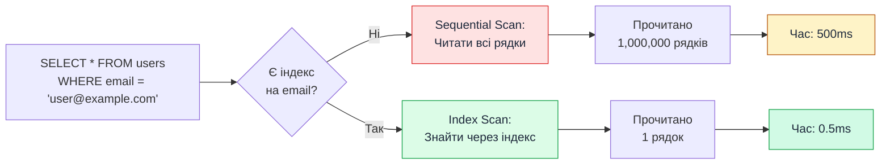

# Індекси та оптимізація запитів

::card-group

::card{title="🎯 Мета лекції" icon="i-lucide-target"}

- Опанувати концепцію індексів (*indexes*) як структур даних для прискорення пошуку у базі даних та зрозуміти їх вплив на продуктивність SELECT, INSERT, UPDATE запитів.
- Навчитися створювати індекси через декоратори TypeORM (`@Index()`, `@Unique()`) для одиночних та складених колонок з урахуванням left-prefix правила.
- Освоїти інструмент `EXPLAIN ANALYZE` для аналізу execution plans та виявлення повільних запитів з Sequential Scan замість Index Scan.
- Вивчити N+1 Problem — класичну проблему продуктивності ORM при завантаженні зв'язаних даних та способи її вирішення через eager loading та JOIN.
- Опанувати best practices оптимізації запитів: вибіркове завантаження полів, пагінація, batch операції, connection pooling та query logging для моніторингу.

::

::card{title="🔑 Ключові терміни" icon="i-lucide-key"}

- **Index (Індекс):** допоміжна структура даних у БД (зазвичай B-Tree), що прискорює пошук записів за значеннями колонок, аналогічно до покажчика у книзі.
- **Sequential Scan (Послідовне сканування):** повільний метод пошуку, коли БД читає **всі рядки** таблиці підряд для пошуку потрібних записів.
- **Index Scan (Індексне сканування):** швидкий метод пошуку, коли БД використовує індекс для безпосереднього переходу до потрібних записів без читання всієї таблиці.
- **Cardinality (Кардинальність):** кількість унікальних значень у колонці; висока кардинальність (багато унікальних значень) — добре для індексів, низька — погано.
- **Composite Index (Складений індекс):** індекс на кілька колонок одночасно, який прискорює запити з умовами на ці колонки у певному порядку.
- **N+1 Problem:** антипаттерн, коли для завантаження N records виконується 1 запит для батьківських entities + N додаткових запитів для кожної дочірньої entity.
- **EXPLAIN ANALYZE:** SQL-команда для аналізу execution plan запиту з реальними метриками виконання (час, кількість рядків, використання індексів).

::

::

---

## Що таке індекси

### Концепція індексів у БД

**Індекс** — це допоміжна структура даних, яку база даних створює для **прискорення пошуку** записів за значеннями колонок. Індекс працює як **покажчик** у книзі: замість того, щоб читати всю книгу (всі рядки таблиці), ви дивитесь у покажчик і переходите відразу до потрібної сторінки (потрібного рядка).

**Аналогія з книгою:**

| Без індексу (Sequential Scan) | З індексом (Index Scan) |
|-------------------------------|-------------------------|
| Читати книгу від початку до кінця, шукаючи слово "TypeORM" | Подивитися у покажчик на букву "T", знайти "TypeORM" → сторінка 142 |
| **Час: O(n)** — пропорційний кількості сторінок | **Час: O(log n)** — логарифмічний час пошуку |

::mermaid



::

**Як працює B-Tree індекс (найпоширеніший тип):**

Індекс зберігає відсортовані значення колонки разом з посиланнями на фізичні рядки у таблиці:

```
Індекс на колонці email:
─────────────────────────────────────
| Email                 | Row ID    |
|----------------------|-----------|
| admin@example.com    | Row 42    |
| john@example.com     | Row 1     |
| user@example.com     | Row 15    |
| zara@example.com     | Row 89    |
─────────────────────────────────────
```

При пошуку `WHERE email = 'user@example.com'` БД:

1. Використовує **бінарний пошук** у індексі (O(log n)).
2. Знаходить `Row 15`.
3. Читає безпосередньо рядок 15 з таблиці.

**Результат:** Замість читання 1,000,000 рядків БД прочитає лише 1 рядок.

### Як індекси прискорюють SELECT

Індекси прискорюють SELECT-запити з умовами `WHERE`, `JOIN`, `ORDER BY`:

**1. Прискорення WHERE:**

```sql
-- Без індексу: Sequential Scan (повільно)
SELECT * FROM users WHERE email = 'user@example.com';
-- Читає всі рядки таблиці

-- З індексом на email: Index Scan (швидко)
-- Використовує індекс для прямого переходу до потрібного рядка
```

**2. Прискорення JOIN:**

```sql
-- Foreign key posts.author_id має індекс автоматично
SELECT * FROM posts
JOIN users ON posts.author_id = users.id
WHERE users.email = 'user@example.com';
-- Індекс на author_id прискорює JOIN
```

**3. Прискорення ORDER BY:**

```sql
-- З індексом на created_at: дані вже відсортовані
SELECT * FROM posts ORDER BY created_at DESC LIMIT 10;
-- БД читає з індексу вже відсортовані записи
```

**Метрики прискорення (приклад):**

| Таблиця | Рядків | Без індексу | З індексом | Прискорення |
|---------|--------|-------------|-----------|-------------|
| users   | 10,000 | 15ms        | 0.5ms     | **30x**     |
| users   | 1,000,000 | 1,500ms  | 1ms       | **1500x**   |
| posts   | 10,000,000 | 8,000ms | 2ms       | **4000x**   |

::tip

**Правило:** Чим **більша таблиця**, тим **більший виграш** від індексу. На малих таблицях (< 1000 рядків) індекс майже не дає ефекту.

::

### Чому індекси уповільнюють INSERT/UPDATE/DELETE

Індекси **не безкоштовні** — вони займають місце на диску та потребують оновлення при кожній зміні даних.

**При INSERT:**

```sql
INSERT INTO users (email, name) VALUES ('new@example.com', 'New User');
```

**Що відбувається:**

1. Вставка рядка у таблицю `users`.
2. **Оновлення індексу на `email`** — додавання нового значення у B-Tree.
3. **Оновлення індексу на `name`** (якщо існує) — ще одне оновлення.
4. **Оновлення primary key індексу** (завжди існує).

**Результат:** Кожен додатковий індекс **уповільнює INSERT** на 5-10%.

**При UPDATE:**

```sql
UPDATE users SET email = 'updated@example.com' WHERE id = 1;
```

**Що відбувається:**

1. Оновлення рядка у таблиці.
2. **Видалення старого значення** з індексу на `email`.
3. **Додавання нового значення** у індекс на `email`.

**При DELETE:**

```sql
DELETE FROM users WHERE id = 1;
```

**Що відбувається:**

1. Видалення рядка з таблиці.
2. **Видалення з усіх індексів**, де цей рядок був присутній.

**Баланс між SELECT та INSERT/UPDATE/DELETE:**

| Операція | Вплив індексів |
|----------|----------------|
| SELECT   | ✅ **Прискорює** (до 1000x) |
| INSERT   | ❌ **Уповільнює** (5-10% за кожен індекс) |
| UPDATE   | ❌ **Уповільнює** (якщо змінюються індексовані колонки) |
| DELETE   | ❌ **Уповільнює** (5-10% за кожен індекс) |

::caution

**Правило золотої середини:**  
Створюйте індекси лише для **часто використовуваних** SELECT-запитів. Не створюйте індекси "на всяк випадок" — це уповільнить INSERT/UPDATE без реального виграшу для SELECT.

::

### B-Tree, Hash, GiST, GIN індекси у PostgreSQL

PostgreSQL підтримує кілька типів індексів для різних сценаріїв.

#### B-Tree (за замовчуванням)

**Найпоширеніший тип індексу.** Використовується для:

- Порівняння: `=`, `<`, `>`, `<=`, `>=`, `BETWEEN`.
- `ORDER BY` та `LIMIT`.
- `LIKE 'prefix%'` (prefix matching).

**Приклад:**

```typescript
@Index()
@Column()
email: string;
// Створює B-Tree індекс
```

**SQL:**

```sql
CREATE INDEX idx_users_email ON users USING BTREE (email);
```

#### Hash

**Використовується лише для точних збігів (`=`).**

**Переваги:**

- Трохи швидше за B-Tree для `=` операцій.

**Недоліки:**

- Не підтримує `<`, `>`, `ORDER BY`.
- Рідко використовується на практиці.

**Приклад:**

```sql
CREATE INDEX idx_users_email_hash ON users USING HASH (email);
```

::note

**У TypeORM** немає прямої підтримки Hash індексів через декоратори. Використовується B-Tree за замовчуванням.

::

#### GiST (Generalized Search Tree)

**Використовується для складних типів даних:**

- Геопросторові дані (PostGIS).
- Full-text search (tsvector).
- Діапазони (range types).

**Приклад — геопросторовий індекс:**

```sql
CREATE INDEX idx_locations_geo ON locations USING GIST (coordinates);
```

#### GIN (Generalized Inverted Index)

**Використовується для:**

- Full-text search.
- JSONB запити.
- Масиви.

**Приклад — full-text search:**

```typescript
@Index('idx_posts_search', { synchronize: false }) // Створюється вручну через міграцію
@Column({ type: 'tsvector' })
searchVector: string;
```

**SQL-міграція:**

```sql
CREATE INDEX idx_posts_search ON posts USING GIN (to_tsvector('english', title || ' ' || content));
```

**Порівняння типів індексів:**

| Тип   | Використання | Операції | Швидкість SELECT | Швидкість INSERT |
|-------|-------------|---------|------------------|------------------|
| B-Tree | Загальне призначення | `=`, `<`, `>`, `ORDER BY` | Швидко | Нормально |
| Hash  | Точні збіги | `=` | Дуже швидко | Нормально |
| GiST  | Складні типи (гео, діапазони) | Перекриття, containment | Середньо | Повільно |
| GIN   | Full-text, JSONB, масиви | `@>`, `@@` (full-text) | Швидко | Дуже повільно |

---

## Декоратор `@Index()`

### Створення індексу на одну колонку

TypeORM надає декоратор `@Index()` для створення індексів через Entity класи.

**Базовий синтаксис:**

```typescript
import { Entity, PrimaryGeneratedColumn, Column, Index } from 'typeorm';

@Entity('users')
export class User {
  @PrimaryGeneratedColumn()
  id: number;

  @Index() // ✅ Створює індекс на колонці email
  @Column()
  email: string;

  @Index() // ✅ Створює індекс на колонці created_at
  @Column()
  createdAt: Date;
}
```

**Генерований SQL:**

```sql
CREATE INDEX "IDX_users_email" ON "users" ("email");
CREATE INDEX "IDX_users_createdAt" ON "users" ("created_at");
```

### Іменування індексів

За замовчуванням TypeORM генерує назву індексу автоматично: `IDX_<table>_<column>`. Ви можете задати власну назву:

```typescript
@Index('idx_user_email') // Кастомна назва
@Column()
email: string;
```

**SQL:**

```sql
CREATE INDEX "idx_user_email" ON "users" ("email");
```

::tip

**Best Practice для іменування:**  
Використовуйте префікс `idx_` + `<table>` + `<column>` для зрозумілості:

- `idx_users_email`
- `idx_posts_author_id`
- `idx_orders_status_created_at` (composite)

::

### `@Index()` на рівні entity

Декоратор `@Index()` можна використовувати на **рівні класу** для складених індексів або індексів з опціями:

```typescript
@Entity('users')
@Index('idx_users_email_name', ['email', 'name']) // Складений індекс
@Index('idx_users_active', ['isActive']) // Простий індекс
export class User {
  @PrimaryGeneratedColumn()
  id: number;

  @Column()
  email: string;

  @Column()
  name: string;

  @Column()
  isActive: boolean;
}
```

**Генерований SQL:**

```sql
CREATE INDEX "idx_users_email_name" ON "users" ("email", "name");
CREATE INDEX "idx_users_active" ON "users" ("is_active");
```

### `@Index()` на рівні колонки

Альтернативно, індекс можна оголосити **безпосередньо на колонці**:

```typescript
@Index()
@Column()
email: string;
```

**Переваги підходу на рівні колонки:**

- Простіше для одиночних індексів.
- Індекс прив'язаний до колонки візуально.

**Переваги підходу на рівні entity:**

- Можливість створювати складені індекси на кілька колонок.
- Можливість додавати опції (unique, where, synchronize).

### Автоматична генерація індексів для foreign keys

TypeORM **автоматично** створює індекси для всіх foreign key колонок при використанні декораторів зв'язків (`@ManyToOne`, `@OneToOne`).

**Приклад:**

```typescript
@Entity('posts')
export class Post {
  @PrimaryGeneratedColumn()
  id: number;

  @ManyToOne(() => User, (user) => user.posts)
  @JoinColumn({ name: 'author_id' })
  author: User;
  // TypeORM автоматично створить індекс на author_id
}
```

**Генерований SQL:**

```sql
CREATE TABLE posts (
    id SERIAL PRIMARY KEY,
    author_id INTEGER NOT NULL,
    CONSTRAINT fk_posts_author FOREIGN KEY (author_id) REFERENCES users(id)
);

CREATE INDEX "IDX_posts_author_id" ON "posts" ("author_id"); -- Автоматично
```

::note

**Чому foreign keys автоматично індексуються?**  
JOIN операції між таблицями зазвичай використовують foreign keys. Індексування FK значно прискорює JOIN запити, тому TypeORM створює їх за замовчуванням.

::

---

## Унікальні індекси

### Декоратор `@Unique()`

**Унікальний індекс** гарантує, що **всі значення** у колонці (або комбінації колонок) є унікальними — не можуть повторюватися.

**Синтаксис:**

```typescript
@Entity('users')
@Unique(['email']) // Унікальний constraint на email
export class User {
  @PrimaryGeneratedColumn()
  id: number;

  @Column()
  email: string;
}
```

**Генерований SQL:**

```sql
ALTER TABLE "users" ADD CONSTRAINT "UQ_users_email" UNIQUE ("email");
```

### `unique: true` у `@Column()`

Альтернативний спосіб — опція `unique` у декораторі `@Column()`:

```typescript
@Column({ unique: true })
email: string;
```

**Результат — те саме:**

```sql
ALTER TABLE "users" ADD CONSTRAINT "UQ_users_email" UNIQUE ("email");
```

### Composite unique constraints

Для унікальності **комбінації колонок** використовуйте `@Unique()` на рівні entity:

```typescript
@Entity('enrollments')
@Unique(['studentId', 'courseId']) // Студент не може зареєструватися на курс двічі
export class Enrollment {
  @PrimaryGeneratedColumn()
  id: number;

  @Column()
  studentId: number;

  @Column()
  courseId: number;

  @Column()
  grade: number;
}
```

**SQL:**

```sql
ALTER TABLE "enrollments" ADD CONSTRAINT "UQ_enrollments_studentId_courseId" UNIQUE ("student_id", "course_id");
```

**Приклад порушення constraint:**

```typescript
// Перша реєстрація — OK
await enrollmentRepository.save({ studentId: 1, courseId: 5, grade: null });

// Друга реєстрація на той самий курс — ERROR
await enrollmentRepository.save({ studentId: 1, courseId: 5, grade: null });
// QueryFailedError: duplicate key value violates unique constraint "UQ_enrollments_studentId_courseId"
```

### Відмінність від звичайного індексу

| Характеристика | Звичайний індекс (`@Index()`) | Унікальний індекс (`@Unique()`) |
|----------------|------------------------------|--------------------------------|
| Дублікати значень | ✅ Дозволені | ❌ Заборонені |
| Прискорення SELECT | ✅ Так | ✅ Так |
| Гарантія унікальності | ❌ Ні | ✅ Так |
| Використання | Пошук, JOIN, ORDER BY | Email, username, унікальні ключі |

**Правило:** Використовуйте `@Unique()` для колонок, що **мають бути унікальними** (email, username, passport number). Використовуйте `@Index()` для прискорення пошуку без вимоги унікальності.

---

## Складені індекси (Composite Indexes)

### Індекс на кілька колонок

**Складений індекс** (composite index) — це індекс на **дві або більше колонок одночасно**. Він прискорює запити з умовами на ці колонки.

**Синтаксис:**

```typescript
@Entity('posts')
@Index('idx_posts_author_status', ['authorId', 'status'])
export class Post {
  @PrimaryGeneratedColumn()
  id: number;

  @Column()
  authorId: number;

  @Column()
  status: string; // 'draft', 'published', 'archived'

  @Column()
  title: string;
}
```

**SQL:**

```sql
CREATE INDEX "idx_posts_author_status" ON "posts" ("author_id", "status");
```

### Порядок колонок має значення

**Критично важливо:** Порядок колонок у складеному індексі **визначає**, які запити він може прискорити.

**Приклад:**

Індекс `(author_id, status)` прискорить:

```sql
-- ✅ Використовує індекс (обидві колонки)
SELECT * FROM posts WHERE author_id = 1 AND status = 'published';

-- ✅ Використовує індекс (тільки author_id)
SELECT * FROM posts WHERE author_id = 1;

-- ❌ НЕ використовує індекс (тільки status)
SELECT * FROM posts WHERE status = 'published';
```

**Чому `WHERE status = 'published'` не використовує індекс?**  
Індекс `(author_id, status)` відсортований **спочатку за author_id**, потім за status. БД не може "перескочити" author_id і шукати лише за status.

### Left-prefix правило

**Left-prefix правило:** Складений індекс `(A, B, C)` може бути використаний для запитів з умовами на:

- `A`
- `A, B`
- `A, B, C`

Але **НЕ** для:

- `B`
- `C`
- `B, C`

**Приклад:**

```typescript
@Index('idx_orders_user_status_date', ['userId', 'status', 'createdAt'])
```

**Які запити прискорить:**

```sql
-- ✅ Використовує індекс
WHERE userId = 1
WHERE userId = 1 AND status = 'pending'
WHERE userId = 1 AND status = 'pending' AND createdAt > '2026-01-01'

-- ❌ НЕ використовує індекс
WHERE status = 'pending'
WHERE createdAt > '2026-01-01'
WHERE status = 'pending' AND createdAt > '2026-01-01'
```

::tip

**Best Practice для порядку колонок:**  
Розташовуйте колонки у складеному індексі за **частотою використання у WHERE**:

1. Найчастіше використовувана колонка (наприклад, `userId`).
2. Друга за частотою (наприклад, `status`).
3. Третя (наприклад, `createdAt` для сортування).

::

### Коли використовувати composite indexes

**Використовуйте складені індекси коли:**

1. **Часті запити з кількома умовами:**

   ```sql
   -- Частий запит
   SELECT * FROM posts WHERE author_id = ? AND status = 'published';
   -- Створіть індекс (author_id, status)
   ```

2. **Запити з сортуванням:**

   ```sql
   -- Запит з ORDER BY
   SELECT * FROM orders WHERE user_id = ? ORDER BY created_at DESC;
   -- Створіть індекс (user_id, created_at)
   ```

3. **Covering index (включає всі потрібні колонки):**

   ```sql
   -- Запит без зайвих полів
   SELECT id, title FROM posts WHERE author_id = ? AND status = 'published';
   -- Індекс (author_id, status, id, title) — БД не потребує читати таблицю
   ```

**Не використовуйте складені індекси коли:**

- Колонки рідко використовуються разом у запитах.
- Окремі індекси на кожну колонку працюють достатньо добре.


---

## Коли створювати індекси

### Колонки у WHERE умовах

**Правило №1:** Якщо колонка **часто використовується** у WHERE умовах, створіть на неї індекс.

**Приклад:**

```typescript
// Частий запит
const activeUsers = await userRepository.find({
  where: { isActive: true },
});

// Рішення: створити індекс
@Index()
@Column()
isActive: boolean;
```

### Колонки для JOIN

**Правило №2:** Колонки, що використовуються у JOIN, мають бути індексовані.

TypeORM автоматично створює індекси для foreign keys, але якщо ви виконуєте JOIN на інших колонках, додайте індекс вручну.

```typescript
// JOIN на email
const posts = await postRepository
  .createQueryBuilder('post')
  .leftJoin('post.author', 'author', 'author.email = :email', { email: 'user@example.com' })
  .getMany();

// Рішення: індекс на email
@Index()
@Column()
email: string;
```

### Колонки для ORDER BY

**Правило №3:** Колонки у ORDER BY та GROUP BY мають бути індексовані.

```typescript
// Запит з сортуванням
const recentPosts = await postRepository.find({
  order: { createdAt: 'DESC' },
  take: 10,
});

// Рішення: індекс на createdAt
@Index()
@Column()
createdAt: Date;
```

### Foreign keys (автоматично)

TypeORM автоматично створює індекси для всіх foreign keys:

```typescript
@ManyToOne(() => User)
@JoinColumn({ name: 'author_id' })
author: User;
// Індекс на author_id створюється автоматично
```

### Часті пошукові запити

**Аналізуйте логи запитів** та створюйте індекси для найчастіших SELECT-запитів.

**Приклад:**

```typescript
// Топ-3 найчастіші запити (з логів):
// 1. SELECT * FROM users WHERE email = ?
// 2. SELECT * FROM posts WHERE status = 'published' AND author_id = ?
// 3. SELECT * FROM orders WHERE user_id = ? ORDER BY created_at DESC

// Рішення:
@Index() email: string;
@Index(['status', 'authorId']) // Composite
@Index(['userId', 'createdAt']) // Composite для ORDER BY
```

---

## Коли НЕ потрібні індекси

### Малі таблиці (< 1000 рядків)

На малих таблицях **Sequential Scan** може бути швидшим за Index Scan через overhead індексу.

**Приклад:**

```typescript
// Таблиця roles має лише 5 рядків ('admin', 'editor', 'viewer', 'guest', 'superadmin')
@Entity('roles')
export class Role {
  @PrimaryGeneratedColumn()
  id: number;

  @Column() // ❌ Індекс не потрібен — таблиця мала
  name: string;
}
```

### Колонки з low cardinality (мало унікальних значень)

**Cardinality (кардинальність)** — кількість унікальних значень у колонці.

**Low cardinality:** Колонка має мало унікальних значень (наприклад, `gender`, `status`, `isActive`).

**Приклад:**

```typescript
@Column()
gender: 'male' | 'female' | 'other'; // Лише 3 можливі значення
// ❌ Індекс майже не дасть ефекту
```

**Чому індекс неефективний?**

Якщо 50% записів мають `gender = 'male'`, БД все одно прочитає **половину таблиці**, що майже те саме, що Sequential Scan.

**Виняток:** Якщо ви шукаєте **рідкісне значення** (наприклад, `status = 'archived'` — 0.1% записів), індекс може допомогти.

### Рідко використовувані колонки

Якщо колонка використовується у запитах **рідко** (наприклад, раз на місяць), не створюйте індекс — він уповільнить INSERT/UPDATE без реального виграшу.

### Дублювання індексів

**Частая помилка:** Створення індексів, які вже покриті іншими індексами.

**Приклад дублікату:**

```typescript
@Index('idx_posts_author', ['authorId']) // Індекс 1
@Index('idx_posts_author_status', ['authorId', 'status']) // Індекс 2
```

**Проблема:** Індекс 2 `(authorId, status)` **покриває** індекс 1 `(authorId)` завдяки left-prefix правилу. Індекс 1 — дублікат, його можна видалити.

::tip

**Best Practice:**  
Використовуйте складені індекси замість кількох одиночних, якщо колонки часто використовуються разом.

::

---

## EXPLAIN ANALYZE для аналізу

### Команда EXPLAIN у PostgreSQL

**EXPLAIN** показує **execution plan** запиту — як БД планує виконати запит (які індекси використає, скільки рядків прочитає, яка оцінка вартості).

**Базовий синтаксис:**

```sql
EXPLAIN SELECT * FROM users WHERE email = 'user@example.com';
```

**Вивід:**

```
Seq Scan on users  (cost=0.00..18.50 rows=1 width=100)
  Filter: (email = 'user@example.com'::text)
```

**Пояснення:**

- `Seq Scan` — Sequential Scan (повільно).
- `cost=0.00..18.50` — оцінка вартості (0 = старт, 18.50 = кінець).
- `rows=1` — очікувана кількість рядків.

### EXPLAIN ANALYZE для реального виконання

**EXPLAIN ANALYZE** виконує запит **реально** та показує фактичні метрики.

```sql
EXPLAIN ANALYZE SELECT * FROM users WHERE email = 'user@example.com';
```

**Вивід:**

```
Index Scan using idx_users_email on users  (cost=0.29..8.31 rows=1 width=100) (actual time=0.025..0.026 rows=1 loops=1)
  Index Cond: (email = 'user@example.com'::text)
Planning Time: 0.102 ms
Execution Time: 0.045 ms
```

**Пояснення:**

- `Index Scan using idx_users_email` — використовує індекс (швидко!).
- `actual time=0.025..0.026` — реальний час виконання (мілісекунди).
- `rows=1` — реально прочитано 1 рядок.
- `Execution Time: 0.045 ms` — загальний час виконання.

### Читання execution plan

**Sequential Scan vs Index Scan:**

```sql
-- Sequential Scan (погано)
Seq Scan on posts  (cost=0.00..1500.00 rows=50000 width=200)
  Filter: (status = 'published')

-- Index Scan (добре)
Index Scan using idx_posts_status on posts  (cost=0.42..100.00 rows=5000 width=200)
  Index Cond: (status = 'published')
```

**Як виконати EXPLAIN у TypeORM:**

```typescript
const result = await dataSource.query(`
  EXPLAIN ANALYZE
  SELECT * FROM posts WHERE status = 'published'
`);
console.log(result);
```

### Cost estimation

**Cost** — це оцінка **відносної вартості** операції. Чим менше значення, тим швидше запит.

**Приклад:**

```
Seq Scan  (cost=0.00..1500.00)  ❌ Повільно
Index Scan (cost=0.42..100.00) ✅ Швидко
```

**Cost складається з:**

- **Startup cost** (перше число) — час до початку повернення рядків.
- **Total cost** (друге число) — загальний час виконання.

### Actual time measurements

**Actual time** показує реальний час виконання у мілісекундах.

```
actual time=0.025..0.026 rows=1 loops=1
```

- `0.025` — startup time.
- `0.026` — total time.
- `rows=1` — кількість повернутих рядків.
- `loops=1` — скільки разів виконувалася операція.

---

## N+1 Problem

### Що таке N+1 problem

**N+1 Problem** — це класична проблема продуктивності ORM, коли для завантаження N records виконується **1 запит для батьківських entities + N додаткових запитів** для кожної дочірньої entity.

**Приклад проблеми:**

```typescript
// ❌ ПОГАНО: N+1 Problem
const users = await userRepository.find(); // 1 запит: SELECT * FROM users

for (const user of users) {
  const posts = await postRepository.find({ where: { authorId: user.id } }); // N запитів!
  console.log(`${user.name} має ${posts.length} постів`);
}

// Якщо users.length = 100, виконається 101 запит!
```

**SQL-запити:**

```sql
-- Запит 1
SELECT * FROM users;

-- Запит 2 (для user 1)
SELECT * FROM posts WHERE author_id = 1;

-- Запит 3 (для user 2)
SELECT * FROM posts WHERE author_id = 2;

-- ... ще 98 запитів
```

### Eager loading як рішення

**Рішення 1 — через `relations`:**

```typescript
// ✅ ДОБРЕ: Один запит з JOIN
const users = await userRepository.find({
  relations: ['posts'],
});

for (const user of users) {
  console.log(`${user.name} має ${user.posts.length} постів`);
}
```

**SQL:**

```sql
SELECT u.*, p.*
FROM users u
LEFT JOIN posts p ON p.author_id = u.id;
```

### `leftJoinAndSelect()` у QueryBuilder

**Рішення 2 — через QueryBuilder:**

```typescript
const users = await userRepository
  .createQueryBuilder('user')
  .leftJoinAndSelect('user.posts', 'post')
  .getMany();
```

**Переваги QueryBuilder:**

- Можливість додати умови на JOIN.
- Фільтрація зв'язаних даних.

```typescript
// Завантажити користувачів лише з опублікованими постами
const users = await userRepository
  .createQueryBuilder('user')
  .leftJoinAndSelect('user.posts', 'post', 'post.status = :status', { status: 'published' })
  .getMany();
```

---

## Оптимізація запитів у TypeORM

### Вибір тільки потрібних полів через `select`

**Проблема:** Завантаження всіх колонок, коли потрібні лише деякі.

```typescript
// ❌ ПОГАНО: Завантажує всі колонки (включно з великими TEXT полями)
const users = await userRepository.find();
```

**Рішення:**

```typescript
// ✅ ДОБРЕ: Вибір лише потрібних полів
const users = await userRepository
  .createQueryBuilder('user')
  .select(['user.id', 'user.email', 'user.name'])
  .getMany();
```

### Pagination для великих датасетів

**Завжди використовуйте пагінацію** для списків даних:

```typescript
const page = 1;
const limit = 20;

const [items, total] = await postRepository.findAndCount({
  skip: (page - 1) * limit,
  take: limit,
  order: { createdAt: 'DESC' },
});

return {
  items,
  total,
  page,
  pageCount: Math.ceil(total / limit),
};
```

### Використання `getRawMany()` замість entities

Якщо вам не потрібні Entity екземпляри (методи, життєвий цикл), використовуйте `getRawMany()` для економії пам'яті:

```typescript
// Entity екземпляри (повільно)
const users = await userRepository.find();

// Raw об'єкти (швидше)
const users = await userRepository
  .createQueryBuilder('user')
  .select(['user.id', 'user.name'])
  .getRawMany();
```

### Batch операції замість циклів

**❌ ПОГАНО: Окремі запити у циклі:**

```typescript
for (const post of posts) {
  await postRepository.update({ id: post.id }, { views: post.views + 1 });
}
// N запитів UPDATE
```

**✅ ДОБРЕ: Один batch UPDATE:**

```typescript
const ids = posts.map(p => p.id);
await postRepository.increment({ id: In(ids) }, 'views', 1);
// Один запит UPDATE WHERE id IN (...)
```

---

## Підсумки

::card-group

::card{title="✅ Що ми опанували" icon="i-lucide-check-circle"}

- **Концепцію індексів:** Зрозуміли, як B-Tree індекси прискорюють SELECT до 1000x, але уповільнюють INSERT/UPDATE на 5-10%.
- **Декоратори TypeORM:** Навчилися створювати індекси через `@Index()` та `@Unique()` на одиночних та складених колонках.
- **Composite indexes:** Освоїли left-prefix правило та правильний порядок колонок у складених індексах.
- **EXPLAIN ANALYZE:** Вивчили аналіз execution plans для виявлення Sequential Scan замість Index Scan.
- **N+1 Problem:** Зрозуміли класичну проблему продуктивності ORM та способи її вирішення через eager loading.
- **Оптимізацію запитів:** Опанували вибіркове завантаження полів, пагінацію, batch операції та моніторинг запитів.

::

::card{title="⚠️ Важливі застереження" icon="i-lucide-alert-triangle"}

- **Не створюйте індекси на всяк випадок** — кожен індекс уповільнює INSERT/UPDATE на 5-10%.
- **Порядок колонок у composite index критичний** — left-prefix правило визначає, які запити будуть прискорені.
- **Low cardinality колонки** (gender, status з 2-3 значеннями) майже не виграють від індексів.
- **Завжди аналізуйте EXPLAIN ANALYZE** перед додаванням індексу — переконайтесь, що він реально використовується.
- **N+1 Problem — найчастіша помилка** — завжди використовуйте `relations` або `leftJoinAndSelect()` для зв'язків.
- **Малі таблиці (< 1000 рядків)** не потребують індексів — Sequential Scan буде швидше.

::

::card{title="📚 Що далі" icon="i-lucide-book-open"}

Ви завершили модуль **"Зв'язки між сутностями, міграції та оптимізація запитів"**! 

Тепер ви опанували:
- Всі типи зв'язків (One-to-Many, Many-to-One, One-to-One, Many-to-Many).
- Міграції для версіонування схеми БД.
- Транзакції для забезпечення цілісності даних.
- Індекси та оптимізацію для швидкості запитів.

**Наступні теми для вивчення:**

- Advanced TypeORM: Query Builder, Raw SQL, Custom Repositories.
- Кешування запитів через Redis.
- Full-text search з PostgreSQL та Elasticsearch.
- Реплікація та sharding для масштабування БД.

::

::

---

## Запитання для самоконтролю

::accordion

::accordion-item{label="❓ Чому індекс прискорює SELECT, але уповільнює INSERT?" icon="i-lucide-help-circle"}

**Прискорення SELECT:**

Індекс — це відсортована структура даних (B-Tree), яка дозволяє БД **швидко знайти** потрібний рядок через бінарний пошук (O(log n)) замість читання всіх рядків (O(n)).

**Уповільнення INSERT:**

При кожному INSERT БД має:

1. Вставити рядок у таблицю.
2. **Оновити всі індекси** на цій таблиці — додати нове значення у B-Tree структуру кожного індексу.

Кожен додатковий індекс додає 5-10% overhead до INSERT/UPDATE/DELETE операцій.

**Баланс:** Створюйте індекси лише для **часто використовуваних** SELECT-запитів, а не "на всяк випадок".

::

::accordion-item{label="❓ Чому складений індекс (author_id, status) не прискорює запит WHERE status = 'published'?" icon="i-lucide-help-circle"}

Це пов'язано з **left-prefix правилом**:

Складений індекс `(author_id, status)` відсортований **спочатку за author_id**, потім за status:

```
Індекс:
─────────────────────────
| author_id | status    |
|-----------|-----------|
| 1         | draft     |
| 1         | published |
| 2         | archived  |
| 2         | published |
```

**Запит `WHERE author_id = 1`:**

БД може використати індекс — знайти всі рядки з `author_id = 1` (швидко).

**Запит `WHERE status = 'published'`:**

БД не може "перескочити" author_id та шукати лише за status. Індекс не допоможе → Sequential Scan.

**Рішення:** Створіть окремий індекс на `status`, якщо запити без `author_id` часті.

::

::accordion-item{label="❓ Що таке N+1 Problem і як його виправити?" icon="i-lucide-help-circle"}

**N+1 Problem:**

Для завантаження N records виконується 1 запит для батьківських entities + N додаткових запитів для кожної дочірньої entity.

**Приклад:**

```typescript
// ❌ N+1 Problem
const users = await userRepository.find(); // 1 запит
for (const user of users) {
  const posts = await postRepository.find({ where: { authorId: user.id } }); // N запитів
}
// Якщо users.length = 100, виконається 101 запит!
```

**Рішення — eager loading:**

```typescript
// ✅ Один запит з JOIN
const users = await userRepository.find({
  relations: ['posts'],
});
// Або через QueryBuilder:
const users = await userRepository
  .createQueryBuilder('user')
  .leftJoinAndSelect('user.posts', 'post')
  .getMany();
```

**Тепер виконується лише 1 SQL-запит** з LEFT JOIN замість N+1.

::

::accordion-item{label="❓ Як визначити, чи використовується індекс у запиті?" icon="i-lucide-help-circle"}

Використовуйте **EXPLAIN ANALYZE** для аналізу execution plan:

```sql
EXPLAIN ANALYZE SELECT * FROM users WHERE email = 'user@example.com';
```

**Шукайте у виводі:**

```
✅ Index Scan using idx_users_email  -- Індекс використовується (добре)
❌ Seq Scan on users                 -- Sequential Scan (погано, індекс не використовується)
```

**У TypeORM:**

```typescript
const result = await dataSource.query(`
  EXPLAIN ANALYZE
  SELECT * FROM users WHERE email = $1
`, ['user@example.com']);
console.log(result);
```

**Якщо бачите Sequential Scan** — індекс не створений або не використовується (low cardinality, мала таблиця тощо).

::

::accordion-item{label="❓ Коли НЕ потрібно створювати індекс?" icon="i-lucide-help-circle"}

**Не створюйте індекс коли:**

1. **Таблиця мала (< 1000 рядків):** Sequential Scan швидше за Index Scan через overhead індексу.

2. **Low cardinality (мало унікальних значень):**
   ```typescript
   @Column()
   gender: 'male' | 'female'; // Лише 2 значення — індекс неефективний
   ```

3. **Колонка рідко використовується у WHERE:** Якщо запити на цю колонку виконуються раз на місяць, індекс уповільнить INSERT без реального виграшу.

4. **Дублювання індексів:** Індекс `(author_id, status)` покриває індекс `(author_id)` завдяки left-prefix правилу — окремий індекс на `author_id` не потрібен.

**Правило:** Створюйте індекси **лише для часто використовуваних** SELECT-запитів на основі аналізу логів та EXPLAIN ANALYZE.

::

::

