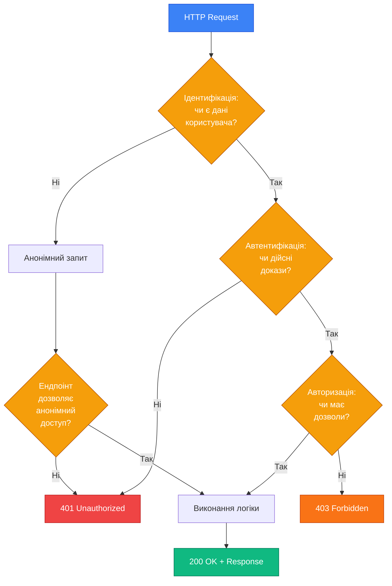

# Автентифікація vs Авторизація

## Короткий зміст

У цій лекції розглядаються фундаментальні відмінності між трьома ключовими процесами безпеки веб-застосунків:

- **Ідентифікація** — визначення унікального користувача у системі (за email, username, ID)
- **Автентифікація** — підтвердження особи користувача (перевірка паролю, токена, біометрії)
- **Авторизація** — надання прав доступу до ресурсів після автентифікації (перевірка ролей, дозволів)

Вивчається взаємозв'язок цих процесів у конвеєрі безпеки, відмінності між HTTP статус-кодами 401 (Unauthorized) та 403 (Forbidden), а також послідовність виконання перевірок: Ідентифікація → Автентифікація → Авторизація → Виконання дії. Розглядаються практичні приклади з реального життя та реалізації у NestJS через Guards.

---

::card-group

::card{title="🎯 Мета лекції" icon="i-lucide-target"}

- Чітко розмежувати поняття ідентифікації, автентифікації та авторизації у контексті веб-застосунків.
- Зрозуміти послідовність виконання перевірок безпеки у конвеєрі обробки HTTP-запитів.
- Навчитися розпізнавати відповідні HTTP статус-коди та їхнє семантичне значення у відповідях API.
- Ознайомитися з концептуальною основою для подальшого вивчення конкретних механізмів автентифікації.

::

::card{title="🔑 Ключові терміни" icon="i-lucide-key"}

- **Identity (Ідентичність):** унікальні характеристики користувача у системі, що дозволяють відрізнити його від інших.
- **Authentication (Автентифікація):** процес підтвердження ідентичності через надання доказів (credentials).
- **Authorization (Авторизація):** процес перевірки дозволів на виконання дії або доступ до ресурсу.
- **Principal (Суб'єкт):** автентифікований користувач або сервіс, від імені якого виконуються дії у системі.

::

::

---

## Фундаментальна відмінність понять

Безпека сучасних веб-застосунків спирається на три послідовні процеси, які часто плутають між собою через їхню тісну взаємодію у конвеєрі обробки запитів. Проте кожен із цих процесів виконує чітко визначену роль і відповідає на окреме питання про користувача та його наміри.

**Ідентифікація** (*identification*) відповідає на питання **«Хто ви?»**. Це процес встановлення унікального ідентифікатора користувача у системі — адреси електронної пошти, імені користувача (*username*), номера телефону або внутрішнього UUID. Ідентифікатор дозволяє системі знайти запис користувача у базі даних, але не підтверджує, що особа, яка надала цей ідентифікатор, дійсно є законним власником облікового запису.

**Автентифікація** (*authentication*) відповідає на питання **«Як ви можете це довести?»**. Після того, як система ідентифікувала користувача за його ідентифікатором, необхідно перевірити, чи дійсно цей користувач є тим, за кого себе видає. Для цього система запитує **докази ідентичності** (*credentials*) — пароль, одноразовий код з SMS, біометричний зразок або криптографічний підпис. Успішна автентифікація означає, що користувач довів своє право представляти цю ідентичність.

**Авторизація** (*authorization*) відповідає на питання **«Що вам дозволено робити?»**. Навіть після того, як система переконалася у справжності користувача, необхідно визначити, які саме дії він може виконувати та до яких ресурсів має доступ. Один користувач може мати роль адміністратора з правом видаляти дані інших користувачів, тоді як інший — лише переглядати власний профіль. Авторизація оперує поняттями ролей (*roles*), дозволів (*permissions*), політик доступу (*access policies*) та областей видимості ресурсів (*resource scopes*).

::note
У повсякденній мові термін **«authentication»** часто перекладають як **«аутентифікація»**, але у технічній літературі українською мовою закріпився варіант **«автентифікація»**. Обидва варіанти є коректними, проте ми дотримуватимемося академічного стандарту з літерою «е».
::

---

## Послідовність виконання у конвеєрі безпеки

Ці три процеси завжди виконуються у фіксованій послідовності, що формує **конвеєр безпеки** (*security pipeline*) у серверному застосунку. Порушення цього порядку призводить до вразливостей безпеки — наприклад, якщо система спробує авторизувати користувача до того, як перевірить його автентичність, зловмисник зможе надіслати підроблені дані про свою роль.

### Етапи обробки HTTP-запиту з перевірками безпеки

::steps

### Крок 1. Ідентифікація користувача
Сервер отримує HTTP-запит і намагається визначити, від імені якого користувача цей запит надіслано. Для цього він аналізує заголовки запиту:

- **Authorization: Bearer <token>** — токен може містити ідентифікатор користувача у закодованому вигляді (наприклад, у JWT).
- **Cookie: sessionId=abc123** — ідентифікатор сесії дозволяє знайти збережені дані користувача на сервері або у Redis.
- **X-User-ID: 42** — у внутрішніх API іноді явно передають ідентифікатор для спрощення відлагодження (небезпечно для публічних API).

Якщо жоден із цих механізмів не надає ідентифікатора, запит вважається **анонімним** (*anonymous request*). Деякі ендпоінти, як-от сторінка реєстрації або документація API, дозволяють анонімний доступ, тому відсутність ідентифікації на цьому етапі не обов'язково призводить до відхилення запиту.

### Крок 2. Автентифікація доказів ідентичності
Якщо запит містить дані для автентифікації, сервер перевіряє їхню справжність:

- **Перевірка підпису токена** — для JWT перевіряється криптографічний підпис за допомогою публічного ключа або спільного секрету.
- **Пошук сесії у сховищі** — для session-based автентифікації сервер звертається до Redis або бази даних, щоб перевірити, чи існує сесія з таким ідентифікатором і чи не закінчився її термін дії (*TTL* — *time to live*).
- **Виклик зовнішнього сервісу** — для OAuth 2.0 сервер може звернутися до API провайдера (Google, GitHub), щоб підтвердити токен доступу.

Якщо перевірка не проходить (недійсний підпис, сесія не знайдена, токен застарів), сервер повертає **401 Unauthorized** і зупиняє обробку запиту. Це означає: «Ви не довели свою ідентичність, спочатку увійдіть до системи».

### Крок 3. Авторизація доступу до ресурсу
Після успішної автентифікації сервер знає, **хто** виконує запит, але ще не знає, **чи має право** цей користувач виконати саме цю дію. Система перевіряє:

- **Роль користувача** — чи є користувач адміністратором, модератором або звичайним користувачем?
- **Власність ресурсу** — чи намагається користувач редагувати свій власний профіль або чужий?
- **Область видимості токена** (*scope*) — чи містить OAuth токен дозвіл `read:profile`, необхідний для цього ендпоінту?

Якщо перевірка авторизації не проходить, сервер повертає **403 Forbidden**. Це означає: «Ми знаємо, хто ви, але вам заборонено виконувати цю дію».

### Крок 4. Виконання бізнес-логіки
Лише після проходження всіх попередніх етапів запит потрапляє до обробника (*handler*), що виконує корисну роботу — зчитує дані з бази, змінює стан ресурсу, викликає зовнішні сервіси. На цьому етапі система може оперувати об'єктом **Principal** (суб'єкт), що містить ідентифікатор користувача та його ролі.

::

::tip
У фреймворках на кшталт NestJS етапи автентифікації та авторизації реалізуються через **Guards** — спеціальні класи, що виконуються до виклику обробника маршруту. Кожен Guard реалізує метод `canActivate()`, який повертає `true` (дозволити виконання) або `false` (відхилити запит).
::


---

## Практичні приклади з реального життя

Розглянемо кілька сценаріїв, що ілюструють відмінність між автентифікацією та авторизацією у повсякденних ситуаціях за межами програмування. Ці аналогії допоможуть інтуїтивно відчути межу між процесами.

### Приклад 1: Вхід до корпоративної будівлі

Уявіть, що ви приходите на роботу до офісу великої компанії, де діє багаторівнева система контролю доступу.

**Ідентифікація:** ви підходите до турнікета на першому поверсі та прикладаєте свій бейдж із фотографією та ім'ям до зчитувача. Система зчитує ваш унікальний ідентифікатор співробітника — скажімо, `EMP-042`. Це відповідь на питання «Хто ви?».

**Автентифікація:** охоронець порівнює фотографію на бейджі з вашим обличчям. Альтернативно, турнікет може запросити PIN-код або відбиток пальця, щоб підтвердити, що ви дійсно є власником цього бейджа, а не хтось, хто його знайшов або вкрав. Це відповідь на питання «Як ви можете довести, що це ваш бейдж?».

**Авторизація:** після проходження турнікета ви намагаєтеся увійти до ліфта, що веде на 12-й поверх, де розташований серверний зал (*data center*). Але ваш бейдж має рівень доступу «Розробник», тоді як для серверного залу потрібен рівень «Системний адміністратор». Система блокує двері ліфта та відображає повідомлення «Доступ заборонено». Це відповідь на питання «Що вам дозволено робити?». При цьому система не ставить під сумнів вашу ідентичність — вона лише констатує, що ваших дозволів недостатньо для цієї дії.

### Приклад 2: API системи онлайн-банкінгу

Розглянемо сценарій використання мобільного застосунку банку для переказу коштів.

**Ідентифікація:** після запуску застосунку на вашому смартфоні він надсилає збережений токен доступу у заголовку `Authorization: Bearer eyJhbGc...`. Сервер банку декодує цей токен і витягує з нього ідентифікатор вашого облікового запису — внутрішній UUID `550e8400-e29b-41d4-a716-446655440000`. Система знаходить ваш запис у таблиці `users` бази даних.

**Автентифікація:** сервер перевіряє криптографічний підпис JWT токена за допомогою свого секретного ключа. Якщо підпис не співпадає або термін дії токена закінчився (`exp` claim перевищено), сервер повертає `401 Unauthorized` з повідомленням `"error": "Token expired, please log in again"`. Це означає, що система не може довіритися наданому токену і вимагає повторної автентифікації — введення паролю та одноразового коду з SMS.

**Авторизація:** припустимо, що ваш токен дійсний, і ви намагаєтеся перевести гроші з рахунку вашого друга на власний рахунок, підробивши параметр `fromAccountId` у запиті:

```typescript
// Запит від клієнта
POST /api/v1/transfers
Authorization: Bearer <ваш_дійсний_токен>
Content-Type: application/json

{
  "fromAccountId": "acc-friend-12345",  // Чужий рахунок!
  "toAccountId": "acc-yours-67890",
  "amount": 1000,
  "currency": "UAH"
}
```

Сервер успішно ідентифікував вас і підтвердив автентичність токена, але під час перевірки авторизації він виявляє, що рахунок `acc-friend-12345` не належить вашому користувачеві. Система відхиляє запит і повертає **403 Forbidden** з повідомленням:

```json
{
  "statusCode": 403,
  "error": "Forbidden",
  "message": "You do not have permission to transfer money from this account"
}
```

::warning
Ніколи не плутайте коди **401 Unauthorized** та **403 Forbidden**. Хоча назва `401 Unauthorized` є історично некоректною (правильніше було б `401 Unauthenticated`), вона означає саме відсутність або недійсність автентифікації. Код `403` використовується виключно для відмови у доступі **після успішної автентифікації**.
::

---

## HTTP статус-коди у контексті автентифікації та авторизації

Протокол HTTP визначає спеціальні коди відповідей, що сигналізують про проблеми безпеки на різних етапах конвеєра. Розуміння семантичного значення цих кодів дозволяє клієнтським застосункам коректно реагувати на помилки — наприклад, перенаправляти користувача на сторінку входу при отриманні `401` або відображати повідомлення про недостатні дозволи при отриманні `403`.

### Код 401 Unauthorized: «Ви не автентифіковані»

Цей код означає, що сервер не зміг перевірити ідентичність користувача або надані докази ідентичності виявилися недійсними. Відповідь `401` **обов'язково** повинна містити заголовок `WWW-Authenticate`, що вказує на підтримувані методи автентифікації:

```http
HTTP/1.1 401 Unauthorized
WWW-Authenticate: Bearer realm="api", error="invalid_token", error_description="Token has expired"
Content-Type: application/json

{
  "statusCode": 401,
  "message": "Token expired, please log in again",
  "error": "Unauthorized"
}
```

**Типові причини повернення 401:**

- Відсутній заголовок `Authorization` у запиті до захищеного ендпоінту.
- JWT токен має недійсний підпис або змінений вміст (*payload*).
- Термін дії токена (*expiration time*) закінчився.
- Сесія користувача знищена на сервері (наприклад, після явного виходу або тайм-ауту).
- Пароль, переданий у запиті, не співпадає з хешем, збереженим у базі даних.

**Очікувана реакція клієнта:**

- Перенаправлення користувача на сторінку входу або модальне вікно автентифікації.
- Спроба оновити токен доступу (*access token*) за допомогою токена оновлення (*refresh token*).
- Видалення локально збереженого недійсного токена з `localStorage` або `sessionStorage`.

### Код 403 Forbidden: «Ви не авторизовані»

Цей код означає, що сервер **успішно ідентифікував та автентифікував** користувача, але цей користувач не має достатніх дозволів для виконання запитуваної дії або доступу до ресурсу. На відміну від `401`, повторна спроба з тими самими обліковими даними не призведе до успіху — користувачеві потрібні інші ролі або дозволи.

```http
HTTP/1.1 403 Forbidden
Content-Type: application/json

{
  "statusCode": 403,
  "message": "Access denied: Admin role required",
  "error": "Forbidden"
}
```

**Типові причини повернення 403:**

- Користувач має роль `user`, але намагається виконати дію, доступну лише для ролі `admin`.
- Токен OAuth 2.0 не містить необхідної області видимості (*scope*) — наприклад, токен має `read:profile`, але ендпоінт вимагає `write:profile`.
- Користувач намагається змінити дані, що належать іншому користувачеві, без відповідних дозволів.
- IP-адреса клієнта не входить до білого списку (*whitelist*) для цього API.

**Очікувана реакція клієнта:**

- Відображення повідомлення про недостатні дозволи з поясненням, які саме ролі необхідні.
- Приховування кнопок або посилань на дії, для яких користувач не має дозволів (проактивна перевірка на клієнті).
- Пропозиція зв'язатися з адміністратором для надання додаткових прав.

::caution
Ніколи не покладайтеся виключно на клієнтську перевірку дозволів (приховування кнопок у інтерфейсі). Зловмисник може обійти інтерфейс і надіслати HTTP-запит безпосередньо через `curl` або Postman. Авторизація **завжди** має виконуватися на сервері.
::

### Код 404 Not Found: маскування відсутності ресурсу

У деяких випадках повернення коду `403 Forbidden` може розкрити зловмиснику інформацію про існування ресурсу, до якого він не має доступу. Наприклад, якщо API повертає `403` для запиту `GET /api/v1/users/secret-admin-42`, але `404` для `GET /api/v1/users/non-existent-999`, зловмисник зрозуміє, що користувач `secret-admin-42` дійсно існує у системі.

Для захисту від такого витоку інформації (*information disclosure*) деякі API навмисно повертають `404 Not Found` замість `403 Forbidden` для ресурсів, до яких користувач не має доступу:

```typescript
// Логіка на сервері (NestJS)
async getUser(userId: string, requestingUser: User): Promise<UserDto> {
  const user = await this.userRepository.findById(userId);
  
  if (!user) {
    throw new NotFoundException('User not found');
  }
  
  // Якщо користувач не є адміністратором і намагається переглянути чужий профіль
  if (requestingUser.role !== 'admin' && user.id !== requestingUser.id) {
    // Повертаємо 404 замість 403, щоб не розкривати існування користувача
    throw new NotFoundException('User not found');
  }
  
  return this.mapToDto(user);
}
```

Цей підхід є компромісом між безпекою та прозорістю API. У внутрішніх корпоративних системах часто віддають перевагу чесному `403`, тоді як у публічних API — маскуванню через `404`.


---

## Візуалізація конвеєра безпеки

Для кращого розуміння послідовності перевірок розглянемо діаграму потоку обробки HTTP-запиту через фільтри безпеки у типовому веб-застосунку на основі NestJS.

::mermaid



::

**Пояснення вузлів діаграми:**

1. **HTTP Request (Вхідний запит):** клієнт (браузер, мобільний застосунок, інший сервіс) надсилає запит на сервер з заголовками, тілом та параметрами маршруту.

2. **Ідентифікація:** система намагається витягти дані про користувача з заголовків `Authorization`, `Cookie` або інших джерел. Якщо дані відсутні, запит класифікується як анонімний.

3. **Анонімний запит:** для публічних ендпоінтів (реєстрація, документація API, сторінка входу) анонімний доступ дозволений. У противному випадку система повертає `401 Unauthorized` з вимогою автентифікації.

4. **Автентифікація:** перевірка підпису токена, пошук сесії у Redis, виклик зовнішнього OAuth провайдера. Якщо докази недійсні або застаріли — `401 Unauthorized`.

5. **Авторизація:** після підтвердження ідентичності система перевіряє, чи має цей конкретний користувач право виконати дію. Перевірка може базуватися на ролях (`user`, `admin`), дозволах (`read:posts`, `write:posts`) або власності ресурсу. Відсутність дозволів призводить до `403 Forbidden`.

6. **Виконання логіки:** запит потрапляє до обробника контролера, де виконується бізнес-логіка — зміна даних у базі, виклик зовнішніх API, формування відповіді.

7. **200 OK + Response:** успішна відповідь з результатом операції.

---

## Реалізація у NestJS через Guards

Фреймворк NestJS надає потужний механізм **Guards** (*охоронці*) для реалізації автентифікації та авторизації у декларативному стилі. Guard — це клас, що реалізує інтерфейс `CanActivate` з єдиним методом `canActivate()`, який повертає булеве значення або Promise булевого значення.

### Базовий приклад: Authentication Guard

Розглянемо спрощений приклад Guard, що перевіряє наявність та дійсність JWT токена у заголовку запиту:

```typescript
// auth.guard.ts
import { Injectable, CanActivate, ExecutionContext, UnauthorizedException } from '@nestjs/common';
import { JwtService } from '@nestjs/jwt';
import { Request } from 'express';

@Injectable()
export class AuthGuard implements CanActivate {
  constructor(private jwtService: JwtService) {}

  async canActivate(context: ExecutionContext): Promise<boolean> {
    // Витягуємо HTTP-запит з контексту виконання
    const request = context.switchToHttp().getRequest<Request>();
    
    // Отримуємо значення заголовка Authorization
    const authHeader = request.headers.authorization;
    
    if (!authHeader) {
      throw new UnauthorizedException('Missing authorization header');
    }

    // Очікуємо формат: "Bearer <token>"
    const [type, token] = authHeader.split(' ');
    
    if (type !== 'Bearer' || !token) {
      throw new UnauthorizedException('Invalid authorization format');
    }

    try {
      // Перевіряємо підпис токена та декодуємо payload
      const payload = await this.jwtService.verifyAsync(token, {
        secret: process.env.JWT_SECRET,
      });

      // Зберігаємо дані користувача у запиті для подальшого використання
      request.user = payload;
      
      // Дозволяємо виконання запиту
      return true;
    } catch (error) {
      // Токен недійсний або застарів
      throw new UnauthorizedException('Invalid or expired token');
    }
  }
}
```

**Застосування Guard до маршруту:**

```typescript
// users.controller.ts
import { Controller, Get, UseGuards } from '@nestjs/common';
import { AuthGuard } from './auth.guard';

@Controller('users')
export class UsersController {
  // Цей ендпоінт захищений — потрібна автентифікація
  @Get('profile')
  @UseGuards(AuthGuard)
  getProfile(@Request() req) {
    // Дані користувача доступні через req.user (встановлені Guard)
    return {
      userId: req.user.sub,
      email: req.user.email,
      roles: req.user.roles,
    };
  }

  // Цей ендпоінт публічний — Guard не застосовується
  @Get('public-info')
  getPublicInfo() {
    return { message: 'This data is available to everyone' };
  }
}
```

::tip
Замість ручного декорування кожного маршруту через `@UseGuards()` можна застосувати Guard глобально для всього застосунку:

```typescript
// main.ts
const app = await NestFactory.create(AppModule);
app.useGlobalGuards(new AuthGuard(app.get(JwtService)));
```

Для публічних ендпоінтів у такому випадку використовується спеціальний декоратор `@Public()`, що пропускає автентифікацію.
::

### Приклад: Authorization Guard на основі ролей

Після успішної автентифікації система знає, **хто** виконує запит (дані у `req.user`). Тепер необхідно перевірити, **що** цей користувач може робити. Розглянемо Guard, що перевіряє наявність необхідної ролі:

```typescript
// roles.guard.ts
import { Injectable, CanActivate, ExecutionContext, ForbiddenException } from '@nestjs/common';
import { Reflector } from '@nestjs/core';

@Injectable()
export class RolesGuard implements CanActivate {
  constructor(private reflector: Reflector) {}

  canActivate(context: ExecutionContext): boolean {
    // Витягуємо метадані про необхідні ролі, встановлені декоратором @Roles()
    const requiredRoles = this.reflector.get<string[]>('roles', context.getHandler());
    
    if (!requiredRoles || requiredRoles.length === 0) {
      // Якщо ролі не вказані, дозволяємо доступ
      return true;
    }

    const request = context.switchToHttp().getRequest();
    const user = request.user;

    if (!user) {
      // Користувач не автентифікований (AuthGuard має виконуватися раніше)
      throw new ForbiddenException('User not authenticated');
    }

    // Перевіряємо, чи має користувач хоча б одну з необхідних ролей
    const hasRole = requiredRoles.some(role => user.roles?.includes(role));

    if (!hasRole) {
      throw new ForbiddenException(
        `Access denied: required roles are [${requiredRoles.join(', ')}]`
      );
    }

    return true;
  }
}
```

**Створення декоратора для визначення необхідних ролей:**

```typescript
// roles.decorator.ts
import { SetMetadata } from '@nestjs/common';

export const Roles = (...roles: string[]) => SetMetadata('roles', roles);
```

**Застосування обох Guards до маршруту:**

```typescript
// admin.controller.ts
import { Controller, Delete, Param, UseGuards } from '@nestjs/common';
import { AuthGuard } from './auth.guard';
import { RolesGuard } from './roles.guard';
import { Roles } from './roles.decorator';

@Controller('admin')
@UseGuards(AuthGuard, RolesGuard) // Спочатку автентифікація, потім авторизація
export class AdminController {
  // Доступно лише користувачам з роллю "admin"
  @Delete('users/:id')
  @Roles('admin')
  deleteUser(@Param('id') userId: string) {
    return { message: `User ${userId} deleted successfully` };
  }

  // Доступно користувачам з роллю "admin" або "moderator"
  @Delete('posts/:id')
  @Roles('admin', 'moderator')
  deletePost(@Param('id') postId: string) {
    return { message: `Post ${postId} deleted successfully` };
  }
}
```

::warning
**Порядок застосування Guards є критичним.** Спочатку має виконуватися `AuthGuard` (перевірка автентифікації), а лише потім `RolesGuard` (перевірка авторизації). Якщо змінити порядок, `RolesGuard` не зможе отримати дані користувача з `req.user`, оскільки вони ще не встановлені.
::


---

## Розширені концепції: Claims-Based авторизація

У попередніх прикладах ми розглянули авторизацію на основі ролей (*role-based access control*, RBAC), де користувач має фіксований набір ролей (`user`, `admin`, `moderator`), і система перевіряє належність до однієї з них. Проте сучасні застосунки часто потребують більш гнучкого підходу, де дозволи не прив'язані жорстко до ролей, а описуються через **claims** (*твердження* або *заяви*).

**Claim** — це пара «ключ-значення», що описує характеристику або дозвіл користувача. Наприклад:

- `{ type: 'email_verified', value: 'true' }` — електронна пошта підтверджена.
- `{ type: 'department', value: 'engineering' }` — користувач належить до інженерного відділу.
- `{ type: 'permission', value: 'delete:users' }` — користувач має дозвіл видаляти інших користувачів.
- `{ type: 'subscription_tier', value: 'premium' }` — користувач має преміум-підписку.

JWT токени природно підтримують claims — кожне поле у payload токена є claim. Розглянемо приклад payload токена:

```json
{
  "sub": "550e8400-e29b-41d4-a716-446655440000",
  "email": "ivan.petrenko@example.com",
  "email_verified": true,
  "roles": ["user"],
  "permissions": ["read:posts", "write:own_posts", "delete:own_posts"],
  "department": "engineering",
  "subscription_tier": "premium",
  "iat": 1693564800,
  "exp": 1693568400
}
```

**Переваги claims-based авторизації:**

- **Гранулярність дозволів:** замість широких ролей (`admin`, `user`) можна визначити конкретні дії (`read:posts`, `write:posts`, `delete:posts`, `manage:users`).
- **Контекстна авторизація:** можна перевіряти не лише ролі, а й додаткові умови — наприклад, чи підтверджена електронна пошта (`email_verified`), чи активна підписка користувача.
- **Інтероперабельність:** стандарти OAuth 2.0 та OpenID Connect оперують саме поняттям claims, що спрощує інтеграцію із зовнішніми провайдерами ідентичності (Google, Microsoft Azure AD, Auth0).

### Приклад Guard з перевіркою claims

```typescript
// permissions.guard.ts
import { Injectable, CanActivate, ExecutionContext, ForbiddenException } from '@nestjs/common';
import { Reflector } from '@nestjs/core';

@Injectable()
export class PermissionsGuard implements CanActivate {
  constructor(private reflector: Reflector) {}

  canActivate(context: ExecutionContext): boolean {
    const requiredPermissions = this.reflector.get<string[]>(
      'permissions',
      context.getHandler()
    );

    if (!requiredPermissions || requiredPermissions.length === 0) {
      return true;
    }

    const request = context.switchToHttp().getRequest();
    const user = request.user;

    if (!user || !user.permissions) {
      throw new ForbiddenException('User does not have required permissions');
    }

    // Перевіряємо, чи має користувач усі необхідні дозволи
    const hasAllPermissions = requiredPermissions.every(permission =>
      user.permissions.includes(permission)
    );

    if (!hasAllPermissions) {
      throw new ForbiddenException(
        `Missing permissions: ${requiredPermissions.join(', ')}`
      );
    }

    return true;
  }
}
```

**Декоратор для визначення необхідних дозволів:**

```typescript
// permissions.decorator.ts
import { SetMetadata } from '@nestjs/common';

export const RequirePermissions = (...permissions: string[]) =>
  SetMetadata('permissions', permissions);
```

**Застосування у контролері:**

```typescript
// posts.controller.ts
import { Controller, Post, Delete, Param, UseGuards } from '@nestjs/common';
import { AuthGuard } from './auth.guard';
import { PermissionsGuard } from './permissions.guard';
import { RequirePermissions } from './permissions.decorator';

@Controller('posts')
@UseGuards(AuthGuard, PermissionsGuard)
export class PostsController {
  // Потребує дозволу на створення постів
  @Post()
  @RequirePermissions('write:posts')
  createPost(@Body() createPostDto: CreatePostDto) {
    return { message: 'Post created successfully' };
  }

  // Потребує дозволу на видалення постів (зазвичай лише для модераторів/адмінів)
  @Delete(':id')
  @RequirePermissions('delete:posts')
  deletePost(@Param('id') postId: string) {
    return { message: `Post ${postId} deleted successfully` };
  }
}
```

Такий підхід дозволяє уникнути ситуації, коли створення нової ролі вимагає зміни коду у десятках місць. Замість цього адміністратор просто надає або забирає конкретні дозволи у налаштуваннях облікового запису користувача.

---

## Інтерактивні запитання для самоперевірки

::accordion

::accordion-item{label="❓ Чому сервер повертає 401, якщо я вже увійшов у систему раніше?" icon="i-lucide-help-circle"}

Найімовірніше, термін дії вашого токена доступу (*access token*) закінчився. JWT токени мають обмежений час життя (зазвичай 15–60 хвилин) для зменшення ризиків у випадку компрометації. Коли токен застаріває, сервер не може довіритися його вмісту і вимагає повторної автентифікації. Сучасні застосунки вирішують цю проблему за допомогою **refresh tokens** (*токенів оновлення*) — довгоживучих токенів, що дозволяють автоматично отримати новий access token без повторного введення паролю. Ми детально розглянемо цей механізм у лекції «Refresh Tokens та ротація токенів».

::

::accordion-item{label="❓ Чи може користувач мати кілька ролей одночасно?" icon="i-lucide-help-circle"}

Так, у більшості систем користувач може належати до кількох ролей водночас. Наприклад, користувач може бути і `user` (базова роль для всіх автентифікованих користувачів), і `moderator` (для модерування контенту), і `billing_admin` (для управління платежами). Система перевіряє, чи має користувач **хоча б одну** з необхідних ролей для доступу до ресурсу. У JWT токені ролі зазвичай зберігаються як масив рядків: `"roles": ["user", "moderator", "billing_admin"]`.

::

::accordion-item{label="❓ Що станеться, якщо я змінюю ролі користувача у базі даних, але його JWT токен ще дійсний?" icon="i-lucide-help-circle"}

JWT токени є **самодостатніми** (*self-contained*) — вони містять усі дані про користувача всередині себе і не вимагають звернення до бази даних при кожній перевірці. Це одночасно перевага (швидкість, масштабованість) та недолік (неможливість миттєвого відкликання). Якщо ви зміните ролі користувача у базі даних, ці зміни **не вплинуть** на вже видані токени до моменту їхнього застарівання. Користувач продовжуватиме працювати зі старими дозволами, поки не отримає новий токен (після входу або оновлення через refresh token). Для критичних змін (блокування користувача, відкликання адміністраторських прав) використовують **blacklist токенів** або переходять до session-based автентифікації, де стан зберігається на сервері.

::

::accordion-item{label="❓ Чи безпечно передавати JWT токен у URL як параметр запиту?" icon="i-lucide-help-circle"}

**Категорично ні.** URL-адреси зберігаються у логах веб-серверів, проксі-серверів, історії браузера та закладках користувача. Якщо токен потрапить у URL (наприклад, `GET /api/users?token=eyJhbGc...`), він може бути випадково розкритий через логи або переданий сторонньому сайту через заголовок `Referer` при переході за посиланням. JWT токени **завжди** мають передаватися у заголовку `Authorization: Bearer <token>` або у безпечних cookies з атрибутами `HttpOnly` та `Secure`. Ми детально розглянемо безпеку cookies у наступній лекції.

::

::

---

## Ключові висновки

::card-group

::card{title="🔐 Три етапи безпеки" icon="i-lucide-shield-check"}

**Ідентифікація** визначає, хто ви. **Автентифікація** підтверджує вашу ідентичність через докази. **Авторизація** визначає, що вам дозволено робити. Ці процеси виконуються послідовно і не можуть бути переставлені місцями без втрати безпеки.

::

::card{title="📊 HTTP коди відповідей" icon="i-lucide-alert-circle"}

**401 Unauthorized** означає відсутність або недійсність автентифікації — клієнт повинен увійти або оновити токен. **403 Forbidden** означає успішну автентифікацію, але недостатні дозволи — потрібні інші ролі або права доступу.

::

::card{title="🛡️ Guards у NestJS" icon="i-lucide-code"}

Фреймворк NestJS реалізує автентифікацію та авторизацію через механізм Guards — класи з методом `canActivate()`, що виконуються до обробника маршруту. Guards можна застосовувати на рівні методу, контролера або глобально для всього застосунку.

::

::card{title="🎯 Claims-Based авторизація" icon="i-lucide-key"}

Сучасні системи переходять від ролей до гранулярних дозволів через claims — пар «ключ-значення» у токені. Це дозволяє описувати складні політики доступу без створення десятків спеціалізованих ролей.

::

::

---

## Рекомендовані ресурси для поглибленого вивчення

Для подальшого розуміння концепцій безпеки веб-застосунків рекомендуємо ознайомитися з наступними ресурсами:

- **RFC 7235 — HTTP Authentication:** офіційна специфікація протоколу автентифікації HTTP, що визначає семантику заголовків `Authorization` та `WWW-Authenticate`. Документ описує базові схеми автентифікації та правила поведінки клієнтів і серверів.

- **RFC 7519 — JSON Web Token (JWT):** стандарт, що визначає компактний та самодостатній формат токенів для безпечної передачі claims між сторонами. Основа для token-based автентифікації.

- **OWASP Authentication Cheat Sheet:** практичний посібник від проєкту Open Web Application Security Project (OWASP) з найкращими практиками реалізації автентифікації, типовими вразливостями та методами їхнього запобігання.

- **Документація NestJS Security:** офіційний розділ документації фреймворку, що охоплює Guards, Passport інтеграцію, CORS, CSRF захист та шифрування.

::note
У наступній лекції ми детально розглянемо різні **стратегії автентифікації** — session-based (з використанням cookies та серверних сесій), token-based (JWT), OAuth 2.0 та Single Sign-On. Ви дізнаєтеся про переваги, недоліки та сценарії застосування кожного підходу, а також критерії вибору стратегії залежно від архітектури системи.
::
