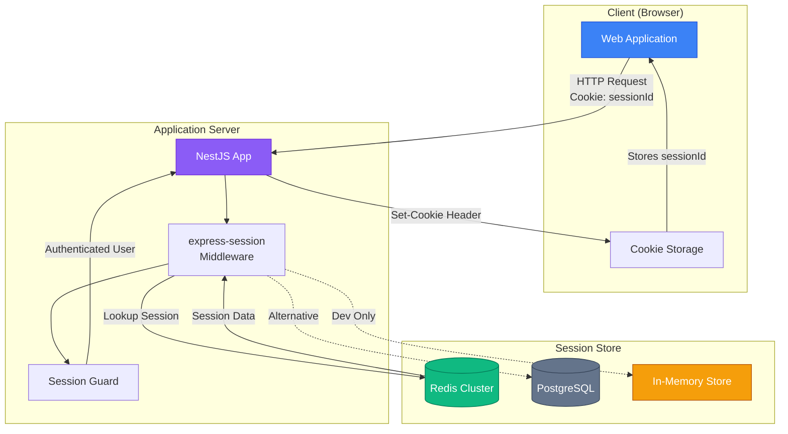

# Автентифікація на основі сесій

## Короткий зміст

У цій лекції детально вивчається механізм Cookie-based сесій та їх реалізація у NestJS:

- **Механізм роботи** — архітектура клієнт-сервер-сховище сесій, створення session ID при вході, зберігання session ID у cookie, передача cookie з кожним запитом
- **Інтеграція express-session** — налаштування `express-session` у NestJS, конфігурація middleware, генерація session ID
- **Сховища сесій** — in-memory (для розробки), Redis (для продакшену), PostgreSQL/MongoDB для персистентності
- **Безпека cookies** — атрибути HttpOnly (захист від XSS), Secure (HTTPS only), SameSite (захист від CSRF), Domain та Path
- **Переваги та недоліки** — серверний контроль (легке відкликання), stateful nature (складність масштабування), необхідність sticky sessions при horizontal scaling

Розглядаються практичні приклади створення сесії при логіні, знищення сесії при logout, налаштування TTL для автоматичного видалення застарілих сесій.

---

::card-group

::card{title="🎯 Мета лекції" icon="i-lucide-target"}

- Глибоко зрозуміти механізм роботи серверних сесій та їхнього зв'язку з HTTP cookies.
- Навчитися інтегрувати `express-session` у NestJS застосунок з підключенням Redis як сховища.
- Опанувати налаштування безпечних cookies з атрибутами `HttpOnly`, `Secure` та `SameSite`.
- Реалізувати повний цикл автентифікації — логін, перевірка сесії через Guard, логаут та управління часом життя сесій.

::

::card{title="🔑 Ключові терміни" icon="i-lucide-key"}

- **Session Store (Сховище сесій):** система зберігання даних сесій — Redis, база даних або пам'ять процесу.
- **Session ID:** унікальний ідентифікатор сесії, що передається між клієнтом та сервером через cookie.
- **HttpOnly Cookie:** cookie, недоступне для JavaScript коду через `document.cookie`, що захищає від XSS атак.
- **SameSite Attribute:** атрибут cookie, що контролює передачу у крос-сайтових запитах для захисту від CSRF.

::

::

---

## Архітектура session-based автентифікації

Session-based автентифікація спирається на тристоронню взаємодію між клієнтом (браузером), сервером застосунків та сховищем сесій. Розуміння цієї архітектури є фундаментальним для ефективної реалізації та діагностики проблем у продакшені.

### Компоненти системи

::mermaid



::

**Потік даних при автентифікації:**

1. **Логін:** користувач надсилає POST-запит з обліковими даними. Сервер перевіряє пароль, створює запис сесії у Redis з унікальним session ID та повертає клієнту `Set-Cookie` заголовок з цим ідентифікатором.

2. **Автоматична передача cookie:** браузер зберігає cookie та автоматично додає його до заголовків всіх наступних запитів до того самого домену.

3. **Перевірка сесії:** middleware `express-session` витягує session ID з cookie, шукає відповідний запис у Redis та завантажує дані користувача у об'єкт `req.session`.

4. **Авторизація:** Guard читає дані з `req.session` та приймає рішення про доступ до ресурсу.

5. **Логаут:** сервер видаляє запис сесії з Redis та скидає cookie на клієнті.

::note
На відміну від token-based автентифікації, де всі дані містяться у самому токені, session-based підхід зберігає **лише ідентифікатор** на клієнті, тоді як **повні дані користувача** залишаються на сервері. Це дозволяє миттєво змінювати дані сесії (наприклад, оновлювати ролі) без перевидачі credentials клієнту.
::

---

## Інтеграція express-session у NestJS

Бібліотека `express-session` є стандартом де-факто для управління сесіями у Node.js екосистемі. Вона надає middleware, що автоматизує створення, зберігання та завантаження сесій, а також інтегрується з різними сховищами через адаптери (*stores*).

### Встановлення залежностей

Для повноцінної реалізації необхідно встановити кілька пакетів:

::tabs

::tabs-item{label="npm"}
```bash
npm install express-session connect-redis redis
npm install --save-dev @types/express-session
```
::

::tabs-item{label="pnpm"}
```bash
pnpm add express-session connect-redis redis
pnpm add -D @types/express-session
```
::

::tabs-item{label="yarn"}
```bash
yarn add express-session connect-redis redis
yarn add -D @types/express-session
```
::

::

**Пояснення пакетів:**

- **express-session:** ядро системи сесій — генерація session ID, управління cookies, інтерфейс для stores.
- **connect-redis:** адаптер для збереження сесій у Redis (найпопулярніше рішення для продакшену).
- **redis:** офіційний клієнт Redis для Node.js версії 4.x (підтримує promises та TypeScript).
- **@types/express-session:** TypeScript типи для автодоповнення та перевірки типів під час компіляції.

### Налаштування Redis клієнта

Перед підключенням `express-session` необхідно створити з'єднання з Redis:

```typescript
// src/config/redis.config.ts
import { createClient } from 'redis';

export const redisClient = createClient({
  url: process.env.REDIS_URL || 'redis://localhost:6379',
  // Для продакшену з TLS:
  // socket: {
  //   tls: true,
  //   rejectUnauthorized: false, // Для self-signed сертифікатів
  // },
});

redisClient.on('error', (err) => {
  console.error('Redis connection error:', err);
});

redisClient.on('connect', () => {
  console.log('✅ Connected to Redis');
});

// Ініціалізація з'єднання
redisClient.connect().catch(console.error);
```

::warning
**Критична помилка:** у Redis клієнті версії 4.x метод `connect()` є асинхронним і повертає Promise. Якщо забути викликати `await redisClient.connect()` або `.catch()`, з'єднання не встановиться, і всі операції з сесіями завершуватимуться помилкою `Socket closed unexpectedly`. Завжди явно викликайте `connect()` при старті застосунку.
::

### Конфігурація express-session middleware

Налаштування middleware виконується у файлі `main.ts` до виклику `app.listen()`:

```typescript
// src/main.ts
import { NestFactory } from '@nestjs/core';
import { AppModule } from './app.module';
import * as session from 'express-session';
import RedisStore from 'connect-redis';
import { redisClient } from './config/redis.config';

async function bootstrap() {
  const app = await NestFactory.create(AppModule);

  // Конфігурація express-session з Redis store
  app.use(
    session({
      store: new RedisStore({
        client: redisClient,
        prefix: 'sess:', // Префікс для ключів у Redis (sess:abc123)
      }),
      secret: process.env.SESSION_SECRET || 'your-secret-key-change-in-production',
      resave: false,
      saveUninitialized: false,
      name: 'sessionId', // Назва cookie (за замовчуванням 'connect.sid')
      cookie: {
        httpOnly: true,   // Cookie недоступне через document.cookie
        secure: process.env.NODE_ENV === 'production', // HTTPS only у продакшені
        sameSite: 'lax',  // Захист від CSRF
        maxAge: 1000 * 60 * 60 * 24, // 24 години у мілісекундах
        domain: process.env.COOKIE_DOMAIN, // Опціонально: '.example.com'
        path: '/',        // Cookie діє для всього сайту
      },
    })
  );

  await app.listen(3000);
  console.log('🚀 Server running on http://localhost:3000');
}

bootstrap();
```

**Детальний розбір параметрів конфігурації:**

| Параметр | Тип | Опис |
|----------|-----|------|
| `store` | Store | Сховище для сесій. `RedisStore` зберігає дані у Redis, альтернативи: `MongoStore`, `PostgresStore`, `MemoryStore` (лише для розробки). |
| `secret` | string | Секретний ключ для підпису session ID у cookie. Має бути криптографічно стійким (мінімум 32 символи випадкових даних). У продакшені **обов'язково** зберігається у змінних оточення. |
| `resave` | boolean | Якщо `false`, сесія не перезаписується у store при кожному запиті, якщо її дані не змінилися. Рекомендується `false` для економії операцій запису у Redis. |
| `saveUninitialized` | boolean | Якщо `false`, порожні сесії (без даних користувача) не зберігаються у store. Рекомендується `false` для дотримання GDPR та економії пам'яті. |
| `name` | string | Назва cookie у браузері. За замовчуванням `connect.sid`, але можна змінити для уникнення fingerprinting (визначення технологічного стеку). |
| `cookie.httpOnly` | boolean | Якщо `true`, cookie недоступне через JavaScript API (`document.cookie`). **Обов'язково** для захисту від XSS атак. |
| `cookie.secure` | boolean | Якщо `true`, cookie передається лише через HTTPS. У продакшені **завжди** має бути `true`. |
| `cookie.sameSite` | string | Контролює передачу cookie у крос-сайтових запитах. `'strict'` — ніколи не передається, `'lax'` — передається при top-level навігації (GET запити при переході з іншого сайту), `'none'` — завжди передається (вимагає `secure: true`). |
| `cookie.maxAge` | number | Час життя cookie у мілісекундах. Після закінчення браузер автоматично видаляє cookie. Якщо не вказано, cookie стає session cookie (видаляється при закритті браузера). |


::tip
**Генерація безпечного SESSION_SECRET:** ніколи не використовуйте передбачувані рядки на кшталт `'my-secret'` або `'123456'`. Згенерувати криптографічно стійкий ключ можна командою:

```bash
node -e "console.log(require('crypto').randomBytes(32).toString('hex'))"
```

Цей ключ має зберігатися у `.env` файлі та **ніколи** не коммітитися у Git репозиторій.
::

### Розширення типів для TypeScript

TypeScript не знає про структуру даних, які ви зберігаєте у `req.session`. Для отримання автодоповнення та перевірки типів необхідно розширити інтерфейс:

```typescript
// src/types/express-session.d.ts
import 'express-session';

declare module 'express-session' {
  interface SessionData {
    userId: string;      // Ідентифікатор користувача
    email: string;       // Email для відображення у UI
    roles: string[];     // Ролі для авторизації
    createdAt: number;   // Timestamp створення сесії
    lastActivityAt: number; // Timestamp останньої активності
  }
}
```

Після цього TypeScript розумітиме структуру сесії:

```typescript
// Автодоповнення працює!
req.session.userId = user.id;
req.session.email = user.email;
req.session.roles = user.roles;

// Помилка компіляції, якщо звертатися до неіснуючого поля
req.session.unknownField; // ❌ Property 'unknownField' does not exist
```

---

## Реалізація автентифікації: логін та логаут

Тепер, коли інфраструктура налаштована, реалізуємо ендпоінти для входу та виходу користувача.

### Створення AuthController

```typescript
// src/auth/auth.controller.ts
import {
  Controller,
  Post,
  Body,
  HttpCode,
  HttpStatus,
  Session,
  UnauthorizedException,
} from '@nestjs/common';
import { AuthService } from './auth.service';
import { LoginDto } from './dto/login.dto';
import { Session as ExpressSession } from 'express-session';

@Controller('auth')
export class AuthController {
  constructor(private readonly authService: AuthService) {}

  @Post('login')
  @HttpCode(HttpStatus.OK)
  async login(
    @Body() loginDto: LoginDto,
    @Session() session: ExpressSession
  ) {
    // Валідація облікових даних
    const user = await this.authService.validateUser(
      loginDto.email,
      loginDto.password
    );

    if (!user) {
      throw new UnauthorizedException('Invalid email or password');
    }

    // Ініціалізація сесії з даними користувача
    session.userId = user.id;
    session.email = user.email;
    session.roles = user.roles;
    session.createdAt = Date.now();
    session.lastActivityAt = Date.now();

    return {
      message: 'Login successful',
      user: {
        id: user.id,
        email: user.email,
        roles: user.roles,
      },
    };
  }

  @Post('logout')
  @HttpCode(HttpStatus.OK)
  async logout(@Session() session: ExpressSession) {
    // Асинхронне знищення сесії
    return new Promise((resolve, reject) => {
      session.destroy((err) => {
        if (err) {
          reject(new Error('Failed to destroy session'));
        } else {
          resolve({ message: 'Logout successful' });
        }
      });
    });
  }
}
```

**Пояснення логіки:**

1. **Декоратор `@Session()`:** NestJS автоматично витягує об'єкт сесії з `req.session` та передає його як параметр методу. Це еквівалентно `@Req() req` з подальшим доступом `req.session`.

2. **Метод `validateUser`:** делегує перевірку паролю сервісному шару. Сервіс завантажує користувача з бази даних за email та порівнює хеш паролю за допомогою bcrypt.

3. **Збереження даних у сесії:** присвоєння значень полям `session.userId`, `session.email` автоматично оновлює запис у Redis. Middleware `express-session` викликає `store.set()` після завершення обробки запиту.

4. **Метод `session.destroy()`:** видаляє запис сесії з Redis та скидає cookie на клієнті. Приймає callback, тому обгортаємо у Promise для сумісності з async/await стилем NestJS.

### Реалізація AuthService з bcrypt

```typescript
// src/auth/auth.service.ts
import { Injectable } from '@nestjs/common';
import { UsersService } from '../users/users.service';
import { compare } from 'bcrypt';

@Injectable()
export class AuthService {
  constructor(private readonly usersService: UsersService) {}

  async validateUser(email: string, password: string) {
    // Завантаження користувача з бази даних
    const user = await this.usersService.findByEmail(email);

    if (!user) {
      return null; // Користувач не знайдений
    }

    // Порівняння хешу паролю
    const isPasswordValid = await compare(password, user.passwordHash);

    if (!isPasswordValid) {
      return null; // Пароль не співпадає
    }

    // Не повертаємо хеш паролю у результаті
    const { passwordHash, ...userWithoutPassword } = user;
    return userWithoutPassword;
  }
}
```

::warning
**Ніколи не зберігайте паролі у відкритому вигляді.** Навіть у випадку витоку бази даних зловмисники не зможуть відновити оригінальні паролі з bcrypt хешів через обчислювальну складність алгоритму. Для хешування використовуйте `bcrypt` з cost factor мінімум 10 (рекомендовано 12 для сучасних систем):

```typescript
import { hash } from 'bcrypt';

const passwordHash = await hash(password, 12); // 2^12 ітерацій
```
::

### DTO для валідації вхідних даних

```typescript
// src/auth/dto/login.dto.ts
import { IsEmail, IsNotEmpty, IsString, MinLength } from 'class-validator';

export class LoginDto {
  @IsEmail({}, { message: 'Invalid email format' })
  @IsNotEmpty({ message: 'Email is required' })
  email: string;

  @IsString()
  @IsNotEmpty({ message: 'Password is required' })
  @MinLength(8, { message: 'Password must be at least 8 characters long' })
  password: string;
}
```

Валідація через декоратори `class-validator` автоматично відхиляє запити з некоректними даними до виклику контролера. Для активації валідації необхідно додати `ValidationPipe` глобально:

```typescript
// src/main.ts
import { ValidationPipe } from '@nestjs/common';

async function bootstrap() {
  const app = await NestFactory.create(AppModule);
  
  app.useGlobalPipes(
    new ValidationPipe({
      whitelist: true,      // Видаляє поля, не описані у DTO
      forbidNonWhitelisted: true, // Відхиляє запити з зайвими полями
      transform: true,      // Автоматично перетворює типи (string → number)
    })
  );
  
  // ... решта конфігурації
}
```

---

## Захист маршрутів через Session Guard

Після реалізації логіну необхідно створити Guard, що перевірятиме наявність активної сесії перед доступом до захищених ендпоінтів.

### Реалізація SessionGuard

```typescript
// src/auth/guards/session.guard.ts
import {
  Injectable,
  CanActivate,
  ExecutionContext,
  UnauthorizedException,
} from '@nestjs/common';
import { Request } from 'express';

@Injectable()
export class SessionGuard implements CanActivate {
  canActivate(context: ExecutionContext): boolean {
    const request = context.switchToHttp().getRequest<Request>();
    const session = request.session;

    // Перевірка наявності ідентифікатора користувача у сесії
    if (!session || !session.userId) {
      throw new UnauthorizedException('Not authenticated');
    }

    // Опціонально: оновлення часу останньої активності
    session.lastActivityAt = Date.now();

    return true;
  }
}
```

**Розширена версія з перевіркою застарівання сесії:**

```typescript
@Injectable()
export class SessionGuard implements CanActivate {
  private readonly MAX_INACTIVE_TIME = 1000 * 60 * 30; // 30 хвилин

  canActivate(context: ExecutionContext): boolean {
    const request = context.switchToHttp().getRequest<Request>();
    const session = request.session;

    if (!session || !session.userId) {
      throw new UnauthorizedException('Not authenticated');
    }

    // Перевірка часу неактивності
    const now = Date.now();
    const lastActivity = session.lastActivityAt || session.createdAt;
    const inactiveTime = now - lastActivity;

    if (inactiveTime > this.MAX_INACTIVE_TIME) {
      // Знищення застарілої сесії
      session.destroy(() => {});
      throw new UnauthorizedException('Session expired due to inactivity');
    }

    // Оновлення часу останньої активності
    session.lastActivityAt = now;

    return true;
  }
}
```

### Застосування Guard до контролерів

```typescript
// src/users/users.controller.ts
import { Controller, Get, UseGuards, Session } from '@nestjs/common';
import { SessionGuard } from '../auth/guards/session.guard';
import { Session as ExpressSession } from 'express-session';
import { UsersService } from './users.service';

@Controller('users')
@UseGuards(SessionGuard) // Захист всього контролера
export class UsersController {
  constructor(private readonly usersService: UsersService) {}

  @Get('profile')
  async getProfile(@Session() session: ExpressSession) {
    // Дані користувача доступні з сесії
    const user = await this.usersService.findById(session.userId);
    
    return {
      id: user.id,
      email: user.email,
      name: user.name,
      roles: user.roles,
    };
  }

  @Get('settings')
  async getSettings(@Session() session: ExpressSession) {
    const settings = await this.usersService.findSettings(session.userId);
    return settings;
  }
}
```

**Альтернативно:** застосування Guard на рівні окремого методу:

```typescript
@Controller('posts')
export class PostsController {
  @Get('public')
  getPublicPosts() {
    // Доступно без автентифікації
    return this.postsService.findPublic();
  }

  @Get('my-posts')
  @UseGuards(SessionGuard) // Захист лише цього ендпоінту
  getMyPosts(@Session() session: ExpressSession) {
    return this.postsService.findByUserId(session.userId);
  }
}
```


---

## Сховища сесій: порівняння та вибір

Вибір сховища для сесій впливає на продуктивність, надійність та складність інфраструктури. Розглянемо три основні варіанти з їхніми архітектурними наслідками.

### In-Memory Store (MemoryStore)

**MemoryStore** зберігає сесії у пам'яті процесу Node.js. Це дефолтне сховище `express-session`, що використовується автоматично, якщо не вказано інше.

**Переваги:**
- ✅ Нульова конфігурація — працює "з коробки" без зовнішніх залежностей.
- ✅ Максимальна швидкість доступу — немає мережевих запитів або серіалізації даних.
- ✅ Ідеально для локальної розробки та прототипування.

**Критичні недоліки:**
- ❌ **Втрата всіх сесій при рестарті процесу** — користувачі відразу виходять із системи після деплою нової версії.
- ❌ **Витік пам'яті** — сесії накопичуються у пам'яті без автоматичного очищення застарілих, що призводить до OOM (*Out of Memory*).
- ❌ **Неможливість горизонтального масштабування** — кожен екземпляр сервера має власний набір сесій, несумісний з іншими.

::caution
**Офіційне попередження express-session:**

> "Warning: MemoryStore is not designed for a production environment, as it will leak memory, and will not scale past a single process."

**Ніколи не використовуйте MemoryStore у продакшені.** Навіть для малих застосунків рекомендується Redis або база даних.
::

### Redis: стандарт для продакшену

**Redis** є in-memory базою даних типу "ключ-значення" з підтримкою персистентності, реплікації та автоматичного видалення застарілих записів через TTL (*Time To Live*).

**Переваги:**
- ✅ **Продуктивність:** мікросекундні затримки для read/write операцій.
- ✅ **TTL із коробки:** автоматичне видалення сесій після закінчення терміну без ручного garbage collection.
- ✅ **Горизонтальне масштабування:** всі екземпляри застосунків звертаються до одного Redis Cluster.
- ✅ **Персистентність:** підтримка RDB снапшотів та AOF логів для відновлення після збоїв.
- ✅ **Реплікація:** Redis Sentinel забезпечує автоматичне failover при падінні master вузла.

**Недоліки:**
- ⚠️ **Додатковий компонент інфраструктури:** потребує розгортання та моніторингу Redis сервера.
- ⚠️ **Вартість:** керовані сервіси (AWS ElastiCache, Azure Cache for Redis) коштують від $10–50/місяць.
- ⚠️ **Втрата даних при збої:** якщо Redis падає без реплікації, всі сесії втрачаються.

**Конфігурація connect-redis з TTL:**

```typescript
import RedisStore from 'connect-redis';
import { createClient } from 'redis';

const redisClient = createClient({ url: process.env.REDIS_URL });
await redisClient.connect();

app.use(
  session({
    store: new RedisStore({
      client: redisClient,
      prefix: 'sess:',
      ttl: 86400, // TTL у секундах (24 години)
      disableTouch: false, // Оновлювати TTL при кожному запиті
    }),
    // ... інші опції
  })
);
```

**Параметр `disableTouch`:**
- Якщо `false` (за замовчуванням), Redis оновлює TTL при кожному запиті (`EXPIRE` команда). Це реалізує sliding expiration — активні сесії ніколи не застарівають.
- Якщо `true`, TTL встановлюється лише при створенні сесії. Сесія завжди закінчується через фіксований період, незалежно від активності користувача.

### PostgreSQL/MongoDB: персистентність з компромісами

**Реляційні (PostgreSQL) або документні (MongoDB) бази даних** можна використовувати як сховища сесій через адаптери `connect-pg-simple` або `connect-mongo`.

**Переваги:**
- ✅ **Довгострокова персистентність:** дані зберігаються на диску без ризику втрати при рестарті.
- ✅ **Зручність для малих проєктів:** якщо база даних вже використовується для застосунку, немає потреби додавати Redis.
- ✅ **Складні запити:** можливість виконувати SQL/NoSQL запити для аналітики сесій (наприклад, "скільки користувачів онлайн у цей момент").

**Недоліки:**
- ❌ **Повільніше за Redis:** затримки у десятки мілісекунд замість мікросекунд через дискові операції.
- ❌ **Додаткове навантаження на БД:** кожен HTTP-запит виконує SQL-запит для завантаження сесії, що збільшує навантаження на primary базу даних.
- ❌ **Відсутність автоматичного TTL:** PostgreSQL не має вбудованого механізму видалення застарілих рядків, потрібен cron-джоб для очищення.

**Приклад конфігурації з PostgreSQL:**

```typescript
import connectPgSimple from 'connect-pg-simple';
import { Pool } from 'pg';

const PgStore = connectPgSimple(session);
const pgPool = new Pool({ connectionString: process.env.DATABASE_URL });

app.use(
  session({
    store: new PgStore({
      pool: pgPool,
      tableName: 'sessions', // Таблиця для зберігання сесій
      pruneSessionInterval: 60 * 15, // Очищення застарілих сесій кожні 15 хвилин
    }),
    // ... інші опції
  })
);
```

**SQL схема для PostgreSQL:**

```sql
CREATE TABLE "sessions" (
  "sid" VARCHAR NOT NULL COLLATE "default",
  "sess" JSON NOT NULL,
  "expire" TIMESTAMP(6) NOT NULL,
  PRIMARY KEY ("sid")
);

CREATE INDEX "IDX_sessions_expire" ON "sessions" ("expire");
```

::tip
**Рекомендація для вибору сховища:**

- **Розробка:** MemoryStore (без конфігурації).
- **Малі проєкти (<10k користувачів):** PostgreSQL/MongoDB через наявну БД.
- **Середні та великі проєкти (10k+):** Redis (standalone або Sentinel).
- **Enterprise (100k+):** Redis Cluster з реплікацією та моніторингом.
::

---

## Безпека cookies: захист від атак

HTTP cookies є потужним механізмом, але їхнє неправильне налаштування створює вразливості до XSS, CSRF та атак типу session hijacking. Розглянемо кожен атрибут cookie детально.

### Атрибут HttpOnly: захист від XSS

**XSS (Cross-Site Scripting)** — це атака, де зловмисник впроваджує шкідливий JavaScript на сторінку через незахищені поля вводу або вразливості у сторонніх бібліотеках. Якщо зловмиснику вдасться виконати `alert(document.cookie)`, він побачить усі cookies сайту, включно з session ID.

**Атрибут `HttpOnly`** робить cookie **недоступним для JavaScript** — воно передається лише у HTTP-заголовках і не повертається через `document.cookie`. Це блокує XSS атаки, оскільки шкідливий скрипт не може зчитати session ID.

```typescript
cookie: {
  httpOnly: true, // ✅ Cookie недоступне через JavaScript
}
```

**Демонстрація захисту:**

```javascript
// У браузерній консолі
console.log(document.cookie);
// Результат: "theme=dark; language=uk"
// Session cookie відсутнє, оскільки воно HttpOnly!
```

::warning
**HttpOnly не захищає від Network Sniffing.** Якщо зловмисник перехоплює мережевий трафік (наприклад, у публічному Wi-Fi без шифрування), він бачить cookie у HTTP-заголовках запитів. Для захисту від цієї атаки необхідний атрибут `Secure` та HTTPS.
::

### Атрибут Secure: примусовий HTTPS

**Атрибут `Secure`** вказує браузеру передавати cookie **лише через HTTPS** з'єднання. Це запобігає перехопленню session ID у незашифрованому HTTP-трафіку.

```typescript
cookie: {
  secure: process.env.NODE_ENV === 'production', // ✅ HTTPS у продакшені
}
```

**Чому умовне увімкнення?**

Локально розробники часто використовують `http://localhost:3000` без SSL-сертифіката. Якщо встановити `secure: true` для localhost, браузер **не передаватиме cookie**, і автентифікація не працюватиме. Тому у розробці `secure: false`, у продакшені — `true`.

**Налаштування HTTPS для продакшену:**

```typescript
// У продакшені завжди використовуйте HTTPS через Nginx або Load Balancer
cookie: {
  httpOnly: true,
  secure: true, // ✅ Примусово вимагати HTTPS
  sameSite: 'strict',
}
```

### Атрибут SameSite: захист від CSRF

**CSRF (Cross-Site Request Forgery)** — це атака, де зловмисник обманює браузер жертви, змушуючи його надіслати запит до вашого сайту з автентифікаційними cookies. Наприклад:

1. Користувач увійшов у ваш банківський застосунок (`bank.example.com`).
2. Користувач відвідує шкідливий сайт `evil.com`.
3. Шкідливий сайт містить форму:

```html
<form action="https://bank.example.com/transfer" method="POST">
  <input type="hidden" name="to" value="attacker-account">
  <input type="hidden" name="amount" value="10000">
</form>
<script>document.forms[0].submit();</script>
```

4. Браузер автоматично додає session cookie до POST-запиту, оскільки запит йде на `bank.example.com`.
5. Сервер банку бачить дійсне session cookie і виконує переказ коштів!

**Атрибут `SameSite`** запобігає цій атаці, контролюючи передачу cookies у крос-сайтових запитах:

```typescript
cookie: {
  sameSite: 'lax', // Рекомендовано для більшості застосунків
}
```

**Варіанти значень:**

| Значення | Поведінка |
|----------|-----------|
| `strict` | Cookie **ніколи** не передається у крос-сайтових запитах. Навіть якщо користувач переходить з Google на ваш сайт через посилання, він не буде автентифікованим до першого POST-запиту з вашого домену. |
| `lax` (рекомендовано) | Cookie передається при **top-level навігації** (GET запити при переході за посиланням), але **не передається** у формах, fetch/axios запитах з інших доменів. Блокує CSRF, але не ламає UX. |
| `none` | Cookie **завжди** передається, навіть у крос-сайтових запитах. Вимагає `secure: true`. Використовується для embedded iframe або OAuth flows. |

::tip
**Для більшості веб-застосунків рекомендується `sameSite: 'lax'`.** Це забезпечує баланс між безпекою та зручністю: користувачі залишаються автентифікованими при переходах з інших сайтів (пошукові системи, email-посилання), але захищені від CSRF атак через форми.
::

### Атрибути Domain та Path

**Атрибут `domain`** визначає, на які поддомени cookie поширюється:

```typescript
cookie: {
  domain: '.example.com', // Cookie діє для example.com, app.example.com, api.example.com
}
```

- Якщо `domain` не вказано, cookie діє лише для домену, що встановив його (без поддоменів).
- Якщо вказано `.example.com`, cookie передається **всім поддоменам**.

**Атрибут `path`** визначає, на які URL-шляхи cookie поширюється:

```typescript
cookie: {
  path: '/api', // Cookie передається лише для /api/*
}
```

Для більшості застосунків достатньо `path: '/'` (cookie діє для всього сайту).


---

## Управління часом життя сесій

Час життя сесій (*session lifetime*) впливає на баланс між безпекою та зручністю користувачів. Надто короткі сесії викликають роздратування через часті виходи, надто довгі — збільшують ризики при компрометації облікових даних.

### Стратегії застарівання сесій

Існують дві основні моделі контролю часу життя сесій:

::card-group

::card{title="⏰ Fixed Expiration (Фіксоване застарівання)" icon="i-lucide-clock"}

Сесія закінчується через фіксований період часу від моменту створення, незалежно від активності користувача. Наприклад, користувач входить о 10:00, сесія діє до 18:00 (8 годин), навіть якщо він активно працював до останньої хвилини.

**Конфігурація:**
```typescript
store: new RedisStore({
  client: redisClient,
  disableTouch: true, // ❌ Не оновлювати TTL при запитах
}),
cookie: {
  maxAge: 1000 * 60 * 60 * 8, // 8 годин
}
```

**Переваги:** передбачуваність для користувачів (вони знають, що сесія закінчиться о певній годині).

**Недоліки:** примусовий вихід навіть під час активної роботи може призвести до втрати незбережених даних.

::

::card{title="🔄 Sliding Expiration (Ковзне застарівання)" icon="i-lucide-refresh-cw"}

Сесія автоматично продовжується при кожному запиті користувача. Наприклад, якщо сесія має термін 30 хвилин неактивності, кожен клік оновлює цей таймер. Сесія закінчується лише після 30 хвилин **без жодної активності**.

**Конфігурація:**
```typescript
store: new RedisStore({
  client: redisClient,
  disableTouch: false, // ✅ Оновлювати TTL при кожному запиті
}),
cookie: {
  maxAge: 1000 * 60 * 30, // 30 хвилин неактивності
}
```

**Переваги:** природна поведінка — активні користувачі ніколи не виходять примусово.

**Недоліки:** сесії можуть жити необмежено довго, якщо користувач тримає вкладку відкритою з фоновими запитами (наприклад, polling кожні 10 секунд).

::

::

**Гібридний підхід (рекомендовано для корпоративних систем):**

Комбінація обох моделей — сесія продовжується при активності, але має абсолютний максимум:

```typescript
@Injectable()
export class SessionGuard implements CanActivate {
  private readonly MAX_INACTIVE_TIME = 1000 * 60 * 30; // 30 хвилин неактивності
  private readonly ABSOLUTE_MAX_TIME = 1000 * 60 * 60 * 12; // 12 годин абсолютний максимум

  canActivate(context: ExecutionContext): boolean {
    const request = context.switchToHttp().getRequest<Request>();
    const session = request.session;

    if (!session || !session.userId) {
      throw new UnauthorizedException('Not authenticated');
    }

    const now = Date.now();
    const sessionAge = now - session.createdAt;
    const inactiveTime = now - session.lastActivityAt;

    // Перевірка абсолютного максимуму
    if (sessionAge > this.ABSOLUTE_MAX_TIME) {
      session.destroy(() => {});
      throw new UnauthorizedException('Session expired (maximum lifetime reached)');
    }

    // Перевірка неактивності
    if (inactiveTime > this.MAX_INACTIVE_TIME) {
      session.destroy(() => {});
      throw new UnauthorizedException('Session expired (inactivity timeout)');
    }

    session.lastActivityAt = now;
    return true;
  }
}
```

### Примусове завершення сесій при зміні пароля

При зміні паролю користувача критично важливо завершити **всі його активні сесії** на всіх пристроях, щоб потенційний зловмисник втратив доступ:

```typescript
// src/users/users.service.ts
import { Injectable } from '@nestjs/common';
import { InjectRedis } from '@nestjs-modules/ioredis';
import Redis from 'ioredis';

@Injectable()
export class UsersService {
  constructor(@InjectRedis() private readonly redis: Redis) {}

  async changePassword(userId: string, newPassword: string) {
    // 1. Хешування нового паролю
    const passwordHash = await hash(newPassword, 12);
    
    // 2. Оновлення у базі даних
    await this.usersRepository.update(userId, { passwordHash });

    // 3. Знищення всіх сесій користувача у Redis
    await this.destroyAllUserSessions(userId);
  }

  private async destroyAllUserSessions(userId: string) {
    // Знайти всі ключі сесій, що містять userId
    const pattern = 'sess:*';
    const keys = await this.redis.keys(pattern);

    for (const key of keys) {
      const sessionData = await this.redis.get(key);
      if (sessionData) {
        const session = JSON.parse(sessionData);
        if (session.userId === userId) {
          await this.redis.del(key); // Видалити сесію
        }
      }
    }
  }
}
```

::caution
**Операція `KEYS` є блокуючою** і сканує весь Redis keyspace. У продакшені з мільйонами ключів це може заморозити сервер на секунди. Замість `KEYS` використовуйте **`SCAN`** для неблокуючого ітерування:

```typescript
async destroyAllUserSessions(userId: string) {
  let cursor = '0';
  do {
    const [newCursor, keys] = await this.redis.scan(
      cursor,
      'MATCH', 'sess:*',
      'COUNT', 100
    );
    cursor = newCursor;

    for (const key of keys) {
      const sessionData = await this.redis.get(key);
      if (sessionData) {
        const session = JSON.parse(sessionData);
        if (session.userId === userId) {
          await this.redis.del(key);
        }
      }
    }
  } while (cursor !== '0');
}
```
::

### Відображення активних сесій користувачу

Для покращення безпеки та прозорості користувачі мають бачити список своїх активних сесій з можливістю завершення кожної:

```typescript
// src/users/dto/session-info.dto.ts
export class SessionInfoDto {
  sessionId: string;
  ipAddress: string;
  userAgent: string;
  createdAt: Date;
  lastActivityAt: Date;
  isCurrent: boolean; // Чи це поточна сесія
}

// src/users/users.controller.ts
@Get('sessions')
@UseGuards(SessionGuard)
async getActiveSessions(
  @Session() currentSession: ExpressSession,
  @Ip() currentIp: string
): Promise<SessionInfoDto[]> {
  const sessions = await this.usersService.findUserSessions(currentSession.userId);
  
  return sessions.map(session => ({
    sessionId: session.id,
    ipAddress: session.ipAddress,
    userAgent: session.userAgent,
    createdAt: new Date(session.createdAt),
    lastActivityAt: new Date(session.lastActivityAt),
    isCurrent: session.ipAddress === currentIp,
  }));
}

@Delete('sessions/:sessionId')
@UseGuards(SessionGuard)
async terminateSession(
  @Param('sessionId') sessionId: string,
  @Session() currentSession: ExpressSession
) {
  // Перевірка, що сесія належить користувачеві
  const session = await this.usersService.findSession(sessionId);
  
  if (session.userId !== currentSession.userId) {
    throw new ForbiddenException('Cannot terminate another user\'s session');
  }

  await this.redis.del(`sess:${sessionId}`);
  return { message: 'Session terminated successfully' };
}
```

---

## Інтерактивні запитання для самоперевірки

::accordion

::accordion-item{label="❓ Чому не можна зберігати session ID у localStorage замість cookie?" icon="i-lucide-help-circle"}

localStorage доступне для будь-якого JavaScript коду на сторінці через `localStorage.getItem('sessionId')`. Це робить session ID вразливим до XSS атак — якщо зловмисник впровадить шкідливий скрипт (через незахищене поле вводу або компрометовану сторонню бібліотеку), він зможе викрасти session ID та надіслати його на свій сервер. **HttpOnly cookies** недоступні для JavaScript, що блокує цю атаку. Крім того, cookies автоматично передаються браузером у заголовках запитів, тоді як localStorage вимагає ручного додавання заголовка `Authorization` до кожного fetch/axios запиту.

::

::accordion-item{label="❓ Що станеться, якщо Redis впаде під час роботи застосунку?" icon="i-lucide-help-circle"}

Всі активні користувачі миттєво втратять автентифікацію, оскільки сервер не зможе завантажити їхні сесії з Redis. При наступному запиті SessionGuard поверне `401 Unauthorized`, і користувачам доведеться увійти заново. **Рішення для високої доступності:**

1. **Redis Sentinel** — автоматичне failover при падінні master вузла (3+ вузли Redis).
2. **Redis Cluster** — розподіл даних між кількома вузлами з реплікацією.
3. **Керовані сервіси** (AWS ElastiCache, Azure Cache) — автоматичні бекапи та відновлення.
4. **Гібридний підхід** — fallback до JWT токенів при недоступності Redis (складна реалізація).

::

::accordion-item{label="❓ Як захиститися від session fixation атаки?" icon="i-lucide-help-circle"}

**Session fixation** — це атака, де зловмисник примушує жертву використовувати заздалегідь відомий session ID. Наприклад:

1. Зловмисник створює сесію на вашому сайті і отримує `sessionId=attacker-known-id`.
2. Зловмисник надсилає жертві посилання `https://example.com?sessionId=attacker-known-id` або встановлює cookie через XSS.
3. Жертва входить у систему, використовуючи цей session ID.
4. Зловмисник тепер має доступ до автентифікованої сесії!

**Захист:** регенерація session ID після успішного логіну:

```typescript
@Post('login')
async login(@Body() loginDto: LoginDto, @Session() session: ExpressSession) {
  const user = await this.authService.validateUser(loginDto.email, loginDto.password);
  
  if (!user) {
    throw new UnauthorizedException('Invalid credentials');
  }

  // Регенерація session ID після автентифікації
  await new Promise((resolve, reject) => {
    session.regenerate((err) => {
      if (err) reject(err);
      else resolve(undefined);
    });
  });

  // Тепер можна безпечно зберігати дані користувача
  session.userId = user.id;
  session.email = user.email;

  return { message: 'Login successful' };
}
```

Метод `session.regenerate()` видаляє старий session ID та створює новий, зберігаючи всі дані сесії. Це гарантує, що зловмисник не може використовувати заздалегідь відомий ідентифікатор.

::

::accordion-item{label="❓ Чи можна використовувати session-based автентифікацію для мобільних застосунків?" icon="i-lucide-help-circle"}

Технічно можна, але це незручно. Мобільні застосунки (iOS, Android) не мають вбудованого механізму cookies — розробнику доводиться вручну зберігати session ID (наприклад, у AsyncStorage в React Native) та додавати його до заголовків кожного запиту. Це нівелює основну перевагу session-based підходу — автоматичну передачу cookies браузером. Крім того, mobile apps часто працюють у фоновому режимі довгий час, що ускладнює управління часом життя сесій. **Для мобільних застосунків рекомендується JWT токени** з короткоживучими access tokens (15 хвилин) та довгоживучими refresh tokens (30 днів), збереженими у захищеному сховищі (iOS Keychain, Android Keystore).

::

::

---

## Ключові висновки

::card-group

::card{title="🔐 Архітектура трьох компонентів" icon="i-lucide-layers"}

Session-based автентифікація спирається на взаємодію клієнта (cookie), сервера застосунків (middleware) та сховища сесій (Redis/БД). Session ID передається через HttpOnly cookie, дані користувача завантажуються з Redis при кожному запиті.

::

::card{title="⚡ Redis як стандарт продакшену" icon="i-lucide-zap"}

MemoryStore підходить лише для розробки. Продакшн застосунки вимагають Redis через продуктивність, автоматичний TTL, підтримку горизонтального масштабування та реплікації. PostgreSQL/MongoDB є альтернативою для малих проєктів.

::

::card{title="🛡️ Безпека через атрибути cookies" icon="i-lucide-shield-check"}

`HttpOnly` захищає від XSS (cookie недоступне для JavaScript). `Secure` примушує HTTPS. `SameSite: 'lax'` запобігає CSRF атакам. Ці три атрибути обов'язкові для продакшену.

::

::card{title="⏰ Управління часом життя" icon="i-lucide-clock"}

Sliding expiration (продовження при активності) забезпечує кращий UX. Гібридний підхід з абсолютним максимумом (наприклад, 12 годин) балансує між зручністю та безпекою. При зміні паролю завершуйте всі сесії користувача.

::

::

---

## Рекомендовані ресурси для поглибленого вивчення

- **express-session Documentation:** офіційна документація з детальним описом всіх параметрів конфігурації, API для custom stores та best practices безпеки.

- **Redis Documentation:** офіційна документація Redis з поясненням команд TTL, EXPIRE, SCAN та архітектури Redis Sentinel/Cluster.

- **OWASP Session Management Cheat Sheet:** найкращі практики управління сесіями від Open Web Application Security Project, включно з захистом від session fixation, session hijacking та CSRF.

- **MDN Web Docs — HTTP Cookies:** вичерпний довідник атрибутів cookies (`HttpOnly`, `Secure`, `SameSite`, `Domain`, `Path`) з прикладами використання.

::note
У наступній лекції ми детально розглянемо **структуру JSON Web Tokens (JWT)** — формат заголовка, payload claims (стандартні та custom), алгоритми підпису (HMAC, RSA, ECDSA) та процес верифікації токенів. Ви дізнаєтеся, як кодувати та декодувати JWT, перевіряти підпис та обирати оптимальні claims для вашого застосунку.
::
