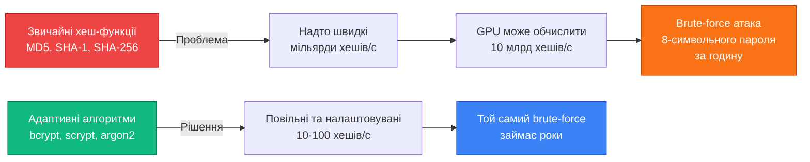
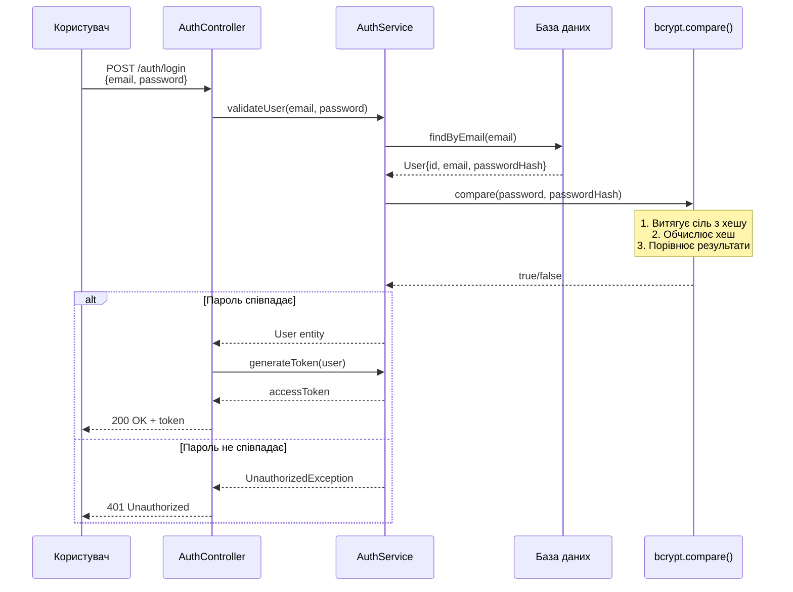
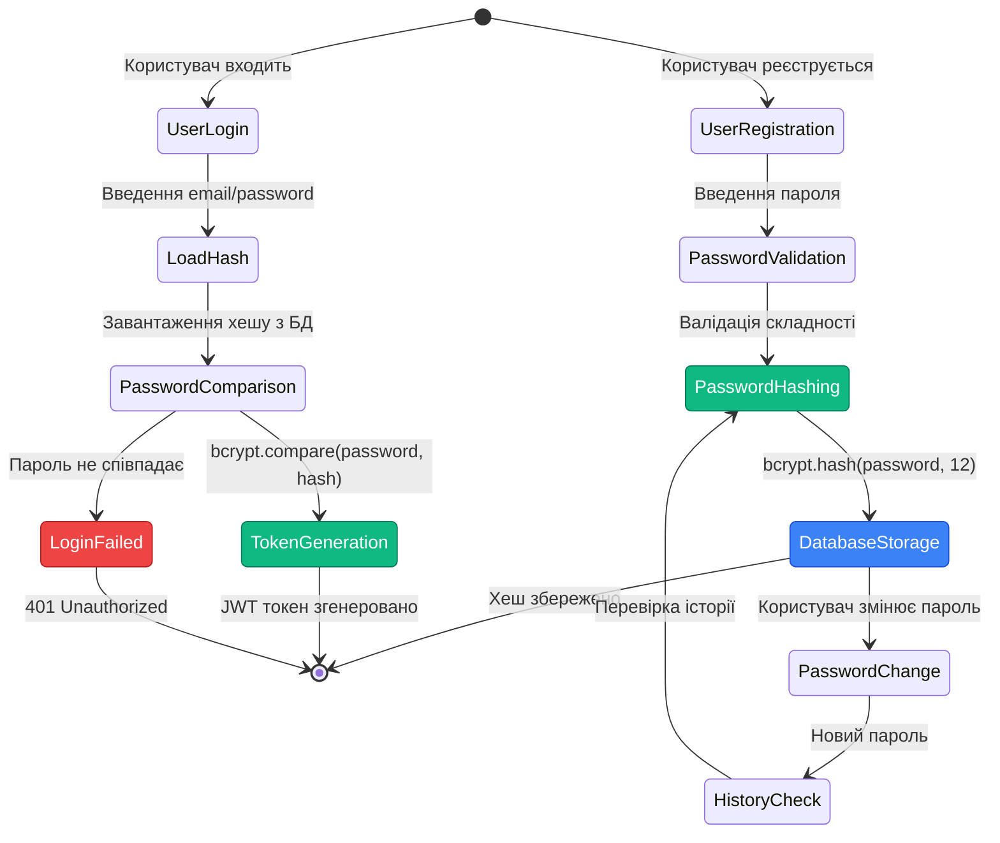

# Безпечне зберігання паролів: хешування та криптографічний захист

## Короткий зміст

У цій лекції розглядаються принципи безпечного зберігання паролів та криптографічні механізми хешування:

- **Чому не зберігати паролі у відкритому вигляді** — витік бази даних призводить до компрометації всіх облікових записів, регуляторні вимоги (GDPR, PCI DSS), етичні принципи
- **Односторонні хеш-функції** — криптографічні алгоритми, які неможливо "розшифрувати" назад, властивості: детермінованість, лавинний ефект (навіть одна зміна змінює весь хеш), collision resistance
- **Концепція солі (Salt)** — унікальний випадковий рядок для кожного пароля, запобігає rainbow table attacks, зберігається разом з хешем у БД
- **Бібліотека bcrypt** — industry standard для хешування паролів, методи `bcrypt.hash(password, saltRounds)` та `bcrypt.compare(password, hash)`, автоматична генерація солі
- **Salt rounds** — параметр складності обчислення (10-12 для балансу безпеки та продуктивності), кожен додатковий round подвоює час хешування
- **Альтернатива argon2** — переможець Password Hashing Competition 2015, більш стійкий до GPU/ASIC attacks, бібліотека `argon2` як сучасна альтернатива bcrypt

Розглядаються практичні приклади хешування пароля при реєстрації, порівняння пароля при логіні, обробка помилок при невалідних паролях без розкриття інформації про існування користувача (timing attacks prevention).

---

::card-group

::card{title="🎯 Мета лекції" icon="i-lucide-target"}

- Зрозуміти фундаментальні принципи безпечного зберігання паролів та наслідки їхнього порушення.
- Опанувати концепції односторонніх хеш-функцій, солі та адаптивних алгоритмів хешування.
- Навчитися використовувати бібліотеку bcrypt для хешування паролів при реєстрації та верифікації при вході.
- Розуміти вплив параметра cost factor на баланс між безпекою та продуктивністю.

::

::card{title="🔑 Ключові терміни" icon="i-lucide-key"}

- **Hash Function (Хеш-функція):** односторонній криптографічний алгоритм, що перетворює дані довільної довжини у фіксований хеш фіксованої довжини.
- **Salt (Сіль):** унікальний випадковий рядок, що додається до пароля перед хешуванням для запобігання атакам через передобчислені таблиці.
- **Cost Factor (Фактор складності):** параметр, що визначає кількість ітерацій обчислення хешу, впливає на час виконання та стійкість до brute-force.
- **Rainbow Table:** передобчислена таблиця хешів для поширених паролів, що прискорює атаки перебору.

::

::

---

## Чому ніколи не зберігати паролі у відкритому вигляді

Зберігання паролів користувачів у текстовому форматі (*plaintext*) у базі даних є однією з найгрубіших помилок у розробці веб-застосунків. Ця практика порушує базові принципи інформаційної безпеки, суперечить міжнародним регуляторним стандартам та створює катастрофічні ризики для користувачів та організації.

### Сценарій витоку бази даних

Припустимо, що база даних застосунку зберігає паролі у відкритому вигляді:

::code-group

```sql [Небезпечна структура таблиці]
CREATE TABLE users (
  id UUID PRIMARY KEY,
  email VARCHAR(255) UNIQUE NOT NULL,
  password VARCHAR(255) NOT NULL, -- ❌ Відкритий пароль!
  created_at TIMESTAMP DEFAULT NOW()
);

-- Приклади збережених даних
INSERT INTO users (id, email, password) VALUES
('550e8400-e29b-41d4-a716-446655440000', 'ivan@example.com', 'MySecret123'),
('6ba7b810-9dad-11d1-80b4-00c04fd430c8', 'olena@example.com', 'P@ssw0rd!'),
('7c9e6679-7425-40de-944b-e07fc1f90ae7', 'andriy@example.com', 'qwerty123');
```

```typescript [Логін без хешування]
async login(email: string, password: string) {
  // ❌ Пряме порівняння паролів у відкритому вигляді
  const user = await this.db.query(
    'SELECT * FROM users WHERE email = $1 AND password = $2',
    [email, password]
  );

  if (!user) {
    throw new UnauthorizedException('Invalid credentials');
  }

  return this.generateToken(user);
}
```

::

Якщо зловмисник отримує доступ до бази даних через SQL-ін'єкцію (*SQL injection*), вразливість серверного програмного забезпечення або фізичний доступ до резервної копії, він миттєво бачить усі паролі користувачів у читабельному форматі:

```sql
SELECT email, password FROM users;
```

**Результат витоку:**

| Email | Password | Наслідки |
|-------|----------|----------|
| `ivan@example.com` | `MySecret123` | Зловмисник отримує доступ до облікового запису Івана у цьому застосунку. |
| `olena@example.com` | `P@ssw0rd!` | Якщо Олена використовує той самий пароль для Gmail, Facebook, банківського застосунку — всі ці облікові записи компрометовані (**credential stuffing attack**). |
| `andriy@example.com` | `qwerty123` | Слабкий пароль дозволяє зловмисникові швидко підібрати його для інших сервісів Андрія. |

::caution
**Критична загроза для користувачів:** дослідження показують, що понад 60% користувачів повторно використовують один і той самий пароль для різних сервісів. Витік паролів з одного застосунку автоматично компрометує облікові записи користувачів у десятках інших сервісів.
::

### Юридичні та регуляторні вимоги

Міжнародні стандарти та законодавчі акти вимагають належного захисту персональних даних користувачів, включаючи паролі:

**GDPR (General Data Protection Regulation, ЄС):**
- Стаття 32: «Обробник даних повинен застосовувати відповідні технічні та організаційні заходи для забезпечення рівня безпеки, що відповідає ризику, включаючи... псевдонімізацію та шифрування персональних даних».
- Штрафи за порушення: до €20 млн або 4% від річного глобального обороту компанії (залежно від того, що більше).

**PCI DSS (Payment Card Industry Data Security Standard):**
- Вимога 8.2.1: «Паролі користувачів мають бути неможливими до прочитання під час передачі та зберігання на всіх компонентах системи, використовуючи криптографію на основі надійних криптографічних алгоритмів».

**OWASP Top 10 (2021):**
- A02:2021 – Cryptographic Failures: Використання слабких або застарілих криптографічних алгоритмів, зберігання чутливих даних у відкритому вигляді.

**Закон України «Про захист персональних даних»:**
- Стаття 6: «Володілець персональних даних зобов'язаний вживати необхідних заходів щодо захисту персональних даних».

::warning
Організація, що зберігала паролі у відкритому вигляді та зазнала витоку, може зіткнутися не лише з фінансовими санкціями, а й з репутаційними втратами, колективними позовами користувачів та втратою довіри ринку.
::

### Етичні принципи розробки програмного забезпечення

Навіть за відсутності явних законодавчих вимог, розробники несуть моральну відповідальність за безпеку даних користувачів. Користувач довіряє свій пароль застосунку, очікуючи, що навіть внутрішні адміністратори бази даних не зможуть його прочитати. Порушення цієї довіри підриває основи довіри у цифровій екосистемі.

**Принцип мінімізації привілеїв (*Principle of Least Privilege*):**
Навіть розробники та адміністратори не повинні мати можливості читати паролі користувачів. Хешування забезпечує, що паролі залишаються секретом навіть для тих, хто має повний доступ до бази даних.

---

## Односторонні хеш-функції: фундаментальна концепція

Хеш-функція (*hash function*) — це математичний алгоритм, що приймає дані довільної довжини на вхід і повертає рядок фіксованої довжини на виході, званий **хеш-значенням** (*hash value*) або **дайджестом** (*digest*). Для безпечного зберігання паролів використовуються **криптографічні хеш-функції** (*cryptographic hash functions*), що мають особливі властивості.

### Ключові властивості криптографічних хеш-функцій

**1. Детермінованість (*Deterministic*)**

Для одного й того ж вхідного значення хеш-функція завжди повертає ідентичний хеш:

```typescript
import { hash } from 'bcrypt';

const password = 'MySecret123';

const hash1 = await hash(password, 10);
const hash2 = await hash(password, 10);

// ❌ Хеші будуть різними через випадкову сіль (див. наступну секцію)
// Але якщо використати той самий пароль для верифікації — результат завжди буде true
```

Ця властивість дозволяє верифікувати пароль, порівнюючи хеш введеного пароля з хешем, збереженим у базі даних, без необхідності зберігати сам пароль.

**2. Лавинний ефект (*Avalanche Effect*)**

Навіть найменша зміна у вхідних даних (один символ, один біт) призводить до радикальної зміни хешу. Це робить неможливим передбачення хешу за частковою інформацією про пароль:

```typescript
const password1 = 'MySecret123';
const password2 = 'MySecret124'; // Змінено лише останню цифру

const hash1 = await hash(password1, 10);
const hash2 = await hash(password2, 10);

console.log(hash1); 
// $2b$10$N9qo8uLOickgx2ZMRZoMye.IjefOxQZV.8c3ZxgO3k6GJ.9fV9OZm

console.log(hash2); 
// $2b$10$abcXYZ123differentHASHvalueDUEtoONEcharCHANGE
// Повністю інший результат!
```

::note
Лавинний ефект є ключовою властивістю для захисту від атак типу **частковий збіг** (*partial match attack*), де зловмисник намагається послідовно відгадати символи пароля, аналізуючи зміни у хеші.
::


**3. Стійкість до колізій (*Collision Resistance*)**

Практично неможливо знайти два різних входи, що дають однаковий хеш. Якби така колізія була легкодоступною, зловмисник міг би увійти у систему з паролем, що має той самий хеш, але відрізняється від оригінального пароля користувача:

::math-formula
\text{Collision}: \quad H(x_1) = H(x_2) \text{, де } x_1 \neq x_2
::

Для сучасних алгоритмів ймовірність випадкової колізії є астрономічно малою. Наприклад, для SHA-256 (256-бітний хеш) кількість можливих хеш-значень дорівнює :math-formula{tex="2^{256}" inline}, що приблизно дорівнює :math-formula{tex="1.16 \times 10^{77}" inline} — більше, ніж атомів у відомому Всесвіті.

**4. Односторонність (*One-way / Preimage Resistance*)**

Маючи хеш-значення, практично неможливо відновити оригінальні дані, з яких він був обчислений. Єдиний спосіб знайти пароль — перебрати всі можливі комбінації (brute-force attack), що вимагає астрономічних обчислювальних ресурсів для сильних паролів:

```typescript
const password = 'MySecret123';
const passwordHash = await hash(password, 10);

// ✅ Можливо: перевірити, чи відповідає введений пароль хешу
const isValid = await compare('MySecret123', passwordHash); // true

// ❌ НЕМОЖЛИВО: отримати оригінальний пароль з хешу
// Не існує функції unhash() або decrypt()
const recovered = unhash(passwordHash); // Такої функції не існує!
```

### Чому звичайні хеш-функції (MD5, SHA-1) непридатні для паролів

Алгоритми загального призначення, як-от MD5 або SHA-1, задовольняють базові властивості хеш-функцій, але є **надто швидкими** для хешування паролів. Це парадоксально звучить, але швидкість є проблемою у контексті безпеки паролів:

::mermaid



::

**Порівняння швидкості обчислення:**

| Алгоритм | Хешів за секунду (CPU) | Хешів за секунду (GPU) | Час перебору 8-символьного пароля |
|----------|------------------------|------------------------|-----------------------------------|
| MD5 | ~500 млн | ~200 млрд | **< 1 година** |
| SHA-256 | ~300 млн | ~50 млрд | **< 5 годин** |
| bcrypt (cost=10) | ~10 | ~100 | **понад 100 років** |
| bcrypt (cost=12) | ~2.5 | ~25 | **понад 1000 років** |

::warning
**Категорична заборона використання MD5 та SHA-1 для паролів:** ці алгоритми вважаються застарілими та вразливими. MD5 має відомі колізії, а SHA-1 офіційно знято зі стандартів безпеки NIST у 2011 році. Навіть SHA-256, незважаючи на криптографічну стійкість, є непридатним для паролів через надмірну швидкість.
::

---

## Концепція солі: захист від передобчислених атак

Навіть якщо застосунок використовує криптографічну хеш-функцію, зберігання хешів без **солі** (*salt*) залишає систему вразливою до атак через **Rainbow Tables** (*веселкові таблиці*) — величезні бази даних передобчислених хешів для мільйонів поширених паролів.

### Атака Rainbow Table без солі

Припустимо, застосунок хешує паролі через SHA-256 без солі:

```typescript
import { createHash } from 'crypto';

function weakHash(password: string): string {
  return createHash('sha256').update(password).digest('hex');
}

// Користувачі з однаковими паролями матимуть ідентичні хеші
const user1 = { email: 'ivan@example.com', password: 'password123' };
const user2 = { email: 'olena@example.com', password: 'password123' };

console.log(weakHash(user1.password)); 
// ef92b778bafe771e89245b89ecbc08a44a4e166c06659911881f383d4473e94f

console.log(weakHash(user2.password)); 
// ef92b778bafe771e89245b89ecbc08a44a4e166c06659911881f383d4473e94f
// ❌ Ідентичні хеші! Зловмисник бачить, що паролі співпадають
```

Зловмисник завантажує витік бази даних та бачить таблицю хешів:

| Email | Password Hash (SHA-256) |
|-------|------------------------|
| `ivan@example.com` | `ef92b778bafe771e89245b89ecbc08a44a4e166c06659911881f383d4473e94f` |
| `olena@example.com` | `ef92b778bafe771e89245b89ecbc08a44a4e166c06659911881f383d4473e94f` |
| `andriy@example.com` | `5e884898da28047151d0e56f8dc6292773603d0d6aabbdd62a11ef721d1542d8` |

Зловмисник звертається до передобчисленої Rainbow Table та миттєво знаходить відповідності:

```
ef92b778... → password123
5e884898... → password
```

За **секунди** компрометовано два облікові записи.

### Рішення: унікальна сіль для кожного пароля

**Сіль** (*salt*) — це випадковий рядок, що генерується індивідуально для кожного користувача та додається до пароля перед хешуванням. Сіль зберігається у базі даних **разом з хешем** у відкритому вигляді — це не є проблемою безпеки, оскільки сіль не є секретом.

**Як працює хешування з сіллю:**

::steps

### Крок 1. Генерація випадкової солі
При реєстрації користувача система генерує криптографічно безпечний випадковий рядок (16-32 байти):

```typescript
import { randomBytes } from 'crypto';

const salt = randomBytes(16).toString('hex');
console.log(salt); // a3f9c8e7b2d4f1e8c9a7b6d5e4f3c2b1
```

### Крок 2. Конкатенація солі та пароля
Сіль додається до пароля перед хешуванням:

```typescript
const password = 'password123';
const saltedPassword = password + salt;
// "password123a3f9c8e7b2d4f1e8c9a7b6d5e4f3c2b1"
```

### Крок 3. Хешування комбінації
Обчислюється хеш від об'єднаного рядка:

```typescript
const hash = createHash('sha256').update(saltedPassword).digest('hex');
console.log(hash); 
// 7c9a5f8d3e2b1a4c6f9e8d7c6b5a4e3f...
```

### Крок 4. Зберігання солі та хешу
У базі даних зберігається **і сіль, і хеш**:

```sql
INSERT INTO users (email, password_salt, password_hash) VALUES
('ivan@example.com', 'a3f9c8e7b2d4f1e8c9a7b6d5e4f3c2b1', '7c9a5f8d3e2b1a4c6f9e8d7c6b5a4e3f...');
```

::

**Результат використання солі:**

Тепер двоє користувачів з однаковим паролем `password123` матимуть **різні хеші** через різні солі:

| Email | Salt | Password Hash |
|-------|------|---------------|
| `ivan@example.com` | `a3f9c8...` | `7c9a5f8d3e2b1a4c...` |
| `olena@example.com` | `d8b2e1f4...` | `f4e3c2b1a9d8e7f6...` |

Зловмисник не може використати Rainbow Table, оскільки йому потрібно передобчислити хеші для **кожної унікальної комбінації пароля та солі** — астрономічна кількість варіантів.

::tip
**Чому сіль зберігається у відкритому вигляді?** Сіль не є секретом — її мета полягає не у приховуванні, а у **унікалізації** хешу для кожного користувача. Навіть якщо зловмисник знає сіль, йому все одно потрібно виконати повний brute-force перебір для кожного окремого користувача, що робить масові атаки нереалістичними.
::

---

## Бібліотека bcrypt: індустріальний стандарт

**bcrypt** — це адаптивна функція хешування паролів, розроблена Нільсом Провосом та Девідом Мазьєресом у 1999 році на основі шифру Blowfish. Алгоритм спеціально оптимізований для **повільного** обчислення, що робить brute-force атаки економічно недоцільними навіть з використанням спеціалізованого обладнання (GPU, ASIC).

### Ключові переваги bcrypt

**1. Автоматична генерація солі**

На відміну від ручної реалізації солі, bcrypt автоматично генерує криптографічно безпечну випадкову сіль для кожного виклику `hash()`:

```typescript
import { hash } from 'bcrypt';

const password = 'MySecret123';

// ✅ Сіль генерується автоматично
const hash1 = await hash(password, 10);
const hash2 = await hash(password, 10);

console.log(hash1);
// $2b$10$N9qo8uLOickgx2ZMRZoMye.IjefOxQZV.8c3ZxgO3k6GJ.9fV9OZm

console.log(hash2);
// $2b$10$abcXYZ123differentSALTgeneratedAUTOmaticallyEachTime
// Різні хеші через різні солі!
```

**2. Вбудована сіль у хеш-рядку**

Результат `bcrypt.hash()` — це рядок у спеціальному форматі, що містить **алгоритм, cost factor, сіль та хеш** в одному значенні:

```
$2b$10$N9qo8uLOickgx2ZMRZoMye.IjefOxQZV.8c3ZxgO3k6GJ.9fV9OZm
│  │ │  │                        │
│  │ │  └─ Сіль (22 символи)     └─ Хеш (31 символ)
│  │ └─ Cost factor (2^10 = 1024 ітерацій)
│  └─ Версія алгоритму
└─ Ідентифікатор bcrypt
```

Завдяки цьому формату немає потреби зберігати сіль окремо — вона міститься у самому хеші.

**3. Налаштовуваний cost factor**

Параметр `saltRounds` (або `cost factor`) визначає **кількість ітерацій** алгоритму, що експоненційно впливає на час обчислення. Кожен додатковий раунд **подвоює** час хешування:

::math-formula
\text{Iterations} = 2^{\text{costFactor}}
::

```typescript
// Cost factor 10 → 2^10 = 1024 ітерацій → ~100 мс на CPU
await hash(password, 10);

// Cost factor 12 → 2^12 = 4096 ітерацій → ~400 мс на CPU
await hash(password, 12);

// Cost factor 14 → 2^14 = 16384 ітерацій → ~1600 мс на CPU
await hash(password, 14);
```

**Рекомендовані значення cost factor:**

| Cost Factor | Ітерацій | Час (сучасний CPU) | Застосування |
|-------------|----------|-------------------|--------------|
| 10 | 1024 | ~100 мс | Базовий рівень для більшості застосунків |
| 12 | 4096 | ~400 мс | **Рекомендовано для продакшну (2024)** |
| 14 | 16384 | ~1600 мс | Високочутливі системи (фінанси, медицина) |
| 16 | 65536 | ~6400 мс | Надпараноїдальний рівень (рідко потрібен) |

::note
Зі зростанням продуктивності обчислювальної техніки cost factor слід періодично збільшувати. У 2024 році рекомендується використовувати **cost factor 12** як мінімум для нових застосунків.
::


### Встановлення bcrypt у проєкті

::tabs

::tabs-item{label="npm"}
```bash
npm install bcrypt
npm install --save-dev @types/bcrypt
```
::

::tabs-item{label="pnpm"}
```bash
pnpm add bcrypt
pnpm add -D @types/bcrypt
```
::

::tabs-item{label="yarn"}
```bash
yarn add bcrypt
yarn add -D @types/bcrypt
```
::

::

::warning
**Проблеми з нативними залежностями:** бібліотека `bcrypt` використовує нативні C++ модулі для максимальної продуктивності, що вимагає компіляції під час встановлення. Якщо у вашому середовищі виникають проблеми зі збіркою, можна використати чистий JavaScript аналог `bcryptjs`:

```bash
npm install bcryptjs
npm install --save-dev @types/bcryptjs
```

Проте `bcryptjs` працює **у 2-3 рази повільніше**, що робить його менш придатним для продакшн-систем з високим навантаженням.
::

---

## Практична реалізація: хешування при реєстрації

Розглянемо повний приклад реалізації реєстрації користувача з хешуванням пароля у NestJS:

```typescript
// src/auth/auth.service.ts
import { Injectable, ConflictException, BadRequestException } from '@nestjs/common';
import { hash } from 'bcrypt';
import { UsersService } from '../users/users.service';

@Injectable()
export class AuthService {
  // Cost factor для bcrypt
  private readonly BCRYPT_ROUNDS = 12;

  constructor(private readonly usersService: UsersService) {}

  /**
   * Реєстрація нового користувача з безпечним хешуванням паролю
   * 
   * @param email - Email користувача
   * @param password - Пароль у відкритому вигляді (plaintext)
   * @returns Об'єкт користувача без хешу паролю
   * @throws {ConflictException} Якщо користувач з таким email вже існує
   */
  async register(email: string, password: string) {
    // 1. Перевірка існування користувача
    const existingUser = await this.usersService.findByEmail(email);
    if (existingUser) {
      throw new ConflictException('User with this email already exists');
    }

    // 2. Валідація складності пароля (додаткова перевірка на сервері)
    if (password.length < 8) {
      throw new BadRequestException('Password must be at least 8 characters long');
    }

    // 3. Хешування пароля через bcrypt
    // Це асинхронна операція, що займає ~400мс для cost factor 12
    const passwordHash = await hash(password, this.BCRYPT_ROUNDS);

    console.log('Original password:', password);
    console.log('Bcrypt hash:', passwordHash);
    // Original password: MySecret123
    // Bcrypt hash: $2b$12$N9qo8uLOickgx2ZMRZoMye.IjefOxQZV.8c3ZxgO3k6GJ.9fV9OZm

    // 4. Створення користувача у базі даних
    const user = await this.usersService.create({
      email,
      passwordHash, // ✅ Зберігаємо хеш, а не пароль
      roles: ['user'],
    });

    // 5. Повертаємо користувача без хешу паролю
    const { passwordHash: _, ...userWithoutPassword } = user;
    return userWithoutPassword;
  }
}
```

**Відповідний контролер для ендпоінту реєстрації:**

```typescript
// src/auth/auth.controller.ts
import { Controller, Post, Body, HttpCode, HttpStatus } from '@nestjs/common';
import { AuthService } from './auth.service';
import { RegisterDto } from './dto/register.dto';

@Controller('auth')
export class AuthController {
  constructor(private readonly authService: AuthService) {}

  @Post('register')
  async register(@Body() dto: RegisterDto) {
    const user = await this.authService.register(dto.email, dto.password);

    return {
      statusCode: HttpStatus.CREATED,
      message: 'User registered successfully',
      data: {
        id: user.id,
        email: user.email,
        createdAt: user.createdAt,
      },
    };
  }
}
```

**DTO з валідацією пароля:**

```typescript
// src/auth/dto/register.dto.ts
import {
  IsEmail,
  IsNotEmpty,
  MinLength,
  MaxLength,
  Matches,
} from 'class-validator';

export class RegisterDto {
  @IsEmail({}, { message: 'Invalid email format' })
  @IsNotEmpty()
  email: string;

  @IsNotEmpty()
  @MinLength(8, { message: 'Password must be at least 8 characters long' })
  @MaxLength(64, { message: 'Password must not exceed 64 characters' })
  @Matches(/^(?=.*[a-z])(?=.*[A-Z])(?=.*\d)(?=.*[@$!%*?&#])[A-Za-z\d@$!%*?&#]+$/, {
    message: 'Password must contain uppercase, lowercase, number and special character',
  })
  password: string;
}
```

### Приклад HTTP-запиту та відповіді

**Запит реєстрації:**

```http
POST /auth/register HTTP/1.1
Host: localhost:3000
Content-Type: application/json

{
  "email": "ivan@example.com",
  "password": "SecureP@ss123"
}
```

**Успішна відповідь:**

```json
{
  "statusCode": 201,
  "message": "User registered successfully",
  "data": {
    "id": "550e8400-e29b-41d4-a716-446655440000",
    "email": "ivan@example.com",
    "createdAt": "2026-09-06T12:30:00.000Z"
  }
}
```

**Запис у базі даних PostgreSQL:**

```sql
SELECT id, email, password_hash, created_at FROM users 
WHERE email = 'ivan@example.com';
```

| id | email | password_hash | created_at |
|----|-------|---------------|------------|
| `550e8400-...` | `ivan@example.com` | `$2b$12$N9qo8uLOickgx2ZMRZoMye...` | `2026-09-06 12:30:00` |

::tip
**Максимальна довжина паролю у bcrypt:** бібліотека bcrypt обмежує довжину вхідного пароля **72 байтами** (не символами!). Якщо користувач введе пароль довжиною понад 72 байти, будуть оброблені лише перші 72 байти. Саме тому у DTO встановлено `@MaxLength(64)` — для запобігання непередбачуваній поведінці з багатобайтовими Unicode символами.
::

---

## Верифікація пароля при вході

При логіні користувача необхідно порівняти введений пароль з хешем, збереженим у базі даних. Бібліотека bcrypt надає метод `compare()`, що виконує безпечне порівняння з урахуванням солі, вбудованої у хеш-рядок.

### Реалізація методу validateUser

```typescript
// src/auth/auth.service.ts
import { Injectable, UnauthorizedException } from '@nestjs/common';
import { compare } from 'bcrypt';
import { UsersService } from '../users/users.service';

@Injectable()
export class AuthService {
  constructor(private readonly usersService: UsersService) {}

  /**
   * Валідація облікових даних користувача при вході
   * 
   * @param email - Email користувача
   * @param password - Пароль у відкритому вигляді
   * @returns Об'єкт користувача або null
   * @throws {UnauthorizedException} Якщо credentials невалідні
   */
  async validateUser(email: string, password: string) {
    // 1. Завантаження користувача з бази даних за email
    const user = await this.usersService.findByEmail(email);

    if (!user) {
      // ❌ НЕ розкриваємо, що користувач не існує
      throw new UnauthorizedException('Invalid credentials');
    }

    // 2. Порівняння введеного пароля з хешем
    // bcrypt автоматично витягує сіль з хешу та відтворює обчислення
    const isPasswordValid = await compare(password, user.passwordHash);

    if (!isPasswordValid) {
      // ❌ Той самий загальний текст помилки
      throw new UnauthorizedException('Invalid credentials');
    }

    // 3. Перевірка додаткових умов (опціонально)
    if (!user.isActive) {
      throw new UnauthorizedException('Account is disabled');
    }

    if (!user.emailVerified) {
      throw new UnauthorizedException('Email not verified. Check your inbox.');
    }

    // ✅ Всі перевірки пройдено — повертаємо користувача
    return user;
  }
}
```

**Як працює `compare()` під капотом:**

1. Метод витягує сіль з хеш-рядка (`$2b$12$N9qo8uLOickgx2ZMRZoMye...`).
2. Додає цю сіль до введеного пароля.
3. Обчислює хеш з тим самим cost factor.
4. Порівнює обчислений хеш з хешем, що зберігається у базі даних.
5. Повертає `true`, якщо хеші співпадають, або `false` в іншому випадку.

::mermaid



::

### Захист від атак на час відповіді (Timing Attacks)

Важливим аспектом безпеки є уникнення розкриття інформації про існування користувача через **аналіз часу відповіді** (*timing attack*). Якщо сервер швидко повертає помилку для неіснуючого email, але повільно для неправильного пароля, зловмисник може ітеративно перевіряти існування облікових записів.

**Неправильна реалізація (вразлива до timing attack):**

```typescript
async validateUser(email: string, password: string) {
  const user = await this.usersService.findByEmail(email);

  if (!user) {
    // ❌ Миттєве повернення — зловмисник розуміє, що email не існує
    throw new UnauthorizedException('User not found');
  }

  const isPasswordValid = await compare(password, user.passwordHash);
  // ❌ bcrypt.compare займає ~400мс — різниця у часі відповіді очевидна

  if (!isPasswordValid) {
    throw new UnauthorizedException('Invalid password');
  }

  return user;
}
```

**Правильна реалізація (захист від timing attack):**

```typescript
async validateUser(email: string, password: string) {
  const user = await this.usersService.findByEmail(email);

  // Завжди виконуємо bcrypt.compare, навіть якщо користувач не існує
  const passwordToCompare = user ? user.passwordHash : 
    '$2b$12$dummyHashToPreventTimingAttacksXXXXXXXXXXXXXXXXXXXXXXXX';

  const isPasswordValid = await compare(password, passwordToCompare);

  if (!user || !isPasswordValid) {
    // ✅ Загальне повідомлення без деталей
    throw new UnauthorizedException('Invalid credentials');
  }

  return user;
}
```

Тепер обидва сценарії (неіснуючий користувач та неправильний пароль) займають **однаковий час** завдяки завжди виконуваному `bcrypt.compare()`.

::caution
**Критична помилка безпеки:** ніколи не повертайте різні повідомлення для неіснуючого email («User not found») та неправильного пароля («Invalid password»). Це дозволяє зловмисникам **перелічувати існуючі облікові записи** (*user enumeration attack*) та складати списки валідних email для подальших атак.
::


---

## Вибір оптимального cost factor: баланс між безпекою та UX

Cost factor є ключовим параметром, що визначає компроміс між **безпекою** (стійкість до brute-force атак) та **зручністю користувача** (швидкість відповіді сервера). Занадто низький cost factor робить систему вразливою, тоді як занадто високий — призводить до неприйнятних затримок при вході.

### Вимірювання часу хешування

Для визначення оптимального значення cost factor необхідно виміряти час обчислення на вашому серверному обладнанні:

```typescript
// scripts/benchmark-bcrypt.ts
import { hash } from 'bcrypt';

async function benchmarkBcrypt() {
  const password = 'TestPassword123!';
  const costFactors = [10, 11, 12, 13, 14];

  console.log('Bcrypt cost factor benchmark:\n');
  console.log('| Cost Factor | Iterations | Time (ms) | Hashes/sec |');
  console.log('|-------------|------------|-----------|------------|');

  for (const cost of costFactors) {
    const iterations = Math.pow(2, cost);
    const startTime = Date.now();

    await hash(password, cost);

    const endTime = Date.now();
    const timeMs = endTime - startTime;
    const hashesPerSec = (1000 / timeMs).toFixed(2);

    console.log(`| ${cost}          | ${iterations.toLocaleString().padStart(7)} | ${timeMs.toString().padStart(9)} | ${hashesPerSec.padStart(10)} |`);
  }
}

benchmarkBcrypt();
```

**Результати на типовому серверному CPU (Intel Xeon E5-2670):**

```bash
$ ts-node scripts/benchmark-bcrypt.ts

Bcrypt cost factor benchmark:

| Cost Factor | Iterations | Time (ms) | Hashes/sec |
|-------------|------------|-----------|------------|
| 10          |   1,024    |       103 |       9.71 |
| 11          |   2,048    |       207 |       4.83 |
| 12          |   4,096    |       415 |       2.41 |
| 13          |   8,192    |       831 |       1.20 |
| 14          |  16,384    |     1,663 |       0.60 |
```

### Рекомендації OWASP щодо cost factor

За стандартами OWASP (Open Web Application Security Project), час обчислення одного хешу має становити **від 250 мс до 500 мс** на цільовому обладнанні. Це забезпечує баланс:

- **Для користувача:** затримка в 250-500 мс при вході є прийнятною — враховуючи мережеві затримки, час завантаження даних з БД та генерацію токена, загальний час відповіді не перевищує 1 секунди.
- **Для зловмисника:** brute-force атака на 8-символьний пароль (62^8 = 218 трильйонів комбінацій) при 2 хешах/сек займе понад **3 мільйони років**.

**Вибір cost factor залежно від контексту:**

| Контекст застосунку | Рекомендований cost factor | Обґрунтування |
|---------------------|---------------------------|---------------|
| Публічний веб-сайт з високим трафіком | **10-11** | Мінімізація навантаження на сервер при піках реєстрацій/входів. |
| Типовий B2B/B2C застосунок | **12** | **Рекомендовано для більшості випадків у 2024 році.** |
| Фінансові системи, онлайн-банкінг | **13-14** | Підвищена безпека критичних даних виправдовує додаткові затримки. |
| Внутрішні корпоративні системи | **12-13** | Користувачі входять 1-2 рази на день, затримка непомітна. |
| API з автентифікацією машина-машина | **10** | Немає людського користувача, мінімізація overhead. |

::note
**Динамічне налаштування cost factor:** у деяких enterprise-системах cost factor зберігається у конфігурації та може бути змінений без перебудови коду. Це дозволяє поступово збільшувати складність зі зростанням продуктивності серверів без міграції існуючих хешів — нові користувачі отримують вищий cost factor, а при вході старих користувачів система може опціонально пере-хешувати пароль з новим значенням.
::

### Міграція cost factor для існуючих користувачів

Якщо ваш застосунок вже працює з cost factor 10, але ви бажаєте підвищити безпеку до 12, немає потреби примусово змушувати всіх користувачів змінювати паролі. Натомість можна реалізувати **поступову міграцію** під час наступного входу:

```typescript
// src/auth/auth.service.ts
import { hash, compare, getRounds } from 'bcrypt';

@Injectable()
export class AuthService {
  private readonly TARGET_BCRYPT_ROUNDS = 12;

  async validateUser(email: string, password: string) {
    const user = await this.usersService.findByEmail(email);

    if (!user) {
      throw new UnauthorizedException('Invalid credentials');
    }

    const isPasswordValid = await compare(password, user.passwordHash);

    if (!isPasswordValid) {
      throw new UnauthorizedException('Invalid credentials');
    }

    // Перевірка cost factor існуючого хешу
    const currentRounds = getRounds(user.passwordHash);

    if (currentRounds < this.TARGET_BCRYPT_ROUNDS) {
      // Опортуністична міграція: пере-хешуємо пароль з новим cost factor
      const newHash = await hash(password, this.TARGET_BCRYPT_ROUNDS);
      await this.usersService.updatePasswordHash(user.id, newHash);

      console.log(`Migrated user ${user.email} from cost ${currentRounds} to ${this.TARGET_BCRYPT_ROUNDS}`);
    }

    return user;
  }
}
```

Цей підхід забезпечує **безшовну міграцію** без порушення роботи існуючих користувачів — кожен користувач отримує новий, безпечніший хеш під час свого наступного входу.

---

## Альтернатива bcrypt: Argon2

Незважаючи на широке поширення bcrypt, у 2015 році в результаті міжнародної **Password Hashing Competition** переможцем був обраний алгоритм **Argon2** — сучасніша функція хешування паролів, що забезпечує кращий захист від атак на основі спеціалізованого обладнання (GPU, FPGA, ASIC).

### Переваги Argon2 над bcrypt

**1. Стійкість до апаратних атак**

bcrypt оптимізовано для захисту від FPGA/ASIC атак, але воно вразливе до **масово-паралельних обчислень на GPU**. Argon2 використовує інтенсивні операції з пам'яттю (*memory-hard function*), що робить GPU-атаки економічно недоцільними:

| Алгоритм | Атака на CPU | Атака на GPU | Атака на ASIC |
|----------|-------------|--------------|---------------|
| bcrypt | ✅ Повільний | ⚠️ Прискорюється у 10-50 разів | ⚠️ Прискорюється у 100 разів |
| Argon2 | ✅ Повільний | ✅ Мінімальне прискорення (2-3x) | ✅ Неефективний через вимоги до пам'яті |

**2. Гнучка конфігурація складності**

Argon2 дозволяє налаштовувати три незалежні параметри:

- **Time cost:** кількість ітерацій (аналог cost factor у bcrypt).
- **Memory cost:** об'єм оперативної пам'яті, необхідний для обчислення (у KiB).
- **Parallelism:** кількість паралельних потоків обчислення.

```typescript
import argon2 from 'argon2';

const passwordHash = await argon2.hash(password, {
  type: argon2.argon2id,    // Гібридний режим (рекомендовано)
  timeCost: 3,              // Кількість ітерацій
  memoryCost: 65536,        // 64 MiB оперативної пам'яті
  parallelism: 4,           // 4 паралельні потоки
});
```

**3. Офіційна рекомендація OWASP**

Починаючи з 2023 року, OWASP рекомендує **Argon2id** як пріоритетний алгоритм для нових проєктів, тоді як bcrypt залишається допустимим для legacy систем.

### Практична реалізація Argon2 у NestJS

**Встановлення бібліотеки:**

::tabs

::tabs-item{label="npm"}
```bash
npm install argon2
```
::

::tabs-item{label="pnpm"}
```bash
pnpm add argon2
```
::

::tabs-item{label="yarn"}
```bash
yarn add argon2
```
::

::

**Реалізація сервісу автентифікації:**

```typescript
// src/auth/argon2-auth.service.ts
import { Injectable, UnauthorizedException } from '@nestjs/common';
import * as argon2 from 'argon2';
import { UsersService } from '../users/users.service';

@Injectable()
export class Argon2AuthService {
  constructor(private readonly usersService: UsersService) {}

  /**
   * Хешування пароля через Argon2id
   */
  async hashPassword(password: string): Promise<string> {
    return argon2.hash(password, {
      type: argon2.argon2id,     // Гібридний режим: захист від tradeoff attacks
      timeCost: 3,               // Кількість ітерацій
      memoryCost: 65536,         // 64 MiB (рекомендовано OWASP)
      parallelism: 4,            // 4 потоки (підганяйте під CPU)
    });
  }

  /**
   * Верифікація пароля
   */
  async verifyPassword(hash: string, password: string): Promise<boolean> {
    try {
      // Argon2 автоматично витягує параметри з хешу
      return await argon2.verify(hash, password);
    } catch (error) {
      // Помилка верифікації (пошкоджений хеш)
      return false;
    }
  }

  /**
   * Реєстрація користувача з Argon2
   */
  async register(email: string, password: string) {
    const existingUser = await this.usersService.findByEmail(email);
    if (existingUser) {
      throw new ConflictException('User already exists');
    }

    const passwordHash = await this.hashPassword(password);

    const user = await this.usersService.create({
      email,
      passwordHash,
      roles: ['user'],
    });

    const { passwordHash: _, ...userWithoutPassword } = user;
    return userWithoutPassword;
  }

  /**
   * Валідація користувача при вході
   */
  async validateUser(email: string, password: string) {
    const user = await this.usersService.findByEmail(email);

    if (!user) {
      throw new UnauthorizedException('Invalid credentials');
    }

    const isPasswordValid = await this.verifyPassword(user.passwordHash, password);

    if (!isPasswordValid) {
      throw new UnauthorizedException('Invalid credentials');
    }

    return user;
  }
}
```

**Порівняння хешів bcrypt та Argon2:**

::code-group

```text [bcrypt хеш]
$2b$12$N9qo8uLOickgx2ZMRZoMye.IjefOxQZV.8c3ZxgO3k6GJ.9fV9OZm
```

```text [Argon2id хеш]
$argon2id$v=19$m=65536,t=3,p=4$5Z3MvZ8xJPaYnxK+8F5qRA$ZrIj0vOLhQfJ8KqZCgfCqA
```

::

**Формат Argon2 хешу:**

```
$argon2id$v=19$m=65536,t=3,p=4$5Z3MvZ8xJPaYnxK+8F5qRA$ZrIj0vOLhQfJ8KqZCgfCqA
│         │     │              │                        │
│         │     │              └─ Сіль (Base64)        └─ Хеш (Base64)
│         │     └─ Параметри: m=memory, t=time, p=parallelism
│         └─ Версія алгоритму (19 = v1.3)
└─ Тип: argon2id (гібридний)
```

### Коли використовувати Argon2 замість bcrypt?

| Сценарій | Рекомендація |
|----------|-------------|
| Новий проєкт (greenfield) | **Argon2id** — сучасний стандарт з кращою безпекою |
| Існуючий проєкт з bcrypt | Залишити bcrypt — міграція не є критичною |
| Високий ризик GPU-атак (публічні витоки) | **Argon2id** — краще захищений |
| Обмежена оперативна пам'ять сервера | **bcrypt** — менші вимоги до ресурсів |
| Сумісність з іншими мовами/платформами | **bcrypt** — ширша підтримка бібліотек |

::tip
**Практична рекомендація для 2024 року:** якщо ви починаєте новий проєкт і маєте достатньо оперативної пам'яті на серверах (64+ MiB на запит не є проблемою), використовуйте **Argon2id**. Для існуючих застосунків з bcrypt міграція не є критично необхідною — bcrypt з cost factor 12 залишається безпечним для більшості сценаріїів.
::


---

## Додаткові міркування безпеки

Окрім вибору правильного алгоритму хешування, існує ряд важливих практик, що підвищують загальний рівень безпеки системи автентифікації.

### Політика складності паролів

Навіть найпотужніше хешування не врятує від простих паролів на кшталт `password123` або `qwerty`. Сучасні системи мають впроваджувати валідацію складності паролів:

```typescript
// src/common/validators/password-strength.validator.ts
import { registerDecorator, ValidationOptions, ValidationArguments } from 'class-validator';
import * as zxcvbn from 'zxcvbn'; // Бібліотека Dropbox для оцінки стійкості паролів

export function IsStrongPassword(validationOptions?: ValidationOptions) {
  return function (object: Object, propertyName: string) {
    registerDecorator({
      name: 'isStrongPassword',
      target: object.constructor,
      propertyName: propertyName,
      options: validationOptions,
      validator: {
        validate(value: any, args: ValidationArguments) {
          if (typeof value !== 'string') {
            return false;
          }

          // Оцінка стійкості пароля (0 = дуже слабкий, 4 = дуже сильний)
          const result = zxcvbn(value);

          // Вимагаємо мінімум score 3 (сильний пароль)
          return result.score >= 3;
        },
        defaultMessage(args: ValidationArguments) {
          return 'Password is too weak. Use a mix of letters, numbers and symbols.';
        },
      },
    });
  };
}
```

**Використання у DTO:**

```typescript
// src/auth/dto/register.dto.ts
import { IsEmail, IsNotEmpty } from 'class-validator';
import { IsStrongPassword } from '../../common/validators/password-strength.validator';

export class RegisterDto {
  @IsEmail()
  email: string;

  @IsNotEmpty()
  @IsStrongPassword()
  password: string;
}
```

**Рекомендації NIST щодо паролів (2024):**

- ✅ **Мінімальна довжина 8 символів** для звичайних користувачів, 12 для адміністраторів.
- ✅ **Дозволяти всі символи ASCII та Unicode** — не обмежувати користувача штучно.
- ✅ **Перевіряти на відповідність базам скомпрометованих паролів** (Have I Been Pwned API).
- ❌ **НЕ вимагати примусової зміни пароля кожні 90 днів** — це знижує безпеку, оскільки користувачі вибирають простіші паролі або незначно змінюють попередні.
- ❌ **НЕ вимагати обов'язкових спецсимволів** — фраза `correct horse battery staple` (30 символів) безпечніша за `P@ssw0rd!` (9 символів).

::note
**Ентропія пароля важливіша за правила:** дослідження показують, що пароль із 20 випадкових символів нижнього регістру (`"hgkxmqpwznoelbvfjruy"`) є безпечнішим за 12-символьний пароль із вимогами до верхнього регістру, цифр та спецсимволів (`"P@ssw0rd123!"`), оскільки має більший простір пошуку. Використання фраз (*passphrase*) замість слів (*password*) є кращою практикою.
::

### Обмеження спроб входу (Rate Limiting)

Навіть з надійним хешуванням, автоматизовані brute-force атаки на ендпоінт `/auth/login` можуть спричинити DoS або успішно підібрати слабкі паролі. Необхідно впровадити обмеження кількості спроб:

```typescript
// src/auth/guards/login-rate-limit.guard.ts
import { Injectable, CanActivate, ExecutionContext, TooManyRequestsException } from '@nestjs/common';
import { Throttle, ThrottlerGuard } from '@nestjs/throttler';

@Injectable()
export class LoginRateLimitGuard extends ThrottlerGuard {
  /**
   * Обмеження: максимум 5 спроб входу за 15 хвилин для одного IP
   */
  protected async handleRequest(context: ExecutionContext): Promise<boolean> {
    const request = context.switchToHttp().getRequest();
    const ip = request.ip;

    // Перевірка поточної кількості спроб
    const attempts = await this.getTracker(ip, context);

    if (attempts > 5) {
      throw new TooManyRequestsException(
        'Too many login attempts. Please try again in 15 minutes.'
      );
    }

    return super.handleRequest(context);
  }
}
```

**Застосування Guard до ендпоінту логіну:**

```typescript
// src/auth/auth.controller.ts
import { Controller, Post, UseGuards } from '@nestjs/common';
import { LoginRateLimitGuard } from './guards/login-rate-limit.guard';

@Controller('auth')
export class AuthController {
  @Post('login')
  @UseGuards(LoginRateLimitGuard)
  async login(@Body() dto: LoginDto) {
    return this.authService.login(dto.email, dto.password);
  }
}
```

**Додаткові механізми захисту:**

- **CAPTCHA після 3 невдалих спроб:** Google reCAPTCHA v3, hCaptcha або Cloudflare Turnstile.
- **Email-сповіщення про невдалі спроби:** «Хтось намагався увійти у ваш обліковий запис з IP 203.0.113.42».
- **Тимчасове блокування облікового запису:** після 10 невдалих спроб — блокування на 1 годину.
- **Геолокаційний аналіз:** підозріла активність при спробі входу з іншої країни.

### Збереження історії хешів паролів

Деякі регуляторні стандарти (PCI DSS, HIPAA) вимагають, щоб користувачі не могли повторно використовувати попередні N паролів. Для цього необхідно зберігати історію хешів:

```typescript
// src/users/entities/password-history.entity.ts
import { Entity, Column, PrimaryGeneratedColumn, ManyToOne, CreateDateColumn } from 'typeorm';
import { User } from './user.entity';

@Entity('password_history')
export class PasswordHistory {
  @PrimaryGeneratedColumn('uuid')
  id: string;

  @ManyToOne(() => User)
  user: User;

  @Column()
  passwordHash: string;

  @CreateDateColumn()
  createdAt: Date;
}
```

**Валідація при зміні пароля:**

```typescript
// src/users/users.service.ts
async changePassword(userId: string, newPassword: string) {
  const user = await this.findById(userId);

  // Завантажуємо останні 5 хешів паролів користувача
  const history = await this.passwordHistoryRepository.find({
    where: { user: { id: userId } },
    order: { createdAt: 'DESC' },
    take: 5,
  });

  // Перевіряємо, чи не використовувався новий пароль раніше
  for (const record of history) {
    const isReused = await compare(newPassword, record.passwordHash);
    if (isReused) {
      throw new BadRequestException(
        'You cannot reuse your last 5 passwords. Please choose a different password.'
      );
    }
  }

  // Хешуємо новий пароль
  const newHash = await hash(newPassword, 12);

  // Оновлюємо поточний хеш
  await this.userRepository.update(userId, { passwordHash: newHash });

  // Зберігаємо у історію
  await this.passwordHistoryRepository.save({
    user: { id: userId },
    passwordHash: newHash,
  });
}
```

::warning
**Обмеження історії хешів:** зберігайте **лише обмежену кількість** останніх хешів (5-10), оскільки кожен додатковий хеш у історії створює ще одну точку компрометації при витоку БД. Старі записи мають видалятися автоматично.
::

### Двофакторна автентифікація (2FA) як додатковий рівень

Навіть з ідеальним хешуванням паролів, фішингові атаки або витік облікових даних з іншого сервісу можуть скомпрометувати обліковий запис. Двофакторна автентифікація (*two-factor authentication, 2FA*) додає другий незалежний фактор перевірки:

**Типи 2FA:**

1. **SMS-коди:** одноразовий пароль (*OTP*) надсилається через текстове повідомлення. ⚠️ Вразливий до SIM-swapping атак.
2. **Email-коди:** OTP надсилається на електронну пошту. ⚠️ Якщо пошта скомпрометована, 2FA неефективний.
3. **TOTP (Time-based OTP):** генерація кодів через застосунки Google Authenticator, Authy. ✅ Найпоширеніший метод.
4. **WebAuthn / FIDO2:** апаратні ключі (YubiKey, Titan Security Key) або біометрія. ✅ Найбезпечніший метод.
5. **Push-notifications:** підтвердження через мобільний застосунок (Duo Mobile, Microsoft Authenticator).

Детальніше про реалізацію 2FA буде розглянуто у наступних лекціях модуля автентифікації.

---

## Візуалізація: життєвий цикл пароля

::mermaid



::

---

## Інтерактивні запитання для самоперевірки

::accordion

::accordion-item{label="❓ Чому bcrypt повертає різні хеші для одного й того ж пароля?" icon="i-lucide-help-circle"}

При кожному виклику `bcrypt.hash()` автоматично генерується **унікальна випадкова сіль** (*salt*), яка додається до пароля перед хешуванням. Навіть для ідентичного пароля різні солі призводять до різних хешів завдяки лавинному ефекту криптографічної хеш-функції. Це є **бажаною поведінкою**, що захищає від атак Rainbow Table — зловмисник не може використати передобчислені таблиці хешів, оскільки кожен хеш унікальний.

Сіль зберігається разом з хешем у форматі `$2b$12$<salt><hash>`, тому метод `bcrypt.compare()` автоматично витягує її та відтворює обчислення для порівняння.

::

::accordion-item{label="❓ Чи можна «розшифрувати» bcrypt хеш назад до оригінального пароля?" icon="i-lucide-help-circle"}

**Категорично ні.** bcrypt є **односторонньою хеш-функцією** (*one-way function*), а не шифруванням. Різниця полягає у наступному:

- **Шифрування** (*encryption*): оборотний процес, де дані можна зашифрувати ключем і розшифрувати тим самим ключем назад.
- **Хешування** (*hashing*): необоротний процес, де інформація навмисно втрачається під час обчислення хешу.

Єдиний спосіб отримати пароль з хешу — це **перебрати всі можливі комбінації** (brute-force attack) та порівняти їхні хеші з цільовим хешем. Для сильних паролів та високого cost factor це займає астрономічні обчислювальні ресурси (тисячі років на сучасних комп'ютерах).

::

::accordion-item{label="❓ Що станеться, якщо адміністратор бази даних побачить хеш пароля користувача?" icon="i-lucide-help-circle"}

Хеш пароля **не є секретом** у тому сенсі, що його відкрите зберігання у БД є нормальною практикою. Адміністратор може бачити хеш, але не може **відновити оригінальний пароль** без астрономічних обчислень.

Проте якщо адміністратор має доступ до хешів, він теоретично може:

1. **Спробувати brute-force слабкі паролі** (наприклад, `password123`, `qwerty`).
2. **Провести словникову атаку** з використанням списків поширених паролів.
3. **Провести targeted атаку** на конкретного користувача, якщо знає деталі його особистого життя для генерації варіантів.

Саме тому критично важливо використовувати **високий cost factor** (12+) та **політику складності паролів** — навіть за наявності хешу атака залишається практично неможливою для сильних паролів.

::

::accordion-item{label="❓ Чому не варто використовувати MD5 або SHA-256 для паролів, якщо вони є криптографічними хеш-функціями?" icon="i-lucide-help-circle"}

MD5 та SHA-256 є **занадто швидкими** для хешування паролів. Їхня швидкість, що є перевагою для перевірки цілісності файлів або підпису даних, стає **катастрофічною вразливістю** у контексті паролів:

**Порівняння продуктивності атаки:**

- Сучасна відеокарта (NVIDIA RTX 4090) може обчислювати **~100 млрд MD5 хешів за секунду**.
- Той самий GPU може обчислювати лише **~100 bcrypt хешів за секунду** (з cost factor 12).

Це означає різницю у **мільярд разів** — атака, що займає 1 секунду для MD5, займатиме **31 рік** для bcrypt.

Додатково, MD5 має відомі **криптографічні колізії**, що робить його взагалі непридатним для будь-яких застосунків безпеки у 2024 році.

::

::accordion-item{label="❓ Чи потрібно шифрувати хеші паролів у базі даних?" icon="i-lucide-help-circle"}

**Ні, це надмірно** та створює хибне відчуття безпеки. Хешування паролів **замінює потребу у шифруванні** для цих даних. Якщо ви дотримуєтесь правильних практик:

- Використовуєте bcrypt або Argon2 з адекватним cost factor (12+).
- Кожен пароль має унікальну сіль.
- Політика складності паролів дотримується.

...тоді навіть повний витік бази даних не скомпрометує паролі користувачів через астрономічну складність brute-force атак.

**Коли шифрування БД є доречним:**

- Шифрування диска на рівні операційної системи (LUKS, BitLocker) для захисту від фізичного викрадення серверів.
- Шифрування резервних копій (*backups*) перед відправкою у хмарне сховище.
- Шифрування специфічних чутливих полів (наприклад, номерів кредитних карток, SSN), але **не паролів** — для них достатньо хешування.

Шифрування хешів паролів додає складність ключового управління без реальної вигоди для безпеки.

::

::

---

## Підсумок та ключові висновки

Безпечне зберігання паролів є критичним фундаментом будь-якої системи автентифікації. Основні принципи, які ми розглянули у цій лекції:

::card-group

::card{title="✅ Обов'язкові практики" icon="i-lucide-check-circle"}

- Використовуйте **bcrypt або Argon2** замість MD5/SHA-256 для хешування паролів.
- Встановіть **cost factor 12** як мінімум для bcrypt (2024).
- Застосовуйте **унікальну сіль** для кожного пароля (bcrypt робить це автоматично).
- Повертайте **загальні повідомлення про помилки** без деталей про існування користувача.
- Впроваджуйте **rate limiting** для захисту від brute-force атак.

::

::card{title="❌ Категоричні заборони" icon="i-lucide-x-circle"}

- **Ніколи** не зберігайте паролі у відкритому вигляді.
- **Ніколи** не використовуйте MD5, SHA-1 або SHA-256 для паролів.
- **Не розкривайте** інформацію про існування користувача через різні повідомлення про помилки.
- **Не примушуйте** до примусової зміни пароля кожні 90 днів без причини.
- **Не ігноруйте** регуляторні вимоги (GDPR, PCI DSS, HIPAA).

::

::

У наступній лекції ми розглянемо механізм **Refresh Tokens** — як дозволити користувачам залишатися автентифікованими без постійного повторного введення пароля, зберігаючи при цьому високий рівень безпеки системи.

