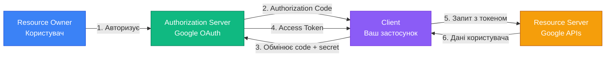
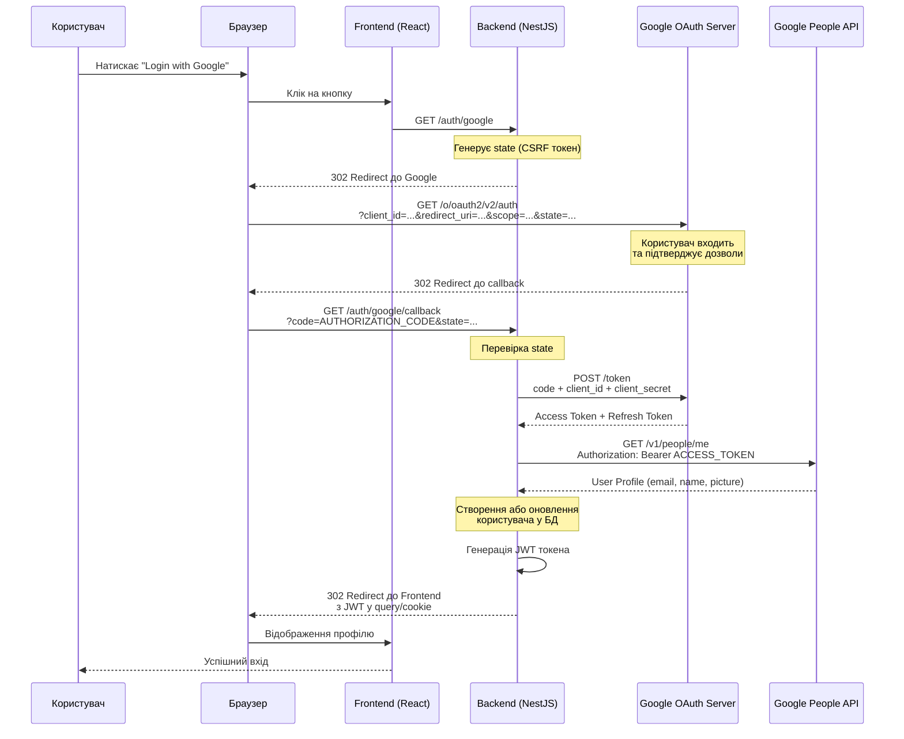
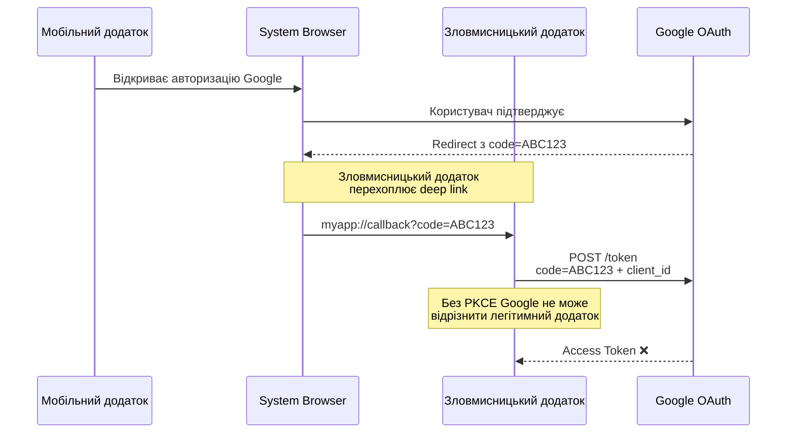

```mermaid
graph TB
    subgraph "Традиційна автентифікація ❌"
        A1[Користувач] -->|email + password| B1[Ваш застосунок]
        B1 -->|Зберігає password| C1[База даних]
    end
    
    subgraph "OAuth 2.0 ✅"
        A2[Користувач] -->|Підтверджує дозвіл| B2[Google Auth]
        B2 -->|Access Token<br/>scope: email, profile| C2[Ваш застосунок]
        C2 -->|Токен без пароля| D2[База даних]
    end
    
    style B1 fill:#ef4444,stroke:#b91c1c,color:#ffffff
    style C1 fill:#ef4444,stroke:#b91c1c,color:#ffffff
    style B2 fill:#10b981,stroke:#047857,color:#ffffff
    style C2 fill:#10b981,stroke:#047857,color:#ffffff
```

```mermaid
graph TB
    subgraph "Authorization Code Flow (Web)"
        A1[Користувач] -->|Натискає Login| B1[Frontend]
        B1 -->|Redirect| C1[Backend /auth/google]
        C1 -->|302 Redirect| D1[Google OAuth]
        D1 -->|Підтверджує| E1[Callback + code]
        E1 -->|Backend обмінює| F1[Access Token]
        F1 -->|Генерує JWT| G1[Frontend]
    end
    
    subgraph "Authorization Code + PKCE (Mobile/SPA)"
        A2[Користувач] -->|Натискає Login| B2[Мобільний додаток]
        B2 -->|Генерує code_verifier| C2[Зберігає локально]
        B2 -->|Redirect + code_challenge| D2[Google OAuth]
        D2 -->|Підтверджує| E2[Callback + code]
        E2 -->|Обмінює + code_verifier| F2[Access Token]
        F2 -->|Генерує JWT| G2[Додаток]
    end
    
    style F1 fill:#10b981,stroke:#047857,color:#ffffff
    style F2 fill:#10b981,stroke:#047857,color:#ffffff
    style C2 fill:#8b5cf6,stroke:#6d28d9,color:#ffffff
```

# OAuth 2.0 та OpenID Connect: делегована автентифікація

## Короткий зміст

У цій лекції розглядається делегована авторизація через сторонні провайдери та протоколи OAuth 2.0/OIDC:

- **Концепція делегованої авторизації** — користувач надає доступ до своїх даних третій стороні без передачі пароля, приклад "Login with Google"
- **Ролі учасників** — Resource Owner (користувач), Client (ваш застосунок), Authorization Server (Google/GitHub), Resource Server (API провайдера з даними користувача)
- **Authorization Code Flow** — найбезпечніший потік для веб-застосунків, redirect на провайдера → користувач підтверджує → authorization code → обмін code на access token через backend
- **Client Credentials Flow** — для machine-to-machine автентифікації (API доступ без користувача), використовується client_id та client_secret
- **PKCE (Proof Key for Code Exchange)** — розширення для SPA та мобільних додатків, захист від authorization code interception attacks через code_verifier та code_challenge
- **OpenID Connect (OIDC)** — надбудова над OAuth 2.0 для автентифікації (не тільки авторизації), додає ID Token з інформацією про користувача, стандартизовані endpoints (`/.well-known/openid-configuration`)
- **Інтеграція у NestJS** — Passport стратегії `passport-google-oauth20`, `passport-github2`, `passport-facebook`, конфігурація callback URL, отримання user profile з провайдера
- **Практичний приклад** — створення OAuth App у Google Console, налаштування redirect URIs, обробка callback у NestJS, створення або оновлення користувача у БД на основі даних від провайдера

Розглядаються безпекові аспекти: state parameter для захисту від CSRF, валідація redirect_uri, безпечне зберігання client_secret, обмеження scopes (доступу до мінімально необхідних даних).

---

::card-group

::card{title="🎯 Мета лекції" icon="i-lucide-target"}

- Зрозуміти фундаментальну відмінність між авторизацією (OAuth 2.0) та автентифікацією (OpenID Connect).
- Опанувати потік Authorization Code Flow з PKCE для безпечної інтеграції сторонніх провайдерів.
- Навчитися реалізовувати "Login with Google/GitHub" у NestJS через Passport стратегії.
- Розуміти безпекові аспекти делегованої автентифікації та типові вразливості.

::

::card{title="🔑 Ключові терміни" icon="i-lucide-key"}

- **OAuth 2.0:** протокол делегованої авторизації, що дозволяє застосунку отримати обмежений доступ до ресурсів користувача без передачі пароля.
- **OpenID Connect (OIDC):** надбудова над OAuth 2.0 для автентифікації, додає ID Token з верифікованими даними користувача.
- **Authorization Code:** тимчасовий одноразовий код, що обмінюється на Access Token через backend.
- **Scope:** параметр, що визначає перелік дозволів, які запитує застосунок (наприклад, `email`, `profile`, `read:repos`).

::

::

---

## Концепція делегованої авторизації

У попередніх лекціях ми розглянули традиційну модель автентифікації, де користувач довіряє свій пароль безпосередньо вашому застосунку. Проте існує альтернативний підхід — **делегована авторизація** (*delegated authorization*), де користувач дозволяє вашому застосунку отримати доступ до його даних, що зберігаються у стороннього провайдера (Google, GitHub, Facebook), **без розкриття пароля**.

### Проблема, що вирішує OAuth 2.0

**Анти-паттерн: передача облікових даних третій стороні**

До появи OAuth 2.0 (2012 рік) існувала небезпечна практика, де застосунки просили користувачів вводити логін та пароль від сторонніх сервісів:

```typescript
// ❌ КАТЕГОРИЧНО НЕБЕЗПЕЧНА ПРАКТИКА (до OAuth 2.0)
interface TwitterCredentials {
  username: string;
  password: string;
}

async function postToTwitter(credentials: TwitterCredentials, message: string) {
  // Застосунок зберігає пароль користувача від Twitter!
  await twitterAPI.authenticate(credentials.username, credentials.password);
  await twitterAPI.postTweet(message);
}
```

**Проблеми цього підходу:**

1. ❌ **Повна компрометація облікового запису:** якщо ваш застосунок зламають, зловмисник отримує паролі користувачів від Google/Facebook/Twitter.
2. ❌ **Неможливість обмеження доступу:** застосунок отримує **повний контроль** над обліковим записом користувача (може видаляти дані, змінювати налаштування).
3. ❌ **Неможливість відкликання доступу:** єдиний спосіб заборонити застосунку доступ — змінити пароль, що впливає на всі інші застосунки.
4. ❌ **Порушення довіри:** користувач змушений довіряти свій пароль невідомому розробнику.

### Рішення: OAuth 2.0 токени замість паролів

OAuth 2.0 вводить концепцію **токенів доступу** (*access tokens*), що мають обмежені дозволи та можуть бути відкликані незалежно від пароля:

::mermaid



::

**Переваги OAuth 2.0:**

- ✅ **Ваш застосунок ніколи не бачить пароль** користувача від Google/GitHub.
- ✅ **Обмежений доступ через scopes:** застосунок може запросити лише `email` та `profile`, без доступу до Gmail або Google Drive.
- ✅ **Відкликання у будь-який момент:** користувач може скасувати доступ через налаштування Google без зміни пароля.
- ✅ **Коротка тривалість токенів:** Access Token має TTL (зазвичай 1 година), після чого потребує оновлення.

---

## Ролі учасників у OAuth 2.0

OAuth 2.0 визначає чотири ключові ролі, що беруть участь у потоці авторизації:

::mermaid



::

### 1. Resource Owner (Власник ресурсу)

**Хто:** кінцевий користувач, що володіє даними.

**Приклад:** Іван Петренко, що має обліковий запис Google з email `ivan.petrenko@gmail.com` та доступом до Google Drive.

**Дія:** надає дозвіл вашому застосунку отримати обмежений доступ до його даних (наприклад, лише email та ім'я).

### 2. Client (Клієнт)

**Хто:** ваш веб-застосунок або мобільний додаток, що запитує доступ до даних користувача.

**Приклад:** застосунок для управління проєктами `TaskMaster`, що хоче дозволити користувачам входити через Google.

**Credentials:**
- `client_id`: публічний ідентифікатор застосунку (схожий на username).
- `client_secret`: секретний ключ (схожий на password) — **має зберігатися лише на backend**.

**Типи клієнтів:**

| Тип | Опис | Приклад | Може зберігати secret? |
|-----|------|---------|------------------------|
| **Confidential Client** | Backend-сервер, що може безпечно зберігати secret | NestJS API | ✅ Так |
| **Public Client** | SPA або мобільний додаток, де код доступний користувачеві | React без backend | ❌ Ні (використовує PKCE) |

### 3. Authorization Server (Сервер авторизації)

**Хто:** сервіс, що відповідає за автентифікацію користувача та видачу токенів.

**Приклад:** Google OAuth 2.0 сервер (`https://accounts.google.com/o/oauth2/v2/auth`).

**Функції:**
- Відображення екрана підтвердження дозволів користувачеві.
- Генерація Authorization Code після підтвердження.
- Обмін Authorization Code на Access Token.
- Валідація `client_id` та `client_secret`.

### 4. Resource Server (Сервер ресурсів)

**Хто:** API, що зберігає дані користувача та приймає запити з Access Token.

**Приклад:** Google People API (`https://people.googleapis.com/v1/people/me`), що повертає профіль користувача.

**Функції:**
- Валідація Access Token.
- Повернення даних користувача відповідно до scopes токена.

::note
У більшості випадків **Authorization Server** та **Resource Server** є частинами одного провайдера (наприклад, обидва від Google). Проте OAuth 2.0 розділяє ці ролі концептуально, оскільки іноді вони можуть бути різними сервісами (наприклад, корпоративний Authorization Server + сторонній Resource Server).
::

---

## Authorization Code Flow: крок за кроком

**Authorization Code Flow** є найбезпечнішим потоком OAuth 2.0 для веб-застосунків із backend-сервером. Розглянемо детальну послідовність кроків з реальними HTTP-запитами.

### Візуалізація повного потоку

::mermaid



::

### Крок 1: Ініціація авторизації (Frontend → Backend)

Користувач натискає кнопку "Login with Google" у інтерфейсі:

```typescript
// Frontend (React)
function LoginPage() {
  const handleGoogleLogin = () => {
    // Перенаправлення на backend ендпоінт
    window.location.href = 'https://api.example.com/auth/google';
  };

  return (
    <button onClick={handleGoogleLogin} className="btn btn-google">
      
      Login with Google
    </button>
  );
}
```

### Крок 2: Redirect на Google (Backend → Google)

Backend формує URL для авторизації та перенаправляє браузер користувача:

```typescript
// Backend (NestJS)
import { Controller, Get, Res } from '@nestjs/common';
import { Response } from 'express';
import { randomBytes } from 'crypto';

@Controller('auth')
export class AuthController {
  @Get('google')
  initiateGoogleAuth(@Res() res: Response) {
    // 1. Генерація state для захисту від CSRF
    const state = randomBytes(16).toString('hex');
    
    // Зберігаємо state у session або Redis
    // req.session.oauthState = state;

    // 2. Параметри авторизації
    const params = new URLSearchParams({
      client_id: process.env.GOOGLE_CLIENT_ID,
      redirect_uri: 'https://api.example.com/auth/google/callback',
      response_type: 'code',
      scope: 'openid email profile', // Запитувані дозволи
      state: state,
      access_type: 'offline', // Для отримання Refresh Token
      prompt: 'consent', // Завжди показувати екран підтвердження
    });

    // 3. Redirect браузера користувача на Google
    const authUrl = `https://accounts.google.com/o/oauth2/v2/auth?${params.toString()}`;
    res.redirect(authUrl);
  }
}
```

**Пояснення параметрів:**

| Параметр | Значення | Призначення |
|----------|----------|-------------|
| `client_id` | Ваш ідентифікатор від Google Console | Ідентифікує ваш застосунок перед Google. |
| `redirect_uri` | `https://api.example.com/auth/google/callback` | URL, куди Google перенаправить користувача після авторизації. Має бути зареєстрований у Google Console! |
| `response_type` | `code` | Вказує, що ми використовуємо Authorization Code Flow (не Implicit Flow). |
| `scope` | `openid email profile` | Список дозволів: `openid` (OIDC), `email` (доступ до email), `profile` (ім'я, фото). |
| `state` | Випадковий рядок | CSRF токен для захисту від атак перенаправлення. |
| `access_type` | `offline` | Запит на видачу Refresh Token (для довгострокового доступу без повторного входу). |
| `prompt` | `consent` | Завжди показувати екран підтвердження дозволів (навіть якщо користувач вже надавав згоду раніше). |


### Крок 3: Підтвердження користувачем (Google UI)

Браузер перенаправляється на Google, де користувач бачить екран підтвердження:

```
┌─────────────────────────────────────────────┐
│  Google                              [×]    │
├─────────────────────────────────────────────┤
│                                             │
│  ivan.petrenko@gmail.com                    │
│                                             │
│  TaskMaster wants to access your            │
│  Google Account                             │
│                                             │
│  This will allow TaskMaster to:             │
│  ✓ View your email address                 │
│  ✓ View your basic profile info            │
│                                             │
│  By continuing, you allow this app to use   │
│  your information in accordance with their  │
│  terms of service and privacy policy.       │
│                                             │
│  [Cancel]              [Allow]              │
└─────────────────────────────────────────────┘
```

Якщо користувач натискає **Allow**, Google генерує **Authorization Code** та перенаправляє назад на ваш `redirect_uri`.

### Крок 4: Callback з Authorization Code (Google → Backend)

Google перенаправляє браузер користувача назад на ваш backend з параметрами `code` та `state`:

```http
GET /auth/google/callback?code=4/0AX4XfWh...&state=a3f9c8e7b2d4f1e8 HTTP/1.1
Host: api.example.com
```

**Backend обробляє callback:**

```typescript
// Backend (NestJS)
@Get('google/callback')
async handleGoogleCallback(
  @Query('code') code: string,
  @Query('state') state: string,
  @Res() res: Response,
) {
  // 1. Валідація state (захист від CSRF)
  // const savedState = req.session.oauthState;
  // if (state !== savedState) {
  //   throw new UnauthorizedException('Invalid state parameter');
  // }

  if (!code) {
    throw new BadRequestException('Authorization code not provided');
  }

  // 2. Обмін code на Access Token
  const tokens = await this.exchangeCodeForTokens(code);

  // 3. Отримання профілю користувача з Google API
  const userProfile = await this.fetchGoogleProfile(tokens.access_token);

  // 4. Створення або оновлення користувача у БД
  const user = await this.authService.findOrCreateUser({
    email: userProfile.email,
    firstName: userProfile.given_name,
    lastName: userProfile.family_name,
    picture: userProfile.picture,
    googleId: userProfile.sub,
  });

  // 5. Генерація власного JWT токена
  const jwtToken = this.authService.generateJWT(user);

  // 6. Redirect на frontend з токеном
  res.redirect(`https://app.example.com/auth/callback?token=${jwtToken}`);
}
```

### Крок 5: Обмін Authorization Code на Access Token

Authorization Code є одноразовим та короткоживучим (термін дії ~10 хвилин). Його потрібно обміняти на Access Token через **backend-to-backend** запит:

```typescript
// src/auth/oauth.service.ts
import axios from 'axios';

async exchangeCodeForTokens(code: string) {
  const params = new URLSearchParams({
    code: code,
    client_id: process.env.GOOGLE_CLIENT_ID,
    client_secret: process.env.GOOGLE_CLIENT_SECRET, // ✅ Секрет надсилається лише з backend
    redirect_uri: 'https://api.example.com/auth/google/callback',
    grant_type: 'authorization_code',
  });

  const response = await axios.post(
    'https://oauth2.googleapis.com/token',
    params.toString(),
    {
      headers: { 'Content-Type': 'application/x-www-form-urlencoded' },
    }
  );

  return response.data;
  // {
  //   access_token: "ya29.a0AfH6SMB...",
  //   expires_in: 3599,
  //   refresh_token: "1//0gH6SMB...", // Якщо запитували access_type=offline
  //   scope: "openid https://www.googleapis.com/auth/userinfo.email ...",
  //   token_type: "Bearer",
  //   id_token: "eyJhbGciOiJSUzI1NiIsImtpZCI6..."
  // }
}
```

::warning
**Критично важливо:** `client_secret` **ніколи** не має передаватися на frontend або включатися у JavaScript код. Цей параметр має використовуватися виключно у backend-to-backend комунікації. Якщо frontend безпосередньо обмінює code на токен (як у Implicit Flow), це створює вразливість — зловмисник може перехопити secret.
::

### Крок 6: Отримання профілю користувача

Після отримання Access Token можна запитувати дані користувача з Google APIs:

```typescript
async fetchGoogleProfile(accessToken: string) {
  const response = await axios.get(
    'https://www.googleapis.com/oauth2/v3/userinfo',
    {
      headers: { Authorization: `Bearer ${accessToken}` },
    }
  );

  return response.data;
  // {
  //   sub: "108012345678901234567",  // Унікальний ID користувача у Google
  //   name: "Іван Петренко",
  //   given_name: "Іван",
  //   family_name: "Петренко",
  //   picture: "https://lh3.googleusercontent.com/a/...",
  //   email: "ivan.petrenko@gmail.com",
  //   email_verified: true,
  //   locale: "uk"
  // }
}
```

**Альтернативно: декодування ID Token**

Якщо використовується OpenID Connect, Google також повертає `id_token` (JWT), що містить ті самі дані у закодованому вигляді:

```typescript
import { decode } from 'jsonwebtoken';

const idToken = tokens.id_token;
const payload = decode(idToken); // Або verify() для перевірки підпису

console.log(payload);
// {
//   iss: "https://accounts.google.com",
//   azp: "YOUR_CLIENT_ID",
//   aud: "YOUR_CLIENT_ID",
//   sub: "108012345678901234567",
//   email: "ivan.petrenko@gmail.com",
//   email_verified: true,
//   at_hash: "...",
//   name: "Іван Петренко",
//   picture: "...",
//   given_name: "Іван",
//   family_name: "Петренко",
//   locale: "uk",
//   iat: 1693564800,
//   exp: 1693568400
// }
```

::tip
**Перевага ID Token:** не потребує додаткового HTTP-запиту до Google API — всі дані вже закодовані у токені. Проте для валідації підпису ID Token потрібен публічний ключ Google (можна завантажити з `https://www.googleapis.com/oauth2/v3/certs`).
::

---

## Scopes: обмеження доступу до даних

**Scope** — це параметр, що визначає, до яких саме даних користувача матиме доступ ваш застосунок. Це ключовий механізм захисту приватності користувачів — застосунок не може отримати більше даних, ніж користувач явно дозволив.

### Стандартні OpenID Connect scopes

| Scope | Доступ до даних |
|-------|----------------|
| `openid` | **Обов'язковий** для OIDC. Дозволяє отримати ID Token з базовою інформацією про користувача. |
| `email` | Email адреса користувача та `email_verified` статус. |
| `profile` | Ім'я, прізвище, фото профілю, дата народження, стать, локаль. |

### Додаткові Google-специфічні scopes

| Scope | Доступ до даних |
|-------|----------------|
| `https://www.googleapis.com/auth/drive.readonly` | Читання файлів з Google Drive. |
| `https://www.googleapis.com/auth/gmail.send` | Надсилання email від імені користувача через Gmail API. |
| `https://www.googleapis.com/auth/calendar` | Читання та зміна Google Calendar подій. |
| `https://www.googleapis.com/auth/contacts.readonly` | Читання списку контактів. |

**Приклад запиту з обмеженими дозволами:**

```typescript
const params = new URLSearchParams({
  client_id: process.env.GOOGLE_CLIENT_ID,
  redirect_uri: 'https://api.example.com/auth/google/callback',
  response_type: 'code',
  scope: 'openid email profile', // ✅ Лише базові дані
  state: state,
});
```

**Приклад запиту з розширеними дозволами:**

```typescript
const params = new URLSearchParams({
  client_id: process.env.GOOGLE_CLIENT_ID,
  redirect_uri: 'https://api.example.com/auth/google/callback',
  response_type: 'code',
  scope: [
    'openid',
    'email',
    'profile',
    'https://www.googleapis.com/auth/drive.readonly', // Читання Drive
    'https://www.googleapis.com/auth/calendar',        // Керування Calendar
  ].join(' '),
  state: state,
});
```

::caution
**Принцип мінімальних привілеїв:** запитуйте **лише ті scopes, що дійсно необхідні** для функціональності вашого застосунку. Користувачі мають більшу довіру до застосунків, що запитують мінімальні дозволи. Наприклад, якщо ваш застосунок є простим task manager, йому не потрібен доступ до Gmail або Google Drive.
::

---

## OpenID Connect: автентифікація через OAuth 2.0

**OpenID Connect (OIDC)** є надбудовою над OAuth 2.0, що додає можливість **автентифікації користувача**, а не лише авторизації доступу до ресурсів. Основна відмінність полягає у введенні **ID Token** — JWT токена з верифікованими даними про користувача.

### OAuth 2.0 vs OpenID Connect

::code-group

```text [OAuth 2.0 — Авторизація]
Питання: "Чи може застосунок X отримати доступ до моїх фотографій?"

Відповідь: Access Token з правом читання Google Photos

Застосунок НЕ знає, хто саме користувач
(лише має токен для доступу до ресурсів)
```

```text [OpenID Connect — Автентифікація]
Питання: "Хто цей користувач?"

Відповідь: ID Token з даними:
{
  sub: "108012345678901234567",
  email: "ivan@gmail.com",
  name: "Іван Петренко",
  picture: "https://...",
  email_verified: true
}

Застосунок ЗНАЄ особу користувача
```

::

### Структура ID Token

ID Token є JWT токеном, підписаним приватним ключем провайдера (Google, GitHub). Це дозволяє вашому застосунку **верифікувати** дані без додаткових запитів до API:

```json
{
  "iss": "https://accounts.google.com",
  "azp": "YOUR_CLIENT_ID.apps.googleusercontent.com",
  "aud": "YOUR_CLIENT_ID.apps.googleusercontent.com",
  "sub": "108012345678901234567",
  "email": "ivan.petrenko@gmail.com",
  "email_verified": true,
  "at_hash": "HK6E_P6Dh8Y93mRNtsDB1Q",
  "name": "Іван Петренко",
  "picture": "https://lh3.googleusercontent.com/a/ACg8ocKx...",
  "given_name": "Іван",
  "family_name": "Петренко",
  "locale": "uk",
  "iat": 1693564800,
  "exp": 1693568400
}
```

**Ключові claims:**

| Claim | Опис |
|-------|------|
| `iss` (Issuer) | Хто видав токен (Google, GitHub, Microsoft). |
| `sub` (Subject) | Унікальний ідентифікатор користувача у провайдера. **Використовуйте це як primary key для прив'язки до вашої БД!** |
| `aud` (Audience) | Для кого призначений токен (має дорівнювати вашому `client_id`). |
| `email` | Email користувача. |
| `email_verified` | Чи верифікував користувач email у провайдера. |
| `iat` (Issued At) | Час видачі токена (Unix timestamp). |
| `exp` (Expiration) | Час застарівання токена (зазвичай через 1 годину). |

### Валідація ID Token

Для безпеки критично важливо **перевірити підпис** ID Token перед довірою його вмісту:

```typescript
// src/auth/oauth.service.ts
import { JwtService } from '@nestjs/jwt';
import axios from 'axios';
import * as jwksClient from 'jwks-rsa';

@Injectable()
export class OAuthService {
  private jwksClient: jwksClient.JwksClient;

  constructor() {
    // Клієнт для завантаження публічних ключів Google
    this.jwksClient = jwksClient({
      jwksUri: 'https://www.googleapis.com/oauth2/v3/certs',
      cache: true,
      cacheMaxAge: 86400000, // 24 години
    });
  }

  async verifyGoogleIdToken(idToken: string) {
    const decoded = jwt.decode(idToken, { complete: true });

    if (!decoded) {
      throw new UnauthorizedException('Invalid ID token');
    }

    // Отримання публічного ключа за kid (Key ID)
    const key = await this.jwksClient.getSigningKey(decoded.header.kid);
    const publicKey = key.getPublicKey();

    // Верифікація підпису та claims
    const verified = jwt.verify(idToken, publicKey, {
      audience: process.env.GOOGLE_CLIENT_ID,
      issuer: 'https://accounts.google.com',
      algorithms: ['RS256'],
    });

    return verified;
  }
}
```

::note
**Чому не можна просто декодувати ID Token без верифікації?** Декодування JWT (`jwt.decode()`) лише розпаковує Base64URL payload, але **не перевіряє підпис**. Зловмисник може створити підроблений токен з довільними даними. Верифікація підпису (`jwt.verify()`) гарантує, що токен дійсно видано Google і не був змінений після видачі.
::


---

## PKCE: захист для публічних клієнтів

**PKCE (Proof Key for Code Exchange, вимовляється «піксі»)** — це розширення OAuth 2.0, розроблене для захисту **публічних клієнтів** (SPA, мобільні додатки) від атак перехоплення Authorization Code.

### Проблема: Authorization Code Interception Attack

У традиційному Authorization Code Flow без PKCE існує вразливість для мобільних додатків:

::mermaid



::

**Чому це можливо:**

- Мобільні додатки реєструють **deep links** (наприклад, `myapp://callback`).
- Зловмисницький додаток може зареєструвати той самий deep link і перехопити callback з Authorization Code.
- Оскільки публічний клієнт **не має `client_secret`**, Google не може верифікувати автентичність додатка.

### Рішення: PKCE з динамічним code_verifier

PKCE додає два параметри, що динамічно генеруються для кожного запиту:

1. **`code_verifier`:** випадковий рядок високої ентропії (43-128 символів).
2. **`code_challenge`:** SHA-256 хеш від `code_verifier`, закодований у Base64URL.

**Алгоритм:**

::steps

### Крок 1: Генерація code_verifier та code_challenge

```typescript
import { randomBytes, createHash } from 'crypto';

function generateCodeVerifier(): string {
  // Випадковий рядок 43-128 символів
  return randomBytes(32).toString('base64url');
}

function generateCodeChallenge(verifier: string): string {
  // SHA-256 хеш від verifier
  return createHash('sha256')
    .update(verifier)
    .digest('base64url');
}

const codeVerifier = generateCodeVerifier();
// "dBjftJeZ4CVP-mB92K27uhbUJU1p1r_wW1gFWFOEjXk"

const codeChallenge = generateCodeChallenge(codeVerifier);
// "E9Melhoa2OwvFrEMTJguCHaoeK1t8URWbuGJSstw-cM"
```

### Крок 2: Додавання code_challenge до authorization URL

```typescript
const params = new URLSearchParams({
  client_id: process.env.GOOGLE_CLIENT_ID,
  redirect_uri: 'com.myapp://callback',
  response_type: 'code',
  scope: 'openid email profile',
  code_challenge: codeChallenge,           // ✅ Додаємо challenge
  code_challenge_method: 'S256',           // Метод хешування
  state: state,
});

// Зберігаємо code_verifier у secure storage (Keychain/Keystore)
await SecureStore.setItemAsync('code_verifier', codeVerifier);
```

### Крок 3: Обмін code на токен з code_verifier

```typescript
const params = new URLSearchParams({
  code: authorizationCode,
  client_id: process.env.GOOGLE_CLIENT_ID,
  redirect_uri: 'com.myapp://callback',
  grant_type: 'authorization_code',
  code_verifier: codeVerifier,  // ✅ Надсилаємо оригінальний verifier
});

const response = await axios.post('https://oauth2.googleapis.com/token', params);
```

::

**Як це захищає:**

1. Легітимний додаток генерує `code_verifier` та `code_challenge`.
2. Google зберігає `code_challenge` разом з Authorization Code.
3. Зловмисник перехоплює `code`, але **не знає `code_verifier`** (він зберігається локально у додатку).
4. Зловмисник намагається обміняти `code` без `code_verifier` → Google відхиляє запит.
5. Легітимний додаток обмінює `code` з правильним `code_verifier` → Google перевіряє: `SHA256(code_verifier) === code_challenge` → видає токени.

::tip
**PKCE є обов'язковим для публічних клієнтів (SPA, мобільні додатки)** згідно з RFC 8252 (OAuth 2.0 for Native Apps) та рекомендованим навіть для confidential clients як додатковий рівень захисту.
::

---

## Інтеграція у NestJS через Passport

NestJS має вбудовану підтримку OAuth 2.0 через Passport стратегії. Розглянемо повну реалізацію для Google OAuth.

### Крок 1: Встановлення залежностей

::tabs

::tabs-item{label="npm"}
```bash
npm install @nestjs/passport passport passport-google-oauth20
npm install --save-dev @types/passport-google-oauth20
```
::

::tabs-item{label="pnpm"}
```bash
pnpm add @nestjs/passport passport passport-google-oauth20
pnpm add -D @types/passport-google-oauth20
```
::

::tabs-item{label="yarn"}
```bash
yarn add @nestjs/passport passport passport-google-oauth20
yarn add -D @types/passport-google-oauth20
```
::

::

### Крок 2: Конфігурація змінних оточення

```bash
# .env
GOOGLE_CLIENT_ID=123456789-abcdefghijklmnop.apps.googleusercontent.com
GOOGLE_CLIENT_SECRET=GOCSPX-AbCdEfGhIjKlMnOpQrStUvWxYz
GOOGLE_CALLBACK_URL=https://api.example.com/auth/google/callback
```

### Крок 3: Створення Google Strategy

```typescript
// src/auth/strategies/google.strategy.ts
import { Injectable } from '@nestjs/common';
import { PassportStrategy } from '@nestjs/passport';
import { Strategy, VerifyCallback } from 'passport-google-oauth20';
import { ConfigService } from '@nestjs/config';

@Injectable()
export class GoogleStrategy extends PassportStrategy(Strategy, 'google') {
  constructor(private config: ConfigService) {
    super({
      clientID: config.get<string>('GOOGLE_CLIENT_ID'),
      clientSecret: config.get<string>('GOOGLE_CLIENT_SECRET'),
      callbackURL: config.get<string>('GOOGLE_CALLBACK_URL'),
      scope: ['openid', 'email', 'profile'],
      passReqToCallback: false, // Якщо true, перший параметр validate() буде request
    });
  }

  /**
   * Метод validate() викликається після успішної авторизації
   * 
   * @param accessToken - Access Token від Google
   * @param refreshToken - Refresh Token (якщо запитували access_type=offline)
   * @param profile - Профіль користувача з Google
   * @param done - Callback для передачі даних у req.user
   */
  async validate(
    accessToken: string,
    refreshToken: string,
    profile: any,
    done: VerifyCallback,
  ): Promise<any> {
    const { id, name, emails, photos } = profile;

    // Формування об'єкта користувача
    const user = {
      googleId: id,
      email: emails[0].value,
      emailVerified: emails[0].verified,
      firstName: name.givenName,
      lastName: name.familyName,
      picture: photos[0].value,
      accessToken,
      refreshToken,
    };

    // Передаємо user до req.user
    done(null, user);
  }
}
```

**Структура об'єкта `profile` від Google:**

```typescript
{
  id: '108012345678901234567',
  displayName: 'Іван Петренко',
  name: {
    familyName: 'Петренко',
    givenName: 'Іван'
  },
  emails: [
    {
      value: 'ivan.petrenko@gmail.com',
      verified: true
    }
  ],
  photos: [
    {
      value: 'https://lh3.googleusercontent.com/a/ACg8ocKx...'
    }
  ],
  provider: 'google',
  _raw: '{"sub":"108012345678901234567",...}',
  _json: {
    sub: '108012345678901234567',
    name: 'Іван Петренко',
    given_name: 'Іван',
    family_name: 'Петренко',
    picture: 'https://...',
    email: 'ivan.petrenko@gmail.com',
    email_verified: true,
    locale: 'uk'
  }
}
```

### Крок 4: Створення Guards

```typescript
// src/auth/guards/google-auth.guard.ts
import { Injectable } from '@nestjs/common';
import { AuthGuard } from '@nestjs/passport';

@Injectable()
export class GoogleAuthGuard extends AuthGuard('google') {}
```

### Крок 5: Реалізація контролера

```typescript
// src/auth/auth.controller.ts
import { Controller, Get, UseGuards, Req, Res } from '@nestjs/common';
import { Response, Request } from 'express';
import { GoogleAuthGuard } from './guards/google-auth.guard';
import { AuthService } from './auth.service';

@Controller('auth')
export class AuthController {
  constructor(private authService: AuthService) {}

  /**
   * GET /auth/google
   * Ініціація OAuth потоку — redirect на Google
   */
  @Get('google')
  @UseGuards(GoogleAuthGuard)
  async googleAuth() {
    // Guard автоматично перенаправляє на Google
    // Цей метод ніколи не викликається
  }

  /**
   * GET /auth/google/callback
   * Обробка callback від Google
   */
  @Get('google/callback')
  @UseGuards(GoogleAuthGuard)
  async googleAuthCallback(
    @Req() req: Request,
    @Res() res: Response,
  ) {
    // req.user встановлено GoogleStrategy.validate()
    const googleUser = req.user as any;

    // Створення або оновлення користувача у БД
    const user = await this.authService.findOrCreateOAuthUser({
      provider: 'google',
      providerId: googleUser.googleId,
      email: googleUser.email,
      emailVerified: googleUser.emailVerified,
      firstName: googleUser.firstName,
      lastName: googleUser.lastName,
      picture: googleUser.picture,
    });

    // Генерація власного JWT токена
    const jwtToken = this.authService.generateJWT(user);

    // Redirect на frontend з токеном
    res.redirect(`https://app.example.com/auth/callback?token=${jwtToken}`);
  }
}
```

### Крок 6: Логіка findOrCreateOAuthUser

```typescript
// src/auth/auth.service.ts
import { Injectable } from '@nestjs/common';
import { InjectRepository } from '@nestjs/typeorm';
import { Repository } from 'typeorm';
import { User } from '../users/entities/user.entity';

interface OAuthUserData {
  provider: string;
  providerId: string;
  email: string;
  emailVerified: boolean;
  firstName: string;
  lastName: string;
  picture: string;
}

@Injectable()
export class AuthService {
  constructor(
    @InjectRepository(User)
    private userRepository: Repository<User>,
  ) {}

  async findOrCreateOAuthUser(data: OAuthUserData): Promise<User> {
    // 1. Пошук користувача за providerId (наприклад, Google ID)
    let user = await this.userRepository.findOne({
      where: {
        provider: data.provider,
        providerId: data.providerId,
      },
    });

    if (user) {
      // 2. Оновлення даних при кожному вході (фото могло змінитися)
      user.firstName = data.firstName;
      user.lastName = data.lastName;
      user.picture = data.picture;
      user.lastLoginAt = new Date();
      await this.userRepository.save(user);
      return user;
    }

    // 3. Перевірка, чи не існує користувач з таким email (пов'язаний з іншим провайдером)
    const existingEmailUser = await this.userRepository.findOne({
      where: { email: data.email },
    });

    if (existingEmailUser && !existingEmailUser.providerId) {
      // Email вже використовується для локального облікового запису
      throw new ConflictException(
        'Email is already registered with email/password. Please log in with your password.'
      );
    }

    // 4. Створення нового користувача
    user = this.userRepository.create({
      email: data.email,
      emailVerified: data.emailVerified,
      firstName: data.firstName,
      lastName: data.lastName,
      picture: data.picture,
      provider: data.provider,
      providerId: data.providerId,
      roles: ['user'],
      lastLoginAt: new Date(),
    });

    await this.userRepository.save(user);
    return user;
  }
}
```

### Крок 7: Оновлення User Entity

```typescript
// src/users/entities/user.entity.ts
import { Entity, Column, PrimaryGeneratedColumn, CreateDateColumn } from 'typeorm';

@Entity('users')
export class User {
  @PrimaryGeneratedColumn('uuid')
  id: string;

  @Column({ unique: true })
  email: string;

  @Column({ default: false })
  emailVerified: boolean;

  @Column({ nullable: true })
  passwordHash: string; // Null для OAuth користувачів

  @Column({ nullable: true })
  provider: string; // 'google', 'github', 'facebook', null для локальних

  @Column({ nullable: true })
  providerId: string; // ID користувача у провайдера

  @Column({ nullable: true })
  firstName: string;

  @Column({ nullable: true })
  lastName: string;

  @Column({ nullable: true })
  picture: string;

  @Column('simple-array', { default: 'user' })
  roles: string[];

  @CreateDateColumn()
  createdAt: Date;

  @Column({ type: 'timestamp', nullable: true })
  lastLoginAt: Date;
}
```

### Крок 8: Реєстрація у модулі

```typescript
// src/auth/auth.module.ts
import { Module } from '@nestjs/common';
import { PassportModule } from '@nestjs/passport';
import { JwtModule } from '@nestjs/jwt';
import { TypeOrmModule } from '@nestjs/typeorm';
import { ConfigModule, ConfigService } from '@nestjs/config';
import { AuthService } from './auth.service';
import { AuthController } from './auth.controller';
import { User } from '../users/entities/user.entity';
import { GoogleStrategy } from './strategies/google.strategy';
import { JwtStrategy } from './strategies/jwt.strategy';

@Module({
  imports: [
    TypeOrmModule.forFeature([User]),
    PassportModule,
    JwtModule.registerAsync({
      imports: [ConfigModule],
      inject: [ConfigService],
      useFactory: (config: ConfigService) => ({
        secret: config.get<string>('JWT_SECRET'),
        signOptions: { expiresIn: '15m' },
      }),
    }),
  ],
  controllers: [AuthController],
  providers: [
    AuthService,
    GoogleStrategy,  // ✅ Реєструємо Google Strategy
    JwtStrategy,
  ],
  exports: [AuthService],
})
export class AuthModule {}
```


---

## Створення OAuth App у Google Console

Для використання Google OAuth необхідно зареєструвати застосунок у Google Cloud Console та отримати `client_id` і `client_secret`.

::steps

### Крок 1: Створення проєкту

1. Відкрийте [Google Cloud Console](https://console.cloud.google.com/).
2. Натисніть **Select a project** → **New Project**.
3. Введіть назву проєкту (наприклад, `TaskMaster`) → **Create**.

### Крок 2: Увімкнення Google+ API

1. У лівому меню виберіть **APIs & Services** → **Library**.
2. Знайдіть **Google+ API** → натисніть **Enable**.

::note
Хоча Google+ як соціальна мережа закритий, API все ще використовується для OAuth автентифікації.
::

### Крок 3: Налаштування OAuth Consent Screen

1. Перейдіть до **APIs & Services** → **OAuth consent screen**.
2. Виберіть **External** (для публічних застосунків) → **Create**.
3. Заповніть обов'язкові поля:
   - **App name:** `TaskMaster`
   - **User support email:** ваш email
   - **Developer contact information:** ваш email
4. Натисніть **Save and Continue**.
5. На сторінці **Scopes** додайте:
   - `.../auth/userinfo.email`
   - `.../auth/userinfo.profile`
   - `openid`
6. Натисніть **Save and Continue** → **Save**.

### Крок 4: Створення OAuth 2.0 Client ID

1. Перейдіть до **APIs & Services** → **Credentials**.
2. Натисніть **Create Credentials** → **OAuth client ID**.
3. Виберіть **Application type:**
   - **Web application** (для застосунків з backend)
   - **iOS/Android** (для мобільних додатків)
4. Введіть **Name:** `TaskMaster Web Client`.
5. Додайте **Authorized redirect URIs:**
   ```
   https://api.example.com/auth/google/callback
   http://localhost:3000/auth/google/callback  (для локальної розробки)
   ```
6. Натисніть **Create**.
7. Скопіюйте **Client ID** та **Client Secret** → збережіть у `.env` файлі.

::

::warning
**Критично важливо:** `redirect_uri` у вашому коді **має точно співпадати** з одним із зареєстрованих URIs у Google Console. Навіть наявність/відсутність слешу в кінці (`/callback` vs `/callback/`) призведе до помилки `redirect_uri_mismatch`.
::

---

## Додавання інших провайдерів (GitHub, Facebook)

Процес інтеграції інших провайдерів аналогічний. Розглянемо GitHub як приклад.

### GitHub OAuth Strategy

**Встановлення:**

```bash
npm install passport-github2
npm install --save-dev @types/passport-github2
```

**Створення стратегії:**

```typescript
// src/auth/strategies/github.strategy.ts
import { Injectable } from '@nestjs/common';
import { PassportStrategy } from '@nestjs/passport';
import { Strategy } from 'passport-github2';
import { ConfigService } from '@nestjs/config';

@Injectable()
export class GitHubStrategy extends PassportStrategy(Strategy, 'github') {
  constructor(private config: ConfigService) {
    super({
      clientID: config.get<string>('GITHUB_CLIENT_ID'),
      clientSecret: config.get<string>('GITHUB_CLIENT_SECRET'),
      callbackURL: config.get<string>('GITHUB_CALLBACK_URL'),
      scope: ['user:email'], // Запит доступу до email
    });
  }

  async validate(
    accessToken: string,
    refreshToken: string,
    profile: any,
    done: any,
  ) {
    const { id, username, emails, photos } = profile;

    const user = {
      githubId: id,
      username: username,
      email: emails?.[0]?.value || null,
      picture: photos?.[0]?.value || null,
      accessToken,
    };

    done(null, user);
  }
}
```

**Контролер:**

```typescript
@Get('github')
@UseGuards(AuthGuard('github'))
async githubAuth() {}

@Get('github/callback')
@UseGuards(AuthGuard('github'))
async githubAuthCallback(@Req() req, @Res() res: Response) {
  const githubUser = req.user;
  
  const user = await this.authService.findOrCreateOAuthUser({
    provider: 'github',
    providerId: githubUser.githubId,
    email: githubUser.email,
    emailVerified: false, // GitHub не гарантує верифікацію
    firstName: githubUser.username,
    lastName: '',
    picture: githubUser.picture,
  });

  const jwtToken = this.authService.generateJWT(user);
  res.redirect(`https://app.example.com/auth/callback?token=${jwtToken}`);
}
```

**Створення OAuth App у GitHub:**

1. Перейдіть до [GitHub Settings → Developer settings → OAuth Apps](https://github.com/settings/developers).
2. Натисніть **New OAuth App**.
3. Заповніть:
   - **Application name:** `TaskMaster`
   - **Homepage URL:** `https://example.com`
   - **Authorization callback URL:** `https://api.example.com/auth/github/callback`
4. Натисніть **Register application**.
5. Скопіюйте **Client ID** та згенеруйте **Client Secret**.

---

## Безпекові аспекти та типові вразливості

### 1. CSRF атака через підміну state

**Атака:**

Зловмисник ініціює OAuth потік зі своїм обліковим записом, але перехоплює `redirect_uri` та підставляє його жертві:

```
1. Зловмисник логінеться через Google → отримує callback:
   https://api.example.com/auth/google/callback?code=ATTACKER_CODE&state=xyz

2. Зловмисник надсилає жертві посилання:
   https://api.example.com/auth/google/callback?code=ATTACKER_CODE&state=xyz

3. Жертва переходить за посиланням → застосунок створює JWT для облікового запису зловмисника.

4. Жертва тепер автентифікована як зловмисник → всі дії виконуються від імені зловмисника.
```

**Захист:**

Завжди генеруйте та валідуйте `state` параметр:

```typescript
import { randomBytes } from 'crypto';

@Get('google')
initiateGoogleAuth(@Req() req, @Res() res: Response) {
  const state = randomBytes(16).toString('hex');
  
  // Зберігаємо state у session або Redis з TTL 10 хвилин
  req.session.oauthState = state;

  const authUrl = `https://accounts.google.com/o/oauth2/v2/auth?...&state=${state}`;
  res.redirect(authUrl);
}

@Get('google/callback')
async handleCallback(@Query('state') state: string, @Req() req) {
  if (state !== req.session.oauthState) {
    throw new UnauthorizedException('Invalid state parameter — possible CSRF attack');
  }

  // Видаляємо використаний state
  delete req.session.oauthState;

  // Продовжуємо обробку...
}
```

### 2. Open Redirect через незахищений redirect_uri

**Атака:**

Якщо ваш застосунок дозволяє довільні `redirect_uri`, зловмисник може перенаправити користувача на фішингову сторінку:

```typescript
// ❌ НЕБЕЗПЕЧНО
@Get('google')
initiateGoogleAuth(@Query('return_to') returnTo: string, @Res() res) {
  const authUrl = `https://accounts.google.com/o/oauth2/v2/auth?...&state=${returnTo}`;
  res.redirect(authUrl);
}

@Get('google/callback')
async handleCallback(@Query('state') returnTo: string, @Res() res) {
  const jwtToken = '...';
  res.redirect(`${returnTo}?token=${jwtToken}`); // ❌ Редірект на довільний URL
}
```

**Експлуатація:**

```
GET /auth/google?return_to=https://evil.com/fake-login
→ Користувач авторизується
→ Redirect на https://evil.com/fake-login?token=REAL_JWT
→ Зловмисник краде токен
```

**Захист:**

Використовуйте **whitelist** дозволених redirect URLs:

```typescript
const ALLOWED_REDIRECT_URLS = [
  'https://app.example.com',
  'https://app.example.com/dashboard',
  'http://localhost:3000', // Для розробки
];

function validateRedirectUrl(url: string): boolean {
  try {
    const parsedUrl = new URL(url);
    return ALLOWED_REDIRECT_URLS.some(allowed => 
      parsedUrl.origin === new URL(allowed).origin
    );
  } catch {
    return false;
  }
}

@Get('google/callback')
async handleCallback(@Query('state') returnTo: string, @Res() res) {
  if (!validateRedirectUrl(returnTo)) {
    throw new BadRequestException('Invalid redirect URL');
  }

  const jwtToken = '...';
  res.redirect(`${returnTo}?token=${jwtToken}`);
}
```

### 3. Витік client_secret через frontend

**Атака:**

Якщо `client_secret` включено у JavaScript код frontend:

```javascript
// ❌ КАТЕГОРИЧНО НЕБЕЗПЕЧНО
const params = {
  client_id: 'YOUR_CLIENT_ID',
  client_secret: 'YOUR_CLIENT_SECRET', // ❌ Видно у DevTools
  grant_type: 'authorization_code',
  code: authCode,
};

fetch('https://oauth2.googleapis.com/token', {
  method: 'POST',
  body: JSON.stringify(params),
});
```

Зловмисник може відкрити **DevTools → Sources** та прочитати `client_secret`, після чого генерувати токени від імені вашого застосунку.

**Захист:**

- ✅ **Ніколи не включайте `client_secret` у frontend код.**
- ✅ Обмін `code` на токен має відбуватися виключно на **backend**.
- ✅ Для SPA без backend використовуйте **PKCE** замість `client_secret`.

### 4. Недостатня валідація ID Token

**Атака:**

Зловмисник підробляє ID Token з довільними даними:

```typescript
// ❌ НЕБЕЗПЕЧНО: декодування без верифікації
const idToken = req.body.id_token;
const payload = jwt.decode(idToken); // Немає перевірки підпису!

const user = {
  email: payload.email, // Може бути admin@example.com
  roles: payload.roles, // Може бути ['admin']
};
```

**Захист:**

Завжди верифікуйте підпис ID Token:

```typescript
// ✅ БЕЗПЕЧНО
const verified = jwt.verify(idToken, publicKey, {
  audience: process.env.GOOGLE_CLIENT_ID,
  issuer: 'https://accounts.google.com',
  algorithms: ['RS256'],
});
```

---

## Візуалізація порівняння потоків

::mermaid



::


---

## Frontend інтеграція з OAuth

Розглянемо, як фронтенд взаємодіє з OAuth потоком після redirect від провайдера.

### Обробка callback на клієнті (React)

```typescript
// src/pages/AuthCallbackPage.tsx
import React, { useEffect } from 'react';
import { useNavigate, useSearchParams } from 'react-router-dom';
import { useAuth } from '../contexts/AuthContext';

export function AuthCallbackPage() {
  const [searchParams] = useSearchParams();
  const navigate = useNavigate();
  const { setAccessToken } = useAuth();

  useEffect(() => {
    const token = searchParams.get('token');
    const error = searchParams.get('error');

    if (error) {
      // Обробка помилки OAuth (користувач відхилив дозволи)
      console.error('OAuth error:', error);
      navigate('/login?error=oauth_failed');
      return;
    }

    if (token) {
      // Збереження JWT токена
      setAccessToken(token);
      localStorage.setItem('access_token', token);

      // Перенаправлення на домашню сторінку
      navigate('/dashboard');
    } else {
      // Невідома помилка
      navigate('/login?error=unknown');
    }
  }, [searchParams, navigate, setAccessToken]);

  return (
    <div className="auth-callback-loading">
      <div className="spinner"></div>
      <p>Completing authentication...</p>
    </div>
  );
}
```

### UI кнопок для OAuth провайдерів

```typescript
// src/components/SocialLoginButtons.tsx
import React from 'react';

const BACKEND_URL = 'https://api.example.com';

export function SocialLoginButtons() {
  const handleGoogleLogin = () => {
    window.location.href = `${BACKEND_URL}/auth/google`;
  };

  const handleGitHubLogin = () => {
    window.location.href = `${BACKEND_URL}/auth/github`;
  };

  const handleFacebookLogin = () => {
    window.location.href = `${BACKEND_URL}/auth/facebook`;
  };

  return (
    <div className="social-login">
      <button
        onClick={handleGoogleLogin}
        className="btn btn-google"
      >
        
        Continue with Google
      </button>

      <button
        onClick={handleGitHubLogin}
        className="btn btn-github"
      >
        
        Continue with GitHub
      </button>

      <button
        onClick={handleFacebookLogin}
        className="btn btn-facebook"
      >
        
        Continue with Facebook
      </button>
    </div>
  );
}
```

**Стилізація кнопок (Tailwind CSS):**

```css
.btn-google {
  @apply flex items-center justify-center gap-3 w-full px-6 py-3 bg-white border-2 border-gray-300 rounded-lg hover:bg-gray-50 transition-colors;
}

.btn-github {
  @apply flex items-center justify-center gap-3 w-full px-6 py-3 bg-gray-900 text-white rounded-lg hover:bg-gray-800 transition-colors;
}

.btn-facebook {
  @apply flex items-center justify-center gap-3 w-full px-6 py-3 bg-blue-600 text-white rounded-lg hover:bg-blue-700 transition-colors;
}
```

---

## Практичний приклад: повна інтеграція

Зведемо всі компоненти разом у повний робочий приклад.

### Backend: повна структура модуля

::code-tree

```typescript [src/auth/auth.module.ts]
import { Module } from '@nestjs/common';
import { PassportModule } from '@nestjs/passport';
import { JwtModule } from '@nestjs/jwt';
import { TypeOrmModule } from '@nestjs/typeorm';
import { ConfigModule, ConfigService } from '@nestjs/config';
import { AuthService } from './auth.service';
import { AuthController } from './auth.controller';
import { User } from '../users/entities/user.entity';
import { GoogleStrategy } from './strategies/google.strategy';
import { GitHubStrategy } from './strategies/github.strategy';
import { JwtStrategy } from './strategies/jwt.strategy';
import { LocalStrategy } from './strategies/local.strategy';

@Module({
  imports: [
    TypeOrmModule.forFeature([User]),
    PassportModule.register({ session: false }),
    JwtModule.registerAsync({
      imports: [ConfigModule],
      inject: [ConfigService],
      useFactory: (config: ConfigService) => ({
        secret: config.get<string>('JWT_SECRET'),
        signOptions: { expiresIn: '15m' },
      }),
    }),
  ],
  controllers: [AuthController],
  providers: [
    AuthService,
    LocalStrategy,
    JwtStrategy,
    GoogleStrategy,
    GitHubStrategy,
  ],
  exports: [AuthService],
})
export class AuthModule {}
```

```typescript [src/auth/auth.controller.ts]
import {
  Controller,
  Get,
  Post,
  Body,
  UseGuards,
  Req,
  Res,
  HttpCode,
  HttpStatus,
} from '@nestjs/common';
import { Response, Request } from 'express';
import { AuthService } from './auth.service';
import { LoginDto, RegisterDto } from './dto';
import { LocalAuthGuard } from './guards/local-auth.guard';
import { GoogleAuthGuard } from './guards/google-auth.guard';
import { GitHubAuthGuard } from './guards/github-auth.guard';
import { JwtAuthGuard } from './guards/jwt-auth.guard';
import { Public } from './decorators/public.decorator';
import { CurrentUser } from './decorators/current-user.decorator';

@Controller('auth')
export class AuthController {
  constructor(private authService: AuthService) {}

  // ============ Локальна автентифікація ============

  @Public()
  @Post('register')
  async register(@Body() dto: RegisterDto) {
    const user = await this.authService.register(dto.email, dto.password);
    return { statusCode: HttpStatus.CREATED, data: user };
  }

  @Public()
  @Post('login')
  @UseGuards(LocalAuthGuard)
  @HttpCode(HttpStatus.OK)
  async login(@Req() req, @Res({ passthrough: true }) res: Response) {
    const result = await this.authService.login(req.user);
    
    res.cookie('refreshToken', result.refreshToken, {
      httpOnly: true,
      secure: true,
      sameSite: 'strict',
      maxAge: 7 * 24 * 60 * 60 * 1000,
      path: '/auth/refresh',
    });

    return {
      statusCode: HttpStatus.OK,
      data: {
        accessToken: result.accessToken,
        user: result.user,
      },
    };
  }

  // ============ Google OAuth ============

  @Public()
  @Get('google')
  @UseGuards(GoogleAuthGuard)
  async googleAuth() {
    // Redirect до Google
  }

  @Public()
  @Get('google/callback')
  @UseGuards(GoogleAuthGuard)
  async googleAuthCallback(@Req() req, @Res() res: Response) {
    const googleUser = req.user;
    const result = await this.authService.oauthLogin(googleUser);
    
    res.redirect(
      `${process.env.FRONTEND_URL}/auth/callback?token=${result.accessToken}`
    );
  }

  // ============ GitHub OAuth ============

  @Public()
  @Get('github')
  @UseGuards(GitHubAuthGuard)
  async githubAuth() {
    // Redirect до GitHub
  }

  @Public()
  @Get('github/callback')
  @UseGuards(GitHubAuthGuard)
  async githubAuthCallback(@Req() req, @Res() res: Response) {
    const githubUser = req.user;
    const result = await this.authService.oauthLogin(githubUser);
    
    res.redirect(
      `${process.env.FRONTEND_URL}/auth/callback?token=${result.accessToken}`
    );
  }

  // ============ Захищені ендпоінти ============

  @Get('profile')
  @UseGuards(JwtAuthGuard)
  getProfile(@CurrentUser() user) {
    return { statusCode: HttpStatus.OK, data: user };
  }

  @Post('logout')
  @UseGuards(JwtAuthGuard)
  @HttpCode(HttpStatus.OK)
  async logout(@Req() req, @Res({ passthrough: true }) res: Response) {
    const refreshToken = req.cookies?.refreshToken;
    if (refreshToken) {
      await this.authService.revokeRefreshToken(refreshToken);
    }

    res.clearCookie('refreshToken', {
      httpOnly: true,
      secure: true,
      sameSite: 'strict',
      path: '/auth/refresh',
    });

    return { statusCode: HttpStatus.OK, message: 'Logout successful' };
  }
}
```

```typescript [src/auth/auth.service.ts]
import { Injectable, ConflictException } from '@nestjs/common';
import { InjectRepository } from '@nestjs/typeorm';
import { Repository } from 'typeorm';
import { JwtService } from '@nestjs/jwt';
import { hash, compare } from 'bcrypt';
import { User } from '../users/entities/user.entity';

@Injectable()
export class AuthService {
  constructor(
    @InjectRepository(User)
    private userRepository: Repository<User>,
    private jwtService: JwtService,
  ) {}

  async register(email: string, password: string) {
    const existing = await this.userRepository.findOne({ where: { email } });
    if (existing) {
      throw new ConflictException('Email already registered');
    }

    const passwordHash = await hash(password, 12);
    const user = this.userRepository.create({
      email,
      passwordHash,
      emailVerified: false,
      roles: ['user'],
    });

    await this.userRepository.save(user);
    return { id: user.id, email: user.email };
  }

  async login(user: User) {
    const accessToken = this.generateJWT(user);
    const refreshToken = randomUUID();
    
    // Збереження refresh token...

    return {
      accessToken,
      refreshToken,
      user: {
        id: user.id,
        email: user.email,
        roles: user.roles,
      },
    };
  }

  async oauthLogin(oauthUser: any) {
    let user = await this.userRepository.findOne({
      where: {
        provider: oauthUser.provider,
        providerId: oauthUser.providerId,
      },
    });

    if (!user) {
      user = this.userRepository.create({
        email: oauthUser.email,
        emailVerified: oauthUser.emailVerified,
        firstName: oauthUser.firstName,
        lastName: oauthUser.lastName,
        picture: oauthUser.picture,
        provider: oauthUser.provider,
        providerId: oauthUser.providerId,
        roles: ['user'],
      });
      await this.userRepository.save(user);
    } else {
      // Оновлення даних при кожному вході
      user.firstName = oauthUser.firstName;
      user.lastName = oauthUser.lastName;
      user.picture = oauthUser.picture;
      user.lastLoginAt = new Date();
      await this.userRepository.save(user);
    }

    const accessToken = this.generateJWT(user);
    return { accessToken, user };
  }

  generateJWT(user: User): string {
    return this.jwtService.sign({
      sub: user.id,
      email: user.email,
      roles: user.roles,
    });
  }
}
```

::

---

## Інтерактивні запитання для самоперевірки

::accordion

::accordion-item{label="❓ Чому не можна використовувати Implicit Flow для веб-застосунків у 2024 році?" icon="i-lucide-help-circle"}

**Implicit Flow** (потік з `response_type=token`) був розроблений для SPA застосунків до появи PKCE. У цьому потоці Access Token повертається **безпосередньо у URL** після редіректа:

```
https://app.example.com/callback#access_token=ya29.a0AfH6SMB...
```

**Проблеми безпеки:**

1. ❌ **Витік через browser history:** токен зберігається у історії браузера та може бути витягнутий через JavaScript (`window.history`).
2. ❌ **Витік через Referer header:** якщо користувач переходить на сторонній сайт, токен може потрапити у `Referer` заголовок.
3. ❌ **Немає можливості отримати Refresh Token:** токени короткоживучі без механізму оновлення.
4. ❌ **Вразливість до XSS:** токен доступний для JavaScript → легко вкрасти через ін'єктований скрипт.

**Сучасна альтернатива:** **Authorization Code Flow + PKCE** є єдиним рекомендованим потоком для SPA (згідно з OAuth 2.0 Security Best Current Practice, RFC 8252). PKCE усуває всі вразливості Implicit Flow без необхідності зберігати `client_secret` на клієнті.

::

::accordion-item{label="❓ Що робити, якщо користувач вже зареєстрований через email/пароль, а потім спробує увійти через Google з тим самим email?" icon="i-lucide-help-circle"}

Це класична проблема **конфлікту облікових записів** (*account linking*). Є кілька стратегій:

**Стратегія 1: Відхилення з поясненням (рекомендовано для безпеки)**

```typescript
async oauthLogin(oauthUser: any) {
  const existingUser = await this.userRepository.findOne({
    where: { email: oauthUser.email },
  });

  if (existingUser && !existingUser.providerId) {
    throw new ConflictException(
      'This email is already registered with email/password. ' +
      'Please log in with your password or reset it if you forgot.'
    );
  }

  // Створення OAuth користувача...
}
```

**Переваги:** не дозволяє зловмисникові захопити обліковий запис через OAuth, якщо він знає email жертви.

**Стратегія 2: Автоматичне пов'язування (зручно, але ризиковано)**

```typescript
async oauthLogin(oauthUser: any) {
  let user = await this.userRepository.findOne({
    where: { email: oauthUser.email },
  });

  if (user && !user.providerId) {
    // Пов'язуємо OAuth профіль з існуючим обліковим записом
    user.provider = oauthUser.provider;
    user.providerId = oauthUser.providerId;
    user.emailVerified = true; // Google/GitHub гарантують верифікацію
    await this.userRepository.save(user);
  }

  // Інакше створюємо нового користувача...
}
```

**Ризики:** якщо зловмисник контролює email жертви у Google (наприклад, через фішинг), він може захопити обліковий запис.

**Стратегія 3: Запит підтвердження (найбезпечніше)**

Якщо виявлено конфлікт, надіслати email на адресу користувача з посиланням для підтвердження пов'язування облікових записів. Лише після кліку на посилання OAuth профіль прив'язується до існуючого облікового запису.

::

::accordion-item{label="❓ Чи може зловмисник підробити callback від Google, якщо він знає структуру URL?" icon="i-lucide-help-circle"}

**Ні, не може** завдяки кільком рівням захисту:

**1. Authorization Code є одноразовим**

Google генерує унікальний `code` для кожного запиту авторизації. Цей код діє **лише 10 хвилин** та може бути обмінений на токен **лише один раз**. Якщо зловмисник спробує використати код повторно, Google відхилить запит.

**2. Валідація redirect_uri**

При обміні `code` на токен ваш backend надсилає `redirect_uri`, що **має точно співпадати** з зареєстрованим у Google Console. Google перевіряє:

```typescript
if (request.redirect_uri !== registered_redirect_uris) {
  return { error: 'redirect_uri_mismatch' };
}
```

Зловмисник не може зареєструвати довільний `redirect_uri` без доступу до вашого Google Cloud проєкту.

**3. Валідація state параметра**

Навіть якщо зловмисник отримає валідний `code` (наприклад, через MITM атаку), він не зможе використати його без правильного `state` токена, що зберігається у сесії користувача:

```typescript
if (request.state !== session.oauthState) {
  throw new UnauthorizedException('CSRF attack detected');
}
```

**4. client_secret на backend**

Обмін `code` на токен вимагає `client_secret`, що знає лише ваш backend. Навіть якщо зловмисник перехопить callback URL, він не зможе обміняти `code` без секрету.

**Висновок:** підробити callback від Google практично неможливо без компрометації вашого backend сервера або Google Cloud проєкту.

::

::accordion-item{label="❓ Чи безпечно зберігати Access Token від Google у localStorage для виконання API запитів?" icon="i-lucide-help-circle"}

**Залежить від вашої архітектури:**

**Сценарій 1: Ви використовуєте Google Access Token для прямих запитів до Google APIs**

Якщо ваш frontend безпосередньо викликає Google Drive API або Gmail API, то Access Token **має** зберігатися на клієнті (in-memory або `sessionStorage`):

```typescript
// Frontend викликає Google Drive API
fetch('https://www.googleapis.com/drive/v3/files', {
  headers: {
    Authorization: `Bearer ${googleAccessToken}`,
  },
});
```

У цьому випадку:

- ⚠️ Зберігання у `localStorage` є **субоптимальним** (вразливість до XSS).
- ✅ Краще зберігати **in-memory** або `sessionStorage` (токен втрачається при закритті вкладки).
- ✅ Використовуйте **короткий TTL** (1 година) та механізм оновлення через Refresh Token.

**Сценарій 2: Ви обмінюєте Google Access Token на власний JWT (рекомендовано)**

Після OAuth callback ваш backend отримує Google Access Token, верифікує користувача та генерує **власний JWT токен**:

```typescript
// Backend
const user = await this.fetchGoogleProfile(googleAccessToken);
const jwtToken = this.generateJWT(user); // Власний JWT
res.redirect(`/auth/callback?token=${jwtToken}`);
```

У цьому випадку:

- ✅ Google Access Token **ніколи не надсилається на frontend** → немає ризику витоку.
- ✅ Клієнт зберігає лише ваш **короткоживучий JWT** (15 хв) in-memory.
- ✅ Refresh Token зберігається у **HttpOnly Cookie** для оновлення JWT.

**Рекомендація:** завжди використовуйте **Сценарій 2** для веб-застосунків — це мінімізує поверхню атаки та дозволяє централізовано контролювати доступ через ваш backend.

::

::

---

## Підсумок та ключові висновки

OAuth 2.0 та OpenID Connect revolutionized автентифікацію у сучасному вебі, дозволяючи користувачам входити через довірені провайдери без передачі паролів. Основні принципи, які необхідно запам'ятати:

::card-group

::card{title="✅ Обов'язкові практики" icon="i-lucide-check-circle"}

- Використовуйте **Authorization Code Flow** для веб-застосунків з backend.
- Додавайте **PKCE** для всіх публічних клієнтів (SPA, мобільні додатки).
- Завжди валідуйте **state параметр** для захисту від CSRF атак.
- **Ніколи не включайте `client_secret`** у frontend код.
- Перевіряйте **підпис ID Token** перед довірою його вмісту.
- Запитуйте **мінімально необхідні scopes** (принцип найменших привілеїв).

::

::card{title="❌ Категоричні заборони" icon="i-lucide-x-circle"}

- **Не використовуйте Implicit Flow** у 2024 році — він застарілий та небезпечний.
- **Не зберігайте `client_secret`** у `localStorage`, cookies або будь-де на клієнті.
- **Не довіряйте** декодованому JWT без верифікації підпису.
- **Не дозволяйте** довільні `redirect_uri` — використовуйте whitelist.
- **Не пропускайте** валідацію `aud` та `iss` claims у ID Token.

::

::

Ця лекція завершує модуль **"Механізми автентифікації у веб-застосунках"**. Ви опанували повний стек сучасних технологій автентифікації — від базових концепцій до enterprise-рівня реалізації з OAuth 2.0/OIDC. Ці знання є фундаментом для побудови безпечних та масштабованих веб-систем.

