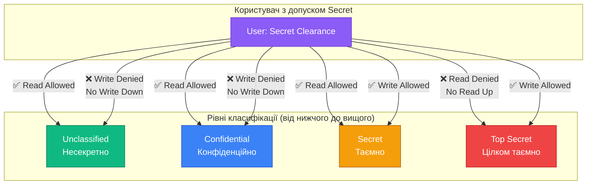
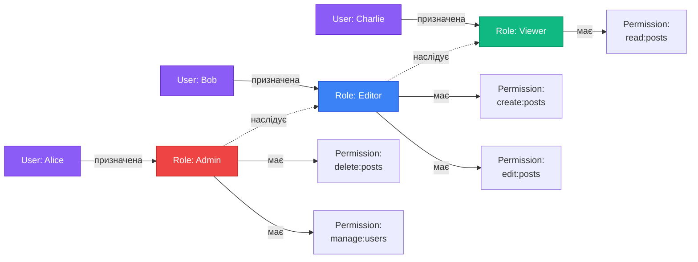
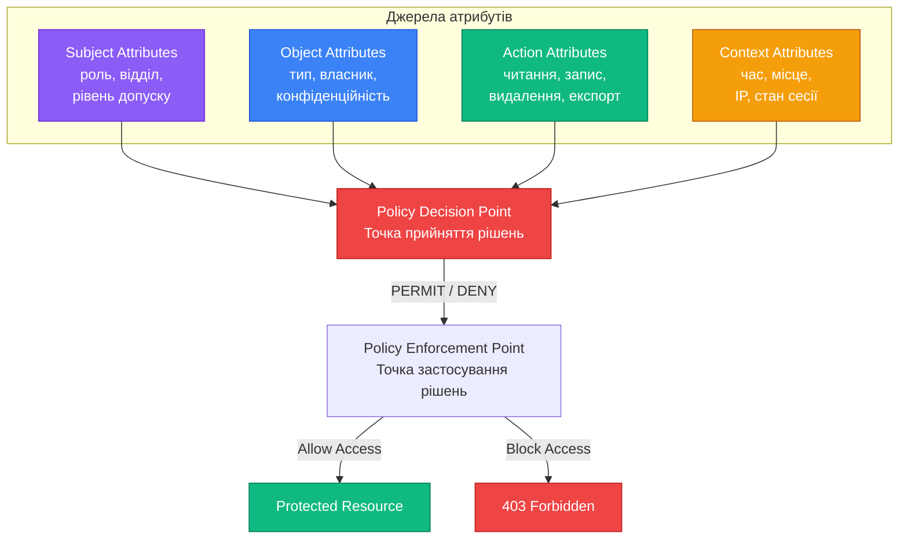

# Моделі авторизації

## Короткий зміст

У цій лекції розглядається порівняння основних моделей контролю доступу до ресурсів:

- **DAC (Discretionary Access Control)** — дискреційний контроль доступу, власник ресурсу сам визначає права доступу інших користувачів
- **MAC (Mandatory Access Control)** — мандатний контроль доступу, права визначаються централізованою політикою безпеки на основі рівнів секретності
- **RBAC (Role-Based Access Control)** — рольовий контроль доступу, права надаються на основі ролей користувача у системі
- **ABAC (Attribute-Based Access Control)** — атрибутивний контроль доступу, рішення про доступ приймається на основі атрибутів користувача, ресурсу, дії та контексту

Вивчаються переваги та недоліки кожної моделі, типові сценарії використання (DAC для файлових систем, MAC для військових систем, RBAC для корпоративних застосунків, ABAC для складних багатофакторних рішень), критерії вибору моделі залежно від вимог проєкту до безпеки, гнучкості та складності адміністрування.

---

::card-group

::card{title="🎯 Мета лекції" icon="i-lucide-target"}

- Опанувати фундаментальні моделі контролю доступу до ресурсів у програмних системах.
- Зрозуміти архітектурні відмінності між DAC, MAC, RBAC та ABAC підходами.
- Навчитися обирати оптимальну модель авторизації залежно від вимог проєкту до безпеки, масштабованості та гнучкості адміністрування.
- Ознайомитися з практичними сценаріями застосування кожної моделі у реальних веб-застосунках.

::

::card{title="🔑 Ключові терміни" icon="i-lucide-key"}

- **Access Control Model (Модель контролю доступу):** формальний опис правил, що визначають, які суб'єкти мають доступ до яких об'єктів.
- **Subject (Суб'єкт):** активна сутність, що виконує дії — користувач, процес, сервіс.
- **Object (Об'єкт):** пасивна сутність, до якої здійснюється доступ — файл, база даних, API-ендпоінт.
- **Principal (Принципал):** автентифікована ідентичність, від імені якої діє суб'єкт.
- **Permission (Дозвіл):** право виконувати певну операцію над об'єктом.

::

::

---

## Еволюція моделей контролю доступу

У попередній лекції ми розглянули фундаментальну відмінність між автентифікацією (*authentication*) — підтвердженням особи користувача — та авторизацією (*authorization*) — наданням прав доступу до ресурсів. Автентифікація відповідає на питання **«Хто ви?»**, тоді як авторизація вирішує **«Що вам дозволено робити?»**.

Проте сама по собі відповідь на друге питання може будуватися за різними принципами. Протягом десятиліть еволюції систем безпеки було розроблено кілька фундаментальних моделей контролю доступу, кожна з яких відповідає на різні вимоги до безпеки, гнучкості та складності адміністрування. Ці моделі не є взаємовиключними — сучасні застосунки часто комбінують елементи кількох підходів залежно від контексту.

**Чотири основні моделі контролю доступу:**

1. **DAC (Discretionary Access Control)** — дискреційний контроль доступу, де власник ресурсу має повну свободу (*discretion*) у визначенні прав доступу інших користувачів. Це найстаріший та найпростіший підхід, що лежить в основі файлових систем UNIX/Linux (`chmod`, `chown`) та Windows ACL (*Access Control Lists*).

2. **MAC (Mandatory Access Control)** — мандатний (обов'язковий) контроль доступу, де права визначаються централізованою політикою безпеки на основі міток секретності (*security labels*) та рівнів доступу. Модель розроблена для високозахищених середовищ — військових систем, державних установ, банківських core-систем.

3. **RBAC (Role-Based Access Control)** — рольовий контроль доступу, де права надаються не безпосередньо користувачам, а через проміжний шар **ролей** (*roles*). Користувач отримує одну або кілька ролей, кожна з яких визначає набір дозволів. Це стандарт для корпоративних застосунків, CRM, ERP, систем управління контентом.

4. **ABAC (Attribute-Based Access Control)** — атрибутивний контроль доступу, де рішення про доступ приймається динамічно на основі **атрибутів** (*attributes*) суб'єкта (користувача), об'єкта (ресурсу), дії та контексту виконання (час, місце, стан сесії). Це найгнучкіша та найскладніша модель, що дозволяє виражати складні багатофакторні політики.

::note
У реальних проєктах рідко зустрічається «чиста» реалізація однієї моделі. Наприклад, GitHub використовує RBAC для управління правами у репозиторіях (`admin`, `write`, `read`), але додає елементи ABAC для перевірки контексту — чи походить запит із довіреної IP-адреси, чи увімкнена двофакторна автентифікація, чи дозволений доступ для API токена з певними *scopes*.
::

---

## DAC: Дискреційний контроль доступу

**Discretionary Access Control (DAC)** — це модель, у якій **власник** (*owner*) ресурсу має повну свободу вибору (*discretion*) у визначенні прав доступу інших користувачів до цього ресурсу. Власник може надавати, змінювати або відкликати дозволи на свій розсуд, без узгодження з централізованою адміністрацією безпеки.

### Базові принципи DAC

**Ключові характеристики:**

- **Децентралізоване управління доступом:** кожен користувач, який створює ресурс, автоматично стає його власником і отримує право управляти доступом до нього.
- **Передача прав:** власник може не лише надати дозвіл іншому користувачеві, але й передати йому право надавати доступ третім особам (*grant option*). Це створює ланцюжки делегування прав.
- **Гнучкість та простота:** для малих систем та особистих даних це інтуїтивно зрозумілий підхід — «Це мій файл, я вирішую, хто його читає».
- **Ризик неконтрольованого поширення прав:** відсутність централізованого контролю може призвести до ситуації, коли конфіденційні дані стають доступними непередбаченому колу осіб через ланцюжок делегувань.

### Приклад: Файлова система UNIX/Linux

Класичний приклад DAC — система дозволів у UNIX/Linux, що базується на трьох категоріях суб'єктів та трьох типах операцій:

**Категорії суб'єктів:**
- **User (Власник):** користувач, який створив файл.
- **Group (Група):** всі користувачі, що входять до певної групи.
- **Others (Інші):** всі інші користувачі у системі.

**Типи операцій:**
- **Read (r):** читання вмісту файлу або перегляд списку файлів у каталозі.
- **Write (w):** зміна вмісту файлу або створення/видалення файлів у каталозі.
- **Execute (x):** виконання файлу як програми або перехід у каталог.

Власник файлу може в будь-який момент змінити дозволи за допомогою команди `chmod`:

```bash
# Створюємо файл — автоматично стаємо його власником
touch report.txt

# Дивимося поточні дозволи
ls -l report.txt
# -rw-r--r--  1 ivan  staff  0 Sep  7 14:30 report.txt
# ^^^ ^^^ ^^^
#  |   |   └─ Others: read
#  |   └───── Group: read
#  └───────── User: read + write

# Надаємо групі право на запис, забираємо доступ у інших
chmod 660 report.txt

# Результат
ls -l report.txt
# -rw-rw----  1 ivan  staff  0 Sep  7 14:30 report.txt
```

### Реалізація DAC у веб-застосунку (TypeScript + NestJS)

Розглянемо спрощену реалізацію DAC для системи управління документами, де користувач може створювати документи та надавати доступ іншим користувачам.

**Модель даних:**

```typescript
// domain/document.entity.ts
export class Document {
  id: string;
  title: string;
  content: string;
  ownerId: string; // UUID власника документа
  createdAt: Date;
  
  // Список дозволів: які користувачі мають які права
  permissions: DocumentPermission[];
}

export class DocumentPermission {
  id: string;
  documentId: string;
  userId: string; // UUID користувача, якому надано доступ
  canRead: boolean;
  canWrite: boolean;
  canDelete: boolean;
  canGrantAccess: boolean; // Чи може цей користувач надавати доступ іншим
  grantedAt: Date;
}
```

**Guard для перевірки DAC дозволів:**

```typescript
// guards/dac-authorization.guard.ts
import { Injectable, CanActivate, ExecutionContext, ForbiddenException } from '@nestjs/common';
import { Reflector } from '@nestjs/core';
import { DocumentService } from '../services/document.service';

@Injectable()
export class DacAuthorizationGuard implements CanActivate {
  constructor(
    private reflector: Reflector,
    private documentService: DocumentService
  ) {}

  async canActivate(context: ExecutionContext): Promise<boolean> {
    // Витягуємо необхідну операцію з метаданих декоратора
    const requiredOperation = this.reflector.get<'read' | 'write' | 'delete' | 'grant'>(
      'operation',
      context.getHandler()
    );

    if (!requiredOperation) {
      return true; // Якщо операція не вказана, дозволяємо доступ
    }

    const request = context.switchToHttp().getRequest();
    const currentUser = request.user; // Встановлений AuthGuard
    const documentId = request.params.id;

    if (!currentUser || !documentId) {
      throw new ForbiddenException('Missing authentication or document ID');
    }

    const document = await this.documentService.findById(documentId);

    if (!document) {
      return false; // Документ не існує — Guard не несе відповідальності за 404
    }

    // Перевірка 1: Власник має всі права
    if (document.ownerId === currentUser.sub) {
      return true;
    }

    // Перевірка 2: Шукаємо явний дозвіл для поточного користувача
    const permission = document.permissions.find(p => p.userId === currentUser.sub);

    if (!permission) {
      throw new ForbiddenException('You do not have access to this document');
    }

    // Перевірка 3: Чи має користувач необхідну операцію
    const hasPermission = this.checkPermission(permission, requiredOperation);

    if (!hasPermission) {
      throw new ForbiddenException(
        `You do not have permission to ${requiredOperation} this document`
      );
    }

    return true;
  }

  private checkPermission(
    permission: DocumentPermission,
    operation: 'read' | 'write' | 'delete' | 'grant'
  ): boolean {
    switch (operation) {
      case 'read':
        return permission.canRead;
      case 'write':
        return permission.canWrite;
      case 'delete':
        return permission.canDelete;
      case 'grant':
        return permission.canGrantAccess;
      default:
        return false;
    }
  }
}
```


**Декоратор для вказівки необхідної операції:**

```typescript
// decorators/require-operation.decorator.ts
import { SetMetadata } from '@nestjs/common';

export const RequireOperation = (operation: 'read' | 'write' | 'delete' | 'grant') =>
  SetMetadata('operation', operation);
```

**Контролер для роботи з документами:**

```typescript
// controllers/documents.controller.ts
import { Controller, Get, Put, Delete, Post, Param, Body, UseGuards } from '@nestjs/common';
import { AuthGuard } from '../guards/auth.guard';
import { DacAuthorizationGuard } from '../guards/dac-authorization.guard';
import { RequireOperation } from '../decorators/require-operation.decorator';
import { CurrentUser } from '../decorators/current-user.decorator';

@Controller('documents')
@UseGuards(AuthGuard, DacAuthorizationGuard)
export class DocumentsController {
  constructor(private documentService: DocumentService) {}

  // Читання документа — потребує canRead
  @Get(':id')
  @RequireOperation('read')
  async getDocument(@Param('id') id: string) {
    return this.documentService.findById(id);
  }

  // Редагування документа — потребує canWrite
  @Put(':id')
  @RequireOperation('write')
  async updateDocument(
    @Param('id') id: string,
    @Body() updateDto: UpdateDocumentDto
  ) {
    return this.documentService.update(id, updateDto);
  }

  // Видалення документа — потребує canDelete
  @Delete(':id')
  @RequireOperation('delete')
  async deleteDocument(@Param('id') id: string) {
    return this.documentService.delete(id);
  }

  // Надання доступу іншому користувачеві — потребує canGrantAccess
  @Post(':id/permissions')
  @RequireOperation('grant')
  async grantPermission(
    @Param('id') id: string,
    @Body() grantDto: GrantPermissionDto,
    @CurrentUser() currentUser: JwtPayload
  ) {
    return this.documentService.grantPermission(id, grantDto);
  }
}
```

### Переваги та недоліки DAC

**Переваги:**

- **Інтуїтивність:** модель відображає природні уявлення про власність — «Я створив документ, я вирішую, хто його бачить».
- **Гнучкість:** власник може миттєво надати або відкликати доступ без звернення до адміністратора.
- **Низька складність адміністрування:** не потребує складних політик безпеки та централізованого управління.
- **Ефективність для особистих даних:** ідеально підходить для систем зберігання файлів, де користувачі працюють з власними даними та іноді діляться ними.

**Недоліки:**

- **Відсутність централізованого контролю:** адміністратор не може централізовано переглянути, хто має доступ до конфіденційних даних по всій системі.
- **Ризик неконтрольованого поширення прав:** якщо користувач A надав доступ користувачеві B з правом `canGrantAccess`, а B надав доступ C, виникає ланцюжок делегувань, що може бути важко відстежити.
- **Складність аудиту:** відповідь на питання «Хто має доступ до всіх документів, що містять фінансові дані?» вимагає перебору всіх документів та їхніх списків дозволів.
- **Проблема відкликання прав:** якщо користувач A надав доступ B, а B — користувачеві C, і тепер A хоче відкликати доступ у C, йому потрібно або знати про існування C, або відкликати право `canGrantAccess` у B, що впливає на всіх, кому B надав доступ.

::warning
**Проблема трояна (Trojan Horse Problem):** у DAC системах зловмисник може отримати доступ до конфіденційних даних через ланцюжок делегувань. Наприклад, користувач із доступом до секретного документа може скопіювати його вміст у новий документ та надати доступ іншій особі, обходячи первинні обмеження. DAC не контролює **поширення інформації**, лише **пряме копіювання файлів**.
::

### Типові сценарії використання DAC

**Файлові сховища та хмарні диски:**
- Google Drive, Dropbox, OneDrive — користувач завантажує файл та вручну налаштовує доступ через інтерфейс «Share» / «Поділитися».
- Кожен файл має власника та список користувачів з правами `viewer` (читання), `editor` (редагування), `owner` (повний контроль).

**Системи управління документами (DMS):**
- Confluence, Notion, SharePoint — сторінки та документи створюються користувачами, які самостійно налаштовують рівні доступу для колег.

**Бази даних (SQL):**
- PostgreSQL, MySQL підтримують DAC через команди `GRANT` та `REVOKE`:
```sql
-- Власник таблиці надає право читання іншому користувачеві
GRANT SELECT ON users TO analyst_user;

-- Передача права надавати доступ іншим
GRANT SELECT ON users TO manager_user WITH GRANT OPTION;
```

---

## MAC: Мандатний контроль доступу

**Mandatory Access Control (MAC)** — це модель, у якій права доступу визначаються **централізованою політикою безпеки**, що не може бути змінена індивідуальними користувачами або власниками ресурсів. Система присвоює кожному суб'єкту (користувачеві, процесу) та об'єкту (файлу, ресурсу) **мітку безпеки** (*security label*), і доступ надається або відхиляється на основі формальних правил порівняння цих міток.

### Базові принципи MAC

**Ключові характеристики:**

- **Централізоване управління:** всі рішення про доступ приймаються на основі глобальної політики, встановленої адміністратором безпеки (*security administrator*). Звичайні користувачі не можуть змінювати мітки безпеки або обходити правила.
- **Мітки безпеки:** кожен суб'єкт отримує **рівень допуску** (*clearance level*), а кожен об'єкт — **рівень класифікації** (*classification level*). Типові рівні у військових системах: `Unclassified`, `Confidential`, `Secret`, `Top Secret`.
- **Неможливість зниження класифікації:** користувач не може самостійно знизити рівень секретності документа або передати інформацію особі з нижчим рівнем допуску. Це запобігає витокам через соціальну інженерію.
- **Формальна перевірка моделі:** MAC політики часто виражаються через математичні моделі (наприклад, модель Белла-ЛаПадули), що дозволяє формально довести відсутність витоків інформації (*information flow control*).

### Модель Белла-ЛаПадули (Bell-LaPadula)

Найвідоміша формалізація MAC — модель Белла-ЛаПадули (*Bell-LaPadula Model*), розроблена у 1973 році для Міністерства оборони США. Вона визначає два фундаментальні правила:

**Правило 1: No Read Up (Simple Security Property)**
Суб'єкт може **читати** об'єкт лише якщо рівень допуску суб'єкта **не нижчий** за рівень класифікації об'єкта.

- Користувач з рівнем `Secret` може читати документи `Unclassified`, `Confidential`, `Secret`.
- Користувач з рівнем `Secret` **не може** читати документи `Top Secret`.

**Правило 2: No Write Down (\*-Property, Star Property)**
Суб'єкт може **записувати** об'єкт лише якщо рівень допуску суб'єкта **не вищий** за рівень класифікації об'єкта.

- Користувач з рівнем `Secret` може створювати документи з класифікацією `Secret` або `Top Secret`.
- Користувач з рівнем `Secret` **не може** створювати документи `Confidential` або `Unclassified` (щоб запобігти витоку інформації через зниження класифікації).

::note
Правило **No Write Down** здається нелогічним на перший погляд — чому не можна писати у менш секретний файл? Причина у запобіганні **витоку інформації**: якщо користувач з доступом до `Top Secret` даних зможе записати їх у `Unclassified` файл, ці дані стануть доступні всім. Модель Белла-ЛаПадули захищає **конфіденційність**, але **не цілісність** (для цього існує модель Біби — Biba Model).
::

### Візуалізація моделі Белла-ЛаПадули

::mermaid



::

### Реалізація MAC у веб-застосунку (спрощена)

Реалізація повноцінного MAC у веб-застосунках є рідкісною, оскільки більшість комерційних систем не оперують формальними рівнями секретності. Проте розглянемо концептуальну реалізацію для системи управління державними документами:

**Модель даних:**

```typescript
// domain/security-level.enum.ts
export enum SecurityLevel {
  UNCLASSIFIED = 0,
  CONFIDENTIAL = 1,
  SECRET = 2,
  TOP_SECRET = 3,
}

// domain/classified-document.entity.ts
export class ClassifiedDocument {
  id: string;
  title: string;
  content: string;
  classification: SecurityLevel; // Рівень класифікації документа
  createdBy: string;
  createdAt: Date;
}

// domain/user.entity.ts (розширення базової моделі)
export class User {
  id: string;
  email: string;
  clearanceLevel: SecurityLevel; // Рівень допуску користувача
  department: string;
}
```

**Guard для перевірки MAC політики:**

```typescript
// guards/mac-authorization.guard.ts
import { Injectable, CanActivate, ExecutionContext, ForbiddenException } from '@nestjs/common';
import { Reflector } from '@nestjs/core';
import { ClassifiedDocumentService } from '../services/classified-document.service';
import { SecurityLevel } from '../domain/security-level.enum';

@Injectable()
export class MacAuthorizationGuard implements CanActivate {
  constructor(
    private reflector: Reflector,
    private documentService: ClassifiedDocumentService
  ) {}

  async canActivate(context: ExecutionContext): Promise<boolean> {
    const operation = this.reflector.get<'read' | 'write'>('operation', context.getHandler());

    if (!operation) {
      return true;
    }

    const request = context.switchToHttp().getRequest();
    const currentUser = request.user;
    const documentId = request.params.id;

    if (!currentUser || !documentId) {
      throw new ForbiddenException('Missing authentication or document ID');
    }

    const document = await this.documentService.findById(documentId);

    if (!document) {
      return false;
    }

    // Застосовуємо правила Белла-ЛаПадули
    if (operation === 'read') {
      // No Read Up: користувач може читати лише документи свого рівня або нижче
      if (currentUser.clearanceLevel < document.classification) {
        throw new ForbiddenException(
          `Access denied: your clearance level (${SecurityLevel[currentUser.clearanceLevel]}) ` +
          `is insufficient for documents classified as ${SecurityLevel[document.classification]}`
        );
      }
    }

    if (operation === 'write') {
      // No Write Down: користувач може писати лише у документи свого рівня або вище
      if (currentUser.clearanceLevel > document.classification) {
        throw new ForbiddenException(
          `Access denied: you cannot write to documents with lower classification ` +
          `(No Write Down policy)`
        );
      }
    }

    return true;
  }
}
```


**Контролер для створення документів із автоматичним встановленням класифікації:**

```typescript
// controllers/classified-documents.controller.ts
import { Controller, Get, Post, Param, Body, UseGuards } from '@nestjs/common';
import { AuthGuard } from '../guards/auth.guard';
import { MacAuthorizationGuard } from '../guards/mac-authorization.guard';
import { RequireOperation } from '../decorators/require-operation.decorator';
import { CurrentUser } from '../decorators/current-user.decorator';
import { SecurityLevel } from '../domain/security-level.enum';

@Controller('classified-documents')
@UseGuards(AuthGuard, MacAuthorizationGuard)
export class ClassifiedDocumentsController {
  constructor(private documentService: ClassifiedDocumentService) {}

  @Get(':id')
  @RequireOperation('read')
  async getDocument(@Param('id') id: string) {
    return this.documentService.findById(id);
  }

  @Post()
  async createDocument(
    @Body() createDto: CreateClassifiedDocumentDto,
    @CurrentUser() currentUser: User
  ) {
    // Користувач може створити документ лише зі своїм рівнем класифікації або вище
    // (No Write Down: не можна писати у менш секретні документи)
    if (createDto.classification < currentUser.clearanceLevel) {
      throw new ForbiddenException(
        'You cannot create documents with classification lower than your clearance level'
      );
    }

    // Користувач не може створити документ з класифікацією вище за свій допуск
    if (createDto.classification > currentUser.clearanceLevel) {
      throw new ForbiddenException(
        'You cannot create documents with classification higher than your clearance level'
      );
    }

    return this.documentService.create({
      ...createDto,
      createdBy: currentUser.sub,
      classification: createDto.classification,
    });
  }
}
```

### Переваги та недоліки MAC

**Переваги:**

- **Гарантована відсутність витоків інформації:** формальна модель запобігає поширенню секретних даних через канали з нижчою класифікацією.
- **Централізоване управління безпекою:** адміністратор має повний контроль над політикою безпеки, користувачі не можуть обійти правила.
- **Підходить для високо-регульованих середовищ:** військові системи, державні установи, фінансові регулятори, медичні системи з HIPAA-вимогами.
- **Формальна перевірка:** можливість математичного доказу властивостей безпеки (наприклад, відсутності потоків інформації між рівнями).

**Недоліки:**

- **Негнучкість:** модель не підтримує контекстних рішень — якщо користувач має рівень `Secret`, він не може прочитати документ `Top Secret`, навіть якщо це критично для виконання його роботи у конкретній ситуації.
- **Висока складність адміністрування:** призначення та зміна рівнів допуску вимагає залучення адміністраторів безпеки, що створює бюрократичні затримки.
- **Обмежена колаборація:** користувачі з різними рівнями допуску не можуть спільно працювати над документами, що ускладнює міжвідомчу співпрацю.
- **Надмірна жорсткість для комерційних систем:** більшість бізнес-застосунків не потребують такого рівня формалізму, що робить MAC непрактичним надто складним рішенням.

::caution
MAC модель захищає **конфіденційність** (запобігання витокам вгору), але **не цілісність** (запобігання зміні даних зловмисниками з нижчим рівнем). Для захисту цілісності існує модель Біба (*Biba Model*), що працює протилежним чином: дозволяє читання вниз (*No Read Down*), але забороняє запис вгору (*No Write Up*). Системи, що потребують обох властивостей, комбінують обидві моделі.
::

### Типові сценарії використання MAC

**Військові та урядові системи:**
- Системи управління державною таємницею (СУД) у Міністерствах оборони та безпеки.
- Обробка класифікованих документів у NATO, ЄС, національних спецслужбах.

**Медичні системи з жорсткими вимогами:**
- HIPAA-сумісні системи обробки медичних записів, де рівні доступу визначаються централізованою політикою.

**Фінансові регулятори:**
- Системи центральних банків, де документи мають рівні `Public`, `Internal`, `Confidential`, `Restricted`.

**Операційні системи:**
- SELinux (*Security-Enhanced Linux*) — реалізація MAC на рівні ядра Linux.
- Solaris Trusted Extensions, FreeBSD MAC Framework.

---

## RBAC: Рольовий контроль доступу

**Role-Based Access Control (RBAC)** — це модель, у якій права доступу надаються не безпосередньо користувачам, а через проміжний шар **ролей** (*roles*). Роль — це іменована сукупність дозволів (*permissions*), що відповідає певній функції у організації (наприклад, `admin`, `editor`, `viewer`, `billing_manager`). Користувач отримує одну або кілька ролей, і автоматично успадковує всі дозволи, пов'язані з цими ролями.

### Базові принципи RBAC

**Ключові характеристики:**

- **Розділення відповідальностей:** замість призначення дозволів кожному користувачеві індивідуально, адміністратор визначає ролі один раз та призначає їх користувачам. Якщо потрібно змінити права для всіх редакторів, достатньо змінити дозволи ролі `editor`.
- **Спрощення адміністрування:** коли новий співробітник приєднується до команди, йому призначають роль `developer` або `qa_engineer`, і він автоматично отримує всі необхідні дозволи.
- **Ієрархія ролей (RBAC1):** ролі можуть наслідувати дозволи інших ролей. Наприклад, роль `admin` може успадковувати всі дозволи ролі `editor`, додаючи власні адміністративні права.
- **Обмеження (Constraints):** можливість визначення правил взаємовиключності ролей (*Separation of Duty*, SoD). Наприклад, один користувач не може одночасно мати ролі `accountant` (створює рахунки) та `approver` (затверджує платежі), щоб запобігти шахрайству.

### Стандарт NIST RBAC

Національний інститут стандартів та технологій США (*NIST*) визначив чотири рівні RBAC моделі:

**RBAC0 (Core RBAC)** — базова модель:
- Користувачі (*Users*) отримують ролі (*Roles*).
- Ролі мають дозволи (*Permissions*).
- Дозволи визначають операції (*Operations*) над об'єктами (*Objects*).

**RBAC1 (Hierarchical RBAC)** — додає ієрархію ролей:
- Роль `senior_developer` може успадковувати дозволи ролі `developer`.
- Роль `admin` успадковує дозволи всіх інших ролей.

**RBAC2 (Constrained RBAC)** — додає обмеження:
- Взаємовиключність ролей (*Mutually Exclusive Roles*).
- Кардинальність ролей (*Cardinality*) — обмеження кількості користувачів з певною роллю.
- Передумови призначення ролей (*Prerequisite Roles*) — для отримання ролі A користувач повинен спочатку мати роль B.

**RBAC3 (Symmetric RBAC)** — комбінує RBAC1 та RBAC2.

### Візуалізація RBAC моделі

::mermaid



::

**Пояснення діаграми:**

- **Alice** має роль `Admin`, що наслідує дозволи `Editor` та `Viewer`, плюс додає власні адміністративні дозволи (`manage:users`, `delete:posts`).
- **Bob** має роль `Editor`, що наслідує дозволи `Viewer` (`read:posts`) та додає можливість створення та редагування (`create:posts`, `edit:posts`).
- **Charlie** має роль `Viewer`, що дозволяє лише перегляд (`read:posts`).

### Реалізація RBAC у NestJS (повноцінна система)

**Модель даних:**

```typescript
// domain/role.entity.ts
export class Role {
  id: string;
  name: string; // 'admin', 'editor', 'viewer'
  description: string;
  permissions: Permission[];
  createdAt: Date;
}

// domain/permission.entity.ts
export class Permission {
  id: string;
  resource: string; // 'posts', 'users', 'comments'
  action: string;   // 'create', 'read', 'update', 'delete'
  
  // Зручний геттер для формування рядка дозволу
  get fullPermission(): string {
    return `${this.action}:${this.resource}`;
  }
}

// domain/user.entity.ts
export class User {
  id: string;
  email: string;
  roles: Role[]; // Користувач може мати кілька ролей
  createdAt: Date;
}
```

**Сервіс для перевірки дозволів:**

```typescript
// services/authorization.service.ts
import { Injectable } from '@nestjs/common';
import { UserService } from './user.service';

@Injectable()
export class AuthorizationService {
  constructor(private userService: UserService) {}

  /**
   * Перевіряє, чи має користувач необхідний дозвіл через свої ролі
   */
  async userHasPermission(userId: string, requiredPermission: string): Promise<boolean> {
    const user = await this.userService.findByIdWithRoles(userId);

    if (!user || !user.roles) {
      return false;
    }

    // Збираємо всі дозволи з усіх ролей користувача
    const allPermissions = user.roles.flatMap(role => 
      role.permissions.map(p => p.fullPermission)
    );

    return allPermissions.includes(requiredPermission);
  }

  /**
   * Перевіряє, чи має користувач хоча б один із вказаних дозволів
   */
  async userHasAnyPermission(userId: string, permissions: string[]): Promise<boolean> {
    const checks = await Promise.all(
      permissions.map(p => this.userHasPermission(userId, p))
    );

    return checks.some(result => result === true);
  }

  /**
   * Перевіряє, чи має користувач всі вказані дозволи
   */
  async userHasAllPermissions(userId: string, permissions: string[]): Promise<boolean> {
    const checks = await Promise.all(
      permissions.map(p => this.userHasPermission(userId, p))
    );

    return checks.every(result => result === true);
  }
}
```

**Guard для перевірки RBAC дозволів:**

```typescript
// guards/rbac-authorization.guard.ts
import { Injectable, CanActivate, ExecutionContext, ForbiddenException } from '@nestjs/common';
import { Reflector } from '@nestjs/core';
import { AuthorizationService } from '../services/authorization.service';

@Injectable()
export class RbacAuthorizationGuard implements CanActivate {
  constructor(
    private reflector: Reflector,
    private authorizationService: AuthorizationService
  ) {}

  async canActivate(context: ExecutionContext): Promise<boolean> {
    // Витягуємо необхідні дозволи з метаданих декоратора
    const requiredPermissions = this.reflector.get<string[]>(
      'permissions',
      context.getHandler()
    );

    if (!requiredPermissions || requiredPermissions.length === 0) {
      return true; // Якщо дозволи не вказані, пропускаємо перевірку
    }

    const request = context.switchToHttp().getRequest();
    const currentUser = request.user;

    if (!currentUser) {
      throw new ForbiddenException('User not authenticated');
    }

    // Перевіряємо, чи має користувач хоча б один із необхідних дозволів
    const hasPermission = await this.authorizationService.userHasAnyPermission(
      currentUser.sub,
      requiredPermissions
    );

    if (!hasPermission) {
      throw new ForbiddenException(
        `Access denied: required permissions are [${requiredPermissions.join(', ')}]`
      );
    }

    return true;
  }
}
```


**Декоратор для вказівки необхідних дозволів:**

```typescript
// decorators/require-permissions.decorator.ts
import { SetMetadata } from '@nestjs/common';

/**
 * Декоратор для вказівки необхідних дозволів у форматі "action:resource"
 * Приклад: @RequirePermissions('create:posts', 'edit:posts')
 */
export const RequirePermissions = (...permissions: string[]) =>
  SetMetadata('permissions', permissions);
```

**Контролер із застосуванням RBAC:**

```typescript
// controllers/posts.controller.ts
import { Controller, Get, Post, Put, Delete, Param, Body, UseGuards } from '@nestjs/common';
import { AuthGuard } from '../guards/auth.guard';
import { RbacAuthorizationGuard } from '../guards/rbac-authorization.guard';
import { RequirePermissions } from '../decorators/require-permissions.decorator';

@Controller('posts')
@UseGuards(AuthGuard, RbacAuthorizationGuard)
export class PostsController {
  constructor(private postsService: PostsService) {}

  // Публічний ендпоінт — дозволи не вимагаються
  @Get()
  async getAllPosts() {
    return this.postsService.findAll();
  }

  // Вимагає дозвіл на читання постів
  @Get(':id')
  @RequirePermissions('read:posts')
  async getPost(@Param('id') id: string) {
    return this.postsService.findById(id);
  }

  // Вимагає дозвіл на створення постів
  @Post()
  @RequirePermissions('create:posts')
  async createPost(@Body() createDto: CreatePostDto) {
    return this.postsService.create(createDto);
  }

  // Вимагає дозвіл на редагування постів
  @Put(':id')
  @RequirePermissions('edit:posts')
  async updatePost(@Param('id') id: string, @Body() updateDto: UpdatePostDto) {
    return this.postsService.update(id, updateDto);
  }

  // Вимагає дозвіл на видалення постів (зазвичай лише admin або moderator)
  @Delete(':id')
  @RequirePermissions('delete:posts')
  async deletePost(@Param('id') id: string) {
    return this.postsService.delete(id);
  }

  // Ендпоінт адміністрування — вимагає кілька дозволів одночасно
  @Post(':id/publish')
  @RequirePermissions('edit:posts', 'publish:posts')
  async publishPost(@Param('id') id: string) {
    return this.postsService.publish(id);
  }
}
```

### Переваги та недоліки RBAC

**Переваги:**

- **Спрощене адміністрування:** призначення ролей набагато простіше за призначення індивідуальних дозволів кожному користувачеві. При зміні відповідальностей команди достатньо змінити дозволи ролі.
- **Відповідність організаційній структурі:** ролі природно відображають посади та функції у компанії (`developer`, `qa_engineer`, `project_manager`, `billing_admin`).
- **Масштабованість:** для системи з 1000 користувачів достатньо 10–20 ролей замість індивідуальних налаштувань для кожного.
- **Аудит та комплаєнс:** легко відповісти на питання «Які користувачі мають доступ до фінансових даних?» — достатньо знайти всіх, хто має відповідну роль.
- **Підтримка ієрархії:** старші ролі автоматично успадковують дозволи молодших, що зменшує дублювання конфігурацій.

**Недоліки:**

- **Недостатня гранулярність для складних сценаріїв:** RBAC погано справляється з правилами виду «Користувач може редагувати лише власні пости» або «Доступ дозволений лише у робочі години».
- **Вибух кількості ролей (Role Explosion):** у великих організаціях кількість ролей може зрости до сотень через необхідність покривати всі комбінації дозволів. Наприклад, `editor_marketing`, `editor_engineering`, `editor_billing` замість однієї ролі `editor`.
- **Статичність:** ролі визначаються заздалегідь і не враховують динамічний контекст виконання запиту (час, місцезнаходження, стан ресурсу).
- **Проблема тимчасових дозволів:** якщо користувачеві потрібен короткостроковий доступ для виконання конкретної задачі, доводиться або створювати тимчасову роль, або надавати постійну роль з надмірними правами.

::tip
**Гібридний підхід:** багато систем комбінують RBAC з перевіркою власності ресурсу. Наприклад, роль `editor` дозволяє редагувати пости, але додаткова перевірка у сервісному шарі гарантує, що користувач може редагувати лише **свої** пости, якщо він не має ролі `admin`. Це називається **RBAC + Resource-Based Authorization**.
::

### Типові сценарії використання RBAC

**Корпоративні застосунки:**
- CRM системи (Salesforce, HubSpot) — ролі `sales_rep`, `sales_manager`, `admin`.
- ERP системи (SAP, Oracle) — ролі для різних департаментів та рівнів управління.
- Системи управління проєктами (Jira, Asana) — ролі `viewer`, `member`, `admin` на рівні проєкту.

**Платформи для розробників:**
- GitHub — ролі на рівні організації (`owner`, `member`) та репозиторію (`admin`, `write`, `read`).
- GitLab — ролі `Guest`, `Reporter`, `Developer`, `Maintainer`, `Owner`.

**Хмарні платформи:**
- AWS IAM — ролі для EC2 інстансів, Lambda функцій, користувачів.
- Google Cloud IAM — предвизначені ролі (`Viewer`, `Editor`, `Owner`) та кастомні ролі.

---

## ABAC: Атрибутивний контроль доступу

**Attribute-Based Access Control (ABAC)** — це найгнучкіша та найскладніша модель, у якій рішення про доступ приймається динамічно на основі **атрибутів** (*attributes*) чотирьох категорій:

1. **Атрибути суб'єкта** (*subject attributes*) — властивості користувача: роль, відділ, рівень допуску, вік облікового запису, підтверджений email.
2. **Атрибути об'єкта** (*object/resource attributes*) — властивості ресурсу: тип документа, власник, рівень конфіденційності, дата створення.
3. **Атрибути дії** (*action attributes*) — тип операції: читання, запис, видалення, експорт.
4. **Атрибути контексту** (*context/environment attributes*) — умови виконання: час доби, день тижня, IP-адреса, геолокація, стан сесії.

### Базові принципи ABAC

**Ключові характеристики:**

- **Динамічне прийняття рішень:** замість статичних списків дозволів система оцінює **політику** (*policy*) — набір правил виду «ЯКЩО користувач з відділу `engineering` звертається до документа типу `technical_spec` у робочі години з офісної IP, ТО дозволити читання та редагування».
- **Виразність складних правил:** ABAC дозволяє виражати правила, що неможливо реалізувати в RBAC. Наприклад: «Лікар може переглядати медичні записи пацієнтів, призначених йому у цьому місяці, лише з робочої станції у клініці, та лише у робочі години».
- **Гранулярний контроль:** замість широких ролей (`admin`, `editor`) можна визначити точні умови для кожного ресурсу.
- **Відсутність заздалегідь визначених ролей:** система не потребує створення ролей — всі рішення базуються на атрибутах, що вже існують у базі даних.

### Приклад політики ABAC

Розглянемо політику для системи управління медичними записами:

**Політика 1: Доступ лікаря до записів пацієнтів**
```
ПРАВИЛО: Дозволити читання медичного запису
ЯКЩО:
  - subject.role == "doctor"
  - subject.department == resource.departmentAssigned
  - subject.licenseStatus == "active"
  - context.time BETWEEN 08:00 AND 20:00
  - context.location == "clinic_network"
  - resource.patientId IN subject.assignedPatients
```

**Політика 2: Експорт даних для дослідників**
```
ПРАВИЛО: Дозволити експорт знеособлених даних
ЯКЩО:
  - subject.role == "researcher"
  - subject.hasEthicsApproval == true
  - resource.type == "anonymized_dataset"
  - action == "export"
  - context.approvalExpiryDate > context.currentDate
```

### Візуалізація ABAC моделі

::mermaid



::

**Пояснення компонентів:**

- **PDP (Policy Decision Point):** компонент, що оцінює політики та приймає рішення `PERMIT` (дозволити) або `DENY` (відхилити).
- **PEP (Policy Enforcement Point):** компонент, що застосовує рішення PDP — пропускає запит далі або повертає `403 Forbidden`.

### Реалізація ABAC у NestJS (спрощена)

Повноцінна реалізація ABAC вимагає спеціалізованих бібліотек (наприклад, **CASL** — про неї детально у наступній лекції). Розглянемо концептуальну реалізацію для ілюстрації принципів:

**Інтерфейс політики:**

```typescript
// domain/policy.interface.ts
export interface AbacPolicy {
  name: string;
  description: string;
  
  /**
   * Оцінює, чи дозволяє політика виконання дії
   * @returns true якщо дозволено, false якщо заборонено
   */
  evaluate(context: AbacContext): Promise<boolean>;
}

export interface AbacContext {
  subject: {
    userId: string;
    email: string;
    roles: string[];
    department: string;
    emailVerified: boolean;
  };
  resource: {
    id: string;
    type: string;
    ownerId: string;
    confidentialityLevel: number;
  };
  action: string; // 'read', 'write', 'delete', 'export'
  environment: {
    time: Date;
    ipAddress: string;
    userAgent: string;
  };
}
```

**Приклад конкретної політики:**

```typescript
// policies/document-access.policy.ts
import { Injectable } from '@nestjs/common';
import { AbacPolicy, AbacContext } from '../domain/policy.interface';

@Injectable()
export class DocumentAccessPolicy implements AbacPolicy {
  name = 'DocumentAccessPolicy';
  description = 'Користувач може редагувати документи свого відділу у робочі години';

  async evaluate(context: AbacContext): Promise<boolean> {
    const { subject, resource, action, environment } = context;

    // Правило 1: Власник має всі права
    if (resource.ownerId === subject.userId) {
      return true;
    }

    // Правило 2: Документи можна редагувати лише у робочі години (8:00 - 18:00)
    if (action === 'write' || action === 'delete') {
      const hour = environment.time.getHours();
      if (hour < 8 || hour >= 18) {
        return false; // Поза робочими годинами — заборонено
      }
    }

    // Правило 3: Користувачі можуть читати документи з рівнем конфіденційності <= 2
    if (action === 'read' && resource.confidentialityLevel <= 2) {
      return true;
    }

    // Правило 4: Адміністратори мають повні права
    if (subject.roles.includes('admin')) {
      return true;
    }

    // Правило 5: Експорт дозволений лише з підтвердженим email
    if (action === 'export' && !subject.emailVerified) {
      return false;
    }

    // За замовчуванням — відхилити
    return false;
  }
}
```


**Guard для застосування ABAC політик:**

```typescript
// guards/abac-authorization.guard.ts
import { Injectable, CanActivate, ExecutionContext, ForbiddenException } from '@nestjs/common';
import { Reflector } from '@nestjs/core';
import { AbacPolicy, AbacContext } from '../domain/policy.interface';
import { DocumentService } from '../services/document.service';

@Injectable()
export class AbacAuthorizationGuard implements CanActivate {
  constructor(
    private reflector: Reflector,
    private documentService: DocumentService,
    private policies: AbacPolicy[] // Список зареєстрованих політик
  ) {}

  async canActivate(context: ExecutionContext): Promise<boolean> {
    const action = this.reflector.get<string>('action', context.getHandler());

    if (!action) {
      return true;
    }

    const request = context.switchToHttp().getRequest();
    const currentUser = request.user;
    const resourceId = request.params.id;

    if (!currentUser || !resourceId) {
      throw new ForbiddenException('Missing authentication or resource ID');
    }

    // Завантажуємо ресурс для отримання його атрибутів
    const resource = await this.documentService.findById(resourceId);

    if (!resource) {
      return false;
    }

    // Формуємо контекст для оцінки політик
    const abacContext: AbacContext = {
      subject: {
        userId: currentUser.sub,
        email: currentUser.email,
        roles: currentUser.roles || [],
        department: currentUser.department,
        emailVerified: currentUser.email_verified,
      },
      resource: {
        id: resource.id,
        type: resource.type,
        ownerId: resource.ownerId,
        confidentialityLevel: resource.confidentialityLevel,
      },
      action: action,
      environment: {
        time: new Date(),
        ipAddress: request.ip,
        userAgent: request.headers['user-agent'],
      },
    };

    // Оцінюємо всі політики — доступ дозволяється, якщо хоча б одна політика повертає true
    const evaluations = await Promise.all(
      this.policies.map(policy => policy.evaluate(abacContext))
    );

    const isAllowed = evaluations.some(result => result === true);

    if (!isAllowed) {
      throw new ForbiddenException(
        `Access denied: no policy permits ${action} operation on this resource`
      );
    }

    return true;
  }
}
```

**Декоратор для вказівки дії:**

```typescript
// decorators/require-action.decorator.ts
import { SetMetadata } from '@nestjs/common';

export const RequireAction = (action: string) => SetMetadata('action', action);
```

**Контролер із застосуванням ABAC:**

```typescript
// controllers/documents.controller.ts
import { Controller, Get, Put, Delete, Post, Param, Body, UseGuards } from '@nestjs/common';
import { AuthGuard } from '../guards/auth.guard';
import { AbacAuthorizationGuard } from '../guards/abac-authorization.guard';
import { RequireAction } from '../decorators/require-action.decorator';

@Controller('documents')
@UseGuards(AuthGuard, AbacAuthorizationGuard)
export class DocumentsController {
  constructor(private documentService: DocumentService) {}

  @Get(':id')
  @RequireAction('read')
  async getDocument(@Param('id') id: string) {
    return this.documentService.findById(id);
  }

  @Put(':id')
  @RequireAction('write')
  async updateDocument(@Param('id') id: string, @Body() updateDto: UpdateDocumentDto) {
    return this.documentService.update(id, updateDto);
  }

  @Delete(':id')
  @RequireAction('delete')
  async deleteDocument(@Param('id') id: string) {
    return this.documentService.delete(id);
  }

  @Post(':id/export')
  @RequireAction('export')
  async exportDocument(@Param('id') id: string) {
    return this.documentService.exportToPdf(id);
  }
}
```

### Переваги та недоліки ABAC

**Переваги:**

- **Максимальна гнучкість:** здатність виражати складні багатофакторні правила, що враховують контекст виконання.
- **Динамічність:** політики оцінюються під час виконання запиту, що дозволяє враховувати актуальний стан системи (час, місце, стан сесії).
- **Зменшення адміністративного навантаження:** не потрібно створювати десятки ролей для покриття всіх комбінацій дозволів — достатньо визначити політики один раз.
- **Природна підтримка принципу найменших привілеїв:** кожен запит оцінюється індивідуально, надаючи лише ті дозволи, що необхідні для конкретної операції.
- **Відповідність нормативним вимогам:** GDPR, HIPAA, SOC 2 часто вимагають гранулярного контролю доступу з аудитом умов — ABAC ідеально підходить.

**Недоліки:**

- **Висока складність реалізації:** розробка та підтримка механізму оцінки політик вимагає значних інженерних зусиль.
- **Проблеми продуктивності:** оцінка складних політик для кожного запиту може створювати затримки. Потрібне кешування результатів та оптимізація.
- **Складність налагодження:** коли доступ несподівано відхиляється, важко зрозуміти, яке саме правило у політиці спрацювало. Потрібні розвинені інструменти аудиту та логування.
- **Ризик конфліктів політик:** якщо одна політика дозволяє доступ, а інша — забороняє, система має визначити пріоритет. Зазвичай застосовується принцип **«Заборона перемагає»** (*Deny Overrides*).
- **Крива навчання:** команда повинна опанувати нову парадигму мислення про авторизацію, що може уповільнити початковий розвиток.

::caution
**Стратегія комбінування дозволів:** у системах з кількома політиками необхідно визначити, як комбінувати їхні результати. Найпоширеніші стратегії:

- **Permit Overrides:** якщо хоча б одна політика дозволяє доступ — доступ надається (використовується у прикладі вище).
- **Deny Overrides:** якщо хоча б одна політика забороняє доступ — доступ відхиляється (найбезпечніший варіант).
- **First Applicable:** використовується результат першої політики, що дала однозначну відповідь.

Вибір стратегії впливає на безпеку системи — обирайте обережно.
::

### Типові сценарії використання ABAC

**Медичні інформаційні системи:**
- Лікарі можуть переглядати записи лише призначених їм пацієнтів, лише з робочих станцій клініки, лише у робочі години.

**Фінансові системи:**
- Аналітики можуть експортувати знеособлені фінансові дані, якщо мають активний дозвіл від комплаєнс-відділу, та лише до дати закінчення терміну дії дозволу.

**Хмарні платформи:**
- AWS IAM Policies — JSON-документи, що визначають умови доступу на основі атрибутів IP, часу, MFA-статусу.
- Azure ABAC — контроль доступу до ресурсів Azure на основі тегів та атрибутів.

**Державні системи:**
- Доступ до класифікованих документів з перевіркою рівня допуску, відділу, необхідності знати (*need-to-know*), та контексту (місце, час, мета доступу).

---

## Порівняльна таблиця моделей

::code-group

```typescript [Порівняння характеристик]
interface AccessControlModel {
  name: string;
  complexity: 'Low' | 'Medium' | 'High' | 'Very High';
  flexibility: 'Low' | 'Medium' | 'High' | 'Very High';
  adminOverhead: 'Low' | 'Medium' | 'High' | 'Very High';
  performance: 'Excellent' | 'Good' | 'Fair' | 'Poor';
  auditability: 'Poor' | 'Fair' | 'Good' | 'Excellent';
  useCases: string[];
}

const models: AccessControlModel[] = [
  {
    name: 'DAC',
    complexity: 'Low',
    flexibility: 'High',
    adminOverhead: 'Low',
    performance: 'Excellent',
    auditability: 'Poor',
    useCases: ['Файлові системи', 'Хмарні диски', 'Особисті документи']
  },
  {
    name: 'MAC',
    complexity: 'High',
    flexibility: 'Low',
    adminOverhead: 'Very High',
    performance: 'Good',
    auditability: 'Excellent',
    useCases: ['Військові системи', 'Державна таємниця', 'Медичні записи (HIPAA)']
  },
  {
    name: 'RBAC',
    complexity: 'Medium',
    flexibility: 'Medium',
    adminOverhead: 'Medium',
    performance: 'Good',
    auditability: 'Good',
    useCases: ['Корпоративні застосунки', 'CRM/ERP', 'GitHub/GitLab']
  },
  {
    name: 'ABAC',
    complexity: 'Very High',
    flexibility: 'Very High',
    adminOverhead: 'High',
    performance: 'Fair',
    auditability: 'Good',
    useCases: ['Медичні системи', 'Фінансові платформи', 'AWS IAM', 'Zero Trust архітектури']
  }
];
```

::

| Характеристика          | DAC                  | MAC                  | RBAC                | ABAC                 |
|------------------------|----------------------|----------------------|---------------------|----------------------|
| **Складність**         | Низька               | Висока               | Середня             | Дуже висока          |
| **Гнучкість**          | Висока               | Низька               | Середня             | Дуже висока          |
| **Адміністрування**    | Мінімальне           | Дуже складне         | Помірне             | Складне              |
| **Продуктивність**     | Відмінна             | Хороша               | Хороша              | Задовільна           |
| **Аудит**              | Слабкий              | Відмінний            | Хороший             | Хороший              |
| **Централізація**      | Децентралізована     | Повністю централізована | Централізована   | Централізована       |
| **Контекст**           | Не підтримується     | Не підтримується     | Обмежений           | Повна підтримка      |

---

## Критерії вибору моделі авторизації

При виборі моделі контролю доступу для проєкту необхідно враховувати кілька ключових факторів:

### Фактор 1: Вимоги до безпеки та комплаєнсу

::steps

### Низькі вимоги (особисті проєкти, стартапи у MVP-фазі)
**Рекомендація:** DAC або простий RBAC із кількома ролями (`admin`, `user`).

Якщо система працює з особистими даними без жорстких нормативних вимог, складні моделі будуть надмірними. Використовуйте просту перевірку власності ресурсу та базові ролі.

### Середні вимоги (корпоративні застосунки, SaaS-продукти)
**Рекомендація:** RBAC або RBAC з елементами ABAC.

Для більшості бізнес-застосунків RBAC є оптимальним балансом між гнучкістю та складністю. Для специфічних випадків (наприклад, перевірка часу або IP) додайте точкові ABAC-правила.

### Високі вимоги (фінансовий сектор, медицина, державний сектор)
**Рекомендація:** ABAC або MAC (залежно від типу даних).

Якщо проєкт підпадає під регуляції GDPR, HIPAA, PCI DSS, SOC 2 — ABAC забезпечить необхідну гранулярність та аудит. Для військових та державних систем з формальною класифікацією — MAC.

::

### Фактор 2: Масштаб системи та кількість користувачів

- **До 100 користувачів:** DAC або простий RBAC (3–5 ролей) цілком достатньо.
- **100–10,000 користувачів:** RBAC із ієрархією ролей та групами дозволів.
- **10,000+ користувачів:** RBAC з можливістю динамічного призначення ролей або ABAC для зменшення адміністративного навантаження.

### Фактор 3: Динамічність бізнес-логіки

**Питання для оцінки:**
- Чи змінюються правила доступу залежно від часу, місця, стану сесії?
- Чи потрібна підтримка складних умов виду «Доступ дозволений, якщо користувач підтвердив email ТА працює з офісної IP ТА документ створений менше 30 днів тому»?

Якщо так — ABAC є природним вибором. Якщо правила статичні та базуються лише на ролях — RBAC достатньо.

### Фактор 4: Ресурси команди

**Реалістична оцінка:**
- **Команда з 1–2 розробників, обмежений бюджет:** DAC або базовий RBAC. Складні моделі забиратимуть занадто багато часу на розробку та підтримку.
- **Команда 5+ розробників, є досвід із безпекою:** RBAC або ABAC з використанням готових бібліотек (CASL, Casbin, Open Policy Agent).
- **Корпоративна команда безпеки:** Повноцінний ABAC з централізованим Policy Decision Point (PDP) та інтеграцією з SIEM-системами.

::warning
**Пастка передчасної оптимізації:** не впроваджуйте ABAC «на майбутнє», якщо поточні вимоги покриваються RBAC. Складність системи зростає нелінійно — спочатку реалізуйте простіше рішення, а потім мігруйте до складнішого лише при наявності реальної потреби.
::

---

## Гібридні підходи та комбінування моделей

У реальних проєктах рідко зустрічається «чиста» реалізація однієї моделі. Найефективніші системи комбінують переваги кількох підходів:

### RBAC + Resource Ownership (найпоширеніший підхід)

Використовуйте RBAC для визначення базових дозволів, але додайте перевірку власності ресурсу у сервісному шарі:

```typescript
// services/posts.service.ts
async updatePost(postId: string, updateDto: UpdatePostDto, currentUser: User): Promise<Post> {
  const post = await this.postsRepository.findById(postId);

  if (!post) {
    throw new NotFoundException('Post not found');
  }

  // Перевірка 1: Адміністратори можуть редагувати будь-які пости
  if (currentUser.roles.includes('admin')) {
    return this.postsRepository.update(postId, updateDto);
  }

  // Перевірка 2: Звичайні користувачі можуть редагувати лише свої пости
  if (post.authorId !== currentUser.id) {
    throw new ForbiddenException('You can only edit your own posts');
  }

  return this.postsRepository.update(postId, updateDto);
}
```

### RBAC + ABAC для специфічних випадків

Використовуйте RBAC для 95% рутинних операцій, але додайте ABAC-політики для критичних або складних випадків:

```typescript
// Звичайні операції — через RBAC Guard
@Get(':id')
@RequirePermissions('read:documents')
async getDocument(@Param('id') id: string) {
  return this.documentService.findById(id);
}

// Експорт конфіденційних даних — через ABAC Guard з перевіркою контексту
@Post(':id/export-financial-data')
@UseGuards(AuthGuard, AbacAuthorizationGuard)
@RequireAction('export_financial')
async exportFinancialData(@Param('id') id: string) {
  return this.documentService.exportFinancialData(id);
}
```

### DAC для користувацьких даних + RBAC для адміністративних функцій

- Користувачі керують доступом до власних документів через DAC (списки дозволів).
- Адміністратори мають глобальний доступ через роль `admin`, що обходить DAC-перевірки.

---

## Інтерактивні запитання для самоперевірки

::accordion

::accordion-item{label="❓ Чому у моделі Белла-ЛаПадули заборонено писати у файли з нижчою класифікацією?" icon="i-lucide-help-circle"}

Правило **No Write Down** запобігає витоку секретної інформації через зниження класифікації. Якщо користувач з рівнем допуску `Top Secret` прочитав високосекретні дані та зможе записати їх у файл з класифікацією `Unclassified`, ці дані стануть доступні всім користувачам з найнижчим рівнем допуску. Модель жертвує гнучкістю заради гарантій конфіденційності.

::

::accordion-item{label="❓ Чи може один користувач мати кілька ролей одночасно у RBAC?" icon="i-lucide-help-circle"}

Так, це стандартна практика. Наприклад, користувач може бути одночасно `developer` (доступ до репозиторіїв коду), `billing_viewer` (перегляд рахунків), та `team_lead` (управління підлеглими). Система об'єднує дозволи з усіх ролей — якщо хоча б одна роль дозволяє операцію, доступ надається.

::

::accordion-item{label="❓ Яка різниця між RBAC та ABAC, якщо у ABAC також можна використовувати ролі як атрибути?" icon="i-lucide-help-circle"}

У RBAC ролі є **первинною** сутністю — вони визначаються заздалегідь, та користувачі призначаються до них. Рішення про доступ приймається виключно на основі наявності ролі. У ABAC ролі є лише **одним із атрибутів** серед багатьох інших (час, місце, власність ресурсу). Політика ABAC може сказати: «Дозволити, ЯКЩО роль = editor ТА час < 18:00 ТА ресурс належить відділу користувача». RBAC не може виражати такі складні умови.

::

::accordion-item{label="❓ Чи потрібно реалізовувати ABAC самостійно або є готові бібліотеки?" icon="i-lucide-help-circle"}

Реалізація ABAC з нуля є складною задачею. Використовуйте готові рішення:

- **CASL** — TypeScript-бібліотека для декларативної авторизації, інтегрується з NestJS, React, Vue (детально розглянемо у наступній лекції).
- **Casbin** — Go/Java/Python/Node.js фреймворк з підтримкою різних моделей контролю доступу.
- **Open Policy Agent (OPA)** — агент для оцінки політик, написаних мовою Rego, використовується у Kubernetes та мікросервісних архітектурах.
- **AWS IAM Policy Engine** — якщо система працює в AWS, можна використовувати вбудований механізм політик.

::

::

---

## Підсумок

::card-group

::card{title="📋 DAC — Дискреційний контроль" icon="i-lucide-user-check"}

**Принцип:** Власник ресурсу визначає права доступу.

**Коли використовувати:** Файлові системи, хмарні диски, системи з особистими даними.

**Переваги:** Інтуїтивність, гнучкість, низька складність.

**Недоліки:** Ризик неконтрольованого поширення прав, слабкий аудит.

::

::card{title="🔒 MAC — Мандатний контроль" icon="i-lucide-shield"}

**Принцип:** Централізована політика на основі міток безпеки.

**Коли використовувати:** Військові системи, державна таємниця, високорегульовані середовища.

**Переваги:** Гарантована відсутність витоків, формальна перевірка.

**Недоліки:** Негнучкість, висока складність адміністрування.

::

::card{title="👥 RBAC — Рольовий контроль" icon="i-lucide-users"}

**Принцип:** Права надаються через ролі, що відповідають посадам.

**Коли використовувати:** Корпоративні застосунки, CRM, ERP, більшість бізнес-систем.

**Переваги:** Спрощене адміністрування, відповідність оргструктурі, масштабованість.

**Недоліки:** Недостатня гранулярність для складних сценаріїв, вибух кількості ролей.

::

::card{title="🎯 ABAC — Атрибутивний контроль" icon="i-lucide-settings"}

**Принцип:** Динамічна оцінка політик на основі атрибутів суб'єкта, об'єкта, дії та контексту.

**Коли використовувати:** Складні багатофакторні правила, медичні системи, фінансові платформи, Zero Trust архітектури.

**Переваги:** Максимальна гнучкість, підтримка контексту, природний принцип найменших привілеїв.

**Недоліки:** Висока складність, проблеми продуктивності, складність налагодження.

::

::

**Рекомендація для студентів:** розпочніть вивчення з RBAC — це золотий стандарт для більшості проєктів. Після опанування RBAC перейдіть до вивчення ABAC через бібліотеку CASL (детально у наступній лекції). DAC і MAC є специфічними моделями для окремих доменів і не застосовуються у типових веб-застосунках.

У наступних лекціях ми детально розглянемо практичну реалізацію RBAC у NestJS, інтеграцію з TypeORM для зберігання ролей та дозволів, а також впровадження ABAC через бібліотеку CASL для складних сценаріїв авторизації.
